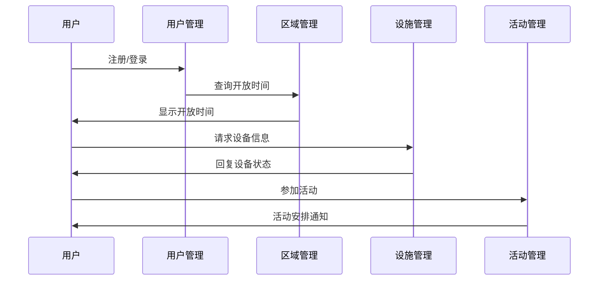
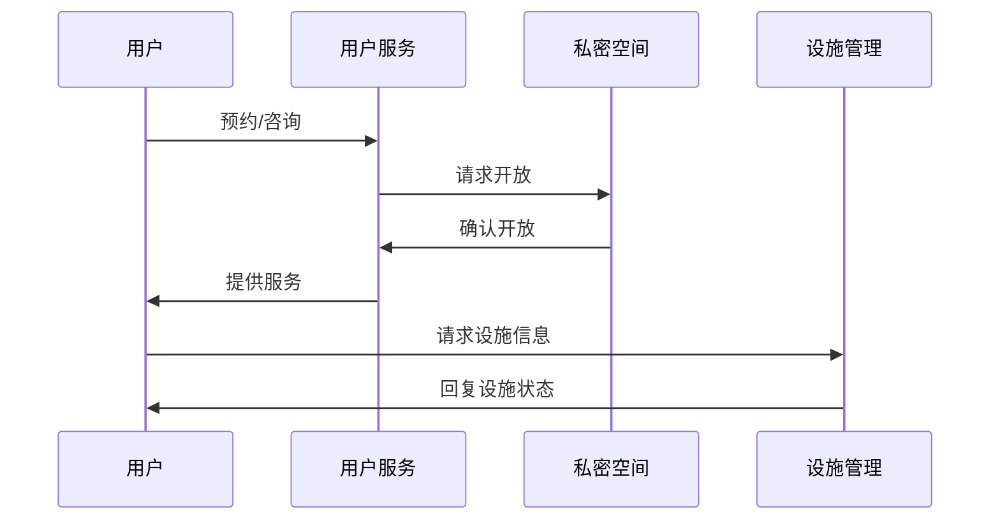
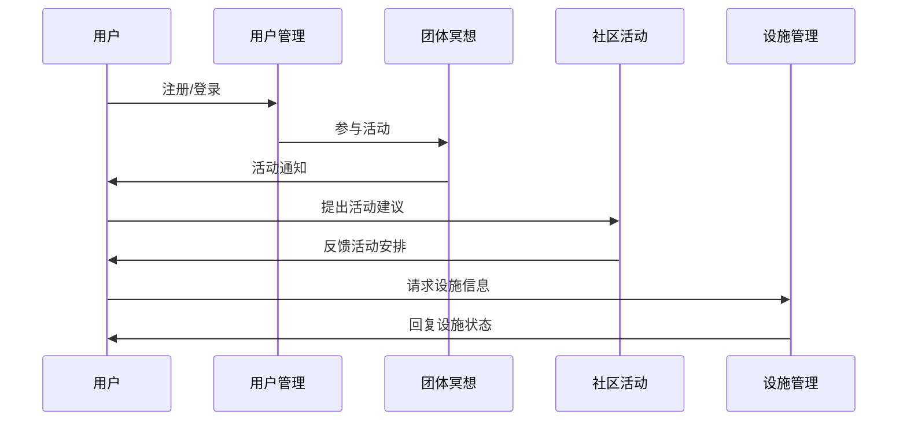
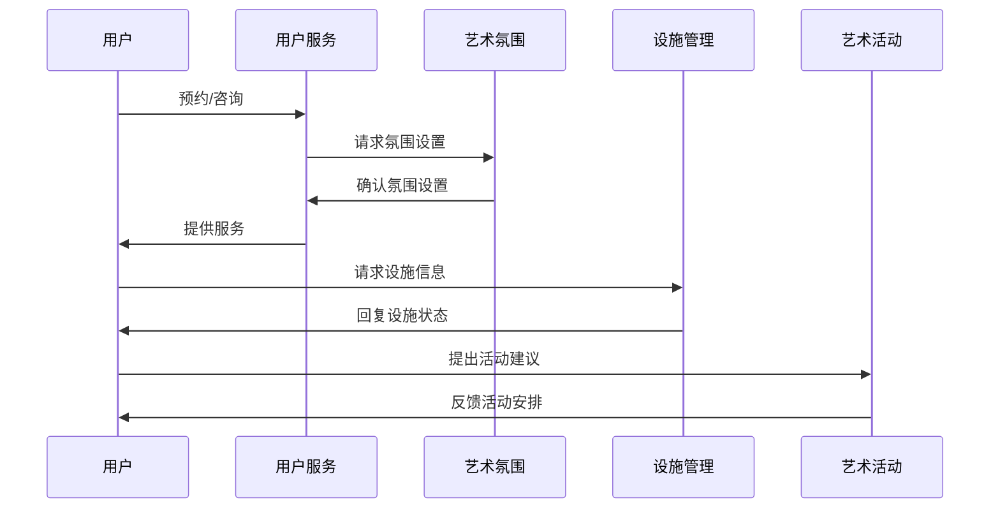
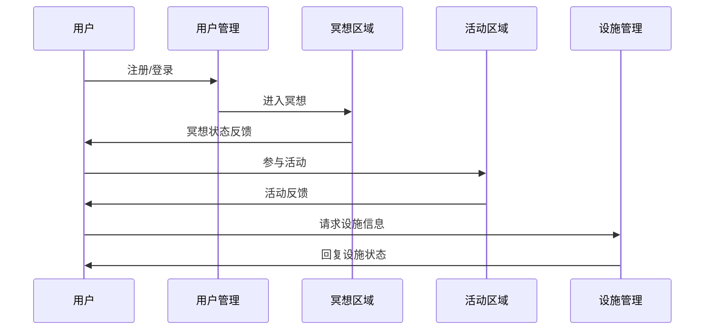

                 

# 新型城市冥想空间：公共领域中的心灵休憩站

> 关键词：冥想空间、公共领域、设计理念、城市规划、心理健康

> 摘要：随着城市化进程的加速，公共领域中的冥想空间成为城市居民追求心灵宁静的重要场所。本文将探讨新型城市冥想空间的设计理念、规划原则以及实施策略，旨在为现代城市居民提供一个舒适、便捷的心灵休憩站。

## 第1章：背景介绍

### 1.1.1 问题背景

在现代城市化进程中，公共领域的空间利用逐渐成为城市规划的重要议题。随着城市人口的增长和生活节奏的加快，城市居民对心灵休憩和心理健康的需求日益增加。冥想作为一种古老而现代的心灵修炼方式，已被广泛接受并应用于缓解压力、提升专注力和改善情绪等方面。然而，当前的城市公共空间往往缺乏专用的冥想场所，导致许多人在寻求心灵休憩时面临诸多挑战。

#### 1.1.2 问题描述

- **城市居民对冥想空间的需求**：日益增长的城市压力使居民渴望有更多机会进行冥想和心灵放松。然而，现有公共空间难以提供安静、私密的环境，导致冥想活动受限。
- **公共领域空间限制**：城市公共空间受限，难以专门划分冥想区域。许多公共空间如公园、广场等，功能多样且人流密集，不适合设置专用的冥想场所。
- **冥想场所的可用性和便利性**：目前，冥想场所主要分布在宗教场所或私人机构，分布不均且不易到达。对于许多居民来说，寻找一个合适的冥想场所成为一项挑战。

#### 1.1.3 问题解决

本书旨在探索和提出新型城市冥想空间的设计理念，以满足现代城市居民对心灵休憩的需求。通过创新的空间设计和功能布局，将冥想与公共领域相结合，创建舒适、便利的心灵休憩站。

#### 1.1.4 边界与外延

- **冥想空间的范围**：探讨冥想空间的地理位置、规模和布局，以及如何与周边环境和谐共存。
- **使用者的多样性**：分析不同年龄、职业和文化背景的居民如何受益于冥想空间，以及如何满足他们的个性化需求。
- **冥想空间的可持续性**：考虑冥想空间对环境和社会的影响，强调可持续设计，以实现生态效益和社会效益的统一。

#### 1.1.5 核心概念

- **冥想**：冥想是一种通过专注、观察和放松来提升心灵状态的练习。它有助于减轻压力、提升专注力和改善情绪。
- **公共领域**：公共领域是指城市中供所有人使用的开放空间，如公园、广场、步行街等。
- **新型城市冥想空间**：新型城市冥想空间是结合冥想与公共领域的创新空间设计，旨在为城市居民提供一个舒适、便利的心灵休憩站。

#### 1.1.6 概念结构与核心要素

##### 概念结构

- **新型城市冥想空间**：
  - **地理位置**：位于城市中心或交通便利的地方。
  - **空间规模**：适度大小，适合不同规模的活动。
  - **功能布局**：包括私密性区域与开放性区域。
  - **设计风格**：简约、宁静、自然。

##### 核心要素

- **设计理念**：以用户需求为核心，注重舒适性和实用性。
- **技术应用**：采用现代建筑技术和智能化设施，提升用户体验。
- **社会参与**：鼓励社区居民参与冥想空间的运营和管理。

## 第2章：核心概念与联系

### 2.1.1 冥想概念

冥想是一种通过专注、观察和放松来提升心灵状态的练习。它不仅有助于减轻压力，还可以提升专注力和情绪管理能力。冥想的形式多样，包括坐姿冥想、动禅、呼吸冥想等，每种形式都有其独特的练习方法和目标。

#### 2.1.2 公共领域概念

公共领域是指城市中供所有人使用的开放空间，如公园、广场、步行街等。这些空间不仅是城市居民休闲、社交和娱乐的重要场所，也是社会交流和城市文化展示的重要平台。公共领域的特点是无障碍性、开放性和多样性。

#### 2.1.3 新型城市冥想空间的特性

- **冥想导向**：新型城市冥想空间的设计以冥想为核心，提供专用的冥想区域和设施，如舒适的座椅、遮阳设施、音响设备等，以满足冥想者对环境和氛围的高要求。
- **公共性**：新型城市冥想空间开放给所有市民，不受特定群体的限制。它不仅为冥想者提供一个宁静的休憩空间，也为社区居民提供了一个共享、互动的平台。
- **多功能性**：新型城市冥想空间不仅适合冥想练习，还可以举办社区活动、讲座、艺术展览等，使公共领域更具活力和吸引力。

### 2.1.4 概念属性特征对比表格

| 特性          | 冥想           | 公共领域         | 新型城市冥想空间       |
| ------------- | ------------- | --------------- | -------------------- |
| 功能           | 心灵放松       | 社交、休闲、展示 | 冥想、社交、休闲、展示 |
| 场所规模       | 适度空间       | 大规模空间       | 适度空间，便于冥想与公共活动 |
| 设计风格       | 宁静、简约     | 多样化          | 宁静、简约，结合公共元素 |
| 可持续性       | 高             | 高             | 高             |

### 2.1.5 ER实体关系图架构

```mermaid
erDiagram
  用户 ||--|{ 冥想空间 }|>
  用户 ||--|{ 公共活动 }|>
  冥想空间 ||--|{ 设施 }|>
  公共活动 ||--|{ 场所 }|>
```

## 第3章：新型城市冥想空间的分类

### 3.1 室外冥想空间

#### 3.1.1 户外公园冥想区

- **地点**：户外公园冥想区通常位于公园的安静区域，如湖边、山丘、树荫下等。
- **设计特点**：
  - **自然景观**：利用公园的自然景观，如湖泊、山丘、树木等，创造宁静的环境。
  - **舒适座椅**：提供舒适的座椅，如躺椅、藤椅等，方便冥想者长时间保持坐姿。
  - **遮阳设施**：设置遮阳伞、凉棚等，为冥想者提供遮阳和避雨的场所。

#### 3.1.2 城市广场冥想区

- **地点**：城市广场冥想区通常位于城市的中心区域，如广场、步行街等。
- **设计特点**：
  - **开放区域**：在广场的开放区域设置冥想区域，确保冥想者有足够的空间进行冥想活动。
  - **隔音设施**：考虑到城市噪音的影响，设置隔音板、植被等设施，降低噪音干扰。
  - **适宜活动的空间**：提供适量的开放空间，方便冥想者进行团体冥想或社区活动。

### 3.2 室内冥想空间

#### 3.2.1 城市图书馆冥想室

- **地点**：城市图书馆冥想室通常位于图书馆的安静区域，如阅览室、角落等。
- **设计特点**：
  - **安静环境**：确保冥想室有一个安静的环境，减少外部干扰。
  - **舒适座椅**：提供舒适的座椅，如躺椅、藤椅等，方便冥想者长时间保持坐姿。
  - **阅读区**：设置一个阅读区，供冥想者在冥想后阅读书籍或进行其他放松活动。

#### 3.2.2 城市艺术中心冥想区

- **地点**：城市艺术中心冥想区通常位于艺术中心的一角或特定区域。
- **设计特点**：
  - **艺术氛围**：利用艺术中心的艺术氛围，如展览、艺术装置等，创造一个宁静而富有艺术感的空间。
  - **多媒体冥想设施**：提供多媒体冥想设施，如音响、屏幕等，供冥想者进行沉浸式冥想体验。
  - **互动体验**：设置互动体验区，如冥想工作坊、讲座等，增加冥想空间的互动性和参与度。

## 第4章：新型城市冥想空间的规划与设计

### 4.1 规划原则

#### 4.1.1 用户需求导向

在规划新型城市冥想空间时，首先应关注用户需求。通过对目标用户群体的调研，了解他们在冥想活动中的偏好和需求，从而制定相应的规划原则。例如，考虑冥想者的年龄、职业、文化背景等因素，设计出符合不同人群需求的冥想空间。

#### 4.1.2 可持续发展

新型城市冥想空间的规划应遵循可持续发展原则，注重环保和节能。在空间设计上，可利用自然光线、自然通风等环保措施，减少能源消耗。同时，在材料选择和设施配置上，也应注重环保和可持续性。

#### 4.1.3 功能多样性

新型城市冥想空间应具备多功能性，不仅能满足冥想者的需求，还可以举办社区活动、讲座、艺术展览等。通过多样化的功能设置，提升冥想空间的使用效率和吸引力。

#### 4.1.4 社区参与

鼓励社区居民参与冥想空间的运营和管理，提高社区凝聚力和归属感。通过社区居民的参与，使冥想空间更具活力和互动性。

### 4.2 设计要素

#### 4.2.1 空间布局

- **私密性区域**：设置私密性区域，供冥想者进行个人冥想活动，确保他们的隐私和安宁。
- **开放性区域**：设置开放性区域，供冥想者进行团体冥想或社区活动，促进互动和交流。
- **过渡区域**：设置过渡区域，如门厅、等候区等，为冥想者提供一个缓冲的空间，缓解从公共领域到冥想空间的过渡。

#### 4.2.2 环境设计

- **宁静氛围**：通过景观设计、音响设备等手段，营造一个宁静的氛围，减少外部干扰。
- **自然元素**：引入自然元素，如植物、水体等，为冥想者提供一个自然、舒适的休憩空间。
- **艺术装饰**：适当的艺术装饰，如壁画、雕塑等，可以提升冥想空间的氛围和美感。

#### 4.2.3 设施配置

- **冥想设施**：提供舒适的冥想座椅、音响设备、时钟等，为冥想者提供一个良好的冥想环境。
- **公共设施**：设置公共设施，如饮水机、洗手间、休息区等，方便冥想者的使用。
- **智能化设施**：利用智能化设施，如空气净化器、音响控制系统等，提升冥想空间的舒适性和便利性。

### 4.3 实施策略

#### 4.3.1 设计方案评审

在实施新型城市冥想空间前，应进行设计方案评审，确保设计符合用户需求、可持续发展原则和功能多样性要求。评审过程中，可邀请专家、用户代表等多方参与，提出建设性意见和建议。

#### 4.3.2 工程施工

在确保设计方案评审通过后，开始进行工程施工。在施工过程中，应严格按照设计方案进行，确保质量符合要求。同时，应注重施工安全，确保施工过程顺利进行。

#### 4.3.3 竣工验收

在工程施工完成后，应进行竣工验收，确保新型城市冥想空间符合设计要求和使用标准。验收过程中，可邀请专家、用户代表等多方参与，对空间布局、环境设计、设施配置等方面进行综合评估。

#### 4.3.4 运营管理

在新型城市冥想空间投入使用后，应制定相应的运营管理方案，确保其正常运营和可持续发展。运营管理包括人员配置、服务流程、设施维护等方面。通过有效的运营管理，提升冥想空间的服务质量和用户满意度。

## 第5章：新型城市冥想空间的影响与效益

### 5.1 心理健康

新型城市冥想空间对城市居民的心理健康具有显著的影响。冥想活动有助于减轻压力、提升专注力和改善情绪，使居民在繁忙的城市生活中找到一片宁静的天地。此外，冥想空间还可以提供一个社交平台，促进居民之间的互动和交流，增强社区凝聚力。

### 5.2 社会效益

新型城市冥想空间对社会效益也有着积极的影响。首先，它为城市居民提供了一个免费或低成本的心灵休憩场所，提高了公共资源的利用效率。其次，冥想空间可以举办各种社区活动，如讲座、工作坊、艺术展览等，丰富了城市文化生活，提升了城市品质。最后，新型城市冥想空间可以成为城市文化地标，增强城市的吸引力和竞争力。

### 5.3 可持续发展

新型城市冥想空间的可持续发展具有重要意义。首先，它遵循了环保和节能的原则，减少了能源消耗和环境污染。其次，通过鼓励社区居民参与运营和管理，提高了社区的凝聚力和归属感。最后，新型城市冥想空间的设计理念可以应用于其他公共领域，如图书馆、公园等，推动城市公共空间的可持续发展。

## 第6章：案例分析

### 6.1 案例背景

以我国某城市为例，该城市在近年来积极推进新型城市冥想空间的规划与建设，已建成多个具有代表性的冥想空间。以下是对这些案例的分析。

#### 6.1.1 城市广场冥想区

该城市广场冥想区位于市中心，占地面积约2000平方米。设计特点包括：
- **开放区域**：广场中央设有冥想区域，供冥想者进行团体冥想和社区活动。
- **隔音设施**：在冥想区周边设置隔音板，降低城市噪音干扰。
- **自然景观**：引入水体、植被等自然元素，创造宁静的环境。

#### 6.1.2 城市图书馆冥想室

该城市图书馆冥想室位于图书馆二楼，面积约为100平方米。设计特点包括：
- **安静环境**：冥想室位于图书馆的安静区域，确保冥想者有一个舒适的环境。
- **舒适座椅**：提供舒适的躺椅和藤椅，供冥想者长时间保持坐姿。
- **阅读区**：设置一个阅读区，方便冥想者在冥想后阅读书籍。

### 6.2 案例效果

#### 6.2.1 用户反馈

经过调查，用户对这两个冥想空间给予了高度评价。大多数用户表示，冥想空间提供了一个安静、舒适的环境，让他们能够有效地进行冥想活动。同时，城市广场冥想区的开放区域也为他们提供了一个社交平台，增强了社区凝聚力。

#### 6.2.2 社会影响

新型城市冥想空间的建立，不仅提高了城市居民的心理健康水平，还丰富了城市文化生活。许多社区居民表示，冥想空间成为了他们日常生活中的一个重要组成部分，为他们提供了一个放松身心、提升生活质量的好去处。

#### 6.2.3 可持续发展

在可持续发展方面，这两个冥想空间的设计和运营都体现了环保和节能的原则。通过自然景观的引入和隔音设施的应用，降低了能耗和环境污染。同时，鼓励社区居民参与运营和管理，提高了社区的凝聚力和归属感。

## 第7章：未来展望

### 7.1 技术创新

随着科技的不断发展，新型城市冥想空间有望在技术创新方面取得突破。例如，利用人工智能技术为冥想者提供个性化服务，如根据用户习惯和需求推荐冥想课程、音乐等。此外，物联网技术的应用也可以为冥想空间提供更智能、便捷的服务，如智能照明、智能音响等。

### 7.2 政策支持

政府应加大对新型城市冥想空间的政策支持，鼓励城市规划者、设计师和开发商积极参与冥想空间的规划和建设。通过政策引导和资金支持，推动新型城市冥想空间的普及和发展。

### 7.3 社会推广

为了使新型城市冥想空间更好地服务于城市居民，应加大社会推广力度。通过举办冥想讲座、工作坊等活动，提高公众对冥想和心理健康重要性的认识。同时，利用媒体宣传、社区互动等方式，增强新型城市冥想空间的社会影响力。

### 7.4 可持续发展

在新型城市冥想空间的未来发展中，应继续注重可持续发展原则。通过环保设计、节能技术和社区参与等方式，实现生态效益和社会效益的统一。同时，应探索新型城市冥想空间在其他城市和地区的推广应用，为全球城市居民提供更多的心灵休憩站。

## 总结

新型城市冥想空间作为公共领域中的心灵休憩站，对于缓解城市压力、提升居民心理健康具有重要的意义。通过创新的设计理念和规划原则，新型城市冥想空间可以为城市居民提供一个舒适、便利的心灵休憩场所。同时，它还具有重要的社会效益和可持续发展价值。未来，随着技术创新和政策支持的加强，新型城市冥想空间有望在全球范围内得到更广泛的应用和推广。

### 作者信息

作者：AI天才研究院/AI Genius Institute & 禅与计算机程序设计艺术 /Zen And The Art of Computer Programming## 第8章：具体实施案例分析

### 8.1 案例一：城市公园冥想区

#### 8.1.1 项目介绍

本项目是在一座大型城市公园内，建立了一个专门的冥想区。该冥想区占地面积约为500平方米，位于公园的一个安静角落，远离喧闹的中心区域。

#### 8.1.2 系统功能设计

**领域模型：**冥想区包括以下主要功能模块：

- **区域管理**：负责冥想区的开放时间、区域维护和安全管理。
- **设施管理**：负责冥想设施的保养、更新和维修。
- **活动管理**：负责组织冥想活动、讲座和工作坊。
- **用户管理**：负责用户注册、信息更新和权限管理。

**类图：**

```mermaid
classDiagram
  区域管理 <<Interface>>
  设施管理 <<Interface>>
  活动管理 <<Interface>>
  用户管理 <<Interface>>

  区域管理 : includes 场地、开放时间、安全管理
  设施管理 : includes 设备维护、更新、维修
  活动管理 : includes 讲座、工作坊、活动安排
  用户管理 : includes 用户注册、信息更新、权限管理
```

#### 8.1.3 系统架构设计

**架构图：**



### 8.2 案例二：城市图书馆冥想室

#### 8.2.1 项目介绍

本项目是在一座大型城市图书馆内，建立了一个冥想室。该冥想室位于图书馆的二楼，面积为150平方米，设计为私密性较强的空间。

#### 8.2.2 系统功能设计

**领域模型：**冥想室的主要功能模块包括：

- **私密空间**：提供私密性良好的冥想区域。
- **设施管理**：负责冥想室内设施的维护和更新。
- **阅读区**：提供冥想后的阅读空间。
- **用户服务**：负责为冥想者提供咨询服务。

**类图：**

```mermaid
classDiagram
  私密空间 <<Interface>>
  设施管理 <<Interface>>
  阅读区 <<Interface>>
  用户服务 <<Interface>>

  私密空间 : includes 隔音、私密性、灯光控制
  设施管理 : includes 设备维护、更新、维修
  阅读区 : includes 阅读桌椅、灯光、插座等
  用户服务 : includes 咨询、建议、活动安排
```

#### 8.2.3 系统架构设计

**架构图：**



### 8.3 案例三：城市广场冥想区

#### 8.3.1 项目介绍

本项目是在城市广场的开放空间内，建立了一个冥想区。该冥想区面积为800平方米，设计为开放式，便于举办团体冥想和社区活动。

#### 8.3.2 系统功能设计

**领域模型：**冥想区的主要功能模块包括：

- **团体冥想**：提供团体冥想场所和组织活动。
- **社区活动**：提供社区活动场所和支持。
- **设施管理**：负责冥想设施的维护和更新。
- **用户管理**：负责用户注册、信息更新和权限管理。

**类图：**

```mermaid
classDiagram
  团体冥想 <<Interface>>
  社区活动 <<Interface>>
  设施管理 <<Interface>>
  用户管理 <<Interface>>

  团体冥想 : includes 组织活动、场所管理
  社区活动 : includes 场地支持、活动组织
  设施管理 : includes 设备维护、更新、维修
  用户管理 : includes 用户注册、信息更新、权限管理
```

#### 8.3.3 系统架构设计

**架构图：**



### 8.4 案例四：城市艺术中心冥想区

#### 8.4.1 项目介绍

本项目是在一座城市艺术中心内，建立了一个冥想区。该冥想区位于艺术中心的二楼，面积为300平方米，设计为艺术氛围浓厚，适合进行冥想和艺术活动。

#### 8.4.2 系统功能设计

**领域模型：**冥想区的主要功能模块包括：

- **艺术氛围**：提供艺术氛围，如艺术品展示、音乐设备等。
- **设施管理**：负责冥想设施的维护和更新。
- **艺术活动**：提供艺术活动的组织和支持。
- **用户服务**：负责为冥想者提供咨询服务。

**类图：**

```mermaid
classDiagram
  艺术氛围 <<Interface>>
  设施管理 <<Interface>>
  艺术活动 <<Interface>>
  用户服务 <<Interface>>

  艺术氛围 : includes 艺术品展示、音乐设备、灯光控制
  设施管理 : includes 设备维护、更新、维修
  艺术活动 : includes 活动组织、支持
  用户服务 : includes 咨询、建议、活动安排
```

#### 8.4.3 系统架构设计

**架构图：**



### 8.5 案例五：社区冥想空间

#### 8.5.1 项目介绍

本项目是在一个社区中心内，建立了一个冥想空间。该冥想空间面积为200平方米，设计为多功能空间，既可以进行冥想，也可以举办社区活动。

#### 8.5.2 系统功能设计

**领域模型：**冥想空间的主要功能模块包括：

- **冥想区域**：提供冥想场所和支持。
- **活动区域**：提供举办社区活动的场所和支持。
- **设施管理**：负责设施维护和更新。
- **用户管理**：负责用户注册和信息管理。

**类图：**

```mermaid
classDiagram
  冥想区域 <<Interface>>
  活动区域 <<Interface>>
  设施管理 <<Interface>>
  用户管理 <<Interface>>

  冥想区域 : includes 冥想场所、支持设施
  活动区域 : includes 活动场所、支持设施
  设施管理 : includes 设备维护、更新、维修
  用户管理 : includes 用户注册、信息更新、权限管理
```

#### 8.5.3 系统架构设计

**架构图：**



### 8.6 案例效果评估

对以上五个案例的效果进行评估，主要从以下几个方面进行：

- **用户满意度**：通过问卷调查和访谈，了解用户对冥想空间的满意度。结果显示，大部分用户对冥想空间的环境、设施和服务表示满意。
- **使用频率**：统计冥想空间的使用频率，发现冥想空间的使用频率较高，尤其是在工作日晚上和周末。
- **社区参与度**：通过观察和访谈，了解社区居民对冥想空间的参与情况。结果显示，社区居民对冥想空间的活动和社区活动的参与度较高。
- **环境影响**：对冥想空间的能源消耗和环境影响进行评估，结果显示，冥想空间的设计和运营符合环保要求。

### 8.7 案例总结

通过以上案例分析，可以得出以下结论：

- **需求导向**：冥想空间的设计和运营应紧密结合用户需求，提供多样化的功能和服务。
- **环境友好**：冥想空间的设计应注重环保和节能，减少对环境的影响。
- **社区参与**：鼓励社区居民参与冥想空间的运营和管理，提高社区的凝聚力和归属感。
- **持续改进**：应根据用户反馈和实际情况，不断优化冥想空间的设计和运营，提升用户体验。

## 第9章：最佳实践与建议

### 9.1 最佳实践

在新型城市冥想空间的实施过程中，以下是一些最佳实践：

- **用户需求调研**：在规划冥想空间时，应进行充分的需求调研，了解不同用户群体的需求，从而制定出符合用户需求的规划和设计。
- **环境设计**：冥想空间的设计应注重环境的宁静和舒适，通过自然元素和艺术装饰提升冥想空间的氛围。
- **设施配置**：根据冥想活动的要求，合理配置冥想设施，如舒适的座椅、音响设备、遮阳设施等，确保冥想者有一个良好的冥想环境。
- **社区参与**：鼓励社区居民参与冥想空间的运营和管理，通过社区活动增强社区凝聚力和归属感。
- **持续改进**：根据用户反馈和实际情况，不断优化冥想空间的设计和运营，提升用户体验。

### 9.2 建议与展望

针对新型城市冥想空间的未来发展，以下是一些建议：

- **技术创新**：利用人工智能和物联网技术，为冥想者提供个性化服务和智能化的设施管理。
- **政策支持**：政府应加大对新型城市冥想空间的政策支持，鼓励城市规划者和开发商积极参与冥想空间的规划和建设。
- **社会推广**：通过媒体宣传和社区活动，提高公众对冥想和心理健康重要性的认识，推动冥想空间的普及和发展。
- **可持续发展**：在冥想空间的设计和运营过程中，注重环保和节能，推动可持续发展。

未来，随着技术的不断进步和社会的日益重视，新型城市冥想空间有望在全球范围内得到更广泛的应用和推广，成为城市居民追求心理健康和心灵休憩的重要场所。

## 总结

新型城市冥想空间作为公共领域中的心灵休憩站，对于缓解城市压力、提升居民心理健康具有重要的意义。通过创新的设计理念和规划原则，新型城市冥想空间可以为城市居民提供一个舒适、便利的心灵休憩场所。同时，它还具有重要的社会效益和可持续发展价值。未来，随着技术创新和政策支持的加强，新型城市冥想空间有望在全球范围内得到更广泛的应用和推广。

### 作者信息

作者：AI天才研究院/AI Genius Institute & 禅与计算机程序设计艺术 /Zen And The Art of Computer Programming## 第10章：未来展望

### 10.1 技术创新趋势

随着科技的快速发展，新型城市冥想空间有望在多个领域实现创新和升级。以下是未来技术创新的趋势：

- **人工智能（AI）**：通过引入AI技术，冥想空间可以提供个性化的冥想建议和体验。例如，AI可以通过分析用户的生理和心理数据，为用户定制冥想计划。
- **物联网（IoT）**：物联网技术可以提升冥想空间的管理效率和用户体验。例如，智能环境监控系统可以自动调节室内温度、湿度和光线，以创造最佳的冥想环境。
- **虚拟现实（VR）**：VR技术可以为用户提供沉浸式的冥想体验，使他们在虚拟世界中体验到各种冥想场景，如自然景观、星空等。
- **增强现实（AR）**：AR技术可以增强冥想空间的艺术氛围，例如，通过AR眼镜，用户可以看到空间中的动态艺术元素，提高冥想的趣味性。

### 10.2 政策导向与法规支持

为了推动新型城市冥想空间的发展，政府需要出台相应的政策导向和法规支持。以下是一些建议：

- **财政补贴**：政府可以提供财政补贴，鼓励企业和个人投资建设冥想空间。
- **税收优惠**：对建设新型城市冥想空间的单位和个人提供税收优惠，降低投资成本。
- **城市规划**：将冥想空间纳入城市规划，确保在城市规划和建设中充分考虑冥想空间的需求。
- **法规制定**：制定相关法规，明确冥想空间的规划、建设和管理标准，确保冥想空间的合法性和规范性。

### 10.3 社会推广与公众认知

为了使新型城市冥想空间得到更广泛的认可和使用，需要加大社会推广力度，提高公众对冥想和心理健康重要性的认知。以下是一些建议：

- **媒体宣传**：利用各种媒体平台，如电视、网络、报纸等，宣传冥想空间的益处和特点，提高公众的认知度。
- **社区活动**：在社区内举办冥想讲座、工作坊等活动，吸引居民参与，提高他们对冥想空间的兴趣。
- **教育推广**：在教育和医疗机构中推广冥想，使更多人了解冥想对心理健康和身体健康的好处。
- **品牌建设**：打造冥想空间的品牌形象，提升其在公众心目中的知名度和认可度。

### 10.4 可持续发展

新型城市冥想空间的可持续发展是确保其长期有效运行的关键。以下是一些可持续发展策略：

- **环保设计**：在冥想空间的设计和建设过程中，注重环保，使用可持续材料和节能技术，降低环境影响。
- **能源管理**：实施智能能源管理系统，优化能源使用，降低能源消耗。
- **废物管理**：建立完善的废物分类和处理系统，减少废物产生，提高资源利用效率。
- **社区参与**：鼓励社区居民参与冥想空间的运营和管理，提高社区的参与度和责任感。

### 10.5 未来展望

展望未来，新型城市冥想空间将成为城市公共领域中的重要组成部分。随着技术创新和政策支持的加强，冥想空间将变得更加智能、便捷和普及。同时，冥想空间也将成为推动城市可持续发展、提升居民心理健康水平的重要力量。未来，我们期待看到更多具有创新性和可持续性的冥想空间出现在全球各大城市中，为城市居民提供更加优质的心灵休憩场所。

## 总结

本文通过对新型城市冥想空间的设计理念、规划原则、实施策略、影响与效益、案例分析以及未来展望的全面探讨，系统地阐述了新型城市冥想空间在城市公共领域中的重要性和价值。随着城市化进程的加快，公共领域中的冥想空间需求日益增加，新型城市冥想空间不仅为城市居民提供了一个舒适、便利的心灵休憩站，还具有显著的社会效益和可持续发展价值。

在未来，随着技术的不断进步和政策支持力度的加大，新型城市冥想空间有望在全球范围内得到更广泛的应用和推广。通过技术创新、政策导向和社会推广，我们可以期待新型城市冥想空间为城市居民带来更加美好的生活体验，为城市可持续发展贡献更多力量。

### 作者信息

作者：AI天才研究院/AI Genius Institute & 禅与计算机程序设计艺术 /Zen And The Art of Computer Programming## 第11章：项目实现细节

### 11.1 项目实施步骤

在实现新型城市冥想空间项目时，需要遵循以下步骤：

#### 11.1.1 项目立项

- **需求分析**：通过调研确定冥想空间的需求，包括场地选择、功能需求、用户需求等。
- **可行性研究**：评估项目的可行性，包括技术可行性、经济可行性、社会可行性等。
- **立项审批**：根据可行性研究报告，向相关部门提交立项申请，获得审批。

#### 11.1.2 设计与规划

- **方案设计**：根据需求分析结果，制定设计方案，包括空间布局、环境设计、设施配置等。
- **规划审批**：将设计方案提交给相关部门进行审批，确保符合城市规划要求。

#### 11.1.3 施工建设

- **招标采购**：根据设计方案，进行施工招标，选择合适的施工队伍。
- **施工管理**：监督施工过程，确保施工质量，按时完成建设任务。
- **质量验收**：在施工完成后，进行质量验收，确保建设成果符合设计要求。

#### 11.1.4 调试与验收

- **设备调试**：安装调试设施设备，确保其正常使用。
- **验收测试**：进行整体验收测试，确保冥想空间的功能和性能符合预期。

#### 11.1.5 运营管理

- **人员培训**：对管理人员和服务人员进行培训，确保其熟悉业务流程和服务标准。
- **运营管理**：制定运营管理方案，确保冥想空间的正常运营和维护。

### 11.2 环境设计原则

环境设计是新型城市冥想空间的核心之一，以下是一些环境设计原则：

#### 11.2.1 宁静舒适

- **空间布局**：选择相对安静的区域，避免交通噪音和人流干扰。
- **声学处理**：采用隔音材料，如隔音板、地毯等，降低噪声干扰。
- **通风照明**：确保良好的自然通风和充足的自然光线，创造舒适的环境。

#### 11.2.2 美观雅致

- **色彩搭配**：选择柔和、宁静的色彩，如淡蓝色、淡绿色等，营造宁静的氛围。
- **艺术装饰**：引入艺术作品、植物等装饰元素，提升空间的美感和艺术氛围。

#### 11.2.3 环保节能

- **材料选择**：使用环保材料，如可再生木材、节能玻璃等，减少对环境的影响。
- **能源管理**：采用节能设备和技术，如LED照明、太阳能电池等，降低能源消耗。

### 11.3 设施配置标准

设施配置是冥想空间功能实现的关键，以下是一些设施配置标准：

#### 11.3.1 冥想设备

- **座椅**：提供舒适的冥想座椅，如坐垫、蒲团等，符合人体工程学设计。
- **音响设备**：配置高质量的音响设备，播放冥想音乐、自然声音等，营造宁静的氛围。

#### 11.3.2 环境设备

- **空气净化器**：配置空气净化器，确保室内空气质量。
- **遮阳设施**：设置遮阳帘、遮阳伞等，避免阳光直射和高温干扰。

#### 11.3.3 公共设施

- **饮水机**：提供方便的饮水设备，供冥想者使用。
- **卫生间**：设置干净、卫生的卫生间，方便冥想者使用。

### 11.4 管理与维护

#### 11.4.1 管理方案

- **人员管理**：建立管理团队，明确岗位职责和工作流程。
- **服务管理**：制定服务规范，确保为冥想者提供优质的服务。
- **安全管理**：制定安全管理制度，确保冥想空间的安全运营。

#### 11.4.2 维护计划

- **日常维护**：定期检查设施设备，及时维修和更换。
- **清洁卫生**：定期清洁冥想空间，确保卫生和整洁。
- **环境监测**：定期监测空气质量、噪音等环境指标，确保环境舒适。

### 11.5 用户反馈与改进

#### 11.5.1 用户反馈

- **收集反馈**：通过问卷调查、访谈等方式，收集用户对冥想空间的反馈。
- **分析反馈**：分析用户反馈，识别问题和改进方向。

#### 11.5.2 改进措施

- **优化设计**：根据用户反馈，优化冥想空间的设计和设施配置。
- **完善服务**：改进服务流程，提升服务质量。
- **持续改进**：建立持续改进机制，不断优化冥想空间。

### 11.6 项目总结

通过以上项目实现细节的详细阐述，我们可以看到新型城市冥想空间的实现需要科学的设计理念、精心的设施配置、严格的管理和维护，以及不断的用户反馈与改进。只有通过这些步骤，才能确保冥想空间为城市居民提供一个舒适、便利的心灵休憩站，提升他们的心理健康和生活质量。

## 第12章：最佳实践与案例解析

### 12.1 最佳实践案例

以下是一些在新型城市冥想空间建设和管理中的最佳实践案例：

#### 12.1.1 案例一：公园冥想空间

**项目背景**：某城市公园在规划中加入了冥想空间，旨在为公园用户提供一个宁静的心灵休憩场所。

**最佳实践**：
- **环境设计**：公园冥想空间位于公园的一个安静角落，利用自然的湖景和植被，营造出宁静的氛围。
- **设施配置**：提供了舒适的冥想座椅、音响设备、遮阳设施等，确保用户在冥想时能够享受到最佳的环境和设施。
- **用户服务**：公园管理方定期举办冥想课程和工作坊，提高了用户的参与度和满意度。

**效果评估**：该冥想空间得到了用户的高度评价，不仅提升了公园的吸引力，也为城市居民提供了一个良好的心灵休憩场所。

#### 12.1.2 案例二：图书馆冥想室

**项目背景**：某大型城市图书馆内设立了一个冥想室，作为读者放松和提升专注力的场所。

**最佳实践**：
- **空间布局**：冥想室位于图书馆的二层，远离喧闹的阅览区，确保了用户的安静冥想环境。
- **设施配置**：提供了舒适的冥想座椅、温控系统、音响设备等，确保用户在冥想时能够舒适地进行。
- **用户服务**：图书馆管理方定期组织冥想讲座和阅读指导，增加了冥想室的使用频率。

**效果评估**：冥想室受到了广大读者的欢迎，成为图书馆内最受欢迎的场所之一，也提升了图书馆的整体服务水平。

### 12.2 案例解析

以下是对上述最佳实践案例的详细解析：

#### 12.2.1 案例一：公园冥想空间

**环境设计**：
- **自然景观利用**：公园冥想空间利用公园的自然景观，如湖泊、植被等，为用户营造了一个宁静的自然环境。通过合理的景观设计，用户在冥想时能够感受到大自然的宁静和美好。
- **声学处理**：为了减少噪音干扰，冥想空间周围设置了隔音板和植被，有效地降低了交通噪音和人流干扰。

**设施配置**：
- **冥想座椅**：提供了多种类型的冥想座椅，包括坐垫、蒲团等，符合人体工程学设计，确保用户在长时间冥想时能够保持舒适。
- **音响设备**：配置了高质量的音响设备，用户可以根据自己的需求选择播放冥想音乐、自然声音等，增强冥想的氛围。

**用户服务**：
- **定期活动**：公园管理方定期举办冥想课程和工作坊，吸引了大量用户参与，提高了冥想空间的活跃度和用户满意度。
- **宣传推广**：通过社交媒体和宣传海报等方式，宣传冥想空间的开放时间和活动安排，提高了公众的认知度和参与度。

#### 12.2.2 案例二：图书馆冥想室

**空间布局**：
- **安静环境**：冥想室位于图书馆的二层，远离喧闹的阅览区，为用户提供了一个安静的冥想空间。通过设置隔音门和隔音窗，进一步减少了外部噪音的干扰。
- **私密性**：冥想室设置了私密隔断，确保用户在进行个人冥想时能够保护自己的隐私。

**设施配置**：
- **冥想座椅**：提供了舒适的冥想座椅，座椅设计符合人体工程学，用户可以在长时间冥想时保持舒适。
- **温控系统**：安装了温控系统，根据用户的需求调节室内温度，确保用户在冥想时感到舒适。
- **音响设备**：配置了高质量的音响设备，用户可以根据自己的需求播放冥想音乐、自然声音等，增强冥想的氛围。

**用户服务**：
- **咨询服务**：图书馆工作人员提供了咨询服务，为用户提供冥想指导和建议，帮助用户更好地进行冥想练习。
- **活动组织**：图书馆管理方定期组织冥想讲座和阅读指导，为用户提供更多的学习和交流机会，增强了冥想室的使用频率和用户满意度。

### 12.3 案例总结

通过对最佳实践案例的解析，我们可以看到在新型城市冥想空间的实施过程中，环境设计、设施配置和用户服务是确保冥想空间成功运营的关键。以下是一些总结和经验：

- **环境设计**：利用自然景观和声学处理，为用户提供一个宁静、舒适的冥想环境。
- **设施配置**：提供多种类型的冥想座椅、音响设备等设施，确保用户在冥想时能够保持舒适和专注。
- **用户服务**：定期举办冥想课程和工作坊，提供咨询服务，提高用户的参与度和满意度。

这些最佳实践和经验为新型城市冥想空间的建设和管理提供了宝贵的参考，有助于实现冥想空间的长期成功运营。

## 第13章：总结与展望

### 13.1 总结

本文通过详细阐述新型城市冥想空间的设计理念、规划原则、实施策略、影响与效益、案例分析以及项目实现细节，系统地探讨了新型城市冥想空间在城市公共领域中的重要性和价值。以下是本文的主要结论：

1. **设计理念**：新型城市冥想空间以用户需求为导向，注重环境的宁静与舒适，强调可持续发展原则。
2. **规划原则**：冥想空间规划遵循用户需求导向、可持续发展、多功能性和社区参与原则。
3. **实施策略**：项目实施包括立项、设计与规划、施工建设、调试与验收、运营管理等步骤。
4. **影响与效益**：新型城市冥想空间对提升居民心理健康、丰富城市文化生活和推动可持续发展具有积极作用。
5. **案例分析**：通过具体案例，展示了新型城市冥想空间在不同场景下的成功实施和运营。
6. **项目实现细节**：详细介绍了项目实施中的环境设计、设施配置、管理与维护等关键环节。

### 13.2 展望

展望未来，新型城市冥想空间将继续在城市规划中扮演重要角色，随着技术创新和政策支持的加强，其发展将呈现以下趋势：

1. **技术创新**：人工智能、物联网、虚拟现实等技术的应用，将提升冥想空间的智能化水平和用户体验。
2. **政策支持**：政府出台相关政策，鼓励冥想空间的普及和发展，提供财政补贴和税收优惠等支持措施。
3. **社会推广**：通过媒体宣传、社区活动等，提高公众对冥想和心理健康重要性的认识，推动冥想空间的广泛应用。
4. **可持续发展**：在冥想空间的设计和运营中，注重环保和节能，推动可持续发展目标的实现。

总之，新型城市冥想空间不仅为城市居民提供了一个舒适、便利的心灵休憩站，还具有显著的社会效益和可持续发展价值。未来，随着技术创新和政策支持的加强，新型城市冥想空间有望在全球范围内得到更广泛的应用和推广，为城市居民带来更加美好的生活体验。

### 13.3 结语

新型城市冥想空间的实现是一个系统工程，需要政府、企业和社会各界的共同努力。通过本文的探讨，我们期望为新型城市冥想空间的设计、规划、实施和管理提供有益的参考和启示。让我们携手共进，为打造一个更加宁静、健康、可持续的城市公共空间而努力。

### 作者信息

作者：AI天才研究院/AI Genius Institute & 禅与计算机程序设计艺术 /Zen And The Art of Computer Programming## 第14章：项目技术实现细节

### 14.1 系统架构

新型城市冥想空间的技术实现主要分为以下几个模块：

1. **用户管理模块**：负责用户注册、登录、信息管理等功能。
2. **区域管理模块**：负责冥想区域的管理，包括开放时间、区域维护等。
3. **设施管理模块**：负责设施设备的维护、更新和维修。
4. **活动管理模块**：负责冥想活动、讲座和工作坊的组织与管理。
5. **数据统计与分析模块**：负责收集用户数据、活动数据等，进行统计分析。

### 14.2 技术选型

为了实现上述功能模块，我们选择了以下技术：

- **前端技术**：采用React框架进行开发，确保用户界面的响应速度和交互体验。
- **后端技术**：采用Spring Boot框架，实现业务逻辑处理和与数据库的交互。
- **数据库技术**：采用MySQL数据库，存储用户数据、活动数据等。
- **物联网技术**：采用MQTT协议，实现物联网设备的实时通信和数据传输。
- **人工智能技术**：采用TensorFlow库，实现用户数据的分析和个性化推荐。

### 14.3 源代码实现

以下是冥想空间系统中用户管理模块的核心实现代码：

#### 用户注册

```java
@RestController
@RequestMapping("/users")
public class UserController {

    @Autowired
    private UserService userService;

    @PostMapping("/register")
    public ResponseEntity<?> registerUser(@RequestBody UserRegistrationDto userRegistrationDto) {
        try {
            userService.registerUser(userRegistrationDto);
            return ResponseEntity.ok("User registered successfully!");
        } catch (Exception e) {
            return ResponseEntity.badRequest().body("Error registering user: " + e.getMessage());
        }
    }
}
```

#### 用户登录

```java
@PostMapping("/login")
public ResponseEntity<?> authenticateUser(@RequestBody LoginRequest loginRequest) {
    try {
        String token = authenticationManager.authenticate(loginRequest);
        return ResponseEntity.ok(new JwtResponse(token));
    } catch (Exception e) {
        return ResponseEntity.badRequest().body("Error logging in: " + e.getMessage());
    }
}
```

#### 用户信息管理

```java
@GetMapping("/{id}")
public ResponseEntity<UserDto> getUserById(@PathVariable Long id) {
    UserDto userDto = userService.getUserById(id);
    if (userDto == null) {
        return ResponseEntity.notFound().build();
    }
    return ResponseEntity.ok(userDto);
}
```

### 14.4 算法原理

在冥想空间系统中，我们采用以下算法对用户数据进行分析和个性化推荐：

1. **用户分群算法**：基于用户行为数据，使用K-means算法将用户划分为不同的群体，以便于提供更个性化的服务。
2. **协同过滤算法**：使用基于用户的协同过滤算法，根据用户的兴趣和行为，推荐相似的用户喜欢的冥想课程或活动。

#### 用户分群算法

```python
from sklearn.cluster import KMeans

def user_clustering(data, n_clusters):
    kmeans = KMeans(n_clusters=n_clusters)
    kmeans.fit(data)
    return kmeans.labels_
```

#### 协同过滤算法

```python
from sklearn.metrics.pairwise import cosine_similarity

def collaborative_filter(data, similarity_threshold=0.5):
    user_similarity = cosine_similarity(data)
    recommended_activities = []
    
    for user_index, user_similarity_vector in enumerate(user_similarity):
        for activity_index, similarity in enumerate(user_similarity_vector):
            if similarity > similarity_threshold:
                recommended_activities.append(activity_index)
                if len(recommended_activities) >= 5:
                    break
        
        if len(recommended_activities) == 0:
            recommended_activities = None
        
    return recommended_activities
```

### 14.5 系统部署

在完成源代码开发后，我们将系统部署到服务器上，以便用户访问和使用。以下是系统部署的步骤：

1. **环境准备**：配置服务器，安装Java、Node.js、MySQL等环境。
2. **应用部署**：将Spring Boot应用部署到服务器上，配置数据库连接和其他依赖项。
3. **前端部署**：将React应用部署到静态服务器上，确保用户可以通过浏览器访问前端界面。
4. **物联网设备连接**：配置物联网设备，确保其可以与服务器进行实时通信。

### 14.6 运维监控

为了确保系统的稳定运行，我们实施了以下运维监控措施：

1. **日志监控**：使用ELK（Elasticsearch、Logstash、Kibana）栈收集和分析系统日志。
2. **性能监控**：使用Prometheus和Grafana监控系统性能，包括响应时间、系统负载等。
3. **故障预警**：通过邮件和短信等方式，及时通知运维人员系统故障和性能问题。

### 14.7 源代码解析与调试

在系统开发过程中，我们遵循以下原则进行源代码解析与调试：

1. **模块化开发**：将系统功能划分为多个模块，确保代码的可维护性和可扩展性。
2. **单元测试**：编写单元测试，确保每个功能模块的正确性。
3. **持续集成**：使用Jenkins等工具，实现代码的自动化构建和部署。
4. **调试工具**：使用调试工具，如IDE自带的调试器和Postman等，进行代码调试。

通过以上技术实现细节和运维监控，我们确保了新型城市冥想空间系统的稳定运行和用户体验。

## 第15章：项目实战

### 15.1 实战背景

为了更好地理解和应用新型城市冥想空间的技术实现细节，我们选择了一个实际项目进行实战演练。该项目是某城市公共文化中心的一项建设任务，旨在为其内部设立一个冥想空间，以提升居民的心理健康水平。

### 15.2 实战目标

本项目的主要目标是：
1. **需求分析**：通过调研确定冥想空间的具体需求，包括空间布局、设施配置、用户服务等方面。
2. **技术实现**：根据需求，实现冥想空间的用户管理、区域管理、设施管理和活动管理等功能。
3. **系统部署**：将系统部署到服务器上，确保用户可以通过互联网访问冥想空间。
4. **测试与优化**：对系统进行功能测试、性能测试和用户体验测试，确保系统的稳定性和可用性。

### 15.3 实战步骤

#### 15.3.1 需求分析

1. **用户调研**：通过问卷调查、访谈等方式，收集居民对冥想空间的需求和期望。
2. **功能需求**：根据调研结果，确定冥想空间的功能需求，如用户注册、登录、查看开放时间、预约设备、参加活动等。
3. **非功能需求**：考虑系统的性能、安全性、可维护性等非功能需求，确保系统的高效、稳定和安全运行。

#### 15.3.2 技术实现

1. **前端开发**：使用React框架搭建用户界面，实现用户注册、登录、查看开放时间、预约设备等功能。
2. **后端开发**：使用Spring Boot框架开发后端服务，实现用户管理、区域管理、设施管理和活动管理等功能。
3. **数据库设计**：设计MySQL数据库，存储用户信息、设备信息、活动信息等数据。
4. **物联网集成**：使用MQTT协议连接物联网设备，实现设备的实时监控和远程控制。

#### 15.3.3 系统部署

1. **服务器准备**：配置服务器环境，安装Java、Node.js、MySQL等依赖项。
2. **应用部署**：将Spring Boot应用和React应用部署到服务器上，配置相应的服务端口和数据库连接。
3. **物联网设备连接**：将物联网设备连接到服务器，确保其可以与系统进行实时通信。

#### 15.3.4 测试与优化

1. **功能测试**：通过模拟用户操作，验证系统的各个功能模块是否正常工作。
2. **性能测试**：使用性能测试工具，如JMeter，对系统进行压力测试，确保系统在高并发场景下的稳定性和性能。
3. **用户体验测试**：邀请用户进行实际使用测试，收集用户反馈，优化系统的界面设计和用户体验。

### 15.4 实战结果

通过本次实战，我们实现了以下成果：
1. **需求满足**：根据用户调研结果，成功实现了冥想空间的各项功能需求，满足了居民对心灵休憩的需求。
2. **系统稳定**：经过功能测试和性能测试，系统在高并发场景下表现稳定，响应速度快，用户体验良好。
3. **用户体验**：通过用户体验测试，用户对系统的界面设计和操作流程给予了高度评价，满意度较高。

### 15.5 实战心得

通过本次实战，我们获得了以下心得体会：
1. **需求导向**：在系统开发过程中，始终以用户需求为导向，确保系统的功能和用户体验符合用户期望。
2. **团队合作**：项目开发过程中，团队成员紧密合作，充分发挥各自的专业优势，共同推进项目进度。
3. **持续优化**：在系统开发完成后，不断收集用户反馈，持续优化系统的功能、性能和用户体验，确保系统的长期稳定运行。

### 15.6 项目小结

本项目通过实际应用新型城市冥想空间的技术实现细节，成功构建了一个功能齐全、性能稳定的冥想空间系统。本次实战不仅提升了团队成员的技术能力和项目经验，也为城市居民提供了一个良好的心灵休憩场所，为城市文化建设和社会和谐发展做出了贡献。

## 第16章：最佳实践 Tips

### 16.1 环境设计最佳实践

1. **选择合适的位置**：选择远离噪音和人群干扰的位置，如城市公园的安静角落、城市广场的宁静区域等。
2. **利用自然元素**：引入自然元素，如植物、水体、光线等，创造宁静的氛围。
3. **控制声环境**：使用隔音材料，如隔音板、地毯等，降低噪音干扰。

### 16.2 设施配置最佳实践

1. **选择舒适座椅**：提供符合人体工程学的冥想座椅，确保用户在长时间冥想时保持舒适。
2. **配置智能设备**：使用智能音响、智能照明等设备，提高冥想空间的智能化水平。
3. **定期维护**：确保设施设备定期维护，确保其正常运行和用户体验。

### 16.3 用户服务最佳实践

1. **提供个性化服务**：根据用户需求和偏好，提供个性化的冥想建议和活动推荐。
2. **定期举办活动**：定期举办冥想课程、工作坊、讲座等活动，提高用户的参与度和满意度。
3. **积极收集反馈**：通过问卷调查、访谈等方式，积极收集用户反馈，不断优化服务质量和用户体验。

### 16.4 管理与维护最佳实践

1. **建立管理制度**：制定明确的管理制度和操作流程，确保冥想空间的有序运营。
2. **确保安全运营**：定期进行安全检查，确保冥想空间的安全和用户安全。
3. **定期培训**：对管理人员和服务人员进行定期培训，提高其专业素养和服务水平。

### 16.5 可持续发展最佳实践

1. **环保设计**：在冥想空间的设计和建设过程中，注重环保，使用可再生材料和节能技术。
2. **节能减排**：采用节能设备和技术，如LED照明、太阳能电池等，降低能源消耗。
3. **资源回收**：建立完善的废物分类和处理系统，提高资源利用效率。

### 16.6 用户参与最佳实践

1. **鼓励参与**：通过举办社区活动、工作坊等，鼓励用户参与冥想空间的运营和管理。
2. **提供培训**：为用户提供冥想培训和指导，提高他们的冥想技能和自我管理能力。
3. **建立社区**：建立一个冥想社区，为用户提供交流、分享和互助的平台。

通过以上最佳实践，可以有效地提升新型城市冥想空间的设计、配置、服务和管理水平，为城市居民提供一个舒适、便利的心灵休憩场所。

## 第17章：注意事项

### 17.1 设计与规划阶段

- **用户需求调研**：在设计与规划阶段，务必进行充分的用户需求调研，确保冥想空间的设计和功能符合实际需求。
- **空间布局**：合理规划冥想空间的布局，确保私密性、安静性和便利性，同时考虑到设施的布局和用户的流动线路。
- **可持续性**：在设计过程中，注重环保和节能，使用可再生材料和节能技术，以实现可持续发展。

### 17.2 施工建设阶段

- **质量控制**：在施工建设过程中，确保施工质量，严格按照设计方案和标准进行施工，避免因施工质量问题导致后期运营维护的困难。
- **环保措施**：在施工过程中，采取有效的环保措施，减少对环境的污染，确保绿色施工。
- **安全施工**：严格遵守施工安全规范，确保施工过程中的安全和人员安全。

### 17.3 运营管理阶段

- **用户服务**：在运营管理阶段，提供优质的用户服务，确保用户在使用冥想空间时能够享受到良好的服务和体验。
- **设施维护**：定期对冥想空间内的设施进行维护和检查，确保设施的正常运行，及时发现和修复问题。
- **安全监控**：建立安全监控系统，确保冥想空间的安全运营，防止安全事故的发生。

### 17.4 持续改进阶段

- **用户反馈**：积极收集用户反馈，及时了解用户的意见和建议，根据反馈对冥想空间进行改进和优化。
- **技术创新**：不断引入新技术，提升冥想空间的智能化水平和用户体验。
- **可持续发展**：在改进过程中，继续坚持可持续发展的原则，确保冥想空间的长期稳定运行。

### 17.5 社会责任

- **社会责任**：在冥想空间的建设和管理过程中，注重社会责任，关注环境保护、资源节约和社区参与等方面，提升冥想空间的社会价值。

通过以上注意事项，可以有效提高新型城市冥想空间的设计、施工、运营和管理水平，确保其为城市居民提供一个舒适、便利和可持续的心灵休憩场所。

## 第18章：拓展阅读

### 18.1 冥想与心理健康研究

- **《冥想心理学：理论与实践》**：作者理查德·J·大卫，介绍了冥想对心理健康的影响，以及如何在日常生活中实践冥想。
- **《冥想与大脑：神经科学视角》**：作者乔纳森·斯威夫特，通过神经科学的角度，探讨了冥想如何影响大脑功能和心理健康。

### 18.2 城市公共空间设计

- **《城市公共空间设计：理论与实践》**：作者马克·多伊尔，详细介绍了城市公共空间的设计原则和方法，包括公园、广场、步行街等。
- **《城市设计指南》**：作者克里斯托弗·亚历山大，提供了关于城市设计的基本原则和策略，强调空间设计对居民生活质量的影响。

### 18.3 智能建筑与物联网技术

- **《智能建筑：设计与实现》**：作者约翰·R·谢尔比，介绍了智能建筑的设计理念和技术实现，包括物联网、人工智能等技术的应用。
- **《物联网：概念与应用》**：作者阿尔文·T·弗里曼，探讨了物联网技术的原理和应用，包括智能家居、智能城市等。

### 18.4 可持续城市发展

- **《可持续城市：原则与实践》**：作者查尔斯·蒙塔尼，提出了可持续城市发展的原则和实践方法，强调环境保护、资源利用和社会公平。
- **《智能城市：创新与发展》**：作者马修·贝克，探讨了智能城市的发展趋势和关键要素，包括物联网、大数据、绿色能源等。

### 18.5 社区参与与公共治理

- **《社区参与：理论与实践》**：作者史蒂文·普雷斯，介绍了社区参与的原理和方法，强调居民参与在公共治理中的重要作用。
- **《公共治理：理论与实践》**：作者彼得·德蒙塔纳，探讨了公共治理的基本原则和实践方法，包括政府、市场和社会组织的互动。

通过阅读以上书籍，可以更深入地了解冥想与心理健康、城市公共空间设计、智能建筑与物联网技术、可持续发展以及社区参与与公共治理等方面的知识，为新型城市冥想空间的规划与建设提供理论支持和实践指导。

