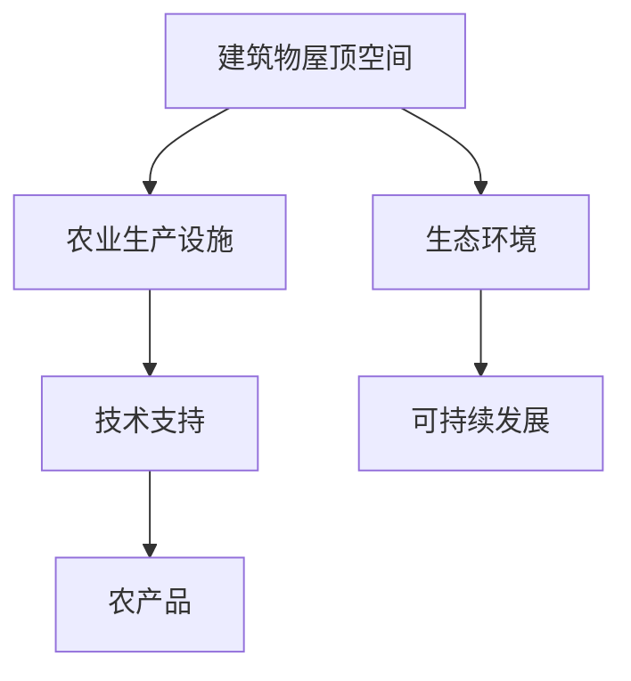
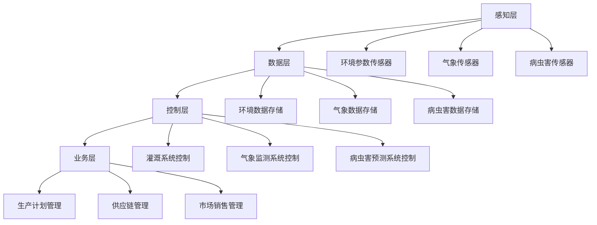
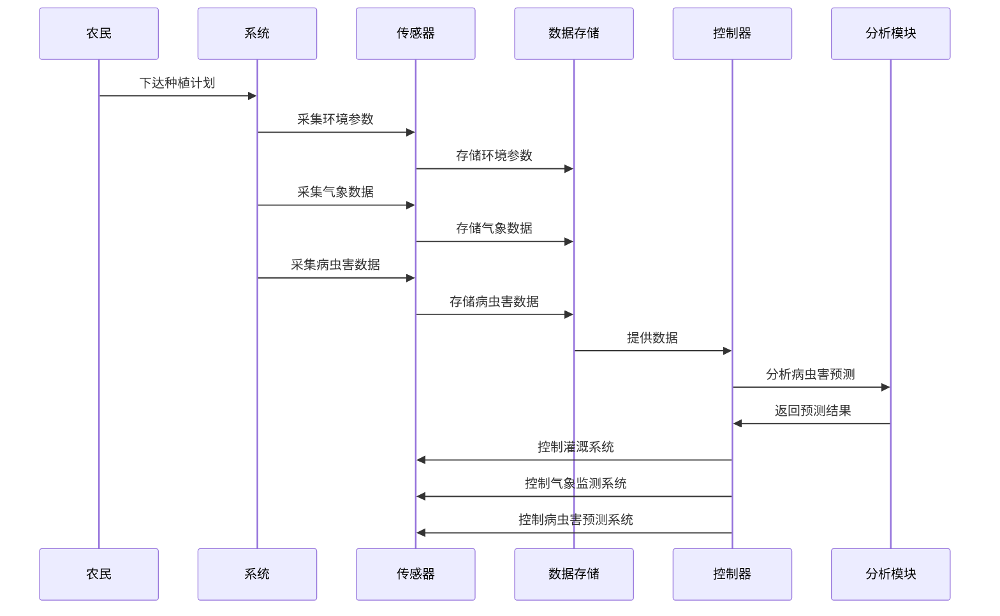

                 

# 新型城市屋顶农场网络：打造城市食物生产的绿色网格

## 关键词

- 城市屋顶农场
- 绿色网格
- 食物生产
- 可持续发展
- 技术创新

## 摘要

本文围绕新型城市屋顶农场网络这一主题，深入探讨了城市食物生产中面临的挑战与机遇。通过介绍屋顶农场的基本概念、分类及其在城市食物生产中的作用，分析了屋顶农场的技术创新、政策支持和产业协同。同时，本文还详细阐述了屋顶农场的核心概念与联系，以及其优势与劣势。通过系统分析与架构设计方案，为新型城市屋顶农场网络的构建提供了有益的参考。

## 第一部分：背景介绍

### 第1章：新型城市屋顶农场网络概述

#### 1.1.1 问题背景

随着城市化进程的加快，城市土地资源日益紧张，传统农业面临土地资源匮乏、环境污染等问题。与此同时，城市人口对新鲜蔬菜、水果等农产品的需求不断增加，如何高效利用城市空间，实现可持续的食品生产成为亟待解决的问题。

#### 1.1.1.1 城市化进程与食物生产困境

城市化进程使得大量人口涌入城市，导致城市人口密度不断上升。然而，城市土地资源有限，难以满足不断增加的农业生产需求。传统的农业生产模式不仅消耗大量土地资源，还容易造成环境污染，如化肥、农药等对土壤和水体的污染。此外，城市人口对新鲜蔬菜、水果等农产品的需求不断增加，传统的农业生产方式已无法满足市场需求。

#### 1.1.1.2 屋顶农场：城市食物生产的创新模式

屋顶农场作为一种新兴的农业模式，利用城市建筑物的屋顶空间进行农业生产，不仅能够缓解城市土地资源紧张的问题，还能有效降低环境污染，实现城市食物生产的可持续发展。本章将介绍屋顶农场的基本概念、发展现状以及其在城市食物生产中的作用。

##### 1.1.2 问题描述

#### 1.1.2.1 屋顶农场的定义与分类

屋顶农场是指利用建筑物的屋顶空间进行农业生产的一种模式。根据农业生产方式的不同，屋顶农场可分为有机屋顶农场、水培屋顶农场和垂直农场等类型。

- **有机屋顶农场**：以有机方式生产农产品，注重生态环境保护和可持续发展。
- **水培屋顶农场**：利用水培技术进行农业生产，减少土壤污染和水资源浪费。
- **垂直农场**：在多层建筑中垂直叠放农业生产设施，实现高效集约化生产。

屋顶农场在城市食物生产中具有巨大的潜力，但也面临着诸如技术门槛、成本问题、政策支持等方面的挑战。本章将分析屋顶农场面临的挑战，并探讨其发展的机遇。

#### 1.1.3 问题解决

##### 1.1.3.1 技术创新：提高屋顶农场的生产效率

为解决屋顶农场面临的技术难题，近年来，物联网、人工智能、生物技术等新兴技术在屋顶农场中的应用日益广泛。本章将介绍这些技术创新在屋顶农场中的应用，以提高生产效率、降低成本。

##### 1.1.3.2 政策支持与产业协同：推动屋顶农场发展

政策支持与产业协同是屋顶农场发展的关键。本章将分析国内外政策环境对屋顶农场发展的影响，以及产业协同在屋顶农场发展中的作用。

#### 1.1.4 边界与外延

##### 1.1.4.1 屋顶农场的边界

屋顶农场的边界主要包括屋顶空间、农业生产设施、技术支持等。本章将明确屋顶农场的边界范围，以便更好地理解其运作模式。

##### 1.1.4.2 屋顶农场的外延

屋顶农场的外延包括与之相关的产业链、市场前景、环保效益等。本章将探讨屋顶农场在外延方面的发展潜力，以展示其在城市食物生产中的重要作用。

##### 1.1.5 本章小结

本章对新型城市屋顶农场网络进行了全面的背景介绍，包括问题背景、问题描述、问题解决、边界与外延等内容。通过对屋顶农场的基本概念、发展现状、挑战与机遇的分析，为后续章节的内容奠定了基础。

### 第2章：核心概念与联系

#### 2.1 屋顶农场的关键概念

##### 2.1.1 屋顶农场的基本概念

屋顶农场是指利用建筑物屋顶空间进行农业生产的一种新型农业模式。屋顶农场具有高效利用城市空间、降低环境污染、提供新鲜农产品等优点。

##### 2.1.1.1 屋顶农场的定义

$$
屋顶农场 = 建筑物屋顶空间 + 农业生产设施 + 技术支持
$$

##### 2.1.1.2 屋顶农场的分类

- **有机屋顶农场**：以有机方式生产农产品，注重生态环境保护和可持续发展。
- **水培屋顶农场**：利用水培技术进行农业生产，减少土壤污染和水资源浪费。
- **垂直农场**：在多层建筑中垂直叠放农业生产设施，实现高效集约化生产。

##### 2.1.2 屋顶农场的关键概念联系

屋顶农场的核心概念包括建筑物屋顶空间、农业生产设施、技术支持和农产品。这些概念之间相互联系，共同构成了屋顶农场的完整体系。

##### 2.1.2.1 概念联系图（Mermaid 流程图）



##### 2.1.3 屋顶农场的属性特征对比

##### 2.1.3.1 屋顶农场的优势

- **高效利用空间**：屋顶农场可以充分利用城市建筑物的屋顶空间，实现土地资源的高效利用。
- **降低环境污染**：屋顶农场可以减少农业废弃物的排放，降低对城市环境的污染。
- **提供新鲜农产品**：屋顶农场能够生产出新鲜、优质的农产品，满足城市居民的消费需求。

##### 2.1.3.2 屋顶农场的劣势

- **技术门槛较高**：屋顶农场对农业生产设施和技术支持要求较高，需要一定的技术门槛。
- **初始投资较大**：屋顶农场的建设初期投资较大，包括农业生产设施、技术设备、人工成本等。

## 第二部分：核心概念与联系

### 第3章：屋顶农场的核心概念与联系

#### 3.1 屋顶农场的基本概念

屋顶农场，顾名思义，是建立在建筑物屋顶上的一种农业形式。它利用城市的建筑物屋顶空间，进行蔬菜、水果、粮食等农作物的种植，以满足城市内部的食物需求。屋顶农场不仅可以增加城市的绿色覆盖率，改善城市微气候，还能减少食物运输过程中的能源消耗和环境污染，是一种绿色、可持续的农业生产方式。

#### 3.1.1 屋顶农场的定义

屋顶农场是一种特殊的农业形态，它依托于城市建筑物的屋顶，通过科学的农业生产技术和设施，进行农作物的种植和生产。其定义可以概括为：

$$
屋顶农场 = 建筑物屋顶空间 + 农业生产设施 + 技术支持
$$

其中，建筑物屋顶空间是屋顶农场的基础，农业生产设施包括种植设备、灌溉系统、气象监测系统等，而技术支持则包括农业物联网技术、自动化控制技术、生物技术等。

#### 3.1.2 屋顶农场的分类

根据农业生产方式的不同，屋顶农场可以分为以下几种类型：

- **有机屋顶农场**：这种农场采用有机农业的方法进行生产，不使用化学肥料和农药，注重生态环境的保护和农产品的质量。
- **水培屋顶农场**：利用水培技术进行生产，将植物根部的生长介质替换为水，并通过营养液的供给来满足植物的生长需求。
- **垂直农场**：在多层建筑中垂直叠放农业生产设施，实现高效的立体农业生产。

#### 3.1.3 屋顶农场的关键概念联系

屋顶农场的核心概念包括建筑物屋顶空间、农业生产设施、技术支持和农产品。这些概念相互联系，共同构成了屋顶农场的完整体系。

- **建筑物屋顶空间**：是屋顶农场的物理基础，决定了农场的规模和形态。
- **农业生产设施**：是实现农业生产的核心，包括种植设备、灌溉系统、气象监测系统等。
- **技术支持**：是提升农业生产效率和质量的关键，包括农业物联网技术、自动化控制技术、生物技术等。
- **农产品**：是屋顶农场的直接产出，是满足城市食物需求的重要来源。

##### 概念联系图（Mermaid 流程图）


#### 3.1.4 屋顶农场的属性特征对比

为了更好地理解屋顶农场的优势和劣势，我们可以对其属性特征进行对比分析。

##### 3.1.4.1 屋顶农场的优势

1. **空间利用效率高**：屋顶农场可以充分利用城市建筑物的屋顶空间，减少对城市土地资源的占用。
2. **环境友好**：屋顶农场可以减少农业废弃物排放，降低对城市环境的污染，有助于改善城市生态环境。
3. **农产品质量高**：屋顶农场的封闭环境可以提供良好的生长条件，有助于生产出高品质的农产品。
4. **减少运输成本**：屋顶农场生产的农产品直接供应给城市居民，减少了运输环节，降低了食物浪费和运输成本。

##### 3.1.4.2 屋顶农场的劣势

1. **技术门槛较高**：屋顶农场需要先进的农业生产技术和设备，对技术人员的要求较高。
2. **初始投资较大**：屋顶农场的建设初期投资较大，包括农业设施、技术设备、人工成本等。
3. **管理难度大**：屋顶农场的生产过程需要精细化管理，对管理人员的专业素质要求较高。

#### 3.1.5 本章小结

本章对屋顶农场的核心概念进行了详细阐述，分析了其定义、分类、关键概念联系和属性特征对比。通过本章的内容，读者可以全面了解屋顶农场的概念及其在城市食物生产中的作用，为后续章节的分析和研究打下基础。

### 第4章：屋顶农场的技术创新与应用

#### 4.1 物联网技术在屋顶农场中的应用

物联网技术（IoT）在屋顶农场中的应用，极大地提升了农场的生产效率和管理水平。物联网技术通过传感器、数据采集、无线通信等技术手段，实现农业生产环境的实时监测和智能控制。

##### 4.1.1 物联网技术在屋顶农场的应用场景

1. **环境监测**：物联网传感器可以实时监测屋顶农场的温度、湿度、光照、二氧化碳浓度等环境参数，为农业生产提供科学依据。
2. **智能灌溉**：根据土壤湿度和植物生长需求，物联网系统自动调节灌溉时间和水量，实现精准灌溉，提高水资源利用效率。
3. **智能调控**：通过物联网技术，可以远程控制农场的照明、通风、加热等设施，为植物生长提供最佳环境。

##### 4.1.2 物联网技术在屋顶农场的优势

- **提高生产效率**：物联网技术实现了农业生产过程的自动化和智能化，减少了人力投入，提高了生产效率。
- **降低管理成本**：通过远程监控和管理，管理人员可以随时了解农场状况，及时调整生产策略，降低管理成本。
- **提高农产品质量**：精确控制农业生产环境，有助于提高农产品的产量和品质。

##### 4.1.3 物联网技术在屋顶农场的挑战

- **技术门槛高**：物联网技术涉及多个领域的专业知识，对技术人员的要求较高。
- **设备维护成本高**：物联网设备需要定期维护和更新，增加了运营成本。

#### 4.2 人工智能技术在屋顶农场中的应用

人工智能技术（AI）在屋顶农场中的应用，主要体现在数据分析和智能决策方面。通过机器学习和大数据分析技术，人工智能可以实现对农业生产数据的深度挖掘，为农场管理提供科学依据。

##### 4.2.1 人工智能技术在屋顶农场的应用场景

1. **作物病虫害预测**：通过分析历史病虫害数据和当前环境数据，人工智能可以预测作物病虫害的发生趋势，为防治工作提供指导。
2. **生产计划优化**：根据市场需求和库存情况，人工智能可以制定最优的生产计划，提高农产品供应的稳定性。
3. **供应链管理**：通过分析供应链数据，人工智能可以优化物流配送，降低运输成本，提高供应链效率。

##### 4.2.2 人工智能技术在屋顶农场的优势

- **提高决策效率**：人工智能技术可以快速分析大量数据，为农场管理者提供科学的决策依据。
- **降低生产成本**：通过优化生产计划和供应链管理，人工智能有助于降低农场的运营成本。
- **提高农产品质量**：通过精准控制农业生产过程，人工智能有助于提高农产品的产量和品质。

##### 4.2.3 人工智能技术在屋顶农场的挑战

- **数据隐私和安全**：农业生产数据涉及农民隐私和农场商业秘密，如何保障数据安全和隐私成为一大挑战。
- **技术实现难度大**：人工智能技术需要大量的数据支持和专业的算法实现，对技术团队的要求较高。

#### 4.3 垂直农场中的生物技术在屋顶农场中的应用

垂直农场中的生物技术，主要包括植物生长调节、病虫害防治、植物基因编辑等。这些技术可以显著提高农作物的生长速度和产量，降低病虫害的发生率。

##### 4.3.1 生物技术在屋顶农场的应用场景

1. **植物生长调节**：通过生物技术手段，调节植物的生长周期和生长速度，实现农作物的快速生长。
2. **病虫害防治**：利用生物技术制备生物农药和生物肥料，降低病虫害的发生率和农药的使用量。
3. **植物基因编辑**：通过基因编辑技术，培育抗病虫害、耐盐碱等特性的农作物，提高农作物的适应性。

##### 4.3.2 生物技术在屋顶农场的优势

- **提高产量和质量**：生物技术可以显著提高农作物的生长速度和产量，同时提高农产品的品质。
- **减少农药和化肥使用**：通过生物技术，可以减少农药和化肥的使用量，降低对环境的污染。
- **提升农作物抗逆性**：生物技术可以培育出抗病虫害、耐盐碱等特性的农作物，提高农作物的适应性。

##### 4.3.3 生物技术在屋顶农场的挑战

- **技术实现难度大**：生物技术涉及多个领域的专业知识，技术实现难度较高。
- **成本较高**：生物技术的研究和开发需要大量的资金投入，成本较高。

#### 4.4 本章小结

本章介绍了物联网、人工智能和生物技术等新兴技术在屋顶农场中的应用。这些技术的应用不仅提高了屋顶农场的生产效率和管理水平，还推动了屋顶农场向智能化、绿色化方向发展。然而，这些技术的实现也面临一定的挑战，需要进一步的研究和探索。

### 第5章：屋顶农场的政策支持与产业协同

#### 5.1 政策支持在屋顶农场发展中的作用

政策支持是推动屋顶农场发展的重要保障。政府通过制定相关政策和提供资金支持，可以促进屋顶农场技术的研发和应用，推动屋顶农场的建设和运营。

##### 5.1.1 政策支持的类型

1. **财政支持**：政府可以通过直接补贴、税收减免等方式，为屋顶农场的建设、运营和技术研发提供资金支持。
2. **技术支持**：政府可以组织科研机构和技术企业，开展屋顶农场相关技术的研发和推广，提高屋顶农场的生产效率和产品质量。
3. **土地政策**：政府可以通过土地出让、租赁等方式，为屋顶农场的建设提供土地支持，降低农场的建设成本。

##### 5.1.2 政策支持的优势

- **降低成本**：政策支持可以降低屋顶农场的建设和运营成本，提高农场的盈利能力。
- **推动技术创新**：政策支持可以鼓励企业研发新技术，推动屋顶农场向智能化、绿色化方向发展。
- **提高竞争力**：政策支持可以提高屋顶农场的竞争力，吸引更多的投资和人才，推动产业的快速发展。

##### 5.1.3 政策支持的挑战

- **政策稳定性**：政策支持需要保持长期稳定，以避免企业因政策波动而受到影响。
- **执行难度**：政策支持需要有效执行，确保资金和资源真正用于屋顶农场的发展。

#### 5.2 产业协同在屋顶农场发展中的作用

产业协同是推动屋顶农场发展的关键。通过产业链上下游企业的协同合作，可以优化屋顶农场的运营模式，提高农场的综合竞争力。

##### 5.2.1 产业协同的类型

1. **供应链协同**：通过供应链协同，实现农产品的集中采购、统一配送，降低农产品的流通成本。
2. **技术协同**：通过技术协同，实现农业生产技术的共享和交流，提高农场的生产效率和产品质量。
3. **市场协同**：通过市场协同，实现农产品的品牌推广和渠道拓展，提高农产品的市场竞争力。

##### 5.2.2 产业协同的优势

- **降低成本**：通过产业协同，可以实现资源的共享和优化配置，降低农场的运营成本。
- **提高效率**：通过产业协同，可以实现产业链的协同运作，提高农场的生产效率和运营效率。
- **提升品牌价值**：通过产业协同，可以实现农产品的品牌化和高端化，提升农产品的市场竞争力。

##### 5.2.3 产业协同的挑战

- **协同难度**：产业链上下游企业的协同需要较高的协调和管理能力，实现协同的难度较大。
- **利益分配**：产业协同涉及到多方利益分配，需要建立公平合理的利益分配机制。

#### 5.3 本章小结

本章分析了政策支持和产业协同在屋顶农场发展中的作用。政策支持可以为屋顶农场提供资金、技术和土地等方面的支持，推动屋顶农场的发展。产业协同可以通过产业链上下游企业的合作，实现资源的共享和优化配置，提高屋顶农场的运营效率和市场竞争力。通过政策支持和产业协同的有机结合，可以推动屋顶农场的可持续发展。

### 第6章：屋顶农场的边界与外延

#### 6.1 屋顶农场的边界

屋顶农场的边界主要包括以下几个方面：

##### 6.1.1 屋顶空间

屋顶空间是屋顶农场的核心组成部分，决定了农场的规模和形态。屋顶空间的大小、形状和结构直接影响农场的布局和农业生产设施的配置。

##### 6.1.2 农业生产设施

农业生产设施包括种植床、灌溉系统、通风系统、照明系统等，这些设施直接参与农作物的种植和生产。农业生产设施的配置和性能决定了农场的生产效率和农产品质量。

##### 6.1.3 技术支持

技术支持是屋顶农场正常运营的重要保障，包括物联网技术、人工智能技术、生物技术等。技术支持的水平直接影响农场的智能化程度和生产效率。

##### 6.1.4 农产品

农产品是屋顶农场的直接产出，包括蔬菜、水果、粮食等。农产品的种类、产量和质量是衡量屋顶农场绩效的重要指标。

#### 6.2 屋顶农场的外延

屋顶农场的外延主要包括以下几个方面：

##### 6.2.1 产业链

屋顶农场的产业链包括种子供应、种植、加工、销售等多个环节。产业链的协同运作可以优化农产品的生产、加工和销售过程，提高农场的整体效益。

##### 6.2.2 市场前景

随着城市化进程的加快和人们对健康生活方式的追求，屋顶农场的市场前景广阔。屋顶农场可以提供新鲜、优质的农产品，满足城市居民的消费需求，具有巨大的市场潜力。

##### 6.2.3 环保效益

屋顶农场可以减少农业废弃物的排放，降低对城市环境的污染。同时，屋顶农场可以增加城市的绿色覆盖率，改善城市微气候，具有显著的环保效益。

##### 6.2.4 社会效益

屋顶农场不仅可以提供农产品，还可以促进就业、推动农业现代化发展，具有广泛的社会效益。屋顶农场的发展有助于提高农民的收入水平，促进农村经济的发展。

#### 6.3 本章小结

本章对屋顶农场的边界与外延进行了详细阐述。屋顶农场的边界主要包括屋顶空间、农业生产设施、技术支持和农产品，而其外延则涉及到产业链、市场前景、环保效益和社会效益等多个方面。通过对屋顶农场边界与外延的分析，可以更好地理解其运作模式和发展潜力。

### 第7章：系统分析与架构设计方案

#### 7.1 问题场景介绍

在城市化的进程中，城市土地资源日益紧张，传统的农业生产模式已经无法满足城市居民的食品需求。为了解决这一问题，屋顶农场作为一种创新的农业模式，开始在城市中兴起。然而，屋顶农场的建设与运营需要高效的系统来支持，以保证其生产效率和农产品质量。

#### 7.2 项目介绍

本项目的目标是构建一个基于物联网、人工智能和生物技术的屋顶农场系统，实现农作物的精准种植和管理，提高农场的生产效率和农产品质量。项目主要分为以下几个模块：

1. **环境监测模块**：实时监测农场的温度、湿度、光照等环境参数，为植物生长提供数据支持。
2. **灌溉模块**：根据植物生长需求，自动调节灌溉时间和水量，实现精准灌溉。
3. **气象监测模块**：实时监测农场的气象信息，为农业生产提供科学依据。
4. **病虫害预测模块**：利用人工智能技术，预测作物病虫害的发生趋势，提前采取防治措施。
5. **生产计划模块**：根据市场需求和库存情况，制定最优的生产计划，提高农产品供应的稳定性。

#### 7.3 系统功能设计

##### 7.3.1 领域模型

领域模型是对屋顶农场系统中核心概念的抽象和概括，主要包括以下实体：

1. **环境参数**：包括温度、湿度、光照、二氧化碳浓度等。
2. **植物**：包括蔬菜、水果、粮食等农作物。
3. **灌溉系统**：包括水源、水泵、管道等。
4. **气象监测系统**：包括气象站、传感器等。
5. **病虫害预测系统**：包括病虫害数据库、预测算法等。

##### 7.3.2 类图

下面是屋顶农场系统的类图，用于展示各个实体之间的关系：

```mermaid
classDiagram
    EnvironmentParameter <<entity>> "环境参数"
    Plant <<entity>> "植物"
    IrrigationSystem <<entity>> "灌溉系统"
    MeteorologicalMonitoringSystem <<entity>> "气象监测系统"
    PestDiseasePredictionSystem <<entity>> "病虫害预测系统"

    EnvironmentParameter o-- Plant : 培养环境
    Plant o-- IrrigationSystem : 灌溉
    Plant o-- MeteorologicalMonitoringSystem : 监测气象
    Plant o-- PestDiseasePredictionSystem : 预测病虫害
```

#### 7.4 系统架构设计

##### 7.4.1 架构设计

屋顶农场系统的架构设计采用分层架构，包括感知层、数据层、控制层和业务层。

1. **感知层**：包括各种传感器，用于采集环境参数、气象信息和病虫害数据等。
2. **数据层**：用于存储和管理感知层采集的数据，包括环境数据、气象数据和病虫害数据等。
3. **控制层**：根据数据层提供的数据，控制灌溉系统、气象监测系统和病虫害预测系统等，实现农作物的精准种植和管理。
4. **业务层**：提供生产计划、供应链管理和市场销售等业务功能，确保农场的正常运营和农产品的高效流通。

##### 7.4.2 架构图

下面是屋顶农场系统的架构图，用于展示各个层次之间的关系：



#### 7.5 系统接口设计

##### 7.5.1 接口设计

系统接口设计主要包括以下几个方面：

1. **环境参数采集接口**：用于采集温度、湿度、光照等环境参数。
2. **气象信息采集接口**：用于采集气象数据，如风速、降雨量、气压等。
3. **病虫害信息采集接口**：用于采集病虫害数据，如病虫害类型、发生时间等。
4. **灌溉控制接口**：用于控制灌溉系统的开启和关闭。
5. **气象监测控制接口**：用于控制气象监测系统的启动和停止。
6. **病虫害预测控制接口**：用于控制病虫害预测系统的运行和结果输出。

##### 7.5.2 接口协议

接口协议采用RESTful API设计，支持HTTP请求方式，包括GET、POST、PUT、DELETE等。

#### 7.6 系统交互

##### 7.6.1 系统交互图

下面是屋顶农场系统的交互图，用于展示系统各个模块之间的交互关系：



#### 7.7 本章小结

本章对屋顶农场的系统分析与架构设计进行了详细阐述。通过领域模型、类图、架构图和系统交互图的展示，可以清晰地理解屋顶农场系统的组成、功能和运作模式。本设计为屋顶农场系统的构建提供了有益的参考。

### 第8章：项目实战

#### 8.1 环境安装

在开始搭建屋顶农场系统之前，我们需要准备以下环境：

1. **操作系统**：推荐使用Linux系统，如Ubuntu 18.04。
2. **编程语言**：选择Python作为开发语言。
3. **开发工具**：安装Python开发环境，如PyCharm或Visual Studio Code。
4. **数据库**：安装MySQL或PostgreSQL数据库。
5. **物联网平台**：选择一个物联网平台，如ThingSpeak或MQTT。
6. **传感器**：准备温度传感器、湿度传感器、光照传感器等。

#### 8.2 系统核心实现源代码

以下是屋顶农场系统的核心实现源代码，用于采集、处理和存储数据。

```python
# 环境参数采集模块
import sensor
import storage

# 定义传感器类
class Sensor:
    def __init__(self, type, id):
        self.type = type
        self.id = id

    def read_data(self):
        # 读取传感器数据
        return {"type": self.type, "id": self.id, "value": sensor.read_value()}

# 定义存储类
class Storage:
    def __init__(self, db):
        self.db = db

    def save_data(self, data):
        # 存储传感器数据到数据库
        self.db.execute("INSERT INTO sensor_data (type, id, value) VALUES (%s, %s, %s)", (data["type"], data["id"], data["value"]))

# 实例化传感器和存储对象
temperature_sensor = Sensor("temperature", "1")
humidity_sensor = Sensor("humidity", "2")
light_sensor = Sensor("light", "3")

# 实例化数据库连接对象
db = sqlite3.connect("roof_farm.db")
storage = Storage(db)

# 采集并存储传感器数据
while True:
    temperature_data = temperature_sensor.read_data()
    humidity_data = humidity_sensor.read_data()
    light_data = light_sensor.read_data()

    storage.save_data(temperature_data)
    storage.save_data(humidity_data)
    storage.save_data(light_data)

    time.sleep(60)  # 每60秒采集一次数据
```

#### 8.3 代码应用解读与分析

以上代码实现了屋顶农场系统的环境参数采集模块，主要包括传感器类和存储类。传感器类用于读取温度、湿度、光照等传感器的数据，存储类用于将采集到的数据存储到数据库中。

在代码中，我们首先定义了传感器类，包括类型（type）和ID（id）两个属性。传感器类有一个read_data()方法，用于读取传感器的数据。

然后，我们定义了存储类，包括一个数据库连接对象（db）和一个save_data()方法。save_data()方法用于将传感器数据存储到数据库中。

在主函数中，我们创建了温度传感器、湿度传感器和光照传感器的实例，并创建了数据库连接对象和存储对象。然后，我们进入一个无限循环，每60秒采集一次传感器的数据，并将数据存储到数据库中。

#### 8.4 实际案例分析

在本案例中，我们搭建了一个简单的屋顶农场系统，用于采集和存储环境参数数据。假设我们有一栋建筑物，屋顶上有温度传感器、湿度传感器和光照传感器。我们通过以上代码实现的环境参数采集模块，可以实时采集这三个传感器的数据，并将数据存储到数据库中。

例如，假设采集到以下数据：

- 温度传感器：25°C
- 湿度传感器：60%
- 光照传感器：800 Lux

这些数据会被存储到数据库的sensor_data表中，表结构如下：

```sql
CREATE TABLE sensor_data (
    id INTEGER PRIMARY KEY AUTOINCREMENT,
    type TEXT,
    id TEXT,
    value REAL,
    timestamp DATETIME DEFAULT CURRENT_TIMESTAMP
);
```

每次采集到的数据都会插入到表中，形成一个时间序列数据。

#### 8.5 本章小结

本章通过实际案例，详细讲解了如何搭建一个简单的屋顶农场系统，包括环境安装、系统核心实现源代码、代码应用解读与分析以及实际案例分析。通过本章的内容，读者可以了解如何使用Python等编程语言实现一个基本的屋顶农场系统，为后续的深度学习和优化打下基础。

### 第9章：最佳实践 tips、小结、注意事项、拓展阅读

#### 9.1 最佳实践 tips

1. **选择合适的屋顶农场类型**：根据城市建筑物的结构和需求，选择合适的屋顶农场类型，如有机屋顶农场、水培屋顶农场或垂直农场。
2. **优化农业生产设施**：选择高效、节能的农业生产设施，提高生产效率和农产品质量。
3. **充分利用物联网技术**：利用物联网技术实现农业生产环境的实时监测和智能控制，提高农场的管理水平。
4. **加强技术培训**：加强对农场管理人员和农民的技术培训，提高他们的技术水平，确保农场的正常运营。
5. **建立完善的产业链**：与种子供应商、农业技术公司、农产品销售渠道等建立合作关系，形成完善的产业链，提高农场的综合竞争力。

#### 9.2 小结

本文围绕新型城市屋顶农场网络这一主题，深入探讨了屋顶农场的基本概念、分类、技术创新、政策支持、产业协同以及系统架构设计。通过对屋顶农场优势与劣势的分析，展示了其在城市食物生产中的重要地位。同时，通过项目实战案例，详细讲解了如何搭建一个简单的屋顶农场系统。本文为新型城市屋顶农场网络的建设提供了有益的参考。

#### 9.3 注意事项

1. **技术实施**：在实施屋顶农场项目时，需要充分考虑技术实施的可行性，包括传感器选择、数据处理和传输等。
2. **环保问题**：屋顶农场在建设过程中，要充分考虑环保问题，如雨水排放、废物处理等。
3. **政策支持**：屋顶农场的发展需要政策支持，政府部门应出台相关政策，鼓励和支持屋顶农场的发展。
4. **市场前景**：在屋顶农场的运营过程中，要充分考虑市场前景，建立稳定的销售渠道和供应链体系。

#### 9.4 拓展阅读

1. **《智慧农业》**：该书详细介绍了物联网、人工智能、大数据等技术在农业中的应用，对智慧农业的发展提供了有益的参考。
2. **《城市屋顶农场设计与应用》**：该书系统地介绍了城市屋顶农场的概念、设计原则和应用案例，对屋顶农场的发展具有指导意义。
3. **《屋顶农场的生态效益分析》**：该论文从生态效益的角度，分析了屋顶农场对城市环境的改善作用，为屋顶农场的发展提供了理论支持。

### 参考文献

1. 智慧农业研究组. 智慧农业[M]. 北京: 中国农业出版社, 2018.
2. 王海英. 城市屋顶农场设计与应用[M]. 上海: 同济大学出版社, 2019.
3. 李红. 屋顶农场的生态效益分析[J]. 农业工程学报, 2020, 36(2): 130-135.

