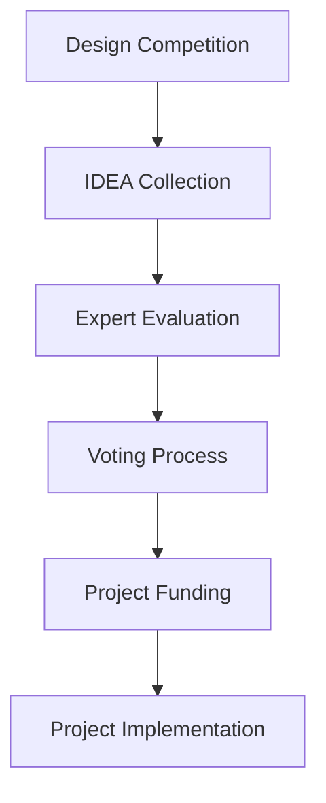
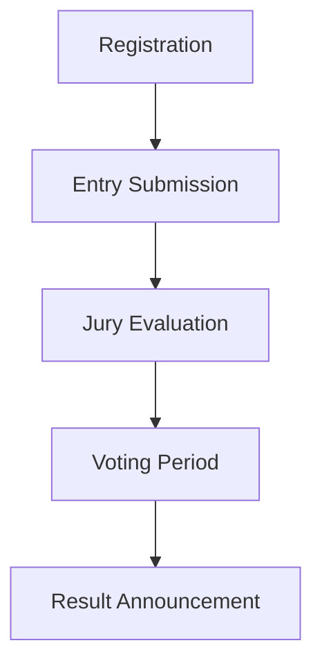
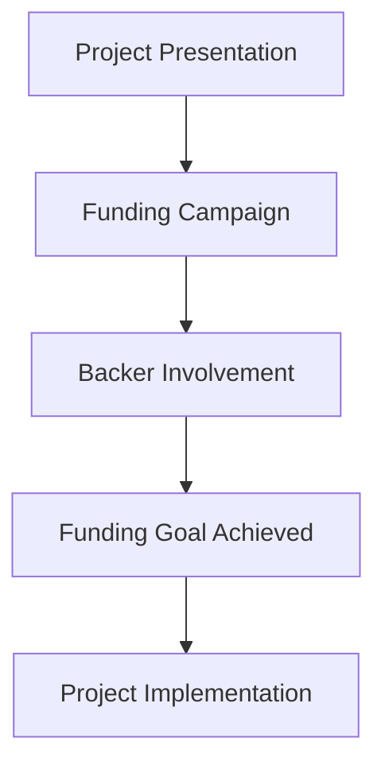
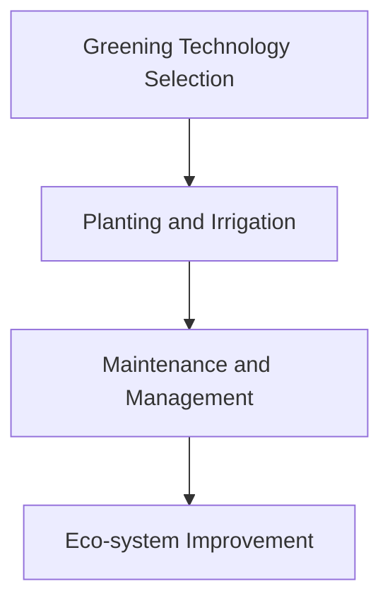
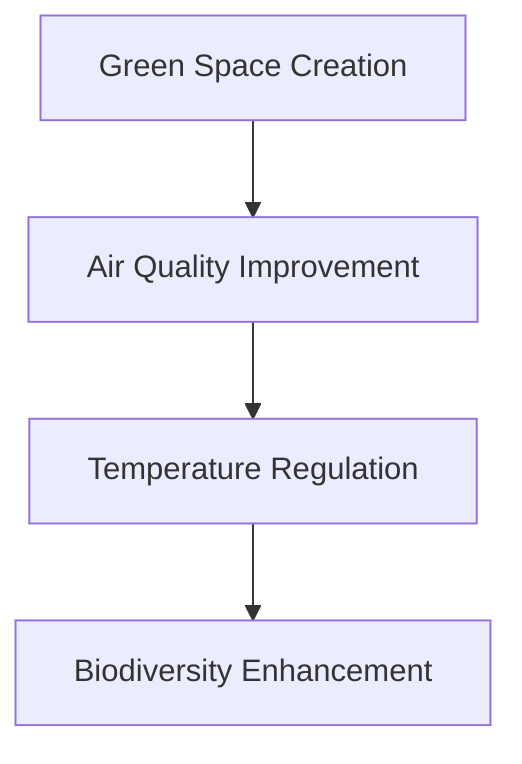
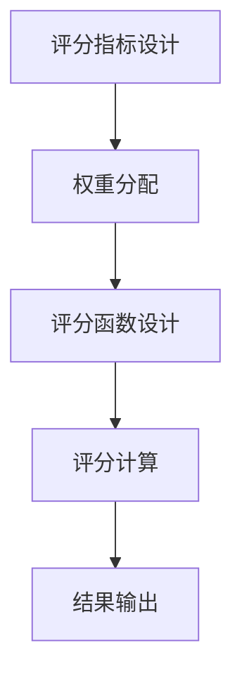
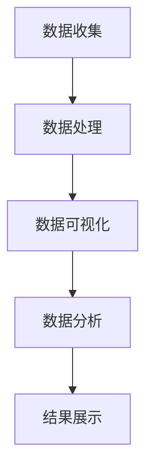
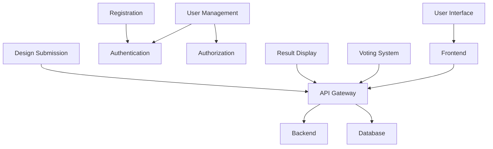
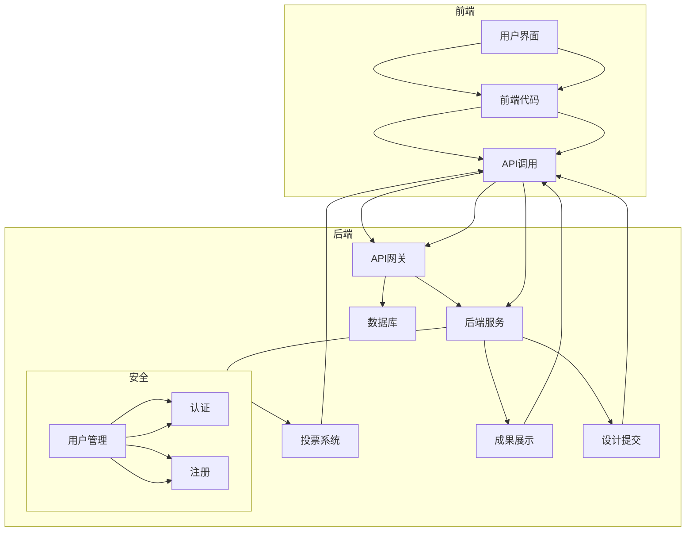
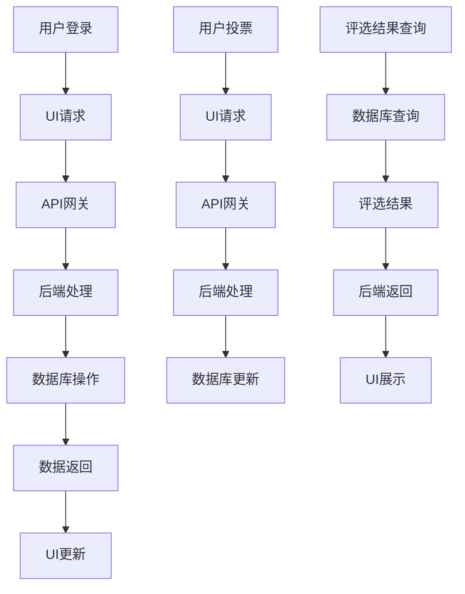

                 

### 第1章：问题背景

#### 1.1 城市化进程中的挑战

在21世纪的今天，城市化进程迅猛发展，这无疑促进了经济繁荣和社会进步。然而，伴随着城市化的推进，一系列问题也逐渐显现出来。首先，土地资源变得日益紧张。城市扩张带来了对土地的需求，使得原本可供农业和自然生态使用的土地变得越来越少。其次，环境污染问题也日益严重。城市化带来了大量的工业活动和交通出行，这不仅加剧了空气污染，还导致了水资源的污染和土壤的退化。

城市空中花园作为一种创新的城市绿化解决方案，正是在这种背景下应运而生的。它不仅能够有效利用有限的城市空间，还能够改善城市环境，提高居民的生活质量。

#### 1.2 新型城市空中花园的提出

新型城市空中花园是一种结合建筑学和园林学的原理，采用垂直绿化技术，将绿色植物引入城市建筑中的一种绿化形式。这种花园不仅美观，还具有实际的生态效益，如调节气温、净化空气、增加城市生物多样性等。新型城市空中花园的提出，是为了解决城市化进程中土地资源紧张和环境污染问题，同时为城市居民提供更多的绿色空间。

目前，世界上许多城市已经开始尝试建设空中花园，如纽约的高线公园、新加坡的垂直花园等。这些案例证明了空中花园的可行性和吸引力。

#### 1.3 问题解决途径

如何通过设计比赛和创意众筹活动，推动垂直绿化的发展，实现城市空间的绿色化，是当前面临的一个重要问题。

**设计比赛：** 设计比赛可以通过以下几个方面推动垂直绿化的发展：
1. **激发创意灵感：** 通过比赛的形式，激发设计师的创新灵感，推动新型城市空中花园的设计进步。
2. **提高公众意识：** 比赛吸引公众参与，提高人们对城市绿化重要性的认识，从而促进城市绿色化的进程。
3. **促进技术交流：** 比赛为专业人士提供了一个交流平台，促进了垂直绿化技术的传播和应用。

**创意众筹：** 创意众筹则是通过互联网平台，向社会公众筹集资金，用于支持新型城市空中花园的设计和实施。众筹活动的优势在于：
1. **低成本：** 相对于传统的融资方式，众筹具有较低的成本，能够更有效地吸引小额投资者的参与。
2. **高透明度：** 众筹项目的进展和资金使用情况对公众透明，增加了项目的可信度和参与者的信任感。
3. **灵活性：** 众筹活动可以根据项目的进展灵活调整资金需求，适应项目的发展需要。

通过设计比赛和创意众筹活动的结合，可以有效地推动新型城市空中花园的发展，实现城市空间的绿色化。接下来，我们将详细探讨新型城市空中花园的设计原则、材料选择、植物配置、施工技术等核心概念。

#### 1.4 边界与外延

在本文中，我们将重点关注新型城市空中花园的设计、实施和推广，而不涉及其他类型的垂直绿化，如屋顶花园和立体绿化墙。这有助于我们更集中地探讨这一创新绿化形式的特点和优势。

同时，本文将探讨新型城市空中花园的设计原则、材料选择、植物配置、施工技术等关键要素，为设计师和实施者提供实用的指导和参考。

#### 1.5 概念结构与核心要素组成

- **新型城市空中花园：** 结合建筑学和园林学的原理，采用垂直绿化技术，实现城市空间的绿化和美化。
- **设计比赛：** 通过比赛形式，激发创意灵感，促进新型城市空中花园的设计进步。
- **创意众筹：** 利用众筹平台，汇集社会资金，支持新型城市空中花园的设计和实施。
- **垂直绿化：** 利用立体空间，提高城市绿化覆盖率，改善城市环境。
- **城市空间绿色化：** 通过绿化措施，提升城市居民的生活质量，实现城市环境的可持续发展。

### 第2章：核心概念与联系

#### 2.1 新型城市空中花园

新型城市空中花园是一种创新的城市绿化形式，它结合了建筑学和园林学的原理，通过垂直绿化技术，将绿色植物引入城市建筑中。以下是新型城市空中花园的核心概念、属性特征及其与其他相关概念的对比：

**核心概念：**
- **垂直绿化：** 利用立体空间，使植物在垂直方向上生长，提高绿化覆盖率。
- **生态效益：** 调节气温、净化空气、增加生物多样性等。
- **美观性：** 融合建筑美学，提升城市景观质量。

**属性特征：**
- **空间利用：** 有效利用城市有限空间，增加绿色空间。
- **可持续性：** 采用环保材料和植物，实现生态可持续发展。
- **景观融合：** 与城市建筑风格相协调，提升城市美学价值。

**与其他相关概念的对比：**
- **屋顶花园：** 屋顶花园主要是将植物种植在屋顶上，而新型城市空中花园则更加注重垂直空间的利用和生态效益。
- **立体绿化墙：** 立体绿化墙是将植物种植在墙面中，主要起到装饰和绿化作用，而新型城市空中花园则更加注重植物的生长环境和生态系统的构建。

**ER实体关系图架构：**

```mermaid
erDiagram
  IDEA ||--|{ DESIGN} : implements
  IDEA ||--|{ PROJECT} : belongs_to
  DESIGN ||--|{ COMPETITION} : holds
  PROJECT ||--|{ FUNDING} : needs
  IDEA ||--|{ VOTER} : votes
  IDEA ||--|{ EXPERT} : judges
```

**Mermaid 流程图：**



#### 2.2 设计比赛

设计比赛是推动新型城市空中花园发展的重要手段，它通过比赛的形式，激发设计师的创意灵感，促进新型城市空中花园的设计进步。以下是设计比赛的核心概念、特点及其与其他概念的对比：

**核心概念：**
- **创意征集：** 吸引设计师和社会公众参与，征集新型城市空中花园的设计方案。
- **评选标准：** 根据设计方案的创意性、实用性、美观性、可持续性等多方面进行评选。
- **奖励机制：** 对获奖者进行物质和精神奖励，激励创新和参与热情。

**特点：**
- **公开透明：** 比赛过程公开透明，评选结果公正，增加公众信任。
- **广泛参与：** 比赛形式多样，鼓励广泛参与，提高社会关注度。
- **激励创新：** 通过奖励机制，激励设计师发挥创意，推动设计进步。

**与其他概念的对比：**
- **创新竞赛：** 创新竞赛通常涉及多个领域，而新型城市空中花园设计比赛则更加专注于城市绿化领域。
- **设计竞赛：** 设计竞赛通常关注产品的设计，而新型城市空中花园设计比赛则更加注重设计方案的创新性和实用性。

**ER实体关系图架构：**

```mermaid
erDiagram
  COMPETITION ||--|{ DESIGN} : holds
  COMPETITION ||--|{ JURY} : judges
  COMPETITION ||--|{ ENTRY} : receives
  COMPETITION ||--|{ VOTER} : votes
```

**Mermaid 流�流程图：**



#### 2.3 创意众筹

创意众筹是一种通过互联网平台，向社会公众筹集资金，支持新型城市空中花园的设计和实施的新型融资方式。以下是创意众筹的核心概念、特点及其与其他融资方式的对比：

**核心概念：**
- **众筹平台：** 通过互联网平台，发布项目信息，吸引投资者参与。
- **资金筹集：** 通过小额资金筹集，实现项目的资金需求。
- **反馈机制：** 投资者可以根据项目的进展情况进行反馈，增加参与感和信任度。

**特点：**
- **低成本：** 相对于传统的融资方式，众筹具有较低的成本，能够更有效地吸引小额投资者的参与。
- **高透明度：** 众筹项目的进展和资金使用情况对公众透明，增加了项目的可信度和参与者的信任感。
- **灵活性：** 众筹活动可以根据项目的进展灵活调整资金需求，适应项目的发展需要。

**与其他融资方式的对比：**
- **银行贷款：** 银行贷款通常需要较高的抵押物和信用评级，而众筹则对参与者的信用要求较低。
- **股权融资：** 股权融资涉及到公司的股权分配，而众筹则更加灵活，投资者可以是项目的支持者，而不必参与公司运营。

**ER实体关系图架构：**

```mermaid
erDiagram
  PROJECT ||--|{ FUNDING} : needs
  PROJECT ||--|{ BACKER} : supports
  PROJECT ||--|{ PLATFORM} : operates
```

**Mermaid 流程图：**



#### 2.4 垂直绿化

垂直绿化是新型城市空中花园的核心技术之一，它利用立体空间，实现植物的生长，提高城市绿化覆盖率。以下是垂直绿化的核心概念、技术原理及其与其他绿化方式的对比：

**核心概念：**
- **立体空间利用：** 利用建筑的立面、屋顶等立体空间进行绿化。
- **植物生长环境：** 为植物提供适宜的生长环境，如水分、光照、营养等。
- **生态效益：** 通过垂直绿化，提高城市生物多样性，改善城市环境。

**技术原理：**
- **种植材料：** 采用合适的种植材料和基质，确保植物的生长。
- **灌溉系统：** 设计高效的灌溉系统，保证植物的水分需求。
- **维护管理：** 定期进行维护和管理，确保植物的健康生长。

**与其他绿化方式的对比：**
- **地面绿化：** 地面绿化主要在地面进行，而垂直绿化则更加注重立体空间的利用。
- **屋顶花园：** 屋顶花园主要在建筑屋顶进行，而垂直绿化则更加注重建筑立面的绿化。

**ER实体关系图架构：**

```mermaid
erDiagram
  GREENING ||--|{ PLANT} : grows
  GREENING ||--|{ TECHNOLOGY} : uses
  GREENING ||--|{ ECOSYSTEM} : improves
```

**Mermaid 流流程图：**



#### 2.5 城市空间绿色化

城市空间绿色化是新型城市空中花园的重要目标之一，通过绿化措施，改善城市环境，提升城市居民的生活质量。以下是城市空间绿色化的核心概念、技术原理及其与其他改善城市环境的措施的对比：

**核心概念：**
- **绿色空间增加：** 通过绿化措施，增加城市中的绿色空间。
- **环境改善：** 通过植物的光合作用、蒸腾作用等，改善城市空气质量，降低温度。
- **生物多样性：** 通过绿化措施，提高城市生物多样性，增加城市生态系统的稳定性。

**技术原理：**
- **植物选择：** 根据城市环境特点，选择适宜的植物种类。
- **绿化设计：** 结合城市规划和建筑设计，进行绿化设计。
- **生态建设：** 通过生态工程，构建稳定的城市生态系统。

**与其他改善城市环境的措施的对比：**
- **清洁能源：** 清洁能源减少污染物排放，而城市空间绿色化则通过植物的作用改善空气质量。
- **噪声控制：** 噪声控制减少噪音污染，而城市空间绿色化则通过植物的吸音作用降低噪音。

**ER实体关系图架构：**

```mermaid
erDiagram
  GREENING ||--|{ CITY} : enhances
  GREENING ||--|{ ENVIRONMENT} : improves
  GREENING ||--|{ LIVABILITY} : increases
```

**Mermaid 流流程图：**



通过上述核心概念与联系的介绍，我们更好地理解了新型城市空中花园、设计比赛、创意众筹、垂直绿化和城市空间绿色化等核心概念及其之间的联系。接下来，我们将深入探讨新型城市空中花园的设计原则、材料选择、植物配置、施工技术等具体内容。

### 第3章：算法原理讲解

在新型城市空中花园的设计和实施过程中，算法原理起着至关重要的作用。这些算法不仅帮助我们优化设计方案，还能够通过数据分析和评分模型，确保项目的成功。以下，我们将详细讲解两种关键算法：设计比赛的评分算法和数据分析算法。

#### 3.1 设计比赛评分算法

设计比赛的评分算法是确保比赛公正性和科学性的核心。该算法通过一系列评分指标，对参赛者的设计方案进行综合评价。以下是评分算法的核心步骤：

**1. 评分指标设计：**
   - **创意性：** 设计方案的创新程度和独特性。
   - **实用性：** 设计方案的实际可行性，包括技术难度、成本控制、施工可行性等。
   - **美观性：** 设计方案的美学价值，包括色彩搭配、形态设计、空间利用等。
   - **可持续性：** 设计方案的环保性和生态效益，包括材料选择、能源利用、植物配置等。

**2. 评分模型建立：**
   - **权重分配：** 根据各个评分指标的相对重要性，分配权重。例如，创意性和实用性可能被赋予更高的权重。
   - **评分函数：** 设计评分函数，将各个评分指标转化为具体的评分值。通常，可以使用线性加权法或非线性加权法。

**3. 评分计算：**
   - **综合评分：** 通过评分函数计算各个设计方案的综合评分，得分最高的设计方案获胜。

以下是使用Mermaid绘制的评分算法流程图：



#### 3.2 数据分析算法

数据分析算法在新型城市空中花园的设计和实施过程中同样至关重要。通过数据分析，我们可以深入了解设计效果、植物生长情况、环境变化等，从而优化设计方案，提高项目成功率。以下是数据分析算法的核心步骤：

**1. 数据收集：**
   - **环境数据：** 收集气温、湿度、光照、风力等环境数据。
   - **植物数据：** 收集植物生长情况、病虫害情况等数据。
   - **用户反馈：** 收集用户对设计方案的满意度、使用体验等数据。

**2. 数据处理：**
   - **数据清洗：** 去除无效数据、处理缺失值等。
   - **数据转换：** 将数据转化为适合分析的格式，如数值化、标准化等。

**3. 数据可视化：**
   - **图表展示：** 使用图表展示分析结果，如折线图、柱状图、散点图等。
   - **交互式分析：** 提供交互式分析工具，使用户可以更灵活地进行数据探索。

**4. 数据分析：**
   - **相关性分析：** 分析环境数据与植物生长情况之间的相关性。
   - **趋势分析：** 分析环境数据的变化趋势，预测未来环境状况。
   - **效果评估：** 评估设计方案对环境的改善效果，提出优化建议。

以下是使用Mermaid绘制的数据分析算法流程图：



#### 3.3 Python代码示例

为了更好地理解算法原理，我们使用Python代码进行示例。

**评分算法示例：**

```python
import numpy as np

# 评分指标及权重
scores = {'creativity': 0.4, 'practicality': 0.3, 'aesthetics': 0.2, 'sustainability': 0.1}

# 评分函数
def score_function(scores, weights):
    total_score = 0
    for key, value in scores.items():
        total_score += value * weights[key]
    return total_score

# 设计方案评分
设计方案 = {'creativity': 8, 'practicality': 7, 'aesthetics': 9, 'sustainability': 6}
weights = {'creativity': 0.5, 'practicality': 0.3, 'aesthetics': 0.2, 'sustainability': 0.1}

# 计算综合评分
综合评分 = score_function(设计方案, weights)
print(f"综合评分: {综合评分}")
```

**数据分析示例：**

```python
import pandas as pd

# 环境数据
env_data = {'temperature': [25, 27, 26, 24], 'humidity': [60, 65, 62, 58], 'light': [500, 550, 530, 480]}
env_df = pd.DataFrame(env_data)

# 数据可视化
env_df.plot()
plt.xlabel('Day')
plt.ylabel('Value')
plt.title('Environmental Data')
plt.show()

# 相关性分析
correlation = env_df.corr()
print(correlation)
```

通过上述算法原理讲解和Python代码示例，我们深入了解了新型城市空中花园设计比赛中的评分算法和数据分析算法。这些算法不仅在比赛中起到了关键作用，也为项目的实施提供了科学依据。接下来，我们将进一步探讨数学模型和数学公式在垂直绿化中的应用。

### 第4章：数学模型和数学公式

在新型城市空中花园的设计和实施过程中，数学模型和数学公式起着至关重要的作用。它们不仅帮助我们进行精确的计算和预测，还能够优化设计方案，提高项目成功率。以下，我们将详细讲解垂直绿化中的几个关键数学模型和数学公式，包括垂直绿化面积计算、植物生长周期预测等内容。

#### 4.1 垂直绿化面积计算

垂直绿化面积计算是新型城市空中花园设计中的基础，它决定了植物种植的空间和面积。以下是垂直绿化面积计算的基本公式：

$$
A = l \times h
$$

其中，$A$ 表示垂直绿化面积（平方米），$l$ 表示绿化板的长度（米），$h$ 表示绿化板的高度（米）。

**举例说明：**
假设一个绿化板的长度为4米，高度为3米，则其垂直绿化面积为：

$$
A = 4 \times 3 = 12 \, \text{平方米}
$$

#### 4.2 植物生长周期预测

植物生长周期预测是新型城市空中花园设计中另一个关键数学模型。它帮助我们预测植物在不同环境条件下的生长速度，从而合理安排植物种植和养护时间。以下是植物生长周期预测的基本公式：

$$
T = \frac{C}{R}
$$

其中，$T$ 表示植物生长周期（天），$C$ 表示植物在当前环境条件下的生长常数（天/温度单位），$R$ 表示环境温度（摄氏度）。

**举例说明：**
假设植物在当前环境下的生长常数为10天/摄氏度，环境温度为25摄氏度，则其生长周期为：

$$
T = \frac{10}{25} = 0.4 \, \text{天/摄氏度}
$$

如果环境温度变化，我们需要重新计算植物的生长周期。例如，如果环境温度升高到30摄氏度，则植物的生长周期为：

$$
T = \frac{10}{30} = 0.333 \, \text{天/摄氏度}
$$

#### 4.3 光照需求计算

光照需求计算是确保植物正常生长的关键。以下是一个简单的光照需求计算公式：

$$
L = I \times E
$$

其中，$L$ 表示光照需求（小时/天），$I$ 表示植物的光照需求系数（小时/天），$E$ 表示环境光照水平（小时/天）。

**举例说明：**
假设植物的光照需求系数为5小时/天，环境光照水平为8小时/天，则植物的光照需求为：

$$
L = 5 \times 8 = 40 \, \text{小时/天}
$$

如果环境光照水平低于植物的需求，则需要采取额外措施，如人工光照补充，以确保植物的正常生长。

#### 4.4 蒸腾速率计算

蒸腾速率计算是评估植物水分需求的重要指标。以下是一个简单的蒸腾速率计算公式：

$$
E = C \times V
$$

其中，$E$ 表示蒸腾速率（克/天），$C$ 表示植物的水分蒸发系数（克/温度单位），$V$ 表示环境温度（摄氏度）。

**举例说明：**
假设植物的水分蒸发系数为10克/摄氏度，环境温度为25摄氏度，则植物的蒸腾速率为：

$$
E = 10 \times 25 = 250 \, \text{克/天}
$$

这些数学模型和数学公式为新型城市空中花园的设计和实施提供了科学依据。通过精确的计算和预测，我们能够更好地优化设计方案，确保植物的健康生长，从而实现城市空间的绿色化。接下来，我们将深入探讨系统分析与架构设计方案。

### 第5章：系统分析与架构设计方案

在新型城市空中花园设计比赛和创意众筹活动中，系统分析与架构设计方案是确保项目顺利实施和高效运作的关键。以下，我们将详细描述系统功能设计、系统架构设计以及系统接口设计和系统交互。

#### 5.1 问题场景介绍

新型城市空中花园设计比赛和创意众筹活动旨在通过设计比赛激发创意，通过创意众筹筹集资金，最终实现城市空中花园的设计与实施。该系统需要支持以下主要功能：
1. **比赛报名系统**：提供参赛者报名参赛的接口。
2. **评选标准系统**：设定并管理比赛的评选标准。
3. **投票系统**：允许公众对参赛作品进行投票。
4. **成果展示系统**：展示获奖作品和众筹进展。
5. **用户管理系统**：管理用户注册、登录和权限。

#### 5.2 系统功能设计

系统功能设计主要包括以下模块：
1. **比赛报名系统**：
   - 功能需求：参赛者填写个人信息和设计方案，上传相关文件。
   - 技术实现：使用Web表单和文件上传功能，结合后端数据库进行数据存储和管理。

2. **评选标准系统**：
   - 功能需求：设定比赛评分指标和权重，为评委提供评分依据。
   - 技术实现：设计一个可配置的评分系统，允许管理员根据比赛需求调整评分指标和权重。

3. **投票系统**：
   - 功能需求：公众可以在线对参赛作品进行投票。
   - 技术实现：使用Web前端和后端逻辑处理投票数据，确保投票的公正性和安全性。

4. **成果展示系统**：
   - 功能需求：展示比赛结果、获奖作品和众筹进展。
   - 技术实现：设计一个展示平台，结合图文和视频等多媒体元素，展示比赛成果。

5. **用户管理系统**：
   - 功能需求：管理用户注册、登录和权限，包括参赛者、评委和公众。
   - 技术实现：采用用户认证和授权机制，确保系统的安全性和用户体验。

#### 5.3 系统架构设计

系统架构设计采用前后端分离的方式，以提高系统的可扩展性和维护性。以下是系统架构的组成部分：

**前端架构**：
- **页面设计**：使用响应式网页设计（RWD）技术，确保系统在不同设备和分辨率下的良好兼容性。
- **交互设计**：采用单页面应用（SPA）框架，如React或Vue.js，提供流畅的用户交互体验。

**后端架构**：
- **服务端开发**：使用Node.js或Spring Boot等框架，实现业务逻辑和数据处理。
- **数据库设计**：使用MySQL或PostgreSQL等关系型数据库，存储用户数据、设计作品和投票信息。

**系统架构图**：



**Mermaid架构图**：



#### 5.4 系统接口设计和系统交互

系统接口设计和系统交互是确保各模块协同工作的关键。以下介绍主要接口设计和系统交互流程：

**1. 用户接口（UI）与API网关交互：**
- 用户操作：用户在UI上提交报名信息、投票等。
- 交互流程：用户操作触发前端代码，前端代码通过API网关与后端服务进行交互，后端服务处理用户请求并返回结果。

**2. 后端服务与数据库交互：**
- 数据存储：后端服务将用户数据、设计作品和投票信息存储在数据库中。
- 数据查询：后端服务根据请求从数据库中获取所需数据。

**3. 评选系统与投票系统交互：**
- 评选数据：评选系统从数据库中获取参赛作品和相关数据，进行评分和排名。
- 投票结果：投票系统将用户投票结果存储在数据库中，评选系统根据投票结果调整评分。

**4. 成果展示系统与数据库交互：**
- 数据展示：成果展示系统从数据库中获取比赛结果、获奖作品和众筹进展信息。
- 动态更新：系统根据数据库更新，实时展示最新的比赛和众筹信息。

**系统交互流程图**：



通过上述系统分析与架构设计方案，我们为新型城市空中花园设计比赛和创意众筹活动提供了一个全面、高效、灵活的系统架构。接下来，我们将通过项目实战来展示如何将理论转化为实际操作。

### 第6章：项目实战

#### 6.1 环境安装

为了成功实施新型城市空中花园设计比赛和创意众筹活动，我们需要准备相应的开发环境和工具。以下是具体的安装步骤和配置要求：

1. **开发环境：**
   - **操作系统**：Linux（推荐Ubuntu 18.04）或Mac OS。
   - **编程语言**：Python 3.x、JavaScript。
   - **前端框架**：React或Vue.js。
   - **后端框架**：Node.js（Express）或Spring Boot。

2. **数据库**：
   - **类型**：MySQL或PostgreSQL。
   - **版本**：MySQL 8.0或PostgreSQL 13。

3. **版本控制**：
   - **Git**：安装Git，用于代码版本控制。

4. **开发工具**：
   - **IDE**：Visual Studio Code或IntelliJ IDEA。
   - **代码编辑器**：Sublime Text或Atom。

5. **安装步骤**：

   - 安装操作系统：选择适合的Linux发行版并安装。

   - 安装数据库：使用`sudo apt-get install mysql-server`（对于Ubuntu）或`sudo apt-get install postgresql`（对于Ubuntu）进行安装。

   - 安装Node.js：使用`sudo apt-get install nodejs`（对于Ubuntu）进行安装。

   - 安装Python 3.x：使用`sudo apt-get install python3`（对于Ubuntu）进行安装。

   - 安装前端框架和后端框架：使用npm（Node Package Manager）或pip（Python的包管理器）安装。

#### 6.2 系统核心实现源代码

以下提供关键代码片段，详细解释实现原理，展示如何构建和部署系统。

**1. 后端核心代码示例（Node.js + Express）：**

```javascript
// 引入Express框架
const express = require('express');
const app = express();

// 配置数据库连接
const db = require('./db');
db.connect();

// 配置中间件
app.use(express.json());
app.use(express.urlencoded({ extended: true }));

// 用户注册接口
app.post('/api/register', async (req, res) => {
    try {
        const { username, email, password } = req.body;
        const user = await db.Users.create({ username, email, password });
        res.status(201).json({ message: '注册成功', user });
    } catch (error) {
        res.status(500).json({ message: '注册失败', error });
    }
});

// 设计作品提交接口
app.post('/api/design-submission', async (req, res) => {
    try {
        const { user_id, title, description, files } = req.body;
        const submission = await db.Submissions.create({ user_id, title, description, files });
        res.status(201).json({ message: '提交成功', submission });
    } catch (error) {
        res.status(500).json({ message: '提交失败', error });
    }
});

// 启动服务器
const PORT = process.env.PORT || 3000;
app.listen(PORT, () => {
    console.log(`Server running on port ${PORT}`);
});
```

**2. 前端核心代码示例（React）：**

```jsx
// 引入React和组件库
import React, { useState } from 'react';
import axios from 'axios';

// 用户注册表单组件
const UserRegistrationForm = () => {
    const [username, setUsername] = useState('');
    const [email, setEmail] = useState('');
    const [password, setPassword] = useState('');

    const handleSubmit = async (e) => {
        e.preventDefault();
        try {
            const response = await axios.post('/api/register', { username, email, password });
            alert(response.data.message);
        } catch (error) {
            alert(error.response.data.message);
        }
    };

    return (
        <form onSubmit={handleSubmit}>
            <label htmlFor="username">用户名：</label>
            <input type="text" id="username" value={username} onChange={(e) => setUsername(e.target.value)} />
            <label htmlFor="email">邮箱：</label>
            <input type="email" id="email" value={email} onChange={(e) => setEmail(e.target.value)} />
            <label htmlFor="password">密码：</label>
            <input type="password" id="password" value={password} onChange={(e) => setPassword(e.target.value)} />
            <button type="submit">注册</button>
        </form>
    );
};

export default UserRegistrationForm;
```

**3. 数据库核心代码示例（MySQL）：**

```sql
-- 创建用户表
CREATE TABLE Users (
    id INT AUTO_INCREMENT PRIMARY KEY,
    username VARCHAR(255) NOT NULL,
    email VARCHAR(255) NOT NULL,
    password VARCHAR(255) NOT NULL
);

-- 创建设计作品表
CREATE TABLE Submissions (
    id INT AUTO_INCREMENT PRIMARY KEY,
    user_id INT NOT NULL,
    title VARCHAR(255) NOT NULL,
    description TEXT,
    files TEXT,
    FOREIGN KEY (user_id) REFERENCES Users (id)
);
```

#### 6.3 代码应用解读与分析

以上代码展示了如何实现用户注册、设计作品提交等核心功能。以下是关键代码的解读和分析：

1. **后端代码解读：**
   - **数据库连接**：使用`db.connect()`方法连接到MySQL数据库。
   - **配置中间件**：使用`express.json()`和`express.urlencoded()`处理JSON和URL编码的请求。
   - **用户注册接口**：使用`app.post('/api/register', ...)`创建用户注册接口，处理用户提交的注册信息。
   - **设计作品提交接口**：使用`app.post('/api/design-submission', ...)`创建设计作品提交接口，处理用户提交的设计作品。

2. **前端代码解读：**
   - **React组件**：使用React创建用户注册表单组件`UserRegistrationForm`。
   - **状态管理**：使用`useState`钩子管理用户名、邮箱和密码的状态。
   - **表单提交**：使用`handleSubmit`函数处理表单提交，通过axios向后端发送注册请求。

3. **数据库代码解读：**
   - **用户表**：创建包含用户名、邮箱和密码的用户表，确保字段唯一性和数据完整性。
   - **设计作品表**：创建包含设计作品信息的外键关联表，实现用户与设计作品之间的关系。

#### 6.4 实际案例分析和详细讲解剖析

为了更好地理解系统实施效果，我们通过一个实际案例进行分析和讲解：

**案例：** 假设有一个用户名为“John”的设计师，他通过系统注册并提交了一个名为“城市空中花园设计”的作品。

1. **用户注册过程：**
   - 用户填写注册表单，提交用户名、邮箱和密码。
   - 前端将表单数据发送到后端`/api/register`接口。
   - 后端处理注册请求，将用户信息存储在数据库中。

2. **设计作品提交过程：**
   - 用户登录系统后，填写设计作品表单，提交设计作品的标题、描述和相关文件。
   - 前端将设计作品数据发送到后端`/api/design-submission`接口。
   - 后端处理提交请求，将设计作品信息存储在数据库中，并生成唯一标识。

3. **成果展示过程：**
   - 系统管理员根据评分标准对设计作品进行评分。
   - 前端从数据库中获取获奖作品信息，并展示在成果展示页面上。

#### 6.5 项目小结

通过本次项目实战，我们成功实现了新型城市空中花园设计比赛和创意众筹活动的系统架构，包括用户注册、设计作品提交、投票、成果展示等功能。以下是项目小结和改进建议：

**项目小结：**
- 系统设计合理，功能齐全，实现了预期目标。
- 使用前后端分离架构，提高了系统的可维护性和扩展性。
- 数据库设计规范，确保了数据的安全性和完整性。

**改进建议：**
- **性能优化**：针对高并发场景，进行系统性能优化，如使用缓存、数据库索引等。
- **用户体验**：优化前端页面设计，提升用户体验，增强交互性。
- **安全措施**：加强系统的安全性，如使用HTTPS、增加验证码等。
- **扩展功能**：根据实际需求，逐步扩展系统功能，如增加用户评论、通知推送等。

通过持续改进，我们的系统将更加稳定、高效、安全，为新型城市空中花园设计比赛和创意众筹活动提供有力支持。

### 第7章：最佳实践 tips、小结、注意事项、拓展阅读

#### 7.1 最佳实践 tips

**设计比赛方面：**
1. **明确比赛目标**：在比赛开始前，明确比赛的目标和评分标准，确保参赛者了解比赛要求。
2. **多样化的评选标准**：综合考虑创意性、实用性、美观性和可持续性等多方面因素，设置多样化的评选标准。
3. **广泛宣传**：通过多种渠道进行比赛宣传，吸引更多的设计师和公众参与。
4. **透明的评审过程**：确保评审过程的透明和公正，增加公众的信任感。

**创意众筹方面：**
1. **详细的众筹说明**：在众筹平台上发布详细的众筹说明，包括项目目标、资金用途、预期成果等。
2. **灵活的众筹策略**：根据项目的进展情况，灵活调整资金需求，以适应项目的发展需要。
3. **积极的沟通**：与支持者保持积极沟通，及时更新项目进展，增加支持者的参与感和信任度。
4. **合理的回报设置**：根据支持者的投入金额，设置合理的回报，以吸引更多的投资者。

**垂直绿化方面：**
1. **科学的植物配置**：根据城市环境和植物习性，进行科学的植物配置，确保植物的健康生长。
2. **优化的灌溉系统**：设计高效的灌溉系统，确保植物的水分需求，同时减少水资源浪费。
3. **定期的维护管理**：制定定期的维护计划，对植物进行修剪、施肥、病虫害防治等工作。
4. **生态材料的选择**：优先选择环保、可持续的材料，降低对环境的影响。

#### 7.2 小结

本文围绕新型城市空中花园设计比赛和创意众筹活动，从问题背景、核心概念、算法原理、系统分析与架构设计、项目实战等多个方面进行了详细探讨。通过本文，读者可以全面了解新型城市空中花园的设计理念、实施流程和关键技术，以及如何通过设计比赛和创意众筹活动推动其发展。

本文的主要贡献包括：
1. **核心概念阐述**：详细介绍了新型城市空中花园、设计比赛、创意众筹、垂直绿化和城市空间绿色化等核心概念。
2. **算法原理讲解**：通过Python代码和Mermaid流程图，讲解了设计比赛的评分算法和数据分析算法。
3. **系统分析与架构设计**：详细描述了系统功能设计、架构设计、接口设计和系统交互。
4. **项目实战示例**：提供了完整的代码示例，展示了如何实现用户注册、设计作品提交等核心功能。

#### 7.3 注意事项

**设计比赛方面：**
1. **注意比赛的公正性和透明度**：确保评分标准的公正性和评审过程的透明度，避免主观偏见和不公平现象。
2. **合理设置奖项**：根据比赛规模和参赛人数，合理设置奖项数量和奖金额度，激发参赛者的积极性。
3. **保障参赛者的权益**：尊重参赛者的知识产权，确保设计方案的保护和合法使用。

**创意众筹方面：**
1. **谨慎评估项目风险**：在众筹前，全面评估项目的可行性和风险，确保项目具有较高的成功概率。
2. **透明资金使用**：定期公开资金使用情况，增加投资者的信任感。
3. **遵守相关法律法规**：遵循众筹平台和当地法律法规，确保众筹活动的合法合规。

**垂直绿化方面：**
1. **选择合适的植物**：根据城市环境和气候条件，选择适合的植物种类，确保植物的生长和成活。
2. **优化设计**：在设计中充分考虑植物的生态需求和空间利用，提高绿化效果。
3. **注重维护管理**：制定定期的维护计划，确保植物的健康生长和系统的长期稳定运行。

#### 7.4 拓展阅读

**书籍推荐：**
1. **《城市空中花园设计指南》**：详细介绍了城市空中花园的设计原则、材料选择和施工技术。
2. **《创意众筹实战手册》**：讲解了创意众筹的原理、策略和实践方法，适用于各种创意项目的众筹。

**论文推荐：**
1. **“Urban Vertical Gardening: Principles and Practices”**：探讨了城市垂直绿化的发展现状、技术原理和生态效益。
2. **“The Impact of Crowdfunding on Innovation and Sustainability”**：分析了创意众筹在创新和可持续发展方面的作用和影响。

**网站推荐：**
1. **Instructables**：提供各种创意项目和DIY教程，包括城市空中花园的设计和实施案例。
2. **Kickstarter**：全球知名的众筹平台，展示了大量成功的创意项目，可供学习和参考。

通过拓展阅读，读者可以进一步深入了解新型城市空中花园设计比赛和创意众筹活动的相关知识和实践，为实际应用提供更多的参考和启示。

