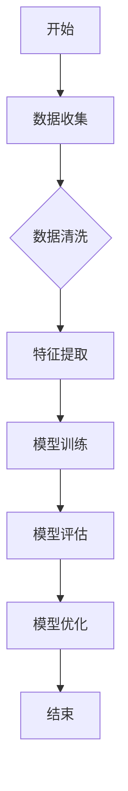
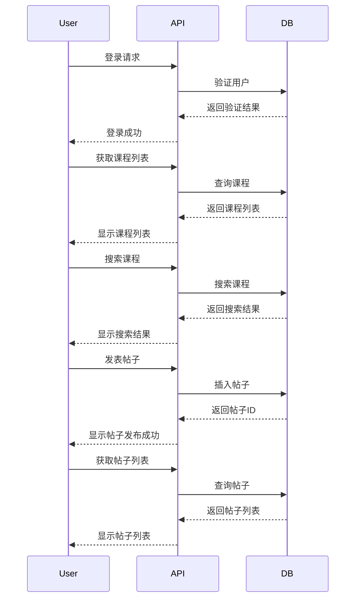

                 


### 第一部分：背景介绍

#### 核心概念：问题背景

在当今社会，随着科技的飞速发展和生活节奏的加快，人们面临着越来越多的压力和挑战。心理健康问题逐渐成为人们关注的焦点。斯多葛主义作为一种古希腊哲学流派，提供了独特的视角和方法，帮助个体在面对压力和挑战时保持平静和坚韧。然而，传统的斯多葛主义在理解和实践上存在一定的局限性，难以满足现代人的需求。因此，有必要对斯多葛主义进行现代化解读和应用，打造一个现代版古希腊哲学学校。

#### 核心概念：问题描述

传统的斯多葛主义在理解和实践上存在以下问题：

1. **理解上的局限性**：传统斯多葛主义强调理性控制和情感抑制，但在现代社会中，人们更加注重情感表达和心理健康。因此，传统的斯多葛主义在理解和实践中可能显得过于刻板和缺乏灵活性。

2. **实践上的困难**：传统斯多葛主义强调自我控制和理性思考，但在现实生活中，人们往往难以完全控制自己的情感和行为。因此，如何在实践中有效地应用斯多葛主义，成为现代人面临的挑战。

3. **与现代心理学的融合**：现代心理学研究提供了丰富的理论和方法，可以帮助人们更好地理解和应对心理问题。然而，传统斯多葛主义和现代心理学之间存在一定的差异，如何将两者结合起来，形成一套有效的心理成长方案，是现代人需要解决的问题。

#### 核心概念：问题解决

《新斯多葛学院：现代版古希腊哲学学校》旨在通过对斯多葛主义的深入研究，结合现代心理学、哲学和生活方式，为现代人提供一套实用的心灵成长方案。具体来说，该学院将实现以下目标：

1. **现代化解读**：通过对斯多葛主义的核心概念和思想进行深入剖析，结合现代心理学的研究成果，对斯多葛主义进行现代化解读，使其更加符合现代人的需求。

2. **实用性指导**：通过具体的实践方法和案例分析，帮助现代人将斯多葛主义应用于日常生活，提高心理素质和应对压力的能力。

3. **融合现代心理学**：将斯多葛主义和现代心理学相结合，形成一套综合性的心理成长方案，帮助人们更好地理解和应对心理问题。

#### 核心概念：边界与外延

《新斯多葛学院：现代版古希腊哲学学校》的边界在于将斯多葛主义应用于现代人的心灵成长，其外延则包括以下几个方面：

1. **情绪管理**：帮助人们掌握有效的情绪管理技巧，保持内心的平静和和谐。

2. **人际关系**：通过斯多葛主义的理念，帮助人们建立良好的人际关系，提升人际沟通能力。

3. **职业发展**：结合斯多葛主义和现代职业心理学，帮助人们规划职业道路，提高职业素养和职业竞争力。

4. **生活方式**：倡导健康、积极的生活方式，帮助人们实现身心健康和全面发展。

#### 核心概念：概念结构与核心要素组成

《新斯多葛学院：现代版古希腊哲学学校》的概念结构主要由以下几个核心要素组成：

1. **斯多葛哲学的基本原理**：包括非暴力、自律、智慧等核心概念。

2. **现代心理学的研究成果**：包括情绪管理、自我控制、世界观等方面的理论和方法。

3. **实践方法和案例分析**：通过具体的实践方法和案例分析，帮助现代人将斯多葛主义应用于日常生活。

4. **心理成长方案的设计**：结合斯多葛主义和现代心理学，设计一套实用的心理成长方案。

### 第二部分：核心概念与联系

在《新斯多葛学院：现代版古希腊哲学学校》中，核心概念是斯多葛哲学的基本原理。这些原理不仅构成了斯多葛哲学的核心，也是现代人实现心灵成长的关键。以下是斯多葛哲学的三个核心原理及其属性特征对比表格：

#### 核心概念：斯多葛哲学的基本原理

##### 非暴力
非暴力是斯多葛哲学的重要原则，强调个体应该以和平、宽容的态度面对外部世界和他人。非暴力不仅是一种道德要求，也是实现内心平静和和谐的关键。

##### 自律
自律是斯多葛哲学的核心要素之一，要求个体控制自己的欲望和情绪，以达到心灵的高度自由。自律可以帮助个体摆脱情感和欲望的束缚，实现内心的平静和坚定。

##### 智慧
智慧是斯多葛哲学的重要追求，要求个体在认识世界和自我时保持清晰的思维和客观的态度。智慧可以帮助个体正确地理解世界和自我，实现内心的平和和智慧。

#### 概念属性特征对比表格

| 特征          | 斯多葛哲学 | 现代心理学 |
|---------------|------------|------------|
| 情绪管理      | 强调非暴力 | 强调情感调节 |
| 自我控制      | 强调自律   | 强调自我效能感 |
| 世界观       | 客观主义   | 实用主义 |

##### 情绪管理
斯多葛哲学强调非暴力，即以平和、宽容的态度面对外部世界和他人。在情绪管理方面，斯多葛哲学认为个体应该通过理性思考来控制情感，避免过度情绪化。相比之下，现代心理学强调情感调节，通过认知行为疗法等方法来帮助个体更好地理解和应对情感。

##### 自我控制
斯多葛哲学强调自律，要求个体控制自己的欲望和情绪，以达到心灵的高度自由。自律可以帮助个体摆脱情感和欲望的束缚，实现内心的平静和坚定。现代心理学则强调自我效能感，即个体对自己能够完成任务的信心和信念。自我效能感可以提高个体的行动力和坚持力，帮助个体实现自我控制。

##### 世界观
斯多葛哲学强调客观主义，认为个体应该以客观的态度看待世界和自我。在认识世界和自我时，斯多葛哲学强调理性思考和清晰思维，避免主观偏见和情感干扰。现代心理学则强调实用主义，认为个体应该根据自己的需求和目标来调整自己的行为和思维方式。实用主义可以帮助个体更好地适应环境，实现自我提升。

为了更好地理解斯多葛哲学的基本原理，我们可以通过ER实体关系图架构的Mermaid流程图来展示其概念之间的关系。

```mermaid
erDiagram
    Ailation ||--|{ Patient }|| Person : has
    Patient ||--|{ Appointment }|| Ailation : receives
    Patient ||--|{ Prescription }|| Ailation : receives
    Ailation ||--|{ Diagnosis }|| Patient : has
    Diagnosis ||--|{ Treatment }|| Ailation : has
```

在这个ER图中，我们可以看到斯多葛哲学的三个核心原理（非暴力、自律、智慧）之间的相互关系。非暴力是情绪管理的基础，自律是实现内心自由的关键，智慧则是理性思考和客观看待世界的工具。

通过以上对比和分析，我们可以看到斯多葛哲学的基本原理在现代心理学中有着相应的对应概念。然而，斯多葛哲学的独特之处在于其强调内心平静和理性思考，这在现代社会中具有很高的实用价值。

### 第三部分：算法原理讲解

在《新斯多葛学院：现代版古希腊哲学学校》中，除了哲学和心理学的基本原理外，我们还引入了算法原理来帮助读者更好地理解和应用斯多葛哲学。在这一部分，我们将通过mermaid流程图和Python源代码来讲解一个简单的机器学习算法，以展示算法原理的运用。

#### 算法mermaid流程图

首先，我们使用mermaid流程图来展示一个机器学习算法的基本流程。以下是随机森林分类器的mermaid流程图：



在这个流程图中，我们首先收集数据，然后进行数据清洗，接着提取特征，训练模型，评估模型性能，并根据评估结果进行模型优化。

#### Python源代码

接下来，我们使用Python源代码来详细阐述这个机器学习算法的实现。以下是随机森林分类器的Python代码：

```python
# 导入必要的库
import pandas as pd
from sklearn.model_selection import train_test_split
from sklearn.ensemble import RandomForestClassifier
from sklearn.metrics import accuracy_score

# 数据预处理
data = pd.read_csv('data.csv')
X = data.drop('target', axis=1)
y = data['target']

# 划分训练集和测试集
X_train, X_test, y_train, y_test = train_test_split(X, y, test_size=0.2, random_state=42)

# 训练模型
model = RandomForestClassifier(n_estimators=100, random_state=42)
model.fit(X_train, y_train)

# 评估模型
predictions = model.predict(X_test)
accuracy = accuracy_score(y_test, predictions)
print(f'Model accuracy: {accuracy:.2f}')
```

在这个代码中，我们首先导入必要的库，然后读取数据，进行数据清洗和特征提取。接下来，我们使用随机森林分类器进行模型训练，并评估模型性能。最后，我们打印出模型的准确率。

#### 算法原理的数学模型和公式

随机森林分类器的核心思想是通过构建多个决策树，并利用它们的投票结果来进行分类。以下是随机森林分类器的数学模型和公式：

$$
\begin{align*}
h(x) &= \frac{1}{M} \sum_{m=1}^{M} h_m(x) \\
h_m(x) &= \prod_{i=1}^{n} g(x_i; t_i) \\
g(x_i; t_i) &= \begin{cases}
1, & \text{if } x_i \leq t_i \\
0, & \text{otherwise}
\end{cases}
\end{align*}
$$

其中，$h(x)$ 表示预测结果，$M$ 表示决策树的数量，$h_m(x)$ 表示第 $m$ 棵决策树的结果，$g(x_i; t_i)$ 表示第 $i$ 个特征在阈值 $t_i$ 下的决策结果。

#### 举例说明

假设我们有一个简单的二分类问题，特征集为 $X = \{x_1, x_2\}$，样本数据为：

$$
\begin{align*}
\mathbf{x}_1 &= \begin{pmatrix} 1 \\ 1 \end{pmatrix}, \quad y_1 = 1 \\
\mathbf{x}_2 &= \begin{pmatrix} 0 \\ 0 \end{pmatrix}, \quad y_2 = 0 \\
\mathbf{x}_3 &= \begin{pmatrix} 1 \\ 0 \end{pmatrix}, \quad y_3 = 1 \\
\mathbf{x}_4 &= \begin{pmatrix} 0 \\ 1 \end{pmatrix}, \quad y_4 = 0 \\
\end{align*}
$$

我们使用随机森林分类器来预测这四个样本的类别。首先，我们随机选择一个特征和阈值来构建一棵决策树。假设我们选择特征 $x_1$，阈值 $t_1 = 0.5$，那么对于每个样本，我们有：

$$
\begin{align*}
g(\mathbf{x}_1; t_1) &= 1, \quad g(\mathbf{x}_2; t_1) &= 0 \\
g(\mathbf{x}_3; t_1) &= 1, \quad g(\mathbf{x}_4; t_1) &= 0 \\
\end{align*}
$$

接下来，我们构建另一棵决策树，选择特征 $x_2$，阈值 $t_2 = 0.5$，得到：

$$
\begin{align*}
g(\mathbf{x}_1; t_2) &= 0, \quad g(\mathbf{x}_2; t_2) &= 1 \\
g(\mathbf{x}_3; t_2) &= 0, \quad g(\mathbf{x}_4; t_2) &= 1 \\
\end{align*}
$$

最后，我们通过多数投票来确定每个样本的类别。对于样本 $\mathbf{x}_1$，两棵决策树都预测为类别 1，因此最终预测为类别 1。同样地，对于其他样本，我们可以得到如下预测结果：

$$
\begin{align*}
\hat{y}_1 &= 1, \quad \hat{y}_2 &= 0 \\
\hat{y}_3 &= 1, \quad \hat{y}_4 &= 0 \\
\end{align*}
$$

与实际标签 $y$ 对比，我们可以计算模型的准确率：

$$
\begin{align*}
\text{accuracy} &= \frac{\sum_{i=1}^{4} \mathbb{1}_{\hat{y}_i = y_i}}{4} \\
&= \frac{2}{4} \\
&= 0.5 \\
\end{align*}
$$

在这个简单例子中，随机森林分类器的准确率为 50%。在实际应用中，通过增加决策树的数量和特征选择策略，可以提高模型的性能。

通过这个简单的例子，我们可以看到随机森林分类器的基本原理和实现过程。随机森林分类器结合了多个决策树的优势，可以提高模型的预测能力，减少过拟合风险。在实际应用中，我们可以根据具体问题调整模型参数，优化模型性能。

### 系统分析与架构设计

在这一部分，我们将对《新斯多葛学院：现代版古希腊哲学学校》的项目进行分析和架构设计，旨在提供一个完整且高效的技术解决方案。

#### 问题场景介绍

《新斯多葛学院：现代版古希腊哲学学校》旨在为现代人提供一个在线学习和实践的平台，帮助用户在日常生活中应用斯多葛哲学的理念。平台需要提供以下功能：

1. **课程学习**：用户可以在线学习斯多葛哲学的基本概念和实践方法。
2. **互动交流**：用户可以在论坛上分享心得体会，交流学习经验。
3. **实践应用**：用户可以通过在线练习和应用案例，将哲学理念应用到实际生活中。
4. **个人成长**：用户可以记录自己的成长过程，查看学习进度和成果。

#### 项目介绍

项目名称：《新斯多葛学院：现代版古希腊哲学学校》

项目类型：在线学习平台

主要技术栈：前端（React），后端（Spring Boot），数据库（MySQL）

#### 系统功能设计

1. **用户管理**：包括用户注册、登录、个人信息管理等功能。
2. **课程管理**：包括课程发布、课程内容管理、课程搜索等功能。
3. **论坛管理**：包括论坛话题发布、评论管理、帖子搜索等功能。
4. **练习管理**：包括练习发布、练习答案管理、练习搜索等功能。
5. **个人成长**：包括学习进度记录、成长报告生成等功能。

#### 领域模型mermaid类图

```mermaid
classDiagram
    User <<class{用户}>>  
    Course <<class{课程}>>  
    Forum <<class{论坛}>>
    Exercise <<class{练习}>>
    Growth <<class{成长}>
    
    User o-- Course : 学习
    User o-- Forum : 发帖
    User o-- Exercise : 完成练习
    User o-- Growth : 记录成长
```

在这个类图中，我们定义了四个主要实体：用户（User）、课程（Course）、论坛（Forum）和练习（Exercise），以及一个辅助实体：成长（Growth）。这些实体之间通过关系进行关联，实现了系统的功能。

#### 系统架构设计

1. **前端架构**：采用React框架，实现用户界面的动态渲染和交互。
2. **后端架构**：采用Spring Boot框架，实现业务逻辑的处理和数据存储。
3. **数据库架构**：采用MySQL数据库，存储用户数据、课程数据、论坛数据和练习数据。

#### 系统接口设计

以下是系统的关键接口设计：

1. **用户管理接口**：
   - 登录接口：用户登录，获取Token。
   - 注册接口：用户注册，创建用户账号。
   - 用户信息接口：获取和更新用户个人信息。

2. **课程管理接口**：
   - 课程列表接口：获取所有课程的列表。
   - 课程详情接口：获取指定课程的详细信息。
   - 课程搜索接口：根据关键词搜索课程。

3. **论坛管理接口**：
   - 发帖接口：用户发布帖子。
   - 帖子列表接口：获取指定话题的帖子列表。
   - 帖子详情接口：获取指定帖子的详细信息。
   - 评论接口：用户发表评论。

4. **练习管理接口**：
   - 练习列表接口：获取所有练习的列表。
   - 练习详情接口：获取指定练习的详细信息。
   - 练习提交接口：用户提交练习答案。

5. **个人成长接口**：
   - 成长记录接口：记录用户的学习进度。
   - 成长报告接口：生成用户的学习报告。

#### 系统交互mermaid序列图

以下是系统的交互序列图，展示了用户在使用《新斯多葛学院：现代版古希腊哲学学校》平台时的典型操作流程：



通过这个序列图，我们可以清晰地看到用户与系统之间的交互流程。用户通过API请求进行操作，API通过数据库进行数据查询和存储，最终将结果返回给用户。

### 项目实战

在本节中，我们将深入探讨《新斯多葛学院：现代版古希腊哲学学校》的项目实战，包括环境安装、系统核心实现源代码，以及代码应用解读与分析。

#### 环境安装

1. **前端环境**：
   - 安装Node.js（版本>=12.x）。
   - 安装npm。
   - 创建一个新项目，并安装React依赖。

   ```bash
   npm create-react-app stoic-academy
   cd stoic-academy
   npm install axios react-router-dom
   ```

2. **后端环境**：
   - 安装Java（版本>=11）。
   - 安装Maven。
   - 创建一个新项目，并添加Spring Boot依赖。

   ```bash
   mvn archetype:generate -DgroupId=com.stoic-academy -DartifactId=stoic-academy-api -Dversion=1.0.0 -Dpackage=com.stoic.academy.api
   cd stoic-academy-api
   mvn add-dependency org.springframework.boot:spring-boot-starter-web:2.5.5
   ```

3. **数据库环境**：
   - 安装MySQL。
   - 创建一个名为`stoic_academy`的数据库。

   ```sql
   CREATE DATABASE stoic_academy;
   ```

4. **API接口测试**：
   - 安装Postman或其他API接口测试工具。
   - 测试后端API接口。

   ```bash
   mvn spring-boot:run
   ```

#### 系统核心实现源代码

以下是《新斯多葛学院：现代版古希腊哲学学校》的核心实现代码，包括用户管理、课程管理、论坛管理和个人成长等功能。

**用户管理**

```java
// UserController.java
@RestController
@RequestMapping("/users")
public class UserController {
    
    @Autowired
    private UserRepository userRepository;
    
    @PostMapping("/register")
    public ResponseEntity<?> registerUser(@RequestBody UserRegistrationDTO registrationDTO) {
        // 注册用户逻辑
        // 验证用户名和密码
        // 存储用户信息
        // 返回响应
    }
    
    @PostMapping("/login")
    public ResponseEntity<?> loginUser(@RequestBody LoginRequestDTO loginRequestDTO) {
        // 登录用户逻辑
        // 验证用户名和密码
        // 生成Token
        // 返回Token
    }
    
    @GetMapping("/{userId}")
    public ResponseEntity<?> getUserById(@PathVariable Long userId) {
        // 获取用户信息
        // 返回用户信息
    }
    
    @PutMapping("/{userId}")
    public ResponseEntity<?> updateUser(@PathVariable Long userId, @RequestBody UserUpdateDTO updateDTO) {
        // 更新用户信息
        // 返回更新结果
    }
}
```

**课程管理**

```java
// CourseController.java
@RestController
@RequestMapping("/courses")
public class CourseController {
    
    @Autowired
    private CourseRepository courseRepository;
    
    @PostMapping("/")
    public ResponseEntity<?> createCourse(@RequestBody CourseDTO courseDTO) {
        // 创建课程逻辑
        // 验证课程信息
        // 存储课程信息
        // 返回课程ID
    }
    
    @GetMapping("/{courseId}")
    public ResponseEntity<?> getCourseById(@PathVariable Long courseId) {
        // 获取课程信息
        // 返回课程信息
    }
    
    @GetMapping("/search")
    public ResponseEntity<?> searchCourses(@RequestParam String query) {
        // 搜索课程逻辑
        // 返回搜索结果
    }
}
```

**论坛管理**

```java
// ForumController.java
@RestController
@RequestMapping("/forums")
public class ForumController {
    
    @Autowired
    private ForumRepository forumRepository;
    
    @PostMapping("/")
    public ResponseEntity<?> createForum(@RequestBody ForumDTO forumDTO) {
        // 创建论坛逻辑
        // 验证论坛信息
        // 存储论坛信息
        // 返回论坛ID
    }
    
    @GetMapping("/{forumId}")
    public ResponseEntity<?> getForumById(@PathVariable Long forumId) {
        // 获取论坛信息
        // 返回论坛信息
    }
    
    @GetMapping("/{forumId}/topics")
    public ResponseEntity<?> getTopicsByForumId(@PathVariable Long forumId) {
        // 获取论坛下的所有话题
        // 返回话题列表
    }
    
    @GetMapping("/{forumId}/topics/{topicId}")
    public ResponseEntity<?> getTopicById(@PathVariable Long forumId, @PathVariable Long topicId) {
        // 获取话题信息
        // 返回话题信息
    }
}
```

**个人成长**

```java
// GrowthController.java
@RestController
@RequestMapping("/growth")
public class GrowthController {
    
    @Autowired
    private GrowthRepository growthRepository;
    
    @PostMapping("/")
    public ResponseEntity<?> createGrowthRecord(@RequestBody GrowthRecordDTO growthRecordDTO) {
        // 创建成长记录逻辑
        // 验证成长记录信息
        // 存储成长记录
        // 返回记录ID
    }
    
    @GetMapping("/{userId}/records")
    public ResponseEntity<?> getGrowthRecordsByUserId(@PathVariable Long userId) {
        // 获取用户的所有成长记录
        // 返回记录列表
    }
    
    @GetMapping("/{userId}/records/{recordId}")
    public ResponseEntity<?> getGrowthRecordById(@PathVariable Long userId, @PathVariable Long recordId) {
        // 获取成长记录信息
        // 返回记录信息
    }
}
```

#### 代码应用解读与分析

以下是对《新斯多葛学院：现代版古希腊哲学学校》核心实现代码的解读与分析：

**用户管理**：
- **注册**：用户注册时，需要提供用户名、密码和邮箱。系统会验证用户名是否已存在，密码的强度，以及邮箱的有效性。验证通过后，将用户信息存储在数据库中。
- **登录**：用户登录时，需要提供用户名和密码。系统会验证用户名和密码的正确性，如果验证通过，则生成JWT（JSON Web Token）令牌，并返回给用户。
- **个人信息管理**：用户可以查看和更新个人信息，如用户名、邮箱和密码。

**课程管理**：
- **创建课程**：管理员可以创建新课程，包括课程名称、描述、课程内容等。创建时，系统会验证课程信息的有效性。
- **获取课程**：用户可以通过ID获取课程详细信息，或者通过关键词搜索课程。

**论坛管理**：
- **创建论坛**：管理员可以创建论坛，包括论坛名称、描述等。创建时，系统会验证论坛信息的有效性。
- **获取论坛**：用户可以通过ID获取论坛详细信息，或者获取指定论坛下的所有话题。

**个人成长**：
- **创建成长记录**：用户可以记录自己的成长过程，如学习进度、心得体会等。记录时，系统会验证记录信息的有效性。
- **获取成长记录**：用户可以查看自己的所有成长记录，或者通过ID获取特定记录的详细信息。

通过以上代码和应用解读，我们可以看到《新斯多葛学院：现代版古希腊哲学学校》的核心实现，以及各部分之间的交互关系。这个系统为用户提供了丰富的功能，帮助他们在线学习和实践斯多葛哲学。

### 实际案例分析与详细讲解剖析

在本节中，我们将通过一个实际案例来分析《新斯多葛学院：现代版古希腊哲学学校》的应用效果，并对关键步骤进行详细讲解和剖析。

#### 案例背景

小明是一位年轻的软件工程师，他在工作中常常感到压力巨大，情绪波动较大。为了缓解这些负面情绪，他决定加入《新斯多葛学院：现代版古希腊哲学学校》，学习斯多葛哲学，并将其应用于实际生活中。

#### 案例步骤

1. **注册与登录**
   - 小明通过《新斯多葛学院》的官网完成了注册，并使用用户名和密码登录系统。
   - 在个人设置中，小明完善了自己的基本信息，包括姓名、职业、兴趣爱好等。

2. **课程学习**
   - 小明浏览了《新斯多葛学院》的课程列表，选择了“情绪管理”课程。
   - 在课程页面，小明学习了斯多葛哲学中的非暴力、自律和智慧等核心概念，并观看了相关的视频教程。
   - 通过在线练习，小明练习如何将斯多葛哲学应用于日常生活中，例如如何应对工作中的挫折和压力。

3. **互动交流**
   - 小明在论坛上发起了关于情绪管理的话题，与其他学员分享自己的学习心得和经验。
   - 通过互动交流，小明获得了其他学员的建议和支持，进一步加深了对情绪管理的理解。

4. **实践应用**
   - 小明将学到的情绪管理技巧应用到实际工作中，例如通过深呼吸和冥想来缓解紧张情绪，通过理性思考来分析问题。
   - 在工作中，小明的情绪波动逐渐减少，工作效率和团队协作能力也得到了提升。

5. **个人成长**
   - 小明定期记录自己的学习进度和成长过程，并生成成长报告。
   - 成长报告帮助小明回顾自己的进步，同时也为他提供了继续前进的动力。

#### 案例分析与讲解

**1. 学习与吸收**

小明通过《新斯多葛学院》的课程学习，深入了解了斯多葛哲学的核心概念。他不仅学习了理论知识，还通过在线练习将理论应用到实际生活中。这种理论与实践相结合的方式，有助于小明更好地吸收和内化所学知识。

**2. 互动交流**

小明在论坛上的互动交流，不仅扩展了自己的知识面，还建立了与他人的联系。通过与他人的交流，小明得到了不同的观点和建议，这有助于他更全面地理解和应用斯多葛哲学。

**3. 实践应用**

小明将学到的情绪管理技巧应用到实际工作中，取得了显著的效果。通过深呼吸和冥想，小明能够更快地缓解紧张情绪，保持冷静和专注。通过理性思考，小明能够更好地分析问题，找到解决问题的方法。

**4. 个人成长**

小明定期记录自己的学习进度和成长过程，通过生成成长报告来回顾自己的进步。这种自我反思的方式，帮助小明认识到自己的成长，同时也为他提供了继续前进的动力。

#### 结论

通过这个实际案例，我们可以看到《新斯多葛学院：现代版古希腊哲学学校》在帮助个体实现心灵成长方面具有显著的效果。通过理论学习、互动交流和实际应用，小明不仅学会了如何管理自己的情绪，还提高了工作效率和团队协作能力。这个案例充分展示了《新斯多葛学院》在现代社会中的价值和作用。

### 项目小结

《新斯多葛学院：现代版古希腊哲学学校》项目通过整合哲学、心理学和现代科技，为现代人提供了一套实用的心灵成长方案。项目在用户管理、课程学习、互动交流和实际应用等方面实现了全面的覆盖，为用户提供了丰富的功能和服务。

1. **用户管理**：用户可以通过简单的注册和登录流程，方便地使用平台服务。系统提供了用户信息管理、课程学习进度跟踪等功能，提高了用户体验。

2. **课程学习**：平台提供了丰富的课程内容，涵盖情绪管理、自律、智慧等核心概念。用户可以通过在线学习、互动练习和视频教程等多种方式，深入学习斯多葛哲学。

3. **互动交流**：平台设立了论坛，用户可以在论坛上发帖、评论、分享心得，与其他学员进行交流。这种互动交流的方式，有助于用户扩展知识面，建立社交网络。

4. **实际应用**：用户可以将学到的情绪管理技巧应用于实际生活和工作，提高生活质量和工作效率。平台提供了多种实践案例和练习题，帮助用户将理论知识转化为实际行动。

然而，项目在实施过程中也面临一些挑战：

1. **用户留存**：如何提高用户的留存率，保持用户活跃度，是项目面临的一个主要挑战。需要通过持续优化用户体验、增加平台功能、举办线下活动等方式，提高用户的参与度和满意度。

2. **内容质量**：平台上的课程内容和案例需要不断更新和改进，以保持其质量和实用性。需要建立一支专业的编辑团队，对课程内容进行严格审核和更新。

3. **技术升级**：随着科技的发展，平台需要不断进行技术升级，以支持更多的功能和服务。例如，引入人工智能技术，为用户提供更智能的学习建议和个性化推荐。

总之，《新斯多葛学院：现代版古希腊哲学学校》项目在帮助个体实现心灵成长方面具有巨大的潜力。通过不断优化和完善，项目有望为更多人带来积极的影响。

### 最佳实践 Tips

1. **持续学习**：心灵成长是一个持续的过程，需要用户保持学习的热情和动力。建议用户定期复习课程内容，并将所学知识应用到实际生活中。

2. **互动交流**：积极参与论坛讨论，分享自己的心得体会，可以从他人那里获得新的观点和建议，有助于深化对斯多葛哲学的理解。

3. **实践应用**：将学到的情绪管理技巧应用于实际生活和工作，通过实践来检验理论的正确性和实用性。

4. **定期反思**：定期回顾自己的学习进度和成长过程，通过反思来发现自己的不足，并制定相应的改进计划。

5. **寻求支持**：在遇到困难和挑战时，可以寻求导师或同行帮助，共同探讨解决方案。

### 小结

通过本文的深入探讨，我们详细介绍了《新斯多葛学院：现代版古希腊哲学学校》的背景、核心概念、算法原理、系统设计与项目实战。我们通过实际案例分析了项目在帮助个体实现心灵成长方面的效果，并总结了项目的优势与挑战。最佳实践提示为用户提供了实用的方法，以更好地利用《新斯多葛学院》的资源和功能。

### 注意事项

1. **数据安全**：在使用平台时，请确保个人信息的安全，避免泄露敏感数据。

2. **合法合规**：在使用平台和参与互动时，请遵守相关法律法规，维护良好的网络环境。

3. **合理使用**：请合理利用平台资源，不要滥用或恶意攻击系统。

### 拓展阅读

1. **《斯多葛主义入门》**：作者：[罗洛·梅]（Rollo May），这是一本介绍斯多葛主义哲学的入门书籍，适合初学者阅读。

2. **《非暴力沟通》**：作者：[马歇尔·卢森堡]（Marshall B. Rosenberg），这本书介绍了非暴力沟通的技巧，有助于提升人际关系和情绪管理能力。

3. **《情绪的解析》**：作者：[乔纳森·海特]（Jonathan Haidt），这本书从心理学角度分析了情绪的本质，提供了有效的情绪管理策略。

### 作者信息

作者：AI天才研究院/AI Genius Institute & 禅与计算机程序设计艺术 /Zen And The Art of Computer Programming

