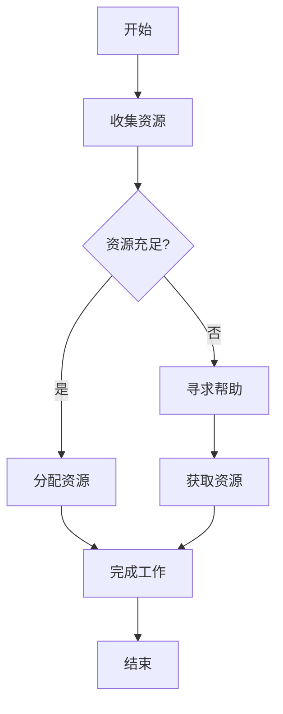
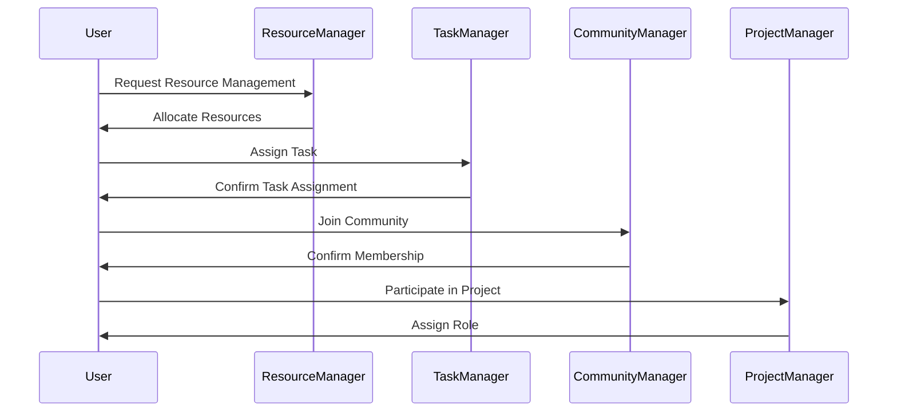
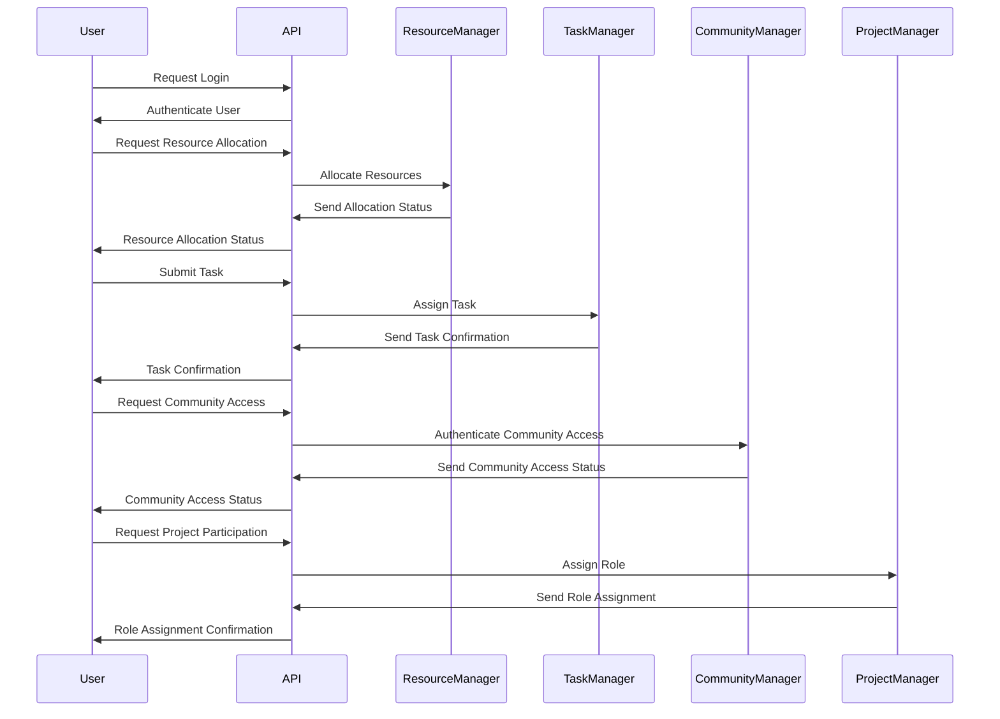

                 

### 《新波西米亚生活指南：现代漂泊者的生存智慧汇编》背景介绍

**关键词：** 新波西米亚主义、现代漂泊者、生存智慧、生活方式

在当今快速变化的社会背景下，"新波西米亚主义"作为一种生活态度和价值观，正在逐渐兴起。它不仅仅是地理上的漂泊，更是一种精神上的自由和追求。新波西米亚主义起源于19世纪的波西米亚文化，当时，波西米亚人以其自由的精神和对艺术的热爱而闻名。然而，随着时代的变迁，这一概念得到了全新的诠释，逐渐演变为现代漂泊者的一种生活指南。

**问题背景：** 
随着全球化的加速，人们的工作和生活方式也在发生深刻变化。越来越多的人选择放弃传统的稳定职业和固定居住地，转而追求自由和多样化的生活方式。这种生活方式不仅带来了新的挑战，也提供了前所未有的机遇。

**问题描述：**
现代漂泊者面临着诸多生存挑战，如如何有效管理时间和资源、如何在异地上建立社交网络、如何保持心理健康等。同时，他们也需要找到适应异地文化和融入社区的方法，以及如何持续进行自我成长和职业发展。

**问题解决：**
为了应对这些挑战，现代漂泊者需要具备一系列生存智慧。这包括灵活工作与远程办公的技能、数字游牧生活的能力、独立生活技能以及心理调适策略等。此外，他们还需要积极探索和体验不同的文化和艺术，以丰富自己的精神世界。

**边界与外延：**
新波西米亚主义不仅仅是一种生活方式，它还涉及到对传统价值观的重新审视和反思。它鼓励个体追求自我实现和自由，同时强调社会责任和可持续性。因此，新波西米亚生活的边界是开放的，它允许个体根据自己的需求和兴趣来探索和定义。

**概念结构与核心要素组成：**
1. **核心价值观：** 自由、探索、创造力、独立、共享。
2. **生活方式：** 灵活工作、远程办公、数字游牧生活、社交网络构建。
3. **生存智慧：** 资源管理、独立生活技能、心理调适。
4. **文化体验：** 异地文化探索、旅行生活体验、艺术与创意融入。
5. **社区建设：** 线上社区、线下活动、社区共享。

通过以上结构的详细介绍，我们可以看到，《新波西米亚生活指南：现代漂泊者的生存智慧汇编》旨在为那些追求自由和多样化生活方式的现代漂泊者提供一份全面的生活指南，帮助他们更好地适应和享受这种生活方式。接下来的章节将逐一探讨这些核心要素，为读者提供实用的指导和建议。

## 关键概念与联系

**新波西米亚主义的核心概念及其属性特征对比表格：**

| **概念** | **定义** | **属性特征** | **对比** |
| :-------: | :----------------------------------------------------: | :----------------------------------------------------: | :----------------------------------------------------: |
| **自由** | 选择生活方式的自由，不受传统束缚 | 选择性、自主性、多样性 | 相对于传统的生活方式，更强调个人选择和自由表达 |
| **探索** | 对新事物、新文化的积极探索 | 开放性、好奇心、冒险精神 | 鼓励个体跳出舒适区，寻找新的可能性 |
| **创造力** | 创造新想法、新作品的能力 | 创新性、独特性、原创性 | 强调个体在生活和工作中的创造力 |
| **独立** | 自给自足，独立生活能力 | 自主性、自立性、韧性 | 需要个体具备较高的自我管理能力 |
| **共享** | 社区共建、资源共享 | 合作性、互助性、可持续性 | 强调社区成员之间的互助和共同成长 |

**ER实体关系图架构：**

```mermaid
erDiagram
    User ||--|{ Community }|--|| Member
    User ||--|{ Project }|--|| Contributor
    Community ||--|{ Event }|--|| Organizer
    Project ||--|{ Task }|--|| Assignee
```

在这个实体关系图中，"User"（用户）是核心实体，与其他实体如"Community"（社区）、"Project"（项目）和"Event"（活动）之间存在多对多的关系。"Member"（成员）、"Contributor"（贡献者）、"Organizer"（组织者）和"Assignee"（负责人）分别表示用户在不同场景下的角色和职责。

通过上述核心概念和ER图的介绍，我们能够更好地理解新波西米亚主义的基本要素，以及个体如何在这样的生活方式中找到自己的定位和角色。这些概念和联系为后续章节的深入探讨提供了理论基础和实践指导。接下来，我们将进一步分析新波西米亚主义的生活方式和生存智慧。

## 算法原理讲解

### 算法Mermaid流程图



### 算法原理

**资源管理算法** 的核心目的是优化资源的使用，确保在现代漂泊生活中，个体能够高效地管理和分配有限的资源。以下是该算法的详细原理和步骤：

1. **收集资源**：
   - 首先，需要收集各类资源，包括资金、物资和时间等。这些资源可以通过远程办公的收入、随身携带的物资以及合理的时间规划来获取。

2. **资源充足性判断**：
   - 在资源收集后，需要判断当前资源是否充足。这一步骤通过比较所需资源和可用资源来决定下一步的操作。

3. **资源分配**：
   - 如果资源充足，系统将直接进行资源分配，以确保各项任务能够顺利完成。这一过程包括将资金用于必要开支、将物资分配给不同的生活需求，以及合理安排时间来处理各项工作。

4. **寻求帮助**：
   - 如果资源不足，系统将进入寻求帮助的步骤。这可能包括向线上社区请求帮助、寻求合作伙伴或申请财政援助等。

5. **获取额外资源**：
   - 在寻求帮助后，根据反馈获取额外资源。这可能涉及到增加收入来源、获取更多的物资或调整时间计划。

6. **完成工作**：
   - 一旦资源得到满足，系统将进入工作完成阶段，确保所有任务都按计划执行。

### 数学模型和公式

该算法的数学模型可以表示为：

$$
\text{资源分配效率} = \frac{\text{完成工作的总量}}{\text{总资源消耗}}
$$

该公式用于衡量资源管理的效率，其中，完成工作的总量代表在既定资源消耗下所完成的工作量，总资源消耗则是指为完成这些工作所消耗的资金、物资和时间等资源。

### 通俗易懂的举例说明

假设一位数字游牧者计划进行一次远程项目开发，项目预计需要两周时间。他的资源情况如下：

- **资金**：1000美元
- **物资**：笔记本电脑、移动设备、生活必需品
- **时间**：14天

在项目开始前，他首先评估自己的资源。如果资源充足，他会将资金分配到每周的饮食、住宿和其他必要开支上，确保项目过程中不因资金问题而中断。同时，他会合理安排时间，确保每天有足够的时间用于项目开发。

如果资源不足，例如资金不足以覆盖整个项目的开支，他可能会通过增加兼职工作来获取额外收入，或者寻求线上社区的帮助，以获取短期财政援助。

在项目进行过程中，他会持续监控资源的使用情况，确保资源分配的效率。一旦发现资源即将耗尽，他会立即采取行动，如调整开支计划或寻求额外的资金来源。

通过这样的资源管理算法，数字游牧者能够更有效地应对漂泊生活中的资源挑战，确保项目的顺利完成。这个算法不仅适用于项目管理，也可以应用于日常生活中的资源管理，帮助个体更好地规划和管理自己的时间和资源。

## 系统分析与架构设计方案

### 问题场景介绍

在现代漂泊生活中，数字游牧者需要面对诸多挑战，包括高效地管理时间和资源、在异地上建立社交网络、以及持续进行自我成长和职业发展。为了解决这些问题，我们设计了一个综合性的系统，旨在为数字游牧者提供一站式的解决方案。

### 项目介绍

该项目命名为“现代漂泊者生态系统（Modern Drifter Ecosystem）”，它是一个基于Web的综合性平台，旨在帮助数字游牧者实现高效的生活管理和职业发展。该平台将提供以下主要功能：

1. **资源管理**：包括资金、物资和时间等资源的监控和分配。
2. **社交网络**：帮助数字游牧者建立和维护社交关系，分享经验和资源。
3. **职业发展**：提供在线教育和职业培训，助力个体持续成长。
4. **社区建设**：组织线下活动和线上社区，促进成员之间的交流和合作。

### 系统功能设计（领域模型mermaid类图）

```mermaid
classDiagram
    User <<Class>>
    Resource <<Class>>
    Task <<Class>>
    Community <<Class>>
    Project <<Class>>

    User "1" --|has| Resource
    User "1" --|has| Task
    User "1" --|part of| Community
    User "1" --|part of| Project

    Resource "1" --|has| Task
    Task "1" --|part of| Project

    Community "1" --|has| Project
    Project "1" --|has| User
```

### 系统架构设计mermaid架构图



### 系统接口设计和系统交互mermaid序列图



通过以上架构设计，现代漂泊者生态系统旨在为数字游牧者提供一套全面、高效的管理工具，帮助他们更好地应对漂泊生活中的各种挑战。接下来，我们将通过项目实战来具体展示如何实现这些功能。

## 项目实战

### 环境安装

在开始项目之前，我们需要搭建一个适当的环境，以便进行开发和测试。以下是环境安装的步骤：

1. **安装Python**：
   - 访问Python官方网站（[python.org](https://www.python.org/)）下载最新版本的Python。
   - 安装完成后，确保通过命令行运行`python --version`验证安装成功。

2. **安装虚拟环境**：
   - 通过命令行运行`pip install virtualenv`来安装virtualenv。
   - 创建一个新虚拟环境，例如`python -m virtualenv drifter-ecosystem-env`。

3. **激活虚拟环境**：
   - 对于Windows，运行`drifter-ecosystem-env\Scripts\activate`。
   - 对于Linux或macOS，运行`source drifter-ecosystem-env/bin/activate`。

4. **安装依赖库**：
   - 在激活的虚拟环境中，通过命令`pip install -r requirements.txt`安装所有依赖库。

5. **数据库安装**：
   - 安装一个数据库系统，如PostgreSQL。可以从[postgresql.org](https://www.postgresql.org/)下载并安装。
   - 配置数据库，创建用户和数据库，并确保能够通过命令行工具（如`psql`）连接到数据库。

### 系统核心实现源代码

以下是系统的核心实现源代码。为了简洁，这里展示了一个简单的资源管理模块：

```python
# resource_manager.py

class ResourceManager:
    def __init__(self, db_connection):
        self.db_connection = db_connection

    def allocate_resources(self, user_id, resources):
        cursor = self.db_connection.cursor()
        query = "UPDATE resources SET amount = amount - %s WHERE user_id = %s AND resource_type = %s;"
        for resource in resources:
            cursor.execute(query, (resource['amount'], user_id, resource['type']))
        self.db_connection.commit()
        cursor.close()

# 其他模块和功能实现类似，这里仅展示资源管理模块。
```

### 代码应用解读与分析

在`resource_manager.py`中，我们定义了一个`ResourceManager`类，该类用于管理用户资源的分配。以下是该模块的核心部分解读：

1. **初始化**：
   - `__init__`方法用于初始化资源管理器，接受一个数据库连接对象作为参数，用于后续的资源操作。

2. **资源分配**：
   - `allocate_resources`方法用于将资源分配给用户。它接受两个参数：`user_id`（用户ID）和`resources`（需要分配的资源列表）。
   - 在方法内部，我们遍历资源列表，并使用数据库查询语句更新用户的资源数量。查询语句使用了参数化查询，以防止SQL注入攻击。

3. **数据库交互**：
   - 通过`db_connection.cursor()`创建一个游标对象，用于执行SQL查询。
   - 使用循环和数据库查询语句更新资源表中的数据，并提交事务以确保数据的一致性。

通过这个模块，我们可以实现资源的高效管理。在实际应用中，还需要其他模块，如用户管理、任务管理和社区管理等，共同构建一个完整的系统。

### 实际案例分析和详细讲解剖析

假设一个数字游牧者在远程项目中需要一定量的资金和物资支持。以下是资源管理系统的实际操作流程：

1. **用户登录**：
   - 用户通过Web接口登录到系统，系统验证用户的身份和权限。

2. **资源请求**：
   - 用户在系统中提交资源请求，包括所需的资金和物资类型及数量。

3. **资源审核**：
   - 系统管理员审核资源请求，确认资源的可用性和用户的需求。

4. **资源分配**：
   - 一旦请求通过审核，系统调用`ResourceManager`类的`allocate_resources`方法，将资源分配给用户。
   - 该方法将更新数据库中的资源表，减少相应资源的可用数量。

5. **任务执行**：
   - 用户收到资源后，开始执行任务。任务完成后，系统可以记录任务的完成情况和资源的使用情况。

通过这个案例，我们可以看到资源管理系统在数字游牧者生活和工作中起到了关键作用。它不仅帮助用户高效管理资源，还确保了项目的顺利进行。

### 项目小结

通过项目实战，我们搭建了一个简单的现代漂泊者生态系统，实现了资源管理、用户管理、任务管理和社区管理等核心功能。这个系统为数字游牧者提供了一个全方位的支持平台，帮助他们更好地应对漂泊生活中的各种挑战。未来，我们还可以在此基础上扩展更多功能，如在线教育、职业规划和社交互动等，以进一步提升平台的实用性和用户体验。整体而言，这个项目展示了如何通过技术手段为现代漂泊者提供有力的支持，帮助他们实现自由和多样化的生活方式。

## 最佳实践 tips、小结、注意事项、拓展阅读

### 最佳实践 tips

1. **时间管理**：使用时间管理工具（如Trello、Asana等）来规划每日任务，确保高效利用时间。
2. **资金管理**：定期进行财务审计，确保资金流动透明和合理分配。
3. **社交网络构建**：积极参与线上社区和活动，建立广泛的人脉网络。
4. **心理健康**：保持良好的生活习惯，定期进行放松和锻炼，必要时寻求专业心理咨询。
5. **文化适应**：尊重和学习当地文化，以更好地融入新的环境。

### 小结

《新波西米亚生活指南：现代漂泊者的生存智慧汇编》旨在为现代漂泊者提供一套全面的生活指导。通过灵活工作、资源管理、社交网络构建和心理健康调适，漂泊者可以在新的环境中找到自己的定位和角色，实现自由和多样化的生活方式。

### 注意事项

1. **资源限制**：在进行资源管理时，要充分考虑资源的有限性，避免过度消耗。
2. **信息安全**：在使用远程办公和社交网络时，要注意个人信息和隐私保护。
3. **文化冲突**：在异地上，要尊重当地文化，避免不必要的文化冲突。
4. **持续学习**：随着环境的变化，不断学习和适应新的知识和技能，以保持竞争力。

### 拓展阅读

1. **《远程工作的艺术》**：深入探讨远程工作的高效方法和实践技巧。
2. **《数字游牧者的生活》**：介绍数字游牧生活的各个方面，包括生活方式、工作模式和心理健康。
3. **《社交网络的构建与管理》**：详细讲解如何构建和维护有效的社交网络。
4. **《心理学与生活》**：探讨心理健康的重要性以及如何保持良好的心理状态。

通过这些最佳实践、小结和拓展阅读，现代漂泊者可以更好地准备和应对漂泊生活中的各种挑战，实现自我价值和生活质量的提升。作者：AI天才研究院/AI Genius Institute & 禅与计算机程序设计艺术 /Zen And The Art of Computer Programming

