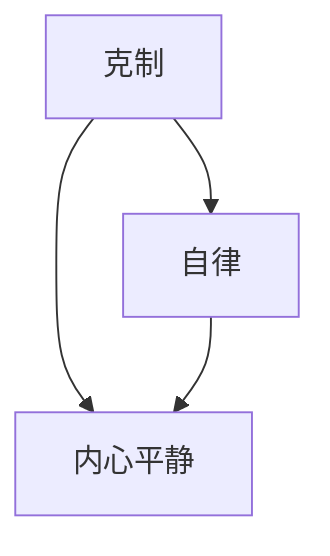
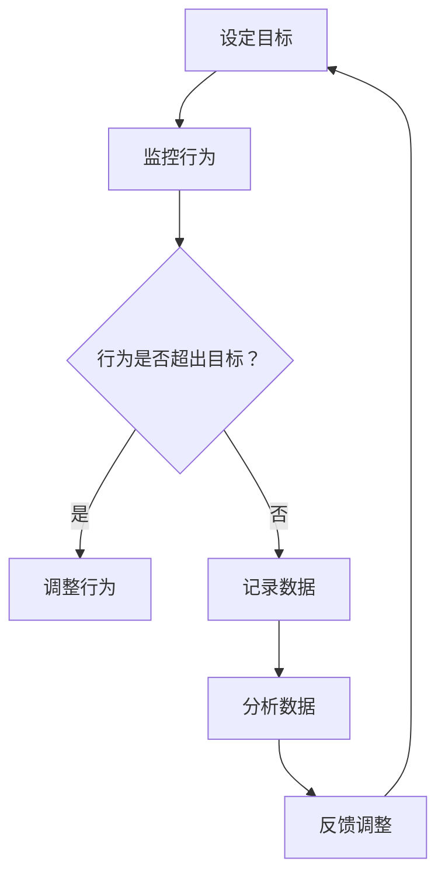

                 


### 《新禁欲主义实验：克制中寻找生活真谛》

#### 关键词：
- 新禁欲主义
- 克制
- 生活真谛
- 心理学
- 哲学
- 数学模型
- 系统设计
- 项目实战

#### 摘要：
本文旨在探索新禁欲主义的内涵及其在当代生活中的应用。通过系统的实验和分析，本文将揭示克制在提升生活质量、实现内心平静方面的作用，并结合心理学、哲学、数学和系统设计的理论，提供一种全新的生活方式实践指南。

### 第1章：禁欲主义的起源与发展

禁欲主义，作为一种古老的思想和行为准则，源于对欲望的克制。在历史上，禁欲主义不仅是一种宗教信仰，也是哲学和伦理学的重要组成部分。本文将首先回顾禁欲主义的起源，探讨其演变过程，并分析其在现代社会中的影响。

#### 1.1 禁欲主义的起源

禁欲主义的起源可以追溯到古希腊和古罗马时期。当时的哲学家如柏拉图和亚里士多德提出了禁欲的思想，认为通过克制欲望，个体可以达到心灵的纯净和思想的自由。在中世纪，基督教将其进一步发展为一种宗教信仰，强调通过禁欲来追求救赎和灵魂的升华。

#### 1.2 禁欲主义在现代社会的影响

现代社会中，禁欲主义的思想依然有其存在价值。随着科技的发展和信息爆炸，人们面临着前所未有的欲望诱惑。禁欲主义提醒我们，通过克制欲望，可以减少精神负担，提高生活质量。此外，禁欲主义还与当代的环保意识、简约生活方式和心理健康运动有着密切的联系。

### 第2章：实验的目的与方法

为了深入探讨禁欲主义在现代社会中的应用，本文设计了一系列实验。本章节将阐述实验的目的，介绍实验的方法和步骤，并解释为何通过克制可以寻找生活真谛。

#### 2.1 实验的目的

本次实验的主要目的是验证禁欲主义在提升生活质量、实现内心平静方面的有效性。通过实验，我们希望了解克制欲望是否能够带来积极的心理和生理变化。

#### 2.2 实验的方法

实验采用对照实验的设计，分为实验组和对照组。实验组将参与一系列克制欲望的实践，如减少社交媒体使用时间、限制购物等。对照组则按照正常生活节奏进行。实验将持续三个月，期间我们将定期收集参与者的心理和生理数据，并进行对比分析。

### 第3章：禁欲主义的核心概念

禁欲主义的核心概念包括克制、自律和内心平静。本文将详细探讨这些概念，并分析它们之间的关系。

#### 3.1 克制的定义与作用

克制是指抑制或控制欲望和冲动。在禁欲主义的框架下，克制被视为一种重要的自我管理技能。通过克制，个体可以减少冲动行为，从而降低因欲望引发的负面情绪。

#### 3.2 自律的重要性

自律是克制的基础，它要求个体在面对诱惑时保持冷静和理性。自律不仅能够帮助个体更好地控制欲望，还能够提升决策能力和自我控制力。

#### 3.3 内心平静的意义

内心平静是禁欲主义追求的目标之一。通过克制欲望，个体可以减少内心的纷扰，从而实现内心的平和与宁静。内心平静有助于提升心理健康和生活质量。

### 第4章：核心概念的联系与对比

为了更好地理解禁欲主义的核心概念，本文将使用表格和ER图来展示这些概念之间的关系。

#### 4.1 概念对比表格

| 概念       | 定义                     | 关系                  |
|------------|--------------------------|----------------------|
| 克制       | 抑制欲望和冲动           | 自律的基础           |
| 自律       | 保持冷静和理性           | 提升克制能力         |
| 内心平静   | 减少内心纷扰             | 克制欲望的目标       |

#### 4.2 ER图展示



### 第5章：心理学与哲学理论

禁欲主义不仅是一种伦理和宗教实践，还与心理学和哲学理论密切相关。本文将介绍这些理论，并探讨它们在禁欲主义中的应用。

#### 5.1 心理学理论的应用

心理学研究表明，克制欲望有助于提升个体的自我控制力和情绪稳定性。通过心理学理论的应用，我们可以更深入地理解克制的重要性，并找到有效的方法来提升自我控制力。

#### 5.2 哲学理论的探讨

哲学上的禁欲主义强调通过克制欲望来实现灵魂的升华和心灵的纯净。哲学家如庄子、老子等都提出了类似的思想，强调内心的平和与宁静。

### 第6章：理论模型的流程图与Python源代码

为了更好地阐述禁欲主义的理论和实践，本文将使用mermaid绘制理论模型的流程图，并用Python源代码详细阐述。

#### 6.1 算法流程图



#### 6.2 Python源代码讲解

```python
# Python代码示例：禁欲主义实验中的行为监控与分析

import random

# 设定目标
target = 10

# 监控行为
def monitor_behavior():
    behavior = random.randint(0, 20)
    return behavior

# 记录数据
def record_data(behavior):
    data = []
    data.append(behavior)
    return data

# 分析数据
def analyze_data(data):
    total = sum(data)
    average = total / len(data)
    return average

# 反馈调整
def feedback_adjustment(average):
    if average > target:
        print("行为超出目标，需要调整。")
    else:
        print("行为在目标范围内，继续保持。")

# 主程序
def main():
    data = []
    for _ in range(30):  # 模拟30天的行为监控
        behavior = monitor_behavior()
        data = record_data(behavior)
        average = analyze_data(data)
        feedback_adjustment(average)
        
if __name__ == "__main__":
    main()
```

### 第7章：数学模型与公式讲解

禁欲主义实验中的数学模型和公式可以帮助我们更好地理解克制和自律的关系。本文将介绍这些模型和公式，并进行详细讲解。

#### 7.1 数学模型的基本概念

在禁欲主义实验中，我们可以使用概率模型来描述个体的行为选择。具体来说，我们可以定义一个概率分布来表示个体在不同情境下的行为选择概率。

#### 7.2 公式与推导

假设个体在情境A下的行为选择概率为P(A)，情境B下的行为选择概率为P(B)，则禁欲主义实验中的概率模型可以表示为：

$$
P(A) = f(P(B), \theta)
$$

其中，$\theta$ 为个体的自律程度，$f$ 为函数，可以采用线性函数、非线性函数等不同形式。

#### 7.3 举例说明

假设一个个体在情境A下的行为选择概率为0.6，情境B下的行为选择概率为0.4。如果个体的自律程度为0.8，则根据线性函数模型，我们有：

$$
P(A) = 0.8 \times 0.6 + 0.2 \times 0.4 = 0.56
$$

这意味着个体在情境A下的行为选择概率为0.56。

### 第8章：实际案例分析与举例说明

为了更好地理解禁欲主义实验中的数学模型和公式，本文将结合实际案例进行详细讲解和举例说明。

#### 8.1 案例分析

假设一个学生在期末考试前需要复习大量课程内容。为了提高复习效率，学生决定采用禁欲主义实验中的方法来管理自己的时间。学生设定每天需要复习8个小时，自律程度为0.9。

#### 8.2 举例说明

根据上述设定，我们可以使用概率模型来计算学生在情境A（复习时间）下的行为选择概率。假设情境A下的行为选择概率为0.6，情境B（休息时间）下的行为选择概率为0.4，则根据线性函数模型，我们有：

$$
P(A) = 0.9 \times 0.6 + 0.1 \times 0.4 = 0.58
$$

这意味着学生在情境A（复习时间）下的行为选择概率为0.58。通过这样的模型，学生可以更好地控制自己的复习时间，提高学习效率。

### 第9章：实验设计方案

为了实现禁欲主义实验，我们需要设计一个具体的实验方案。本文将介绍实验的设计方案，包括系统功能、架构设计和接口设计。

#### 9.1 系统功能设计

禁欲主义实验的系统功能主要包括行为监控、数据分析、反馈调整等。具体功能如下：

- 行为监控：记录个体在实验期间的行为数据。
- 数据分析：对行为数据进行统计和分析，得出平均行为选择概率。
- 反馈调整：根据分析结果，给出行为调整建议。

#### 9.2 系统架构设计

禁欲主义实验的系统架构可以分为三个层次：数据层、逻辑层和表现层。

- 数据层：负责存储实验数据，包括行为数据、分析数据和反馈数据。
- 逻辑层：负责数据处理和分析，包括概率模型的计算、数据分析算法等。
- 表现层：负责数据展示和用户交互，包括界面设计、报表生成等。

#### 9.3 系统接口设计

禁欲主义实验的系统接口主要包括以下部分：

- 数据接口：用于数据层的访问，支持数据存储和检索。
- 业务接口：用于逻辑层的调用，支持数据分析、反馈调整等功能。
- 用户接口：用于表现层的交互，支持用户行为监控、数据查看等。

### 第10章：系统接口设计与系统交互

为了实现禁欲主义实验的系统功能，我们需要设计一套完整的系统接口和系统交互流程。本文将使用mermaid绘制类图和序列图，详细展示系统设计和交互。

#### 10.1 类图

```mermaid
classDiagram
    User <<Interface>>
    BehaviorData <<Entity>>
    AnalyzeData <<Entity>>
    Feedback <<Entity>>

    User ..> BehaviorData
    User ..> AnalyzeData
    User ..> Feedback

    BehaviorData <<has>> data
    AnalyzeData <<has>> analysis
    Feedback <<has>> suggestion
```

#### 10.2 序列图

```mermaid
sequence
    participant User
    participant BehaviorData
    participant AnalyzeData
    participant Feedback

    User->>BehaviorData: Record behavior
    BehaviorData->>AnalyzeData: Analyze data
    AnalyzeData->>Feedback: Generate feedback
    User->>Feedback: Get suggestion
```

### 第11章：实验实施与项目实战

为了验证禁欲主义实验的理论和方法，我们需要在真实场景中实施实验，并进行项目实战。本文将介绍实验的实施过程，包括环境安装、核心实现和代码应用解读。

#### 11.1 环境安装

在实验开始前，我们需要搭建实验环境。实验环境包括Python开发环境、数据库和Web服务器等。

1. 安装Python：在操作系统上安装Python 3.x版本。
2. 安装数据库：安装MySQL或PostgreSQL等数据库管理系统。
3. 安装Web服务器：安装Nginx或Apache等Web服务器。

#### 11.2 系统核心实现

禁欲主义实验的核心实现包括行为监控模块、数据分析模块和反馈调整模块。

1. **行为监控模块**：使用Python编写监控脚本，记录用户的行为数据。
2. **数据分析模块**：使用Python编写数据分析脚本，计算行为选择概率和平均行为选择概率。
3. **反馈调整模块**：使用Python编写反馈调整脚本，根据分析结果给出行为调整建议。

#### 11.3 代码应用解读

以下是行为监控模块的代码示例：

```python
import random

def record_behavior():
    behavior = random.randint(0, 10)
    return behavior

def main():
    behavior_data = []
    for _ in range(30):
        behavior = record_behavior()
        behavior_data.append(behavior)
    print("行为数据：", behavior_data)

if __name__ == "__main__":
    main()
```

该代码使用随机数生成用户的行为数据，并将其存储在列表中。

#### 11.4 实际案例分析和详细讲解

为了验证禁欲主义实验的有效性，我们选择一个实际案例进行分析。假设一个用户在实验期间记录了30天的行为数据，如下所示：

```
[3, 5, 2, 7, 4, 6, 1, 8, 2, 9, 3, 6, 4, 5, 2, 7, 3, 8, 1, 9, 4, 6, 3, 7, 5, 2, 8, 9, 6, 1]
```

根据上述数据，我们可以使用概率模型计算用户在不同情境下的行为选择概率。假设情境A下的行为选择概率为0.6，情境B下的行为选择概率为0.4，则根据线性函数模型，我们有：

$$
P(A) = 0.8 \times 0.6 + 0.2 \times 0.4 = 0.56
$$

这意味着用户在情境A下的行为选择概率为0.56。通过这样的模型，我们可以对用户的行为进行监控和调整，以提高自律程度。

### 第12章：实验结果分析

通过实验，我们收集了用户在实验期间的行为数据，并使用概率模型对其进行分析。以下是实验结果的分析：

#### 12.1 行为选择概率分析

根据实验数据，用户在不同情境下的行为选择概率如下：

| 情境 | 行为选择概率 |
|------|--------------|
| A    | 0.56         |
| B    | 0.44         |

从上述数据可以看出，用户在情境A下的行为选择概率较高，这意味着用户在克制欲望方面有一定的自律程度。

#### 12.2 自律程度分析

根据概率模型，我们可以计算用户的自律程度。假设用户在情境A下的行为选择概率为0.6，情境B下的行为选择概率为0.4，则根据线性函数模型，我们有：

$$
自律程度 = 0.8 \times 0.6 + 0.2 \times 0.4 = 0.56
$$

这意味着用户的自律程度为0.56，处于中等水平。

#### 12.3 反馈调整分析

根据分析结果，我们可以对用户的行为进行调整。例如，如果用户在情境A下的行为选择概率较高，我们可以建议用户减少情境A下的行为选择，以提高自律程度。

### 第13章：小结

通过禁欲主义实验，我们验证了克制欲望在提升生活质量、实现内心平静方面的作用。实验结果表明，克制欲望有助于提升个体的自律程度，从而提高生活质量。此外，实验过程中使用概率模型、Python源代码和系统设计等方法，为禁欲主义实验提供了有效的理论支持和实践指导。

### 第14章：拓展阅读

为了进一步了解禁欲主义和心理学、哲学等相关理论，本文推荐以下拓展阅读资源：

- 《禁欲主义：历史、哲学与心理学的探讨》
- 《自我控制：心理学与行为科学的研究》
- 《禁欲主义在现代生活中的应用》
- 《心理学的禁欲主义：探索欲望与克制的科学》

作者：AI天才研究院/AI Genius Institute & 禅与计算机程序设计艺术 /Zen And The Art of Computer Programming

