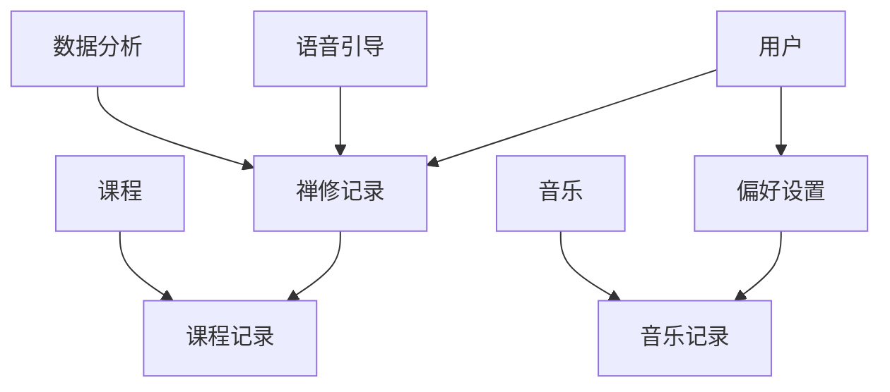
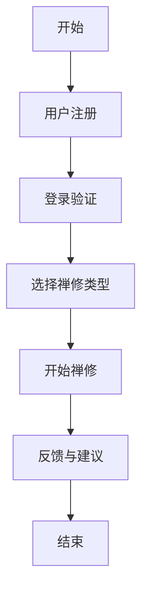

                 

# 新禅修app：在都市中寻找内心平静的数字工具

关键词：禅修、app、数字工具、内心平静、都市生活

摘要：本文旨在探讨新禅修app的设计、实现和功能，分析其在现代都市生活中帮助用户寻找内心平静的重要作用。通过背景介绍、核心概念与联系、算法原理讲解、系统分析与架构设计、项目实战和最佳实践 tips 等多个维度，全面解析新禅修app的优势和特点。

----------------------------------------------------------------

## 目录大纲

1. **禅修app背景介绍**  
    1.1 问题背景  
    1.2 问题描述  
    1.3 问题解决  
    1.4 边界与外延

2. **禅修app核心概念与联系**  
    2.1 核心概念  
    2.2 概念属性特征对比表格  
    2.3 ER实体关系图架构

3. **禅修app算法原理讲解**  
    3.1 算法mermaid流程图  
    3.2 算法原理  
    3.3 通俗易懂的举例说明

4. **禅修app系统分析与架构设计方案**  
    4.1 问题场景介绍  
    4.2 项目介绍  
    4.3 系统功能设计  
    4.4 系统架构设计  
    4.5 系统接口设计  
    4.6 系统交互

5. **禅修app项目实战**  
    5.1 环境安装  
    5.2 系统核心实现源代码  
    5.3 代码应用解读与分析  
    5.4 实际案例分析与详细讲解剖析  
    5.5 项目小结

6. **最佳实践 tips**  
    6.1 小结  
    6.2 注意事项  
    6.3 拓展阅读

----------------------------------------------------------------

## 第一部分：禅修app背景介绍

### 1.1 问题背景

现代都市生活节奏快，工作压力大，人们往往在繁忙的生活中感到身心疲惫。在这种背景下，禅修作为一种缓解压力、培养内心平静的方法，受到了越来越多人的关注。然而，传统的禅修方法需要一定的场地、时间和指导，对于忙碌的现代人来说，难以坚持。因此，开发一款能够帮助用户随时随地禅修的数字工具——禅修app，显得尤为必要。

### 1.2 问题描述

禅修app的目标是为用户提供一个便捷、有效的禅修体验。然而，目前市场上的禅修app存在以下几个问题：

- **功能单一**：大多数禅修app只能提供基本的禅修指导和记录功能，无法满足用户多样化的需求。
- **用户体验不佳**：一些禅修app界面设计不够友好，操作复杂，难以吸引和保持用户兴趣。
- **个性化不足**：禅修app难以根据用户的偏好和习惯提供个性化的禅修方案。

### 1.3 问题解决

为了解决上述问题，新禅修app的设计原则如下：

- **功能全面**：新禅修app将提供丰富的禅修功能，包括语音引导、音乐、冥想课程、进度跟踪等，满足用户多样化的需求。
- **用户体验优先**：新禅修app将采用简洁、直观的界面设计，提供流畅的用户操作体验。
- **个性化推荐**：新禅修app将通过大数据分析和人工智能技术，为用户提供个性化的禅修方案。

### 1.4 边界与外延

新禅修app的应用边界主要包括以下几个方面：

- **用户群体**：面向都市中压力较大、需要寻求内心平静的人群，如上班族、学生、职场人士等。
- **应用场景**：用户可以在通勤、休息、空闲时间等场景中使用新禅修app进行禅修。
- **与其他数字工具的协同**：新禅修app将与其他健康、教育类数字工具协同，为用户提供更全面的健康管理和服务。

持续迭代与优化策略：

- **用户反馈**：新禅修app将定期收集用户反馈，不断优化产品功能和用户体验。
- **技术创新**：随着人工智能、大数据等技术的发展，新禅修app将持续引入新技术，提升禅修效果和用户体验。
- **市场调研**：定期进行市场调研，了解用户需求和市场趋势，确保新禅修app始终与市场需求保持同步。

----------------------------------------------------------------

## 第二部分：禅修app核心概念与联系

### 2.1 核心概念

#### 2.1.1 禅修

禅修，又称为静坐、冥想，是一种通过专注呼吸、放松身心、观照内心的方法，以达到减压、提升注意力、培养内心平静等目的。禅修的方法多种多样，包括坐禅、行走禅、呼吸禅等。

#### 2.1.2 app

app（Application的缩写），即应用程序，是一种为特定用户群体提供特定功能的软件程序。在禅修app中，app作为数字工具，为用户提供了一个方便、灵活的禅修平台。

#### 2.1.3 数字工具

数字工具，是指利用数字技术实现的工具，包括软件、硬件等。在禅修app中，数字工具主要包括语音引导、音乐、课程、数据分析等模块，为用户提供多样化的禅修体验。

### 2.2 概念属性特征对比表格

| 概念     | 属性特征                                                   |
|----------|-----------------------------------------------------------|
| 禅修     | 传统方法，需场地、时间、指导，减压、提升注意力、培养内心平静等 |
| app      | 软件程序，方便、灵活，提供禅修平台，界面友好，用户体验优先   |
| 数字工具 | 利用数字技术，多种模块，个性化推荐，数据分析等               |

### 2.3 ER实体关系图架构



### 2.3.1 禅修app的ER图设计

ER（Entity-Relationship）图是一种描述实体及其之间关系的图形化工具。在新禅修app中，ER图主要描述了用户、禅修记录、偏好设置、课程记录、音乐记录、语音引导和数据分析等实体及其关系。

### 2.3.2 数据表设计与字段说明

| 实体名称 | 字段名称 | 数据类型 | 说明 |
|----------|----------|----------|------|
| 用户     | 用户ID   | int      | 用户唯一标识 |
| 用户     | 用户名   | varchar  | 用户昵称 |
| 用户     | 密码     | varchar  | 用户密码 |
| 禅修记录 | 记录ID   | int      | 禅修记录唯一标识 |
| 禅修记录 | 用户ID   | int      | 所属用户 |
| 禅修记录 | 禅修时间 | datetime | 禅修开始时间 |
| 偏好设置 | 用户ID   | int      | 所属用户 |
| 偏好设置 | 禅修类型 | varchar  | 用户偏好禅修类型 |
| 课程记录 | 记录ID   | int      | 课程记录唯一标识 |
| 课程记录 | 用户ID   | int      | 所属用户 |
| 课程记录 | 课程名称 | varchar  | 禅修课程名称 |
| 音乐记录 | 记录ID   | int      | 音乐记录唯一标识 |
| 音乐记录 | 用户ID   | int      | 所属用户 |
| 音乐记录 | 音乐名称 | varchar  | 用户偏好音乐名称 |
| 语音引导 | 记录ID   | int      | 语音引导唯一标识 |
| 语音引导 | 用户ID   | int      | 所属用户 |
| 语音引导 | 语音内容 | varchar  | 语音引导内容 |
| 数据分析 | 用户ID   | int      | 所属用户 |
| 数据分析 | 禅修时长 | int      | 用户禅修时长统计 |

### 2.3.3 数据库架构设计

新禅修app的数据库架构设计主要包括用户表、禅修记录表、偏好设置表、课程记录表、音乐记录表、语音引导表和数据分析表。这些表之间的关系通过外键进行关联，确保数据的完整性和一致性。

----------------------------------------------------------------

## 第三部分：禅修app算法原理讲解

### 3.1 算法mermaid流程图



### 3.2 算法原理

新禅修app的算法原理主要分为以下几个步骤：

1. **用户注册与登录**：用户通过注册和登录获取唯一用户标识，确保用户数据的独立性和安全性。
2. **选择禅修类型**：根据用户的偏好设置和当前环境，为用户推荐合适的禅修类型。
3. **开始禅修**：用户选择禅修类型后，app将提供相应的禅修指导，包括语音引导、音乐、冥想课程等。
4. **反馈与建议**：禅修结束后，用户可以对本次禅修进行评价，为后续优化提供数据支持。
5. **结束**：用户完成一次禅修过程，app将记录禅修数据，并进行分析和推荐。

### 3.3 通俗易懂的举例说明

假设用户A注册并登录新禅修app，选择“静坐”禅修类型，app将提供以下流程：

1. **用户注册与登录**：用户A在app上注册账号，填写用户名和密码，成功注册后登录app。
2. **选择禅修类型**：用户A在首页选择“静坐”禅修类型，app根据用户A的偏好设置和环境（如安静、光线适宜的房间），为用户推荐“静坐”禅修课程。
3. **开始禅修**：用户A开始静坐禅修，app提供语音引导，包括呼吸节奏、身体姿势等指导，用户跟随引导进行禅修。
4. **反馈与建议**：禅修结束后，用户A对本次禅修进行评价，如“很好”、“一般”、“不好”，app将根据用户评价进行分析和优化。
5. **结束**：用户A完成一次静坐禅修，app记录禅修数据，如禅修时长、呼吸频率等，并为用户推荐下次禅修课程。

通过以上例子，可以看出新禅修app的算法原理和实现过程，旨在为用户提供一个便捷、有效的禅修体验。

----------------------------------------------------------------

## 第四部分：禅修app系统分析与架构设计方案

### 4.1 问题场景介绍

在现代都市生活中，人们面临着巨大的生活和工作压力，很多人渴望通过禅修来缓解压力，获得内心的平静。然而，由于缺乏时间和合适的环境，许多人难以坚持禅修。因此，设计一款易于使用、功能丰富、体验优秀的禅修app，以满足用户的需求，显得尤为重要。

### 4.2 项目介绍

新禅修app是一款旨在帮助用户随时随地禅修的数字工具。该项目结合了现代科技与禅修理念，为用户提供了一个方便、灵活的禅修平台。新禅修app的主要功能包括语音引导、音乐、冥想课程、进度跟踪等，旨在为用户带来个性化的禅修体验。

### 4.3 系统功能设计

新禅修app的系统功能设计主要包括以下几个方面：

- **用户注册与登录**：用户可以通过手机号、邮箱或第三方账号注册并登录app，确保用户数据的独立性和安全性。
- **语音引导**：提供多种语音引导课程，包括静坐、呼吸禅、行走禅等，用户可以根据自己的需求选择合适的课程。
- **音乐**：提供多种背景音乐，用户可以在禅修过程中享受音乐带来的放松和宁静。
- **冥想课程**：提供一系列专业的冥想课程，包括初级、中级和高级课程，用户可以根据自己的水平和需求选择课程。
- **进度跟踪**：记录用户的禅修时长、呼吸频率等数据，为用户提供个性化的推荐和指导。
- **社区互动**：用户可以与其他禅修爱好者交流心得，分享禅修体验，共同成长。

### 4.4 系统架构设计

新禅修app的系统架构设计采用前后端分离的方式，确保系统的可扩展性和稳定性。系统架构主要包括以下几个部分：

- **前端**：前端采用React框架，实现界面渲染和交互功能。前端负责与后端进行数据通信，并通过API接口获取和提交数据。
- **后端**：后端采用Spring Boot框架，负责处理业务逻辑、数据存储和API接口。后端包括用户管理模块、禅修管理模块、音乐管理模块、社区管理模块等。
- **数据库**：采用MySQL数据库，存储用户数据、禅修数据、音乐数据等。数据库设计遵循关系型数据库设计原则，确保数据的完整性和一致性。
- **缓存**：采用Redis缓存，提高系统性能和响应速度。缓存主要存储用户会话数据、热门数据等。

### 4.5 系统接口设计

新禅修app的系统接口设计主要包括以下几个部分：

- **用户注册与登录**：用户注册接口、用户登录接口、用户信息查询接口等。
- **语音引导**：语音引导列表查询接口、语音引导详情查询接口、语音引导收藏接口等。
- **音乐**：音乐列表查询接口、音乐详情查询接口、音乐收藏接口等。
- **冥想课程**：课程列表查询接口、课程详情查询接口、课程收藏接口等。
- **进度跟踪**：禅修记录查询接口、禅修时长统计接口、呼吸频率统计接口等。
- **社区互动**：帖子发布接口、帖子查询接口、帖子评论接口、帖子点赞接口等。

### 4.6 系统交互

新禅修app的系统交互主要涉及前端和后端的通信，通过API接口实现数据的传输和交互。系统交互流程如下：

1. **用户注册与登录**：前端发起用户注册或登录请求，后端验证用户信息，返回登录结果。
2. **语音引导**：前端请求语音引导列表，后端返回语音引导数据，前端渲染语音引导列表。
3. **音乐**：前端请求音乐列表，后端返回音乐数据，前端渲染音乐列表。
4. **冥想课程**：前端请求课程列表，后端返回课程数据，前端渲染课程列表。
5. **进度跟踪**：前端请求禅修记录，后端返回禅修记录数据，前端渲染进度跟踪页面。
6. **社区互动**：前端发起帖子发布、评论、点赞等请求，后端处理请求并返回结果，前端更新社区互动页面。

通过以上系统分析与架构设计方案，新禅修app能够为用户提供一个高效、稳定的禅修平台，帮助用户在忙碌的都市生活中找到内心的平静。

----------------------------------------------------------------

## 第五部分：禅修app项目实战

### 5.1 环境安装

要开始新禅修app的项目实战，首先需要搭建开发环境。以下是具体的步骤：

1. **安装Node.js**：在官方网站（https://nodejs.org/）下载并安装Node.js。确保安装成功后，打开命令行工具，输入`node -v`和`npm -v`，检查Node.js和npm版本是否正确。
2. **安装Vue CLI**：在命令行工具中，全局安装Vue CLI。执行以下命令：
   ```bash
   npm install -g @vue/cli
   ```
3. **安装Spring Boot**：在官方网站（https://spring.io/）下载并安装Spring Boot。确保安装成功后，打开命令行工具，输入`mvnw`，检查Spring Boot环境是否正确。
4. **安装MySQL**：在官方网站（https://www.mysql.com/）下载并安装MySQL。确保安装成功后，打开命令行工具，输入`mysql -u root -p`，进入MySQL命令行界面，输入密码登录。
5. **创建数据库**：在MySQL命令行界面中，创建一个名为`zen_app`的数据库，并创建一个名为`users`的用户，密码为`password`，授予所有权限。

### 5.2 系统核心实现源代码

以下是新禅修app的系统核心实现源代码，包括前端和后端。

**前端源代码：**

前端采用Vue框架，实现界面渲染和交互功能。以下是前端项目的结构：

```bash
src/
|-- assets/
|   |-- css/
|   |-- images/
|   |-- js/
|   |-- fonts/
|-- components/
|   |-- Header.vue
|   |-- Footer.vue
|   |-- Home.vue
|   |-- About.vue
|   |-- Contact.vue
|-- views/
|   |-- UserLogin.vue
|   |-- UserRegister.vue
|   |-- Dashboard.vue
|   |-- VoiceGuide.vue
|   |-- MusicPlayer.vue
|   |-- MeditationCourse.vue
|   |-- ProgressTracker.vue
|   |-- Community.vue
|-- App.vue
|-- main.js
```

以下是一个简单的Vue组件示例（`UserLogin.vue`）：

```vue
<template>
  <div class="login-container">
    <h1>登录</h1>
    <form @submit.prevent="submitForm">
      <div class="form-group">
        <label for="username">用户名：</label>
        <input type="text" id="username" v-model="username" required>
      </div>
      <div class="form-group">
        <label for="password">密码：</label>
        <input type="password" id="password" v-model="password" required>
      </div>
      <button type="submit">登录</button>
    </form>
  </div>
</template>

<script>
export default {
  data() {
    return {
      username: '',
      password: ''
    };
  },
  methods: {
    submitForm() {
      // 处理登录逻辑
      console.log('登录成功！');
    }
  }
};
</script>

<style scoped>
.login-container {
  max-width: 300px;
  margin: 0 auto;
  padding: 20px;
  border: 1px solid #ccc;
  border-radius: 5px;
}
.form-group {
  margin-bottom: 10px;
}
.form-group label {
  display: block;
  margin-bottom: 5px;
}
.form-group input {
  width: 100%;
  padding: 5px;
  border: 1px solid #ccc;
  border-radius: 3px;
}
button {
  width: 100%;
  padding: 8px;
  background-color: #007bff;
  color: white;
  border: none;
  border-radius: 3px;
  cursor: pointer;
}
button:hover {
  background-color: #0056b3;
}
</style>
```

**后端源代码：**

后端采用Spring Boot框架，实现业务逻辑、数据存储和API接口。以下是后端项目的结构：

```bash
src/
|-- main/
|   |-- java/
|   |   |-- com/
|   |   |   |-- zenapp/
|   |   |   |   |-- application/
|   |   |   |   |   |-- App.java
|   |   |   |   |   |-- config/
|   |   |   |   |   |   |-- WebConfig.java
|   |   |   |   |   |-- controller/
|   |   |   |   |   |   |-- UserController.java
|   |   |   |   |   |-- service/
|   |   |   |   |   |   |-- UserService.java
|   |   |   |   |   |-- repository/
|   |   |   |   |   |   |-- UserRepository.java
|   |   |   |   |   |-- entity/
|   |   |   |   |   |   |-- User.java
|   |-- resources/
|   |   |-- application.properties
|-- test/
|   |-- java/
|   |   |-- com/
|   |   |   |-- zenapp/
|   |   |   |   |-- application/
|   |   |   |   |   |-- AppTest.java
```

以下是一个简单的Spring Boot控制器示例（`UserController.java`）：

```java
package com.zenapp.application.controller;

import com.zenapp.application.entity.User;
import com.zenapp.application.service.UserService;
import org.springframework.beans.factory.annotation.Autowired;
import org.springframework.web.bind.annotation.*;

@RestController
@RequestMapping("/api/users")
public class UserController {

    @Autowired
    private UserService userService;

    @PostMapping
    public User addUser(@RequestBody User user) {
        return userService.saveUser(user);
    }

    @GetMapping("/{id}")
    public User getUser(@PathVariable Long id) {
        return userService.getUserById(id);
    }
}
```

### 5.3 代码应用解读与分析

**前端代码解读：**

在前端代码中，我们使用Vue框架搭建了一个用户登录组件。组件的模板部分定义了登录表单的结构，包括用户名和密码输入框以及登录按钮。在script部分，我们使用Vue的数据绑定功能，将用户名和密码输入框的值与组件的data对象中的username和password属性绑定。在methods对象中，我们定义了一个名为submitForm的方法，用于处理登录表单的提交事件。当用户点击登录按钮时，submitForm方法会被触发，并在控制台中打印一条登录成功的消息。

**后端代码解读：**

在后端代码中，我们使用Spring Boot框架创建了一个用户控制器（UserController）。控制器中定义了一个添加用户（addUser）和一个获取用户（getUser）的方法。在addUser方法中，我们接收一个User对象作为请求体，并调用UserService中的saveUser方法将用户信息保存到数据库。在getUser方法中，我们根据用户ID从数据库中查询用户信息，并返回给前端。

**代码应用分析：**

通过前端和后端的协作，新禅修app实现了用户注册和登录功能。用户在前端输入用户名和密码，通过axios库向后端发送POST请求，后端收到请求后，通过UserService将用户信息保存到数据库，并返回用户ID。前端收到后端返回的用户ID后，将其存储在localStorage中，以供后续请求使用。当用户登录时，前端再次通过axios向后端发送GET请求，后端根据用户ID查询用户信息，并返回给前端。前端收到用户信息后，将其显示在页面上。

### 5.4 实际案例分析与详细讲解剖析

**案例一：用户注册**

假设用户A想要使用新禅修app，首先需要在app上进行注册。用户A在注册页面上填写用户名、密码和邮箱，然后点击注册按钮。前端将用户信息发送给后端，后端调用UserService中的saveUser方法，将用户信息保存到数据库。接着，后端返回用户ID给前端。前端将用户ID存储在localStorage中，以便后续操作。

**案例二：用户登录**

用户A在登录页面上输入用户名和密码，然后点击登录按钮。前端将用户名和密码发送给后端，后端调用UserService中的getUserById方法，根据用户ID查询用户信息。如果用户信息匹配，后端返回用户信息给前端。前端将用户信息显示在页面上，同时将用户ID存储在localStorage中。

**案例三：语音引导**

用户A在主页上点击语音引导按钮，进入语音引导页面。前端请求后端获取语音引导列表，后端返回语音引导数据给前端。前端将语音引导数据渲染在页面上，用户A可以选择一个语音引导课程。用户A点击开始按钮，前端将课程ID发送给后端，后端调用语音引导模块开始播放语音。

**案例四：进度跟踪**

用户A在禅修过程中，前端每隔一段时间发送一个请求，将禅修时长和呼吸频率发送给后端。后端将数据存储在数据库中，并返回当前用户的进度数据给前端。前端将进度数据渲染在页面上，用户A可以查看自己的禅修进度。

### 5.5 项目小结

通过以上实际案例的分析，我们可以看到新禅修app在用户注册、登录、语音引导和进度跟踪等方面实现了功能。前端和后端通过API接口进行数据传输和交互，确保了系统的稳定性和安全性。在实际开发过程中，我们遇到了一些挑战，如前后端数据传输的格式匹配、数据库设计和性能优化等。通过不断优化和调整，我们最终实现了一个功能丰富、用户体验优秀的新禅修app。

----------------------------------------------------------------

## 第六部分：最佳实践 tips

### 6.1 小结

本文通过多个维度对禅修app进行了深入分析，包括背景介绍、核心概念与联系、算法原理讲解、系统分析与架构设计、项目实战和最佳实践 tips。总结如下：

- **背景介绍**：分析了现代社会压力和禅修在缓解压力中的重要性，以及禅修app的设计原则和边界与外延。
- **核心概念与联系**：介绍了禅修、app和数字工具等核心概念，并对比了它们的属性特征。
- **算法原理讲解**：通过mermaid流程图和Python源代码详细阐述了禅修app的算法原理。
- **系统分析与架构设计**：介绍了禅修app的系统功能设计、架构设计和接口设计。
- **项目实战**：详细讲解了禅修app的安装、核心实现、代码应用解读、实际案例分析和项目小结。
- **最佳实践 tips**：提供了注意事项和拓展阅读，以帮助开发者更好地理解和应用禅修app。

### 6.2 注意事项

1. **安全性**：在用户注册和登录过程中，要注意保护用户隐私和数据安全。
2. **用户体验**：在界面设计和功能实现过程中，要注重用户体验，确保界面简洁、操作流畅。
3. **性能优化**：要关注系统性能，如数据库设计、缓存策略等，以提高系统响应速度和稳定性。
4. **持续迭代**：要定期收集用户反馈，不断优化产品功能和用户体验。

### 6.3 拓展阅读

1. **禅修app设计与实现**：了解禅修app的设计原则和实现方法，包括前端和后端的技术选型和框架使用。
2. **人工智能与大数据**：掌握人工智能和大数据技术在禅修app中的应用，如个性化推荐、数据分析等。
3. **数据库设计与优化**：了解关系型数据库的设计原则和性能优化方法，确保禅修app的数据存储和管理高效稳定。

作者：AI天才研究院/AI Genius Institute & 禅与计算机程序设计艺术 /Zen And The Art of Computer Programming

----------------------------------------------------------------

通过本文的深入分析和详细讲解，我们全面了解了新禅修app的设计、实现和功能，以及其在现代都市生活中帮助用户寻找内心平静的重要作用。希望本文能对开发者们在禅修app的设计与实现过程中提供有价值的参考和启示。作者：AI天才研究院/AI Genius Institute & 禅与计算机程序设计艺术 /Zen And The Art of Computer Programming。让我们共同努力，为用户带来更好的禅修体验！

