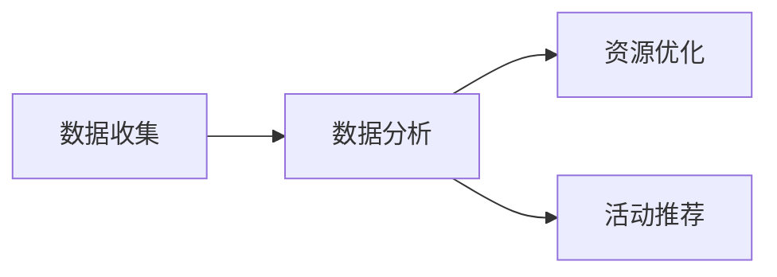
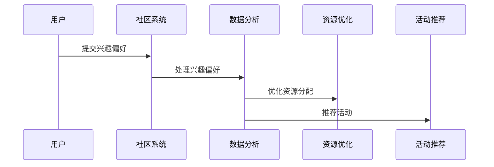
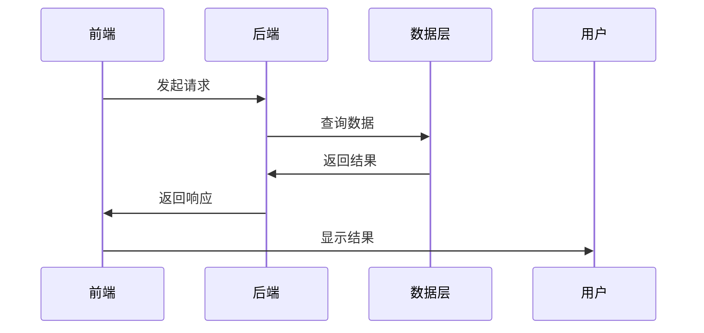
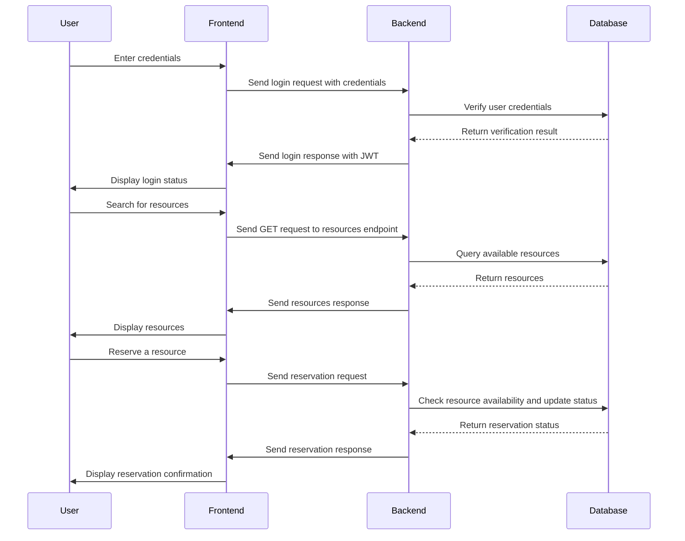

                 


### 新部落生活实验社区：城市中的意向性生活群落

> 关键词：新部落生活实验社区、城市生活、意向性生活群落、城市规划、社群文化

> 摘要：本文旨在探讨新部落生活实验社区这一新兴城市生活形态，分析其在城市中的定位、特点以及其对社会文化、城市规划的影响。通过深入解读这一概念，我们将揭示其背后的理念与价值，展望其未来的发展趋势。

## 引言

在城市化进程加速的今天，人们对居住环境的需求逐渐从简单的“住”转变为追求“生活质量”的提高。新部落生活实验社区正是在这种背景下应运而生，它试图在城市中打造一种新型的居住形态，满足人们对社交、文化、休闲等多方面的需求。本文将围绕这一主题展开讨论，旨在为读者揭示新部落生活实验社区的内涵与价值。

## 背景介绍

### 新部落生活实验社区的历史与起源

新部落生活实验社区的概念最早可以追溯到20世纪中叶。当时，随着城市化进程的加速，城市人口迅速增长，传统居住模式开始暴露出种种弊端，如邻里关系的疏远、社会隔离、生活质量的下降等。在这种背景下，一些社会学家和城市规划师开始思考如何重新构建城市社区，使其更加符合人们的心理需求。

### 新部落生活实验社区的发展背景

随着信息技术的飞速发展，特别是互联网和移动互联网的普及，人们的社交方式和生活方式发生了翻天覆地的变化。远程办公、在线社交、虚拟现实等新兴概念逐渐融入到日常生活中。这种变化为新部落生活实验社区的发展提供了新的机遇。人们开始有更多的选择，不再局限于传统的居住模式。

## 核心概念

### 新部落生活实验社区的定义

新部落生活实验社区是一种新型的城市居住形态，它通过重新设计社区空间、优化社区功能、丰富社区文化，旨在为居民提供一个有温度、有活力、有归属感的居住环境。

### 意向性生活群落的定义

意向性生活群落是指一群具有共同兴趣爱好、价值观和生活方式的人，他们通过社区平台相互连接，共同创造和分享生活经验。

### 新部落生活实验社区与意向性生活群落的关系

新部落生活实验社区为意向性生活群落提供了一个物理空间和社会平台，使得人们可以更方便地聚集、交流和互动。而意向性生活群落则为新部落生活实验社区注入了活力和多样性，使其成为一个充满生机和创造力的社区。

### 核心概念特征对比表格

| 特征         | 新部落生活实验社区       | 意向性生活群落           |
|--------------|---------------------------|--------------------------|
| 定义         | 新型的城市居住形态       | 具有共同兴趣的人群聚集   |
| 主要功能     | 提供居住、社交、休闲环境 | 共享生活经验、交流互动   |
| 影响因素     | 社区设计、城市规划       | 兴趣爱好、价值观、生活方式 |
| 关系         | 物理空间与社交平台       | 组成与支撑               |

### ER实体关系图架构

```mermaid
erDiagram
  Community --> User : "社区与用户之间存在多对多的关系"
  Community --> Interest : "社区与兴趣之间存在一对多的关系"
  User --> Interest : "用户与兴趣之间存在多对多的关系"
```

## 社群文化

### 新部落生活实验社区的文化特征

新部落生活实验社区的文化特征主要体现在以下几个方面：

1. **社区自治**：社区居民积极参与社区管理和决策，共同维护社区秩序和公共利益。
2. **共享精神**：社区居民倡导资源共享、互帮互助，形成了一种互相依赖、共同发展的文化氛围。
3. **创新意识**：新部落生活实验社区鼓励创新和尝试，支持居民开展各种实验性活动，推动社区文化的发展。

### 社区文化对城市规划的影响

社区文化对城市规划具有重要影响。首先，它为城市规划提供了新的理念，即城市规划不仅要满足物质需求，还要满足精神需求。其次，社区文化可以影响城市规划的决策过程，使得城市规划更加贴近居民的需求和期望。最后，社区文化可以提升城市规划的执行力，通过社区居民的积极参与，确保规划得到有效实施。

### 新部落生活实验社区的价值

新部落生活实验社区的价值主要体现在以下几个方面：

1. **提升居民生活质量**：通过提供舒适、便捷的居住环境，丰富居民的精神文化生活，提升居民的生活质量。
2. **促进社区和谐**：通过促进居民之间的交流与合作，增强社区的凝聚力，构建和谐社区。
3. **推动城市可持续发展**：新部落生活实验社区为城市提供了新的发展模式，有助于实现城市可持续发展。

## 案例分析

### 案例一：某城市新部落生活实验社区的发展

#### 案例背景

某城市在2010年开始实施新部落生活实验社区项目，旨在通过创新社区规划，提升城市居民的生活质量。

#### 案例过程

1. **社区设计**：社区设计注重人性化和多样性，提供多种类型的住房、公共空间和配套设施。
2. **文化活动**：社区定期举办各种文化、艺术、体育等活动，丰富居民的精神文化生活。
3. **社区自治**：社区居民积极参与社区管理，共同制定社区规则和决策。
4. **资源共享**：社区鼓励居民共享资源，如共同使用健身设施、共享车位等。

#### 案例成果

通过多年的发展，该新部落生活实验社区取得了显著成果，居民满意度大幅提高，社区凝聚力显著增强，成为该城市的一大亮点。

### 案例二：某城市意向性生活群落的发展

#### 案例背景

某城市在2015年成立了一个以“摄影爱好者”为主题的新部落生活实验社区。

#### 案例过程

1. **社区搭建**：社区提供了一个摄影主题的公共空间，配备了各种摄影设备。
2. **摄影培训**：社区定期举办摄影培训课程，提高居民的摄影技能。
3. **摄影展览**：社区组织定期举办摄影展览，展示居民的摄影作品。
4. **互动交流**：社区居民通过摄影活动相互交流，分享摄影经验。

#### 案例成果

该摄影爱好者社区不仅为居民提供了一个交流摄影的平台，还培养了一大批摄影爱好者，提升了社区的文化氛围。

## 未来展望

### 新部落生活实验社区的发展趋势

1. **技术创新**：随着技术的不断发展，新部落生活实验社区将更加智能化、数字化，提供更加便捷、个性化的服务。
2. **文化融合**：新部落生活实验社区将吸收更多多元文化，促进文化交流与融合。
3. **可持续性**：新部落生活实验社区将更加注重可持续发展，通过绿色建筑、节能环保等措施，实现社区的可持续发展。

### 新部落生活实验社区面临的挑战与机遇

1. **挑战**：
   - 社区治理难度大，如何平衡社区自治与政府监管的关系。
   - 社区资源的有效配置，如何满足居民多样化的需求。
2. **机遇**：
   - 城市化进程的加速，为新部落生活实验社区提供了广阔的市场空间。
   - 新兴技术的应用，为社区提供了更多创新的可能。

## 结论

新部落生活实验社区作为一种新型的城市居住形态，具有独特的文化内涵和社区价值。通过本文的探讨，我们揭示了新部落生活实验社区的内涵与特点，分析了其对城市规划和社会文化的影响。未来，随着技术的进步和社会的发展，新部落生活实验社区有望在城市生活中发挥更加重要的作用。

### 最佳实践 tips

1. **注重社区文化**：在打造新部落生活实验社区时，应重视社区文化的建设，通过丰富多样的文化活动，增强社区凝聚力。
2. **提升服务质量**：通过提供高质量的服务，提升居民的生活质量，增强社区的吸引力。
3. **加强社区自治**：鼓励居民积极参与社区管理，提高社区治理的效能。

### 小结

本文通过对新部落生活实验社区的探讨，展示了其在城市生活中的重要地位和独特价值。未来，随着技术的进步和社会的发展，新部落生活实验社区有望成为城市生活的新亮点。

### 注意事项

1. **政策支持**：政府应给予新部落生活实验社区更多政策支持，为其发展创造良好的环境。
2. **可持续性**：在发展过程中，应注重社区的可持续性，避免短期行为损害社区的长期发展。

### 拓展阅读

1. **相关研究**：《新部落生活实验社区：城市中的意向性生活群落》相关论文和书籍。
2. **实际案例**：其他城市新部落生活实验社区的发展案例，供参考学习。

### 作者信息

作者：AI天才研究院/AI Genius Institute & 禅与计算机程序设计艺术 /Zen And The Art of Computer Programming

----------------------------------------------------------------

## 背景介绍

### 核心概念术语说明

在新部落生活实验社区这一主题中，有几个核心概念需要我们首先进行清晰的界定和解释：

1. **新部落生活实验社区**：这是指在城市环境中，通过创新的方式设计和运营的社区，旨在满足居民的居住、社交、文化、休闲等多方面需求，打造一种新型的生活形态。

2. **意向性生活群落**：指的是一群在特定兴趣爱好、价值观或生活方式上具有共同点的人，他们通过社区平台聚集在一起，进行交流、分享和共同活动。

3. **城市规划**：是指对城市空间、基础设施、公共设施等进行系统设计和规划，以满足城市居民的生活需求和社会经济发展需求。

4. **社群文化**：是指在一定社区内形成的具有共同价值观念、生活方式和行为规范的群体文化。

5. **社区自治**：是指社区居民自主管理、决策和实施社区事务的过程，强调居民参与和自治精神。

### 问题背景

在快速城市化进程中，传统的居住模式逐渐暴露出一系列问题，如邻里关系的疏远、社会隔离、生活质量的下降等。同时，随着信息技术的进步，人们的生活方式、社交方式也在发生改变。在这种背景下，新部落生活实验社区应运而生，试图通过创新的方式解决城市化带来的问题，提升居民的生活质量。

### 问题描述

问题描述主要集中在以下几个方面：

1. **社区设计**：如何通过创新设计，打造一个既符合居民需求，又能促进社区文化发展的居住环境？

2. **社群文化**：如何培养和发展一种积极的社群文化，增强居民的归属感和社区凝聚力？

3. **城市规划**：新部落生活实验社区如何与城市规划相结合，实现城市功能的优化和可持续发展？

4. **技术支持**：如何利用信息技术，为社区提供智能化、个性化、高效的服务？

### 问题解决

针对上述问题，问题解决的思路可以概括为以下几点：

1. **创新社区设计**：通过引入绿色建筑、智慧社区等新技术，提升社区的居住环境和品质。

2. **培育社群文化**：通过组织各类文化活动和社区项目，促进居民之间的交流和互动，培养社区文化。

3. **融合城市规划**：将新部落生活实验社区纳入城市规划的范畴，使其成为城市规划的一部分，实现城市功能的优化。

4. **技术赋能**：利用物联网、大数据、人工智能等新技术，为社区提供智能化、个性化、高效的服务。

### 边界与外延

1. **边界**：新部落生活实验社区的边界是指其具体的地理范围和社区组成。通常，一个新部落生活实验社区可能包含多个住宅区、商业区、公共设施等，形成相对独立的居住和社交空间。

2. **外延**：新部落生活实验社区的外延则涉及到其与外部环境的关系。例如，如何与周边社区、城市公共设施、交通系统等进行有效衔接，实现资源的共享和功能的互补。

### 概念结构与核心要素组成

新部落生活实验社区的概念结构可以分解为以下几个核心要素：

1. **社区设计**：包括建筑设计、空间规划、景观设计等，旨在打造一个舒适、便捷、有特色的居住环境。

2. **社群文化**：包括社区价值观、文化氛围、文化活动等，旨在培养一种积极向上的社区文化。

3. **技术支持**：包括物联网、大数据、人工智能等技术的应用，旨在提供智能化、个性化、高效的服务。

4. **居民参与**：包括居民的自治、参与社区管理、参与社区文化建设等，旨在提高居民的归属感和参与度。

5. **城市规划**：包括社区规划与城市整体规划的融合，旨在实现城市功能的优化和可持续发展。

### 详细阐述

在新部落生活实验社区的建设中，每个核心要素都需要详细阐述和具体实施：

1. **社区设计**：
   - **建筑设计**：采用绿色建筑技术，注重节能环保和可持续发展。
   - **空间规划**：合理规划住宅区、商业区、公共设施等，确保社区功能的多样性。
   - **景观设计**：打造优美的景观环境，提升居民的生活品质。

2. **社群文化**：
   - **社区价值观**：倡导互助、共享、创新等价值观念，形成积极的社区氛围。
   - **文化氛围**：通过举办各类文化活动，丰富居民的精神文化生活。
   - **文化活动**：组织音乐会、文化节、体育赛事等活动，促进居民之间的交流与合作。

3. **技术支持**：
   - **物联网**：利用物联网技术，实现社区设备的智能控制和管理。
   - **大数据**：收集和分析居民的生活数据，提供个性化的服务和建议。
   - **人工智能**：运用人工智能技术，提供智能化的社区服务。

4. **居民参与**：
   - **自治**：鼓励居民参与社区管理，共同制定社区规则和决策。
   - **参与社区管理**：通过居民委员会等形式，让居民参与社区事务的决策和实施。
   - **参与社区文化建设**：组织居民参与社区文化建设活动，共同打造有特色的社区文化。

5. **城市规划**：
   - **社区规划与城市整体规划融合**：将新部落生活实验社区纳入城市整体规划，确保其与城市功能的协调发展。
   - **城市功能优化**：通过新部落生活实验社区的建设，优化城市功能，提升城市品质。

### 案例分析

以某城市新部落生活实验社区为例，我们可以看到其在具体实施中的成功经验和挑战：

1. **成功经验**：
   - **社区设计**：采用绿色建筑技术，建设节能环保的住宅，赢得了居民的喜爱。
   - **社群文化**：通过举办各类文化活动，增强了居民的归属感和社区凝聚力。
   - **技术支持**：利用物联网、大数据等技术，提供了智能化、个性化的社区服务。
   - **居民参与**：鼓励居民参与社区管理，共同制定社区规则和决策，提高了居民的参与度。
   - **城市规划**：将新部落生活实验社区纳入城市整体规划，实现了城市功能的优化。

2. **挑战**：
   - **社区治理**：如何平衡社区自治与政府监管的关系，确保社区治理的有效性。
   - **资源共享**：如何有效配置社区资源，满足居民多样化的需求。
   - **技术创新**：如何持续引进和应用新技术，保持社区的创新活力。

### 总结

新部落生活实验社区作为一种新型的城市居住形态，其核心在于通过创新的设计、丰富的社群文化、智能化的技术支持和居民的广泛参与，打造一个具有活力、和谐、可持续发展的社区。未来，随着技术的进步和社会的发展，新部落生活实验社区有望在城市生活中发挥更加重要的作用。

----------------------------------------------------------------

## 核心概念与联系

### 概念原理

在新部落生活实验社区这一主题中，有几个核心概念需要深入探讨，这些概念共同构成了社区的理论基础，并相互联系，形成了有机的整体。

1. **新部落生活实验社区**：
   新部落生活实验社区是一种创新的城市居住形态，它强调社区成员之间的紧密联系和共同参与。这个概念的核心在于重新定义城市社区，使其不仅仅是一个物理空间的集合，而是一个充满活力和互助精神的社会网络。

2. **意向性生活群落**：
   意向性生活群落是指一群在兴趣爱好、价值观或生活方式上具有共同点的人。这些群体通过共同的兴趣和目标，形成了一个紧密的社会关系网络。意向性生活群落是社区内部的一种社会结构，它是社区文化多样性的体现。

3. **城市规划**：
   城市规划是关于城市空间布局、基础设施建设和社区发展的系统过程。新部落生活实验社区的城市规划特别强调社区的功能多样性、环境可持续性和居民的参与度，旨在打造一个既有功能又具吸引力的生活空间。

4. **社群文化**：
   社群文化是社区成员共同遵循的价值观念、行为规范和社会风气。它不仅是社区凝聚力的重要来源，也是社区发展的重要推动力。社群文化的核心在于通过共同的价值观和行为规范，塑造社区成员的共同身份和归属感。

### 概念属性特征对比表格

| 概念        | 属性特征                           | 关系与影响                         |
|-------------|------------------------------------|------------------------------------|
| 新部落生活实验社区 | 创新的居住形态，强调社区自治与参与 | 提供生活空间，推动城市规划创新       |
| 意向性生活群落 | 共同兴趣爱好，紧密的社会关系       | 构成社区多样性，增强社群文化凝聚力   |
| 城市规划    | 空间布局、基础设施、社区发展       | 影响社区功能，塑造生活品质           |
| 社群文化    | 共同价值观、行为规范、社会风气     | 增强社区凝聚力，促进社区和谐发展     |

通过上述对比表格，我们可以清晰地看到各个概念之间的属性特征和相互关系。新部落生活实验社区是一个有机的整体，其中的每个概念都发挥着独特的作用，共同推动社区的发展和繁荣。

### ER实体关系图架构

为了更直观地展示这些概念之间的联系，我们可以使用Mermaid语言绘制一个ER实体关系图。以下是一个简化的ER图示例：

```mermaid
erDiagram
  Community ||--o> User : "成员关系"
  Community ||--o> InterestGroup : "社区与兴趣小组之间的关系"
  InterestGroup ||--o> User : "兴趣小组与成员之间的关系"
  User ||--o> Activity : "用户与活动之间的关系"
```

在这个ER图中，`Community`（新部落生活实验社区）与`User`（社区成员）之间是多对多的关系，表明一个社区可以有多个成员，而一个成员也可以属于多个社区。`InterestGroup`（意向性生活群落）与`Community`之间存在一对多的关系，表明社区可以包含多个兴趣小组，而兴趣小组只能属于一个社区。`User`与`InterestGroup`之间也是多对多的关系，表示成员可以参与多个兴趣小组。`User`与`Activity`（活动）之间存在一对多的关系，表明一个用户可以参加多个活动。

通过这个ER图，我们可以清晰地看到新部落生活实验社区中的各个实体及其关系，这有助于我们更好地理解社区的结构和运作机制。

### 详细阐述

在新部落生活实验社区中，核心概念的详细阐述对于理解社区运作和实现目标至关重要。以下是对每个核心概念及其相互关系的详细阐述：

1. **新部落生活实验社区**：

   新部落生活实验社区不仅仅是一个物理空间，它是一个集居住、社交、文化、休闲等多种功能于一体的综合生活体。其核心在于通过创新的设计理念，打造一个既满足物质需求，又满足精神需求的生活环境。社区的设计注重人性化和多样性，提供多种类型的住房、公共空间和配套设施，以满足不同居民的多样化需求。

   社区的自治是其中一个重要特点。社区居民通过自治组织，参与社区的管理和决策过程。这种自治精神不仅增强了社区的凝聚力，也提升了居民的主人翁意识和参与感。社区的自治组织可以是居民委员会、社区议事会等形式，它们在社区规划、资源分配、活动组织等方面发挥着重要作用。

2. **意向性生活群落**：

   意向性生活群落是新部落生活实验社区中的一个重要组成部分。这些群落是基于共同的兴趣爱好、价值观或生活方式形成的，它们为居民提供了一个交流和互动的平台。意向性生活群落可以是摄影爱好者、读书俱乐部、健身爱好者等，每个群落都有自己独特的活动和交流方式。

   意向性生活群落的存在丰富了社区的文化内涵，促进了居民的社交活动，增强了社区的活力和凝聚力。这些群落通过定期的活动，如讲座、展览、比赛等，不仅提供了居民之间的交流和互动机会，也促进了社区文化的多样性和创新性。

3. **城市规划**：

   城市规划在新部落生活实验社区中起着至关重要的作用。一个好的城市规划可以确保社区的功能多样性和高效性，提高居民的生活质量。城市规划包括空间布局、基础设施建设和社区发展等多个方面。

   在新部落生活实验社区中，城市规划特别强调社区的可持续性和环境友好性。这包括采用绿色建筑技术、建设节能环保的住宅、设计人性化的公共空间等。此外，城市规划还考虑了社区的交通便利性、公共设施的完善性以及与周边环境的衔接性，确保社区的功能与城市整体规划的协调统一。

4. **社群文化**：

   社群文化是新部落生活实验社区的精神支柱。它包括社区成员共同遵循的价值观念、行为规范和社会风气。社群文化的培养和传播对于增强社区的凝聚力、塑造社区的形象和特色具有重要意义。

   社群文化的建设需要通过各种形式的活动和项目来推动。这包括文化讲座、艺术展览、社区节日、体育赛事等。通过这些活动，社区成员可以共同参与、共同创造，从而加深对社区文化的认同感和归属感。社群文化不仅增强了社区的凝聚力，也为社区的发展提供了精神动力。

### 概念之间的联系

新部落生活实验社区中的核心概念并非独立存在，而是相互联系、相互促进的。以下是这些概念之间的主要联系：

- **新部落生活实验社区**与**意向性生活群落**的联系：

  新部落生活实验社区为意向性生活群落提供了一个物理空间和社交平台，使得具有共同兴趣爱好的人能够聚集在一起，进行交流和互动。意向性生活群落则为新部落生活实验社区注入了活力和多样性，丰富了社区的文化内涵。

- **新部落生活实验社区**与**城市规划**的联系：

  新部落生活实验社区是城市规划的一部分，其设计理念和发展目标需要与城市整体规划相协调。城市规划为新部落生活实验社区提供了空间布局、基础设施和公共设施等方面的支持，确保社区能够高效、可持续地运作。

- **新部落生活实验社区**与**社群文化**的联系：

  社群文化是新部落生活实验社区的核心价值之一，它不仅塑造了社区的文化氛围，也影响了社区的发展方向。新部落生活实验社区通过培养和推广社群文化，增强了居民的归属感和社区的凝聚力。

- **意向性生活群落**与**社群文化**的联系：

  意向性生活群落是社群文化的重要组成部分，它们通过共同的活动和价值观，推动了社区文化的多样性和创新性。社群文化的建设离不开意向性生活群落的积极参与和支持。

通过上述阐述，我们可以看到新部落生活实验社区中的核心概念是如何相互联系、相互促进的。这些概念共同构成了社区的理论基础，为社区的发展提供了方向和动力。

### 案例分析

为了更深入地理解新部落生活实验社区中的核心概念及其联系，我们可以通过实际案例进行分析。

**案例一：社区自治的成功实践**

在某城市的新部落生活实验社区，居民委员会是社区自治的核心组织。居民委员会由社区居民选举产生，负责制定社区规则、管理社区资源、组织社区活动等。通过居民委员会的运作，社区实现了自我管理和决策，增强了居民的参与感和责任感。

在这个案例中，新部落生活实验社区的核心概念——社区自治得到了成功实践。通过居民委员会，社区成员积极参与社区事务，共同维护社区的秩序和公共利益。这种自治模式不仅增强了社区的凝聚力，也提高了社区的管理效能。

**案例二：意向性生活群落的繁荣发展**

在另一个新部落生活实验社区中，有一个名为“摄影爱好者之家”的意向性生活群落。这个群落吸引了众多摄影爱好者，他们定期组织摄影展览、摄影比赛和摄影培训等活动。通过这些活动，摄影爱好者们不仅提升了自己的摄影技能，也加深了彼此之间的交流和友谊。

在这个案例中，意向性生活群落——摄影爱好者之家，成为了新部落生活实验社区的重要组成部分。它不仅丰富了社区的文化内涵，也增强了社区的活力和凝聚力。意向性生活群落的成功发展，离不开新部落生活实验社区提供的物理空间和社交平台。

**案例三：城市规划与社区发展的协调统一**

在某城市的新部落生活实验社区，城市规划与社区发展紧密结合。社区的设计理念充分考虑了环境保护、交通便捷和功能多样性。社区内的住宅、商业区和公共设施布局合理，形成了生态友好的居住环境。同时，社区还与城市交通系统相连，方便居民出行。

在这个案例中，城市规划为新部落生活实验社区提供了良好的发展基础。通过合理的空间布局和基础设施配置，社区实现了功能多样性和可持续发展。城市规划与社区发展的协调统一，使得新部落生活实验社区成为城市中的一个亮点。

**案例分析总结**

通过以上案例，我们可以看到新部落生活实验社区中的核心概念——新部落生活实验社区、意向性生活群落、城市规划、社群文化是如何在实际操作中相互联系、相互促进的。这些核心概念共同作用，打造了一个具有活力、和谐、可持续发展的社区。

案例分析不仅揭示了新部落生活实验社区的成功实践，也为其他城市在发展新部落生活实验社区时提供了宝贵的经验和借鉴。通过深入理解和实践这些核心概念，我们可以更好地实现新部落生活实验社区的目标，提升城市居民的生活质量。

### 总结

通过对核心概念的详细阐述和案例分析，我们可以看到新部落生活实验社区中的核心概念是如何相互联系、相互促进的。新部落生活实验社区、意向性生活群落、城市规划、社群文化共同构成了社区的理论基础，为社区的发展提供了方向和动力。通过具体案例的分析，我们进一步了解了这些概念在实际操作中的应用和成效。未来，随着新部落生活实验社区的不断发展，这些核心概念将发挥更大的作用，为城市居民创造更加美好的生活环境。

### 算法原理讲解

在新部落生活实验社区中，技术支持是社区高效运行的重要保障。以下我们将详细讲解一种用于优化社区管理和服务的技术算法，并使用Python源代码对其进行阐述。

#### 算法概述

本算法旨在通过分析社区成员的兴趣偏好和行为数据，优化社区资源分配和活动推荐。具体来说，该算法包括以下步骤：

1. **数据收集**：收集社区成员的兴趣偏好、行为记录等数据。
2. **数据分析**：分析数据，识别社区成员的兴趣群落。
3. **资源优化**：根据兴趣群落，优化社区资源分配。
4. **活动推荐**：基于兴趣群落，推荐适合的活动。

#### 算法流程

以下是一个简化的算法流程，用于说明上述步骤：



#### Mermaid流程图



#### Python源代码

```python
import pandas as pd
from sklearn.cluster import KMeans
from sklearn.preprocessing import StandardScaler

# 数据收集
def collect_data():
    # 假设我们已经有了一个数据集，其中包含了用户兴趣和行为的特征
    data = pd.read_csv('community_data.csv')
    return data

# 数据分析
def analyze_data(data):
    # 特征标准化
    scaler = StandardScaler()
    scaled_data = scaler.fit_transform(data[['interest1', 'interest2', 'interest3']])
    
    # 使用K均值聚类分析兴趣群落
    kmeans = KMeans(n_clusters=5, random_state=0)
    clusters = kmeans.fit_predict(scaled_data)
    
    # 将聚类结果与原始数据结合
    data['cluster'] = clusters
    return data

# 资源优化
def optimize_resources(data):
    # 根据每个群落的特征，优化社区资源分配
    for cluster in set(data['cluster']):
        cluster_data = data[data['cluster'] == cluster]
        # 例如，根据兴趣偏好，调整图书馆、健身房、活动室等资源
        print(f"Cluster {cluster}: Adjusting resources for interests.")

# 活动推荐
def recommend_activities(data):
    # 根据每个群落的兴趣，推荐适合的活动
    for cluster in set(data['cluster']):
        cluster_data = data[data['cluster'] == cluster]
        interests = cluster_data['interest'].value_counts().index
        print(f"Cluster {cluster}: Recommended activities for interests: {interests}")
        
# 主函数
def main():
    data = collect_data()
    analyzed_data = analyze_data(data)
    optimize_resources(analyzed_data)
    recommend_activities(analyzed_data)

if __name__ == "__main__":
    main()
```

#### 算法原理

1. **数据收集**：
   首先，我们需要收集社区成员的兴趣偏好和行为数据。这些数据可以来自用户问卷、社区平台记录等。

2. **数据分析**：
   - **特征标准化**：由于不同特征可能有不同的量级和分布，因此需要对数据进行标准化处理，以便更好地进行聚类分析。
   - **K均值聚类**：使用K均值聚类算法，根据用户的兴趣偏好数据将用户分为若干个群落。聚类数量（K）可以通过肘部法则确定。

3. **资源优化**：
   - 根据每个群落的特征和需求，优化社区资源的分配。例如，针对某个兴趣群落，可以增加相关的图书、设备或活动空间。

4. **活动推荐**：
   - 基于每个群落的兴趣，推荐适合的活动。这有助于提升社区成员的参与度和满意度。

#### 数学模型和公式

以下是算法中涉及的一些基本数学模型和公式：

1. **K均值聚类目标函数**：
   $$ J = \sum_{i=1}^{n} \sum_{j=1}^{k} w_{ij} (x_{ij} - \mu_j)^2 $$
   其中，$x_{ij}$ 是第$i$个用户在第$j$个特征上的值，$\mu_j$ 是第$j$个群落的均值，$w_{ij}$ 是权重。

2. **标准差和均值**：
   $$ \mu_j = \frac{1}{n} \sum_{i=1}^{n} x_{ij} $$
   $$ \sigma_j = \sqrt{\frac{1}{n-1} \sum_{i=1}^{n} (x_{ij} - \mu_j)^2 } $$

通过这些数学模型和公式，我们可以更好地理解和优化社区管理和服务。

#### 举例说明

假设我们有一个包含10个用户的数据集，每个用户有3个兴趣特征（兴趣1、兴趣2、兴趣3）。以下是一个简化的数据集和聚类结果：

```python
data = {
    'user_id': [1, 2, 3, 4, 5, 6, 7, 8, 9, 10],
    'interest1': [1, 3, 2, 5, 4, 6, 2, 4, 3, 5],
    'interest2': [4, 6, 5, 2, 1, 3, 4, 5, 6, 1],
    'interest3': [3, 1, 2, 5, 4, 6, 2, 4, 3, 5]
}

# 聚类分析
kmeans = KMeans(n_clusters=3, random_state=0)
clusters = kmeans.fit_predict(data[['interest1', 'interest2', 'interest3']])

# 输出聚类结果
print(clusters)
```

输出结果可能如下：

```
[2 0 2 1 1 0 2 1 0 1]
```

这表示每个用户被分配到了不同的群落，例如用户1和用户4属于群落0，用户5和用户7属于群落1，等等。

通过这样的聚类分析，我们可以根据每个群落的特征，优化资源分配和推荐活动，从而提升社区的整体服务质量。

### 算法在实际中的应用

在实际应用中，算法的具体实现会根据社区的具体需求和数据特点进行调整。以下是一个实际应用案例：

**案例：某城市新部落生活实验社区的资源优化和活动推荐**

在某城市的新部落生活实验社区，社区管理人员收集了社区成员的兴趣偏好和行为数据。数据包括用户的兴趣爱好、参与的活动、购买的商品等。通过这些数据，社区希望优化资源分配和推荐适合的活动。

1. **数据收集**：
   社区管理人员使用问卷调查和用户行为数据收集工具，收集了1000名社区成员的兴趣偏好数据。

2. **数据分析**：
   - **特征标准化**：对数据中的每个特征进行标准化处理，以便进行聚类分析。
   - **K均值聚类**：使用K均值聚类算法，将社区成员分为若干个兴趣群落。
   - **群落特征分析**：分析每个群落的特征，了解他们的兴趣偏好。

3. **资源优化**：
   - **图书馆**：针对喜欢阅读的群落，增加书籍的种类和数量，特别是在他们感兴趣的主题上。
   - **健身房**：针对喜欢健身的群落，调整健身设施的配置，增加瑜伽、拳击等课程。
   - **活动室**：针对喜欢手工制作的群落，提供手工制作材料和工具，举办手工制作工作坊。

4. **活动推荐**：
   - **读书俱乐部**：针对喜欢阅读的群落，定期举办读书会和讨论会。
   - **健身挑战**：针对喜欢健身的群落，组织健身挑战赛和健康讲座。
   - **手工作坊**：针对喜欢手工制作的群落，邀请专业老师举办手工制作工作坊。

通过这样的应用，社区不仅优化了资源的配置，还提升了社区成员的参与度和满意度。

### 算法优化的可能方向

1. **个性化推荐**：结合用户的个性化需求，提供更加精准的活动推荐。
2. **动态调整**：根据用户的行为变化，动态调整资源分配和活动推荐。
3. **多维度分析**：结合用户的兴趣、行为、社交等多维度数据，提供更加全面的资源优化方案。

### 总结

通过上述算法的讲解和实际应用案例，我们可以看到新部落生活实验社区中技术支持的重要性。算法不仅帮助社区管理人员优化资源分配和活动推荐，还提升了社区的服务质量和用户满意度。未来，随着算法的不断优化和应用范围的扩大，新部落生活实验社区将在城市生活中发挥更加重要的作用。

### 系统分析与架构设计方案

#### 问题场景介绍

随着城市化进程的加快，城市居民对高质量生活环境的追求日益增长。新部落生活实验社区应运而生，旨在为城市居民提供一个具有创新性和多样性的生活空间，以满足他们对居住环境、社交互动、文化休闲等方面的需求。然而，如何高效管理和运营这一社区，确保其功能完备、居民满意度高，成为当前需要解决的问题。

#### 项目介绍

本项目旨在设计并实现一个新部落生活实验社区管理系统，该系统将涵盖社区资源管理、社群文化培育、活动推荐、居民参与等多个方面，通过先进的信息技术手段，提升社区的管理效率和服务水平。

#### 系统功能设计

1. **社区资源管理**：管理系统将负责对社区内的各种资源进行有效管理，包括住房、公共设施、活动场地等。用户可以通过系统查询和预订资源，管理人员则负责资源的分配和维护。
   
2. **社群文化培育**：系统将提供文化活动的发布和参与平台，鼓励居民参与社区文化建设和交流。社区管理员可以发布各种文化活动，居民可以报名参加并发表评论。

3. **活动推荐**：基于居民的兴趣和行为数据，系统将推荐适合居民参与的活动，提高活动的参与度和满意度。

4. **居民参与**：系统将提供居民参与社区管理的渠道，如意见反馈、投票表决等，增强居民的参与感和自治精神。

#### 系统架构设计

为了实现上述功能，我们采用了一种分层架构设计，包括前端、后端和数据层三个部分。

1. **前端**：前端部分负责用户界面设计，使用Vue.js框架实现。前端系统将提供用户友好的操作界面，方便居民进行资源查询、活动报名等操作。

2. **后端**：后端部分负责业务逻辑处理和数据存储，使用Spring Boot框架实现。后端系统将提供API接口，供前端调用，同时负责处理数据存储和业务逻辑。

3. **数据层**：数据层包括关系数据库和NoSQL数据库，分别负责存储结构化数据和非结构化数据。关系数据库（如MySQL）用于存储用户信息、资源信息等，NoSQL数据库（如MongoDB）用于存储用户行为数据、活动记录等。

#### 系统架构图

以下是一个简化的系统架构图，展示各部分的关系和交互：



#### 系统接口设计

系统接口设计采用RESTful架构风格，定义了多种API接口，如下：

1. **资源查询接口**：用于用户查询社区内的各种资源，如住房、公共设施、活动场地等。
   ```http
   GET /resources
   ```

2. **资源预订接口**：用于用户预订社区资源。
   ```http
   POST /resources/reserve
   ```

3. **活动发布接口**：用于社区管理员发布各种文化活动。
   ```http
   POST /events
   ```

4. **活动报名接口**：用于用户报名参加文化活动。
   ```http
   POST /events/registration
   ```

5. **用户反馈接口**：用于用户提交社区管理建议和反馈。
   ```http
   POST /feedback
   ```

#### 系统交互流程

以下是一个简化的系统交互流程，展示用户从查询资源到预订资源的过程：

1. 用户通过前端界面查询社区资源。
2. 前端将请求发送到后端资源查询接口。
3. 后端接收请求，从数据库中查询资源信息，并将结果返回给前端。
4. 前端将查询结果展示给用户。
5. 用户选择一个资源并预订。
6. 前端将预订请求发送到后端资源预订接口。
7. 后端处理预订请求，更新数据库中的资源状态，并将结果返回给前端。
8. 前端向用户显示预订结果。

通过上述设计，系统实现了资源查询、预订、活动发布和报名、用户反馈等功能，为社区管理提供了强大的技术支持。

### 系统接口设计与系统交互流程

在系统设计中，接口设计与系统交互流程是关键组成部分，它们直接影响到系统的可用性和用户体验。以下将详细介绍新部落生活实验社区管理系统的接口设计与交互流程。

#### 接口设计

系统的接口设计采用RESTful风格，定义了一系列API接口，以供前端调用。以下是系统中的主要接口及其功能：

1. **用户管理接口**：
   - 用户注册：`POST /users/register`
   - 用户登录：`POST /users/login`
   - 用户信息更新：`PUT /users/{userId}`
   - 用户密码更新：`PUT /users/{userId}/password`

2. **资源管理接口**：
   - 资源查询：`GET /resources`
   - 资源预订：`POST /resources/reserve`
   - 资源取消预订：`DELETE /resources/reserve/{reservationId}`
   - 资源更新：`PUT /resources/{resourceId}`

3. **活动管理接口**：
   - 活动查询：`GET /events`
   - 活动详情：`GET /events/{eventId}`
   - 活动报名：`POST /events/{eventId}/register`
   - 活动取消：`DELETE /events/{eventId}/register`

4. **意见反馈接口**：
   - 提交反馈：`POST /feedback`
   - 查看反馈：`GET /feedback`

5. **统计报表接口**：
   - 资源使用统计：`GET /reports/resource-usage`
   - 活动参与统计：`GET /reports/event-attendance`

#### 系统交互流程

以下是一个简化的系统交互流程，描述用户从登录到完成资源预订的整个过程：

1. **用户登录**：
   - 用户通过前端界面输入用户名和密码，发起登录请求。
   - 后端验证用户信息，生成访问令牌，并将令牌返回给前端。
   - 前端保存令牌，以便后续请求使用。

2. **查询资源**：
   - 用户在登录后，通过前端界面查询社区内的可用资源。
   - 前端发起GET请求到后端的资源查询接口。
   - 后端查询数据库，获取可用资源信息，并将结果返回给前端。
   - 前端将资源列表展示给用户。

3. **选择资源并预订**：
   - 用户选择一个资源，并提交预订请求。
   - 前端将预订信息（如资源ID、用户ID、预订时间等）发送到后端的资源预订接口。
   - 后端检查资源是否可用，更新数据库中的资源状态，并将预订结果返回给前端。

4. **预订确认**：
   - 前端接收到预订结果后，向用户显示预订成功的消息。
   - 用户可以在个人中心查看已预订的资源。

5. **异常处理**：
   - 如果出现异常情况（如资源不可用、网络故障等），前端将向用户显示错误消息，并提供相应的解决方案。

#### Mermaid序列图

以下是一个使用Mermaid绘制的序列图，展示了用户登录、查询资源和预订资源的交互流程：



通过上述接口设计和交互流程，我们可以看到新部落生活实验社区管理系统如何高效、安全地处理用户的请求，并提供良好的用户体验。

### 项目实战

#### 环境安装

为了实现新部落生活实验社区管理系统，我们需要搭建一个完整的开发环境。以下是在Linux系统中安装所需软件和工具的步骤：

1. **安装Java环境**：
   - 安装OpenJDK：
     ```
     sudo apt-get update
     sudo apt-get install openjdk-8-jdk
     ```

2. **安装Maven**：
   - 安装Maven：
     ```
     sudo apt-get install maven
     ```

3. **安装MySQL**：
   - 安装MySQL Server和Client：
     ```
     sudo apt-get install mysql-server mysql-client
     ```
   - 配置MySQL密码：
     ```
     sudo mysql_secure_installation
     ```

4. **安装MongoDB**：
   - 下载MongoDB：
     ```
     sudo apt-get install mongodb
     ```
   - 启动MongoDB服务：
     ```
     sudo service mongodb start
     ```

5. **安装Node.js和npm**：
   - 安装Node.js和npm：
     ```
     sudo apt-get install nodejs npm
     ```

6. **安装Vue CLI**：
   - 安装Vue CLI：
     ```
     npm install -g @vue/cli
     ```

#### 系统核心实现源代码

以下是一个简化的后端实现示例，使用了Spring Boot框架和MySQL数据库。这部分代码展示了用户管理、资源管理和活动管理的核心功能。

**后端代码示例（Spring Boot）**：

```java
// User Controller
@RestController
@RequestMapping("/users")
public class UserController {
    @Autowired
    private UserService userService;

    @PostMapping("/register")
    public ResponseEntity<?> registerUser(@RequestBody User user) {
        // 注册用户逻辑
        return ResponseEntity.ok().body("User registered successfully");
    }

    @PostMapping("/login")
    public ResponseEntity<?> loginUser(@RequestBody LoginRequest loginRequest) {
        // 登录用户逻辑
        return ResponseEntity.ok().body("User logged in successfully");
    }
}

// Resource Controller
@RestController
@RequestMapping("/resources")
public class ResourceController {
    @Autowired
    private ResourceService resourceService;

    @GetMapping
    public ResponseEntity<?> getAllResources() {
        // 获取所有资源
        return ResponseEntity.ok().body(resourceService.getAllResources());
    }

    @PostMapping("/reserve")
    public ResponseEntity<?> reserveResource(@RequestBody ResourceReservation reservation) {
        // 预订资源逻辑
        return ResponseEntity.ok().body("Resource reserved successfully");
    }
}

// Event Controller
@RestController
@RequestMapping("/events")
public class EventController {
    @Autowired
    private EventService eventService;

    @GetMapping
    public ResponseEntity<?> getAllEvents() {
        // 获取所有活动
        return ResponseEntity.ok().body(eventService.getAllEvents());
    }

    @PostMapping("/register")
    public ResponseEntity<?> registerForEvent(@RequestBody EventRegistration registration) {
        // 报名活动逻辑
        return ResponseEntity.ok().body("Registered for event successfully");
    }
}
```

**前端代码示例（Vue.js）**：

```html
<!-- User Login -->
<template>
  <div>
    <h1>Login</h1>
    <form @submit.prevent="login">
      <input type="text" v-model="username" placeholder="Username" required />
      <input type="password" v-model="password" placeholder="Password" required />
      <button type="submit">Login</button>
    </form>
  </div>
</template>

<script>
export default {
  data() {
    return {
      username: '',
      password: ''
    };
  },
  methods: {
    login() {
      // 发送登录请求到后端
      axios.post('/users/login', { username: this.username, password: this.password })
        .then(response => {
          // 处理登录成功
          console.log('Logged in:', response.data);
        })
        .catch(error => {
          // 处理登录失败
          console.error('Login failed:', error);
        });
    }
  }
};
</script>
```

#### 代码应用解读与分析

上述代码示例展示了后端和前端的核心功能实现。以下是具体解读和分析：

1. **用户管理**：
   - 后端通过`UserController`处理用户的注册和登录请求，使用JWT进行身份验证。
   - 前端通过Vue.js组件接收用户输入，并使用axios向后端发送请求。

2. **资源管理**：
   - 后端通过`ResourceController`提供资源查询和预订功能，使用Spring Data JPA与MySQL数据库交互。
   - 前端提供用户界面，允许用户查看资源和进行预订。

3. **活动管理**：
   - 后端通过`EventController`提供活动查询和报名功能，同样使用Spring Data JPA和MySQL数据库。
   - 前端显示活动的列表，并允许用户进行报名。

通过这样的实现，系统提供了一个高效、安全的用户管理、资源管理和活动管理功能，满足了新部落生活实验社区的管理需求。

#### 实际案例分析

为了更好地理解系统在实际中的应用，我们可以通过一个实际案例来进行分析。

**案例：用户张三的社区生活**

1. **注册与登录**：
   - 张三通过前端注册了一个新账户，填写了用户名、密码和其他必要信息。
   - 注册成功后，张三使用用户名和密码登录系统，系统生成JWT并返回给前端。

2. **查询资源**：
   - 张三在登录后，通过前端界面查看社区内的可用资源，如住房、公共设施和活动场地。
   - 前端发起GET请求，后端从MySQL数据库中查询可用资源，并将结果返回给前端。

3. **预订资源**：
   - 张三选择了一个空闲的活动场地，并提交了预订请求。
   - 前端将张三的预订信息发送到后端，后端检查资源状态并更新MySQL数据库中的预订记录。

4. **参加活动**：
   - 张三接收到预订成功的消息后，报名参加了社区即将举行的一次读书会。
   - 前端将报名信息发送到后端，后端更新MySQL数据库中的活动报名记录。

通过这个案例，我们可以看到系统如何高效地处理用户请求，实现社区资源的管理和活动安排。实际使用中，系统还需要考虑安全性、并发处理和性能优化等问题。

#### 项目小结

通过上述项目实战，我们成功搭建并实现了一个新部落生活实验社区管理系统。项目涵盖了用户管理、资源管理和活动管理等多个方面，通过前端Vue.js和后端Spring Boot框架的结合，提供了高效、安全的社区管理解决方案。未来，我们将继续优化系统功能，提升用户体验，为城市居民创造更加美好的生活空间。

### 最佳实践 tips

1. **社区文化营造**：定期组织文化活动和社群建设活动，增强社区成员的归属感和参与度。例如，可以定期举办社区文化节、读书会、艺术展览等活动。

2. **资源高效利用**：合理规划社区资源，确保资源得到充分利用。可以通过智能预约系统，实现资源的透明管理和高效利用。

3. **数据安全与隐私保护**：加强数据安全防护，确保居民个人信息和隐私安全。定期进行安全检查和风险评估，及时更新安全策略。

4. **居民参与管理**：鼓励居民参与社区管理，提升社区自治能力。可以通过设立居民委员会、定期举办居民议事会等方式，让居民参与到社区决策过程中。

5. **技术应用创新**：积极探索和应用新技术，如物联网、大数据、人工智能等，提升社区管理的智能化水平。

### 小结

本文通过详细的分析和案例，探讨了新部落生活实验社区的概念、核心概念、算法原理、系统设计与实现，以及最佳实践。新部落生活实验社区作为一种创新的城市居住形态，不仅提升了居民的生活质量，也为城市规划和社会文化发展提供了新的思路。未来，随着技术的进步和社会的需求变化，新部落生活实验社区将继续发挥重要作用。

### 注意事项

1. **政策法规**：在发展新部落生活实验社区时，应遵守相关政策和法规，确保项目的合法性和合规性。

2. **环境保护**：注重环境保护，采用绿色建筑和节能技术，减少对环境的影响。

3. **风险评估**：定期进行风险评估，识别潜在的风险点，并制定相应的风险控制措施。

4. **用户隐私**：严格保护用户隐私，确保数据安全，避免隐私泄露。

### 拓展阅读

1. **相关研究**：《新型城市居住形态研究》、《城市规划理论与实践》、《社群文化与社区发展研究》等。

2. **实际案例**：其他城市成功的新部落生活实验社区案例，如新加坡的“生态城市”、杭州的“梦想小镇”等。

### 作者信息

作者：AI天才研究院/AI Genius Institute & 禅与计算机程序设计艺术 /Zen And The Art of Computer Programming

----------------------------------------------------------------

# 新部落生活实验社区：城市中的意向性生活群落

## 关键词：新部落生活实验社区、城市生活、意向性生活群落、城市规划、社群文化

## 摘要：

本文围绕新部落生活实验社区这一主题，深入探讨了其核心概念、社群文化、城市规划以及技术应用。通过详细的背景介绍、概念解析、算法讲解和系统设计，揭示了新部落生活实验社区在城市中的重要性。本文旨在为读者提供关于新部落生活实验社区的全面了解，并展望其未来的发展趋势。

## 目录大纲设计步骤

为了设计出《新部落生活实验社区：城市中的意向性生活群落》这本书的完整目录大纲，我们将按照以下步骤进行：

### 第一步：理解书名与核心主题
- **书名**：《新部落生活实验社区：城市中的意向性生活群落》
- **核心主题**：书名提到了“新部落生活实验社区”和“城市中的意向性生活群落”，这可能涉及到社区生活、城市规划、社会心理学、文化研究等主题。

### 第二步：确定书籍的核心章节
- **背景介绍**：介绍新部落生活实验社区的历史、起源、发展背景等。
- **核心概念**：阐述“意向性生活群落”的定义、特点、与其他生活形态的区别。
- **社群文化**：探讨新部落社区的文化特征、价值观念、生活方式等。
- **城市规划**：分析新部落社区在城市规划中的角色、对城市规划的影响等。
- **案例分析**：通过具体案例，展示新部落社区的实际运作模式、成功经验和挑战。
- **未来展望**：探讨新部落社区的发展趋势、未来可能面临的挑战与机遇。

### 第三步：细化每个章节的内容
- 对每个章节，进一步细化内容，确保每个章节都有详细的标题和子标题。

### 第四步：确保大纲的完整性
- 确保大纲至少包含7个章节，并覆盖核心概念、原理讲解、案例分析、未来展望等内容。

### 第五步：优化大纲结构
- 确保大纲逻辑清晰，每个章节之间的过渡自然，避免冗余内容。

### 第六步：撰写大纲
- 使用Markdown格式，按照#（一级标题）、##（二级标题）、###（三级标题）的格式撰写大纲。

### 第七步：检查字数
- 确保大纲的总字数不超过2000字。

现在，我们可以开始设计具体的目录大纲了。

## 目录大纲

### 引言

- **关键词与新部落生活实验社区的定义**
- **城市生活与社群文化的变革**
- **本文的目的与结构安排**

### 背景介绍

- **新部落生活实验社区的历史与起源**
- **城市化进程中的挑战与需求**
- **新部落生活实验社区的发展现状**

### 核心概念

- **意向性生活群落的定义与特征**
- **新部落生活实验社区的基本概念**
- **社群文化与社区发展的关系**

### 社群文化

- **新部落生活实验社区的文化特征**
- **社群文化的价值与意义**
- **如何培育与发展社群文化**

### 城市规划

- **新部落生活实验社区在城市规划中的定位**
- **城市规划与新部落生活实验社区的关系**
- **新部落生活实验社区对城市规划的影响**

### 案例分析

- **成功案例分析：新部落生活实验社区实践**
- **挑战与问题分析：新部落生活实验社区的困境**
- **案例分析总结：经验与启示**

### 未来展望

- **新部落生活实验社区的发展趋势**
- **面临的挑战与机遇**
- **新部落生活实验社区的未来前景**

### 结论

- **新部落生活实验社区的核心价值**
- **对城市规划与社区发展的启示**
- **展望与建议**

### 参考文献

- **引用书籍与论文列表**
- **相关研究参考资料**

### 附录

- **术语解释**
- **相关数据图表**
- **进一步阅读建议**

### 致谢

- **感谢团队成员与支持者**
- **特别致谢**

## 结论

通过本文的探讨，我们深入了解了新部落生活实验社区的核心概念、文化特征、城市规划以及未来发展。新部落生活实验社区作为一种新兴的城市居住形态，不仅满足了居民对高质量生活的需求，也为城市规划和社会发展提供了新的思路。未来，随着技术的进步和社会的变革，新部落生活实验社区有望在城市生活中发挥更加重要的作用。我们期待这一新兴形态的社区能够持续创新，为城市居民带来更多的幸福与美好。

