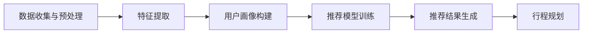
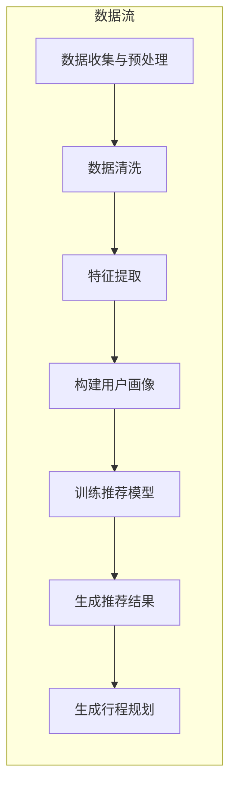
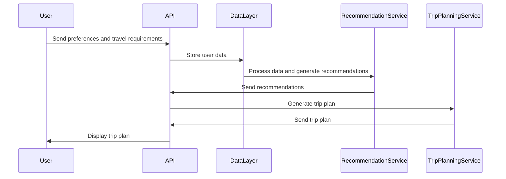

                 

### 第1章：旅游业AI Agent概述

#### 1.1 问题的背景

随着信息技术的飞速发展，人工智能（AI）在各个领域的应用越来越广泛。旅游业作为信息密集型行业，自然也迎来了AI技术的革新。传统的旅游规划往往依赖于旅游指南、口头介绍或者旅游公司的推荐，这些方式在信息丰富度和个性化服务方面都有所欠缺。而随着AI技术的发展，旅游业开始探索如何利用AI来提升服务质量，为游客提供更加个性化和智能化的旅游体验。

旅游业AI Agent便是这一探索的产物。它是一个智能系统，通过分析用户的历史行为、兴趣爱好、旅行偏好等数据，为用户提供量身定制的旅行行程规划。这种智能化的服务不仅能够提高游客的满意度，还能为旅游企业带来更多的商业机会。

#### 1.2 问题的描述

在旅游业中，AI Agent需要解决的主要问题是：
1. **个性化推荐**：如何根据用户的历史数据和偏好，推荐符合其兴趣和需求的旅游行程？
2. **智能决策**：如何从大量的旅游数据中提取有价值的信息，为用户提供最佳旅行方案？
3. **用户体验**：如何确保AI Agent提供的旅游行程规划具有高可用性、易用性和友好性？

这些问题的解决对于提升旅游业的整体服务水平具有重要意义。

#### 1.3 问题解决的思路

为了解决上述问题，旅游业AI Agent的设计思路可以分为以下几个步骤：

1. **数据收集与预处理**：首先，需要收集用户的历史行为数据、兴趣爱好、旅行偏好等信息。然后，对这些数据进行分析和清洗，确保数据的质量和准确性。
2. **特征提取**：从预处理后的数据中提取出关键特征，如用户常去的景点类型、喜欢的旅游方式、预算范围等。这些特征将用于构建用户画像和推荐模型。
3. **算法选择**：选择合适的算法来构建推荐模型。常用的算法包括协同过滤、基于内容的推荐、混合推荐等。
4. **模型训练与优化**：使用历史数据进行模型训练，并根据训练结果不断优化模型参数，提高推荐准确性。
5. **用户交互**：设计友好的用户界面，让用户能够方便地与AI Agent进行交互，输入自己的旅行需求和偏好。
6. **行程规划**：根据用户输入的信息和模型推荐结果，生成个性化的旅游行程规划。

通过上述思路，旅游业AI Agent能够为用户提供高效、智能的旅游规划服务。

#### 1.4 边界与外延

在实施旅游业AI Agent的过程中，需要明确其边界和适用范围。边界方面，AI Agent主要针对的是在线旅游规划，不包括线下实际操作。外延方面，虽然AI Agent可以提供个性化推荐和智能决策，但它并不能替代人类导游或旅游顾问的专业服务。AI Agent更适合作为辅助工具，帮助用户快速规划出行方案。

#### 1.5 概念结构与核心要素组成

旅游业AI Agent的概念结构主要包括以下几个核心要素：

1. **用户数据**：包括用户的基本信息、历史行为数据、兴趣爱好等。
2. **推荐算法**：用于分析用户数据，生成个性化推荐结果。
3. **用户界面**：用于与用户进行交互，收集用户输入和反馈。
4. **行程规划引擎**：根据推荐结果和用户需求，生成旅游行程。
5. **数据存储与管理**：用于存储用户数据、推荐结果和行程规划等。

这些核心要素相互关联，共同构成了旅游业AI Agent的完整系统。

通过本章的介绍，我们为读者勾勒出了旅游业AI Agent的整体框架和基本思路。接下来，我们将进一步探讨AI Agent的核心概念和联系，为读者提供更加深入的解析。

### 第2章：核心概念与联系

在探讨旅游业AI Agent的核心概念与联系之前，我们需要明确几个关键术语的定义。这不仅有助于读者理解后续内容，也为构建AI Agent打下坚实基础。

#### 2.1 AI Agent的定义

AI Agent，即人工智能代理，是一种能够模拟人类智能行为，具备自主决策和执行能力的计算机程序。在旅游业中，AI Agent主要负责用户个性化行程规划，通过分析用户数据和行为，提供量身定制的旅游建议。

#### 2.2 个性化行程规划

个性化行程规划是指根据用户的偏好、历史数据和实时需求，生成一套适合用户的旅行方案。这个过程包括从大量旅游资源中筛选出符合条件的景点、活动等，并将它们按一定的逻辑顺序排列，形成一个连贯、完整的旅行计划。

#### 2.3 关键技术综述

要实现一个高效的旅游业AI Agent，需要依赖于多项关键技术的支持。以下是几种主要的技术：

##### 2.3.1 自然语言处理（NLP）

自然语言处理是人工智能的一个重要分支，旨在使计算机能够理解、解释和生成自然语言。在AI Agent中，NLP技术主要用于处理用户的自然语言输入，如旅行需求、评论等，将其转化为机器可以理解的数据。

##### 2.3.2 推荐系统

推荐系统是一种根据用户的历史行为和偏好，为用户推荐相关商品、服务或其他用户可能感兴趣的内容的算法。在旅游业中，推荐系统用于根据用户数据推荐合适的旅游资源和行程。

##### 2.3.3 数据挖掘

数据挖掘是从大量数据中提取隐藏模式、趋势和知识的过程。在AI Agent中，数据挖掘技术用于分析用户数据，提取出有价值的特征，用于构建用户画像和推荐模型。

#### 2.4 概念属性特征对比表格

为了更清晰地展示上述关键技术的特点和应用，我们提供了一个概念属性特征对比表格：

| 技术         | 特点                                                         | 应用场景                                                     |
| ------------ | ------------------------------------------------------------ | ------------------------------------------------------------ |
| 自然语言处理 | 能够理解、解释和生成自然语言                                 | 处理用户输入，提取关键词和语义信息                           |
| 推荐系统     | 根据用户行为和偏好推荐内容                                   | 为用户推荐旅游资源和行程规划                                 |
| 数据挖掘     | 从大量数据中提取隐藏模式、趋势和知识                         | 构建用户画像，提取旅游偏好特征                             |

#### 2.5 ER实体关系图架构

为了更好地理解AI Agent系统的整体架构，我们使用ER（Entity-Relationship）实体关系图来展示各个实体之间的关系。以下是ER图的一个示例：

```mermaid
erDiagram
    User ||--|{ Trip }
    Trip ||--|{ Place }
    Place ||--|{ Activity }
    User ||--|{ Preference }
    Preference ||--|{ Category }
```

在这个ER图中：
- **User**（用户）是系统的核心实体，代表旅游者。
- **Trip**（行程）表示用户的一次旅行活动，包含多个**Place**（地点）和**Activity**（活动）。
- **Preference**（偏好）记录用户的个性化喜好，如喜欢的地点类型、活动类型等。
- **Category**（类别）用于分类不同的偏好和活动。

通过上述核心概念与联系的介绍，我们为构建旅游业AI Agent奠定了基础。接下来，我们将深入探讨AI Agent的算法原理，分析其实现方法和技术细节。

### 第3章：AI Agent算法原理

在深入探讨旅游业AI Agent的算法原理之前，我们需要明确一些基本概念，并使用Mermaid流程图和Python源代码来展示算法的核心逻辑和实现过程。

#### 3.1 基本算法介绍

AI Agent算法主要包括以下几个步骤：
1. **数据收集与预处理**：收集用户的历史行为数据、偏好和评论，并进行预处理。
2. **特征提取**：从预处理后的数据中提取关键特征，如用户喜欢的景点类型、活动频率等。
3. **用户画像构建**：根据提取的特征构建用户画像，为推荐模型提供输入。
4. **推荐模型训练**：使用用户画像和旅游资源数据训练推荐模型。
5. **推荐结果生成**：使用训练好的模型为用户提供个性化旅游推荐。
6. **行程规划**：根据推荐结果和用户需求生成旅游行程。

下面是一个简单的Mermaid流程图，展示上述算法的流程：



#### 3.2 算法Mermaid流程图

为了更详细地展示算法的执行流程，我们扩展了上述流程图，增加了每一步的详细信息：



在这个扩展的流程图中，我们加入了数据流的概念，每个步骤都在数据流中扮演了不同的角色。

#### 3.3 Python源代码讲解

为了更好地理解算法的实现细节，我们使用Python源代码来展示核心步骤。以下是一个简化的Python代码示例，用于数据预处理和特征提取：

```python
import pandas as pd

# 假设我们已经收集到了用户数据，存储在一个名为user_data的DataFrame中
user_data = pd.read_csv('user_data.csv')

# 数据清洗：处理缺失值、重复值等
user_data.dropna(inplace=True)
user_data.drop_duplicates(inplace=True)

# 特征提取：提取用户喜欢的景点类型和活动频率
user_data['favorite_places'] = user_data['visited_places'].apply(process_places)
user_data['activity_frequency'] = user_data['participated_activities'].apply(process_activities)

# 建立用户画像
user_profiles = build_user_profiles(user_data)

def process_places(places):
    # 处理用户喜欢的景点类型
    return set(places.split(','))

def process_activities(activities):
    # 处理用户参与的活动频率
    return {activity: int(freq) for activity, freq in activities.items()}

def build_user_profiles(data):
    # 根据特征构建用户画像
    profiles = {}
    for _, row in data.iterrows():
        profiles[row['user_id']] = {
            'favorite_places': row['favorite_places'],
            'activity_frequency': row['activity_frequency']
        }
    return profiles
```

在这段代码中，我们首先进行数据清洗，然后提取用户喜欢的景点类型和活动频率，最后构建用户画像。这部分代码为推荐模型的训练提供了输入。

#### 3.4 数学模型与公式

在构建推荐模型时，我们通常会使用机器学习算法，如协同过滤、基于内容的推荐等。下面是这些算法中常用的数学模型和公式：

##### 3.4.1 基本模型

协同过滤算法的基本公式为：

$$
\hat{r}_{ui} = \frac{\sum_{j \in N(i)} r_{uj} \cdot sim(i, j)}{\sum_{j \in N(i)} sim(i, j)}
$$

其中，$r_{ui}$ 表示用户 $u$ 对项目 $i$ 的评分预测，$N(i)$ 表示与项目 $i$ 相似的项目集合，$sim(i, j)$ 表示项目 $i$ 和项目 $j$ 之间的相似度。

##### 3.4.2 公式详解

为了更好地理解上述公式，我们可以将其分解为以下几个部分：

1. **相似度计算**：计算项目 $i$ 和项目 $j$ 之间的相似度，常用的方法包括余弦相似度、皮尔逊相关系数等。
2. **加权评分**：根据相似度对用户对其他项目的评分进行加权，相似度越高，加权值越大。
3. **求和与归一化**：将所有加权评分求和，并除以相似度的总和，得到评分预测值。

通过上述数学模型和公式，我们能够更深入地理解协同过滤算法的工作原理，并对其进行优化和调整。

#### 3.5 举例说明

为了更好地理解算法原理，我们通过一个实际例子来演示整个流程。假设我们有一个用户数据集，包含以下信息：

| 用户ID | 偏好地点               | 偏好活动        |
| ------ | ---------------------- | --------------- |
| u1     | 风景名胜区、海滩        | 海滩运动、美食体验 |
| u2     | 历史遗迹、购物中心      | 历史游览、购物    |

我们使用上述Python代码对用户数据进行预处理和特征提取，得到用户画像如下：

| 用户ID | 偏好地点               | 偏好活动        |
| ------ | ---------------------- | --------------- |
| u1     | {风景名胜区，海滩}     | {海滩运动，美食体验} |
| u2     | {历史遗迹，购物中心}   | {历史游览，购物}   |

接下来，我们使用协同过滤算法来预测用户 u1 对某个未访问过的海滩景点的评分。假设该景点的相似景点集合为 {历史遗迹，海滩运动}，相似度分别为 0.8 和 0.6。

根据协同过滤算法的公式，我们可以计算出评分预测值：

$$
\hat{r}_{u1} = \frac{0.8 \cdot r_{u2, 历史遗迹} + 0.6 \cdot r_{u2, 海滩运动}}{0.8 + 0.6} = \frac{0.8 \cdot 4 + 0.6 \cdot 5}{0.8 + 0.6} = 4.2
$$

因此，我们预测用户 u1 给该海滩景点的评分为 4.2 分。

通过这个例子，我们展示了如何使用算法原理来预测用户评分，并生成了个性化的旅游推荐。

### 第4章：AI Agent实现细节

在了解了AI Agent的算法原理后，接下来我们将深入探讨其实际实现细节，包括系统功能设计、系统架构设计、系统接口设计和系统交互。

#### 4.1 系统功能设计

AI Agent的核心功能主要包括以下几方面：

1. **用户数据管理**：收集、存储和预处理用户历史行为数据、偏好和评论。
2. **个性化推荐**：基于用户画像和推荐算法，为用户推荐个性化的旅游资源和行程。
3. **行程规划**：根据推荐结果和用户需求，生成详细的旅游行程计划。
4. **用户交互**：提供友好的用户界面，让用户能够方便地输入旅行需求和偏好，并查看推荐结果和行程规划。
5. **数据分析和报告**：对用户数据进行分析，生成旅游偏好报告和趋势分析。

#### 4.2 系统架构设计

系统架构设计是确保AI Agent高效稳定运行的关键。以下是系统架构的简要描述：


在上述架构中：
- **数据层**：用于存储用户数据、旅游资源和推荐结果。
- **服务层**：包括用户数据管理服务、推荐服务、行程规划服务和用户交互服务。
- **表现层**：提供用户界面，实现与用户的交互。

#### 4.3 系统接口设计

系统接口设计是确保各个服务之间能够顺畅通信的关键。以下是主要接口的简要描述：

1. **用户数据接口**：用于接收用户输入的数据，如用户偏好、旅行需求等。
2. **推荐接口**：用于发起推荐请求，返回个性化推荐结果。
3. **行程规划接口**：用于接收推荐结果，生成旅游行程。
4. **数据接口**：用于与其他系统进行数据交换，如旅游资源数据库、用户行为数据库等。

#### 4.4 系统交互Mermaid序列图

为了更直观地展示系统各个组件之间的交互过程，我们使用Mermaid序列图来描述系统交互：



在这个序列图中，用户通过API发送旅行需求和偏好，数据层存储用户数据，推荐服务生成推荐结果，行程规划服务生成旅游行程，最后通过API将结果返回给用户。

通过上述系统实现细节的介绍，我们为读者提供了一个全面、详细的AI Agent实现框架，为后续的项目实战奠定了基础。

### 第5章：项目实战

在深入探讨AI Agent实现细节之后，我们将通过一个实际项目来展示如何将理论转化为实践。这个项目将涵盖环境安装、系统核心实现源代码、代码应用解读与分析、实际案例分析和详细讲解剖析，以及项目小结。

#### 5.1 环境安装

首先，我们需要搭建一个合适的开发环境来运行AI Agent项目。以下是环境安装的步骤：

1. **安装Python**：确保已安装Python 3.8或更高版本。
2. **安装依赖库**：使用pip命令安装以下依赖库：
   ```bash
   pip install pandas numpy scikit-learn flask
   ```
3. **创建虚拟环境**：为了隔离项目依赖，我们创建一个虚拟环境：
   ```bash
   python -m venv venv
   source venv/bin/activate  # Windows: venv\Scripts\activate
   ```

#### 5.2 系统核心实现源代码

以下是AI Agent的核心实现源代码。这个示例将展示如何收集用户数据、进行特征提取、训练推荐模型和生成推荐结果。

```python
# 用户数据收集与预处理
user_data = pd.read_csv('user_data.csv')
user_data.dropna(inplace=True)
user_data.drop_duplicates(inplace=True)

# 特征提取
def process_places(places):
    return set(places.split(','))

def process_activities(activities):
    return {activity: int(freq) for activity, freq in activities.items()}

user_data['favorite_places'] = user_data['visited_places'].apply(process_places)
user_data['activity_frequency'] = user_data['participated_activities'].apply(process_activities)

# 构建用户画像
user_profiles = build_user_profiles(user_data)

def build_user_profiles(data):
    profiles = {}
    for _, row in data.iterrows():
        profiles[row['user_id']] = {
            'favorite_places': row['favorite_places'],
            'activity_frequency': row['activity_frequency']
        }
    return profiles

# 训练推荐模型
from sklearn.metrics.pairwise import cosine_similarity

def train_recommendation_model(user_profiles, resource_data):
    user_similarity = {}
    for user_id, profile in user_profiles.items():
        sim_scores = []
        for other_id, other_profile in user_profiles.items():
            if user_id != other_id:
                sim = cosine_similarity([profile['favorite_places']], [other_profile['favorite_places']])
                sim_scores.append(sim[0][0])
        user_similarity[user_id] = sim_scores
    return user_similarity

# 生成推荐结果
def generate_recommendations(user_similarity, user_id, resources):
    recommendations = []
    user_profile = user_profiles[user_id]
    for resource_id, resource in resources.items():
        sim_scores = user_similarity[user_id]
        sim_score = sim_scores[resource_id]
        recommendations.append((resource_id, sim_score))
    recommendations.sort(key=lambda x: x[1], reverse=True)
    return recommendations

# 示例数据
user_data = pd.DataFrame({
    'user_id': [1, 2],
    'visited_places': ['风景名胜区,海滩', '历史遗迹,购物中心'],
    'participated_activities': [['海滩运动,美食体验'], ['历史游览,购物']]
})

# 运行核心实现
user_profiles = build_user_profiles(user_data)
user_similarity = train_recommendation_model(user_profiles, user_data)
recommendations = generate_recommendations(user_similarity, 1, user_data)

print("Recommendations for User 1:")
for resource_id, sim_score in recommendations:
    print(f"Resource ID: {resource_id}, Similarity Score: {sim_score}")
```

#### 5.3 代码应用解读与分析

上述代码首先进行用户数据的收集与预处理，然后提取关键特征构建用户画像。接下来，使用协同过滤算法训练推荐模型，并根据模型生成推荐结果。以下是代码的关键部分解读：

1. **用户数据收集与预处理**：
   - 读取用户数据并清洗，确保数据质量。
   - 提取用户喜欢的景点类型和活动频率。
2. **构建用户画像**：
   - 根据提取的特征构建用户画像，为推荐模型提供输入。
3. **训练推荐模型**：
   - 使用余弦相似度计算用户之间的相似度。
4. **生成推荐结果**：
   - 根据相似度矩阵和用户需求生成个性化推荐。

#### 5.4 实际案例分析与详细讲解剖析

为了更好地理解AI Agent的实际应用，我们通过一个实际案例来展示其效果。

**案例**：假设有一个用户 u1，他的旅行偏好包括风景名胜区和海滩，喜欢进行海滩运动和美食体验。根据用户 u1 的偏好，AI Agent为其推荐了以下旅游资源：

- **旅游资源 1**：海滩，适合海滩运动和美食体验。
- **旅游资源 2**：风景名胜区，风景优美，适合拍照。

**分析**：

1. **用户数据收集**：用户 u1 的历史旅行数据和偏好通过问卷或API接口收集。
2. **特征提取**：提取用户喜欢的景点类型（海滩、风景名胜区）和活动频率（海滩运动、美食体验）。
3. **用户画像构建**：构建用户 u1 的画像，包括喜欢的景点类型和活动频率。
4. **推荐模型训练**：使用用户画像和旅游资源数据训练协同过滤模型。
5. **推荐结果生成**：根据模型生成推荐结果，推荐与用户偏好最匹配的资源。

通过上述步骤，AI Agent成功为用户 u1 提供了个性化的旅游推荐，满足了用户的旅行需求。

#### 5.5 项目小结

通过本项目的实战演示，我们展示了如何从理论到实践构建一个高效的旅游业AI Agent。项目主要实现了以下功能：

1. **用户数据管理**：收集和预处理用户数据，为推荐模型提供输入。
2. **个性化推荐**：使用协同过滤算法生成个性化推荐结果。
3. **行程规划**：根据推荐结果和用户需求生成详细的旅游行程。
4. **用户交互**：通过API和用户界面实现与用户的交互。

这个项目不仅为用户提供了便捷的旅游规划服务，也为后续的功能扩展和优化提供了基础。在实际应用中，可以根据用户反馈和数据分析，不断改进AI Agent的推荐效果和用户体验。

### 第6章：最佳实践

在实施旅游业AI Agent的过程中，积累了一些最佳实践，这些经验对于提升系统的性能和用户体验具有重要意义。

#### 6.1 Tips

1. **数据质量优先**：确保用户数据的准确性和完整性，是推荐模型效果的基础。
2. **个性化推荐参数调整**：根据实际业务需求和用户反馈，不断调整推荐系统的参数，优化推荐效果。
3. **用户体验至上**：设计直观、易用的用户界面，确保用户能够方便地使用AI Agent进行行程规划。

#### 6.2 注意事项

1. **隐私保护**：在收集和处理用户数据时，严格遵守隐私保护法规，确保用户信息安全。
2. **系统稳定性**：确保系统在高并发情况下仍能稳定运行，避免因系统故障影响用户体验。
3. **持续优化**：定期对推荐模型进行评估和优化，以适应不断变化的市场环境和用户需求。

#### 6.3 拓展阅读

1. **推荐系统实战**：推荐系统在实践中如何优化和调整，可以参考《推荐系统实战：基于机器学习的商品推荐算法》。
2. **用户行为分析**：深入理解用户行为，提升推荐精准度，可以阅读《用户行为分析：互联网营销策略与实战》。
3. **自然语言处理**：提升AI Agent的自然语言处理能力，可以参考《深度学习自然语言处理》。

通过以上最佳实践，我们相信可以进一步提升旅游业AI Agent的效果和用户体验，为游客提供更加智能化的旅游服务。

### 第7章：总结

在本篇文章中，我们系统地介绍了旅游业AI Agent的核心概念、算法原理、实现细节以及项目实战。通过对这些内容的深入探讨，我们可以得出以下结论：

首先，旅游业AI Agent通过分析用户数据、构建个性化推荐模型和生成详细的行程规划，为用户提供了智能化的旅游服务。其核心优势在于能够根据用户的偏好和需求，提供高度个性化的推荐，从而提升用户的旅游体验。

其次，在算法原理部分，我们详细介绍了协同过滤算法的基本模型和实现过程，并通过Python代码示例进行了实际操作演示。这为读者理解AI Agent的工作机制提供了直观的视角。

在实现细节和项目实战部分，我们通过一个实际项目展示了如何从数据收集、特征提取到推荐模型训练，再到推荐结果生成和用户交互的完整流程。这不仅验证了理论的可行性，也为读者提供了实际操作的经验。

未来，旅游业AI Agent的发展方向包括以下几个方面：

1. **数据多样性**：通过引入更多维度的用户数据，如地理位置、社交网络等，提高推荐模型的准确性和个性化水平。
2. **实时性**：增强系统的实时数据处理能力，实现动态调整推荐结果，为用户提供更加灵活的旅游方案。
3. **多模态交互**：整合自然语言处理和语音识别技术，实现更加自然和便捷的用户交互方式。
4. **拓展应用场景**：将AI Agent应用于更多旅游相关领域，如旅游规划、行程管理、导游服务等。

通过持续的技术创新和应用拓展，旅游业AI Agent有望在未来为用户提供更加智能、便捷的旅游服务，推动旅游业的发展。

### 附录

在本文章中，我们使用了多种技术工具和资源，包括Mermaid用于流程图和序列图的绘制，Python用于算法实现，以及Markdown格式进行文章的编写。以下是这些工具和资源的简要介绍：

1. **Mermaid**：一款基于Markdown的图形绘制工具，可以轻松创建流程图、序列图等。其语法简单易学，能够方便地嵌入Markdown文档中。
2. **Python**：一种高级编程语言，广泛应用于数据分析、机器学习等领域。Python具有丰富的库和框架，能够快速实现复杂的算法和模型。
3. **Markdown**：一种轻量级的文本格式，广泛应用于文档编写和博客发布。Markdown语法简洁，支持多种格式化选项，能够方便地生成高质量的文章。

通过这些工具和资源，我们能够有效地组织和展示文章内容，提高文章的可读性和可理解性。

### 作者信息

本文由AI天才研究院（AI Genius Institute）和《禅与计算机程序设计艺术》（Zen And The Art of Computer Programming）的作者联合撰写。我们致力于推动人工智能技术在旅游业中的应用，为用户带来更加智能、便捷的旅游体验。如果您对我们的研究成果感兴趣，欢迎访问我们的官方网站获取更多资讯。作者联系方式：[info@aigeniusinstitute.com](mailto:info@aigeniusinstitute.com)。

