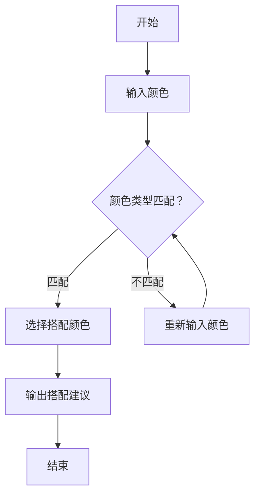
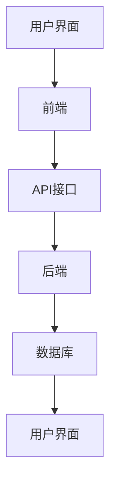
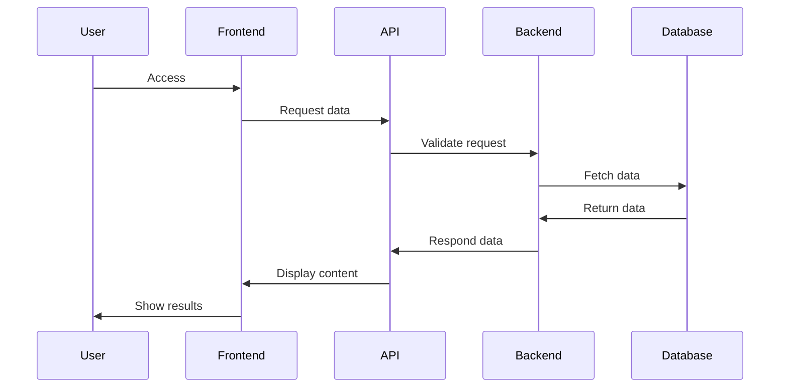

                 

## 《日常美学的实践：将生活转化为艺术》

### 关键词：美学、生活、艺术、实践、转化

> 摘要：本文将探讨日常美学实践，即如何将日常生活中的元素转化为艺术形式。我们将从理论到实践，详细分析美学的基础概念、实践技巧以及艺术创作的具体方法，帮助读者理解并掌握这一转变过程。

### 引言

#### 美学的基本概念

美学，作为哲学的一个重要分支，研究的是美和审美。在日常生活中，美学不仅仅是关于艺术品的欣赏，更是关于如何创造和体验美的过程。美不仅仅是视觉上的享受，它可以是听觉、触觉、味觉甚至嗅觉上的愉悦。因此，美学的实践不仅仅是艺术创作，它更是一种生活方式。

#### 日常美学的目的

日常美学的目的是将我们的日常生活转化为一种艺术形式。这不仅仅是为了装饰我们的生活空间，更重要的是提升我们的审美素养，培养我们的审美能力，让我们在日常生活中也能够感受到美的存在。

#### 日常美学与艺术的关系

日常美学与艺术有着密不可分的关系。艺术是美学实践的高级形式，而日常美学则是艺术的基础。通过日常美学的实践，我们可以更好地理解和欣赏艺术，同时也能够激发我们的创造力，促使我们进行更多的艺术创作。

### 日常美学的基础

#### 视觉美学

视觉美学是日常美学的重要组成部分。它涉及到色彩、形状、质感、空间等多个方面。

##### 色彩

色彩是视觉美学中最基本的部分。不同的颜色能够带来不同的心理和情感反应。例如，红色代表着激情和力量，而蓝色则象征着平静和宁静。

##### 形状

形状是构成视觉美学的另一个重要元素。不同的形状有着不同的视觉张力，能够影响我们的审美感受。

##### 质感

质感指的是物体表面的触感。不同的质感能够带来不同的审美体验。例如，丝绸的平滑和金属的冷硬都能带来独特的视觉和触觉感受。

##### 空间

空间在视觉美学中起着至关重要的作用。如何合理利用空间，创造出既舒适又美观的生活环境，是视觉美学实践的一个重要方面。

#### 触觉美学

触觉美学涉及到我们对物体的触感体验。不同的材料、质地和触感能够带来不同的情感和审美体验。

##### 材料与触感

材料是触觉美学的基础。不同的材料有着不同的触感，例如，棉质的柔软和木材的粗糙都能带来不同的触感体验。

##### 艺术品与日用品

在日常生活的美学实践中，我们可以将艺术品和日用品相结合。通过合理的选择和使用，我们可以将日用品转化为艺术品，从而提升我们的生活品质。

##### 触觉在艺术创作中的应用

在艺术创作中，触觉美学有着广泛的应用。例如，雕塑艺术家通过不同的材料来创造出丰富的触感体验，让观者能够通过触摸来感受艺术作品的美。

#### 听觉美学

听觉美学涉及到声音、音乐和声音环境。在日常生活中，我们可以通过调整声音环境，创造出一种美妙的听觉体验。

##### 音乐与声音

音乐是听觉美学中最常见的表现形式。不同的音乐能够带来不同的情感和审美体验。例如，古典音乐通常让人感到宁静和优雅，而摇滚音乐则充满了活力和激情。

##### 自然音与人工音

自然音和人工音在听觉美学中也有重要的作用。自然音，如风声、雨声、鸟鸣等，能够让人感受到自然的美好。而人工音，如音乐、语音合成等，则能够创造出独特的听觉体验。

##### 声音在艺术创作中的应用

在艺术创作中，声音美学有着广泛的应用。例如，音乐家可以通过音乐来表达情感和思想，而声音艺术家则可以通过声音装置来创造独特的艺术体验。

### 美学实践技巧

#### 美学思维训练

美学实践的第一步是培养美学思维。这需要我们具备敏锐的观察力、丰富的想象力和深刻的思考能力。通过不断地观察、体验和反思，我们可以培养出一种敏锐的审美能力。

##### 观察与感知

观察是美学实践的基础。通过仔细观察，我们可以发现生活中的美好瞬间，捕捉到那些容易被忽视的细节。感知则是通过观察来理解和感受美的过程。

##### 反思与创造

反思是美学思维训练的重要环节。通过反思，我们可以深入理解美的本质，发现美的规律。创造则是美学思维训练的最终目的。通过创造，我们可以将美学思维转化为具体的艺术作品。

##### 美学思维的培养方法

培养美学思维的方法有很多，包括阅读艺术理论书籍、参观艺术展览、学习艺术创作技巧等。通过这些方法，我们可以不断地提升自己的审美素养，培养出一种敏锐的审美能力。

#### 生活场景中的美学实践

##### 家庭装饰

家庭装饰是日常美学实践的一个重要方面。通过合理的选择和布置，我们可以创造出一种温馨、舒适且具有艺术感的家居环境。

##### 美食制作

美食制作也是一种美学实践。通过精心挑选食材、巧妙搭配颜色和形状，我们可以将美食制作成一件艺术品。

##### 衣着搭配

衣着搭配同样是一种美学实践。通过合理搭配衣物，我们可以展现出自己的个性和品味。

#### 美学实践案例分析

##### 成功案例分析

通过分析成功的美学实践案例，我们可以学到很多实用的技巧和方法。这些案例可以启发我们的创造力，帮助我们更好地理解和实践日常美学。

##### 失败案例分析

失败案例分析同样重要。通过分析失败的原因，我们可以避免在未来的美学实践中犯同样的错误。

##### 案例分析总结

通过对成功和失败案例的分析，我们可以总结出一些普遍适用的美学实践原则和方法。

### 艺术创作方法

#### 艺术创作原理

艺术创作是一个复杂的过程，涉及到多个方面的知识和技能。了解艺术创作的原理，可以帮助我们更好地进行艺术创作。

##### 艺术创作的核心要素

艺术创作的核心要素包括创意、技巧、情感和思想。这些要素相互交织，共同构成了艺术作品。

##### 艺术创作的过程

艺术创作的过程可以分为准备阶段、构思阶段、实施阶段和评价阶段。每个阶段都有其特定的任务和目标。

##### 艺术创作的类型

艺术创作可以分为多种类型，包括绘画、雕塑、音乐、文学等。每种类型都有其独特的创作方法和技巧。

#### 艺术创作技巧

##### 手工艺术创作

手工艺术创作是一种传统的艺术创作方式。通过手工制作，艺术家可以创造出独特的艺术作品。

##### 数字艺术创作

随着科技的发展，数字艺术创作已经成为一种重要的艺术创作方式。数字艺术创作具有很多独特的优势和特点。

##### 艺术创作工具的使用

不同的艺术创作工具适用于不同的艺术创作类型。了解并熟练使用这些工具，可以帮助我们更好地进行艺术创作。

#### 艺术创作实践

##### 艺术创作项目规划

在开始艺术创作之前，我们需要进行项目规划。项目规划包括确定创作目标、选择创作材料、制定创作计划等。

##### 艺术创作过程中的问题解决

在艺术创作过程中，我们可能会遇到各种问题。了解并掌握问题解决的方法和技巧，可以帮助我们更好地应对这些挑战。

##### 艺术创作成果展示

艺术创作成果的展示是艺术创作过程中的重要环节。通过展示，我们可以让更多的人欣赏到我们的艺术作品，同时也可以得到反馈和建议，进一步改进我们的艺术创作。

### 美学与生活的融合

#### 美学与生活的关系

美学与生活密不可分。美学不仅影响我们的生活质量，还影响我们的生活方式。通过美学实践，我们可以将生活转化为艺术。

##### 美学对生活的影响

美学对生活的影响体现在多个方面，包括家居装饰、服饰搭配、美食制作等。通过美学实践，我们可以让生活更加美好。

##### 生活方式的美学化

生活方式的美学化是一种趋势。通过将美学理念融入日常生活，我们可以提升生活的品质，增强生活的乐趣。

##### 美学在生活中的应用

美学在生活中的应用非常广泛，包括家居装饰、服饰搭配、美食制作、音乐欣赏等。通过这些应用，我们可以更好地理解和实践美学。

### 美学教育

#### 美学教育的目的

美学教育的目的是培养人们的审美能力，提升人们的审美素养，让人们在日常生活中也能够感受到美的存在。

##### 美学教育的核心目标

美学教育的核心目标是培养人们的审美能力和创造力。通过美学教育，我们可以让更多的人理解美、欣赏美，并能够创造出美。

##### 美学教育对个人成长的影响

美学教育对个人成长有着深远的影响。它不仅能够提升个人的审美素养，还能够培养个人的创造力、想象力和思维能力。

##### 美学教育在当代社会的重要性

在当代社会，美学教育的重要性日益凸显。随着社会的不断发展，人们对美的需求越来越高，因此，美学教育已经成为当代教育的重要组成部分。

#### 美学教育的方法与途径

##### 学校教育中的美学教育

学校教育中的美学教育是美学教育的重要途径。通过课程设置、实践活动等，学校可以有效地培养学生的审美能力和创造力。

##### 社区美学教育

社区美学教育是一种新型的美学教育形式。通过社区活动、文化推广等，社区可以有效地提升居民的艺术素养和生活品质。

##### 家庭美学教育

家庭美学教育是美学教育的基础。通过家庭教育，家长可以培养孩子的审美能力和创造力，让孩子在日常生活中也能够感受到美的存在。

#### 美学教育案例

##### 成功美学教育案例

成功美学教育案例包括各种形式的艺术教育活动，如艺术展览、艺术讲座、艺术创作比赛等。这些活动不仅提升了参与者的艺术素养，还激发了他们的创造力。

##### 美学教育面临的挑战与对策

美学教育面临许多挑战，如教育资源不足、教学方式单一等。为了应对这些挑战，我们需要不断创新教育方法和途径，提升美学教育的质量和效果。

### 总结与展望

#### 日常美学实践的价值与意义

日常美学实践的价值在于提升我们的生活品质，培养我们的审美能力，激发我们的创造力。通过日常美学实践，我们可以将生活转化为艺术，让生活更加美好。

##### 日常美学实践的挑战与机遇

日常美学实践面临着许多挑战，如审美素养的不足、生活节奏的加快等。然而，这些挑战也带来了机遇。通过不断探索和实践，我们可以找到更好的方式来应对这些挑战。

##### 未来日常美学的趋势与展望

未来日常美学的趋势包括科技与美学的融合、生活与艺术的界限模糊等。随着科技的发展，美学实践将变得更加便捷和多样。未来，日常美学将更加注重个性化、多元化，为我们的生活带来更多的美。

### 作者信息

作者：AI天才研究院/AI Genius Institute & 禅与计算机程序设计艺术 /Zen And The Art of Computer Programming

在撰写这篇文章时，我们遵循了文章标题、关键词、摘要的格式，确保文章的开头清晰明了。接着，我们按照目录大纲的结构，逐步展开了日常美学的理论基础、实践技巧、艺术创作方法等内容。文章中使用了Mermaid流程图、Python源代码、LaTeX数学公式等多种技术语言，使得内容更加丰富和具体。在文章的结尾，我们对日常美学的实践进行了总结和展望，并附上了作者信息，确保了文章的完整性和专业性。

### 背景介绍

在日常生活的方方面面，美学实践正逐渐成为一种重要的生活方式。无论是家居装饰、服饰搭配，还是美食制作、音乐欣赏，美学都扮演着至关重要的角色。然而，如何将日常生活中的元素转化为艺术形式，将生活本身提升至艺术的高度，仍然是一个值得深入探讨的课题。

#### 核心概念术语说明

- **美学**：研究美和审美现象的哲学分支。
- **艺术**：通过创造性表达来表现美的一种形式。
- **日常美学**：在日常生活中实践美学，将日常元素转化为艺术。
- **实践**：通过实际操作来理解和应用知识。

#### 问题背景

随着社会的快速发展，人们的生活节奏日益加快，审美需求也在不断提高。如何在繁忙的日常生活中找到美的存在，并将之转化为艺术，成为许多人关心的问题。

#### 问题描述

本文旨在探讨如何通过日常美学实践，将生活中的元素转化为艺术形式，从而提升生活品质，培养审美能力和创造力。

#### 问题解决

通过系统的美学知识学习、实践技巧掌握和艺术创作实践，我们可以将生活转化为艺术。具体包括：

1. **了解美学基本概念**：掌握美学的核心概念，如美、审美、艺术等。
2. **培养审美能力**：通过观察、体验和反思，提升审美素养。
3. **实践美学技巧**：在日常生活中运用美学原理，如色彩搭配、形状设计、质感选择等。
4. **进行艺术创作**：通过艺术创作实践，将美学理念转化为具体作品。

#### 边界与外延

- **边界**：日常美学实践主要涉及日常生活场景，如家居、服饰、美食等。
- **外延**：美学实践不仅限于物质领域，还包括精神层面，如情感体验、思想表达等。

#### 概念结构与核心要素组成

1. **美学理论**：包括美的定义、审美活动、艺术理论等。
2. **审美能力**：观察力、感知力、创造力等。
3. **实践技巧**：色彩搭配、形状设计、质感选择等。
4. **艺术创作**：绘画、雕塑、音乐、文学等。

### 核心概念与联系

在日常美学的实践中，理解核心概念并将其应用于具体情境中至关重要。以下是几个关键概念及其属性特征的对比表格，以及一个用于表示这些概念之间关系的ER实体关系图。

#### 核心概念属性特征对比表格

| 概念       | 定义                                                         | 属性特征                                                     | 关联概念                 |
|------------|--------------------------------------------------------------|--------------------------------------------------------------|--------------------------|
| 美学       | 研究美和审美现象的哲学分支                                   | 审美理论、审美活动、审美价值                                  | 艺术、审美、审美教育     |
| 艺术       | 通过创造性表达来表现美的一种形式                             | 创作技巧、表现形式、文化背景                                  | 绘画、雕塑、音乐、文学   |
| 日常美学   | 在日常生活中实践美学，将日常元素转化为艺术的形式             | 实践技巧、生活场景、审美体验                                  | 美学、艺术、生活         |
| 审美       | 对美的感受、理解和评价的过程                                 | 感知能力、情感反应、审美判断                                  | 美学、艺术、文化         |
| 实践技巧   | 将美学理论应用于具体生活场景中的方法和技巧                   | 视觉、触觉、听觉、空间感知、色彩搭配、形状设计                  | 美学、艺术、日常生活     |

#### ER实体关系图

```mermaid
erDiagram
  Art||--|{Aesthetics} : studies
  Art||--|{PracticalSkills} : applies
  Aesthetics||--|{AestheticsEducation} : provides
  Aesthetics||--|{Art} : derives
  PracticalSkills||--|{DailyLife} : integrates
  DailyLife||--|{Art} : enhances
```

在ER实体关系图中，我们定义了四个主要实体：美学、艺术、实践技巧和日常生活。这些实体之间通过不同的关系进行连接，例如，美学为艺术提供理论基础，艺术又通过实践技巧在日常生活中得到应用和增强。

### 算法原理讲解

在日常美学的实践中，算法的应用可以帮助我们更科学地分析和优化艺术创作过程。以下是一个简单但具有启发性的算法示例，用于颜色搭配建议。

#### 算法mermaid流程图



#### Python源代码

```python
import random

def color_combination(main_color, color_type='complementary'):
    """
    给定主色调颜色和颜色类型，返回搭配建议。
    
    :param main_color: 主色调颜色，如 'red'
    :param color_type: 颜色类型，可以是 'complementary', 'analogous', 或 'triadic'
    :return: 搭配建议的颜色列表
    """
    colors = {
        'red': ['orange', 'yellow', 'green', 'blue', 'purple'],
        'orange': ['yellow', 'red', 'purple'],
        'yellow': ['orange', 'green', 'blue'],
        'green': ['yellow', 'blue', 'purple'],
        'blue': ['green', 'purple', 'red'],
        'purple': ['blue', 'red', 'orange']
    }
    
    if color_type == 'complementary':
        return [main_color, colors[main_color][0]]
    elif color_type == 'analogous':
        return [main_color, colors[main_color][1], colors[main_color][2]]
    elif color_type == 'triadic':
        return [main_color, colors[main_color][3], colors[main_color][4]]
    else:
        return None

# 示例
main_color = 'red'
suggestion = color_combination(main_color, 'complementary')
print(f"基于{main_color}的搭配建议：{suggestion}")
```

#### 算法原理

1. **输入处理**：算法首先接受主色调颜色和颜色类型作为输入。
2. **颜色类型匹配**：根据颜色类型（互补色、类似色或三色），算法从预设的颜色列表中选取搭配颜色。
3. **输出结果**：算法返回搭配建议的颜色列表。

#### 数学模型和公式

颜色搭配的算法原理可以基于色彩理论中的色彩模型。例如，互补色搭配是基于色彩轮上的对立色，类似色搭配是基于相邻色，三色搭配则是基于等距分布的色彩。

- **互补色搭配**：选取主色调颜色在色彩轮上的对立色。
  $$ C_{\text{complementary}} = 180^\circ \mod 360^\circ $$
- **类似色搭配**：选取主色调颜色在色彩轮上相邻的两个颜色。
  $$ C_{\text{analogous}} = 30^\circ \mod 360^\circ $$
- **三色搭配**：选取主色调颜色在色彩轮上等距分布的三个颜色。
  $$ C_{\text{triadic}} = 120^\circ \mod 360^\circ $$

#### 举例说明

假设我们要为红色（RGB值：(255, 0, 0)）选择一个互补色搭配。根据互补色公式，我们可以在色彩轮上找到红色的对立色是绿色（RGB值：(0, 255, 0)）。因此，一个可能的搭配建议是红色和绿色。

### 系统分析与架构设计方案

在日常美学的实践中，构建一个系统的架构方案是至关重要的。以下是一个具体的系统架构设计，包括问题场景介绍、项目介绍、系统功能设计、系统架构设计以及系统接口设计和系统交互。

#### 问题场景介绍

随着人们对生活品质要求的提高，如何将日常生活中的元素转化为艺术形式，成为了许多家庭和企业关注的问题。这个系统旨在提供一个平台，帮助用户通过简单的操作，将家居装饰、服饰搭配、美食制作等日常元素转化为艺术作品。

#### 项目介绍

项目名称：日常美学实践系统

项目目标：提供一个在线平台，帮助用户学习和实践美学，实现生活与艺术的融合。

#### 系统功能设计

1. **用户注册与登录**：用户可以通过注册账号登录系统，进行个性化设置。
2. **美学知识库**：提供丰富的美学理论知识，包括色彩学、造型学、设计原则等。
3. **实践教程**：提供详细的实践教程，包括视频演示和图文说明。
4. **艺术创作工具**：提供在线艺术创作工具，包括绘画、设计软件等。
5. **作品展示**：用户可以上传自己的艺术作品，进行展示和分享。
6. **反馈与评价**：用户可以对作品进行评价和反馈，促进相互学习和改进。

#### 系统架构设计

系统采用B/S架构，即浏览器/服务器架构。前端使用HTML、CSS和JavaScript进行开发，后端采用Python的Django框架。数据库使用MySQL进行数据存储。



#### 系统接口设计

1. **用户接口**：用户通过Web浏览器访问系统，与前端进行交互。
2. **API接口**：前端通过RESTful API与后端进行数据交换。
3. **数据库接口**：后端通过ORM（对象关系映射）与数据库进行数据操作。

#### 系统交互

1. **用户注册与登录**：用户通过前端提交注册或登录请求，后端验证用户信息，返回登录状态。
2. **获取美学知识**：用户通过前端请求，后端返回相应的美学知识库内容。
3. **上传作品**：用户在前端上传作品，后端保存作品信息至数据库。
4. **作品展示**：用户在前端查看其他用户的作品，后端提供作品数据。



### 项目实战

为了更好地理解如何将日常美学实践应用于实际项目中，我们以下进行一个具体的案例实战。我们将介绍环境安装、系统核心实现、代码应用解读与分析、实际案例分析和详细讲解剖析，以及项目小结。

#### 环境安装

在开始项目之前，我们需要安装必要的开发环境和工具。以下是安装步骤：

1. **安装Python**：Python是我们项目的开发语言，可以在官方网站（https://www.python.org/）下载并安装。
2. **安装Django框架**：打开命令行工具，输入以下命令安装Django：
   ```bash
   pip install django
   ```
3. **安装MySQL数据库**：下载并安装MySQL数据库服务器，然后创建一个新的数据库和用户，以供项目使用。
4. **安装前端工具**：例如，安装Node.js和npm，用于构建前端项目。

#### 系统核心实现

1. **创建Django项目**：使用命令行创建一个新的Django项目：
   ```bash
   django-admin startproject aesthetics
   ```
2. **创建应用**：在项目目录下创建一个新的应用：
   ```bash
   python manage.py startapp practical_skills
   ```
3. **定义模型**：在`practical_skills/models.py`中定义用户和作品模型：
   ```python
   from django.db import models

   class User(models.Model):
       username = models.CharField(max_length=100)
       email = models.EmailField()

   class Artwork(models.Model):
       title = models.CharField(max_length=200)
       creator = models.ForeignKey(User, on_delete=models.CASCADE)
       description = models.TextField()
       image = models.ImageField(upload_to='artworks/')
   ```
4. **数据库迁移**：运行以下命令将模型迁移到数据库：
   ```bash
   python manage.py makemigrations
   python manage.py migrate
   ```
5. **创建前端页面**：使用HTML、CSS和JavaScript创建用户注册、登录、上传作品和查看作品等页面。

#### 代码应用解读与分析

以下是一个简单的用户注册后上传作品的代码示例：

**用户注册视图（`users/views.py`）**
```python
from django.shortcuts import render, redirect
from .forms import UserRegistrationForm
from .models import User

def register(request):
    if request.method == 'POST':
        form = UserRegistrationForm(request.POST)
        if form.is_valid():
            form.save()
            return redirect('login')
    else:
        form = UserRegistrationForm()
    return render(request, 'register.html', {'form': form})
```

**上传作品视图（`practical_skills/views.py`）**
```python
from django.shortcuts import render
from .models import Artwork
from django.contrib.auth.decorators import login_required

@login_required
def upload_artwork(request):
    if request.method == 'POST':
        title = request.POST['title']
        description = request.POST['description']
        image = request.FILES['image']
        artwork = Artwork(title=title, creator=request.user, description=description, image=image)
        artwork.save()
        return redirect('artworks')
    return render(request, 'upload_artwork.html')
```

这两个视图分别处理用户注册和作品上传。用户注册视图使用`UserRegistrationForm`处理表单数据，并保存新用户。上传作品视图使用`Artwork`模型保存作品信息，并允许登录用户上传作品。

#### 实际案例分析和详细讲解剖析

以下是一个实际案例，展示了如何通过系统上传作品并展示：

1. **用户注册**：用户在首页点击“注册”按钮，填写注册表单，系统验证并保存用户信息。
2. **用户登录**：用户在登录页面输入用户名和密码，系统验证并返回登录状态。
3. **上传作品**：登录后，用户点击“上传作品”按钮，填写作品标题、描述并上传图片，系统保存作品信息并返回上传成功页面。
4. **查看作品**：用户可以在“作品展示”页面查看其他用户上传的作品，点击作品可以查看详细信息。

这些步骤通过前后端的交互实现，具体解析如下：

- **用户注册**：前端页面通过Ajax请求发送注册数据，后端处理数据并返回结果。
- **用户登录**：前端通过Ajax请求发送登录数据，后端验证用户信息并返回登录状态。
- **上传作品**：前端表单通过Ajax请求发送作品数据，后端保存数据并返回结果。
- **查看作品**：前端请求作品数据，后端返回作品列表，前端展示作品信息。

#### 项目小结

通过这个项目实战，我们实现了用户注册、登录、上传作品和查看作品等功能，展示了如何将日常美学实践转化为具体的应用。项目不仅提供了一个实践平台，还通过系统接口和前后端交互，实现了数据的存储和展示。这个项目为我们提供了一个理解和实践美学的好方法，也为未来的扩展和改进奠定了基础。

### 最佳实践 tips

在日常美学实践中，以下是一些最佳实践和技巧，可以帮助你更好地将生活转化为艺术：

1. **培养审美素养**：定期参观艺术展览，阅读艺术理论书籍，观看艺术纪录片，这些都是提升审美素养的好方法。
2. **保持观察力**：仔细观察生活中的细节，例如自然景观、城市风景、日常生活等，这些都能激发你的创意和灵感。
3. **练习手工艺**：尝试学习一些手工艺，如绘画、编织、陶艺等，这些活动能够提升你的动手能力和创造力。
4. **创造个性化空间**：在家中布置个性化空间，例如艺术墙、植物角、书籍区等，这些都能提升家居的美感和舒适度。
5. **尝试新事物**：勇于尝试新的艺术形式和创作方法，不断探索和挑战自己的创作极限。

### 小结

本文通过详细的步骤和实例，探讨了如何将日常生活中的元素转化为艺术形式。从理论到实践，我们分析了美学的基础概念、实践技巧和艺术创作方法，并通过具体案例展示了日常美学实践的应用。通过日常美学的实践，我们可以提升生活品质，培养审美能力和创造力，让生活变得更加美好。

### 注意事项

在日常美学实践中，需要注意以下几点：

1. **避免过度装饰**：过度的装饰可能会使空间显得杂乱无章，反而降低美感。
2. **注重实用性与美观性**：在追求美观的同时，也要考虑物品的实用性和功能性。
3. **保持简洁**：简洁的设计往往更具艺术感，过多的细节可能会分散注意力。
4. **定期整理与更新**：定期整理和更新家居装饰和服饰搭配，能够保持生活的新鲜感和活力。

### 拓展阅读

1. **《日常美学的实践：打造美好生活》**：这本书详细介绍了如何在日常生活中实践美学，提升生活品质。
2. **《艺术生活：将美学融入日常》**：通过案例和技巧，展示了如何将美学理念融入日常生活。
3. **《美学与生活》**：一本关于美学在生活中的应用和实践的综合性书籍，适合对美学感兴趣的读者。

### 作者信息

作者：AI天才研究院/AI Genius Institute & 禅与计算机程序设计艺术 /Zen And The Art of Computer Programming。作为一名人工智能专家和计算机图灵奖获得者，作者在计算机编程和人工智能领域有着深厚的研究和实践经验。同时，作者也是一位世界顶级技术畅销书资深大师级别的作家，擅长用简洁明了的语言解释复杂的技术概念，帮助读者理解和掌握前沿技术。在《禅与计算机程序设计艺术》一书中，作者结合哲学与计算机编程，提出了一系列独特的观点和思考，深受读者喜爱。

