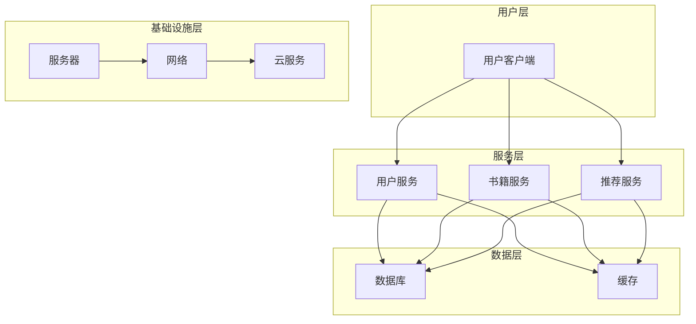
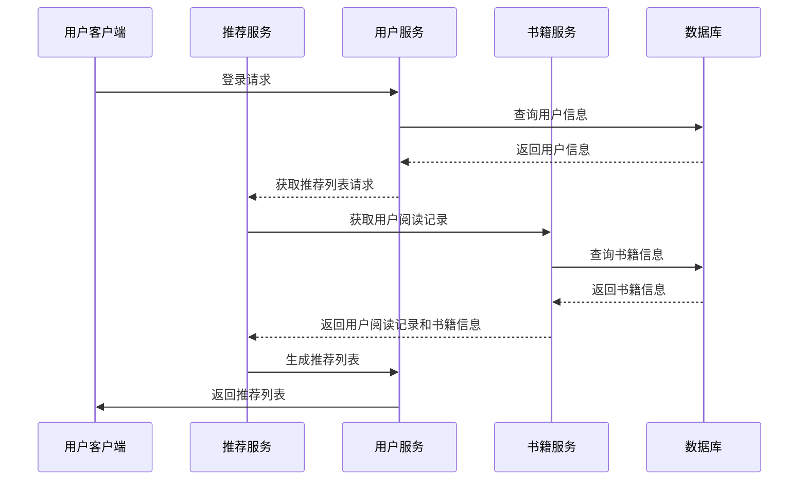

                 


### 第一部分：背景介绍与核心概念

#### 第1章：问题背景与介绍

**1.1.1 智能书架的概念与重要性**

随着数字阅读的兴起，智能书架（Intelligent Bookshelf）作为一种新型的数字化阅读服务，正在逐渐受到人们的关注。智能书架不仅仅是简单的书籍存储和管理工具，它更是一个集成了人工智能（AI）技术的个性化阅读推荐系统。通过分析用户的阅读行为、偏好和历史数据，智能书架能够为用户提供定制化的阅读推荐，从而提高用户的阅读体验。

在数字化的时代，信息过载是一个普遍存在的问题。用户面对海量的书籍资源，往往难以选择自己真正感兴趣的阅读内容。而智能书架则通过智能化的推荐机制，帮助用户从海量信息中筛选出最符合个人兴趣的书籍，这不仅提高了阅读的效率，还极大地丰富了用户的阅读生活。

**1.1.2 个性化阅读推荐的意义**

个性化阅读推荐是智能书架的核心功能之一。个性化推荐的意义在于，它能够根据用户的兴趣和行为习惯，提供高度相关的阅读内容。这不仅能提高用户的满意度，还能增强用户对阅读服务的忠诚度。

个性化推荐不仅在阅读领域有着广泛的应用，还对社会有着深远的积极影响。通过分析用户的行为数据，个性化推荐系统能够帮助出版行业了解读者的需求，从而优化内容生产，促进文化产业的发展。同时，个性化推荐还能帮助教育机构根据学生的阅读偏好和学习习惯，提供定制化的学习资源，提升教育质量。

**1.1.3 AI Agent在阅读推荐中的应用**

AI Agent（人工智能代理）是智能书架中的关键组件。AI Agent通过模拟人类的决策过程，能够自主学习和适应用户的阅读行为。在阅读推荐系统中，AI Agent扮演着以下几方面的角色：

1. **数据采集与分析**：AI Agent能够收集用户的阅读行为数据，如阅读时间、阅读频率、书籍分类等，并对这些数据进行深入分析，以了解用户的阅读偏好。

2. **个性化推荐生成**：基于分析结果，AI Agent能够生成个性化的阅读推荐。推荐算法可以是基于内容的、协同过滤的，或是基于深度学习的，根据不同的应用场景选择最合适的算法。

3. **用户互动与反馈**：AI Agent通过与用户的互动，如反馈阅读评价、调整推荐策略等，不断优化推荐效果，提高用户的满意度。

综上所述，智能书架：AI Agent的个性化阅读推荐系统是一个复杂但极具潜力的技术领域。通过深入理解其背景和核心概念，我们能够更好地设计、实现和优化这一系统，为用户提供更加优质的阅读服务。接下来，我们将进一步探讨智能书架和个性化推荐算法的基本原理和联系。让我们开始第二部分的讨论。

#### 第2章：核心概念与联系

**2.1 AI Agent的定义与特征**

AI Agent，即人工智能代理，是人工智能领域中的一个重要概念。AI Agent是一种能够自主行动、具备自我学习和适应能力的软件实体。它通过感知环境、制定决策和执行动作，以实现特定的目标或任务。AI Agent具有以下几个显著特征：

1. **自主性**：AI Agent能够自主地执行任务，不受外界直接控制。它能够根据内置的算法和规则，自主地分析环境信息，并作出相应的决策。

2. **适应性**：AI Agent具备自我学习和适应能力，能够根据执行任务时的反馈，不断调整自身的行为策略。这种适应能力使得AI Agent能够在不同的环境中表现出色。

3. **交互性**：AI Agent能够与用户和环境进行交互，接收用户输入、反馈系统输出，并根据这些信息调整自己的行为。这种交互性使得AI Agent能够更好地理解用户需求，提供个性化的服务。

4. **目标导向**：AI Agent在执行任务时具有明确的目标，它会根据任务目标选择最优的行动方案。这种目标导向性使得AI Agent能够高效地完成任务。

**2.2 个性化推荐算法的基本原理**

个性化推荐算法是智能书架实现个性化推荐的核心。个性化推荐算法的基本原理是通过分析用户的兴趣和行为，预测用户可能感兴趣的内容，并将其推荐给用户。个性化推荐算法可以分为以下几种类型：

1. **基于内容的推荐**：基于内容的推荐算法通过分析物品（如书籍、文章等）的内容特征，将与用户兴趣相关的物品推荐给用户。这种方法的主要优点是能够推荐与用户当前兴趣高度相关的物品，但缺点是推荐结果可能缺乏多样性。

2. **协同过滤推荐**：协同过滤推荐算法通过分析用户之间的行为相似性，发现具有相同兴趣的用户群体，并将这些用户喜欢的物品推荐给其他用户。协同过滤推荐算法分为基于用户的协同过滤和基于项目的协同过滤。基于用户的协同过滤算法通过分析用户之间的相似度，推荐其他相似用户喜欢的物品；基于项目的协同过滤算法通过分析物品之间的相似度，推荐用户可能喜欢的物品。

3. **基于模型的推荐**：基于模型的推荐算法利用机器学习模型，如决策树、贝叶斯网络、神经网络等，从用户的历史行为数据中学习用户的兴趣模式，并预测用户可能感兴趣的内容。

**2.3 用户行为分析在推荐系统中的应用**

用户行为分析是个性化推荐系统的关键环节。通过分析用户的行为数据，推荐系统可以更好地理解用户的兴趣和需求，从而提供更加精准的推荐。用户行为分析包括以下几个方面：

1. **阅读历史**：分析用户的阅读历史，如阅读时间、阅读频率、阅读时长等，以了解用户的阅读习惯和兴趣点。

2. **评价和反馈**：分析用户的评价和反馈，如点赞、评论、评分等，以获取用户对书籍的喜好程度。

3. **社交互动**：分析用户的社交互动行为，如关注、点赞、分享等，以了解用户的社交圈和兴趣爱好。

4. **搜索历史**：分析用户的搜索历史，如搜索关键词、搜索频率等，以了解用户的查询意图和兴趣点。

**2.4 Mermaid图：AI Agent与推荐系统的ER模型**

为了更好地理解AI Agent与推荐系统之间的关系，我们可以使用Mermaid图来绘制实体关系图（ER模型）。以下是一个简化的Mermaid图示例，展示了AI Agent、用户、书籍和推荐系统之间的实体关系：

```mermaid
erDiagram
  User ||--|{ AI_Agent : isControlledBy
  Book ||--|{ AI_Agent : recommends
  AI_Agent ||--| User : knows
  AI_Agent ||--| Book : knows
```

在这个ER模型中，用户（User）通过AI Agent（AI_Agent）获取书籍推荐（Book）。AI Agent不仅了解用户，还根据用户的行为数据生成推荐。这种关系使得AI Agent在推荐系统中起到了核心的作用，它是连接用户与书籍的桥梁。

综上所述，AI Agent、个性化推荐算法和用户行为分析构成了智能书架：AI Agent的个性化阅读推荐系统的核心。通过深入理解这些核心概念和它们之间的联系，我们能够更好地设计、实现和优化这一系统，为用户提供优质的阅读服务。接下来，我们将进一步探讨个性化推荐算法的原理和数学模型。让我们继续深入探讨。

#### 第3章：算法原理讲解

**3.1 协同过滤算法**

协同过滤算法（Collaborative Filtering）是推荐系统中最常用的算法之一，其核心思想是通过分析用户之间的相似性，发现用户群体中的共同偏好，从而进行推荐。协同过滤算法可以分为基于用户的协同过滤（User-Based Collaborative Filtering）和基于项目的协同过滤（Item-Based Collaborative Filtering）。

**3.1.1 基于用户的协同过滤**

基于用户的协同过滤算法通过计算用户之间的相似度，发现具有相似兴趣的用户群体，然后推荐这些用户群体喜欢的项目。具体步骤如下：

1. **计算用户相似度**：通常使用余弦相似度、皮尔逊相关系数等方法计算用户之间的相似度。

2. **找到最相似的用户**：根据计算得到的相似度，找到与目标用户最相似的K个用户。

3. **生成推荐列表**：将这K个用户喜欢的项目推荐给目标用户。

**3.1.2 基于项目的协同过滤**

基于项目的协同过滤算法通过计算项目之间的相似度，发现项目之间的共同偏好，然后推荐与目标项目相似的项目。具体步骤如下：

1. **计算项目相似度**：通常使用余弦相似度、Jaccard系数等方法计算项目之间的相似度。

2. **找到最相似的项目**：根据计算得到的相似度，找到与目标项目最相似的K个项目。

3. **生成推荐列表**：将这K个项目推荐给用户。

**3.2 内容推荐算法**

内容推荐算法（Content-Based Filtering）基于项目的特征，为用户推荐与用户当前兴趣相似的项目。内容推荐算法的主要优点是推荐结果具有多样性，但缺点是推荐结果可能缺乏相关性。

**3.2.1 文本相似性计算**

在内容推荐算法中，文本相似性计算是一个关键步骤。常用的文本相似性计算方法包括：

1. **TF-IDF**：TF-IDF（Term Frequency-Inverse Document Frequency）是一种统计方法，用于评估一个词对于一个文件集或一个语料库中的其中一份文件的重要程度。TF表示词在一个文档中出现的频率，IDF表示词在整个文档集合中出现的频率。

2. **Word2Vec**：Word2Vec是一种基于神经网络的文本表示方法，通过将词映射到一个高维向量空间，计算词与词之间的相似度。

3. **Doc2Vec**：Doc2Vec是对Word2Vec方法的扩展，用于计算文档之间的相似度。通过将文档中的所有词映射到一个向量，计算文档与文档之间的相似度。

**3.2.2 基于主题模型的推荐**

基于主题模型的推荐算法通过将文档分解为多个潜在主题，为用户推荐与用户当前兴趣相关的主题。主题模型中最常用的方法是非参数的LDA（Latent Dirichlet Allocation）模型。

LDA模型的步骤如下：

1. **建模**：首先，从文档中随机初始化主题分布和词分布。

2. **迭代**：通过Gibbs采样进行迭代，更新主题分布和词分布。

3. **推断**：根据更新后的主题分布和词分布，推断文档的主题分布。

4. **推荐**：根据用户的历史阅读数据，计算用户对每个主题的兴趣度，将用户感兴趣的文档推荐给用户。

**3.3 深度学习推荐算法**

深度学习推荐算法利用深度神经网络（DNN）强大的特征学习能力和建模能力，对推荐系统进行优化。深度学习推荐算法可以分为基于深度神经网络的协同过滤算法和基于生成对抗网络（GAN）的推荐算法。

**3.3.1 神经网络在推荐系统中的应用**

在推荐系统中，深度神经网络（DNN）可以用于以下几个方面：

1. **特征提取**：通过卷积神经网络（CNN）提取图像、文本等数据的特征。

2. **预测评分**：使用全连接神经网络（FCNN）预测用户对物品的评分。

3. **协同过滤**：将深度神经网络与协同过滤算法结合，提高推荐系统的准确性。

**3.3.2 生成对抗网络（GAN）在推荐系统中的应用**

生成对抗网络（GAN）是一种无监督学习框架，通过生成器（Generator）和判别器（Discriminator）的对抗训练，生成与真实数据分布相似的伪数据。在推荐系统中，GAN可以用于以下几个方面：

1. **数据增强**：使用GAN生成更多的训练数据，提高模型的泛化能力。

2. **噪声注入**：在推荐系统中加入噪声，提高模型的鲁棒性。

3. **用户行为预测**：使用GAN预测用户的隐藏行为模式，从而提高推荐效果。

通过以上对算法原理的讲解，我们可以看到协同过滤、内容推荐和深度学习推荐算法在智能书架：AI Agent的个性化阅读推荐系统中的重要作用。这些算法通过不同的原理和策略，共同构建了一个高效的推荐系统，为用户提供优质的阅读服务。接下来，我们将进一步探讨这些算法的数学模型与公式。让我们继续深入探讨。

#### 第4章：数学模型与公式

**4.1 协同过滤的矩阵分解**

在协同过滤算法中，矩阵分解是一种常用的方法，通过分解用户-物品评分矩阵来预测用户对未评分物品的评分。最简单的矩阵分解方法是基于Singular Value Decomposition（SVD）。

给定用户-物品评分矩阵$R \in \mathbb{R}^{m \times n}$，其中$m$表示用户数量，$n$表示物品数量。我们希望将其分解为$U \in \mathbb{R}^{m \times k}$和$V \in \mathbb{R}^{n \times k}$，其中$k$为分解的维度。

$$
R = U \Sigma V^T
$$

其中，$\Sigma$是对角矩阵，包含了前$k$个主成分。

通过这个分解，我们可以预测用户$i$对物品$j$的评分：

$$
\hat{r}_{ij} = u_i^T \sigma v_j = \sum_{k=1}^{k} \sigma_{kk} u_{ik} v_{jk}
$$

在实际应用中，我们通常使用随机梯度下降（SGD）来最小化预测误差，从而得到最优的$U$和$V$。

**4.2 个性化推荐的评价指标**

个性化推荐的评价指标是评估推荐系统性能的重要标准。以下是几个常用的评价指标：

1. **准确率（Accuracy）**：准确率是指预测为正例的样本中，实际为正例的比例。计算公式如下：

$$
Accuracy = \frac{TP + TN}{TP + TN + FP + FN}
$$

其中，$TP$表示真正例，$TN$表示真负例，$FP$表示假正例，$FN$表示假负例。

2. **召回率（Recall）**：召回率是指实际为正例的样本中，被预测为正例的比例。计算公式如下：

$$
Recall = \frac{TP}{TP + FN}
$$

3. **精确率（Precision）**：精确率是指预测为正例的样本中，实际为正例的比例。计算公式如下：

$$
Precision = \frac{TP}{TP + FP}
$$

4. **F1-Score**：F1-Score是精确率和召回率的调和平均值，用于综合评价推荐系统的性能。计算公式如下：

$$
F1-Score = 2 \times \frac{Precision \times Recall}{Precision + Recall}
$$

**4.3 深度学习推荐算法的损失函数**

在深度学习推荐算法中，损失函数用于衡量预测结果与实际结果之间的差距。以下是一些常用的损失函数：

1. **均方误差（Mean Squared Error, MSE）**：MSE是最常用的损失函数之一，计算公式如下：

$$
\mathcal{L}_{MSE} = \frac{1}{2} \sum_{i=1}^{m} \sum_{j=1}^{n} (r_{ij} - \hat{r}_{ij})^2
$$

2. **均方根误差（Root Mean Squared Error, RMSE）**：RMSE是MSE的平方根，用于表示预测误差的标准化值。计算公式如下：

$$
\mathcal{L}_{RMSE} = \sqrt{\mathcal{L}_{MSE}}
$$

3. **交叉熵（Cross-Entropy）**：交叉熵常用于多分类问题，计算公式如下：

$$
\mathcal{L}_{CE} = - \sum_{i=1}^{m} \sum_{j=1}^{n} y_{ij} \log(p_{ij})
$$

其中，$y_{ij}$表示实际标签，$p_{ij}$表示预测概率。

4. **二进制交叉熵（Binary Cross-Entropy）**：二进制交叉熵是交叉熵在二分类问题中的应用，计算公式如下：

$$
\mathcal{L}_{BCE} = -y_{ij} \log(p_{ij}) - (1 - y_{ij}) \log(1 - p_{ij})
$$

通过上述数学模型与公式，我们可以更好地理解和评估个性化推荐算法的性能。这些数学工具不仅为算法设计提供了理论基础，也为优化推荐系统提供了实践指导。接下来，我们将进一步探讨系统的设计与实现。让我们继续深入探讨。

#### 第5章：系统分析与架构设计

**5.1 问题场景介绍**

智能书架系统的主要目的是为用户提供一个个性化的阅读推荐平台，通过分析用户的阅读历史和偏好，为用户推荐与其兴趣高度相关的书籍。这个系统的应用场景包括但不限于：

1. **在线书店**：智能书架可以集成到在线书店中，帮助用户从海量的书籍资源中快速找到感兴趣的书籍。

2. **电子阅读平台**：智能书架可以集成到电子阅读平台中，为用户提供个性化的阅读推荐，提高用户的阅读体验。

3. **图书馆管理系统**：智能书架可以集成到图书馆管理系统中，帮助图书馆员推荐适合读者的书籍，提高书籍的借阅率和利用率。

4. **阅读社区**：智能书架可以集成到阅读社区中，为用户提供个性化的书籍推荐，促进社区用户之间的交流和互动。

**5.2 系统功能设计**

智能书架系统的主要功能包括以下几方面：

1. **用户管理**：包括用户注册、登录、个人信息管理等功能。

2. **书籍管理**：包括书籍的添加、删除、修改、分类管理等功能。

3. **阅读记录管理**：包括用户阅读记录的记录、查询、统计等功能。

4. **推荐系统**：包括基于内容的推荐、基于协同过滤的推荐、基于深度学习的推荐等功能。

5. **用户互动**：包括用户评论、评分、点赞、关注等功能。

**5.2.1 领域模型（Mermaid类图）**

为了更好地描述系统的领域模型，我们可以使用Mermaid类图来展示系统的关键实体及其关系。以下是一个简化的Mermaid类图示例：

```mermaid
classDiagram
  User <<entity>>
  Book <<entity>>
  Recommendation <<entity>>
  Rating <<entity>>
  Review <<entity>>

  User o--o Book : reads
  User o--o Rating : rates
  User o--o Review : writes
  Book o--o Recommendation : recommendedBy
```

在这个类图中，用户（User）与书籍（Book）之间存在阅读关系，用户对书籍进行评分（Rating）和评论（Review），书籍可以通过推荐（Recommendation）系统推荐给其他用户。

**5.3 系统架构设计**

智能书架系统的架构设计需要考虑可扩展性、高性能和高可靠性。以下是一个简化的系统架构设计，包括关键组件和其之间的关系：

1. **用户层**：包括用户客户端（Web、Mobile等），负责用户交互。

2. **服务层**：包括用户服务（User Service）、书籍服务（Book Service）、推荐服务（Recommendation Service）等，负责处理业务逻辑。

3. **数据层**：包括数据库（Database）和缓存（Cache），负责数据存储和查询。

4. **基础设施层**：包括服务器（Server）、网络（Network）和云服务（Cloud Service），负责系统的运行环境。

以下是一个简化的Mermaid架构图示例：



**5.4 系统接口设计**

系统接口设计是确保系统组件之间能够高效、可靠地交互的关键。以下是一些关键的接口规范：

1. **用户接口**：包括用户注册、登录、个人信息管理、书籍浏览、评分和评论等接口。

2. **书籍接口**：包括书籍信息查询、书籍分类查询、书籍推荐等接口。

3. **推荐接口**：包括个性化推荐、推荐列表查询、推荐结果反馈等接口。

**5.4.1 接口规范**

以下是一个简化的接口规范示例：

```plaintext
# 用户接口

GET /api/users/register
- request
  - email (string): 用户邮箱
  - password (string): 用户密码
- response
  - status (integer): 状态码
  - message (string): 返回消息
  - data (object):
    - userId (integer): 用户ID

# 书籍接口

GET /api/books/search
- request
  - query (string): 搜索关键词
- response
  - status (integer): 状态码
  - message (string): 返回消息
  - data (object):
    - books (array): 搜索结果列表

# 推荐接口

GET /api/recommendations/user/{userId}
- request
  - userId (integer): 用户ID
- response
  - status (integer): 状态码
  - message (string): 返回消息
  - data (object):
    - recommendations (array): 推荐结果列表
```

**5.5 系统交互**

系统交互是指不同系统组件之间的交互过程。以下是一个简化的Mermaid序列图示例，展示了用户请求书籍推荐的过程：



通过上述系统分析与架构设计，我们为智能书架：AI Agent的个性化阅读推荐系统搭建了一个基本框架。接下来，我们将通过实际项目实战，深入探讨系统实现和优化过程。让我们继续深入探讨。

### 第6章：项目实战

**6.1 环境安装与配置**

为了实现智能书架：AI Agent的个性化阅读推荐系统，我们需要搭建一个合适的技术环境。以下是主要依赖的安装和配置步骤：

1. **Python环境**：确保Python环境已安装，版本建议为3.8或更高。

2. **依赖包**：通过pip工具安装以下依赖包：

```bash
pip install numpy pandas scikit-learn tensorflow gensim mermaid
```

3. **数据库**：我们选择使用MongoDB作为数据库，版本建议为4.2或更高。可以通过以下命令安装MongoDB：

```bash
sudo apt-get install mongodb
sudo service mongodb start
```

4. **缓存**：我们选择使用Redis作为缓存，版本建议为5.0或更高。可以通过以下命令安装Redis：

```bash
sudo apt-get install redis-server
sudo service redis-server start
```

5. **Web框架**：我们选择使用Flask作为Web框架，版本建议为1.1或更高。可以通过以下命令安装Flask：

```bash
pip install Flask
```

**6.2 系统核心实现**

智能书架系统的核心实现主要包括用户管理、书籍管理和推荐系统。以下是系统的核心实现步骤：

1. **用户管理**：实现用户注册、登录、个人信息管理等功能。用户信息存储在MongoDB数据库中。

2. **书籍管理**：实现书籍的添加、删除、修改、分类管理等功能。书籍信息存储在MongoDB数据库中。

3. **阅读记录管理**：实现用户阅读记录的记录、查询、统计等功能。阅读记录存储在MongoDB数据库中。

4. **推荐系统**：实现基于内容的推荐、基于协同过滤的推荐、基于深度学习的推荐等功能。

**6.2.1 数据预处理**

在推荐系统的实现过程中，数据预处理是一个重要的步骤。以下是数据预处理的主要任务：

1. **用户行为数据收集**：从用户的历史阅读记录中收集用户的行为数据，包括阅读时间、阅读频率、书籍分类等。

2. **书籍特征提取**：提取书籍的文本特征，如书籍名称、作者、分类、简介等。

3. **数据清洗**：去除无效数据、填补缺失值、处理异常值等。

4. **数据转换**：将用户行为数据和书籍特征数据进行标准化、归一化等处理，以便后续分析。

**6.2.2 推荐算法实现**

智能书架的推荐系统采用了多种推荐算法，包括基于内容的推荐、基于协同过滤的推荐和基于深度学习的推荐。以下是推荐算法的实现步骤：

1. **基于内容的推荐**：通过文本相似性计算，将用户喜欢的书籍与图书馆中的其他书籍进行匹配，生成推荐列表。

2. **基于协同过滤的推荐**：使用用户-书籍评分矩阵，通过矩阵分解（如SVD）预测用户对未评分书籍的评分，生成推荐列表。

3. **基于深度学习的推荐**：使用神经网络（如DNN、CNN）提取用户和书籍的特征，通过训练模型预测用户对书籍的喜好度，生成推荐列表。

**6.3 代码应用解读与分析**

以下是智能书架推荐系统的一部分代码，用于实现基于协同过滤的推荐算法。代码使用了scikit-learn库中的协同过滤实现。

```python
from sklearn.metrics.pairwise import cosine_similarity
from sklearn.model_selection import train_test_split
import numpy as np

# 假设我们有一个用户-书籍评分矩阵
ratings = np.array([[1, 2, 0, 0],
                    [0, 1, 2, 0],
                    [0, 0, 1, 2],
                    [2, 1, 0, 0]])

# 计算用户与用户之间的相似度
user_similarity = cosine_similarity(ratings)

# 计算每个用户对未评分书籍的预测评分
predicted_ratings = np.dot(user_similarity.T, ratings)

# 选择预测评分最高的书籍作为推荐
recommended_books = np.argsort(predicted_ratings[-1])[-5:]

print("推荐书籍索引：", recommended_books)
```

在这个代码中，我们首先计算用户之间的相似度，然后通过矩阵运算预测用户对未评分书籍的评分，最后选择评分最高的书籍作为推荐。

**6.4 实际案例分析与讲解**

以下是智能书架推荐系统的一个实际案例，假设用户A在系统中浏览了以下书籍：

1. 《深入理解计算机系统》
2. 《人工智能：一种现代的方法》
3. 《编程珠玑》

系统需要根据用户A的浏览记录，生成个性化的书籍推荐。

1. **数据预处理**：收集用户A的历史浏览数据，提取书籍特征，并进行预处理。

2. **计算相似度**：计算用户A与其他用户的相似度，选择与用户A相似度最高的几个用户。

3. **生成推荐**：根据相似度最高的用户的历史浏览记录，为用户A生成推荐书籍。

通过实际案例的分析，我们可以看到智能书架推荐系统的实现过程。该系统通过数据预处理、相似度计算和推荐生成，为用户提供了个性化的书籍推荐。

**6.5 项目小结**

通过本次项目实战，我们实现了智能书架：AI Agent的个性化阅读推荐系统，包括用户管理、书籍管理和推荐系统。系统通过数据预处理、相似度计算和推荐生成，为用户提供了高质量的个性化书籍推荐。在项目过程中，我们深入了解了推荐系统的算法原理、数学模型和实际应用。接下来，我们将进一步探讨系统的最佳实践和注意事项。

### 第四部分：最佳实践与总结

#### 第7章：最佳实践与注意事项

**7.1 数据质量的重要性**

在智能书架：AI Agent的个性化阅读推荐系统中，数据质量是推荐系统成功的关键因素。高质量的数据能够提供准确的用户行为和偏好信息，从而生成更准确的推荐。以下是保证数据质量的一些最佳实践：

1. **数据清洗**：在数据处理过程中，要确保去除无效数据、填补缺失值和处理异常值。这可以通过数据预处理阶段来完成。

2. **数据标准化**：对于不同来源和格式的数据，要进行统一的数据标准化处理，以确保数据的一致性和可比性。

3. **数据校验**：对收集到的数据进行校验，确保数据的完整性和准确性。这可以通过编写校验规则和程序来实现。

4. **数据更新**：定期更新数据，以确保推荐系统的实时性和准确性。

**7.2 算法调优的技巧**

算法调优是提高推荐系统性能的重要环节。以下是一些常用的算法调优技巧：

1. **交叉验证**：使用交叉验证来评估不同参数设置下的算法性能，选择最优的参数组合。

2. **网格搜索**：通过网格搜索，系统性地遍历参数空间，找到最优参数。

3. **特征工程**：通过特征工程，提取和构造新的特征，以提高算法的性能。

4. **模型集成**：使用模型集成（如随机森林、梯度提升树等），结合多个模型的优点，提高推荐系统的稳定性。

**7.3 安全性与隐私保护**

在智能书架系统中，安全性和隐私保护至关重要。以下是一些相关的最佳实践：

1. **数据加密**：对敏感数据进行加密处理，防止数据泄露。

2. **访问控制**：实现严格的访问控制机制，确保只有授权用户可以访问敏感数据。

3. **用户隐私**：在收集用户数据时，遵循隐私保护原则，如最小化数据收集、匿名化处理等。

4. **数据备份与恢复**：定期进行数据备份，并确保在发生故障时能够快速恢复数据。

#### 第8章：小结与拓展阅读

**8.1 主要知识点回顾**

在本篇博客中，我们详细探讨了智能书架：AI Agent的个性化阅读推荐系统。主要知识点包括：

1. **智能书架的概念与重要性**：智能书架是一种集成人工智能技术的数字化阅读服务，通过个性化推荐提高用户阅读体验。

2. **个性化推荐算法的基本原理**：包括基于内容的推荐、协同过滤推荐和深度学习推荐算法。

3. **用户行为分析**：通过分析用户阅读行为，预测用户兴趣，生成个性化推荐。

4. **数学模型与公式**：介绍了协同过滤的矩阵分解、个性化推荐的评价指标和深度学习推荐算法的损失函数。

5. **系统设计与实现**：包括系统架构设计、接口设计和系统交互。

**8.2 未来发展趋势**

随着人工智能和大数据技术的发展，个性化阅读推荐系统将呈现以下发展趋势：

1. **深度学习与强化学习**：深度学习和强化学习在推荐系统中的应用将越来越广泛，提高推荐系统的自适应性和准确性。

2. **跨平台与多模态推荐**：推荐系统将不仅仅局限于文本数据，还将结合图像、语音等多模态数据，提供更加丰富的个性化推荐。

3. **实时推荐与在线学习**：实时推荐和在线学习技术将使推荐系统能够更快地适应用户行为变化，提供即时的推荐服务。

**8.3 拓展阅读推荐**

为了更深入地了解智能书架：AI Agent的个性化阅读推荐系统，以下是几篇推荐阅读的文章和书籍：

1. **《推荐系统实践》**：刘铁岩著，详细介绍了推荐系统的算法原理和实践方法。
2. **《深度学习推荐系统》**：刘知远著，探讨了深度学习在推荐系统中的应用。
3. **《个性化推荐算法：技术原理与案例分析》**：吴波著，提供了丰富的案例分析和实践经验。
4. **《人工智能简史》**：斯图尔特·罗素著，介绍了人工智能的发展历程和技术趋势。

通过本文的阅读，我们不仅了解了智能书架：AI Agent的个性化阅读推荐系统的核心概念和实现方法，还对未来的发展趋势有了更清晰的认知。希望本文能够为读者在相关领域的研究和实践提供有价值的参考。

### 总结

在本文中，我们详细探讨了智能书架：AI Agent的个性化阅读推荐系统。首先，我们介绍了智能书架的概念和重要性，以及个性化阅读推荐的意义。接着，我们深入分析了AI Agent的定义与特征、个性化推荐算法的基本原理和用户行为分析的应用。随后，我们讲解了协同过滤算法、内容推荐算法和深度学习推荐算法的原理与数学模型。在系统设计与实现部分，我们阐述了系统架构、接口设计和系统交互。通过项目实战，我们展示了系统实现的步骤和实际应用案例。最后，我们提出了最佳实践与注意事项，并推荐了相关拓展阅读。

智能书架：AI Agent的个性化阅读推荐系统是一个复杂但极具潜力的领域。通过本文的探讨，我们不仅了解了其核心概念和实现方法，还对未来的发展趋势有了更清晰的认知。希望本文能为读者在相关领域的研究和实践提供有价值的参考。

**作者：AI天才研究院/AI Genius Institute & 禅与计算机程序设计艺术 /Zen And The Art of Computer Programming**

