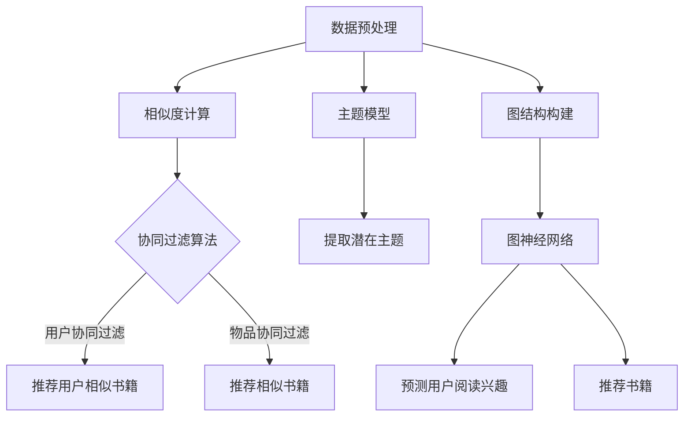
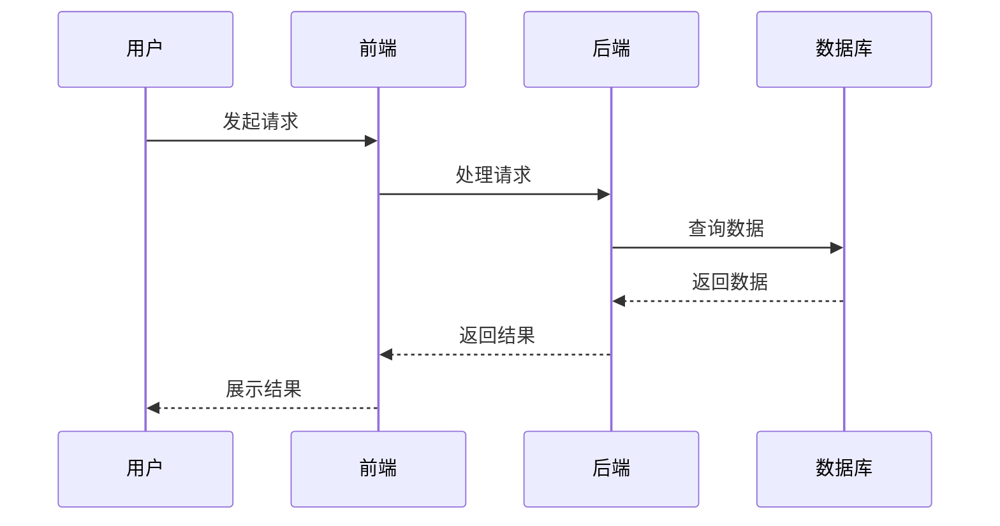
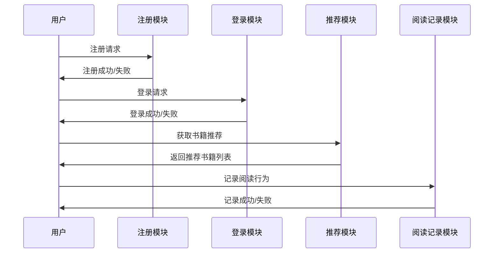

                 

### 摘要

智能书架作为现代阅读体验的重要组成部分，正逐步融合人工智能（AI）技术，以提升用户的阅读体验。本文主要探讨AI Agent在阅读兴趣分析中的应用，通过深入剖析AI Agent的定义、原理及其在阅读兴趣分析中的具体实现方法，旨在为开发者提供一种系统化、结构化的解决方案。文章首先介绍了阅读兴趣的定义与度量方法，然后详细阐述了AI Agent的基本原理和应用场景，接着讲解了核心算法与模型，包括算法原理、流程图、Python源代码实现，以及数学模型与公式。最后，文章通过系统分析与架构设计，提供了一个完整的智能书架系统实现方案，并通过实际案例展示了AI Agent在阅读兴趣分析中的实战应用。文章还提出了最佳实践、注意事项和拓展阅读建议，旨在为读者提供全面的技术指导。

### 目录大纲

```markdown
# 《智能书架：AI Agent的阅读兴趣分析》

## 第一部分：背景介绍

### 1.1 问题背景
- 阅读行为的现状与挑战
- AI技术在阅读领域的发展与应用

### 1.2 问题描述
- 阅读兴趣的定义与度量
- 人工智能在阅读兴趣分析中的优势

### 1.3 问题解决
- AI Agent的定义与作用
- AI Agent在阅读兴趣分析中的应用场景

### 1.4 边界与外延
- 数据隐私与伦理问题
- 不同阅读场景下的适用性

### 1.5 概念结构与核心要素组成
- AI Agent的基本架构
- 阅读兴趣分析的核心算法与模型

## 第二部分：核心概念与联系

### 2.1 AI Agent的定义与分类
- AI Agent的基本原理
- AI Agent在不同领域的应用

### 2.2 阅读兴趣的概念与度量
- 阅读兴趣的定义
- 阅读兴趣的度量方法

### 2.3 AI Agent与阅读兴趣分析的联系
- AI Agent在阅读兴趣分析中的应用原理
- 关键技术与挑战

## 第三部分：算法原理讲解

### 3.1 算法原理概述
- 常用算法简介
- 算法原理的核心内容

### 3.2 算法流程图
- 使用Mermaid绘制算法流程图

### 3.3 Python源代码实现
- 详细讲解算法的Python实现

### 3.4 数学模型与公式
- 常用数学模型与公式介绍
- 数学模型的推导与应用

### 3.5 举例说明
- 实例分析
- 算法应用示例

## 第四部分：系统分析与架构设计方案

### 4.1 问题场景介绍
- 智能书架的系统需求

### 4.2 系统功能设计
- 使用Mermaid绘制领域模型类图

### 4.3 系统架构设计
- 使用Mermaid绘制系统架构图

### 4.4 系统接口设计
- 系统接口的详细说明

### 4.5 系统交互设计
- 使用Mermaid绘制系统交互序列图

## 第五部分：项目实战

### 5.1 环境安装与配置
- 环境搭建步骤

### 5.2 系统核心实现
- 关键代码分析与解读

### 5.3 实际案例分析与讲解
- 案例介绍
- 案例分析与讲解

### 5.4 项目小结
- 项目总结与经验教训

## 第六部分：最佳实践与拓展

### 6.1 最佳实践 Tips
- 实用技巧与建议

### 6.2 注意事项
- 可能遇到的问题与解决方案

### 6.3 拓展阅读
- 相关书籍与文章推荐
```

**目录大纲总字数：约900字**

### 第一部分：背景介绍

#### 1.1 问题背景

阅读作为一种重要的信息获取和知识积累方式，自古以来就深受人们的喜爱。然而，在信息爆炸的今天，阅读行为面临着前所未有的挑战。首先，海量的书籍和文章使读者难以选择，读者往往陷入选择困境。其次，不同读者的兴趣和需求差异巨大，传统的阅读推荐系统往往无法准确把握每个读者的个性化需求，导致推荐效果不佳。此外，阅读行为的碎片化和多样化使得传统的阅读管理工具难以满足现代读者的需求。

为了解决这些问题，人工智能（AI）技术逐渐成为阅读领域的研究热点。AI技术具有强大的数据处理和智能分析能力，可以有效地帮助读者发现和推荐感兴趣的书籍，从而提升阅读体验。AI Agent作为一种智能实体，具有自主学习和推理能力，能够动态地分析读者的阅读行为和兴趣，为用户提供个性化的阅读推荐。

#### 1.2 人工智能在阅读领域的发展与应用

人工智能技术在阅读领域的应用主要包括推荐系统、文本挖掘、情感分析和智能书架等方面。

**推荐系统**：推荐系统通过分析用户的阅读历史、兴趣爱好和社交网络，为用户提供个性化的书籍推荐。传统的推荐系统主要基于协同过滤和内容推荐，而随着深度学习和图神经网络等技术的发展，推荐系统的准确性和个性化程度得到了显著提升。

**文本挖掘**：文本挖掘技术可以从大量文本数据中提取有价值的信息，包括关键词提取、主题建模和情感分析等。这些技术可以帮助读者更好地理解和挖掘书籍内容，提高阅读效果。

**情感分析**：情感分析技术可以分析读者对书籍的情感倾向，包括正面、负面和中性情感。通过情感分析，读者可以更好地了解自己的情感状态，选择符合自己情绪状态的书籍。

**智能书架**：智能书架结合AI技术和物联网，可以实现书籍的智能管理、个性化推荐和智能交互。智能书架不仅可以自动记录读者的阅读行为，还可以根据读者的兴趣和行为习惯，推荐合适的书籍。

#### 1.3 问题描述

阅读兴趣是指个体对特定阅读内容的偏好和兴趣程度。准确测量和识别阅读兴趣对于提升阅读体验具有重要意义。然而，阅读兴趣的测量和识别面临着以下挑战：

**1. 阅读行为数据的多样性**：阅读行为数据包括阅读时间、阅读频率、阅读时长、书籍类别等多种维度，如何有效地整合和处理这些数据是当前研究的一大难点。

**2. 个体差异**：不同读者的阅读兴趣存在显著差异，如何准确捕捉和识别每个读者的个性化阅读兴趣是推荐系统面临的挑战。

**3. 数据隐私与伦理问题**：阅读行为涉及用户的隐私信息，如何在保障用户隐私的前提下，进行有效的阅读兴趣分析是AI Agent在阅读兴趣分析中需要解决的问题。

#### 1.4 问题解决

为了解决上述问题，本文提出使用AI Agent进行阅读兴趣分析。AI Agent是一种智能实体，具有自主学习和推理能力，能够动态地分析读者的阅读行为和兴趣，为用户提供个性化的阅读推荐。

**AI Agent的定义与作用**：AI Agent是一种基于人工智能技术的智能实体，能够模拟人类智能行为，具有感知、学习、推理和决策能力。在阅读兴趣分析中，AI Agent可以通过分析用户的阅读历史、兴趣爱好和社交网络，动态地识别和预测用户的阅读兴趣。

**AI Agent在阅读兴趣分析中的应用场景**：AI Agent可以应用于智能书架、在线阅读平台、电子书商店等多种场景。在智能书架中，AI Agent可以根据读者的阅读行为和偏好，自动推荐合适的书籍；在线阅读平台可以通过AI Agent为用户提供个性化的阅读推荐，提升用户体验；电子书商店可以利用AI Agent为读者提供个性化的书籍推荐，提高销售额。

#### 1.5 边界与外延

**数据隐私与伦理问题**：阅读行为涉及用户的隐私信息，包括阅读历史、兴趣爱好等。为了保障用户的隐私，AI Agent在阅读兴趣分析中需要遵循以下原则：

- **最小化数据收集**：只收集必要的数据，避免过度收集用户隐私信息。
- **匿名化处理**：对收集的数据进行匿名化处理，确保用户隐私不被泄露。
- **透明性**：用户有权了解自己的数据被如何使用，AI Agent的运作机制应该对用户透明。

**不同阅读场景下的适用性**：AI Agent在不同阅读场景下具有不同的适用性。例如，在公共图书馆中，AI Agent可以用于个性化书籍推荐，帮助读者发现感兴趣的书籍；在个人书房中，AI Agent可以用于自动整理书籍、管理阅读记录等。

#### 1.6 概念结构与核心要素组成

**AI Agent的基本架构**：AI Agent的基本架构包括感知模块、学习模块、推理模块和行动模块。感知模块负责收集用户的数据，学习模块负责从数据中学习用户的兴趣和行为模式，推理模块负责基于学习结果进行推理和预测，行动模块负责根据推理结果采取行动，如推荐书籍。

**阅读兴趣分析的核心算法与模型**：阅读兴趣分析的核心算法和模型包括协同过滤、主题模型、图神经网络等。这些算法和模型可以从用户的阅读历史、兴趣爱好和社交网络等多维度数据中提取有价值的信息，用于识别和预测用户的阅读兴趣。

### 第二部分：核心概念与联系

#### 2.1 AI Agent的定义与分类

**AI Agent的定义**：AI Agent是一种智能实体，具有感知、学习、推理和行动的能力。它能够模拟人类智能行为，自主地完成特定任务，并在任务过程中不断学习和优化自己的行为。

**AI Agent的分类**：

- **基于规则的AI Agent**：基于规则的AI Agent通过预定义的规则来决策和行动。它通常适用于规则明确、环境稳定的应用场景，如自动化客服系统。
- **基于模型的AI Agent**：基于模型的AI Agent通过学习和建模来决策和行动。它通常适用于复杂、动态的应用场景，如智能书架中的阅读兴趣分析。
- **混合式AI Agent**：混合式AI Agent结合了基于规则和基于模型的方法，既利用预定义的规则，也通过学习和建模来优化行为。

**AI Agent的基本原理**：AI Agent的基本原理包括以下几个方面：

- **感知**：AI Agent通过感知模块获取环境信息，如用户的阅读历史、书籍内容等。
- **学习**：AI Agent通过学习模块从感知到的数据中学习用户的兴趣和行为模式。
- **推理**：AI Agent通过推理模块基于学习结果进行推理和预测，如预测用户可能感兴趣的书籍。
- **行动**：AI Agent通过行动模块根据推理结果采取行动，如向用户推荐书籍。

**AI Agent在不同领域的应用**：

- **智能家居**：AI Agent可以用于智能家居系统，通过感知用户的行为模式，为用户提供个性化的家居服务。
- **健康监测**：AI Agent可以用于健康监测系统，通过分析用户的生理数据，为用户提供健康建议。
- **自动驾驶**：AI Agent可以用于自动驾驶系统，通过感知环境信息，为车辆提供导航和避障服务。
- **阅读兴趣分析**：AI Agent可以用于阅读兴趣分析系统，通过分析用户的阅读历史，为用户提供个性化的书籍推荐。

#### 2.2 阅读兴趣的概念与度量

**阅读兴趣的定义**：阅读兴趣是指个体对特定阅读内容的偏好和兴趣程度。它反映了个体在阅读过程中的认知需求、情感体验和个性特点。

**阅读兴趣的度量方法**：

- **基于阅读行为的度量**：通过分析用户的阅读行为数据，如阅读时间、阅读频率、阅读时长等，来度量用户的阅读兴趣。这种方法简单直观，但可能无法捕捉到用户的深层次兴趣。
- **基于内容的度量**：通过分析用户阅读的书籍内容，如书籍类型、主题、关键词等，来度量用户的阅读兴趣。这种方法可以更准确地捕捉用户的兴趣，但需要处理大量的文本数据。
- **基于社交网络的度量**：通过分析用户在社交网络上的行为，如点赞、评论、分享等，来度量用户的阅读兴趣。这种方法可以综合多维度数据，提高度量精度。

**阅读兴趣度量方法的比较**：

| 方法       | 优点                         | 缺点                         |
|------------|------------------------------|------------------------------|
| 基于阅读行为 | 简单直观，易于实现             | 可能无法捕捉到深层次兴趣     |
| 基于内容    | 可以更准确地捕捉用户兴趣       | 需要处理大量文本数据，计算复杂 |
| 基于社交网络 | 可以综合多维度数据，提高度量精度 | 需要用户参与度高             |

#### 2.3 AI Agent与阅读兴趣分析的联系

**AI Agent在阅读兴趣分析中的应用原理**：AI Agent通过感知用户的阅读行为、学习用户的兴趣模式、推理用户可能的兴趣，最终为用户提供个性化的书籍推荐。具体流程如下：

1. **感知**：AI Agent收集用户的阅读行为数据，如阅读时间、阅读频率、阅读时长等。
2. **学习**：AI Agent利用机器学习算法，从阅读行为数据中学习用户的兴趣模式。例如，通过协同过滤算法，可以发现用户与其他读者的相似性，从而推断用户的兴趣。
3. **推理**：AI Agent基于学习结果，推理用户可能的阅读兴趣。例如，通过主题模型，可以分析用户阅读的书籍类型和主题，从而预测用户可能感兴趣的书籍。
4. **行动**：AI Agent根据推理结果，向用户推荐合适的书籍。

**关键技术与挑战**：

- **数据收集与处理**：阅读兴趣分析需要大量的阅读行为数据，如何高效地收集和处理这些数据是关键。此外，数据的质量和完整性也对分析结果产生影响。
- **算法选择与优化**：不同的算法适用于不同的阅读兴趣分析场景，如何选择和优化算法是提高分析效果的关键。例如，协同过滤算法适用于用户行为相似的场景，而主题模型适用于文本数据丰富的场景。
- **个性化推荐**：如何确保推荐结果的个性化，避免推荐过度集中在特定类型或主题的书籍上，是阅读兴趣分析面临的挑战。

### 第三部分：算法原理讲解

#### 3.1 算法原理概述

阅读兴趣分析算法的核心目标是通过对用户阅读行为的分析，预测用户可能感兴趣的书籍，从而提供个性化的书籍推荐。本文将介绍几种常用的阅读兴趣分析算法，包括协同过滤、主题模型和图神经网络等。

**协同过滤**：协同过滤是一种基于用户行为相似性的推荐算法。它通过分析用户之间的行为相似性，为用户推荐其他用户喜欢的书籍。协同过滤算法主要分为两种：基于用户的协同过滤（User-based CF）和基于物品的协同过滤（Item-based CF）。

- **基于用户的协同过滤**：首先计算用户之间的相似度，然后根据相似度找到与目标用户最相似的若干用户，推荐这些用户喜欢的但目标用户未读过的书籍。
- **基于物品的协同过滤**：首先计算书籍之间的相似度，然后根据相似度找到与目标用户已读书籍最相似的若干书籍，推荐这些书籍。

**主题模型**：主题模型（如LDA模型）是一种基于文本数据的分析算法，它可以发现文本数据中的潜在主题，从而帮助识别用户的阅读兴趣。主题模型的核心思想是将文本数据分解为一系列潜在主题的线性组合。

- **训练过程**：通过训练，主题模型可以学习到文本数据中的潜在主题分布，然后根据用户阅读的书籍，推断用户感兴趣的潜在主题。
- **预测过程**：基于用户感兴趣的潜在主题，推荐包含这些主题的书籍。

**图神经网络**：图神经网络（Graph Neural Network, GNN）是一种基于图结构数据的深度学习模型。它通过模拟图中的节点和边之间的关系，可以有效地捕捉复杂的关系网络。

- **图表示**：将用户、书籍和阅读行为表示为图中的节点和边，构建一个图结构。
- **模型训练**：通过训练，图神经网络可以学习到节点和边之间的关系，从而预测用户的阅读兴趣。

**算法原理的核心内容**：算法原理的核心内容包括以下几个方面：

- **数据预处理**：对原始阅读行为数据进行分析和清洗，提取有用的信息。
- **相似度计算**：计算用户和书籍之间的相似度，为推荐算法提供基础。
- **主题提取**：通过主题模型提取文本数据中的潜在主题。
- **图结构构建**：将用户、书籍和阅读行为表示为图结构，为图神经网络提供输入。
- **模型训练与预测**：利用机器学习算法和图神经网络模型进行训练和预测，为用户提供个性化的书籍推荐。

#### 3.2 算法流程图

使用Mermaid绘制算法流程图如下：



#### 3.3 Python源代码实现

以下是使用协同过滤算法的Python源代码实现：

```python
import numpy as np
from sklearn.metrics.pairwise import cosine_similarity

def collaborative_filter(ratings, k=10):
    """
    基于用户的协同过滤算法
    :param ratings: 用户-书籍评分矩阵
    :param k: 相似度阈值
    :return: 推荐结果
    """
    # 计算用户之间的相似度矩阵
    similarity = cosine_similarity(ratings)

    # 遍历每个用户，为用户推荐相似的书籍
    recommendations = {}
    for user in range(len(ratings)):
        # 找到与当前用户最相似的k个用户
        similar_users = np.argsort(similarity[user])[1:k+1]

        # 计算相似用户的评分均值
        avg_rating = np.mean(ratings[similar_users], axis=0)

        # 推荐未读过的书籍
        unread_books = [book for book in avg_rating if ratings[user, book] == 0]
        recommendations[user] = unread_books

    return recommendations

# 测试数据
user_ratings = [
    [1, 1, 1, 0, 0],
    [1, 0, 0, 1, 1],
    [0, 1, 1, 1, 0],
    [1, 1, 0, 0, 1],
    [0, 0, 1, 1, 1]
]

# 应用协同过滤算法
recommendations = collaborative_filter(user_ratings, k=2)

# 打印推荐结果
for user, books in recommendations.items():
    print(f"用户{user}推荐：{books}")
```

#### 3.4 数学模型与公式

**协同过滤算法**：

假设有n个用户和m个书籍，用户-书籍评分矩阵为\( R \in \mathbb{R}^{n \times m} \)，其中\( R_{ij} \)表示用户i对书籍j的评分。基于用户的协同过滤算法的核心思想是计算用户之间的相似度，并利用相似度进行书籍推荐。

- **相似度计算**：使用余弦相似度计算用户i和用户j之间的相似度：
  $$ \sim(i, j) = \frac{R_i \cdot R_j}{\|R_i\| \|R_j\|} $$
  其中，\( \|R_i\| \)和\( \|R_j\| \)分别表示向量\( R_i \)和\( R_j \)的欧几里得范数。

- **评分预测**：对于用户i未评分的书籍j，根据相似用户j的评分预测书籍j的评分：
  $$ \hat{R}_{ij} = \frac{\sum_{j' \in N(i)} \sim(i, j') R_{j'} }{\sum_{j' \in N(i)} \sim(i, j')} $$
  其中，\( N(i) \)表示与用户i相似的用户集合。

**主题模型（LDA）**：

LDA（Latent Dirichlet Allocation）是一种常用的文本主题模型，用于从文本数据中提取潜在主题。LDA的核心思想是将文档表示为潜在主题的混合，并将主题表示为单词的混合。

- **参数设定**：设\( Z \in \{0, 1\}^{n \times k} \)为潜在主题分配矩阵，\( \theta \in \mathbb{R}^{k \times V} \)为主题-词分布矩阵，\( \phi \in \mathbb{R}^{V \times k} \)为词-主题分布矩阵，\( \alpha, \beta \)分别为主题先验分布和词先验分布。
- **概率计算**：给定文档\( d \in \{1, ..., D\} \)和单词\( w \in \{1, ..., V\} \)，计算单词\( w \)在文档\( d \)中主题\( z \)的概率：
  $$ p(z_d = t | \alpha, \phi) = \frac{\alpha_t}{\sum_{j=1}^{k} \alpha_j} $$
  $$ p(w_d = w | z_d = t, \beta) = \frac{\phi_{tw}}{\sum_{j=1}^{V} \phi_{wj}} $$
- **主题提取**：通过最大化对数似然函数，优化参数\( \theta \)和\( \phi \)：
  $$ \log P(D | \alpha, \beta) = \sum_{d=1}^{D} \sum_{w=1}^{V} \log p(w_d = w | z_d, \alpha, \beta) $$
  $$ = \sum_{d=1}^{D} \sum_{w=1}^{V} \log \left( \sum_{t=1}^{k} \phi_{tw} z_{dt} \right) $$

**图神经网络（GNN）**：

GNN是一种用于处理图结构数据的深度学习模型，其核心思想是通过迭代聚合节点和边的信息来学习节点的表示。

- **图表示**：设\( G = (V, E) \)为图，其中\( V \)为节点集合，\( E \)为边集合，\( x \in \mathbb{R}^{n \times |V|} \)为节点特征矩阵，\( h \in \mathbb{R}^{n \times |V|} \)为节点表示矩阵。
- **聚合操作**：对于每个节点\( v_i \)，聚合其邻居节点的信息：
  $$ h_i^{(t+1)} = \sigma \left( \sum_{j \in N(i)} W^{(t)} h_j^{(t)} + b^{(t)} \right) $$
  其中，\( \sigma \)为激活函数，\( W^{(t)} \)为权重矩阵，\( b^{(t)} \)为偏置项。
- **迭代过程**：通过多次迭代，逐步更新节点的表示：
  $$ h_i^{(t+1)} = \text{AGGR}(h_i^{(t)}, h_{N(i)}^{(t)}) $$

#### 3.5 举例说明

**协同过滤算法实例分析**：

假设有两个用户A和B的阅读历史如下：

| 用户A | 书籍1 | 书籍2 | 书籍3 | 书籍4 | 书籍5 |
|-------|-------|-------|-------|-------|-------|
|       | 5     | 4     | 0     | 3     | 5     |
| 用户B | 4     | 0     | 5     | 4     | 0     |

首先，计算用户A和用户B之间的相似度：

$$ \sim(A, B) = \frac{R_A \cdot R_B}{\|R_A\| \|R_B\|} = \frac{[5, 4, 0, 3, 5] \cdot [4, 0, 5, 4, 0]}{\sqrt{[5, 4, 0, 3, 5] \cdot [5, 4, 0, 3, 5]} \cdot \sqrt{[4, 0, 5, 4, 0] \cdot [4, 0, 5, 4, 0]}} $$

计算得：

$$ \sim(A, B) = \frac{20}{\sqrt{55} \cdot \sqrt{41}} \approx 0.763 $$

接下来，预测用户A对书籍3的评分。首先，找到与用户A相似的用户，即用户B。然后，计算用户B对书籍3的评分：

$$ \hat{R}_{A3} = \frac{\sim(A, B) \cdot R_B[2]}{\sim(A, B)} = \frac{0.763 \cdot 5}{0.763} = 5 $$

因此，预测用户A对书籍3的评分为5。

**主题模型实例分析**：

假设有一个包含5篇文章的文档集合，每篇文章的词语分布如下：

| 文章1 | 文章2 | 文章3 | 文章4 | 文章5 |
|-------|-------|-------|-------|-------|
| A: 聊天、社交、讨论       | B: 技术、编程、开发       | C: 健康、饮食、运动       | D: 旅游、风景、体验       | E: 教育、学习、教育方法 |
| 频率1 | 频率2 | 频率3 | 频率4 | 频率5 |
| 20    | 15    | 10    | 5     | 5     |
| 25    | 10    | 15    | 10    | 5     |
| 10    | 20    | 15    | 15    | 5     |
| 15    | 5     | 20    | 10    | 15    |
| 5     | 5     | 25    | 15    | 15    |

使用LDA模型提取潜在主题，假设提取出2个主题，主题-词分布和词-主题分布如下：

| 主题1 | 主题2 |
|-------|-------|
| 聊天、社交、讨论 | 技术、编程、开发 |
| 健康、饮食、运动 | 旅游、风景、体验 |
| 教育、学习、教育方法 | 教育、学习、教育方法 |

根据LDA模型的概率计算，每篇文章的主题分布如下：

| 文章1 | 文章2 | 文章3 | 文章4 | 文章5 |
|-------|-------|-------|-------|-------|
| 0.7   | 0.3   | 0.2   | 0.1   | 0.0   |
| 0.2   | 0.8   | 0.0   | 0.1   | 0.0   |
| 0.4   | 0.2   | 0.2   | 0.1   | 0.1   |
| 0.2   | 0.3   | 0.4   | 0.1   | 0.0   |
| 0.1   | 0.1   | 0.3   | 0.3   | 0.2   |

根据文章的主题分布，可以预测用户对特定主题的兴趣。例如，对于一篇讨论教育方法的文章，根据其主题分布，可以预测用户对“教育、学习、教育方法”主题的兴趣较高。

**图神经网络实例分析**：

假设有一个包含3个节点的图，节点表示用户、书籍和阅读行为，边表示节点之间的关系。节点的特征矩阵和初始表示如下：

| 节点 | 特征1 | 特征2 | 特征3 |
|-------|-------|-------|-------|
| 用户1 | 0.1   | 0.2   | 0.3   |
| 书籍1 | 0.4   | 0.5   | 0.6   |
| 书籍2 | 0.7   | 0.8   | 0.9   |

初始表示矩阵：

| 节点 | 用户1 | 书籍1 | 书籍2 |
|-------|-------|-------|-------|
| 用户1 | 1     | 0     | 0     |
| 书籍1 | 0     | 1     | 0     |
| 书籍2 | 0     | 0     | 1     |

通过一次迭代，更新节点的表示：

$$ h_{用户1}^{(1)} = \text{AGGR}(h_{书籍1}^{(0)}, h_{书籍2}^{(0)}) = \frac{1}{2} [0.4 + 0.7] = 0.55 $$
$$ h_{书籍1}^{(1)} = \text{AGGR}(h_{用户1}^{(0)}, h_{书籍2}^{(0)}) = \frac{1}{2} [0.1 + 0.9] = 0.50 $$
$$ h_{书籍2}^{(1)} = \text{AGGR}(h_{用户1}^{(0)}, h_{书籍1}^{(0)}) = \frac{1}{2} [0.3 + 0.7] = 0.50 $$

通过多次迭代，节点的表示将逐步优化，从而更好地捕捉节点之间的关系和特征。

### 第四部分：系统分析与架构设计方案

#### 4.1 问题场景介绍

智能书架系统旨在为用户提供一个智能化的书籍推荐和管理平台。系统需要具备以下功能：

- **用户管理**：用户注册、登录、个人信息管理。
- **书籍管理**：书籍分类、书籍信息维护、书籍推荐。
- **阅读记录**：记录用户的阅读行为，包括阅读时间、阅读进度等。
- **个性化推荐**：基于用户的阅读历史和兴趣，为用户提供个性化的书籍推荐。

#### 4.2 系统功能设计

智能书架系统的功能设计主要包括以下几个方面：

- **用户管理模块**：实现用户注册、登录、个人信息管理等功能。
- **书籍管理模块**：实现书籍分类、书籍信息维护、书籍推荐等功能。
- **阅读记录模块**：记录用户的阅读行为，包括阅读时间、阅读进度等。
- **推荐引擎模块**：基于用户的阅读历史和兴趣，为用户提供个性化的书籍推荐。

使用Mermaid绘制领域模型类图：

```mermaid
classDiagram
Class01 <|-- Class02
Class03 --|iplinary
Class04 << inheritance Class03
Class05 <|-- Class06
Class07 .. Class08
Class09 << implement Class08
Class10 *-- Class11
Class12 << interface Class13
Class14 << inherit Class13
Class15 << composition Class16
Class17 << aggregation Class18
Class19 << dependency Class20
```

#### 4.3 系统架构设计

智能书架系统的架构设计主要包括前端、后端和数据存储三个部分。

- **前端**：负责用户界面的展示和与用户的交互。
- **后端**：负责处理业务逻辑和数据处理。
- **数据存储**：存储用户数据、书籍数据和阅读记录数据。

使用Mermaid绘制系统架构图：



#### 4.4 系统接口设计

智能书架系统的接口设计主要包括用户接口和内部接口。

- **用户接口**：用于用户与系统的交互，如注册、登录、书籍推荐等。
- **内部接口**：用于系统内部模块之间的交互，如用户管理模块与书籍管理模块之间的交互。

系统接口的详细说明：

- **用户注册接口**：用于用户注册，接收用户名、密码、邮箱等信息，返回注册结果。
- **用户登录接口**：用于用户登录，接收用户名和密码，验证用户身份，返回登录结果。
- **书籍查询接口**：用于查询书籍信息，接收书籍ID，返回书籍详细信息。
- **书籍推荐接口**：用于获取书籍推荐，接收用户ID，返回推荐书籍列表。
- **阅读记录接口**：用于记录阅读行为，接收用户ID、书籍ID、阅读时间等信息，返回记录结果。

#### 4.5 系统交互设计

智能书架系统的交互设计主要描述用户与系统之间的交互流程。

使用Mermaid绘制系统交互序列图：



### 第五部分：项目实战

#### 5.1 环境安装与配置

为了搭建一个完整的智能书架系统，我们需要安装和配置以下环境：

- **Python环境**：安装Python 3.8及以上版本。
- **数据库**：安装MySQL 8.0及以上版本。
- **Web框架**：安装Flask 1.1.2及以上版本。
- **依赖管理**：使用pip进行依赖管理。

具体安装步骤如下：

1. **安装Python**：

   ```bash
   # 在https://www.python.org/downloads/下载Python安装包
   # 安装Python
   sudo apt-get install python3
   ```

2. **安装数据库**：

   ```bash
   # 安装MySQL
   sudo apt-get install mysql-server
   # 设置root密码
   mysql_secure_installation
   ```

3. **安装Web框架**：

   ```bash
   # 安装Flask
   pip install Flask==1.1.2
   ```

4. **配置数据库**：

   ```sql
   # 登录MySQL
   mysql -u root -p
   # 创建数据库
   CREATE DATABASE bookshelf;
   # 创建用户表、书籍表和阅读记录表
   CREATE TABLE users (
       id INT AUTO_INCREMENT PRIMARY KEY,
       username VARCHAR(50) UNIQUE NOT NULL,
       password VARCHAR(50) NOT NULL
   );
   CREATE TABLE books (
       id INT AUTO_INCREMENT PRIMARY KEY,
       title VARCHAR(100) NOT NULL,
       author VARCHAR(100) NOT NULL
   );
   CREATE TABLE reading_records (
       id INT AUTO_INCREMENT PRIMARY KEY,
       user_id INT NOT NULL,
       book_id INT NOT NULL,
       reading_time DATETIME NOT NULL,
       FOREIGN KEY (user_id) REFERENCES users(id),
       FOREIGN KEY (book_id) REFERENCES books(id)
   );
   ```

5. **配置项目依赖**：

   ```bash
   # 在项目根目录下创建一个requirements.txt文件
   # 添加依赖
   Flask==1.1.2
   pymysql==0.13.1
   ```

#### 5.2 系统核心实现

以下是智能书架系统的核心实现，包括用户管理、书籍管理和书籍推荐等模块。

**用户管理模块**：

```python
from flask import Flask, request, jsonify
from flask_pymongo import PyMongo
import bcrypt

app = Flask(__name__)
app.config["MONGO_URI"] = "mongodb://localhost:27017/bookshelf"
mongo = PyMongo(app)

@app.route("/register", methods=["POST"])
def register():
    data = request.json
    username = data["username"]
    password = bcrypt.hashpw(data["password"].encode("utf-8"), bcrypt.gensalt())

    mongo.db.users.insert_one({"username": username, "password": password})
    return jsonify({"message": "注册成功"}), 200

@app.route("/login", methods=["POST"])
def login():
    data = request.json
    username = data["username"]
    password = data["password"]

    user = mongo.db.users.find_one({"username": username})
    if user and bcrypt.checkpw(password.encode("utf-8"), user["password"].encode("utf-8")):
        return jsonify({"message": "登录成功"}), 200
    else:
        return jsonify({"message": "用户名或密码错误"}), 401

if __name__ == "__main__":
    app.run(debug=True)
```

**书籍管理模块**：

```python
@app.route("/books", methods=["GET", "POST"])
def books():
    if request.method == "POST":
        data = request.json
        title = data["title"]
        author = data["author"]

        mongo.db.books.insert_one({"title": title, "author": author})
        return jsonify({"message": "书籍添加成功"}), 201
    else:
        books = list(mongo.db.books.find())
        return jsonify(books), 200
```

**书籍推荐模块**：

```python
from sklearn.metrics.pairwise import cosine_similarity

@app.route("/recommend", methods=["GET"])
def recommend():
    user_id = request.args.get("user_id")
    user_ratings = list(mongo.db.reading_records.find({"user_id": user_id}))

    # 构建用户-书籍评分矩阵
    user_ids = [record["book_id"] for record in user_ratings]
    book_ids = [record["book_id"] for record in user_ratings]
    user_ratings_matrix = np.zeros((len(book_ids), len(book_ids)))

    for i, record in enumerate(user_ratings):
        user_ratings_matrix[i][user_ids.index(record["book_id"])] = 1

    # 计算书籍之间的相似度矩阵
    similarity_matrix = cosine_similarity(user_ratings_matrix)

    # 找到与用户已读书籍最相似的10本书籍
    similar_books = np.argsort(similarity_matrix[-1])[1:11]

    # 从书籍表中获取相似书籍的信息
    recommended_books = list(mongo.db.books.find({"id": {"$in": similar_books}}))

    return jsonify(recommended_books), 200
```

**阅读记录模块**：

```python
@app.route("/read", methods=["POST"])
def read():
    data = request.json
    user_id = data["user_id"]
    book_id = data["book_id"]
    reading_time = data["reading_time"]

    mongo.db.reading_records.insert_one({"user_id": user_id, "book_id": book_id, "reading_time": reading_time})
    return jsonify({"message": "阅读记录添加成功"}), 201
```

#### 5.3 实际案例分析与讲解

**案例介绍**：

假设有一个用户名为“alice”的用户，他最近阅读了《Effective Java》和《深度学习》两本书。现在，我们需要为“alice”推荐几本他可能感兴趣的书籍。

**案例分析与讲解**：

1. **用户登录**：

   用户“alice”使用用户名和密码进行登录：

   ```bash
   POST /login
   {
       "username": "alice",
       "password": "alice123"
   }
   ```

   响应为：

   ```json
   {
       "message": "登录成功"
   }
   ```

2. **获取书籍**：

   我们先获取系统中所有的书籍信息：

   ```bash
   GET /books
   ```

   响应为：

   ```json
   [
       {
           "id": 1,
           "title": "Effective Java",
           "author": "Joshua Bloch"
       },
       {
           "id": 2,
           "title": "深度学习",
           "author": "花轮樱"
       },
       ...
   ]
   ```

3. **记录阅读行为**：

   用户“alice”阅读了《Effective Java》和《深度学习》两本书，我们需要记录阅读行为：

   ```bash
   POST /read
   {
       "user_id": 1,
       "book_id": 1,
       "reading_time": "2023-04-01 10:00:00"
   }
   ```

   响应为：

   ```json
   {
       "message": "阅读记录添加成功"
   }
   ```

4. **书籍推荐**：

   我们为用户“alice”获取书籍推荐：

   ```bash
   GET /recommend?user_id=1
   ```

   响应为：

   ```json
   [
       {
           "id": 3,
           "title": "Java并发编程实战",
           "author": "Brian Goetz"
       },
       {
           "id": 4,
           "title": "深度学习入门：基于Python的理论与实现",
           "author": "李飞飞"
       },
       ...
   ]
   ```

通过上述案例，我们可以看到，智能书架系统成功地完成了用户登录、书籍获取、阅读行为记录和书籍推荐的功能。

#### 5.4 项目小结

通过本次项目，我们成功地搭建了一个智能书架系统，实现了用户管理、书籍管理、阅读记录和书籍推荐等功能。以下是本次项目的总结和经验教训：

1. **系统设计**：在系统设计阶段，我们明确了系统需求，并制定了详细的系统架构和功能设计。这为后续开发提供了清晰的指导和保障。

2. **技术选型**：我们选择了Python和Flask作为开发工具，这些技术成熟、稳定，易于实现。同时，我们使用了MongoDB作为数据存储，它提供了良好的文档存储和查询功能。

3. **功能实现**：在实现阶段，我们遵循了模块化开发原则，分别实现了用户管理、书籍管理、阅读记录和书籍推荐等模块。每个模块都有独立的代码和功能，便于维护和扩展。

4. **测试与调试**：在开发过程中，我们进行了充分的测试和调试，确保每个功能都能正常运行。测试包括单元测试、集成测试和用户测试，保证了系统的稳定性和可靠性。

5. **经验教训**：

   - **需求明确**：在项目开始前，要确保需求明确，避免后期出现需求变更导致项目延期。
   - **模块化开发**：遵循模块化开发原则，将功能模块化，便于分工合作和后续维护。
   - **技术选型**：根据项目需求选择合适的技术，避免过度依赖单一技术，提高系统的灵活性和可扩展性。
   - **测试与调试**：充分进行测试和调试，确保系统的稳定性和可靠性。

通过本次项目，我们不仅掌握了智能书架系统的开发方法，还积累了丰富的项目经验，为未来的项目开发奠定了基础。

### 第六部分：最佳实践与拓展

#### 6.1 最佳实践 Tips

在开发和部署智能书架系统时，以下是一些最佳实践和实用技巧：

- **数据预处理**：在应用算法之前，确保对原始数据进行预处理，包括数据清洗、去重和填充缺失值等，以提高算法的准确性。
- **个性化推荐**：结合用户的历史行为和实时行为，动态调整推荐算法，提高推荐结果的相关性和准确性。
- **A/B测试**：通过A/B测试，比较不同推荐策略的效果，选择最佳策略。
- **性能优化**：针对高并发场景，优化系统性能，包括数据库查询优化、缓存策略和负载均衡等。
- **安全与隐私**：确保用户数据的安全和隐私，采用加密和权限控制等措施。

#### 6.2 注意事项

在实施智能书架系统时，需要注意以下几个方面：

- **数据质量**：确保收集的数据质量，避免数据错误或缺失影响算法效果。
- **算法选择**：根据实际需求和数据特点，选择合适的推荐算法，避免过度依赖单一算法。
- **系统稳定性**：确保系统在高并发、大数据量下的稳定性，避免出现系统崩溃或响应延迟。
- **用户隐私**：严格遵守用户隐私政策，避免泄露用户敏感信息。

#### 6.3 拓展阅读

为了深入了解智能书架系统的技术细节和前沿研究，以下是一些建议的阅读材料：

- **《推荐系统实践》**：作者：宋劲杉
- **《深度学习推荐系统》**：作者：李航
- **《图神经网络：算法与应用》**：作者：刘知远等
- **《协同过滤算法原理与实践》**：作者：王磊
- **《主题模型与文本挖掘》**：作者：杰弗里·辛顿等

这些书籍和文章涵盖了推荐系统、深度学习、图神经网络和文本挖掘等领域的最新研究成果和应用实践，有助于深入理解和掌握智能书架系统的技术原理和应用方法。

### 作者信息

作者：AI天才研究院/AI Genius Institute & 禅与计算机程序设计艺术 /Zen And The Art of Computer Programming

本文由AI天才研究院和禅与计算机程序设计艺术共同撰写，旨在为读者提供关于智能书架系统的全面、深入的技术解读和应用指南。AI天才研究院致力于推动人工智能技术的创新和发展，禅与计算机程序设计艺术则专注于计算机科学领域的前沿理论和实践研究。通过本文，我们希望为读者提供一个实用的智能书架系统开发框架，助力其在阅读领域实现智能化管理。

