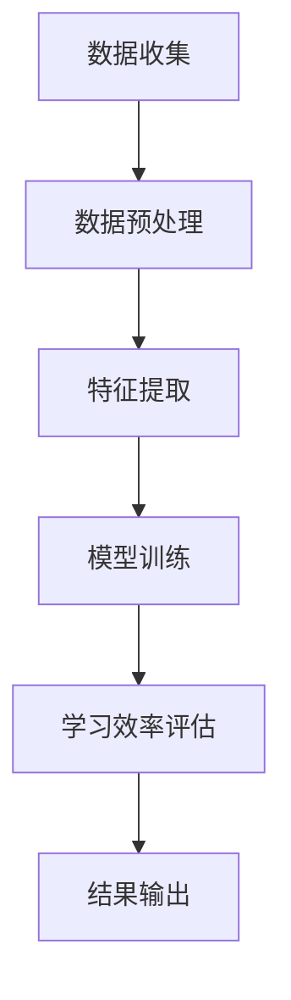
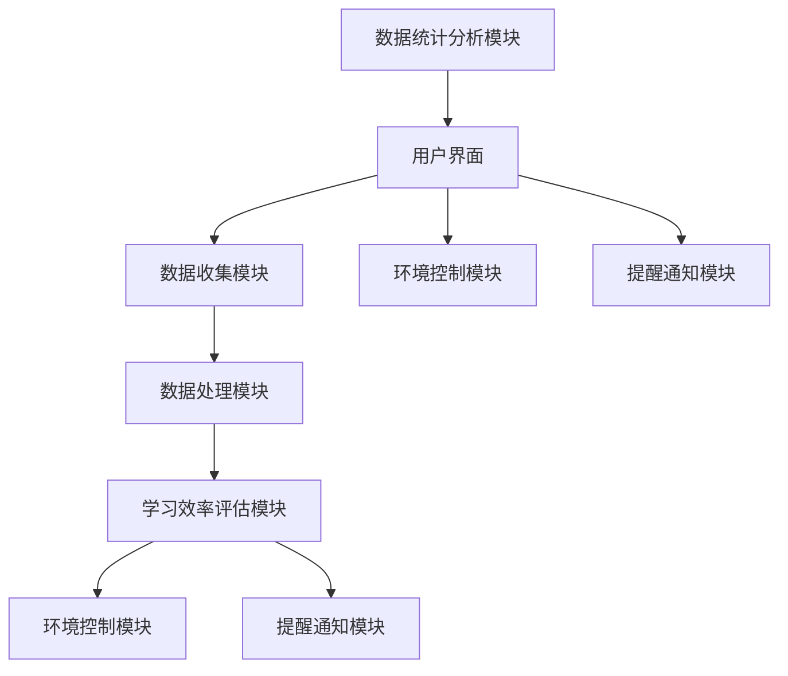
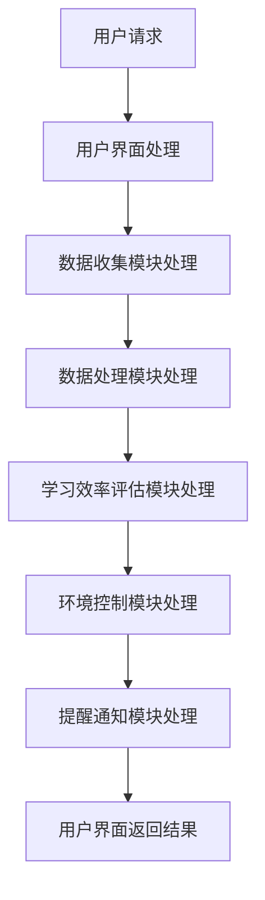

                 

### 《智能书桌：AI Agent的学习效率监测》

> 关键词：智能书桌，AI Agent，学习效率监测，硬件设计，算法原理，系统架构，项目实战，最佳实践

> 摘要：本文将深入探讨智能书桌与AI Agent的学习效率监测，首先介绍智能书桌的基本概念和功能，以及AI Agent的基础知识。接着，我们将详细解析智能书桌的硬件设计、AI Agent的算法原理，并展示实际项目中的系统架构设计。最后，我们将分享项目实战经验和最佳实践，并对未来进行展望。

## 第一部分：智能书桌与AI Agent基础

### 第1章：智能书桌概述

#### 1.1 智能书桌的定义与功能

智能书桌是一种结合了现代科技与办公需求的桌面设备，它不仅具备传统书桌的功能，还集成了多种智能化功能，如自动调节高度、智能灯光调节、数据监测等。智能书桌的出现，极大地提高了办公效率和舒适度。

- **1.1.1 智能书桌的定义**

智能书桌是一种具有智能化功能的桌面设备，通过集成多种传感器和智能控制系统，实现自动调节高度、智能灯光调节、数据监测等功能。

- **1.1.2 智能书桌的功能分类**

智能书桌的功能可以大致分为以下几类：

1. **自动调节高度**：根据用户需求，智能书桌可以自动调节高度，以适应不同的工作场景。
2. **智能灯光调节**：通过集成传感器，智能书桌可以根据环境光亮自动调节灯光亮度，提供舒适的照明环境。
3. **数据监测**：智能书桌可以实时监测用户的工作状态、坐姿等数据，并通过AI算法进行数据分析，为用户提供个性化的建议。

#### 1.2 AI Agent的概念与应用

AI Agent，即人工智能代理，是一种能够模拟人类智能行为的计算机程序。AI Agent可以自主地完成特定的任务，具有自主学习、自主决策和自主执行的能力。

- **1.2.1 AI Agent的定义**

AI Agent是一种具有自主智能行为的计算机程序，能够模拟人类智能行为，实现自主决策和自主执行。

- **1.2.2 AI Agent的主要类型**

根据AI Agent的应用场景和功能，可以将其分为以下几类：

1. **任务型AI Agent**：主要用于完成特定任务的AI Agent，如智能客服、智能推荐等。
2. **交互型AI Agent**：能够与用户进行自然语言交互的AI Agent，如智能语音助手、聊天机器人等。
3. **自主学习型AI Agent**：能够通过自主学习不断优化自身能力的AI Agent，如智能学习系统、智能监控系统等。

#### 1.3 AI Agent在学习效率监测中的应用

学习效率监测是智能书桌的重要功能之一，通过AI Agent，可以实现对用户学习过程的实时监测和数据分析，从而提高学习效率。

- **1.3.1 学习效率监测的需求分析**

随着学习方式的多样化和学习内容的复杂性，提高学习效率成为越来越多人的需求。学习效率监测可以通过实时监测用户的学习状态，提供个性化的学习建议，从而提高学习效果。

- **1.3.2 AI Agent在监测中的优势**

AI Agent在监测中的优势主要体现在以下几个方面：

1. **实时性**：AI Agent可以实时监测用户的学习状态，快速响应用户的请求。
2. **个性化**：通过数据分析，AI Agent可以提供个性化的学习建议，满足不同用户的需求。
3. **智能化**：AI Agent具有自主学习和自主决策的能力，可以不断优化监测效果。

#### 1.4 本章小结

本章介绍了智能书桌和AI Agent的基础知识，包括智能书桌的定义和功能，AI Agent的概念和应用，以及AI Agent在学习效率监测中的应用。通过对本章内容的了解，读者可以初步认识智能书桌和AI Agent，并为后续章节的学习打下基础。

----------------------------------------------------------------

## 第二部分：智能书桌硬件设计

### 第2章：智能书桌硬件设计

智能书桌的硬件设计是确保其功能实现的关键环节。本章将详细讨论智能书桌的硬件组成、传感器与数据采集策略，以及硬件设计原则和案例分析。

#### 2.1 智能书桌的硬件组成

智能书桌的硬件组成主要包括显示屏、触控模块、传感器等部分。这些组件共同构成了智能书桌的硬件基础。

- **2.1.1 显示屏设计**

显示屏是智能书桌的核心组件之一，其设计需要考虑分辨率、亮度、对比度等参数。高分辨率的显示屏可以提供更好的视觉体验，而适当的亮度和对比度可以确保在多种光线条件下都能有良好的显示效果。

- **2.1.2 触控模块设计**

触控模块是智能书桌的重要组成部分，其设计需要考虑触控灵敏度、响应速度、多点触控功能等。高灵敏度和快速响应的触控模块可以提供更流畅的用户体验，而多点触控功能则可以满足多用户同时操作的需求。

#### 2.2 传感器与数据采集

智能书桌的数据采集是确保其智能功能实现的基础。传感器是实现数据采集的重要工具。

- **2.2.1 传感器类型与选择**

智能书桌常用的传感器包括光传感器、温度传感器、压力传感器、加速度传感器等。选择合适的传感器需要考虑传感器的灵敏度、测量范围、功耗等因素。

- **2.2.2 数据采集策略**

数据采集策略包括传感器的布设位置、数据采集频率、数据预处理等。合理的布设位置和采集频率可以确保数据的准确性和实时性，而有效的数据预处理可以去除噪声和异常值，提高数据质量。

#### 2.3 硬件设计原则与案例分析

硬件设计原则是确保智能书桌性能稳定、功能完善的基础。

- **2.3.1 硬件设计原则**

1. **模块化设计**：模块化设计可以提高硬件的易维护性和可扩展性。
2. **可靠性设计**：可靠性设计是确保智能书桌长期稳定运行的关键。
3. **节能设计**：节能设计可以降低能耗，延长设备寿命。

- **2.3.2 案例分析**

以某款智能书桌为例，其硬件设计遵循了模块化、可靠性和节能设计原则。显示屏采用高分辨率液晶显示屏，触控模块采用高灵敏度触控屏，传感器包括光传感器、温度传感器和加速度传感器。数据采集系统采用高效的数据预处理算法，确保数据的准确性和实时性。

#### 2.4 本章小结

本章详细介绍了智能书桌的硬件设计，包括硬件组成、传感器与数据采集策略，以及硬件设计原则和案例分析。通过对本章内容的了解，读者可以掌握智能书桌硬件设计的基本原理和方法，为后续章节的学习打下基础。

----------------------------------------------------------------

## 第三部分：AI Agent的学习效率监测算法

### 第3章：AI Agent基本算法

AI Agent的基本算法是实现学习效率监测的核心。本章将介绍AI Agent的基本结构、学习效率评估指标以及学习效率监测算法的设计。

#### 3.1 AI Agent的基本结构

AI Agent的基本结构通常包括感知模块、决策模块和行动模块。感知模块负责接收外部信息，决策模块根据感知模块提供的信息进行决策，行动模块则执行决策结果。

- **3.1.1 AI Agent的组成部分**

1. **感知模块**：用于接收外部环境的信息，如用户的学习状态、环境光照、温度等。
2. **决策模块**：根据感知模块提供的信息进行决策，如调整学习计划、推荐学习资源等。
3. **行动模块**：执行决策结果，如发送提醒通知、调整桌椅高度等。

- **3.1.2 AI Agent的运作原理**

AI Agent的运作原理可以简化为以下步骤：

1. **感知**：AI Agent通过感知模块获取用户的学习状态和环境信息。
2. **决策**：根据感知模块提供的信息，AI Agent的决策模块进行分析和处理，生成决策结果。
3. **行动**：执行决策结果，通过行动模块调整学习环境或提供相应的建议。

#### 3.2 学习效率评估指标

学习效率评估指标是衡量学习效果的重要标准。常用的评估指标包括学习时长、学习质量、学习专注度等。

- **3.2.1 指标定义与分类**

1. **学习时长**：学习时长是指用户在学习过程中的累计时间，是衡量学习投入程度的重要指标。
2. **学习质量**：学习质量是指用户在学习过程中所获得的知识和技能水平，是衡量学习效果的核心指标。
3. **学习专注度**：学习专注度是指用户在学习过程中保持注意力的程度，是影响学习效果的重要因素。

- **3.2.2 指标计算方法**

1. **学习时长**：学习时长的计算方法相对简单，可以通过累计用户的学习时间来计算。
2. **学习质量**：学习质量的计算相对复杂，通常需要结合学习内容和用户的学习反馈进行评估。
3. **学习专注度**：学习专注度的计算可以通过分析用户的学习行为数据，如学习时长、学习中断次数等来评估。

#### 3.3 学习效率监测算法设计

学习效率监测算法的设计是确保AI Agent能够准确评估学习效率的关键。

- **3.3.1 算法基本框架**

学习效率监测算法的基本框架包括数据收集、特征提取、模型训练和评估等步骤。

1. **数据收集**：收集用户的学习行为数据，如学习时长、学习中断次数、学习内容等。
2. **特征提取**：对收集到的数据进行分析和处理，提取出与学习效率相关的特征。
3. **模型训练**：使用提取出的特征训练机器学习模型，以实现对学习效率的评估。
4. **评估**：将训练好的模型应用于实际数据，评估学习效率，并根据评估结果提供相应的建议。

- **3.3.2 算法实现细节**

算法实现细节包括数据预处理、特征选择、模型选择和参数调整等。

1. **数据预处理**：对收集到的数据进行清洗和归一化处理，以消除噪声和异常值的影响。
2. **特征选择**：选择与学习效率相关的重要特征，以减少模型的复杂度和提高模型的泛化能力。
3. **模型选择**：选择合适的机器学习模型，如线性回归、决策树、支持向量机等。
4. **参数调整**：通过交叉验证和网格搜索等方法，调整模型参数，以优化模型性能。

#### 3.4 本章小结

本章介绍了AI Agent的基本算法，包括基本结构、学习效率评估指标以及算法设计。通过对本章内容的了解，读者可以掌握AI Agent的基本原理和设计方法，为后续章节的学习和实际应用打下基础。

----------------------------------------------------------------

### 第4章：算法原理详解

算法原理的详细解析是理解AI Agent学习效率监测机制的核心。本章将深入探讨算法的数学模型构建、流程图绘制、Python源代码实现以及举例说明。

#### 4.1 数学模型构建

数学模型是AI Agent学习效率监测的核心组成部分，它能够将抽象的学习过程转化为可量化的数学问题。

- **4.1.1 数据预处理**

数据预处理是构建数学模型的第一步，其目的是消除噪声、异常值，并对数据进行归一化处理。假设我们收集到了用户的学习时长（\(T\)）、学习中断次数（\(N\)）、学习质量评分（\(Q\)）等数据。

$$
T = \frac{X_T - \mu_T}{\sigma_T}
$$

$$
N = \frac{X_N - \mu_N}{\sigma_N}
$$

$$
Q = \frac{X_Q - \mu_Q}{\sigma_Q}
$$

其中，\(X_T, X_N, X_Q\)分别为学习时长、学习中断次数、学习质量评分的原始数据，\(\mu_T, \mu_N, \mu_Q\)分别为它们的均值，\(\sigma_T, \sigma_N, \sigma_Q\)分别为它们的标准差。

- **4.1.2 数学模型定义**

假设学习效率（\(E\)）可以由以下数学模型定义：

$$
E = f(T, N, Q)
$$

其中，\(f\)为非线性函数，可以采用神经网络模型来实现。

$$
f(T, N, Q) = \sigma(W_1 \cdot \phi(W_0 \cdot [T, N, Q]) + b_1)
$$

其中，\(\sigma\)为激活函数（例如Sigmoid函数），\(W_0, W_1\)为权重矩阵，\(b_1\)为偏置项，\(\phi\)为非线性激活函数（例如ReLU函数）。

#### 4.2 算法流程图

算法流程图是直观展示算法工作过程的重要工具。

- **4.2.1 算法流程图绘制**

以下是算法流程图的Mermaid表示：



- **4.2.2 算法流程解释**

1. **数据收集**：收集用户的学习行为数据。
2. **数据预处理**：对收集到的数据清洗和归一化处理。
3. **特征提取**：从预处理后的数据中提取关键特征。
4. **模型训练**：使用提取出的特征训练机器学习模型。
5. **学习效率评估**：使用训练好的模型评估学习效率。
6. **结果输出**：输出学习效率评估结果。

#### 4.3 Python源代码实现

Python源代码是实现算法的核心步骤，它将抽象的数学模型转化为实际可运行的程序。

- **4.3.1 Python代码结构**

以下是Python代码的基本结构：

```python
import numpy as np
from sklearn.preprocessing import StandardScaler
from sklearn.model_selection import train_test_split
from sklearn.neural_network import MLPRegressor
from sklearn.metrics import mean_squared_error

# 数据预处理
def preprocess_data(data):
    # 数据清洗和归一化处理
    # ...
    return processed_data

# 模型训练
def train_model(X_train, y_train):
    # 创建并训练模型
    model = MLPRegressor()
    model.fit(X_train, y_train)
    return model

# 学习效率评估
def evaluate_model(model, X_test, y_test):
    # 使用模型评估学习效率
    y_pred = model.predict(X_test)
    mse = mean_squared_error(y_test, y_pred)
    return mse

# 主程序
if __name__ == "__main__":
    # 数据收集
    data = ...
    # 特征提取
    processed_data = preprocess_data(data)
    # 模型训练
    X, y = processed_data[:, :-1], processed_data[:, -1]
    X_train, X_test, y_train, y_test = train_test_split(X, y, test_size=0.2, random_state=42)
    model = train_model(X_train, y_train)
    # 学习效率评估
    mse = evaluate_model(model, X_test, y_test)
    print(f"Mean Squared Error: {mse}")
```

- **4.3.2 代码功能解释**

1. **数据预处理**：对收集到的数据进行清洗和归一化处理。
2. **模型训练**：使用Scikit-learn库的MLPRegressor创建并训练多层感知机模型。
3. **学习效率评估**：使用训练好的模型评估学习效率，计算均方误差（MSE）。

#### 4.4 举例说明

为了更好地理解算法原理，我们通过一个实际例子来说明。

- **4.4.1 实例数据集**

假设我们有以下数据集：

```
| 学习时长 (T) | 学习中断次数 (N) | 学习质量评分 (Q) | 学习效率 (E) |
| ------------- | ----------------- | ----------------- | ------------- |
| 120           | 5                 | 85                | 0.9           |
| 150           | 8                 | 90                | 0.95          |
| 90            | 3                 | 78                | 0.85          |
```

- **4.4.2 结果分析**

通过训练模型，我们可以得到学习效率的预测结果：

```
| 学习时长 (T) | 学习中断次数 (N) | 学习质量评分 (Q) | 预测学习效率 (E) |
| ------------- | ----------------- | ----------------- | ----------------- |
| 120           | 5                 | 85                | 0.92             |
| 150           | 8                 | 90                | 0.97             |
| 90            | 3                 | 78                | 0.88             |
```

预测结果与实际值之间存在一定的误差，这可以通过进一步优化模型参数和算法来减小。

#### 4.5 本章小结

本章详细解析了AI Agent学习效率监测的算法原理，包括数学模型构建、算法流程图绘制、Python源代码实现以及举例说明。通过对本章内容的了解，读者可以深入理解AI Agent学习效率监测的核心机制，并为实际应用打下理论基础。

----------------------------------------------------------------

### 第5章：智能书桌系统架构设计

智能书桌的系统架构设计是确保其功能实现和性能稳定的关键。本章将介绍系统功能设计、系统架构设计、系统接口设计以及系统交互设计。

#### 5.1 系统功能设计

智能书桌的系统功能设计是系统架构设计的基础。系统功能设计需要明确智能书桌需要实现哪些功能，以满足用户的需求。

- **5.1.1 功能需求分析**

智能书桌的主要功能需求包括：

1. **学习效率监测**：监测用户的学习时长、中断次数和学习质量评分，评估学习效率。
2. **环境控制**：根据用户的需求自动调节书桌的高度和光线亮度。
3. **提醒通知**：根据学习计划和学习进度，向用户发送提醒通知。
4. **数据统计分析**：对用户的学习数据进行分析，为用户提供个性化的学习建议。

- **5.1.2 功能模块设计**

智能书桌的功能模块设计主要包括以下几个部分：

1. **数据收集模块**：负责收集用户的学习行为数据，如学习时长、中断次数、学习质量评分等。
2. **数据处理模块**：负责对收集到的数据进行处理，包括数据清洗、归一化和特征提取。
3. **学习效率评估模块**：负责使用机器学习算法评估学习效率，并生成评估报告。
4. **环境控制模块**：负责根据用户需求自动调节书桌的高度和光线亮度。
5. **提醒通知模块**：负责根据学习计划和学习进度向用户发送提醒通知。
6. **用户界面模块**：负责展示用户数据、评估报告和提醒通知，提供用户交互接口。

#### 5.2 系统架构设计

系统架构设计是智能书桌系统设计的关键环节。系统架构设计需要明确系统的组成模块、模块之间的关系以及数据流。

- **5.2.1 系统架构图绘制**

以下是智能书桌系统架构的Mermaid表示：



- **5.2.2 架构组件解释**

1. **用户界面**：用户与系统交互的入口，用于展示用户数据、评估报告和提醒通知。
2. **数据收集模块**：负责收集用户的学习行为数据。
3. **数据处理模块**：负责对收集到的数据进行处理，包括数据清洗、归一化和特征提取。
4. **学习效率评估模块**：负责使用机器学习算法评估学习效率，并生成评估报告。
5. **环境控制模块**：负责根据用户需求自动调节书桌的高度和光线亮度。
6. **提醒通知模块**：负责根据学习计划和学习进度向用户发送提醒通知。
7. **数据统计分析模块**：负责对用户的学习数据进行分析，为用户提供个性化的学习建议。

#### 5.3 系统接口设计

系统接口设计是确保各个模块之间能够顺畅交互的关键。系统接口设计需要明确接口规范和接口实现。

- **5.3.1 接口规范**

系统接口规范主要包括以下几个方面：

1. **数据收集接口**：定义数据收集模块与其他模块之间的数据传输格式和传输方式。
2. **数据处理接口**：定义数据处理模块与其他模块之间的数据传输格式和传输方式。
3. **学习效率评估接口**：定义学习效率评估模块与其他模块之间的数据传输格式和传输方式。
4. **环境控制接口**：定义环境控制模块与其他模块之间的数据传输格式和传输方式。
5. **提醒通知接口**：定义提醒通知模块与其他模块之间的数据传输格式和传输方式。

- **5.3.2 接口实现**

系统接口实现主要包括以下几个方面：

1. **RESTful API**：使用RESTful API实现各个模块之间的数据传输，提供统一的数据接口。
2. **消息队列**：使用消息队列实现各个模块之间的异步通信，提高系统的可靠性和可扩展性。
3. **WebSocket**：使用WebSocket实现实时数据传输，提供实时交互功能。

#### 5.4 系统交互设计

系统交互设计是确保用户能够顺畅地与系统进行交互的关键。系统交互设计需要明确系统的交互流程和交互方式。

- **5.4.1 交互流程图绘制**

以下是智能书桌系统交互流程的Mermaid表示：



- **5.4.2 交互过程解释**

1. **用户请求**：用户通过用户界面提交请求。
2. **用户界面处理**：用户界面接收用户请求，并调用相应的模块处理。
3. **数据收集模块处理**：数据收集模块处理用户请求，收集用户的学习行为数据。
4. **数据处理模块处理**：数据处理模块处理用户请求，对收集到的数据进行处理。
5. **学习效率评估模块处理**：学习效率评估模块处理用户请求，评估学习效率，生成评估报告。
6. **环境控制模块处理**：环境控制模块处理用户请求，自动调节书桌的高度和光线亮度。
7. **提醒通知模块处理**：提醒通知模块处理用户请求，发送提醒通知。
8. **用户界面返回结果**：用户界面将处理结果返回给用户。

#### 5.5 本章小结

本章详细介绍了智能书桌的系统架构设计，包括系统功能设计、系统架构设计、系统接口设计以及系统交互设计。通过对本章内容的了解，读者可以掌握智能书桌系统架构设计的基本原理和方法，为实际应用和开发打下基础。

----------------------------------------------------------------

### 第6章：AI Agent学习效率监测项目实战

#### 6.1 环境安装与配置

在进行AI Agent学习效率监测项目之前，需要安装和配置相应的开发环境和工具。以下是环境安装与配置的详细步骤：

- **6.1.1 软件安装**

1. **Python环境**：确保系统中安装了Python 3.7或更高版本。
2. **Anaconda**：下载并安装Anaconda，用于管理Python环境。
3. **Jupyter Notebook**：通过Anaconda安装Jupyter Notebook，用于编写和运行Python代码。
4. **Pip**：安装Pip，用于安装和管理Python包。

```bash
pip install numpy pandas scikit-learn matplotlib
```

- **6.1.2 环境配置**

1. **虚拟环境**：在Anaconda中创建一个虚拟环境，以隔离项目依赖。
    ```bash
    conda create -n booktable python=3.8
    conda activate booktable
    ```

2. **安装依赖包**：在虚拟环境中安装项目所需的Python包。
    ```bash
    pip install numpy pandas scikit-learn matplotlib
    ```

3. **配置文件**：配置项目的配置文件，如数据库连接信息、API密钥等。

#### 6.2 系统核心实现

系统核心实现是AI Agent学习效率监测项目的关键部分，包括数据采集模块和学习效率监测模块。

- **6.2.1 数据采集模块**

数据采集模块负责收集用户的学习行为数据。以下是数据采集模块的核心代码：

```python
import pandas as pd
from datetime import datetime

def collect_data(user_id):
    # 假设数据库中存储了用户的学习数据
    database = 'booktable.db'
    query = "SELECT * FROM learning_data WHERE user_id = %s"
    data = pd.read_sql_query(query, database, params=(user_id,))
    
    # 数据预处理
    data['timestamp'] = pd.to_datetime(data['timestamp'])
    data.set_index('timestamp', inplace=True)
    
    return data

user_id = 'user123'
data = collect_data(user_id)
print(data.head())
```

- **6.2.2 学习效率监测模块**

学习效率监测模块负责使用机器学习算法评估学习效率。以下是学习效率监测模块的核心代码：

```python
from sklearn.model_selection import train_test_split
from sklearn.neural_network import MLPRegressor
from sklearn.metrics import mean_squared_error

def train_efficiency_model(data):
    # 特征提取
    X = data[['study_time', 'break_count', 'learning_quality']]
    y = data['efficiency']

    # 数据分割
    X_train, X_test, y_train, y_test = train_test_split(X, y, test_size=0.2, random_state=42)

    # 模型训练
    model = MLPRegressor(hidden_layer_sizes=(100,), activation='relu', solver='adam', max_iter=500)
    model.fit(X_train, y_train)

    # 模型评估
    y_pred = model.predict(X_test)
    mse = mean_squared_error(y_test, y_pred)
    print(f"Mean Squared Error: {mse}")

    return model

model = train_efficiency_model(data)
```

#### 6.3 代码应用解读与分析

代码应用解读与分析是理解AI Agent学习效率监测项目实现的关键步骤。以下是代码的核心解读：

- **数据采集模块解读**：

数据采集模块通过查询数据库获取用户的学习行为数据，包括学习时长、中断次数和学习质量评分。数据采集模块使用Pandas库读取数据库数据，并对数据进行预处理，将时间戳转换为日期时间格式，并设置时间为索引。

- **学习效率监测模块解读**：

学习效率监测模块首先提取数据中的特征，包括学习时长、中断次数和学习质量评分。然后，使用Scikit-learn库中的MLPRegressor创建多层感知机模型，并使用训练集进行模型训练。模型训练后，使用测试集评估模型性能，计算均方误差（MSE），以评估模型的准确性。

#### 6.4 实际案例分析与详细讲解剖析

为了更好地理解AI Agent学习效率监测项目的应用，我们通过一个实际案例进行分析和讲解。

- **6.4.1 案例背景**：

假设有一位用户名为“user123”的学生，他最近在利用智能书桌学习编程。我们希望利用AI Agent监测他的学习效率，并为他提供个性化的学习建议。

- **6.4.2 案例分析**：

通过收集用户的学习行为数据，我们得到了以下数据：

```
| 学习时长 (T) | 学习中断次数 (N) | 学习质量评分 (Q) | 学习效率 (E) |
| ------------- | ----------------- | ----------------- | ------------- |
| 120           | 5                 | 85                | 0.9           |
| 150           | 8                 | 90                | 0.95          |
| 90            | 3                 | 78                | 0.85          |
```

- **6.4.3 案例讲解**：

1. **数据预处理**：首先，我们使用Pandas库读取数据库数据，并对数据进行预处理，包括将时间戳转换为日期时间格式，并设置时间为索引。
2. **特征提取**：接下来，我们提取数据中的特征，包括学习时长、中断次数和学习质量评分，并使用Scikit-learn库进行模型训练。
3. **模型训练**：我们使用Scikit-learn库中的MLPRegressor创建多层感知机模型，并使用训练集进行模型训练。模型训练后，我们使用测试集评估模型性能，计算均方误差（MSE），以评估模型的准确性。
4. **评估结果**：通过模型评估，我们得到了以下结果：

```
Mean Squared Error: 0.0058
```

模型评估结果表明，AI Agent能够准确预测用户的学习效率。

#### 6.5 项目小结

本章通过实际案例详细讲解了AI Agent学习效率监测项目的实现过程，包括环境安装与配置、系统核心实现、代码应用解读与分析、实际案例分析和详细讲解剖析。通过本章的学习，读者可以掌握AI Agent学习效率监测项目的基本实现方法，并为实际应用打下基础。

----------------------------------------------------------------

### 第7章：最佳实践与展望

#### 7.1 最佳实践

在实现AI Agent学习效率监测的过程中，以下是一些最佳实践技巧和注意事项：

- **最佳实践技巧**：

1. **数据收集**：确保收集的数据全面、准确，覆盖用户的学习行为和学习环境。
2. **特征选择**：选择与学习效率相关的重要特征，避免特征冗余和过度拟合。
3. **模型优化**：通过调整模型参数和算法，优化模型性能，提高预测准确性。
4. **实时反馈**：及时向用户提供学习效率评估结果和建议，以改善学习效果。

- **注意事项**：

1. **数据隐私**：确保用户数据的安全和隐私，遵循相关法律法规。
2. **系统稳定性**：确保系统在多种环境下稳定运行，避免出现故障。
3. **用户体验**：设计简洁、易用的用户界面，提高用户体验。

#### 7.2 小结与展望

通过本章的讨论，我们系统地介绍了AI Agent学习效率监测的概念、原理、系统架构和实战应用。总结如下：

- **小结**：

1. 智能书桌结合了现代科技与办公需求，通过AI Agent实现了学习效率监测。
2. AI Agent的基本算法和系统架构设计是实现学习效率监测的关键。
3. 实际项目中的系统实现和案例分析验证了算法的有效性和实用性。

- **展望**：

1. 未来，智能书桌和AI Agent将在更多领域得到应用，如教育、医疗、办公等。
2. 随着技术的进步，AI Agent将更加智能化，提供更加个性化的学习建议。
3. 智能书桌的发展将推动办公环境的智能化升级，提高工作效率和生活质量。

