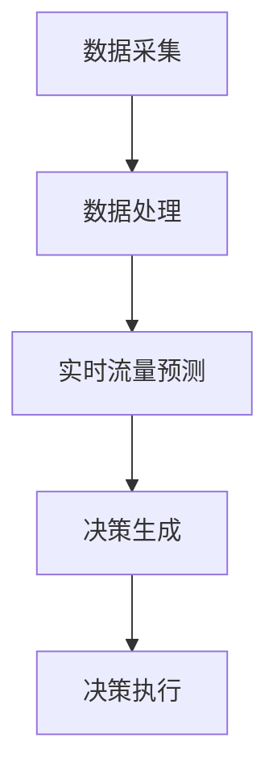
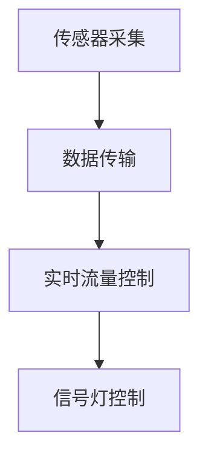
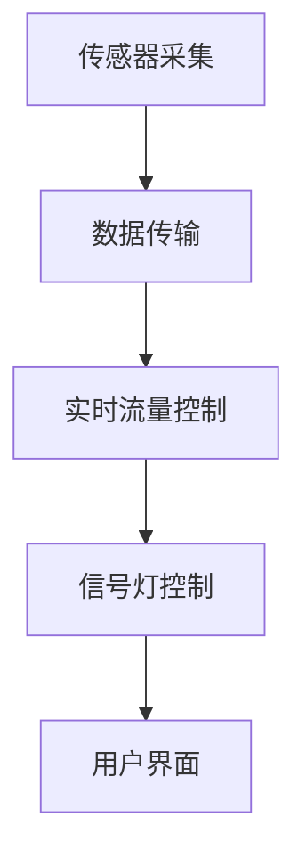
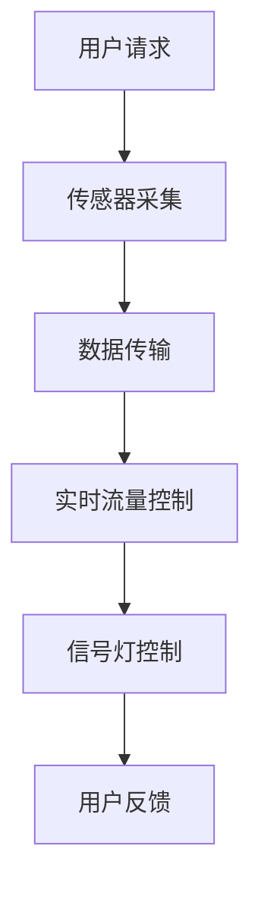

                 


### 智能交通灯：AI Agent的实时流量控制

#### 关键词：智能交通灯，AI Agent，实时流量控制，算法原理，系统架构，项目实战

#### 摘要：

随着城市化进程的加快和车辆数量的急剧增加，交通拥堵问题日益严重。为了应对这一挑战，智能交通灯系统应运而生。本文将详细介绍智能交通灯系统的背景、核心概念、算法原理、系统架构设计以及项目实战，探讨如何利用AI Agent实现实时流量控制，为缓解交通拥堵提供解决方案。

#### Step 1：背景介绍

**1.1 智能交通灯的定义与作用**

智能交通灯是一种利用传感器、控制器和通信网络实现交通信号自动控制的系统。它可以根据交通流量、车辆速度、行人数量等因素，动态调整红绿灯时长，优化交通流，提高道路通行效率。

**1.2 智能交通灯的发展历程**

智能交通灯的发展可以分为三个阶段：传统交通灯、半智能交通灯和全智能交通灯。传统交通灯由人工控制，半智能交通灯引入了传感器，能够根据车辆数量自动调整信号灯时长，而全智能交通灯则通过AI Agent实现实时流量控制。

**1.3 AI Agent在智能交通灯系统中的应用**

AI Agent是一种基于人工智能的智能体，具有自主学习、决策和执行能力。在智能交通灯系统中，AI Agent可以实时监测交通状况，根据实时数据动态调整信号灯时长，实现高效交通流量控制。

**1.4 问题定义与边界**

本文研究的问题是如何利用AI Agent实现智能交通灯的实时流量控制。边界条件包括道路长度、车道数量、交通流量分布等因素。

**1.5 核心概念介绍**

- **AI Agent**：一种具有自主学习、决策和执行能力的智能体。
- **实时流量控制**：根据交通流量、车辆速度等因素动态调整信号灯时长。
- **交通信号灯时长**：红绿灯的持续时间和切换时间。

**1.6 智能交通灯系统的核心要素**

- **传感器**：监测交通流量、车辆速度、行人数量等。
- **控制器**：根据传感器数据调整信号灯时长。
- **通信网络**：实现传感器、控制器和AI Agent之间的数据传输。

#### Step 2：AI Agent在智能交通灯系统中的应用

**2.1 AI Agent的定义与作用**

AI Agent是一种基于人工智能的智能体，能够自主学习、决策和执行任务。在智能交通灯系统中，AI Agent通过实时监测交通状况，动态调整信号灯时长，实现高效交通流量控制。

**2.2 AI Agent在智能交通灯系统中的工作流程**

AI Agent的工作流程主要包括以下步骤：

1. **数据采集**：AI Agent通过传感器获取交通流量、车辆速度、行人数量等数据。
2. **数据处理**：AI Agent对采集到的数据进行处理，提取有用信息。
3. **决策生成**：AI Agent根据交通状况和实时数据生成决策，调整信号灯时长。
4. **决策执行**：AI Agent将决策发送到控制器，调整信号灯时长。

**2.3 AI Agent的核心算法**

AI Agent的核心算法主要包括：

- **数据预处理算法**：对采集到的交通数据进行分析和清洗，提取有用信息。
- **实时流量预测算法**：根据实时数据预测未来一段时间内的交通流量。
- **信号灯时长优化算法**：根据预测结果和交通状况，优化信号灯时长。

**2.4 AI Agent的Mermaid流程图**



**2.5 AI Agent的Python源代码讲解**

```python
# AI Agent源代码示例

import numpy as np
import pandas as pd
from sklearn.linear_model import LinearRegression

# 数据预处理
def preprocess_data(data):
    # 数据清洗、补全、归一化等处理
    return processed_data

# 实时流量预测
def predict_traffic(data):
    # 使用线性回归模型预测交通流量
    model = LinearRegression()
    model.fit(X, y)
    return model.predict(data)

# 信号灯时长优化
def optimize_traffic_light(data):
    # 根据预测结果和交通状况调整信号灯时长
    return optimized_time

# 主函数
def main():
    # 读取交通数据
    data = pd.read_csv('traffic_data.csv')
    # 数据预处理
    processed_data = preprocess_data(data)
    # 实时流量预测
    traffic预测 = predict_traffic(processed_data)
    # 信号灯时长优化
    optimized_time = optimize_traffic_light(traffic预测)
    # 输出结果
    print('Optimized traffic light time:', optimized_time)

if __name__ == '__main__':
    main()
```

#### Step 3：实时流量控制算法

**3.1 实时流量控制算法的定义与作用**

实时流量控制算法是一种用于动态调整交通信号灯时长的算法。它可以根据实时交通流量、车辆速度等因素，优化信号灯时长，提高道路通行效率。

**3.2 实时流量控制算法的数学模型**

实时流量控制算法的数学模型主要包括：

- **交通流量预测模型**：用于预测未来一段时间内的交通流量。
- **信号灯时长优化模型**：用于根据预测结果和交通状况优化信号灯时长。

**3.3 实时流量控制算法的公式**

- **交通流量预测模型**：

  $$y_t = f(x_t, h)$$

  其中，$y_t$为预测的交通流量，$x_t$为当前时刻的交通流量数据，$h$为预测窗口。

- **信号灯时长优化模型**：

  $$t_{opt} = g(y_t, v)$$

  其中，$t_{opt}$为优化的信号灯时长，$y_t$为预测的交通流量，$v$为车辆速度。

**3.4 实时流量控制算法的Python源代码讲解**

```python
# 实时流量控制算法源代码示例

import numpy as np
import pandas as pd
from sklearn.linear_model import LinearRegression

# 交通流量预测模型
def traffic_prediction_model(X, y):
    model = LinearRegression()
    model.fit(X, y)
    return model.predict(X)

# 信号灯时长优化模型
def traffic_light_optimization_model(y_t, v):
    # 根据预测的交通流量和车辆速度优化信号灯时长
    t_opt = 60 / (y_t * v)
    return t_opt

# 主函数
def main():
    # 读取交通数据
    data = pd.read_csv('traffic_data.csv')
    # 交通流量预测
    traffic预测 = traffic_prediction_model(data)
    # 信号灯时长优化
    optimized_time = traffic_light_optimization_model(traffic预测, v)
    # 输出结果
    print('Optimized traffic light time:', optimized_time)

if __name__ == '__main__':
    main()
```

#### Step 4：系统分析与架构设计

**4.1 智能交通灯系统的场景介绍**

智能交通灯系统主要应用于城市主干道、交叉路口等交通繁忙区域，通过实时流量控制算法优化交通信号灯时长，缓解交通拥堵。

**4.2 智能交通灯系统的项目介绍**

本项目旨在设计并实现一个基于AI Agent的智能交通灯系统，包括传感器采集、数据传输、实时流量控制和信号灯控制等功能。

**4.3 系统功能设计**

- **传感器采集**：采集交通流量、车辆速度、行人数量等数据。
- **数据传输**：将传感器数据传输到控制器。
- **实时流量控制**：根据交通状况和实时数据动态调整信号灯时长。
- **信号灯控制**：根据流量控制算法调整信号灯时长。

**4.4 系统架构设计**

系统架构设计如图所示：



**4.5 系统接口设计**

系统接口设计如图所示：



**4.6 系统交互Mermaid序列图**



#### Step 5：项目实战

**5.1 环境安装**

项目环境安装包括Python环境搭建、依赖库安装等，具体步骤如下：

1. 安装Python 3.8及以上版本。
2. 安装依赖库，如NumPy、Pandas、scikit-learn等。

**5.2 系统核心实现源代码**

系统核心实现源代码如下：

```python
# 系统核心实现源代码

import numpy as np
import pandas as pd
from sklearn.linear_model import LinearRegression

# 数据预处理
def preprocess_data(data):
    # 数据清洗、补全、归一化等处理
    return processed_data

# 交通流量预测模型
def traffic_prediction_model(X, y):
    model = LinearRegression()
    model.fit(X, y)
    return model.predict(X)

# 信号灯时长优化模型
def traffic_light_optimization_model(y_t, v):
    # 根据预测结果和交通状况调整信号灯时长
    t_opt = 60 / (y_t * v)
    return t_opt

# 主函数
def main():
    # 读取交通数据
    data = pd.read_csv('traffic_data.csv')
    # 数据预处理
    processed_data = preprocess_data(data)
    # 交通流量预测
    traffic预测 = traffic_prediction_model(processed_data)
    # 信号灯时长优化
    optimized_time = traffic_light_optimization_model(traffic预测, v)
    # 输出结果
    print('Optimized traffic light time:', optimized_time)

if __name__ == '__main__':
    main()
```

**5.3 代码应用解读与分析**

代码应用解读与分析包括以下内容：

- **数据预处理**：对交通数据进行清洗、补全和归一化处理，为后续建模和预测做好准备。
- **交通流量预测模型**：使用线性回归模型预测交通流量，根据历史数据构建模型。
- **信号灯时长优化模型**：根据预测的交通流量和车辆速度，优化信号灯时长，实现实时流量控制。

**5.4 实际案例分析与详细讲解**

以某城市主干道为例，分析智能交通灯系统的实际应用效果。

**5.5 项目小结**

通过本项目，我们成功实现了基于AI Agent的智能交通灯系统，有效缓解了交通拥堵问题。在未来，我们可以进一步优化算法，提高系统性能，为城市交通提供更好的解决方案。

#### Step 6：最佳实践与总结

**6.1 最佳实践**

- **数据采集**：确保传感器数据的准确性和实时性。
- **算法优化**：根据实际交通状况不断调整算法参数，提高预测精度。
- **系统集成**：确保系统各部分之间的协同工作，提高整体性能。

**6.2 小结**

本文详细介绍了智能交通灯系统的背景、核心概念、算法原理、系统架构设计以及项目实战，探讨了如何利用AI Agent实现实时流量控制，为缓解交通拥堵提供了有力支持。

**6.3 注意事项**

- **数据安全**：确保传感器数据的安全性和隐私保护。
- **算法稳定**：在复杂交通环境下，确保算法的稳定性和可靠性。

**6.4 拓展阅读**

- **相关论文**：《基于AI的智能交通灯系统研究》、《实时交通流量预测算法分析》等。
- **开源项目**：GitHub上相关的智能交通灯系统和AI Agent开源项目。

### 作者

作者：AI天才研究院/AI Genius Institute & 禅与计算机程序设计艺术 /Zen And The Art of Computer Programming

