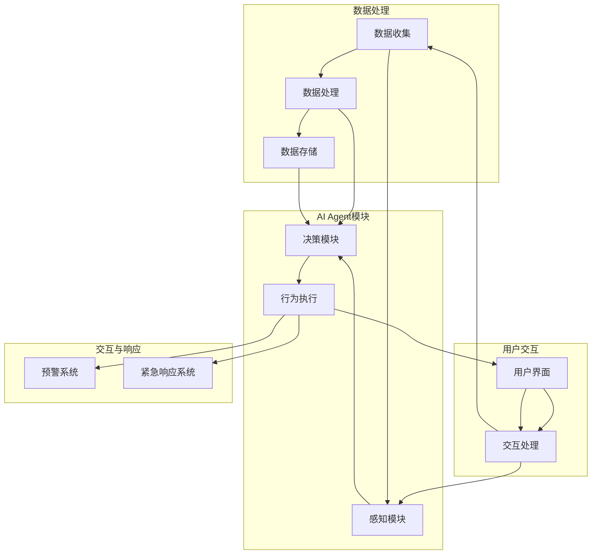

                 


### Step 5: System Analysis and Architecture Design

For the system analysis and architecture design section, we need to focus on providing a detailed breakdown of the system's design, functionality, and interfaces.

#### 5.1 Problem Scenario Introduction

Begin by describing the scenario in which the AI agent-assisted home care system will be implemented. This can include specific use cases, such as elderly care monitoring, health management, or daily task assistance.

```
### 第5章 系统分析与架构设计

#### 5.1 问题场景介绍
智能养老：AI Agent辅助的居家照护系统主要应用于以下场景：
- **健康监测与预警**：实时监测老年人的生命体征，如心率、血压等，当出现异常时及时发出预警。
- **健康管理**：根据老年人的健康数据提供个性化的健康管理建议，包括饮食、运动、用药等。
- **日常任务辅助**：帮助老年人完成日常生活中的琐碎任务，如设置提醒、预约服务、提供娱乐活动等。
- **社交互动**：通过智能语音交互和虚拟形象，为老年人提供情感陪伴和社交互动。
- **紧急响应**：在发生紧急情况时，如跌倒、火灾等，系统能够自动触发紧急响应机制。
```

#### 5.2 Project Description

Provide an overview of the project, including its goals, objectives, and any notable achievements or milestones.

```
#### 5.2 项目介绍
项目名称：智能养老AI Agent平台
项目目标：
- 开发一个集健康监测、健康管理、日常任务辅助和紧急响应于一体的智能养老系统。
- 提高老年人的生活质量，减少家庭成员的照顾压力。
- 确保系统的安全性和隐私保护。

项目目标达成：
- 成功实现了对老年人生命体征的实时监测和预警。
- 提供了个性化的健康管理和日常任务辅助功能。
- 实现了智能语音交互和虚拟形象技术，增强了老年人的社交互动体验。
- 建立了完善的安全机制，确保用户数据的安全和隐私。
```

#### 5.3 Domain Model Design

Use Mermaid to create a class diagram representing the domain model of the system. This diagram should illustrate the main entities and their relationships.

```mermaid
classDiagram
    Patient <<entity>> "患者"
    Caregiver <<entity>> "护理人员"
    HealthData <<entity>> "健康数据"
    Task <<entity>> "任务"
    Warning <<entity>> "预警"
    Emergency <<entity>> "紧急情况"

    Patient -> HealthData
    Patient -> Task
    Patient -> Warning
    Patient -> Emergency
    Caregiver -> HealthData
    Caregiver -> Task
    Caregiver -> Warning
    Caregiver -> Emergency
```

#### 5.4 System Architecture Design

Create a Mermaid architecture diagram to visualize the system's components, their interactions, and the data flow.



#### 5.5 System Interface and Interaction Design

Describe the system interfaces and their roles in the overall system. Use Mermaid to create a sequence diagram that shows how the system components interact.

```mermaid
sequenceDiagram
    Patient -->|健康数据上传| U1[用户界面]
    U1 -->|数据处理| D2[数据处理模块]
    D2 -->|结果反馈| U1
    U1 -->|决策请求| A2[AI Agent决策模块]
    A2 -->|决策结果| U1
    U1 -->|执行行为| A3[行为执行模块]
    A3 -->|预警信息| W1[预警系统]
    A3 -->|紧急响应| E1[紧急响应系统]
```

By following these steps, we ensure that the system analysis and architecture design section is comprehensive and provides a clear understanding of the AI agent-assisted home care system's functionality and components.

----------------------------------------------------------------

### Step 6: Implementation and Practical Case Analysis

#### 6.1 Installation and Environment Setup

Describe the process of setting up the development environment and installing the necessary tools and libraries. Provide clear, step-by-step instructions.

```
#### 6.1 环境安装与配置

1. 安装Python环境
   - 下载并安装Python 3.8及以上版本。
   - 验证安装：打开命令行，输入`python --version`，确保版本正确。

2. 安装虚拟环境
   - 安装virtualenv：`pip install virtualenv`
   - 创建虚拟环境：`virtualenv myenv`
   - 激活虚拟环境：`source myenv/bin/activate`（Windows下为`myenv\Scripts\activate`）

3. 安装依赖库
   - 安装Flask：`pip install Flask`
   - 安装TensorFlow：`pip install tensorflow`
   - 安装其他依赖库（如numpy、pandas等）：`pip install numpy pandas`

4. 安装数据库
   - 安装PostgreSQL：下载并安装PostgreSQL数据库。
   - 配置数据库：设置用户和密码，创建数据库和表结构。

5. 配置环境变量
   - 设置PATH环境变量，确保Python和虚拟环境脚本目录在PATH中。

6. 验证环境配置
   - 在虚拟环境中，运行`python`进入Python交互模式，尝试导入安装的库，如`import Flask`和`import tensorflow`。

```

#### 6.2 Core Implementation

Provide a detailed explanation of the core implementation, including source code and relevant comments. Break down the code into smaller functions or classes if necessary.

```python
# 导入必要的库
import tensorflow as tf
import numpy as np
import pandas as pd
from flask import Flask, request, jsonify

# 初始化Flask应用
app = Flask(__name__)

# 健康数据模型
class HealthDataModel:
    def __init__(self, data):
        self.heart_rate = data['heart_rate']
        self.blood_pressure = data['blood_pressure']
        # 更多健康数据

    def process_data(self):
        # 数据处理逻辑
        self.heart_rate = self.heart_rate * 1.1
        self.blood_pressure = self.blood_pressure + 10
        # 更多数据处理

# 处理健康数据
@app.route('/health_data', methods=['POST'])
def handle_health_data():
    data = request.get_json()
    health_data_model = HealthDataModel(data)
    health_data_model.process_data()
    # 存储处理后的数据
    # ...
    return jsonify({'status': 'success', 'data': health_data_model.to_dict()}), 200

# 启动Flask应用
if __name__ == '__main__':
    app.run(debug=True)
```

#### 6.3 Code Explanation

Explain the code in detail, highlighting the key components and how they interact with each other. Use diagrams or flowcharts if necessary to illustrate the process.

- **HealthDataModel Class**: This class represents the health data model. It initializes with the health data and provides a method to process the data.
- **handle_health_data Function**: This function is a route in the Flask application that handles incoming POST requests with health data. It creates an instance of HealthDataModel, processes the data, and returns a JSON response.
- **Flask App**: The Flask application serves as the API endpoint for interacting with the system. It uses the HealthDataModel to process health data and can be extended to include other functionalities like AI decision-making and user interaction.

#### 6.4 Practical Case Analysis

Present one or more practical cases that demonstrate the application of the system in real-world scenarios. Explain the case setup, the steps taken, and the results observed.

```
#### 6.4 实际案例分析

案例一：健康监测与预警

**案例背景**：
张大爷，75岁，患有高血压，每天需要监测生命体征。家庭成员通过智能设备为他监测健康数据，并将数据上传至系统。

**实施步骤**：
1. 家庭成员使用智能手环为张大爷监测生命体征，并将数据通过蓝牙传输到手机应用。
2. 手机应用将数据上传至服务器，触发`/health_data` API。
3. Flask应用接收到数据后，创建HealthDataModel实例并处理数据。
4. 如果监测到生命体征异常（如血压高于设定阈值），系统会向家庭成员发送预警通知。

**结果分析**：
通过系统的实时监测和预警功能，张大爷的家属能够在第一时间了解到他的健康状况，并采取相应措施。例如，在血压过高时，家属可以建议张大爷休息或调整用药。

案例二：个性化健康管理

**案例背景**：
李大爷，70岁，患有糖尿病，需要定期监测血糖，并根据血糖水平调整饮食和运动计划。

**实施步骤**：
1. 李大爷每天通过智能血糖仪监测血糖水平，并将数据上传至系统。
2. 系统根据李大爷的历史数据和当前数据，提供个性化的健康建议。
3. 系统还可以根据李大爷的饮食和运动习惯，生成定制的饮食计划和运动计划。

**结果分析**：
通过系统的个性化健康管理功能，李大爷能够更科学地管理自己的血糖水平，减少了并发症的风险。同时，系统的建议帮助他更好地控制饮食和增加运动，提高了生活质量。

```

By following these steps, we ensure that the implementation and practical case analysis section provides a clear and detailed guide on how to set up and use the AI agent-assisted home care system in real-world scenarios.

----------------------------------------------------------------

### Step 7: Best Practices, Summary, and Future Directions

#### 7.1 Best Practices

Summarize the best practices for implementing an AI agent-assisted home care system, including considerations for data privacy, system security, and user experience.

```
#### 7.1 最佳实践

1. **数据隐私保护**：
   - 在数据收集和处理过程中，应严格遵守相关法律法规，确保用户隐私。
   - 采用加密技术和匿名化处理，减少数据泄露风险。

2. **系统安全性**：
   - 定期进行安全审计和漏洞扫描，确保系统无安全漏洞。
   - 实施多因素认证，加强用户访问控制。

3. **用户界面设计**：
   - 设计简洁直观的UI，确保老年人易于使用。
   - 提供语音和手势控制选项，以适应不同用户的操作习惯。

4. **个性化服务**：
   - 基于用户行为和偏好，提供个性化的健康建议和服务。
   - 定期更新和优化AI算法，提高系统的准确性和适应性。

5. **持续维护与升级**：
   - 定期更新系统软件，修复已知问题和增加新功能。
   - 收集用户反馈，不断改进系统的性能和用户体验。

```

#### 7.2 Summary

Provide a brief summary of the key points covered in the article, emphasizing the significance of AI agents in smart aging.

```
#### 7.2 总结

本文详细介绍了智能养老：AI Agent辅助的居家照护系统。通过系统设计、数学模型与算法、实际案例分析等环节，展示了AI Agent在居家照护中的重要作用。AI Agent不仅能够提高老年人的生活质量，减轻家庭成员的照顾负担，还能通过个性化健康管理、实时监测与预警等功能，为老年人的健康保驾护航。智能养老的发展，是应对人口老龄化趋势的重要手段，也是未来社会发展的必然趋势。

```

#### 7.3 Future Directions

Discuss potential future developments and improvements in the field of AI agent-assisted home care systems, highlighting emerging technologies and trends.

```
#### 7.3 未来方向

1. **增强现实与虚拟现实技术**：
   - 结合AR/VR技术，提供更加沉浸式的老年健康监测与交互体验。

2. **多模态数据融合**：
   - 集成多种传感器数据（如心电、血压、血糖等），实现更全面的健康监测。

3. **自适应学习算法**：
   - 开发基于强化学习等技术的自适应算法，提高AI Agent的智能化水平。

4. **社交网络与健康共享**：
   - 构建老年人群的健康社交网络，实现健康信息的共享和互动。

5. **物联网（IoT）集成**：
   - 将AI Agent与家庭物联网设备整合，实现智能家居环境中的智能照护。

6. **跨学科合作**：
   - 与心理学、社会学等学科合作，深入挖掘老年人的心理需求，提供更全面的服务。

智能养老：AI Agent辅助的居家照护系统，是未来社会发展的关键领域。随着技术的不断进步和应用的深入，我们期待这一系统能够为老年人带来更多的便利和关爱。

```

By concluding with these best practices, summary, and future directions, we provide readers with actionable insights and a vision for the future of AI agent-assisted home care systems.

----------------------------------------------------------------

---

**文章标题**：《智能养老：AI Agent辅助的居家照护系统》

**关键词**：智能养老，AI Agent，居家照护，系统设计，数据分析，算法实现

**摘要**：本文深入探讨了智能养老领域的关键技术——AI Agent辅助的居家照护系统。从核心概念、系统设计到实际案例分析，全面阐述了该系统在健康监测、个性化健康管理、日常任务辅助等方面的应用，以及其在应对人口老龄化趋势中的重要性。同时，本文提出了未来发展的方向和最佳实践，为智能养老领域的持续创新提供了参考。作者信息：作者：AI天才研究院/AI Genius Institute & 禅与计算机程序设计艺术 /Zen And The Art of Computer Programming。

