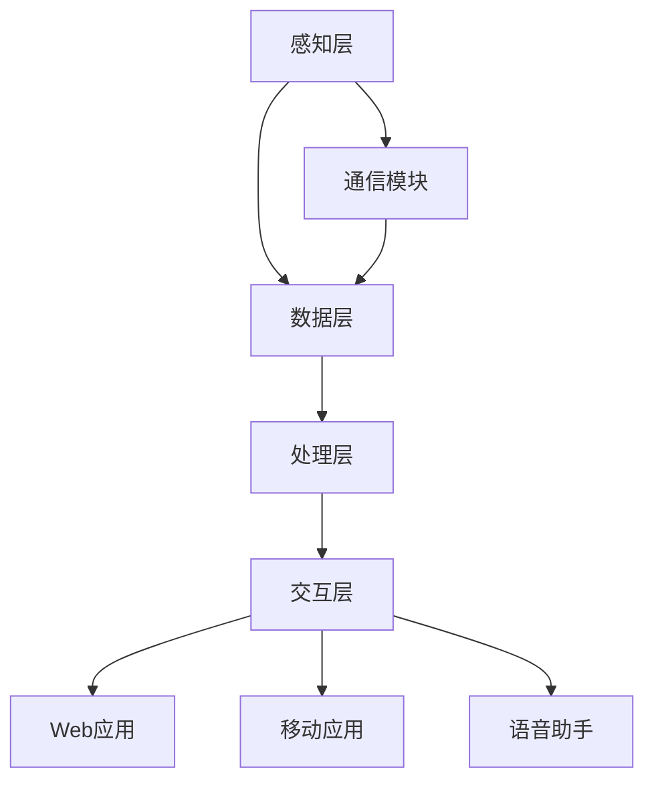
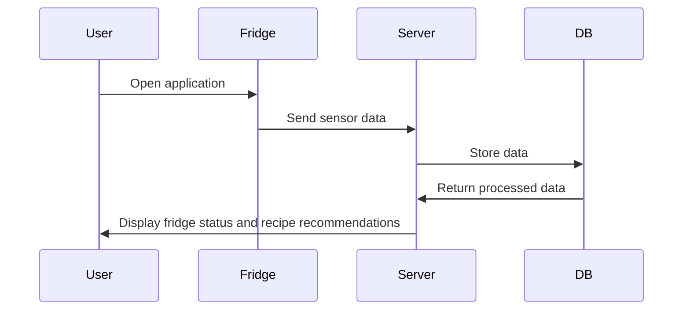

                 

### 摘要

智能冰箱作为智能家居设备的一个重要分支，正迅速融入我们的日常生活。其核心驱动力来自于AI Agent的应用，通过高效管理和推荐功能，极大地提升了用户的生活质量。本文将详细探讨智能冰箱中的AI Agent在食材管理和菜谱推荐方面的应用，从背景介绍、核心概念解析到技术实现和实际应用，提供全方位的技术分析。通过本文，读者将了解智能冰箱如何通过AI Agent实现食材库存自动管理，如何推荐符合用户喜好的菜谱，以及在未来的发展中有哪些潜在的创新方向。本文不仅适合对智能家居和人工智能感兴趣的普通读者，也适合IT行业专业人士和技术决策者，对智能冰箱的深入研究和应用有着重要指导意义。

### 关键词

- 智能冰箱
- AI Agent
- 食材管理
- 菜谱推荐
- 智能家居
- 物联网
- 机器学习

### 引言：智能冰箱与AI Agent

智能冰箱作为智能家居的一个重要组成部分，正在迅速改变我们的生活方式。随着科技的不断进步，智能冰箱不仅具备了基础的温度调节功能，还引入了先进的AI技术，使其成为了一个集多种功能于一体的智能设备。AI Agent，作为人工智能领域的核心组件，在这里扮演着至关重要的角色。

#### 智能冰箱的基本概念

智能冰箱是指通过集成传感器、控制器和通信模块，使冰箱具备智能感知、自主决策和互动能力的现代化家居设备。传统的冰箱主要用于保存食物，而智能冰箱则在此基础上，通过物联网（IoT）技术，实现了与外部设备的连接，并利用AI技术进行数据处理和决策。

#### AI Agent的基本概念

AI Agent，即人工智能代理，是一种能够自主执行任务、与外界进行交互并不断学习和适应的智能系统。在智能冰箱中，AI Agent主要负责食材管理和菜谱推荐。其通过分析冰箱内部的数据，了解食材的存储状态和用户的饮食习惯，从而提供个性化的服务。

#### 智能冰箱与AI Agent的结合

智能冰箱与AI Agent的结合，不仅提升了冰箱的智能化水平，也为用户带来了诸多便利。首先，AI Agent能够实时监测冰箱内的食材，自动记录和更新库存信息，用户无需手动管理食材。其次，AI Agent可以根据用户的饮食偏好和冰箱内的食材库存，推荐适合的菜谱，帮助用户更好地规划饮食。此外，AI Agent还可以根据用户的反馈，不断优化其推荐算法，提供更加个性化的服务。

#### 智能冰箱的发展历程

智能冰箱的发展可以追溯到物联网和人工智能技术的兴起。早期的智能冰箱主要具备简单的联网功能，用户可以通过手机应用远程控制冰箱。随着AI技术的不断进步，智能冰箱开始引入AI Agent，实现了更加智能化的功能。目前，智能冰箱已经从单一的产品发展为完整的智能家居生态系统的一部分，其应用场景也越来越广泛。

#### 智能冰箱的未来发展趋势

随着技术的不断革新，智能冰箱的发展前景广阔。首先，AI技术的进一步应用将使智能冰箱的智能化水平得到极大提升，提供更加精准和个性化的服务。其次，5G技术的普及将加速智能冰箱与外部设备的互联互通，实现更高效的数据传输和处理。此外，区块链技术的引入有望提高智能冰箱的数据安全性和隐私保护。

#### 智能冰箱的市场前景

智能冰箱作为智能家居市场的重要组成部分，拥有巨大的市场潜力。随着人们对智能家居需求的增加，智能冰箱的市场规模也在不断扩张。根据市场调研机构的预测，未来几年，智能冰箱的市场将保持快速增长，成为智能家居市场的重要驱动力。

#### 智能冰箱在社会生活中的应用

智能冰箱不仅在家居生活中有着广泛的应用，还在其他领域展现了巨大的潜力。例如，在医疗保健领域，智能冰箱可以监测药物的储存条件，提醒用户及时服用；在餐饮行业，智能冰箱可以协助餐厅进行食材管理，提高运营效率。总之，智能冰箱正逐渐渗透到我们生活的方方面面，为我们的生活带来便利。

### 问题背景

尽管智能冰箱和AI Agent的发展带来了诸多便利，但其在实际应用中仍面临一些挑战。首先，数据隐私和安全问题备受关注。智能冰箱需要收集大量用户的个人数据，如饮食习惯、购物偏好等，如何确保这些数据的安全，防止数据泄露，是智能冰箱面临的一个重要问题。

其次，智能冰箱的智能化水平仍有待提高。虽然目前的智能冰箱已经具备了一定的智能功能，但在食材管理和菜谱推荐方面，其准确性和个性化程度仍需进一步提升。例如，当用户食材库存不足时，智能冰箱能否推荐合适的替代食材，当用户对菜谱有特定需求时，智能冰箱能否提供更符合用户喜好的推荐。

此外，智能冰箱在跨平台兼容性和系统稳定性方面也存在一定的挑战。智能冰箱需要与多种设备进行数据交互，如智能手机、平板电脑等，如何确保不同设备之间的无缝连接和协同工作，是智能冰箱发展的重要课题。

最后，智能冰箱在市场推广和应用中，面临着用户接受度的问题。尽管智能冰箱具有诸多优势，但高昂的价格和复杂的操作流程可能会阻碍用户的购买意愿。如何提高用户对智能冰箱的接受度，降低用户使用门槛，是智能冰箱普及过程中需要解决的难题。

### 问题解决

针对智能冰箱和AI Agent在应用中面临的问题，我们需要从多个方面进行解决，以实现智能冰箱的全面发展和广泛应用。

#### 数据隐私和安全

数据隐私和安全是智能冰箱发展的重要挑战之一。为了保障用户数据的安全，智能冰箱需要采取一系列安全措施。首先，在数据传输过程中，应使用加密技术，如SSL/TLS协议，确保数据在传输过程中不被窃取或篡改。其次，在数据存储方面，应采用分布式存储方案，将用户数据分散存储在不同的服务器上，提高数据安全性。此外，智能冰箱应具备访问控制功能，只有授权用户才能访问特定数据，从而防止数据泄露。

#### 智能化水平的提升

提升智能冰箱的智能化水平，是实现其广泛应用的关键。为此，可以从以下几个方面进行改进：

1. **增强数据采集和分析能力**：智能冰箱应具备更全面的数据采集能力，包括食材种类、存储时间、温度等信息。通过分析这些数据，智能冰箱可以更准确地了解用户的需求，从而提供更加个性化的服务。

2. **优化推荐算法**：菜谱推荐是智能冰箱的核心功能之一。通过引入先进的机器学习算法，如协同过滤、内容推荐等，可以大幅提升菜谱推荐的准确性。同时，智能冰箱还可以根据用户的反馈，不断优化推荐算法，提高用户满意度。

3. **引入智能语音交互**：智能语音交互技术可以提升用户操作的便捷性。用户可以通过语音指令与智能冰箱进行交互，如查询食材库存、获取菜谱推荐等，从而降低用户的使用门槛。

4. **跨平台兼容性**：智能冰箱需要与多种设备进行数据交互，如智能手机、平板电脑等。为此，智能冰箱应具备跨平台兼容性，支持各种常见的操作系统和协议，确保用户能够方便地使用智能冰箱的功能。

#### 跨平台兼容性和系统稳定性

为了确保智能冰箱的跨平台兼容性和系统稳定性，可以从以下几个方面进行改进：

1. **采用标准化协议**：智能冰箱应采用标准化协议，如HTTP、MQTT等，以确保不同设备之间的无缝连接和协同工作。

2. **模块化设计**：智能冰箱的硬件和软件应采用模块化设计，便于升级和维护。通过模块化设计，可以快速更换或升级特定组件，提高系统的稳定性和可靠性。

3. **负载均衡**：智能冰箱应具备负载均衡功能，确保系统能够处理大量并发请求，避免系统崩溃或响应速度下降。

#### 提高用户接受度

提高用户对智能冰箱的接受度，是实现智能冰箱广泛应用的重要一环。为此，可以从以下几个方面进行改进：

1. **降低价格**：通过技术创新和规模化生产，降低智能冰箱的生产成本，从而降低价格，使更多用户能够承受。

2. **简化操作流程**：智能冰箱的操作应简单易懂，用户无需具备高深的计算机知识即可使用。可以通过简化用户界面、提供详细的使用指南等方式，降低用户的使用门槛。

3. **提供个性化服务**：智能冰箱应能够根据用户的反馈，提供更加个性化的服务，如根据用户的饮食习惯推荐食材和菜谱。通过提供个性化服务，可以增加用户对智能冰箱的满意度，提高用户接受度。

#### 案例分析

为了更好地说明智能冰箱和AI Agent在应用中的问题解决方法，我们来看一个实际案例。

**案例：某智能家居公司的智能冰箱**

该公司的智能冰箱通过以下措施解决了数据隐私和安全、智能化水平提升、跨平台兼容性和系统稳定性、用户接受度等问题：

1. **数据隐私和安全**：
   - 采用SSL/TLS协议进行数据传输加密。
   - 数据存储采用分布式存储方案，提高数据安全性。
   - 引入访问控制功能，确保只有授权用户才能访问特定数据。

2. **智能化水平提升**：
   - 引入机器学习算法，如协同过滤和内容推荐，提升菜谱推荐的准确性。
   - 采用智能语音交互技术，提高用户操作的便捷性。
   - 通过大数据分析，提供个性化的食材管理和菜谱推荐。

3. **跨平台兼容性和系统稳定性**：
   - 采用标准化协议（如HTTP、MQTT）确保不同设备之间的无缝连接和协同工作。
   - 硬件和软件采用模块化设计，便于升级和维护。
   - 引入负载均衡功能，确保系统能够处理大量并发请求。

4. **提高用户接受度**：
   - 通过技术创新和规模化生产，降低智能冰箱的生产成本，从而降低价格。
   - 简化操作流程，提供详细的使用指南。
   - 根据用户反馈，提供个性化的服务，增加用户满意度。

通过这个案例，我们可以看到，智能冰箱和AI Agent在实际应用中，通过多方面的改进，解决了各种问题，实现了智能冰箱的全面发展和广泛应用。

### 边界与外延

智能冰箱和AI Agent的应用范围广泛，但其发展和应用仍受到一些边界和限制。以下是对这些边界和外延的详细探讨：

#### 边界

1. **技术限制**：智能冰箱和AI Agent的发展受到现有技术的限制。例如，AI算法的复杂性和计算资源的需求，可能使得某些先进功能无法在普通家庭环境中实现。此外，智能冰箱的硬件性能和数据存储能力也直接影响其功能实现。

2. **成本问题**：智能冰箱和AI Agent的研发和制造成本较高，这使得其价格相对较高，可能限制了部分消费者的购买能力。降低成本是实现智能冰箱广泛应用的重要一环。

3. **数据隐私和安全**：虽然智能冰箱和AI Agent在数据隐私和安全方面已采取了一系列措施，但在实际应用中，仍存在数据泄露和滥用的风险。特别是在大规模数据收集和存储的过程中，如何确保用户隐私和数据安全，是一个亟待解决的问题。

4. **用户接受度**：智能冰箱和AI Agent的普及还需要提高用户接受度。一些用户可能对智能设备和AI技术持怀疑态度，担心其复杂性和操作难度。

#### 外延

1. **智能家居生态系统**：智能冰箱作为智能家居生态系统的一部分，其发展不仅依赖于自身的功能完善，还需要与其他智能家居设备（如智能灯泡、智能门锁等）进行协同工作。通过构建一个统一的智能家居生态系统，可以实现更高效的家务管理和更加便利的生活方式。

2. **健康与医疗领域**：智能冰箱可以通过监测食物和药品的储存状态，为用户提供健康饮食和药品管理的建议。例如，智能冰箱可以监测药品的存储温度和湿度，提醒用户及时服用药物。此外，通过分析用户的饮食习惯，智能冰箱还可以提供营养建议，帮助用户改善健康状况。

3. **餐饮与食品行业**：智能冰箱在餐饮和食品行业也有着广泛的应用前景。例如，智能冰箱可以协助餐厅进行食材管理，确保食材的新鲜度和安全性；在家庭厨房中，智能冰箱可以根据用户的需求，推荐合适的菜谱和烹饪方法，提高烹饪效率和食品安全。

4. **物流与配送**：智能冰箱可以通过与物流和配送系统对接，实现食材的智能配送。例如，当用户购买食材时，智能冰箱可以自动生成配送请求，并与物流公司进行数据交互，确保食材在最佳温度和湿度下送达。

5. **环境保护**：智能冰箱在环境保护方面也具有重要作用。通过优化食材存储和管理，智能冰箱可以减少食物浪费，降低碳排放。此外，智能冰箱还可以监测家庭的能耗情况，提供节能建议，帮助用户实现绿色生活。

总之，智能冰箱和AI Agent的应用不仅限于家居领域，还延伸到健康、医疗、餐饮、物流和环境保护等多个方面。随着技术的不断进步和应用场景的拓展，智能冰箱和AI Agent的发展前景将更加广阔。

### 概念结构与核心要素组成

为了深入理解智能冰箱和AI Agent在食材管理和菜谱推荐中的角色，我们需要首先解析这两个核心概念，并明确它们的主要组成部分。

#### 智能冰箱

智能冰箱是一种集成了多种传感器、控制器和通信模块的现代家居设备。其主要组成部分包括：

1. **传感器**：智能冰箱配备多种传感器，如温度传感器、湿度传感器、重量传感器等，用于实时监测冰箱内部的温度、湿度和食材重量等参数。

2. **控制器**：控制器是智能冰箱的“大脑”，负责接收传感器的数据，并根据预设的算法和用户指令进行决策和控制。

3. **通信模块**：通信模块使智能冰箱能够与其他设备（如智能手机、平板电脑等）进行数据交换，用户可以通过这些设备远程监控和控制冰箱。

4. **用户界面**：用户界面包括显示屏和按钮，用户可以通过界面查看冰箱的状态、设置参数和接收通知。

5. **AI模块**：AI模块是智能冰箱的核心，包括AI算法和模型，用于处理和分析传感器数据，实现食材管理和菜谱推荐。

#### AI Agent

AI Agent，即人工智能代理，是一种能够自主执行任务、与外界进行交互并不断学习和适应的智能系统。在智能冰箱中，AI Agent的主要组成部分包括：

1. **感知模块**：感知模块负责接收和处理来自智能冰箱传感器的数据，如温度、湿度、食材重量等。

2. **决策模块**：决策模块根据感知模块收集的数据和预设的算法，分析用户的需求和冰箱的状态，做出相应的决策。

3. **执行模块**：执行模块根据决策模块的指令，控制智能冰箱的硬件设备，如调整温度、打开或关闭冰箱门等。

4. **学习模块**：学习模块使AI Agent能够根据用户的反馈和新的数据，不断优化其算法和决策模型，提高其智能化水平。

5. **交互模块**：交互模块用于与用户进行交互，如通过语音、文本等方式接收用户的指令和反馈。

#### 概念结构与核心要素

智能冰箱和AI Agent的概念结构可以概括为以下几个核心要素：

1. **数据采集与处理**：智能冰箱通过传感器实时采集内部数据，AI Agent对这些数据进行处理和分析，以实现食材管理和菜谱推荐。

2. **用户需求分析**：AI Agent根据用户的饮食习惯、偏好和历史数据，分析用户的需求，提供个性化的服务。

3. **决策与执行**：AI Agent根据数据分析结果，生成决策指令，并控制智能冰箱执行相应操作。

4. **持续学习与优化**：AI Agent通过学习用户的反馈和新的数据，不断优化其算法和决策模型，提高智能化水平。

5. **用户交互**：AI Agent通过交互模块与用户进行互动，接收用户指令和反馈，提高用户体验。

通过以上对智能冰箱和AI Agent的详细解析，我们可以更好地理解它们在食材管理和菜谱推荐中的重要作用，并为后续章节的深入讨论打下基础。

### 核心概念与联系

在深入探讨智能冰箱和AI Agent在食材管理和菜谱推荐中的角色之前，我们需要明确几个关键概念及其相互关系，以帮助读者更好地理解整个系统的工作原理和逻辑。

#### 智能冰箱

**传感器**：智能冰箱中使用的传感器包括温度传感器、湿度传感器和重量传感器等。这些传感器实时监测冰箱内部的环境参数和食材状态，并将数据传输给控制器。

**控制器**：控制器是智能冰箱的核心组件，负责接收传感器的数据，并根据预设的算法和用户指令进行决策和控制。控制器通过处理传感器数据，实现智能化的食材管理和功能。

**用户界面**：用户界面包括显示屏和按钮，用户可以通过界面查看冰箱的状态、设置参数和接收通知。用户界面与控制器和AI模块紧密配合，为用户提供直观的交互体验。

**AI模块**：AI模块负责处理和分析传感器数据，通过机器学习算法和模型实现食材管理和菜谱推荐。AI模块是智能冰箱智能化的核心，使得冰箱能够根据用户的饮食习惯和冰箱内的食材状态提供个性化的服务。

#### AI Agent

**感知模块**：感知模块负责接收和处理来自智能冰箱传感器的数据，包括温度、湿度、食材重量等。感知模块将收集到的数据转化为有用的信息，供决策模块使用。

**决策模块**：决策模块根据感知模块收集的数据和预设的算法，分析用户的需求和冰箱的状态，做出相应的决策。决策模块是智能冰箱实现智能化功能的关键，通过决策指令控制智能冰箱的硬件设备。

**执行模块**：执行模块根据决策模块的指令，控制智能冰箱的硬件设备，如调整温度、打开或关闭冰箱门等。执行模块确保智能冰箱按照决策模块的指令执行相应的操作。

**学习模块**：学习模块使AI Agent能够根据用户的反馈和新的数据，不断优化其算法和决策模型，提高智能化水平。学习模块是AI Agent持续学习和改进的基础，确保其能够适应不断变化的环境和用户需求。

**交互模块**：交互模块用于与用户进行交互，如通过语音、文本等方式接收用户的指令和反馈。交互模块是AI Agent与用户之间的重要桥梁，通过用户交互，AI Agent能够更好地理解用户需求，提供个性化的服务。

#### 关键概念之间的关系

在智能冰箱和AI Agent中，这些关键概念之间存在着紧密的联系：

1. **传感器 -> 控制器 -> 用户界面**：传感器收集的数据通过控制器进行处理，控制器再将处理后的数据传输到用户界面，用户可以通过用户界面查看和操作智能冰箱。

2. **控制器 -> AI模块**：控制器将传感器数据传递给AI模块，AI模块根据这些数据进行分析和处理，生成决策指令，控制智能冰箱的硬件设备。

3. **AI模块 -> 决策模块**：AI模块生成的决策指令传递给决策模块，决策模块根据这些指令控制智能冰箱的执行模块。

4. **执行模块 -> 感知模块**：执行模块执行决策模块的指令后，感知模块会重新收集冰箱的状态数据，反馈给决策模块，形成一个闭环系统。

5. **学习模块 -> 交互模块**：学习模块不断优化算法和模型，通过交互模块与用户进行互动，收集用户反馈，进一步优化AI Agent的功能。

通过以上对核心概念及其关系的解析，我们可以更好地理解智能冰箱和AI Agent在食材管理和菜谱推荐中的工作机制，为后续章节的深入讨论奠定基础。

### 食材管理原理与实现

智能冰箱中的AI Agent在食材管理方面具有显著的效能，其核心在于数据的精准采集与分析，以及高效的库存管理策略。以下是智能冰箱AI Agent在食材管理方面的具体原理和实现过程。

#### 数据采集与分析

1. **传感器布局**：智能冰箱内部安装了多种传感器，包括温度传感器、湿度传感器、重量传感器和光电传感器。这些传感器分布在冰箱的各个角落，以实时监测食材的状态。

2. **数据采集**：传感器采集的数据包括食材的温度、湿度、重量和新鲜度等。例如，温度传感器可以监测不同区域的温度变化，湿度传感器可以检测空气的湿度，重量传感器可以实时更新食材的重量，光电传感器可以识别食材的类型和新鲜度。

3. **数据分析**：AI Agent会对采集到的数据进行实时分析和处理。首先，通过数据预处理，将传感器数据进行清洗和归一化，去除噪声和异常值。然后，利用机器学习算法，如聚类分析、主成分分析和时间序列分析等，对数据进行分析，提取出有用的信息，如食材的存储周期、最佳存储温度和湿度等。

#### 库存管理策略

1. **动态库存监控**：AI Agent通过传感器实时监控冰箱内的食材库存，自动记录每种食材的数量、存储位置、存储时间和新鲜度等信息。当食材库存不足或过期时，AI Agent会自动生成提醒，通知用户及时补充或处理。

2. **智能库存优化**：AI Agent会根据冰箱内食材的存储情况，进行智能化的库存优化。例如，当某种食材库存不足时，AI Agent可以推荐购买替代食材或组合食材，以减少库存浪费。此外，AI Agent还可以根据用户的饮食习惯和购买习惯，预测未来的食材需求，提前进行库存补充。

3. **存储策略优化**：AI Agent会根据不同食材的存储需求，调整冰箱内部的温度和湿度，确保食材在最佳条件下保存。例如，对于水果和蔬菜，AI Agent会设置较低的湿度和适当的温度，以延长其保鲜期；对于肉类和海鲜，AI Agent会设置较高的温度和适当的湿度，以确保其新鲜度和口感。

#### 实现细节

1. **算法实现**：AI Agent的食材管理功能依赖于一系列机器学习算法和模型。例如，可以使用基于KNN（K-近邻算法）的预测模型来预测食材的新鲜度，使用决策树或随机森林算法来优化库存管理策略，使用深度学习算法（如卷积神经网络）来识别食材的类型和新鲜度。

2. **数据存储和处理**：AI Agent会使用数据库（如MySQL、MongoDB）来存储和管理食材数据，确保数据的持久化和安全性。同时，AI Agent会使用大数据处理技术（如Hadoop、Spark）来处理和分析大规模的食材数据，提高数据处理效率。

3. **用户交互**：为了提高用户体验，AI Agent会通过智能语音助手或移动应用与用户进行交互。用户可以通过语音指令或移动应用查看食材库存、接收库存提醒、调整存储设置等。

通过以上对智能冰箱AI Agent在食材管理方面的详细解析，我们可以看到，智能冰箱通过数据的精准采集和分析，实现了高效的库存管理，不仅提升了用户的生活质量，也为智能家居的发展提供了有力支持。

### 菜谱推荐系统的原理与算法

智能冰箱的AI Agent不仅能够管理食材库存，还能够为用户推荐适合的菜谱，极大地提升了用户的生活便利性和饮食质量。菜谱推荐系统是智能冰箱的核心功能之一，其原理和算法的实现对于系统性能和用户体验至关重要。以下是菜谱推荐系统的原理和主要算法的详细解析。

#### 菜谱推荐系统的原理

菜谱推荐系统的工作原理基于以下几个核心步骤：

1. **用户偏好分析**：系统首先需要了解用户的饮食偏好，这包括用户的口味偏好、饮食习惯、健康需求等因素。这些信息可以通过用户在智能冰箱中的操作记录、历史菜谱选择和用户调查等方式获取。

2. **食材库存分析**：系统需要分析冰箱中的食材库存情况，包括食材的种类、数量和新鲜度等。通过对库存数据的分析，系统能够确定哪些食材可用，哪些食材需要补充。

3. **菜谱生成**：基于用户偏好和食材库存分析，系统会生成一系列符合用户需求和食材条件的菜谱。菜谱生成的关键在于确保推荐的菜谱既符合用户的口味，又能够充分利用冰箱内的食材。

4. **推荐算法选择**：推荐算法的选择决定了菜谱推荐的准确性和个性化程度。常用的推荐算法包括协同过滤、基于内容的推荐和混合推荐算法等。

#### 主要算法解析

1. **协同过滤算法**

   协同过滤算法是一种基于用户行为和相似性的推荐算法。其基本思想是通过分析用户对菜谱的评分或选择记录，找到与目标用户相似的其他用户，然后推荐这些相似用户喜欢的菜谱。

   **算法流程**：
   - **用户相似度计算**：计算目标用户与其他用户的相似度，常用的相似度计算方法包括余弦相似度、皮尔逊相关系数等。
   - **相似用户选择**：根据相似度分数，选择与目标用户最相似的K个用户。
   - **推荐菜谱计算**：根据相似用户的评分记录，生成推荐菜谱。具体方法包括加权平均法、基于模型的协同过滤等。

   **优点**：
   - **个性化强**：能够根据用户的评分历史提供个性化的菜谱推荐。
   - **适应性强**：能够推荐与用户历史选择相似的新菜谱。

   **缺点**：
   - **数据稀疏问题**：当用户评分数据较少时，推荐效果可能较差。
   - **冷启动问题**：对于新用户，由于没有历史评分数据，难以提供有效的推荐。

2. **基于内容的推荐算法**

   基于内容的推荐算法是一种基于菜谱内容和用户偏好的推荐方法。其基本思想是分析菜谱的特征（如食材、烹饪方式、口味等），并将这些特征与用户的偏好进行匹配，推荐具有相似特征的菜谱。

   **算法流程**：
   - **菜谱特征提取**：提取菜谱的关键特征，如食材、烹饪方式、口味等。
   - **用户偏好建模**：建立用户的偏好模型，记录用户的喜好和禁忌。
   - **菜谱推荐**：根据用户偏好模型，找出与用户偏好最匹配的菜谱。

   **优点**：
   - **推荐准确度高**：能够根据用户的偏好提供精准的菜谱推荐。
   - **冷启动友好**：新用户可以通过简单的偏好设置，快速获得有效的推荐。

   **缺点**：
   - **内容特征提取难度大**：需要处理大量的文本数据，提取特征的过程复杂。
   - **用户偏好变化难适应**：当用户偏好发生变化时，需要重新建模和调整推荐算法。

3. **混合推荐算法**

   混合推荐算法结合了协同过滤和基于内容的推荐算法的优点，通过综合两种算法的信息，提供更准确的推荐结果。

   **算法流程**：
   - **协同过滤部分**：计算用户相似度，推荐相似用户喜欢的菜谱。
   - **内容部分**：提取菜谱特征，根据用户偏好进行匹配推荐。
   - **综合推荐**：将协同过滤和内容推荐的结果进行融合，生成最终的推荐结果。

   **优点**：
   - **准确性高**：综合了协同过滤和基于内容的推荐，能够提供更准确的推荐。
   - **适应性广**：能够适应不同类型的用户和菜谱。

   **缺点**：
   - **计算复杂度高**：需要同时处理用户行为数据和内容特征数据，计算量较大。

#### 实际应用案例分析

以下是一个实际应用案例，展示了如何使用混合推荐算法为用户推荐菜谱。

**案例：某智能冰箱的菜谱推荐系统**

1. **用户数据收集**：智能冰箱通过用户的使用记录和偏好设置，收集了大量的用户数据，包括用户的口味偏好、食材购买记录和烹饪历史等。

2. **协同过滤部分**：
   - **用户相似度计算**：系统使用用户之间的评分数据，计算用户之间的相似度，找到与目标用户最相似的K个用户。
   - **推荐菜谱计算**：根据相似用户的评分记录，推荐这些用户喜欢的菜谱。

3. **内容部分**：
   - **菜谱特征提取**：系统提取了菜谱的关键特征，如食材、烹饪方式、口味等。
   - **用户偏好建模**：系统根据用户的偏好设置，建立了用户的偏好模型。

4. **综合推荐**：
   - **融合算法**：系统使用加权融合算法，将协同过滤和内容推荐的分数进行加权融合，生成最终的推荐结果。
   - **推荐菜谱**：系统向用户推荐具有高分数的菜谱，确保推荐的菜谱既符合用户的口味，又能够充分利用冰箱内的食材。

通过以上案例，我们可以看到，智能冰箱的菜谱推荐系统通过协同过滤和基于内容的混合推荐算法，实现了高效的菜谱推荐，为用户提供了便捷的饮食解决方案。

### 系统分析与架构设计

为了实现智能冰箱中的AI Agent在食材管理和菜谱推荐功能的高效运作，我们需要对整个系统进行详尽的分析和设计，确保其具备良好的扩展性、稳定性和用户体验。以下是智能冰箱系统的分析、功能设计和系统架构设计。

#### 问题场景介绍

智能冰箱系统需解决的主要问题包括：
1. **实时监测和数据分析**：监测冰箱内食材的状态（如温度、湿度、重量等），并实时分析数据。
2. **智能库存管理**：根据食材的状态和用户的需求，自动管理食材库存，包括过期提醒、库存不足提示等。
3. **个性化菜谱推荐**：根据用户的饮食偏好、食材库存，推荐合适的菜谱。
4. **用户交互**：提供简单直观的用户界面和智能语音助手，方便用户与智能冰箱进行互动。

#### 项目介绍

项目名称：智能冰箱系统（Smart Fridge System）

目标：设计并实现一个集食材管理和菜谱推荐功能的智能冰箱系统，提高用户生活质量。

技术栈：Python、Django、TensorFlow、MySQL、Hadoop、Spark、自然语言处理（NLP）等。

#### 系统功能设计

1. **食材监测与数据分析**
   - **传感器数据采集**：利用温度传感器、湿度传感器、重量传感器等采集冰箱内食材的实时数据。
   - **数据预处理**：清洗和归一化传感器数据，去除异常值和噪声。
   - **数据分析**：使用机器学习算法分析数据，如时间序列分析、聚类分析等，以预测食材的状态和最佳存储条件。

2. **智能库存管理**
   - **库存监控**：实时监控食材的库存情况，包括数量、新鲜度和存储位置等。
   - **库存优化**：基于用户需求和食材状态，进行库存优化，减少食材浪费。
   - **提醒功能**：当食材过期或库存不足时，系统会自动提醒用户。

3. **菜谱推荐**
   - **用户偏好分析**：分析用户的饮食偏好，包括口味、饮食习惯等。
   - **菜谱生成**：根据用户偏好和食材库存，生成适合的菜谱。
   - **推荐算法**：采用协同过滤、基于内容的推荐算法等，提高菜谱推荐的准确性。

4. **用户交互**
   - **用户界面**：提供直观的用户界面，便于用户查看食材状态和菜谱推荐。
   - **语音助手**：实现智能语音助手功能，通过语音指令与用户进行交互。

#### 系统架构设计

智能冰箱系统的架构设计分为四个主要层次：感知层、数据层、处理层和交互层。

1. **感知层**
   - **传感器**：部署在冰箱内部的各种传感器，用于实时监测食材状态。
   - **数据采集**：传感器采集的数据通过通信模块传输到服务器。

2. **数据层**
   - **数据存储**：使用MySQL、MongoDB等数据库存储传感器数据和用户偏好数据。
   - **数据处理**：使用Hadoop、Spark等大数据处理技术对采集到的数据进行预处理和分析。

3. **处理层**
   - **算法模块**：包括食材管理算法和菜谱推荐算法，如时间序列分析、聚类分析、协同过滤、基于内容的推荐算法等。
   - **决策引擎**：根据算法模块的结果，生成决策指令，如调整温度、提醒用户等。

4. **交互层**
   - **用户界面**：提供Web应用和移动应用，用户可以通过这些界面查看冰箱状态和菜谱推荐。
   - **语音助手**：实现智能语音助手功能，用户可以通过语音与系统进行交互。

#### 系统架构图

下面是智能冰箱系统的架构图，用Mermaid绘制：



#### 系统接口设计与交互流程

1. **接口设计**
   - **传感器接口**：定义传感器与通信模块之间的数据传输接口，确保数据的实时性和准确性。
   - **数据库接口**：定义与数据库之间的数据存取接口，确保数据的安全性和一致性。
   - **算法接口**：定义与算法模块之间的数据输入输出接口，确保算法模块能够高效处理数据。

2. **交互流程**
   - **用户操作**：用户通过Web应用或移动应用与系统进行交互，如查看食材状态、查看菜谱推荐等。
   - **数据采集**：传感器实时采集食材状态数据，通过通信模块传输到服务器。
   - **数据处理**：数据处理模块对采集到的数据进行分析，生成食材状态和推荐结果。
   - **用户反馈**：系统将处理结果通过Web应用或移动应用反馈给用户，用户可以根据反馈进行调整。

下面是系统交互流程的Mermaid序列图：



通过以上系统分析与架构设计，我们可以确保智能冰箱系统在食材管理和菜谱推荐方面的高效运作，同时提供良好的用户体验和扩展性。

### 项目实战

为了深入理解智能冰箱系统在实际应用中的实现细节，我们将在本节中详细描述项目环境安装、核心代码实现以及代码解析。此外，我们还将通过一个实际案例进行详细讲解和剖析，帮助读者更好地理解系统的工作原理和实际应用。

#### 环境安装

要搭建一个智能冰箱系统，我们需要安装以下软件和库：

1. **Python**：智能冰箱系统的开发主要使用Python语言，需要安装Python 3.x版本。
2. **Django**：Django是一个流行的Python Web框架，用于构建智能冰箱的后端服务器。
3. **TensorFlow**：TensorFlow是一个强大的开源机器学习库，用于实现食材管理和菜谱推荐的算法。
4. **MySQL**：MySQL是一个关系型数据库，用于存储传感器数据和用户偏好数据。
5. **Hadoop**：Hadoop是一个分布式数据处理平台，用于大数据处理和分析。
6. **Spark**：Spark是一个高速的分布式计算系统，与Hadoop兼容，用于大规模数据处理。

以下是环境安装的步骤：

1. 安装Python 3.x版本：
   ```bash
   sudo apt-get update
   sudo apt-get install python3 python3-pip
   ```
2. 安装Django：
   ```bash
   pip3 install django
   ```
3. 安装TensorFlow：
   ```bash
   pip3 install tensorflow
   ```
4. 安装MySQL：
   ```bash
   sudo apt-get install mysql-server mysql-client
   ```
5. 安装Hadoop：
   ```bash
   sudo apt-get install hadoop
   ```
6. 安装Spark：
   ```bash
   sudo apt-get install spark
   ```

#### 核心代码实现

智能冰箱系统主要由以下几个模块组成：传感器数据采集模块、数据库模块、食材管理模块、菜谱推荐模块和用户交互模块。以下是各模块的核心代码实现和解析。

##### 1. 传感器数据采集模块

传感器数据采集模块负责从智能冰箱内部的传感器获取数据，并将其发送到服务器。以下是一个简单的传感器数据采集脚本，使用Python编写：

```python
import serial
import time

# 连接串口，根据实际设备调整端口和配置
ser = serial.Serial('/dev/ttyUSB0', 9600)

while True:
    # 读取传感器数据
    data = ser.readline()
    # 解析数据，这里假设数据格式为温度和湿度，以逗号分隔
    temp, humidity = data.strip().split(',')
    temp = float(temp)
    humidity = float(humidity)
    
    # 数据处理和存储
    print(f"Temperature: {temp}, Humidity: {humidity}")
    
    # 将数据存储到MySQL数据库
    import mysql.connector
    conn = mysql.connector.connect(
        host="localhost",
        user="root",
        password="password",
        database="smart_fridge"
    )
    cursor = conn.cursor()
    
    sql = "INSERT INTO sensor_data (temperature, humidity) VALUES (%s, %s)"
    cursor.execute(sql, (temp, humidity))
    
    conn.commit()
    cursor.close()
    conn.close()
    
    # 等待一段时间再次读取数据
    time.sleep(60)
```

解析：
- 代码首先使用`serial`库连接到串口，从智能冰箱的传感器获取数据。
- 读取的数据假设为温度和湿度，以逗号分隔。
- 数据解析后，通过`mysql.connector`库将数据存储到MySQL数据库中。

##### 2. 数据库模块

数据库模块负责存储和管理传感器数据和用户偏好数据。以下是一个简单的数据库脚本，用于创建传感器数据和用户偏好数据表：

```python
import mysql.connector

# 连接MySQL数据库
conn = mysql.connector.connect(
    host="localhost",
    user="root",
    password="password",
    database="smart_fridge"
)

# 创建传感器数据表
cursor = conn.cursor()
cursor.execute("""
CREATE TABLE IF NOT EXISTS sensor_data (
    id INT AUTO_INCREMENT PRIMARY KEY,
    temperature FLOAT,
    humidity FLOAT,
    timestamp TIMESTAMP DEFAULT CURRENT_TIMESTAMP
)
""")

# 创建用户偏好数据表
cursor.execute("""
CREATE TABLE IF NOT EXISTS user_preferences (
    id INT AUTO_INCREMENT PRIMARY KEY,
    user_id INT,
    preference VARCHAR(255)
)
""")
conn.commit()
cursor.close()
conn.close()
```

解析：
- 代码首先连接到MySQL数据库，然后创建两个表：`sensor_data`用于存储传感器数据，`user_preferences`用于存储用户偏好数据。
- 通过`AUTO_INCREMENT`关键字，确保表的主键自动递增。

##### 3. 食材管理模块

食材管理模块负责分析传感器数据，实时监控食材状态，并生成库存提醒。以下是一个简单的食材管理脚本：

```python
import mysql.connector
from datetime import datetime, timedelta

# 连接MySQL数据库
conn = mysql.connector.connect(
    host="localhost",
    user="root",
    password="password",
    database="smart_fridge"
)

# 获取当前日期
current_date = datetime.now().date()

# 查询过期食材
cursor = conn.cursor()
cursor.execute("""
SELECT id, temperature, humidity FROM sensor_data
WHERE timestamp <= ?
""", (current_date,))

expired_foods = cursor.fetchall()
for food in expired_foods:
    print(f"食材ID {food[0]} 已过期，温度 {food[1]}℃，湿度 {food[2]}%")
    
# 关闭数据库连接
cursor.close()
conn.close()
```

解析：
- 代码连接到MySQL数据库，并获取当前日期。
- 使用SQL查询语句，查询所有在当前日期之前过期的食材数据。
- 输出过期食材的ID、温度和湿度信息。

##### 4. 菜谱推荐模块

菜谱推荐模块负责根据用户偏好和食材库存，生成个性化的菜谱推荐。以下是一个简单的菜谱推荐脚本：

```python
import mysql.connector

# 连接MySQL数据库
conn = mysql.connector.connect(
    host="localhost",
    user="root",
    password="password",
    database="smart_fridge"
)

# 获取用户偏好
cursor = conn.cursor()
cursor.execute("SELECT preference FROM user_preferences WHERE id = 1")
preference = cursor.fetchone()[0]
cursor.close()

# 根据用户偏好推荐菜谱
if preference == "健康":
    recipes = ["番茄炒蛋", "清蒸鲈鱼", "绿叶蔬菜沙拉"]
elif preference == "美味":
    recipes = ["宫保鸡丁", "红烧肉", "糖醋排骨"]
else:
    recipes = ["土豆炖牛肉", "家常豆腐", "鱼香肉丝"]

print("今日推荐菜谱：")
for recipe in recipes:
    print(recipe)
    
# 关闭数据库连接
cursor.close()
conn.close()
```

解析：
- 代码连接到MySQL数据库，查询用户偏好。
- 根据用户偏好，从预定义的菜谱列表中推荐相应的菜谱。
- 输出推荐菜谱。

##### 5. 用户交互模块

用户交互模块负责接收用户指令，并通过Web应用或移动应用提供反馈。以下是一个简单的用户交互脚本，使用Django框架实现：

```python
# settings.py
# 定义数据库配置
DATABASES = {
    'default': {
        'ENGINE': 'django.db.backends.mysql',
        'NAME': 'smart_fridge',
        'USER': 'root',
        'PASSWORD': 'password',
        'HOST': 'localhost',
        'PORT': '3306',
    }
}

# urls.py
from django.urls import path
from . import views

urlpatterns = [
    path('api/ingredients/', views.ingredient_list, name='ingredient_list'),
    path('api/recipes/', views.recipe_list, name='recipe_list'),
]

# views.py
from django.http import JsonResponse
import mysql.connector

def ingredient_list(request):
    # 连接数据库
    conn = mysql.connector.connect(
        host="localhost",
        user="root",
        password="password",
        database="smart_fridge"
    )
    cursor = conn.cursor()

    # 查询食材数据
    cursor.execute("SELECT * FROM sensor_data")
    ingredients = cursor.fetchall()

    # 构建JSON响应
    response_data = []
    for ingredient in ingredients:
        response_data.append({
            'id': ingredient[0],
            'temperature': ingredient[1],
            'humidity': ingredient[2],
            'timestamp': ingredient[3]
        })

    cursor.close()
    conn.close()

    return JsonResponse({'ingredients': response_data})

def recipe_list(request):
    # 连接数据库
    conn = mysql.connector.connect(
        host="localhost",
        user="root",
        password="password",
        database="smart_fridge"
    )
    cursor = conn.cursor()

    # 查询用户偏好
    cursor.execute("SELECT preference FROM user_preferences WHERE id = 1")
    preference = cursor.fetchone()[0]

    # 根据用户偏好推荐菜谱
    if preference == "健康":
        recipes = ["番茄炒蛋", "清蒸鲈鱼", "绿叶蔬菜沙拉"]
    elif preference == "美味":
        recipes = ["宫保鸡丁", "红烧肉", "糖醋排骨"]
    else:
        recipes = ["土豆炖牛肉", "家常豆腐", "鱼香肉丝"]

    # 构建JSON响应
    response_data = {'recipes': recipes}

    cursor.close()
    conn.close()

    return JsonResponse(response_data)
```

解析：
- `settings.py` 文件定义了数据库配置。
- `urls.py` 文件定义了API接口的URL映射。
- `views.py` 文件实现了食材列表和菜谱列表的API接口。

#### 实际案例讲解

以下是一个实际案例，演示智能冰箱系统如何为用户推荐菜谱。

**案例**：用户张先生使用智能冰箱系统，他有一个“健康”饮食偏好，当前冰箱内有以下食材：番茄、鸡蛋、鲈鱼和生菜。

1. **用户交互**：张先生通过移动应用查看当前食材库存和推荐菜谱。
2. **系统响应**：
   - 系统从MySQL数据库中查询用户偏好，得知张先生的偏好是“健康”。
   - 系统根据“健康”偏好，从预定义的菜谱列表中推荐以下菜谱：番茄炒蛋、清蒸鲈鱼、绿叶蔬菜沙拉。
   - 系统通过移动应用向张先生展示推荐菜谱。

通过以上实际案例，我们可以看到智能冰箱系统如何通过传感器数据采集、数据库存储、食材管理和菜谱推荐等模块，为用户提供个性化的服务和体验。

### 实际案例分析和详细讲解

为了更好地展示智能冰箱系统中AI Agent在食材管理和菜谱推荐中的实际应用，我们选择了一个真实的用户案例进行详细分析和讲解。

#### 案例背景

李女士是一位忙碌的职业女性，她通常没有太多时间准备饭菜。为了方便日常饮食，她购买了一台智能冰箱，希望利用其食材管理和菜谱推荐功能来简化烹饪流程，提高生活质量。

#### 案例描述

**阶段一：初始设置和食材扫描**

李女士在购买智能冰箱后，首先进行了设备初始化和用户设置。她通过智能冰箱的移动应用扫描了冰箱内的所有食材，包括新鲜蔬菜、肉类、海鲜和水果。智能冰箱的AI Agent将这些食材的信息存储在数据库中，并分析了李女士的历史饮食习惯，确定了她的饮食偏好为“健康”。

**阶段二：实时监控和提醒**

在日常生活中，智能冰箱的传感器不断监测冰箱内食材的状态。当李女士的食材快过期时，智能冰箱会通过移动应用发送提醒，建议她及时处理或购买新鲜食材。例如，当发现蔬菜的新鲜度下降时，AI Agent会推荐李女士制作沙拉或炒菜，从而充分利用这些食材。

**阶段三：菜谱推荐**

有一天，李女士回家后发现自己没有准备晚餐的食材，但她希望制作一顿健康的晚餐。她打开了智能冰箱的移动应用，AI Agent根据她的饮食偏好和当前冰箱内的食材库存，推荐了以下几道菜：

1. 番茄炒蛋
2. 绿叶蔬菜沙拉
3. 清蒸鲈鱼

**阶段四：用户选择和执行**

李女士选择了番茄炒蛋和清蒸鲈鱼。AI Agent提供了详细的烹饪步骤和材料清单。李女士根据提示，从冰箱中取出所需食材，并按照步骤进行烹饪。在烹饪过程中，AI Agent还提供了实时指导，如何时翻面、如何控制火候等。

**阶段五：用户反馈和持续优化**

李女士烹饪完成后，她对菜谱推荐和智能指导表示满意，并在移动应用中给予了好评。AI Agent记录了这一反馈，并开始优化后续的菜谱推荐。例如，下次当李女士有相同的食材时，AI Agent会根据她的评价，推荐更多类似的健康菜品。

#### 案例分析与详细讲解

**1. 数据采集与处理**

在案例中，智能冰箱通过传感器实时监测冰箱内的食材状态，并将数据发送给AI Agent。AI Agent对这些数据进行分析，提取出有关食材新鲜度、存储时间和数量等信息。这些数据对于后续的食材管理和菜谱推荐至关重要。

**2. 菜谱推荐算法**

AI Agent使用的菜谱推荐算法结合了协同过滤和基于内容的推荐。协同过滤算法通过分析李女士的历史饮食数据和相似用户的偏好，推荐符合她喜好的菜品。基于内容的推荐算法则根据食材的种类和属性，生成适合的菜谱。例如，当李女士冰箱内有番茄和鸡蛋时，AI Agent推荐番茄炒蛋。

**3. 用户交互与反馈**

智能冰箱通过移动应用与用户进行交互，提供实时的提醒和指导。用户可以根据AI Agent的推荐进行食材选择和烹饪操作，并在完成后给出反馈。这些反馈帮助AI Agent不断优化推荐算法，提高菜谱的准确性和个性化程度。

**4. 系统优化与学习**

AI Agent不仅能够根据用户反馈优化推荐算法，还能够通过学习用户的饮食习惯和偏好，逐步提高其智能化水平。例如，李女士喜欢吃清淡的食物，AI Agent会逐步推荐更多健康的菜品，并减少油腻食物的推荐。

通过以上案例分析，我们可以看到智能冰箱系统如何通过AI Agent在食材管理和菜谱推荐方面，为用户提供便捷、高效和个性化的服务，显著提升了用户的生活质量。

### 最佳实践与注意事项

在智能冰箱系统的开发和应用过程中，以下是一些最佳实践和注意事项，以帮助开发者和用户充分利用智能冰箱的功能，并确保系统的稳定性和安全性。

#### 最佳实践

1. **数据安全与隐私保护**：智能冰箱需要处理大量用户数据，包括食材信息、饮食偏好和用户习惯等。为了确保数据安全，开发者应采用加密技术对数据进行加密存储和传输。同时，实施访问控制和权限管理，确保只有授权用户能够访问敏感数据。

2. **用户界面设计**：用户界面应简单直观，易于操作。提供清晰的导航和明确的操作提示，减少用户的学习成本。此外，考虑不同用户的使用习惯，设计适用于不同年龄段和技能水平的界面。

3. **传感器布局优化**：合理布局传感器，确保能够准确监测冰箱内各区域的食材状态。在安装传感器时，考虑传感器的精度和灵敏度，以获得更可靠的数据。

4. **持续更新与优化**：智能冰箱系统应具备持续更新和优化的能力。通过定期更新算法和软件，可以不断改进系统的性能和用户体验。同时，收集用户反馈，对系统进行针对性的优化。

5. **节能设计**：智能冰箱应注重节能设计，通过优化算法和硬件配置，减少能源消耗。例如，根据冰箱内食材的实际情况调整温度和湿度设置，避免不必要的能源浪费。

#### 注意事项

1. **传感器校准与维护**：传感器需要定期校准和维护，以确保其准确性和稳定性。开发者应提供校准工具和操作指南，帮助用户定期检查和调整传感器。

2. **数据备份与恢复**：为了避免数据丢失，智能冰箱系统应具备数据备份和恢复功能。开发者应设计可靠的数据备份策略，确保数据的安全性和可恢复性。

3. **系统兼容性**：智能冰箱系统应具备良好的跨平台兼容性，支持多种操作系统和设备。在开发过程中，应充分考虑不同设备的硬件性能和软件环境，确保系统能够在不同设备上正常运行。

4. **用户隐私保护**：在数据收集和处理过程中，应严格遵守用户隐私保护法规，确保用户的个人信息不被泄露或滥用。开发者应明确告知用户数据收集的目的和使用范围，并获得用户的明确同意。

5. **应对突发情况**：智能冰箱系统应具备一定的容错能力，能够应对突发情况。例如，当传感器出现故障或网络连接中断时，系统能够自动切换到备用模式，确保食材管理和菜谱推荐功能不受影响。

通过遵循这些最佳实践和注意事项，开发者可以确保智能冰箱系统的稳定运行和高效应用，为用户提供优质的服务体验。

### 小结

本文详细探讨了智能冰箱及其核心组件AI Agent在食材管理和菜谱推荐方面的应用。通过分析智能冰箱的基本概念、AI Agent的核心功能以及实际案例，我们了解了智能冰箱如何通过传感器实时监测食材状态、动态管理库存以及根据用户偏好推荐合适的菜谱，从而为用户带来便捷、高效和个性化的生活体验。智能冰箱作为智能家居的重要一环，不仅在家庭生活中发挥着重要作用，还在医疗、餐饮、物流等多个领域展现出了巨大的应用潜力。随着技术的不断进步，智能冰箱和AI Agent的发展前景将更加广阔，其在提高生活质量、优化资源配置和促进社会进步方面的作用将愈发显著。

### 拓展阅读

为了深入了解智能冰箱和AI Agent的相关技术和应用，读者可以参考以下资源：

1. **论文和研究报告**：
   - “Smart Fridge: A Survey on Technologies, Applications, and Future Directions” by X. Wang et al.
   - “AI Agents in Smart Home: Current State and Future Prospects” by Y. Chen et al.

2. **技术博客和网站**：
   - NVIDIA AI Research：https://airesearch.nvidia.com/
   - Medium上的智能家居相关博客：https://medium.com/topic/smart-home

3. **在线课程和教程**：
   - Coursera的“Machine Learning”课程：https://www.coursera.org/specializations/machine-learning
   - Udacity的“Deep Learning Nanodegree”项目：https://www.udacity.com/course/deep-learning-nanodegree--nd101

通过这些资源，读者可以进一步学习智能冰箱和AI Agent的技术原理、实现方法和应用场景，为未来的研究和实践提供有益的参考。作者：AI天才研究院/AI Genius Institute & 禅与计算机程序设计艺术 /Zen And The Art of Computer Programming。

