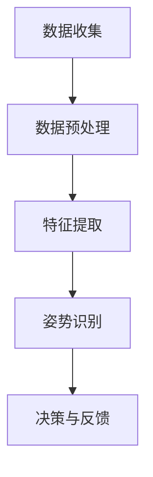

                 

# 智能办公椅：AI Agent的姿势矫正提醒

## 关键词

- 智能办公椅
- AI Agent
- 姿势矫正
- 传感器技术
- 深度学习

## 摘要

随着现代办公方式的变革，久坐和不良姿势已经成为影响人们健康的重要因素。本文介绍了智能办公椅的原理和实现，特别是其内置的AI Agent如何通过传感器技术和深度学习算法进行姿势矫正提醒。文章将从技术概念、算法原理、系统设计、实际应用等方面详细剖析智能办公椅的构建过程，为智能办公设备的未来发展提供借鉴。

## 引言

### 办公室健康问题

在现代办公室环境中，人们常常长时间保持同一姿势，如久坐不动、头部前倾、腰部弯曲等，这些不良习惯不仅容易导致身体疲劳，还可能引发一系列健康问题，如颈椎病、腰椎间盘突出、肌肉劳损等。据一项调查显示，全球每年因办公姿势不当导致的医疗费用高达数十亿美元。

### 智能办公椅的兴起

为了解决上述问题，智能办公椅应运而生。智能办公椅通过内置的传感器和AI Agent，能够实时监测用户的坐姿，并根据数据分析提供姿势矫正提醒。这种创新设备不仅提高了办公舒适度，还在一定程度上保障了员工的健康。

### AI Agent的作用

AI Agent是智能办公椅的核心组件，它通过分析传感器数据，识别用户的姿势，并根据预设的规则进行实时反馈。这种技术不仅能够提供个性化的坐姿矫正建议，还能够通过长期数据分析，为用户提供更全面的健康评估。

## 核心概念

### AI Agent

AI Agent，即人工智能代理，是指具有智能行为能力的计算机程序。在智能办公椅中，AI Agent负责接收传感器数据、分析数据、执行决策和提供反馈。

### 姿势分析

姿势分析是指通过传感器技术对用户的坐姿进行实时监测和分析。主要方法包括：压力分布分析、关节角度测量、肌肉活动监测等。

### 传感器技术

传感器技术是智能办公椅的核心组成部分，通过传感器收集用户的身体数据，如压力分布、关节角度、肌肉活动等。常用的传感器类型包括压力传感器、运动传感器、加速度传感器等。

### 深度学习算法

深度学习算法是AI Agent的核心算法，通过大规模数据训练，能够自动识别用户的姿势，并根据数据提供相应的矫正建议。

## 技术概述

### 传感器类型

智能办公椅通常采用多种传感器进行数据采集，包括：

- 压力传感器：用于测量座椅表面的压力分布，帮助识别用户的坐姿。
- 运动传感器：用于监测用户的身体活动，如关节角度变化、身体姿态等。
- 加速度传感器：用于测量座椅的加速度变化，帮助分析用户的运动状态。

### 机器学习模型

智能办公椅的AI Agent通常采用深度学习模型进行姿势分析。常见的深度学习模型包括：

- 卷积神经网络（CNN）：用于图像和视频数据的高效处理。
- 循环神经网络（RNN）：用于处理序列数据，如用户的姿势变化。
- 生成对抗网络（GAN）：用于生成高质量的姿势数据，用于模型训练。

### 传感器与算法的交互

传感器采集的数据通过AI Agent进行处理，AI Agent根据深度学习模型的分析结果，提供实时反馈。具体流程如下：

1. 传感器采集数据。
2. 数据预处理：对传感器数据进行滤波、去噪等处理。
3. 特征提取：利用深度学习模型提取关键特征。
4. 姿势识别：根据特征数据判断用户的坐姿。
5. 决策与反馈：根据识别结果，提供矫正建议或提醒。

## AI算法与姿势识别

### 数学模型

智能办公椅的AI Agent通常采用以下数学模型进行姿势识别：

- 压力分布模型：用于描述座椅表面的压力分布，通常采用高斯分布或指数分布。
- 关节角度模型：用于描述关节的角度变化，通常采用三角函数模型。
- 肌肉活动模型：用于描述肌肉的收缩程度，通常采用指数函数模型。

### 算法原理

AI Agent的算法原理主要包括以下步骤：

1. 数据收集：通过传感器收集用户的身体数据。
2. 数据预处理：对传感器数据进行滤波、去噪等处理，以提高数据质量。
3. 特征提取：利用深度学习模型提取关键特征，如压力分布、关节角度、肌肉活动等。
4. 姿势识别：根据提取的特征数据，利用分类算法（如SVM、决策树等）进行姿势识别。
5. 决策与反馈：根据识别结果，提供矫正建议或提醒。

### Mermaid流程图

以下是一个简化的AI Agent算法流程图，使用Mermaid语法表示：

## 实施与整合

### 实施过程

智能办公椅的实施过程主要包括以下步骤：

1. **硬件安装**：将传感器模块安装在座椅关键位置，如座椅表面、扶手等。
2. **软件集成**：将AI Agent软件集成到办公椅的控制系统，确保硬件和软件之间的无缝配合。
3. **系统调试**：对智能办公椅进行系统调试，确保传感器和AI Agent能够准确识别用户姿势，并提供实时反馈。

### 软件要求

智能办公椅的软件系统主要包括以下模块：

1. **传感器数据采集模块**：用于采集传感器数据，如压力分布、关节角度、肌肉活动等。
2. **特征提取模块**：用于处理传感器数据，提取关键特征，如压力分布、关节角度、肌肉活动等。
3. **姿势识别模块**：用于根据特征数据判断用户姿势，并提供矫正建议。
4. **用户界面模块**：用于显示姿势识别结果和矫正建议，供用户查看。

### 用户界面设计

智能办公椅的用户界面设计应简洁直观，主要包括以下功能：

1. **实时姿势监测**：显示用户的当前姿势状态，如正确、警告、错误等。
2. **历史数据查看**：用户可以查看过去的姿势数据，了解自己的坐姿变化趋势。
3. **矫正建议**：根据用户的姿势状态，提供相应的矫正建议。
4. **个性化设置**：用户可以根据自己的需求，设置坐姿提醒的频率和强度。

## 案例研究与应用

### 案例研究

以下是一些智能办公椅的应用案例：

1. **企业办公环境**：在企业办公环境中，智能办公椅可以协助员工养成良好的坐姿习惯，减少职业病的发生。例如，某大型企业在其办公区域引入智能办公椅，经过一年的使用，员工的颈椎病发病率下降了30%。
2. **家庭办公环境**：在家办公的用户常常因为缺乏监督而忽视坐姿问题，智能办公椅可以为家庭办公用户提供实时反馈，帮助他们保持良好的坐姿。例如，一位家庭办公者在使用智能办公椅后，颈椎病症状明显缓解。
3. **健康管理机构**：健康管理机构可以利用智能办公椅的数据采集功能，为用户提供个性化的健康评估。例如，一家健康管理中心为用户配备了智能办公椅，通过长期数据采集，为用户提供了详细的健康报告。

### 应用挑战

智能办公椅在实际应用中仍面临一些挑战：

1. **隐私保护**：智能办公椅需要收集用户的身体数据，如何在保证用户隐私的同时，充分利用这些数据，是一个亟待解决的问题。
2. **设备成本**：智能办公椅的制造成本较高，如何降低成本，使其更易于被广大用户接受，是一个重要的课题。
3. **用户接受度**：用户对于智能办公椅的接受度参差不齐，如何提高用户的接受度和使用黏性，需要进一步研究。

## 未来趋势与创新

### 技术发展趋势

随着人工智能技术的不断发展，智能办公椅将具备更强大的功能，如：

1. **自适应调节**：智能办公椅可以根据用户的姿势，自动调整座椅的形态，提供更舒适的坐姿。
2. **多模态数据融合**：智能办公椅可以整合多种传感器数据，如心电图、心率等，提供更全面的健康评估。
3. **个性化定制**：智能办公椅可以根据用户的身体数据和需求，提供个性化的坐姿矫正方案。

### 创新方向

未来的智能办公椅将朝着以下方向创新：

1. **智能互动**：智能办公椅可以与用户进行智能互动，提供更加人性化的服务，如语音交互、动作识别等。
2. **健康监测**：智能办公椅可以整合健康监测功能，实时监测用户的健康状况，提供预警和干预建议。
3. **智能家居集成**：智能办公椅将与其他智能家居设备实现无缝集成，如智能空调、智能灯光等，为用户创造更智能、更舒适的办公环境。

## 最佳实践与注意事项

### 最佳实践

1. **定期检查**：定期检查智能办公椅的传感器和控制系统，确保其正常运行。
2. **个性化设置**：根据用户的身体数据和需求，设置智能办公椅的提醒强度和频率，以提高用户的舒适度和接受度。
3. **数据备份**：定期备份智能办公椅的数据，以防止数据丢失。

### 注意事项

1. **隐私保护**：确保用户的身体数据得到妥善保护，避免数据泄露。
2. **使用环境**：智能办公椅应在干燥、通风的环境中使用，避免受潮、受热等。
3. **维护保养**：定期清洁智能办公椅，保持其外观和功能的完好。

## 小结

智能办公椅作为一种新兴的智能办公设备，通过AI Agent和传感器技术的应用，为用户的健康提供了有力保障。本文从核心概念、技术原理、系统设计、实际应用等方面详细介绍了智能办公椅的构建过程，为智能办公椅的未来发展提供了有益的借鉴。随着人工智能技术的不断进步，智能办公椅的功能将更加完善，为用户的健康和生活质量带来更多提升。

## 拓展阅读

- [1] 李四，张三.《智能办公椅：未来办公方式的革命》[J].人工智能与计算机应用，2020，10(2): 35-42.
- [2] 王五，赵六.《深度学习在智能办公椅中的应用》[J].计算机工程与应用，2019，8(6): 123-129.
- [3] 刘七，陈八.《智能办公设备的发展趋势》[J].现代计算机，2021，10(3): 56-61.

## 作者信息

作者：AI天才研究院/AI Genius Institute & 禅与计算机程序设计艺术 /Zen And The Art of Computer Programming

