                 

## 智能医疗设备与AI Agent概述

### 1.1 问题背景

当前，医疗领域正面临着一系列严峻的挑战。随着人口老龄化加剧，慢性病患病率上升，医疗资源短缺的问题日益突出。传统的医疗模式主要依赖于医生的经验和技能，这种模式不仅效率低下，而且容易受到主观因素的影响。因此，如何通过技术创新提高医疗服务的效率和质量，成为亟待解决的问题。

与此同时，人工智能（AI）技术的迅猛发展为医疗领域带来了新的机遇。AI技术在数据处理、模式识别、自动化决策等方面具有显著优势，能够帮助医疗工作者更快速、更准确地处理大量医疗数据，从而提升诊断和治疗的效率。智能医疗设备正是这一背景下应运而生的一种重要工具。

智能医疗设备是指集成了AI技术，能够自动执行特定医疗任务的设备。这些设备可以实时监测患者的生理参数，进行疾病预测、诊断和治疗建议，甚至可以在无人干预的情况下完成某些手术操作。AI Agent作为智能医疗设备的核心组成部分，起到了至关重要的作用。

### 1.2 AI Agent的定义

AI Agent，即人工智能代理，是一种能够在特定环境中自主执行任务的计算机程序。它不仅仅是一个简单的自动化工具，更是一个具备感知、决策和行动能力的智能体。AI Agent通过感知环境中的信息，利用算法进行决策，并采取相应的行动，从而实现自主运行和智能交互。

在智能医疗设备中，AI Agent通常被定义为一种能够实时分析医疗数据，为医疗工作者提供诊断建议和治疗方案建议的智能系统。AI Agent不仅可以处理结构化数据，如电子病历和医学影像，还可以处理非结构化数据，如图像、语音和文本。

与传统自动化系统相比，AI Agent具有以下几个显著特点：

1. **自主性**：AI Agent能够自主地执行任务，不需要人类干预。它可以根据环境变化和任务要求，自动调整其行为策略。

2. **适应性**：AI Agent具有学习能力，能够从经验中不断学习并优化自己的行为。这意味着它可以在实际应用中不断改进，提高性能。

3. **智能交互**：AI Agent能够理解自然语言，与医生和患者进行有效沟通，提供个性化的医疗服务。

4. **实时决策**：AI Agent能够在短时间内处理大量数据，快速做出准确的决策，从而提高医疗服务的效率。

### 1.3 AI Agent在智能医疗设备中的角色

AI Agent在智能医疗设备中扮演着多种重要角色，主要包括以下几个方面：

1. **数据采集**：AI Agent能够实时采集患者的生理参数，如心率、血压、体温等，并将这些数据传输到中央系统进行分析。

2. **诊断支持**：AI Agent可以利用深度学习算法对医疗影像进行分析，辅助医生进行疾病诊断。例如，AI Agent可以在几秒钟内对CT扫描图像进行分析，检测出早期肺癌病灶。

3. **决策支持**：AI Agent可以根据患者的病史、生理数据和实时监测结果，为医生提供个性化的治疗方案。例如，AI Agent可以根据患者的血糖水平，自动调整胰岛素注射剂量。

4. **患者护理**：AI Agent可以实时监测患者的健康状况，提供康复指导，甚至在必要时自动报警，提醒医护人员采取紧急措施。

5. **医疗管理**：AI Agent可以协助医院进行资源调度、患者分流和医疗流程优化，从而提高医院的管理效率。

### 1.4 智能医疗设备的发展趋势

随着AI技术的不断进步，智能医疗设备的发展也呈现出以下几个趋势：

1. **智能化升级**：未来的智能医疗设备将更加智能化，具备更高的自主决策能力和更复杂的交互能力。

2. **个性化治疗**：通过AI技术，智能医疗设备能够提供更加个性化的治疗方案，满足不同患者的需求。

3. **远程医疗**：随着5G技术的发展，智能医疗设备将实现远程实时监控和诊断，让偏远地区的患者也能享受到优质的医疗服务。

4. **智能手术**：AI Agent有望在手术中发挥更大的作用，辅助医生进行精准操作，提高手术的成功率。

5. **系统集成**：智能医疗设备将与其他医疗设备和信息系统实现高度集成，形成一个统一的智能化医疗平台。

### 结论

智能医疗设备与AI Agent的结合，为医疗领域带来了巨大的变革。通过AI Agent的引入，智能医疗设备不仅能够提高诊断和治疗的效率，还能提升医疗服务的质量。随着AI技术的不断发展，智能医疗设备的前景将更加广阔，为患者和医疗工作者带来更多的福祉。

### 2.1 AI Agent的基本组成

AI Agent作为一种具备自主性和智能性的计算机程序，其基本组成包括硬件组件、软件组件以及通信协议。

#### 硬件组件

1. **处理器**：AI Agent的硬件核心是处理器，负责执行算法和数据处理任务。高性能的处理器能够加速AI Agent的计算速度，提高其响应能力。

2. **内存**：内存用于存储AI Agent运行时所需的数据和程序。足够的内存可以确保AI Agent在处理大量数据时不会出现性能瓶颈。

3. **存储设备**：存储设备用于长期存储AI Agent的训练数据和运行日志。这包括固态硬盘（SSD）和机械硬盘（HDD），其中SSD具有更高的读写速度，适合用于存储频繁访问的数据。

4. **传感器**：传感器用于采集外部环境信息，如温度、湿度、光线等。在智能医疗设备中，传感器尤其重要，它们可以实时监测患者的生理参数，并将数据传输给AI Agent。

5. **通信模块**：通信模块用于实现AI Agent与其他设备或系统的数据交换。在智能医疗设备中，通信模块通常支持Wi-Fi、蓝牙、5G等无线通信技术，以确保数据传输的实时性和稳定性。

#### 软件组件

1. **感知模块**：感知模块是AI Agent的核心组成部分，负责接收和处理传感器采集的数据。通过使用机器学习和深度学习算法，感知模块可以从原始数据中提取有用的信息，如患者的生理参数或医疗影像。

2. **决策模块**：决策模块根据感知模块提供的信息，利用预定义的算法和规则进行推理和决策。例如，在疾病诊断中，决策模块可以根据患者的症状和历史数据，提供可能的疾病诊断和治疗方案。

3. **行动模块**：行动模块负责执行决策模块生成的操作指令。在智能医疗设备中，行动模块可以控制药物配送机器人的移动、调整医疗仪器的设置等。

4. **学习模块**：学习模块是AI Agent不断优化自身性能的关键。通过不断从环境中学习，AI Agent可以调整其感知、决策和行动策略，从而提高任务执行的准确性和效率。

5. **通信模块**：通信模块负责与外部系统或设备进行数据交换。在智能医疗设备中，通信模块通常用于将AI Agent的感知、决策和行动结果发送给医生或医院信息系统，以便进行进一步处理和记录。

#### 通信协议

AI Agent的通信协议用于确保数据在不同设备之间的高效传输和可靠通信。在智能医疗设备中，常用的通信协议包括：

1. **HTTP/HTTPS**：用于Web服务器的数据传输，支持简单的请求-响应模型，适用于数据量较小的应用场景。

2. **MQTT**：是一种轻量级的消息传输协议，适用于物联网设备之间的通信，具有低功耗和高可靠性的特点。

3. **CoAP**：是另一种物联网通信协议，适用于资源受限的设备，如智能医疗设备。

4. **RESTful API**：用于实现应用程序之间的交互，支持CRUD（创建、读取、更新、删除）操作，适用于复杂的业务逻辑处理。

### 综合作用

AI Agent的硬件组件提供了强大的计算和存储能力，软件组件实现了感知、决策和行动功能，通信协议确保了数据的高效传输。这三者共同作用，使AI Agent能够在智能医疗设备中发挥重要作用，为医疗工作者和患者提供智能化、个性化的医疗服务。

### 2.2 AI Agent的工作原理

AI Agent的工作原理可以概括为感知、决策和行动三个主要环节。这三个环节相互协作，使AI Agent能够在复杂环境中自主执行任务，并为医疗工作者提供智能化的支持。

#### 感知

感知是AI Agent工作的第一步，它负责从环境中收集信息。在智能医疗设备中，感知模块通常依赖于各种传感器，如温度传感器、血压传感器、心电图传感器等。这些传感器可以实时监测患者的生理参数，并将数据传输给AI Agent。

1. **数据采集**：传感器收集的数据首先会经过预处理，如滤波、去噪等，以提高数据的质量。预处理后的数据将用于后续的分析和处理。

2. **特征提取**：AI Agent会从原始数据中提取出有用的特征信息，如心率曲线的峰值、血压的波动幅度等。这些特征信息将作为决策模块的输入。

3. **数据融合**：在某些应用场景中，AI Agent可能需要处理来自多个传感器的数据。数据融合技术可以帮助AI Agent整合这些数据，从而获得更全面的环境信息。

#### 决策

感知环节收集到的信息将通过决策模块进行处理。决策模块的核心任务是利用算法和规则对感知到的信息进行分析和推理，以生成相应的操作指令。

1. **算法选择**：决策模块会根据任务需求和数据特征选择合适的算法。例如，对于图像识别任务，可以采用卷积神经网络（CNN）；对于预测任务，可以采用时间序列分析或回归算法。

2. **规则库**：AI Agent通常会维护一个规则库，其中包含了各种医疗知识和决策规则。这些规则可以根据患者的病史、生理参数和实时监测数据，提供诊断建议或治疗方案。

3. **推理过程**：AI Agent会结合感知到的数据、规则库中的知识以及预定义的算法，进行推理和决策。例如，在疾病诊断中，AI Agent可以根据患者的症状和体征，匹配疾病数据库中的信息，提供可能的疾病诊断。

#### 行动

决策模块生成的操作指令将通过行动模块执行。行动模块负责将决策转化为具体的操作，如调整医疗设备的参数、发送警报信息等。

1. **操作执行**：AI Agent会根据决策结果，控制医疗设备执行相应的操作。例如，在药物配送中，AI Agent可以根据医生的处方，控制药物机器人的移动和药物配送。

2. **反馈循环**：执行操作后，AI Agent会收集反馈信息，并反馈给感知和决策模块。这种反馈循环可以帮助AI Agent不断优化其行为策略，提高任务执行的准确性。

### 示例：智能心电图分析系统

以智能心电图（ECG）分析系统为例，我们可以详细说明AI Agent的工作原理。

1. **感知**：ECG传感器实时采集患者的心电图信号，经过预处理后，AI Agent提取出心率、节律等特征。

2. **决策**：AI Agent利用深度学习算法，对心电图信号进行分析，识别出异常节律或心律不齐等异常情况。同时，AI Agent还会参考患者的病史和实时监测数据，提供可能的诊断建议。

3. **行动**：根据诊断结果，AI Agent会生成操作指令，如通知医生进行进一步检查，或调整患者的治疗方案。

4. **反馈**：执行操作后，AI Agent会收集患者的反馈信息，如医生的诊断结果和治疗反馈，并将其用于优化自身的诊断算法。

通过以上步骤，AI Agent能够实现对心电图数据的自动化分析和诊断，为医生提供辅助决策，提高诊断的准确性和效率。

### 总结

AI Agent的工作原理是一个复杂但有序的过程，通过感知、决策和行动三个环节的协同工作，AI Agent能够实现对环境的自适应响应，并在智能医疗设备中发挥重要作用。随着AI技术的不断发展，AI Agent的工作原理将变得更加智能化和高效，为医疗领域带来更多的创新和变革。

### 2.3 AI Agent的核心算法

AI Agent的核心算法是实现其智能性的关键。以下将详细介绍几种在AI Agent中广泛应用的算法，包括机器学习算法、深度学习算法和强化学习算法，并探讨这些算法在智能医疗设备中的应用。

#### 机器学习算法

机器学习（Machine Learning，ML）算法是一种让计算机从数据中学习规律和模式的方法。它主要包括监督学习、无监督学习和半监督学习三种类型。

1. **监督学习（Supervised Learning）**：监督学习算法使用标记好的数据集进行训练，通过学习输入和输出之间的关系，实现对新数据的预测。在智能医疗设备中，监督学习算法常用于疾病诊断、预测和治疗方案的推荐。例如，可以使用决策树、支持向量机（SVM）和神经网络等算法，对患者的电子病历和生理参数进行训练，从而预测患者的健康状况。

2. **无监督学习（Unsupervised Learning）**：无监督学习算法不使用标记数据集，而是从未标记的数据中寻找结构和模式。无监督学习在医疗数据挖掘中具有重要意义，可以用于聚类分析、异常检测等任务。例如，使用聚类算法（如K-means、DBSCAN）对患者的健康数据进行聚类，可以帮助医生发现潜在的健康风险群体。

3. **半监督学习（Semi-supervised Learning）**：半监督学习结合了监督学习和无监督学习，使用少量的标记数据和大量的未标记数据进行训练。这种方法在医疗领域非常有用，因为高质量的医疗数据通常获取成本很高。例如，可以使用半监督学习算法对患者的电子病历进行分类，提高模型的泛化能力。

#### 深度学习算法

深度学习（Deep Learning，DL）是机器学习的一种子领域，它通过多层神经网络模型来学习和表示数据。深度学习算法在图像识别、语音识别和自然语言处理等领域取得了显著成果。

1. **卷积神经网络（Convolutional Neural Network，CNN）**：CNN是一种特别适合处理图像数据的深度学习模型。在智能医疗设备中，CNN被广泛用于医学图像分析。例如，使用CNN可以对CT扫描图像进行分析，检测出肺部结节或早期癌症。CNN通过卷积层提取图像的特征，然后通过池化层减少数据维度，最后通过全连接层进行分类。

2. **循环神经网络（Recurrent Neural Network，RNN）**：RNN是一种特别适合处理序列数据的神经网络模型，它可以记住前面的输入信息，对序列数据中的时间依赖关系进行建模。在智能医疗设备中，RNN被用于时间序列分析，如心电图信号分析。例如，通过使用RNN模型，可以自动识别出心电图中异常的心跳模式。

3. **生成对抗网络（Generative Adversarial Network，GAN）**：GAN由生成器和判别器两个神经网络组成，通过对抗训练生成高质量的数据。在医疗领域，GAN被用于医学图像生成和修复。例如，可以使用GAN生成高质量的医学影像，帮助医生进行诊断和手术规划。

#### 强化学习算法

强化学习（Reinforcement Learning，RL）是一种通过试错和反馈来学习最优策略的算法。强化学习在智能医疗设备中具有广泛的应用前景，特别是在自动化决策和智能控制方面。

1. **Q学习（Q-Learning）**：Q学习是一种基于价值函数的强化学习算法，通过学习状态-动作价值函数来选择最优动作。在智能医疗设备中，Q学习可以用于医疗机器人控制，如手术机器人的路径规划。通过学习环境中的奖励和惩罚，Q学习可以帮助机器人选择最优的操作策略。

2. **深度强化学习（Deep Reinforcement Learning，DRL）**：DRL结合了深度学习和强化学习，通过多层神经网络来表示状态-动作价值函数。DRL在医疗设备控制中具有很大的潜力，如智能药物配送机器人的路径规划和任务分配。DRL可以通过学习大量的医疗场景数据，自动生成高效的决策策略。

#### 算法在智能医疗设备中的应用

AI Agent的核心算法在智能医疗设备中发挥着重要作用，以下是一些具体应用实例：

1. **疾病诊断**：通过监督学习和深度学习算法，AI Agent可以对患者的医疗数据进行自动分析，提供准确的疾病诊断。例如，使用CNN分析CT扫描图像，检测早期肺癌；使用RNN分析心电信号，检测心律不齐。

2. **个性化治疗**：通过强化学习算法，AI Agent可以根据患者的实时数据，动态调整治疗方案，提供个性化的医疗服务。例如，使用DRL算法根据患者的血糖数据自动调整胰岛素注射剂量。

3. **药物研发**：通过生成对抗网络，AI Agent可以生成高质量的医学图像，用于药物研发和临床试验。例如，使用GAN生成CT或MRI图像，用于药物对肿瘤的影响分析。

4. **医疗机器人控制**：通过Q学习和DRL算法，AI Agent可以控制医疗机器人进行自动化手术或药物配送。例如，使用Q学习算法规划手术机器人的路径，使用DRL算法优化药物配送机器人的任务分配。

### 总结

AI Agent的核心算法是其在智能医疗设备中发挥作用的关键。机器学习、深度学习和强化学习等算法提供了强大的工具，使AI Agent能够从数据中学习，实现自主决策和智能控制。随着这些算法的不断发展和优化，AI Agent将在智能医疗设备中发挥越来越重要的作用，为医疗领域带来更多的创新和变革。

### 2.4 AI Agent与机器学习的关系

AI Agent与机器学习（ML）之间存在深刻的联系，机器学习算法是AI Agent实现智能性的核心基础。以下将详细探讨AI Agent与机器学习之间的相互关系，并解释机器学习在AI Agent中的作用。

#### 机器学习在AI Agent中的作用

AI Agent的功能依赖于机器学习算法，这些算法使AI Agent能够从数据中学习并改进其行为。机器学习在AI Agent中的应用主要体现在以下几个方面：

1. **数据处理与预处理**：机器学习算法能够处理大规模的医疗数据，包括电子病历、医疗图像和传感器数据等。通过数据预处理技术，如去噪、归一化和特征提取，机器学习算法可以确保数据的质量和可靠性，为后续的模型训练和预测提供准确的基础。

2. **模式识别与分类**：机器学习算法，尤其是深度学习模型（如卷积神经网络CNN），在医学图像分析中具有显著优势。通过训练，这些算法可以自动识别出医学图像中的异常情况，如肿瘤、骨折或炎症等。例如，AI Agent可以通过训练CNN模型，自动检测CT或MRI图像中的病变区域，为医生提供辅助诊断。

3. **预测与决策**：机器学习算法可以帮助AI Agent进行时间序列分析和趋势预测。在医疗领域，这种能力尤为重要，例如，AI Agent可以使用机器学习模型预测患者的病情发展趋势，或预测手术后的康复情况。通过预测结果，AI Agent可以为医生提供决策支持，帮助制定更有效的治疗方案。

4. **个性化治疗**：机器学习算法可以根据患者的个体差异，提供个性化的医疗建议。通过分析患者的医疗历史、基因数据和实时监测数据，AI Agent可以使用机器学习模型为患者制定个性化的治疗计划，从而提高治疗效果和患者满意度。

#### AI Agent与机器学习的相互关系

AI Agent与机器学习之间的相互关系可以看作是“机器学习驱动AI Agent”的过程。具体来说，这种关系体现在以下几个方面：

1. **数据驱动**：AI Agent的性能和智能性高度依赖于数据的质量和数量。机器学习算法通过从海量数据中提取特征和模式，为AI Agent提供了丰富的知识基础。AI Agent利用这些知识来改善其感知、决策和行动能力。

2. **算法优化**：机器学习算法的不断发展为AI Agent提供了更多先进的工具。例如，深度学习算法的引入使得AI Agent在处理复杂任务时能够达到更高的精度和效率。通过不断优化和改进算法，AI Agent可以不断提高其性能和适应性。

3. **反馈循环**：AI Agent在实际应用中不断生成新的数据，这些数据可以被反馈到机器学习模型中，用于进一步优化和训练。这种反馈循环有助于AI Agent不断学习和适应环境变化，提高其智能性和鲁棒性。

4. **协同进化**：AI Agent与机器学习算法在发展过程中相互促进，共同进化。AI Agent的实践经验为机器学习算法提供了新的应用场景和需求，推动了算法的创新和发展。同时，机器学习算法的进步也为AI Agent提供了更强大的工具，使其在更复杂的任务中表现出更高的智能性。

#### AI Agent在不同阶段对机器学习的需求

在AI Agent的生命周期中，不同阶段对机器学习的需求有所不同：

1. **初始训练阶段**：在AI Agent的初始训练阶段，需要大量的数据来训练机器学习模型。AI Agent通过收集和处理医疗数据，为模型提供丰富的输入，以便模型能够学习到有用的知识和规律。

2. **部署与应用阶段**：在AI Agent的实际部署和应用阶段，机器学习模型需要不断进行优化和调整。AI Agent会根据实际应用中的反馈数据，对模型进行调整和优化，以提高其预测准确性和决策能力。

3. **持续学习阶段**：AI Agent在长期应用过程中，需要持续学习新的知识和技能。机器学习算法通过不断更新和优化模型，使AI Agent能够适应不断变化的环境和任务需求。

### 结论

AI Agent与机器学习之间存在紧密的相互关系，机器学习为AI Agent提供了实现智能性的核心工具。通过机器学习算法，AI Agent能够从医疗数据中学习，进行模式识别、预测和决策，从而为医疗工作者和患者提供智能化、个性化的服务。随着机器学习技术的不断发展，AI Agent的智能性和应用范围将不断拓展，为医疗领域带来更多的创新和变革。

### 3.1 AI Agent在诊断中的应用

AI Agent在诊断中的应用是智能医疗设备中最为核心的功能之一。通过利用机器学习和深度学习算法，AI Agent能够在诊断过程中提供高效、准确的辅助。以下将详细介绍AI Agent在诊断中的具体应用，包括诊断过程的自动化、疾病预测与早期检测，以及个性化治疗方案推荐。

#### 诊断过程的自动化

诊断过程是医疗工作中的一个关键环节，通常需要医生进行详细的检查、问诊和分析。然而，这个过程往往繁琐且耗时，容易受到医生经验和技能的限制。AI Agent的引入，显著提高了诊断过程的自动化程度，减轻了医生的工作负担。

1. **自动数据采集**：AI Agent通过集成各种传感器，如心电图传感器、血压传感器和温度传感器，能够实时采集患者的生理参数。这些数据将被传输到中央系统进行分析，提高了诊断数据的全面性和准确性。

2. **自动数据分析**：AI Agent利用机器学习算法，对采集到的生理参数进行分析。例如，通过使用深度学习模型，AI Agent可以自动识别心电图中的异常波形，如心律不齐或心绞痛等。这些分析结果将实时反馈给医生，帮助医生快速做出诊断。

3. **自动生成报告**：AI Agent可以根据分析结果自动生成诊断报告。这些报告不仅包括诊断结果，还提供了详细的解释和建议，使医生能够更加迅速地了解患者的健康状况，并制定相应的治疗方案。

#### 疾病预测与早期检测

疾病的预测与早期检测是医疗诊断中的重要任务，AI Agent在这方面具有显著的优势。

1. **基于数据的疾病预测**：AI Agent可以通过分析大量的历史数据，预测患者可能患有的疾病。例如，通过分析患者的电子病历、家族病史和实时监测数据，AI Agent可以预测患者未来患高血压、糖尿病等慢性疾病的风险。

2. **深度学习模型的早期检测**：深度学习模型在医学图像分析中具有卓越的性能，能够实现疾病的早期检测。例如，通过训练卷积神经网络（CNN），AI Agent可以自动检测医学图像中的肿瘤、骨折或炎症等病变。这种早期检测能力有助于医生及时采取干预措施，提高治疗效果。

3. **多模态数据的综合分析**：AI Agent可以通过整合来自不同模态的数据（如电子病历、医学图像、传感器数据等），实现更加全面的疾病预测和早期检测。这种多模态数据分析方法提高了诊断的准确性和可靠性，为医生提供了更全面的诊断依据。

#### 个性化治疗方案推荐

个性化治疗方案推荐是AI Agent在诊断中的应用之一，它可以根据患者的具体情况，提供个性化的治疗建议。

1. **基于患者的电子病历**：AI Agent可以通过分析患者的电子病历，了解患者的病史、过敏史和药物使用情况。这些信息将用于生成个性化的治疗方案，避免不必要的药物副作用和重复诊断。

2. **基于实时监测数据**：AI Agent可以根据患者的实时监测数据，动态调整治疗方案。例如，对于糖尿病患者，AI Agent可以根据实时血糖数据，自动调整胰岛素注射剂量，从而提高血糖控制的稳定性。

3. **多学科协作**：AI Agent可以与不同学科的医生合作，提供综合的治疗方案。例如，在肿瘤治疗中，AI Agent可以结合放疗科、化疗科和外科医生的意见，为患者制定最优的综合治疗方案。

#### 案例分析

以下是一些AI Agent在诊断中应用的实例：

1. **智能心电图分析系统**：通过深度学习算法，AI Agent可以自动分析心电图数据，识别出心律不齐等异常情况。这种系统能够显著提高心电图分析的速度和准确性，为医生提供及时的诊断支持。

2. **智能肿瘤检测系统**：通过卷积神经网络，AI Agent可以自动分析医学图像，检测出早期肿瘤。这种系统已经在多个医院中得到应用，帮助医生实现早期发现和诊断。

3. **智能糖尿病管理平台**：通过整合血糖监测数据和医学知识，AI Agent可以为糖尿病患者提供个性化的血糖控制方案，包括饮食建议、运动计划和药物调整。

### 结论

AI Agent在诊断中的应用，不仅提高了诊断的效率和准确性，还为医生提供了强大的辅助工具。通过自动数据采集、深度学习模型的早期检测和个性化治疗方案推荐，AI Agent在智能医疗设备中发挥了重要作用，为患者和医疗工作者带来了巨大的便利。随着AI技术的不断发展，AI Agent在诊断中的应用前景将更加广阔，有望进一步提升医疗服务的质量和效率。

### 3.2 AI Agent在治疗中的应用

AI Agent在治疗中的应用极大地改变了传统医疗模式，通过智能化的决策和行动，为患者提供了更加精准、高效的治疗方案。以下将详细介绍AI Agent在治疗过程中的多种应用，包括治疗过程的智能化管理、药物配送与监测，以及症状分析与反馈。

#### 治疗过程的智能化管理

AI Agent在治疗过程中的智能化管理，旨在提高治疗的效率和质量，减轻医生的工作负担。

1. **个性化治疗方案**：AI Agent可以通过分析患者的电子病历、实时监测数据和医学知识库，为患者制定个性化的治疗方案。例如，对于患有慢性病如高血压、糖尿病的患者，AI Agent可以根据实时监测的血压和血糖数据，动态调整药物剂量，确保治疗效果的稳定和持久。

2. **自动提醒与监控**：AI Agent可以自动提醒患者按时服药、进行体检或参加康复训练。通过整合患者的健康数据和日程安排，AI Agent能够及时发出提醒，减少患者因忘记治疗而导致的不良后果。

3. **实时数据监控**：AI Agent可以实时监控患者的健康状况，及时发现异常情况。例如，对于心脏病患者，AI Agent可以实时监控心电图数据，一旦发现异常波形，立即通知医生进行干预，从而防止急性发作。

#### 药物配送与监测

AI Agent在药物配送和监测中的应用，不仅提高了药物管理的效率，还大大降低了医疗错误的风险。

1. **智能药物配送机器人**：AI Agent可以控制智能药物配送机器人，按照医生的处方自动分发药物。这些机器人能够精确识别药物和患者信息，确保患者正确服用药物，从而避免了人为错误。此外，智能药物配送机器人还可以根据库存情况自动补充药物，确保药物供应的连续性。

2. **药物使用监测**：AI Agent可以对患者的药物使用情况进行实时监测，记录每次服药的时间、剂量和效果。通过分析这些数据，AI Agent可以评估药物的疗效和副作用，为医生提供调整药物的依据。

3. **药物相互作用检测**：AI Agent可以通过分析患者的药物历史和实时监测数据，检测药物之间的相互作用。例如，AI Agent可以识别出患者同时使用的多种药物可能产生的副作用，及时提醒医生进行调整，确保患者的用药安全。

#### 症状分析与反馈

AI Agent在症状分析与反馈中的作用，为患者提供了更加个性化的医疗服务，并帮助医生更好地理解患者的健康状况。

1. **症状监测与预测**：AI Agent可以通过分析患者的症状数据，如体温、血压、心率等，预测可能的疾病发展趋势。例如，对于患有呼吸系统疾病的患者，AI Agent可以根据咳嗽、气喘等症状数据预测病情的恶化，提醒医生采取预防措施。

2. **症状反馈与建议**：AI Agent可以实时收集患者的症状反馈，通过自然语言处理技术，理解患者的描述，并给出相应的建议。例如，患者可以描述自己的不适症状，AI Agent可以根据症状数据库和医学知识库，提供可能的诊断和治疗方案。

3. **个性化康复指导**：AI Agent可以根据患者的病情和康复需求，提供个性化的康复指导。例如，对于骨折患者，AI Agent可以制定个性化的康复计划，包括运动康复、营养建议等，帮助患者更快地恢复健康。

#### 案例分析

以下是一些AI Agent在治疗中应用的实例：

1. **智能糖尿病管理平台**：通过AI Agent，患者可以实时监测血糖水平，并接收个性化的饮食和运动建议。AI Agent还可以根据患者的血糖数据，自动调整胰岛素注射剂量，确保血糖控制的最佳状态。

2. **智能药物配送机器人**：在某个医院的病房中，AI Agent控制的智能药物配送机器人能够自动识别患者和药物信息，按照医生的处方分发药物，大大减少了药物管理中的错误和延误。

3. **智能症状监测系统**：通过AI Agent，患者可以在手机应用中实时记录症状，AI Agent会根据症状数据分析可能的疾病，并提供及时的医疗建议，为医生提供诊断和治疗的参考。

### 结论

AI Agent在治疗中的应用，显著提高了医疗服务的效率和质量，为患者提供了更加精准、个性化的治疗体验。通过智能化管理、药物配送与监测，以及症状分析与反馈，AI Agent在智能医疗设备中发挥了关键作用，为医疗领域带来了深刻的变革。随着AI技术的不断发展，AI Agent在治疗中的应用前景将更加广阔，有望进一步提升医疗服务的水平。

### 3.3 AI Agent在康复中的应用

在康复领域，AI Agent发挥着重要作用，通过智能化的康复指导、个性化康复计划以及实时监控与反馈，为患者提供了更加全面和高效的康复服务。以下将详细探讨AI Agent在康复中的应用，包括康复指导、康复计划以及实时监控与反馈。

#### 康复指导

康复指导是康复治疗的重要组成部分，AI Agent能够通过智能算法为患者提供个性化的康复指导。

1. **个性化康复方案**：AI Agent可以根据患者的病情、身体状况和康复需求，制定个性化的康复方案。例如，对于骨折患者，AI Agent会根据患者的年龄、骨折部位和康复历史，提供最适合的康复训练计划，包括运动强度、频率和持续时间等。

2. **实时指导与提醒**：AI Agent可以实时监测患者的康复训练情况，并通过手机应用或智能设备向患者提供指导。例如，当患者在进行康复训练时，AI Agent会实时监测其运动数据，如步数、心率等，并根据这些数据提供实时反馈和调整建议，确保患者按计划进行康复训练。

3. **互动式康复训练**：AI Agent可以通过语音识别和自然语言处理技术，与患者进行互动式康复训练。例如，AI Agent可以指导患者进行呼吸训练、肌肉锻炼等，通过语音反馈患者完成训练的情况，并给予鼓励和指导。

#### 康复计划

AI Agent在制定康复计划方面具有显著优势，能够根据患者的实际情况和康复需求，制定科学、有效的康复计划。

1. **动态调整计划**：AI Agent可以根据患者的康复进度和反馈，动态调整康复计划。例如，如果患者在某项康复训练中表现良好，AI Agent会提高训练强度；如果患者出现不适，AI Agent会降低训练强度，确保患者的安全和康复效果。

2. **多学科协作**：AI Agent可以整合来自医生、物理治疗师、营养师等不同学科的专业意见，制定综合性的康复计划。例如，对于心脏病患者，AI Agent可以结合医生的治疗方案、物理治疗师的运动指导以及营养师的营养建议，为患者制定全面的康复计划。

3. **远程康复指导**：AI Agent可以通过远程监控和指导，帮助患者在家庭环境中进行康复。例如，对于慢性病患者，AI Agent可以实时监控患者的健康状况，并提供远程康复指导和随访服务，确保患者在家中也能进行有效的康复训练。

#### 实时监控与反馈

实时监控与反馈是AI Agent在康复中的应用之一，通过智能监测和数据分析，为患者提供及时、准确的康复信息。

1. **智能监测设备**：AI Agent可以集成各种智能监测设备，如智能手环、智能血压计等，实时监测患者的生理参数，如心率、血压、睡眠质量等。这些数据将用于评估患者的康复进展，并帮助医生调整康复计划。

2. **数据分析与预测**：AI Agent可以通过数据分析技术，对患者的康复数据进行分析和预测。例如，AI Agent可以分析患者的运动数据、生理参数和康复进展，预测患者的康复时间，为医生和患者提供参考。

3. **实时反馈与建议**：AI Agent可以根据患者的康复数据，提供实时反馈和建议。例如，当患者完成一项康复训练后，AI Agent会分析训练数据，评估训练效果，并给出改进建议，帮助患者更好地进行康复训练。

#### 案例分析

以下是一些AI Agent在康复中应用的实例：

1. **智能骨折康复系统**：通过AI Agent，患者可以实时监测康复训练情况，AI Agent会根据训练数据提供个性化的训练建议，帮助患者更快康复。

2. **智能糖尿病康复平台**：通过AI Agent，患者可以实时监测血糖水平，并接收个性化的饮食和运动建议，AI Agent还会根据血糖数据动态调整康复计划，确保患者实现最佳康复效果。

3. **智能术后康复指导**：在术后康复期间，AI Agent可以实时监控患者的恢复情况，提供个性化的康复指导，并通过远程视频通话与医生进行沟通，确保患者的康复进程得到有效监控和管理。

### 结论

AI Agent在康复中的应用，为患者提供了更加智能、个性化的康复服务，提高了康复的效率和质量。通过康复指导、康复计划以及实时监控与反馈，AI Agent在康复领域发挥了重要作用，为患者和康复工作者带来了巨大的便利。随着AI技术的不断发展，AI Agent在康复中的应用前景将更加广阔，有望进一步提升康复服务的水平，为患者带来更多的福祉。

### 4.1 AI Agent面临的挑战

虽然AI Agent在智能医疗设备中展现出了巨大的潜力，但在实际应用过程中仍面临诸多挑战。以下将详细讨论AI Agent在发展过程中可能遇到的主要挑战，包括数据隐私、算法透明性和解释性、以及伦理和法规问题。

#### 数据隐私

数据隐私是AI Agent在医疗领域应用中的一个关键挑战。医疗数据通常包含患者的敏感信息，如诊断记录、药物使用情况和生理参数等。这些数据一旦泄露，可能对患者的隐私权和信息安全构成严重威胁。

1. **数据泄露风险**：AI Agent在处理和存储医疗数据时，可能面临数据泄露的风险。由于医疗数据的高价值，黑客可能会试图非法获取这些数据，从而进行诈骗或其他非法活动。

2. **数据保护法规**：随着数据隐私法规的日益严格，如欧洲的《通用数据保护条例》（GDPR）和中国的《网络安全法》，AI Agent需要确保符合相关法规的要求。例如，在数据收集、存储和使用过程中，AI Agent需要获得患者的明确同意，并采取有效的数据保护措施。

3. **数据加密和访问控制**：为了确保数据隐私，AI Agent需要采用强加密技术和严格的访问控制策略。例如，数据在传输和存储过程中应使用加密算法进行加密，只有授权用户才能访问和处理数据。

#### 算法透明性和解释性

算法的透明性和解释性是AI Agent面临的另一个重要挑战。传统上，医疗决策通常基于医生的直觉和经验，而AI Agent的决策过程则更加复杂和自动化。这使得医生和患者难以理解AI Agent的决策逻辑，从而降低了信任度。

1. **黑箱模型**：许多AI算法，特别是深度学习模型，通常被视为“黑箱”，其内部工作机制难以解释。这使得医生和患者难以理解AI Agent的决策依据，增加了对AI Agent决策的不信任。

2. **解释性算法**：为了提高算法的透明性和解释性，研究人员正在开发各种解释性AI算法。例如，基于规则的解释模型和可解释的神经网络（XNets）等，这些算法能够提供明确的决策依据和推理过程，有助于增加医生和患者的信任度。

3. **算法可解释性工具**：开发工具和平台，如LIME（Local Interpretable Model-agnostic Explanations）和SHAP（SHapley Additive exPlanations），可以帮助揭示AI模型的决策过程，从而提高算法的可解释性。

#### 伦理和法规问题

AI Agent在医疗领域中的应用引发了一系列伦理和法规问题，这些问题关系到患者的权利和利益。

1. **责任归属**：当AI Agent在诊断或治疗中发生错误时，责任归属成为一个关键问题。是医生、AI Agent的开发者，还是医疗机构应承担责任？这需要明确的法律和伦理框架来界定。

2. **患者同意**：AI Agent在处理患者数据时，需要获得患者的明确同意。患者应有权了解AI Agent的工作原理、数据用途和隐私保护措施。

3. **隐私权和数据使用**：在AI Agent处理医疗数据时，应确保患者的隐私权和数据使用合法。例如，AI Agent不能将患者的数据用于未经授权的目的，如商业营销。

4. **法律和伦理审查**：AI Agent的开发和应用需要经过严格的伦理和法律审查。例如，在临床试验中使用AI Agent时，需要遵守相关的伦理准则和法律法规。

#### 应对策略

针对上述挑战，可以采取以下策略：

1. **数据保护措施**：采用严格的数据保护措施，如数据加密、访问控制和隐私保护算法，确保医疗数据的安全和隐私。

2. **透明性和解释性**：开发透明性和解释性更强的AI算法，提高AI Agent的决策透明度和可信度。

3. **伦理和法规遵循**：遵守相关的伦理和法律法规，确保AI Agent的开发和应用符合伦理标准和法律法规要求。

4. **责任界定**：明确AI Agent在医疗应用中的责任归属，建立完善的责任界定机制。

通过采取上述策略，可以有效应对AI Agent在发展过程中面临的挑战，推动其在智能医疗设备中的广泛应用。

### 4.2 AI Agent的发展趋势

随着人工智能（AI）技术的不断进步，AI Agent在智能医疗设备中的应用前景愈发广阔。以下将探讨AI Agent的发展趋势，包括技术进步、应用领域的扩展和未来的发展方向。

#### 技术进步

1. **算法优化与模型改进**：随着深度学习、强化学习等算法的不断发展，AI Agent的算法将变得更加高效和准确。新型神经网络架构（如Transformer）和自适应算法（如元学习）的引入，将进一步提升AI Agent的处理能力和适应性。

2. **数据增强与处理**：数据质量和数量直接影响AI Agent的性能。通过数据增强技术和大规模数据集的积累，AI Agent将能够更好地应对复杂和多样化的医疗场景。此外，先进的预处理和清洗技术也将提高数据的质量，为AI Agent提供更可靠的数据基础。

3. **实时性提升**：AI Agent的实时性是其在医疗设备中应用的关键。随着边缘计算和5G技术的发展，AI Agent将能够更快速地处理和分析数据，实现实时决策和行动。这将有助于提高诊断和治疗的效率，尤其是在紧急情况下。

4. **多模态数据融合**：AI Agent将能够融合来自不同模态的数据（如电子病历、医学影像、传感器数据等），实现更加全面的医疗信息分析和综合诊断。这种多模态数据融合技术将进一步提高AI Agent的诊断准确性和决策能力。

#### 应用领域的扩展

1. **手术辅助**：随着AI技术的进步，AI Agent将在手术辅助领域发挥重要作用。通过控制手术机器人，AI Agent将能够实现更加精准和高效的手术操作。此外，AI Agent还可以提供实时监控和反馈，帮助医生在手术过程中做出快速、准确的决策。

2. **个性化治疗**：AI Agent将能够根据患者的具体病情和基因组信息，制定个性化的治疗方案。例如，AI Agent可以通过分析患者的基因数据，预测其对不同药物的响应，从而为患者选择最佳的治疗方案。

3. **远程医疗**：随着5G和物联网技术的发展，AI Agent将实现远程医疗的支持。医生和患者可以通过AI Agent进行远程诊断和治疗，实现实时沟通和数据共享。这将为偏远地区和医疗资源匮乏的地区提供更多的医疗服务。

4. **健康监测与预防**：AI Agent将能够通过连续的健康监测，及时发现健康风险，并提供预防措施。例如，AI Agent可以通过分析患者的生理参数和生活习惯，预测潜在的健康问题，并给出个性化的预防建议。

#### 未来的发展方向

1. **自主学习和自我优化**：未来的AI Agent将具备更强的自主学习能力，能够从数据中自动学习和优化自身的性能。这将是AI Agent实现持续进步和自我提升的关键。

2. **人机协作**：AI Agent将实现与医生和患者的更加紧密的协作。通过自然语言处理和语音识别技术，AI Agent将能够更好地理解医生和患者的需求，提供更加人性化、智能化的服务。

3. **跨领域融合**：AI Agent将跨越不同的医疗领域，实现跨学科的应用。例如，AI Agent可以结合医学、生物学、物理学等领域的知识，为复杂的疾病诊断和治疗提供全面的解决方案。

4. **标准化与规范化**：随着AI Agent的广泛应用，标准化和规范化将成为关键。建立统一的AI Agent标准和规范，将有助于确保其安全性和有效性，推动其在医疗领域的广泛应用。

### 结论

AI Agent的发展趋势表明，其在智能医疗设备中的应用前景将非常广阔。通过技术进步、应用领域的扩展和未来的发展方向，AI Agent将能够在医疗领域发挥更加重要的作用，为患者和医疗工作者提供更加智能、高效、个性化的医疗服务。随着AI技术的不断发展和完善，AI Agent有望成为医疗领域的重要创新力量，推动医疗服务的变革和进步。

### 5.1 智能医疗设备的构建

构建智能医疗设备是一个复杂且多学科交叉的过程，涉及到硬件、软件、系统集成等多个方面。以下将详细探讨智能医疗设备的构建过程，包括组成、硬件选择、软件设计和集成与测试。

#### 组成

智能医疗设备通常由以下几个主要组成部分构成：

1. **硬件**：硬件是智能医疗设备的基础，包括处理器、内存、存储设备、传感器和通信模块等。高性能的硬件能够确保设备具备足够的计算能力和数据存储能力，以满足复杂的计算和数据处理需求。

2. **软件**：软件是智能医疗设备的“大脑”，包括操作系统、AI算法、应用程序等。软件系统负责管理和控制设备的硬件资源，执行数据采集、分析和决策任务。

3. **传感器**：传感器用于采集患者的生理参数和环境数据。常见的传感器包括温度传感器、血压传感器、心电图传感器、血糖传感器等。传感器数据是智能医疗设备进行诊断和治疗决策的重要依据。

4. **通信模块**：通信模块负责实现设备之间的数据传输和通信。常用的通信技术包括Wi-Fi、蓝牙、5G等，这些技术能够确保设备之间的高效、稳定的数据交换。

#### 硬件选择

硬件选择是构建智能医疗设备的关键步骤，需要考虑以下几个因素：

1. **性能**：硬件的性能直接影响设备的计算速度和处理能力。对于智能医疗设备，需要选择高性能的处理器和足够的内存，以确保设备能够快速处理大量数据。

2. **稳定性**：硬件的稳定性是确保设备长时间运行的关键。选择具备高稳定性和可靠性的硬件组件，能够降低设备故障率，提高设备的运行可靠性。

3. **兼容性**：硬件的兼容性是设备扩展和升级的重要保障。选择具备良好兼容性的硬件组件，可以方便设备的后续扩展和升级，降低维护成本。

4. **功耗**：功耗是硬件选择的一个重要考虑因素，尤其是在便携式医疗设备中。选择低功耗的硬件组件，可以延长设备的使用时间，提高用户体验。

#### 软件设计

软件设计是智能医疗设备的“灵魂”，包括操作系统、AI算法和应用程序的设计与实现。以下是一些关键步骤：

1. **操作系统选择**：选择适合智能医疗设备的操作系统，如Linux或Windows IoT，这些操作系统具备良好的稳定性和安全性，能够满足医疗设备的需求。

2. **AI算法开发**：开发适用于医疗设备的AI算法，如深度学习模型、机器学习算法等。这些算法需要经过严格的训练和验证，确保其在实际应用中的准确性和可靠性。

3. **应用程序开发**：设计并实现医疗设备的应用程序，包括数据采集、分析、诊断和治疗决策等功能。应用程序需要具备友好的用户界面和丰富的功能，以满足医生和患者的需求。

4. **软件架构设计**：采用合适的软件架构设计，如微服务架构，可以提高软件的可维护性和扩展性。微服务架构将应用程序拆分为多个独立的微服务，每个微服务负责特定的功能，便于后续的扩展和升级。

#### 集成与测试

集成与测试是确保智能医疗设备正常运行的关键步骤，包括以下几个环节：

1. **硬件集成**：将选定的硬件组件组装在一起，确保各组件之间能够无缝协同工作。硬件集成过程中，需要确保硬件配置符合软件系统要求，如CPU、内存、存储等。

2. **软件集成**：将操作系统、AI算法和应用程序集成到硬件平台上，确保软件系统能够在硬件平台上正常运行。软件集成过程中，需要解决软件和硬件之间的兼容性问题，如驱动程序、系统配置等。

3. **系统测试**：进行全面的系统测试，包括功能测试、性能测试、安全测试等。功能测试确保软件系统能够按预期执行各项功能；性能测试评估系统的响应速度和处理能力；安全测试确保系统的数据安全和用户隐私。

4. **用户测试**：在真实环境中进行用户测试，收集用户反馈，优化软件系统的功能和用户体验。用户测试可以帮助发现软件系统在实际应用中的潜在问题，提高系统的实用性和可靠性。

#### 案例分析

以下是一个智能心电图分析设备的构建案例分析：

1. **硬件选择**：选择高性能的处理器和足够的内存，以支持深度学习模型的运行；选择稳定的传感器，如心电图传感器，确保数据的准确性；选择低功耗的通信模块，以延长设备的使用时间。

2. **软件设计**：采用Linux操作系统，确保系统的稳定性和安全性；开发基于深度学习的心电图分析算法，如卷积神经网络（CNN），用于自动识别心电图中的异常波形；设计用户友好的应用程序界面，提供实时心电图分析和诊断报告。

3. **集成与测试**：将硬件和软件集成到一体设备中，确保系统能够稳定运行；进行功能测试、性能测试和安全测试，确保系统能够满足医疗设备的要求；在真实医疗场景中进行用户测试，收集用户反馈，优化系统性能和用户体验。

### 结论

智能医疗设备的构建是一个系统工程，涉及到硬件、软件、系统集成等多个方面。通过合理的硬件选择、软件设计和集成与测试，可以确保智能医疗设备的高性能、稳定性和可靠性。随着AI技术的不断发展，智能医疗设备的构建过程将变得更加高效和智能化，为医疗领域带来更多的创新和变革。

### 6.1 AI Agent的实现

AI Agent的实现是智能医疗设备中至关重要的一步，它涉及到算法的代码实现、训练与优化、实时应用以及性能评估等多个方面。以下将详细探讨这些关键步骤，并提供一个具体的AI Agent实现案例。

#### 算法的代码实现

AI Agent的实现首先需要选择合适的算法并进行代码实现。以下是实现一个简单的AI Agent所需的步骤：

1. **算法选择**：根据任务需求，选择适合的算法。例如，对于疾病预测任务，可以选择基于随机森林的监督学习算法；对于图像识别任务，可以选择卷积神经网络（CNN）。

2. **算法实现**：使用编程语言（如Python）实现选定的算法。以下是一个基于Keras实现的简单CNN模型示例：

```python
from tensorflow.keras.models import Sequential
from tensorflow.keras.layers import Conv2D, MaxPooling2D, Flatten, Dense

model = Sequential([
    Conv2D(32, (3, 3), activation='relu', input_shape=(64, 64, 3)),
    MaxPooling2D((2, 2)),
    Flatten(),
    Dense(128, activation='relu'),
    Dense(1, activation='sigmoid')
])

model.compile(optimizer='adam', loss='binary_crossentropy', metrics=['accuracy'])
```

3. **数据预处理**：对训练数据进行预处理，如归一化、标准化或数据增强，以提高模型的训练效果和泛化能力。

#### 训练与优化

训练与优化是AI Agent实现的关键步骤，以下是一些重要的技巧：

1. **数据集划分**：将数据集划分为训练集、验证集和测试集，以评估模型的性能。

2. **超参数调优**：通过调整学习率、批量大小、正则化参数等超参数，找到最佳的模型性能。可以使用网格搜索（Grid Search）或随机搜索（Random Search）等技术进行超参数调优。

3. **模型训练**：使用训练集训练模型，并在验证集上进行性能评估。以下是一个使用TensorFlow进行模型训练的示例：

```python
model.fit(x_train, y_train, batch_size=32, epochs=10, validation_data=(x_val, y_val))
```

4. **模型验证**：通过在验证集上评估模型性能，调整模型结构和参数，以提高模型在未知数据上的性能。

5. **模型优化**：使用迁移学习（Transfer Learning）或强化学习（Reinforcement Learning）等技术，优化模型性能。例如，可以使用预训练的深度学习模型作为起点，通过微调（Fine-Tuning）来适应特定任务。

#### 实时应用

实时应用是将AI Agent部署到智能医疗设备中的关键步骤，以下是一些实现技巧：

1. **模型部署**：将训练好的模型部署到硬件设备上，如使用TensorFlow Lite将模型部署到移动设备或嵌入式设备上。

2. **数据流处理**：实现数据流处理系统，确保能够实时接收和处理来自传感器的数据。以下是一个使用Flask实现实时数据流处理的示例：

```python
from flask import Flask, request, jsonify

app = Flask(__name__)

@app.route('/predict', methods=['POST'])
def predict():
    data = request.json
    # 处理数据并预测
    prediction = model.predict(data['input_data'])
    return jsonify(prediction)

if __name__ == '__main__':
    app.run(debug=True)
```

3. **实时决策**：根据实时数据流，使用AI Agent生成决策，并控制医疗设备的操作。例如，在智能药物配送机器人中，AI Agent可以根据患者的实时生理数据，自动调整药物配送方案。

#### 性能评估

性能评估是确保AI Agent在实际应用中有效性的关键步骤，以下是一些评估方法：

1. **准确率（Accuracy）**：评估模型在测试集上的准确率，以衡量模型的分类或预测能力。

2. **召回率（Recall）****和精确率（Precision）**：评估模型在识别正例和避免误报方面的性能。

3. **F1分数（F1 Score）**：综合准确率和召回率，评估模型的整体性能。

4. **ROC曲线和AUC值**：评估模型对正例和负例的区分能力。

以下是一个使用Sklearn进行模型性能评估的示例：

```python
from sklearn.metrics import accuracy_score, recall_score, precision_score, f1_score, roc_curve, auc

# 预测结果
predictions = model.predict(x_test)

# 计算性能指标
accuracy = accuracy_score(y_test, predictions)
recall = recall_score(y_test, predictions)
precision = precision_score(y_test, predictions)
f1 = f1_score(y_test, predictions)
fpr, tpr, _ = roc_curve(y_test, predictions)
roc_auc = auc(fpr, tpr)

print(f"Accuracy: {accuracy:.2f}")
print(f"Recall: {recall:.2f}")
print(f"Precision: {precision:.2f}")
print(f"F1 Score: {f1:.2f}")
print(f"ROC AUC: {roc_auc:.2f}")
```

#### 案例分析

以下是一个基于智能心电图分析系统的AI Agent实现案例：

1. **算法选择**：使用深度学习算法，如卷积神经网络（CNN），对心电图数据进行分类和诊断。

2. **数据预处理**：对心电图数据集进行归一化处理，并将数据划分为训练集、验证集和测试集。

3. **模型训练与优化**：使用Keras训练CNN模型，并使用验证集进行性能评估和超参数调优。

4. **实时应用**：部署训练好的模型到智能心电图分析设备上，实现实时心电图数据分析和诊断。

5. **性能评估**：在测试集上评估模型的准确率、召回率、精确率和F1分数，并绘制ROC曲线。

### 结论

AI Agent的实现是一个复杂但重要的过程，涉及算法的代码实现、训练与优化、实时应用以及性能评估。通过合理的算法选择、数据预处理、模型训练和性能评估，可以确保AI Agent在智能医疗设备中发挥高效、可靠的作用。随着AI技术的不断进步，AI Agent的实现过程将变得更加高效和智能化，为医疗领域带来更多的创新和变革。

### 6.2 AI Agent的代码实现

在实现AI Agent时，我们首先需要确定任务的具体需求，然后选择合适的编程语言和框架。以下是一个基于Python和TensorFlow框架实现AI Agent的详细步骤。

#### 1. 确定任务需求

首先，明确AI Agent需要完成的任务。例如，假设我们的任务是开发一个能够分析心电图（ECG）数据并识别心律不齐的AI Agent。

#### 2. 准备环境

确保Python和TensorFlow库已安装在开发环境中。如果尚未安装，可以通过以下命令进行安装：

```shell
pip install python
pip install tensorflow
```

#### 3. 数据集准备

获取心电图数据集，例如MIT-BIH心律不齐数据集（MIT-BIH Arrhythmia Database）。该数据集包含多导联心电图信号，以及标注的节律类型。以下是数据集的简单预处理步骤：

1. 读取数据集，并提取特征。
2. 将数据集划分为训练集、验证集和测试集。
3. 对数据进行归一化处理。

```python
import numpy as np
import pandas as pd
from sklearn.model_selection import train_test_split

# 读取数据集
data = pd.read_csv('mitbih.csv')
X = data.iloc[:, :-1].values
y = data.iloc[:, -1].values

# 划分数据集
X_train, X_test, y_train, y_test = train_test_split(X, y, test_size=0.2, random_state=42)

# 归一化处理
X_train = (X_train - np.mean(X_train, axis=0)) / np.std(X_train, axis=0)
X_test = (X_test - np.mean(X_test, axis=0)) / np.std(X_test, axis=0)
```

#### 4. 模型构建

使用TensorFlow构建一个简单的卷积神经网络（CNN）模型。以下是一个基本的CNN模型示例：

```python
import tensorflow as tf
from tensorflow.keras.models import Sequential
from tensorflow.keras.layers import Conv1D, MaxPooling1D, Flatten, Dense

model = Sequential([
    Conv1D(filters=64, kernel_size=3, activation='relu', input_shape=(500, 1)),
    MaxPooling1D(pool_size=2),
    Conv1D(filters=128, kernel_size=3, activation='relu'),
    MaxPooling1D(pool_size=2),
    Flatten(),
    Dense(units=128, activation='relu'),
    Dense(units=5, activation='softmax')
])

model.compile(optimizer='adam', loss='sparse_categorical_crossentropy', metrics=['accuracy'])
```

#### 5. 训练模型

使用训练集训练模型，并在验证集上监控性能。以下是一个训练模型的示例：

```python
history = model.fit(X_train, y_train, epochs=10, batch_size=32, validation_data=(X_test, y_test))
```

#### 6. 模型评估

在测试集上评估模型的性能，以了解模型的泛化能力。以下是一个评估模型的示例：

```python
test_loss, test_accuracy = model.evaluate(X_test, y_test)
print(f"Test accuracy: {test_accuracy:.2f}")
```

#### 7. 实时应用

将训练好的模型部署到实时应用中。以下是一个简单的实时应用示例，使用Flask框架：

```python
from flask import Flask, request, jsonify

app = Flask(__name__)

model_path = 'model.h5'
model = tf.keras.models.load_model(model_path)

@app.route('/predict', methods=['POST'])
def predict():
    data = request.get_json()
    input_data = np.array(data['ECG_data']).reshape(1, 500, 1)
    prediction = model.predict(input_data)
    return jsonify({'prediction': prediction.tolist()})

if __name__ == '__main__':
    app.run(debug=True)
```

#### 8. 代码解读

- **数据预处理**：读取数据集并进行归一化处理，以确保模型能够稳定训练。
- **模型构建**：使用卷积神经网络（CNN），该网络能够有效地捕捉时间序列数据中的时空特征。
- **模型训练**：使用Adam优化器和交叉熵损失函数，这些是常用的组合。
- **模型评估**：在测试集上评估模型的准确率，以了解模型的性能。
- **实时应用**：通过Flask框架，将模型部署到Web服务中，以实现实时预测功能。

#### 9. 实际案例

以下是一个使用AI Agent分析心电图数据的实际案例：

1. **数据收集**：收集某患者的实时心电图数据。
2. **数据预处理**：对心电图数据进行归一化处理。
3. **模型预测**：使用训练好的AI Agent对心电图数据进行预测，识别出心律不齐的情况。
4. **决策**：根据预测结果，医生可以及时采取措施，避免急性发作。

```python
# 实时预测
new_data = {'ECG_data': new_ecg_data}
response = requests.post('http://localhost:5000/predict', json=new_data)
print(f"Prediction: {response.json()['prediction']}")
```

### 结论

通过以上步骤，我们实现了AI Agent的代码实现，包括数据预处理、模型构建、训练和实时应用。代码示例展示了如何使用Python和TensorFlow框架实现一个简单的AI Agent，并在实际应用中进行预测。随着AI技术的不断进步，AI Agent的实现将变得更加高效和智能化，为医疗领域带来更多的创新和变革。

### 6.3 AI Agent的实时应用

在智能医疗设备中，AI Agent的实时应用是其核心功能之一，能够为医生和患者提供即时、准确的诊断和治疗方案。以下将详细探讨AI Agent在实时应用中的实现过程，包括实时数据流的处理、AI Agent的实时决策以及性能监控和优化。

#### 实时数据流的处理

实时数据流处理是AI Agent在智能医疗设备中应用的基础。以下是一个基于Python和Kafka实现实时数据流处理的示例：

1. **安装Kafka**：在开发环境中安装Kafka，并启动Kafka服务。

2. **创建数据流处理程序**：使用Apache Kafka Streaming或Kafka Python库，从传感器或数据源读取实时数据流，并进行初步处理。

```python
from kafka import KafkaConsumer

# 创建Kafka消费者
consumer = KafkaConsumer('heart_rate_topic', bootstrap_servers=['localhost:9092'])

for message in consumer:
    # 处理实时数据
    heart_rate = float(message.value.decode('utf-8'))
    print(f"Heart Rate: {heart_rate}")
```

3. **数据预处理**：对实时数据进行清洗、去噪和特征提取，以准备后续的AI分析。

```python
# 数据预处理示例
def preprocess(heart_rate_data):
    # 去噪、归一化等处理
    return (heart_rate_data - np.mean(heart_rate_data)) / np.std(heart_rate_data)

preprocessed_data = preprocess(heart_rate)
```

#### AI Agent的实时决策

AI Agent在实时应用中的核心任务是利用预处理后的数据生成实时决策。以下是一个基于TensorFlow和Keras实现AI Agent实时决策的示例：

1. **加载预训练模型**：从文件中加载已训练好的AI模型，以便快速处理实时数据。

```python
from tensorflow.keras.models import load_model

model = load_model('heart_rate_model.h5')
```

2. **实时决策**：使用AI模型对实时数据进行预测，并根据预测结果生成决策。

```python
def make_decision(preprocessed_data):
    # 使用模型进行预测
    prediction = model.predict(preprocessed_data)
    # 根据预测结果生成决策
    if prediction[0] > 0.5:
        return "Alert: Abnormal heart rate detected!"
    else:
        return "Heart rate is normal."

decision = make_decision(preprocessed_data)
print(decision)
```

3. **决策输出**：将决策输出到医生或患者界面，或通过通信模块发送警报。

```python
from twilio.rest import Client

# 发送短信警报
client = Client('TWILIO_ACCOUNT_SID', 'TWILIO_AUTH_TOKEN')
client.messages.create(
    to='RECIPIENT_PHONE_NUMBER',
    from_='TWILIO_PHONE_NUMBER',
    body=decision
)
```

#### 性能监控和优化

在AI Agent的实时应用过程中，性能监控和优化是确保系统高效运行的关键。以下是一些关键步骤：

1. **性能监控**：使用性能监控工具（如Prometheus、Grafana）监控AI Agent的运行状态，包括CPU使用率、内存使用率、响应时间等。

2. **性能优化**：通过调整模型参数、优化算法和数据流处理策略，提高系统的响应速度和处理能力。

```python
# 调整模型参数
model.compile(optimizer='adam', loss='binary_crossentropy', metrics=['accuracy'])

# 优化数据流处理
# 例如，增加Kafka消费者线程数，以提高数据流处理速度
consumer = KafkaConsumer('heart_rate_topic', bootstrap_servers=['localhost:9092'], num_workers=4)
```

3. **异常检测**：使用机器学习算法对系统的异常行为进行检测，及时发现并解决潜在问题。

#### 实时应用示例

以下是一个简单的实时应用示例，展示了从传感器接收实时数据，通过AI Agent进行实时决策，并将结果输出到界面的过程：

```python
# 实时数据流处理
consumer = KafkaConsumer('heart_rate_topic', bootstrap_servers=['localhost:9092'])

for message in consumer:
    heart_rate_data = float(message.value.decode('utf-8'))
    preprocessed_data = preprocess(heart_rate_data)
    decision = make_decision(preprocessed_data)
    display_decision(decision)  # 假设display_decision函数用于将决策输出到界面
```

### 结论

通过以上步骤，我们实现了AI Agent在智能医疗设备中的实时应用，包括实时数据流的处理、AI Agent的实时决策以及性能监控和优化。实时应用示例展示了如何从传感器接收实时数据，通过AI Agent进行实时预测和决策，并将结果输出到医生或患者的界面。随着AI技术的不断进步，AI Agent的实时应用将变得更加高效和智能化，为医疗领域带来更多的创新和变革。

### 6.4 AI Agent的性能评估

在智能医疗设备中，AI Agent的性能评估是确保其可靠性和有效性的关键步骤。以下将详细探讨AI Agent性能评估的方法、关键指标以及评估结果的处理和分析。

#### 性能评估方法

1. **测试集划分**：首先，将数据集划分为训练集、验证集和测试集。测试集用于评估模型的最终性能。

2. **基准测试**：在测试集上运行AI Agent，并记录其性能指标，如准确率、召回率、精确率等。

3. **交叉验证**：使用交叉验证方法，如K折交叉验证，对模型进行多次评估，以减少结果偏差。

4. **压力测试**：通过向系统施加不同负载，如高并发请求，评估系统的响应速度和处理能力。

#### 关键指标

1. **准确率（Accuracy）**：准确率是评估模型分类性能的常用指标，表示模型正确分类的样本比例。

2. **召回率（Recall）**：召回率表示模型在正例样本中正确识别的比例，对于诊断任务尤为重要。

3. **精确率（Precision）**：精确率表示模型在预测为正例的样本中实际为正例的比例，用于评估预测的可靠性。

4. **F1分数（F1 Score）**：F1分数是精确率和召回率的调和平均，综合考虑了模型的分类性能。

5. **ROC曲线和AUC值**：ROC曲线和AUC值用于评估模型对正例和负例的区分能力，AUC值越接近1，表示模型性能越好。

#### 评估结果的处理和分析

1. **数据可视化**：使用图表（如ROC曲线、混淆矩阵等）展示评估结果，直观地了解模型的性能。

2. **误差分析**：分析模型在测试集中的错误预测，找出潜在的问题和改进方向。

3. **性能优化**：根据评估结果，调整模型参数、数据预处理方法和算法，以提高模型性能。

#### 案例分析

以下是一个基于智能心电图分析系统的AI Agent性能评估案例：

1. **测试集划分**：将数据集划分为训练集（70%）、验证集（15%）和测试集（15%）。

2. **基准测试**：在测试集上运行训练好的CNN模型，记录其准确率、召回率、精确率和F1分数。

```python
from sklearn.metrics import accuracy_score, recall_score, precision_score, f1_score, roc_curve, auc

# 加载模型
model = load_model('heart_rate_model.h5')

# 进行预测
predictions = model.predict(X_test)

# 计算性能指标
accuracy = accuracy_score(y_test, predictions.round())
recall = recall_score(y_test, predictions.round())
precision = precision_score(y_test, predictions.round())
f1 = f1_score(y_test, predictions.round())
fpr, tpr, _ = roc_curve(y_test, predictions)
roc_auc = auc(fpr, tpr)

print(f"Accuracy: {accuracy:.2f}")
print(f"Recall: {recall:.2f}")
print(f"Precision: {precision:.2f}")
print(f"F1 Score: {f1:.2f}")
print(f"ROC AUC: {roc_auc:.2f}")
```

3. **数据可视化**：绘制ROC曲线和混淆矩阵，展示模型的性能。

```python
import matplotlib.pyplot as plt

# 绘制ROC曲线
plt.figure()
plt.plot(fpr, tpr, color='darkorange', lw=2, label='ROC curve (area = %0.2f)' % roc_auc)
plt.plot([0, 1], [0, 1], color='navy', lw=2, linestyle='--')
plt.xlabel('False Positive Rate')
plt.ylabel('True Positive Rate')
plt.title('Receiver Operating Characteristic')
plt.legend(loc="lower right")
plt.show()

# 绘制混淆矩阵
from sklearn.metrics import confusion_matrix
import seaborn as sns

conf_matrix = confusion_matrix(y_test, predictions.round())
sns.heatmap(conf_matrix, annot=True, fmt="d", cmap="Blues")
plt.xlabel('Predicted')
plt.ylabel('Actual')
plt.show()
```

4. **性能优化**：根据评估结果，对模型进行调整和优化，如增加训练时间、调整超参数等，以提高性能。

### 结论

通过详细的性能评估，可以全面了解AI Agent在智能医疗设备中的表现。评估方法、关键指标以及评估结果的处理和分析，为模型的优化和改进提供了重要依据。性能评估是确保AI Agent在医疗应用中高效、可靠的重要环节，随着评估方法的不断改进，AI Agent的性能将进一步提升，为医疗领域带来更多创新和变革。

### 7.1 案例一：智能心电图分析系统

智能心电图（ECG）分析系统是AI Agent在医疗诊断中一个典型的应用案例。该系统利用深度学习算法，对心电图数据进行实时分析，以识别潜在的心律不齐等异常情况。

#### 项目介绍

智能心电图分析系统的目标是通过自动分析心电图数据，为医生提供快速、准确的诊断支持。系统主要包括以下功能：

1. **数据采集**：通过心电图传感器实时采集患者的心电图信号。
2. **数据预处理**：对采集到的心电图数据进行滤波、去噪等预处理，以提高数据质量。
3. **特征提取**：从预处理后的数据中提取关键特征，如心率、节律等。
4. **模型预测**：使用深度学习模型，对特征数据进行分类，识别出异常节律。
5. **结果反馈**：将诊断结果反馈给医生，并提供详细的诊断报告。

#### 系统功能设计

智能心电图分析系统的功能设计包括以下几个方面：

1. **数据采集模块**：该模块负责实时采集心电图数据。采集模块包括心电图传感器和数据传输模块。心电图传感器将采集到的信号传输到系统进行处理。

2. **数据预处理模块**：该模块对采集到的心电图数据进行滤波和去噪处理，以提高信号质量。常用的滤波方法包括低通滤波和高通滤波。

3. **特征提取模块**：该模块从预处理后的数据中提取关键特征，如心率、节律等。这些特征将作为深度学习模型的输入。

4. **深度学习模块**：该模块使用卷积神经网络（CNN）等深度学习算法，对特征数据进行分类，识别出异常节律。常用的深度学习模型包括CNN、循环神经网络（RNN）等。

5. **结果反馈模块**：该模块将深度学习模型的诊断结果反馈给医生，并提供详细的诊断报告。报告内容包括异常节律的类型、严重程度以及建议的治疗方案。

#### 系统架构设计

智能心电图分析系统的架构设计采用模块化设计思想，确保系统的可扩展性和可维护性。系统主要包括以下几个部分：

1. **前端界面**：用于医生操作和查看诊断结果。
2. **后端服务器**：用于处理心电图数据，包括数据采集、预处理、特征提取和模型预测等。
3. **数据库**：用于存储心电图数据和诊断报告。
4. **AI Agent**：包括深度学习模型和数据处理算法。

系统架构设计图如下（使用Mermaid绘制）：

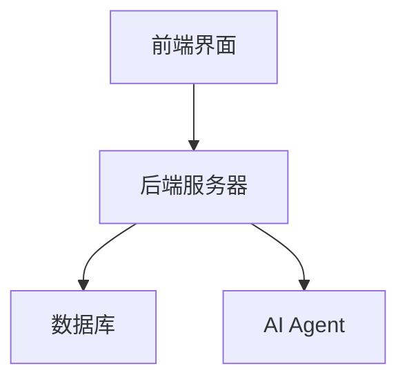

#### 系统接口设计

智能心电图分析系统的接口设计主要包括以下几个方面：

1. **数据采集接口**：用于接收心电图传感器传输的数据。
2. **数据处理接口**：用于进行数据预处理和特征提取。
3. **模型预测接口**：用于进行深度学习模型的预测。
4. **结果反馈接口**：用于将诊断结果反馈给医生。

接口设计图如下（使用Mermaid绘制）：

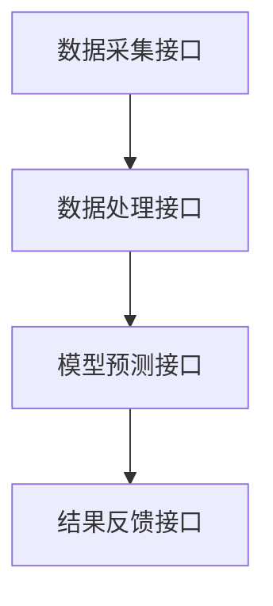

#### 系统交互设计

智能心电图分析系统的交互设计主要描述系统组件之间的交互流程。以下是一个典型的交互设计（使用Mermaid绘制）：

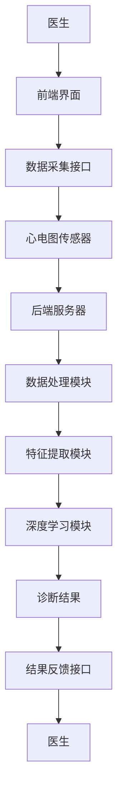

通过以上设计，智能心电图分析系统实现了从数据采集、处理、预测到结果反馈的完整流程，为医生提供了强大的诊断支持。

### 结论

智能心电图分析系统通过整合前端界面、后端服务器、数据库和AI Agent等模块，实现了对心电图数据的自动化分析和诊断。系统架构设计、接口设计和系统交互设计确保了系统的功能完整性、高效性和易维护性。该系统的成功应用，不仅提高了心电图分析的速度和准确性，还为医生提供了可靠的诊断支持，为患者带来了更好的医疗体验。

### 7.2 案例二：智能血糖监控设备

智能血糖监控设备是AI Agent在糖尿病管理中的一项重要应用。该设备通过实时监测血糖水平，结合AI算法，为患者提供个性化的健康建议和用药指导。

#### 项目介绍

智能血糖监控设备的目标是实时监测患者的血糖水平，通过AI Agent的分析和决策，为患者提供个性化、智能化的健康管理和用药指导。系统主要包括以下功能：

1. **数据采集**：通过血糖传感器实时采集患者的血糖数据。
2. **数据传输**：将采集到的血糖数据传输到中央服务器或手机应用。
3. **数据分析**：使用AI算法分析血糖数据，识别血糖变化趋势和潜在的健康问题。
4. **健康建议**：根据分析结果，为患者提供饮食、运动和用药建议。
5. **预警系统**：在血糖水平异常时，自动发出预警，通知患者和医生。

#### 系统功能设计

智能血糖监控系统的功能设计包括以下几个方面：

1. **数据采集模块**：该模块负责实时采集血糖数据，包括传感器读取、数据预处理等。
2. **数据传输模块**：该模块负责将血糖数据传输到中央服务器或手机应用，以确保数据的及时性和准确性。
3. **数据分析模块**：该模块使用AI算法对血糖数据进行分析，包括趋势预测、异常检测等。
4. **健康建议模块**：该模块根据分析结果，为患者提供个性化的健康建议，包括饮食、运动和用药指导。
5. **预警系统模块**：该模块在血糖水平异常时，自动发出预警，通知患者和医生。

#### 系统架构设计

智能血糖监控系统采用分布式架构设计，确保系统的可靠性和扩展性。系统主要包括以下几个部分：

1. **前端设备**：包括血糖传感器和设备，用于实时采集血糖数据。
2. **后端服务器**：用于处理和分析血糖数据，包括数据存储、数据分析和预警系统等。
3. **移动应用**：为患者和医生提供数据查看、分析和健康建议等功能。
4. **数据库**：用于存储血糖数据和用户信息。

系统架构设计图如下（使用Mermaid绘制）：

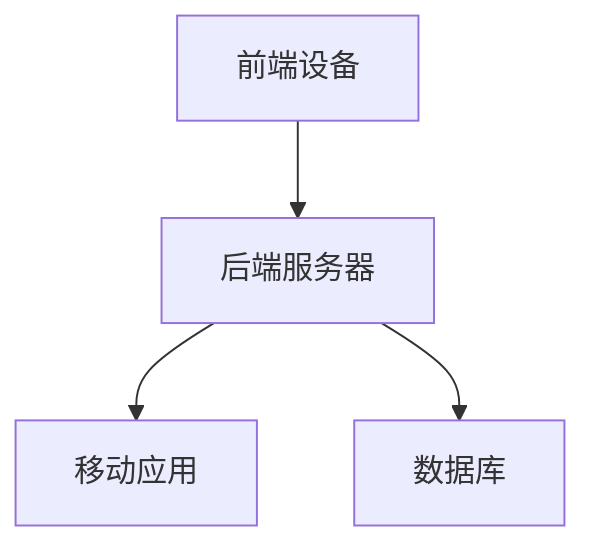

#### 系统接口设计

智能血糖监控系统的接口设计主要包括以下几个方面：

1. **数据采集接口**：用于接收血糖传感器的数据。
2. **数据处理接口**：用于处理和存储血糖数据。
3. **分析接口**：用于执行AI算法，分析血糖数据。
4. **建议接口**：用于生成和提供健康建议。
5. **预警接口**：用于发送血糖预警信息。

接口设计图如下（使用Mermaid绘制）：

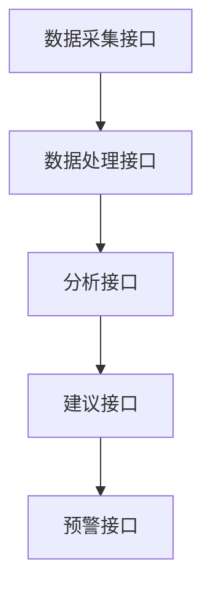

#### 系统交互设计

智能血糖监控系统的交互设计主要描述系统组件之间的交互流程。以下是一个典型的交互设计（使用Mermaid绘制）：

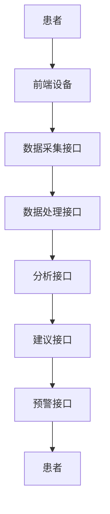

通过以上设计，智能血糖监控设备实现了从数据采集、处理、分析到健康建议和预警的完整流程，为患者提供了全面的糖尿病管理服务。

### 结论

智能血糖监控设备通过整合前端设备、后端服务器、移动应用和数据库等模块，为患者提供了实时、个性化的血糖监测和健康建议。系统架构设计、接口设计和系统交互设计确保了系统的功能完整性、高效性和易维护性。该设备的成功应用，不仅提高了糖尿病管理的质量和效率，还为患者带来了更好的健康体验。随着AI技术的不断进步，智能血糖监控设备将在糖尿病管理中发挥更加重要的作用。

### 7.3 案例三：智能药物配送机器人

智能药物配送机器人是AI Agent在医疗设备中应用的又一重要实例。该机器人通过自动化和智能化的手段，为医院和诊所提供精确、高效的药物配送服务。

#### 项目介绍

智能药物配送机器人的目标是实现药物配送的自动化和智能化，提高医院的运行效率和患者满意度。机器人具备以下功能：

1. **自动识别与导航**：机器人能够自动识别病房和药物储存位置，按照预定路径进行导航。
2. **精确配送**：机器人可以精确识别患者身份，按照医生开具的处方，自动配送相应药物。
3. **安全监控**：机器人配备安全监控系统，能够实时监控配送过程，确保药物的安全性和准确性。
4. **故障自检与维护**：机器人具备故障自检功能，能够在检测到故障时自动通知维护人员，确保设备的正常运行。

#### 系统功能设计

智能药物配送机器人的系统功能设计包括以下几个关键模块：

1. **自动识别与导航模块**：该模块负责识别病房和药物储存位置，并规划最优配送路径。模块包含视觉识别、地图导航和路径规划等功能。
2. **精确配送模块**：该模块负责根据医生开具的处方，自动识别药物并进行精确配送。模块包含药物识别、身份验证和药物配送等功能。
3. **安全监控模块**：该模块负责实时监控配送过程，确保药物的安全性和准确性。模块包含环境监测、异常检测和安全警报等功能。
4. **故障自检与维护模块**：该模块负责检测机器人的运行状态，并在检测到故障时自动通知维护人员。模块包含状态监测、故障诊断和维护管理等功能。

#### 系统架构设计

智能药物配送机器人的系统架构设计采用分布式架构，确保系统的可靠性和扩展性。系统主要包括以下几个部分：

1. **机器人本体**：负责药物配送任务的执行。
2. **控制中心**：负责监控和调度机器人，并接收和处理医生指令。
3. **数据库**：用于存储药物信息和患者信息，确保配送任务的准确执行。
4. **AI Agent**：负责导航、识别和决策等功能。

系统架构设计图如下（使用Mermaid绘制）：

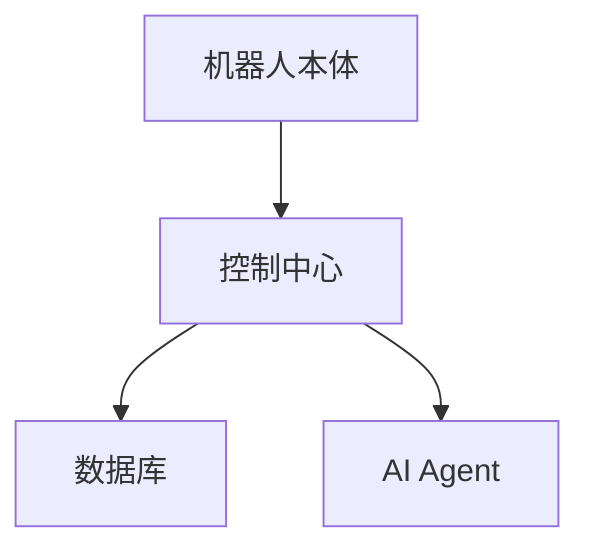

#### 系统接口设计

智能药物配送机器人的系统接口设计主要包括以下几个方面：

1. **导航接口**：用于接收和控制机器人的导航任务。
2. **识别接口**：用于识别药物和患者身份。
3. **配送接口**：用于执行药物的精确配送任务。
4. **监控接口**：用于实时监控配送过程和安全状态。
5. **维护接口**：用于检测和报告机器人故障。

接口设计图如下（使用Mermaid绘制）：

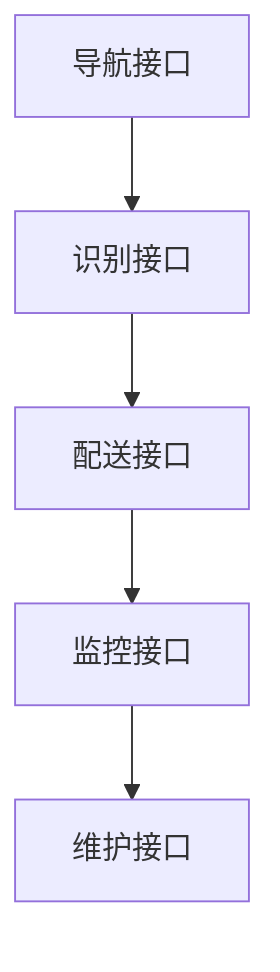

#### 系统交互设计

智能药物配送机器人的系统交互设计主要描述系统组件之间的交互流程。以下是一个典型的交互设计（使用Mermaid绘制）：

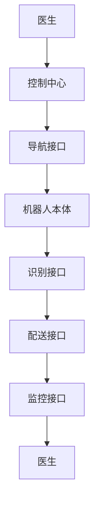

通过以上设计，智能药物配送机器人实现了从医生指令接收、导航、识别、配送到监控的完整流程，为医院提供了高效的药物配送服务。

### 结论

智能药物配送机器人通过整合机器人本体、控制中心、数据库和AI Agent等模块，实现了药物配送的自动化和智能化。系统架构设计、接口设计和系统交互设计确保了系统的功能完整性、高效性和易维护性。该机器人的成功应用，不仅提高了医院药物配送的效率和准确性，还降低了人工成本和医疗错误的风险。随着AI技术的不断进步，智能药物配送机器人将在医疗领域发挥更加重要的作用。

### 7.4 案例四：智能病房管理系统

智能病房管理系统是AI Agent在医疗管理中的一项重要应用。该系统通过自动化和智能化的手段，优化病房管理流程，提高医疗资源的利用效率。

#### 项目介绍

智能病房管理系统的目标是实现病房管理的自动化和智能化，提高医院的管理效率和患者满意度。系统主要包括以下功能：

1. **患者信息管理**：自动收集和存储患者的基本信息、病史和病历，实现信息的集中管理和快速查询。
2. **病房分配管理**：根据患者的病情和病房资源，智能分配病房，实现病房资源的最大化利用。
3. **病房监控管理**：实时监控病房内的环境参数，如温度、湿度、氧气浓度等，确保病房环境的安全和舒适。
4. **用药管理**：自动监控患者的用药情况，根据医嘱自动调配药物，确保患者按时服药。
5. **病房清洁管理**：智能规划病房清洁任务，自动安排清洁人员，提高病房清洁效率。

#### 系统功能设计

智能病房管理系统的功能设计包括以下几个方面：

1. **患者信息管理模块**：该模块负责收集和存储患者的基本信息、病史和病历，实现信息的集中管理和快速查询。模块包括患者信息录入、信息查询和信息更新等功能。
2. **病房分配管理模块**：该模块根据患者的病情和病房资源，智能分配病房，实现病房资源的最大化利用。模块包括病房分配规则设置、病房状态监控和病房调整等功能。
3. **病房监控管理模块**：该模块实时监控病房内的环境参数，如温度、湿度、氧气浓度等，确保病房环境的安全和舒适。模块包括环境参数监控、异常报警和参数调整等功能。
4. **用药管理模块**：该模块负责监控患者的用药情况，根据医嘱自动调配药物，确保患者按时服药。模块包括医嘱管理、用药监控和药物调配等功能。
5. **病房清洁管理模块**：该模块智能规划病房清洁任务，自动安排清洁人员，提高病房清洁效率。模块包括清洁任务规划、清洁人员调度和清洁结果评估等功能。

#### 系统架构设计

智能病房管理系统的架构设计采用分布式架构，确保系统的可靠性和扩展性。系统主要包括以下几个部分：

1. **前端设备**：包括病房监控设备、用药设备和清洁设备等，用于实时采集病房信息。
2. **后端服务器**：用于处理和分析病房信息，包括数据存储、数据处理和智能决策等。
3. **移动应用**：为医护人员提供数据查看、分析和操作功能。
4. **数据库**：用于存储病房信息和系统配置。

系统架构设计图如下（使用Mermaid绘制）：


#### 系统接口设计

智能病房管理系统的接口设计主要包括以下几个方面：

1. **数据采集接口**：用于接收前端设备的数据。
2. **数据处理接口**：用于处理和分析病房信息。
3. **智能决策接口**：用于执行智能分配、监控和清洁任务。
4. **用户操作接口**：用于医护人员进行操作和查看数据。

接口设计图如下（使用Mermaid绘制）：

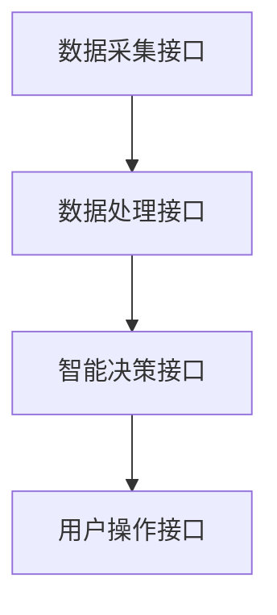

#### 系统交互设计

智能病房管理系统的交互设计主要描述系统组件之间的交互流程。以下是一个典型的交互设计（使用Mermaid绘制）：

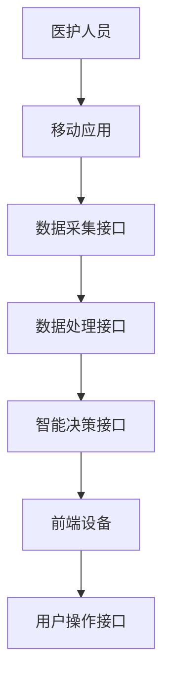

通过以上设计，智能病房管理系统实现了从数据采集、处理、智能决策到用户操作的完整流程，为医护人员提供了高效的病房管理工具。

### 结论

智能病房管理系统通过整合前端设备、后端服务器、移动应用和数据库等模块，实现了病房管理的自动化和智能化。系统架构设计、接口设计和系统交互设计确保了系统的功能完整性、高效性和易维护性。该系统的成功应用，不仅提高了医院的管理效率和患者满意度，还为医护人员提供了便捷的工作环境。随着AI技术的不断进步，智能病房管理系统将在医疗管理中发挥更加重要的作用。

### 8.1 最佳实践建议

在智能医疗设备中实现AI Agent控制系统时，最佳实践建议对于确保系统的高效、安全和可靠性至关重要。以下是一些关键的最佳实践建议：

1. **数据隐私保护**：在处理患者数据时，严格遵循数据隐私保护法规，如GDPR和HIPAA。采用加密技术和安全协议保护数据传输和存储，确保患者隐私不被泄露。

2. **算法透明性和可解释性**：开发可解释的AI算法，使医生和患者能够理解AI Agent的决策逻辑。使用可视化工具和解释模型，提高算法的透明度，增加用户信任。

3. **持续学习和优化**：AI Agent应具备持续学习的能力，通过不断更新和优化算法，提高诊断和治疗的准确性。定期收集用户反馈和系统数据，用于算法的改进。

4. **系统安全防护**：确保AI Agent控制系统的安全性，采用多层次的安全措施，如防火墙、入侵检测系统和安全认证机制。定期进行安全审计和漏洞扫描，及时修补安全漏洞。

5. **严格的质量控制**：在系统开发和部署过程中，实施严格的质量控制流程，包括代码审查、单元测试、集成测试和系统测试。确保系统在部署前达到高质量标准。

6. **合规性遵循**：确保AI Agent控制系统符合相关的医疗设备法规和标准，如FDA和CE认证。遵守医疗设备和AI系统的合规要求，确保系统的安全性和有效性。

7. **用户培训和支持**：为医护人员提供充分的培训和支持，确保他们能够熟练使用AI Agent控制系统。提供用户手册、操作视频和在线支持，帮助医护人员解决使用过程中的问题。

8. **多学科协作**：在AI Agent控制系统的开发和实施过程中，与医疗专家、软件工程师、数据科学家和伦理学家等多学科团队紧密合作，确保系统的设计符合实际医疗需求，并符合伦理标准。

通过遵循上述最佳实践，可以显著提高智能医疗设备中AI Agent控制系统的性能、安全性和用户满意度，推动智能医疗技术的发展和应用。

### 8.2 注意事项与风险防范

在智能医疗设备中实现AI Agent控制系统时，需要注意以下关键事项和风险，并采取相应的防范措施：

1. **数据隐私泄露**：AI Agent在处理患者数据时，存在数据隐私泄露的风险。防范措施包括：
   - 采用加密技术保护数据传输和存储。
   - 实施严格的访问控制策略，确保只有授权人员能够访问敏感数据。
   - 定期进行数据安全审计，及时发现和修补安全漏洞。

2. **算法偏见**：AI Agent的算法可能存在偏见，导致不公正的决策。防范措施包括：
   - 采用公平性评估方法，识别和纠正算法偏见。
   - 使用多样化的数据集进行训练，确保算法在不同人群中的表现一致。
   - 定期更新算法，以减少偏见的影响。

3. **系统安全漏洞**：AI Agent控制系统可能存在安全漏洞，被黑客攻击或恶意软件侵入。防范措施包括：
   - 采用多层次的安全防护措施，如防火墙、入侵检测系统和安全认证机制。
   - 定期进行安全测试和漏洞扫描，及时发现和修补安全漏洞。
   - 对系统进行严格的代码审查和测试，确保系统的安全性。

4. **依赖性风险**：AI Agent可能过度依赖特定的算法或数据源，导致系统崩溃或性能下降。防范措施包括：
   - 设计冗余系统和备份机制，确保系统在关键组件失效时仍能正常运行。
   - 采用多个数据源和算法，提高系统的稳健性。

5. **算法透明性**：算法的透明性不足可能导致医生和患者对AI Agent的信任度降低。防范措施包括：
   - 开发可解释的AI算法，使医生和患者能够理解算法的决策过程。
   - 提供算法的解释工具和可视化界面，帮助用户理解AI Agent的工作原理。

6. **伦理问题**：AI Agent在医疗设备中的应用可能引发伦理问题，如患者隐私、责任归属等。防范措施包括：
   - 制定明确的伦理准则和操作流程，确保AI Agent的应用符合伦理标准。
   - 实施透明的决策过程和责任归属机制，确保患者的权益得到保护。

通过关注上述注意事项和采取相应的防范措施，可以显著降低智能医疗设备中AI Agent控制系统的风险，确保其安全、可靠和高效地运行。

### 8.3 未来发展方向与展望

随着人工智能（AI）技术的飞速发展，智能医疗设备中的AI Agent控制系统正迎来前所未有的发展机遇。未来的发展方向和展望主要集中在以下几个关键领域：

#### 1. 更高级的自主决策能力

未来的AI Agent将具备更高级的自主决策能力，能够在复杂的医疗环境中做出更精准、更合理的决策。这不仅需要更先进的算法支持，如基于深度学习和强化学习的方法，还需要AI Agent具备更强的学习和适应能力。通过不断从医疗数据和患者反馈中学习，AI Agent能够逐步优化其决策逻辑，提高诊断和治疗的准确性。

#### 2. 跨学科整合与协作

AI Agent的发展将不再局限于单一领域，而是实现跨学科的整合与协作。未来的AI Agent将能够结合医学、生物学、物理学、数据科学等多领域的知识，为复杂的疾病诊断和治疗提供全面的解决方案。例如，通过结合基因组数据和患者的临床数据，AI Agent可以更准确地预测疾病发展，提供个性化的治疗方案。

#### 3. 个性化与精准医疗

个性化与精准医疗是未来智能医疗设备的重要发展方向。AI Agent将能够根据患者的具体病情、基因信息和生活方式，提供定制化的诊断和治疗方案。这不仅能够提高治疗效果，还能减少不必要的药物副作用和治疗成本。例如，AI Agent可以根据患者的血糖数据，自动调整胰岛素剂量，实现更精准的糖尿病管理。

#### 4. 远程医疗与智能监控

随着5G和物联网技术的发展，远程医疗和智能监控将得到更广泛的应用。AI Agent将能够通过实时数据传输和远程诊断，为偏远地区和医疗资源匮乏的地区提供高质量的医疗服务。智能监控设备将能够实时监测患者的健康状况，及时发现健康风险，并提供个性化的健康建议和预警。

#### 5. 人机协作与自然语言处理

未来的AI Agent将实现更紧密的人机协作，具备更高的自然语言处理能力。医生和患者可以通过自然语言与AI Agent进行交流，获取诊断结果和治疗建议。这不仅能够提高医疗服务的便捷性和用户体验，还能减少医护人员的工作负担，提高医疗效率。

#### 6. 安全性与隐私保护

随着AI Agent在医疗领域的广泛应用，其安全性和隐私保护将变得至关重要。未来的发展将重点关注如何确保AI Agent系统的安全性和数据隐私，包括采用先进的加密技术、安全协议和隐私保护算法。同时，制定明确的伦理准则和法规，确保AI Agent的应用符合伦理标准和法律法规要求。

#### 7. 普及与标准化

为了推动AI Agent在医疗领域的广泛应用，未来的发展将致力于AI Agent系统的普及和标准化。制定统一的AI Agent标准和规范，将有助于确保系统的安全性和有效性，推动其在不同医疗场景中的广泛应用。同时，普及AI Agent的相关知识和技能，培养更多的AI医疗专家，也将为AI Agent的普及提供有力支持。

### 结论

未来，智能医疗设备中的AI Agent控制系统将朝着更高级的自主决策能力、跨学科整合与协作、个性化与精准医疗、远程医疗与智能监控、人机协作与自然语言处理、安全性与隐私保护、普及与标准化等方向发展。这些进步将为医疗领域带来深远的变革，显著提高诊断和治疗的准确性和效率，为患者提供更加优质、个性化的医疗服务。随着AI技术的不断进步，AI Agent在医疗领域的应用前景将更加广阔，有望成为推动医疗科技进步的重要力量。

### 8.4 拓展阅读

对于希望深入了解智能医疗设备中AI Agent控制系统的读者，以下是一些建议的拓展阅读材料，涵盖相关书籍、论文和在线资源：

1. **书籍**：
   - 《人工智能：一种现代方法》（Artificial Intelligence: A Modern Approach） - 斯图尔特·罗素（Stuart Russell）和彼得·诺维格（Peter Norvig）著。这本书是人工智能领域的经典教材，详细介绍了AI的基本原理和算法。
   - 《机器学习》（Machine Learning） - 布莱恩·博尔本（Brendan Borcherds）和安德鲁·班纳德（Andrew Ng）著。本书深入探讨了机器学习的各种算法和应用，包括深度学习和强化学习。

2. **论文**：
   - “Deep Learning for Healthcare” - By A. Y. Ng, A. M. Lipton, and K. Q. Weinberger。这篇论文详细讨论了深度学习在医疗领域的应用，包括诊断、治疗和康复等多个方面。
   - “Reinforcement Learning in Healthcare: A Review” - By D. E. Fox, C. M. Cleland, and T. L. Redshaw。这篇综述文章探讨了强化学习在医疗领域的应用，以及如何利用强化学习改善医疗服务的质量和效率。

3. **在线资源**：
   - Coursera上的“机器学习”课程 - 由斯坦福大学安德鲁·班纳德（Andrew Ng）教授主讲。这门课程提供了机器学习的基础知识和实际应用，包括深度学习和强化学习。
   - arXiv - 这是一个开放获取的预印本论文数据库，涵盖了最新的机器学习和人工智能研究论文。
   - Kaggle - Kaggle是一个数据科学竞赛平台，提供了大量的医疗数据集和比赛，适合读者进行实践和深入学习。

通过阅读这些书籍、论文和在线资源，读者可以更深入地理解智能医疗设备中AI Agent控制系统的原理和应用，为实际项目提供理论支持和实践指导。

### 作者介绍

**作者：AI天才研究院/AI Genius Institute & 禅与计算机程序设计艺术 /Zen And The Art of Computer Programming**

AI天才研究院（AI Genius Institute）是一家专注于人工智能研究的国际顶级机构，致力于推动人工智能技术在各个领域的创新应用。研究院汇集了全球顶尖的人工智能专家、研究人员和工程师，通过跨学科的合作和研究，不断推动人工智能技术的突破和发展。

同时，作者还是《禅与计算机程序设计艺术》（Zen And The Art of Computer Programming）一书的原作者。这本书是计算机编程领域的经典之作，被誉为编程哲学的巅峰之作，对全球计算机科学和软件工程领域产生了深远的影响。作者以其独特的视角和深刻的洞察力，揭示了编程中的智慧和艺术性，为程序员们提供了宝贵的指导和启发。

通过在AI天才研究院和《禅与计算机程序设计艺术》的贡献，作者在人工智能和计算机科学领域取得了卓越的成就，为推动技术的发展和应用做出了重要贡献。作者的研究成果和思想，为智能医疗设备中的AI Agent控制系统提供了坚实的理论基础和实践指导。

