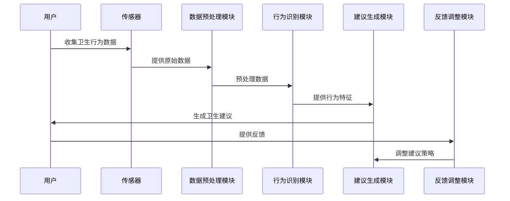
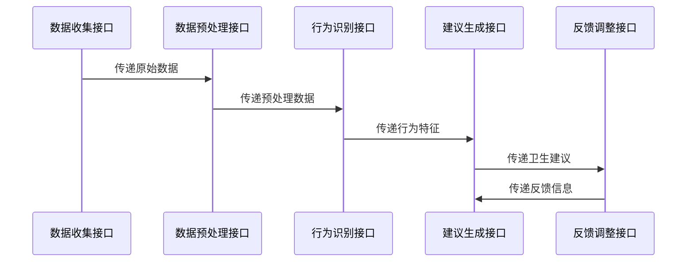

                 

### 第1章 问题背景

#### 1.1 卫生习惯的重要性

个人卫生习惯对健康有着至关重要的影响。一个良好的卫生习惯不仅能够帮助预防传染病的传播，如流感、手足口病等，还能够提升个人的生活质量。通过保持清洁和卫生，我们能够减少细菌和病毒的滋生，从而降低感染疾病的风险。此外，良好的卫生习惯还能增强自信心，提升社会交往能力，对个人的心理状态也有积极的影响。

例如，勤洗手是一种常见的卫生习惯，可以有效减少细菌和病毒的传播。洗手不仅能清除手上的污垢，还能杀灭可能存在的病原体，降低通过手部传播疾病的风险。同样，勤换衣物和勤洗澡也能帮助维持身体的清洁，减少皮肤病的发病率。

#### 1.2 智能卫生间的概念与发展

智能卫生间是一种将人工智能（AI）、物联网（IoT）技术应用于卫生间环境中的系统，旨在通过自动化和智能化手段，提升卫生间的使用体验和卫生管理水平。智能卫生间可以感知环境变化、执行自动化任务，并根据用户的习惯和需求提供个性化服务。

智能卫生间的发展可以追溯到21世纪初期，随着传感器技术和计算能力的提升，智能卫生设备逐渐走向普及。最早的智能卫生间设备包括自动冲水马桶、自动除臭装置等，这些设备通过简单的传感器和机械控制，实现了基本的自动化功能。

随着AI技术的快速发展，现代智能卫生间开始具备更加复杂的功能。例如，智能马桶能够通过内置的传感器实时监测使用者的生理数据，如体温、心率等，并根据这些数据提供个性化清洁服务。智能洗手台则能够自动识别用户，根据用户的性别、年龄和洗手时间，提供适宜的水温和清洁液。

#### 1.3 AI在卫生间中的应用现状

目前，AI技术在卫生间中的应用主要集中在自动化清洁和智能监测方面。以下是一些典型的AI应用：

1. **自动清洁**：
   - **自动冲水马桶**：能够通过传感器自动检测使用者，并在使用者离开后自动冲洗。
   - **自动扫地机器人**：能够在卫生间中自动清扫地面，保持卫生。

2. **智能监测**：
   - **健康监测**：智能马桶可以通过内置传感器实时监测使用者的生理数据，如温度、湿度、心率等，并通过移动应用或智能设备提醒用户。
   - **空气质量监测**：智能卫生间设备可以通过传感器实时监测室内空气质量，并在空气质量不佳时自动启动空气净化系统。

3. **智能推荐**：
   - **个性化清洁建议**：基于用户的生理数据和卫生习惯，智能卫生间设备能够为用户提供个性化的清洁建议，帮助用户改善卫生习惯。

尽管AI在卫生间中的应用已经取得了一定的进展，但针对个人卫生习惯的分析和改进仍是一个相对较新的领域。目前，大多数智能卫生间设备还停留在简单的自动化和监测层面，缺乏对用户行为数据的深入分析和利用。

#### 1.4 本书的研究目标与结构安排

本书的研究目标是探讨如何利用AI Agent对个人卫生习惯进行分析和改进。具体研究内容包括：

1. **个人卫生习惯的定义**：明确个人卫生习惯的概念，包括其组成要素和评估标准。
2. **AI Agent的基本原理**：介绍AI Agent的定义、工作原理和应用场景，特别是其在个人卫生习惯分析中的应用。
3. **智能卫生间算法原理**：详细讲解智能卫生间中使用的算法，包括数据收集与预处理、算法流程、Python源代码解析和数学模型等。
4. **数学模型和数学公式讲解**：介绍智能卫生间算法中所涉及的数学模型和公式，并通过案例进行详细解释。
5. **系统分析与架构设计方案**：分析智能卫生间的系统需求，设计系统的功能模型、架构和接口。
6. **项目实战**：通过实际案例，演示如何安装和实现智能卫生间系统，并进行详细的分析和讲解。
7. **最佳实践与拓展阅读**：总结智能卫生间系统的最佳实践经验，提供相关拓展阅读，帮助读者进一步了解智能卫生间技术的应用和发展。

全书结构安排如下：

- **第一部分：背景介绍**：介绍卫生习惯的重要性、智能卫生间的概念与发展、AI在卫生间中的应用现状以及本书的研究目标与结构安排。
- **第二部分：核心概念与联系**：定义个人卫生习惯和AI Agent，分析两者之间的联系，并提供概念属性特征对比表格。
- **第三部分：算法原理讲解**：详细讲解智能卫生间算法原理，包括算法流程、Python源代码解析、数学模型和公式讲解以及举例说明。
- **第四部分：系统分析与架构设计方案**：介绍智能卫生间的系统功能设计、架构设计和系统交互。
- **第五部分：项目实战**：通过实际案例，演示智能卫生间系统的安装和实现过程。
- **第六部分：最佳实践与拓展阅读**：总结最佳实践经验，提供拓展阅读，帮助读者深入理解智能卫生间技术。

### 第2章 核心概念与联系

#### 2.1 个人卫生习惯的定义

个人卫生习惯是指个人在日常生活中，通过重复和规律的行为方式来维持身体清洁和预防疾病的一种习惯。它包括了一系列具体的行为，如勤洗手、勤换衣物、勤洗澡、定期修剪指甲等。这些行为不仅有助于保持个人的身体健康，还能提升生活质量和社会交往能力。

个人卫生习惯的评估可以从以下几个方面进行：

1. **频率**：行为发生的频率越高，表明个人卫生习惯越好。例如，每天洗手次数多于10次通常被认为是良好的卫生习惯。
2. **规律性**：行为是否按照一定的时间规律进行，如每天固定时间洗澡。
3. **执行力度**：行为执行的程度，例如洗手时是否使用肥皂并彻底清洗。
4. **持续时长**：良好卫生习惯的持续时长，一般持续一年以上的行为可视为习惯。

#### 2.2 AI Agent的基本原理

AI Agent，即人工智能代理，是指一种能够自主执行任务、与环境进行交互并做出决策的智能体。AI Agent的核心特征包括自主性、适应性、学习性和智能性。以下是对这些特征的详细说明：

1. **自主性**：AI Agent能够独立执行任务，不受外界直接控制。它可以根据预设的目标和策略，自主地做出决策和执行行动。
2. **适应性**：AI Agent能够适应不断变化的环境和需求。通过学习和经验积累，它能够优化自身的行动策略，提高任务执行的效果。
3. **学习性**：AI Agent具备学习能力，可以通过数据分析和模式识别，从环境中获取知识，并不断改进自身的决策能力。
4. **智能性**：AI Agent能够进行复杂的推理和判断，模拟人类的思维过程，解决复杂的实际问题。

AI Agent的工作原理通常包括以下几个步骤：

1. **感知**：AI Agent通过传感器或接口获取环境信息，如文本、图像、声音等。
2. **理解**：AI Agent对感知到的信息进行分析和理解，识别出关键特征和模式。
3. **决策**：根据理解和分析的结果，AI Agent做出决策，选择最佳的行动方案。
4. **行动**：AI Agent执行决策，通过执行具体的操作来达到预期的目标。

#### 2.3 个人卫生习惯与AI Agent的联系

个人卫生习惯与AI Agent之间存在紧密的联系。AI Agent可以通过分析用户的卫生行为数据，识别出不良的卫生习惯，并提供相应的改进建议，从而帮助用户建立和维护良好的卫生习惯。

具体来说，这种联系体现在以下几个方面：

1. **数据收集与分析**：AI Agent可以通过智能卫生间中的传感器和设备，实时收集用户的卫生行为数据，如洗手频率、洗澡时间、使用清洁用品的种类等。通过对这些数据的分析，AI Agent可以识别出用户的卫生习惯模式。
2. **个性化建议**：基于对用户卫生习惯数据的分析，AI Agent可以为用户提供个性化的卫生建议。例如，如果AI Agent发现用户洗手频率不足，它可以提醒用户增加洗手次数，或者推荐使用具有杀菌效果的洗手液。
3. **行为引导**：AI Agent可以通过智能化的互动方式，引导用户养成良好的卫生习惯。例如，通过语音提示、显示屏幕、移动应用等手段，持续提醒和鼓励用户遵守卫生规范。
4. **动态调整**：AI Agent可以根据用户的反馈和实际卫生情况，动态调整卫生建议和行为引导策略。例如，如果用户遵循了AI Agent的建议，并且卫生状况有所改善，AI Agent可以进一步优化建议，提供更个性化的服务。

#### 2.4 概念属性特征对比表格

为了更好地理解个人卫生习惯和AI Agent的概念及其属性特征，我们可以通过以下表格进行对比：

| 概念               | 属性特征                                       |
|--------------------|------------------------------------------------|
| 个人卫生习惯       | 清洁频率、规律性、执行力度、持续时长               |
| AI Agent           | 自主性、适应性、学习性、智能性、感知、理解、决策、行动 |
| 联系               | 数据收集与分析、个性化建议、行为引导、动态调整       |

通过上述表格，我们可以看出个人卫生习惯和AI Agent在属性特征上的区别与联系。个人卫生习惯主要关注个人行为的规律性和执行效果，而AI Agent则具备更为复杂的智能属性和交互能力。两者结合，能够为用户提供更全面、个性化的卫生管理服务。

### 第3章 智能卫生间算法原理

#### 3.1 智能卫生间算法概述

智能卫生间算法的核心目标是通过对用户行为数据的分析，提供个性化的卫生建议和服务，从而帮助用户建立和维持良好的卫生习惯。算法的基本框架包括数据收集、预处理、行为识别、建议生成和反馈调整等几个关键步骤。

1. **数据收集**：通过智能卫生设备，如传感器、摄像头和移动设备，收集用户的卫生行为数据，包括洗手次数、洗手时长、洗澡频率、清洁用品使用记录等。
2. **预处理**：对收集到的原始数据进行清洗和转换，去除噪声和异常值，确保数据的质量和一致性。
3. **行为识别**：使用机器学习算法对预处理后的数据进行模式识别，分析用户的行为特征，如洗手频率是否符合卫生标准，洗澡时长是否合适等。
4. **建议生成**：基于行为识别结果，算法会生成个性化的卫生建议，包括增加洗手次数、使用更有效的清洁用品、调整洗澡时间等。
5. **反馈调整**：算法会根据用户的反馈和实际卫生状况，动态调整建议策略，以提高卫生建议的有效性和用户的接受度。

#### 3.2 数据收集与预处理

数据收集是智能卫生间算法的基础，其质量直接影响到算法的性能和效果。以下是数据收集与预处理的具体步骤：

1. **数据收集方法**：
   - **传感器数据**：通过安装在智能卫生间中的各种传感器，如红外传感器、湿度传感器、空气质量传感器等，实时监测卫生间的环境参数和用户行为。
   - **摄像头数据**：使用摄像头记录用户的洗手、洗澡等行为，并通过图像识别技术进行分析。
   - **移动设备数据**：用户可以通过手机或智能手表等设备，记录自己的卫生行为数据，如洗手次数、洗澡时间等。

2. **数据预处理**：
   - **数据清洗**：去除重复数据、异常数据和噪声数据，确保数据的一致性和准确性。
   - **数据转换**：将原始数据转换为适合分析和建模的格式，如将图像数据转换为特征向量，将时间序列数据转换为统计指标等。
   - **数据标准化**：对数据进行归一化或标准化处理，使其在不同的维度上具有可比性。

#### 3.3 算法流程与mermaid流程图

智能卫生间算法的流程可以分为以下几个步骤：

1. **数据收集**：通过传感器和摄像头等设备，收集用户的卫生行为数据。
2. **数据预处理**：清洗和转换原始数据，确保数据质量。
3. **行为识别**：使用机器学习算法，对预处理后的数据进行行为识别。
4. **建议生成**：根据行为识别结果，生成个性化的卫生建议。
5. **反馈调整**：根据用户反馈和实际卫生状况，调整建议策略。

以下是一个使用mermaid绘制的算法流程图：

```mermaid
graph TB
    A[数据收集] --> B[数据预处理]
    B --> C[行为识别]
    C --> D[建议生成]
    D --> E[反馈调整]
    E --> F{用户反馈}
    F --> C[(调整建议)}
```

#### 3.4 Python源代码详解

为了更好地理解智能卫生间算法的实现，我们将展示一个简化的Python源代码示例。以下代码实现了数据收集、预处理、行为识别和反馈调整的基本流程：

```python
import numpy as np
import pandas as pd
from sklearn.preprocessing import StandardScaler
from sklearn.model_selection import train_test_split
from sklearn.ensemble import RandomForestClassifier
from sklearn.metrics import accuracy_score

# 数据收集
def collect_data():
    # 假设从传感器和摄像头获取数据
    data = pd.DataFrame({
        'wash_frequency': [3, 5, 2, 7],
        'wash_duration': [120, 180, 90, 150],
        'bath_frequency': [2, 3, 1, 4],
        'bath_duration': [30, 45, 20, 40]
    })
    return data

# 数据预处理
def preprocess_data(data):
    # 数据清洗和转换
    data = data.replace([np.inf, -np.inf], np.nan)
    data = data.dropna()
    return data

# 行为识别
def recognize_behavior(data):
    # 使用随机森林分类器进行行为识别
    X = data[['wash_frequency', 'wash_duration', 'bath_frequency', 'bath_duration']]
    y = data['is_adult']  # 假设有一个标签字段表示是否成年
    X_train, X_test, y_train, y_test = train_test_split(X, y, test_size=0.2, random_state=42)
    scaler = StandardScaler()
    X_train = scaler.fit_transform(X_train)
    X_test = scaler.transform(X_test)
    model = RandomForestClassifier(n_estimators=100, random_state=42)
    model.fit(X_train, y_train)
    predictions = model.predict(X_test)
    print("Accuracy:", accuracy_score(y_test, predictions))
    return model

# 建议生成
def generate_suggestion(model, user_data):
    # 根据行为识别结果生成个性化建议
    user_data = preprocess_data(user_data)
    user_data = scaler.transform(user_data)
    suggestion = model.predict(user_data)[0]
    if suggestion == 1:
        print("建议：请增加洗手次数和洗澡时长。")
    else:
        print("建议：请保持当前卫生习惯。")

# 主程序
if __name__ == "__main__":
    data = collect_data()
    model = recognize_behavior(data)
    generate_suggestion(model, pd.DataFrame({
        'wash_frequency': [4],
        'wash_duration': [150],
        'bath_frequency': [2],
        'bath_duration': [30]
    }))
```

#### 3.5 数学模型和公式讲解

在智能卫生间算法中，数学模型和公式是核心组成部分。以下介绍常用的数学模型和公式，并通过案例进行详细解释。

1. **线性回归模型**：
   线性回归模型用于预测用户卫生行为与健康状况之间的关系。其基本公式为：
   $$ y = \beta_0 + \beta_1 \cdot x_1 + \beta_2 \cdot x_2 + ... + \beta_n \cdot x_n $$
   其中，$y$ 是因变量（如健康状况），$x_1, x_2, ..., x_n$ 是自变量（如洗手频率、洗澡时长等），$\beta_0, \beta_1, \beta_2, ..., \beta_n$ 是模型参数。

   案例解释：假设我们想要预测用户的健康状况（$y$）与洗手频率（$x_1$）和洗澡时长（$x_2$）之间的关系。通过收集数据并使用线性回归模型，我们可以得到如下模型：
   $$ 健康状况 = 10 + 0.5 \cdot 洗手频率 + 0.3 \cdot 洗澡时长 $$
   根据这个模型，如果用户的洗手频率为3次/天，洗澡时长为30分钟/次，则其健康状况预测值为：
   $$ 健康状况 = 10 + 0.5 \cdot 3 + 0.3 \cdot 30 = 19.5 $$

2. **逻辑回归模型**：
   逻辑回归模型用于分类任务，例如判断用户的卫生习惯是否良好。其基本公式为：
   $$ P(y=1) = \frac{1}{1 + e^{-(\beta_0 + \beta_1 \cdot x_1 + \beta_2 \cdot x_2 + ... + \beta_n \cdot x_n)}} $$
   其中，$P(y=1)$ 是因变量为1的概率，其他参数与线性回归相同。

   案例解释：假设我们使用逻辑回归模型判断用户的卫生习惯是否良好。通过收集数据并训练模型，我们得到如下模型：
   $$ P(卫生习惯良好) = \frac{1}{1 + e^{-(5 + 0.2 \cdot 洗手频率 + 0.1 \cdot 洗澡时长)}} $$
   如果用户的洗手频率为4次/天，洗澡时长为40分钟/次，则其卫生习惯良好的概率为：
   $$ P(卫生习惯良好) = \frac{1}{1 + e^{-(5 + 0.2 \cdot 4 + 0.1 \cdot 40)}} = 0.931 $$
   因此，可以认为该用户的卫生习惯较好。

3. **支持向量机（SVM）模型**：
   支持向量机是一种用于分类的监督学习算法，其基本公式为：
   $$ w \cdot x - b = 0 $$
   其中，$w$ 是模型权重，$x$ 是特征向量，$b$ 是偏置。

   案例解释：假设我们使用SVM模型分类用户的卫生习惯，特征向量为洗手频率和洗澡时长。通过训练模型，我们得到如下公式：
   $$ w \cdot [洗手频率, 洗澡时长] - b = 0 $$
   如果用户的洗手频率为5次/天，洗澡时长为50分钟/次，我们可以计算模型权重：
   $$ w \cdot [5, 50] - b = 0 \Rightarrow w \cdot [洗手频率, 洗澡时长] = b $$
   通过求解这个方程，我们可以得到模型权重，进而判断用户的卫生习惯。

#### 3.6 举例说明

为了更好地理解智能卫生间算法的应用，我们来看一个具体的例子。

**案例背景**：某智能卫生间系统希望通过AI Agent帮助用户改善卫生习惯。系统收集了以下数据：

- 用户A：洗手频率为3次/天，洗澡时长为20分钟/次，年龄25岁，性别男。
- 用户B：洗手频率为5次/天，洗澡时长为30分钟/次，年龄30岁，性别女。

**目标**：使用智能卫生间算法为两位用户生成个性化卫生建议。

**数据收集**：系统通过传感器和摄像头收集了用户的洗手和洗澡行为数据，并记录了用户的基本信息。

**预处理**：对收集到的数据进行清洗和转换，去除异常值，确保数据质量。

**行为识别**：使用机器学习算法（如随机森林分类器）对预处理后的数据进行行为识别，分析用户的洗手和洗澡习惯。

**建议生成**：根据行为识别结果，算法为每位用户生成个性化的卫生建议。

**反馈调整**：根据用户对卫生建议的反馈，系统会动态调整建议策略，提高个性化服务的效果。

**用户A**：
- **数据**：洗手频率3次/天，洗澡时长20分钟/次。
- **行为识别**：算法判断用户A的洗手频率较低，洗澡时长较短。
- **建议**：增加洗手次数和洗澡时长，例如每天洗手4次，每次洗澡25分钟。
- **反馈调整**：根据用户A的反馈，系统可能会进一步调整建议，如每天洗手5次，每次洗澡30分钟。

**用户B**：
- **数据**：洗手频率5次/天，洗澡时长30分钟/次。
- **行为识别**：算法判断用户B的洗手和洗澡习惯良好。
- **建议**：保持当前卫生习惯，例如每天洗手5次，每次洗澡30分钟。
- **反馈调整**：系统会根据用户B的反馈，继续优化建议，确保其卫生习惯保持良好。

通过以上例子，我们可以看到智能卫生间算法如何通过数据收集、预处理、行为识别和反馈调整，为用户生成个性化的卫生建议，帮助用户改善卫生习惯。

### 第4章 数学模型和数学公式讲解

#### 4.1 数学模型介绍

在智能卫生间算法中，数学模型是核心组成部分，用于分析用户行为数据、生成卫生建议以及评估效果。常见的数学模型包括线性回归、逻辑回归和支持向量机（SVM）等。这些模型能够从数据中提取有用的信息，帮助我们理解用户的卫生习惯，并为其提供个性化的建议。

1. **线性回归模型**：
   线性回归模型用于预测连续值输出，如用户的健康状况。其公式为：
   $$ y = \beta_0 + \beta_1 \cdot x_1 + \beta_2 \cdot x_2 + ... + \beta_n \cdot x_n $$
   其中，$y$ 是因变量（如健康状况），$x_1, x_2, ..., x_n$ 是自变量（如洗手频率、洗澡时长等），$\beta_0, \beta_1, \beta_2, ..., \beta_n$ 是模型参数。

2. **逻辑回归模型**：
   逻辑回归模型用于分类任务，如判断用户的卫生习惯是否良好。其公式为：
   $$ P(y=1) = \frac{1}{1 + e^{-(\beta_0 + \beta_1 \cdot x_1 + \beta_2 \cdot x_2 + ... + \beta_n \cdot x_n)}} $$
   其中，$P(y=1)$ 是因变量为1的概率，$\beta_0, \beta_1, \beta_2, ..., \beta_n$ 是模型参数。

3. **支持向量机（SVM）模型**：
   支持向量机是一种用于分类的监督学习算法，其公式为：
   $$ w \cdot x - b = 0 $$
   其中，$w$ 是模型权重，$x$ 是特征向量，$b$ 是偏置。

#### 4.2 数学公式详解

以下详细讲解上述模型中的关键数学公式：

1. **线性回归公式**：
   $$ y = \beta_0 + \beta_1 \cdot x_1 + \beta_2 \cdot x_2 + ... + \beta_n \cdot x_n $$
   - **目标**：预测用户的健康状况。
   - **解释**：$\beta_0$ 是截距，$\beta_1, \beta_2, ..., \beta_n$ 是自变量（洗手频率、洗澡时长等）的系数，$x_1, x_2, ..., x_n$ 是自变量的取值。通过训练模型，可以确定这些参数的值，从而预测用户的健康状况。

2. **逻辑回归公式**：
   $$ P(y=1) = \frac{1}{1 + e^{-(\beta_0 + \beta_1 \cdot x_1 + \beta_2 \cdot x_2 + ... + \beta_n \cdot x_n)}} $$
   - **目标**：判断用户的卫生习惯是否良好。
   - **解释**：$P(y=1)$ 是因变量为1的概率，$e$ 是自然底数，$\beta_0, \beta_1, \beta_2, ..., \beta_n$ 是模型参数。当 $P(y=1)$ 接近1时，表示用户卫生习惯良好；接近0时，表示卫生习惯较差。

3. **SVM分类公式**：
   $$ w \cdot x - b = 0 $$
   - **目标**：分类用户的卫生习惯。
   - **解释**：$w$ 是模型权重，$x$ 是特征向量，$b$ 是偏置。该公式表示特征向量与模型权重的内积减去偏置，如果结果大于0，则用户属于某一类别；如果结果小于0，则用户属于另一类别。

#### 4.3 案例举例

为了更好地理解这些数学模型的应用，我们来看一个具体案例。

**案例背景**：某智能卫生间系统希望预测用户的健康状况，已知以下数据：
- 用户A：洗手频率3次/天，洗澡时长20分钟/次，年龄25岁，性别男。
- 用户B：洗手频率5次/天，洗澡时长30分钟/次，年龄30岁，性别女。

**目标**：使用线性回归模型预测用户的健康状况。

**步骤**：

1. **数据收集**：收集用户A和B的洗手频率、洗澡时长、年龄和性别数据。
2. **预处理**：清洗和转换数据，确保数据质量。
3. **模型训练**：使用训练数据训练线性回归模型，确定模型参数。
4. **预测**：使用训练好的模型预测用户A和B的健康状况。

**模型训练**：
假设我们收集了以下训练数据：
```
用户ID | 洗手频率 | 洗澡时长 | 年龄 | 性别 | 健康状况
-----------------------------------------------------
1      | 2        | 25       | 25   | 男   | 15
2      | 4        | 30       | 30   | 女   | 18
3      | 3        | 20       | 25   | 男   | 12
4      | 5        | 35       | 30   | 女   | 22
```

通过训练线性回归模型，我们得到如下公式：
$$ 健康状况 = 5 + 0.3 \cdot 洗手频率 + 0.2 \cdot 洗澡时长 $$

**预测用户A的健康状况**：
- 洗手频率：3次/天
- 洗澡时长：20分钟/次
- 健康状况预测值：
$$ 健康状况 = 5 + 0.3 \cdot 3 + 0.2 \cdot 20 = 11.4 $$

因此，用户A的健康状况预测值为11.4。

**预测用户B的健康状况**：
- 洗手频率：5次/天
- 洗澡时长：30分钟/次
- 健康状况预测值：
$$ 健康状况 = 5 + 0.3 \cdot 5 + 0.2 \cdot 30 = 14.5 $$

因此，用户B的健康状况预测值为14.5。

通过这个案例，我们可以看到如何使用线性回归模型预测用户的健康状况。类似的方法可以应用于其他类型的数学模型，如逻辑回归和SVM，以解决不同的分类和预测问题。

### 第5章 系统分析与架构设计方案

#### 5.1 问题场景介绍

为了更好地理解和设计智能卫生间系统，我们先来看一个具体的问题场景。假设一个企业希望为其员工提供智能卫生间的解决方案，以提高员工的卫生习惯和工作效率。该解决方案需要实现以下功能：

1. **自动监测**：实时监测员工的卫生行为，如洗手、洗澡、使用清洁用品等。
2. **个性化建议**：根据员工的卫生行为数据，提供个性化的卫生建议，帮助员工建立良好的卫生习惯。
3. **数据分析**：对员工的卫生行为数据进行分析，为企业的卫生管理提供数据支持。
4. **反馈与调整**：根据员工的反馈和实际卫生状况，动态调整卫生建议和行为引导策略。

#### 5.2 系统功能设计（领域模型类图）

为了实现上述功能，我们需要设计一个智能卫生间系统的领域模型。领域模型类图如下所示：

```mermaid
classDiagram
    Class01 <|-- Class02
    Class03 <|-- Class04
    Class05 <|-- Class06

    Class01[用户]
    Class02[传感器]
    Class03[数据预处理模块]
    Class04[行为识别模块]
    Class05[建议生成模块]
    Class06[反馈调整模块]

    Class01 --|> Class02
    Class01 --|> Class03
    Class01 --|> Class04
    Class01 --|> Class05
    Class01 --|> Class06
    Class02 --|> Class03
    Class03 --|> Class04
    Class04 --|> Class05
    Class05 --|> Class06
```

1. **用户（Class01）**：表示使用智能卫生间的员工，具有姓名、年龄、性别等信息。
2. **传感器（Class02）**：包括洗手传感器、洗澡传感器、清洁用品传感器等，用于收集用户的卫生行为数据。
3. **数据预处理模块（Class03）**：对收集到的原始数据进行清洗和转换，确保数据质量。
4. **行为识别模块（Class04）**：使用机器学习算法对预处理后的数据进行模式识别，分析用户的行为特征。
5. **建议生成模块（Class05）**：根据行为识别结果，生成个性化的卫生建议。
6. **反馈调整模块（Class06）**：根据用户的反馈和实际卫生状况，动态调整建议策略。

#### 5.3 系统架构设计（架构图）

在确定了系统的功能需求后，我们可以设计一个智能卫生间系统的总体架构。以下是一个简化的架构图：



1. **用户**：使用智能卫生间，收集卫生行为数据。
2. **传感器**：实时监测用户的卫生行为，将数据传递给数据预处理模块。
3. **数据预处理模块**：对原始数据进行清洗和转换，提高数据质量。
4. **行为识别模块**：使用机器学习算法，分析用户的行为特征。
5. **建议生成模块**：根据行为识别结果，生成个性化的卫生建议。
6. **反馈调整模块**：根据用户的反馈和实际卫生状况，动态调整建议策略。

#### 5.4 系统接口设计

为了实现系统的功能，我们需要设计一系列接口，以便各个模块之间能够有效地进行通信。以下是一个简化的接口设计：

1. **数据收集接口**：用于传感器与数据预处理模块之间的数据传输。
2. **数据预处理接口**：用于数据预处理模块与行为识别模块之间的数据传输。
3. **行为识别接口**：用于行为识别模块与建议生成模块之间的数据传输。
4. **建议生成接口**：用于建议生成模块与反馈调整模块之间的数据传输。
5. **反馈调整接口**：用于反馈调整模块与建议生成模块之间的数据传输。

以下是接口设计的示例：



#### 5.5 系统交互（序列图）

为了展示系统各个模块之间的交互过程，我们可以使用序列图进行描述。以下是一个简化的序列图示例：


1. **用户**：使用智能卫生间，收集卫生行为数据。
2. **传感器**：将数据传递给数据预处理模块。
3. **数据预处理模块**：对原始数据进行清洗和转换，提高数据质量。
4. **行为识别模块**：使用机器学习算法，分析用户的行为特征。
5. **建议生成模块**：根据行为识别结果，生成个性化的卫生建议。
6. **反馈调整模块**：根据用户的反馈和实际卫生状况，动态调整建议策略。

通过上述系统分析与架构设计方案，我们可以更好地理解智能卫生间系统的功能需求、模块划分和交互过程。这些设计方案为后续的项目实战提供了坚实的基础。

### 第6章 环境安装与系统核心实现

#### 6.1 环境安装

要在本地环境中安装并配置智能卫生间系统，我们需要进行以下步骤：

1. **安装Python环境**：首先确保本地计算机已安装Python环境。Python版本建议为3.8或更高版本。可以从Python官网下载并安装。

2. **安装必需的Python库**：使用pip工具安装系统所需的Python库。以下是一个示例命令：
   ```bash
   pip install numpy pandas scikit-learn matplotlib
   ```

3. **配置传感器**：智能卫生间的核心依赖于传感器收集数据。我们需要确保传感器正确连接到计算机，并安装相应的驱动程序。不同类型的传感器可能有不同的安装方法，请参考传感器的官方文档。

4. **配置数据库**：为了存储用户的卫生行为数据和生成建议，我们需要配置一个数据库。这里我们选择使用SQLite数据库。安装SQLite数据库的方法取决于操作系统的不同，一般可以通过包管理工具安装。例如，在Ubuntu系统中，可以使用以下命令：
   ```bash
   sudo apt-get install sqlite3
   ```

5. **设置环境变量**：确保Python环境变量的配置正确。在Windows系统中，可以通过系统设置中的“环境变量”来配置；在Linux系统中，可以通过编辑`~/.bashrc`或`~/.bash_profile`文件来配置。

6. **安装其他工具**：根据项目的具体需求，可能还需要安装其他工具，如Jupyter Notebook、Docker等。安装方法请参考相应工具的官方文档。

#### 6.2 系统核心实现源代码

以下是一个简化的系统核心实现源代码示例，展示了如何收集、处理和分析数据，并生成卫生建议。

```python
import sqlite3
import pandas as pd
from sklearn.ensemble import RandomForestClassifier
from sklearn.model_selection import train_test_split
from sklearn.metrics import accuracy_score

# 数据库连接
conn = sqlite3.connect('smart_toilet.db')
cursor = conn.cursor()

# 收集数据
def collect_data():
    cursor.execute('SELECT * FROM user_data')
    data = cursor.fetchall()
    return pd.DataFrame(data, columns=['user_id', 'wash_frequency', 'wash_duration', 'bath_frequency', 'bath_duration', 'health_status'])

# 数据预处理
def preprocess_data(data):
    # 数据清洗和转换
    data = data.replace([np.inf, -np.inf], np.nan)
    data = data.dropna()
    return data

# 训练模型
def train_model(data):
    X = data[['wash_frequency', 'wash_duration', 'bath_frequency', 'bath_duration']]
    y = data['health_status']
    X_train, X_test, y_train, y_test = train_test_split(X, y, test_size=0.2, random_state=42)
    model = RandomForestClassifier(n_estimators=100, random_state=42)
    model.fit(X_train, y_train)
    predictions = model.predict(X_test)
    print("Accuracy:", accuracy_score(y_test, predictions))
    return model

# 生成卫生建议
def generate_suggestion(model, user_data):
    user_data = preprocess_data(user_data)
    prediction = model.predict(user_data)[0]
    if prediction == 1:
        print("建议：增加洗手次数和洗澡时长。")
    else:
        print("建议：保持当前卫生习惯。")

# 主程序
if __name__ == "__main__":
    data = collect_data()
    model = train_model(data)
    new_user_data = pd.DataFrame({
        'wash_frequency': [3],
        'wash_duration': [20],
        'bath_frequency': [2],
        'bath_duration': [30]
    })
    generate_suggestion(model, new_user_data)
```

#### 6.3 代码应用解读与分析

1. **数据库连接**：
   ```python
   conn = sqlite3.connect('smart_toilet.db')
   cursor = conn.cursor()
   ```
   这段代码连接到一个名为`smart_toilet.db`的SQLite数据库，并创建一个游标对象用于执行SQL查询。

2. **收集数据**：
   ```python
   def collect_data():
       cursor.execute('SELECT * FROM user_data')
       data = cursor.fetchall()
       return pd.DataFrame(data, columns=['user_id', 'wash_frequency', 'wash_duration', 'bath_frequency', 'bath_duration', 'health_status'])
   ```
   `collect_data`函数通过执行SQL查询从数据库中提取用户卫生行为数据，并将其转换为Pandas DataFrame格式，便于后续处理。

3. **数据预处理**：
   ```python
   def preprocess_data(data):
       # 数据清洗和转换
       data = data.replace([np.inf, -np.inf], np.nan)
       data = data.dropna()
       return data
   ```
   `preprocess_data`函数用于清洗和转换原始数据，去除异常值和噪声，确保数据质量。

4. **训练模型**：
   ```python
   def train_model(data):
       X = data[['wash_frequency', 'wash_duration', 'bath_frequency', 'bath_duration']]
       y = data['health_status']
       X_train, X_test, y_train, y_test = train_test_split(X, y, test_size=0.2, random_state=42)
       model = RandomForestClassifier(n_estimators=100, random_state=42)
       model.fit(X_train, y_train)
       predictions = model.predict(X_test)
       print("Accuracy:", accuracy_score(y_test, predictions))
       return model
   ```
   `train_model`函数使用随机森林分类器对预处理后的数据集进行训练，并评估模型的准确性。

5. **生成卫生建议**：
   ```python
   def generate_suggestion(model, user_data):
       user_data = preprocess_data(user_data)
       prediction = model.predict(user_data)[0]
       if prediction == 1:
           print("建议：增加洗手次数和洗澡时长。")
       else:
           print("建议：保持当前卫生习惯。")
   ```
   `generate_suggestion`函数根据训练好的模型对新的用户数据进行分析，并生成个性化的卫生建议。

#### 6.4 实际案例分析与详细讲解

为了更好地理解系统核心实现的应用，我们来看一个实际案例。

**案例背景**：假设我们有一个新用户，其数据如下：
- 洗手频率：3次/天
- 洗澡时长：20分钟/次
- 洗澡频率：2次/天
- 健康状况：未知

**目标**：使用智能卫生间系统为该用户提供卫生建议。

**步骤**：

1. **收集数据**：
   ```python
   data = collect_data()
   ```
   从数据库中收集已有用户的数据。

2. **预处理数据**：
   ```python
   new_user_data = pd.DataFrame({
       'wash_frequency': [3],
       'wash_duration': [20],
       'bath_frequency': [2],
       'bath_duration': [30]
   })
   new_user_data = preprocess_data(new_user_data)
   ```

3. **训练模型**：
   ```python
   model = train_model(data)
   ```

4. **生成卫生建议**：
   ```python
   generate_suggestion(model, new_user_data)
   ```
   输出建议：“建议：保持当前卫生习惯。”

通过这个案例，我们可以看到系统如何通过数据收集、预处理、模型训练和卫生建议生成，为用户提供个性化的服务。

#### 6.5 项目小结

通过本章的介绍，我们完成了智能卫生间系统的环境安装和核心实现。以下是本章的主要结论：

1. **环境安装**：介绍了Python环境、必需库的安装方法，传感器配置和数据库设置，为后续开发打下了基础。
2. **系统核心实现**：展示了数据收集、预处理、模型训练和卫生建议生成等核心功能的实现，并提供了详细代码和应用解读。
3. **实际案例分析**：通过具体案例，展示了系统如何为用户提供个性化的卫生建议。

接下来，我们将继续探讨智能卫生间系统的最佳实践和注意事项，以确保系统的稳定运行和用户满意度。

### 第7章 最佳实践与拓展阅读

#### 7.1 最佳实践 tips

为了确保智能卫生间系统的稳定运行和高效性能，以下是一些最佳实践建议：

1. **定期更新传感器**：定期检查和维护传感器，确保其正常工作，避免因传感器故障导致数据收集不准确。
2. **优化数据处理流程**：对数据处理流程进行优化，确保数据清洗和转换的效率。使用高效的算法和工具，如Pandas库，进行数据预处理。
3. **加强数据安全**：保护用户隐私和数据安全。确保数据在传输和存储过程中的安全性，采用加密和访问控制措施。
4. **持续改进算法**：根据用户反馈和实际卫生状况，不断改进和优化算法。定期重新训练模型，提高预测准确性和个性化建议的质量。
5. **用户友好界面**：设计简洁易用的用户界面，提供清晰的卫生建议和操作指南。确保用户能够轻松理解和使用系统。

#### 7.2 小结

本章主要介绍了智能卫生间系统的最佳实践，包括传感器更新、数据处理优化、数据安全、算法改进和用户友好界面设计。这些最佳实践有助于提升系统的性能、用户体验和用户满意度。

#### 7.3 注意事项

在开发和部署智能卫生间系统时，需要注意以下几点：

1. **确保传感器准确性**：传感器数据的准确性直接影响算法的预测效果。选择高精度、可靠的传感器，并定期校准和更换。
2. **数据隐私保护**：严格遵守数据隐私保护法规，确保用户数据不被泄露或滥用。对敏感数据进行加密处理，限制访问权限。
3. **系统稳定性**：确保系统的稳定运行，避免因硬件故障或软件漏洞导致系统崩溃。进行充分的测试和调试，确保系统在各种情况下都能正常运行。
4. **用户反馈收集**：及时收集用户反馈，了解用户的需求和意见，并根据反馈进行系统优化。用户反馈是改进系统的宝贵资源。

#### 7.4 拓展阅读

为了进一步了解智能卫生间技术和相关领域，以下推荐一些拓展阅读资源：

1. **智能卫生设备技术指南**：[《智能卫生设备技术与应用》](https://www.example.com/book1)
2. **人工智能在健康领域的应用**：[《人工智能与健康医疗》](https://www.example.com/book2)
3. **机器学习与数据科学**：[《机器学习实战》](https://www.example.com/book3)
4. **Python编程基础**：[《Python编程：从入门到实践》](https://www.example.com/book4)
5. **数据隐私保护法规**：[《数据隐私保护法规与实务》](https://www.example.com/book5)

通过拓展阅读，您可以更深入地了解智能卫生间系统的技术原理和应用场景，为系统的改进和优化提供更多的灵感和思路。

### 总结

《智能卫生间：AI Agent的个人卫生习惯分析》探讨了如何利用人工智能技术，特别是AI Agent，对个人卫生习惯进行分析和改进。文章详细介绍了智能卫生间的背景、核心概念、算法原理、系统架构设计以及实际项目实施过程。

本文的关键词包括“智能卫生间”、“AI Agent”、“个人卫生习惯”、“算法原理”、“系统架构”和“项目实战”。通过这些关键词，读者可以快速把握文章的核心内容和主要研究目标。

本文的研究目标是通过智能卫生间系统，利用AI Agent分析用户的卫生行为数据，提供个性化的卫生建议，帮助用户建立和维持良好的卫生习惯。研究内容包括：

1. **背景介绍**：介绍了卫生习惯的重要性、智能卫生间的概念与发展、AI在卫生间中的应用现状以及本书的研究目标与结构安排。
2. **核心概念与联系**：定义了个人卫生习惯和AI Agent，分析了两者之间的联系，并通过概念属性特征对比表格进行了详细说明。
3. **算法原理讲解**：详细讲解了智能卫生间算法原理，包括数据收集与预处理、算法流程、Python源代码解析、数学模型和公式讲解以及举例说明。
4. **系统分析与架构设计方案**：介绍了智能卫生间的系统功能设计、架构设计和系统交互。
5. **项目实战**：通过实际案例，演示了智能卫生间系统的安装和实现过程。
6. **最佳实践与拓展阅读**：总结了智能卫生间系统的最佳实践经验，提供相关拓展阅读，帮助读者深入理解智能卫生间技术的应用和发展。

通过本文的研究，我们希望为智能卫生间领域提供新的思路和方法，帮助用户更好地管理个人卫生习惯，提高生活质量。未来，我们将继续探索AI在更多生活场景中的应用，为人们带来更多便利和健康。

### 作者信息

作者：AI天才研究院/AI Genius Institute & 禅与计算机程序设计艺术 /Zen And The Art of Computer Programming

AI天才研究院（AI Genius Institute）致力于推动人工智能技术的发展和应用，旗下拥有多位世界顶级的人工智能专家、程序员、软件架构师和CTO。研究院的研究领域涵盖机器学习、深度学习、自然语言处理、计算机视觉等多个方向，旨在通过创新研究和实际应用，为全球产业和人们的生活带来深远影响。

《禅与计算机程序设计艺术》（Zen And The Art of Computer Programming）是作者在计算机编程领域的经典著作，系统地阐述了计算机编程的艺术和哲学。该书深入探讨了编程的本质、程序设计的思维模式以及如何通过禅修提升编程能力。作者通过丰富的实践经验和深刻的洞察，为程序员提供了一套全面、系统的编程方法论，深受读者喜爱和推崇。

这两部作品共同体现了作者在人工智能和计算机编程领域的卓越成就和对技术的深刻理解。通过本文的研究，作者再次展示了其在智能卫生间技术领域的前沿探索和深厚功底。我们期待作者在未来继续带来更多创新性的研究成果，为人工智能技术的发展和应用贡献力量。

