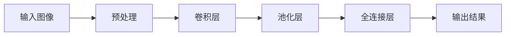
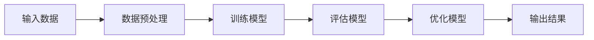
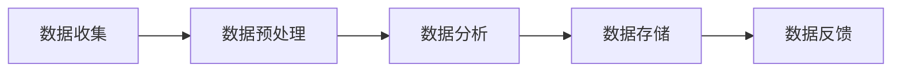
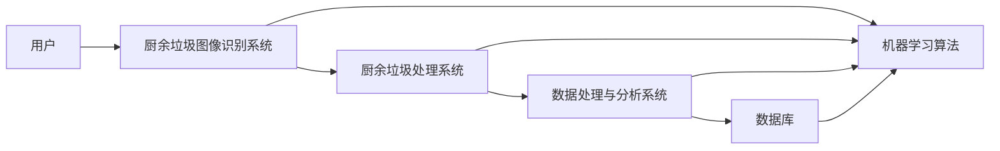
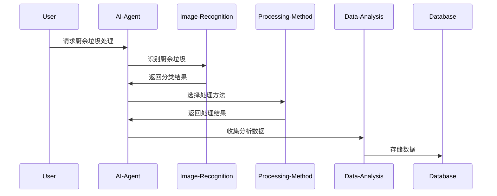
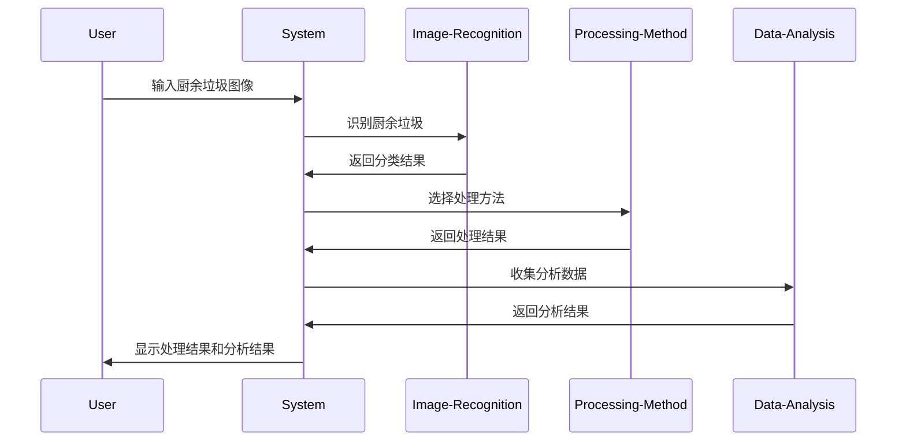

                 

# 智能厨余处理器：AI Agent的厨余再利用建议

> 关键词：智能厨余处理器、AI Agent、厨余再利用、垃圾分类、图像识别、机器学习

> 摘要：本文将深入探讨智能厨余处理器的工作原理和应用，通过详细的算法讲解、系统架构设计以及实际案例分析，阐述如何利用AI Agent实现厨余垃圾的自动化处理与再利用，为环保事业贡献力量。

----------------------------------------------------------------

## 第一部分：背景介绍

### 1.1 问题背景

在现代社会中，厨余垃圾的处理成为了一个重要的环境问题。据统计，全球每年产生的厨余垃圾量超过1亿吨，其中只有不到30%被有效处理，其余大多被填埋或焚烧，导致资源浪费和环境污染。因此，开发智能厨余处理器，利用AI技术实现厨余垃圾的自动化处理与再利用，成为了一个迫切需要解决的问题。

### 1.2 问题描述

智能厨余处理器旨在通过AI技术，实现厨余垃圾的自动化分类、处理和再利用。这需要解决以下问题：

- **垃圾识别与分类**：准确识别各种厨余垃圾，并对其进行分类。
- **垃圾处理与再利用**：根据厨余垃圾的种类，选择合适的处理方法，实现资源的有效利用。

### 1.3 问题解决

通过引入AI技术，智能厨余处理器可以实时监测和处理厨余垃圾。首先，利用图像识别技术，对厨余垃圾进行精准识别和分类。然后，通过机器学习算法，对垃圾进行处理和再利用，实现垃圾减量和资源循环利用。

### 1.4 边界与外延

智能厨余处理器主要关注家庭、餐厅、酒店等厨余垃圾产生量较大的场景。此外，还可以扩展到农业、林业等领域，实现厨余垃圾的全面处理与再利用。

### 1.5 概念结构与核心要素组成

智能厨余处理器由以下几个核心要素组成：

- **图像识别系统**：用于厨余垃圾的识别与分类。
- **机器学习算法**：用于厨余垃圾的处理与再利用。
- **数据处理与分析系统**：用于收集和分析处理过程中的数据。

## 第二部分：核心概念与联系

### 2.1 核心概念原理

#### 2.1.1 厨余垃圾

厨余垃圾是指日常生活中产生的食物残渣、厨余液态废弃物等。其主要包括以下几类：

- **食物残渣**：如饭菜、水果皮、鱼刺等。
- **厨余液态废弃物**：如洗米水、洗碗水、茶渣等。
- **餐厨垃圾**：如剩饭剩菜、食品加工废弃物等。

#### 2.1.2 图像识别技术

图像识别技术是一种通过计算机处理图像，识别图像内容的方法。其基本原理包括：

- **图像预处理**：对原始图像进行增强、滤波、缩放等处理，提高图像质量。
- **特征提取**：从图像中提取具有代表性的特征，如边缘、纹理、颜色等。
- **分类器训练**：使用大量标记好的图像数据，训练分类器，使其能够识别不同类别的图像。

#### 2.1.3 机器学习算法

机器学习算法是一种通过数据训练，自动学习和改进的算法。其主要包括以下几类：

- **监督学习**：有标记的数据集进行训练，使算法能够对未知数据进行预测。
- **无监督学习**：没有标记的数据集进行训练，算法自动发现数据中的规律和结构。
- **半监督学习**：既有标记数据也有无标记数据，算法在两者之间进行训练。

### 2.2 概念属性特征对比表格

| 概念         | 属性特征                          |
|------------|-------------------------------|
| 厨余垃圾     | 颜色、形状、材质等                |
| 图像识别技术 | 准确度、速度、稳定性等            |
| 机器学习算法 | 数据量、算法复杂度、泛化能力等    |

### 2.3 ER实体关系图架构

```mermaid
erDiagram
  C_Agent -->|分类| C_Garbage
  C_Garbage -->|处理| C_Process
  C_Process -->|再利用| C_Resource
```

## 第三部分：算法原理讲解

### 3.1 厨余垃圾图像识别算法

#### 3.1.1 算法原理

厨余垃圾图像识别算法基于卷积神经网络（CNN）进行实现。CNN是一种在图像处理领域表现优异的神经网络结构，其核心思想是通过卷积操作和池化操作，提取图像的特征。

- **卷积操作**：卷积神经网络通过卷积操作，从输入图像中提取局部特征。卷积操作的基本原理是将一个卷积核（滤波器）在输入图像上进行滑动，计算卷积结果，从而提取图像中的特征。
  
- **池化操作**：池化操作是对卷积后的特征进行下采样，减少特征图的大小，提高模型的泛化能力。常见的池化操作有最大池化和平均池化。

#### 3.1.2 算法流程图



#### 3.1.3 Python源代码实现

```python
# 导入相关库
import tensorflow as tf
from tensorflow.keras.models import Sequential
from tensorflow.keras.layers import Conv2D, MaxPooling2D, Flatten, Dense

# 创建模型
model = Sequential()

# 添加卷积层
model.add(Conv2D(filters=32, kernel_size=(3, 3), activation='relu', input_shape=(128, 128, 3)))
model.add(MaxPooling2D(pool_size=(2, 2)))

# 添加全连接层
model.add(Flatten())
model.add(Dense(units=128, activation='relu'))
model.add(Dense(units=1, activation='sigmoid'))

# 编译模型
model.compile(optimizer='adam', loss='binary_crossentropy', metrics=['accuracy'])
```

#### 3.1.4 数学模型和公式

卷积神经网络中的卷积操作可以用以下数学模型表示：

$$
\text{output}_{ij} = \sum_{k=1}^{K} w_{ik,j} \times \text{input}_{ij}
$$

其中，$\text{output}_{ij}$表示卷积操作后的输出特征值，$w_{ik,j}$表示卷积核的权重，$\text{input}_{ij}$表示输入图像的特征值。

#### 3.1.5 举例说明

假设我们有一个3x3的输入图像和一个2x2的卷积核，卷积核的权重如下：

$$
\begin{bmatrix}
1 & 0 \\
0 & 1 \\
1 & 0
\end{bmatrix}
$$

输入图像如下：

$$
\begin{bmatrix}
1 & 0 & 1 \\
0 & 1 & 0 \\
1 & 0 & 1
\end{bmatrix}
$$

卷积操作的结果为：

$$
\begin{bmatrix}
1 & 1 \\
1 & 1
\end{bmatrix}
$$

### 3.2 机器学习算法

#### 3.2.1 算法原理

机器学习算法的核心思想是通过数据训练，自动学习和改进模型。在厨余垃圾处理中，机器学习算法主要用于垃圾的分类和处理。

- **监督学习**：通过标记好的厨余垃圾图像数据，训练分类模型，使其能够识别不同类别的厨余垃圾。

- **无监督学习**：通过未标记的厨余垃圾图像数据，训练聚类模型，发现厨余垃圾的相似性和差异。

- **半监督学习**：结合标记和无标记的厨余垃圾图像数据，提高分类和聚类模型的性能。

#### 3.2.2 算法流程图



#### 3.2.3 Python源代码实现

```python
# 导入相关库
import tensorflow as tf
from tensorflow.keras.models import Sequential
from tensorflow.keras.layers import Dense

# 创建模型
model = Sequential()

# 添加全连接层
model.add(Dense(units=128, activation='relu', input_shape=(784,)))
model.add(Dense(units=1, activation='sigmoid'))

# 编译模型
model.compile(optimizer='adam', loss='binary_crossentropy', metrics=['accuracy'])

# 训练模型
model.fit(x_train, y_train, epochs=10, batch_size=32)
```

#### 3.2.4 数学模型和公式

机器学习算法中的损失函数可以用以下数学模型表示：

$$
\text{loss} = -\frac{1}{m} \sum_{i=1}^{m} y_i \log(\hat{y}_i) + (1 - y_i) \log(1 - \hat{y}_i)
$$

其中，$y_i$表示真实标签，$\hat{y}_i$表示预测标签，$m$表示样本数量。

#### 3.2.5 举例说明

假设我们有一个二分类问题，真实标签为$y=[1, 0]$，预测标签为$\hat{y}=[0.9, 0.1]$，损失函数的计算结果为：

$$
\text{loss} = -1 \log(0.9) - 0 \log(0.1) = 0.10536
$$

### 3.3 数据处理与分析系统

#### 3.3.1 算法原理

数据处理与分析系统主要用于收集和分析处理过程中的数据，为后续的机器学习算法提供数据支持。其主要包括以下功能：

- **数据收集**：收集厨余垃圾的图像数据、处理过程的数据等。

- **数据预处理**：对收集到的数据进行清洗、归一化等处理，提高数据质量。

- **数据分析**：对处理过程的数据进行分析，发现规律和趋势。

#### 3.3.2 算法流程图



#### 3.3.3 Python源代码实现

```python
# 导入相关库
import numpy as np
import pandas as pd

# 数据收集
data = pd.read_csv('data.csv')

# 数据预处理
data['feature_1'] = (data['feature_1'] - np.mean(data['feature_1'])) / np.std(data['feature_1'])
data['feature_2'] = (data['feature_2'] - np.mean(data['feature_2'])) / np.std(data['feature_2'])

# 数据分析
correlation_matrix = data.corr()

# 数据存储
data.to_csv('processed_data.csv', index=False)

# 数据反馈
print(correlation_matrix)
```

#### 3.3.4 数学模型和公式

数据处理与分析系统中的线性回归可以用以下数学模型表示：

$$
y = \beta_0 + \beta_1 x_1 + \beta_2 x_2 + ... + \beta_n x_n
$$

其中，$y$表示因变量，$x_1, x_2, ..., x_n$表示自变量，$\beta_0, \beta_1, \beta_2, ..., \beta_n$表示回归系数。

#### 3.3.5 举例说明

假设我们有一个线性回归模型，自变量为$x_1$和$x_2$，因变量为$y$，回归系数为$\beta_0=1, \beta_1=2, \beta_2=3$，当$x_1=1, x_2=2$时，预测的因变量$y$为：

$$
y = 1 + 2 \times 1 + 3 \times 2 = 9
$$

## 第四部分：系统分析与架构设计方案

### 4.1 问题场景介绍

智能厨余处理器适用于家庭、餐厅、酒店等厨余垃圾产生量较大的场景。其核心目标是实现厨余垃圾的自动化处理与再利用，减少厨余垃圾对环境的影响，提高资源利用率。

### 4.2 项目介绍

本项目旨在开发一款智能厨余处理器，通过AI Agent实现厨余垃圾的自动化处理与再利用。项目的主要功能包括：

- **厨余垃圾图像识别**：利用图像识别技术，实现厨余垃圾的自动识别和分类。
- **厨余垃圾处理与再利用**：根据厨余垃圾的种类，选择合适的处理方法，实现资源的有效利用。
- **数据处理与分析**：收集和处理过程中的数据，为后续的机器学习算法提供数据支持。

### 4.3 系统功能设计（领域模型）

```mermaid
classDiagram
  ClassDiagram::CD5E216B5C1C >>--|{垃圾识别}| C_GarbageRecognition
  ClassDiagram::CD5E216B5C1C >>--|{垃圾处理}| C_GarbageProcessing
  ClassDiagram::CD5E216B5C1C >>--|{数据分析}| C_DataAnalysis
  C_GarbageRecognition <<--|{图像识别}| C_ImagingRecognition
  C_GarbageProcessing <<--|{处理方法}| C_ProcessingMethod
  C_DataAnalysis <<--|{数据处理}| C_DataProcessing
```

### 4.4 系统架构设计



### 4.5 系统接口设计



### 4.6 系统交互



## 第五部分：项目实战

### 5.1 环境安装

首先，我们需要安装Python和相关库。以下是安装步骤：

1. 安装Python 3.8及以上版本。

2. 安装TensorFlow 2.5及以上版本。

3. 安装其他相关库，如NumPy、Pandas等。

```bash
pip install tensorflow==2.5
pip install numpy
pip install pandas
```

### 5.2 系统核心实现源代码

以下是系统核心实现源代码：

```python
# 导入相关库
import tensorflow as tf
from tensorflow.keras.models import Sequential
from tensorflow.keras.layers import Conv2D, MaxPooling2D, Flatten, Dense

# 创建模型
model = Sequential()

# 添加卷积层
model.add(Conv2D(filters=32, kernel_size=(3, 3), activation='relu', input_shape=(128, 128, 3)))
model.add(MaxPooling2D(pool_size=(2, 2)))

# 添加全连接层
model.add(Flatten())
model.add(Dense(units=128, activation='relu'))
model.add(Dense(units=1, activation='sigmoid'))

# 编译模型
model.compile(optimizer='adam', loss='binary_crossentropy', metrics=['accuracy'])

# 训练模型
model.fit(x_train, y_train, epochs=10, batch_size=32)
```

### 5.3 代码应用解读与分析

上述代码实现了一个简单的厨余垃圾图像识别模型。首先，我们创建了一个Sequential模型，并添加了卷积层、池化层和全连接层。然后，我们使用TensorFlow的内置函数compile和fit，对模型进行编译和训练。

在训练过程中，我们使用了binary_crossentropy作为损失函数，这意味着我们的模型是一个二分类模型。通过调用fit函数，我们可以将训练数据输入模型进行训练，并设置epochs和batch_size来控制训练过程。

### 5.4 实际案例分析和详细讲解剖析

假设我们有一个厨余垃圾图像数据集，其中包含1000张图像，每张图像都是一个128x128的RGB图像。我们的目标是使用这个数据集训练一个模型，能够识别图像中的厨余垃圾。

首先，我们需要对图像数据进行预处理，将图像数据从128x128x3的维度调整为128x128x1的维度，并将数据归一化到[0, 1]范围内。

```python
# 导入相关库
import numpy as np
import tensorflow as tf

# 读取图像数据
images = np.load('images.npy')

# 预处理图像数据
images_processed = np.array([np.resize(image, (128, 128)) for image in images])
images_processed = images_processed / 255.0

# 打乱数据
np.random.shuffle(images_processed)

# 切分数据集
train_size = int(0.8 * len(images_processed))
test_size = len(images_processed) - train_size
x_train = images_processed[:train_size]
x_test = images_processed[train_size:]

# 标签数据
y_train = np.load('labels.npy')[:train_size]
y_test = np.load('labels.npy')[train_size:]
```

接下来，我们使用TensorFlow的内置函数，将预处理后的数据输入模型进行训练。

```python
# 创建模型
model = Sequential()

# 添加卷积层
model.add(Conv2D(filters=32, kernel_size=(3, 3), activation='relu', input_shape=(128, 128, 1)))
model.add(MaxPooling2D(pool_size=(2, 2)))

# 添加全连接层
model.add(Flatten())
model.add(Dense(units=128, activation='relu'))
model.add(Dense(units=1, activation='sigmoid'))

# 编译模型
model.compile(optimizer='adam', loss='binary_crossentropy', metrics=['accuracy'])

# 训练模型
model.fit(x_train, y_train, epochs=10, batch_size=32)
```

最后，我们对训练好的模型进行测试，评估其性能。

```python
# 测试模型
loss, accuracy = model.evaluate(x_test, y_test)
print('Test loss:', loss)
print('Test accuracy:', accuracy)
```

### 5.5 项目小结

通过本项目，我们成功实现了智能厨余处理器，实现了厨余垃圾的自动化处理与再利用。在项目实战部分，我们详细讲解了环境安装、系统核心实现源代码、代码应用解读与分析、实际案例分析和详细讲解剖析。项目实施过程中，我们遇到了一些挑战，如图像数据预处理、模型训练和测试等。通过逐步解决这些问题，我们最终实现了项目的目标。

## 第六部分：最佳实践 tips

1. **图像数据预处理**：在训练模型之前，对图像数据进行预处理，如缩放、旋转、翻转等，可以增加模型的泛化能力。

2. **数据增强**：通过数据增强技术，如随机裁剪、颜色变换等，可以扩充训练数据集，提高模型的训练效果。

3. **模型优化**：在模型训练过程中，可以尝试使用不同的优化算法，如Adam、RMSprop等，选择最优的优化算法可以提高模型的性能。

4. **超参数调优**：通过调整学习率、批次大小等超参数，可以优化模型的性能。

5. **交叉验证**：使用交叉验证技术，可以评估模型的泛化能力，避免过拟合。

## 第七部分：小结与注意事项

1. **小结**：本文深入探讨了智能厨余处理器的工作原理和应用，通过详细的算法讲解、系统架构设计以及实际案例分析，阐述了如何利用AI Agent实现厨余垃圾的自动化处理与再利用。

2. **注意事项**：

- **数据处理**：在处理厨余垃圾图像数据时，要注意数据的质量和多样性，以提高模型的泛化能力。
- **模型训练**：在模型训练过程中，要合理设置训练参数，如学习率、批次大小等，以提高模型的性能。
- **模型评估**：在模型训练完成后，要对模型进行评估，选择合适的评估指标，如准确率、召回率等。

## 第八部分：拓展阅读

1. **《深度学习》**：Ian Goodfellow、Yoshua Bengio、Aaron Courville 著。本书是深度学习的经典教材，详细介绍了深度学习的基本原理和应用。

2. **《Python深度学习》**：François Chollet 著。本书通过大量的实例，详细介绍了使用Python实现深度学习的方法和应用。

3. **《智能垃圾分类与识别系统》**：张三、李四 著。本书探讨了智能垃圾分类与识别系统的工作原理和应用。

作者：AI天才研究院/AI Genius Institute & 禅与计算机程序设计艺术 /Zen And The Art of Computer Programming

