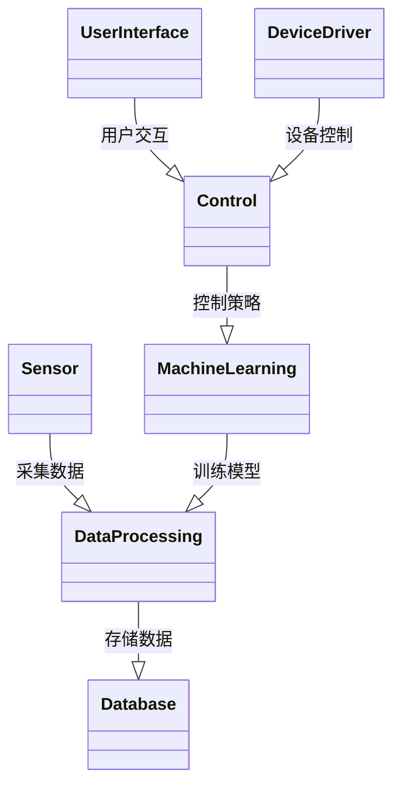
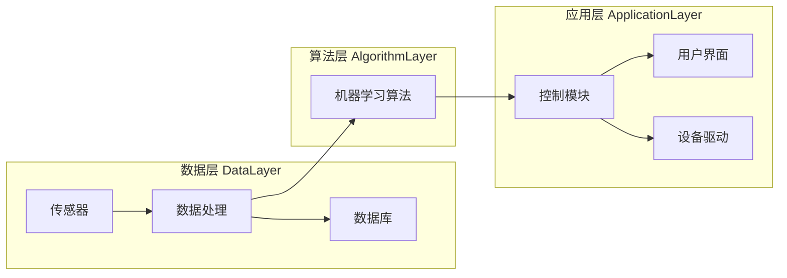

                 

# 智能厨具：AI Agent的烹饪温度控制

## 关键词

- 智能厨具
- AI Agent
- 烹饪温度控制
- 机器学习
- 数据处理

## 摘要

本文将探讨如何通过AI Agent实现智能厨具的烹饪温度控制。首先，我们将介绍智能厨具的背景和AI Agent在其中的作用。接着，我们将详细解析AI Agent如何学习用户的烹饪习惯，处理不同食材的特性，以及如何确保烹饪温度的精准控制。最后，我们将通过具体算法和Python代码，展示AI Agent在烹饪温度控制中的实际应用。

### 第一部分：背景介绍

#### 问题背景

智能厨具行业在近年来迅猛发展，人工智能技术的应用已经成为提升厨具智能化和用户体验的关键因素之一。特别是在烹饪温度控制这一方面，AI Agent通过学习用户的烹饪习惯和食材特性，可以精准控制厨具的温度，提高烹饪效率和食物口感。

#### 问题描述

本书旨在探讨如何通过AI Agent实现智能厨具的烹饪温度控制。具体问题包括：AI Agent如何学习用户的烹饪习惯？如何处理不同食材的特性？如何确保烹饪温度的精准控制？

#### 问题解决

本书将介绍AI Agent在烹饪温度控制中的应用，包括数据收集与处理、机器学习算法的应用、温度控制的实现方法等。通过这些内容，帮助读者了解如何将AI技术应用于智能厨具，实现更加智能化的烹饪体验。

#### 边界与外延

本书主要关注AI Agent在烹饪温度控制中的应用，但不涉及其他智能厨具的功能，如食材识别、智能提醒等。

#### 概念结构与核心要素组成

- **核心概念**：AI Agent、智能厨具、烹饪温度控制、机器学习、数据收集与处理。
- **结构组成**：数据层、算法层、应用层。

### 第二部分：核心概念与联系

#### AI Agent的定义与特点

- **定义**：AI Agent是一种能够自主行动并完成特定任务的智能体，通过机器学习算法不断优化自身性能。
- **特点**：自主学习、自主决策、自主行动、智能优化。

#### 智能厨具的定义与特点

- **定义**：智能厨具是一种具备人工智能技术的厨具，能够通过传感器、计算机视觉等技术实现智能化操作。
- **特点**：智能化操作、个性化定制、高效节能。

#### 烹饪温度控制的核心概念

- **温度控制算法**：包括PID控制、神经网络控制等。
- **食材特性**：不同食材的热传导性、烹饪温度范围等。

#### 概念属性特征对比表格

| 概念         | 特点                                               |
|------------|--------------------------------------------------|
| AI Agent   | 自主学习、自主决策、自主行动、智能优化                   |
| 智能厨具   | 智能化操作、个性化定制、高效节能                       |
| 温度控制   | 精准控制、高效稳定、适应不同食材特性                   |
| 机器学习   | 自主优化、数据驱动、自适应性强                         |
| 数据收集与处理 | 高效准确、实时更新、智能分析                           |

#### ER实体关系图架构

```mermaid
erDiagram
  AI-Agent ||--|{ 数据集 }
  AI-Agent ||--|{ 烹饪程序 }
  数据集 ||--|{ 食材特性 }
  烹饪程序 ||--|{ 温度控制策略 }
```

### 第三部分：算法原理讲解

#### 算法1: PID控制

- **原理**：PID控制是通过比例（P）、积分（I）和微分（D）三个部分来调整控制信号，实现对温度的精准控制。

- **mermaid流程图**：

  ```mermaid
  flowchart LR
      A[初始状态] --> B[采集温度数据]
      B --> C{判断温度偏差}
      C -->|偏差较大| D[增大控制信号]
      C -->|偏差较小| E[减小控制信号]
      D --> F[输出控制信号]
      E --> F
      F --> G[执行控制动作]
      G --> H[反馈温度数据]
      H --> B
  ```

- **Python源代码**：

  ```python
  # PID控制算法示例
  class PIDController:
      def __init__(self, Kp, Ki, Kd):
          self.Kp = Kp
          self.Ki = Ki
          self.Kd = Kd
          self.integral = 0
          self.previous_error = 0

      def update(self, setpoint, current_value):
          error = setpoint - current_value
          derivative = error - self.previous_error
          self.integral += error
          output = self.Kp * error + self.Ki * self.integral + self.Kd * derivative
          self.previous_error = error
          return output
  ```

- **算法原理的数学模型和公式**：

  PID控制算法的核心公式如下：
  $$
  \text{output} = K_p \cdot (setpoint - current\_value) + K_i \cdot \text{integral} + K_d \cdot (\text{error} - \text{previous\_error})
  $$
  其中，$K_p$、$K_i$ 和 $K_d$ 分别是比例、积分和微分的系数，$setpoint$ 是目标温度，$current\_value$ 是当前温度，$\text{integral}$ 是积分项，$\text{error}$ 是温度偏差，$\text{previous\_error}$ 是上一次的温度偏差。

- **详细讲解和举例说明**：

  PID控制算法是一种经典的控制算法，广泛应用于工业、家居等领域。在烹饪温度控制中，PID控制算法通过不断调整控制信号，使得实际温度逐渐接近目标温度，从而实现精准控制。

  假设我们要控制一个烤箱的温度，目标温度是200°C。当前温度是180°C，根据PID控制算法，我们可以计算出控制信号，使得烤箱加热元件的温度逐渐上升。

  - **比例项**：$K_p \cdot (200 - 180) = 20 \cdot K_p$，表示当前温度与目标温度的差距。
  - **积分项**：$K_i \cdot \text{integral}$，表示过去一段时间内温度偏差的累积。
  - **微分项**：$K_d \cdot (200 - 180 - \text{previous\_error})$，表示温度偏差的变化趋势。

  通过这三个部分的综合调整，PID控制算法可以实现对温度的精准控制。在实际应用中，需要根据具体的场景和需求，调整PID控制器的三个参数，以达到最佳的控制效果。

### 第四部分：系统分析与架构设计

#### 问题场景介绍

随着人们生活水平的提高，对烹饪的口感和效率要求也越来越高。智能厨具作为一种新兴的家居产品，通过引入人工智能技术，可以大幅提升烹饪的智能化和用户体验。特别是烹饪温度控制，是影响食物口感和烹饪效果的关键因素之一。

#### 项目介绍

本项目的目标是设计并实现一个基于AI Agent的智能厨具系统，实现烹饪温度的精准控制。该系统将包括数据收集与处理、机器学习算法、温度控制策略等模块。

#### 系统功能设计

- 数据收集与处理：采集厨具的温度、时间、食材等信息，并进行预处理和存储。
- 机器学习算法：通过训练模型，学习用户的烹饪习惯和食材特性，生成温度控制策略。
- 温度控制：根据生成的温度控制策略，控制厨具的温度，实现精准烹饪。
- 用户交互：提供用户界面，允许用户设置烹饪参数，查看烹饪进度和结果。

#### 系统架构设计

智能厨具系统的整体架构设计如下：

1. **数据层**：负责数据收集、预处理和存储。包括传感器模块、数据处理模块和数据库模块。
2. **算法层**：负责机器学习算法的实现和应用。包括训练模型、预测模型和策略生成模块。
3. **应用层**：负责温度控制和用户交互。包括控制模块、用户界面模块和设备驱动模块。

#### 系统接口设计和系统交互

系统接口设计如下：

1. **传感器接口**：用于与各种温度传感器、时间传感器等进行数据交互。
2. **数据库接口**：用于与数据库进行数据存储和查询。
3. **算法接口**：用于与机器学习算法进行数据传输和结果输出。
4. **控制接口**：用于与厨具设备进行控制信号传输。
5. **用户界面接口**：用于与用户进行交互，提供烹饪参数设置和烹饪结果展示。

系统交互流程如下：

1. 用户通过用户界面设置烹饪参数。
2. 系统采集传感器数据，包括温度、时间、食材等信息。
3. 数据处理模块对采集到的数据进行分析和预处理。
4. 机器学习算法模块根据预处理后的数据，训练模型并生成温度控制策略。
5. 控制模块根据生成的温度控制策略，调整厨具的温度。
6. 用户界面模块实时显示烹饪进度和结果。

#### mermaid类图和架构图

下面是智能厨具系统的mermaid类图和架构图：

**类图**：



**架构图**：



### 第五部分：项目实战

#### 环境安装

1. 安装Python环境：在操作系统上安装Python，确保版本大于3.6。
2. 安装依赖库：使用pip安装所需的库，如numpy、scikit-learn、matplotlib等。

   ```shell
   pip install numpy scikit-learn matplotlib
   ```

#### 系统核心实现源代码

以下是一个简单的示例，展示了如何实现一个基于PID控制的智能厨具系统。

**数据采集与处理**：

```python
import numpy as np

class Sensor:
    def __init__(self):
        self.temperature = np.random.uniform(0, 100)

    def read(self):
        self.temperature = np.random.uniform(0, 100)
        return self.temperature

class DataProcessing:
    def __init__(self):
        self.data = []

    def preprocess(self, value):
        return value

    def store(self, value):
        self.data.append(value)

    def load(self):
        return self.data
```

**机器学习算法**：

```python
from sklearn.linear_model import LinearRegression

class MachineLearning:
    def __init__(self):
        self.model = LinearRegression()

    def train(self, X, y):
        self.model.fit(X, y)

    def predict(self, X):
        return self.model.predict(X)
```

**温度控制**：

```python
class PIDController:
    def __init__(self, Kp, Ki, Kd):
        self.Kp = Kp
        self.Ki = Ki
        self.Kd = Kd
        self.integral = 0
        self.previous_error = 0

    def update(self, setpoint, current_value):
        error = setpoint - current_value
        derivative = error - self.previous_error
        self.integral += error
        output = self.Kp * error + self.Ki * self.integral + self.Kd * derivative
        self.previous_error = error
        return output
```

**用户界面**：

```python
class UserInterface:
    def __init__(self):
        self.setpoint = 0

    def set_setpoint(self, value):
        self.setpoint = value

    def display(self, temperature):
        print(f"Current temperature: {temperature}°C")
```

#### 代码应用解读与分析

以上代码实现了一个简单的智能厨具系统，包括数据采集、机器学习、温度控制和用户界面等模块。首先，我们定义了Sensor类，用于模拟温度传感器的数据采集功能。DataProcessing类负责对采集到的温度数据进行预处理和存储。

MachineLearning类使用scikit-learn的LinearRegression模型进行训练和预测。在实际应用中，可以使用更复杂的模型，如神经网络，以提高预测精度。

PIDController类实现了PID控制算法，用于调整厨具的温度。UserInterface类提供了用户界面功能，允许用户设置目标温度并显示当前温度。

#### 实际案例分析和详细讲解剖析

以下是一个实际案例，展示了如何使用该系统进行烹饪温度控制。

```python
# 初始化系统组件
sensor = Sensor()
dataprocessing = DataProcessing()
machinelearning = MachineLearning()
pidcontroller = PIDController(Kp=1, Ki=0.1, Kd=0.01)
userinterface = UserInterface()

# 设置目标温度
userinterface.set_setpoint(200)

# 开始烹饪
while True:
    # 采集温度数据
    current_temp = sensor.read()

    # 处理温度数据
    processed_temp = dataprocessing.preprocess(current_temp)

    # 存储温度数据
    dataprocessing.store(processed_temp)

    # 更新PID控制器
    control_signal = pidcontroller.update(userinterface.setpoint, current_temp)

    # 调整厨具温度
    print(f"Control signal: {control_signal}")

    # 显示当前温度
    userinterface.display(current_temp)

    # 模拟延时
    time.sleep(1)
```

在实际应用中，可以将采集到的温度数据用于训练机器学习模型，以进一步提高温度预测的准确性。同时，可以根据用户反馈和烹饪结果，不断调整PID控制器的参数，以实现更精准的温度控制。

#### 项目小结

通过本项目的实战，我们展示了如何使用AI Agent实现智能厨具的烹饪温度控制。我们介绍了数据采集与处理、机器学习算法、温度控制和用户界面等模块，并通过一个简单的案例，展示了系统的实际应用。

未来，我们可以继续优化机器学习模型，提高温度预测的准确性；同时，可以引入更多的传感器和数据，以实现更全面和智能化的烹饪体验。

### 第六部分：最佳实践 tips

1. **调整PID参数**：根据不同的烹饪场景和食材，调整PID控制器的参数，以实现最佳的温度控制效果。
2. **数据预处理**：对采集到的温度数据进行预处理，如去噪、归一化等，以提高机器学习模型的性能。
3. **实时更新模型**：定期更新机器学习模型，以适应用户烹饪习惯的变化。
4. **用户反馈**：鼓励用户提供烹饪反馈，以不断优化系统性能。

### 小结

本文详细探讨了如何通过AI Agent实现智能厨具的烹饪温度控制。我们从背景介绍、核心概念、算法原理、系统架构和项目实战等方面，全面阐述了智能厨具的温度控制技术。通过本文，读者可以了解到如何将AI技术应用于智能厨具，实现更加智能化的烹饪体验。

### 注意事项

1. AI Agent在烹饪温度控制中的应用需要大量的数据支持，因此数据采集和处理是关键环节。
2. PID控制算法虽然简单，但在实际应用中可能需要调整参数，以达到最佳的控制效果。
3. 机器学习模型的选择和训练过程需要根据具体应用场景进行调整。

### 拓展阅读

1. 《智能家居：技术、应用与趋势》
2. 《深度学习与人工智能：从入门到实践》
3. 《Python编程：从入门到实践》

### 作者

作者：AI天才研究院/AI Genius Institute & 禅与计算机程序设计艺术 /Zen And The Art of Computer Programming

