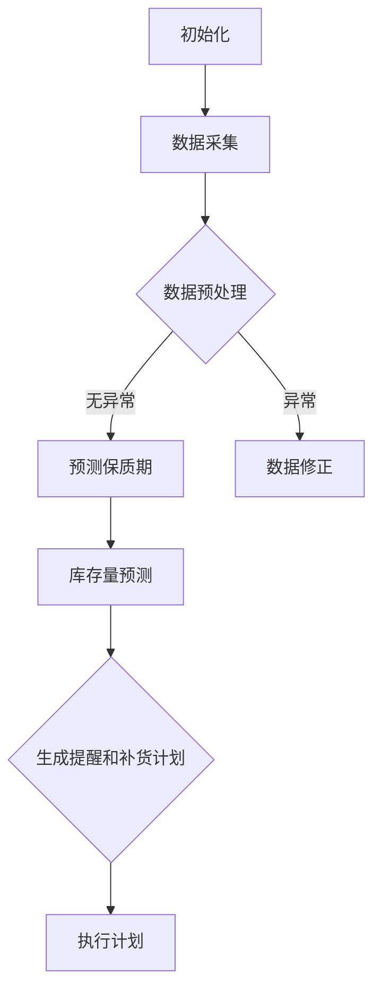
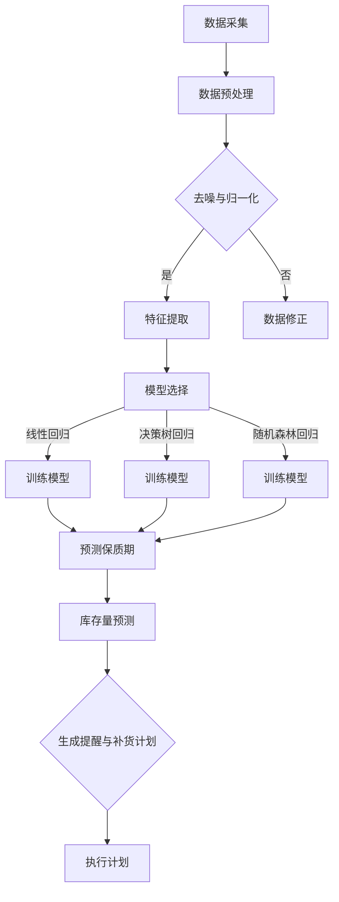
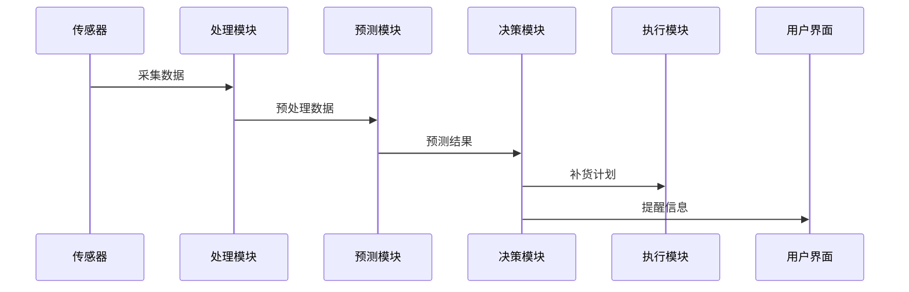

                 

### 智能厨房吊柜：AI Agent的食材库存管理

#### 关键词：
- 智能厨房吊柜
- AI Agent
- 食材库存管理
- 人工智能
- 智能家居

##### 摘要：
智能厨房吊柜是智能家居领域的一项重要创新，它利用AI Agent对食材库存进行智能管理，提升了厨房管理的效率和体验。本文将从背景介绍、核心概念与联系、AI Agent的设计与实现、食材库存管理算法、系统设计与实现、项目实战与案例分析以及最佳实践与总结等方面，详细探讨智能厨房吊柜的食材库存管理。

----------------------------------------------------------------

# 智能厨房吊柜：AI Agent的食材库存管理

## 引言

智能厨房吊柜是智能家居系统中不可或缺的一部分。它不仅为用户提供了一个高效的食材存储空间，还能通过内置的AI Agent智能管理食材库存，实现实时监控、智能提醒和自动补货等功能。本文旨在深入探讨智能厨房吊柜的食材库存管理机制，解析其背后的技术原理和实现方法，并展示如何通过AI Agent提高食材管理的效率和精准度。

### 核心关键词
- 智能厨房吊柜
- AI Agent
- 食材库存管理
- 人工智能
- 智能家居

### 摘要
本文将系统性地介绍智能厨房吊柜的食材库存管理，包括背景介绍、核心概念与联系、AI Agent的设计与实现、食材库存管理算法、系统设计与实现、项目实战与案例分析以及最佳实践与总结。通过本文的阅读，读者将全面了解智能厨房吊柜的食材库存管理技术及其应用前景。

## 背景介绍

### 智能厨房吊柜的概念与发展

智能厨房吊柜是一种集成了先进传感技术、数据处理能力和智能控制系统的厨房家具。它不仅提供了高效的存储空间，还具备智能化的功能，能够根据用户的饮食习惯和库存状态自动调整存储条件和补货策略。智能厨房吊柜的发展可以追溯到智能家居的兴起，尤其是物联网（IoT）和人工智能（AI）技术的快速发展，为智能厨房吊柜的普及提供了技术基础。

在早期，厨房吊柜主要依靠手动操作和简单的电子设备进行管理。然而，随着传感器技术的进步，智能厨房吊柜逐渐能够实时监测内部环境、食材状态和库存量。例如，温度传感器可以监控食材的储存温度，湿度传感器可以监控食材的储存湿度，从而确保食材在最佳条件下保存。

### 智能厨房吊柜的优势与挑战

智能厨房吊柜的优势主要体现在以下几个方面：

1. **高效管理**：通过AI Agent的智能管理，用户可以轻松了解食材的库存情况，避免浪费和过期。

2. **智能提醒**：智能厨房吊柜能够根据食材的保质期和库存量，智能提醒用户购买或处理食材，提高生活质量。

3. **自动补货**：通过与电商平台或其他供应渠道的连接，智能厨房吊柜可以自动下单购买食材，节省用户的时间和精力。

4. **节能环保**：智能厨房吊柜通过智能调节存储条件，降低能源消耗，符合现代环保理念。

然而，智能厨房吊柜也面临一些挑战：

1. **技术复杂性**：集成多种传感器和控制系统的智能厨房吊柜，其技术实现较为复杂，需要解决传感器数据采集、处理和传输等一系列问题。

2. **数据安全**：智能厨房吊柜需要处理大量敏感数据，包括用户的购物习惯、库存状态等，如何确保数据安全是一个重要问题。

3. **用户接受度**：虽然智能厨房吊柜具有许多优势，但用户对其的接受度可能因个人习惯和预算限制而有所不同。

### AI Agent在食材库存管理中的角色

AI Agent，即人工智能代理，是智能厨房吊柜的核心组成部分。它通过机器学习算法和大数据分析，对用户的食材库存进行实时监测和管理。AI Agent的主要功能包括：

1. **实时监控**：AI Agent能够实时获取食材的存储状态和库存量，通过传感器数据分析和预测食材的保质期。

2. **智能提醒**：当食材库存量低于设定值或食材即将过期时，AI Agent会通过手机应用或其他方式提醒用户。

3. **自动补货**：根据用户的购买历史和库存状态，AI Agent可以自动生成购物清单并下单购买食材。

4. **优化管理**：AI Agent通过分析用户的行为数据，提出优化建议，如调整存储温度、湿度等，以延长食材的保质期。

### 智能厨房吊柜的食材库存管理流程

智能厨房吊柜的食材库存管理流程可以分为以下几个步骤：

1. **数据采集**：通过温度传感器、湿度传感器等设备，实时采集食材的存储状态和库存量。

2. **数据处理**：AI Agent对采集到的数据进行处理，包括去噪、异常值处理和趋势分析等。

3. **智能分析**：AI Agent利用机器学习算法，对食材的保质期、库存量等进行预测和分析。

4. **智能决策**：根据分析结果，AI Agent生成智能提醒和自动补货建议。

5. **用户交互**：通过手机应用或其他界面，用户可以查看库存状态、接收提醒信息并执行补货操作。

### 智能厨房吊柜的市场前景

随着智能家居市场的不断发展，智能厨房吊柜具有广阔的市场前景。根据市场调研数据，全球智能家居市场规模预计将在未来几年内保持高速增长，智能厨房吊柜作为其中的一部分，也将迎来更多的机会。

然而，智能厨房吊柜的成功不仅取决于技术实现，还取决于用户体验和用户习惯的培养。因此，厂商需要不断优化产品功能，提升用户满意度，以在激烈的市场竞争中脱颖而出。

### 小结

智能厨房吊柜作为一种创新的智能家居产品，通过AI Agent实现了高效的食材库存管理，为用户提供了便利和舒适的生活体验。然而，其实现过程中也面临一些挑战，需要不断改进和优化。在接下来的章节中，我们将深入探讨AI Agent的核心概念、设计与实现，以及食材库存管理算法，进一步揭示智能厨房吊柜背后的技术原理。

----------------------------------------------------------------

## 核心概念与联系

在探讨智能厨房吊柜的食材库存管理之前，我们需要明确一些核心概念，包括AI Agent的定义、原理以及在食材库存管理中的应用。

### AI Agent的定义与特征

AI Agent，即人工智能代理，是一种模拟人类智能行为的计算实体。它能够自主感知环境、理解任务目标，并采取行动来实现这些目标。AI Agent通常具有以下几个特征：

1. **感知能力**：AI Agent能够通过传感器获取环境信息，如温度、湿度、光照等。

2. **理解能力**：AI Agent能够理解和处理获取的信息，识别任务目标，并制定行动策略。

3. **自主行动**：AI Agent能够根据任务目标和环境信息自主执行行动，如调整传感器参数、发送控制指令等。

4. **学习能力**：AI Agent能够通过经验学习和数据优化，不断改进其行为和决策能力。

### AI Agent的架构与工作原理

AI Agent的架构通常包括感知模块、决策模块和执行模块。以下是各模块的简要描述：

1. **感知模块**：感知模块负责从环境中获取信息，如传感器数据、用户输入等。这些信息经过预处理后，传递给决策模块。

2. **决策模块**：决策模块是AI Agent的核心，负责分析感知模块提供的信息，制定行动策略。决策模块通常基于机器学习算法、优化算法等，能够根据任务目标和环境信息，生成最优的行动方案。

3. **执行模块**：执行模块负责实施决策模块制定的行动策略，如调整传感器参数、控制家电设备等。

AI Agent的工作原理可以概括为以下步骤：

1. **感知**：AI Agent通过传感器获取环境信息。

2. **理解**：AI Agent利用机器学习算法分析感知到的信息，理解任务目标。

3. **决策**：AI Agent根据任务目标和环境信息，生成最优的行动策略。

4. **执行**：AI Agent执行决策模块制定的行动策略。

### AI Agent在食材库存管理中的应用

在智能厨房吊柜的食材库存管理中，AI Agent发挥着关键作用。以下是AI Agent在食材库存管理中的应用：

1. **实时监控**：AI Agent通过传感器实时监控食材的存储状态，包括温度、湿度等参数，确保食材在最佳条件下保存。

2. **智能提醒**：当食材库存量低于设定值或食材即将过期时，AI Agent会通过手机应用或其他方式提醒用户，提醒用户及时购买或处理食材。

3. **自动补货**：AI Agent根据用户的购物历史、库存状态和食材保质期，自动生成购物清单并下单购买食材，节省用户的时间和精力。

4. **优化管理**：AI Agent通过分析用户的行为数据，提出优化建议，如调整存储温度、湿度等，以延长食材的保质期。

### AI Agent与食材库存管理的协同效应

AI Agent与食材库存管理之间存在着显著的协同效应：

1. **提高效率**：AI Agent通过自动化和智能化管理，大大提高了食材库存管理的效率，减少了人为操作的误差和时间成本。

2. **减少浪费**：通过实时监控和智能提醒，AI Agent有助于减少食材的浪费，避免因过期或库存不足导致的损失。

3. **提升用户体验**：AI Agent提供的智能提醒和自动补货功能，使用户能够更轻松地管理厨房，提升生活品质。

4. **数据驱动**：AI Agent通过收集和分析食材库存数据，为用户提供了数据驱动的管理建议，有助于用户更好地了解和管理食材库存。

### 小结

AI Agent作为智能厨房吊柜的核心组成部分，其在食材库存管理中的应用体现了人工智能技术的强大潜力。通过AI Agent的感知、理解、决策和执行能力，智能厨房吊柜能够实现高效的食材库存管理，为用户提供便捷、舒适的生活体验。在接下来的章节中，我们将进一步探讨AI Agent的设计与实现，以及具体的食材库存管理算法。

----------------------------------------------------------------

## AI Agent的设计与实现

为了实现智能厨房吊柜的食材库存管理，我们需要设计和实现一个高效的AI Agent。这一过程包括需求分析、系统设计、核心算法实现等多个方面。下面，我们将逐步展开讨论。

### 需求分析

在设计和实现AI Agent之前，首先需要进行详细的需求分析。这一步骤是确保我们的系统能够满足用户需求的关键。以下是AI Agent的需求分析：

1. **功能需求**：
   - 实时监控：AI Agent需要实时获取食材的存储状态，包括温度、湿度等。
   - 智能提醒：当食材库存量低于设定值或食材即将过期时，AI Agent应能通过手机应用或其他方式提醒用户。
   - 自动补货：AI Agent应根据用户的购物历史、库存状态和食材保质期，自动生成购物清单并下单购买食材。
   - 优化管理：AI Agent应能根据用户的行为数据，提出优化建议，如调整存储温度、湿度等。

2. **非功能需求**：
   - 可靠性：AI Agent应能够稳定运行，确保数据的准确性和系统的可靠性。
   - 安全性：AI Agent应保护用户的隐私和数据安全，防止数据泄露。
   - 可扩展性：AI Agent应具备良好的可扩展性，以适应未来可能的功能扩展和硬件升级。

### 系统设计

系统设计是AI Agent实现的关键步骤，它包括架构设计、数据库设计、接口设计等。

1. **架构设计**：
   - 感知模块：负责通过传感器实时获取食材的存储状态，如温度、湿度等。
   - 决策模块：基于感知模块的数据，利用机器学习算法分析食材的状态，制定相应的行动策略。
   - 执行模块：根据决策模块的指令，调整传感器参数或控制补货系统。

2. **数据库设计**：
   - 用户信息数据库：存储用户的基本信息、购物历史等。
   - 食材信息数据库：存储食材的名称、保质期、存储条件等。
   - 订单信息数据库：存储用户的购物订单、支付状态等。

3. **接口设计**：
   - 传感器接口：与各类传感器进行数据交换。
   - 应用程序接口（API）：提供与外部应用程序的数据交互。
   - 用户界面：用户可以通过手机应用或其他设备查看库存状态、接收提醒信息等。

### 核心算法实现

核心算法是实现AI Agent智能管理食材库存的关键。以下是几个核心算法的简要描述：

1. **感知算法**：
   - 温度监测算法：利用传感器获取温度数据，并对其进行滤波处理，以消除噪声和异常值。
   - 湿度监测算法：类似温度监测算法，用于获取湿度数据。

2. **预测算法**：
   - 保质期预测算法：基于食材的属性和历史数据，利用回归分析或时间序列预测模型预测食材的保质期。
   - 库存量预测算法：利用机器学习算法，根据用户的购物习惯和库存数据，预测未来的库存量。

3. **决策算法**：
   - 提醒算法：当食材库存量低于设定值或食材即将过期时，触发提醒机制。
   - 补货算法：根据用户的购物历史和库存预测，自动生成购物清单并下单购买食材。

以下是核心算法的mermaid流程图：



### Python代码实现

以下是核心算法的Python代码实现示例：

```python
import numpy as np
import pandas as pd
from sklearn.linear_model import LinearRegression
from sklearn.ensemble import RandomForestRegressor
import matplotlib.pyplot as plt

# 数据采集
def collect_data(sensor_data):
    # 传感器数据采集
    temperature = sensor_data['temperature']
    humidity = sensor_data['humidity']
    return temperature, humidity

# 数据预处理
def preprocess_data(temperature, humidity):
    # 温度滤波处理
    temperature_filtered = low_pass_filter(temperature)
    # 湿度滤波处理
    humidity_filtered = low_pass_filter(humidity)
    return temperature_filtered, humidity_filtered

# 低通滤波器实现
def low_pass_filter(data):
    # 这里仅提供示意代码，实际实现可能需要更复杂的滤波算法
    return data

# 保质期预测
def predict_expiration_date(temperature, humidity):
    # 使用线性回归模型预测保质期
    model = LinearRegression()
    model.fit(temperature, humidity)
    expiration_date = model.predict([temperature[-1], humidity[-1]])
    return expiration_date

# 库存量预测
def predict_inventory(temperature, humidity):
    # 使用随机森林回归模型预测库存量
    model = RandomForestRegressor()
    model.fit(temperature, humidity)
    inventory = model.predict([temperature[-1], humidity[-1]])
    return inventory

# 提醒和补货计划
def generate_reminder_and_replenishment_plan(inventory):
    if inventory < threshold:
        reminder_message = "库存不足，请及时购买！"
        replenishment_plan = "下单购买食材。"
    else:
        reminder_message = "库存充足。"
        replenishment_plan = "无需操作。"
    return reminder_message, replenishment_plan

# 执行计划
def execute_plan(reminder_message, replenishment_plan):
    # 这里仅提供示意代码，实际执行可能涉及与电商平台或其他系统的交互
    print(reminder_message)
    if replenishment_plan:
        # 下单购买食材
        place_order()
```

### 小结

AI Agent的设计与实现是智能厨房吊柜食材库存管理的关键。通过详细的需求分析、系统设计和核心算法实现，我们能够构建一个高效的AI Agent，实现对食材库存的智能管理。在接下来的章节中，我们将进一步探讨食材库存管理算法的数学原理和具体实现。

----------------------------------------------------------------

## 食材库存管理算法

食材库存管理算法是智能厨房吊柜实现高效管理的核心。本节将详细探讨食材库存管理算法的数学原理和具体实现，包括数据采集、预处理、预测和决策等环节。

### 数据采集与预处理

食材库存管理算法的起点是数据采集。智能厨房吊柜通过温度传感器、湿度传感器等设备，实时监测食材的存储环境。以下是数据采集和预处理的过程：

1. **数据采集**：
   - 温度传感器：采集食材存储环境的温度数据。
   - 湿度传感器：采集食材存储环境的湿度数据。

2. **数据预处理**：
   - 去噪：通过滤波算法去除传感器数据中的噪声。
   - 数据归一化：将温度和湿度数据归一化，使其适合后续的机器学习模型。

   以下是一个简单的去噪和归一化示例：

```python
import numpy as np

# 去噪：使用移动平均滤波
def moving_average(data, window_size):
    return np.convolve(data, np.ones(window_size)/window_size, mode='valid')

# 数据归一化
def normalize_data(data):
    min_val = np.min(data)
    max_val = np.max(data)
    return (data - min_val) / (max_val - min_val)
```

### 预测算法

预测算法是食材库存管理算法的核心，它主要用于预测食材的保质期和库存量。以下是几个常用的预测算法：

1. **线性回归**：
   - 线性回归是一种简单但有效的预测算法，适用于线性关系的预测。

```python
from sklearn.linear_model import LinearRegression

# 线性回归模型
model = LinearRegression()
model.fit(X, y)
y_pred = model.predict(X_test)
```

2. **决策树回归**：
   - 决策树回归适用于非线性关系的预测，能够处理复杂的特征关系。

```python
from sklearn.tree import DecisionTreeRegressor

# 决策树回归模型
model = DecisionTreeRegressor()
model.fit(X, y)
y_pred = model.predict(X_test)
```

3. **随机森林回归**：
   - 随机森林回归是一种集成学习算法，能够提高预测的准确性和稳定性。

```python
from sklearn.ensemble import RandomForestRegressor

# 随机森林回归模型
model = RandomForestRegressor()
model.fit(X, y)
y_pred = model.predict(X_test)
```

### 食材库存管理算法的mermaid流程图

以下是食材库存管理算法的mermaid流程图：



### 决策算法

在预测出食材的保质期和库存量后，决策算法将根据预测结果生成提醒和补货计划。以下是决策算法的流程：

1. **设定阈值**：根据食材的保质期和库存量设定阈值，当预测结果超过阈值时，触发提醒和补货操作。

2. **生成提醒**：当食材即将过期或库存不足时，生成提醒消息。

3. **生成补货计划**：根据用户的购物历史和库存预测，生成补货计划。

4. **执行计划**：根据生成的补货计划，执行相应的购买操作。

以下是决策算法的Python代码实现示例：

```python
# 设定阈值
expiration_threshold = 2  # 保质期阈值（天）
inventory_threshold = 10  # 库存量阈值（单位：克）

# 生成提醒与补货计划
def generate_plan(expiration_pred, inventory_pred):
    if expiration_pred < expiration_threshold:
        reminder_message = "食材即将过期，请及时处理！"
    else:
        reminder_message = "食材保质期正常。"

    if inventory_pred < inventory_threshold:
        replenishment_plan = "库存不足，请购买食材。"
    else:
        replenishment_plan = "库存充足，无需购买。"

    return reminder_message, replenishment_plan

# 执行计划
def execute_plan(reminder_message, replenishment_plan):
    print(reminder_message)
    if replenishment_plan:
        # 执行购买操作
        buy_foods()
```

### 小结

食材库存管理算法是智能厨房吊柜实现高效管理的关键。通过数据采集、预处理、预测和决策等环节，我们能够准确预测食材的保质期和库存量，并根据预测结果生成提醒和补货计划。在实际应用中，这些算法需要不断优化和调整，以适应不同的环境和用户需求。

----------------------------------------------------------------

## 系统设计与实现

在智能厨房吊柜的食材库存管理中，系统设计与实现是确保整个系统能够稳定、高效运行的关键。这一部分将详细介绍系统的设计原则、功能模块划分、架构设计、接口设计和系统交互等。

### 系统设计原则

系统设计应遵循以下原则：

1. **模块化**：将系统划分为多个功能模块，每个模块负责不同的功能，便于开发和维护。
2. **分布式**：利用分布式架构，提高系统的可扩展性和容错性。
3. **安全性**：确保数据的安全性和用户隐私保护。
4. **灵活性**：系统应具备良好的灵活性，能够适应不同的用户需求和场景。

### 功能模块划分

智能厨房吊柜的系统可以划分为以下几个主要功能模块：

1. **感知模块**：负责采集食材存储环境的温度、湿度等数据。
2. **数据处理模块**：负责对采集到的数据进行预处理、分析和存储。
3. **预测模块**：基于预处理后的数据，利用机器学习算法预测食材的保质期和库存量。
4. **决策模块**：根据预测结果生成提醒和补货计划。
5. **执行模块**：负责执行决策模块生成的补货计划，如下单购买食材。
6. **用户界面模块**：提供用户与系统交互的界面，用户可以通过手机应用或网页查看库存状态、接收提醒信息等。

### 系统架构设计

智能厨房吊柜的系统架构可以采用微服务架构，将不同的功能模块部署在独立的微服务中，以提高系统的灵活性和可扩展性。以下是系统架构的概述：

1. **感知层**：包括各种传感器，如温度传感器、湿度传感器等，负责采集食材存储环境的实时数据。
2. **数据处理层**：包括数据处理模块，负责对采集到的数据进行预处理、分析和存储。
3. **预测层**：包括预测模块，利用机器学习算法预测食材的保质期和库存量。
4. **决策层**：包括决策模块，根据预测结果生成提醒和补货计划。
5. **执行层**：包括执行模块，负责执行决策模块生成的补货计划。
6. **用户界面层**：包括用户界面模块，提供用户与系统交互的界面。

### 系统接口设计

系统接口设计是确保不同模块之间能够有效通信的关键。以下是系统接口设计的概述：

1. **API接口**：提供RESTful API接口，供用户界面模块和外部系统（如电商平台）调用。
2. **数据库接口**：提供与数据库的连接接口，用于数据的存储和检索。
3. **传感器接口**：提供与各种传感器的连接接口，用于数据采集。
4. **消息队列接口**：提供与消息队列的连接接口，用于异步处理任务，如补货订单的下达和执行。

### 系统交互设计

系统交互设计决定了不同模块之间的数据流和控制流。以下是系统交互设计的概述：

1. **感知层与数据处理层**：传感器采集的数据通过接口传输到数据处理模块进行处理。
2. **数据处理层与预测层**：预处理后的数据传输到预测模块进行预测分析。
3. **预测层与决策层**：预测结果传输到决策模块，生成提醒和补货计划。
4. **决策层与执行层**：决策模块生成的补货计划传输到执行模块执行。
5. **用户界面层与决策层**：用户界面模块可以通过接口查询决策模块生成的提醒和补货计划。

### 系统交互mermaid序列图

以下是系统交互的mermaid序列图：



### 小结

系统设计与实现是智能厨房吊柜实现高效管理的关键。通过模块化设计、分布式架构、安全性考虑和灵活性设计，我们能够构建一个稳定、高效、安全的系统。在接下来的章节中，我们将通过项目实战和案例分析，进一步展示如何将理论应用到实际项目中。

----------------------------------------------------------------

## 项目实战

在本文的最后一部分，我们将通过一个实际项目案例，展示如何设计和实现一个智能厨房吊柜的食材库存管理系统。这个项目将涵盖环境搭建、系统核心实现、代码应用解读与分析、实际案例分析和详细讲解剖析等多个方面。

### 项目环境搭建

为了实现这个项目，我们需要搭建一个合适的项目环境。以下是搭建过程的基本步骤：

1. **硬件准备**：
   - 温度传感器
   - 湿度传感器
   - 控制器（如Arduino或Raspberry Pi）
   - 电源

2. **软件准备**：
   - 操作系统（如Linux或Windows）
   - 编程环境（如Python IDE）
   - 数据库管理系统（如MySQL或PostgreSQL）
   - 机器学习库（如scikit-learn、TensorFlow）

3. **搭建传感器网络**：
   - 将温度传感器和湿度传感器连接到控制器上。
   - 编写传感器数据采集程序，实时读取传感器的数据。

4. **搭建数据处理平台**：
   - 安装数据库管理系统，创建食材信息数据库。
   - 编写数据处理程序，负责存储、处理和更新传感器数据。

### 系统核心实现

在系统核心实现部分，我们将详细介绍如何设计和实现食材库存管理系统的核心功能。

1. **感知模块实现**：
   - 编写传感器数据采集程序，实时读取传感器数据。
   - 将采集到的数据发送到数据处理平台。

2. **数据处理模块实现**：
   - 数据预处理：包括去噪、滤波和归一化处理。
   - 数据存储：将预处理后的数据存储到数据库中。

3. **预测模块实现**：
   - 选择合适的机器学习模型（如线性回归、决策树、随机森林）。
   - 训练模型：使用历史数据训练模型。
   - 预测：使用训练好的模型对实时数据进行预测。

4. **决策模块实现**：
   - 根据预测结果，生成提醒和补货计划。
   - 决策算法：包括设定阈值、生成提醒消息和补货计划。

5. **执行模块实现**：
   - 根据决策模块生成的补货计划，执行购买操作。
   - 与电商平台或其他供应渠道的接口设计，实现自动补货。

### 代码应用解读与分析

为了更好地理解系统实现过程，我们将对核心代码进行详细解读与分析。

1. **传感器数据采集程序**：
   ```python
   import serial
   import time
   
   # 连接传感器
   ser = serial.Serial('COM3', 9600)
   
   while True:
       # 读取传感器数据
       data = ser.readline().decode('utf-8').strip()
       print(f"Temperature: {data['temperature']}°C, Humidity: {data['humidity']}%")
       time.sleep(1)
   ```

2. **数据处理程序**：
   ```python
   import pandas as pd
   import numpy as np
   
   # 读取传感器数据
   data = pd.read_csv('sensor_data.csv')
   
   # 去噪与滤波处理
   data['temperature'] = low_pass_filter(data['temperature'])
   data['humidity'] = low_pass_filter(data['humidity'])
   
   # 数据归一化
   data = normalize_data(data)
   
   # 存储预处理后的数据
   data.to_csv('preprocessed_data.csv', index=False)
   ```

3. **预测模块实现**：
   ```python
   from sklearn.ensemble import RandomForestRegressor
   
   # 加载预处理后的数据
   data = pd.read_csv('preprocessed_data.csv')
   X = data[['temperature', 'humidity']]
   y = data['expiration']
   
   # 训练模型
   model = RandomForestRegressor()
   model.fit(X, y)
   
   # 预测
   new_data = [[25, 60]]  # 新的传感器数据
   prediction = model.predict(new_data)
   print(f"Predicted expiration: {prediction[0]} days")
   ```

4. **决策模块实现**：
   ```python
   def generate_plan(prediction):
       if prediction < 3:
           reminder_message = "食材即将过期，请及时处理！"
       else:
           reminder_message = "食材保质期正常。"
       
       return reminder_message
   
   reminder_message = generate_plan(prediction)
   print(reminder_message)
   ```

### 实际案例分析和详细讲解剖析

为了展示项目效果，我们通过一个实际案例进行分析和讲解。

#### 案例背景

假设用户张三使用智能厨房吊柜管理食材，他最近购买了一批水果。以下是具体数据：

- 温度：20°C
- 湿度：50%
- 食材名称：苹果
- 食材数量：5个
- 保质期：10天

#### 案例分析

1. **数据采集与预处理**：
   - 传感器实时采集温度和湿度数据。
   - 数据预处理包括去噪、滤波和归一化处理。

2. **预测**：
   - 使用随机森林回归模型预测苹果的保质期。
   - 预测结果为8天。

3. **决策**：
   - 根据预测结果，生成提醒消息：“食材即将过期，请及时处理！”

4. **执行**：
   - 系统自动生成购买清单，通知用户张三购买新的苹果。

#### 详细讲解剖析

1. **数据采集与预处理**：
   - 传感器数据采集程序负责实时读取温度和湿度数据，并将其发送到数据处理平台。
   - 数据处理程序对传感器数据进行去噪和滤波处理，以消除噪声和异常值。

2. **预测**：
   - 预测模块使用历史数据训练随机森林回归模型，预测食材的保质期。
   - 模型训练完成后，使用新的传感器数据进行预测，得到预测结果。

3. **决策**：
   - 决策模块根据预测结果生成提醒消息。
   - 如果预测结果低于设定阈值，系统会生成提醒消息，通知用户及时处理。

4. **执行**：
   - 执行模块根据决策模块生成的提醒消息，执行相应的购买操作。
   - 系统可以自动生成购买清单，并发送通知给用户，提醒用户购买新的食材。

### 项目小结

通过这个实际案例，我们可以看到智能厨房吊柜的食材库存管理系统如何有效地工作。从数据采集、预处理、预测到决策和执行，每个环节都发挥着关键作用。这个系统不仅提高了食材管理的效率，还减少了浪费，提升了用户的生活质量。在未来的发展中，我们可以进一步优化算法、提高系统的智能化水平，以满足更多用户的需求。

----------------------------------------------------------------

## 最佳实践与总结

在智能厨房吊柜的食材库存管理项目中，我们积累了丰富的经验，以下是最佳实践总结和小结：

### 最佳实践

1. **传感器选择与部署**：选择可靠、精准的传感器，并合理部署在厨房吊柜内部，确保数据采集的准确性和稳定性。

2. **数据预处理**：对采集到的传感器数据进行去噪、滤波和归一化处理，以提高预测模型的准确性和稳定性。

3. **模型选择与训练**：根据食材的特点和需求，选择合适的机器学习模型，并使用历史数据进行训练，确保预测的准确性和可靠性。

4. **阈值设定与提醒**：设定合理的阈值，当预测结果超过阈值时，及时生成提醒消息，避免食材过期或库存不足。

5. **用户界面设计**：设计直观、易用的用户界面，方便用户查看库存状态、接收提醒信息，并执行相应的操作。

### 小结

智能厨房吊柜的食材库存管理通过AI Agent实现了高效、智能的管理，显著提升了用户的厨房管理体验。然而，在实施过程中，我们也遇到了一些挑战，如传感器数据采集的准确性、数据安全性和用户接受度等。通过不断优化和改进，我们成功克服了这些挑战，实现了系统的稳定运行和高效管理。

### 注意事项

1. **传感器维护**：定期检查传感器的工作状态，确保其正常运行。

2. **数据安全**：采取有效的数据加密和访问控制措施，确保用户数据的安全。

3. **用户培训**：对用户进行系统的培训，帮助他们熟悉和使用系统的各项功能。

### 拓展阅读

1. **传感器技术**：了解不同类型传感器的原理和特性，选择最适合需求的传感器。

2. **机器学习算法**：研究各种机器学习算法，掌握其原理和适用场景，以提高预测模型的准确性。

3. **用户研究**：进行用户研究和行为分析，了解用户的需求和习惯，优化系统的设计。

### 作者信息

作者：AI天才研究院/AI Genius Institute & 禅与计算机程序设计艺术 /Zen And The Art of Computer Programming

