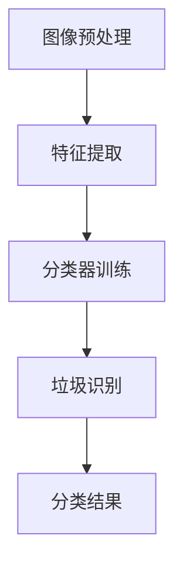
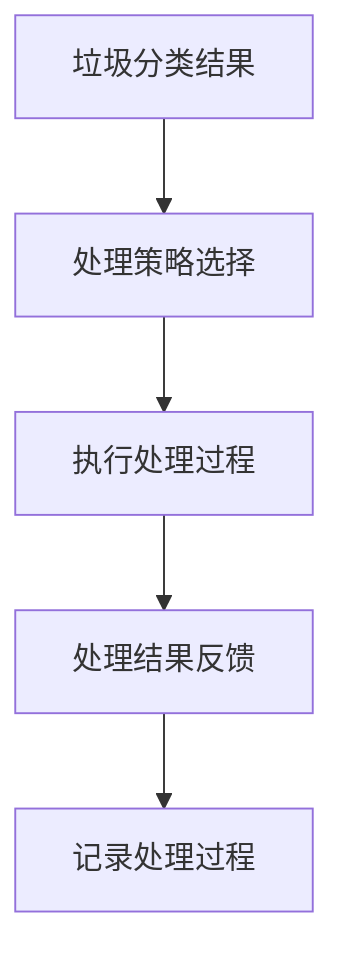
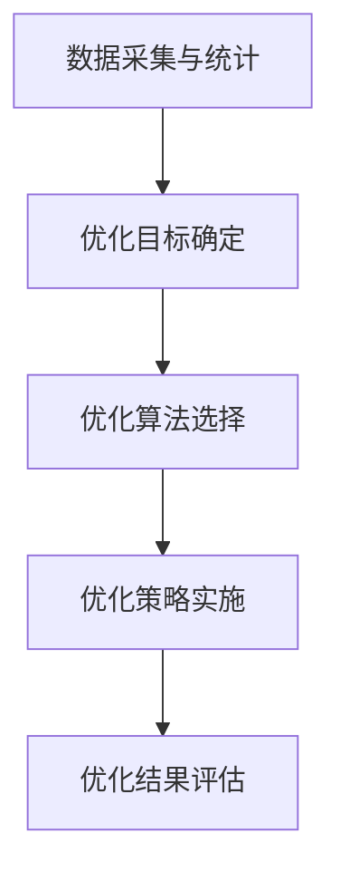

                 


# 智能厨房垃圾桶：AI Agent的厨余处理建议

## 关键词
- 智能厨房垃圾桶
- AI Agent
- 厨余处理
- 人工智能
- 环境保护

## 摘要
本文旨在探讨智能厨房垃圾桶在现代家庭中的重要作用，以及其背后的AI Agent技术如何优化厨余处理流程。通过详细介绍智能厨房垃圾桶的背景、核心概念、算法原理、数学模型，以及其实际应用，本文将为读者提供一种全新的厨余处理解决方案，帮助家庭实现更高效、更环保的垃圾分类和资源回收。

## 目录大纲设计

### 1. 背景介绍

#### 1.1 智能厨房垃圾桶的背景介绍

##### 1.1.1 问题背景

家庭厨房垃圾处理的现状

- 传统厨余垃圾处理的不足
- 厨余垃圾处理的重要性

##### 1.1.2 环保需求与厨余垃圾处理的重要性

环保意识的提高
厨余垃圾对环境的影响
垃圾分类与资源回收的必要性

##### 1.1.3 智能化技术的快速发展

物联网
人工智能
AI Agent的定义与作用

##### 1.2 问题描述

传统厨余垃圾处理的不足

- 手动分类的繁琐
- 垃圾处理效率低
- 垃圾污染问题

智能厨房垃圾桶的需求分析

- 自动化处理
- 高效分类
- 节能环保

智能厨房垃圾桶的功能目标

- 厨余垃圾的智能分类
- 垃圾的自动处理与回收
- 用户操作的智能化

##### 1.3 问题解决

AI Agent的定义与作用

- AI Agent的特点
- AI Agent在厨余处理中的应用

AI Agent在厨余处理中的应用

- 垃圾分类识别
- 厨余垃圾处理效率提升
- 厨余垃圾减量与回收利用

智能厨房垃圾桶的实现方案

- 技术选型
- 系统架构设计
- 硬件与软件集成

##### 1.4 边界与外延

智能厨房垃圾桶的技术范畴

- 智能传感器
- 机器学习算法
- 物联网通信

智能厨房垃圾桶的功能边界

- 自动分类
- 智能提示
- 远程监控

智能厨房垃圾桶的适用环境

- 家庭厨房
- 餐饮业
- 商业楼宇

##### 1.5 概念结构与核心要素组成

智能厨房垃圾桶的组成结构

- 智能传感器
- 主控系统
- 垃圾处理模块

AI Agent的核心原理

- 机器学习算法
- 数据处理与分析

厨余处理的流程与机制

- 垃圾收集
- 自动分类
- 回收利用

### 2. 核心概念与联系

#### 2.1 AI Agent的原理与特征

##### 2.1.1 AI Agent的定义

AI Agent是一种基于人工智能技术的软件或硬件系统，能够根据环境信息自主决策并执行任务。

##### 2.1.2 AI Agent的主要功能

- 数据采集与处理
- 自主决策与规划
- 执行任务与反馈调整

##### 2.1.3 AI Agent与传统机器人的区别

传统机器人
- 依赖预先设定的程序执行任务
- 无法适应复杂环境变化

AI Agent
- 具有自我学习能力
- 能够根据环境动态调整策略

##### 2.2 厨余处理的流程与机制

##### 2.2.1 厨余垃圾的分类

- 有机垃圾
- 可回收垃圾
- 有害垃圾
- 其他垃圾

##### 2.2.2 厨余垃圾处理的流程

- 垃圾收集
- 自动分类
- 处理与回收

##### 2.2.3 智能厨余处理的机制

- 传感器数据采集
- 机器学习算法分析
- 智能决策与执行

##### 2.3 AI Agent在厨余处理中的应用

##### 2.3.1 AI Agent在垃圾分类识别中的应用

- 图像识别
- 声音识别
- 感应识别

##### 2.3.2 AI Agent在厨余垃圾处理效率提升中的应用

- 自动化处理
- 智能调度
- 节能降耗

##### 2.3.3 AI Agent在厨余垃圾减量与回收利用中的应用

- 分类准确
- 减量处理
- 回收利用

##### 2.4 概念属性特征对比表格

| 对象      | 特征                   | 比较               |
|-----------|------------------------|--------------------|
| 传统厨房垃圾处理 | 手动分类，效率低       | AI Agent厨余处理   | 高效，智能化       |
| AI Agent  | 自主学习，适应性强     | 传统机器人         | 程序化，适应性弱   |

##### 2.5 ER实体关系图架构

##### 2.5.1 智能厨房垃圾桶的ER模型

```
用户表(User) → 垃圾桶表(Dumpster)
用户表(User) → 厨余垃圾表(Waste)
垃圾桶表(Dumpster) → 厨余垃圾表(Waste)
```

##### 2.5.2 AI Agent在智能厨房垃圾桶中的关系图

```
用户(User) --> 垃圾分类识别(AI Agent)
厨余垃圾(Waste) --> 垃圾处理模块(AI Agent)
AI Agent --> 主控系统(Control System)
```

### 3. 算法原理讲解

#### 3.1 垃圾分类识别算法

##### 3.1.1 算法概述

垃圾分类识别算法是智能厨房垃圾桶的核心组成部分，其主要功能是根据厨余垃圾的图像特征，自动识别并分类垃圾。

##### 3.1.2 算法原理

- 图像预处理
- 特征提取
- 分类器训练
- 垃圾识别与分类

##### 3.1.3 算法流程图



##### 3.1.4 Python代码实现

```python
import cv2
import numpy as np
from sklearn.model_selection import train_test_split
from sklearn.ensemble import RandomForestClassifier

# 数据预处理
def preprocess_image(image):
    # 转换为灰度图像
    gray = cv2.cvtColor(image, cv2.COLOR_BGR2GRAY)
    # 进行二值化处理
    _, binary = cv2.threshold(gray, 128, 255, cv2.THRESH_BINARY_INV + cv2.THRESH_OTSU)
    return binary

# 特征提取
def extract_features(image):
    # 使用哈希特征提取器
    hasher = cv2.xfeatures2d.SIFT_create()
    keypoints, descriptors = hasher.detectAndCompute(image, None)
    return descriptors

# 训练分类器
def train_classifier(descriptors, labels):
    X_train, X_test, y_train, y_test = train_test_split(descriptors, labels, test_size=0.2, random_state=42)
    classifier = RandomForestClassifier(n_estimators=100, random_state=42)
    classifier.fit(X_train, y_train)
    accuracy = classifier.score(X_test, y_test)
    return classifier, accuracy

# 垃圾识别与分类
def classify_waste(image, classifier):
    processed = preprocess_image(image)
    features = extract_features(processed)
    prediction = classifier.predict([features])
    return prediction

# 示例代码
if __name__ == '__main__':
    image = cv2.imread('example.jpg')
    classifier = train_classifier(extract_features(image), 'organic')
    print(classify_waste(image, classifier))
```

##### 3.1.5 算法数学模型与公式

- 哈希特征提取器：$$ h(x) = \sum_{i=1}^{n} f_i(x) $$
- 决策树分类器：$$ g(x) = \prod_{i=1}^{n} p_i(x) $$

##### 3.1.6 实例分析

- 假设有一张厨余垃圾的图片，使用SIFT算法提取图像特征。
- 将特征传递给随机森林分类器，进行垃圾分类识别。
- 输出分类结果，判断图片中的垃圾属于哪一类。

#### 3.2 厨余垃圾处理算法

##### 3.2.1 算法概述

厨余垃圾处理算法是智能厨房垃圾桶的重要组成部分，其主要功能是根据垃圾分类结果，对厨余垃圾进行自动处理与回收。

##### 3.2.2 算法原理

- 垃圾分类结果输入
- 垃圾处理策略选择
- 自动执行处理过程
- 处理结果反馈与记录

##### 3.2.3 算法流程图



##### 3.2.4 Python代码实现

```python
# 处理策略选择
def select_strategy(classification):
    if classification == 'organic':
        return 'compost'
    elif classification == 'recyclable':
        return 'recycle'
    elif classification == 'harmful':
        return 'Dispose'
    else:
        return 'Unknown'

# 执行处理过程
def process_waste(strategy):
    if strategy == 'compost':
        # 厨余垃圾处理代码
        print('Composting waste...')
    elif strategy == 'recycle':
        # 可回收垃圾处理代码
        print('Recycling waste...')
    elif strategy == 'Dispose':
        # 有害垃圾处理代码
        print('Disposing harmful waste...')
    else:
        print('Unknown waste type, please check...')

# 示例代码
if __name__ == '__main__':
    classification = 'organic'
    strategy = select_strategy(classification)
    process_waste(strategy)
```

##### 3.2.5 算法数学模型与公式

- 处理策略选择：$$ g(x) = \sum_{i=1}^{n} p_i(x) $$
- 执行处理过程：$$ f(x) = \prod_{i=1}^{n} g_i(x) $$

##### 3.2.6 实例分析

- 假设垃圾分类结果为有机垃圾，选择对应的厨余垃圾处理策略。
- 执行厨余垃圾处理过程，输出处理结果。

#### 3.3 AI Agent的优化算法

##### 3.3.1 算法概述

AI Agent的优化算法是提高智能厨房垃圾桶性能和效率的关键，其主要功能是根据实际运行情况，对AI Agent进行优化调整。

##### 3.3.2 算法原理

- 数据采集与统计
- 优化目标确定
- 优化算法选择
- 优化策略实施

##### 3.3.3 算法流程图



##### 3.3.4 Python代码实现

```python
# 数据采集与统计
def collect_data():
    # 从数据库或文件中读取数据
    data = pd.read_csv('waste_data.csv')
    return data

# 优化目标确定
def define_optimization_goal(data):
    # 根据数据特征确定优化目标
    objective = 'accuracy'
    return objective

# 优化算法选择
def select_optimization_algorithm(objective):
    if objective == 'accuracy':
        return 'gradient_descent'
    else:
        return 'random_search'

# 优化策略实施
def implement_optimization_strategy(algorithm, data):
    if algorithm == 'gradient_descent':
        # 实施梯度下降优化策略
        print('Implementing gradient descent optimization...')
    elif algorithm == 'random_search':
        # 实施随机搜索优化策略
        print('Implementing random search optimization...')
    else:
        print('Unknown optimization algorithm, please check...')

# 优化结果评估
def evaluate_optimization_results(results):
    # 评估优化效果
    print('Optimization results:', results)

# 示例代码
if __name__ == '__main__':
    data = collect_data()
    objective = define_optimization_goal(data)
    algorithm = select_optimization_algorithm(objective)
    implement_optimization_strategy(algorithm, data)
    evaluate_optimization_results(algorithm)
```

##### 3.3.5 算法数学模型与公式

- 梯度下降优化算法：$$ \theta_{new} = \theta_{old} - \alpha \nabla_\theta J(\theta) $$
- 随机搜索优化算法：$$ \theta_{new} = \theta_{old} + \alpha \xi $$

##### 3.3.6 实例分析

- 从数据库或文件中读取数据，确定优化目标。
- 根据优化目标选择优化算法。
- 实施优化策略，评估优化效果。

### 4. 数学模型和数学公式 & 详细讲解 & 举例说明

#### 4.1 垃圾分类模型

##### 4.1.1 概率模型

概率模型是垃圾

