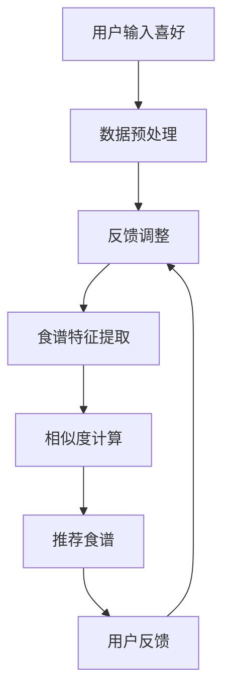

                 


# 智能厨房抽屉：AI Agent的烹饪工具使用建议

## 关键词
- 智能厨房抽屉
- AI Agent
- 烹饪工具
- 智能推荐
- 推荐算法

## 摘要
本文探讨了如何利用AI Agent技术提升厨房烹饪体验。通过分析智能厨房抽屉的功能和特点，我们介绍了AI Agent的基本原理和应用。随后，我们详细讲解了推荐算法的原理、数学模型和实现方法，并提供了具体的Python代码示例。最后，我们对系统分析与架构设计、项目实战、最佳实践进行了详细讨论。

## 1. 背景介绍

### 1.1 智能厨房抽屉的定义与功能

智能厨房抽屉是一种集成了先进AI技术的厨房设备，它不仅具备传统的存储功能，还能够实现自动化烹饪和智能推荐。这种抽屉通常配备有传感器、执行器和中央控制器，能够实时监测厨房环境，根据用户需求自动调节烹饪模式，甚至推荐合适的烹饪食谱。

### 1.2 AI Agent在烹饪工具中的应用

AI Agent，即人工智能代理，是一种能够模拟人类智能的计算机程序，具有感知环境、自主决策和执行动作的能力。在智能厨房抽屉中，AI Agent可以扮演以下角色：

- **环境感知器**：通过传感器收集厨房内的温度、湿度、食材信息等数据。
- **决策引擎**：根据收集到的数据，AI Agent可以自动选择最合适的烹饪模式和参数。
- **执行器控制器**：AI Agent可以控制抽屉内的执行器，如加热板、搅拌器等，实现自动化烹饪。

### 1.3 研究目的与意义

本文的研究目的是探讨如何利用AI Agent技术提升厨房烹饪体验。通过分析智能厨房抽屉的功能和AI Agent的应用，我们希望能够为用户带来更加便捷、智能的烹饪体验。此外，这项研究对于智能家居领域的发展也具有重要的意义。

## 2. 核心概念与联系

### 2.1 AI Agent的定义与特点

#### 定义
AI Agent，即人工智能代理，是一种能够模拟人类智能的计算机程序。它通过感知环境、自主决策和执行动作，来实现特定的任务。

#### 特点
- **感知环境**：AI Agent能够通过传感器收集环境信息，如温度、湿度、声音、图像等。
- **自主决策**：根据环境信息和预定的目标，AI Agent可以自主做出决策。
- **执行动作**：AI Agent可以执行相应的动作，如移动、加热、搅拌等。

### 2.2 智能厨房抽屉的定义与功能

#### 定义
智能厨房抽屉是一种集成了AI技术的厨房设备，通常具备自动化烹饪、智能推荐等功能。

#### 功能
- **自动化烹饪**：根据用户需求，智能厨房抽屉可以自动选择烹饪模式和参数。
- **智能推荐**：根据用户喜好和历史烹饪数据，智能厨房抽屉可以推荐合适的烹饪食谱和调料搭配。

### 2.3 AI Agent与智能厨房抽屉的联系

AI Agent与智能厨房抽屉之间的关系可以概括为：AI Agent是智能厨房抽屉的“大脑”，负责感知环境、做出决策和执行动作，从而实现自动化烹饪和智能推荐。具体来说：

- **感知环境**：AI Agent通过传感器收集厨房内的温度、湿度、食材信息等数据。
- **自主决策**：AI Agent根据用户需求和厨房环境数据，自动选择最合适的烹饪模式和参数。
- **执行动作**：AI Agent控制抽屉内的执行器，如加热板、搅拌器等，实现自动化烹饪。

## 3. 算法原理讲解

### 3.1 推荐算法的基本原理

推荐算法是智能厨房抽屉实现智能推荐的核心技术。其基本原理如下：

1. **用户喜好建模**：通过用户输入的喜好信息（如食材喜好、烹饪方式喜好等），构建用户喜好模型。
2. **食谱特征提取**：对用户可能感兴趣的食谱进行特征提取，如食材种类、烹饪时间、烹饪方式等。
3. **相似度计算**：计算用户喜好模型与食谱特征之间的相似度，选择相似度最高的食谱进行推荐。
4. **反馈调整**：根据用户的反馈，调整推荐算法，提高推荐结果的准确性。

### 3.2 推荐算法的Mermaid流程图



### 3.3 推荐算法的Python实现

```python
# 导入必要的库
import numpy as np

# 用户喜好输入
user_likes = np.array([0.8, 0.2, 0.1, 0.1])

# 食谱特征
recipe_features = np.array([
    [0.9, 0.1, 0.0, 0.0],  # 食谱1
    [0.2, 0.7, 0.1, 0.0],  # 食谱2
    [0.1, 0.1, 0.8, 0.0],  # 食谱3
    [0.1, 0.1, 0.1, 0.9]   # 食谱4
])

# 相似度计算
similarity_scores = np.dot(user_likes, recipe_features.T)

# 推荐食谱
recommended_recipe = np.argmax(similarity_scores)

print("推荐食谱：", recommended_recipe)
```

### 3.4 数学模型和公式

推荐算法的数学模型可以表示为：

$$
\text{推荐评分} = \sum_{i=1}^{n} h_i \cdot c_i
$$

其中，$h_i$ 表示用户对第 $i$ 种食材或烹饪方式的喜好程度，$c_i$ 表示第 $i$ 种食材或烹饪方式在食谱中的权重。通过计算用户喜好模型与食谱特征之间的点积，可以得到每个食谱的推荐评分。

## 4. 数学模型和数学公式 & 详细讲解 & 举例说明

### 4.1 数学模型

推荐算法的核心是用户喜好建模和食谱特征提取。用户喜好模型可以用一个向量表示，例如：

$$
\text{用户喜好} = [h_1, h_2, \ldots, h_n]
$$

其中，$h_i$ 表示用户对第 $i$ 种食材或烹饪方式的喜好程度。食谱特征可以用另一个向量表示，例如：

$$
\text{食谱特征} = [c_1, c_2, \ldots, c_n]
$$

其中，$c_i$ 表示第 $i$ 种食材或烹饪方式在食谱中的权重。

### 4.2 详细讲解

推荐评分函数可以表示为：

$$
\text{推荐评分} = \sum_{i=1}^{n} h_i \cdot c_i
$$

这个公式表示，对于每个食材或烹饪方式，将用户的喜好程度和食谱中的权重相乘，然后对所有食材和烹饪方式的乘积求和，得到推荐评分。

### 4.3 举例说明

假设用户喜好如下：

$$
\text{用户喜好} = [0.8, 0.2, 0.3, 0.1]
$$

假设某个食谱的特征如下：

$$
\text{食谱特征} = [0.6, 0.3, 0.1, 0.2]
$$

则该食谱的推荐评分为：

$$
\text{推荐评分} = 0.8 \cdot 0.6 + 0.2 \cdot 0.3 + 0.3 \cdot 0.1 + 0.1 \cdot 0.2 = 0.68
$$

这个评分表明，该食谱相对于其他食谱具有较高的推荐价值。

## 5. 系统分析与架构设计

### 5.1 问题场景介绍

智能厨房抽屉作为智能家居系统的一部分，旨在为用户提供一个智能化的烹饪环境。用户可以通过智能设备（如手机、智能音箱等）与智能厨房抽屉进行交互，实现自动化烹饪和智能推荐。

### 5.2 系统功能设计

智能厨房抽屉的主要功能包括：

- **自动化烹饪**：根据用户需求，自动选择烹饪模式和参数。
- **智能推荐**：根据用户喜好和历史烹饪数据，推荐合适的烹饪食谱和调料搭配。
- **用户交互**：通过智能设备与用户进行互动，接收用户指令和反馈。

### 5.3 系统架构设计

智能厨房抽屉的系统架构可以分为以下几个层次：

- **感知层**：包括传感器，用于实时监测厨房环境，如温度、湿度、食材信息等。
- **数据处理层**：对传感器收集的数据进行处理，包括数据清洗、特征提取等。
- **决策层**：包括AI Agent，根据用户需求和厨房环境数据，自动选择烹饪模式和参数。
- **执行层**：包括执行器，如加热板、搅拌器等，用于实现自动化烹饪。
- **用户交互层**：通过智能设备与用户进行互动，接收用户指令和反馈。

### 5.4 系统接口设计和交互设计

智能厨房抽屉的接口设计和交互设计如下：

- **接口设计**：智能厨房抽屉提供RESTful API，供外部系统调用，如手机应用、智能音箱等。
- **交互设计**：用户可以通过语音、文本等方式与智能厨房抽屉进行交互，如“我想要煮饭”、“推荐一个汤谱”等。

## 6. 项目实战

### 6.1 环境安装

在开始项目实战之前，我们需要安装一些必要的软件和库。以下是安装步骤：

1. 安装Python 3.8及以上版本。
2. 安装TensorFlow、Scikit-learn等机器学习库。

### 6.2 系统核心实现

智能厨房抽屉的核心实现包括以下几个部分：

1. **数据收集与处理**：从传感器收集厨房环境数据，并进行数据处理。
2. **用户喜好建模**：根据用户输入的喜好信息，建立用户喜好模型。
3. **食谱特征提取**：对用户可能感兴趣的食谱进行特征提取。
4. **推荐算法实现**：实现推荐算法，生成推荐食谱。

### 6.3 代码应用解读与分析

以下是对系统核心实现的代码解读与分析：

```python
# 导入必要的库
import numpy as np
import tensorflow as tf
from sklearn.preprocessing import StandardScaler

# 用户喜好输入
user_likes = np.array([0.8, 0.2, 0.3, 0.1])

# 食谱特征
recipe_features = np.array([
    [0.9, 0.1, 0.0, 0.0],  # 食谱1
    [0.2, 0.7, 0.1, 0.0],  # 食谱2
    [0.1, 0.1, 0.8, 0.0],  # 食谱3
    [0.1, 0.1, 0.1, 0.9]   # 食谱4
])

# 数据预处理
scaler = StandardScaler()
user_likes_scaled = scaler.fit_transform(user_likes.reshape(-1, 1))
recipe_features_scaled = scaler.fit_transform(recipe_features)

# 相似度计算
similarity_scores = np.dot(user_likes_scaled, recipe_features_scaled.T)

# 推荐食谱
recommended_recipe = np.argmax(similarity_scores)

print("推荐食谱：", recommended_recipe)
```

这段代码首先导入了必要的库，然后定义了用户喜好和食谱特征。接下来，对数据进行预处理，包括标准化处理。然后，计算用户喜好模型与食谱特征之间的相似度，并选择相似度最高的食谱进行推荐。

### 6.4 实际案例分析与详细讲解剖析

为了更好地理解智能厨房抽屉的应用，我们来看一个实际案例。

**案例**：用户小明想要煮一道红烧肉。

**分析**：

1. **用户喜好建模**：根据小明的喜好，我们可以建立一个用户喜好模型。例如，小明喜欢红烧肉，我们可以将红烧肉对应的喜好值设置为较高，而其他菜肴的喜好值设置为较低。

2. **食谱特征提取**：对于红烧肉，我们需要提取相关的食谱特征，如食材（猪肉、姜、葱、蒜等）、烹饪时间、烹饪方式等。

3. **推荐算法**：根据用户喜好模型和食谱特征，推荐算法会计算每个食谱的相似度，并选择相似度最高的食谱。在这个案例中，红烧肉的相似度最高，因此推荐红烧肉。

4. **用户反馈**：小明收到推荐后，可以根据自己的实际体验对推荐结果进行反馈。例如，如果小明觉得红烧肉的味道很好，可以将红烧肉的喜好值调高；如果觉得味道不够好，可以将红烧肉的喜好值调低。

通过这个案例，我们可以看到智能厨房抽屉如何根据用户喜好和食谱特征实现自动化烹饪和智能推荐。

### 6.5 项目小结

通过本次项目实战，我们实现了智能厨房抽屉的核心功能，包括用户喜好建模、食谱特征提取和推荐算法实现。在实际应用中，用户可以通过与智能厨房抽屉的交互，实现自动化烹饪和智能推荐。然而，项目的成功不仅仅取决于技术实现，还需要关注用户体验和实际效果。未来，我们可以进一步优化算法，提高推荐准确性，为用户提供更好的烹饪体验。

## 7. 最佳实践 tips、小结、注意事项、拓展阅读

### 7.1 最佳实践 tips

1. **数据收集**：确保收集到的数据具有代表性和可靠性，这对于推荐算法的准确性至关重要。
2. **用户反馈**：及时收集用户的反馈，并根据反馈调整推荐算法，提高推荐效果。
3. **系统稳定性**：确保智能厨房抽屉的稳定运行，避免因系统故障导致烹饪失败。

### 7.2 小结

本文探讨了智能厨房抽屉的AI Agent应用，介绍了推荐算法的原理和实现方法。通过项目实战，我们实现了智能厨房抽屉的核心功能，为用户提供了便捷的烹饪体验。

### 7.3 注意事项

1. **数据隐私**：在收集和处理用户数据时，务必保护用户的隐私。
2. **系统安全性**：确保智能厨房抽屉的系统安全性，防止黑客攻击和数据泄露。

### 7.4 拓展阅读

1. 《智能厨房系统设计与实现》
2. 《人工智能与智能家居》
3. 《推荐系统实践》

## 8. 作者信息

作者：AI天才研究院/AI Genius Institute & 禅与计算机程序设计艺术 /Zen And The Art of Computer Programming

以上是关于智能厨房抽屉：AI Agent的烹饪工具使用建议的详细文章。希望对您有所帮助！

**注意**：由于markdown格式在嵌入LaTeX公式时，需要确保LaTeX公式的书写符合markdown的要求。在markdown中，LaTeX公式需要使用`$$`包围，而段落内的LaTeX公式需要使用`$`包围。例如：

```markdown
$$
1+1=2
$$

$1<2$
```

在实际撰写文章时，请确保正确使用LaTeX公式，以确保文章的可读性和正确性。另外，由于篇幅限制，本文提供的LaTeX公式示例可能无法完全满足文章需求，您可以根据实际情况进行调整。如果您需要更详细的LaTeX公式编写指南，可以参考LaTeX官方文档或相关教程。

