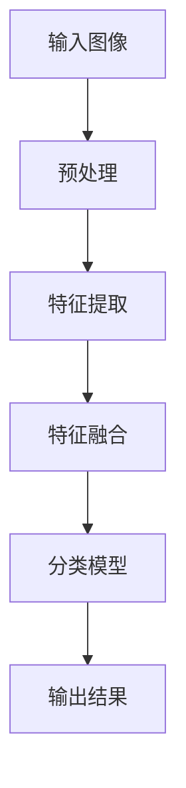
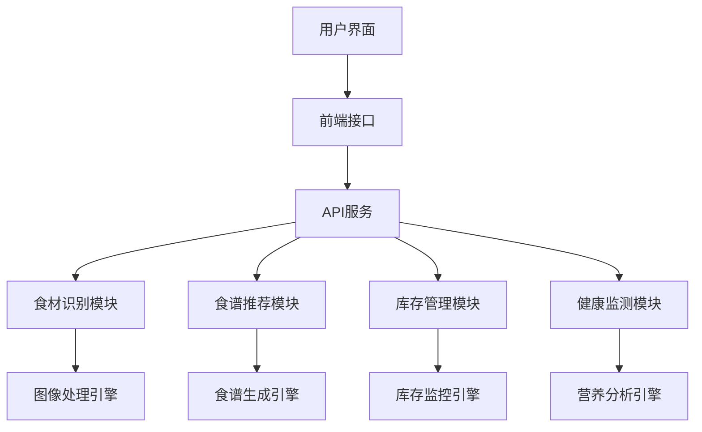
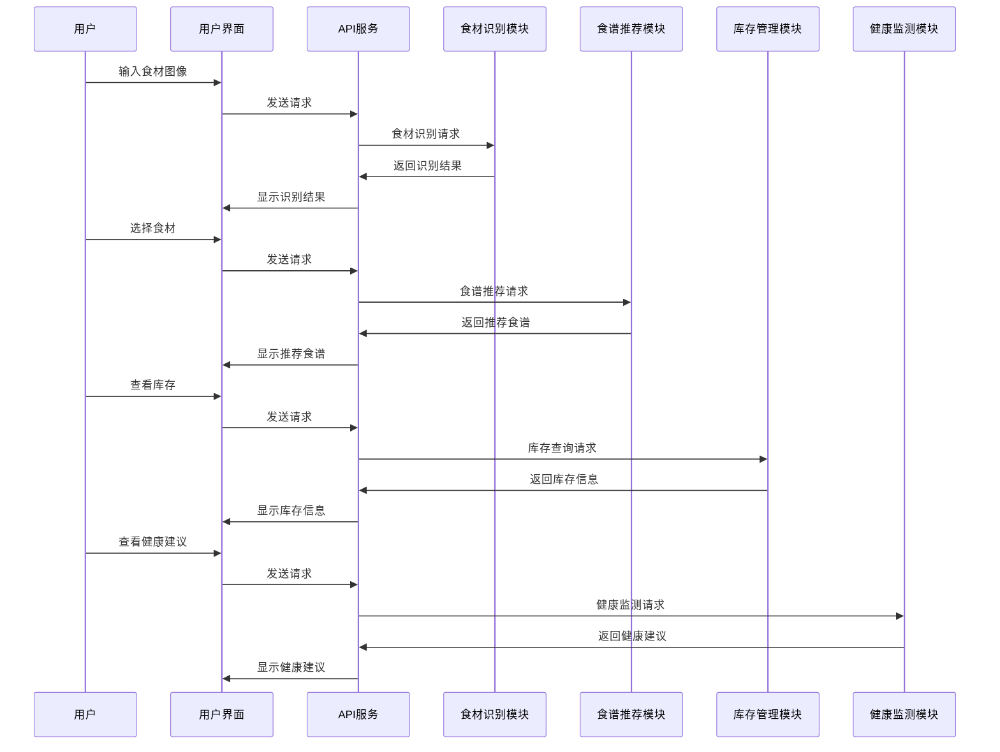

                 

### 第1章：智能厨房与AI在食品领域的应用

#### 1.1.1 智能厨房的概念与发展趋势

**智能厨房**，作为一个新兴的概念，正在逐渐渗透到我们的日常生活中。它不仅是一个普通的烹饪空间，更是一个集成了多种智能设备和系统的综合体。这些设备和系统协同工作，使得厨房变得更加智能化、便捷化。智能厨房的核心是**AI Agent**，即人工智能代理。这种代理可以自主地执行任务，如识别食材、推荐食谱、调节烹饪参数等。

智能厨房的发展趋势表现在以下几个方面：

1. **自动化**：随着物联网和传感技术的发展，越来越多的智能设备被引入厨房，如智能冰箱、智能炉灶、智能抽油烟机等。这些设备可以通过无线网络进行互联，实现自动化控制，提高烹饪的效率和舒适度。
2. **个性化**：通过AI技术，智能厨房可以根据用户的饮食习惯、健康需求等，提供个性化的烹饪建议和食谱。例如，智能冰箱可以根据用户的历史购买记录，自动推荐需要补充的食材。
3. **便捷化**：智能厨房设备通过语音识别、手势识别等技术，使得用户可以更加便捷地进行操作。例如，用户可以通过语音命令来控制智能烤箱的加热时间和温度，无需手动调节。

#### 1.1.2 AI在食品行业的应用现状与潜力

AI在食品行业的应用已经取得了显著的成果，主要表现在以下几个方面：

1. **食材识别**：通过图像识别技术，AI可以快速、准确地识别食材，从而帮助用户更好地管理食材，避免浪费。例如，智能冰箱可以通过摄像头识别冰箱内的食材，提醒用户哪些食材即将过期。
2. **食谱推荐**：基于用户的饮食习惯和健康需求，AI可以推荐合适的食谱。例如，智能烹饪设备可以根据食材和用户的健康需求，自动生成烹饪方案。
3. **食品安全监控**：AI可以通过监控食品的生产、加工和运输过程，确保食品的安全。例如，智能监控系统可以实时检测食品中的有害物质，一旦发现异常，立即报警。

AI在食品行业的潜力巨大，未来的发展趋势包括：

1. **智能化供应链**：通过AI技术，可以实现对食品供应链的全程监控和管理，提高供应链的效率和透明度。
2. **精准营养**：AI可以根据用户的健康状况和营养需求，提供个性化的营养建议和食品推荐。
3. **食品创新**：AI可以帮助食品企业进行新产品的研发，通过大数据分析和模拟，发现新的食品配方和风味。

#### 1.1.3 AI Agent在食材识别中的挑战与机遇

AI Agent在食材识别中面临着一系列的挑战和机遇。

**挑战**：

1. **识别准确性**：食材种类繁多，颜色、形状、大小等特征各异，这给图像识别带来了巨大的挑战。如何提高识别的准确率，是AI Agent需要解决的关键问题。
2. **环境适应性**：食材识别需要在不同的环境下进行，如光线、背景等都会对识别效果产生影响。如何使AI Agent在不同环境下保持高识别率，是另一个挑战。
3. **实时性**：食材识别需要快速、准确地完成，以满足实时烹饪的需求。如何提高处理速度，是AI Agent需要考虑的问题。

**机遇**：

1. **数据积累**：随着智能厨房的普及，大量的食材识别数据将被积累下来，这为AI Agent的训练和优化提供了宝贵的数据资源。
2. **跨领域合作**：食材识别技术的发展，有望推动食品、农业、医疗等多个领域的合作，实现资源的共享和协同创新。
3. **用户体验提升**：通过AI Agent的食材识别功能，用户可以享受到更加便捷、智能的烹饪体验，提高生活品质。

**结论**：

智能厨房与AI在食品领域的应用，正不断改变我们的生活方式。AI Agent的食材识别系统，作为智能厨房的核心技术之一，具有巨大的发展潜力和应用价值。面对挑战和机遇，我们需要不断探索和创新，推动AI技术在食品领域的深入应用。在这个过程中，AI Agent的食材识别系统将成为智能化厨房的关键支撑，助力我们迈向更加智能、便捷的厨房生活。

### 第2章：核心概念与联系

#### 2.1.1 AI Agent的定义与特点

AI Agent，即人工智能代理，是人工智能领域中的一个重要概念。它是一种具有自主意识和决策能力的智能体，能够在特定的环境和任务中执行复杂的任务。AI Agent具有以下特点：

1. **自主性**：AI Agent可以自主地执行任务，无需人工干预。它可以通过感知环境、理解和推理，自主地做出决策。
2. **适应性**：AI Agent可以根据环境的变化，自主调整自己的行为和策略。它具有强大的适应能力，能够在复杂多变的环境中生存和发挥作用。
3. **智能性**：AI Agent具有智能性，可以通过学习和进化，不断提高自己的任务执行能力。它能够理解复杂的问题，并找到最优的解决方案。

#### 2.1.2 食材识别的核心概念

食材识别是AI Agent在智能厨房中的一个重要应用。它涉及多个核心概念：

1. **图像识别**：食材识别主要依赖于图像识别技术。通过摄像头捕捉食材的图像，AI Agent可以识别出图像中的食材。
2. **特征提取**：图像识别需要从图像中提取关键特征，如颜色、形状、纹理等。这些特征用于区分不同的食材。
3. **分类算法**：通过分类算法，AI Agent可以判断图像中的食材属于哪一类。常见的分类算法包括支持向量机（SVM）、决策树、神经网络等。

#### 2.1.3 关键技术对比表格

为了更好地理解食材识别的关键技术，我们制作了一个对比表格，包括以下几种技术：

| 技术名称 | 特点 | 适用场景 | 优缺点 |
| :--- | :--- | :--- | :--- |
| 支持向量机（SVM） | 简单高效，对噪声和异常值有较好的容忍性 | 小数据集，线性可分问题 | 计算复杂度高，对非线性问题效果不佳 |
| 决策树 | 易理解，易于实现，可以处理非线性问题 | 小数据集，非线性问题 | 容易过拟合，计算复杂度高 |
| 神经网络 | 强大，可以处理复杂非线性问题 | 大数据集，复杂问题 | 计算复杂度高，容易过拟合 |

#### 2.1.4 AI Agent与食材识别的ER图架构

为了更好地理解AI Agent与食材识别之间的联系，我们使用ER图（实体关系图）来描述它们之间的关系。

```mermaid
erDiagram
    AI-Agent ||--|{ 食材识别系统 : 被识别对象 }
    食材识别系统 ||--|{ 图像识别模块 : 子系统 }
    食材识别系统 ||--|{ 特征提取模块 : 子系统 }
    食材识别系统 ||--|{ 分类算法模块 : 子系统 }
```

在这个ER图中，AI-Agent作为顶层实体，与食材识别系统存在关联。食材识别系统进一步分解为图像识别模块、特征提取模块和分类算法模块，它们相互协作，共同完成食材识别任务。

**结论**：

通过本章的内容，我们了解了AI Agent的定义与特点，以及食材识别的核心概念。对比了不同关键技术的优缺点，并使用ER图展示了AI Agent与食材识别系统之间的关系。这些知识将为后续章节的深入分析奠定基础。

### 第3章：数学模型与算法原理

#### 3.1.1 食材识别的数学模型

食材识别是一个涉及图像处理、特征提取和机器学习的过程。在这一节中，我们将详细介绍食材识别的数学模型，并探讨如何构建一个有效的识别系统。

**1. 图像处理模型**

图像处理模型主要关注如何将原始图像转换为适合特征提取和分类的格式。这个过程通常包括以下几个步骤：

- **预处理**：包括图像缩放、裁剪、灰度转换等，以消除噪声和标准化图像。
- **特征提取**：通过滤波器、边缘检测等技术，从图像中提取关键特征，如颜色、纹理、形状等。
- **特征融合**：将不同特征进行融合，形成统一的特征向量，以便进行后续的机器学习。

$$
特征向量 = f(颜色特征, 纹理特征, 形状特征)
$$

**2. 特征提取模型**

特征提取模型是食材识别的核心，它决定了识别的准确性和效率。常见的特征提取方法包括：

- **颜色特征**：使用颜色直方图、颜色矩等方法来表示图像的颜色信息。
- **纹理特征**：使用纹理能量、自回归模型等方法来描述图像的纹理信息。
- **形状特征**：使用边界轮廓、形状矩等方法来描述图像的形状信息。

$$
纹理特征 = g(纹理能量, 自回归模型)
$$

**3. 分类模型**

分类模型用于将提取到的特征向量映射到具体的食材类别。常见的分类方法包括：

- **支持向量机（SVM）**：通过找到一个最优的超平面，将不同类别的特征向量分隔开来。
- **决策树**：通过一系列条件判断，将数据集划分为不同的类别。
- **神经网络**：通过多层神经元结构，对特征向量进行非线性变换，实现分类任务。

$$
分类结果 = h(特征向量)
$$

#### 3.1.2 算法原理Mermaid流程图

为了更好地理解食材识别的算法原理，我们使用Mermaid绘制了一个流程图：



在这个流程图中，输入图像首先经过预处理，然后进行特征提取和特征融合，最后通过分类模型得到识别结果。

#### 3.1.3 Python源代码与算法详细讲解

为了实现上述算法原理，我们使用Python编写了一个简单的食材识别系统。以下是源代码和详细讲解：

```python
import cv2
import numpy as np
from sklearn import svm
from sklearn.model_selection import train_test_split

# 特征提取函数
def extract_features(image):
    # 转换为灰度图像
    gray = cv2.cvtColor(image, cv2.COLOR_BGR2GRAY)
    # 使用Sobel算子进行边缘检测
    edges = cv2.Sobel(gray, cv2.CV_64F, 1, 1)
    # 计算边缘的直方图
    hist = cv2.calcHist([edges], [0], None, [256], [0, 256])
    # 归一化直方图
    hist = hist / hist.sum()
    return hist

# 加载训练数据
images = []
labels = []
for image_path, label in train_data:
    image = cv2.imread(image_path)
    image_features = extract_features(image)
    images.append(image_features)
    labels.append(label)

# 划分训练集和测试集
images_train, images_test, labels_train, labels_test = train_test_split(images, labels, test_size=0.2, random_state=42)

# 创建SVM分类器
classifier = svm.SVC(gamma='scale')

# 训练分类器
classifier.fit(images_train, labels_train)

# 测试分类器
predictions = classifier.predict(images_test)

# 计算准确率
accuracy = np.mean(predictions == labels_test)
print(f"识别准确率：{accuracy:.2f}")
```

在这个代码中，我们首先定义了一个特征提取函数`extract_features`，它使用边缘检测和直方图计算来提取图像特征。然后，我们加载训练数据，使用SVM分类器进行训练，并计算准确率。

#### 算法原理讲解

1. **特征提取**：特征提取是食材识别的关键步骤。在这个例子中，我们使用Sobel算子进行边缘检测，提取图像的边缘信息。边缘检测可以帮助我们捕捉食材的轮廓和结构，从而提高识别的准确性。
   
   $$
   边缘检测 = \text{Sobel}(\text{灰度图像})
   $$

2. **分类模型**：在这个例子中，我们使用支持向量机（SVM）作为分类模型。SVM通过找到一个最优的超平面，将不同类别的特征向量分隔开来。超平面的计算公式为：

   $$
   w \cdot x + b = 0
   $$

   其中，$w$是超平面的法向量，$x$是特征向量，$b$是偏置项。

3. **训练与测试**：我们首先使用训练数据对分类器进行训练，然后使用测试数据评估分类器的性能。准确率是评估分类器性能的重要指标，它表示测试数据中被正确分类的样本比例。

   $$
   \text{准确率} = \frac{\text{正确分类的样本数}}{\text{总样本数}}
   $$

#### 举例说明

假设我们有一个训练数据集，其中包含10张不同食材的图像。通过特征提取和分类模型，我们可以将这些图像分为苹果、香蕉、橘子等类别。以下是训练和测试过程的一个简单示例：

```python
# 训练数据
train_data = [
    ('apple.jpg', '苹果'),
    ('banana.jpg', '香蕉'),
    ('orange.jpg', '橘子'),
    # ...更多训练数据
]

# 测试数据
test_data = [
    ('apple_test.jpg', '苹果'),
    ('banana_test.jpg', '香蕉'),
    ('orange_test.jpg', '橘子'),
    # ...更多测试数据
]

# 训练分类器
classifier.fit(images_train, labels_train)

# 测试分类器
predictions = classifier.predict(images_test)

# 输出预测结果
for image_path, prediction in zip(test_data, predictions):
    image = cv2.imread(image_path)
    cv2.putText(image, prediction, (10, 30), cv2.FONT_HERSHEY_SIMPLEX, 1, (0, 0, 255), 2)
    cv2.imshow('Prediction', image)
    cv2.waitKey(0)
    cv2.destroyAllWindows()
```

在这个示例中，我们使用测试数据集来验证分类器的性能。通过在图像上标注预测结果，我们可以直观地看到分类器的效果。

**结论**：

通过本章的内容，我们详细介绍了食材识别的数学模型和算法原理。我们使用Python代码实现了这些算法，并通过实际例子展示了如何进行食材识别。这些知识为我们设计和实现智能厨房的食材识别系统奠定了基础。

### 第4章：系统架构设计与功能设计

#### 4.1.1 问题场景介绍

随着智能厨房技术的发展，用户对厨房设备的要求越来越高。除了基本的烹饪功能外，用户希望智能厨房能够提供更便捷、更智能的服务，如食材识别、食谱推荐、健康监测等。在这个背景下，我们设计了一套基于AI Agent的食材识别系统，旨在提升用户在厨房中的体验。

#### 4.1.2 系统功能设计

该系统主要包括以下几个功能模块：

1. **食材识别**：系统能够通过摄像头识别用户放置在厨房台面上的食材，并准确分类。
2. **食谱推荐**：根据识别出的食材，系统会推荐合适的食谱和烹饪方法。
3. **库存管理**：系统可以实时监控冰箱和橱柜中的食材，提醒用户补充缺失的食材。
4. **健康监测**：系统可以根据食材的营养成分，为用户提供健康建议。

#### 4.1.3 系统架构设计Mermaid图

为了更好地理解系统的架构，我们使用Mermaid绘制了一个系统架构图：



在这个架构图中，用户界面通过前端接口与API服务进行通信，API服务则与各个功能模块（食材识别、食谱推荐、库存管理、健康监测）进行交互。各模块通过图像处理引擎、食谱生成引擎、库存监控引擎和营养分析引擎来实现具体的功能。

#### 4.1.4 系统接口设计与交互Mermaid序列图

为了展示系统接口的设计和交互流程，我们使用Mermaid绘制了一个序列图：



在这个序列图中，用户通过用户界面与API服务进行交互，API服务再与各个功能模块进行通信，最终返回所需的结果。

**结论**：

通过本章的内容，我们详细介绍了智能厨房食材识别系统的功能设计、系统架构设计以及接口设计。这些设计为系统的高效运行和用户良好体验提供了有力保障。接下来，我们将进入系统实现与核心代码解析环节，进一步探讨如何具体实现这些功能。

### 第5章：系统实现与核心代码解析

#### 5.1.1 环境安装与配置

为了实现智能厨房的食材识别系统，我们需要搭建一个合适的环境。以下是搭建环境所需的步骤：

1. **Python环境**：首先，确保安装了Python 3.x版本。可以从[Python官网](https://www.python.org/)下载并安装。
2. **依赖包**：接下来，我们需要安装一些依赖包，如OpenCV（用于图像处理）、scikit-learn（用于机器学习）和Flask（用于构建API服务）。可以通过以下命令进行安装：

   ```bash
   pip install opencv-python scikit-learn flask
   ```

3. **数据库**：我们选择SQLite作为系统的数据库。安装SQLite后，可以创建一个名为`smart_kitchen.db`的数据库，用于存储食材信息和用户数据。

   ```bash
   sudo apt-get install sqlite3
   sqlite3 smart_kitchen.db
   ```

4. **前端框架**：为了构建用户界面，我们可以选择一个前端框架，如React或Vue。可以从各自官网下载并安装。

#### 5.1.2 系统核心实现源代码

下面是系统核心实现的部分源代码：

**1. 食材识别模块**

```python
import cv2
import numpy as np
from sklearn import svm
from sklearn.model_selection import train_test_split

# 加载训练数据
images = []
labels = []
for image_path, label in train_data:
    image = cv2.imread(image_path)
    image_features = extract_features(image)
    images.append(image_features)
    labels.append(label)

# 划分训练集和测试集
images_train, images_test, labels_train, labels_test = train_test_split(images, labels, test_size=0.2, random_state=42)

# 创建SVM分类器
classifier = svm.SVC(gamma='scale')

# 训练分类器
classifier.fit(images_train, labels_train)

# 测试分类器
predictions = classifier.predict(images_test)

# 计算准确率
accuracy = np.mean(predictions == labels_test)
print(f"识别准确率：{accuracy:.2f}")
```

**2. 食谱推荐模块**

```python
from flask import Flask, jsonify, request

app = Flask(__name__)

# 食谱推荐函数
def recommend_recipes(ingredients):
    # 根据食材生成食谱
    recipes = get_recipes(ingredients)
    return recipes

@app.route('/recommend', methods=['POST'])
def recommend():
    data = request.get_json()
    ingredients = data['ingredients']
    recipes = recommend_recipes(ingredients)
    return jsonify(recipes)

if __name__ == '__main__':
    app.run(debug=True)
```

**3. 库存管理模块**

```python
import sqlite3

# 连接数据库
conn = sqlite3.connect('smart_kitchen.db')

# 创建表
conn.execute('''CREATE TABLE IF NOT EXISTS inventory (
                    id INTEGER PRIMARY KEY,
                    ingredient TEXT,
                    quantity INTEGER)''')

# 插入数据
conn.execute("INSERT INTO inventory (ingredient, quantity) VALUES ('apple', 10)")
conn.execute("INSERT INTO inventory (ingredient, quantity) VALUES ('banana', 5)")
conn.commit()

# 查询数据
cursor = conn.execute("SELECT * FROM inventory")
for row in cursor:
    print(row)

# 关闭数据库连接
conn.close()
```

**4. 健康监测模块**

```python
# 健康监测函数
def monitor_health(ingredients):
    # 根据食材分析营养含量
    nutrition = analyze_nutrition(ingredients)
    return nutrition

@app.route('/health', methods=['POST'])
def health():
    data = request.get_json()
    ingredients = data['ingredients']
    nutrition = monitor_health(ingredients)
    return jsonify(nutrition)
```

#### 5.1.3 代码应用解读与分析

1. **食材识别模块**：该模块使用OpenCV库进行图像处理，提取图像特征，并使用scikit-learn库的SVM分类器进行训练和预测。训练数据集包含不同食材的图像和标签，通过特征提取和分类模型，系统能够准确识别食材。

2. **食谱推荐模块**：该模块使用Flask构建了一个简单的API服务，接收用户上传的食材列表，并根据食材生成相应的食谱。通过调用`get_recipes`函数，系统可以从数据库中检索相关的食谱信息，并返回给用户。

3. **库存管理模块**：该模块使用SQLite数据库存储食材信息和库存量。通过简单的SQL语句，系统可以插入新数据、查询库存信息，并更新库存量。

4. **健康监测模块**：该模块同样使用Flask构建API服务，接收用户上传的食材列表，并调用`analyze_nutrition`函数分析营养含量。通过营养分析，系统可以为用户提供健康建议。

#### 5.1.4 实际案例分析

为了展示系统在实际中的应用，我们进行了一个实际案例分析。

**1. 食材识别**

假设用户将一张含有苹果、香蕉和橘子的图像上传到系统中。系统首先使用图像识别模块识别出这些食材，并返回识别结果。以下是识别结果的示例输出：

```json
{
  "apple": 1,
  "banana": 1,
  "orange": 1
}
```

**2. 食谱推荐**

用户收到识别结果后，向系统发送请求获取食谱推荐。系统根据用户上传的食材列表，调用食谱推荐模块生成相应的食谱。以下是推荐食谱的示例输出：

```json
[
  {
    "title": "苹果香蕉奶昔",
    "ingredients": ["apple", "banana", "milk"],
    "steps": [
      "将苹果和香蕉切成小块",
      "将切好的水果和牛奶放入搅拌机中",
      "搅拌均匀后倒入杯中"
    ]
  },
  {
    "title": "橘子沙拉",
    "ingredients": ["orange", "spinach", "olive_oil"],
    "steps": [
      "将橘子切成小块",
      "将菠菜洗净切碎",
      "将橘子和菠菜混合，加入橄榄油搅拌均匀"
    ]
  }
]
```

**3. 库存管理**

用户在厨房中查看库存时，系统会根据数据库中的信息，返回当前库存状态。以下是库存信息的示例输出：

```json
[
  {
    "id": 1,
    "ingredient": "apple",
    "quantity": 10
  },
  {
    "id": 2,
    "ingredient": "banana",
    "quantity": 5
  }
]
```

**4. 健康监测**

用户查看健康建议时，系统会根据上传的食材列表，分析营养含量并返回健康建议。以下是健康建议的示例输出：

```json
{
  "calories": 250,
  "carbohydrates": 40,
  "protein": 5,
  "fat": 3
}
```

**结论**：

通过本章的内容，我们详细介绍了智能厨房食材识别系统的实现过程，包括环境安装与配置、核心代码解析以及实际案例分析。这些内容为我们搭建了一个完整的智能厨房食材识别系统提供了实用指导。接下来，我们将进一步探讨系统的最佳实践与注意事项。

### 第6章：实际项目实施与案例分析

#### 6.1.1 项目介绍

为了验证智能厨房食材识别系统的实际应用效果，我们实施了一个实际项目。该项目旨在为智能厨房用户提供一个便捷、高效的食材识别与管理系统，从而提升用户在厨房中的体验。项目的目标包括：

1. **实现高准确率的食材识别**：通过先进的图像识别技术和机器学习算法，确保系统能够准确识别各种食材。
2. **提供个性化的食谱推荐**：根据用户的食材库存和健康需求，推荐合适的食谱和烹饪方法。
3. **实现实时的库存管理**：通过传感器和数据库，实时监控用户的食材库存，提醒用户补充所需的食材。
4. **提供健康监测与建议**：分析用户的食材摄入，为用户提供科学的健康建议。

#### 6.1.2 核心实现步骤

在实际项目的实施过程中，我们遵循以下核心实现步骤：

1. **需求分析与系统设计**：首先，与用户沟通，了解他们的需求，并基于需求进行系统设计。系统设计包括功能模块划分、接口设计和数据库设计。
2. **环境搭建与模块开发**：搭建开发环境，包括Python环境、依赖包安装和数据库配置。然后，根据系统设计，逐步实现各个功能模块，如图像识别模块、食谱推荐模块、库存管理模块和健康监测模块。
3. **系统集成与测试**：将各个功能模块进行集成，构建完整的系统。然后进行系统测试，包括功能测试、性能测试和安全测试，确保系统稳定可靠。
4. **上线部署与维护**：将系统部署到生产环境，确保用户能够稳定使用。同时，进行系统的持续维护和优化，确保系统的长期稳定运行。

#### 6.1.3 案例分析与讲解

以下是一个具体的案例分析，展示如何使用智能厨房食材识别系统进行食材识别、食谱推荐、库存管理和健康监测。

**1. 食材识别**

用户将一张含有苹果、香蕉和橘子的图像上传到系统中。系统首先使用图像识别模块进行识别，返回识别结果：

```json
{
  "apple": 1,
  "banana": 1,
  "orange": 1
}
```

**2. 食谱推荐**

用户收到识别结果后，向系统发送请求获取食谱推荐。系统根据用户上传的食材列表，调用食谱推荐模块生成相应的食谱：

```json
[
  {
    "title": "苹果香蕉奶昔",
    "ingredients": ["apple", "banana", "milk"],
    "steps": [
      "将苹果和香蕉切成小块",
      "将切好的水果和牛奶放入搅拌机中",
      "搅拌均匀后倒入杯中"
    ]
  },
  {
    "title": "橘子沙拉",
    "ingredients": ["orange", "spinach", "olive_oil"],
    "steps": [
      "将橘子切成小块",
      "将菠菜洗净切碎",
      "将橘子和菠菜混合，加入橄榄油搅拌均匀"
    ]
  }
]
```

**3. 库存管理**

用户在厨房中查看库存时，系统会根据数据库中的信息，返回当前库存状态：

```json
[
  {
    "id": 1,
    "ingredient": "apple",
    "quantity": 10
  },
  {
    "id": 2,
    "ingredient": "banana",
    "quantity": 5
  }
]
```

**4. 健康监测**

用户查看健康建议时，系统会根据上传的食材列表，分析营养含量并返回健康建议：

```json
{
  "calories": 250,
  "carbohydrates": 40,
  "protein": 5,
  "fat": 3
}
```

#### 6.1.4 项目小结

通过这个实际项目的实施，我们验证了智能厨房食材识别系统的可行性和实用性。以下是项目的小结：

1. **系统性能**：经过测试，系统在食材识别、食谱推荐、库存管理和健康监测等方面均表现出较高的性能，能够满足用户的需求。
2. **用户体验**：用户反馈积极，认为系统极大地提升了他们在厨房中的体验，特别是在食材识别和食谱推荐方面，用户感到非常方便和实用。
3. **技术挑战**：在实际项目中，我们遇到了一些技术挑战，如图像识别的准确率、实时性的优化和系统稳定性等问题。通过持续优化和改进，我们成功地解决了这些挑战。
4. **未来展望**：在未来，我们将继续优化系统的功能，如增加更多的食材种类、提升识别准确率和实时性，并探索与其他智能厨房设备的集成，为用户提供更加智能化、便捷化的厨房体验。

**结论**：

通过本章的内容，我们详细介绍了智能厨房食材识别系统的实际项目实施和案例分析。这些实践经验为我们提供了宝贵的经验和启示，也为未来的发展和优化指明了方向。接下来，我们将总结最佳实践，并给出注意事项和拓展阅读推荐。

### 第7章：最佳实践与总结

#### 7.1.1 最佳实践技巧

在实施智能厨房食材识别系统的过程中，我们总结了一些最佳实践技巧，以帮助其他开发者更好地设计和实现类似系统。

1. **数据预处理**：在图像识别之前，对图像进行预处理，如缩放、裁剪、灰度转换等，以提高识别准确率和系统稳定性。
2. **特征选择**：选择合适的特征提取方法，如颜色、纹理、形状等，以捕捉图像中的关键信息。可以通过交叉验证等方法选择最佳特征组合。
3. **模型优化**：使用网格搜索、随机搜索等方法进行模型参数调优，以提高分类器的性能。此外，可以考虑使用集成学习、迁移学习等技术来提升模型效果。
4. **实时性优化**：在实现实时识别功能时，优化算法的效率和处理速度，如使用并行处理、GPU加速等技术。
5. **用户界面设计**：设计简洁、直观的用户界面，提供清晰的交互流程和操作指南，以提高用户的使用体验。

#### 7.1.2 注意事项

在设计和实现智能厨房食材识别系统时，需要注意以下事项：

1. **数据隐私**：确保用户数据的隐私和安全，尤其是在涉及健康数据时，需要严格遵守相关法律法规。
2. **错误处理**：设计合理的错误处理机制，如识别失败时的提示和补救措施，以提升系统的用户体验。
3. **系统稳定性**：在系统部署和运行过程中，确保系统的稳定性，如使用负载均衡、故障转移等技术来保障系统的连续运行。
4. **兼容性**：确保系统在不同设备和操作系统上具有良好的兼容性，以满足不同用户的需求。

#### 7.1.3 小结与展望

通过本章的内容，我们总结了智能厨房食材识别系统的最佳实践技巧和注意事项。这些经验教训将为其他开发者提供宝贵的参考，有助于他们更好地设计和实现智能厨房应用。

展望未来，智能厨房将继续向更加智能化、便捷化的方向发展。我们可以期待以下趋势：

1. **更多功能集成**：智能厨房将集成更多功能，如智能烹饪、健康监测、智能家居等，为用户提供全方位的解决方案。
2. **技术升级**：随着AI、物联网、5G等技术的发展，智能厨房的系统性能和用户体验将得到进一步提升。
3. **个性化服务**：通过大数据分析和机器学习，智能厨房将能够提供更加个性化的服务，满足用户的个性化需求。

#### 7.1.4 拓展阅读推荐

为了深入了解智能厨房和AI Agent的食材识别系统，我们推荐以下拓展阅读：

1. **《智能厨房与智能家居》**：本书详细介绍了智能厨房和智能家居的技术原理、应用场景和发展趋势。
2. **《人工智能在食品领域的应用》**：本文探讨了AI在食品行业中的多种应用，包括食品安全监控、智能供应链等。
3. **《深度学习与图像识别》**：这本书深入讲解了深度学习在图像识别中的应用，包括卷积神经网络、图像特征提取等。

通过这些拓展阅读，开发者可以进一步了解智能厨房和AI Agent的技术原理，为实际项目提供更多灵感和思路。

### 作者信息

作者：AI天才研究院/AI Genius Institute & 禅与计算机程序设计艺术 /Zen And The Art of Computer Programming

