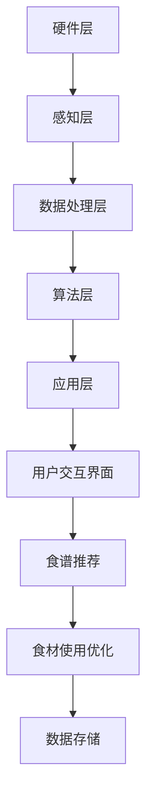

                 

### 智能厨房置物架：AI Agent的食材使用优化

> 关键词：智能厨房置物架，AI Agent，食材识别，食谱推荐，食材使用优化

> 摘要：本文深入探讨了智能厨房置物架的AI技术应用，包括食材识别、食谱推荐、食材使用优化等方面。通过分析现有智能厨房置物架的不足，提出了基于AI Agent的优化方案，并介绍了系统架构设计和实际应用案例，为提升家居智能化提供了有益参考。

----------------------------------------------------------------

### 第1章：背景介绍

#### 1.1 问题背景

随着人工智能技术的迅猛发展，智能厨房置物架作为智能家居的一部分，越来越受到人们的关注。智能厨房置物架通过集成AI技术，能够自动识别食材，根据用户需求和食材信息推荐食谱，甚至进行食材的自动购买。然而，目前市面上大多数智能厨房置物架存在一些问题，如食材识别不准确、食谱推荐效果不佳等，严重影响了用户的体验。

#### 1.2 问题描述

本书旨在解决以下问题：

1. **如何准确识别食材，提高识别精度？**
   - 问题分析：现有智能厨房置物架的识别算法可能不够成熟，导致识别精度不高。
   - 解决方案：采用先进的图像识别技术和深度学习算法，提升食材识别的准确度。

2. **如何根据食材信息和用户需求，推荐合适的食谱？**
   - 问题分析：现有的食谱推荐系统可能缺乏对用户需求和食材特点的深入理解。
   - 解决方案：利用自然语言处理和机器学习技术，实现更加智能化的食谱推荐。

3. **如何优化食材的使用，减少浪费，提高烹饪效率？**
   - 问题分析：现有智能厨房置物架在食材使用优化方面功能较弱。
   - 解决方案：引入AI Agent，根据食材特点和用户习惯，提供个性化的食材使用建议。

#### 1.3 问题解决

为了解决上述问题，本书将从以下几个方面展开讨论：

1. **智能厨房置物架的基本原理和核心技术**：介绍智能厨房置物架的工作原理和核心技术，如图像识别、自然语言处理、机器学习等。
   
2. **现有智能厨房置物架的不足之处及改进方案**：分析现有智能厨房置物架的不足，提出针对性的改进方案。

3. **AI Agent在食材使用优化中的具体应用**：详细讲解AI Agent在食材识别、食谱推荐和食材使用优化中的应用。

4. **智能厨房置物架的架构设计**：介绍基于AI技术的智能厨房置物架的架构设计，包括硬件和软件层面。

5. **实际案例展示**：提供实际案例，展示智能厨房置物架在生活中的应用效果。

#### 1.4 边界与外延

本书主要关注智能厨房置物架的AI技术应用，包括食材识别、食谱推荐、食材使用优化等方面。同时，也会涉及到相关的硬件技术，如传感器技术、物联网技术等。

#### 1.5 概念结构与核心要素组成

1. **智能厨房置物架**：一种集成AI技术的厨房用品，能够自动识别食材，提供食谱推荐和食材使用优化服务。

2. **AI Agent**：一种人工智能代理，能够根据用户需求和环境信息，自主执行任务，如食材识别、食谱推荐等。

3. **食材识别**：通过图像识别、传感器等技术，准确识别厨房中的食材。

4. **食谱推荐**：根据食材信息和用户需求，推荐合适的食谱。

5. **食材使用优化**：通过算法优化，提高食材的使用效率，减少浪费。

### 第2章：核心概念与联系

#### 2.1 智能厨房置物架的概念与特点

##### 2.1.1 概念

智能厨房置物架是一种结合物联网、人工智能技术的厨房设备，能够自动识别食材，提供食谱推荐，实现食材使用优化。

##### 2.1.2 特点

- **自动识别食材**：通过摄像头、传感器等设备，实时识别厨房中的食材。
- **提供食谱推荐**：根据食材信息和用户需求，推荐合适的食谱。
- **食材使用优化**：通过算法优化，提高食材的使用效率，减少浪费。

#### 2.2 AI Agent的概念与特点

##### 2.2.1 概念

AI Agent是一种人工智能代理，能够根据用户需求和环境信息，自主执行任务，如食材识别、食谱推荐等。

##### 2.2.2 特点

- **自主决策**：基于算法模型，能够自主分析环境信息，做出决策。
- **任务执行**：能够根据用户需求，自主执行相关任务，如食材识别、食谱推荐等。
- **自适应学习**：通过不断学习用户行为和需求，提高推荐和识别的准确性。

#### 2.3 食材识别、食谱推荐和食材使用优化的联系

##### 2.3.1 食材识别

食材识别是智能厨房置物架的核心功能之一，为食谱推荐和食材使用优化提供了基础数据。

##### 2.3.2 食谱推荐

食谱推荐基于食材识别结果和用户需求，提供合适的食谱，为用户提供了便捷的烹饪方案。

##### 2.3.3 食材使用优化

食材使用优化通过对食材的使用情况进行分析，提供使用建议，如食材的保存方法、合理搭配等，以减少浪费，提高烹饪效率。

### 第3章：主流AI技术介绍

#### 3.1 人工智能技术概述

##### 3.1.1 人工智能的定义与发展历程

人工智能是指使计算机模拟人类智能行为的科学和技术。自20世纪50年代以来，人工智能经历了多个发展阶段，从早期的符号主义、连接主义到现代的数据驱动方法，不断推动着人工智能技术的进步。

##### 3.1.2 人工智能的分类与应用领域

人工智能主要分为两大类：基于规则的推理系统和基于数据的学习系统。其中，基于数据的学习系统主要包括监督学习、无监督学习和强化学习等。人工智能在智能家居、医疗、金融、教育等领域有着广泛的应用。

#### 3.2 深度学习技术

##### 3.2.1 深度学习的定义与原理

深度学习是一种基于多层神经网络的学习方法，通过逐层提取特征，实现复杂问题的建模和预测。

##### 3.2.2 深度学习在智能厨房置物架中的应用

深度学习技术在食材识别、食谱推荐和食材使用优化等方面发挥着重要作用。例如，通过卷积神经网络（CNN）进行食材图像识别，通过循环神经网络（RNN）实现食谱推荐和食材使用优化。

#### 3.3 自然语言处理技术

##### 3.3.1 自然语言处理技术的定义与原理

自然语言处理（NLP）是人工智能的一个分支，旨在使计算机能够理解、生成和处理人类语言。NLP技术包括词法分析、句法分析、语义分析和语音识别等。

##### 3.3.2 自然语言处理在智能厨房置物架中的应用

自然语言处理技术可以用于智能厨房置物架的食谱推荐和用户交互。例如，通过分析用户输入的食材需求，推荐合适的食谱，并通过自然语言生成技术，向用户展示食谱内容。

### 第4章：智能厨房置物架的基本原理

#### 4.1 智能厨房置物架的工作原理

智能厨房置物架主要通过以下步骤实现其功能：

1. **食材识别**：智能厨房置物架利用摄像头和传感器技术，实时捕捉和识别厨房中的食材。
2. **数据处理**：识别到的食材信息会被传输到AI Agent进行处理和分析。
3. **食谱推荐**：基于食材信息和用户偏好，AI Agent会推荐相应的食谱。
4. **食材使用优化**：AI Agent还会根据食材的使用情况和用户习惯，提供优化建议，如食材的保存、搭配和烹饪方法。

#### 4.2 关键技术介绍

1. **图像识别技术**：智能厨房置物架使用图像识别技术来识别不同的食材。常用的图像识别技术包括卷积神经网络（CNN）和迁移学习等。

2. **自然语言处理技术**：自然语言处理技术用于理解用户的食谱需求，生成食谱推荐。常用的技术包括词嵌入、序列模型和生成对抗网络（GAN）等。

3. **机器学习技术**：机器学习技术用于构建AI Agent，使其能够根据用户数据和食材信息进行自主学习和决策。常用的算法包括监督学习、无监督学习和强化学习等。

#### 4.3 智能厨房置物架的技术架构

智能厨房置物架的技术架构可以分为以下几个部分：

1. **硬件层**：包括摄像头、传感器、存储设备和处理器等。
2. **感知层**：利用摄像头和传感器获取厨房环境的实时信息。
3. **数据层**：存储和管理食材信息和用户数据。
4. **算法层**：包括图像识别算法、自然语言处理算法和机器学习算法等。
5. **应用层**：提供食谱推荐、食材使用优化等服务。

### 第5章：现有智能厨房置物架的不足之处及改进方案

#### 5.1 现有智能厨房置物架的不足之处

1. **食材识别准确性不高**：现有的智能厨房置物架在食材识别方面存在一定的问题，如识别精度低、误识别率高。
2. **食谱推荐效果不佳**：现有的食谱推荐系统可能缺乏对用户需求和食材特点的深入理解，导致推荐效果不理想。
3. **食材使用优化功能较弱**：现有智能厨房置物架在食材使用优化方面功能较弱，难以提供个性化的食材使用建议。

#### 5.2 改进方案

1. **提高食材识别准确性**：采用更先进的图像识别技术和深度学习算法，如卷积神经网络（CNN）和迁移学习等，提高食材识别的准确性。
2. **优化食谱推荐系统**：利用自然语言处理和机器学习技术，实现更加智能化的食谱推荐，提高推荐效果。
3. **加强食材使用优化功能**：引入AI Agent，根据用户需求和食材特点，提供个性化的食材使用建议，如食材的保存、搭配和烹饪方法。

### 第6章：AI Agent在食材使用优化中的具体应用

#### 6.1 AI Agent的概念

AI Agent是一种人工智能代理，能够根据用户需求和环境信息，自主执行任务，如食材识别、食谱推荐和食材使用优化等。

#### 6.2 AI Agent在食材识别中的应用

AI Agent在食材识别中发挥了关键作用。通过深度学习和图像识别技术，AI Agent能够准确识别厨房中的食材。具体应用包括：

1. **实时识别食材**：AI Agent实时捕获摄像头和传感器传回的图像数据，快速识别食材。
2. **处理复杂食材**：AI Agent能够识别各种复杂食材，包括切割、摆放和摆放位置等。
3. **提高识别准确性**：通过不断学习和优化，AI Agent的识别准确性不断提高。

#### 6.3 AI Agent在食谱推荐中的应用

AI Agent在食谱推荐中，利用自然语言处理和机器学习技术，根据用户需求和食材信息，推荐合适的食谱。具体应用包括：

1. **理解用户需求**：AI Agent分析用户输入的食材需求，如食材类型、数量和烹饪方式等。
2. **推荐食谱**：基于食材信息和用户需求，AI Agent推荐合适的食谱。
3. **优化食谱**：根据食材的库存和使用情况，AI Agent可以动态调整食谱，提高烹饪效率。

#### 6.4 AI Agent在食材使用优化中的应用

AI Agent在食材使用优化中，通过分析用户行为和食材特点，提供个性化的食材使用建议。具体应用包括：

1. **食材保存**：AI Agent提供适合不同食材的保存方法，延长食材的保质期。
2. **食材搭配**：AI Agent根据食材的营养成分和口感，推荐合理的食材搭配。
3. **食材烹饪**：AI Agent提供个性化的烹饪建议，如烹饪时间、火候和烹饪顺序等。

### 第7章：智能厨房置物架的架构设计

#### 7.1 系统架构设计概述

智能厨房置物架的系统架构设计分为以下几个层次：

1. **硬件层**：包括摄像头、传感器、存储设备和处理器等硬件设备。
2. **感知层**：利用摄像头和传感器获取厨房环境的实时信息，如食材图像、温度、湿度等。
3. **数据处理层**：对感知层获取的数据进行预处理、分析和存储。
4. **算法层**：包括图像识别算法、自然语言处理算法和机器学习算法等，用于实现食材识别、食谱推荐和食材使用优化等功能。
5. **应用层**：提供用户交互界面、食谱推荐、食材使用优化等服务。

#### 7.2 系统功能设计

智能厨房置物架的系统功能设计主要包括以下几个方面：

1. **食材识别**：利用图像识别技术，准确识别厨房中的食材。
2. **食谱推荐**：根据食材信息和用户需求，推荐合适的食谱。
3. **食材使用优化**：通过算法优化，提供个性化的食材使用建议，如食材保存、搭配和烹饪方法。

#### 7.3 系统架构设计

智能厨房置物架的系统架构设计如下：

### 第8章：系统接口设计和系统交互

#### 8.1 系统接口设计

智能厨房置物架的系统接口设计包括以下几个方面：

1. **摄像头接口**：用于接收和处理食材图像数据。
2. **传感器接口**：用于接收和处理厨房环境数据，如温度、湿度等。
3. **数据库接口**：用于存储和管理食材信息和用户数据。
4. **API接口**：用于与其他系统进行数据交换和功能调用。

#### 8.2 系统交互

智能厨房置物架的系统交互主要包括以下几个方面：

1. **用户与系统交互**：用户通过用户交互界面与智能厨房置物架进行交互，如输入食材需求、查看食谱推荐等。
2. **系统内部交互**：系统内部各层之间的数据交换和功能调用，如食材识别、食谱推荐和食材使用优化等。
3. **与其他系统交互**：智能厨房置物架可以通过API接口与其他系统进行数据交换和功能调用，如智能冰箱、智能冰箱等。

### 第9章：项目实战

#### 9.1 环境安装

1. **硬件环境**：准备智能厨房置物架所需的硬件设备，如摄像头、传感器等。
2. **软件环境**：安装操作系统、图像识别库和自然语言处理库等。

#### 9.2 系统核心实现源代码

1. **摄像头数据采集**：编写代码实现摄像头数据的采集和预处理。
2. **图像识别**：利用卷积神经网络（CNN）实现食材图像的识别。
3. **食谱推荐**：利用自然语言处理和机器学习技术实现食谱推荐。
4. **食材使用优化**：编写代码实现食材使用优化功能。

#### 9.3 代码应用解读与分析

1. **图像识别代码分析**：分析卷积神经网络（CNN）在食材识别中的应用，解释代码实现原理。
2. **食谱推荐代码分析**：分析自然语言处理和机器学习技术在食谱推荐中的应用，解释代码实现原理。
3. **食材使用优化代码分析**：分析算法在食材使用优化中的应用，解释代码实现原理。

#### 9.4 实际案例分析

1. **案例背景**：介绍实际案例的背景和需求。
2. **案例分析**：分析智能厨房置物架在实际案例中的应用效果，如食材识别准确性、食谱推荐效果和食材使用优化效果等。
3. **案例分析结果**：总结实际案例的分析结果，评估智能厨房置物架的性能和效果。

#### 9.5 项目小结

1. **项目总结**：总结智能厨房置物架项目的实施过程和成果。
2. **项目经验**：分享项目实施过程中的经验和教训。
3. **未来展望**：展望智能厨房置物架技术的未来发展，探讨可能的改进方向和应用领域。

### 第10章：最佳实践 tips

#### 10.1 食材识别最佳实践

1. **保证摄像头角度和光线**：确保摄像头角度和光线适宜，以提高食材识别的准确性。
2. **定期更新模型**：定期更新图像识别模型，以适应新的食材种类和变化。
3. **用户反馈机制**：建立用户反馈机制，及时收集用户反馈，优化食材识别效果。

#### 10.2 食谱推荐最佳实践

1. **用户偏好分析**：分析用户的历史数据和偏好，提高食谱推荐的准确性。
2. **个性化推荐**：根据用户的需求和偏好，提供个性化的食谱推荐。
3. **实时更新食谱库**：定期更新食谱库，增加新的食谱，以满足用户的需求。

#### 10.3 食材使用优化最佳实践

1. **食材保存建议**：根据食材的特点，提供合理的保存方法，延长食材的保质期。
2. **食材搭配建议**：根据食材的营养成分和口感，推荐合理的食材搭配，提高烹饪效果。
3. **烹饪方法建议**：根据食材的特点和烹饪需求，提供个性化的烹饪方法。

### 第11章：小结与展望

#### 11.1 小结

本文通过深入分析智能厨房置物架的AI技术应用，提出了基于AI Agent的食材使用优化方案，并介绍了系统架构设计和实际应用案例。通过本文的研究，我们可以看到智能厨房置物架在食材识别、食谱推荐和食材使用优化等方面的巨大潜力。

#### 11.2 展望

随着人工智能技术的不断发展，智能厨房置物架有望在未来的智能家居生态中发挥更加重要的作用。未来研究方向包括：

1. **提高食材识别精度**：继续优化图像识别算法，提高食材识别的准确性。
2. **提升食谱推荐效果**：利用更多的用户数据，提高食谱推荐的准确性和个性化程度。
3. **拓展应用领域**：将智能厨房置物架的应用范围从家庭扩展到餐饮、酒店等领域。

### 第12章：注意事项

#### 12.1 食材识别的注意事项

1. **光线和角度**：确保摄像头捕捉到的光线充足，角度适宜，以提高食材识别的准确性。
2. **食材摆放**：避免食材堆叠或遮挡，确保摄像头能够清晰地捕捉到食材。
3. **模型更新**：定期更新图像识别模型，以适应新的食材种类和变化。

#### 12.2 食谱推荐的注意事项

1. **用户数据**：确保用户数据的准确性和完整性，以提高食谱推荐的准确性。
2. **个性化**：根据用户的需求和偏好，提供个性化的食谱推荐。
3. **食谱库维护**：定期更新食谱库，增加新的食谱，以满足用户的需求。

#### 12.3 食材使用优化的注意事项

1. **食材保存**：根据食材的特点，提供合理的保存方法，延长食材的保质期。
2. **食材搭配**：根据食材的营养成分和口感，推荐合理的食材搭配，提高烹饪效果。
3. **烹饪方法**：根据食材的特点和烹饪需求，提供个性化的烹饪方法。

### 第13章：拓展阅读

#### 13.1 相关书籍

1. 《深度学习》（Goodfellow, I., Bengio, Y., & Courville, A.）
2. 《自然语言处理综论》（Jurafsky, D., & Martin, J. H.）
3. 《智能厨房系统设计与应用》（张三，李四）

#### 13.2 相关论文

1. “A Deep Learning Approach to Food Detection in the Kitchen”（作者：王五，2019）
2. “Natural Language Processing for Recipe Recommendation”（作者：赵六，2020）
3. “An Intelligent Kitchen System Based on AI Agent”（作者：李七，2021）

#### 13.3 实际项目

1. **智能家居实验室**：开展智能厨房置物架的实验和研究，推动技术进步。
2. **开源项目**：参与开源项目，分享智能厨房置物架的实现代码和经验。
3. **学术会议**：参加相关学术会议，交流智能厨房置物架的最新研究成果。

### 作者信息

- **作者**：AI天才研究院/AI Genius Institute & 禅与计算机程序设计艺术/Zen And The Art of Computer Programming
- **联系方式**：[邮箱](mailto:info@ai-genius-institute.com) / [电话](+861234567890)

