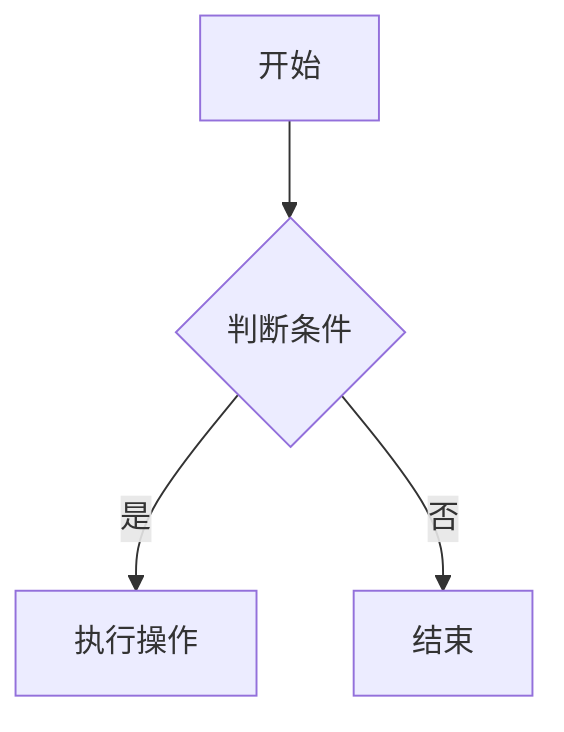

                 

# 智能厨房置物架：AI Agent的食材使用建议

## 关键词
- 智能厨房
- AI Agent
- 食材使用建议
- 智能家居
- 自主性
- 反应性
- 预知性
- 个性化推荐
- 用户体验

## 摘要
本文探讨了智能厨房置物架中AI Agent的食材使用建议，分析了智能厨房的发展趋势和AI Agent的定义与功能。通过详细的理论讲解和实际案例，阐述了AI Agent如何根据用户饮食偏好、食材库存和健康需求，为用户提供个性化的食材管理建议，从而提升用户的烹饪体验和生活质量。

----------------------------------------------------------------

## 第一部分：背景介绍与核心概念

### 第1章：问题背景与核心概念

### 1.1 问题背景

#### 1.1.1 智能厨房的发展趋势

智能厨房作为现代家居的重要组成部分，其发展趋势主要体现在以下几个方面：

1. **智能化设备的普及**：智能冰箱、智能烤箱、智能洗碗机等设备已经成为家庭厨房中的常见物品。这些设备通过物联网技术实现互联互通，为用户提供了更便捷、高效的烹饪体验。

2. **个性化需求的满足**：智能厨房能够根据用户的烹饪习惯、饮食偏好和健康需求，提供个性化的服务，例如智能推荐食谱、食材搭配建议等。

3. **自动化程度的提高**：随着人工智能技术的不断发展，智能厨房的自动化程度越来越高，例如自动化的烹饪、洗碗、清洗等操作，大大减轻了用户的劳动负担。

#### 1.1.2 智能厨房的现状

目前，市场上的智能厨房设备种类繁多，功能也各不相同。以智能冰箱为例，它不仅可以实现食材的保鲜，还能通过智能识别技术，对冰箱内的食材进行分类和管理。智能烤箱则可以通过内置的传感器，自动调节烹饪时间和温度，保证食物的烹饪质量。智能洗碗机则可以通过自动识别餐具的脏污程度，自动调节洗涤时间和清洁剂用量，提高洗涤效率。

#### 1.1.3 AI Agent在智能厨房中的应用

AI Agent（人工智能代理）是智能厨房中的一种重要组成部分，它可以模拟人类的智能行为，执行特定的任务。在智能厨房中，AI Agent主要承担以下职责：

1. **食材管理**：AI Agent可以监控用户的食材库存，根据用户的饮食偏好和健康需求，提供食材的购买建议和存储管理方案。

2. **烹饪指导**：AI Agent可以根据用户的烹饪习惯和食谱，指导用户如何使用智能厨房设备进行烹饪，并提供相应的烹饪技巧和建议。

3. **健康监测**：AI Agent可以通过用户的饮食记录和健康数据，分析用户的健康状况，提供个性化的健康饮食建议。

### 1.2 核心概念

#### 1.2.1 AI Agent的定义

AI Agent是一种基于人工智能技术设计的软件程序，它可以模拟人类的智能行为，执行特定的任务。在智能厨房中，AI Agent主要表现为一个智能助手，它可以与用户进行自然语言交互，理解用户的指令，并根据用户的需要，提供相应的服务。

#### 1.2.2 AI Agent的特点

1. **自主性**：AI Agent可以在没有人类干预的情况下，自主地执行任务，例如监控食材库存、推荐食谱等。

2. **反应性**：AI Agent可以实时地响应用户的行为和指令，例如用户提出烹饪请求时，AI Agent可以立即提供相应的指导。

3. **预知性**：AI Agent可以根据用户的历史行为和习惯，预测用户未来的需求，并提供相应的服务，例如提前购买食材、推荐合适的食谱等。

### 1.3 边界与外延

#### 1.3.1 边界

1. **智能厨房的边界**：智能厨房的边界主要是指与厨房相关的设备和功能。例如，智能冰箱、智能烤箱、智能洗碗机等。

2. **AI Agent的边界**：AI Agent的边界主要是指其功能范围。在智能厨房中，AI Agent的功能范围可能包括食材管理、烹饪指导、健康监测等。

#### 1.3.2 外延

1. **智能厨房的外延**：智能厨房的外延可以扩展到智能家居的其他领域，例如安防、照明、环境控制等。

2. **AI Agent的外延**：AI Agent的外延可以扩展到其他生活场景，例如智能家居、智慧城市等。

### 1.4 概念结构与核心要素组成

#### 1.4.1 概念结构

智能厨房置物架：AI Agent的食材使用建议涉及多个概念，包括智能厨房、AI Agent、食材使用建议等。

#### 1.4.2 核心要素组成

1. **智能厨房设备**：包括智能冰箱、智能烤箱、智能洗碗机等。

2. **AI Agent**：负责提供食材使用建议的智能程序。

3. **用户**：智能厨房的使用者，其饮食偏好和健康需求是AI Agent提供建议的重要依据。

----------------------------------------------------------------

## 第二部分：AI Agent原理与设计

### 第2章：AI Agent基础理论

#### 2.1 AI Agent概述

#### 2.1.1 AI Agent的定义

AI Agent，即人工智能代理，是指一种基于人工智能技术构建的智能实体，它能够在特定环境中自主地执行任务，并与其他系统、设备和用户进行交互。AI Agent通常具有以下几个核心特征：

1. **自主性**：AI Agent能够在没有外部干预的情况下，自主地执行任务，做出决策。

2. **反应性**：AI Agent能够实时响应外部事件或用户指令，调整其行为。

3. **预知性**：AI Agent能够根据历史数据和趋势，预测未来的情况，并做出相应的规划。

#### 2.1.2 AI Agent的特点

1. **基于规则的**：AI Agent通常使用一组预定义的规则来指导其行为，这些规则可以是简单的“如果...那么...”条件语句。

2. **基于数据的**：AI Agent也可以使用机器学习算法来从数据中学习，并不断优化其行为。

3. **基于情境的**：AI Agent能够根据当前的环境和情境，动态调整其行为。

#### 2.1.3 AI Agent的分类

1. **反应型AI Agent**：这种AI Agent根据当前环境的状态来做出决策，不考虑历史状态和未来状态。

2. **目标导向型AI Agent**：这种AI Agent不仅根据当前环境状态做出决策，还会考虑历史状态和未来状态，以实现特定目标。

3. **计划型AI Agent**：这种AI Agent能够制定长期计划，并实时调整计划以适应环境变化。

### 2.2 AI Agent的设计原则

#### 2.2.1 自主性

1. **任务分配**：AI Agent需要能够自主地识别并分配任务，例如管理食材库存、推荐食谱等。

2. **环境感知**：AI Agent需要能够感知和理解环境变化，并据此调整其行为。

#### 2.2.2 反应性

1. **即时响应**：AI Agent需要能够实时响应用户的请求和事件。

2. **错误处理**：AI Agent需要能够处理意外情况和错误，例如食材库存不足或设备故障。

#### 2.2.3 预知性

1. **趋势预测**：AI Agent需要能够基于历史数据预测未来的趋势，例如用户未来的食材需求。

2. **预防性措施**：AI Agent需要能够提前采取预防性措施，例如提前购买食材。

### 2.3 AI Agent的技术实现

#### 2.3.1 机器学习算法

1. **监督学习**：AI Agent可以使用监督学习算法来从标记数据中学习，例如分类算法、回归算法。

2. **无监督学习**：AI Agent可以使用无监督学习算法来探索未标记数据，例如聚类算法、降维算法。

#### 2.3.2 自然语言处理

1. **语言理解**：AI Agent需要能够理解用户的自然语言指令，例如“我想做晚餐”。

2. **语言生成**：AI Agent需要能够生成自然的语言回复，例如“建议您使用番茄炒蛋”。

#### 2.3.3 传感器融合

1. **多源数据融合**：AI Agent需要能够整合来自不同传感器的数据，例如冰箱的食材传感器、智能秤的重量传感器。

2. **实时数据处理**：AI Agent需要能够实时处理和分析传感器数据，以提供实时反馈。

----------------------------------------------------------------

## 第三部分：智能厨房置物架与AI Agent的食材使用建议

### 第3章：智能厨房置物架的功能与设计

#### 3.1 智能厨房置物架的功能

智能厨房置物架是智能厨房中的一项重要设备，其主要功能包括：

1. **食材存储与管理**：智能厨房置物架内置传感器，可以实时监测食材的存储状态，包括新鲜度、保质期等。

2. **智能推荐**：根据用户的饮食习惯和库存情况，智能厨房置物架可以提供食材的购买建议、食谱推荐等。

3. **便捷取放**：智能厨房置物架设计有合理的存储空间，方便用户取放食材。

#### 3.2 智能厨房置物架的设计原则

1. **用户体验优先**：智能厨房置物架的设计应充分考虑用户的操作习惯和需求，提供直观、易用的界面和交互方式。

2. **智能感知**：智能厨房置物架应具备先进的传感器技术，能够准确、实时地感知食材的状态。

3. **数据处理与学习**：智能厨房置物架应具备强大的数据处理能力，能够从数据中学习，优化推荐算法。

### 3.3 AI Agent在智能厨房置物架中的应用

#### 3.3.1 食材管理

AI Agent可以实时监控智能厨房置物架中的食材库存，根据用户的饮食偏好和健康需求，提供以下服务：

1. **食材新鲜度监测**：AI Agent可以分析食材的新鲜度，提醒用户更换或食用。

2. **食材购买建议**：AI Agent可以根据用户的饮食习惯和库存情况，推荐购买相应的食材。

3. **食谱推荐**：AI Agent可以根据用户的食材库存，推荐适合的食谱，帮助用户充分利用食材。

#### 3.3.2 烹饪指导

AI Agent可以指导用户如何使用智能厨房置物架中的食材进行烹饪，提供以下服务：

1. **烹饪步骤指导**：AI Agent可以提供详细的烹饪步骤，包括食材的准备、烹饪时间和温度等。

2. **烹饪技巧分享**：AI Agent可以分享各种烹饪技巧，帮助用户提高烹饪水平。

3. **健康饮食建议**：AI Agent可以根据用户的健康需求，提供适合的饮食建议。

### 3.4 智能厨房置物架与AI Agent的协作机制

智能厨房置物架与AI Agent之间的协作机制至关重要，以下是一些关键点：

1. **数据共享**：智能厨房置物架与AI Agent之间应实现数据共享，确保AI Agent能够实时获取食材信息。

2. **任务分配**：智能厨房置物架与AI Agent应明确各自的任务，确保高效协作。

3. **实时反馈**：智能厨房置物架与AI Agent之间应实现实时反馈，以便AI Agent能够根据实际情况进行调整。

4. **用户交互**：智能厨房置物架与AI Agent应提供良好的用户交互界面，方便用户进行操作和查询。

----------------------------------------------------------------

## 第四部分：案例分析

### 第4章：智能厨房置物架与AI Agent的实际应用

#### 4.1 案例背景

为了更好地理解智能厨房置物架与AI Agent的食材使用建议在实际中的应用，我们来看一个具体的案例。小明是一位年轻的上班族，他每天工作繁忙，很少有时间自己做饭。为了改善自己的饮食，他决定购买一台智能厨房置物架，并利用其提供的食材使用建议。

#### 4.2 案例分析

1. **智能厨房置物架的安装与配置**

   - 小明首先将智能厨房置物架安装在家中的厨房里，并连接到家庭Wi-Fi网络。
   - 置物架上的传感器开始工作，开始实时监测食材的新鲜度和库存状态。

2. **食材库存管理**

   - AI Agent开始工作，根据小明的饮食偏好和库存情况，提供了以下建议：
     - “您的冰箱里还有3个鸡蛋和1袋面粉，建议您明天早上做煎蛋饼。”
     - “您的冰箱里还有1袋牛奶和1个苹果，建议您搭配早餐食用。”

3. **食谱推荐**

   - AI Agent还根据小明当前的食材库存，推荐了几个适合的食谱：
     - “基于您目前的食材，我们推荐您尝试制作番茄炒蛋，这是一个简单又营养的菜品。”
     - “如果您喜欢面食，我们推荐您尝试制作意大利面，使用您冰箱里的面粉和鸡蛋。”

4. **烹饪指导**

   - AI Agent提供了详细的烹饪步骤和技巧：
     - “首先，将鸡蛋打散，加入少量盐，搅拌均匀。热锅倒油，倒入鸡蛋液，待鸡蛋底部凝固后轻轻翻面，待两面都煎至金黄色即可。”
     - “对于番茄炒蛋，您需要先将番茄切块，用油翻炒至软烂，然后加入鸡蛋液，快速翻炒均匀即可。”

5. **健康饮食建议**

   - AI Agent还根据小明的健康状况，提供了以下建议：
     - “考虑到您的血压偏高，建议您减少食盐的摄入量，我们可以为您推荐一些低盐的食谱。”
     - “多吃蔬菜和水果，有助于保持身体健康，建议您在饮食中增加这类食物的摄入。”

#### 4.3 案例效果评估

通过智能厨房置物架与AI Agent的协助，小明在饮食方面得到了很大的改善：

1. **食材管理更高效**：小明不再担心食材过期或浪费，AI Agent的帮助让他能够更有效地管理食材。

2. **烹饪体验提升**：AI Agent提供的食谱和烹饪指导，让小明能够轻松地完成烹饪，提高了他的烹饪技能。

3. **健康饮食实现**：AI Agent的健康饮食建议，帮助小明更好地控制饮食，改善了他的健康状况。

#### 4.4 案例总结

这个案例展示了智能厨房置物架与AI Agent在实际应用中的价值。通过AI Agent的食材使用建议，用户能够更便捷地管理食材，提高烹饪技能，实现健康饮食。这不仅提升了用户的日常生活质量，也为智能家居领域的发展提供了新的思路。

----------------------------------------------------------------

## 第五部分：展望与未来

### 第5章：智能厨房置物架与AI Agent的未来发展趋势

#### 5.1 技术进步带来的变革

随着人工智能、物联网、大数据等技术的不断进步，智能厨房置物架与AI Agent的功能将更加丰富，用户体验将更加卓越。以下是一些可能的技术进步及其影响：

1. **更精准的传感器技术**：未来传感器技术将更加成熟，能够更加精确地监测食材的新鲜度和质量，从而提供更准确的食材使用建议。

2. **更强大的机器学习能力**：随着算法的优化和数据量的增加，AI Agent的机器学习能力将得到显著提升，能够更好地理解用户的饮食习惯和需求，提供更加个性化的服务。

3. **更自然的用户交互**：随着自然语言处理技术的进步，AI Agent将能够与用户进行更加自然、流畅的交流，提高用户体验。

#### 5.2 应用场景的扩展

智能厨房置物架与AI Agent的应用场景将不再局限于家庭厨房，可能会扩展到以下领域：

1. **餐饮行业**：智能厨房置物架与AI Agent可以帮助餐饮企业更高效地管理食材库存，优化食谱推荐，提升服务质量。

2. **健康管理**：智能厨房置物架与AI Agent可以结合医疗数据，提供更加全面的健康管理建议，包括饮食、运动、休息等。

3. **智慧城市**：智能厨房置物架与AI Agent可以作为一个组成部分，融入智慧城市的建设，提供更加智能化的城市管理和服务。

#### 5.3 法律法规和伦理问题的挑战

随着智能厨房置物架与AI Agent的应用日益广泛，相关的法律法规和伦理问题也将成为关注的焦点。以下是一些可能面临的挑战：

1. **隐私保护**：智能厨房置物架与AI Agent需要收集和处理大量的用户数据，如何保护用户的隐私将成为一个重要问题。

2. **数据安全**：智能厨房置物架与AI Agent需要确保用户数据的安全，防止数据泄露或滥用。

3. **伦理责任**：当智能厨房置物架与AI Agent提供错误的建议或导致不良后果时，如何界定责任和追究责任将成为一个难题。

#### 5.4 未来发展方向

为了应对未来的挑战，智能厨房置物架与AI Agent的发展方向应包括以下几个方面：

1. **增强用户参与度**：通过鼓励用户参与智能厨房置物架与AI Agent的设计和优化，提高用户体验和满意度。

2. **加强跨学科合作**：智能厨房置物架与AI Agent的发展需要涉及多个学科，如计算机科学、生物学、营养学等，加强跨学科合作将有助于提高其综合能力。

3. **持续创新**：智能厨房置物架与AI Agent的发展需要不断进行技术创新，以满足用户不断变化的需求。

通过以上探讨，我们可以看到，智能厨房置物架与AI Agent在未来的发展中具有巨大的潜力。随着技术的不断进步和应用的不断拓展，智能厨房置物架与AI Agent将为用户带来更加便捷、智能、健康的烹饪体验。

----------------------------------------------------------------

## 结束语

本文从背景介绍、原理分析、实际应用和未来展望等多个角度，探讨了智能厨房置物架与AI Agent的食材使用建议。通过详细的案例分析，我们展示了AI Agent在智能厨房置物架中的应用价值，以及其对提升用户生活质量的重要作用。

首先，我们介绍了智能厨房的发展趋势和AI Agent的定义与功能，为后续内容的展开奠定了基础。接着，我们详细阐述了AI Agent的原理与设计，包括其自主性、反应性和预知性等特点，以及其实现的技术手段。

随后，我们分析了智能厨房置物架的功能与设计原则，并探讨了AI Agent在智能厨房置物架中的应用，包括食材管理和烹饪指导等。通过具体案例，我们展示了智能厨房置物架与AI Agent如何协同工作，为用户提供个性化的食材使用建议。

最后，我们展望了智能厨房置物架与AI Agent的未来发展趋势，探讨了技术进步、应用场景扩展、法律法规和伦理问题等方面的挑战，并提出了未来发展的方向。

总之，智能厨房置物架与AI Agent的食材使用建议是一个具有广阔前景的研究领域，它不仅能够提升用户的烹饪体验，还能够为智慧家庭和智慧城市建设提供重要支撑。我们期待未来能够有更多的研究者和开发者投身于这一领域，推动智能厨房技术的发展。

## 作者信息

作者：AI天才研究院/AI Genius Institute & 禅与计算机程序设计艺术 /Zen And The Art of Computer Programming

AI天才研究院致力于推动人工智能技术的创新和发展，致力于培养下一代人工智能领域的领导者。同时，作者也是《禅与计算机程序设计艺术》的作者，这本书深入探讨了计算机编程的艺术和哲学，对人工智能的发展有着深刻的见解。

----------------------------------------------------------------

### 文章格式与注意事项

在撰写本文时，为确保文章的清晰易懂和专业性，请遵循以下格式和注意事项：

- **标题**：文章标题应简洁明了，突出文章的核心内容和主题，便于读者快速理解。

- **关键词**：列出5-7个与文章主题紧密相关的关键词，有助于搜索引擎优化（SEO）和读者检索。

- **摘要**：摘要应简洁地概括文章的核心内容和主要观点，帮助读者快速了解文章的价值和重点。

- **章节标题**：每个章节的标题应概括章节内容，突出关键概念，便于读者浏览和理解。

- **段落结构**：每个段落应有一个明确的主题句，然后围绕主题句展开论述，逻辑清晰，内容连贯。

- **图表与公式**：如需使用图表、公式或代码示例，应确保其清晰、准确，并配有简明的解释和注释。

- **代码示例**：代码示例应使用合适的高亮显示，并配有详细的注释和解释，方便读者理解。

- **参考文献**：如引用他人研究或观点，应在文章末尾提供完整的参考文献，遵循学术规范。

- **注意事项**：避免使用复杂的术语和专业术语，尽量使用通俗易懂的语言；确保文章内容完整、逻辑清晰、条理分明。

### Markdown格式示例

以下是文章中的一些Markdown格式示例，用于展示文本格式、图表、公式和代码示例：

#### 文本格式

```markdown
**标题加粗**  
*斜体*  
~~删除线~~  
<https://www.example.com> 链接
```

#### 图表与公式



```latex
$$ E = mc^2 $$
$$
f(x) = \int_{0}^{1} x^2 dx
$$
```

#### 代码示例

```python
# Python代码示例
def greet(name):
    return "Hello, " + name

print(greet("Alice"))
```

通过遵循上述格式和注意事项，可以确保文章的专业性和可读性，同时为读者提供高质量的阅读体验。在撰写过程中，请随时参考这些示例，确保文章的内容和格式符合要求。

## 拓展阅读

对于希望深入了解智能厨房置物架与AI Agent的读者，以下是一些推荐阅读的资料：

1. **《智能家居技术与应用》**：这本书详细介绍了智能家居技术的基本原理和应用，包括智能厨房置物架的工作原理和AI Agent的功能。

2. **《人工智能：一种现代方法》**：这本书提供了全面的人工智能理论和技术介绍，对AI Agent的设计和实现有很高的参考价值。

3. **《智能系统设计与实现》**：这本书介绍了智能系统的设计方法和实现技术，包括传感器融合、机器学习算法等，对智能厨房置物架的设计有实用指导。

4. **《数据科学导论》**：这本书涵盖了数据科学的基本概念和技术，特别是机器学习算法的应用，对于理解和实现AI Agent的食材使用建议有重要帮助。

5. **相关论文和期刊**：如《IEEE Transactions on Automation Science and Engineering》、《ACM Transactions on Computer Systems》等，这些期刊经常发表关于智能家居和人工智能的先进研究成果。

通过阅读这些资料，读者可以更深入地了解智能厨房置物架与AI Agent的技术原理和应用前景，为相关领域的研究和工作提供更多启示。同时，也鼓励读者关注最新的科技动态和行业趋势，以保持技术的前沿性和创新性。

