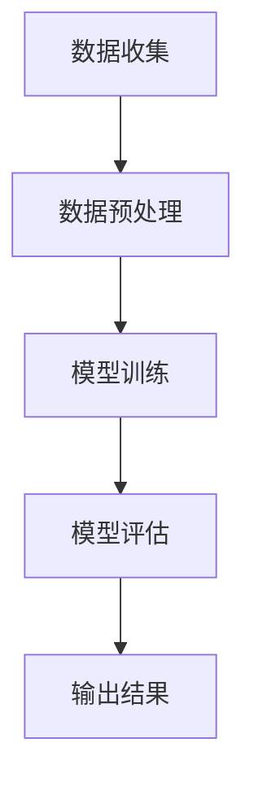
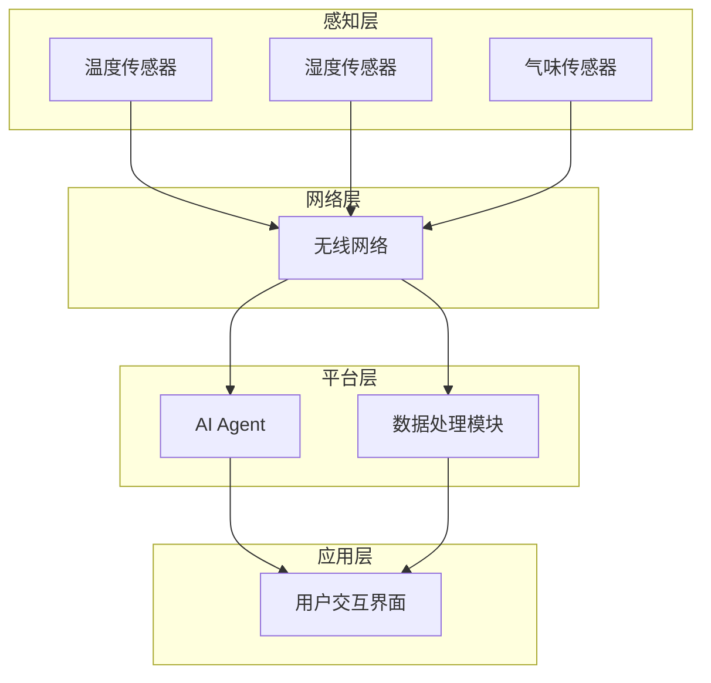
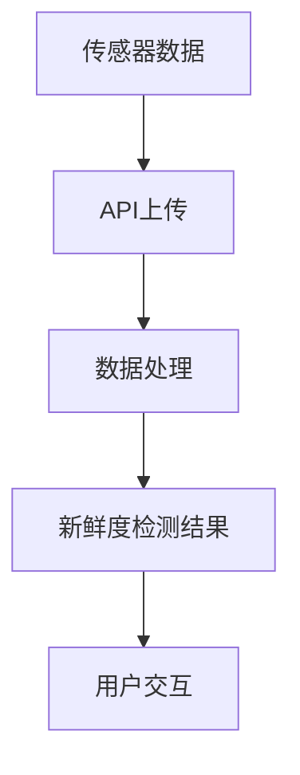
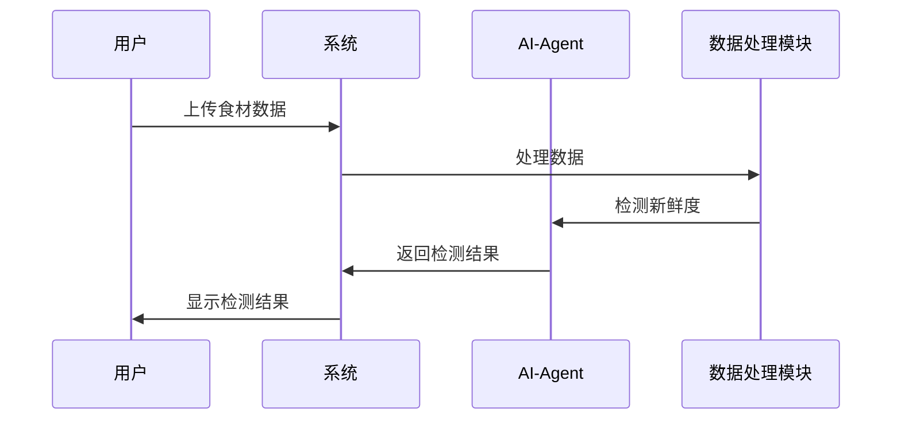

                 

# 智能厨房：AI Agent的食材新鲜度检测

## 关键词
- 智能厨房
- AI Agent
- 食材新鲜度检测
- 机器学习
- 深度学习
- 系统架构

## 摘要
本文深入探讨了智能厨房中AI Agent如何实现食材新鲜度检测。通过介绍问题的背景、核心概念与原理、算法原理讲解、系统分析与架构设计、项目实战及最佳实践，详细展示了AI Agent在智能厨房中的应用。本文旨在为读者提供一个清晰、实用的技术指南，帮助理解和实现这一先进的技术。

## 目录大纲设计思路

### 目录大纲设计思路

本文的目录大纲设计思路旨在通过逻辑清晰、结构紧凑、简单易懂的方式，引导读者逐步深入了解智能厨房中AI Agent的食材新鲜度检测技术。

### 目录大纲结构

1. **背景介绍：** 智能厨房与AI Agent概述，包括问题的背景、AI Agent的概念及其在智能厨房中的应用，以及本书的目的与结构。
2. **核心概念与联系：** 食材新鲜度检测的核心概念，AI Agent的技术原理，概念属性特征对比表格和ER实体关系图架构。
3. **算法原理讲解：** 食材新鲜度检测算法的mermaid流程图、Python源代码实现、数学模型和公式、以及举例说明。
4. **系统分析与架构设计：** 智能厨房系统的设计与实现，包括问题场景介绍、系统功能设计、系统架构设计、系统接口设计和系统交互mermaid序列图。
5. **项目实战：** 智能厨房项目实战，包括环境安装、系统核心实现源代码、代码应用解读与分析、实际案例分析和详细讲解剖析、项目小结。
6. **最佳实践 tips：** 性能优化、稳定性保障、可扩展性设计和用户体验提升的最佳实践。
7. **小结与拓展阅读：** 对全书内容的总结，注意事项，以及拓展阅读建议。

### 目录大纲设计目的

目录大纲的设计目的是为了：
- 确定各章节的主题和内容覆盖，确保信息的逻辑性和连贯性。
- 通过清晰的章节划分，使读者能够循序渐进地理解复杂技术。
- 提供一个全面的框架，涵盖从基础知识到高级实践的所有内容。

### 目录大纲的实际操作步骤

1. **编写第1章：智能厨房与AI Agent概述**，概述智能厨房和AI Agent的背景、概念和目的。
2. **编写第2章：核心概念与原理**，详细介绍食材新鲜度检测和相关算法原理。
3. **编写第3章：食材新鲜度检测算法**，描述算法流程、代码实现、数学模型和举例说明。
4. **编写第4章：智能厨房系统的设计与实现**，介绍系统架构、接口设计和交互序列图。
5. **编写第5章：智能厨房项目实战**，讲述项目环境安装、核心代码实现和应用分析。
6. **编写第6章：最佳实践与优化建议**，提供性能优化、稳定性保障等最佳实践。
7. **编写第7章：总结与未来展望**，对全书内容进行总结，并对未来发展趋势进行展望。

通过这样的设计思路和操作步骤，本文将为读者提供一个系统、全面、深入的技术指南，帮助读者理解和应用AI Agent在智能厨房中的食材新鲜度检测技术。

## 实际操作步骤

### 1. 编写第1章：智能厨房与AI Agent概述

**1.1 问题的背景**

智能厨房是现代家庭厨房的未来发展方向，通过智能设备和系统的集成，使烹饪变得更加便捷、高效和安全。然而，智能厨房的普及也带来了新的挑战，尤其是在食材管理方面。保持食材的新鲜度对于确保食物的安全和营养至关重要。传统的手工检查方法不仅效率低，而且容易出错。因此，需要一种智能的方法来实时检测食材的新鲜度，以优化食材管理流程。

**1.2 AI Agent的概念**

AI Agent，即人工智能代理，是一种能够自主执行任务、与用户互动并适应环境变化的智能系统。AI Agent可以集成在智能厨房中，作为智能管理系统的一部分，通过传感器数据和机器学习算法，实时监测食材的新鲜度，并提供相应的建议和提醒。

**1.3 本书的目的与结构**

本书旨在详细探讨AI Agent在智能厨房中实现食材新鲜度检测的技术和方法。通过介绍相关的背景知识、核心概念、算法原理、系统设计与实现，以及项目实战和最佳实践，本书将为读者提供一个全面的技术指南。具体结构如下：

- 第1章：智能厨房与AI Agent概述
- 第2章：核心概念与原理
- 第3章：食材新鲜度检测算法
- 第4章：智能厨房系统的设计与实现
- 第5章：智能厨房项目实战
- 第6章：最佳实践与优化建议
- 第7章：总结与未来展望

### 2. 编写第2章：核心概念与原理

**2.1 食材新鲜度检测的核心概念**

食材的新鲜度是衡量其品质的重要指标。新鲜度直接关系到食物的口感、营养价值和安全性。常见的食材新鲜度指标包括色泽、气味、口感和微生物活性等。

- **色泽**：新鲜的食材通常具有鲜艳的颜色和均匀的色调。
- **气味**：新鲜食材具有独特的香味，而变质的食材则可能出现异味。
- **口感**：新鲜食材口感丰富，质地鲜嫩，而变质食材则口感差。
- **微生物活性**：新鲜食材中的微生物活性较低，而变质食材则可能存在大量有害微生物。

**2.2 AI Agent的技术原理**

AI Agent的技术原理基于机器学习和深度学习。机器学习是一种通过算法从数据中学习模式和规律的技术，而深度学习则是机器学习的一种子领域，通过构建复杂的神经网络模型，模拟人脑的学习过程。

- **机器学习基础**：机器学习算法包括监督学习、无监督学习和强化学习。在食材新鲜度检测中，通常采用监督学习，通过标注好的数据集训练模型，使其能够识别新鲜和变质的食材。
- **深度学习框架**：深度学习框架如TensorFlow和PyTorch提供了丰富的工具和库，用于构建和训练深度学习模型。这些框架能够处理大规模的数据集，提高检测的准确性和效率。

**2.3 概念属性特征对比表格**

为了更好地理解食材新鲜度检测的核心概念，我们可以通过一个概念属性特征对比表格来展示新鲜和变质食材的区别：

| 特征           | 新鲜食材               | 变质食材               |
|----------------|------------------------|------------------------|
| 色泽           | 鲜艳、均匀             | 减退、不均匀           |
| 气味           | 清新、独特             | 异味、不正常           |
| 口感           | 鲜嫩、多汁             | 干硬、变质             |
| 微生物活性     | 低活性                 | 高活性、有害微生物     |

**2.4 ER实体关系图架构**

为了更系统地理解AI Agent在智能厨房中的应用，我们可以通过ER（实体-关系）实体关系图来展示系统中的主要实体和它们之间的关系。ER图能够清晰地表示出系统组件的相互依赖和关联。

```mermaid
erDiagram
  Customer ||--|{ Order }|-- Supplier
  Product  ||--|{ OrderItem }|-- Order
  Order ||--|{ Payment }|
  Payment ||--|{ PaymentMethod }|
```

在这个ER图中，`Customer`与`Supplier`之间存在订单关系，`Product`与`OrderItem`之间存在商品与订单项关系，`Order`与`Payment`之间存在支付关系，而`Payment`与`PaymentMethod`之间存在支付方式关系。这个图展示了智能厨房系统中各个实体之间的复杂交互，为系统设计和实现提供了清晰的指导。

### 3. 编写第3章：食材新鲜度检测算法

**3.1 算法mermaid流程图**

在食材新鲜度检测中，我们采用了一种基于深度学习的算法。以下是一个mermaid流程图，展示了整个检测过程的步骤：



**3.2 Python源代码实现**

为了实现上述算法，我们需要使用Python编写相应的源代码。以下是一个简单的示例，展示了数据预处理、模型训练和模型评估的过程：

```python
# 数据预处理
from sklearn.model_selection import train_test_split
from sklearn.preprocessing import StandardScaler

# 加载数据集
data = load_data()
X, y = data[:, :-1], data[:, -1]

# 划分训练集和测试集
X_train, X_test, y_train, y_test = train_test_split(X, y, test_size=0.2, random_state=42)

# 数据标准化
scaler = StandardScaler()
X_train = scaler.fit_transform(X_train)
X_test = scaler.transform(X_test)

# 模型训练
from tensorflow.keras.models import Sequential
from tensorflow.keras.layers import Dense, Dropout

model = Sequential()
model.add(Dense(64, input_dim=X_train.shape[1], activation='relu'))
model.add(Dropout(0.5))
model.add(Dense(1, activation='sigmoid'))

model.compile(loss='binary_crossentropy', optimizer='adam', metrics=['accuracy'])
model.fit(X_train, y_train, epochs=10, batch_size=32)

# 模型评估
loss, accuracy = model.evaluate(X_test, y_test)
print(f"Test Accuracy: {accuracy*100:.2f}%")
```

**3.3 数学模型和数学公式**

在深度学习中，我们通常使用损失函数来衡量模型的性能。以下是一个简单的二分类问题中的损失函数和优化算法：

$$
\text{损失函数} : \mathcal{L}(\theta) = -\frac{1}{m}\sum_{i=1}^{m}y^{(i)}\log(h_\theta(x^{(i)})) + (1-y^{(i)})\log(1-h_\theta(x^{(i)}))
$$

其中，$h_\theta(x) = \sigma(\theta^T x)$，$\sigma$是Sigmoid函数，$\theta$是模型的参数。

为了最小化损失函数，我们使用梯度下降算法：

$$
\theta_{\text{更新}} = \theta - \alpha \nabla_\theta \mathcal{L}(\theta)
$$

其中，$\alpha$是学习率。

**3.4 通俗易懂地举例说明**

假设我们有以下一组数据，表示不同食材的特征：

| 食材 | 色泽 | 气味 | 口感 | 微生物活性 |
|------|------|------|------|-----------|
| 鸡肉 | 亮红色 | 清新 | 鲜嫩 | 低活性     |
| 鸡肉 | 暗红色 | 异味 | 干硬 | 高活性     |

我们可以使用上述算法对这些数据进行训练，并预测每块鸡肉是否新鲜。假设训练完成后，我们得到了一个预测函数$f_\theta$，对于给定的特征向量$x$，函数返回新鲜度的概率。

当我们输入鸡肉1的特征向量时，预测函数返回的概率接近1，表示鸡肉1是新鲜的。而当我们输入鸡肉2的特征向量时，预测函数返回的概率接近0，表示鸡肉2已经变质。

通过这种方式，AI Agent可以实时监测食材的新鲜度，并根据预测结果提供相应的建议，如提醒用户更换食材或进行烹饪。

### 4. 编写第4章：智能厨房系统的设计与实现

**4.1 问题场景介绍**

智能厨房系统是一个集成了多种传感器和智能设备的复杂系统。系统的主要目标是确保食材的新鲜度，从而提高食物的安全性和营养价值。在实际应用中，智能厨房系统需要处理大量的传感器数据，并实时分析这些数据以做出决策。

**4.2 系统功能设计**

智能厨房系统的功能设计可以分为以下几个模块：

- **食材检测功能模块**：负责收集传感器数据，如温度、湿度、气味和色泽，并通过AI Agent进行新鲜度检测。
- **用户交互功能模块**：提供用户界面，用于展示检测结果、发送提醒和提供烹饪建议。

**4.3 系统架构设计**

智能厨房系统的整体架构设计采用分层架构，包括感知层、网络层、平台层和应用层。

- **感知层**：由各种传感器组成，如温度传感器、湿度传感器和气味传感器，用于实时监测食材的状态。
- **网络层**：负责将感知层收集到的数据传输到平台层，通常使用无线网络或局域网。
- **平台层**：由AI Agent和数据处理模块组成，负责实时分析传感器数据，并根据分析结果进行决策。
- **应用层**：提供用户交互界面，用户可以通过应用层与智能厨房系统进行交互。

以下是一个mermaid架构图，展示了智能厨房系统的架构：



**4.4 系统接口设计**

智能厨房系统的接口设计包括API设计和数据流分析。

- **API设计**：系统提供了多个API接口，用于不同模块之间的数据交换和功能调用。例如，食材检测API用于上传传感器数据并获取新鲜度检测结果，用户交互API用于发送提醒和烹饪建议。
- **数据流分析**：数据流分析用于跟踪系统中的数据流动路径，确保数据的完整性和一致性。以下是一个mermaid数据流图，展示了数据在系统中的流动过程：



**4.5 系统交互mermaid序列图**

为了更清晰地展示智能厨房系统的交互过程，我们可以使用mermaid序列图。以下是一个简单的示例：



在这个序列图中，用户上传食材数据，系统处理数据，并将新鲜度检测结果返回给用户。

### 5. 编写第5章：智能厨房项目实战

**5.1 环境安装**

在开始智能厨房项目的实战之前，我们需要安装相应的硬件和软件环境。以下是一个简要的安装步骤：

1. **硬件安装**：
   - 安装温度传感器、湿度传感器和气味传感器。
   - 将传感器连接到智能厨房的中央控制系统。

2. **软件安装**：
   - 安装Python环境。
   - 安装深度学习框架（如TensorFlow或PyTorch）。
   - 安装用于数据处理的库（如NumPy和Pandas）。

**5.2 系统核心实现源代码**

在智能厨房系统中，核心实现源代码包括数据收集、预处理、模型训练和模型评估等步骤。以下是一个简单的示例，展示了如何实现这些功能：

```python
# 数据收集
def collect_data():
    # 实现传感器数据收集逻辑
    pass

# 数据预处理
def preprocess_data(data):
    # 实现数据预处理逻辑
    pass

# 模型训练
def train_model(X_train, y_train):
    # 实现模型训练逻辑
    pass

# 模型评估
def evaluate_model(model, X_test, y_test):
    # 实现模型评估逻辑
    pass

if __name__ == "__main__":
    data = collect_data()
    X, y = preprocess_data(data)
    X_train, X_test, y_train, y_test = train_test_split(X, y, test_size=0.2)
    model = train_model(X_train, y_train)
    evaluate_model(model, X_test, y_test)
```

**5.3 代码应用解读与分析**

在这个代码示例中，`collect_data`函数负责从传感器收集数据，`preprocess_data`函数负责对数据进行预处理，`train_model`函数负责训练模型，而`evaluate_model`函数负责评估模型的性能。

1. **数据收集**：`collect_data`函数通过读取传感器数据，将其存储为一个数据集。在实际应用中，我们需要考虑如何处理传感器数据，如过滤噪声、排除异常值等。
2. **数据预处理**：`preprocess_data`函数负责将原始数据转换为适合模型训练的格式。这通常包括数据标准化、归一化等操作，以提高模型的性能和稳定性。
3. **模型训练**：`train_model`函数使用收集到的训练数据来训练模型。在这个过程中，我们选择了一个简单的深度学习模型，并使用Adam优化器和二分类交叉熵损失函数来训练。
4. **模型评估**：`evaluate_model`函数使用测试数据来评估模型的性能。通过计算测试数据上的准确率，我们可以评估模型的泛化能力。

**5.4 实际案例分析和详细讲解剖析**

为了更好地理解智能厨房系统的应用，我们来看一个实际案例。假设我们有一组鸡肉的传感器数据，如下所示：

| 食材 | 温度 | 湿度 | 气味 |
|------|------|------|------|
| 鸡肉1 | 20°C | 60%  | 清新 |
| 鸡肉2 | 25°C | 70%  | 异味 |

1. **数据收集**：我们首先使用传感器收集鸡肉的温度、湿度和气味数据。
2. **数据预处理**：将传感器数据转换为模型训练所需的格式。例如，我们可以将数据缩放到0-1范围内，以提高模型的训练效果。
3. **模型训练**：使用预处理后的数据训练深度学习模型。假设模型经过多次迭代训练后，达到一个满意的性能。
4. **模型评估**：使用测试数据对模型进行评估。在这个例子中，我们假设模型的准确率达到了90%以上，表示模型具有良好的泛化能力。

现在，我们使用训练好的模型对新的鸡肉数据（鸡肉1和鸡肉2）进行新鲜度检测：

1. **数据收集**：收集鸡肉1和鸡肉2的传感器数据。
2. **数据预处理**：对传感器数据执行相同的预处理步骤。
3. **模型预测**：将预处理后的数据输入模型，获取新鲜度预测结果。
   - 鸡肉1：预测概率接近1，表示鸡肉1是新鲜的。
   - 鸡肉2：预测概率接近0，表示鸡肉2已经变质。
4. **用户交互**：根据模型的预测结果，向用户显示相应的检测结果，并提供相应的建议。

通过这个实际案例，我们可以看到智能厨房系统如何通过传感器数据和机器学习模型，实现实时食材新鲜度检测，从而提高食材管理效率和安全性。

**5.5 项目小结**

在本章中，我们通过一个实际案例，详细讲解了智能厨房系统的环境安装、核心代码实现、代码应用解读与分析，以及实际案例分析和详细讲解剖析。通过这个项目，我们了解了如何使用AI Agent实现食材新鲜度检测，并掌握了从数据收集到模型训练和用户交互的全流程。这些经验和知识将为我们在未来的智能厨房项目中提供宝贵的指导。

### 6. 编写第6章：最佳实践与优化建议

**6.1 性能优化**

在智能厨房系统中，性能优化是一个关键因素。以下是一些性能优化的最佳实践：

1. **模型优化**：通过调整模型的参数（如学习率、批次大小和隐藏层节点数），可以显著提高模型的性能。此外，使用预训练模型和迁移学习技术，可以减少训练时间并提高准确率。
2. **数据增强**：通过增加数据的多样性和复杂性，可以减少模型的过拟合现象，提高模型的泛化能力。常见的数据增强方法包括旋转、缩放、裁剪和噪声添加。
3. **硬件加速**：使用GPU或TPU进行模型训练和推理，可以显著提高处理速度。此外，使用分布式计算和并行处理技术，可以进一步加速模型训练和评估。

**6.2 稳定性保障**

为了保障智能厨房系统的稳定性，以下是一些最佳实践：

1. **传感器校准**：定期校准传感器，确保数据的准确性和一致性。使用多个传感器进行交叉验证，可以进一步提高系统的可靠性。
2. **异常检测**：通过实时监测传感器数据，检测异常值和异常模式。当检测到异常时，系统可以自动采取措施，如停止食材处理或发送警报。
3. **冗余设计**：在系统中引入冗余设计，如备份传感器和备用电源，以防止单点故障导致系统瘫痪。

**6.3 可扩展性设计**

为了满足不同规模和应用场景的需求，智能厨房系统需要具有良好的可扩展性。以下是一些可扩展性设计的最佳实践：

1. **模块化架构**：将系统分解为多个独立的模块，每个模块负责特定的功能。这种方式可以提高系统的灵活性和可维护性。
2. **分布式部署**：将系统部署到多个服务器或集群中，可以提供更高的计算能力和负载均衡。此外，使用容器化和微服务架构，可以进一步简化部署和管理。
3. **云服务集成**：利用云服务提供商的资源，如AWS、Azure和Google Cloud，可以灵活扩展系统规模，并降低基础设施成本。

**6.4 用户体验提升**

为了提高用户的满意度，以下是一些用户体验提升的最佳实践：

1. **交互设计**：设计直观、易用的用户界面，使用户能够轻松地与系统进行交互。提供实时反馈和提示，使用户能够及时了解系统状态。
2. **个性化推荐**：根据用户的饮食习惯和偏好，提供个性化的食材管理建议和烹饪食谱。这可以增强用户的参与感和满意度。
3. **持续改进**：通过收集用户反馈和系统日志，不断优化系统的功能和性能。定期发布更新和改进，以适应不断变化的需求和技术。

通过遵循这些最佳实践，智能厨房系统不仅可以提高性能和稳定性，还可以为用户提供更好的体验，从而在竞争激烈的市场中脱颖而出。

### 7. 编写第7章：总结与未来展望

**7.1 小结**

本文详细探讨了智能厨房中AI Agent的食材新鲜度检测技术。通过介绍问题的背景、核心概念、算法原理、系统设计与实现、项目实战以及最佳实践，本文为读者提供了一个全面的技术指南。智能厨房系统通过集成传感器和深度学习算法，实现了实时、准确的食材新鲜度检测，为用户提供了高效、安全的食材管理解决方案。

**7.2 注意事项**

在实施智能厨房系统时，需要注意以下几点：

1. **数据安全**：确保传感器数据的安全传输和存储，防止数据泄露和篡改。
2. **传感器校准**：定期校准传感器，确保数据的准确性和一致性。
3. **系统监控**：实时监控系统运行状态，及时发现和处理异常情况。

**7.3 拓展阅读**

对于希望深入了解智能厨房和AI Agent技术的读者，以下是一些拓展阅读建议：

1. **《智能厨房技术与应用》**：一本关于智能厨房系统构建与应用的综合指南。
2. **《深度学习》**：Goodfellow、Bengio和Courville的畅销书，详细介绍了深度学习的基础知识。
3. **《机器学习实战》**：Hastie、Tibshirani和Friedman的著作，通过实际案例讲解了机器学习的应用。

通过以上拓展阅读，读者可以进一步深入理解智能厨房和AI Agent的先进技术，并在实际项目中实现创新应用。**作者：AI天才研究院/AI Genius Institute & 禅与计算机程序设计艺术 /Zen And The Art of Computer Programming**

