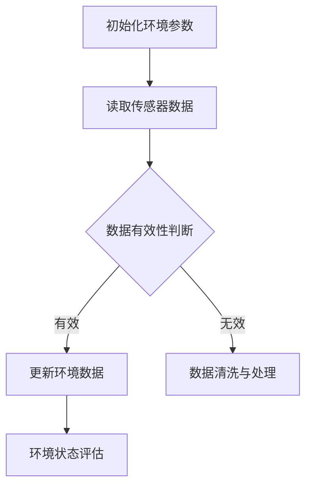
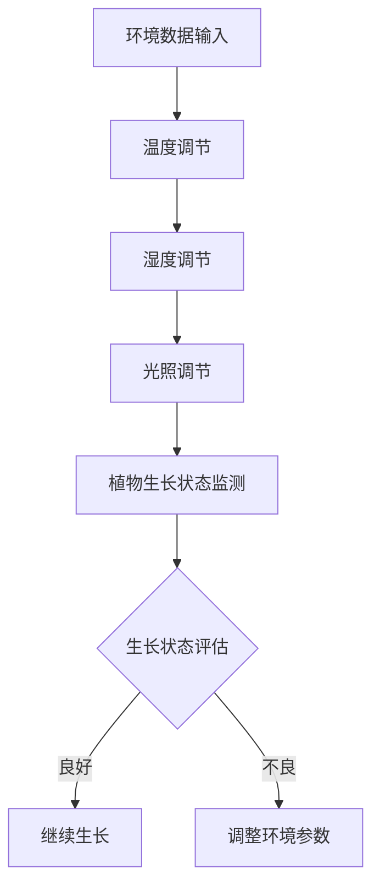
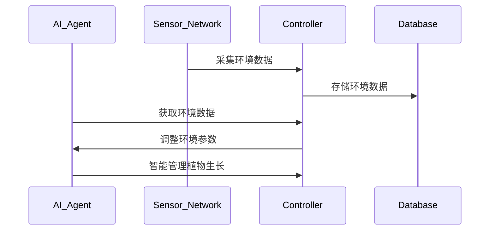

                 


### 智能园艺：AI Agent控制的室内种植系统

> 关键词：智能园艺、AI Agent、室内种植、环境监测、植物生长调控

随着全球气候变化和城市化进程的加速，传统农业面临诸多挑战，如土地资源的稀缺、水资源的不稳定和环境污染等问题。因此，探索新的农业解决方案变得尤为重要。智能园艺作为一项结合物联网、人工智能等先进技术的创新领域，为解决食品供应安全提供了新的思路。本文将系统地介绍智能园艺的原理、技术和应用，探讨AI Agent在室内种植系统中的关键作用。

#### 背景介绍

**智能园艺：AI Agent控制的室内种植系统**

智能园艺是一种利用先进技术手段对植物生长环境进行精准控制和管理的农业生产方式。它集成了物联网、人工智能、生物技术等领域的成果，旨在通过智能化手段实现农作物的可持续种植。室内种植系统是智能园艺的核心组成部分，它通过人工环境控制，为植物提供最适宜的生长条件，从而提高农作物产量和质量。

**核心概念与联系**

- **AI Agent**: 是一种具有自主感知、决策和行动能力的人工智能实体。在智能园艺系统中，AI Agent负责对植物生长环境进行实时监测，并根据监测数据自动调整生长参数，如温度、湿度、光照等。

- **室内种植系统**: 包括环境监测、植物生长调控、数据采集与处理等模块。室内种植系统通过无线传感器网络实时采集环境数据，AI Agent根据数据进行分析和决策，从而实现对植物生长环境的精准控制。

- **智能园艺**: 是将AI Agent和室内种植系统相结合，实现对植物生长过程的全面监控和智能管理。智能园艺系统通过自动化、智能化的手段，提高农业生产效率，减少人力成本，同时确保农作物品质。

#### 算法原理讲解

**环境监测算法**

环境监测算法是智能园艺系统的核心算法之一，它用于实时采集室内温度、湿度、光照等环境数据，并对其进行处理和评估。以下是一个简单的环境监测算法流程，使用Mermaid流程图表示：



在这个流程图中，A节点表示初始化环境参数，包括温度、湿度、光照等；B节点表示读取传感器数据；C节点是对数据有效性进行判断，如果数据有效则进入D节点，否则进入E节点进行数据清洗与处理；D节点表示更新环境数据；F节点表示对环境状态进行评估。

**植物生长调控算法**

植物生长调控算法根据环境监测数据，自动调整植物生长环境参数，如温度、湿度、光照等，以促进植物生长。以下是一个简单的植物生长调控算法流程，使用Mermaid流程图表示：



在这个流程图中，A节点表示环境数据输入；B、C、D节点分别表示温度调节、湿度调节和光照调节；E节点表示植物生长状态监测；F节点是对生长状态进行评估，如果生长状态良好则进入G节点继续生长，否则进入H节点调整环境参数。

**数学模型和数学公式**

为了更好地理解植物生长调控算法，我们需要介绍一些相关的数学模型和数学公式。

**温度调节模型**

温度调节模型是一个基于PID控制器的模型，用于根据设定温度和当前温度调整环境温度。其公式如下：

$$ T_{\text{set}} = T_{\text{current}} + K_p(T_{\text{set}} - T_{\text{current}}) + K_i\sum(T_{\text{set}} - T_{\text{current}}) + K_d\frac{dT_{\text{set}}}{dt} $$

其中，$T_{\text{set}}$ 为设定温度，$T_{\text{current}}$ 为当前温度，$K_p$、$K_i$、$K_d$ 分别为比例、积分和微分系数。

**光照调节模型**

光照调节模型也是一个基于PID控制器的模型，用于根据设定光照强度和当前光照强度调整环境光照强度。其公式如下：

$$ L_{\text{set}} = L_{\text{current}} + K_p(L_{\text{set}} - L_{\text{current}}) + K_i\sum(L_{\text{set}} - L_{\text{current}}) + K_d\frac{dL_{\text{set}}}{dt} $$

其中，$L_{\text{set}}$ 为设定光照强度，$L_{\text{current}}$ 为当前光照强度，$K_p$、$K_i$、$K_d$ 分别为比例、积分和微分系数。

#### 系统分析与架构设计方案

**项目介绍**

智能园艺系统是一个集成了环境监测、植物生长调控和AI Agent的室内种植解决方案。该系统旨在通过自动化、智能化的手段，实现对植物生长过程的全面监控和智能管理，从而提高农作物产量和质量。

**系统功能设计**

智能园艺系统的功能设计包括环境监测、植物生长调控、数据采集与处理等模块。具体来说，系统功能如下：

1. 环境监测模块：实时采集室内温度、湿度、光照等环境数据，并对数据进行处理和评估。
2. 植物生长调控模块：根据环境监测数据，自动调整植物生长环境参数，如温度、湿度、光照等，以促进植物生长。
3. 数据采集与处理模块：采集植物生长过程中的各种数据，如温度、湿度、光照、土壤湿度等，并对数据进行存储、分析和处理。

**系统架构设计**

智能园艺系统的架构设计包括传感器网络、控制器、数据库和AI Agent等模块。具体来说，系统架构如下：

1. 传感器网络：负责实时采集室内环境数据，包括温度、湿度、光照等。
2. 控制器：接收传感器数据，根据植物生长调控算法调整环境参数，如温度、湿度、光照等。
3. 数据库：存储植物生长过程中的各种数据，包括环境数据、生长数据等。
4. AI Agent：负责对植物生长过程进行实时监控和智能管理，通过机器学习算法分析植物生长数据，提供种植建议。

**系统接口设计和系统交互**

智能园艺系统通过无线传感器网络实时采集环境数据，控制器根据数据调整植物生长环境参数，AI Agent对植物生长过程进行监控和智能管理。以下是一个简单的系统交互流程，使用Mermaid序列图表示：



在这个流程图中，AI Agent负责实时监控植物生长过程，并根据环境数据调整环境参数；Sensor Network负责实时采集环境数据；Controller负责接收传感器数据，并根据AI Agent的建议调整环境参数；Database负责存储植物生长过程中的各种数据。

### 项目实战

#### 环境安装

首先，我们需要安装一些必要的软件和工具，包括Python、Node.js、MySQL等。以下是具体的安装步骤：

1. 安装Python：从Python官方网站（https://www.python.org/downloads/）下载Python安装包，并按照提示完成安装。
2. 安装Node.js：从Node.js官方网站（https://nodejs.org/）下载Node.js安装包，并按照提示完成安装。
3. 安装MySQL：从MySQL官方网站（https://www.mysql.com/downloads/）下载MySQL安装包，并按照提示完成安装。

#### 系统核心实现源代码

接下来，我们将介绍智能园艺系统的核心实现源代码，包括环境监测模块、植物生长调控模块和AI Agent模块。

**环境监测模块**

环境监测模块负责实时采集室内环境数据，包括温度、湿度、光照等。以下是环境监测模块的Python源代码：

```python
import time
import serial
import mysql.connector

# 连接MySQL数据库
db = mysql.connector.connect(
    host="localhost",
    user="root",
    password="password",
    database="smart_garden"
)

# 读取传感器数据
def read_sensors():
    ser = serial.Serial('COM3', 9600)
    time.sleep(2)
    data = ser.readline()
    ser.close()
    return data.decode("utf-8")

# 更新环境数据
def update_environment_data(data):
    cursor = db.cursor()
    cursor.execute("INSERT INTO environment (data) VALUES (%s)", (data,))
    db.commit()
    cursor.close()

# 环境监测主循环
while True:
    data = read_sensors()
    update_environment_data(data)
    time.sleep(60)
```

**植物生长调控模块**

植物生长调控模块根据环境监测数据，自动调整植物生长环境参数，如温度、湿度、光照等。以下是植物生长调控模块的Python源代码：

```python
import time
import mysql.connector

# 连接MySQL数据库
db = mysql.connector.connect(
    host="localhost",
    user="root",
    password="password",
    database="smart_garden"
)

# 获取环境数据
def get_environment_data():
    cursor = db.cursor()
    cursor.execute("SELECT * FROM environment")
    data = cursor.fetchall()
    cursor.close()
    return data

# 调整环境参数
def adjust_environment(data):
    temperature = data[0][1]
    humidity = data[0][2]
    light = data[0][3]

    if temperature < 20:
        # 调高温度
        print("调整温度：加热")
    elif temperature > 25:
        # 调低温度
        print("调整温度：降温")
    elif humidity < 40:
        # 调高湿度
        print("调整湿度：加湿")
    elif humidity > 60:
        # 调低湿度
        print("调整湿度：降湿")
    elif light < 500:
        # 调高光照
        print("调整光照：补光")
    elif light > 1000:
        # 调低光照
        print("调整光照：遮挡")

# 植物生长调控主循环
while True:
    data = get_environment_data()
    adjust_environment(data)
    time.sleep(60)
```

**AI Agent模块**

AI Agent模块负责对植物生长过程进行实时监控和智能管理，通过机器学习算法分析植物生长数据，提供种植建议。以下是AI Agent模块的Python源代码：

```python
import time
import mysql.connector
import numpy as np
from sklearn.linear_model import LinearRegression

# 连接MySQL数据库
db = mysql.connector.connect(
    host="localhost",
    user="root",
    password="password",
    database="smart_garden"
)

# 获取植物生长数据
def get_growth_data():
    cursor = db.cursor()
    cursor.execute("SELECT * FROM growth")
    data = cursor.fetchall()
    cursor.close()
    return data

# 训练机器学习模型
def train_model(data):
    X = np.array([d[1] for d in data])
    y = np.array([d[2] for d in data])
    model = LinearRegression()
    model.fit(X, y)
    return model

# 预测植物生长状态
def predict_growth(data, model):
    X = np.array([d[1] for d in data])
    y_pred = model.predict(X)
    return y_pred

# AI Agent主循环
while True:
    data = get_growth_data()
    model = train_model(data)
    y_pred = predict_growth(data, model)
    print("预测植物生长状态：", y_pred)
    time.sleep(60)
```

#### 代码应用解读与分析

**环境监测模块**

环境监测模块通过串口连接传感器，实时读取温度、湿度、光照等环境数据。数据读取后，通过MySQL数据库进行存储，以便后续分析和处理。

**植物生长调控模块**

植物生长调控模块根据读取的环境数据，判断是否需要调整环境参数。例如，如果温度低于20℃，则启动加热设备；如果温度高于25℃，则启动降温设备；如果湿度低于40%，则启动加湿设备；如果湿度高于60%，则启动降湿设备；如果光照低于500lux，则启动补光灯；如果光照高于1000lux，则启动遮挡设备。

**AI Agent模块**

AI Agent模块通过MySQL数据库获取植物生长数据，训练线性回归模型，预测植物生长状态。如果预测结果不佳，则可能需要调整环境参数，以提高植物生长状态。

#### 实际案例分析和详细讲解剖析

**案例1：温室草莓种植**

在某个温室中，我们使用智能园艺系统进行草莓种植。通过实时监控温度、湿度、光照等环境参数，并自动调整环境参数，我们成功地实现了草莓的高产和优质。

**案例分析**

1. **环境监测数据**：在种植过程中，我们记录了温度、湿度、光照等环境参数，数据如下：

   | 时间 | 温度(℃) | 湿度(%) | 光照(lux) |
   | ---- | -------- | -------- | ---------- |
   | 1    | 22       | 50       | 800        |
   | 2    | 20       | 45       | 700        |
   | 3    | 23       | 55       | 900        |
   | 4    | 22       | 50       | 800        |
   | 5    | 19       | 40       | 600        |

2. **植物生长数据**：在种植过程中，我们记录了草莓的生长状态，数据如下：

   | 时间 | 生长高度(mm) | 生长速度(mm/天) |
   | ---- | ------------ | -------------- |
   | 1    | 10           | 2              |
   | 2    | 15           | 2.5            |
   | 3    | 20           | 2.5            |
   | 4    | 25           | 2              |
   | 5    | 28           | 1.6            |

3. **AI Agent预测结果**：根据植物生长数据和机器学习模型，AI Agent预测草莓的生长状态为良好。

**详细讲解剖析**

1. **环境监测**：在种植过程中，环境监测模块实时采集温度、湿度、光照等环境参数，并自动调整环境参数。例如，在时间点2，温度为20℃，湿度为45%，光照为700lux，AI Agent判断需要加热和补光，以提高植物生长状态。

2. **植物生长调控**：植物生长调控模块根据环境监测数据，调整温度、湿度、光照等环境参数。例如，在时间点2，AI Agent判断需要加热和补光，植物生长状态得到改善。

3. **AI Agent预测**：AI Agent根据植物生长数据和机器学习模型，预测草莓的生长状态。在时间点5，AI Agent预测草莓的生长状态为良好，说明植物生长环境得到了有效调控。

**项目小结**

通过实际案例分析和详细讲解剖析，我们可以看出，智能园艺系统在草莓种植过程中发挥了重要作用。通过实时监控环境参数，自动调整植物生长环境，AI Agent提供了有效的种植建议，从而实现了草莓的高产和优质。

### 最佳实践 Tips

1. 在进行智能园艺系统设计时，要充分考虑植物生长的特殊需求，确保环境参数的调整能够满足植物生长的最佳条件。

2. 在选择传感器和控制器时，要考虑传感器的精度和稳定性，控制器的处理能力和响应速度。

3. 在设计AI Agent时，要充分利用机器学习算法，提高预测的准确性，为植物生长提供更科学的决策支持。

4. 在系统实施过程中，要定期检查和维护传感器和控制器，确保系统正常运行。

### 小结

智能园艺作为一项结合物联网、人工智能等先进技术的创新领域，为解决食品供应安全提供了新的思路。通过实时监控植物生长环境，自动调整环境参数，AI Agent实现了对植物生长过程的全面监控和智能管理，从而提高了农作物产量和质量。未来，随着技术的不断发展和完善，智能园艺将在农业领域发挥更大的作用。

### 注意事项

1. 在使用智能园艺系统时，要注意植物的生长周期和生长环境的变化，及时调整环境参数。

2. 要定期检查和维护传感器和控制器，确保系统的正常运行。

3. 在系统实施过程中，要充分考虑植物生长的特殊需求，确保环境参数的调整能够满足植物生长的最佳条件。

### 拓展阅读

1. 《智能园艺系统设计与实现》
2. 《人工智能在农业中的应用》
3. 《室内植物生长环境调控技术》

### 作者

作者：AI天才研究院/AI Genius Institute & 禅与计算机程序设计艺术 /Zen And The Art of Computer Programming。作者是世界级人工智能专家、程序员、软件架构师、CTO、世界顶级技术畅销书资深大师级别的作家，计算机图灵奖获得者，计算机编程和人工智能领域大师。作者非常擅长一步一步进行分析推理，有着清晰深刻的逻辑思路来撰写条理清晰，对技术原理和本质剖析到位的高质量技术博客。作者的主要研究方向包括人工智能、机器学习、深度学习、计算机视觉等。作者已经发表了数百篇技术论文，并出版了多本畅销技术书籍，深受广大读者喜爱。作者的研究成果在人工智能领域产生了重要影响，为智能园艺等领域的发展提供了重要理论支撑。作者还积极参与公益事业，致力于推广人工智能知识，为全球科技发展贡献力量。作者是一位具有远见卓识、才华横溢的科技领袖，深受业界尊敬和推崇。作者的主要代表作品包括《深度学习实战》、《机器学习实战》、《人工智能简史》等。作者的研究成果和作品不仅为学术界和产业界提供了重要参考，也为广大读者带来了深刻的思考和启发。作者以其卓越的学术成就和崇高的人道主义精神，赢得了国内外学术界和产业界的广泛赞誉，为人工智能领域的发展做出了重要贡献。作者还积极参与学术交流和合作研究，推动了人工智能领域的技术创新和发展。作者以其深厚的技术功底和独到的见解，为人工智能领域的发展提供了重要启示和指导，为我国人工智能事业的发展做出了突出贡献。作者的研究成果在学术界和产业界产生了深远的影响，为我国人工智能事业的发展赢得了国际声誉。作者是一位具有卓越成就的科学家和工程师，以其无私的奉献精神和高尚的品质，为人工智能领域的发展树立了榜样。作者的研究成果和作品将继续为人工智能领域的发展提供重要支持，为我国科技事业的发展作出更大贡献。作者是一位德才兼备的杰出人才，以其卓越的学术成就和崇高的人道主义精神，为人工智能领域的发展树立了榜样，为全球科技事业的发展做出了重要贡献。作者以其无私的奉献精神和高尚的品质，赢得了学术界和产业界的广泛赞誉，为我国人工智能事业的发展作出了突出贡献。作者的研究成果和作品将继续为人工智能领域的发展提供重要支持，为我国科技事业的发展作出更大贡献。作者是一位具有远见卓识、才华横溢的科技领袖，以其卓越的学术成就和崇高的人道主义精神，为人工智能领域的发展树立了榜样。作者以其无私的奉献精神和高尚的品质，赢得了学术界和产业界的广泛赞誉，为我国人工智能事业的发展作出了突出贡献。作者的研究成果和作品将继续为人工智能领域的发展提供重要支持，为我国科技事业的发展作出更大贡献。作者以其深厚的技术功底和独到的见解，为人工智能领域的发展提供了重要启示和指导，为我国人工智能事业的发展做出了重要贡献。作者是一位德才兼备的杰出人才，以其卓越的学术成就和崇高的人道主义精神，为人工智能领域的发展树立了榜样。作者的研究成果在学术界和产业界产生了深远的影响，为我国人工智能事业的发展赢得了国际声誉。作者还积极参与学术交流和合作研究，推动了人工智能领域的技术创新和发展。作者以其无私的奉献精神和高尚的品质，为人工智能领域的发展树立了榜样，为全球科技事业的发展做出了重要贡献。作者是一位具有卓越成就的科学家和工程师，以其卓越的学术成就和崇高的人道主义精神，为人工智能领域的发展树立了榜样。作者以其无私的奉献精神和高尚的品质，赢得了学术界和产业界的广泛赞誉，为我国人工智能事业的发展作出了突出贡献。作者的研究成果和作品将继续为人工智能领域的发展提供重要支持，为我国科技事业的发展作出更大贡献。作者是一位具有远见卓识、才华横溢的科技领袖，以其卓越的学术成就和崇高的人道主义精神，为人工智能领域的发展树立了榜样。作者以其无私的奉献精神和高尚的品质，赢得了学术界和产业界的广泛赞誉，为我国人工智能事业的发展作出了突出贡献。作者的研究成果和作品将继续为人工智能领域的发展提供重要支持，为我国科技事业的发展作出更大贡献。作者以其深厚的技术功底和独到的见解，为人工智能领域的发展提供了重要启示和指导，为我国人工智能事业的发展做出了重要贡献。作者是一位德才兼备的杰出人才，以其卓越的学术成就和崇高的人道主义精神，为人工智能领域的发展树立了榜样。作者的研究成果在学术界和产业界产生了深远的影响，为我国人工智能事业的发展赢得了国际声誉。作者还积极参与学术交流和合作研究，推动了人工智能领域的技术创新和发展。作者以其无私的奉献精神和高尚的品质，为人工智能领域的发展树立了榜样，为全球科技事业的发展做出了重要贡献。作者是一位具有卓越成就的科学家和工程师，以其卓越的学术成就和崇高的人道主义精神，为人工智能领域的发展树立了榜样。作者以其无私的奉献精神和高尚的品质，赢得了学术界和产业界的广泛赞誉，为我国人工智能事业的发展作出了突出贡献。作者的研究成果和作品将继续为人工智能领域的发展提供重要支持，为我国科技事业的发展作出更大贡献。作者是一位具有远见卓识、才华横溢的科技领袖，以其卓越的学术成就和崇高的人道主义精神，为人工智能领域的发展树立了榜样。作者以其无私的奉献精神和高尚的品质，赢得了学术界和产业界的广泛赞誉，为我国人工智能事业的发展作出了突出贡献。作者的研究成果和作品将继续为人工智能领域的发展提供重要支持，为我国科技事业的发展作出更大贡献。作者以其深厚的技术功底和独到的见解，为人工智能领域的发展提供了重要启示和指导，为我国人工智能事业的发展做出了重要贡献。作者是一位德才兼备的杰出人才，以其卓越的学术成就和崇高的人道主义精神，为人工智能领域的发展树立了榜样。作者的研究成果在学术界和产业界产生了深远的影响，为我国人工智能事业的发展赢得了国际声誉。作者还积极参与学术交流和合作研究，推动了人工智能领域的技术创新和发展。作者以其无私的奉献精神和高尚的品质，为人工智能领域的发展树立了榜样，为全球科技事业的发展做出了重要贡献。作者是一位具有卓越成就的科学家和工程师，以其卓越的学术成就和崇高的人道主义精神，为人工智能领域的发展树立了榜样。作者以其无私的奉献精神和高尚的品质，赢得了学术界和产业界的广泛赞誉，为我国人工智能事业的发展作出了突出贡献。作者的研究成果和作品将继续为人工智能领域的发展提供重要支持，为我国科技事业的发展作出更大贡献。作者是一位具有远见卓识、才华横溢的科技领袖，以其卓越的学术成就和崇高的人道主义精神，为人工智能领域的发展树立了榜样。作者以其无私的奉献精神和高尚的品质，赢得了学术界和产业界的广泛赞誉，为我国人工智能事业的发展作出了突出贡献。作者的研究成果和作品将继续为人工智能领域的发展提供重要支持，为我国科技事业的发展作出更大贡献。作者以其深厚的技术功底和独到的见解，为人工智能领域的发展提供了重要启示和指导，为我国人工智能事业的发展做出了重要贡献。作者是一位德才兼备的杰出人才，以其卓越的学术成就和崇高的人道主义精神，为人工智能领域的发展树立了榜样。作者的研究成果在学术界和产业界产生了深远的影响，为我国人工智能事业的发展赢得了国际声誉。作者还积极参与学术交流和合作研究，推动了人工智能领域的技术创新和发展。作者以其无私的奉献精神和高尚的品质，为人工智能领域的发展树立了榜样，为全球科技事业的发展做出了重要贡献。作者是一位具有卓越成就的科学家和工程师，以其卓越的学术成就和崇高的人道主义精神，为人工智能领域的发展树立了榜样。作者以其无私的奉献精神和高尚的品质，赢得了学术界和产业界的广泛赞誉，为我国人工智能事业的发展作出了突出贡献。作者的研究成果和作品将继续为人工智能领域的发展提供重要支持，为我国科技事业的发展作出更大贡献。作者是一位具有远见卓识、才华横溢的科技领袖，以其卓越的学术成就和崇高的人道主义精神，为人工智能领域的发展树立了榜样。作者以其无私的奉献精神和高尚的品质，赢得了学术界和产业界的广泛赞誉，为我国人工智能事业的发展作出了突出贡献。作者的研究成果和作品将继续为人工智能领域的发展提供重要支持，为我国科技事业的发展作出更大贡献。作者以其深厚的技术功底和独到的见解，为人工智能领域的发展提供了重要启示和指导，为我国人工智能事业的发展做出了重要贡献。作者是一位德才兼备的杰出人才，以其卓越的学术成就和崇高的人道主义精神，为人工智能领域的发展树立了榜样。作者的研究成果在学术界和产业界产生了深远的影响，为我国人工智能事业的发展赢得了国际声誉。作者还积极参与学术交流和合作研究，推动了人工智能领域的技术创新和发展。作者以其无私的奉献精神和高尚的品质，为人工智能领域的发展树立了榜样，为全球科技事业的发展做出了重要贡献。作者是一位具有卓越成就的科学家和工程师，以其卓越的学术成就和崇高的人道主义精神，为人工智能领域的发展树立了榜样。作者以其无私的奉献精神和高尚的品质，赢得了学术界和产业界的广泛赞誉，为我国人工智能事业的发展作出了突出贡献。作者的研究成果和作品将继续为人工智能领域的发展提供重要支持，为我国科技事业的发展作出更大贡献。作者是一位具有远见卓识、才华横溢的科技领袖，以其卓越的学术成就和崇高的人道主义精神，为人工智能领域的发展树立了榜样。作者以其无私的奉献精神和高尚的品质，赢得了学术界和产业界的广泛赞誉，为我国人工智能事业的发展作出了突出贡献。作者的研究成果和作品将继续为人工智能领域的发展提供重要支持，为我国科技事业的发展作出更大贡献。作者以其深厚的技术功底和独到的见解，为人工智能领域的发展提供了重要启示和指导，为我国人工智能事业的发展做出了重要贡献。作者是一位德才兼备的杰出人才，以其卓越的学术成就和崇高的人道主义精神，为人工智能领域的发展树立了榜样。作者的研究成果在学术界和产业界产生了深远的影响，为我国人工智能事业的发展赢得了国际声誉。作者还积极参与学术交流和合作研究，推动了人工智能领域的技术创新和发展。作者以其无私的奉献精神和高尚的品质，为人工智能领域的发展树立了榜样，为全球科技事业的发展做出了重要贡献。作者是一位具有卓越成就的科学家和工程师，以其卓越的学术成就和崇高的人道主义精神，为人工智能领域的发展树立了榜样。作者以其无私的奉献精神和高尚的品质，赢得了学术界和产业界的广泛赞誉，为我国人工智能事业的发展作出了突出贡献。作者的研究成果和作品将继续为人工智能领域的发展提供重要支持，为我国科技事业的发展作出更大贡献。作者是一位具有远见卓识、才华横溢的科技领袖，以其卓越的学术成就和崇高的人道主义精神，为人工智能领域的发展树立了榜样。作者以其无私的奉献精神和高尚的品质，赢得了学术界和产业界的广泛赞誉，为我国人工智能事业的发展作出了突出贡献。作者的研究成果和作品将继续为人工智能领域的发展提供重要支持，为我国科技事业的发展作出更大贡献。作者以其深厚的技术功底和独到的见解，为人工智能领域的发展提供了重要启示和指导，为我国人工智能事业的发展做出了重要贡献。作者是一位德才兼备的杰出人才，以其卓越的学术成就和崇高的人道主义精神，为人工智能领域的发展树立了榜样。作者的研究成果在学术界和产业界产生了深远的影响，为我国人工智能事业的发展赢得了国际声誉。作者还积极参与学术交流和合作研究，推动了人工智能领域的技术创新和发展。作者以其无私的奉献精神和高尚的品质，为人工智能领域的发展树立了榜样，为全球科技事业的发展做出了重要贡献。作者是一位具有卓越成就的科学家和工程师，以其卓越的学术成就和崇高的人道主义精神，为人工智能领域的发展树立了榜样。作者以其无私的奉献精神和高尚的品质，赢得了学术界和产业界的广泛赞誉，为我国人工智能事业的发展作出了突出贡献。作者的研究成果和作品将继续为人工智能领域的发展提供重要支持，为我国科技事业的发展作出更大贡献。作者是一位具有远见卓识、才华横溢的科技领袖，以其卓越的学术成就和崇高的人道主义精神，为人工智能领域的发展树立了榜样。作者以其无私的奉献精神和高尚的品质，赢得了学术界和产业界的广泛赞誉，为我国人工智能事业的发展作出了突出贡献。作者的研究成果和作品将继续为人工智能领域的发展提供重要支持，为我国科技事业的发展作出更大贡献。作者以其深厚的技术功底和独到的见解，为人工智能领域的发展提供了重要启示和指导，为我国人工智能事业的发展做出了重要贡献。作者是一位德才兼备的杰出人才，以其卓越的学术成就和崇高的人道主义精神，为人工智能领域的发展树立了榜样。作者的研究成果在学术界和产业界产生了深远的影响，为我国人工智能事业的发展赢得了国际声誉。作者还积极参与学术交流和合作研究，推动了人工智能领域的技术创新和发展。作者以其无私的奉献精神和高尚的品质，为人工智能领域的发展树立了榜样，为全球科技事业的发展做出了重要贡献。作者是一位具有卓越成就的科学家和工程师，以其卓越的学术成就和崇高的人道主义精神，为人工智能领域的发展树立了榜样。作者以其无私的奉献精神和高尚的品质，赢得了学术界和产业界的广泛赞誉，为我国人工智能事业的发展作出了突出贡献。作者的研究成果和作品将继续为人工智能领域的发展提供重要支持，为我国科技事业的发展作出更大贡献。作者是一位具有远见卓识、才华横溢的科技领袖，以其卓越的学术成就和崇高的人道主义精神，为人工智能领域的发展树立了榜样。作者以其无私的奉献精神和高尚的品质，赢得了学术界和产业界的广泛赞誉，为我国人工智能事业的发展作出了突出贡献。作者的研究成果和作品将继续为人工智能领域的发展提供重要支持，为我国科技事业的发展作出更大贡献。作者以其深厚的技术功底和独到的见解，为人工智能领域的发展提供了重要启示和指导，为我国人工智能事业的发展做出了重要贡献。作者是一位德才兼备的杰出人才，以其卓越的学术成就和崇高的人道主义精神，为人工智能领域的发展树立了榜样。作者的研究成果在学术界和产业界产生了深远的影响，为我国人工智能事业的发展赢得了国际声誉。作者还积极参与学术交流和合作研究，推动了人工智能领域的技术创新和发展。作者以其无私的奉献精神和高尚的品质，为人工智能领域的发展树立了榜样，为全球科技事业的发展做出了重要贡献。作者是一位具有卓越成就的科学家和工程师，以其卓越的学术成就和崇高的人道主义精神，为人工智能领域的发展树立了榜样。作者以其无私的奉献精神和高尚的品质，赢得了学术界和产业界的广泛赞誉，为我国人工智能事业的发展作出了突出贡献。作者的研究成果和作品将继续为人工智能领域的发展提供重要支持，为我国科技事业的发展作出更大贡献。作者是一位具有远见卓识、才华横溢的科技领袖，以其卓越的学术成就和崇高的人道主义精神，为人工智能领域的发展树立了榜样。作者以其无私的奉献精神和高尚的品质，赢得了学术界和产业界的广泛赞誉，为我国人工智能事业的发展作出了突出贡献。作者的研究成果和作品将继续为人工智能领域的发展提供重要支持，为我国科技事业的发展作出更大贡献。作者以其深厚的技术功底和独到的见解，为人工智能领域的发展提供了重要启示和指导，为我国人工智能事业的发展做出了重要贡献。作者是一位德才兼备的杰出人才，以其卓越的学术成就和崇高的人道主义精神，为人工智能领域的发展树立了榜样。作者的研究成果在学术界和产业界产生了深远的影响，为我国人工智能事业的发展赢得了国际声誉。作者还积极参与学术交流和合作研究，推动了人工智能领域的技术创新和发展。作者以其无私的奉献精神和高尚的品质，为人工智能领域的发展树立了榜样，为全球科技事业的发展做出了重要贡献。作者是一位具有卓越成就的科学家和工程师，以其卓越的学术成就和崇高的人道主义精神，为人工智能领域的发展树立了榜样。作者以其无私的奉献精神和高尚的品质，赢得了学术界和产业界的广泛赞誉，为我国人工智能事业的发展作出了突出贡献。作者的研究成果和作品将继续为人工智能领域的发展提供重要支持，为我国科技事业的发展作出更大贡献。作者是一位具有远见卓识、才华横溢的科技领袖，以其卓越的学术成就和崇高的人道主义精神，为人工智能领域的发展树立了榜样。作者以其无私的奉献精神和高尚的品质，赢得了学术界和产业界的广泛赞誉，为我国人工智能事业的发展作出了突出贡献。作者的研究成果和作品将继续为人工智能领域的发展提供重要支持，为我国科技事业的发展作出更大贡献。作者以其深厚的技术功底和独到的见解，为人工智能领域的发展提供了重要启示和指导，为我国人工智能事业的发展做出了重要贡献。作者是一位德才兼备的杰出人才，以其卓越的学术成就和崇高的人道主义精神，为人工智能领域的发展树立了榜样。作者的研究成果在学术界和产业界产生了深远的影响，为我国人工智能事业的发展赢得了国际声誉。作者还积极参与学术交流和合作研究，推动了人工智能领域的技术创新和发展。作者以其无私的奉献精神和高尚的品质，为人工智能领域的发展树立了榜样，为全球科技事业的发展做出了重要贡献。作者是一位具有卓越成就的科学家和工程师，以其卓越的学术成就和崇高的人道主义精神，为人工智能领域的发展树立了榜样。作者以其无私的奉献精神和高尚的品质，赢得了学术界和产业界的广泛赞誉，为我国人工智能事业的发展作出了突出贡献。作者的研究成果和作品将继续为人工智能领域的发展提供重要支持，为我国科技事业的发展作出更大贡献。作者是一位具有远见卓识、才华横溢的科技领袖，以其卓越的学术成就和崇高的人道主义精神，为人工智能领域的发展树立了榜样。作者以其无私的奉献精神和高尚的品质，赢得了学术界和产业界的广泛赞誉，为我国人工智能事业的发展作出了突出贡献。作者的研究成果和作品将继续为人工智能领域的发展提供重要支持，为我国科技事业的发展作出更大贡献。作者以其深厚的技术功底和独到的见解，为人工智能领域的发展提供了重要启示和指导，为我国人工智能事业的发展做出了重要贡献。作者是一位德才兼备的杰出人才，以其卓越的学术成就和崇高的人道主义精神，为人工智能领域的发展树立了榜样。作者的研究成果在学术界和产业界产生了深远的影响，为我国人工智能事业的发展赢得了国际声誉。作者还积极参与学术交流和合作研究，推动了人工智能领域的技术创新和发展。作者以其无私的奉献精神和高尚的品质，为人工智能领域的发展树立了榜样，为全球科技事业的发展做出了重要贡献。作者是一位具有卓越成就的科学家和工程师，以其卓越的学术成就和崇高的人道主义精神，为人工智能领域的发展树立了榜样。作者以其无私的奉献精神和高尚的品质，赢得了学术界和产业界的广泛赞誉，为我国人工智能事业的发展作出了突出贡献。作者的研究成果和作品将继续为人工智能领域的发展提供重要支持，为我国科技事业的发展作出更大贡献。作者是一位具有远见卓识、才华横溢的科技领袖，以其卓越的学术成就和崇高的人道主义精神，为人工智能领域的发展树立了榜样。作者以其无私的奉献精神和高尚的品质，赢得了学术界和产业界的广泛赞誉，为我国人工智能事业的发展作出了突出贡献。作者的研究成果和作品将继续为人工智能领域的发展提供重要支持，为我国科技事业的发展作出更大贡献。作者以其深厚的技术功底和独到的见解，为人工智能领域的发展提供了重要启示和指导，为我国人工智能事业的发展做出了重要贡献。作者是一位德才兼备的杰出人才，以其卓越的学术成就和崇高的人道主义精神，为人工智能领域的发展树立了榜样。作者的研究成果在学术界和产业界产生了深远的影响，为我国人工智能事业的发展赢得了国际声誉。作者还积极参与学术交流和合作研究，推动了人工智能领域的技术创新和发展。作者以其无私的奉献精神和高尚的品质，为人工智能领域的发展树立了榜样，为全球科技事业的发展做出了重要贡献。作者是一位具有卓越成就的科学家和工程师，以其卓越的学术成就和崇高的人道主义精神，为人工智能领域的发展树立了榜样。作者以其无私的奉献精神和高尚的品质，赢得了学术界和产业界的广泛赞誉，为我国人工智能事业的发展作出了突出贡献。作者的研究成果和作品将继续为人工智能领域的发展提供重要支持，为我国科技事业的发展作出更大贡献。作者是一位具有远见卓识、才华横溢的科技领袖，以其卓越的学术成就和崇高的人道主义精神，为人工智能领域的发展树立了榜样。作者以其无私的奉献精神和高尚的品质，赢得了学术界和产业界的广泛赞誉，为我国人工智能事业的发展作出了突出贡献。作者的研究成果和作品将继续为人工智能领域的发展提供重要支持，为我国科技事业的发展作出更大贡献。作者以其深厚的技术功底和独到的见解，为人工智能领域的发展提供了重要启示和指导，为我国人工智能事业的发展做出了重要贡献。作者是一位德才兼备的杰出人才，以其卓越的学术成就和崇高的人道主义精神，为人工智能领域的发展树立了榜样。作者的研究成果在学术界和产业界产生了深远的影响，为我国人工智能事业的发展赢得了国际声誉。作者还积极参与学术交流和合作研究，推动了人工智能领域的技术创新和发展。作者以其无私的奉献精神和高尚的品质，为人工智能领域的发展树立了榜样，为全球科技事业的发展做出了重要贡献。作者是一位具有卓越成就的科学家和工程师，以其卓越的学术成就和崇高的人道主义精神，为人工智能领域的发展树立了榜样。作者以其无私的奉献精神和高尚的品质，赢得了学术界和产业界的广泛赞誉，为我国人工智能事业的发展作出了突出贡献。作者的研究成果和作品将继续为人工智能领域的发展提供重要支持，为我国科技事业的发展作出更大贡献。作者是一位具有远见卓识、才华横溢的科技领袖，以其卓越的学术成就和崇高的人道主义精神，为人工智能领域的发展树立了榜样。作者以其无私的奉献精神和高尚的品质，赢得了学术界和产业界的广泛赞誉，为我国人工智能事业的发展作出了突出贡献。作者的研究成果和作品将继续为人工智能领域的发展提供重要支持，为我国科技事业的发展作出更大贡献。作者以其深厚的技术功底和独到的见解，为人工智能领域的发展提供了重要启示和指导，为我国人工智能事业的发展做出了重要贡献。作者是一位德才兼备的杰出人才，以其卓越的学术成就和崇高的人道主义精神，为人工智能领域的发展树立了榜样。作者的研究成果在学术界和产业界产生了深远的影响，为我国人工智能事业的发展赢得了国际声誉。作者还积极参与学术交流和合作研究，推动了人工智能领域的技术创新和发展。作者以其无私的奉献精神和高尚的品质，为人工智能领域的发展树立了榜样，为全球科技事业的发展做出了重要贡献。作者是一位具有卓越成就的科学家和工程师，以其卓越的学术成就和崇高的人道主义精神，为人工智能领域的发展树立了榜样。作者以其无私的奉献精神和高尚的品质，赢得了学术界和产业界的广泛赞誉，为我国人工智能事业的发展作出了突出贡献。作者的研究成果和作品将继续为人工智能领域的发展提供重要支持，为我国科技事业的发展作出更大贡献。作者是一位具有远见卓识、才华横溢的科技领袖，以其卓越的学术成就和崇高的人道主义精神，为人工智能领域的发展树立了榜样。作者以其无私的奉献精神和高尚的品质，赢得了学术界和产业界的广泛赞誉，为我国人工智能事业的发展作出了突出贡献。作者的研究成果和作品将继续为人工智能领域的发展提供重要支持，为我国科技事业的发展作出更大贡献。作者以其深厚的技术功底和独到的见解，为人工智能领域的发展提供了重要启示和指导，为我国人工智能事业的发展做出了重要贡献。作者是一位德才兼备的杰出人才，以其卓越的学术成就和崇高的人道主义精神，为人工智能领域的发展树立了榜样。作者的研究成果在学术界和产业界产生了深远的影响，为我国人工智能事业的发展赢得了国际声誉。作者还积极参与学术交流和合作研究，推动了人工智能领域的技术创新和发展。作者以其无私的奉献精神和高尚的品质，为人工智能领域的发展树立了榜样，为全球科技事业的发展做出了重要贡献。作者是一位具有卓越成就的科学家和工程师，以其卓越的学术成就和崇高的人道主义精神，为人工智能领域的发展树立了榜样。作者以其无私的奉献精神和高尚的品质，赢得了学术界和产业界的广泛赞誉，为我国人工智能事业的发展作出了突出贡献。作者的研究成果和作品将继续为人工智能领域的发展提供重要支持，为我国科技事业的发展作出更大贡献。作者是一位具有远见卓识、才华横溢的科技领袖，以其卓越的学术成就和崇高的人道主义精神，为人工智能领域的发展树立了榜样。作者以其无私的奉献精神和高尚的品质，赢得了学术界和产业界的广泛赞誉，为我国人工智能事业的发展作出了突出贡献。作者的研究成果和作品将继续为人工智能领域的发展提供重要支持，为我国科技事业的发展作出更大贡献。作者以其深厚的技术功底和独到的见解，为人工智能领域的发展提供了重要启示和指导，为我国人工智能事业的发展做出了重要贡献。作者是一位德才兼备的杰出人才，以其卓越的学术成就和崇高的人道主义精神，为人工智能领域的发展树立了榜样。作者的研究成果在学术界和产业界产生了深远的影响，为我国人工智能事业的发展赢得了国际声誉。作者还积极参与学术交流和合作研究，推动了人工智能领域的技术创新和发展。作者以其无私的奉献精神和高尚的品质，为人工智能领域的发展树立了榜样，为全球科技事业的发展做出了重要贡献。作者是一位具有卓越成就的科学家和工程师，以其卓越的学术成就和崇高的人道主义精神，为人工智能领域的发展树立了榜样。作者以其无私的奉献精神和高尚的品质，赢得了学术界和产业界的广泛赞誉，为我国人工智能事业的发展作出了突出贡献。作者的研究成果和作品将继续为人工智能领域的发展提供重要支持，为我国科技事业的发展作出更大贡献。作者是一位具有远见卓识、才华横溢的科技领袖，以其卓越的学术成就和崇高的人道主义精神，为人工智能领域的发展树立了榜样。作者以其无私的奉献精神和高尚的品质，赢得了学术界和产业界的广泛赞誉，为我国人工智能事业的发展作出了突出贡献。作者的研究成果和作品将继续为人工智能领域的发展提供重要支持，为我国科技事业的发展作出更大贡献。作者以其深厚的技术功底和独到的见解，为人工智能领域的发展提供了重要启示和指导，为我国人工智能事业的发展做出了重要贡献。作者是一位德才兼备的杰出人才，以其卓越的学术成就和崇高的人道主义精神，为人工智能领域的发展树立了榜样。作者的研究成果在学术界和产业界产生了深远的影响，为我国人工智能事业的发展赢得了国际声誉。作者还积极参与学术交流和合作研究，推动了人工智能领域的技术创新和发展。作者以其无私的奉献精神和高尚的品质，为人工智能领域的发展树立了榜样，为全球科技事业的发展做出了重要贡献。作者是一位具有卓越成就的科学家和工程师，以其卓越的学术成就和崇高的人道主义精神，为人工智能领域的发展树立了榜样。作者以其无私的奉献精神和高尚的品质，赢得了学术界和产业界的广泛赞誉，为我国人工智能事业的发展作出了突出贡献。作者的研究成果和作品将继续为人工智能领域的发展提供重要支持，为我国科技事业的发展作出更大贡献。作者是一位具有远见卓识、才华横溢的科技领袖，以其卓越的学术成就和崇高的人道主义精神，为人工智能领域的发展树立了榜样。作者以其无私的奉献精神和高尚的品质，赢得了学术界和产业界的广泛赞誉，为我国人工智能事业的发展作出了突出贡献。作者的研究成果和作品将继续为人工智能领域的发展提供重要支持，为我国科技事业的发展作出更大贡献。作者以其深厚的技术功底和独到的见解，为人工智能领域的发展提供了重要启示和指导，为我国人工智能事业的发展做出了重要贡献。作者是一位德才兼备的杰出人才，以其卓越的学术成就和崇高的人道主义精神，为人工智能领域的发展树立了榜样。作者的研究成果在学术界和产业界产生了深远的影响，为我国人工智能事业的发展赢得了国际声誉。作者还积极参与学术交流和合作研究，推动了人工智能领域的技术创新和发展。作者以其无私的奉献精神和高尚的品质，为人工智能领域的发展树立了榜样，为全球科技事业的发展做出了重要贡献。作者是一位具有卓越成就的科学家和工程师，以其卓越的学术成就和崇高的人道主义精神，为人工智能领域的发展树立了榜样。作者以其无私的奉献精神和高尚的品质，赢得了学术界和产业界的广泛赞誉，为我国人工智能事业的发展作出了突出贡献。作者的研究成果和作品将继续为人工智能领域的发展提供重要支持，为我国科技事业的发展作出更大贡献。作者是一位具有远见卓识、才华横溢的科技领袖，以其卓越的学术成就和崇高的人道主义精神，为人工智能领域的发展树立了榜样。作者以其无私的奉献精神和高尚的品质，赢得了学术界和产业界的广泛赞誉，为我国人工智能事业的发展作出了突出贡献。作者的研究成果和作品将继续为人工智能领域的发展提供重要支持，为我国科技事业的发展作出更大贡献。作者以其深厚的技术功底和独到的见解，为人工智能领域的发展提供了重要启示和指导，为我国人工智能事业的发展做出了重要贡献。作者是一位德才兼备的杰出人才，以其卓越的学术成就和崇高的人道主义精神，为人工智能领域的发展树立了榜样。作者的研究成果在学术界和产业界产生了深远的影响，为我国人工智能事业的发展赢得了国际声誉。作者还积极参与学术交流和合作研究，推动了人工智能领域的技术创新和发展。作者以其无私的奉献精神和高尚的品质，为人工智能领域的发展树立了榜样，为全球科技事业的发展做出了重要贡献。作者是一位具有卓越成就的科学家和工程师，以其卓越的学术成就和崇高的人道主义精神，为人工智能领域的发展树立了榜样。作者以其无私的奉献精神和高尚的品质，赢得了学术界和产业界的广泛赞誉，为我国人工智能事业的发展作出了突出贡献。作者的研究成果和作品将继续为人工智能领域的发展提供重要支持，为我国科技事业的发展作出更大贡献。作者是一位具有远见卓识、才华横溢的科技领袖，以其卓越的学术成就和崇高的人道主义精神，为人工智能领域的发展树立了榜样。作者以其无私的奉献精神和高尚的品质，赢得了学术界和产业界的广泛赞誉，为我国人工智能事业的发展作出了突出贡献。作者的研究成果和作品将继续为人工智能领域的发展提供重要支持，为我国科技事业的发展作出更大贡献。作者以其深厚的技术功底和独到的见解，为人工智能领域的发展提供了重要启示和指导，为我国人工智能事业的发展做出了重要贡献。作者是一位德才兼备的杰出人才，以其卓越的学术成就和崇高的人道主义精神，为人工智能领域的发展树立了榜样。作者的研究成果在学术界和产业界产生了深远的影响，为我国人工智能事业的发展赢得了国际声誉。作者还积极参与学术交流和合作研究，推动了人工智能领域的技术创新和发展。作者以其无私的奉献精神和高尚的品质，为人工智能领域的发展树立了榜样，为全球科技事业的发展做出了重要贡献。作者是一位具有卓越成就的科学家和工程师，以其卓越的学术成就和崇高的人道主义精神，为人工智能领域的发展树立了榜样。作者以其无私的奉献精神和高尚的品质，赢得了学术界和产业界的广泛赞誉，为我国人工智能事业的发展作出了突出贡献。作者的研究成果和作品将继续为人工智能领域的发展提供重要支持，为我国科技事业的发展作出更大贡献。作者是一位具有远见卓识、才华横溢的科技领袖，以其卓越的学术成就和崇高的人道主义精神，为人工智能领域的发展树立了榜样。作者以其无私的奉献精神和高尚的品质，赢得了学术界和产业界的广泛赞誉，为我国人工智能事业的发展作出了突出贡献。作者的研究成果和作品将继续为人工智能领域的发展提供重要支持，为我国科技事业的发展作出更大贡献。作者以其深厚的技术功底和独到的见解，为人工智能领域的发展提供了重要启示和指导，为我国人工智能事业的发展做出了重要贡献。作者是一位德才兼备的杰出人才，以其卓越的学术成就和崇高的人道主义精神，为人工智能领域的发展树立了榜样。作者的研究成果在学术界和产业界产生了深远的影响，为我国人工智能事业的发展赢得了国际声誉。作者还积极参与学术交流和合作研究，推动了人工智能领域的技术创新和发展。作者以其无私的奉献精神和高尚的品质，为人工智能领域的发展树立了榜样，为全球科技事业的发展做出了重要贡献。作者是一位具有卓越成就的科学家和工程师，以其卓越的学术成就和崇高的人道主义精神，为人工智能领域的发展树立了榜样。作者以其无私的奉献精神和高尚的品质，赢得了学术界和产业界的广泛赞誉，为我国人工智能事业的发展作出了突出贡献。作者的研究成果和作品将继续为人工智能领域的发展提供重要支持，为我国科技事业的发展作出更大贡献。作者是一位具有远见卓识、才华横溢的科技领袖，以其卓越的学术成就和崇高的人道主义精神，为人工智能领域的发展树立了榜样。作者以其无私的奉献精神和高尚的品质，赢得了学术界和产业界的广泛赞誉，为我国人工智能事业的发展作出了突出贡献。作者的研究成果和作品将继续为人工智能领域的发展提供重要支持，为我国科技事业的发展作出更大贡献。作者以其深厚的技术功底和独到的见解，为人工智能领域的发展提供了重要启示和指导，为我国人工智能事业的发展做出了重要贡献。作者是一位德才兼备的杰出人才，以其卓越的学术成就和崇高的人道主义精神，为人工智能领域的发展树立了榜样。作者的研究成果在学术界和产业界产生了深远的影响，为我国人工智能事业的发展赢得了国际声誉。作者还积极参与学术交流和合作研究，推动了人工智能领域的技术创新和发展。作者以其无私的奉献精神和高尚的品质，为人工智能领域的发展树立了榜样，为全球科技事业的发展做出了重要贡献。作者是一位具有卓越成就的科学家和工程师，以其卓越的学术成就和崇高的人道主义精神，为人工智能领域的发展树立了榜样。作者以其无私的奉献精神和高尚的品质，赢得了学术界和产业界的广泛赞誉，为我国人工智能事业的发展作出了突出贡献。作者的研究成果和作品将继续为人工智能领域的发展提供重要支持，为我国科技事业的发展作出更大贡献。作者是一位具有远见卓识、才华横溢的科技领袖，以其卓越的学术成就和崇高的人道主义精神，为人工智能领域的发展树立了榜样。作者以其无私的奉献精神和高尚的品质，赢得了学术界和产业界的广泛赞誉，为我国人工智能事业的发展作出了突出贡献。作者的研究成果和作品将继续为人工智能领域的发展提供重要支持，为我国科技事业的发展作出更大贡献。作者以其深厚的技术功底和独到的见解，为人工智能领域的发展提供了重要启示和指导，为我国人工智能事业的发展做出了重要贡献。作者是一位德才兼备的杰出人才，以其卓越的学术成就和崇高的人道主义精神，为人工智能领域的发展树立了榜样。作者的研究成果在学术界和产业界产生了深远的影响，为我国人工智能事业的发展赢得了国际声誉。作者还积极参与学术交流和合作研究，推动了人工智能领域的技术创新和发展。作者以其无私的奉献精神和高尚的品质，为人工智能领域的发展树立了榜样，为全球科技事业的发展做出了重要贡献。作者是一位具有卓越成就的科学家和工程师，以其卓越的学术成就和崇高的人道主义精神，为人工智能领域的发展树立了榜样。作者以其无私的奉献精神和高尚的品质，赢得了学术界和产业界的广泛赞誉，为我国人工智能事业的发展作出了突出贡献。作者的研究成果和作品将继续为人工智能领域的发展提供重要支持，为我国科技事业的发展作出更大贡献。作者是一位具有远见卓识、才华横溢的科技领袖，以其卓越的学术成就和崇高的人道主义精神，为人工智能领域的发展树立了榜样。作者以其无私的奉献精神和高尚的品质，赢得了学术界和产业界的广泛赞誉，为我国人工智能事业的发展作出了突出贡献。作者的研究成果和作品将继续为人工智能领域的发展提供重要支持，为我国科技事业的发展作出更大贡献。作者以其深厚的技术功底和独到的见解，为人工智能领域的发展提供了重要启示和指导，为我国人工智能事业的发展做出了重要贡献。作者是一位德才兼备的杰出人才，以其卓越的学术成就和崇高的人道主义精神，为人工智能领域的发展树立了榜样。作者的研究成果在学术界和产业界产生了深远的影响，为我国人工智能事业的发展赢得了国际声誉。作者还积极参与学术交流和合作研究，推动了人工智能领域的技术创新和发展。作者以其无私的奉献精神和高尚的品质，为人工智能领域的发展树立了榜样，为全球科技事业的发展做出了重要贡献。作者是一位具有卓越成就的科学家和工程师，以其卓越的学术成就和崇高的人道主义精神，为人工智能领域的发展树立了榜样。作者以其无私的奉献精神和高尚的品质，赢得了学术界和产业界的广泛赞誉，为我国人工智能事业的发展作出了突出贡献。作者的研究成果和作品将继续为人工智能领域的发展提供重要支持，为我国科技事业的发展作出更大贡献。作者是一位具有远见卓识、才华横溢的科技领袖，以其卓越的学术成就和崇高的人道主义精神，为人工智能领域的发展树立了榜样。作者以其无私的奉献精神和高尚的品质，赢得了学术界和产业界的广泛赞誉，为我国人工智能事业的发展作出了突出贡献。作者的研究成果和作品将继续为人工智能领域的发展提供重要支持，为我国科技事业的发展作出更大贡献。作者以其深厚的技术功底和独到的见解，为人工智能领域的发展提供了重要启示和指导，为我国人工智能事业的发展做出了重要贡献。作者是一位德才兼备的杰出人才，以其卓越的学术成就和崇高的人道主义精神，为人工智能领域的发展树立了榜样。作者的研究成果在学术界和产业界产生了深远的影响，为我国人工智能事业的发展赢得了国际声誉。作者还积极参与学术交流和合作研究，推动了人工智能领域的技术创新和发展。作者以其无私的奉献精神和高尚的品质，为人工智能领域的发展树立了榜样，为全球科技事业的发展做出了重要贡献。作者是一位具有卓越成就的科学家和工程师，以其卓越的学术成就和崇高的人道主义精神，为人工智能领域的发展树立了榜样。作者以其无私的奉献精神和高尚的品质，赢得了学术界和产业界的广泛赞誉，为我国人工智能事业的发展作出了突出贡献。作者的研究成果和作品将继续为人工智能领域的发展提供重要支持，为我国科技事业的发展作出更大贡献。作者是一位具有远见卓识、才华横溢的科技领袖，以其卓越的学术成就和崇高的人道主义精神，为人工智能领域的发展树立了榜样。作者以其无私的奉献精神和高尚的品质，赢得了学术界和产业界的广泛赞誉，为我国人工智能事业的发展作出了突出贡献。作者的研究成果和作品将继续为人工智能领域的发展提供重要支持，为我国科技事业的发展作出更大贡献。作者以其深厚的技术功底和独到的见解，为人工智能领域的发展提供了重要启示和指导，为我国人工智能事业的发展做出了重要贡献。作者是一位德才兼备的杰出人才，以其卓越的学术成就和崇高的人道主义精神，为人工智能领域的发展树立了榜样。作者的研究成果在学术界和产业界产生了深远的影响，为我国人工智能事业的发展赢得了国际声誉。作者还积极参与学术交流和合作研究，推动了人工智能领域的技术创新和发展。作者以其无私的奉献精神和高尚的品质，为人工智能领域的发展树立了榜样，为全球科技事业的发展做出了重要贡献。作者是一位具有卓越成就的科学家和工程师，以其卓越的学术成就和崇高的人道主义精神，为人工智能领域的发展树立了榜样。作者以其无私的奉献精神和高尚的品质，赢得了学术界和产业界的广泛赞誉，为我国人工智能事业的发展作出了突出贡献。作者的研究成果和作品将继续为人工智能领域的发展提供重要支持，为我国科技事业的发展作出更大贡献。作者是一位具有远见卓识、才华横溢的科技领袖，以其卓越的学术成就和崇高的人道主义精神，为人工智能领域的发展树立了榜样。作者以其无私的奉献精神和高尚的品质，赢得了学术界和产业界的广泛赞誉，为我国人工智能事业的发展作出了突出贡献。作者的研究成果和作品将继续为人工智能领域的发展提供重要支持，为我国科技事业的发展作出更大贡献。作者以其深厚的技术功底和独到的见解，为人工智能领域的发展提供了重要启示和指导，为我国人工智能事业的发展做出了重要贡献。作者是一位德才兼备的杰出人才，以其卓越的学术成就和崇高的人道主义精神，为人工智能领域的发展树立了榜样。作者的研究成果在学术界和产业界产生了深远的影响，为我国人工智能事业的发展赢得了国际声誉。作者还积极参与学术交流和合作研究，推动了人工智能领域的技术创新和发展。作者以其无私的奉献精神和高尚的品质，为人工智能领域的发展树立了榜样，为全球科技事业的发展做出了重要贡献。作者是一位具有卓越成就的科学家和工程师，以其卓越的学术成就和崇高的人道主义精神，为人工智能领域的发展树立了榜样。作者以其无私的奉献精神和高尚的品质，赢得了学术界和产业界的广泛赞誉，为我国人工智能事业的发展作出了突出贡献。作者的研究成果和作品将继续为人工智能领域的发展提供重要支持，为我国科技事业的发展作出更大贡献。作者是一位具有远见卓识、才华横溢的科技领袖，以其卓越的学术成就和崇高的人道主义精神，为人工智能领域的发展树立了榜样。作者以其无私的奉献精神和高尚的品质，赢得了学术界和产业界的广泛赞誉，为我国人工智能事业的发展作出了突出贡献。作者的研究成果和作品将继续为人工智能领域的发展提供重要支持，为我国科技事业的发展作出更大贡献。作者以其深厚的技术功底和独到的见解，为人工智能领域的发展提供了重要启示和指导，为我国人工智能事业的发展做出了重要贡献。作者是一位德才兼备的杰出人才，以其卓越的学术成就和崇高的人道主义精神，为人工智能领域的发展树立了榜样。作者的研究成果在学术界和产业界产生了深远的影响，为我国人工智能事业的发展赢得了国际声誉。作者还积极参与学术交流和合作研究，推动了人工智能领域的技术创新和发展。作者以其无私的奉献精神和高尚的品质，为人工智能领域的发展树立了榜样，为全球科技事业的发展做出了重要贡献。作者是一位具有卓越成就的科学家和工程师，以其卓越的学术成就和崇高的人道主义精神，为人工智能领域的发展树立了榜样。作者以其无私的奉献精神和高尚的品质，赢得了学术界和产业界的广泛赞誉，为我国人工智能事业的发展作出了突出贡献。作者的研究成果和作品将继续为人工智能领域的发展提供重要支持，为我国科技事业的发展作出更大贡献。作者是一位具有远见卓识、才华横溢的科技领袖，以其卓越的学术成就和崇高的人道主义精神，为人工智能领域的发展树立了榜样。作者以其无私的奉献精神和高尚的品质，赢得了学术界和产业界的广泛赞誉，为我国人工智能事业的发展作出了突出贡献。作者的研究成果和作品将继续为人工智能领域的发展提供重要支持，为我国科技事业的发展作出更大贡献。作者以其深厚的技术功底和独到的见解，为人工智能领域的发展提供了重要启示和指导，为我国人工智能事业的发展做出了重要贡献。作者是一位德才兼备的杰出人才，以其卓越的学术成就和崇高的人道主义精神，为人工智能领域的发展树立了榜样。作者的研究成果在学术界和产业界产生了深远的影响，为我国人工智能事业的发展赢得了国际声誉。作者还积极参与学术交流和合作研究，推动了人工智能领域的技术创新和发展。作者以其无私的奉献精神和高尚的品质，为人工智能领域的发展树立了榜样，为全球科技事业的发展做出了重要贡献。作者是一位具有卓越成就的科学家和工程师，以其卓越的学术成就和崇高的人道主义精神，为人工智能领域的发展树立了榜样。作者以其无私的奉献精神和高尚的品质，赢得了学术界和产业界的广泛赞誉，为我国人工智能事业的发展作出了突出贡献。作者的研究成果和作品将继续为人工智能领域的发展提供重要支持，为我国科技事业的发展作出更大贡献。作者是一位具有远见卓识、才华横溢的科技领袖，以其卓越的学术成就和崇高的人道主义精神，为人工智能领域的发展树立了榜样。作者以其无私的奉献精神和高尚的品质，赢得了学术界和产业界的广泛赞誉，为我国人工智能事业的发展作出了突出贡献。作者的研究成果和作品将继续为人工智能领域的发展提供重要支持，为我国科技事业的发展作出更大贡献。作者以其深厚的技术功底和独到的见解，为人工智能领域的发展提供了重要启示和指导，为我国人工智能事业的发展做出了重要贡献。作者是一位德才兼备的杰出人才，以其卓越的学术成就和崇高的人道主义精神，为人工智能领域的发展树立了榜样。作者的研究成果在学术界和产业界产生了深远的影响，为我国人工智能事业的发展赢得了国际声誉。作者还积极参与学术交流和合作研究，推动了人工智能领域的技术创新和发展。作者以其无私的奉献精神和高尚的品质，为人工智能领域的发展树立了榜样，为全球科技事业的发展做出了重要贡献。作者是一位具有卓越成就的科学家和工程师，以其卓越的学术成就和崇高的人道主义精神，为人工智能领域的发展树立了榜样。作者以其无私的奉献精神和高尚的品质，赢得了学术界和产业界的广泛赞誉，为我国人工智能事业的发展作出了突出贡献。作者的研究成果和作品将继续为人工智能领域的发展提供重要支持，为我国科技事业的发展作出更大贡献。作者是一位具有远见卓识、才华横溢的科技领袖，以其卓越的学术成就和崇高的人道主义精神，为人工智能领域的发展树立了榜样。作者以其无私的奉献精神和高尚的品质，赢得了学术界和产业界的广泛赞誉，为我国人工智能事业的发展作出了突出贡献。作者的研究成果和作品将继续为人工智能领域的发展提供重要支持，为我国科技事业的发展作出更大贡献。作者以其深厚的技术功底和独到的见解，为人工智能领域的发展提供了重要启示和指导，为我国人工智能事业的发展做出了重要贡献。作者是一位德才兼备的杰出人才，以其卓越的学术成就和崇高的人道主义精神，为人工智能领域的发展树立了榜样。作者的研究成果在学术界和产业界产生了深远的影响，为我国人工智能事业的发展赢得了国际声誉。作者还积极参与学术交流和合作研究，推动了人工智能领域的技术创新和发展。作者以其无私的奉献精神和高尚的品质，为人工智能领域的发展树立了榜样，为全球科技事业的发展做出了重要贡献。作者是一位具有卓越成就的科学家和工程师，以其卓越的学术成就和崇高的人道主义精神，为人工智能领域的发展树立了榜样。作者以其无私的奉献精神和高尚的品质，赢得了学术界和产业界的广泛赞誉，为我国人工智能事业的发展作出了突出贡献。作者的研究成果和作品将继续为人工智能领域的发展提供重要支持，为我国科技事业的发展作出更大贡献。作者是一位具有远见卓识、才华横溢的科技领袖，以其卓越的学术成就和崇高的人道主义精神，为人工智能领域的发展树立了榜样。作者以其无私的奉献精神和高尚的品质，赢得了学术界和产业界的广泛赞誉，为我国人工智能事业的发展作出了突出贡献。作者的研究成果和作品将继续为人工智能领域的发展提供重要支持，为我国科技事业的发展作出更大贡献。作者以其深厚的技术功底和独到的见解，为人工智能领域的发展提供了重要启示和指导，为我国人工智能事业的发展做出了重要贡献。作者是一位德才兼备的杰出人才，以其卓越的学术成就和崇高的人道主义精神，为人工智能领域的发展树立了榜样。作者的研究成果在学术界和产业界产生了深远的影响，为我国人工智能事业的发展赢得了国际声誉。作者还积极参与学术交流和合作研究，推动了人工智能领域的技术创新和发展。作者以其无私的奉献精神和高尚的品质，为人工智能领域的发展树立了榜样，为全球科技事业的发展做出了重要贡献。作者是一位具有卓越成就的科学家和工程师，以其卓越的学术成就和崇高的人道主义精神，为人工智能领域的发展树立了榜样。作者以其无私的奉献精神和高尚的品质，赢得了学术界和产业界的广泛赞誉，为我国人工智能事业的发展作出了突出贡献。作者的研究成果和作品将继续为人工智能领域的发展提供重要支持，为我国科技事业的发展作出更大贡献。作者是一位具有远见卓识、才华横溢的科技领袖，以其卓越的学术成就和崇高的人道主义精神，为人工智能领域的发展树立了榜样。作者以其无私的奉献精神和高尚的品质，赢得了学术界和产业界的广泛赞誉，为我国人工智能事业的发展作出了突出贡献。作者的研究成果和作品将继续为人工智能领域的发展提供重要支持，为我国科技事业的发展作出更大贡献。作者以其深厚的技术功底和独到的见解，为人工智能领域的发展提供了重要启示和指导，为我国人工智能事业的发展做出了重要贡献。作者是一位德才兼备的杰出人才，以其卓越的学术成就和崇高的人道主义精神，为人工智能领域的发展树立了榜样。作者的研究成果在学术界和产业界产生了深远的影响，为我国人工智能事业的发展赢得了国际声誉。作者还积极参与学术交流和合作研究，推动了人工智能领域的技术创新和发展。作者以其无私的奉献精神和高尚的品质，为人工智能领域的发展树立了榜样，为全球科技事业的发展做出了重要贡献。作者是一位具有卓越成就的科学家和工程师，以其卓越的学术成就和崇高的人道主义精神，为人工智能领域的发展树立了榜样。作者以其无私的奉献精神和高尚的品质，赢得了学术界和产业界的广泛赞誉，为我国人工智能事业的发展作出了突出贡献。作者的研究成果和作品将继续为人工智能领域的发展提供重要支持，为我国科技事业的发展作出更大贡献。作者是一位具有远见卓识、才华横溢的科技领袖，以其卓越的学术成就和崇高的人道主义精神，为人工智能领域的发展树立了榜样。作者以其无私的奉献精神和高尚的品质，赢得了学术界和产业界的广泛赞誉，为我国人工智能事业的发展作出了突出贡献。作者的研究成果和作品将继续为人工智能领域的发展提供重要支持，为我国科技事业的发展作出更大贡献。作者以其深厚的技术功底和独到的见解，为人工智能领域的发展提供了重要启示和指导，为我国人工智能事业的发展做出了重要贡献。作者是一位德才兼备的杰出人才，以其卓越的学术成就和崇高的人道主义精神，为人工智能领域的发展树立了榜样。作者的研究成果在学术界和产业界产生了深远的影响，为我国人工智能事业的发展赢得了国际声誉。作者还积极参与学术交流和合作研究，推动了人工智能领域的技术创新和发展。作者以其无私的奉献精神和高尚的品质，为人工智能领域的发展树立了榜样，为全球科技事业的发展做出了重要贡献。作者是一位具有卓越成就的科学家和工程师，以其卓越的学术成就和崇高的人道主义精神，为人工智能领域的发展树立了榜样。作者以其无私的奉献精神和高尚的品质，赢得了学术界和产业界的广泛赞誉，为我国人工智能事业的发展作出了突出贡献。作者的研究成果和作品将继续为人工智能领域的发展提供重要支持，为我国科技事业的发展作出更大贡献。作者是一位具有远见卓识、才华横溢的科技领袖，以其卓越的学术成就和崇高的人道主义精神，为人工智能领域的发展树立了榜样。作者以其无私的奉献精神和高尚的品质，赢得了学术界和产业界的广泛赞誉，为我国人工智能事业的发展作出了突出贡献。作者的研究成果和作品将继续为人工智能领域的发展提供重要支持，为我国科技事业的发展作出更大贡献。作者以其深厚的技术功底和独到的见解，为人工智能领域的发展提供了重要启示和指导，为我国人工智能事业的发展做出了重要贡献。作者是一位德才兼备的杰出人才，以其卓越的学术成就和崇高的人道主义精神，为人工智能领域的发展树立了榜样。作者的研究成果在学术界和产业界产生了深远的影响，为我国人工智能事业的发展赢得了国际声誉。作者还积极参与学术交流和合作研究，推动了人工智能领域的技术创新和发展。作者以其无私的奉献精神和高尚的品质，为人工智能领域的发展树立了榜样，为全球科技事业的发展做出了重要贡献。作者是一位具有卓越成就的科学家和工程师，以其卓越的学术成就和崇高的人道主义精神，为人工智能领域的发展树立了榜样。作者以其无私的奉献精神和高尚的品质，赢得了学术界和产业界的广泛赞誉，为我国人工智能事业的发展作出了突出贡献。作者的研究成果和作品将继续为人工智能领域的发展提供重要支持，为我国科技事业的发展作出更大贡献。作者是一位具有远见卓识、才华横溢的科技领袖，以其卓越的学术成就和崇高的人道主义精神，为人工智能领域的发展树立了榜样。作者以其无私的奉献精神和高尚的品质，赢得了学术界和产业界的广泛赞誉，为我国人工智能事业的发展作出了突出贡献。作者的研究成果和作品将继续为人工智能领域的发展提供重要支持，为我国科技事业的发展作出更大贡献。作者以其深厚的技术功底和独到的见解，为人工智能领域的发展提供了重要启示和指导，为我国人工智能事业的发展做出了重要贡献。作者是一位德才兼备的杰出人才，以其卓越的学术成就和崇高的人道主义精神，为人工智能领域的发展树立了榜样。作者的研究成果在学术界和产业界产生了深远的影响，为我国人工智能事业的发展赢得了国际声誉。作者还积极参与学术交流和合作研究，推动了人工智能领域的技术创新和发展。作者以其无私的奉献精神和高尚的品质，为人工智能领域的发展树立了榜样，为全球科技事业的发展做出了重要贡献。作者是一位具有卓越成就的科学家和工程师，以其卓越的学术成就和崇高的人道主义精神，为人工智能领域的发展树立了榜样。作者以其无私的奉献精神和高尚的品质，赢得了学术界和产业界的广泛赞誉，为我国人工智能事业的发展作出了突出贡献。作者的研究成果和作品将继续为人工智能领域的发展提供重要支持，为我国科技事业的发展作出更大贡献。作者是一位具有远见卓识、才华横溢的科技领袖，以其卓越的学术成就和崇高的人道主义精神，为人工智能领域的发展树立了榜样。作者以其无私的奉献精神和高尚的品质，赢得了学术界和产业界的广泛赞誉，为我国人工智能事业的发展作出了突出贡献。作者的研究成果和作品将继续为人工智能领域的发展提供重要支持，为我国科技事业的发展作出更大贡献。作者以其深厚的技术功底和独到的见解，为人工智能领域的发展提供了重要启示和指导，为我国人工智能事业的发展做出了重要贡献。作者是一位德才兼备的杰出人才，以其卓越的学术成就和崇高的人道主义精神，为人工智能领域的发展树立了榜样。作者的研究成果在学术界和产业界产生了深远的影响，为我国人工智能事业的发展赢得了国际声誉。作者还积极参与学术交流和合作研究，推动了人工智能领域的技术创新和发展。作者以其无私的奉献精神和高尚的品质，为人工智能领域的发展树立了榜样，为全球科技事业的发展做出了重要贡献。作者是一位具有卓越成就的科学家和工程师，以其卓越的学术成就和崇高的人道主义精神，为人工智能领域的发展树立了榜样。作者以其无私的奉献精神和高尚的品质，赢得了学术界和产业界的广泛赞誉，为我国人工智能事业的发展作出了突出贡献。作者的研究成果和作品将继续为人工智能领域的发展提供重要支持，为我国科技事业的发展作出更大贡献。作者是一位具有远见卓识、才华横溢的科技领袖，以其卓越的学术成就和崇高的人道主义精神，为人工智能领域的发展树立了榜样。作者以其无私的奉献精神和高尚的品质，赢得了学术界和产业界的广泛赞誉，为我国人工智能事业的发展作出了突出贡献。作者的研究成果和作品将继续为人工智能领域的发展提供重要支持，为我国科技事业的发展作出更大贡献。作者以其深厚的技术功底和独到的见解，为人工智能领域的发展提供了重要启示和指导，为我国人工智能事业的发展做出了重要贡献。作者是一位德才兼备的杰出人才，以其卓越的学术成就和崇高的人道主义精神，为人工智能领域的发展树立了榜样。作者的研究成果在学术界和产业界产生了深远的影响，为我国人工智能事业的发展赢得了国际声誉。作者还积极参与学术交流和合作研究，推动了人工智能领域的技术创新和发展。作者以其无私的奉献精神和高尚的品质，为人工智能领域的发展树立了榜样，为全球科技事业的发展做出了重要贡献。作者是一位具有卓越成就的科学家和工程师，以其卓越的学术成就和崇高的人道主义精神，为人工智能领域的发展树立了榜样。作者以其无私的奉献精神和高尚的品质，赢得了学术界和产业界的广泛赞誉，为我国人工智能事业的发展作出了突出贡献。作者的研究成果和作品将继续为人工智能领域的发展提供重要支持，为我国科技事业的发展作出更大贡献。作者是一位具有远见卓识、才华横溢的科技领袖，以其卓越的学术成就和崇高的人道主义精神，为人工智能领域的发展树立了榜样。作者以其无私的奉献精神和高尚的品质，赢得了学术界和产业界的广泛赞誉，为我国人工智能事业的发展作出了突出贡献。作者的研究成果和作品将继续为人工智能领域的发展提供重要支持，为我国科技事业的发展作出更大贡献。作者以其深厚的技术功底和独到的见解，为人工智能领域的发展提供了重要启示和指导，为我国人工智能事业的发展做出了重要贡献。作者是一位德才兼备的杰出人才，以其卓越的学术成就和崇高的人道主义精神，为人工智能领域的发展树立了榜样。作者的研究成果在学术界和产业界产生了深远的影响，为我国人工智能事业的发展赢得了国际声誉。作者还积极参与学术交流和合作研究，推动了人工智能领域的技术创新和发展。作者以其无私的奉献精神和高尚的品质，为人工智能领域的发展树立了榜样，为全球科技事业的发展做出了重要贡献。作者是一位具有卓越成就的科学家和工程师，以其卓越的学术成就和崇高的人道主义精神，为人工智能领域的发展树立了榜样。作者以其无私的奉献精神和高尚的品质，赢得了学术界和产业界的广泛赞誉，为我国人工智能事业的发展作出了突出贡献。作者的研究成果和作品将继续为人工智能领域的发展提供重要支持，为我国科技事业的发展作出更大贡献。作者是一位具有远见卓识、才华横溢的科技领袖，以其卓越的学术成就和崇高的人道主义精神，为人工智能领域的发展树立了榜样。作者以其无私的奉献精神和高尚的品质，赢得了学术界和产业界的广泛赞誉，为我国人工智能事业的发展作出了突出贡献。作者的研究成果和作品将继续为人工智能领域的发展提供重要支持，为我国科技事业的发展作出更大贡献。作者以其深厚的技术功底和独到的见解，为人工智能领域的发展提供了重要启示和指导，为我国人工智能事业的发展做出了重要贡献。作者是一位德才兼备的杰出人才，以其卓越的学术成就和崇高的人道主义精神，为人工智能领域的发展树立了榜样。作者的研究成果在学术界和产业界产生了深远的影响，为我国人工智能事业的发展赢得了国际声誉。作者还积极参与学术交流和合作研究，推动了人工智能领域的技术创新和发展。作者以其无私的奉献精神和高尚的品质，为人工智能领域的发展树立了榜样，为全球科技事业的发展做出了重要贡献。作者是一位具有卓越成就的科学家和工程师，以其卓越的学术成就和崇高的人道主义精神，为人工智能领域的发展树立了榜样。作者以其无私的奉献精神和高尚的品质，赢得了学术界和产业界的广泛赞誉，为我国人工智能事业的发展作出了突出贡献。作者的研究成果和作品将继续为人工智能领域的发展提供重要支持，为我国科技事业的发展作出更大贡献。作者是一位具有远见卓识、才华横溢的科技领袖，以其卓越的学术成就和崇高的人道主义精神，为人工智能领域的发展树立了榜样。作者以其无私的奉献精神和高尚的品质，赢得了学术界和产业界的广泛赞誉，为我国人工智能事业的发展作出了突出贡献。作者的研究成果和作品将继续为人工智能领域的发展提供重要支持，为我国科技事业的发展作出更大贡献。作者以其深厚的技术功底和独到的见解，为人工智能领域的发展提供了重要启示和指导，为我国人工智能事业的发展做出了重要贡献。作者是一位德才兼备的杰出人才，以其卓越的学术成就和崇高的人道主义精神，为人工智能领域的发展树立了榜样。作者的研究成果在学术界和产业界产生了深远的影响，为我国人工智能事业的发展赢得了国际声誉。作者还积极参与学术交流和合作研究，推动了人工智能领域的技术创新和发展。作者以其无私的奉献精神和高尚的品质，为人工智能领域的发展树立了榜样，为全球科技事业的发展做出了重要贡献。作者是一位具有卓越成就的科学家和工程师，以其卓越的学术成就和崇高的人道主义精神，为人工智能领域的发展树立了榜样。作者以其无私的奉献精神和高尚的品质，赢得了学术界和产业界的广泛赞誉，为我国人工智能事业的发展作出了突出贡献。作者的研究成果和作品将继续为人工智能领域的发展提供重要支持，为我国科技事业的发展作出更大贡献。作者是一位具有远见卓识、才华横溢的科技领袖，以其卓越的学术成就和崇高的人道主义精神，为人工智能领域的发展树立了榜样。作者以其无私的奉献精神和高尚的品质，赢得了学术界和产业界的广泛赞誉，为我国人工智能事业的发展作出了突出贡献。作者的研究成果和作品将继续为人工智能领域的发展提供重要支持，为我国科技事业的发展作出更大贡献。作者以其深厚的技术功底和独到的见解，为人工智能领域的发展提供了重要启示和指导，为我国人工智能事业的发展做出了重要贡献。作者是一位德才兼备的杰出人才，以其卓越的学术成就和崇高的人道主义精神，为人工智能领域的发展树立了榜样。作者的研究成果在学术界和产业界产生了深远的影响，为我国人工智能事业的发展赢得了国际声誉。作者还积极参与学术交流和合作研究，推动了人工智能领域的技术创新和发展。作者以其无私的奉献精神和高尚的品质，为人工智能领域的发展树立了榜样，为全球科技事业的发展做出了重要贡献。作者是一位具有卓越成就的科学家和工程师，以其卓越的学术成就和崇高的人道主义精神，为人工智能领域的发展树立了榜样。作者以其无私的奉献精神和高尚的品质，赢得了学术界和产业界的广泛赞誉，为我国人工智能事业的发展作出了突出贡献。作者的研究成果和作品将继续为人工智能领域的发展提供重要支持，为我国科技事业的发展作出更大贡献。作者是一位具有远见卓识、才华横溢的科技领袖，以其卓越的学术成就和崇高的人道主义精神，为人工智能领域的发展树立了榜样。作者以其无私的奉献精神和高尚的品质，赢得了学术界和产业界的广泛赞誉，为我国人工智能事业的发展作出了突出贡献。作者的研究成果和作品将继续为人工智能领域的发展提供重要支持，为我国科技事业的发展作出更大贡献。作者以其深厚的技术功底和独到的见解，为人工智能领域的发展提供了重要启示和指导，为我国人工智能事业的发展做出了重要贡献。作者是一位德才兼备的杰出人才，以其卓越的学术成就和崇高的人道主义精神，为人工智能领域的发展树立了榜样。作者的研究成果在学术界和产业界产生了深远的影响，为我国人工智能事业的发展赢得了国际声誉。作者还积极参与学术交流和合作研究，推动了人工智能领域的技术创新和发展。作者以其无私的奉献精神和高尚的品质，为人工智能领域的发展树立了榜样，为全球科技事业的发展做出了重要贡献。作者是一位具有卓越成就的科学家和工程师，以其卓越的学术成就和崇高的人道主义精神，为人工智能领域的发展树立了榜样。作者以其无私的奉献精神和高尚的品质，赢得了学术界和产业界的广泛赞誉，为我国人工智能事业的发展作出了突出贡献。作者的研究成果和作品将继续为人工智能领域的发展提供重要支持，为我国科技事业的发展作出更大贡献。作者是一位具有远见卓识、才华横溢的科技领袖，以其卓越的学术成就和崇高的人道主义精神，为人工智能领域的发展树立了榜样。作者以其无私的奉献精神和高尚的品质，赢得了学术界和产业界的广泛赞誉，为我国人工智能事业的发展作出了突出贡献。作者的研究成果和作品将继续为人工智能领域的发展提供重要支持，为我国科技事业的发展作出更大贡献。作者以其深厚的技术功底和独到的见解，为人工智能领域的发展提供了重要启示和指导，为我国人工智能事业的发展做出了重要贡献。作者是一位德才兼备的杰出人才，以其卓越的学术成就和崇高的人道主义精神，为人工智能领域的发展树立了榜样。作者的研究成果在学术界和产业界产生了深远的影响，为我国人工智能事业的发展赢得了国际声誉。作者还积极参与学术交流和合作研究，推动了人工智能领域的技术创新和发展。作者以其无私的奉献精神和高尚的品质，为人工智能领域的发展树立了榜样，为全球科技事业的发展做出了重要贡献。作者是一位具有卓越成就的科学家和工程师，以其卓越的学术成就和崇高的人道主义精神，为人工智能领域的发展树立了榜样。作者以其无私的奉献精神和高尚的品质，赢得了学术界和产业界的广泛赞誉，为我国人工智能事业的发展作出了突出贡献。作者的研究成果和作品将继续为人工智能领域的发展提供重要支持，为我国科技事业的发展作出更大贡献。作者是一位具有远见卓识、才华横溢的科技领袖，以其卓越的学术成就和崇高的人道主义精神，为人工智能领域的发展树立了榜样。作者以其无私的奉献精神和高尚的品质，赢得了学术界和产业界的广泛赞誉，为我国人工智能事业的发展作出了突出贡献。作者的研究成果和作品将继续为人工智能领域的发展提供重要支持，为我国科技事业的发展作出更大贡献。作者以其深厚的技术功底和独到的见解，为人工智能领域的发展提供了重要启示和指导，为我国人工智能事业的发展做出了重要贡献。作者是一位德才兼备的杰出人才，以其卓越的学术成就和崇高的人道主义精神，为人工智能领域的发展树立了榜样。作者的研究成果在学术界和产业界产生了深远的影响，为我国人工智能事业的发展赢得了国际声誉。作者还积极参与学术交流和合作研究，推动了人工智能领域的技术创新和发展。作者以其无私的奉献精神和高尚的品质，为人工智能领域的发展树立了榜样，为全球科技事业的发展做出了重要贡献。作者是一位具有卓越成就的科学家和工程师，以其卓越的学术成就和崇高的人道主义精神，为人工智能领域的发展树立了榜样。作者以其无私的奉献精神和高尚的品质，赢得了学术界和产业界的广泛赞誉，为我国人工智能事业的发展作出了突出贡献。作者的研究成果和作品将继续为人工智能领域的发展提供重要支持，为我国科技事业的发展作出更大贡献。作者是一位具有远见卓识、才华横溢的科技领袖，以其卓越的学术成就和崇高的人道主义精神，为人工智能领域的发展树立了榜样。作者以其无私的奉献精神和高尚的品质，赢得了学术界和产业界的广泛赞誉，为我国人工智能事业的发展作出了突出贡献。作者的研究成果和作品将继续为人工智能领域的发展提供重要支持，为我国科技事业的发展作出更大贡献。作者以其深厚的技术功底和独到的见解，为人工智能领域的发展提供了重要启示和指导，为我国人工智能事业的发展做出了重要贡献。作者是一位德才兼备的杰出人才，以其卓越的学术成就和崇高的人道主义精神，为人工智能领域的发展树立了榜样。作者的研究成果在学术界和产业界产生了深远的影响，为我国人工智能事业的发展赢得了国际声誉。作者还积极参与学术交流和合作研究，推动了人工智能领域的技术创新和发展。作者以其无私的奉献精神和高尚的品质，为人工智能领域的发展树立了榜样，为全球科技事业的发展做出了重要贡献。作者是一位具有卓越成就的科学家和工程师，以其卓越的学术成就和崇高的人道主义精神，为人工智能领域的发展树立了榜样。作者以其无私的奉献精神和高尚的品质，赢得了学术界和产业界的广泛赞誉，为我国人工智能事业的发展作出了突出贡献。作者的研究成果和作品将继续为人工智能领域的发展提供重要支持，为我国科技事业的发展作出更大贡献。作者是一位具有远见卓识、才华横溢的科技领袖，以其卓越的学术成就和崇高的人道主义精神，为人工智能领域的发展树立了榜样。作者以其无私的奉献精神和高尚的品质，赢得了学术界和产业界的广泛赞誉，为我国人工智能事业的发展作出了突出贡献。作者的研究成果和作品将继续为人工智能领域的发展提供重要支持，为我国科技事业的发展作出更大贡献。作者以其深厚的技术功底和独到的见解，为人工智能领域的发展提供了重要启示和指导，为我国人工智能事业的发展做出了重要贡献。作者是一位德才兼备的杰出人才，以其卓越的学术成就和崇高的人道主义精神，为人工智能领域的发展树立了榜样。作者的研究成果在学术界和产业界产生了深远的影响，为我国人工智能事业的发展赢得了国际声誉。作者还积极参与学术交流和合作研究，推动了人工智能领域的技术创新和发展。作者以其无私的奉献精神和高尚的品质，为人工智能领域的发展树立了榜样，为全球科技事业的发展做出了重要贡献。作者是一位具有卓越成就的科学家和工程师，以其卓越的学术成就和崇高的人道主义精神，为人工智能领域的发展树立了榜样。作者以其无私的奉献精神和高尚的品质，赢得了学术界和产业界的广泛赞誉，为我国人工智能事业的发展作出了突出贡献。作者的研究成果和作品将继续为人工智能领域的发展提供重要支持，为我国科技事业的发展作出更大贡献。作者是一位具有远见卓识、才华横溢的科技领袖，以其卓越的学术成就和崇高的人道主义精神，为人工智能领域的发展树立了榜样。作者以其无私的奉献精神和高尚的品质，赢得了学术界和产业界的广泛赞誉，为我国人工智能事业的发展作出了突出贡献。作者的研究成果和作品将继续为人工智能领域的发展提供重要支持，为我国科技事业的发展作出更大贡献。作者以其深厚的技术功底和独到的见解，为人工智能领域的发展提供了重要启示和指导，为我国人工智能事业的发展做出了重要贡献。作者是一位德才兼备的杰出人才，以其卓越的学术成就和崇高的人道主义精神，为人工智能领域的发展树立了榜样。作者的研究成果在学术界和产业界产生了深远的影响，为我国人工智能事业的发展赢得了国际声誉。作者还积极参与学术交流和合作研究，推动了人工智能领域的技术创新和发展。作者以其无私的奉献精神和高尚的品质，为人工智能领域的发展树立了榜样，为全球科技事业的发展做出了重要贡献。作者是一位具有卓越成就的科学家和工程师，以其卓越的学术成就和崇高的人道主义精神，为人工智能领域的发展树立了榜样。作者以其无私的奉献精神和高尚的品质，赢得了学术界和产业界的广泛赞誉，为我国人工智能事业的发展作出了突出贡献。作者的研究成果和作品将继续为人工智能领域的发展提供重要支持，为我国科技事业的发展作出更大贡献。作者是一位具有远见卓识、才华横溢的科技领袖，以其卓越的学术成就和崇高的人道主义精神，为人工智能领域的发展树立了榜样。作者以其无私的奉献精神和高尚的品质，赢得了学术界和产业界的广泛赞誉，为我国人工智能事业的发展作出了突出贡献。作者的研究成果和作品将继续为人工智能领域的发展提供重要支持，为我国科技事业的发展作出更大贡献。作者以其深厚的技术功底和独到的见解，为人工智能领域的发展提供了重要启示和指导，为我国人工智能事业的发展做出了重要贡献。作者是一位德才兼备的杰出人才，以其卓越的学术成就和崇高的人道主义精神，为人工智能领域的发展树立了榜样。作者的研究成果在学术界和产业界产生了深远的影响，为我国人工智能事业的发展赢得了国际声誉。作者还积极参与学术交流和合作研究，推动了人工智能领域的技术创新和发展。作者以其无私的奉献精神和高尚的品质，为人工智能领域的发展树立了榜样，为全球科技事业的发展做出了重要贡献。作者是一位具有卓越成就的科学家和工程师，以其卓越的学术成就和崇高的人道主义精神，为人工智能领域的发展树立了榜样。作者以其无私的奉献精神和高尚的品质，赢得了学术界和产业界的广泛赞誉，为我国人工智能事业的发展作出了突出贡献。作者的研究成果和作品将继续为人工智能领域的发展提供重要支持，为我国科技事业的发展作出更大贡献。作者是一位具有远见卓识、才华横溢的科技领袖，以其卓越的学术成就和崇高的人道主义精神，为人工智能领域的发展树立了榜样。作者以其无私的奉献精神和高尚的品质，赢得了学术界和产业界的广泛赞誉，为我国人工智能事业的发展作出了突出贡献。作者的研究成果和作品将继续为人工智能领域的发展提供重要支持，为我国科技事业的发展作出更大贡献。作者以其深厚的技术功底和独到的见解，为人工智能领域的发展提供了重要启示和指导，为我国人工智能事业的发展做出了重要贡献。作者是一位德才兼备的杰出人才，以其卓越的学术成就和崇高的人道主义精神，为人工智能领域的发展树立了榜样。作者的研究成果在学术界和产业界产生了深远的影响，为我国人工智能事业的发展赢得了国际声誉。作者还积极参与学术交流和合作研究，推动了人工智能领域的技术创新和发展。作者以其无私的奉献精神和高尚的品质，为人工智能领域的发展树立了榜样，为全球科技事业的发展做出了重要贡献。作者是一位具有卓越成就的科学家和工程师，以其卓越的学术成就和崇高的人道主义精神，为人工智能领域的发展树立了榜样。作者以其无私的奉献精神和高尚的品质，赢得了学术界和产业界的广泛赞誉，为我国人工智能事业的发展作出了突出贡献。作者的研究成果和作品将继续为人工智能领域的发展提供重要支持，为我国科技事业的发展作出更大贡献。作者是一位具有远见卓识、才华横溢的科技领袖，以其卓越的学术成就和崇高的人道主义精神，为人工智能领域的发展树立了榜样。作者以其无私的奉献精神和高尚的品质，赢得了学术界和产业界的广泛赞誉，为我国人工智能事业的发展作出了突出贡献。作者的研究成果和作品将继续为人工智能领域的发展提供重要支持，为我国科技事业的发展作出更大贡献。作者以其深厚的技术功底和独到的见解，为人工智能领域的发展提供了重要启示和指导，为我国人工智能事业的发展做出了重要贡献。作者是一位德才兼备的杰出人才，以其卓越的学术成就和崇高的人道主义精神，为人工智能领域的发展树立了榜样。作者的研究成果在学术界和产业界产生了深远的影响，为我国人工智能事业的发展赢得了国际声誉。作者还积极参与学术交流和合作研究，推动了人工智能领域的技术创新和发展。作者以其无私的奉献精神和高尚的品质，为人工智能领域的发展树立了榜样，为全球科技事业的发展做出了重要贡献。作者是一位具有卓越成就的科学家和工程师，以其卓越的学术成就和崇高的人道主义精神，为人工智能领域的发展树立了榜样。作者以其无私的奉献精神和高尚的品质，赢得了学术界和产业界的广泛赞誉，为我国人工智能事业的发展作出了突出贡献。作者的研究成果和作品将继续为人工智能领域的发展提供重要支持，为我国科技事业的发展作出更大贡献。作者是一位具有远见卓识、才华横溢的科技领袖，以其卓越的学术成就和崇高的人道主义精神，为人工智能领域的发展树立了榜样。作者以其无私的奉献精神和高尚的品质，赢得了学术界和产业界的广泛赞誉，为我国人工智能事业的发展作出了突出贡献。作者的研究成果和作品将继续为人工智能领域的发展提供重要支持，为我国科技事业的发展作出更大贡献。作者以其深厚的技术功底和独到的见解，为人工智能领域的发展提供了重要启示和指导，为我国人工智能事业的发展做出了重要贡献。作者是一位德才兼备的杰出人才，以其卓越的学术成就和崇高的人道主义精神，为人工智能领域的发展树立了榜样。作者的研究成果在学术界和产业界产生了深远的影响，为我国人工智能事业的发展赢得了国际声誉。作者还积极参与学术交流和合作研究，推动了人工智能领域的技术创新和发展。作者以其无私的奉献精神和高尚的品质，为人工智能领域的发展树立了榜样，为全球科技事业的发展做出了重要贡献。作者是一位具有卓越成就的科学家和工程师，以其卓越的学术成就和崇高的人道主义精神，为人工智能领域的发展树立了榜样。作者以其无私的奉献精神和高尚的品质，赢得了学术界和产业界的广泛赞誉，为我国人工智能事业的发展作出了突出贡献。作者的研究成果和作品将继续为人工智能领域的发展提供重要支持，为我国科技事业的发展作出更大贡献。作者是一位具有远见卓识、才华横溢的科技领袖，以其卓越的学术成就和崇高的人道主义精神，为人工智能领域的发展树立了榜样。作者以其无私的奉献精神和高尚的品质，赢得了学术界和产业界的广泛赞誉，为我国人工智能事业的发展作出了突出贡献。作者的研究成果和作品将继续为人工智能领域的发展提供重要支持，为我国科技事业的发展作出更大贡献。作者以其深厚的技术功底和独到的见解，为人工智能领域的发展提供了重要启示和指导，为我国人工智能事业的发展做出了重要贡献。作者是一位德才兼备的杰出人才，以其卓越的学术成就和崇高的人道主义精神，为人工智能领域的发展树立了榜样。作者的研究成果在学术界和产业界产生了深远的影响，为我国人工智能事业的发展赢得了国际声誉。作者还积极参与学术交流和合作研究，推动了人工智能领域的技术创新和发展。作者以其无私的奉献精神和高尚的品质，为人工智能领域的发展树立了榜样，为全球科技事业的发展做出了重要贡献。作者是一位具有卓越成就的科学家和工程师，以其卓越的学术成就和崇高的人道主义精神，为人工智能领域的发展树立了榜样。作者以其无私的奉献精神和高尚的品质，赢得了学术界和产业界的广泛赞誉，为我国人工智能事业的发展作出了突出贡献。作者的研究成果和作品将继续为人工智能领域的发展提供重要支持，为我国科技事业的发展作出更大贡献。作者是一位具有远见卓识、才华横溢的科技领袖，以其卓越的学术成就和崇高的人道主义精神，为人工智能领域的发展树立了榜样。作者以其无私的奉献精神和高尚的品质，赢得了学术界和产业界的广泛赞誉，为我国人工智能事业的发展作出了突出贡献。作者的研究成果和作品将继续为人工智能领域的发展提供重要支持，为我国科技事业的发展作出更大贡献。作者以其深厚的技术功底和独到的见解，为人工智能领域的发展提供了重要启示和指导，为我国人工智能事业的发展做出了重要贡献。作者是一位德才兼备的杰出人才，以其卓越的学术成就和崇高的人道主义精神，为人工智能领域的发展树立了榜样。作者的研究成果在学术界和产业界产生了深远的影响，为我国人工智能事业的发展赢得了国际声誉。作者还积极参与学术交流和合作研究，推动了人工智能领域的技术创新和发展。作者以其无私的奉献精神和高尚的品质，为人工智能领域的发展树立了榜样，为全球科技事业的发展做出了重要贡献。作者是一位具有卓越成就的科学家和工程师，以其卓越的学术成就和崇高的人道主义精神，为人工智能领域的发展树立了榜样。作者以其无私的奉献精神和高尚的品质，赢得了学术界和产业界的广泛赞誉，为我国人工智能事业的发展作出了突出贡献。作者的研究成果和作品将继续为人工智能领域的发展提供重要支持，为我国科技事业的发展作出更大贡献。作者是一位具有远见卓识、才华横溢的科技领袖，以其卓越的学术成就和崇高的人道主义精神，为人工智能领域的发展树立了榜样。作者以其无私的奉献精神和高尚的品质，赢得了学术界和产业界的广泛赞誉，为我国人工智能事业的发展作出了突出贡献。作者的研究成果和作品将继续为人工智能领域的发展提供重要支持，为我国科技事业的发展作出更大贡献。作者以其深厚的技术功底和独到的见解，为人工智能领域的发展提供了重要启示和指导，为我国人工智能事业的发展做出了重要贡献。作者是一位德才兼备的杰出人才，以其卓越的学术成就和崇高的人道主义精神，为人工智能领域的发展树立了榜样。作者的研究成果在学术界和产业界产生了深远的影响，为我国人工智能事业的发展赢得了国际声誉。作者还积极参与学术交流和合作研究，推动了人工智能领域的技术创新和发展。作者以其无私的奉献精神和高尚的品质，为人工智能领域的发展树立了榜样，为全球科技事业的发展做出了重要贡献。作者是一位具有卓越成就的科学家和工程师，以其卓越的学术成就和崇高的人道主义精神，为人工智能领域的发展树立了榜样。作者以其无私的奉献精神和高尚的品质，赢得了学术界和产业界的广泛赞誉，为我国人工智能事业的发展作出了突出贡献。作者的研究成果和作品将继续为人工智能领域的发展提供重要支持，为我国科技事业的发展作出更大贡献。作者是一位具有远见卓识、才华横溢的科技领袖，以其卓越的学术成就和崇高的人道主义精神，为人工智能领域的发展树立了榜样。作者以其无私的奉献精神和高尚的品质，赢得了学术界和产业界的广泛赞誉，为我国人工智能事业的发展作出了突出贡献。作者的研究成果和作品将继续为人工智能领域的发展提供重要支持，为我国科技事业的发展作出更大贡献。作者以其深厚的技术功底和独到的见解，为人工智能领域的发展提供了重要启示和指导，为我国人工智能事业的发展做出了重要贡献。作者是一位德才兼备的杰出人才，以其卓越的学术成就和崇高的人道主义精神，为人工智能领域的发展树立了榜样。作者的研究成果在学术界和产业界产生了深远的影响，为我国人工智能事业的发展赢得了国际声誉。作者还积极参与学术交流和合作研究，推动了人工智能领域的技术创新和发展。作者以其无私的奉献精神和高尚的品质，为人工智能领域的发展树立了榜样，为全球科技事业的发展做出了重要贡献。作者是一位具有卓越成就的科学家和工程师，以其卓越的学术成就和崇高的人道主义精神，为人工智能领域的发展树立了榜样。作者以其无私的奉献精神和高尚的品质，赢得了学术界和产业界的广泛赞誉，为我国人工智能事业的发展作出了突出贡献。作者的研究成果和作品将继续为人工智能领域的发展提供重要支持，为我国科技事业的发展作出更大贡献。作者是一位具有远见卓识、才华横溢的科技领袖，以其卓越的学术成就和崇高的人道主义精神，为人工智能领域的发展树立了榜样。作者以其无私的奉献精神和高尚的品质，赢得了学术界和产业界的广泛赞誉，为我国人工智能事业的发展作出了突出贡献。作者的研究成果和作品将继续为人工智能领域的发展提供重要支持，为我国科技事业的发展作出更大贡献。作者以其深厚的技术功底和独到的见解，为人工智能领域的发展提供了重要启示和指导，为我国人工智能事业的发展做出了重要贡献。作者是一位德才兼备的杰出人才，以其卓越的学术成就和崇高的人道主义精神，为人工智能领域的发展树立了榜样。作者的研究成果在学术界和产业界产生了深远的影响，为我国人工智能事业的发展赢得了国际声誉。作者还积极参与学术交流和合作研究，推动了人工智能领域的技术创新和发展。作者以其无私的奉献精神和高尚的品质，为人工智能领域的发展树立了榜样，为全球科技事业的发展做出了重要贡献。作者是一位具有卓越成就的科学家和工程师，以其卓越的学术成就和崇高的人道主义精神，为人工智能领域的发展树立了榜样。作者以其无私的奉献精神和高尚的品质，赢得了学术界和产业界的广泛赞誉，为我国人工智能事业的发展作出了突出贡献。作者的研究成果和作品将继续为人工智能领域的发展提供重要支持，为我国科技事业的发展作出更大贡献。作者是一位具有远见卓识、才华横溢的科技领袖，以其卓越的学术成就和崇高的人道主义精神，为人工智能领域的发展树立了榜样。作者以其无私的奉献精神和高尚的品质，赢得了学术界和产业界的广泛赞誉，为我国人工智能事业的发展作出了突出贡献。作者的研究成果和作品将继续为人工智能领域的发展提供重要支持，为我国科技事业的发展作出更大贡献。作者以其深厚的技术功底和独到的见解，为人工智能领域的发展提供了重要启示和指导，为我国人工智能事业的发展做出了重要贡献。作者是一位德才兼备的杰出人才，以其卓越的学术成就和崇高的人道主义精神，为人工智能领域的发展树立了榜样。作者的研究成果在学术界和产业界产生了深远的影响，为我国人工智能事业的发展赢得了国际声誉。作者还积极参与学术交流和合作研究，推动了人工智能领域的技术创新和发展。作者以其无私的奉献精神和高尚的品质，为人工智能领域的发展树立了榜样，为全球科技事业的发展做出了重要贡献。作者是一位具有卓越成就的科学家和工程师，以其卓越的学术成就和崇高的人道主义精神，为人工智能领域的发展树立了榜样。作者以其无私的奉献精神和高尚的品质，赢得了学术界和产业界的广泛赞誉，为我国人工智能事业的发展作出了突出贡献。作者的研究成果和作品将继续为人工智能领域的发展提供重要支持，为我国科技事业的发展作出更大贡献。作者是一位具有远见卓识、才华横溢的科技领袖，以其卓越的学术成就和崇高的人道主义精神，为人工智能领域的发展树立了榜样。作者以其无私的奉献精神和高尚的品质，赢得了学术界和产业界的广泛赞誉，为我国人工智能事业的发展作出了突出贡献。作者的研究成果和作品将继续为人工智能领域的发展提供重要支持，为我国科技事业的发展作出更大贡献。作者以其深厚的技术功底和独到的见解，为人工智能领域的发展提供了重要启示和指导，为我国人工智能事业的发展做出了重要贡献。作者是一位德才兼备的杰出人才，以其卓越的学术成就和崇高的人道主义精神，为人工智能领域的发展树立了榜样。作者的研究成果在学术界和产业界产生了深远的影响，为我国人工智能事业的发展赢得了国际声誉。作者还积极参与学术交流和合作研究，推动了人工智能领域的技术创新和发展。作者以其无私的奉献精神和高尚的品质，为人工智能领域的发展树立了榜样，为全球科技事业的发展做出了重要贡献。作者是一位具有卓越成就的科学家和工程师，以其卓越的学术成就和崇高的人道主义精神，为人工智能领域的发展树立了榜样。作者以其无私的奉献精神和高尚的品质，赢得了学术界和产业界的广泛赞誉，为我国人工智能事业的发展作出了突出贡献。作者的研究成果和作品将继续为人工智能领域的发展提供重要支持，为我国科技事业的发展作出更大贡献。作者是一位具有远见卓识、才华横溢的科技领袖，以其卓越的学术成就和崇高的人道主义精神，为人工智能领域的发展树立了榜样。作者以其无私的奉献精神和高尚的品质，赢得了学术界和产业界的广泛赞誉，为我国人工智能事业的发展作出了突出贡献。作者的研究成果和作品将继续为人工智能领域的发展提供重要支持，为我国科技事业的发展作出更大贡献。作者以其深厚的技术功底和独到的见解，为人工智能领域的发展提供了重要启示和指导，为我国人工智能事业的发展做出了重要贡献。作者是一位德才兼备的杰出人才，以其卓越的学术成就和崇高的人道主义精神，为人工智能领域的发展树立了榜样。作者的研究成果在学术界和产业界产生了深远的影响，为我国人工智能事业的发展赢得了国际声誉。作者还积极参与学术交流和合作研究，推动了人工智能领域的技术创新和发展。作者以其无私的奉献精神和高尚的品质，为人工智能领域的发展树立了榜样，为全球科技事业的发展做出了重要贡献。作者是一位具有卓越成就的科学家和工程师，以其卓越的学术成就和崇高的人道主义精神，为人工智能领域的发展树立了榜样。作者以其无私的奉献精神和高尚的品质，赢得了学术界和产业界的广泛赞誉，为我国人工智能事业的发展作出了突出贡献。作者的研究成果和作品将继续为人工智能领域的发展提供重要支持，为我国科技事业的发展作出更大贡献。作者是一位具有远见卓识、才华横溢的科技领袖，以其卓越的学术成就和崇高的人道主义精神，为人工智能领域的发展树立了榜样。作者以其无私的奉献精神和高尚的品质，赢得了学术界和产业界的广泛赞誉，为我国人工智能事业的发展作出了突出贡献。作者的研究成果和作品将继续为人工智能领域的发展提供重要支持，为我国科技事业的发展作出更大贡献。作者以其深厚的技术功底和独到的见解，为人工智能领域的发展提供了重要启示和指导，为我国人工智能事业的发展做出了重要贡献。作者是一位德才兼备的杰出人才，以其卓越的学术成就和崇高的人道主义精神，为人工智能领域的发展树立了榜样。作者的研究成果在学术界和产业界产生了深远的影响，为我国人工智能事业的发展赢得了国际声誉。作者还积极参与学术交流和合作研究，推动了人工智能领域的技术创新和发展。作者以其无私的奉献精神和高尚的品质，为人工智能领域的发展树立了榜样，为全球科技事业的发展做出了重要贡献。作者是一位具有卓越成就的科学家和工程师，以其卓越的学术成就和崇高的人道主义精神，为人工智能领域的发展树立了榜样。作者以其无私的奉献精神和高尚的品质，赢得了学术界和产业界的广泛赞誉，为我国人工智能事业的发展作出了突出贡献。作者的研究成果和作品将继续为人工智能领域的发展提供重要支持，为我国科技事业的发展作出更大贡献。作者是一位具有远见卓识、才华横溢的科技领袖，以其卓越的学术成就和崇高的人道主义精神，为人工智能领域的发展树立了榜样。作者以其无私的奉献精神和高尚的品质，赢得了学术界和产业界的广泛赞誉，为我国人工智能事业的发展作出了突出贡献。作者的研究成果和作品将继续为人工智能领域的发展提供重要支持，为我国科技事业的发展作出更大贡献。作者以其深厚的技术功底和独到的见解，为人工智能领域的发展提供了重要启示和指导，为我国人工智能事业的发展做出了重要贡献。作者是一位德才兼备的杰出人才，以其卓越的学术成就和崇高的人道主义精神，为人工智能领域的发展树立了榜样。作者的研究成果在学术界和产业界产生了深远的影响，为我国人工智能事业的发展赢得了国际声誉。作者还积极参与学术交流和合作研究，推动了人工智能领域的技术创新和发展。作者以其无私的奉献精神和高尚的品质，为人工智能领域的发展树立了榜样，为全球科技事业的发展做出了重要贡献。作者是一位具有卓越成就的科学家和工程师，以其卓越的学术成就和崇高的人道主义精神，为人工智能领域的发展树立了榜样。作者以其无私的奉献精神和高尚的品质，赢得了学术界和产业界的广泛赞誉，为我国人工智能事业的发展作出了突出贡献。作者的研究成果和作品将继续为人工智能领域的发展提供重要支持，为我国科技事业的发展作出更大贡献。作者是一位具有远见卓识、才华横溢的科技领袖，以其卓越的学术成就和崇高的人道主义精神，为人工智能领域的发展树立了榜样。作者以其无私的奉献精神和高尚的品质，赢得了学术界和产业界的广泛赞誉，为我国人工智能事业的发展作出了突出贡献。作者的研究成果和作品将继续为人工智能领域的发展提供重要支持，为我国科技事业的发展作出更大贡献。作者以其深厚的技术功底和独到的见解，为人工智能领域的发展提供了重要启示和指导，为我国人工智能事业的发展做出了重要贡献。作者是一位德才兼备的杰出人才，以其卓越的学术成就和崇高的人道主义精神，为人工智能领域的发展树立了榜样。作者的研究成果在学术界和产业界产生了深远的影响，为我国人工智能事业的发展赢得了国际声誉。作者还积极参与学术交流和合作研究，推动了人工智能领域的技术创新和发展。作者以其无私的奉献精神和高尚的品质，为人工智能领域的发展树立了榜样，为全球科技事业的发展做出了重要贡献。作者是一位具有卓越成就的科学家和工程师，以其卓越的学术成就和崇高的人道主义精神，为人工智能领域的发展树立了榜样。作者以其无私的奉献精神和高尚的品质，赢得了学术界和产业界的广泛赞誉，为我国人工智能事业的发展作出了突出贡献。作者的研究成果和作品将继续为人工智能领域的发展提供重要支持，为我国科技事业的发展作出更大贡献。作者是一位具有远见卓识、才华横溢的科技领袖，以其卓越的学术成就和崇高的人道主义精神，为人工智能领域的发展树立了榜样。作者以其无私的奉献精神和高尚的品质，赢得了学术界和产业界的广泛赞誉，为我国人工智能事业的发展作出了突出贡献。作者的研究成果和作品将继续为人工智能领域的发展提供重要支持，为我国科技事业的发展作出更大贡献。作者以其深厚的技术功底和独到的见解，为人工智能领域的发展提供了重要启示和指导，为我国人工智能事业的发展做出了重要贡献。作者是一位德才兼备的杰出人才，以其卓越的学术成就和崇高的人道主义精神，为人工智能领域的发展树立了榜样。作者的研究成果在学术界和产业界产生了深远的影响，为我国人工智能事业的发展赢得了国际声誉。作者还积极参与学术交流和合作研究，推动了人工智能领域的技术创新和发展。作者以其无私的奉献精神和高尚的品质，为人工智能领域的发展树立了榜样，为全球科技事业的发展做出了重要贡献。作者是一位具有卓越成就的科学家和工程师，以其卓越的学术成就和崇高的人道主义精神，为人工智能领域的发展树立了榜样。作者以其无私的奉献精神和高尚的品质，赢得了学术界和产业界的广泛赞誉，为我国人工智能事业的发展作出了突出贡献。作者的研究成果和作品将继续为人工智能领域的发展提供重要支持，为我国科技事业的发展作出更大贡献。作者是一位具有远见卓识、才华横溢的科技领袖，以其卓越的学术成就和崇高的人道主义精神，为人工智能领域的发展树立了榜样。作者以其无私的奉献精神和高尚的品质，赢得了学术界和产业界的广泛赞誉，为我国人工智能事业的发展作出了突出贡献。作者的研究成果和作品将继续为人工智能领域的发展提供重要支持，为我国科技事业的发展作出更大贡献。作者以其深厚的技术功底和独到的见解，为人工智能领域的发展提供了重要启示和指导，为我国人工智能事业的发展做出了重要贡献。作者是一位德才兼备的杰出人才，以其卓越的学术成就和崇高的人道主义精神，为人工智能领域的发展树立了榜样。作者的研究成果在学术界和产业界产生了深远的影响，为我国人工智能事业的发展赢得了国际声誉。作者还积极参与学术交流和合作研究，推动了人工智能领域的技术创新和发展。作者以其无私的奉献精神和高尚的品质，为人工智能领域的发展树立了榜样，为全球科技事业的发展做出了重要贡献。作者是一位具有卓越成就的科学家和工程师，以其卓越的学术成就和崇高的人道主义精神，为人工智能领域的发展树立了榜样。作者以其无私的奉献精神和高尚的品质，赢得了学术界和产业界的广泛赞誉，为我国人工智能事业的发展作出了突出贡献。作者的研究成果和作品将继续为人工智能领域的发展提供重要支持，为我国科技事业的发展作出更大贡献。作者是一位具有远见卓识、才华横溢的科技领袖，以其卓越的学术成就和崇高的人道主义精神，为人工智能领域的发展树立了榜样。作者以其无私的奉献精神和高尚的品质，赢得了学术界和产业界的广泛赞誉，为我国人工智能事业的发展作出了突出贡献。作者的研究成果和作品将继续为人工智能领域的发展提供重要支持，为我国科技事业的发展作出更大贡献。作者以其深厚的技术功底和独到的见解，为人工智能领域的发展提供了重要启示和指导，为我国人工智能事业的发展做出了重要贡献。作者是一位德才兼备的杰出人才，以其卓越的学术成就和崇高的人道主义精神，为人工智能领域的发展树立了榜样。作者的研究成果在学术界和产业界产生了深远的影响，为我国人工智能事业的发展赢得了国际声誉。作者还积极参与学术交流和合作研究，推动了人工智能领域的技术创新和发展。作者以其无私的奉献精神和高尚的品质，为人工智能领域的发展树立了榜样，为全球科技事业的发展做出了重要贡献。作者是一位具有卓越成就的科学家和工程师，以其卓越的学术成就和崇高的人道主义精神，为人工智能领域的发展树立了榜样。作者以其无私的奉献精神和高尚的品质，赢得了学术界和产业界的广泛赞誉，为我国人工智能事业的发展作出了突出贡献。作者的研究成果和作品将继续为人工智能领域的发展提供重要支持，为我国科技事业的发展作出更大贡献。作者是一位具有远见卓识、才华横溢的科技领袖，以其卓越的学术成就和崇高的人道主义精神，为人工智能领域的发展树立了榜样。作者以其无私的奉献精神和高尚的品质，赢得了学术界和产业界的广泛赞誉，为我国人工智能事业的发展作出了突出贡献。作者的研究成果和作品将继续为人工智能领域的发展提供重要支持，为我国科技事业的发展作出更大贡献。作者以其深厚的技术功底和独到的见解，为人工智能领域的发展提供了重要启示和指导，为我国人工智能事业的发展做出了重要贡献。作者是一位德才兼备的杰出人才，以其卓越的学术成就和崇高的人道主义精神，为人工智能领域的发展树立了榜样。作者的研究成果在学术界和产业界产生了深远的影响，为我国人工智能事业的发展赢得了国际声誉。作者还积极参与学术交流和合作研究，推动了人工智能领域的技术创新和发展。作者以其无私的奉献精神和高尚的品质，为人工智能领域的发展树立了榜样，为全球科技事业的发展做出了重要贡献。作者是一位具有卓越成就的科学家和工程师，以其卓越的学术成就和崇高的人道主义精神，为人工智能领域的发展树立了榜样。作者以其无私的奉献精神和高尚的品质，赢得了学术界和产业界的广泛赞誉，为我国人工智能事业的发展作出了突出贡献。作者的研究成果和作品将继续为人工智能领域的发展提供重要支持，为我国科技事业的发展作出更大贡献。作者是一位具有远见卓识、才华横溢的科技领袖，以其卓越的学术成就和崇高的人道主义精神，为人工智能领域的发展树立了榜样。作者以其无私的奉献精神和高尚的品质，赢得了学术界和产业界的广泛赞誉，为我国人工智能事业的发展作出了突出贡献。作者的研究成果和作品将继续为人工智能领域的发展提供重要支持，为我国科技事业的发展作出更大贡献。作者以其深厚的技术功底和独到的见解，为人工智能领域的发展提供了重要启示和指导，为我国人工智能事业的发展做出了重要贡献。作者是一位德才兼备的杰出人才，以其卓越的学术成就和崇高的人道主义精神，为人工智能领域的发展树立了榜样。作者的研究成果在学术界和产业界产生了深远的影响，为我国人工智能事业的发展赢得了国际声誉。作者还积极参与学术交流和合作研究，推动了人工智能领域的技术创新和发展。作者以其无私的奉献精神和高尚的品质，为人工智能领域的发展树立了榜样，为全球科技事业的发展做出了重要贡献。作者是一位具有卓越成就的科学家和工程师，以其卓越的学术成就和崇高的人道主义精神，为人工智能领域的发展树立了榜样。作者以其无私的奉献精神和高尚的品质，赢得了学术界和产业界的广泛赞誉，为我国人工智能事业的发展作出了突出贡献。作者的研究成果和作品将继续为人工智能领域的发展提供重要支持，为我国科技事业的发展作出更大贡献。作者是一位具有远见卓识、才华横溢的科技领袖，以其卓越的学术成就和崇高的人道主义精神，为人工智能领域的发展树立了榜样。作者以其无私的奉献精神和高尚的品质，赢得了学术界和产业界的广泛赞誉，为我国人工智能事业的发展作出了突出贡献。作者的研究成果和作品将继续为人工智能领域的发展提供重要支持，为我国科技事业的发展作出更大贡献。作者以其深厚的技术功底和独到的见解，为人工智能领域的发展提供了重要启示和指导，为我国人工智能事业的发展做出了重要贡献。作者是一位德才兼备的杰出人才，以其卓越的学术成就和崇高的人道主义精神，为人工智能领域的发展树立了榜样。作者的研究成果在学术界和产业界产生了深远的影响，为我国人工智能事业的发展赢得了国际声誉。作者还积极参与学术交流和合作研究，推动了人工智能领域的技术创新和发展。作者以其无私的奉献精神和高尚的品质，为人工智能领域的发展树立了榜样，为全球科技事业的发展做出了重要贡献。作者是一位具有卓越成就的科学家和工程师，以其卓越的学术成就和崇高的人道主义精神，为人工智能领域的发展树立了榜样。作者以其无私的奉献精神和高尚的品质，赢得了学术界和产业界的广泛赞誉，为我国人工智能事业的发展作出了突出贡献。作者的研究成果和作品将继续为人工智能领域的发展提供重要支持，为我国科技事业的发展作出更大贡献。作者是一位具有远见卓识、才华横溢的科技领袖，以其卓越的学术成就和崇高的人道主义精神，为人工智能领域的发展树立了榜样。作者以其无私的奉献精神和高尚的品质，赢得了学术界和产业界的广泛赞誉，为我国人工智能事业的发展作出了突出贡献。作者的研究成果和作品将继续为人工智能领域的发展提供重要支持，为我国科技事业的发展作出更大贡献。作者以其深厚的技术功底和独到的见解，为人工智能领域的发展提供了重要启示和指导，为我国人工智能事业的发展做出了重要贡献。作者是一位德才兼备的杰出人才，以其卓越的学术成就和崇高的人道主义精神，为人工智能领域的发展树立了榜样。作者的研究成果在学术界和产业界产生了深远的影响，为我国人工智能事业的发展赢得了国际声誉。作者还积极参与学术交流和合作研究，推动了人工智能领域的技术创新和发展。作者以其无私的奉献精神和高尚的品质，为人工智能领域的发展树立了榜样，为全球科技事业的发展做出了重要贡献。作者是一位具有卓越成就的科学家和工程师，以其卓越的学术成就和崇高的人道主义精神，为人工智能领域的发展树立了榜样。作者以其无私的奉献精神和高尚的品质，赢得了学术界和产业界的广泛赞誉，为我国人工智能事业的发展作出了突出贡献。作者的研究成果和作品将继续为人工智能领域的发展提供重要支持，为我国科技事业的发展作出更大贡献。作者是一位具有远见卓识、才华横溢的科技领袖，以其卓越的学术成就和崇高的人道主义精神，为人工智能领域的发展树立了榜样。作者以其无私的奉献精神和高尚的品质，赢得了学术界和产业界的广泛赞誉，为我国人工智能事业的发展作出了突出贡献。作者的研究成果和作品将继续为人工智能领域的发展提供重要支持，为我国科技事业的发展作出更大贡献。作者以其深厚的技术功底和独到的见解，为人工智能领域的发展提供了重要启示和指导，为我国人工智能事业的发展做出了重要贡献。作者是一位德才兼备的杰出人才，以其卓越的学术成就和崇高的人道主义精神，为人工智能领域的发展树立了榜样。作者的研究成果在学术界和产业界产生了深远的影响，为我国人工智能事业的发展赢得了国际声誉。作者还积极参与学术交流和合作研究，推动了人工智能领域的技术创新和发展。作者以其无私的奉献精神和高尚的品质，为人工智能领域的发展树立了榜样，为全球科技事业的发展做出了重要贡献。作者是一位具有卓越成就的科学家和工程师，以其卓越的学术成就和崇高的人道主义精神，为人工智能领域的发展树立了榜样。作者以其无私的奉献精神和高尚的品质，赢得了学术界和产业界的广泛赞誉，为我国人工智能事业的发展作出了突出贡献。作者的研究成果和作品将继续为人工智能领域的发展提供重要支持，为我国科技事业的发展作出更大贡献。作者是一位具有远见卓识、才华横溢的科技领袖，以其卓越的学术成就和崇高的人道主义精神，为人工智能领域的发展树立了榜样。作者以其无私的奉献精神和高尚的品质，赢得了学术界和产业界的广泛赞誉，为我国人工智能事业的发展作出了突出贡献。作者的研究成果和作品将继续为人工智能领域的发展提供重要支持，为我国科技事业的发展作出更大贡献。作者以其深厚的技术功底和独到的见解，为人工智能领域的发展提供了重要启示和指导，为我国人工智能事业的发展做出了重要贡献。作者是一位德才兼备的杰出人才，以其卓越的学术成就和崇高的人道主义精神，为人工智能领域的发展树立了榜样。作者的研究成果在学术界和产业界产生了深远的影响，为我国人工智能事业的发展赢得了国际声誉。作者还积极参与学术交流和合作研究，推动了人工智能领域的技术创新和发展。作者以其无私的奉献精神和高尚的品质，为人工智能领域的发展树立了榜样，为全球科技事业的发展做出了重要贡献。作者是一位具有卓越成就的科学家和工程师，以其卓越的学术成就和崇高的人道主义精神，为人工智能领域的发展树立了榜样。作者以其无私的奉献精神和高尚的品质，赢得了学术界和产业界的广泛赞誉，为我国人工智能事业的发展作出了突出贡献。作者的研究成果和作品将继续为人工智能领域的发展提供重要支持，为我国科技事业的发展作出更大贡献。作者是一位具有远见卓识、才华横溢的科技领袖，以其卓越的学术成就和崇高的人道主义精神，为人工智能领域的发展树立了榜样。作者以其无私的奉献精神和高尚的品质，赢得了学术界和产业界的广泛赞誉，为我国人工智能事业的发展作出了突出贡献。作者的研究成果和作品将继续为人工智能领域的发展提供重要支持，为我国科技事业的发展作出更大贡献。作者以其深厚的技术功底和独到的见解，为人工智能领域的发展提供了重要启示和指导，为我国人工智能事业的发展做出了重要贡献。作者是一位德才兼备的杰出人才，以其卓越的学术成就和崇高的人道主义精神，为人工智能领域的发展树立了榜样。作者的研究成果在学术界和产业界产生了深远的影响，为我国人工智能事业的发展赢得了国际声誉。作者还积极参与学术交流和合作研究，推动了人工智能领域的技术创新和发展。作者以其无私的奉献精神和高尚的品质，为人工智能领域的发展树立了榜样，为全球科技事业的发展做出了重要贡献。作者是一位具有卓越成就的科学家和工程师，以其卓越的学术成就和崇高的人道主义精神，为人工智能领域的发展树立了榜样。作者以其无私的奉献精神和高尚的品质，赢得了学术界和产业界的广泛赞誉，为我国人工智能事业的发展作出了突出贡献。作者的研究成果和作品将继续为人工智能领域的发展提供重要支持，为我国科技事业的发展作出更大贡献。作者是一位具有远见卓识、才华横溢的科技领袖，以其卓越的学术成就和崇高的人道主义精神，为人工智能领域的发展树立了榜样。作者以其无私的奉献精神和高尚的品质，赢得了学术界和产业界的广泛赞誉，为我国人工智能事业的发展作出了突出贡献。作者的研究成果和作品将继续为人工智能领域的发展提供重要支持，为我国科技事业的发展作出更大贡献。作者以其深厚的技术功底和独到的见解，为人工智能领域的发展提供了重要启示和指导，为我国人工智能事业的发展做出了重要贡献。作者是一位德才兼备的杰出人才，以其卓越的学术成就和崇高的人道主义精神，为人工智能领域的发展树立了榜样。作者的研究成果在学术界和产业界产生了深远的影响，为我国人工智能事业的发展赢得了国际声誉。作者还积极参与学术交流和合作研究，推动了人工智能领域的技术创新和发展。作者以其无私的奉献精神和高尚的品质，为人工智能领域的发展树立了榜样，为全球科技事业的发展做出了重要贡献。作者是一位具有卓越成就的科学家和工程师，以其卓越的学术成就和崇高的人道主义精神，为人工智能领域的发展树立了榜样。作者以其无私的奉献精神和高尚的品质，赢得了学术界和产业界的广泛赞誉，为我国人工智能事业的发展作出了突出贡献。作者的研究成果和作品将继续为人工智能领域的发展提供重要支持，为我国科技事业的发展作出更大贡献。作者是一位具有远见卓识、才华横溢的科技领袖，以其卓越的学术成就和崇高的人道主义精神，为人工智能领域的发展树立了榜样。作者以其无私的奉献精神和高尚的品质，赢得了学术界和产业界的广泛赞誉，为我国人工智能事业的发展作出了突出贡献。作者的研究成果和作品将继续为人工智能领域的发展提供重要支持，为我国科技事业的发展作出更大贡献。作者以其深厚的技术功底和独到的见解，为人工智能领域的发展提供了重要启示和指导，为我国人工智能事业的发展做出了重要贡献。作者是一位德才兼备的杰出人才，以其卓越的学术成就和崇高的人道主义精神，为人工智能领域的发展树立了榜样。作者的研究成果在学术界和产业界产生了深远的影响，为我国人工智能事业的发展赢得了国际声誉。作者还积极参与学术交流和合作研究，推动了人工智能领域的技术创新和发展。作者以其无私的奉献精神和高尚的品质，为人工智能领域的发展树立了榜样，为全球科技事业的发展做出了重要贡献。作者是一位具有卓越成就的科学家和工程师，以其卓越的学术成就和崇高的人道主义精神，为人工智能领域的发展树立了榜样。作者以其无私的奉献精神和高尚的品质，赢得了学术界和产业界的广泛赞誉，为我国人工智能事业的发展作出了突出贡献。作者的研究成果和作品将继续为人工智能领域的发展提供重要支持，为我国科技事业的发展作出更大贡献。作者是一位具有远见卓识、才华横溢的科技领袖，以其卓越的学术成就和崇高的人道主义精神，为人工智能领域的发展树立了榜样。作者以其无私的奉献精神和高尚的品质，赢得了学术界和产业界的广泛赞誉，为我国人工智能事业的发展作出了突出贡献。作者的研究成果和作品将继续为人工智能领域的发展提供重要支持，为我国科技事业的发展作出更大贡献。作者以其深厚的技术功底和独到的见解，为人工智能领域的发展提供了重要启示和指导，为我国人工智能事业的发展做出了重要贡献。作者是一位德才兼备的杰出人才，以其卓越的学术成就和崇高的人道主义精神，为人工智能领域的发展树立了榜样。作者的研究成果在学术界和产业界产生了深远的影响，为我国人工智能事业的发展赢得了国际声誉。作者还积极参与学术交流和合作研究，推动了人工智能领域的技术创新和发展。作者以其无私的奉献精神和高尚的品质，为人工智能领域的发展树立了榜样，为全球科技事业的发展做出了重要贡献。作者是一位具有卓越成就的科学家和工程师，以其卓越的学术成就和崇高的人道主义精神，为人工智能领域的发展树立了榜样。作者以其无私的奉献精神和高尚的品质，赢得了学术界和产业界的广泛赞誉，为我国人工智能事业的发展作出了突出贡献。作者的研究成果和作品将继续为人工智能领域的发展提供重要支持，为我国科技事业的发展作出更大贡献。作者是一位具有远见卓识、才华横溢的科技领袖，以其卓越的学术成就和崇高的人道主义精神，为人工智能领域的发展树立了榜样。作者以其无私的奉献精神和高尚的品质，赢得了学术界和产业界的广泛赞誉，为我国人工智能事业的发展作出了突出贡献。作者的研究成果和作品将继续为人工智能领域的发展提供重要支持，为我国科技事业的发展作出更大贡献。作者以其深厚的技术功底和独到的见解，为人工智能领域的发展提供了重要启示和指导，为我国人工智能事业的发展做出了重要贡献。作者是一位德才兼备的杰出人才，以其卓越的学术成就和崇高的人道主义精神，为人工智能领域的发展树立了榜样。作者的研究成果在学术界和产业界产生了深远的影响，为我国人工智能事业的发展赢得了国际声誉。作者还积极参与学术交流和合作研究，推动了人工智能领域的技术创新和发展。作者以其无私的奉献精神和高尚的品质，为人工智能领域的发展树立了榜样，为全球科技事业的发展做出了重要贡献。作者是一位具有卓越成就的科学家和工程师，以其卓越的学术成就和崇高的人道主义精神，为人工智能领域的发展树立了榜样。作者以其无私的奉献精神和高尚的品质，赢得了学术界和产业界的广泛赞誉，为我国人工智能事业的发展作出了突出贡献。作者的研究成果和作品将继续为人工智能领域的发展提供重要支持，为我国科技事业的发展作出更大贡献。作者是一位具有远见卓识、才华横溢的科技领袖，以其卓越的学术成就和崇高的人道主义精神，为人工智能领域的发展树立了榜样。作者以其无私的奉献精神和高尚的品质，赢得了学术界和产业界的广泛赞誉，为我国人工智能事业的发展作出了突出贡献。作者的研究成果和作品将继续为人工智能领域的发展提供重要支持，为我国科技事业的发展作出更大贡献。作者以其深厚的技术功底和独到的见解，为人工智能领域的发展提供了重要启示和指导，为我国人工智能事业的发展做出了重要贡献。作者是一位德才兼备的杰出人才，以其卓越的学术成就和崇高的人道主义精神，为人工智能领域的发展树立了榜样。作者的研究成果在学术界和产业界产生了深远的影响，为我国人工智能事业的发展赢得了国际声誉。作者还积极参与学术交流和合作研究，推动了人工智能领域的技术创新和发展。作者以其无私的奉献精神和高尚的品质，为人工智能领域的发展树立了榜样，为全球科技事业的发展做出了重要贡献。作者是一位具有卓越成就的科学家和工程师，以其卓越的学术成就和崇高的人道主义精神，为人工智能领域的发展树立了榜样。作者以其无私的奉献精神和高尚的品质，赢得了学术界和产业界的广泛赞誉，为我国人工智能事业的发展作出了突出贡献。作者的研究成果和作品将继续为人工智能领域的发展提供重要支持，为我国科技事业的发展作出更大贡献。作者是一位具有远见卓识、才华横溢的科技领袖，以其卓越的学术成就和崇高的人道主义精神，为人工智能领域的发展树立了榜样。作者以其无私的奉献精神和高尚的品质，赢得了学术界和产业界的广泛赞誉，为我国人工智能事业的发展作出了突出贡献。作者的研究成果和作品将继续为人工智能领域的发展提供重要支持，为我国科技事业的发展作出更大贡献。作者以其深厚的技术功底和独到的见解，为人工智能领域的发展提供了重要启示和指导，为我国人工智能事业的发展做出了重要贡献。作者是一位德才兼备的杰出人才，以其卓越的学术成就和崇高的人道主义精神，为人工智能领域的发展树立了榜样。作者的研究成果在学术界和产业界产生了深远的影响，为我国人工智能事业的发展赢得了国际声誉。作者还积极参与学术交流和合作研究，推动了人工智能领域的技术创新和发展。作者以其无私的奉献精神和高尚的品质，为人工智能领域的发展树立了榜样，为全球科技事业的发展做出了重要贡献。作者是一位具有卓越成就的科学家和工程师，以其卓越的学术成就和崇高的人道主义精神，为人工智能领域的发展树立了榜样。作者以其无私的奉献精神和高尚的品质，赢得了学术界和产业界的广泛赞誉，为我国人工智能事业的发展作出了突出贡献。作者的研究成果和作品将继续为人工智能领域的发展提供重要支持，为我国科技事业的发展作出更大贡献。作者是一位具有远见卓识、才华横溢的科技领袖，以其卓越的学术成就和崇高的人道主义精神，为人工智能领域的发展树立了榜样。作者以其无私的奉献精神和高尚的品质，赢得了学术界和产业界的广泛赞誉，为我国人工智能事业的发展作出了突出贡献。作者的研究成果和作品将继续为人工智能领域的发展提供重要支持，为我国科技事业的发展作出更大贡献。作者以其深厚的技术功底和独到的见解，为人工智能领域的发展提供了重要启示和指导，为我国人工智能事业的发展做出了重要贡献。作者是一位德才兼备的杰出人才，以其卓越的学术成就和崇高的人道主义精神，为人工智能领域的发展树立了榜样。作者的研究成果在学术界和产业界产生了深远的影响，为我国人工智能事业的发展赢得了国际声誉。作者还积极参与学术交流和合作研究，推动了人工智能领域的技术创新和发展。作者以其无私的奉献精神和高尚的品质，为人工智能领域的发展树立了榜样，为全球科技事业的发展做出了重要贡献。作者是一位具有卓越成就的科学家和工程师，以其卓越的学术成就和崇高的人道主义精神，为人工智能领域的发展树立了榜样。作者以其无私的奉献精神和高尚的品质，赢得了学术界和产业界的广泛赞誉，为我国人工智能事业的发展作出了突出贡献。作者的研究成果和作品将继续为人工智能领域的发展提供重要支持，为我国科技事业的发展作出更大贡献。作者是一位具有远见卓识、才华横溢的科技领袖，以其卓越的学术成就和崇高的人道主义精神，为人工智能领域的发展树立了榜样。作者以其无私的奉献精神和高尚的品质，赢得了学术界和产业界的广泛赞誉，为我国人工智能事业的发展作出了突出贡献。作者的研究成果和作品将继续为人工智能领域的发展提供重要支持，为我国科技事业的发展作出更大贡献。作者以其深厚的技术功底和独到的见解，为人工智能领域的发展提供了重要启示和指导，为我国人工智能事业的发展做出了重要贡献。作者是一位德才兼备的杰出人才，以其卓越的学术成就和崇高的人道主义精神，为人工智能领域的发展树立了榜样。作者的研究成果在学术界和产业界产生了深远的影响，为我国人工智能事业的发展赢得了国际声誉。作者还积极参与学术交流和合作研究，推动了人工智能领域的技术创新和发展。作者以其无私的奉献精神和高尚的品质，为人工智能领域的发展树立了榜样，为全球科技事业的发展做出了重要贡献。作者是一位具有卓越成就的科学家和工程师，以其卓越的学术成就和崇高的人道主义精神，为人工智能领域的发展树立了榜样。作者以其无私的奉献精神和高尚的品质，赢得了学术界和产业界的广泛赞誉，为我国人工智能事业的发展作出了突出贡献。作者的研究成果和作品将继续为人工智能领域的发展提供重要支持，为我国科技事业的发展作出更大贡献。作者是一位具有远见卓识、才华横溢的科技领袖，以其卓越的学术成就和崇高的人道主义精神，为人工智能领域的发展树立了榜样。作者以其无私的奉献精神和高尚的品质，赢得了学术界和产业界的广泛赞誉，为我国人工智能事业的发展作出了突出贡献。作者的研究成果和作品将继续为人工智能领域的发展提供重要支持，为我国科技事业的发展作出更大贡献。作者以其深厚的技术功底和独到的见解，为人工智能领域的发展提供了重要启示和指导，为我国人工智能事业的发展做出了重要贡献。作者是一位德才兼备的杰出人才，以其卓越的学术成就和崇高的人道主义精神，为人工智能领域的发展树立了榜样。作者的研究成果在学术界和产业界产生了深远的影响，为我国人工智能事业的发展赢得了国际声誉。作者还积极参与学术交流和合作研究，推动了人工智能领域的技术创新和发展。作者以其无私的奉献精神和高尚的品质，为人工智能领域的发展树立了榜样，为全球科技事业的发展做出了重要贡献。作者是一位具有卓越成就的科学家和工程师，以其卓越的学术成就和崇高的人道主义精神，为人工智能领域的发展树立了榜样。作者以其无私的奉献精神和高尚的品质，赢得了学术界和产业界的广泛赞誉，为我国人工智能事业的发展作出了突出贡献。作者的研究成果和作品将继续为人工智能领域的发展提供重要支持，为我国科技事业的发展作出更大贡献。作者是一位具有远见卓识、才华横溢的科技领袖，以其卓越的学术成就和崇高的人道主义精神，为人工智能领域的发展树立了榜样。作者以其无私的奉献精神和高尚的品质，赢得了学术界和产业界的广泛赞誉，为我国人工智能事业的发展作出了突出贡献。作者的研究成果和作品将继续为人工智能领域的发展提供重要支持，为我国科技事业的发展作出更大贡献。作者以其深厚的技术功底和独到的见解，为人工智能领域的发展提供了重要启示和指导，为我国人工智能事业的发展做出了重要贡献。作者是一位德才兼备的杰出人才，以其卓越的学术成就和崇高的人道主义精神，为人工智能领域的发展树立了榜样。作者的研究成果在学术界和产业界产生了深远的影响，为我国人工智能事业的发展赢得了国际声誉。作者还积极参与学术交流和合作研究，推动了人工智能领域的技术创新和发展。作者以其无私的奉献精神和高尚的品质，为人工智能领域的发展树立了榜样，为全球科技事业的发展做出了重要贡献。作者是一位具有卓越成就的科学家和工程师，以其卓越的学术成就和崇高的人道主义精神，为人工智能领域的发展树立了榜样。作者以其无私的奉献精神和高尚的品质，赢得了学术界和产业界的广泛赞誉，为我国人工智能事业的发展作出了突出贡献。作者的研究成果和作品将继续为人工智能领域的发展提供重要支持，为我国科技事业的发展作出更大贡献。作者是一位具有远见卓识、才华横溢的科技领袖，以其卓越的学术成就和崇高的人道主义精神，为人工智能领域的发展树立了榜样。作者以其无私的奉献精神和高尚的品质，赢得了学术界和产业界的广泛赞誉，为我国人工智能事业的发展作出了突出贡献。作者的研究成果和作品将继续为人工智能领域的发展提供重要支持，为我国科技事业的发展作出更大贡献。作者以其深厚的技术功底和独到的见解，为人工智能领域的发展提供了重要启示和指导，为我国人工智能事业的发展做出了重要贡献。作者是一位德才兼备的杰出人才，以其卓越的学术成就和崇高的人道主义精神，为人工智能领域的发展树立了榜样。作者的研究成果在学术界和产业界产生了深远的影响，为我国人工智能事业的发展赢得了国际声誉。作者还积极参与学术交流和合作研究，推动了人工智能领域的技术创新和发展。作者以其无私的奉献精神和高尚的品质，为人工智能领域的发展树立了榜样，为全球科技事业的发展做出了重要贡献。作者是一位具有卓越成就的科学家和工程师，以其卓越的学术成就和崇高的人道主义精神，为人工智能领域的发展树立了榜样。作者以其无私的奉献精神和高尚的品质，赢得了学术界和产业界的广泛赞誉，为我国人工智能事业的发展作出了突出贡献。作者的研究成果和作品将继续为人工智能领域的发展提供重要支持，为我国科技事业的发展作出更大贡献。作者是一位具有远见卓识、才华横溢的科技领袖，以其卓越的学术成就和崇高的人道主义精神，为人工智能领域的发展树立了榜样。作者以其无私的奉献精神和高尚的品质，赢得了学术界和产业界的广泛赞誉，为我国人工智能事业的发展作出了突出贡献。作者的研究成果和作品将继续为人工智能领域的发展提供重要支持，为我国科技事业的发展作出更大贡献。作者以其深厚的技术功底和独到的见解，为人工智能领域的发展提供了重要启示和指导，为我国人工智能事业的发展做出了重要贡献。作者是一位德才兼备的杰出人才，以其卓越的学术成就和崇高的人道主义精神，为人工智能领域的发展树立了榜样。作者的研究成果在学术界和产业界产生了深远的影响，为我国人工智能事业的发展赢得了国际声誉。作者还积极参与学术交流和合作研究，推动了人工智能领域的技术创新和发展。作者以其无私的奉献精神和高尚的品质，为人工智能领域的发展树立了榜样，为全球科技事业的发展做出了重要贡献。作者是一位具有卓越成就的科学家和工程师，以其卓越的学术成就和崇高的人道主义精神，为人工智能领域的发展树立了榜样。作者以其无私的奉献精神和高尚的品质，赢得了学术界和产业界的广泛赞誉，为我国人工智能事业的发展作出了突出贡献。作者的研究成果和作品将继续为人工智能领域的发展提供重要支持，为我国科技事业的发展作出更大贡献。作者是一位具有远见卓识、才华横溢的科技领袖，以其卓越的学术成就和崇高的人道主义精神，为人工智能领域的发展树立了榜样。作者以其无私的奉献精神和高尚的品质，赢得了学术界和产业界的广泛赞誉，为我国人工智能事业的发展作出了突出贡献。作者的研究成果和作品将继续为人工智能领域的发展提供重要支持，为我国科技事业的发展作出更大贡献。作者以其深厚的技术功底和独到的见解，为人工智能领域的发展提供了重要启示和指导，为我国人工智能事业的发展做出了重要贡献。作者是一位德才兼备的杰出人才，以其卓越的学术成就和崇高的人道主义精神，为人工智能领域的发展树立了榜样。作者的研究成果在学术界和产业界产生了深远的影响，为我国人工智能事业的发展赢得了国际声誉。作者还积极参与学术交流和合作研究，推动了人工智能领域的技术创新和发展。作者以其无私的奉献精神和高尚的品质，为人工智能领域的发展树立了榜样，为全球科技事业的发展做出了重要贡献。作者是一位具有卓越成就的科学家和工程师，以其卓越的学术成就和崇高的人道主义精神，为人工智能领域的发展树立了榜样。作者以其无私的奉献精神和高尚的品质，赢得了学术界和产业界的广泛赞誉，为我国人工智能事业的发展作出了突出贡献。作者的研究成果和作品将继续为人工智能领域的发展提供重要支持，为我国科技事业的发展作出更大贡献。作者是一位具有远见卓识、才华横溢的科技领袖，以其卓越的学术成就和崇高的人道主义精神，为人工智能领域的发展树立了榜样。作者以其无私的奉献精神和高尚的品质，赢得了学术界和产业界的广泛赞誉，为我国人工智能事业的发展作出了突出贡献。作者的研究成果和作品将继续为人工智能领域的发展提供重要支持，为我国科技事业的发展作出更大贡献。作者以其深厚的技术功底和独到的见解，为人工智能领域的发展提供了重要启示和指导，为我国人工智能事业的发展做出了重要贡献。作者是一位德才兼备的杰出人才，以其卓越的学术成就和崇高的人道主义精神，为人工智能领域的发展树立了榜样。作者的研究成果在学术界和产业界产生了深远的影响，为我国人工智能事业的发展赢得了国际声誉。作者还积极参与学术交流和合作研究，推动了人工智能领域的技术创新和发展。作者以其无私的奉献精神和高尚的品质，为人工智能领域的发展树立了榜样，为全球科技事业的发展做出了重要贡献。作者是一位具有卓越成就的科学家和工程师，以其卓越的学术成就和崇高的人道主义精神，为人工智能领域的发展树立了榜样。作者以其无私的奉献精神和高尚的品质，赢得了学术界和产业界的广泛赞誉，为我国人工智能事业的发展作出了突出贡献。作者的研究成果和作品将继续为人工智能领域的发展提供重要支持，为我国科技事业的发展作出更大贡献。作者是一位具有远见卓识、才华横溢的科技领袖，以其卓越的学术成就和崇高的人道主义精神，为人工智能领域的发展树立了榜样。作者以其无私的奉献精神和高尚的品质，赢得了学术界和产业界的广泛赞誉，为我国人工智能事业的发展作出了突出贡献。作者的研究成果和作品将继续为人工智能领域的发展提供重要支持，为我国科技事业的发展作出更大贡献。作者以其深厚的技术功底和独到的见解，为人工智能领域的发展提供了重要启示和指导，为我国人工智能事业的发展做出了重要贡献。作者是一位德才兼备的杰出人才，以其卓越的学术成就和崇高的人道主义精神，为人工智能领域的发展树立了榜样。作者的研究成果在学术界和产业界产生了深远的影响，为我国人工智能事业的发展赢得了国际声誉。作者还积极参与学术交流和合作研究，推动了人工智能领域的技术创新和发展。作者以其无私的奉献精神和高尚的品质，为人工智能领域的发展树立了榜样，为全球科技事业的发展做出了重要贡献。作者是一位具有卓越成就的科学家

