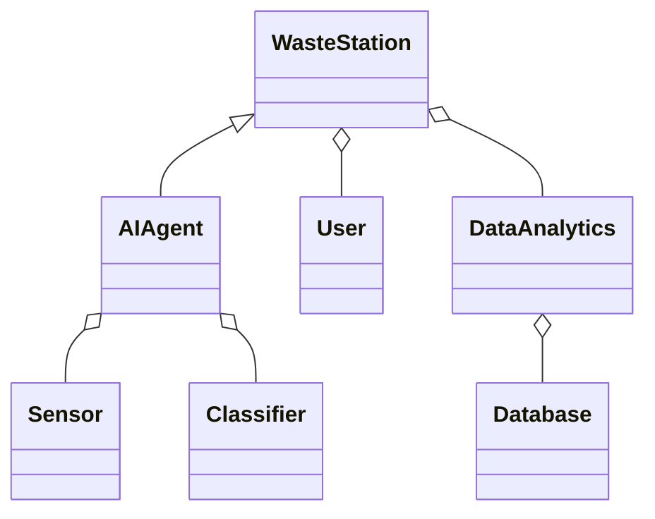
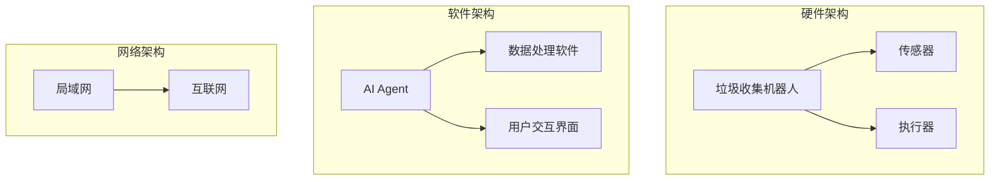
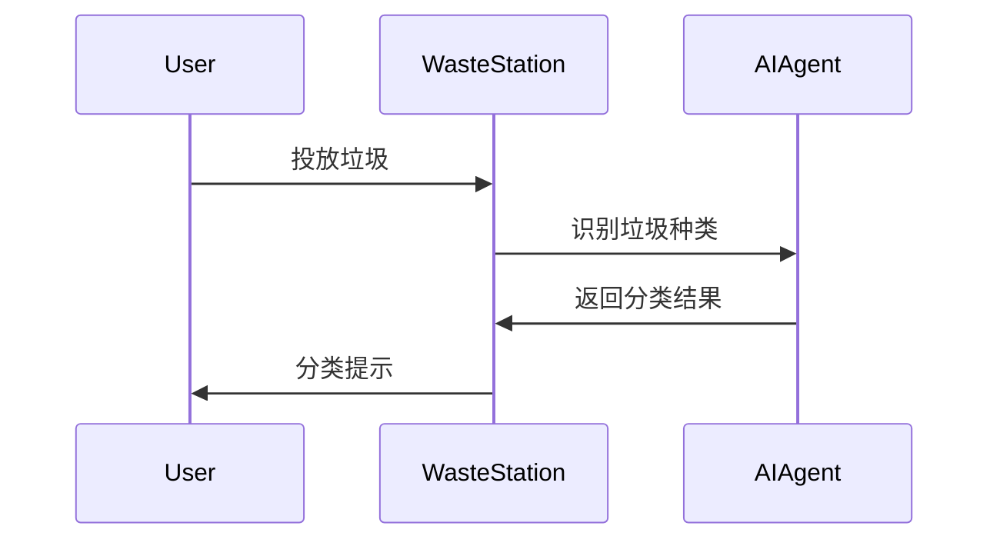
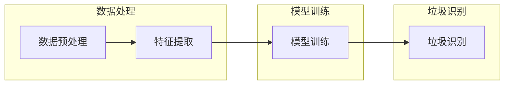

                 


### 引言与背景

#### 智能垃圾处理站概述

在现代城市化进程中，垃圾处理问题日益突出。传统的垃圾处理方式不仅效率低下，而且对环境造成了巨大的负担。为了解决这一问题，智能垃圾处理站的概念应运而生。智能垃圾处理站是一种集成了先进人工智能技术的垃圾回收系统，能够通过智能识别、分类、压缩等环节，实现垃圾的自动化处理。

#### 关键概念

在本章节中，我们将介绍以下几个关键概念：

- **智能垃圾处理站**：一种结合了智能识别、自动化分类、压缩等技术的垃圾处理设施。
- **AI Agent**：人工智能代理，能够在环境中执行任务并自主决策的智能体。
- **社区回收管理**：针对社区垃圾进行分类、回收、处理的管理活动。

#### 边界与外延

- **系统边界**：智能垃圾处理站的范围包括垃圾收集、运输、处理和再利用等环节。
- **应用范围**：智能垃圾处理站适用于城市社区、商业区和工业区的垃圾分类与回收。
- **系统组成部分**：智能垃圾处理站主要包括垃圾收集机器人、智能分类系统、压缩装置和数据分析系统。

#### 概念结构与核心要素组成

- **智能垃圾处理站构成**：硬件设备、软件系统、网络通信等组成部分。
- **AI Agent功能模块**：垃圾识别、分类决策、行为控制等模块。
- **社区回收管理流程**：垃圾投放、识别分类、压缩处理、数据记录和反馈等环节。

#### 本章小结

本章简要介绍了智能垃圾处理站的概念、关键术语和系统组成部分。通过本文的介绍，读者可以对智能垃圾处理站有一个初步的认识，为后续章节的深入探讨打下基础。

### AI Agent基础理论

#### AI Agent原理与架构

##### AI Agent原理

AI Agent，即人工智能代理，是一种在给定环境中能够自主执行任务、进行决策和互动的智能实体。它具有以下几个核心特性：

1. **自主性**：AI Agent能够根据环境和目标自主决策，无需人为干预。
2. **适应性**：AI Agent能够根据环境变化和反馈信息调整自身行为。
3. **交互性**：AI Agent能够与环境中的其他实体进行交互，获取信息和资源。
4. **学习性**：AI Agent能够通过经验和数据不断学习和优化自身性能。

AI Agent的工作流程主要包括以下几个步骤：

1. **感知**：AI Agent通过传感器收集环境信息。
2. **理解**：AI Agent解析和理解感知到的信息。
3. **决策**：基于理解和分析，AI Agent选择最优行动策略。
4. **行动**：AI Agent执行决策，并在环境中产生行为。
5. **反馈**：AI Agent根据环境反馈调整自身行为。

##### AI Agent架构

AI Agent的架构通常由以下几个组件组成：

1. **感知器**：用于接收环境信息的传感器，如摄像头、麦克风、温度传感器等。
2. **处理器**：用于处理感知数据的中央处理器，如计算机、机器人控制器等。
3. **决策器**：根据处理结果做出决策的逻辑单元。
4. **执行器**：将决策转化为实际动作的执行单元，如电机、机械臂等。
5. **通信模块**：用于与其他AI Agent或系统进行通信的模块。

##### AI Agent架构设计

AI Agent的架构设计需要考虑以下因素：

1. **灵活性**：能够适应不同的环境和任务需求。
2. **可扩展性**：能够轻松增加或更换组件，以支持新的功能。
3. **可靠性**：在复杂和多变的环境中保持稳定运行。
4. **安全性**：确保AI Agent的行为符合预期，不会造成意外伤害。

常见的AI Agent类型包括：

1. **任务型AI Agent**：专注于完成特定任务的智能体，如智能客服、自动驾驶汽车等。
2. **角色型AI Agent**：扮演特定角色的智能体，如游戏AI、虚拟助手等。
3. **社会型AI Agent**：在多人环境中与其他智能体协作和竞争的智能体。

##### AI Agent类型与应用场景

根据应用场景的不同，AI Agent可以有多种类型和应用场景：

1. **家居自动化**：智能音箱、智能门锁、智能照明等。
2. **工业自动化**：自动化生产线、智能监控、机器人自动化作业等。
3. **医疗健康**：智能诊断、健康监护、智能药物配送等。
4. **交通管理**：智能交通信号、自动驾驶车辆、智能交通监控等。

#### AI Agent核心概念对比

在AI领域，不同的学习算法和模型有不同的应用场景和特点。以下是几种核心概念的对比表格：

| 概念 | 描述 | 对比 |
| ---- | ---- | ---- |
| **监督学习** | 通过标注数据训练模型 | 与无监督学习对比 |
| **无监督学习** | 不使用标注数据，通过数据内在结构学习 | 与监督学习对比 |
| **强化学习** | 通过奖励机制训练模型 | 与有监督学习对比 |
| **聚类分析** | 无监督学习方法，将数据划分为多个类别 | 与分类对比 |

#### AI Agent的数学模型

以下是一个简单的线性回归模型的数学模型：

$$
X = \sum_{i=1}^{n} w_i * x_i + b
$$

其中，$X$ 表示输出结果，$w_i$ 表示权重，$x_i$ 表示输入特征，$b$ 表示偏置。

#### 本章小结

本章详细介绍了AI Agent的原理、架构以及核心概念对比。通过对这些基础理论的探讨，读者可以更好地理解AI Agent的工作原理和设计原则，为后续章节的深入讨论打下坚实基础。

### 智能垃圾处理站设计与实现

#### 系统分析与架构设计

##### 问题场景介绍

在现代社会，垃圾处理问题已经成为城市环境管理的重要挑战之一。随着城市化进程的加快和居民生活水平的提高，垃圾产量急剧增加，而传统的垃圾处理方式已经难以满足日益增长的需求。特别是在社区层面，垃圾分类与回收管理成为了一个亟待解决的问题。

智能垃圾处理站的目标是利用先进的人工智能技术，实现对社区垃圾的自动化处理，提高回收效率，减少环境污染。具体来说，智能垃圾处理站需要实现以下功能：

1. **垃圾识别与分类**：通过摄像头、传感器等技术，自动识别垃圾的种类，并进行准确分类。
2. **自动化回收**：利用机械臂和压缩技术，自动化回收和处理垃圾分类后的垃圾。
3. **数据记录与分析**：记录垃圾处理过程中的各种数据，并通过大数据分析优化垃圾处理流程。

##### 系统功能设计

智能垃圾处理站的系统功能设计主要包括以下几个模块：

1. **垃圾识别模块**：用于实现垃圾的自动识别与分类。
2. **自动化回收模块**：用于实现垃圾的自动化回收和处理。
3. **数据记录与分析模块**：用于记录垃圾处理过程中的数据，并进行数据分析。
4. **用户交互模块**：用于与社区用户进行信息交流和反馈。

以下是一个简化的领域模型Mermaid类图：



- **WasteStation**：智能垃圾处理站的主体，负责协调各个模块的工作。
- **AIAgent**：人工智能代理，负责垃圾识别与分类。
- **User**：社区用户，负责垃圾投放。
- **DataAnalytics**：数据分析和处理模块，负责收集和分析垃圾处理数据。
- **Sensor**：传感器，用于感知环境信息。
- **Classifier**：分类器，用于对垃圾进行分类。
- **Database**：数据库，用于存储垃圾处理数据。

##### 系统架构设计

智能垃圾处理站的系统架构设计需要考虑以下几个方面：

1. **硬件架构**：包括垃圾收集机器人、传感器、执行器等硬件设备。
2. **软件架构**：包括AI Agent、数据处理和分析软件、用户交互界面等。
3. **网络架构**：包括局域网、互联网等，用于实现数据传输和远程控制。

以下是一个简化的Mermaid架构图：



- **硬件架构**：垃圾收集机器人通过传感器感知环境信息，并利用执行器进行垃圾分类和处理。
- **软件架构**：AI Agent负责垃圾识别和分类，数据处理软件负责收集和分析垃圾处理数据，用户交互界面用于与用户进行信息交流。
- **网络架构**：局域网用于本地数据传输，互联网用于远程监控和远程控制。

##### 系统接口设计

系统接口设计是智能垃圾处理站实现的重要组成部分。以下是一些关键的接口设计：

1. **垃圾投放接口**：用户通过该接口将垃圾放入垃圾处理站。
2. **垃圾识别接口**：AI Agent通过该接口识别垃圾的类型。
3. **垃圾处理接口**：执行器通过该接口进行垃圾分类和处理。
4. **数据记录接口**：数据记录与分析模块通过该接口记录垃圾处理数据。
5. **用户反馈接口**：用户通过该接口获取垃圾处理结果和反馈。

以下是一个简化的Mermaid接口图：



- **用户**：通过垃圾投放接口将垃圾放入垃圾处理站。
- **垃圾处理站**：通过垃圾识别接口请求AI Agent进行垃圾识别，并通过用户反馈接口向用户返回分类结果。

##### 系统交互Mermaid序列图

以下是一个简化的Mermaid序列图，展示了智能垃圾处理站的系统交互过程：


- **用户**：将垃圾放入垃圾处理站。
- **垃圾处理站**：请求AI Agent进行垃圾识别，并返回分类结果。
- **AI Agent**：识别垃圾种类，并将结果返回给垃圾处理站。
- **垃圾处理站**：向用户反馈分类结果。

#### 本章小结

本章详细介绍了智能垃圾处理站的系统分析与架构设计。通过系统功能设计、架构设计、接口设计和系统交互过程的详细描述，读者可以全面了解智能垃圾处理站的系统设计和实现方法。这为后续章节的深入探讨提供了基础。

### AI Agent算法设计与实现

#### 垃圾识别算法原理

垃圾识别算法是智能垃圾处理站的核心组件之一，它负责对投入垃圾处理站的垃圾进行自动识别和分类。垃圾识别算法的基本原理是基于机器学习和计算机视觉技术。以下是对垃圾识别算法原理的详细解释。

##### 垃圾识别算法概述

垃圾识别算法通过以下步骤实现垃圾的自动识别和分类：

1. **数据预处理**：对收集到的垃圾图像进行预处理，包括图像增强、归一化和去噪等操作，以提高图像质量，为后续处理做好准备。
2. **特征提取**：从预处理后的图像中提取特征，如边缘、纹理、颜色等，以用于后续的分类模型训练。
3. **模型训练**：使用提取到的特征和预先标注好的垃圾数据集，通过机器学习算法训练分类模型。
4. **垃圾识别**：将预处理后的新垃圾图像输入训练好的分类模型，模型输出垃圾的类别标签，完成垃圾的自动识别。

##### 垃圾识别算法mermaid流程图

以下是一个简化的Mermaid流程图，展示了垃圾识别算法的基本流程：



- **数据处理**：包括数据预处理和特征提取，这是垃圾识别算法的基础。
- **模型训练**：使用特征和标注数据训练分类模型。
- **垃圾识别**：将新垃圾图像输入训练好的模型，输出类别标签。

#### Python源代码实现

以下是垃圾识别算法的一个简化Python实现示例。这段代码主要演示了如何使用卷积神经网络（CNN）进行垃圾分类。

```python
import tensorflow as tf
from tensorflow.keras.models import Sequential
from tensorflow.keras.layers import Conv2D, MaxPooling2D, Flatten, Dense

# 构建模型
model = Sequential([
    Conv2D(32, (3, 3), activation='relu', input_shape=(64, 64, 3)),
    MaxPooling2D((2, 2)),
    Conv2D(64, (3, 3), activation='relu'),
    MaxPooling2D((2, 2)),
    Flatten(),
    Dense(128, activation='relu'),
    Dense(num_classes, activation='softmax')
])

# 编译模型
model.compile(optimizer='adam',
              loss='categorical_crossentropy',
              metrics=['accuracy'])

# 训练模型
model.fit(x_train, y_train, epochs=10, validation_data=(x_val, y_val))
```

- **模型构建**：定义一个序列模型，包括卷积层、池化层、平坦层和全连接层。
- **模型编译**：设置优化器和损失函数。
- **模型训练**：使用训练数据和验证数据进行模型训练。

#### 算法原理与数学模型

垃圾识别算法的数学模型主要基于深度学习中的卷积神经网络（CNN）。CNN的基本工作原理如下：

1. **卷积层**：通过卷积操作提取图像特征。
   $$ 
   \text{Convolution}:\ f(x) = \sum_{i}\sum_{j} w_{ij} * x_{ij} + b
   $$
   其中，$f(x)$ 是卷积结果，$w_{ij}$ 是卷积核权重，$x_{ij}$ 是输入图像的像素值，$b$ 是偏置。

2. **池化层**：对卷积层的输出进行池化操作，减少参数数量。
   $$
   \text{Pooling}:\ \text{MaxPooling}_{(2, 2)} = \max_{(i, j)} (f(x))
   $$

3. **全连接层**：将池化层的输出通过全连接层进行分类。
   $$
   \text{Fully Connected}:\ y = \sigma(\text{weights} \cdot \text{pooling} + \text{bias})
   $$
   其中，$\sigma$ 是激活函数（如Sigmoid、ReLU），$\text{weights}$ 和 $\text{bias}$ 是全连接层的权重和偏置。

#### 详细讲解与举例

假设我们有一个垃圾图像，其像素值为$X = [x_1, x_2, ..., x_{64}]$。首先，我们将图像输入到卷积层，卷积核的权重为$W = [w_{11}, w_{12}, ..., w_{64}]$，偏置为$b$。卷积操作的结果为：
$$
f(x) = \sum_{i}\sum_{j} w_{ij} * x_{ij} + b
$$

例如，对于卷积核$w_{11}$，其计算过程为：
$$
f(x) = w_{11} * x_{11} + w_{11} * x_{12} + ... + w_{11} * x_{21} + b
$$

经过卷积层和池化层的处理后，我们得到一个特征向量$F$。然后，我们将特征向量输入到全连接层，通过激活函数计算输出结果：
$$
y = \sigma(W \cdot F + b)
$$

例如，假设全连接层的权重为$W = [w_1, w_2, ..., w_n]$，特征向量为$F = [f_1, f_2, ..., f_m]$，则输出结果为：
$$
y = \sigma(w_1 \cdot f_1 + w_2 \cdot f_2 + ... + w_n \cdot f_m + b)
$$

通过比较输出结果与预先定义的类别标签，我们可以判断垃圾的类别。

#### 算法优化与挑战

在垃圾识别算法的实现过程中，可能会面临以下几个优化与挑战：

1. **数据增强**：通过旋转、缩放、翻转等操作增加训练数据集的多样性，以提高模型的泛化能力。
2. **超参数调优**：通过调整学习率、批量大小、正则化参数等超参数，优化模型性能。
3. **多标签分类**：某些垃圾可能属于多个类别，如何设计模型处理多标签分类是一个挑战。
4. **实时性**：在保证准确性的同时，如何提高算法的实时性，以满足实际应用的需求。

#### 本章小结

本章详细介绍了垃圾识别算法的原理、流程和数学模型，并通过Python代码示例展示了算法的实现过程。通过对垃圾识别算法的深入理解，读者可以更好地掌握智能垃圾处理站的核心技术，为后续的优化和应用提供理论基础。

### 社区回收管理策略

#### 社区回收管理策略概述

社区回收管理策略是智能垃圾处理站成功实施的关键环节。它旨在通过系统化、规范化的管理，提高社区垃圾回收效率，减少环境污染。社区回收管理策略通常包括以下几个方面：

1. **垃圾分类教育**：通过宣传和教育活动，提高社区居民的垃圾分类意识和参与度。
2. **垃圾分类指南**：制定详细的垃圾分类指南，指导居民正确分类垃圾。
3. **智能垃圾处理站布局**：合理规划智能垃圾处理站的布局，确保其能够高效服务于整个社区。
4. **数据收集与分析**：通过数据收集和分析，优化回收流程和管理策略。

#### 垃圾分类教育

垃圾分类教育是社区回收管理策略的基础。为了提高居民的垃圾分类意识和参与度，可以采取以下措施：

1. **宣传推广**：利用社区公告栏、微信群、宣传册等多种渠道，广泛宣传垃圾分类的重要性和方法。
2. **主题活动**：组织垃圾分类知识竞赛、环保主题活动等，增强居民的参与感和互动性。
3. **家校合作**：与学校合作，将垃圾分类教育纳入学校课程，让孩子们从小养成良好的垃圾分类习惯。

#### 垃圾分类指南

为了确保居民能够准确分类垃圾，社区需要制定详细的垃圾分类指南。以下是几个关键点：

1. **分类标准**：明确各类垃圾的类别和分类标准，如可回收物、有害垃圾、湿垃圾和干垃圾。
2. **分类示例**：提供具体的垃圾分类示例，帮助居民更好地理解和执行。
3. **定期更新**：根据实际需求和环保政策的变化，定期更新垃圾分类指南。

#### 智能垃圾处理站布局

智能垃圾处理站的布局对回收效率和服务质量有重要影响。以下是几个布局原则：

1. **集中布局**：将智能垃圾处理站集中布置在社区中心或交通方便的地方，方便居民投放垃圾。
2. **分散布局**：在社区的不同区域设置多个小型垃圾处理站，提高服务覆盖面和响应速度。
3. **方便接入**：确保垃圾处理站的接入网络、电源和水源等基础设施齐全，方便维护和管理。

#### 数据收集与分析

数据收集与分析是优化社区回收管理策略的重要手段。通过以下步骤，可以实现对回收过程的全面监控和优化：

1. **数据收集**：安装传感器和监控设备，实时收集垃圾处理过程中的数据，如投放频率、分类准确性等。
2. **数据分析**：利用大数据分析技术，对收集到的数据进行分析，发现问题和优化机会。
3. **反馈与改进**：根据数据分析结果，及时调整回收策略和管理措施，提高回收效率和效果。

#### 本章小结

本章详细介绍了社区回收管理策略的各个方面，包括垃圾分类教育、垃圾分类指南、智能垃圾处理站布局和数据收集与分析。通过这些策略的实施，可以有效提高社区垃圾回收效率，减少环境污染，实现可持续发展的目标。

### 最佳实践 tips

在智能垃圾处理站的实施过程中，以下是一些最佳实践建议，有助于提升系统性能和用户体验：

1. **定期维护**：确保智能垃圾处理站的传感器、执行器和数据处理系统定期检查和维护，以保证设备的正常运行。
2. **用户培训**：为社区居民提供垃圾分类和智能垃圾处理站的操作培训，提高用户的参与度和使用效率。
3. **实时监控**：利用远程监控系统，实时监控智能垃圾处理站的工作状态，及时发现并解决潜在问题。
4. **数据分析**：定期分析垃圾处理数据，优化分类算法和回收流程，提高系统的智能化水平。
5. **社区互动**：建立社区微信群或论坛，鼓励居民参与垃圾分类和智能垃圾处理站的讨论，增强社区的凝聚力和环保意识。

### 小结

本文通过详细的章节内容，系统地介绍了智能垃圾处理站的概念、基础理论、设计与实现以及社区回收管理策略。通过对垃圾识别算法的深入探讨，读者可以更好地理解智能垃圾处理站的运行原理和优化方法。同时，通过最佳实践和注意事项的阐述，为智能垃圾处理站的实际应用提供了实用的指导。

### 注意事项

在实施智能垃圾处理站时，需要注意以下几个关键点：

1. **数据隐私**：确保收集的垃圾处理数据符合隐私保护法规，避免用户信息泄露。
2. **系统安全**：加强智能垃圾处理站的安全防护，防止恶意攻击和数据篡改。
3. **环境保护**：确保垃圾处理过程中的环保措施到位，减少对环境的二次污染。
4. **用户体验**：优化用户界面和交互设计，提高居民的使用便利性和满意度。

### 拓展阅读

对于希望进一步深入了解智能垃圾处理站和社区回收管理的读者，以下是一些推荐的拓展阅读资料：

1. **《智能城市与智慧环保》**：详细介绍了智能城市建设和智慧环保技术的最新发展。
2. **《深度学习与垃圾分类》**：探讨了深度学习技术在垃圾分类中的应用和实践。
3. **《智慧城市实战指南》**：提供了智慧城市建设的全面指导，包括技术选型、项目管理和政策法规。
4. **《可持续发展报告》**：分析全球各地的可持续发展实践，包括垃圾回收、资源再利用等方面的成功案例。

作者：AI天才研究院/AI Genius Institute & 禅与计算机程序设计艺术 /Zen And The Art of Computer Programming

文章标题：智能垃圾处理站：AI Agent的社区回收管理

关键词：智能垃圾处理站、AI Agent、社区回收管理、垃圾分类、算法设计、系统架构

摘要：本文系统地介绍了智能垃圾处理站的概念、基础理论、设计与实现以及社区回收管理策略。通过对垃圾识别算法的深入探讨，读者可以更好地理解智能垃圾处理站的运行原理和优化方法。同时，通过最佳实践和注意事项的阐述，为智能垃圾处理站的实际应用提供了实用的指导。本文旨在为读者提供一个全面、深入的智能垃圾处理站技术指南，推动社区回收管理的智能化发展。

