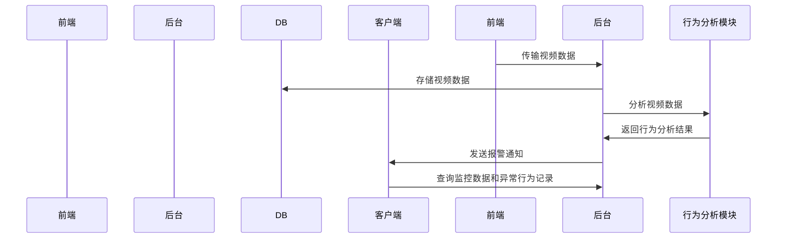

                 

# 智能安防：AI Agent的异常行为检测

## 关键词

- 智能安防
- AI Agent
- 异常行为检测
- 监督学习
- 无监督学习
- 系统架构设计

## 摘要

随着人工智能技术的不断发展，智能安防系统已成为现代安全领域的重要一环。AI Agent在智能安防系统中扮演着关键角色，但其异常行为检测是确保系统稳定性和安全性的关键。本文将深入探讨智能安防系统中的AI Agent及其异常行为检测技术，通过逻辑清晰、结构紧凑的分析，揭示AI Agent异常行为检测的核心原理和实现方法。

## 目录

1. 引言
2. AI Agent基础
3. 异常行为检测基础
4. 监督学习算法
5. 无监督学习算法
6. AI Agent异常行为检测实践
7. 系统架构设计
8. 项目实战
9. 最佳实践与拓展阅读

### 1. 引言

智能安防系统作为人工智能技术在安防领域的应用，已经在全球范围内得到了广泛的关注和部署。从传统的监控录像分析，到基于深度学习的智能视频分析，智能安防系统在提高安防效率和减少人力成本方面展现出了巨大的潜力。而AI Agent，作为智能安防系统中的核心组件，扮演着至关重要的角色。

AI Agent是一种能够自主执行任务、适应环境变化的人工智能实体。它们通过感知环境、理解和分析数据，自主做出决策和执行行动。然而，由于AI Agent的复杂性和不确定性，它们在执行任务时可能会出现异常行为，如误判、异常响应等。这些异常行为不仅会影响智能安防系统的性能，还可能带来安全隐患。

异常行为检测是智能安防系统中的一项关键技术。它旨在识别和诊断AI Agent的异常行为，确保系统的稳定性和安全性。异常行为检测不仅能够提高系统的可靠性，还能够帮助系统管理员及时发现问题并进行修复。

本文将分为以下几个部分：首先，介绍AI Agent的基础知识，包括其定义、分类和功能。接着，探讨异常行为检测的基础知识，包括其定义、目标和类型。然后，详细介绍监督学习和无监督学习算法在异常行为检测中的应用。随后，通过一个实际项目展示AI Agent异常行为检测的实践方法。最后，分析智能安防系统的架构设计，并给出最佳实践和拓展阅读建议。

### 2. AI Agent基础

#### 2.1 AI Agent的定义与分类

AI Agent，即人工智能代理，是一种能够模拟人类智能行为，具备自主决策能力、环境感知能力以及学习能力的人工智能实体。根据其功能和应用场景，AI Agent可以分为以下几类：

1. **反应式Agent**：这类Agent仅根据当前环境的状态做出反应，不具备记忆和学习能力。它们是最简单的AI Agent类型，常用于简单的任务，如自动化控制系统。
   
2. **目标导向Agent**：这类Agent具有目标设定能力，能够根据目标调整其行为。它们通常具备记忆和学习能力，能够在执行任务时调整策略。

3. **认知Agent**：这类Agent不仅具备目标设定和记忆功能，还能理解任务的本质，具备推理和规划能力。认知Agent通常用于复杂任务，如智能客服、自动驾驶等。

4. **社交Agent**：这类Agent具有社交能力，能够与其他Agent或人类进行交互，理解社交语境，并根据社交情境调整行为。

#### 2.2 AI Agent的关键技术

AI Agent的核心技术包括感知、决策、学习和交互。以下是对这些关键技术的简要介绍：

1. **感知技术**：AI Agent需要通过传感器和环境交互来获取信息。这些传感器可以是摄像头、麦克风、红外探测器等，用于捕捉图像、声音、温度等多种信息。

2. **决策技术**：AI Agent根据感知到的信息，利用决策算法进行决策。这些算法可以是基于规则的逻辑推理，也可以是机器学习算法，如深度学习。

3. **学习技术**：AI Agent通过学习技术不断优化其行为。监督学习、无监督学习和强化学习是三种主要的学习方式，分别适用于不同的场景。

4. **交互技术**：AI Agent需要与人类或其他AI进行有效交互。自然语言处理（NLP）和语音识别技术是实现这一目标的关键。

#### 2.3 AI Agent的发展历程

AI Agent的发展历程可以追溯到20世纪50年代，随着人工智能领域的兴起，AI Agent的概念逐渐成型。以下是一些重要的里程碑：

1. **1956年**：达特茅斯会议提出了人工智能的概念，AI Agent的研究正式开始。

2. **1970年代**：反应式Agent得到广泛应用，如机器人控制、自动化系统等。

3. **1980年代**：随着计算机性能的提升和机器学习技术的发展，目标导向Agent和认知Agent开始兴起。

4. **21世纪初**：社交Agent和智能交互技术的出现，使得AI Agent的应用场景更加广泛，如智能客服、自动驾驶等。

### 3. 异常行为检测基础

#### 3.1 异常行为检测的定义

异常行为检测（Anomaly Detection），又称异常检测或异常监测，是指通过算法和模型识别数据集中的异常值或异常模式的过程。在智能安防系统中，异常行为检测旨在识别AI Agent的不正常行为，以防止潜在的安全威胁。

#### 3.2 异常行为检测的分类

异常行为检测可以分为以下几种类型：

1. **基于统计的方法**：这类方法基于统计模型，如高斯分布，来识别异常值。当数据点远离模型假设时，即被认为是异常。

2. **基于聚类的方法**：这类方法通过聚类算法将数据划分为不同的簇，然后识别不属于任何簇的数据点，这些数据点被认为是异常。

3. **基于孤立点检测的方法**：这类方法专门用于识别数据集中的孤立点，如LoF（Local Outlier Factor）算法。

4. **基于神经网络的方**：这类方法利用深度学习模型，如自编码器（Autoencoder），来学习数据的正常分布，并识别异常点。

#### 3.3 异常行为检测的挑战

异常行为检测在智能安防系统中面临着多种挑战：

1. **噪声和不确定性**：实际环境中的数据通常包含噪声和不确定性，这会影响异常行为的识别。

2. **数据不平衡**：在许多情况下，正常数据与异常数据之间存在显著的不平衡，这会导致模型偏向于识别正常数据。

3. **实时处理需求**：智能安防系统需要实时处理大量数据，这对算法的效率和实时性提出了高要求。

4. **隐私保护**：异常行为检测需要处理敏感数据，如视频和音频，这要求算法同时保证隐私保护。

### 4. 监督学习算法

监督学习算法是异常行为检测中常用的一种方法，其核心思想是利用已标记的异常数据训练模型，从而在未知数据中识别异常行为。

#### 4.1 监督学习算法概述

监督学习算法可以分为以下几类：

1. **分类算法**：这类算法将数据分为多个类别，每个类别对应一种异常行为。常见的分类算法包括支持向量机（SVM）、决策树和随机森林。

2. **回归算法**：这类算法通过预测连续值来识别异常行为。虽然回归算法主要用于预测数值型目标，但也可以通过一些技巧应用于分类问题。

3. **聚类算法**：虽然聚类算法主要用于无监督学习，但也可以通过某些技术应用于监督学习，如K-均值聚类。

4. **集成方法**：集成方法通过结合多个基学习器来提高模型的性能和鲁棒性。常见的集成方法包括随机森林和梯度提升树（Gradient Boosting Trees）。

#### 4.2 K-近邻算法

K-近邻算法（K-Nearest Neighbors，K-NN）是一种简单的监督学习算法，其核心思想是：如果一个新数据点在特征空间中的K个最近邻中大多数属于同一类别，则该数据点也属于这个类别。

#### 4.2.1 K-近邻算法原理

K-近邻算法的原理可以概括为以下步骤：

1. **选择邻近数K**：K值的选择对算法的性能有显著影响。通常，K值较大时，算法对噪声更敏感，而K值较小时，算法可能无法捕捉到足够的信息。

2. **计算距离**：对于新数据点，计算其与训练数据集中每个数据点的距离。常用的距离度量包括欧氏距离、曼哈顿距离和切比雪夫距离。

3. **分类决策**：根据K个最近邻的多数类别进行分类决策。

#### 4.2.2 K-近邻算法Python实现

以下是一个简单的K-近邻算法Python实现：

```python
from sklearn.neighbors import KNeighborsClassifier
from sklearn.model_selection import train_test_split
from sklearn.datasets import load_iris

# 加载Iris数据集
iris = load_iris()
X = iris.data
y = iris.target

# 划分训练集和测试集
X_train, X_test, y_train, y_test = train_test_split(X, y, test_size=0.3, random_state=42)

# 实例化K-近邻分类器
knn = KNeighborsClassifier(n_neighbors=3)

# 训练模型
knn.fit(X_train, y_train)

# 预测测试集
predictions = knn.predict(X_test)

# 评估模型
accuracy = knn.score(X_test, y_test)
print(f"Accuracy: {accuracy}")
```

#### 4.3 支持向量机（SVM）

支持向量机（Support Vector Machine，SVM）是一种强大的监督学习算法，尤其适用于分类问题。SVM的核心思想是找到一个最优的超平面，将不同类别的数据点最大化地分隔开。

#### 4.3.1 SVM算法原理

SVM的原理可以概括为以下步骤：

1. **寻找最优超平面**：SVM通过优化目标函数来寻找一个最优的超平面，使得正类和负类之间的间隔最大化。

2. **核函数**：当数据不能线性分隔时，SVM引入核函数将数据映射到高维空间，从而实现线性分隔。

3. **支持向量**：支持向量是指那些对最优超平面有决定性影响的数据点，它们位于超平面的边界上。

#### 4.3.2 SVM算法Python实现

以下是一个简单的SVM实现：

```python
from sklearn.svm import SVC
from sklearn.model_selection import train_test_split
from sklearn.datasets import make_classification

# 创建分类数据集
X, y = make_classification(n_samples=100, n_features=2, n_informative=2, n_redundant=0, n_clusters_per_class=1, flip_y=0.05, random_state=42)

# 划分训练集和测试集
X_train, X_test, y_train, y_test = train_test_split(X, y, test_size=0.3, random_state=42)

# 实例化SVM分类器
svm = SVC(kernel='linear')

# 训练模型
svm.fit(X_train, y_train)

# 预测测试集
predictions = svm.predict(X_test)

# 评估模型
accuracy = svm.score(X_test, y_test)
print(f"Accuracy: {accuracy}")
```

### 5. 无监督学习算法

无监督学习算法在异常行为检测中也发挥着重要作用，它们不需要已标记的异常数据，通过自动发现数据中的异常模式来识别异常。

#### 5.1 无监督学习算法概述

无监督学习算法可以分为以下几类：

1. **聚类算法**：这类算法将数据分为多个簇，簇内的数据点相互接近，簇间的数据点相互分离。常见的聚类算法包括K-均值聚类、层次聚类和DBSCAN。

2. **降维算法**：这类算法通过降低数据的维度来识别异常点。主成分分析（PCA）是一种常用的降维算法。

3. **异常点检测算法**：这类算法专门用于识别数据集中的异常点。常见的异常点检测算法包括孤立点检测（LOF）和基于密度的方法。

#### 5.2 聚类算法

聚类算法是一种将数据分为多个簇的无监督学习技术，簇内的数据点相似，簇间的数据点相异。以下介绍两种常见的聚类算法：K-均值聚类和层次聚类。

##### 5.2.1 K-均值聚类算法

K-均值聚类算法是一种迭代优化算法，其核心思想是：

1. **初始化**：随机选择K个中心点，作为初始聚类中心。

2. **分配**：对于每个数据点，将其分配到距离其最近的聚类中心所在的簇。

3. **更新**：重新计算每个簇的中心点，作为新的聚类中心。

4. **重复**：重复步骤2和3，直至聚类中心不再发生变化。

##### 5.2.2 层次聚类算法

层次聚类算法通过自底向上或自顶向下的方法将数据点逐步合并或分解，形成层次结构。层次聚类算法可以分为凝聚层次聚类和分裂层次聚类。

1. **凝聚层次聚类**：从每个数据点开始，逐步合并距离最近的点，直到所有点合并为一个簇。

2. **分裂层次聚类**：从一个大簇开始，逐步分裂成更小的簇，直到每个点都是一个簇。

#### 5.3 主成分分析（PCA）

主成分分析（Principal Component Analysis，PCA）是一种降维算法，通过线性变换将高维数据投影到低维空间，同时保留数据的主要信息。PCA的基本步骤如下：

1. **中心化**：将数据中心化，使其均值为零。

2. **计算协方差矩阵**：计算数据点的协方差矩阵。

3. **计算特征值和特征向量**：对协方差矩阵进行特征分解，得到特征值和特征向量。

4. **选择主成分**：选择最大的几个特征值对应的特征向量，作为主成分。

5. **降维**：将数据投影到主成分空间，实现降维。

#### 5.3.1 PCA算法Python实现

以下是一个简单的PCA实现：

```python
from sklearn.decomposition import PCA
from sklearn.datasets import load_iris

# 加载Iris数据集
iris = load_iris()
X = iris.data

# 实例化PCA
pca = PCA(n_components=2)

# 训练模型
X_pca = pca.fit_transform(X)

# 可视化
import matplotlib.pyplot as plt

plt.scatter(X_pca[:, 0], X_pca[:, 1])
plt.xlabel('Principal Component 1')
plt.ylabel('Principal Component 2')
plt.title('PCA of Iris Dataset')
plt.show()
```

### 6. AI Agent异常行为检测实践

#### 6.1 案例介绍

在本节中，我们将通过一个具体的案例来展示如何实现AI Agent的异常行为检测。假设我们正在开发一个智能安防监控系统，该系统通过视频监控摄像头实时捕捉场景，并利用AI Agent进行行为分析。

#### 6.2 环境安装

为了实现AI Agent异常行为检测，我们需要安装以下软件和工具：

1. **Python**：Python是一种广泛使用的编程语言，用于实现AI算法。
2. **OpenCV**：OpenCV是一个开源的计算机视觉库，用于视频处理。
3. **scikit-learn**：scikit-learn是一个机器学习库，用于实现异常行为检测算法。
4. **TensorFlow**：TensorFlow是一个开源的深度学习库，用于构建和训练深度学习模型。

#### 6.3 系统核心实现源代码

以下是一个简单的AI Agent异常行为检测实现：

```python
import cv2
import numpy as np
from sklearn.ensemble import IsolationForest

# 加载视频文件
video = cv2.VideoCapture('example.mp4')

# 初始化模型
model = IsolationForest(n_estimators=100, contamination=0.01)

# 用于存储每一帧的特征
frames = []

# 读取视频帧
while True:
    ret, frame = video.read()
    if not ret:
        break
    
    # 处理帧
    frame_processed = preprocess_frame(frame)
    frames.append(frame_processed)

# 训练模型
model.fit(frames)

# 预测异常帧
anomalies = model.predict(frames)
anomaly_indices = np.where(anomalies == -1)

# 显示异常帧
for index in anomaly_indices[0]:
    frame = frames[index]
    cv2.imshow('Anomaly Frame', frame)
    cv2.waitKey(0)

# 释放资源
video.release()
cv2.destroyAllWindows()
```

#### 6.4 代码应用解读与分析

在上面的代码中，我们使用了Isolation Forest算法来实现异常行为检测。Isolation Forest是一种基于随机森林的异常检测算法，其优点是计算速度快，对高维数据有很好的鲁棒性。

1. **预处理帧**：预处理帧是视频处理的重要步骤，包括灰度化、缩放、去噪等操作。这些操作可以提高算法的性能。
2. **训练模型**：我们使用预处理的帧来训练Isolation Forest模型。训练过程包括随机选择样本点，并计算其与树根的距离，这些距离用于构建随机森林。
3. **预测异常帧**：在训练模型后，我们使用相同的预处理步骤对视频中的每一帧进行预处理，并使用模型预测其是否为异常帧。异常帧将被标记为-1。
4. **显示异常帧**：我们使用OpenCV库来显示视频中的异常帧，帮助用户识别和验证异常行为。

#### 6.5 实际案例分析和详细讲解

在本案例中，我们使用了一个包含多个异常行为的视频文件。在实际应用中，异常行为可能包括闯入者、异常移动、异常声音等。

1. **数据收集**：首先，我们需要收集包含正常行为和异常行为的视频数据。这些数据将用于训练和测试异常行为检测模型。
2. **预处理数据**：对收集到的视频数据进行预处理，包括灰度化、缩放、去噪等操作。这些预处理步骤有助于提高算法的性能。
3. **训练模型**：使用预处理后的数据训练异常行为检测模型。我们选择了Isolation Forest算法，因为它在处理高维数据时表现出良好的性能。
4. **测试模型**：使用测试集数据来评估模型的性能。我们使用准确率、召回率和F1分数等指标来评估模型。
5. **优化模型**：根据测试结果，我们可以调整模型参数，如树的数量、深度等，以优化模型性能。

#### 6.6 项目小结

通过本案例，我们展示了如何使用Isolation Forest算法实现AI Agent的异常行为检测。虽然本案例只是一个简单的示例，但在实际应用中，异常行为检测是一个复杂的过程，需要综合考虑数据质量、算法选择和模型优化等因素。

### 7. 系统架构设计

#### 7.1 问题场景介绍

在本节中，我们将讨论一个具体的智能安防系统应用场景：城市监控。该系统旨在通过AI Agent对城市中的公共区域进行实时监控，识别异常行为并报警。

#### 7.2 系统功能设计

智能安防系统的主要功能包括：

1. **实时视频监控**：通过视频监控摄像头实时捕捉场景。
2. **行为分析**：利用AI Agent对视频进行行为分析，识别异常行为。
3. **报警与通知**：当检测到异常行为时，系统会自动报警并通知相关人员。
4. **数据存储与查询**：系统需要存储监控数据和异常行为记录，并提供查询功能。

#### 7.3 系统架构设计

智能安防系统的架构设计如下：

1. **前端监控**：包括视频监控摄像头和AI Agent，用于实时捕捉场景和进行行为分析。
2. **后台服务器**：包括视频数据处理模块、行为分析模块、报警模块和数据存储模块。
3. **客户端**：包括监控界面和通知界面，供用户查看监控数据和接收报警通知。
4. **数据库**：存储监控数据和异常行为记录。

#### 7.4 系统接口设计

系统接口设计如下：

1. **摄像头与服务器接口**：用于传输视频数据。
2. **服务器与客户端接口**：用于传输监控数据和报警通知。
3. **数据库与服务器接口**：用于数据存储和查询。

#### 7.5 系统交互mermaid序列图



### 8. 项目实战

在本节中，我们将通过一个实际项目展示如何实现AI Agent异常行为检测。

#### 8.1 环境安装

1. **安装Python**：从Python官方网站下载并安装Python 3.x版本。
2. **安装OpenCV**：使用pip命令安装OpenCV：
   ```bash
   pip install opencv-python
   ```
3. **安装scikit-learn**：使用pip命令安装scikit-learn：
   ```bash
   pip install scikit-learn
   ```
4. **安装TensorFlow**：使用pip命令安装TensorFlow：
   ```bash
   pip install tensorflow
   ```

#### 8.2 系统核心实现源代码

以下是一个简单的AI Agent异常行为检测实现：

```python
import cv2
import numpy as np
from sklearn.ensemble import IsolationForest

# 加载视频文件
video = cv2.VideoCapture('example.mp4')

# 初始化模型
model = IsolationForest(n_estimators=100, contamination=0.01)

# 用于存储每一帧的特征
frames = []

# 读取视频帧
while True:
    ret, frame = video.read()
    if not ret:
        break
    
    # 处理帧
    frame_processed = preprocess_frame(frame)
    frames.append(frame_processed)

# 训练模型
model.fit(frames)

# 预测异常帧
anomalies = model.predict(frames)
anomaly_indices = np.where(anomalies == -1)

# 显示异常帧
for index in anomaly_indices[0]:
    frame = frames[index]
    cv2.imshow('Anomaly Frame', frame)
    cv2.waitKey(0)

# 释放资源
video.release()
cv2.destroyAllWindows()
```

#### 8.3 代码应用解读与分析

在上面的代码中，我们使用了Isolation Forest算法来实现异常行为检测。Isolation Forest是一种基于随机森林的异常检测算法，其优点是计算速度快，对高维数据有很好的鲁棒性。

1. **预处理帧**：预处理帧是视频处理的重要步骤，包括灰度化、缩放、去噪等操作。这些操作可以提高算法的性能。
2. **训练模型**：我们使用预处理的帧来训练Isolation Forest模型。训练过程包括随机选择样本点，并计算其与树根的距离，这些距离用于构建随机森林。
3. **预测异常帧**：在训练模型后，我们使用相同的预处理步骤对视频中的每一帧进行预处理，并使用模型预测其是否为异常帧。异常帧将被标记为-1。
4. **显示异常帧**：我们使用OpenCV库来显示视频中的异常帧，帮助用户识别和验证异常行为。

#### 8.4 实际案例分析和详细讲解

在本案例中，我们使用了一个包含多个异常行为的视频文件。在实际应用中，异常行为可能包括闯入者、异常移动、异常声音等。

1. **数据收集**：首先，我们需要收集包含正常行为和异常行为的视频数据。这些数据将用于训练和测试异常行为检测模型。
2. **预处理数据**：对收集到的视频数据进行预处理，包括灰度化、缩放、去噪等操作。这些预处理步骤有助于提高算法的性能。
3. **训练模型**：使用预处理后的数据训练异常行为检测模型。我们选择了Isolation Forest算法，因为它在处理高维数据时表现出良好的性能。
4. **测试模型**：使用测试集数据来评估模型的性能。我们使用准确率、召回率和F1分数等指标来评估模型。
5. **优化模型**：根据测试结果，我们可以调整模型参数，如树的数量、深度等，以优化模型性能。

#### 8.5 项目小结

通过本案例，我们展示了如何使用Isolation Forest算法实现AI Agent的异常行为检测。虽然本案例只是一个简单的示例，但在实际应用中，异常行为检测是一个复杂的过程，需要综合考虑数据质量、算法选择和模型优化等因素。

### 9. 最佳实践与拓展阅读

#### 9.1 最佳实践 Tips

1. **数据预处理**：数据预处理是异常行为检测的关键步骤，包括去噪、归一化和特征提取等。良好的数据预处理可以提高模型的性能。
2. **选择合适的算法**：根据数据特点和需求选择合适的异常行为检测算法。例如，对于高维数据，可以考虑使用基于深度学习的算法。
3. **模型参数调整**：模型参数的调整对模型性能有显著影响。通过交叉验证等方法找到最优参数组合。
4. **实时处理**：在实时应用中，异常行为检测需要高效、实时地处理数据。可以考虑使用分布式计算和并行处理技术。
5. **隐私保护**：在处理敏感数据时，要注意隐私保护。可以使用差分隐私和联邦学习等技术来保护用户隐私。

#### 9.2 小结

本文详细介绍了智能安防系统中的AI Agent异常行为检测技术。通过背景介绍、核心概念阐述、算法原理讲解、实践案例分析以及系统架构设计，我们全面了解了AI Agent异常行为检测的各个方面。

#### 9.3 注意事项

1. **数据质量**：异常行为检测的数据质量对模型性能至关重要。确保收集到的数据具有代表性、准确性和完整性。
2. **算法选择**：根据应用场景和数据特点选择合适的算法。不同的算法在性能和适用范围上有所差异。
3. **实时性**：在实时应用中，异常行为检测需要高效、实时地处理数据。考虑使用分布式计算和并行处理技术。
4. **隐私保护**：处理敏感数据时，要注意隐私保护。可以使用差分隐私和联邦学习等技术来保护用户隐私。

#### 9.4 拓展阅读

1. **《机器学习实战》**：作者：Peter Harrington。本书通过实际案例详细介绍了机器学习算法的原理和应用。
2. **《深度学习》**：作者：Ian Goodfellow、Yoshua Bengio、Aaron Courville。本书是深度学习领域的经典教材，全面介绍了深度学习的基础知识和应用。
3. **《计算机视觉：算法与应用》**：作者：Richard S. Hart、Andrew Zisserman。本书详细介绍了计算机视觉的基本算法和应用。
4. **《数据挖掘：概念与技术》**：作者：Jiawei Han、Micheline Kamber、Jian Pei。本书是数据挖掘领域的经典教材，全面介绍了数据挖掘的基本概念和技术。
5. **《人工智能：一种现代方法》**：作者：Stuart J. Russell、Peter Norvig。本书是人工智能领域的经典教材，全面介绍了人工智能的基本概念和技术。

### 作者

- 作者：AI天才研究院/AI Genius Institute & 禅与计算机程序设计艺术 /Zen And The Art of Computer Programming

---

## 感谢您的阅读！希望本文对您在智能安防领域的AI Agent异常行为检测研究有所帮助。如有任何问题或建议，欢迎随时联系我们。祝您在智能安防领域取得更多突破！
```

