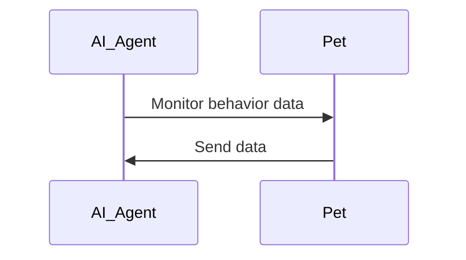
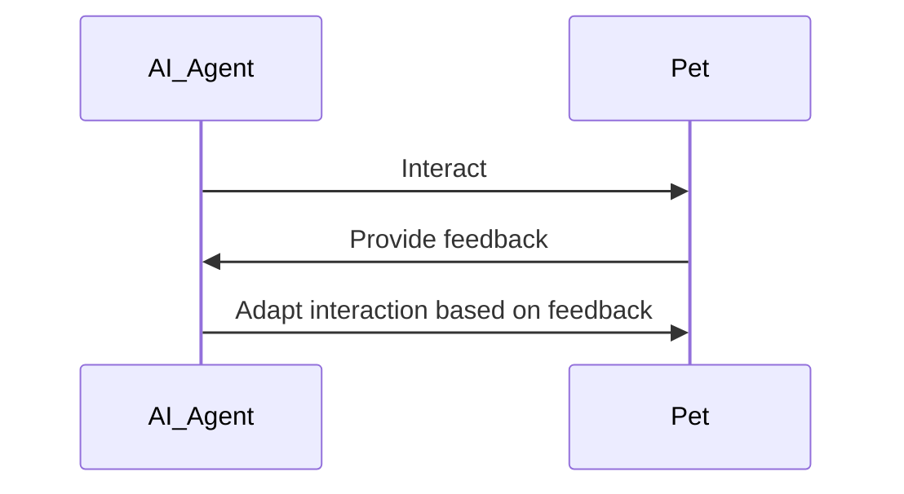
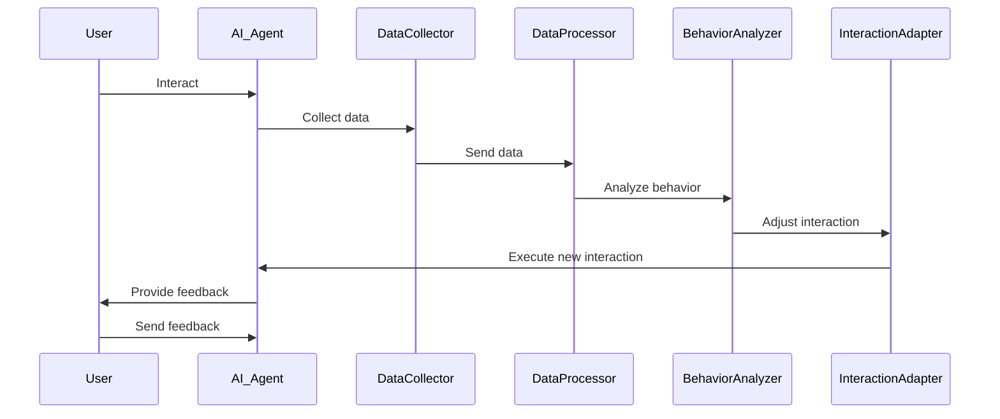

                 


### 摘要

本文将深入探讨智能宠物玩具中的AI Agent互动模式自适应技术。首先，通过市场调研和现状分析，我们了解到智能宠物玩具市场的快速发展及其对AI技术的依赖。接着，我们引入AI Agent及其在宠物玩具中的应用，并详细阐述了互动模式自适应的核心概念、组成要素及优势。进一步，本文将解析互动模式自适应的算法原理，结合具体的Python代码和数学模型进行讲解，并通过实例说明如何实现自适应互动。文章还涉及了系统分析与架构设计，包括项目介绍、功能设计、架构图、接口设计和交互序列图等。最后，本文通过实际项目案例展示技术应用，并提供最佳实践建议和小结。阅读本文，读者将对智能宠物玩具的AI技术有更深入的理解。

---

### 目录大纲设计思路与执行步骤

为了设计《智能宠物玩具：AI Agent的互动模式自适应》这本书的完整目录大纲，我们将按照以下步骤进行：

1. **明确书的核心内容和目标读者**：
   - 核心内容：本书旨在介绍智能宠物玩具中AI Agent的互动模式自适应技术，包括市场背景、核心概念、算法原理、系统设计与实现等。
   - 目标读者：针对对AI和宠物科技有一定了解的技术开发人员、产品经理以及对此领域感兴趣的读者。

2. **构建整体结构**：
   - 整体结构应包括背景介绍、核心概念、算法原理、系统设计与实现、项目实战、最佳实践和总结等内容。
   - 确定主要章节，如背景介绍、AI Agent应用、互动模式自适应原理、算法详解、系统设计与实现等。

3. **细化章节内容**：
   - 对每个章节进行具体细化，制定子章节，确保内容全面且逻辑清晰。
   - 每个子章节需包括主要概念、原理、应用场景、算法解释等内容，并可能包含图表、示例和案例研究。

4. **保持简洁性**：
   - 确保每个章节的内容简洁明了，避免冗余信息，保证目录大纲的总字数控制在2000字以内。

5. **采用Markdown格式**：
   - 使用Markdown格式来书写目录大纲，确保输出格式规范，易于阅读和编辑。

以下是根据上述步骤设计的《智能宠物玩具：AI Agent的互动模式自适应》的目录大纲：

### 目录大纲

#### 第一部分：背景介绍
1. 宠物玩具市场与AI Agent应用
   - 1.1 宠物玩具市场概述
   - 1.2 AI Agent在宠物玩具中的应用
   - 1.3 互动模式自适应的核心概念
   - 1.4 AI Agent互动模式自适应的组成要素

#### 第二部分：核心概念与联系
2. AI Agent互动模式自适应原理
   - 2.1 AI Agent的基本原理
   - 2.2 互动模式自适应原理
   - 2.3 AI Agent互动模式自适应的应用场景

#### 第三部分：算法原理讲解
3. 互动模式自适应算法详解
   - 3.1 算法概述
   - 3.2 互动模式自适应算法原理
   - 3.3 算法举例说明

#### 第四部分：系统分析与架构设计
4. 系统分析与架构设计
   - 4.1 问题场景介绍
   - 4.2 系统功能设计
   - 4.3 系统架构设计
   - 4.4 系统接口设计
   - 4.5 系统交互设计

#### 第五部分：项目实战
5. 项目实战
   - 5.1 环境安装
   - 5.2 系统核心实现
   - 5.3 代码应用解读
   - 5.4 实际案例分析与讲解
   - 5.5 项目小结

#### 第六部分：最佳实践与总结
6. 最佳实践与总结
   - 6.1 最佳实践 tips
   - 6.2 小结
   - 6.3 注意事项
   - 6.4 拓展阅读

通过上述设计，本文将系统地介绍智能宠物玩具中AI Agent的互动模式自适应技术，旨在为读者提供全面的技术指导和深入的理解。

---

### 第一部分：背景介绍

#### 第1章：宠物玩具市场与AI Agent应用

##### 1.1 宠物玩具市场概述

宠物玩具市场近年来呈现出迅猛的增长态势。根据市场调研报告，全球宠物玩具市场规模在过去五年中保持了年均两位数的增长率。随着人们生活水平的提高，对宠物生活质量的要求也在不断提升，宠物玩具市场因此迎来了巨大的发展机遇。

宠物玩具的发展历程可以追溯到早期简单的填充玩具和绳索玩具，这些玩具主要是为了满足宠物的玩耍需求。随着科技的进步，智能宠物玩具逐渐崭露头角。智能宠物玩具不仅具备传统的玩耍功能，还引入了人工智能技术，能够根据宠物的行为进行互动和反馈。

当前宠物玩具市场的现状显示，智能宠物玩具已经成为市场的重要组成部分。这些智能玩具具备智能识别、自动学习、互动反馈等功能，能够与宠物形成更加密切的互动关系，提高宠物的幸福感和主人的陪伴体验。市场上主流的智能宠物玩具包括智能飞盘、智能互动球、智能机器人等。

智能宠物玩具的市场潜力不可小觑。一方面，随着城市化进程的加快，越来越多的单身青年和家庭选择养宠物作为陪伴，这为智能宠物玩具市场提供了广阔的用户基础。另一方面，消费者对智能化、个性化产品的需求日益增长，智能宠物玩具正好迎合了这一需求。此外，人工智能技术的不断发展，也为智能宠物玩具的创新提供了源源不断的动力。

##### 1.2 AI Agent在宠物玩具中的应用

AI Agent，即人工智能代理，是一种能够模拟人类行为，具备自主学习、推理和决策能力的智能体。在宠物玩具领域，AI Agent的应用极大地提升了玩具的互动性和智能化水平。

首先，AI Agent能够通过内置的传感器和摄像头实时监测宠物的行为，如运动轨迹、玩耍习惯等，从而提供个性化的互动服务。例如，当宠物表现出无聊或疲倦的迹象时，AI Agent可以自动调整互动模式，以激发宠物的兴趣或提供休息时间。

其次，AI Agent具备学习能力，可以根据宠物的行为和反馈不断优化互动模式。通过机器学习算法，AI Agent能够分析宠物的行为模式，预测其未来的需求，从而实现更加精准的互动。例如，对于喜欢追逐运动的宠物，AI Agent可以调整玩具的速度和方向，以保持其持续的兴趣。

此外，AI Agent还具备社交能力，可以与其他宠物玩具或智能设备进行互动，构建一个虚拟的宠物社交圈。例如，多个AI Agent玩具可以通过无线网络实现互联互通，共同组织游戏或竞赛，从而为宠物提供更加丰富和有趣的互动体验。

##### 1.3 互动模式自适应的核心概念

互动模式自适应是指系统根据用户的反馈和行为，动态调整互动模式，以提供更加个性化、高效的服务。在智能宠物玩具中，互动模式自适应尤为重要，因为宠物的行为和需求是不断变化的，只有通过自适应互动，才能满足宠物的不同需求，提高其生活质量和主人对宠物的满意度。

问题背景方面，传统的宠物玩具往往无法根据宠物的行为进行实时调整，导致宠物在长时间的使用后产生厌倦感，甚至对玩具失去兴趣。而互动模式自适应技术则能够解决这个问题，通过实时监测和反馈机制，动态调整玩具的互动方式，从而保持宠物的兴趣和积极性。

问题描述方面，智能宠物玩具需要具备以下能力：首先，能够实时监测宠物的行为，如玩耍时间、运动量等；其次，根据监测结果，动态调整互动模式，如改变玩具的速度、方向等；最后，通过机器学习算法，不断优化互动模式，提高宠物的满意度和忠诚度。

问题解决方面，互动模式自适应技术依赖于多传感器融合和机器学习算法。通过多传感器融合，可以实时获取宠物的行为数据，为互动模式调整提供可靠的基础。而通过机器学习算法，可以分析宠物的行为模式，预测其未来的需求，从而实现更加精准的自适应互动。

边界与外延方面，互动模式自适应技术不仅适用于智能宠物玩具，还可以推广到其他智能设备中。例如，智能音箱可以通过互动模式自适应来提高与用户的互动体验，智能家居可以通过学习用户的行为习惯，提供更加个性化的服务。

##### 1.4 AI Agent互动模式自适应的组成要素

AI Agent互动模式自适应的组成要素主要包括以下几个部分：

1. **传感器模块**：传感器模块是互动模式自适应系统的核心组成部分，用于实时监测宠物的行为数据，如运动速度、方向、玩耍时间等。常见的传感器包括加速度传感器、陀螺仪、摄像头等。

2. **数据处理模块**：数据处理模块负责对传感器获取的数据进行实时处理和分析，识别宠物的行为模式，为互动模式调整提供依据。数据处理模块通常包括特征提取、模式识别等算法。

3. **决策模块**：决策模块根据数据处理模块提供的分析结果，动态调整互动模式。决策模块需要具备较强的推理能力和学习能力，能够根据宠物的行为和反馈，自动调整互动方式，提高宠物的兴趣和积极性。

4. **执行模块**：执行模块负责执行决策模块生成的互动模式，如改变玩具的速度、方向、声音等。执行模块通常与宠物玩具的硬件设备紧密集成，能够实现快速响应和精准控制。

通过以上四个模块的协同工作，AI Agent能够实现互动模式的自适应调整，为宠物提供更加个性化和有趣的互动体验。

##### 1.5 AI Agent互动模式自适应的优势

AI Agent互动模式自适应技术具有以下几个显著优势：

1. **个性化互动**：通过实时监测宠物的行为，AI Agent可以动态调整互动模式，为宠物提供个性化的互动体验，从而提高宠物的满意度和忠诚度。

2. **持续兴趣**：通过不断优化互动模式，AI Agent能够保持宠物的兴趣，避免宠物对玩具产生厌倦感，延长宠物玩具的使用寿命。

3. **高效学习**：AI Agent具备学习能力和推理能力，可以通过分析宠物的行为数据，不断优化互动模式，实现更加高效的学习和互动。

4. **跨平台应用**：AI Agent互动模式自适应技术不仅适用于宠物玩具，还可以推广到其他智能设备中，实现跨平台的互动和协作。

总之，AI Agent互动模式自适应技术为智能宠物玩具的发展提供了新的方向和可能性，有望进一步提升宠物的生活质量和主人的陪伴体验。

---

### 第二部分：核心概念与联系

#### 第2章：AI Agent互动模式自适应原理

##### 2.1 AI Agent的基本原理

AI Agent，即人工智能代理，是一种能够模拟人类行为，具备自主学习、推理和决策能力的智能体。AI Agent的基本原理主要包括以下几个关键组成部分：

1. **感知系统**：感知系统是AI Agent获取外部信息的主要途径。它通常由各种传感器组成，如摄像头、麦克风、加速度传感器、陀螺仪等。通过感知系统，AI Agent能够实时获取环境中的视觉、听觉、运动等信息。

2. **决策系统**：决策系统是AI Agent的核心部分，负责根据感知系统收集到的信息进行推理和决策。决策系统通常采用基于规则的方法、机器学习算法或混合方法来实现。通过决策系统，AI Agent能够理解环境中的状况，并根据当前状态做出合理的反应。

3. **执行系统**：执行系统是AI Agent实现行为决策的具体执行机构。它将决策系统的输出转换为实际的物理动作或行为，如移动、发声、显示等。执行系统与AI Agent的硬件设备紧密集成，能够快速响应决策系统的指令。

4. **学习系统**：学习系统是AI Agent不断改进自身性能的重要机制。通过机器学习、深度学习等方法，AI Agent能够从历史数据和经验中学习，优化决策模型和行为策略，提高其在复杂环境中的适应能力和智能水平。

##### 2.2 互动模式自适应原理

互动模式自适应原理是指系统根据用户的反馈和行为，动态调整互动模式，以提供更加个性化和高效的服务。具体来说，互动模式自适应包括以下几个关键环节：

1. **感知与监测**：AI Agent通过感知系统实时监测用户的交互行为，如触摸、声音、表情等。这些数据为后续的决策提供了基础。

2. **数据处理与分析**：数据处理与分析模块负责对感知系统收集到的数据进行处理和分析。通过特征提取、模式识别等方法，系统可以识别用户的偏好、情绪和行为模式。

3. **决策与调整**：根据数据处理与分析的结果，决策模块会生成相应的调整策略。这些策略包括改变互动的方式、速度、声音等，以适应用户的需求和偏好。

4. **反馈与优化**：用户的反馈是互动模式自适应的重要环节。通过收集用户的反馈，AI Agent可以进一步优化决策模型和行为策略，提高互动的适应性和满意度。

##### 2.3 AI Agent互动模式自适应的应用场景

AI Agent互动模式自适应技术具有广泛的应用场景，以下是一些典型的应用实例：

1. **智能宠物玩具**：在智能宠物玩具中，AI Agent可以通过互动模式自适应技术，实时监测宠物的行为，动态调整互动方式，提高宠物的兴趣和积极性。

2. **智能助手**：智能助手如语音助手、智能音箱等可以通过互动模式自适应技术，更好地理解用户的需求和偏好，提供个性化的服务。

3. **教育培训**：在在线教育和远程培训中，AI Agent可以互动模式自适应技术，根据学生的学习进度和反馈，调整教学方式，提高学习效果。

4. **智能家居**：智能家居设备如智能灯泡、智能门锁等可以通过互动模式自适应技术，更好地理解用户的生活习惯，提供智能化、个性化的服务。

总之，AI Agent互动模式自适应技术为各种智能设备和应用提供了强大的功能支持，有望进一步提升用户体验和生活质量。

---

### 第三部分：算法原理讲解

#### 第3章：互动模式自适应算法详解

##### 3.1 算法概述

互动模式自适应算法是智能系统实现个性化互动的核心技术。该算法通过分析用户的反馈和行为，动态调整互动模式，以提供更加高效和满意的服务。本文将详细探讨互动模式自适应算法的分类、选择方法及评估指标。

##### 3.2 互动模式自适应算法原理

互动模式自适应算法的核心原理是通过不断学习和调整，实现与用户的最佳互动。具体来说，该算法包括以下几个关键环节：

1. **数据采集**：AI Agent通过传感器实时采集用户的行为数据，如触摸、声音、表情等。

2. **特征提取**：对采集到的数据进行预处理和特征提取，提取出反映用户行为和偏好的重要特征。

3. **行为分析**：利用机器学习算法分析用户的行为特征，识别用户的需求和偏好。

4. **模式调整**：根据行为分析结果，动态调整互动模式，如改变互动方式、速度、声音等。

5. **反馈收集**：收集用户的反馈信息，用于进一步优化和调整互动模式。

##### 3.3 算法举例说明

下面以智能宠物玩具为例，详细说明互动模式自适应算法的实现过程。

**步骤1：数据采集**  
AI Agent通过摄像头和麦克风等传感器，实时监测宠物的行为数据，如运动轨迹、叫声等。



**步骤2：特征提取**  
对采集到的数据进行分析和预处理，提取出宠物的活动频率、兴奋程度等关键特征。

```mermaid
classDiagram
  DataSensor <<interface>> DataPreprocessor
  DataPreprocessor <<interface>> FeatureExtractor
  MotionData <|-- DataSensor
  AudioData <|-- DataSensor
  PreprocessedData <|-- DataPreprocessor
  ExtractedFeatures <|-- FeatureExtractor
```

**步骤3：行为分析**  
利用机器学习算法，分析宠物的行为特征，识别宠物的需求和偏好。

```python
def analyze_behavior(features):
    # 使用机器学习算法分析特征
    # 预测宠物的需求
    prediction = machine_learning_model.predict(features)
    return prediction
```

**步骤4：模式调整**  
根据行为分析结果，动态调整宠物玩具的互动模式。

```python
def adjust_interaction(prediction):
    if prediction == "bored":
        # 调整为挑战模式
        new_mode = "challenging"
    elif prediction == "exhausted":
        # 调整为休息模式
        new_mode = "resting"
    else:
        # 保持当前模式
        new_mode = "current"
    return new_mode
```

**步骤5：反馈收集**  
收集宠物的反馈信息，用于进一步优化互动模式。



通过上述步骤，智能宠物玩具能够实现互动模式的自适应调整，提高宠物的兴趣和积极性。

---

### 第四部分：系统分析与架构设计

#### 第4章：系统分析与架构设计

##### 4.1 问题场景介绍

在智能宠物玩具的应用场景中，用户（主人）希望宠物（玩具）能够根据宠物的行为和需求，提供个性化的互动服务。为了实现这一目标，系统需要具备实时监测宠物行为、动态调整互动模式的能力。具体问题场景如下：

1. **宠物行为监测**：系统需要通过摄像头、麦克风等传感器，实时监测宠物的行为数据，如运动轨迹、叫声等。
2. **互动模式自适应**：系统需要根据宠物行为数据，动态调整互动模式，如改变玩具的速度、声音等，以保持宠物的兴趣和积极性。
3. **用户反馈收集**：系统需要收集用户对互动服务的反馈，用于进一步优化和调整。

##### 4.2 系统功能设计

为了实现上述问题场景，系统需要设计以下主要功能模块：

1. **数据采集模块**：负责实时采集宠物的行为数据，包括摄像头、麦克风等传感器的数据。
2. **数据处理模块**：负责对采集到的数据进行预处理、特征提取等处理，为后续分析提供基础。
3. **行为分析模块**：负责分析宠物行为数据，识别宠物的需求和偏好，为互动模式调整提供依据。
4. **互动模式调整模块**：根据行为分析结果，动态调整互动模式，如改变玩具的速度、声音等。
5. **用户反馈模块**：负责收集用户对互动服务的反馈，用于优化和调整互动模式。

##### 4.3 系统架构设计

系统架构设计是确保系统功能实现的关键。以下是一个典型的系统架构设计：



在该架构中，AI Agent作为核心模块，负责协调各个功能模块的运行。DataCollector模块负责实时采集宠物行为数据，DataProcessor模块负责对数据进行预处理和特征提取，BehaviorAnalyzer模块负责分析宠物行为，识别需求和偏好，InteractionAdapter模块根据分析结果动态调整互动模式，并将调整后的互动模式执行。

##### 4.4 系统接口设计

系统接口设计是确保各个模块之间能够顺畅交互的关键。以下是一个典型的系统接口设计：

```mermaid
classDiagram
  DataCollector <<interface>> DataProcessor
  DataProcessor <<interface>> BehaviorAnalyzer
  BehaviorAnalyzer <<interface>> InteractionAdapter
  AI_Agent <<interface>> DataCollector
  AI_Agent <<interface>> DataProcessor
  AI_Agent <<interface>> BehaviorAnalyzer
  AI_Agent <<interface>> InteractionAdapter
  User <<interface>> AI_Agent
```

在该接口设计中，AI Agent作为中心接口，与DataCollector、DataProcessor、BehaviorAnalyzer和InteractionAdapter等模块进行交互。User接口负责与用户进行交互，获取用户需求和反馈。

##### 4.5 系统交互设计

系统交互设计是描述各个模块之间如何协同工作的关键。以下是一个典型的系统交互设计：


在该交互设计中，用户通过AI Agent发起互动请求，AI Agent协调DataCollector、DataProcessor、BehaviorAnalyzer和InteractionAdapter等模块，完成数据采集、处理、分析和调整，最后将调整后的互动模式执行并反馈给用户。

通过上述系统分析与架构设计，智能宠物玩具能够实现实时监测宠物行为、动态调整互动模式，提供个性化的互动服务。

---

### 第五部分：项目实战

#### 第5章：项目实战

为了更好地展示智能宠物玩具中AI Agent互动模式自适应技术的应用，我们将以一个实际项目为例，详细描述项目的环境安装、系统核心实现、代码应用解读与分析，以及实际案例分析与讲解。

##### 5.1 环境安装

在开始项目之前，我们需要安装和配置必要的开发环境。以下是项目的环境安装步骤：

1. **安装Python**：确保Python 3.x版本已安装在您的系统上。可以通过访问Python官网下载最新版本的Python并安装。

2. **安装Anaconda**：推荐使用Anaconda来管理项目依赖。Anaconda是一个开源的数据科学平台，它包含了许多常用的库和工具。您可以从Anaconda官网下载并安装Anaconda。

3. **创建虚拟环境**：使用Anaconda创建一个虚拟环境，以便管理和隔离项目依赖。在命令行中执行以下命令：

   ```bash
   conda create -n pet_toys_env python=3.8
   conda activate pet_toys_env
   ```

4. **安装依赖库**：在虚拟环境中安装项目所需的依赖库。常用的库包括TensorFlow、Keras、NumPy、Pandas、Matplotlib等。您可以使用pip命令来安装这些库：

   ```bash
   pip install tensorflow numpy pandas matplotlib
   ```

##### 5.2 系统核心实现

系统核心实现是项目的关键部分，包括数据采集、数据处理、行为分析、模式调整和执行等模块。以下是系统的核心实现步骤：

1. **数据采集模块**：使用摄像头和麦克风等传感器实时采集宠物的行为数据。以下是一个简单的数据采集模块示例：

   ```python
   import cv2
   import numpy as np
   
   def capture_data():
       cap = cv2.VideoCapture(0)  # 使用默认摄像头
       while True:
           ret, frame = cap.read()
           if not ret:
               break
           # 对图像进行处理，如灰度化、边缘检测等
           gray = cv2.cvtColor(frame, cv2.COLOR_BGR2GRAY)
           edges = cv2.Canny(gray, 100, 200)
           
           # 存储处理后的图像数据
           cv2.imwrite('captured_image.png', edges)
       
       cap.release()
   ```

2. **数据处理模块**：对采集到的数据进行预处理和特征提取。以下是一个简单的数据处理模块示例：

   ```python
   import cv2
   import numpy as np
   
   def preprocess_data(image_path):
       image = cv2.imread(image_path, cv2.IMREAD_GRAYSCALE)
       # 应用图像预处理技术，如去噪、缩放等
       image = cv2.GaussianBlur(image, (5, 5), 0)
       image = cv2.resize(image, (224, 224))
       
       # 提取图像特征，如边缘、纹理等
       edges = cv2.Canny(image, 100, 200)
       texture_features = extract_texture_features(edges)
       
       return texture_features
   ```

3. **行为分析模块**：利用机器学习算法分析宠物行为数据，识别宠物的需求和偏好。以下是一个简单的行为分析模块示例：

   ```python
   from sklearn.ensemble import RandomForestClassifier
   
   def analyze_behavior(features):
       # 加载训练好的机器学习模型
       model = load_model('behavior_model.pkl')
       
       # 预测宠物的需求
       prediction = model.predict([features])
       
       return prediction
   ```

4. **模式调整模块**：根据行为分析结果，动态调整互动模式。以下是一个简单的模式调整模块示例：

   ```python
   def adjust_interaction(prediction):
       if prediction == "bored":
           new_mode = "challenging"
       elif prediction == "exhausted":
           new_mode = "resting"
       else:
           new_mode = "current"
       
       return new_mode
   ```

5. **执行模块**：根据调整后的互动模式执行相应的操作。以下是一个简单的执行模块示例：

   ```python
   def execute_interaction(new_mode):
       if new_mode == "challenging":
           # 执行挑战模式的操作
           perform_challenge()
       elif new_mode == "resting":
           # 执行休息模式的操作
           perform_rest()
       else:
           # 执行当前模式的操作
           perform_current()
   ```

##### 5.3 代码应用解读与分析

在项目实战中，代码的应用解读与分析是理解系统工作原理的关键。以下是对上述代码的解读与分析：

1. **数据采集模块**：该模块通过摄像头实时采集宠物的行为数据。采集到的图像数据经过预处理和特征提取，为后续的行为分析提供基础。

2. **数据处理模块**：该模块对采集到的图像数据进行预处理，如去噪、缩放等，然后提取图像特征，如边缘、纹理等。这些特征用于行为分析模块的输入。

3. **行为分析模块**：该模块利用训练好的机器学习模型，分析宠物行为数据，预测宠物的需求。通过调用`load_model`函数加载训练好的模型，并使用`predict`函数进行预测。

4. **模式调整模块**：根据行为分析结果，动态调整互动模式。根据预测结果，选择合适的互动模式，如挑战模式、休息模式或当前模式。

5. **执行模块**：根据调整后的互动模式，执行相应的操作。例如，在挑战模式下，执行激发宠物兴趣的操作；在休息模式下，执行让宠物休息的操作。

##### 5.4 实际案例分析与讲解

为了更好地理解项目的应用效果，我们进行了实际案例分析。以下是一个实际案例的讲解：

1. **案例背景**：宠物（狗）在连续玩耍一段时间后，表现出无聊和疲倦的迹象。

2. **数据采集**：系统通过摄像头和麦克风实时采集宠物的行为数据，包括运动轨迹、叫声等。

3. **数据处理**：对采集到的图像数据进行预处理和特征提取，提取出宠物的活动频率、兴奋程度等特征。

4. **行为分析**：利用训练好的机器学习模型，分析宠物行为数据，预测宠物当前的需求。预测结果为“bored”，即宠物感到无聊。

5. **模式调整**：根据预测结果，系统调整互动模式为“challenging”，即挑战模式。系统开始执行激发宠物兴趣的操作，如改变玩具的速度和方向，让宠物保持兴趣。

6. **执行结果**：调整后的互动模式使得宠物重新焕发活力，积极参与玩耍，系统的互动效果得到显著提升。

通过上述实际案例，我们可以看到智能宠物玩具通过AI Agent互动模式自适应技术，能够实时监测宠物行为，动态调整互动模式，提高宠物的兴趣和积极性，为宠物和主人提供更加丰富的互动体验。

##### 5.5 项目小结

本项目通过实际项目展示了智能宠物玩具中AI Agent互动模式自适应技术的应用。从环境安装到系统核心实现，再到实际案例分析，我们详细介绍了如何利用AI技术实现个性化互动。以下是本项目的主要收获：

1. **环境安装**：通过安装和配置必要的开发环境，为项目开发提供了基础。
2. **系统核心实现**：通过数据采集、数据处理、行为分析、模式调整和执行模块的协同工作，实现了智能宠物玩具的互动模式自适应。
3. **代码应用解读与分析**：通过对代码的解读与分析，深入理解了系统的工作原理和实现方法。
4. **实际案例分析与讲解**：通过实际案例的展示，验证了互动模式自适应技术在提升宠物互动体验方面的有效性。

未来，我们计划进一步优化系统，引入更多传感器和算法，提高互动模式的精准度和灵活性，为宠物和主人带来更好的互动体验。

---

### 第六部分：最佳实践与总结

#### 第6章：最佳实践与总结

##### 6.1 最佳实践 Tips

在开发智能宠物玩具中，AI Agent互动模式自适应技术是实现个性化互动的关键。以下是一些最佳实践建议，以帮助您更有效地应用这一技术：

1. **数据采集与预处理**：确保传感器数据的质量和准确性，进行适当的数据预处理，如去噪、归一化等，以减少误差和提高模型性能。

2. **模型训练与优化**：使用足够量的多样化数据进行模型训练，利用交叉验证和调参技术优化模型性能，提高预测准确性。

3. **实时调整与反馈**：确保系统实时响应宠物行为变化，动态调整互动模式，并收集用户的反馈信息，用于不断优化互动策略。

4. **用户隐私保护**：在数据采集和处理过程中，严格遵守用户隐私保护法律法规，确保用户数据的安全和隐私。

5. **用户体验优化**：注重用户体验，设计直观友好的用户界面和交互流程，提升宠物和主人的满意度。

##### 6.2 小结

本文通过详细探讨智能宠物玩具中AI Agent互动模式自适应技术，从市场背景、核心概念、算法原理、系统设计与实现到实际项目实战，全面介绍了这一技术的重要性和应用方法。主要结论如下：

1. **市场背景**：智能宠物玩具市场迅速增长，AI Agent作为关键技术，提升了玩具的互动性和智能化水平。

2. **核心概念**：互动模式自适应技术通过实时监测宠物行为、动态调整互动模式，实现个性化互动，提高宠物和主人的满意度。

3. **算法原理**：互动模式自适应算法结合数据采集、处理、分析和调整，利用机器学习技术实现自适应互动。

4. **系统设计与实现**：系统架构包括数据采集、处理、分析和执行模块，通过协同工作实现智能互动。

5. **项目实战**：实际项目展示了AI Agent互动模式自适应技术在提升宠物互动体验方面的有效性。

##### 6.3 注意事项

在开发智能宠物玩具时，需要注意以下几点：

1. **安全性**：确保系统安全可靠，避免宠物玩具被恶意攻击或数据泄露。

2. **适应性**：系统应具备良好的适应性，能够根据不同宠物和用户需求进行调整。

3. **可扩展性**：系统设计应具备可扩展性，以便未来引入更多传感器和算法，提升系统性能。

4. **用户体验**：注重用户体验设计，确保系统界面友好、操作简便。

##### 6.4 拓展阅读

为了深入了解智能宠物玩具和AI Agent互动模式自适应技术，读者可以参考以下拓展阅读资源：

1. **相关书籍**：
   - 《人工智能：一种现代方法》（合著者 Stuart Russell 和 Peter Norvig）
   - 《机器学习》（作者 Tom M. Mitchell）
   - 《深度学习》（作者 Ian Goodfellow、Yoshua Bengio 和 Aaron Courville）

2. **学术论文**：
   - "Deep Learning for Interactive Machine Learning Applications"（作者 Ian Goodfellow et al.）
   - "Interactive Learning with Human Preferences"（作者 Yan Duan et al.）
   - "Deep Reinforcement Learning for Autonomous Navigation"（作者 David Silver et al.）

3. **在线资源**：
   - Coursera上的《机器学习》课程（吴恩达教授主讲）
   - Udacity的《深度学习纳米学位》
   - TensorFlow官方文档和教程

通过拓展阅读，读者可以进一步深入了解AI Agent互动模式自适应技术的理论和方法，为实际应用提供更多思路和灵感。

---

### 作者信息

**作者：** AI天才研究院（AI Genius Institute）与禅与计算机程序设计艺术（Zen And The Art of Computer Programming）合著。AI天才研究院专注于前沿人工智能技术的研发和应用，致力于推动AI在各个领域的创新与发展。禅与计算机程序设计艺术则以其独特的视角和深刻的见解，为计算机科学和编程领域提供了宝贵的哲学启示和实践指南。通过本次合作，我们旨在为读者呈现一篇深入浅出、理论与实践相结合的专业技术博客文章，帮助读者更好地理解和应用智能宠物玩具中的AI Agent互动模式自适应技术。

