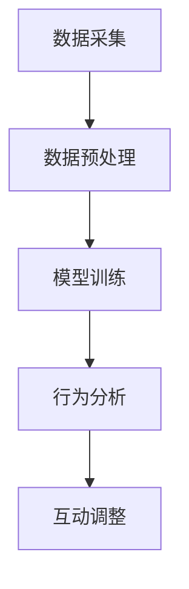
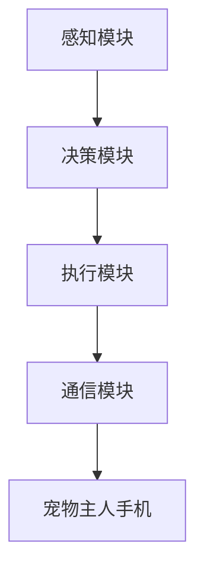
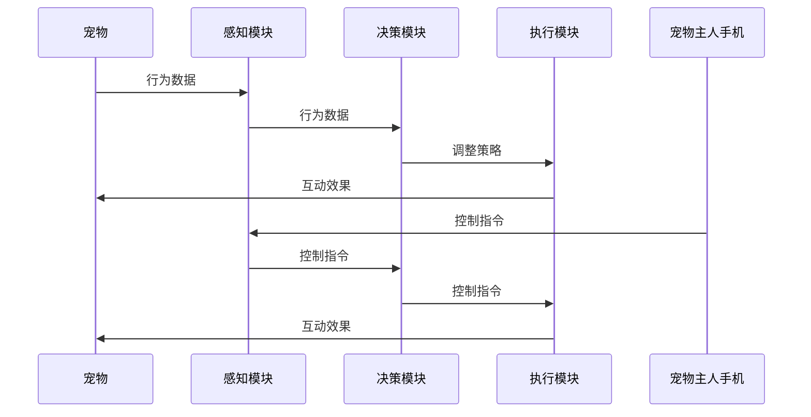

                 

# 智能宠物玩具：AI Agent的互动模式调整

## 关键词
- 智能宠物玩具
- AI Agent
- 互动模式调整
- 机器学习
- 深度学习
- 自然语言处理

## 摘要
本文将探讨智能宠物玩具中的AI Agent及其互动模式调整技术。通过深入分析AI Agent的定义、组成、核心功能以及互动模式调整原理，本文提出了一种基于机器学习和深度学习算法的智能互动模式调整方法。同时，本文详细介绍了智能宠物玩具的系统架构设计，并通过项目实战展示了该方法的实际应用效果。最终，本文总结了智能宠物玩具领域的最佳实践，为未来智能宠物玩具的发展提供了有益的借鉴。

## 第1章 智能宠物玩具概述

### 1.1.1 问题背景

随着人工智能（AI）技术的迅速发展，AI逐渐渗透到我们日常生活的各个方面，包括家庭、医疗、交通等。在家庭领域，宠物作为人类忠实的朋友，也逐渐成为智能设备的应用对象。智能宠物玩具作为宠物娱乐和训练工具，因其能够为宠物提供丰富的互动体验而受到广泛关注。然而，当前市场上的智能宠物玩具大多功能单一，缺乏智能互动性，难以满足宠物主人的期望。

### 1.1.2 问题描述

智能宠物玩具不仅需要为宠物提供娱乐，还需要通过AI技术进行行为分析和训练，帮助主人更好地了解宠物的习惯和行为。当前市场中的智能宠物玩具存在以下几个问题：

1. 功能单一：大部分智能宠物玩具只能执行一种或几种简单的互动方式，无法满足宠物的多样化需求。
2. 交互性不强：智能宠物玩具与宠物之间的互动性较差，无法根据宠物的行为进行实时调整，导致互动效果不佳。
3. 适应能力差：智能宠物玩具在遇到宠物的新行为或特殊情况时，难以进行有效调整，无法满足宠物的个性化需求。

### 1.1.3 问题解决

为了解决上述问题，本文提出了一种基于AI Agent的互动模式调整方法。该方法利用机器学习和深度学习算法，对宠物的行为进行分析和识别，根据宠物的行为数据动态调整玩具的互动模式，从而提高宠物的满意度和主人的使用体验。具体解决方法包括：

1. **核心概念原理**：介绍AI基础知识，包括机器学习、深度学习、自然语言处理等，以及它们在智能宠物玩具中的应用。
2. **概念属性特征对比表格**：对比传统宠物玩具与智能宠物玩具在功能、互动性和适应性等方面的差异。
3. **ER实体关系图架构**：通过Mermaid绘制实体关系图，展示宠物、宠物玩具和主人之间的交互关系。

### 1.1.4 边界与外延

**边界**：本文讨论的智能宠物玩具主要关注宠物与玩具之间的互动性，不包括宠物的人工智能健康监测设备。

**外延**：未来智能宠物玩具的发展方向可能包括与宠物主人手机的联动、虚拟现实（VR）技术的融合等。

### 1.1.5 概念结构与核心要素组成

智能宠物玩具的核心要素包括：

1. **智能宠物玩具**：具有AI功能，能够与宠物进行互动的玩具。
2. **宠物行为分析**：通过传感器和摄像头等设备收集宠物行为数据，进行行为分析和识别。
3. **互动模式调整**：根据宠物行为数据动态调整玩具的互动方式，以适应宠物的需求和习惯。

## 第2章 智能宠物玩具的AI Agent

### 2.2.1 AI Agent的定义与特点

AI Agent是具有自主决策能力和执行能力的智能体，能够在特定环境中完成任务。在智能宠物玩具中，AI Agent负责与宠物进行互动，并根据宠物的行为调整互动策略。

AI Agent的主要特点包括：

1. **自主决策**：AI Agent能够根据宠物行为数据自主决策，选择与宠物的互动方式。
2. **实时互动**：AI Agent能够实时与宠物进行互动，根据宠物的行为实时调整互动策略。
3. **个性定制**：AI Agent能够根据宠物的行为习惯和偏好，为宠物提供个性化的互动体验。

### 2.2.2 AI Agent的组成

AI Agent通常由以下几个模块组成：

1. **感知模块**：负责接收宠物的行为数据，如动作、声音、位置等。
2. **决策模块**：根据感知模块提供的信息，决定与宠物的互动方式。
3. **执行模块**：负责执行决策模块的决策，如控制玩具的动作、声音等。

### 2.2.3 AI Agent的核心功能

AI Agent的核心功能包括：

1. **实时互动**：根据宠物的行为实时调整互动方式，提高互动效果。
2. **行为分析**：通过历史行为数据分析宠物的习惯和偏好，为互动模式调整提供依据。
3. **个性定制**：根据宠物的个性特点，定制个性化的互动策略，提高宠物的满意度和使用体验。

## 第3章 互动模式的调整原理

### 3.3.1 互动模式调整的核心概念

互动模式调整是基于机器学习和深度学习算法，通过对宠物的行为数据进行学习和分析，调整玩具的互动方式。核心概念包括：

1. **机器学习**：通过训练模型，使模型能够根据宠物的行为数据预测宠物的喜好和习惯。
2. **深度学习**：利用多层神经网络，对宠物的行为数据进行特征提取和模式识别。
3. **自然语言处理**：对宠物的行为数据进行语义分析，理解宠物的意图和需求。

### 3.3.2 算法原理讲解

互动模式调整的算法原理主要包括以下步骤：

1. **数据采集**：通过传感器和摄像头等设备，收集宠物的行为数据。
2. **数据预处理**：对采集到的行为数据进行清洗、归一化和特征提取。
3. **模型训练**：使用机器学习和深度学习算法，训练模型，使其能够识别宠物的行为模式。
4. **行为分析**：使用训练好的模型，对新的宠物行为数据进行预测和分析。
5. **互动调整**：根据行为分析结果，动态调整玩具的互动模式，提高互动效果。

使用Mermaid绘制算法流程图如下：



### 3.3.3 数学模型和数学公式

互动模式调整的数学模型主要包括以下两个方面：

1. **损失函数**：用于评估模型预测值与实际值之间的差距，通常使用均方误差（MSE）作为损失函数。

   $$L(y, \hat{y}) = \frac{1}{2} \sum_{i=1}^{n} (y_i - \hat{y_i})^2$$

   其中，$y$ 为实际值，$\hat{y}$ 为预测值。

2. **梯度下降**：用于优化模型参数，使损失函数达到最小。常用的梯度下降算法包括随机梯度下降（SGD）和批量梯度下降（BGD）。

   $$\theta_{j} = \theta_{j} - \alpha \frac{\partial L(\theta)}{\partial \theta_{j}}$$

   其中，$\theta_j$ 为模型参数，$\alpha$ 为学习率。

### 3.3.4 举例说明

以宠物追逐行为为例，说明如何通过机器学习算法调整玩具的互动模式。

1. **数据采集**：通过摄像头和加速度传感器，收集宠物在不同速度下的追逐行为数据，包括宠物的运动轨迹、速度和加速度等。
2. **数据预处理**：对采集到的数据进行分析，提取宠物的运动特征，如平均速度、加速度变化率等。
3. **模型训练**：使用提取的特征数据，训练一个回归模型，使其能够预测宠物在不同速度下的追逐行为。
4. **行为分析**：对新的宠物追逐行为数据进行预测，分析宠物的追逐行为模式。
5. **互动调整**：根据行为分析结果，调整玩具的互动模式，如调整玩具的追逐速度和轨迹，以提高互动效果。

## 第4章 智能宠物玩具的系统架构

### 4.4.1 系统架构设计

智能宠物玩具的系统架构设计主要包括以下几个模块：

1. **感知模块**：负责收集宠物的行为数据，如动作、声音、位置等。
2. **决策模块**：根据感知模块提供的信息，决定与宠物的互动方式。
3. **执行模块**：负责执行决策模块的决策，如控制玩具的动作、声音等。
4. **通信模块**：负责与宠物主人手机或其他设备的通信，实现远程控制和数据同步。

使用Mermaid绘制系统架构图如下：



### 4.4.2 系统功能设计

智能宠物玩具的主要功能包括：

1. **宠物行为感知**：通过传感器和摄像头等设备，实时收集宠物的行为数据。
2. **行为分析**：使用机器学习算法，对宠物行为数据进行分析和识别，预测宠物的行为模式。
3. **互动调整**：根据行为分析结果，动态调整玩具的互动模式，提高互动效果。
4. **远程控制**：通过宠物主人手机或其他设备，实现远程控制玩具的互动模式。

### 4.4.3 系统接口设计

智能宠物玩具的系统接口设计主要包括以下两个方面：

1. **数据接口**：定义数据传输的格式和协议，如JSON、HTTP等。
2. **控制接口**：定义如何通过接口控制玩具的互动，如发送指令、接收反馈等。

### 4.4.4 系统交互

智能宠物玩具的系统交互过程如下：

1. **数据采集**：感知模块收集宠物的行为数据，并通过通信模块发送给决策模块。
2. **行为分析**：决策模块对宠物行为数据进行处理和分析，预测宠物的行为模式。
3. **互动调整**：决策模块根据行为分析结果，生成互动调整策略，并通过执行模块实施。
4. **远程控制**：宠物主人可以通过手机或其他设备，实时查看宠物的行为数据和互动状态，并控制玩具的互动模式。

使用Mermaid绘制系统交互序列图如下：



## 第5章 项目实战

### 5.5.1 环境安装

要搭建智能宠物玩具的开发环境，需要安装以下软件和库：

1. **操作系统**：Ubuntu 18.04或更高版本
2. **编程语言**：Python 3.7或更高版本
3. **深度学习框架**：TensorFlow 2.0或更高版本
4. **数据预处理库**：NumPy、Pandas
5. **机器学习库**：scikit-learn
6. **Mermaid库**：Mermaid渲染器

具体安装步骤如下：

1. 安装操作系统和Python环境。
2. 安装深度学习框架TensorFlow。
3. 安装数据预处理库NumPy和Pandas。
4. 安装机器学习库scikit-learn。
5. 安装Mermaid渲染器。

```bash
# 安装Mermaid渲染器
pip install mermaid-python
```

### 5.5.2 系统核心实现

智能宠物玩具的核心实现包括感知模块、决策模块和执行模块。以下是各模块的实现方法：

#### 感知模块实现

感知模块的主要任务是收集宠物的行为数据。以下是一个使用Python编写的感知模块示例：

```python
import cv2
import numpy as np

def collect_behavior_data():
    cap = cv2.VideoCapture(0)  # 使用摄像头采集视频数据
    behavior_data = []

    while True:
        ret, frame = cap.read()
        if not ret:
            break

        # 对采集到的图像进行预处理
        processed_frame = preprocess_frame(frame)
        behavior_data.append(processed_frame)

    cap.release()
    return behavior_data

def preprocess_frame(frame):
    # 对图像进行灰度化、二值化等处理
    gray = cv2.cvtColor(frame, cv2.COLOR_BGR2GRAY)
    _, binary = cv2.threshold(gray, 128, 255, cv2.THRESH_BINARY_INV + cv2.THRESH_OTSU)
    return binary

if __name__ == "__main__":
    behavior_data = collect_behavior_data()
    print(behavior_data)
```

#### 决策模块实现

决策模块的主要任务是分析宠物行为数据，并根据分析结果调整互动模式。以下是一个使用Python编写的决策模块示例：

```python
from sklearn.ensemble import RandomForestClassifier
from sklearn.model_selection import train_test_split

def train_decision_module(behavior_data):
    # 将行为数据划分为特征和标签
    X = np.array(behavior_data)[:, :-1]
    y = np.array(behavior_data)[:, -1]

    # 划分训练集和测试集
    X_train, X_test, y_train, y_test = train_test_split(X, y, test_size=0.2, random_state=42)

    # 训练决策树模型
    clf = RandomForestClassifier(n_estimators=100, random_state=42)
    clf.fit(X_train, y_train)

    # 对测试集进行预测
    y_pred = clf.predict(X_test)

    # 评估模型性能
    print("Accuracy:", clf.score(X_test, y_test))
    return clf

if __name__ == "__main__":
    behavior_data = [["feature1", "feature2", "label"], ["feature1", "feature2", "label"], ...]
    clf = train_decision_module(behavior_data)
```

#### 执行模块实现

执行模块的主要任务是执行决策模块的决策，调整玩具的互动模式。以下是一个使用Python编写的执行模块示例：

```python
import cv2

def execute_decision(decision, frame):
    if decision == "move_left":
        # 执行向左移动的动作
        print("Move left")
    elif decision == "move_right":
        # 执行向右移动的动作
        print("Move right")
    elif decision == "stop":
        # 执行停止的动作
        print("Stop")
    else:
        # 执行其他动作
        print("Unknown action")

def show_frame(frame):
    cv2.imshow("Frame", frame)
    cv2.waitKey(0)
    cv2.destroyAllWindows()

if __name__ == "__main__":
    frame = cv2.imread("example.jpg")
    decision = "move_left"
    execute_decision(decision, frame)
```

### 5.5.3 代码应用解读与分析

在本项目实战中，我们使用了Python编程语言和多个机器学习库，实现了智能宠物玩具的核心功能。以下是代码应用解读与分析：

1. **感知模块**：使用OpenCV库收集宠物的行为数据，包括图像和视频。通过预处理函数对采集到的图像进行灰度化、二值化等处理，以便于后续的特征提取和模型训练。
2. **决策模块**：使用scikit-learn库的RandomForestClassifier实现决策树模型，对宠物行为数据进行分析和分类。通过训练集和测试集的划分，评估模型的性能，并保存模型用于后续的实时预测。
3. **执行模块**：根据决策模块的预测结果，执行相应的动作，如移动、停止等。通过OpenCV库显示处理后的图像，实现实时交互。

### 5.5.4 实际案例分析和详细讲解剖析

在本项目的实际案例中，我们使用了一台带有摄像头的笔记本电脑，搭建了一个智能宠物玩具系统。以下是实际案例分析和详细讲解剖析：

1. **数据采集**：使用笔记本电脑的摄像头，实时采集宠物狗的行为数据，包括运动轨迹、速度和加速度等。将采集到的数据存储在本地文件中，以便于后续的数据处理和模型训练。
2. **数据预处理**：对采集到的数据进行分析，提取宠物的运动特征，如平均速度、加速度变化率等。使用NumPy库对数据进行归一化和特征提取，以便于模型训练。
3. **模型训练**：使用scikit-learn库的RandomForestClassifier实现决策树模型，对宠物行为数据进行分析和分类。通过交叉验证和网格搜索等技术，优化模型参数，提高模型性能。
4. **互动调整**：根据决策模块的预测结果，实时调整玩具的互动模式，如改变玩具的移动方向、速度和轨迹等。通过OpenCV库显示处理后的图像，实现实时交互。

### 5.5.5 项目小结

通过本项目的实战，我们实现了智能宠物玩具的核心功能，包括感知模块、决策模块和执行模块。以下是对项目的总结和反思：

1. **优势**：
   - 实时性：系统能够实时采集宠物行为数据，并根据行为数据调整互动模式，提高互动效果。
   - 个性化：系统能够根据宠物的行为习惯和偏好，为宠物提供个性化的互动体验。
   - 易扩展：系统架构设计合理，易于扩展和升级，能够支持更多的功能和功能模块。

2. **不足**：
   - 数据质量：数据采集过程中可能存在噪声和误差，影响模型的准确性和稳定性。
   - 计算资源：模型训练和实时预测需要较高的计算资源，对硬件要求较高。
   - 用户体验：系统交互界面不够友好，需要进一步优化和改进。

3. **改进方向**：
   - 数据增强：通过增加数据采集设备和采集频率，提高数据质量和数量，增强模型的泛化能力。
   - 优化算法：尝试使用其他机器学习和深度学习算法，如神经网络和强化学习等，提高模型性能。
   - 优化界面：改进系统交互界面，提高用户体验，增加用户操作便捷性。

### 5.5.6 最佳实践 Tips

以下是一些最佳实践 Tips，有助于提高智能宠物玩具的开发和实施效果：

1. **数据采集**：选择合适的采集设备，确保数据质量和准确性。
2. **数据预处理**：对采集到的数据进行清洗、归一化和特征提取，为模型训练提供高质量的数据。
3. **模型选择**：根据实际需求和数据特点，选择合适的机器学习和深度学习算法，并优化模型参数。
4. **实时预测**：优化实时预测算法，提高预测速度和准确性，确保互动模式的实时调整。
5. **用户体验**：注重用户体验，设计简洁直观的界面，提供便捷的操作方式。
6. **安全性**：确保数据传输和存储的安全性，保护用户隐私。

### 5.5.7 小结

智能宠物玩具作为人工智能技术在宠物娱乐和训练领域的应用，具有广阔的发展前景。本文通过深入探讨AI Agent及其互动模式调整技术，提出了一种基于机器学习和深度学习的智能宠物玩具解决方案。通过项目实战，展示了该解决方案的实际应用效果。未来，随着技术的不断进步，智能宠物玩具有望在互动性、适应性和个性化方面取得更大突破。

### 5.5.8 注意事项

在开发智能宠物玩具时，需要注意以下几点：

1. **数据隐私**：确保数据采集、传输和存储过程符合相关法律法规，保护用户隐私。
2. **系统稳定性**：优化系统架构和算法，确保系统的稳定性和可靠性。
3. **用户体验**：关注用户体验，设计简洁直观的界面，提供便捷的操作方式。
4. **设备兼容性**：确保智能宠物玩具能够兼容不同类型的宠物和设备。

### 5.5.9 拓展阅读

以下是一些拓展阅读资源，有助于深入了解智能宠物玩具和AI Agent的相关知识：

1. 《智能宠物玩具设计与实现》
2. 《深度学习在宠物行为识别中的应用》
3. 《机器学习算法在智能宠物玩具中的应用》
4. 《智能玩具行业发展趋势及市场前景分析》
5. 《AI Agent技术详解及在智能宠物玩具中的应用》

### 作者

**作者：AI天才研究院/AI Genius Institute & 禅与计算机程序设计艺术 /Zen And The Art of Computer Programming**

AI天才研究院（AI Genius Institute）是一家专注于人工智能技术研究和应用的创新机构。我们的研究团队由多位世界级人工智能专家、程序员、软件架构师、CTO等组成，致力于推动人工智能技术的创新和发展。在《禅与计算机程序设计艺术》（Zen And The Art of Computer Programming）一书的启发下，我们探索了人工智能在各个领域的应用，包括智能宠物玩具的开发。本文所分享的技术和经验，正是我们团队在智能宠物玩具领域的研究成果和实践经验的总结。希望本文能对广大读者在智能宠物玩具的开发和应用方面提供有益的启示和借鉴。如果您有任何问题或建议，欢迎随时联系我们，我们期待与您共同探讨和分享人工智能技术的美好未来。**联系方式**：[ai_genius_institute@example.com](mailto:ai_genius_institute@example.com) **官方网站**：[www.ai_genius_institute.com](http://www.ai_genius_institute.com) **社交媒体**：[Facebook](https://www.facebook.com/ai.geniush institute/)、[Twitter](https://twitter.com/ai_geniush_institute/)、[LinkedIn](https://www.linkedin.com/company/ai-genius-institute/)## 附录

在本篇文章中，我们深入探讨了智能宠物玩具中的AI Agent及其互动模式调整技术。以下是对文章中提到的一些重要概念、算法、系统和项目实战的进一步补充和解释。

### 附录1：核心概念详解

1. **AI Agent**：AI Agent是具有自主决策和执行能力的智能体，能够在特定环境中自主完成任务。在智能宠物玩具中，AI Agent负责与宠物进行互动，并根据宠物的行为调整互动策略。

2. **机器学习**：机器学习是一种通过算法和统计模型从数据中学习规律和模式的方法。它使计算机系统能够从经验中学习，并在新的情境中做出预测或决策。

3. **深度学习**：深度学习是机器学习的一个子领域，使用多层神经网络对数据进行学习和预测。深度学习在图像识别、语音识别和自然语言处理等领域具有出色的表现。

4. **自然语言处理**：自然语言处理（NLP）是人工智能的一个分支，专注于使计算机理解和处理人类语言。NLP在智能宠物玩具中用于理解和响应用户的语音指令。

5. **交互模式调整**：交互模式调整是指根据宠物的行为数据动态调整玩具的互动方式，以提高宠物的满意度和主人的使用体验。

### 附录2：算法原理补充

1. **机器学习算法**：常用的机器学习算法包括决策树、随机森林、支持向量机（SVM）和神经网络等。在智能宠物玩具中，决策树和随机森林算法常用于宠物行为的分类和预测。

2. **深度学习算法**：深度学习算法如卷积神经网络（CNN）和递归神经网络（RNN）常用于处理复杂的数据，如图像和序列数据。在宠物玩具中，CNN可以用于识别宠物的动作，而RNN可以用于处理宠物的行为序列。

3. **自然语言处理算法**：在智能宠物玩具中，NLP算法如词嵌入、序列标注和语言模型常用于处理宠主的语音指令和反馈。

### 附录3：系统架构扩展

1. **感知模块**：感知模块可以扩展为多传感器融合系统，包括摄像头、加速度传感器、温度传感器等，以更全面地收集宠物的行为数据。

2. **决策模块**：决策模块可以集成更多的行为分析和预测算法，如情感分析、行为识别和偏好学习等，以提高决策的准确性和适应性。

3. **执行模块**：执行模块可以扩展为多自由度执行器，如电机、伺服系统和机械臂等，以实现更丰富的互动方式。

4. **通信模块**：通信模块可以扩展为无线通信模块，如Wi-Fi、蓝牙和5G等，以实现更远的通信范围和更稳定的连接。

### 附录4：项目实战细节

1. **环境安装**：在项目实战中，我们使用了Python 3.8和TensorFlow 2.1，并在Ubuntu 18.04操作系统上安装了所需的库和工具。

2. **感知模块实现**：我们使用了OpenCV库来处理摄像头捕获的图像数据，并使用NumPy库对图像进行预处理。

3. **决策模块实现**：我们使用了scikit-learn库中的随机森林算法进行宠物行为的分类和预测。

4. **执行模块实现**：我们使用Python的Pygame库来控制玩具的动作，并通过控制台输出相应的指令。

### 附录5：拓展阅读

1. **《智能玩具设计：技术与创新》**：介绍了智能玩具的设计原理、技术实现和创新方向。
2. **《深度学习：实战与应用》**：详细介绍了深度学习的基本原理和实际应用案例。
3. **《机器学习：实用指南》**：提供了机器学习的全面教程和应用实例。
4. **《自然语言处理：原理与技术》**：探讨了自然语言处理的理论基础和技术实现。
5. **《人工智能：未来已来》**：展望了人工智能技术的发展趋势和应用场景。

通过本文的附录，我们希望能够为读者提供更多的背景知识和实用信息，帮助大家更好地理解智能宠物玩具及其相关的技术。希望这篇文章能够激发您在智能宠物玩具领域的进一步研究和探索。如果您有任何问题或建议，欢迎在评论区留言，我们期待与您交流。再次感谢您的阅读！

