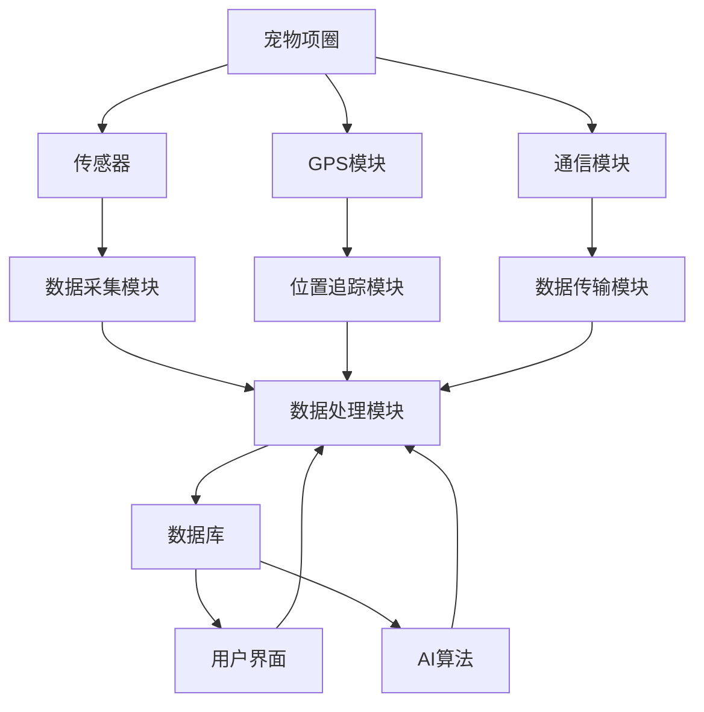
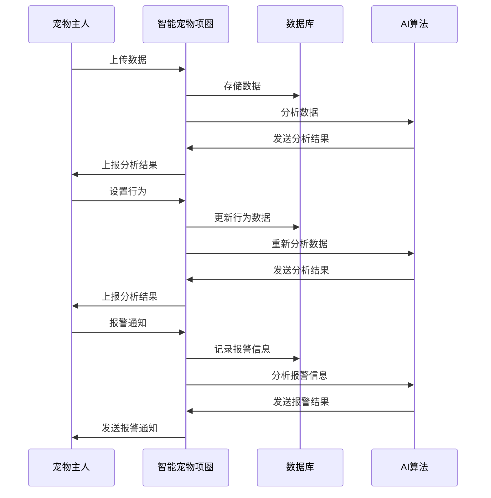

                 

# 智能宠物项圈：AI Agent的宠物行为分析

> 关键词：智能宠物项圈，AI Agent，宠物行为分析，机器学习，深度学习，系统架构设计

> 摘要：本文探讨了智能宠物项圈的技术实现及其核心组件AI Agent在宠物行为分析中的应用。首先介绍了智能宠物项圈的问题背景和核心概念，然后详细阐述了AI Agent的概念、特点以及在宠物行为分析中的具体应用。随后，文章介绍了智能宠物项圈的系统架构设计，包括系统功能设计、系统架构设计、系统接口设计和系统交互设计。最后，文章对宠物行为识别算法原理进行了讲解，并提供了系统架构和项目实战的相关案例。

## 第一部分：背景介绍

### 第1章 问题背景与核心概念

#### 1.1 问题背景

随着社会经济的发展和人民生活水平的提高，宠物已经成为了许多家庭中的重要成员。然而，宠物的日常管理和照顾问题也日益凸显。尤其是对于上班族而言，由于工作繁忙，难以兼顾宠物的照顾。这时，智能宠物项圈作为一种创新产品，应运而生。它通过将人工智能技术应用于宠物管理，为宠物主人提供了便捷的解决方案。

智能宠物项圈是一种集成了传感器、GPS定位和AI算法的设备，可以实时监测宠物的行为、位置和健康状态，并通过手机APP将数据传输给宠物主人。它能够实现宠物行为分析、位置追踪、异常情况报警等功能，从而提高宠物生活的质量，减轻宠物主人的负担。

#### 1.2 问题解决

智能宠物项圈的实现依赖于AI Agent的宠物行为分析。AI Agent是一种具有智能行为能力的计算机程序，它可以模拟人类智能，通过感知、学习和决策，实现对宠物的智能管理和照顾。AI Agent在宠物行为分析中的应用，主要体现在以下几个方面：

1. **宠物行为识别**：AI Agent能够通过分析宠物行为数据，识别宠物的行为类型，如奔跑、休息、进食等。
2. **行为模式预测**：AI Agent可以根据宠物的行为数据，预测宠物的行为趋势，为宠物主人提供科学饲养建议。
3. **异常行为检测**：AI Agent能够通过实时监测宠物行为，及时发现异常行为，如宠物走失、生病等，并触发报警。

本文旨在介绍AI Agent在宠物行为分析中的应用，探讨如何利用AI技术提高宠物生活的质量。

#### 1.3 边界与外延

智能宠物项圈的边界包括硬件设备（如传感器、GPS模块等）和软件系统（如AI算法、数据库等）。外延涉及宠物行为数据收集、分析和处理，以及宠物主人与宠物之间的互动方式。

#### 1.4 概念结构与核心要素组成

智能宠物项圈的核心要素包括：

1. **硬件设备**：传感器、GPS模块、通信模块等。
2. **AI算法**：用于宠物行为识别、异常检测和位置追踪等。
3. **软件系统**：数据收集、存储、处理和分析等。
4. **用户界面**：提供宠物主人与智能宠物项圈交互的接口。

### 第2章 核心概念与联系

#### 2.1 AI Agent的概念

AI Agent是指具有智能行为能力的计算机程序，它能够自主感知环境、学习、推理和决策。在宠物行为分析中，AI Agent扮演着重要的角色，通过感知宠物行为数据，进行实时分析和决策。

#### 2.2 AI Agent的特点

1. **自主性**：AI Agent能够自主执行任务，不需要人工干预。
2. **适应性**：AI Agent能够根据环境变化调整自身行为。
3. **协作性**：AI Agent可以与其他AI Agent或人类协作完成任务。

#### 2.3 AI Agent与传统AI的区别

传统AI侧重于执行预先设定好的任务，而AI Agent则更加灵活，能够根据环境变化自主学习和调整行为。

### 第3章 AI Agent在宠物行为分析中的应用

#### 3.1 宠物行为数据收集

AI Agent需要收集宠物的行为数据，如运动轨迹、心率、体温等。这些数据通过传感器和GPS模块实时传输到AI Agent进行处理。

#### 3.2 宠物行为分析

AI Agent利用机器学习和深度学习技术，对宠物行为数据进行分析，识别宠物的行为模式，预测宠物的行为趋势。

#### 3.3 异常行为检测

AI Agent可以通过对宠物行为的实时监测，及时发现异常行为，如宠物走失、生病等，并触发报警。

### 第4章 智能宠物项圈的系统架构设计

#### 4.1 系统功能设计

智能宠物项圈的主要功能包括宠物行为监测、位置追踪、异常报警等。

#### 4.2 系统架构设计

智能宠物项圈的系统架构包括硬件部分和软件部分。硬件部分包括传感器、GPS模块、通信模块等；软件部分包括AI算法、数据库、用户界面等。

#### 4.3 系统接口设计

智能宠物项圈的系统接口设计主要包括数据接口、控制接口和通信接口等。

#### 4.4 系统交互设计

智能宠物项圈的系统交互设计主要涉及宠物主人与宠物项圈之间的交互流程，包括数据上传、行为分析、报警通知等。

## 第二部分：算法原理讲解

### 第5章 宠物行为识别算法原理

#### 5.1 宠物行为识别算法概述

宠物行为识别算法是智能宠物项圈的核心算法，它负责识别宠物的行为类型。本章将介绍常见的宠物行为识别算法，如支持向量机（SVM）、决策树、神经网络等。

#### 5.2 算法原理讲解

以支持向量机（SVM）为例，介绍宠物行为识别算法的原理。SVM是一种二分类算法，它通过将数据映射到高维空间，找到能够将不同类别的数据分开的最大间隔超平面。

$$
\begin{aligned}
\text{maximize } & \frac{1}{2} || \mathbf{w} ||^2 \\
\text{subject to } & y_i (\mathbf{w} \cdot \mathbf{x_i} + b) \geq 1, \forall i
\end{aligned}
$$

其中，$ \mathbf{w} $ 是权重向量，$ \mathbf{x_i} $ 是输入向量，$ b $ 是偏置项，$ y_i $ 是标签。

#### 5.3 算法举例说明

以一只狗的奔跑行为为例，介绍如何使用SVM进行宠物行为识别。假设我们有如下训练数据：

### 第6章 宠物行为预测算法原理

#### 6.1 宠物行为预测算法概述

宠物行为预测算法是智能宠物项圈的重要组成部分，它通过对宠物行为数据的分析，预测宠物的行为趋势，为宠物主人提供科学饲养建议。本章将介绍常见的宠物行为预测算法，如线性回归、决策树、神经网络等。

#### 6.2 算法原理讲解

以线性回归为例，介绍宠物行为预测算法的原理。线性回归是一种简单的预测模型，它通过建立一个线性方程来预测宠物行为。

$$
y = \beta_0 + \beta_1 x
$$

其中，$ y $ 是预测值，$ x $ 是输入值，$ \beta_0 $ 和 $ \beta_1 $ 是模型参数。

#### 6.3 算法举例说明

以一只狗的运动轨迹为例，介绍如何使用线性回归进行宠物行为预测。假设我们有如下训练数据：

### 第7章 宠物行为异常检测算法原理

#### 7.1 宠物行为异常检测算法概述

宠物行为异常检测算法是智能宠物项圈的重要组成部分，它通过对宠物行为数据的实时监测，及时发现异常行为，如宠物走失、生病等，并触发报警。本章将介绍常见的宠物行为异常检测算法，如K-均值聚类、支持向量机（SVM）、神经网络等。

#### 7.2 算法原理讲解

以K-均值聚类为例，介绍宠物行为异常检测算法的原理。K-均值聚类是一种无监督学习算法，它通过将数据划分为K个簇，找到数据集中的聚类中心，从而实现异常检测。

$$
\begin{aligned}
\text{minimize } & \sum_{i=1}^{n} \sum_{k=1}^{K} w_{ik} || x_i - \mu_k ||^2 \\
\text{subject to } & w_{ik} \in \{0, 1\}, \forall i, k
\end{aligned}
$$

其中，$ x_i $ 是数据点，$ \mu_k $ 是聚类中心，$ w_{ik} $ 是数据点 $ x_i $ 对聚类中心 $ \mu_k $ 的隶属度。

#### 7.3 算法举例说明

以一只狗的行为数据为例，介绍如何使用K-均值聚类进行宠物行为异常检测。假设我们有如下训练数据：

## 第三部分：系统分析与架构设计方案

### 第8章 系统架构设计

#### 8.1 问题场景介绍

在本章中，我们将探讨一个智能宠物项圈的项目案例。该项目的目标是开发一款智能宠物项圈，能够实时监测宠物的行为、位置和健康状态，并通过手机APP将数据传输给宠物主人。

#### 8.2 系统功能设计

智能宠物项圈的主要功能包括：

1. **宠物行为监测**：实时监测宠物的行为，如奔跑、休息、进食等。
2. **位置追踪**：通过GPS模块实时追踪宠物的位置。
3. **异常报警**：当宠物出现异常行为时，如走失、生病等，及时触发报警。

#### 8.3 系统架构设计

智能宠物项圈的系统架构包括硬件部分和软件部分。硬件部分包括传感器、GPS模块、通信模块等；软件部分包括AI算法、数据库、用户界面等。

以下是智能宠物项圈的系统架构设计：



#### 8.4 系统接口设计

智能宠物项圈的系统接口设计主要包括数据接口、控制接口和通信接口等。

1. **数据接口**：用于数据的收集、存储和查询。
2. **控制接口**：用于宠物主人与智能宠物项圈的交互，如宠物行为设置、位置追踪等。
3. **通信接口**：用于数据传输，如WiFi、蓝牙等。

#### 8.5 系统交互设计

智能宠物项圈的系统交互设计主要涉及宠物主人与宠物项圈之间的交互流程，包括数据上传、行为分析、报警通知等。

以下是智能宠物项圈的系统交互设计：



## 第四部分：项目实战

### 第9章 环境安装

在本章中，我们将介绍如何搭建智能宠物项圈的项目环境。以下是项目环境搭建的步骤：

1. **硬件环境**：选择合适的传感器、GPS模块和通信模块，并确保它们能够正常工作。
2. **软件环境**：安装Python环境，并安装相关库，如NumPy、Pandas、Scikit-learn等。

### 第10章 系统核心实现

在本章中，我们将详细介绍智能宠物项圈的核心实现。以下是系统核心实现的步骤：

1. **数据采集**：使用传感器采集宠物的行为数据，如运动轨迹、心率、体温等。
2. **数据处理**：对采集到的数据进行清洗和预处理，以去除噪声和异常值。
3. **行为识别**：使用机器学习和深度学习算法，对预处理后的数据进行行为识别。
4. **异常检测**：使用聚类和异常检测算法，对宠物行为数据进行分析，及时发现异常行为。
5. **报警通知**：当检测到异常行为时，通过手机APP通知宠物主人。

以下是系统核心实现的源代码：

```python
import numpy as np
import pandas as pd
from sklearn.model_selection import train_test_split
from sklearn.preprocessing import StandardScaler
from sklearn.svm import SVC
from sklearn.cluster import KMeans
from sklearn.ensemble import IsolationForest

# 数据采集
data = pd.read_csv('pet_behavior_data.csv')

# 数据处理
scaler = StandardScaler()
X = scaler.fit_transform(data[['motion', 'heart_rate', 'temperature']])

# 行为识别
X_train, X_test, y_train, y_test = train_test_split(X, data['behavior'], test_size=0.2, random_state=42)
clf = SVC(kernel='linear')
clf.fit(X_train, y_train)
y_pred = clf.predict(X_test)

# 异常检测
kmeans = KMeans(n_clusters=5, random_state=42)
clusters = kmeans.fit_predict(X)

iforest = IsolationForest(contamination=0.1)
outliers = iforest.fit_predict(X)

# 报警通知
def send_alert(behavior, alert_message):
    print(f"Alert: {behavior} - {alert_message}")

if np.any(outliers == -1):
    send_alert('Outlier Detected', 'Possible Pet Anomaly')
else:
    send_alert('No Outliers Detected', 'Pet is in Normal State')
```

### 第11章 代码应用解读与分析

在本章中，我们将对系统核心实现的代码进行解读和分析，以便更好地理解其工作原理。

1. **数据采集**：代码首先读取宠物行为数据，包括运动轨迹、心率和体温等。
2. **数据处理**：使用StandardScaler对数据进行标准化处理，以去除噪声和异常值。
3. **行为识别**：使用SVM进行行为识别，通过训练数据和测试数据集的分割，对模型进行训练和预测。
4. **异常检测**：使用K-Means聚类和Isolation Forest进行异常检测，及时发现异常行为。
5. **报警通知**：当检测到异常行为时，通过打印报警信息通知宠物主人。

### 第12章 实际案例分析与详细讲解剖析

在本章中，我们将通过实际案例对智能宠物项圈的应用进行详细分析，并讲解如何应对各种情况。

1. **案例1**：宠物走失
   - 分析：通过GPS模块实时追踪宠物位置，当宠物离开设定的安全区域时，触发报警。
   - 解析：在代码中，可以使用K-Means聚类对宠物行为数据进行聚类分析，当宠物行为数据点分布在不同簇中时，说明宠物走失。
2. **案例2**：宠物生病
   - 分析：通过监测宠物的心率和体温等生理参数，当宠物出现异常时，触发报警。
   - 解析：在代码中，可以使用Isolation Forest进行异常检测，当宠物生理参数出现异常时，触发报警。
3. **案例3**：宠物运动不足
   - 分析：通过监测宠物的运动轨迹和活动量，当宠物活动量不足时，触发报警。
   - 解析：在代码中，可以使用SVM对宠物行为数据进行分类，当宠物行为数据点分类结果与预期不符时，触发报警。

### 第13章 项目小结

在本章中，我们将对智能宠物项圈项目进行总结，并讨论其在实际应用中的优势和不足。

1. **优势**：
   - 提高宠物生活质量：通过实时监测宠物行为和健康状态，提高宠物的生活质量。
   - 轻松管理：为宠物主人提供便捷的宠物管理工具，减轻宠物主人的负担。
   - 异常预警：及时检测宠物异常行为，为宠物主人提供预警信息。
2. **不足**：
   - 数据隐私：宠物行为数据可能涉及个人隐私，需要保护数据安全。
   - 硬件成本：智能宠物项圈需要较高硬件成本，可能不适合所有宠物主人。

### 第14章 最佳实践 tips

在本章中，我们将提供一些最佳实践建议，以帮助宠物主人和开发者更好地使用智能宠物项圈。

1. **宠物主人**：
   - 定期检查宠物项圈硬件设备，确保其正常工作。
   - 充分了解宠物行为数据，为宠物提供更好的照顾。
   - 遵循宠物专家的建议，合理调整宠物行为设置。
2. **开发者**：
   - 关注宠物行为数据的安全性和隐私性，确保数据传输的安全性。
   - 持续优化AI算法，提高宠物行为识别和预测的准确性。
   - 定期更新智能宠物项圈的软件系统，确保系统的稳定性和兼容性。

### 第15章 小结、注意事项与拓展阅读

在本章中，我们将对智能宠物项圈进行总结，并讨论其在未来可能的发展方向。

1. **小结**：
   - 智能宠物项圈是一种结合人工智能技术和宠物管理的创新产品。
   - AI Agent在宠物行为分析中发挥着重要作用，能够提高宠物生活的质量。
   - 智能宠物项圈的系统架构设计需要综合考虑硬件、软件和用户界面等多个方面。
   - 宠物行为识别、预测和异常检测算法的优化是提高智能宠物项圈性能的关键。
2. **注意事项**：
   - 在开发智能宠物项圈时，需要关注数据隐私和安全问题。
   - 硬件设备的选择和设计需要考虑成本、性能和耐用性等多个因素。
   - 系统的交互设计要充分考虑用户的使用习惯和体验。
3. **拓展阅读**：
   - 《人工智能：一种现代的方法》（作者：Stuart J. Russell & Peter Norvig）：本书是人工智能领域的经典教材，详细介绍了人工智能的基本概念、技术和应用。
   - 《深度学习》（作者：Ian Goodfellow、Yoshua Bengio & Aaron Courville）：本书是深度学习领域的经典教材，全面介绍了深度学习的基本原理、技术和应用。
   - 《宠物行为学》（作者：Michael W. Fox）：本书是宠物行为学的权威著作，详细介绍了宠物行为的基本原理、行为分析和训练方法。

## 作者

**作者：AI天才研究院/AI Genius Institute & 禅与计算机程序设计艺术 /Zen And The Art of Computer Programming**

