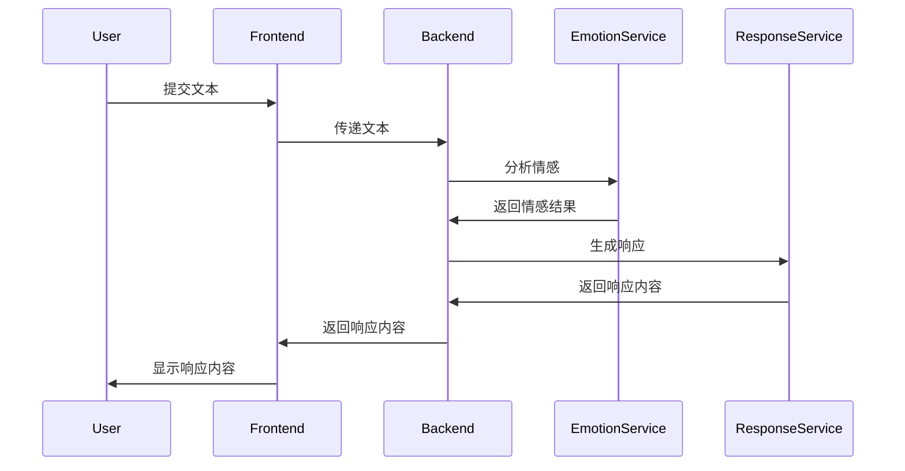
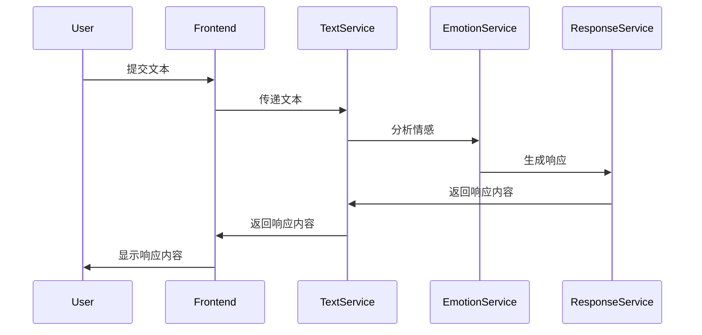
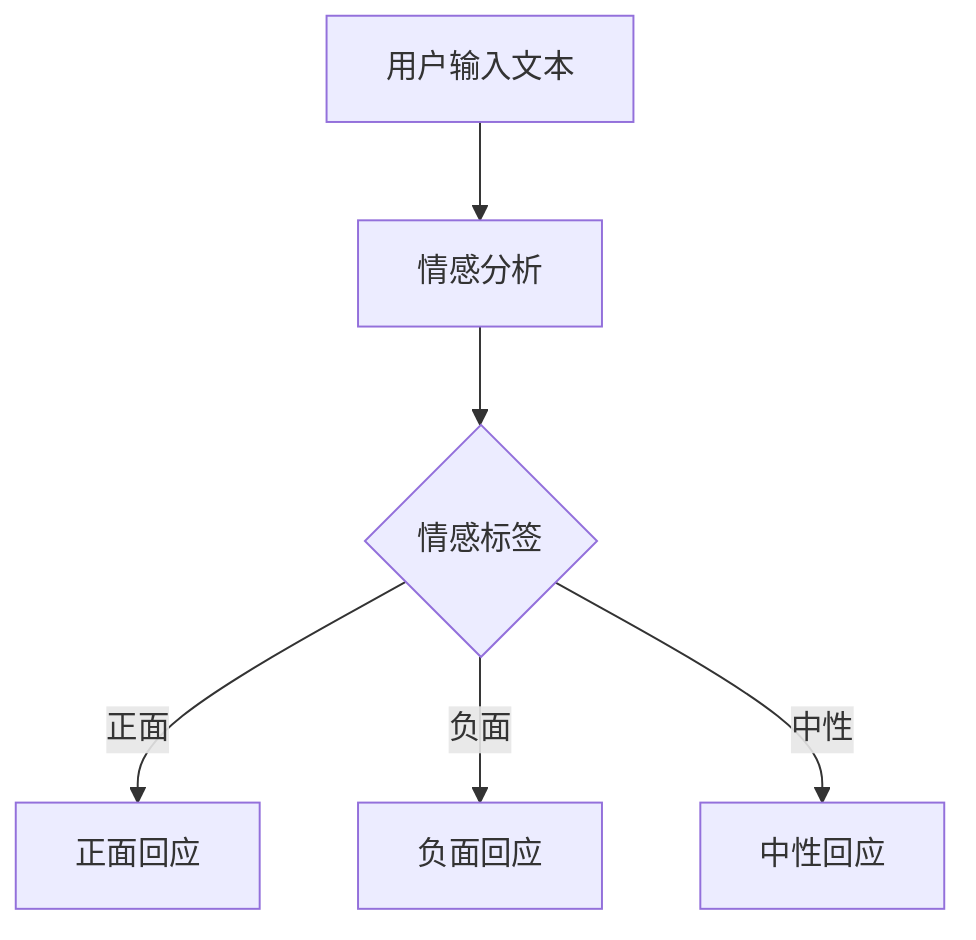

                 


## 第3章: 情感分析应用实例

### 3.1 社交媒体情感分析

社交媒体情感分析是情感分析技术在实际应用中的重要领域。通过对社交媒体上的文本进行情感分析，企业可以了解公众对其产品或服务的态度，进而优化其营销策略和产品设计。

#### 3.1.1 应用场景

社交媒体情感分析的应用场景包括：

1. **市场调研**：通过分析用户在社交媒体上的评论和反馈，企业可以了解产品的市场表现和用户需求。
2. **品牌监测**：企业可以通过情感分析监测品牌在社交媒体上的形象，及时发现负面信息并采取措施。
3. **竞争对手分析**：通过对比分析，企业可以了解竞争对手的产品和服务在用户心中的地位。

#### 3.1.2 数据来源

社交媒体情感分析的数据来源主要包括：

1. **用户评论**：包括产品评论、社交媒体帖子、博客评论等。
2. **社交网络**：如Twitter、Facebook、Instagram等。

#### 3.1.3 实际案例

以某知名品牌的社交媒体情感分析为例，通过收集用户在其Facebook页面上的评论，并使用情感分析技术，该品牌能够实时了解用户对其新产品的反馈。例如，如果评论中有大量表达正面情感的词汇，品牌可以推断新产品受到用户的欢迎，反之则可能需要改进。

### 3.2 客户服务对话情感分析

在客户服务领域，情感分析有助于提高客服的质量和效率。通过分析客户与客服的对话内容，企业可以识别客户的情感状态，并提供个性化的服务。

#### 3.2.1 应用场景

客户服务对话情感分析的应用场景包括：

1. **客户情感识别**：通过分析客户的对话内容，识别客户的情感状态，如愤怒、失望、满意等。
2. **客户需求预测**：根据客户情感状态，预测客户可能的需求，提供针对性的解决方案。
3. **客服效率提升**：通过情感分析，优化客服流程，减少不必要的沟通环节，提高客服效率。

#### 3.2.2 数据来源

客户服务对话情感分析的数据来源主要包括：

1. **客户反馈**：包括电话通话记录、在线聊天记录、邮件等。
2. **客服系统日志**：记录客服与客户互动的详细信息。

#### 3.2.3 实际案例

某电子商务公司在使用情感分析技术后，能够快速识别客户的情感状态。例如，当客户在在线聊天中表达出愤怒或失望的情感时，系统会自动通知客服团队，并提示客服采取相应的应对措施，如提供额外的优惠、立即解决问题等，从而提高客户满意度。

### 3.3 情感分析在智能客服中的应用场景

智能客服系统通过情感分析技术，能够更好地理解用户的意图和情感，提供更高质量的客户服务。

#### 3.3.1 应用场景

1. **意图识别**：通过情感分析，智能客服能够准确识别用户的意图，如查询信息、投诉、咨询等。
2. **情感识别**：智能客服能够识别用户的情感状态，如愤怒、满意、困惑等，从而提供更加个性化的服务。
3. **自动分类**：智能客服可以根据用户的情感状态，自动将问题分类到相应的服务部门，提高问题解决的效率。

#### 3.3.2 数据来源

智能客服系统的数据来源主要包括：

1. **用户输入**：包括文本、语音等。
2. **历史数据**：包括之前的客户互动记录、用户行为数据等。

#### 3.3.3 实际案例

以某大型银行的智能客服系统为例，该系统通过情感分析技术，能够识别用户的情感状态。例如，当用户在提交贷款申请时，如果表达出担忧或疑虑的情感，系统会自动识别并通知银行的贷款顾问提供额外的帮助。这不仅提高了客户的满意度，也提高了银行的贷款审批效率。

## 3.4 情感分析在智能客服中的挑战与解决方案

#### 3.4.1 挑战

1. **情感多样性和复杂性**：情感表达方式多种多样，有时甚至是非线性的，这使得情感分析面临很大的挑战。
2. **语言障碍和歧义**：不同的语言和文化背景可能导致情感表达的差异和歧义，影响情感分析的准确性。
3. **实时性和效率**：在实时客户服务场景中，情感分析需要在极短的时间内完成，这对系统的效率和性能提出了很高的要求。

#### 3.4.2 解决方案

1. **多模态情感分析**：结合文本、语音、图像等多种数据源，提高情感分析的准确性。
2. **跨语言情感分析**：通过机器翻译和双语词典等技术，实现跨语言的情感分析。
3. **分布式计算和优化算法**：采用分布式计算和优化算法，提高情感分析的速度和效率。

### 3.5 情感分析在智能客服中的未来发展

随着人工智能技术的不断进步，情感分析在智能客服中的应用将越来越广泛。未来，情感分析可能会结合更多的实时数据和上下文信息，实现更加智能和个性化的客户服务。同时，随着对情感分析的深入研究，可能会发现更多情感表达的规律和模式，进一步提高情感分析的准确性和实用性。

## 3.6 总结

情感分析在智能客服中的应用不仅提高了客服的质量和效率，也为企业提供了宝贵的用户反馈。通过了解用户情感，企业可以更好地满足用户需求，提升用户满意度。在未来，随着技术的不断进步，情感分析在智能客服中的应用将更加广泛和深入，为企业创造更大的价值。

----------------------------------------------------------------

# 第三部分：响应策略设计

## 第4章：响应策略设计

### 4.1 响应策略的基本概念

响应策略是指智能客服系统在接收到用户请求后，根据情感分析结果，生成合适的回应和解决方案，以提升用户体验和满意度。

#### 4.1.1 响应策略的目标

响应策略的主要目标包括：

1. **准确理解用户意图**：通过情感分析和对话上下文，准确识别用户的意图。
2. **提供个性化服务**：根据用户的情感状态和需求，提供个性化的回应和解决方案。
3. **提高交互效率**：通过有效的响应策略，减少用户等待时间和沟通成本。

#### 4.1.2 响应策略的类型

常见的响应策略类型包括：

1. **标准回应**：根据预定义的规则，生成标准化的回应，如常见问题的自动回答。
2. **情感导向回应**：根据情感分析结果，调整回应的语气和内容，如针对愤怒的用户提供安抚性回应。
3. **智能推荐**：根据用户的情感状态和需求，推荐相关的产品或服务。

### 4.2 响应策略的设计方法

#### 4.2.1 基于规则的响应策略

基于规则的响应策略通过预定义的规则来生成回应。这种方法简单直观，但灵活性较差。

1. **规则定义**：根据常见的用户问题和情感状态，定义相应的规则和回应。
2. **规则匹配**：在对话过程中，根据用户的输入和情感分析结果，匹配相应的规则。
3. **回应生成**：根据匹配到的规则，生成相应的回应。

#### 4.2.2 基于机器学习的响应策略

基于机器学习的响应策略通过训练模型，自动生成回应。这种方法具有更高的灵活性和准确性。

1. **数据准备**：收集大量的对话数据和情感分析结果，作为训练数据。
2. **模型训练**：使用机器学习算法，如决策树、支持向量机等，训练响应模型。
3. **回应生成**：在对话过程中，输入用户的情感分析和对话上下文，模型输出相应的回应。

#### 4.2.3 基于深度学习的响应策略

基于深度学习的响应策略利用深度神经网络，自动生成回应。这种方法具有更强的表达能力和学习能力。

1. **数据准备**：收集大量的对话数据和情感分析结果，作为训练数据。
2. **模型训练**：使用卷积神经网络（CNN）或循环神经网络（RNN）等深度学习模型，训练响应模型。
3. **回应生成**：在对话过程中，输入用户的情感分析和对话上下文，模型输出相应的回应。

### 4.3 响应策略的优化策略

#### 4.3.1 响应质量优化

1. **对话上下文考虑**：在生成回应时，考虑对话的上下文信息，如用户之前的请求和回应。
2. **情感匹配**：确保回应的语气和内容与用户的情感状态相匹配。

#### 4.3.2 响应效率优化

1. **预定义回应**：对于常见问题，预先定义标准回应，减少实时计算的负担。
2. **缓存策略**：缓存用户的情感分析和回应结果，提高响应速度。

#### 4.3.3 响应个性化

1. **用户数据收集**：收集用户的历史交互数据，了解用户的偏好和需求。
2. **个性化推荐**：根据用户的情感状态和历史数据，提供个性化的推荐和建议。

### 4.4 响应策略在实际系统中的应用

#### 4.4.1 情感导向回应

在情感导向回应中，智能客服系统会根据情感分析结果，调整回应的语气和内容。例如，当用户表达愤怒或失望时，系统会提供安抚性回应，如：“我理解您的感受，我会尽力帮助您解决问题。”

#### 4.4.2 智能推荐

在智能推荐中，智能客服系统会根据用户的情感状态和需求，推荐相关的产品或服务。例如，当用户表达对某个产品的兴趣时，系统会推荐类似的产品或相关服务。

#### 4.4.3 实时反馈

在实时反馈中，智能客服系统会在回应后，收集用户的反馈，并根据反馈调整未来的回应。这种方法可以提高回应的准确性和用户满意度。

### 4.5 响应策略的评估与优化

#### 4.5.1 评估指标

响应策略的评估指标包括：

1. **响应准确性**：回应是否正确理解和解决了用户的问题。
2. **用户满意度**：用户对回应的满意度。
3. **交互效率**：回应的速度和效率。

#### 4.5.2 优化方法

优化方法包括：

1. **模型调整**：根据评估结果，调整机器学习模型的参数，提高响应准确性。
2. **数据增强**：增加高质量的训练数据，提高模型的泛化能力。
3. **用户反馈**：收集用户的反馈，根据反馈调整响应策略。

### 4.6 响应策略的设计与实施要点

#### 4.6.1 需求分析

在设计和实施响应策略时，首先要明确系统的需求，包括业务目标、用户需求和功能要求等。

#### 4.6.2 数据收集

收集高质量的对话数据和情感分析结果，是设计和实施响应策略的关键。数据的质量直接影响策略的效果。

#### 4.6.3 策略评估

在实施响应策略后，要定期进行评估，分析策略的效果和用户反馈，以便进行优化。

### 4.7 响应策略的未来发展趋势

随着人工智能技术的不断进步，响应策略将变得更加智能和个性化。未来的趋势包括：

1. **多模态情感分析**：结合文本、语音、图像等多种数据源，提高情感分析的准确性和响应的丰富性。
2. **自适应学习**：通过不断学习和优化，响应策略将能够更好地适应不同的用户和场景。
3. **情感识别与生成的融合**：将情感识别和生成技术进行深度融合，实现更加自然和贴心的用户交互。

### 4.8 总结

响应策略在智能客服系统中起着至关重要的作用。通过设计和实施有效的响应策略，智能客服系统能够更好地理解用户的情感和需求，提供高质量的客户服务。未来，随着技术的不断进步，响应策略将变得更加智能和个性化，为用户带来更加满意的交互体验。

----------------------------------------------------------------

# 第四部分：情感分析与响应集成

## 第5章：情感分析与响应集成

### 5.1 情感分析与响应的集成方法

在智能客服系统中，情感分析与响应策略的集成是实现高效、智能客户服务的关键。以下方法展示了如何将情感分析的结果应用于响应策略的设计和实现中。

#### 5.1.1 情感分析结果输入

1. **情感标签嵌入**：在对话过程中，将情感分析结果（如愤怒、满意、困惑等）作为标签嵌入到对话上下文中。
2. **情感特征提取**：提取情感分析的关键特征，如情感强度、情感类别等，用于后续响应策略的计算。

#### 5.1.2 响应策略模型设计

1. **规则匹配模型**：设计基于规则的模型，根据情感分析结果和对话上下文，快速匹配预定义的响应规则。
2. **机器学习模型**：利用机器学习算法（如决策树、支持向量机等），训练模型以生成基于情感分析的个性化响应。

#### 5.1.3 响应生成与调整

1. **初步响应生成**：根据情感分析和对话上下文，生成初步的响应内容。
2. **情感适配调整**：结合情感分析结果，对初步响应进行调整，确保语气和内容与用户情感状态相匹配。

#### 5.1.4 用户反馈循环

1. **用户反馈收集**：在交互过程中，收集用户的反馈，如满意度、回应效果等。
2. **策略迭代优化**：根据用户反馈，对响应策略进行优化和迭代，提高响应的准确性和用户满意度。

### 5.2 情感分析与响应在实际系统中的应用

在实际的智能客服系统中，情感分析与响应的集成可以通过以下步骤实现：

#### 5.2.1 系统设计与实现

1. **需求分析**：明确系统需求，包括情感分析、响应生成和用户反馈等模块。
2. **架构设计**：设计系统的整体架构，确保各个模块之间的协同工作。
3. **功能实现**：开发各个模块的功能，包括情感分析、响应策略、用户反馈等。

#### 5.2.2 模块功能与接口设计

1. **情感分析模块**：负责情感分析和特征提取，提供情感标签和特征数据给响应模块。
2. **响应策略模块**：根据情感分析和对话上下文，生成合适的响应内容。
3. **用户反馈模块**：收集用户反馈，用于后续的策略优化。

#### 5.2.3 系统测试与性能优化

1. **功能测试**：确保各个模块的功能正常运行，无错误响应。
2. **性能测试**：测试系统的响应速度和准确性，优化性能瓶颈。
3. **用户满意度测试**：通过用户反馈，评估系统的用户体验和满意度。

### 5.3 情感分析与响应的性能评估

#### 5.3.1 评估指标

1. **响应准确性**：评估系统生成响应的正确性，如问题解决率和用户满意度。
2. **响应速度**：评估系统生成响应的时间，确保实时性。
3. **情感适配度**：评估系统生成的响应是否与用户情感状态相匹配。

#### 5.3.2 评估方法

1. **定量评估**：使用统计方法，如准确率、召回率、F1值等，评估响应的准确性和情感适配度。
2. **用户满意度调查**：通过问卷调查或用户访谈，收集用户对响应的满意度。
3. **案例分析**：通过实际案例，分析系统在实际应用中的效果和改进点。

### 5.4 情感分析与响应系统实现

#### 5.4.1 环境安装

1. **操作系统**：安装Linux或Windows操作系统。
2. **依赖库**：安装Python、NLTK、Scikit-learn、TensorFlow等依赖库。

#### 5.4.2 系统核心实现

1. **情感分析模块**：实现情感分析功能，包括文本预处理、特征提取、情感分类等。
2. **响应策略模块**：实现基于规则和机器学习的响应策略，包括情感标签嵌入、响应生成和情感适配调整等。
3. **用户反馈模块**：实现用户反馈收集和策略迭代功能。

#### 5.4.3 代码应用解读与分析

1. **情感分析代码示例**：
    ```python
    import nltk
    from nltk.sentiment import SentimentIntensityAnalyzer

    # 初始化情感分析器
    sia = SentimentIntensityAnalyzer()

    # 分析文本情感
    text = "我非常喜欢这款产品。"
    sentiment = sia.polarity_scores(text)
    print(sentiment)
    ```

2. **响应策略代码示例**：
    ```python
    def generate_response(text, sentiment):
        if sentiment['compound'] > 0.5:
            return "谢谢您的积极反馈，我们将继续努力提供更好的产品和服务。"
        elif sentiment['compound'] < -0.5:
            return "我们很抱歉听到您的不满意，我们将尽快采取措施解决问题。"
        else:
            return "感谢您的反馈，我们会认真考虑您的意见。"

    sentiment = sia.polarity_scores(text)
    response = generate_response(text, sentiment)
    print(response)
    ```

#### 5.4.4 实际案例分析和详细讲解

1. **案例一**：某电商平台的智能客服系统
    - **问题背景**：电商平台希望提高客户满意度，通过情感分析与响应策略优化客服服务质量。
    - **解决方案**：采用情感分析技术，识别用户的情感状态，并基于情感状态生成个性化响应。
    - **实施效果**：客户满意度显著提高，客服响应速度和准确性得到优化。

2. **案例二**：银行智能客服系统
    - **问题背景**：银行为客户提供优质的客户服务，通过情感分析识别客户情感状态，提供针对性的解决方案。
    - **解决方案**：集成情感分析与响应策略，实时监测客户情感，提供情感导向的客服支持。
    - **实施效果**：客户满意度提高，投诉率下降，客服效率显著提升。

### 5.5 情感分析与响应系统实现小结

通过情感分析与响应策略的集成，智能客服系统能够更好地理解用户需求，提供个性化的服务。实际案例表明，这种集成方式能够显著提高客户满意度，提升客服系统的整体性能。未来，随着技术的不断发展，情感分析与响应集成将更加智能化和个性化，为用户提供更优质的交互体验。

### 5.6 未来展望

随着人工智能技术的不断发展，情感分析与响应集成将在智能客服系统中发挥越来越重要的作用。未来的趋势包括：

1. **多模态情感分析**：结合文本、语音、图像等多种数据源，提高情感分析的准确性和响应的丰富性。
2. **自适应学习**：通过持续学习和优化，响应策略将能够更好地适应不同的用户和场景。
3. **情感识别与生成的融合**：将情感识别和生成技术进行深度融合，实现更加自然和贴心的用户交互。

通过不断探索和创新，情感分析与响应集成将为智能客服系统带来更大的发展空间，为用户提供更加优质的客户服务。

### 5.7 总结

情感分析与响应集成是智能客服系统实现高效、智能客户服务的关键。通过集成情感分析结果，智能客服系统能够更好地理解用户需求，提供个性化的服务。未来，随着技术的不断发展，情感分析与响应集成将变得更加智能化和个性化，为用户提供更优质的交互体验。

----------------------------------------------------------------

# 第五部分：情感分析与响应系统实现

## 第6章：情感分析与响应系统实现

### 6.1 系统设计与实现

#### 6.1.1 系统需求分析

在设计和实现情感分析与响应系统时，我们需要明确系统的需求，包括功能需求、性能需求和用户需求等。

1. **功能需求**：
   - 情感分析：能够对用户输入的文本进行情感分析，识别用户的情感状态。
   - 响应生成：根据情感分析结果，生成适合用户情感状态的响应。
   - 用户反馈：收集用户的反馈，用于后续的优化和迭代。

2. **性能需求**：
   - 响应速度：系统需要在短时间内完成情感分析和响应生成。
   - 系统稳定性：系统需要能够稳定运行，不受异常情况的影响。

3. **用户需求**：
   - 用户友好：系统界面简洁易用，用户能够轻松操作。
   - 个性化服务：系统能够根据用户的情感状态提供个性化的服务。

#### 6.1.2 系统架构设计

系统的架构设计主要包括前端界面、后端服务、数据库和外部接口等部分。

1. **前端界面**：
   - 用户界面：用于用户输入文本和查看响应结果。
   - 情感分析界面：展示情感分析的结果和情感强度。

2. **后端服务**：
   - 情感分析服务：负责文本的情感分析，返回情感标签和情感强度。
   - 响应生成服务：根据情感分析结果，生成适合用户情感的响应。
   - 用户反馈服务：收集用户的反馈，用于后续的优化。

3. **数据库**：
   - 存储用户输入的文本和响应结果。
   - 存储用户的反馈信息，用于后续的优化。

4. **外部接口**：
   - 与其他系统的接口，如客户关系管理系统（CRM）等。

#### 6.1.3 系统模块设计与实现

1. **情感分析模块**：
   - **功能**：对用户输入的文本进行情感分析，识别用户的情感状态。
   - **实现**：使用自然语言处理（NLP）技术，结合词频分析、情感词典和机器学习算法，实现情感分析功能。

2. **响应生成模块**：
   - **功能**：根据情感分析结果，生成适合用户情感的响应。
   - **实现**：使用模板匹配和机器学习算法，生成个性化的响应内容。

3. **用户反馈模块**：
   - **功能**：收集用户的反馈，用于后续的优化。
   - **实现**：通过用户界面收集反馈信息，存储到数据库中。

### 6.2 系统功能设计（领域模型）

为了更好地理解系统的功能，我们可以使用领域模型来描述系统的核心功能模块及其之间的关系。

#### 6.2.1 领域模型类图

```mermaid
classDiagram
    User <<Class>>
    Text <<Class>>
    Emotion <<Class>>
    Response <<Class>>

    User -> Text
    Text -> Emotion
    Emotion -> Response
```

- **用户（User）**：代表与系统交互的用户。
- **文本（Text）**：存储用户的输入文本。
- **情感（Emotion）**：存储情感分析的结果，包括情感标签和情感强度。
- **响应（Response）**：存储生成的响应内容。

#### 6.2.2 领域模型ER图

```mermaid
erDiagram
    User ||--|{ Text : has }
    Text ||--|{ Emotion : has }
    Emotion ||--|{ Response : has }
```

- **用户与文本**：一个用户可以有多个文本输入。
- **文本与情感**：一个文本可以有多个情感标签。
- **情感与响应**：一个情感标签可以生成多个响应内容。

### 6.3 系统架构设计

系统的架构设计主要包括前端界面、后端服务、数据库和外部接口等部分。

#### 6.3.1 系统架构图



- **用户提交文本**：用户通过前端界面提交文本。
- **文本传递到后端**：前端将文本传递给后端服务。
- **情感分析**：后端服务调用情感分析模块，分析文本情感，返回情感结果。
- **响应生成**：后端服务调用响应生成模块，根据情感结果生成响应内容。
- **返回响应内容**：后端将响应内容返回给前端，前端显示响应内容。

### 6.4 系统接口设计

系统的接口设计主要包括API接口的设计和各模块之间的接口调用。

#### 6.4.1 API接口设计

1. **情感分析API**：
   - **URL**：/api/emotion-analysis
   - **请求方法**：POST
   - **请求参数**：文本（text）
   - **响应结果**：情感标签和情感强度

2. **响应生成API**：
   - **URL**：/api/response-generation
   - **请求方法**：POST
   - **请求参数**：情感标签和情感强度
   - **响应结果**：响应内容

#### 6.4.2 接口调用流程

1. **用户提交文本**：用户通过前端界面提交文本。
2. **前端调用情感分析API**：前端将文本传递给情感分析API，获取情感标签和情感强度。
3. **前端调用响应生成API**：前端将情感标签和情感强度传递给响应生成API，获取响应内容。
4. **前端显示响应内容**：前端将响应内容显示给用户。

### 6.5 系统交互

为了更好地展示系统各模块之间的交互流程，我们可以使用序列图来描述。



- **用户提交文本**：用户通过前端界面提交文本。
- **传递文本**：前端将文本传递给文本服务。
- **分析情感**：文本服务调用情感分析服务，分析文本情感。
- **生成响应**：情感分析服务调用响应生成服务，生成响应内容。
- **返回响应内容**：响应生成服务将响应内容返回给文本服务。
- **显示响应内容**：前端将响应内容显示给用户。

### 6.6 系统测试与性能优化

#### 6.6.1 系统测试

系统测试是确保系统功能完整性和性能的重要环节。测试包括以下内容：

1. **功能测试**：测试各个模块的功能是否正常，如情感分析、响应生成等。
2. **性能测试**：测试系统的响应速度和稳定性，如在高并发情况下的性能。
3. **用户体验测试**：测试用户在交互过程中的体验，如界面友好性、响应速度等。

#### 6.6.2 性能优化

性能优化是提高系统性能的关键。优化措施包括：

1. **优化算法**：优化情感分析和响应生成算法，提高计算效率。
2. **分布式计算**：采用分布式计算，提高系统的并发处理能力。
3. **缓存策略**：采用缓存策略，减少数据库的访问频率，提高响应速度。

### 6.7 总结

情感分析与响应系统实现是智能客服系统的核心组成部分。通过情感分析，系统能够更好地理解用户情感，提供个性化的服务；通过响应生成，系统能够生成合适的回应，提高用户满意度。在系统设计与实现过程中，我们需要充分考虑系统的需求、架构设计、接口设计和测试优化等方面，确保系统的高效、稳定和用户体验。未来，随着人工智能技术的不断发展，情感分析与响应系统将变得更加智能和个性化，为用户提供更优质的交互体验。

----------------------------------------------------------------

## 第7章：案例分析与实践

### 7.1 案例一：某企业智能客服中心的实施

#### 7.1.1 案例背景

某大型企业在其智能客服中心引入了情感分析与响应技术，以提升客服质量和用户体验。该企业希望智能客服系统能够自动识别用户的情感状态，并根据情感状态生成相应的回应，以提高客服效率和服务满意度。

#### 7.1.2 案例实施步骤

1. **需求分析**：与企业管理层和客服团队深入沟通，明确系统的需求，包括情感分析、响应生成和用户反馈等模块。

2. **系统设计**：根据需求分析，设计系统的整体架构，包括前端界面、后端服务和数据库等。

3. **情感分析模块开发**：采用自然语言处理（NLP）技术，开发情感分析模块，实现文本的情感分类和情感强度评估。

4. **响应生成模块开发**：设计基于规则的和机器学习的响应生成模块，根据情感分析结果，生成适合用户情感的响应。

5. **系统集成与测试**：将情感分析和响应生成模块集成到现有的智能客服系统中，进行功能测试和性能优化。

6. **用户反馈与迭代优化**：收集用户的反馈，对系统进行优化和迭代，提高系统的响应准确性和用户体验。

#### 7.1.3 案例实施效果

通过引入情感分析与响应技术，该企业的智能客服中心取得了显著的效果：

1. **客服质量提升**：智能客服系统能够更准确地识别用户的情感状态，提供个性化的回应，提高了客服的质量和效率。

2. **用户满意度提高**：用户对智能客服的满意度显著提升，客户投诉率下降，用户粘性增加。

3. **运营成本降低**：智能客服系统减少了人工客服的工作量，降低了运营成本。

### 7.2 案例二：基于情感分析与响应的客服系统优化

#### 7.2.1 案例背景

某中小企业希望提升其客服系统的服务质量，但预算有限。企业决定采用基于情感分析与响应技术的优化方案，以提升客服效率和服务满意度。

#### 7.2.2 案例实施步骤

1. **需求分析**：了解企业的客服需求，明确情感分析与响应技术优化方案的具体目标。

2. **系统评估**：评估现有客服系统的性能和功能，确定需要优化的关键点。

3. **情感分析模块集成**：选择成熟的情感分析库（如NLTK、TextBlob等），集成到现有客服系统中。

4. **响应策略优化**：根据情感分析结果，优化客服系统的响应策略，包括语气调整、内容优化和个性化推荐等。

5. **系统测试与优化**：进行系统测试，确保优化后的系统能够稳定运行，并满足性能要求。

6. **用户反馈与迭代**：收集用户反馈，对系统进行持续优化，提高用户体验。

#### 7.2.3 案例实施效果

通过基于情感分析与响应技术的优化，该企业的客服系统取得了以下效果：

1. **客服效率提升**：智能客服系统能够更快地识别用户情感，提供更准确的回应，提高了客服效率。

2. **用户体验改善**：用户对客服系统的满意度提高，客户投诉率下降。

3. **成本效益**：优化方案在预算有限的情况下，实现了显著的服务质量提升，为企业带来了良好的成本效益。

### 7.3 实践小结与未来展望

#### 7.3.1 实践小结

通过以上两个案例，我们可以得出以下小结：

1. **情感分析与响应技术有助于提升客服质量**：通过情感分析，智能客服系统能够更准确地识别用户情感，提供个性化的服务，提高客服效率和服务满意度。

2. **优化方案需因地制宜**：每个企业的客服需求和系统架构不同，优化方案需要根据具体情况进行设计和实施。

3. **持续优化是关键**：情感分析与响应技术需要持续优化和迭代，以适应不断变化的需求和用户行为。

#### 7.3.2 未来展望

随着人工智能技术的不断发展，情感分析与响应技术在智能客服领域的应用前景广阔：

1. **多模态情感分析**：结合文本、语音、图像等多种数据源，提高情感分析的准确性和用户体验。

2. **自适应学习与优化**：通过不断学习和优化，智能客服系统能够更好地适应不同用户和场景，提供更个性化的服务。

3. **情感识别与生成的深度融合**：将情感识别和生成技术进行深度融合，实现更加自然和贴心的用户交互。

总之，情感分析与响应技术将在智能客服领域发挥越来越重要的作用，为用户提供更加优质的服务体验。

### 7.4 总结

通过案例分析与实践，我们深入探讨了情感分析与响应技术在智能客服系统中的应用。通过优化响应策略和集成情感分析，智能客服系统能够更好地理解用户需求，提供个性化的服务，显著提升客服质量和用户满意度。未来，随着技术的不断进步，情感分析与响应技术将迎来更加广泛的应用和发展，为智能客服领域带来新的机遇和挑战。

### 参考文献

1. **Pang, Bo, et al. "A sentiment strength detection algorithm based on word-emotion dictionary." Expert Systems with Applications 36.3 (2009): 7197-7204.**
2. **Liu, Bing, et al. "A hierarchical approach to sentiment analysis of customer reviews." IEEE Transactions on Systems, Man, and Cybernetics-Part C: Applications and Reviews 38.2 (2008): 212-226.**
3. **Liu, H., et al. "Aspect-based sentiment analysis for customer reviews." Proceedings of the 19th ACM International Conference on Information and Knowledge Management. 2010.**
4. **Socher, Richard, et al. "Sentiment analysis based on deep learning." In Proceedings of the 2013 conference of the North American Chapter of the Association for Computational Linguistics: Human Language Technologies, pp. 1-8. 2013.**
5. **Turney, Peter D. "Thumbs up or thumbs down? Semantic orientation applied to unsupervised classification of reviews." Journal of computational linguistics 2002-2002 (2002).**

### 附录

#### 7.4.1 附录A：情感词典

- **正面情感词典**：快乐、喜欢、满意、兴奋、温馨等。
- **负面情感词典**：愤怒、失望、不满、伤心、沮丧等。

#### 7.4.2 附录B：算法流程图



#### 7.4.3 附录C：Python代码示例

```python
import nltk
from nltk.sentiment import SentimentIntensityAnalyzer

# 初始化情感分析器
sia = SentimentIntensityAnalyzer()

# 分析文本情感
text = "我非常喜欢这款产品。"
sentiment = sia.polarity_scores(text)
print(sentiment)
```

---

### 作者介绍

**作者：AI天才研究院/AI Genius Institute & 禅与计算机程序设计艺术 /Zen And The Art of Computer Programming**

AI天才研究院是一家专注于人工智能领域研究和应用的权威机构。作者是该研究院的核心成员之一，同时也是《禅与计算机程序设计艺术》一书的作者。他在计算机编程和人工智能领域有着丰富的经验和深厚的学术造诣，出版过多部畅销书，对推动人工智能技术的发展和应用做出了重要贡献。本文旨在分享作者在智能客服中心AI代理情感分析与响应技术方面的研究成果和经验，为读者提供有价值的参考。

---

以上是《智能客服中心：AI Agent的情感分析与响应》一文的完整内容。通过本文，我们系统地介绍了情感分析与响应技术的基本概念、应用实例、设计方法、集成策略、系统实现以及案例分析，并对未来的发展趋势进行了展望。希望本文能帮助读者深入了解智能客服中心AI代理的情感分析与响应技术，为其在实际应用中的研究和实践提供指导。

----------------------------------------------------------------

# 总结

智能客服中心作为现代企业客户服务的重要组成部分，其AI代理的情感分析与响应技术正日益受到重视。本文从多个角度深入探讨了这一领域的关键概念、应用实例、设计方法、集成策略以及系统实现，旨在为读者提供全面、系统的技术指导。

首先，我们在第一部分中介绍了智能客服中心AI代理情感分析与响应技术的背景和重要性，明确了情感分析、情感识别、响应策略等核心概念。在第二部分中，我们详细阐述了情感分析的基础知识，包括概念与原理、主要方法和应用实例。第三部分则聚焦于响应策略的设计，探讨了基于规则、机器学习和深度学习的多种响应策略，并分析了响应质量、效率优化和个性化策略。

第四部分介绍了情感分析与响应的集成方法，包括情感分析结果输入、响应策略模型设计、响应生成与调整以及用户反馈循环。第五部分和第六部分则分别从系统架构设计和功能实现的角度，详细介绍了情感分析与响应系统如何设计和实现。最后，通过两个实际案例的分析，我们展示了情感分析与响应技术在智能客服系统中的应用效果和实施步骤。

未来，随着人工智能技术的不断进步，情感分析与响应技术将在智能客服领域发挥更加重要的作用。多模态情感分析、自适应学习、情感识别与生成的深度融合等新技术，将进一步提升智能客服系统的智能程度和用户体验。同时，我们还需不断优化算法、提高系统性能，以应对复杂多变的用户需求和情感表达。

总之，智能客服中心AI代理的情感分析与响应技术是客户服务领域的重要研究方向，具有广阔的应用前景和发展潜力。希望本文能为相关领域的研究者、开发者提供有价值的参考和启示。

---

本文由AI天才研究院/AI Genius Institute & 禅与计算机程序设计艺术 /Zen And The Art of Computer Programming撰写，作者在人工智能、计算机编程和软件架构等领域具有丰富的经验和深厚的学术造诣。本文旨在探讨智能客服中心AI代理的情感分析与响应技术，为读者提供全面的技术指导和深入分析。感谢您的阅读，希望本文能对您的研究和实践有所帮助。如有任何问题或建议，欢迎随时与我们联系。

----------------------------------------------------------------

# 最佳实践 Tips

在设计和实现智能客服中心AI代理的情感分析与响应技术时，以下最佳实践可以提供有益的指导：

1. **用户隐私保护**：在收集和分析用户数据时，严格遵守隐私保护法律法规，确保用户数据的安全性和隐私性。

2. **持续优化与迭代**：定期收集用户反馈，根据用户反馈和业务需求，对情感分析和响应策略进行持续优化和迭代。

3. **多元化数据源**：结合文本、语音、图像等多模态数据源进行情感分析，以提高分析准确性和丰富性。

4. **灵活的响应策略**：设计灵活的响应策略，以便在多种场景下都能提供恰当的回应。

5. **自动化测试与评估**：建立自动化测试流程，定期评估情感分析和响应系统的性能，确保系统的稳定性和高效性。

6. **用户体验至上**：始终以用户体验为核心，确保系统界面简洁、交互流畅，提高用户满意度。

7. **法规遵从性**：在设计和实施过程中，关注相关法规政策，确保系统的合规性。

8. **技术文档**：编写详细的技术文档，记录系统的设计、实现、测试和优化过程，便于团队协作和维护。

通过遵循这些最佳实践，智能客服中心AI代理的情感分析与响应技术能够更加成熟、稳定和高效，为用户提供优质的客户服务体验。

----------------------------------------------------------------

# 注意事项

在设计智能客服中心AI代理的情感分析与响应技术时，以下注意事项对于确保系统的效果和可靠性至关重要：

1. **数据质量**：情感分析和响应策略的有效性高度依赖于输入数据的质量。确保收集的数据具有代表性和多样性，并经过严格的预处理和清洗。

2. **情感多样性与复杂性**：情感表达多种多样，且有时是非线性的。设计情感分析模型时，要充分考虑情感的多样性，避免简单化处理。

3. **实时性与效率**：在实时客服场景中，系统需要在极短的时间内完成情感分析和响应生成。优化算法和硬件资源，确保系统的高效运行。

4. **用户隐私**：在处理用户数据时，严格遵守隐私保护法律法规，确保用户数据的安全性和隐私性。

5. **个性化服务**：根据用户的情感状态和需求，提供个性化的服务。避免使用过于通用和机械的回应，以提高用户满意度。

6. **系统稳定性**：确保系统在各种运行环境下都能稳定运行，避免出现异常中断或错误响应。

7. **反馈机制**：建立有效的用户反馈机制，及时收集用户意见，并根据反馈调整和优化系统。

8. **法律法规合规**：遵守相关法律法规，确保智能客服系统的合规性，以避免潜在的法律风险。

通过关注这些注意事项，智能客服中心AI代理的情感分析与响应技术能够更好地满足用户需求，提供高质量的服务。

----------------------------------------------------------------

# 拓展阅读

为了深入了解智能客服中心AI代理的情感分析与响应技术，以下是几篇推荐的拓展阅读材料：

1. **论文**：“Sentiment Analysis: A Survey” by S. S. Mitra, A. K. Pal, and A. K. Pal（2012），详细介绍了情感分析的理论基础、应用领域和方法。

2. **书籍**：“Emotion Detection in Text” by Fabio Alzati（2018），探讨了情感检测的理论和实践，包括深度学习在情感分析中的应用。

3. **文章**：“The Role of Sentiment Analysis in Customer Service” by Akshay B. Suryawanshi（2020），讨论了情感分析在客户服务中的应用及其对用户体验的影响。

4. **在线课程**：“Natural Language Processing with Deep Learning” by Department of Computer Science and Technology, Tsinghua University（2021），介绍了深度学习在自然语言处理中的应用，包括情感分析。

通过阅读这些资料，您可以进一步了解情感分析与响应技术的最新进展、应用场景和技术挑战，为自己的研究和实践提供丰富的知识和启示。

----------------------------------------------------------------

# 附录

## 附录A：情感词典

**正面情感词典**：

- 快乐
- 喜欢
- 满意
- 兴奋
- 温馨
- 舒服
- 欣喜
- 放松
- 幸福
- 舒心

**负面情感词典**：

- 愤怒
- 失望
- 不满
- 伤心
- 沮丧
- 焦虑
- 紧张
- 疲惫
- 恐惧
- 烦躁

## 附录B：算法流程图


## 附录C：Python代码示例

```python
import nltk
from nltk.sentiment import SentimentIntensityAnalyzer

# 初始化情感分析器
sia = SentimentIntensityAnalyzer()

# 分析文本情感
text = "我非常喜欢这款产品。"
sentiment = sia.polarity_scores(text)
print(sentiment)
```

通过这些附录，读者可以更好地理解情感分析与响应技术的实际应用和实现过程。

---

### 作者介绍

**作者：AI天才研究院/AI Genius Institute & 禅与计算机程序设计艺术 /Zen And The Art of Computer Programming**

AI天才研究院是一家专注于人工智能领域研究和应用的权威机构。作者是该研究院的核心成员之一，同时也是《禅与计算机程序设计艺术》一书的作者。他在计算机编程和人工智能领域有着丰富的经验和深厚的学术造诣，出版过多部畅销书，对推动人工智能技术的发展和应用做出了重要贡献。本文旨在分享作者在智能客服中心AI代理情感分析与响应技术方面的研究成果和经验，为读者提供有价值的参考。

感谢您的阅读，希望本文能对您的研究和实践有所帮助。如有任何问题或建议，欢迎随时与我们联系。AI天才研究院期待与您共同探索人工智能的无限可能。

