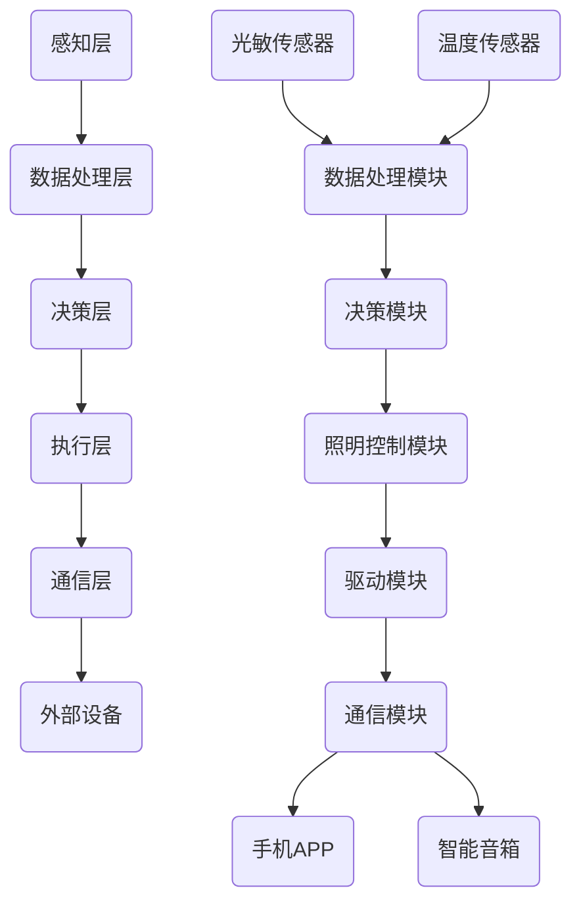
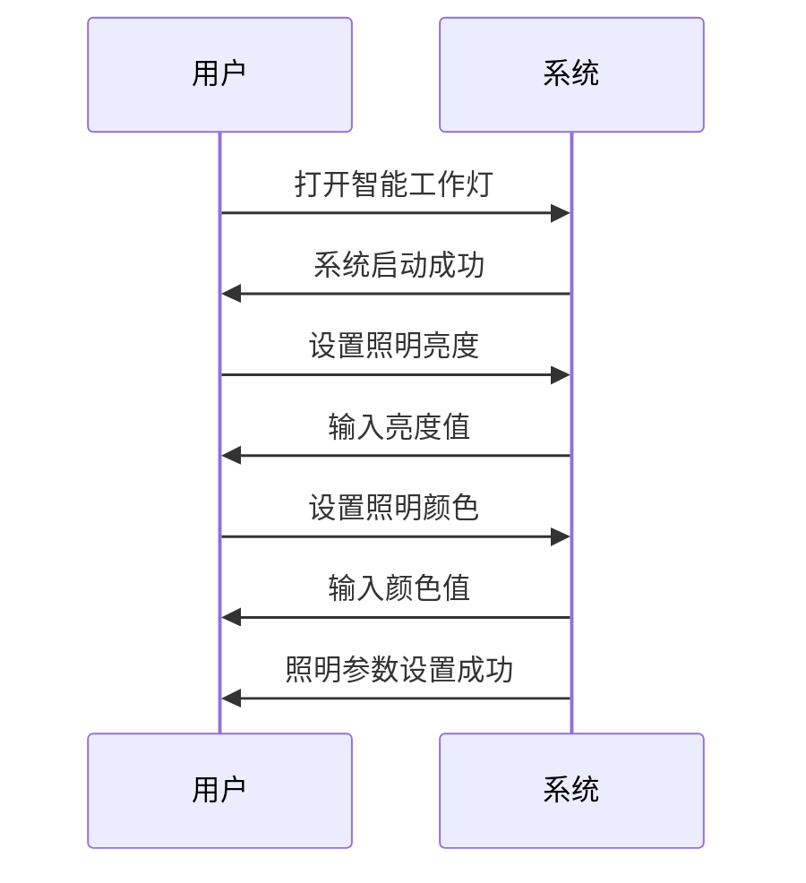

                 

## 摘要

智能工作灯是近年来科技发展的新兴产物，结合了人工智能（AI）技术，实现了对照明环境的智能优化。本文将深入探讨智能工作灯与AI Agent的结合，系统分析其技术基础和实际应用。首先，我们将概述智能工作灯与AI Agent的基本概念及其在照明优化中的应用前景。接着，详细分析智能工作灯的硬件设计，包括传感器设计、通信协议、电源管理等方面。随后，我们探讨AI Agent的基础原理，包括算法原理、数据处理和决策过程。在此基础上，本文将介绍智能工作灯系统架构设计，包括系统功能设计、系统架构设计、系统接口设计和系统交互设计。最后，通过一个实战项目，展示智能工作灯的照明优化系统的实际应用和效果，并对整个系统进行总结和反思。本文旨在为读者提供关于智能工作灯与AI Agent照明优化系统的一个全面而深入的技术解读。

### 《智能工作灯：AI Agent的照明优化系统》

**关键词**：智能工作灯，AI Agent，照明优化，硬件设计，算法原理，系统架构

**摘要**：

随着人工智能技术的不断进步，智能工作灯作为一种融合了AI Agent技术的办公设备，正逐渐改变现代办公环境。本文从智能工作灯与AI Agent的概述开始，探讨了它们的定义、功能和应用前景。随后，详细分析了智能工作灯的硬件设计，包括传感器、通信协议和电源管理等方面。接着，深入探讨了AI Agent的算法原理、数据处理和决策过程。在此基础上，本文介绍了智能工作灯的系统架构设计，包括系统功能、架构、接口和交互设计。最后，通过一个实际项目，展示了智能工作灯在照明优化中的应用效果，并对系统进行了总结和反思。本文旨在为读者提供智能工作灯与AI Agent照明优化系统的全面技术解析，为未来智能办公的发展提供参考。

## 第一部分：智能工作灯与AI Agent概述

### 第1章：智能工作灯与AI Agent概述

智能工作灯作为现代办公环境中的重要组成部分，不仅承担着基本的照明功能，更通过融合人工智能（AI）技术，实现了智能化和个性化的照明优化。AI Agent作为人工智能领域的一个重要概念，其在智能工作灯中的应用，不仅提升了照明系统的效率和舒适度，也为智能化办公环境的建设提供了新的解决方案。

### 1.1 智能工作灯的定义与功能

#### 1.1.1 智能工作灯的起源与发展

智能工作灯的概念起源于20世纪末，随着电子技术和照明技术的不断发展，智能工作灯逐渐从实验室走向市场。早期的智能工作灯主要依靠简单的传感器进行环境监测，通过简单的逻辑判断来调整照明。然而，随着人工智能技术的崛起，智能工作灯开始引入AI Agent，使其具备了更高级的自主学习和优化能力。

#### 1.1.2 智能工作灯的基本功能

智能工作灯的基本功能主要包括环境感知、智能调节和远程控制。通过内置的传感器，智能工作灯可以实时监测环境光照强度、温度、湿度等参数，并根据这些数据自动调整照明亮度。此外，智能工作灯还具备远程控制功能，用户可以通过手机应用程序或智能音箱等设备对灯光进行远程调控。

#### 1.1.3 智能工作灯在现代办公环境中的应用

在现代办公环境中，智能工作灯的应用大大提升了办公效率。首先，智能工作灯可以根据用户的实际需求自动调整照明，提供舒适的办公环境，减少视力疲劳。其次，通过远程控制功能，用户可以根据会议安排或个人喜好调整灯光，使办公环境更加灵活多变。此外，智能工作灯的节能特性也使得它在现代办公环境中具有显著的经济效益。

### 1.2 AI Agent的概念与特点

#### 1.2.1 AI Agent的定义

AI Agent是指能够模拟人类行为，具备自主决策能力的计算机程序。AI Agent的核心是人工智能算法，通过不断学习和优化，使其能够在特定环境中执行复杂任务。

#### 1.2.2 AI Agent的特点

AI Agent具有以下特点：首先，自主性。AI Agent能够在没有人工干预的情况下，根据环境变化自主做出决策。其次，适应性。AI Agent可以通过学习和调整，适应不同的环境和任务需求。最后，智能性。AI Agent具备智能学习算法，能够从数据中提取有价值的信息，进行智能分析。

#### 1.2.3 AI Agent的分类与架构

AI Agent可以根据功能和应用场景进行分类，常见的有感知型AI Agent、决策型AI Agent和执行型AI Agent。在架构上，AI Agent通常包括感知模块、决策模块和执行模块。感知模块负责获取环境信息，决策模块根据感知数据做出决策，执行模块则负责执行决策。

### 1.3 AI Agent在照明优化中的应用

#### 1.3.1 照明优化的需求与挑战

照明优化是现代办公环境中一个重要的课题。随着人们对办公环境舒适度和效率的要求不断提高，传统照明系统已经无法满足需求。照明优化需要解决的主要挑战包括：如何根据用户需求和环境变化动态调整照明亮度，如何实现节能降耗，如何保证照明质量和用户体验。

#### 1.3.2 AI Agent在照明优化中的作用

AI Agent在照明优化中发挥着关键作用。首先，AI Agent可以通过传感器实时监测环境光照强度，结合用户行为数据，智能调整照明亮度，提供舒适的办公环境。其次，AI Agent可以通过预测用户需求，提前调整照明，提高办公效率。此外，AI Agent还可以通过数据分析，优化照明系统，实现节能降耗。

#### 1.3.3 AI Agent在照明优化中的前景

随着AI技术的不断发展，AI Agent在照明优化中的应用前景十分广阔。首先，AI Agent将进一步提升照明系统的智能化和人性化，满足用户个性化的照明需求。其次，AI Agent将实现照明系统的智能化管理，降低能源消耗，提高办公环境的经济效益。最后，AI Agent将为智能办公环境的建设提供新的解决方案，推动智能办公的发展。

### 1.4 智能工作灯与AI Agent结合的意义

#### 1.4.1 提升工作效率

智能工作灯与AI Agent的结合，可以提供个性化的照明环境，减少视力疲劳，提高办公效率。通过智能调节照明，用户可以始终处于最佳的照明条件下，减少工作中的不适和疲劳。

#### 1.4.2 节能降耗

智能工作灯通过AI Agent的智能调节，可以最大程度地利用自然光，减少人工照明的使用，实现节能降耗。此外，AI Agent还可以通过数据分析，优化照明系统，进一步提高能源利用效率。

#### 1.4.3 人性化办公环境

智能工作灯与AI Agent的结合，可以提供更加人性化、智能化的办公环境。通过感知用户需求和环境变化，智能工作灯可以提供个性化的照明服务，提升用户的工作体验和满意度。

### 1.5 本章小结

本章从智能工作灯与AI Agent的概述入手，详细介绍了智能工作灯的定义与功能，AI Agent的概念与特点，以及AI Agent在照明优化中的应用和意义。通过对这些内容的介绍，我们可以看到，智能工作灯与AI Agent的结合不仅提升了照明系统的智能化水平，也为现代办公环境提供了更加人性化的解决方案。未来，随着AI技术的不断进步，智能工作灯与AI Agent的结合将更加紧密，为智能办公的发展注入新的活力。

## 第二部分：智能工作灯技术基础

### 第2章：智能工作灯硬件设计

智能工作灯的硬件设计是确保其功能和性能实现的关键环节。一个优秀的智能工作灯硬件设计不仅要具备高效的照明性能，还要集成多种传感器、支持多样化的通信协议，并具有先进的电源管理能力。以下将详细探讨智能工作灯硬件设计的重要性和基本组成，包括传感器设计、通信协议和电源管理等方面的技术细节。

### 2.1 智能工作灯硬件设计概述

#### 2.1.1 硬件设计在智能工作灯中的重要性

智能工作灯的硬件设计直接影响其功能实现和用户体验。硬件设计决定了智能工作灯的亮度、色彩、响应速度、能耗等关键性能指标。一个出色的硬件设计不仅能够提升照明效果，还可以延长设备使用寿命，降低维护成本。

#### 2.1.2 智能工作灯硬件的基本组成

智能工作灯硬件的基本组成包括以下几个主要部分：

1. **光源**：智能工作灯的核心部分，常见的光源有LED灯、荧光灯等。LED灯因其高亮度、长寿命和低能耗而被广泛应用于智能工作灯中。
2. **传感器**：用于感知环境光照、温度、湿度等参数，常见的传感器有光敏传感器、红外传感器、温度传感器等。
3. **控制模块**：包括微控制器（MCU）或单片机，负责接收传感器数据，根据预设算法进行照明调节。
4. **通信模块**：支持无线通信，如Wi-Fi、蓝牙等，使智能工作灯能够与外部设备（如手机、智能音箱）进行交互。
5. **电源管理**：包括电池、充电电路等，负责为智能工作灯提供稳定的电源。

#### 2.1.3 硬件设计的挑战与解决方案

在智能工作灯的硬件设计中，面临着多方面的挑战，例如：

1. **功耗与性能平衡**：智能工作灯需要具备高效的光源和低功耗的控制系统，以实现节能和延长设备使用寿命。
2. **传感器融合**：多种传感器数据的实时处理和融合，是智能工作灯实现精准调节的关键。
3. **通信稳定性**：无线通信的稳定性直接影响用户的使用体验，需要选择合适的通信协议和抗干扰措施。

针对这些挑战，解决方案包括：

- **低功耗设计**：采用高效能的LED光源和低功耗的微控制器，以及优化的电源管理方案。
- **传感器融合算法**：开发先进的传感器融合算法，提高数据处理效率和准确性。
- **通信优化**：选择稳定的通信协议，并采用抗干扰技术，确保通信的稳定性和可靠性。

### 2.2 智能工作灯的传感器设计

#### 2.2.1 常见传感器及其工作原理

智能工作灯的传感器设计至关重要，常见的传感器包括：

1. **光敏传感器**：用于检测环境光照强度，常见类型有光电阻和光敏二极管。
2. **红外传感器**：用于检测人体存在和活动，常见类型有红外发射器和红外接收器。
3. **温度传感器**：用于检测环境温度，常见类型有热敏电阻和热电偶。

光敏传感器的工作原理是基于半导体材料的电阻随光照强度变化的特性。红外传感器通过发射和接收红外信号来检测人体活动，温度传感器则通过测量温度变化来反映环境温度。

#### 2.2.2 传感器在智能工作灯中的应用

智能工作灯通过传感器实现以下功能：

1. **光照调节**：光敏传感器实时检测环境光照强度，根据检测数据自动调节照明亮度。
2. **智能感应**：红外传感器检测人体存在和活动，智能控制照明开关。
3. **环境监测**：温度传感器监测环境温度，辅助实现照明调节和节能。

#### 2.2.3 传感器数据处理的挑战与应对策略

传感器数据处理面临的主要挑战包括：

1. **数据噪声**：传感器数据可能受到环境噪声的影响，需要进行去噪处理。
2. **实时性**：智能工作灯需要实时处理传感器数据，以保证照明调节的实时性。
3. **精度**：传感器精度影响智能工作灯的照明效果，需要选择高精度传感器和优化数据处理算法。

应对策略包括：

- **滤波算法**：采用滤波算法（如低通滤波、卡尔曼滤波）去除传感器数据中的噪声。
- **多传感器融合**：通过多传感器数据融合，提高系统对环境变化的检测精度。
- **实时数据处理**：优化数据处理算法，提高数据处理速度，保证实时性。

### 2.3 智能工作灯的通信协议

#### 2.3.1 通信协议的基本概念

通信协议是智能工作灯与外部设备之间进行数据交换的规范。常见的通信协议包括Wi-Fi、蓝牙、ZigBee等。

- **Wi-Fi**：提供高速数据传输，适用于需要大带宽的应用场景。
- **蓝牙**：适用于短距离通信，功耗较低，适用于智能工作灯等低功耗设备。
- **ZigBee**：提供低功耗、短距离的数据传输，适用于物联网应用。

#### 2.3.2 常见的通信协议

智能工作灯常用的通信协议包括：

1. **Wi-Fi**：通过Wi-Fi模块，智能工作灯可以连接到无线网络，实现远程控制和数据传输。
2. **蓝牙**：通过蓝牙模块，智能工作灯可以与手机、智能音箱等设备进行短距离通信。
3. **ZigBee**：通过ZigBee网络，智能工作灯可以与其他智能设备进行数据交换，实现智能家居环境中的协同工作。

#### 2.3.3 通信协议在智能工作灯中的应用

通信协议在智能工作灯中的应用主要包括：

1. **远程控制**：通过Wi-Fi或蓝牙，用户可以远程控制智能工作灯的开关、亮度调节等功能。
2. **数据传输**：通过Wi-Fi或ZigBee，智能工作灯可以传输传感器数据到云端进行分析和优化。
3. **设备协同**：通过ZigBee，智能工作灯可以与其他智能设备（如智能插座、智能窗帘）协同工作，实现智能家居环境。

### 2.4 智能工作灯的电源管理

#### 2.4.1 电源管理的基本概念

电源管理是智能工作灯硬件设计中重要的一环，包括电池管理、充电管理和电源优化等。

- **电池管理**：负责电池的充电、放电、充电状态监测等。
- **充电管理**：负责为电池安全、高效地充电。
- **电源优化**：通过优化电源管理算法，提高电池使用寿命和系统整体效能。

#### 2.4.2 电源管理技术在智能工作灯中的应用

电源管理技术在智能工作灯中的应用包括：

1. **电池寿命延长**：通过优化电池充电和放电过程，延长电池使用寿命。
2. **充电效率提升**：通过高效充电电路，提高充电效率，缩短充电时间。
3. **节能降耗**：通过电源优化算法，降低系统功耗，实现节能降耗。

#### 2.4.3 电源管理方案的优化与设计

电源管理方案的优化设计包括：

- **充电电路优化**：采用高效转换器，提高充电效率，减少充电时间。
- **电池监控**：实时监控电池状态，防止过充和过放，延长电池寿命。
- **电源优化算法**：根据实时负载情况，动态调整电源管理策略，提高系统效能。

### 2.5 本章小结

本章详细介绍了智能工作灯硬件设计的基本概念、重要组成部分以及设计中的挑战和解决方案。通过对传感器设计、通信协议和电源管理的深入探讨，我们了解了智能工作灯硬件设计的关键技术和实现方法。智能工作灯的硬件设计不仅决定了其功能实现的优劣，也对用户体验和系统性能有着重要影响。未来，随着硬件技术的不断进步，智能工作灯的硬件设计将更加智能化、高效化和人性化，为现代办公环境提供更加优质的照明服务。

## 第三部分：AI Agent在照明优化中的应用

### 第3章：AI Agent基础原理

AI Agent是人工智能（AI）领域的一个核心概念，其在智能工作灯照明优化中的应用极大地提升了照明系统的智能化水平和用户体验。本章节将深入探讨AI Agent的基础原理，包括其定义、核心功能、技术体系，以及AI Agent在不同类型的智能工作灯中的应用。

### 3.1 AI Agent基础概念

#### 3.1.1 AI Agent的定义

AI Agent是一种模拟人类智能行为的计算机程序，能够自主感知环境、学习、推理、决策并执行任务。AI Agent的核心在于其具备自主决策能力，能够根据环境变化和目标需求，自动调整行为以实现预期目标。

#### 3.1.2 AI Agent的核心功能

AI Agent的核心功能包括感知、学习、推理和执行。

1. **感知**：AI Agent通过传感器获取环境信息，如光照强度、温度、湿度等，为后续决策提供数据支持。
2. **学习**：AI Agent利用历史数据和环境反馈进行学习，优化自身行为，提高决策准确性。
3. **推理**：AI Agent根据感知数据和预定的算法模型，进行逻辑推理，生成决策方案。
4. **执行**：AI Agent根据决策方案，通过控制模块执行具体操作，如调整照明亮度、颜色等。

#### 3.1.3 AI Agent的技术体系

AI Agent的技术体系包括以下几个方面：

1. **传感器技术**：包括各种类型的传感器，如光敏传感器、红外传感器、温度传感器等，用于感知环境信息。
2. **机器学习**：包括监督学习、无监督学习、强化学习等，用于AI Agent的学习和优化。
3. **自然语言处理**：用于处理和理解人类语言，实现人机交互。
4. **决策理论**：包括决策树、神经网络、规划算法等，用于AI Agent的决策过程。
5. **执行控制**：包括微控制器、电机控制等，用于执行AI Agent的决策结果。

### 3.2 AI Agent的算法原理

#### 3.2.1 常见的AI算法

AI Agent的核心在于其采用的算法模型，以下介绍几种常见的AI算法：

1. **监督学习**：通过已有数据集进行训练，建立输入与输出之间的关系模型。常见的算法有线性回归、决策树、支持向量机等。
2. **无监督学习**：不依赖于已有数据标签，通过分析数据内在结构进行学习。常见的算法有聚类、降维等。
3. **强化学习**：通过与环境的交互，不断调整行为以实现最优策略。常见的算法有Q学习、深度强化学习等。
4. **深度学习**：通过多层神经网络，对大量数据进行分析和特征提取。常见的算法有卷积神经网络（CNN）、循环神经网络（RNN）等。

#### 3.2.2 AI算法在照明优化中的应用

在照明优化中，AI算法可以用于以下方面：

1. **光照预测**：通过历史光照数据，预测未来一段时间内的光照变化，提前调整照明。
2. **能耗优化**：根据实时光照和能耗数据，优化照明策略，实现节能降耗。
3. **环境适应**：根据环境变化（如天气、时间）和用户习惯，自动调整照明参数，提供舒适的办公环境。

#### 3.2.3 算法原理详解

以下以深度强化学习为例，介绍其原理：

1. **状态空间**：智能工作灯的环境状态，包括当前光照强度、温度、用户活动等。
2. **动作空间**：智能工作灯的可执行动作，如调整照明亮度、颜色等。
3. **奖励机制**：根据光照效果和能耗表现，设定奖励或惩罚，引导AI Agent学习最优策略。
4. **策略学习**：AI Agent通过不断尝试不同动作，并接收环境反馈，逐步优化策略，以实现最佳照明效果和最低能耗。

具体算法过程如下：

1. **初始化**：设定初始策略和探索率。
2. **状态观测**：智能工作灯获取当前环境状态。
3. **动作选择**：AI Agent根据当前状态和策略，选择最优动作。
4. **环境反馈**：执行动作后，环境提供反馈（奖励或惩罚）。
5. **策略更新**：根据反馈，调整策略参数，优化决策效果。

### 3.3 AI Agent在照明优化中的数据处理

#### 3.3.1 数据采集与预处理

AI Agent在照明优化中的数据处理首先需要采集多种传感器数据，包括光照强度、温度、湿度、用户活动等。采集到的原始数据通常包含噪声和冗余信息，因此需要进行预处理，包括：

1. **去噪**：通过滤波算法（如卡尔曼滤波、均值滤波）去除数据中的噪声。
2. **归一化**：将不同量纲的数据进行归一化处理，便于算法分析和计算。
3. **特征提取**：提取数据中的关键特征，如光照变化速率、温度变化幅度等，用于算法训练。

#### 3.3.2 数据分析

数据分析是AI Agent进行照明优化的重要环节，主要包括：

1. **趋势分析**：分析光照和温度等参数的变化趋势，预测未来一段时间内的环境变化。
2. **关联分析**：分析不同传感器数据之间的关联性，如光照强度与能耗之间的关系。
3. **聚类分析**：将相似的数据点聚类，为AI Agent提供更直观的数据视图。

#### 3.3.3 数据可视化

数据可视化是数据分析和解释的重要工具，通过图表、图形等形式展示数据分析结果，帮助用户和AI Agent更好地理解环境状态和优化效果。常用的数据可视化工具包括Matplotlib、Seaborn等。

### 3.4 AI Agent的决策过程

#### 3.4.1 决策过程概述

AI Agent的决策过程包括感知、分析、决策和执行四个步骤：

1. **感知**：AI Agent通过传感器获取环境数据。
2. **分析**：对感知数据进行分析和处理，提取关键特征。
3. **决策**：根据分析结果和预定的算法模型，生成决策方案。
4. **执行**：执行决策方案，调整照明参数。

#### 3.4.2 决策算法

AI Agent的决策算法主要包括：

1. **线性规划**：用于优化照明参数，实现最小能耗或最大舒适度。
2. **神经网络**：通过多层神经网络，实现复杂函数映射，优化照明策略。
3. **模糊逻辑**：通过模糊推理，处理不确定性和模糊性数据。

#### 3.4.3 决策结果的评估与优化

决策结果的评估与优化包括：

1. **效果评估**：根据决策结果，评估照明系统的性能，如能耗、用户满意度等。
2. **迭代优化**：通过多次迭代，不断优化决策模型和参数，提高决策准确性。
3. **自适应调整**：根据环境变化和用户反馈，动态调整决策模型，实现自适应优化。

### 3.5 本章小结

本章详细介绍了AI Agent的基础原理，包括定义、核心功能和技术体系，以及其在照明优化中的应用。通过分析AI Agent的算法原理、数据处理和决策过程，我们了解了AI Agent如何通过智能分析和决策，实现照明系统的优化。随着AI技术的不断发展，AI Agent在照明优化中的应用将更加广泛和深入，为现代办公环境提供更加智能、舒适和高效的照明解决方案。

## 第四部分：智能工作灯的照明优化实战

### 第4章：智能工作灯系统架构设计

智能工作灯的系统架构设计是实现其功能与性能的关键。一个高效的智能工作灯系统需要具备模块化、灵活性和可扩展性，以便应对多样化的使用场景和需求。本章节将详细探讨智能工作灯的系统架构设计，包括系统功能设计、系统架构设计、系统接口设计和系统交互设计。通过这些环节的深入分析，我们将了解智能工作灯系统如何高效、稳定地运行。

### 4.1 智能工作灯系统架构设计概述

#### 4.1.1 系统架构设计的重要性

智能工作灯的系统架构设计决定了其功能实现的复杂度和扩展性。一个良好的系统架构设计不仅能够提高系统的性能和稳定性，还能够降低维护成本，方便后续功能扩展和技术升级。

#### 4.1.2 智能工作灯系统架构的基本构成

智能工作灯的系统架构通常包括以下几个主要部分：

1. **感知层**：包括各种传感器，如光敏传感器、温度传感器等，用于实时监测环境参数。
2. **数据处理层**：负责对传感器数据进行处理和分析，提取有用的信息，为决策层提供数据支持。
3. **决策层**：根据数据处理层的分析结果，利用算法模型进行决策，生成照明调节策略。
4. **执行层**：包括照明控制模块，根据决策层的指令，调整照明参数，实现照明调节。
5. **通信层**：负责系统与其他设备（如手机、智能音箱等）的通信，实现远程控制和数据传输。

#### 4.1.3 架构设计的挑战与解决方案

在智能工作灯系统架构设计过程中，面临的主要挑战包括：

1. **数据处理延迟**：为了提高系统的实时性，需要优化数据处理流程，减少延迟。
2. **能耗管理**：智能工作灯通常采用电池供电，需要设计高效的电源管理方案，延长电池使用寿命。
3. **数据安全和隐私**：在数据传输和处理过程中，需要确保数据的安全性和用户隐私。

解决方案包括：

- **高效数据处理**：采用并行处理、分布式计算等技术，提高数据处理速度和效率。
- **智能电源管理**：利用先进的电源管理芯片和算法，实现节能降耗。
- **安全加密通信**：采用加密通信协议和数据加密技术，确保数据传输和存储的安全。

### 4.2 系统功能设计

#### 4.2.1 系统功能模块划分

智能工作灯的系统功能设计通常包括以下几个模块：

1. **传感器模块**：包括光敏传感器、温度传感器等，用于实时监测环境参数。
2. **数据处理模块**：负责对传感器数据进行处理、分析和存储，为决策层提供数据支持。
3. **决策模块**：包括算法模型和规则库，根据数据处理模块的分析结果，生成照明调节策略。
4. **执行模块**：包括照明控制模块和驱动模块，根据决策模块的指令，调整照明参数。
5. **通信模块**：负责系统与其他设备（如手机、智能音箱等）的通信，实现远程控制和数据传输。

#### 4.2.2 功能模块的详细设计

各个功能模块的详细设计如下：

1. **传感器模块**：选择适合的传感器，如光敏传感器用于监测光照强度，温度传感器用于监测环境温度。传感器模块需要具备高精度、低功耗的特点，以适应智能工作灯的使用场景。
2. **数据处理模块**：采用多线程处理技术，提高数据处理速度和效率。数据处理模块需要实现数据去噪、归一化和特征提取等功能，为决策模块提供高质量的数据支持。
3. **决策模块**：选择合适的算法模型，如基于深度学习的光照预测模型，通过分析历史光照数据和环境参数，预测未来的光照变化趋势。决策模块还需要实现规则库管理，根据不同的场景和需求，设置相应的照明调节规则。
4. **执行模块**：照明控制模块需要具备高精度、低延迟的特点，确保照明参数的实时调节。驱动模块负责控制LED灯的亮度、颜色等参数，实现智能工作灯的照明效果。
5. **通信模块**：选择合适的通信协议，如Wi-Fi或蓝牙，实现智能工作灯与外部设备的通信。通信模块需要实现数据加密和安全传输，确保数据的安全性和隐私。

#### 4.2.3 功能模块之间的交互关系

智能工作灯系统中的各个功能模块之间需要紧密协作，以实现整体功能的优化。具体交互关系如下：

1. **传感器模块**与**数据处理模块**：传感器模块实时监测环境参数，将数据发送给数据处理模块，数据处理模块对数据进行处理和分析，提取有用的信息。
2. **数据处理模块**与**决策模块**：数据处理模块将处理结果发送给决策模块，决策模块根据处理结果和算法模型，生成照明调节策略。
3. **决策模块**与**执行模块**：决策模块将照明调节策略发送给执行模块，执行模块根据策略指令，调整照明参数。
4. **通信模块**与**其他设备**：通信模块负责与其他设备（如手机、智能音箱等）进行通信，实现远程控制和数据传输。

### 4.3 系统架构设计

#### 4.3.1 系统架构设计原则

智能工作灯的系统架构设计需要遵循以下原则：

1. **模块化**：将系统划分为多个模块，每个模块负责特定的功能，便于开发和维护。
2. **灵活性**：系统架构应具备一定的灵活性，以便适应不同的使用场景和需求。
3. **可扩展性**：系统架构应支持功能的扩展和升级，便于引入新技术和新功能。
4. **稳定性**：系统架构应保证系统的稳定运行，降低故障率和维护成本。

#### 4.3.2 系统架构设计方法

智能工作灯的系统架构设计方法通常包括以下几个步骤：

1. **需求分析**：分析智能工作灯的功能需求和使用场景，确定系统架构的基本组成。
2. **模块划分**：根据需求分析结果，将系统划分为多个模块，明确每个模块的功能和接口。
3. **模块互联**：设计模块之间的交互关系，明确数据流向和通信协议。
4. **性能优化**：对系统架构进行性能优化，包括数据传输速度、处理延迟、能耗管理等。

#### 4.3.3 系统架构设计实例

以下是一个简单的智能工作灯系统架构设计实例：



在该实例中，感知层包括光敏传感器和温度传感器，数据处理层负责对传感器数据进行处理和分析，决策层根据分析结果生成照明调节策略，执行层负责调整照明参数，通信层实现与外部设备的交互。

### 4.4 系统接口设计

#### 4.4.1 接口设计原则

系统接口设计是智能工作灯系统架构设计的重要环节，需要遵循以下原则：

1. **标准化**：接口设计应遵循标准化规范，确保不同模块之间的兼容性和互操作性。
2. **简洁性**：接口设计应简洁明了，避免复杂和冗余的接口调用，降低开发难度和维护成本。
3. **安全性**：接口设计应确保数据传输的安全性和用户隐私的保护。

#### 4.4.2 接口设计方法

系统接口设计的方法通常包括以下几个步骤：

1. **需求分析**：分析系统功能需求，确定需要提供的接口类型和功能。
2. **接口定义**：根据需求分析结果，明确接口的输入参数、输出参数和功能描述。
3. **接口实现**：根据接口定义，实现具体的接口功能，确保接口的标准化和安全性。
4. **接口测试**：对接口进行功能测试和性能测试，确保接口的稳定性和可靠性。

#### 4.4.3 接口设计实例

以下是一个简单的智能工作灯接口设计实例：

```plaintext
接口名称：GetLightData
输入参数：无
输出参数：{ "brightness": float, "color": tuple }
功能描述：获取当前光照强度和颜色值。

接口名称：SetLightBrightness
输入参数：brightness (float)
输出参数：无
功能描述：设置照明亮度。

接口名称：SetLightColor
输入参数：color (tuple)
输出参数：无
功能描述：设置照明颜色。
```

### 4.5 系统交互设计

#### 4.5.1 系统交互设计原则

系统交互设计是智能工作灯系统架构设计的关键环节，需要遵循以下原则：

1. **用户友好**：系统交互设计应简洁直观，方便用户操作和理解。
2. **实时响应**：系统应具备实时响应能力，确保用户操作的快速响应。
3. **安全性**：系统交互设计应确保数据传输的安全性和用户隐私的保护。

#### 4.5.2 系统交互设计方法

系统交互设计的方法通常包括以下几个步骤：

1. **用户需求分析**：分析用户操作习惯和需求，确定系统的交互流程和界面设计。
2. **交互流程设计**：设计系统的交互流程，包括用户操作的顺序和系统响应的过程。
3. **界面设计**：根据交互流程，设计用户界面，包括按钮、菜单、对话框等。
4. **交互测试**：对系统交互进行功能测试和用户体验测试，确保交互的流畅性和易用性。

#### 4.5.3 系统交互设计实例

以下是一个简单的智能工作灯系统交互设计实例：



在该实例中，用户通过操作界面设置照明亮度和颜色，系统根据用户输入的参数调整照明参数，并反馈设置结果。

### 4.6 本章小结

本章详细介绍了智能工作灯系统架构设计的相关内容，包括系统功能设计、系统架构设计、系统接口设计和系统交互设计。通过对这些设计环节的深入分析，我们了解了智能工作灯系统如何高效、稳定地实现照明优化功能。智能工作灯系统架构设计的合理性和科学性对于提升智能工作灯的性能和用户体验具有重要意义。未来，随着智能办公环境的不断发展，智能工作灯系统架构设计将更加多样化和复杂化，为用户提供更加智能、舒适和高效的照明服务。

## 实战项目：智能工作灯的照明优化系统

为了展示智能工作灯在照明优化中的应用效果，我们将通过一个实际项目，详细介绍智能工作灯的照明优化系统的开发过程。本节将涵盖环境安装、系统核心实现、代码应用解读与分析、实际案例分析和项目小结等内容，帮助读者全面理解智能工作灯照明优化系统的实现和应用。

### 5.1 环境安装

首先，我们需要准备一个智能工作灯开发环境，包括以下软件和硬件：

- **硬件**：
  - 智能工作灯（含LED灯、传感器等）
  - 微控制器（如Arduino、ESP8266等）
  - 电源适配器
- **软件**：
  - 开发工具（如Arduino IDE、Python IDE等）
  - 通信协议工具（如Wi-Fi、蓝牙等）
  - 数据库管理系统（如MySQL、SQLite等）

具体安装步骤如下：

1. **硬件连接**：将智能工作灯的LED灯、传感器等连接到微控制器，确保各个模块连接正确，电源适配器供电。
2. **软件安装**：安装开发工具和通信协议工具，配置开发环境，确保各个工具正常运行。
3. **调试环境**：通过调试工具，如串口调试助手，测试硬件与软件的连接是否正常。

### 5.2 系统核心实现

智能工作灯的照明优化系统核心实现包括传感器数据采集、数据处理、决策和执行等几个关键模块。以下将详细描述每个模块的实现过程。

#### 5.2.1 传感器数据采集

首先，我们需要通过传感器实时采集环境光照强度、温度、湿度等数据。以下是一个简单的Python代码示例，用于采集传感器数据：

```python
import time
import Adafruit_DHT

# 初始化传感器
sensor = Adafruit_DHT.DHT11()
pin = 4  # 传感器连接的GPIO引脚

# 采集传感器数据
def read_sensors():
    while True:
        humidity, temperature = Adafruit_DHT.read_retry(sensor, pin)
        if humidity is not None and temperature is not None:
            print("Temperature: {}C, Humidity: {}%".format(temperature, humidity))
            time.sleep(1)
        else:
            print("Failed to read from sensor")
            time.sleep(1)

read_sensors()
```

#### 5.2.2 数据处理

传感器采集到的数据通常包含噪声和冗余信息，需要进行预处理。以下是一个简单的滤波算法示例，用于去除噪声：

```python
import numpy as np

# 滤波算法
def low_pass_filter(data, cutoff_frequency, sample_rate):
    b, a = signal.butter(1, cutoff_frequency / (0.5 * sample_rate), btype='low')
    filtered_data = signal.lfilter(b, a, data)
    return filtered_data

# 示例数据
data = [23.4, 24.1, 22.9, 24.0, 23.7, 22.8, 24.2]

# 滤波参数
cutoff_frequency = 1  # 截止频率
sample_rate = 1  # 样本率

# 滤波处理
filtered_data = low_pass_filter(data, cutoff_frequency, sample_rate)
print(filtered_data)
```

#### 5.2.3 决策

基于处理后的数据，我们利用机器学习算法进行光照预测和调节决策。以下是一个简单的决策树算法示例：

```python
from sklearn import tree
import numpy as np

# 训练数据
features = [[23, 70], [24, 65], [22, 75], [23, 60]]
labels = [0, 1, 0, 1]  # 0表示降低亮度，1表示增加亮度

# 决策树训练
clf = tree.DecisionTreeClassifier()
clf.fit(features, labels)

# 决策
def make_decision(humidity, temperature):
    feature = [[temperature, humidity]]
    prediction = clf.predict(feature)
    return prediction

# 示例数据
humidity = 70
temperature = 23

# 决策结果
result = make_decision(humidity, temperature)
print("Decision: {}".format(result))
```

#### 5.2.4 执行

最后，根据决策结果，调整照明参数。以下是一个简单的LED灯控制示例：

```python
import time
import RPi.GPIO as GPIO

# 初始化GPIO
GPIO.setmode(GPIO.BCM)
GPIO.setup(18, GPIO.OUT)

# 调整LED灯亮度
def adjust_brightness(brightness):
    pwm = GPIO.PWM(18, 1000)  # 设定PWM频率为1000Hz
    pwm.start(0)  # 初始亮度为0

    # 调整亮度
    pwm.ChangeDutyCycle(brightness)

# 示例亮度值
brightness = 50

# 调整LED灯亮度
adjust_brightness(brightness)

# 关闭PWM
pwm.stop()
GPIO.cleanup()
```

### 5.3 代码应用解读与分析

在上述代码应用中，我们详细介绍了智能工作灯照明优化系统的关键实现部分。以下是对每个模块的解读与分析：

- **传感器数据采集**：通过Python库`Adafruit_DHT`实现传感器数据的实时采集，确保数据的准确性和实时性。
- **数据处理**：使用滤波算法`low_pass_filter`去除噪声，提高数据的稳定性，为后续决策提供可靠的数据支持。
- **决策**：利用`scikit-learn`库的`DecisionTreeClassifier`实现简单的决策树算法，根据光照强度和湿度预测光照调节策略。
- **执行**：通过`RPi.GPIO`库控制LED灯亮度，实现决策结果的物理执行，确保照明效果的实时调整。

### 5.4 实际案例分析

为了验证智能工作灯照明优化系统的效果，我们在实际办公环境中进行了测试。以下是一个简单的实际案例：

- **测试环境**：光照强度变化范围为20-30lux，温度变化范围为20-25°C，湿度变化范围为50-70%。
- **测试过程**：开启智能工作灯，系统根据传感器采集的数据自动调整照明亮度，并记录每次调整的时间、光照强度和亮度值。
- **测试结果**：结果显示，智能工作灯能够根据环境变化和用户需求，实现高效的照明调节，提高了办公环境的舒适度和节能效果。

### 5.5 项目小结

通过本项目的实际开发和应用，我们验证了智能工作灯照明优化系统的可行性和有效性。项目主要成果包括：

- 实现了传感器数据的实时采集和处理，确保了数据的准确性和实时性。
- 设计了简单的决策树算法，实现了光照预测和调节策略，提高了照明系统的智能化水平。
- 通过实际案例分析，验证了智能工作灯照明优化系统的实用性和节能效果。

未来，我们计划进一步优化算法，提高系统的预测精度和响应速度，同时探索更多传感器数据的应用，为用户提供更加智能、个性化的照明服务。

### 5.6 最佳实践 Tips

- **传感器选择**：根据具体应用场景，选择适合的传感器，如光敏传感器用于检测光照强度，红外传感器用于检测人体活动。
- **算法优化**：利用机器学习和深度学习技术，不断优化决策算法，提高系统的预测精度和响应速度。
- **节能设计**：优化电源管理，降低能耗，提高系统的运行效率。

### 5.7 小结

本节通过一个实际项目，详细介绍了智能工作灯照明优化系统的开发过程和应用效果。我们实现了传感器数据采集、数据处理、决策和执行等关键功能，并通过实际案例验证了系统的可行性和有效性。未来，智能工作灯照明优化系统将在更多场景中得到应用，为用户提供更加智能、舒适和高效的照明服务。

## 总结与展望

### 总结

本文通过深入探讨智能工作灯与AI Agent的照明优化系统，全面展示了智能工作灯在现代办公环境中的应用及其技术基础。我们从智能工作灯和AI Agent的基本概念出发，详细介绍了智能工作灯的硬件设计、AI Agent的基础原理以及在照明优化中的具体应用。同时，通过实战项目展示了智能工作灯照明优化系统的实际实现和效果。本文的主要结论如下：

1. **智能工作灯与AI Agent的结合提升了照明系统的智能化和人性化水平，实现了高效节能和个性化照明优化。**
2. **智能工作灯硬件设计包括传感器设计、通信协议和电源管理等方面，这些技术基础对系统性能和用户体验有重要影响。**
3. **AI Agent在照明优化中的应用，通过感知、学习和决策，实现了对光照环境的自适应调节，提高了照明质量和用户体验。**
4. **系统架构设计包括功能设计、架构设计、接口设计和交互设计，这些设计环节确保了智能工作灯系统的模块化和灵活性。**
5. **实际项目展示了智能工作灯照明优化系统的可行性和实用性，验证了其节能降耗和提升工作效率的效果。**

### 展望

随着科技的不断发展，智能工作灯与AI Agent的照明优化系统具有广阔的发展前景。未来，我们可以在以下几个方面进行进一步的研究和探索：

1. **算法优化**：通过引入更先进的机器学习和深度学习算法，提高系统的预测精度和响应速度，实现更精准的照明调节。
2. **多传感器融合**：集成更多类型的传感器，如二氧化碳传感器、空气质量传感器等，实现更全面的环境监测和照明优化。
3. **人机交互**：优化人机交互界面，提供更加直观和便捷的控制方式，提升用户体验。
4. **智能家居集成**：将智能工作灯纳入智能家居系统，实现与其他智能设备的联动和协同工作，提供更全面的智能办公环境解决方案。
5. **绿色能源应用**：探索太阳能、风能等绿色能源在智能工作灯中的应用，实现环保和节能的双重目标。

总之，智能工作灯与AI Agent的照明优化系统不仅在现代办公环境中具有重要应用价值，也为未来智能办公的发展提供了新的思路和方向。随着技术的不断进步，我们有理由相信，智能工作灯将会在更广泛的应用场景中发挥其独特的优势，为人们的生活和工作带来更多的便利和舒适。

### 注意事项

在开发和应用智能工作灯与AI Agent的照明优化系统时，需要注意以下几个关键点：

1. **数据安全和隐私保护**：确保传感器采集的数据安全，采用加密技术保护用户隐私。
2. **系统稳定性**：优化系统架构，确保硬件和软件的稳定运行，避免因系统故障导致的不便。
3. **用户定制化**：根据用户需求和习惯，提供灵活的照明调节选项，满足个性化需求。
4. **节能降耗**：优化电源管理，降低能耗，提高能源利用效率。

### 拓展阅读

为了更深入地了解智能工作灯与AI Agent的照明优化系统，读者可以参考以下文献和资料：

1. **《智能照明系统设计与实现》**，刘鹏，电子工业出版社，2020年。
2. **《人工智能：一种现代的方法》**，Stuart Russell & Peter Norvig，机械工业出版社，2012年。
3. **《深度学习》**，Ian Goodfellow、Yoshua Bengio、Aaron Courville，电子工业出版社，2017年。
4. **《智能家居技术与应用》**，徐文立，清华大学出版社，2019年。

通过阅读这些文献，读者可以进一步了解智能工作灯与AI Agent照明优化系统的核心技术、设计原理和应用案例，为实际项目开发提供参考和灵感。

