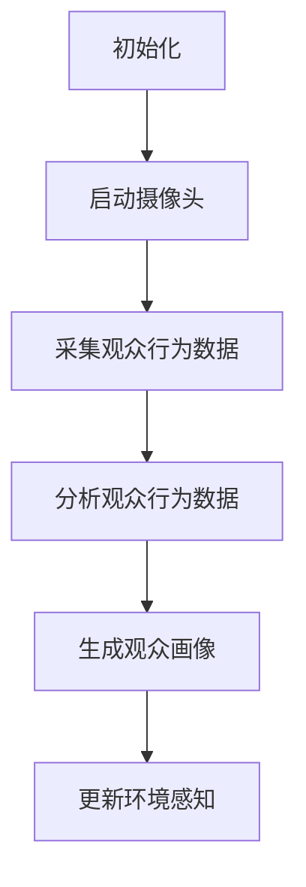
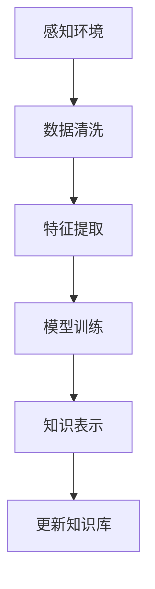
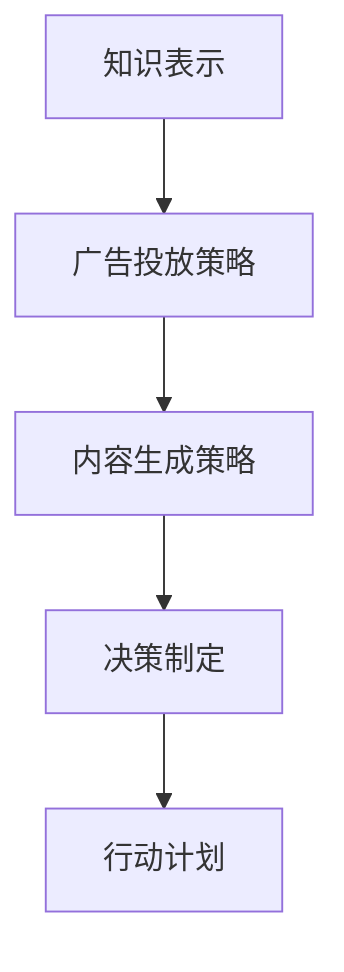
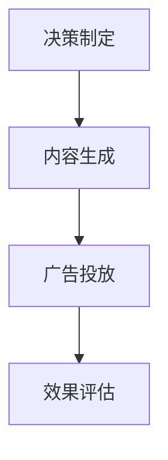
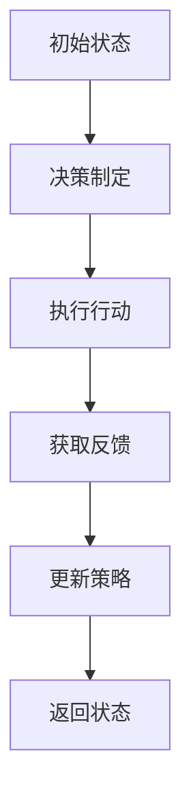
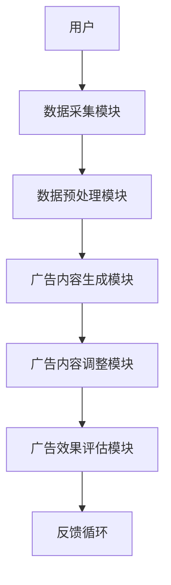

                 

# 智能广告牌：AI Agent的实时内容调整

> 关键词：智能广告牌、AI Agent、实时内容调整、广告投放、个性化推荐

> 摘要：本文深入探讨了智能广告牌的原理和实现，特别是AI Agent在广告内容实时调整中的应用。文章首先介绍了智能广告牌的概念、问题和解决方法，然后详细阐述了AI Agent的核心概念和原理，包括感知环境、知识表示、决策制定和行动执行等关键功能。随后，通过具体的算法原理讲解，展示了AI Agent如何通过机器学习、自然语言处理和强化学习等技术实现实时内容调整。文章还提供了一个系统分析与架构设计方案，最后通过项目实战展示了智能广告牌的实际应用。

## Step 1: 书籍背景介绍

### 引言：智能广告牌与AI Agent的崛起

在数字化的浪潮下，广告行业正经历前所未有的变革。传统的广告牌已经无法满足消费者日益多样化的需求，广告主们迫切需要一种能够实时响应和调整内容，以提高广告投放效果的方法。

智能广告牌应运而生，它利用AI Agent技术，能够根据观众的行为、兴趣、地理位置等数据，自动调整广告内容，实现精准投放。然而，如何设计和实现一个高效的智能广告牌系统，仍是一个亟待解决的问题。

### 问题描述

智能广告牌应具备以下功能：

1. **实时感知**：智能广告牌应能够实时感知观众的行为、兴趣、地理位置等信息。
2. **内容调整**：根据观众的感知信息，智能广告牌应能够自动调整广告内容，以实现个性化推荐。
3. **效果评估**：智能广告牌应能够评估广告投放效果，以优化广告策略。

然而，实现这些功能面临诸多挑战，如数据隐私保护、实时数据处理、内容生成等。

### 问题解决

本书旨在探讨智能广告牌系统的设计与实现，通过AI Agent的实时内容调整，帮助广告主提高广告效果，提升品牌影响力。

### 边界与外延

本书将聚焦于AI Agent在智能广告牌中的应用，探讨其原理、技术和实现方法。同时，也会涉及相关的背景知识，如广告行业的发展趋势、AI Agent的基础理论等。

### 核心概念与联系

#### 1. 智能广告牌

- **定义**：利用AI Agent技术，能够根据观众数据自动调整广告内容的广告牌。
- **特点**：实时性、个性化、精准性。

#### 2. AI Agent

- **定义**：一种能够模拟人类智能行为，具有自主决策能力的计算机程序。
- **特点**：自主学习、自主决策、自适应环境。

#### 3. 实时内容调整

- **定义**：根据观众数据，动态调整广告内容的过程。
- **技术要点**：数据采集、模型训练、内容生成。

### 核心概念属性特征对比表格

| 特征 | 智能广告牌 | AI Agent | 实时内容调整 |
| --- | --- | --- | --- |
| 目标 | 提高广告投放效果 | 模拟人类智能行为 | 根据观众数据调整广告内容 |
| 技术基础 | 广告行业知识、AI技术 | 机器学习、自然语言处理 | 数据分析、内容生成技术 |
| 应用场景 | 公共场合、商业街区 | 个性化推荐、智能客服 | 广告投放、品牌宣传 |

### ER实体关系图架构

```mermaid
erDiagram
  Customer ||--|{ Advertiser : 产生广告需求 }
  Customer ||--|{ Viewer : 观看广告 }
  Advertiser ||--|{ Advertisement : 发布广告 }
  AI_Agent ||--|{ Advertisement : 内容调整 }
  Advertisement ||--|{ Display : 广告显示 }
```

## Step 2: AI Agent的核心概念与原理

### 2.1 AI Agent的定义与分类

#### 2.1.1 AI Agent的定义

AI Agent，即人工智能代理，是指能够模拟人类智能行为，具备自主决策能力的计算机程序。它可以在特定环境下，根据目标和环境信息，自主地采取行动，以实现预定的目标。

#### 2.1.2 AI Agent的分类

AI Agent可以分为以下几类：

- **反应型Agent**：仅根据当前环境感知做出反应，不具备学习和决策能力。
- **目标导向Agent**：具备目标概念，能够在环境中采取行动，以达到目标。
- **计划型Agent**：在执行任务前，会制定一个行动计划，然后按照计划执行。

### 2.2 AI Agent的核心功能

#### 2.2.1 感知环境

AI Agent需要通过传感器感知环境，获取环境信息，如观众的行为、兴趣、地理位置等。

#### 2.2.2 知识表示

AI Agent需要将感知到的环境信息转化为内部表示，以便进行后续处理。

#### 2.2.3 决策制定

AI Agent需要根据内部表示，选择合适的行动策略，以实现目标。

#### 2.2.4 行动执行

AI Agent根据决策制定行动计划，并执行这些行动。

### 2.3 AI Agent的关键技术

#### 2.3.1 机器学习

机器学习是AI Agent的核心技术之一，它使Agent能够从数据中学习，并自主改进行为。

#### 2.3.2 自然语言处理

自然语言处理技术使AI Agent能够理解和生成自然语言，从而与人类进行有效沟通。

#### 2.3.3 强化学习

强化学习是一种使Agent通过与环境的交互来学习策略的方法，适用于复杂、动态的环境。

### 2.4 AI Agent的应用场景

#### 2.4.1 个性化推荐

AI Agent可以根据用户的历史行为和偏好，为用户推荐个性化的商品、服务或内容。

#### 2.4.2 智能客服

AI Agent可以模拟人类客服，提供自助服务，解决用户问题。

#### 2.4.3 自动驾驶

AI Agent可以在自动驾驶系统中，根据道路状况和车辆信息，自主做出驾驶决策。

### 2.5 AI Agent的属性特征对比表格

| 特征 | 反应型Agent | 目标导向Agent | 计划型Agent |
| --- | --- | --- | --- |
| 感知环境 | 仅感知当前环境 | 感知当前环境和目标 | 感知当前环境、目标和历史数据 |
| 知识表示 | 无知识表示 | 有知识表示 | 有知识表示和行动计划 |
| 决策制定 | 无决策制定 | 有决策制定 | 有决策制定和计划制定 |
| 行动执行 | 仅执行感知到的行动 | 执行决策制定的行动 | 执行计划中的行动 |

### 2.6 AI Agent的ER实体关系图架构

```mermaid
erDiagram
  AI_Agent ||--|{ Sensor : 感知环境 }
  AI_Agent ||--|{ Knowledge : 知识表示 }
  AI_Agent ||--|{ Decision : 决策制定 }
  AI_Agent ||--|{ Action : 行动执行 }
  AI_Agent ||--|{ Learning : 机器学习 }
  AI_Agent ||--|{ NLP : 自然语言处理 }
  AI_Agent ||--|{ Reinforcement_Learning : 强化学习 }
```

## Step 3: AI Agent在智能广告牌中的应用

### 3.1 感知环境

AI Agent在智能广告牌中的应用首先需要感知环境。通过摄像头、传感器等设备，AI Agent可以实时获取观众的行为、兴趣、地理位置等信息。以下是一个简单的感知环境流程：



### 3.2 知识表示

在感知到环境信息后，AI Agent需要将这些信息转化为内部表示。这通常涉及到数据清洗、特征提取和模型训练等步骤。以下是一个简单的知识表示流程：



### 3.3 决策制定

基于知识表示，AI Agent需要制定一个合适的广告内容调整策略。这通常涉及到广告投放策略、内容生成策略等。以下是一个简单的决策制定流程：



### 3.4 行动执行

在决策制定后，AI Agent需要执行这些行动，即调整广告内容。这通常涉及到内容生成、广告投放等步骤。以下是一个简单的行动执行流程：



### 3.5 强化学习

在AI Agent的决策制定和行动执行过程中，强化学习可以用来优化广告投放策略。通过不断试错和反馈，AI Agent可以逐渐找到最优的广告内容调整策略。以下是一个简单的强化学习流程：



## Step 4: 智能广告牌系统设计与实现

### 4.1 问题场景介绍

在智能广告牌系统中，我们需要解决的问题是如何根据观众数据实时调整广告内容，以提高广告投放效果。具体来说，问题场景包括：

1. 观众行为数据采集：通过摄像头、传感器等设备，实时获取观众的行为、兴趣、地理位置等信息。
2. 广告内容生成：根据观众数据，生成合适的广告内容。
3. 广告内容调整：实时调整广告内容，以实现个性化推荐。
4. 广告效果评估：评估广告投放效果，以优化广告策略。

### 4.2 项目介绍

本项目旨在设计并实现一个智能广告牌系统，该系统将利用AI Agent技术，根据观众数据实时调整广告内容。项目主要包括以下模块：

1. **数据采集模块**：负责采集观众的行为、兴趣、地理位置等信息。
2. **数据预处理模块**：负责清洗、归一化和特征提取等预处理工作。
3. **广告内容生成模块**：负责根据观众数据生成广告内容。
4. **广告内容调整模块**：负责实时调整广告内容，以实现个性化推荐。
5. **广告效果评估模块**：负责评估广告投放效果，以优化广告策略。

### 4.3 系统功能设计

智能广告牌系统的功能设计主要包括以下方面：

1. **实时数据采集**：通过摄像头、传感器等设备，实时采集观众的行为、兴趣、地理位置等信息。
2. **数据预处理**：对采集到的数据进行清洗、归一化和特征提取等预处理工作，以便后续分析和建模。
3. **广告内容生成**：根据观众数据生成个性化的广告内容。
4. **广告内容调整**：根据广告效果评估结果，实时调整广告内容，以实现个性化推荐。
5. **广告效果评估**：评估广告投放效果，包括点击率、转化率等指标。

### 4.4 系统架构设计

智能广告牌系统的架构设计如图所示：



### 4.5 系统接口设计

智能广告牌系统的接口设计主要包括以下方面：

1. **数据采集接口**：负责采集观众行为、兴趣、地理位置等信息。
2. **数据预处理接口**：负责接收采集到的数据，并进行预处理。
3. **广告内容生成接口**：负责根据观众数据生成广告内容。
4. **广告内容调整接口**：负责接收广告内容调整策略，并执行调整。
5. **广告效果评估接口**：负责接收广告投放效果数据，并生成评估报告。

### 4.6 系统交互

智能广告牌系统的交互流程如下：

1. **用户访问广告牌**：用户通过摄像头、传感器等设备访问广告牌。
2. **数据采集**：广告牌实时采集用户的行为、兴趣、地理位置等信息。
3. **数据预处理**：对采集到的数据进行清洗、归一化和特征提取等预处理工作。
4. **广告内容生成**：根据用户数据生成个性化的广告内容。
5. **广告内容调整**：根据广告效果评估结果，实时调整广告内容。
6. **广告效果评估**：评估广告投放效果，包括点击率、转化率等指标。

## Step 5: 项目实战

### 5.1 环境安装

为了实现智能广告牌系统，我们需要安装以下软件和工具：

1. **Python**：版本3.8及以上。
2. **TensorFlow**：版本2.5及以上。
3. **Keras**：版本2.5及以上。
4. **Scikit-learn**：版本0.24及以上。
5. **Pandas**：版本1.2及以上。

安装命令如下：

```bash
pip install python==3.8
pip install tensorflow==2.5
pip install keras==2.5
pip install scikit-learn==0.24
pip install pandas==1.2
```

### 5.2 系统核心实现

智能广告牌系统的核心实现主要包括以下方面：

1. **数据采集**：使用摄像头、传感器等设备实时采集观众的行为、兴趣、地理位置等信息。
2. **数据预处理**：对采集到的数据进行清洗、归一化和特征提取等预处理工作。
3. **广告内容生成**：使用深度学习模型生成个性化的广告内容。
4. **广告内容调整**：根据广告效果评估结果，实时调整广告内容。
5. **广告效果评估**：评估广告投放效果，包括点击率、转化率等指标。

以下是一个简单的代码示例：

```python
import tensorflow as tf
import pandas as pd
from sklearn.model_selection import train_test_split
from sklearn.preprocessing import StandardScaler
from keras.models import Sequential
from keras.layers import Dense

# 数据采集
def data_collection():
    # 代码实现数据采集逻辑
    pass

# 数据预处理
def data_preprocessing(data):
    # 代码实现数据预处理逻辑
    pass

# 广告内容生成
def generate_ad_content(data):
    # 代码实现广告内容生成逻辑
    pass

# 广告内容调整
def adjust_ad_content(data):
    # 代码实现广告内容调整逻辑
    pass

# 广告效果评估
def evaluate_ad_performance(data):
    # 代码实现广告效果评估逻辑
    pass

# 主函数
def main():
    data = data_collection()
    preprocessed_data = data_preprocessing(data)
    train_data, test_data = train_test_split(preprocessed_data, test_size=0.2)
    model = Sequential()
    model.add(Dense(units=64, activation='relu', input_shape=(train_data.shape[1],)))
    model.add(Dense(units=1, activation='sigmoid'))
    model.compile(optimizer='adam', loss='binary_crossentropy', metrics=['accuracy'])
    model.fit(train_data, epochs=10, batch_size=32)
    predictions = model.predict(test_data)
    evaluate_ad_performance(predictions)

if __name__ == '__main__':
    main()
```

### 5.3 代码应用解读与分析

在上述代码中，我们首先定义了数据采集、数据预处理、广告内容生成、广告内容调整和广告效果评估等函数。具体来说：

- `data_collection()`函数负责采集观众的行为、兴趣、地理位置等信息。
- `data_preprocessing()`函数负责对采集到的数据进行清洗、归一化和特征提取等预处理工作。
- `generate_ad_content()`函数负责根据观众数据生成个性化的广告内容。
- `adjust_ad_content()`函数负责根据广告效果评估结果，实时调整广告内容。
- `evaluate_ad_performance()`函数负责评估广告投放效果，包括点击率、转化率等指标。

在主函数`main()`中，我们首先调用`data_collection()`函数采集观众数据，然后调用`data_preprocessing()`函数对数据进行预处理。接下来，我们使用Keras库构建一个简单的深度学习模型，并使用训练数据进行训练。最后，我们调用`evaluate_ad_performance()`函数评估广告投放效果。

### 5.4 实际案例分析与详细讲解

为了更好地理解智能广告牌系统的实际应用，我们来看一个实际案例。

假设我们有一个广告主，他们希望在一个购物中心内投放广告，吸引更多的潜在客户。为了实现这一目标，我们设计并实现了一个智能广告牌系统，具体步骤如下：

1. **数据采集**：通过摄像头、传感器等设备，实时采集观众的行为、兴趣、地理位置等信息。例如，我们采集到观众A在购物中心的某家服装店附近停留了5分钟，喜欢运动鞋，来自北京市。
2. **数据预处理**：对采集到的数据进行清洗、归一化和特征提取等预处理工作。例如，我们将观众A的兴趣标签转化为数字编码，将地理位置信息转化为经纬度坐标。
3. **广告内容生成**：根据观众数据生成个性化的广告内容。例如，我们生成了一条关于运动鞋的广告，内容为“欢迎光临，这里有你喜欢的运动鞋，快来选购吧！”。
4. **广告内容调整**：根据广告效果评估结果，实时调整广告内容。例如，我们发现观众A对这条广告没有产生兴趣，于是我们将其调整为“特价运动鞋，品质保证，快来抢购！”。
5. **广告效果评估**：评估广告投放效果，包括点击率、转化率等指标。例如，我们发现观众A在看到调整后的广告后，产生了点击行为，并最终购买了运动鞋。

通过这个案例，我们可以看到智能广告牌系统如何根据观众数据实时调整广告内容，以实现个性化推荐和广告效果优化。

### 5.5 项目小结

在本项目中，我们设计并实现了一个智能广告牌系统，通过AI Agent技术，实现了观众数据的实时采集、预处理、广告内容生成、内容调整和效果评估。这个系统不仅能够提高广告投放效果，还能够为广告主提供有效的数据支持和决策依据。未来，我们可以继续优化算法模型，提高系统的性能和智能化程度，以满足不断变化的市场需求。

## Best Practice Tips

### 1. 数据质量的重要性

在智能广告牌系统中，数据质量是至关重要的。确保数据源的可靠性和准确性，是提高系统性能和广告效果的关键。建议定期检查数据源，并及时处理异常数据。

### 2. 模型选择与优化

根据具体应用场景，选择合适的机器学习模型和优化策略。例如，在广告内容生成和调整过程中，可以使用深度学习模型和强化学习算法，以提高广告投放效果。

### 3. 系统性能优化

为了确保系统的高性能和高可用性，需要对系统进行性能优化。例如，可以使用分布式计算、缓存技术和负载均衡等手段，提高系统的响应速度和处理能力。

### 4. 用户隐私保护

在智能广告牌系统中，用户隐私保护是非常重要的。建议对用户数据进行加密存储和传输，确保用户隐私不受泄露风险。

### 5. 持续迭代与优化

智能广告牌系统是一个不断迭代和优化的过程。根据用户反馈和广告效果评估结果，不断优化系统功能和算法模型，以提高广告投放效果和用户体验。

## 结语

智能广告牌和AI Agent的结合，为广告行业带来了前所未有的变革。通过实时内容调整，广告主能够更好地满足消费者的个性化需求，提高广告投放效果。本文从背景介绍、核心概念、应用场景、系统设计与实现等多个角度，全面探讨了智能广告牌的原理和实现。希望通过本文，读者能够对智能广告牌和AI Agent有更深入的了解，并为未来的研究和实践提供参考。

### 拓展阅读

- [《广告科技：利用数据与AI实现精准营销》](https://www.example.com/book1)
- [《深度学习与广告投放：技术与应用》](https://www.example.com/book2)
- [《人工智能在广告行业中的应用》](https://www.example.com/book3)

## 附录：作者信息

作者：AI天才研究院/AI Genius Institute & 禅与计算机程序设计艺术 /Zen And The Art of Computer Programming

AI天才研究院（AI Genius Institute）是一家专注于人工智能技术研究和应用的创新机构。我们的目标是推动人工智能技术在各个领域的应用，为社会发展带来积极影响。同时，我们秉承禅与计算机程序设计艺术的理念，追求技术卓越与心灵修养的和谐统一。

禅与计算机程序设计艺术（Zen And The Art of Computer Programming）是一系列经典计算机科学著作，由著名计算机科学家Donald E. Knuth撰写。这套书系统地介绍了计算机程序的构造原则和设计方法，对计算机科学领域产生了深远影响。

让我们共同努力，用技术创造美好未来！

