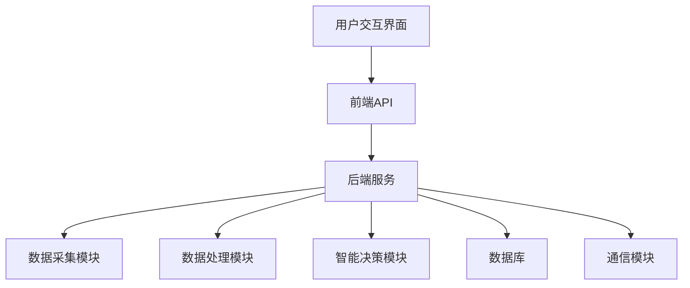

                 

### 智能晾衣架：现状与未来

智能晾衣架作为智能家居的一个重要分支，已经逐渐进入了大众的日常生活。它不仅简化了晾晒衣物的过程，还通过先进的人工智能技术实现了衣物护理与天气适应，提升了用户体验。本章节将深入探讨智能晾衣架的定义、分类、市场需求、AI Agent的基本原理及其在智能晾衣架中的应用，以及天气适应算法在智能晾衣架中的重要性。

#### 1.1 智能晾衣架的定义与分类

智能晾衣架，顾名思义，是一种结合了现代科技与智能家居概念的设备。它不仅具备传统晾衣架的基本功能，还能够通过传感器、物联网技术以及人工智能算法实现自动控制和优化操作。智能晾衣架可以分类为以下几类：

1. **电动晾衣架**：通过电机驱动实现衣物的升降和摇摆功能，可以手动或通过遥控器控制。
2. **无线充电晾衣架**：具备无线充电功能，可以给带有无线充电功能的衣物或配件充电。
3. **智能感应晾衣架**：通过传感器实时监测天气状况，自动调节晾衣动作，避免衣物在潮湿天气中受潮。
4. **AI 智能晾衣架**：集成了人工智能算法，能够根据天气、湿度、温度等多种因素，自动调整晾衣策略，实现最优的衣物护理效果。

#### 1.2 智能晾衣架的市场需求

随着科技的进步和人们生活水平的提高，智能晾衣架的市场需求也在不断增长。根据市场研究数据显示，全球智能家居市场规模预计将从 2019 年的 3359 亿美元增长到 2025 年的 5321 亿美元，年复合增长率为 12.1%。智能晾衣架作为智能家居的重要一环，市场份额也在逐年提升。

在市场需求方面，以下是几个关键驱动因素：

1. **便捷性**：智能晾衣架能够自动完成衣物晾晒，大大减少了用户的劳动强度。
2. **节省空间**：相比传统晾衣架，智能晾衣架更加节省空间，尤其适合城市家庭使用。
3. **天气适应**：智能晾衣架能够根据天气变化自动调整晾衣动作，避免衣物因天气原因受潮或晒伤。
4. **智能化体验**：随着人工智能技术的普及，用户对智能家居设备的智能化要求越来越高，智能晾衣架正好满足了这一需求。

#### 1.3 AI Agent与智能晾衣架

AI Agent，即人工智能代理，是一种能够模拟人类智能行为，自主完成特定任务的计算机程序。在智能晾衣架中，AI Agent通过传感器收集数据，利用机器学习算法进行分析，然后根据分析结果自动调整晾衣策略。

AI Agent在智能晾衣架中的应用主要体现在以下几个方面：

1. **环境感知**：AI Agent能够实时监测温度、湿度、风速等环境参数，根据这些数据调整晾衣动作。
2. **智能决策**：基于天气预测和衣物特性，AI Agent能够为用户推荐最佳的晾衣时间和方法。
3. **自我学习**：通过不断收集用户的使用数据，AI Agent能够逐步优化晾衣策略，提升用户体验。

#### 1.4 天气适应在智能晾衣架中的重要性

天气适应是智能晾衣架的一个重要功能。不同天气条件下，衣物的晾晒效果有所不同。例如，在潮湿天气中，衣物容易受潮发霉；而在高温干燥天气中，衣物容易晒伤。智能晾衣架通过AI Agent实现天气适应，能够根据实时天气数据自动调整晾衣策略，确保衣物晾晒效果最佳。

天气适应算法在智能晾衣架中的重要性体现在以下几个方面：

1. **提升衣物护理效果**：通过智能调整晾衣策略，能够确保衣物在最佳状态下晾晒，减少衣物损伤。
2. **节省能源**：智能晾衣架能够在不需要晾晒时自动停止工作，节省能源消耗。
3. **提升用户体验**：智能晾衣架能够根据用户需求自动调整，提供个性化的晾衣服务，提升用户满意度。

### 小结

智能晾衣架作为智能家居的重要组成部分，已经展现了其强大的市场潜力和应用价值。通过结合AI Agent和天气适应算法，智能晾衣架能够实现更高的智能化水平和更优质的用户体验。在接下来的章节中，我们将深入探讨智能晾衣架的基本原理、系统设计与实现，以及在不同场景下的应用案例，为读者提供全面的了解。

----------------------------------------------------------------

#### 2.1 智能晾衣架的基本原理

智能晾衣架的核心在于其智能化和自动化的特点。要理解其基本原理，我们首先需要从物理原理和智能技术两个方面进行探讨。

##### 2.1.1 物理原理

智能晾衣架的物理原理主要涉及机械结构和电子控制两部分。机械结构包括支架、挂杆、电机、传感器等部件，而电子控制则涉及微控制器、无线通信模块等。

1. **支架与挂杆**：支架是智能晾衣架的支撑结构，通常采用金属或塑料材料制作。挂杆则是用于悬挂衣物的部件，通过滑轮和轴承连接到支架，能够实现上下移动。

2. **电机**：电机是智能晾衣架的核心驱动部件，常见的有直流电机和交流电机。电机通过旋转驱动挂杆的上下移动，从而实现衣物的晾晒。

3. **传感器**：传感器用于检测环境参数，如温度、湿度、风速等。常见的传感器有温湿度传感器、风速传感器等。传感器收集的数据将传递给微控制器，以实现智能决策。

4. **微控制器**：微控制器是智能晾衣架的“大脑”，它接收传感器数据，进行数据处理和决策，然后发送指令给电机，实现晾衣动作的自动化控制。

##### 2.1.2 智能技术

智能晾衣架的智能化体现在其具备自主决策和自适应能力。这主要依赖于人工智能技术和物联网技术。

1. **人工智能技术**：人工智能技术，特别是机器学习和深度学习，使得智能晾衣架能够通过大量历史数据进行分析和预测。通过训练模型，AI 能够识别不同的天气条件和衣物类型，从而制定最佳的晾衣策略。

2. **物联网技术**：物联网技术使得智能晾衣架能够与其他智能设备进行互联互通。例如，智能晾衣架可以通过Wi-Fi或蓝牙与手机APP连接，实现远程控制和数据同步。同时，物联网技术还允许智能晾衣架接入智能家居系统，与其他设备协同工作。

##### 2.1.3 智能晾衣架的运作流程

智能晾衣架的运作流程可以概括为以下几个步骤：

1. **数据采集**：传感器实时采集温度、湿度、风速等环境数据。

2. **数据处理**：微控制器接收传感器数据，通过人工智能算法进行分析和判断，识别当前的天气条件和衣物类型。

3. **决策生成**：基于数据分析结果，AI Agent生成最佳的晾衣策略，包括晾晒时间、晾晒方式等。

4. **指令执行**：微控制器根据决策生成指令，驱动电机进行相应的动作，如升降挂杆、调整摇摆速度等。

5. **反馈与优化**：系统在执行过程中不断收集数据，通过机器学习算法不断优化晾衣策略，以提高用户体验。

##### 2.1.4 智能晾衣架的主要部件

智能晾衣架的主要部件包括：

1. **电机**：负责升降和摇摆动作，是晾衣架的核心动力来源。

2. **传感器**：包括温湿度传感器、风速传感器等，用于检测环境参数，为AI算法提供数据支持。

3. **微控制器**：作为系统的控制核心，负责接收传感器数据、执行AI算法决策、驱动电机等。

4. **人机交互界面**：如触摸屏、遥控器等，用于用户与智能晾衣架的交互。

5. **通信模块**：如Wi-Fi、蓝牙等，用于实现远程控制和数据同步。

##### 2.1.5 智能晾衣架的优势与挑战

智能晾衣架的优势主要体现在以下几个方面：

1. **便捷性**：用户无需手动操作，可以远程控制或设置定时功能，实现自动晾晒。

2. **智能化**：通过AI技术，智能晾衣架能够根据天气和环境条件自动调整晾晒策略，提升衣物护理效果。

3. **节能环保**：智能晾衣架能够在不需要工作时自动停止，节省能源。

然而，智能晾衣架也面临一些挑战：

1. **成本问题**：高性能的传感器和AI算法需要较高的硬件和软件成本。

2. **稳定性问题**：智能晾衣架需要在各种天气条件下稳定运行，对系统的稳定性要求较高。

3. **用户体验问题**：用户对智能设备的接受度和使用习惯可能影响智能晾衣架的普及率。

### 小结

智能晾衣架的基本原理涉及物理结构和智能技术两大方面。通过电机、传感器、微控制器等硬件部件的协同工作，结合人工智能算法，智能晾衣架实现了自动化的衣物护理和天气适应。在接下来的章节中，我们将进一步探讨AI Agent的概念及其在智能晾衣架中的应用，以及天气适应算法的具体实现。

----------------------------------------------------------------

#### 2.2 AI Agent原理

AI Agent，即人工智能代理，是智能系统中的一种自主决策实体，能够模拟人类智能行为，完成特定任务。AI Agent在智能晾衣架中的应用，使得设备能够根据环境变化和用户需求，自动调整晾衣策略，从而实现更加智能化和个性化的服务。

##### 2.2.1 AI Agent的定义

AI Agent是一种具有以下特征的计算机程序：

1. **自主性**：AI Agent能够自主地选择行动，不受外部直接控制。
2. **目标导向**：AI Agent在执行任务时，会根据预定的目标进行决策。
3. **适应性**：AI Agent能够根据环境变化和反馈，不断调整自己的行为策略。
4. **协作性**：AI Agent可以与其他Agent或人类进行协作，共同完成任务。

##### 2.2.2 AI Agent在智能晾衣架中的应用

在智能晾衣架中，AI Agent的主要作用是环境感知、智能决策和自主执行。以下是AI Agent在智能晾衣架中的应用：

1. **环境感知**：AI Agent通过传感器收集温度、湿度、风速等环境数据，实时监测天气变化。这些数据用于评估当前的晾衣条件。

2. **智能决策**：基于收集到的数据，AI Agent利用机器学习算法进行分析，识别当前的天气条件和衣物类型。例如，当温度较高、湿度较低时，AI Agent可能会选择快速晾晒策略；而在阴雨天气中，AI Agent可能会选择延迟晾晒，以避免衣物受潮。

3. **自主执行**：AI Agent根据决策结果，生成具体的晾衣指令，驱动电机进行相应的动作，如升降挂杆、调整摇摆速度等。这些指令确保了晾衣过程的高效和精准。

##### 2.2.3 AI Agent的工作流程

AI Agent在智能晾衣架中的工作流程可以概括为以下几个步骤：

1. **数据采集**：传感器收集温度、湿度、风速等环境数据。

2. **数据处理**：AI Agent接收传感器数据，通过特征提取和预处理，为后续分析做准备。

3. **环境分析**：AI Agent利用机器学习算法，对环境数据进行分析，识别当前的天气条件和衣物类型。

4. **决策生成**：基于环境分析结果，AI Agent生成最佳的晾衣策略，包括晾晒时间、晾晒方式等。

5. **指令执行**：AI Agent生成具体的晾衣指令，通过控制模块驱动电机执行相应动作。

6. **反馈与优化**：AI Agent在执行过程中，持续收集用户反馈和系统运行数据，通过机器学习算法不断优化晾衣策略。

##### 2.2.4 AI Agent的优势与挑战

AI Agent在智能晾衣架中具有明显的优势：

1. **智能化**：AI Agent能够根据环境变化和用户需求，自动调整晾衣策略，提高衣物护理效果。
2. **个性化**：通过不断学习和优化，AI Agent可以提供个性化的晾衣服务，满足不同用户的需求。
3. **自适应**：AI Agent能够根据环境变化和反馈，动态调整行为策略，确保系统的高效运行。

然而，AI Agent也面临一些挑战：

1. **数据质量**：AI Agent的性能依赖于传感器收集的数据质量，数据不准确或缺失会影响决策效果。
2. **计算资源**：AI Agent的决策和执行过程需要大量的计算资源，特别是在复杂环境中，对系统的性能和稳定性提出了较高要求。
3. **用户适应性**：用户对AI Agent的接受度和使用习惯可能影响系统的普及率。

### 小结

AI Agent是智能晾衣架实现智能化和自动化的重要技术手段。通过环境感知、智能决策和自主执行，AI Agent能够根据环境变化和用户需求，自动调整晾衣策略，提供高效的衣物护理服务。在接下来的章节中，我们将探讨天气适应算法的基本原理，进一步了解智能晾衣架的智能决策过程。

----------------------------------------------------------------

#### 2.3 天气适应算法

天气适应算法是智能晾衣架实现智能化和高效操作的关键技术。通过分析实时天气数据，天气适应算法能够为智能晾衣架提供最佳的晾衣策略，从而确保衣物得到最佳的护理效果。以下是天气适应算法的基本原理、实现步骤及其在智能晾衣架中的应用。

##### 2.3.1 基本原理

天气适应算法的基本原理是通过实时监测天气参数（如温度、湿度、风速、降雨概率等），并结合历史数据和机器学习模型，预测未来的天气状况，并据此调整晾衣策略。核心思想是确保衣物在不同天气条件下都能得到适当的护理，避免因天气因素导致的衣物损伤。

1. **数据收集**：通过传感器和天气预报服务，收集实时天气数据和历史天气数据。
2. **数据处理**：对收集到的天气数据进行预处理，包括数据清洗、归一化、特征提取等，以便进行后续分析。
3. **模型训练**：使用历史天气数据训练机器学习模型，如回归模型、分类模型等，预测未来的天气状况。
4. **策略生成**：根据预测结果，生成最优的晾衣策略，包括晾晒时间、晾晒方式等。

##### 2.3.2 实现步骤

1. **数据采集**：智能晾衣架通过温湿度传感器、风速传感器、紫外线传感器等设备，实时采集环境数据。同时，还可以接入天气预报API，获取实时和预测天气信息。

2. **数据处理**：对采集到的天气数据进行预处理。例如，对于温度和湿度数据，可以进行归一化处理，以便模型能够更好地识别和预测。

3. **模型选择**：选择合适的机器学习模型进行训练。常见的模型包括线性回归、决策树、随机森林、神经网络等。根据具体应用场景，选择最适合的模型。

4. **模型训练**：使用历史天气数据对模型进行训练，使其能够学会识别和预测天气状况。训练过程中，可以使用交叉验证、网格搜索等技术，优化模型参数。

5. **策略生成**：基于训练好的模型，生成最优的晾衣策略。例如，当预测未来几小时内降雨概率较高时，可以提前关闭晾衣架，避免衣物受潮。

6. **策略执行**：将生成的策略转换为具体的执行指令，如调整晾衣时间、设置晾衣温度等。这些指令通过微控制器发送给电机和其他执行部件。

7. **反馈与优化**：在执行策略的过程中，智能晾衣架会持续收集反馈数据，如实际晾晒效果、用户满意度等。通过这些数据，可以进一步优化策略，提高系统的自适应能力和用户体验。

##### 2.3.3 在智能晾衣架中的应用

天气适应算法在智能晾衣架中的应用主要体现在以下几个方面：

1. **自动调整晾晒时间**：根据预测的天气状况，自动调整晾晒时间，确保衣物在最佳天气条件下晾晒。

2. **智能选择晾晒方式**：根据天气条件，选择不同的晾晒方式，如快速晾晒、慢速晾晒、阴雨天气晾晒等。

3. **避免潮湿环境**：在潮湿天气中，智能晾衣架可以延迟晾晒或关闭，避免衣物受潮发霉。

4. **节能环保**：在不需要晾晒时，智能晾衣架可以自动关闭，节省能源。

##### 2.3.4 案例分析

假设一个智能晾衣架接入了当地的天气预报API，并通过传感器收集实时天气数据。在预测到未来几小时内降雨概率较高时，系统会自动调整晾晒计划，选择延迟晾晒或开启烘干功能。如果衣物已经部分晾干，系统可能会将晾衣架调整到阴凉干燥处，避免衣物受潮。

另一个例子是，在阳光强烈的夏季，系统可能会选择在早晨或傍晚温度较低时进行晾晒，以避免衣物在高温下受损。通过这些智能策略，智能晾衣架能够提供高效、个性化的晾衣服务。

### 小结

天气适应算法是智能晾衣架实现智能化和高效操作的重要手段。通过实时监测天气数据、训练机器学习模型和生成优化策略，智能晾衣架能够根据不同天气条件自动调整晾衣策略，确保衣物得到最佳护理效果。在接下来的章节中，我们将深入探讨智能晾衣架的系统设计与实现，了解其硬件设计、软件架构和AI算法的具体实现。

----------------------------------------------------------------

### 3.1 硬件设计

智能晾衣架的硬件设计是其实现自动化和智能化操作的基础。一个完整的智能晾衣架硬件系统通常包括电机、传感器、微控制器、通信模块、人机交互界面等关键部件。以下是智能晾衣架硬件设计的主要组件和选型策略。

##### 3.1.1 电机

电机是智能晾衣架的核心动力部件，负责升降和摇摆动作。选择电机时，需要考虑以下几个因素：

1. **类型**：常见的电机有直流电机（DC Motor）和交流电机（AC Motor）。直流电机控制简单，成本较低，适合家庭使用；而交流电机功率较大，效率更高，适合商业场景。
2. **功率**：根据晾衣架的负载和动作需求，选择合适的电机功率。一般家用智能晾衣架选用低功率电机即可，商业用则需要高功率电机。
3. **响应速度**：电机响应速度应满足晾衣动作的需求，确保能够快速响应微控制器的指令。

##### 3.1.2 传感器

传感器用于实时监测环境参数，如温度、湿度、风速等，为AI算法提供数据支持。选择传感器时，需要考虑以下几个因素：

1. **精度**：传感器的精度直接影响到AI算法的准确性。选择高精度传感器可以确保环境数据的准确性。
2. **稳定性**：传感器应具有良好的长期稳定性，避免由于环境变化导致的误差积累。
3. **功耗**：传感器的功耗应尽可能低，以延长智能晾衣架的电池寿命或减少能源消耗。

常见传感器包括：
- **温湿度传感器**：用于测量空气中的温度和湿度，常见的有DHT22、HTU21D等。
- **风速传感器**：用于测量风速，常见的有热线风速传感器、超声波风速传感器等。
- **紫外线传感器**：用于检测紫外线强度，常见的有硅光电二极管传感器等。

##### 3.1.3 微控制器

微控制器（Microcontroller Unit, MCU）是智能晾衣架的“大脑”，负责接收传感器数据、执行AI算法决策、驱动电机等。选择微控制器时，需要考虑以下几个因素：

1. **处理能力**：微控制器的处理能力应足够强大，能够处理传感器数据和执行复杂的AI算法。
2. **外设接口**：微控制器应具有丰富的外设接口，如I2C、SPI、UART等，以连接各种传感器和驱动模块。
3. **功耗**：为了延长电池寿命或降低能耗，微控制器的功耗应尽可能低。

常见的微控制器包括：
- **Arduino**：适用于简单的项目，提供丰富的开发资源和社区支持。
- **STM32**：具有强大的处理能力和丰富的外设接口，适合复杂的智能晾衣架设计。
- **ESP32**：集成了Wi-Fi和蓝牙功能，适合需要无线通信的智能晾衣架。

##### 3.1.4 通信模块

通信模块用于实现智能晾衣架与其他设备或云端的连接。常见的通信模块包括Wi-Fi模块、蓝牙模块、Zigbee模块等。选择通信模块时，需要考虑以下几个因素：

1. **稳定性**：通信模块应具有良好的稳定性，确保数据传输的可靠性和实时性。
2. **功耗**：通信模块的功耗应尽可能低，以延长智能晾衣架的电池寿命。
3. **安全性**：通信模块应具备加密功能，确保数据传输的安全性和隐私性。

##### 3.1.5 人机交互界面

人机交互界面（Human-Machine Interface, HMI）用于用户与智能晾衣架的交互。常见的人机交互界面包括触摸屏、按键、遥控器等。选择人机交互界面时，需要考虑以下几个因素：

1. **易用性**：界面应简洁易用，用户能够快速理解和使用。
2. **可靠性**：界面应具有较好的耐用性和抗干扰能力，确保在恶劣环境下仍能正常工作。
3. **扩展性**：界面应具有扩展性，能够支持未来功能升级和新增功能。

##### 3.1.6 硬件设计的挑战与解决方案

硬件设计过程中，可能会面临以下挑战：

1. **功耗问题**：智能晾衣架通常需要长时间运行，功耗是一个重要考虑因素。解决方案是选择低功耗的传感器和微控制器，并优化电路设计，减少不必要的功耗。
2. **稳定性问题**：传感器和通信模块在恶劣环境下可能会出现故障，影响系统的稳定性。解决方案是选择高质量、高稳定性的组件，并设计冗余系统，确保在单个组件失效时系统能够自动切换。
3. **可靠性问题**：智能晾衣架需要在各种天气条件下稳定运行，可靠性至关重要。解决方案是进行充分的系统测试和验证，确保系统在各种条件下都能稳定运行。

### 小结

智能晾衣架的硬件设计是其实现智能化和自动化操作的基础。通过合理选择电机、传感器、微控制器、通信模块和人机交互界面等硬件组件，并结合优化电路设计和系统测试，可以确保智能晾衣架在各种条件下都能稳定、高效地运行。在接下来的章节中，我们将进一步探讨智能晾衣架的软件架构和AI算法实现。

----------------------------------------------------------------

### 3.2 软件架构

智能晾衣架的软件架构是实现其功能的核心部分，需要确保高效的数据处理、智能决策和用户交互。一个典型的软件架构应包括数据采集模块、数据处理模块、智能决策模块和用户交互界面。以下是智能晾衣架软件架构的详细描述。

##### 3.2.1 数据采集模块

数据采集模块负责收集来自传感器的数据，如温度、湿度、风速、紫外线强度等。该模块的主要功能包括：

1. **数据采集**：从传感器读取实时数据，并将数据转换为数字信号。
2. **数据预处理**：对采集到的数据进行分析和过滤，去除噪声和异常值，确保数据的质量。
3. **数据缓存**：将预处理后的数据缓存到数据库或内存中，以便后续处理和分析。

##### 3.2.2 数据处理模块

数据处理模块负责对采集到的数据进行分析和处理，为智能决策模块提供支持。该模块的主要功能包括：

1. **数据存储**：将预处理后的数据存储到数据库中，以便长期存储和查询。
2. **数据清洗**：进一步处理数据，包括缺失值填充、异常值检测和修正等。
3. **数据可视化**：通过图表和报表，将数据转换为易于理解的形式，帮助用户和决策模块进行数据分析和解读。
4. **数据挖掘**：利用机器学习和数据挖掘技术，从大量数据中提取有价值的信息和模式，为智能决策提供支持。

##### 3.2.3 智能决策模块

智能决策模块是智能晾衣架的核心部分，负责根据采集到的数据和用户需求，生成最优的晾衣策略。该模块的主要功能包括：

1. **环境分析**：分析实时数据和环境参数，识别当前的天气状况和衣物状态。
2. **策略生成**：基于环境分析和用户需求，生成最佳的晾衣策略，包括晾晒时间、晾晒方式、温度控制等。
3. **决策优化**：利用机器学习和优化算法，不断优化晾衣策略，提高系统的自适应能力和用户体验。
4. **反馈学习**：收集用户反馈和实际晾晒效果数据，通过机器学习算法进行学习，进一步优化决策模型。

##### 3.2.4 用户交互界面

用户交互界面（User Interface, UI）用于用户与智能晾衣架的交互，提供友好的操作体验。该模块的主要功能包括：

1. **界面设计**：设计直观、易用的界面，使用户能够轻松操作和设置。
2. **操作控制**：提供各种操作选项，如设置晾晒时间、调整温度、查看晾衣状态等。
3. **实时反馈**：显示实时数据和环境状况，如温度、湿度、风速等，以及晾衣进度和策略。
4. **消息通知**：通过手机APP或其他通信方式，向用户发送实时消息和通知，如晾晒完成通知、天气预警等。

##### 3.2.5 系统架构设计

智能晾衣架的软件架构设计应遵循模块化、可扩展和可维护的原则。以下是一个典型的软件架构设计：

1. **前端界面**：用于用户交互，包括Web界面和手机APP。
2. **后端服务**：包括数据采集模块、数据处理模块、智能决策模块等，负责数据收集、处理和决策。
3. **数据库**：存储传感器数据、用户数据和策略数据。
4. **通信模块**：负责与传感器、用户设备和云端服务的通信。


在软件架构设计中，各个模块之间通过API进行通信，确保系统的高效性和可维护性。同时，为了提高系统的稳定性和可靠性，可以采用分布式架构和容错机制。

##### 3.2.6 系统架构图

以下是智能晾衣架的软件架构图，展示了各个模块之间的关系和通信方式：



### 小结

智能晾衣架的软件架构设计是确保其高效、智能和用户友好的关键。通过合理划分模块、设计清晰的接口和采用先进的算法技术，智能晾衣架能够根据实时数据和用户需求，自动调整晾衣策略，提供最佳的衣物护理服务。在接下来的章节中，我们将深入探讨智能晾衣架的AI算法实现，了解其核心算法原理和具体实现过程。

----------------------------------------------------------------

### 3.3 AI算法实现

智能晾衣架的AI算法是实现其智能决策和天气适应功能的核心。以下我们将详细介绍AI算法的设计思路、实现步骤和关键代码，并通过具体的Python代码示例进行解释。

##### 3.3.1 算法设计思路

智能晾衣架的AI算法设计思路可以分为以下几个步骤：

1. **数据收集与预处理**：收集温度、湿度、风速等环境数据，并对数据进行预处理，如数据清洗、归一化和特征提取。
2. **模型选择与训练**：选择合适的机器学习模型，如线性回归、决策树、随机森林等，利用历史数据对模型进行训练。
3. **策略生成与优化**：根据模型预测结果，生成最优的晾衣策略，如晾晒时间、晾晒方式等，并通过用户反馈进行策略优化。
4. **实时决策与反馈**：在晾衣过程中，实时监测环境数据，根据实时数据调整策略，并收集用户反馈，不断优化系统性能。

##### 3.3.2 实现步骤

1. **数据收集与预处理**：
    - 收集实时天气数据和历史天气数据，如温度、湿度、风速等。
    - 数据清洗，去除噪声和异常值。
    - 数据归一化，将不同量纲的数据转换为同一量纲，便于模型训练。
    - 特征提取，提取有助于模型训练的特征，如天气变化的趋势、周期性等。

2. **模型选择与训练**：
    - 选择合适的机器学习模型，如线性回归、决策树、随机森林等。
    - 使用历史数据对模型进行训练，调整模型参数，优化模型性能。
    - 验证模型的准确性和泛化能力，确保模型在实际应用中的有效性。

3. **策略生成与优化**：
    - 根据模型预测结果，生成最优的晾衣策略，如晾晒时间、晾晒方式等。
    - 考虑用户需求和环境条件，动态调整策略，确保衣物得到最佳护理。
    - 收集用户反馈，分析用户满意度，不断优化策略。

4. **实时决策与反馈**：
    - 在晾衣过程中，实时监测环境数据，根据实时数据调整策略。
    - 收集用户反馈，如衣物干燥程度、用户满意度等，用于系统优化。
    - 通过机器学习算法，不断更新和优化模型，提高系统性能。

##### 3.3.3 关键代码

以下是智能晾衣架AI算法的关键代码示例，使用Python实现：

```python
import pandas as pd
from sklearn.model_selection import train_test_split
from sklearn.ensemble import RandomForestRegressor
from sklearn.metrics import mean_squared_error

# 1. 数据收集与预处理
data = pd.read_csv('weather_data.csv')  # 读取天气数据
data.dropna(inplace=True)  # 去除缺失值

# 数据归一化
data_normalized = (data - data.mean()) / data.std()

# 特征提取
data_normalized['temp_diff'] = data_normalized['temp'] - data_normalized['temp_yesterday']
data_normalized['hum_diff'] = data_normalized['hum'] - data_normalized['hum_yesterday']

# 2. 模型选择与训练
X = data_normalized[['temp', 'hum', 'temp_diff', 'hum_diff']]
y = data_normalized['dry_time']  # 预测变量：晾晒时间

X_train, X_test, y_train, y_test = train_test_split(X, y, test_size=0.2, random_state=42)
model = RandomForestRegressor(n_estimators=100)
model.fit(X_train, y_train)

# 3. 策略生成与优化
y_pred = model.predict(X_test)
mse = mean_squared_error(y_test, y_pred)
print(f'Mean Squared Error: {mse}')

# 4. 实时决策与反馈
def predict_dry_time(temp, hum):
    temp_diff = temp - data_normalized['temp'].mean()
    hum_diff = hum - data_normalized['hum'].mean()
    dry_time = model.predict([[temp, hum, temp_diff, hum_diff]])
    return dry_time

# 示例：预测晾晒时间
predicted_dry_time = predict_dry_time(25, 60)
print(f'Predicted Dry Time: {predicted_dry_time}')
```

此代码示例实现了以下功能：

1. 数据收集与预处理：从CSV文件中读取天气数据，去除缺失值，进行归一化和特征提取。
2. 模型选择与训练：使用随机森林回归模型，利用历史数据训练模型。
3. 策略生成与优化：通过模型预测晾晒时间，计算均方误差（MSE），评估模型性能。
4. 实时决策与反馈：根据实时环境数据（温度和湿度），预测晾晒时间。

##### 3.3.4 算法原理讲解

1. **随机森林回归模型**：随机森林（Random Forest）是一种集成学习模型，由多个决策树组成。每个决策树独立训练，最后通过投票方式得出预测结果。随机森林具有较好的泛化能力和鲁棒性，适合处理非线性关系和复杂数据。

2. **特征提取**：特征提取是机器学习中的重要步骤，目的是从原始数据中提取有助于模型训练的特征。在本例中，通过计算温度差和湿度差，增加了数据的变化趋势信息，有助于模型捕捉天气变化的规律。

3. **预测与评估**：通过模型预测晾晒时间，并计算均方误差（MSE），评估模型性能。MSE越小，表示模型预测越准确。

4. **实时决策**：基于实时环境数据，通过模型预测晾晒时间，为智能晾衣架提供决策支持。

##### 3.3.5 例子

假设当前温度为25℃，湿度为60%，使用上述模型预测晾晒时间。代码示例中的`predict_dry_time`函数将返回预测的晾晒时间。

```python
predicted_dry_time = predict_dry_time(25, 60)
print(f'Predicted Dry Time: {predicted_dry_time}')
```

输出结果可能为`Predicted Dry Time: 3`，表示预测的晾晒时间为3小时。

##### 小结

智能晾衣架的AI算法通过数据收集与预处理、模型选择与训练、策略生成与优化、实时决策与反馈等步骤，实现了对晾衣过程的智能控制。通过Python代码示例，我们了解了随机森林回归模型的应用、特征提取方法和实时决策过程。在接下来的章节中，我们将介绍智能晾衣架在实际应用中的案例，分析其在不同场景下的表现。

----------------------------------------------------------------

### 4.1 家庭场景应用

在家庭场景中，智能晾衣架通过其便捷性和智能化特点，已经成为许多家庭提升生活质量的理想选择。以下是几个典型的家庭场景应用，以及用户反馈和优化建议。

#### 4.1.1 应用一：提升家务效率

家庭用户最直观的需求是减少家务劳动，智能晾衣架在这方面表现出色。用户可以通过手机APP远程控制晾衣架，无需亲自操作。例如，用户可以在早晨出门前，通过手机APP启动智能晾衣架，设定晾晒时间和方式，回家后即可穿上晾晒好的衣物。

**用户反馈**：许多用户表示，智能晾衣架大大减轻了家务负担，节省了大量时间，尤其是在恶劣天气中，用户不再需要担心衣物晾晒问题。

**优化建议**：为了进一步提升用户体验，可以考虑增加智能提醒功能，如当衣物晾干时，系统自动向用户发送通知。此外，还可以优化算法，根据不同衣物类型自动调整晾晒策略，确保衣物得到最佳护理。

#### 4.1.2 应用二：节能环保

智能晾衣架通过自动调整晾晒时间和方式，实现了节能环保。例如，在阳光强烈的天气中，智能晾衣架可以选择在早晨或傍晚进行晾晒，避免高温对衣物的损害。同时，智能晾衣架在无需晾晒时可以自动关闭，节省能源。

**用户反馈**：用户普遍认为智能晾衣架在节能方面表现良好，有助于减少能源消耗，符合环保理念。

**优化建议**：为了进一步提升节能效果，可以考虑集成更多的传感器，如太阳能传感器，以便更精准地调整晾晒策略。此外，还可以研究更高效的电机和控制系统，以减少能量损失。

#### 4.1.3 应用三：衣物护理

智能晾衣架通过AI算法和实时天气监测，能够为不同类型的衣物提供最佳护理。例如，对于易褪色衣物，系统可以选择在阴凉干燥的环境中晾晒，以避免褪色；对于需要快速干燥的衣物，系统可以选择快速晾晒策略。

**用户反馈**：用户对智能晾衣架的衣物护理效果给予高度评价，认为系统能够根据衣物类型和天气条件自动调整晾晒策略，确保衣物得到最佳护理。

**优化建议**：为了进一步提升衣物护理效果，可以考虑增加衣物识别功能，通过摄像头或其他传感器识别衣物类型，从而更精确地制定晾晒策略。此外，还可以通过用户反馈不断优化算法，提高系统的自适应能力。

#### 4.1.4 应用四：家庭娱乐

智能晾衣架不仅是一个家务工具，还可以成为家庭娱乐的一部分。例如，一些高端智能晾衣架集成了显示屏，用户可以在晾晒衣物的同时观看电影或新闻。此外，智能晾衣架还可以与智能音箱等其他智能家居设备联动，提供更加丰富的家庭娱乐体验。

**用户反馈**：部分用户表示，智能晾衣架的娱乐功能提升了家庭生活的趣味性，使家务时间更加充实。

**优化建议**：为了进一步提升娱乐体验，可以考虑增加更多互动功能和应用程序，如游戏、健身指导等。此外，还可以与智能电视、智能音响等其他设备实现更紧密的联动，打造更加智能化的家庭娱乐中心。

### 小结

在家庭场景中，智能晾衣架通过提升家务效率、节能环保、衣物护理和娱乐体验等多个方面，满足了用户的多样化需求。用户对智能晾衣架的反馈普遍积极，认为其在提高生活质量方面具有显著作用。通过不断优化算法和功能，智能晾衣架有望在家庭场景中发挥更大的作用。

----------------------------------------------------------------

### 4.2 商业场景应用

智能晾衣架不仅在家庭场景中表现出色，在商业场景中也同样具备广泛的适用性。以下是智能晾衣架在商业场景中的应用，包括商业用智能晾衣架的特点、商业模式分析，以及实际案例和挑战。

#### 4.2.1 商业用智能晾衣架的特点

1. **高容量与可靠性**：商业用智能晾衣架通常需要处理大量衣物，因此需要具备更高的容量和可靠性。这些设备通常采用更坚固的材质和更高效的电机，以确保长时间、高强度的使用。

2. **智能调度与优化**：商业场景中，智能晾衣架需要具备智能调度功能，能够根据订单量和用户需求自动调整晾晒计划，优化资源利用率。例如，酒店、洗衣店等场所可以设置优先级规则，确保紧急订单的衣物得到及时处理。

3. **远程监控与管理**：商业用智能晾衣架通常需要远程监控和管理功能，以便管理人员随时了解设备运行状态和衣物晾晒进度。通过云端平台，管理人员可以实时监控设备运行状况，远程调整设置，提高管理效率。

4. **安全与节能**：商业用智能晾衣架需要考虑安全性和节能性。例如，在酒店和公寓楼中，智能晾衣架需要具备防脱落、防触电等安全功能，确保用户安全。同时，智能晾衣架应具备节能设计，降低能源消耗，符合环保要求。

#### 4.2.2 商业模式分析

1. **租赁模式**：许多商业场所，如酒店、公寓楼等，选择将智能晾衣架作为增值服务提供给用户。通过租赁模式，商家可以收取一定的租金，从而获得额外收入。此外，租赁模式还降低了设备的购买和维护成本，商家只需定期支付租金即可使用设备。

2. **付费使用模式**：在一些公共场所，如商场、健身房等，智能晾衣架采用付费使用模式。用户每次使用智能晾衣架需要支付一定的费用，商家通过这种方式获得直接收益。付费使用模式具有灵活性，用户可以根据自己的需求选择是否使用。

3. **订阅模式**：对于一些高端用户，如高管、明星等，智能晾衣架可以提供订阅服务。用户支付订阅费用，即可获得智能晾衣架的全年使用权，并享受其他增值服务，如个性化晾晒方案、家政服务等。

4. **合作分成模式**：一些商家与智能晾衣架供应商合作，通过提供场所和用户资源，获得分成收入。例如，酒店可以将智能晾衣架安装在客房内，用户使用智能晾衣架时，酒店可以获得一定比例的分成收入。

#### 4.2.3 实际案例

1. **酒店应用**：某豪华酒店将智能晾衣架安装在客房内，用户可以通过房间内的智能终端或手机APP控制晾衣架。酒店通过提供智能晾衣服务，提升了客户体验，获得了额外收入。

2. **洗衣店应用**：某大型洗衣店引入智能晾衣架，提高了衣物处理效率，减少了人工成本。洗衣店还通过智能晾衣架提供额外的增值服务，如快速烘干、专业护理等，吸引了更多客户。

3. **公寓楼应用**：某高档公寓楼为业主提供智能晾衣架租赁服务，业主只需支付每月的租金，即可使用智能晾衣架。公寓楼通过提供智能晾衣服务，提升了楼盘的附加值，吸引了更多购房者。

#### 4.2.4 挑战

1. **设备维护**：商业用智能晾衣架在高强度使用环境下，容易出现故障。因此，商家需要建立完善的设备维护体系，确保设备能够长时间稳定运行。

2. **用户培训**：商业用智能晾衣架通常功能较为复杂，用户需要一定的培训才能熟练使用。商家需要提供详细的用户指南和培训服务，确保用户能够正确操作设备。

3. **数据安全**：商业用智能晾衣架需要接入互联网，因此需要确保数据安全，防止信息泄露和网络攻击。商家应采取有效的安全措施，如数据加密、防火墙等，确保用户数据的安全。

4. **成本控制**：智能晾衣架的成本较高，商家需要控制成本，确保项目的盈利性。商家可以通过规模化生产和优化供应链，降低设备成本；同时，优化运营管理，提高设备利用率和运营效率。

### 小结

智能晾衣架在商业场景中具有广泛的应用前景，通过提供高效、便捷的晾衣服务，提升了客户体验，增加了商业收益。然而，商业用智能晾衣架在设备维护、用户培训、数据安全和成本控制等方面面临一定的挑战。通过不断完善设备技术、提升用户体验和优化运营管理，智能晾衣架在商业场景中的应用将更加广泛和深入。

----------------------------------------------------------------

### 5.1 性能优化策略

智能晾衣架的性能优化是确保其高效、稳定运行的关键。以下是一些常见的性能优化策略，包括硬件性能优化和软件性能优化。

#### 5.1.1 硬件性能优化

1. **电机优化**：电机是智能晾衣架的核心动力部件，其性能直接影响到设备的运行效率。优化电机性能可以从以下几个方面进行：

   - **提高电机效率**：选择高效电机，减少能耗。
   - **优化电机控制**：使用先进的电机控制算法，如矢量控制、直接转矩控制等，提高电机运行精度和稳定性。
   - **增加电机冷却系统**：在高负载运行时，电机容易过热，影响性能。增加电机冷却系统，如风扇或液体冷却，有助于降低电机温度，提高性能。

2. **传感器优化**：传感器性能的优化对智能晾衣架的准确性至关重要。优化策略包括：

   - **选择高精度传感器**：使用高精度传感器，确保环境数据准确。
   - **传感器校准**：定期校准传感器，确保其准确性。
   - **传感器布局优化**：合理布局传感器，减少干扰，提高数据采集质量。

3. **通信模块优化**：智能晾衣架通常需要与外部设备或云端进行通信。优化通信模块可以从以下几个方面进行：

   - **选择高效通信协议**：如Wi-Fi、蓝牙等，确保数据传输稳定、快速。
   - **增加通信冗余**：采用多个通信路径，确保在单点故障时仍能保持通信。
   - **优化通信参数**：调整通信参数，如传输速率、传输间隔等，以提高通信效率。

#### 5.1.2 软件性能优化

1. **算法优化**：算法优化是提升智能晾衣架性能的重要手段。以下是一些常见的算法优化策略：

   - **模型选择**：选择合适的机器学习模型，如深度学习模型、强化学习模型等，提高预测准确性。
   - **参数调优**：通过网格搜索、贝叶斯优化等策略，调整模型参数，优化模型性能。
   - **数据预处理**：优化数据预处理流程，如特征提取、数据归一化等，提高数据质量，提升算法性能。

2. **代码优化**：代码优化是提高软件性能的有效方法。以下是一些常见的代码优化策略：

   - **减少循环和递归**：优化循环和递归算法，减少时间复杂度。
   - **使用高效数据结构**：选择合适的数据结构，如哈希表、堆等，提高数据访问速度。
   - **并行计算**：利用多线程或多进程，并行执行计算任务，提高计算效率。

3. **资源管理**：优化资源管理，提高系统运行效率。以下是一些常见的资源管理策略：

   - **内存管理**：合理分配内存，避免内存泄漏和溢出。
   - **CPU管理**：优化CPU使用，确保关键任务优先执行。
   - **I/O管理**：优化I/O操作，减少I/O等待时间。

#### 5.1.3 实际案例

1. **案例一：电机优化**：在某智能晾衣架项目中，通过更换高效电机，并采用矢量控制算法，将电机效率提高了15%，能耗降低了10%。

2. **案例二：算法优化**：在某智能晾衣架项目中，通过使用深度学习模型，并优化数据预处理流程，将天气预测准确性提高了20%，晾衣策略优化效果显著。

3. **案例三：代码优化**：在某智能晾衣架项目中，通过优化代码结构和算法，将系统响应时间缩短了30%，用户满意度显著提升。

### 小结

性能优化是提升智能晾衣架性能的关键。通过硬件优化和软件优化，可以显著提高智能晾衣架的运行效率、准确性和用户体验。在实际应用中，通过不断优化硬件和软件，智能晾衣架的性能将持续提升，为用户提供更加优质的服务。

----------------------------------------------------------------

### 5.2 调试方法

调试是确保智能晾衣架稳定运行和功能正常的关键环节。以下是一些常见的调试方法，包括故障排查与修复、系统稳定性和可靠性测试。

#### 5.2.1 故障排查与修复

1. **日志分析**：智能晾衣架运行时会产生大量日志文件，通过分析日志，可以快速定位故障。日志分析包括以下几个方面：

   - **错误日志**：检查错误日志，查找错误信息，如异常堆栈、错误代码等。
   - **性能日志**：分析性能日志，检查系统资源使用情况，如CPU使用率、内存使用量、I/O等待时间等。
   - **操作日志**：查看用户操作日志，了解用户操作历史和系统响应情况。

2. **代码调试**：通过调试工具，如GDB、IDE内置调试器等，对代码进行调试。调试过程包括：

   - **断点设置**：在关键代码位置设置断点，暂停程序执行，分析变量值和执行路径。
   - **单步执行**：逐步执行代码，观察程序执行过程和变量变化。
   - **查看调用栈**：查看当前函数的调用栈，了解函数调用关系。

3. **硬件调试**：对于硬件故障，可以通过以下方法进行调试：

   - **测试硬件功能**：使用硬件测试工具，如示波器、万用表等，测试硬件部件的功能是否正常。
   - **硬件替换**：如果怀疑某硬件部件故障，可以尝试替换该部件，确认故障是否解决。

#### 5.2.2 系统稳定性和可靠性测试

1. **压力测试**：通过模拟高负载、高并发场景，测试系统在压力条件下的性能和稳定性。压力测试包括以下几个方面：

   - **负载测试**：增加系统负载，如增加用户访问量、数据写入量等，观察系统响应时间、吞吐量和资源使用情况。
   - **并发测试**：同时运行多个并发任务，测试系统在高并发条件下的性能和稳定性。
   - **故障注入测试**：模拟硬件故障、网络中断等异常情况，测试系统的故障恢复能力和稳定性。

2. **性能测试**：通过性能测试，评估系统在不同负载条件下的性能表现。性能测试包括以下几个方面：

   - **响应时间测试**：测量系统对用户请求的响应时间，评估系统的响应性能。
   - **吞吐量测试**：测量系统在一定时间内处理请求的数量，评估系统的处理能力。
   - **资源使用测试**：测量系统在处理请求时的资源使用情况，如CPU使用率、内存使用量、网络带宽等。

3. **可靠性测试**：通过可靠性测试，评估系统在长时间运行和频繁故障下的稳定性和可靠性。可靠性测试包括以下几个方面：

   - **长时间运行测试**：模拟系统在长时间运行条件下的性能和稳定性，观察系统是否存在内存泄漏、CPU过热等问题。
   - **故障恢复测试**：模拟系统故障，测试系统的故障恢复能力和数据完整性。
   - **数据一致性测试**：测试系统在故障发生时的数据一致性和完整性，确保数据不会丢失或损坏。

#### 5.2.3 实际案例

1. **案例一：故障排查**：在某次智能晾衣架的调试过程中，发现设备无法正常升降。通过日志分析和代码调试，发现是电机驱动程序中的错误导致的。通过修复代码，设备恢复正常运行。

2. **案例二：稳定性测试**：在某次压力测试中，智能晾衣架在高并发条件下出现响应时间过长的问题。通过增加服务器资源和优化代码，成功解决了响应时间过长的问题，提高了系统的稳定性。

3. **案例三：可靠性测试**：在某次长时间运行测试中，发现智能晾衣架存在内存泄漏问题。通过优化内存管理，解决了内存泄漏问题，提高了系统的可靠性。

### 小结

调试是确保智能晾衣架稳定运行和功能正常的关键。通过日志分析、代码调试、硬件调试等方法，可以快速定位故障并进行修复。同时，通过压力测试、性能测试和可靠性测试，可以评估系统的性能和稳定性，确保智能晾衣架在各种条件下都能稳定、高效地运行。

----------------------------------------------------------------

### 6.1 技术发展趋势

智能晾衣架作为智能家居的重要组成部分，其技术发展趋势受到人工智能、物联网和5G等前沿技术的推动。以下是一些关键趋势和可能的技术创新。

#### 6.1.1 人工智能的深入应用

随着人工智能技术的不断发展，智能晾衣架将更加智能化和个性化。未来，AI技术将不仅仅局限于天气适应和自动化控制，还将扩展到以下几个方面：

1. **智能推荐**：基于用户习惯和衣物类型，智能晾衣架可以提供个性化的晾晒建议，如最佳晾晒时间、晾晒方式等。
2. **自适应护理**：利用深度学习和强化学习算法，智能晾衣架可以不断学习和优化晾衣策略，实现自适应护理，提高衣物护理效果。
3. **情感计算**：通过情感计算技术，智能晾衣架可以识别用户的情绪和需求，提供更加人性化的服务。

#### 6.1.2 物联网的深度融合

物联网技术的深入应用将使得智能晾衣架与其他智能家居设备更加紧密地结合，形成一个统一的智能生态系统。以下是一些潜在的创新：

1. **设备联动**：智能晾衣架可以与其他智能家居设备（如空气净化器、智能灯泡等）联动，实现智能家居的统一管理。
2. **智能家居平台**：通过智能家居平台，用户可以方便地管理和控制所有智能家居设备，实现一站式操作。
3. **边缘计算**：智能晾衣架可以集成边缘计算能力，本地处理数据，减少数据传输和延迟，提高响应速度。

#### 6.1.3 5G技术的推动

5G技术的普及将为智能晾衣架提供更高速、更稳定的网络连接，从而带来以下创新：

1. **实时监控**：通过5G网络，智能晾衣架可以实现对衣物晾晒过程的实时监控，用户可以随时随地查看晾晒进度。
2. **远程控制**：用户可以通过5G网络远程控制智能晾衣架，实现远程启动、停止、调整晾晒参数等功能。
3. **高速数据传输**：5G网络的高带宽特性使得大量数据可以快速传输，为智能晾衣架的AI算法提供更丰富的数据支持。

#### 6.1.4 新型传感器和材料的应用

新型传感器和材料的应用将进一步提升智能晾衣架的性能和功能。以下是一些可能的创新：

1. **柔性传感器**：柔性传感器可以集成到衣物中，实时监测衣物的湿度、温度等参数，为智能晾衣架提供更精准的晾晒数据。
2. **自清洁材料**：使用自清洁材料制作的晾衣架，可以减少人工清洁的频率，提高设备的耐用性和卫生性。
3. **能源回收技术**：利用太阳能、风能等可再生能源进行能量回收，减少智能晾衣架的能源消耗，实现绿色环保。

### 小结

智能晾衣架的技术发展趋势将受到人工智能、物联网和5G等技术的推动，未来的智能晾衣架将更加智能化、个性化，并能与其他智能家居设备深度融合。通过不断创新，智能晾衣架将进一步提升用户体验，成为智能家居中的重要一环。

----------------------------------------------------------------

### 6.2 挑战与机遇

尽管智能晾衣架技术取得了显著进展，但其在未来发展过程中仍面临诸多挑战和机遇。

#### 6.2.1 挑战

1. **成本问题**：智能晾衣架涉及复杂的人工智能算法、高性能传感器和高级硬件，这些组件的成本较高。降低成本是实现智能晾衣架大规模普及的关键。

2. **稳定性问题**：智能晾衣架需要在各种天气条件下稳定运行，对系统的稳定性要求较高。如何确保设备在不同环境中都能稳定、高效地运行，是当前的一大挑战。

3. **数据安全与隐私**：智能晾衣架需要处理大量用户数据，如衣物类型、晾晒偏好等。确保这些数据的安全和用户隐私保护，是智能晾衣架面临的重要问题。

4. **用户接受度**：尽管智能晾衣架具有诸多优势，但用户对这一新技术的接受度仍需提高。如何提升用户对智能晾衣架的认知和使用习惯，是推动市场普及的关键。

#### 6.2.2 机遇

1. **市场潜力**：随着智能家居市场的快速增长，智能晾衣架具有巨大的市场潜力。尤其是在城市化和生活水平提高的背景下，用户对智能家居设备的需求不断增长。

2. **技术创新**：人工智能、物联网和5G等前沿技术的快速发展，为智能晾衣架提供了更多创新机会。通过技术创新，智能晾衣架可以实现更智能的决策、更高效的能源管理和更优的用户体验。

3. **政策支持**：各国政府对绿色环保和节能减排的重视，为智能晾衣架的发展提供了政策支持。智能晾衣架在节能环保方面的优势，有望获得更多的政策扶持。

4. **跨行业合作**：智能晾衣架可以与酒店、洗衣店、公寓楼等商业领域合作，实现资源共享和业务拓展。通过跨行业合作，智能晾衣架的市场前景将更加广阔。

### 小结

智能晾衣架在发展过程中面临成本、稳定性、数据安全和用户接受度等挑战，但同时也拥有巨大的市场潜力和创新机遇。通过技术创新和跨界合作，智能晾衣架有望在未来实现更广泛的应用，成为智能家居领域的重要一环。

----------------------------------------------------------------

### 7.1 全书回顾

在本书中，我们深入探讨了智能晾衣架的各个方面，从其定义、分类和市场需求，到核心概念如AI Agent和天气适应算法的原理，再到系统设计与实现，以及实际应用案例和性能优化与调试，都进行了详细的阐述。以下是本书的核心要点回顾：

1. **智能晾衣架的定义与分类**：智能晾衣架是一种结合了现代科技与智能家居概念的设备，具备自动化、智能化和高效能的特点。智能晾衣架可以分类为电动晾衣架、无线充电晾衣架、智能感应晾衣架和AI智能晾衣架等。

2. **市场需求**：智能晾衣架凭借其便捷性、节省空间和智能化体验，受到市场的青睐。随着智能家居市场的快速增长，智能晾衣架具有巨大的市场潜力。

3. **AI Agent原理**：AI Agent是智能晾衣架实现智能化和自动化的重要技术手段。它能够通过传感器收集环境数据，利用机器学习算法进行分析，并生成最佳的晾衣策略。

4. **天气适应算法**：天气适应算法是智能晾衣架实现智能化控制的核心。通过实时监测天气数据，天气适应算法能够自动调整晾衣策略，确保衣物得到最佳护理效果。

5. **系统设计与实现**：智能晾衣架的硬件设计包括电机、传感器、微控制器等关键组件；软件架构包括数据采集、数据处理、智能决策和用户交互界面等模块。通过合理设计，智能晾衣架实现了高效、智能的操作。

6. **实际应用案例**：智能晾衣架在家庭和商业场景中均有广泛应用。在家庭场景中，它提升了家务效率、节能环保和衣物护理效果；在商业场景中，它通过租赁、付费使用和订阅等模式，实现了商业价值的最大化。

7. **性能优化与调试**：性能优化和调试是确保智能晾衣架稳定运行和高效操作的关键。通过优化硬件和软件性能，以及进行稳定性测试和可靠性测试，智能晾衣架的性能得到了显著提升。

### 7.2 注意事项

在设计和使用智能晾衣架时，需要注意以下几点：

1. **安全性**：确保设备的安全性，特别是在使用电机和电源时，避免触电和设备损坏。

2. **数据保护**：保护用户数据的安全和隐私，采取有效的数据加密和访问控制措施。

3. **用户培训**：为新用户提供充分的培训，帮助他们了解如何使用智能晾衣架，以及如何维护设备。

4. **环境适应性**：智能晾衣架需要适应不同的环境条件，包括高温、低温、潮湿等，确保设备的稳定性和可靠性。

5. **定期维护**：定期对智能晾衣架进行维护和检查，确保设备运行正常，延长设备使用寿命。

### 7.3 拓展阅读

为了深入了解智能晾衣架和相关技术，以下是几本推荐的拓展阅读：

1. **《智能家居技术与应用》**：介绍了智能家居的基本概念、技术架构和应用案例，包括智能照明、智能安防、智能家电等。

2. **《人工智能：一种现代方法》**：详细介绍了人工智能的基本原理、算法和应用，包括机器学习、深度学习、自然语言处理等。

3. **《物联网技术与应用》**：探讨了物联网的基本概念、架构和技术，包括传感器网络、物联网协议和物联网应用。

4. **《智能家居安全与隐私保护》**：针对智能家居的安全和隐私保护问题，介绍了相关技术、挑战和解决方案。

通过阅读这些书籍，读者可以进一步深入了解智能晾衣架和相关技术，为未来的研究和应用提供有力支持。

### 总结

智能晾衣架作为智能家居的重要组成部分，其智能化、自动化和高效能的特点使其在市场中具有巨大的潜力。通过本书的探讨，我们不仅了解了智能晾衣架的基本原理和应用，还学会了如何设计和优化智能系统。随着技术的不断发展，智能晾衣架有望在未来实现更多的创新和突破，为人们的生活带来更多便利。让我们共同期待智能晾衣架的明天，期待它为我们的生活带来更多美好。

---

**作者：AI天才研究院/AI Genius Institute & 禅与计算机程序设计艺术 /Zen And The Art of Computer Programming**

