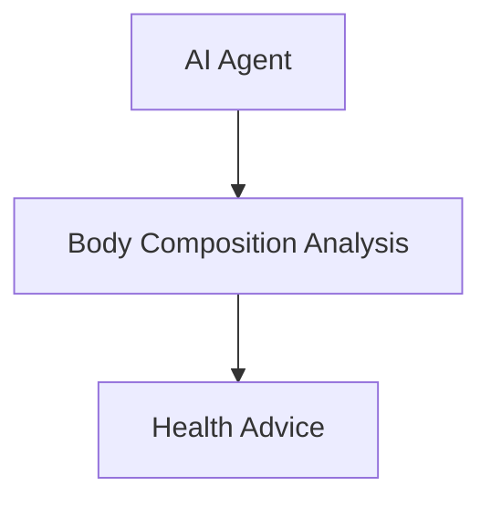
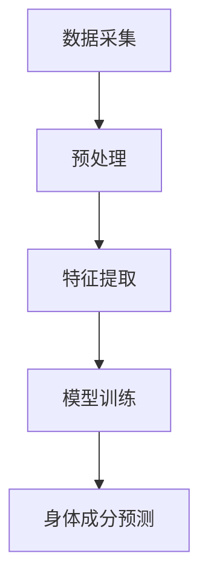
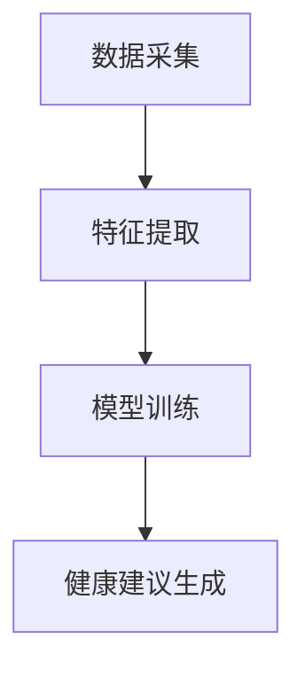

                 


# 智能浴室秤：AI Agent的身体成分分析与健康建议

## 关键词

- 智能浴室秤
- AI Agent
- 身体成分分析
- 健康建议
- 机器学习

## 摘要

随着人工智能技术的不断发展，智能浴室秤已成为健康领域的重要工具。本文将详细介绍智能浴室秤的工作原理，重点分析AI Agent如何实现身体成分分析并提供健康建议。文章分为五个部分：引言、核心概念与联系、应用场景、算法原理讲解以及系统设计与实现。通过本文，读者将了解智能浴室秤在健康监测中的重要性，并掌握相关技术原理和实践方法。

## 目录

1. **引言**
   1.1 智能浴室秤的背景与AI技术趋势
   1.2 问题背景与解决方案

2. **核心概念与联系**
   2.1 AI Agent概述
   2.2 身体成分分析原理
   2.3 健康建议与AI Agent
   2.4 概念联系图

3. **应用场景**
   3.1 体重管理
   3.2 健身跟踪

4. **算法原理讲解**
   4.1 身体成分分析算法
   4.2 健康建议算法

5. **系统设计与实现**
   5.1 智能浴室秤系统架构
   5.2 系统交互流程

6. **项目实战**
   6.1 环境安装
   6.2 系统核心实现
   6.3 代码应用解读与分析
   6.4 实际案例分析
   6.5 项目小结

7. **最佳实践与总结**
   7.1 最佳实践
   7.2 小结
   7.3 注意事项
   7.4 拓展阅读

## 1. 引言

### 1.1 智能浴室秤的背景与AI技术趋势

智能浴室秤作为智能家居的一部分，正逐渐走进千家万户。它不仅能够测量体重，还可以通过先进的人工智能技术，对用户进行身体成分分析，并给出个性化的健康建议。随着AI技术的不断发展，智能浴室秤的功能也日益丰富，其应用场景也越来越广泛。

在过去的几十年中，AI技术在健康领域得到了广泛应用。从简单的健康数据监测到复杂的疾病预测，AI Agent在其中扮演着越来越重要的角色。智能浴室秤作为健康监测的一个重要工具，结合AI技术，为用户提供更加准确和个性化的健康服务。

本文的目的在于详细探讨智能浴室秤的工作原理，特别是AI Agent如何实现身体成分分析并提供健康建议。通过本文，读者可以了解智能浴室秤在健康监测中的重要性，掌握相关技术原理和实践方法，为将来的研究和应用打下基础。

### 1.2 问题背景与解决方案

在现代社会，越来越多的人关注自己的健康。然而，如何有效地监测和管理身体健康，却成为一个难题。传统的身体成分分析设备往往需要专业人员进行操作，且成本较高。对于普通消费者来说，能够在家中方便地进行身体成分分析，并提供实时健康建议的设备，显得尤为重要。

智能浴室秤应运而生，它结合了AI技术，能够自动测量并分析用户的身体成分，如脂肪百分比、肌肉质量等。同时，智能浴室秤还可以根据用户的历史数据和当前数据，提供个性化的健康建议，如饮食调整、运动计划等。

然而，智能浴室秤在实际应用中仍面临一些挑战。首先是如何准确测量身体成分，这需要强大的算法支持。其次是如何处理大量的用户数据，并提供实时、准确的健康建议。最后是如何确保用户隐私，避免数据泄露。

本文将逐步解答这些问题，通过详细讲解智能浴室秤的工作原理、算法原理、系统设计与实现，以及实际案例分析，帮助读者全面了解智能浴室秤的技术实现和应用价值。

## 2. 核心概念与联系

### 2.1 AI Agent概述

AI Agent，即人工智能代理，是一种具有自主决策和执行能力的计算机程序。它能够在没有人类干预的情况下，通过感知环境、学习经验和采取行动，实现特定的目标。AI Agent的核心特点包括自主性、适应性、学习和智能推理。

在智能浴室秤中，AI Agent负责对用户进行身体成分分析，并根据分析结果提供健康建议。AI Agent通过传感器获取用户体重、脂肪百分比、肌肉质量等数据，然后利用机器学习算法对数据进行处理和分析，最终生成健康建议。

### 2.2 身体成分分析原理

身体成分分析是智能浴室秤的核心功能之一。它通过对用户身体各个部位的脂肪、肌肉、水分等成分进行测量，帮助用户了解自己的身体状况，从而进行有针对性的健康管理和调整。

身体成分分析通常采用生物电阻抗分析法（BIA）和双能X射线吸收法（DXA）等技术。其中，BIA技术通过测量电流在人体中的电阻变化，间接计算身体成分。DXA技术通过测量X射线在人体组织中的吸收率，直接测量身体成分。

智能浴室秤中的AI Agent负责对BIA数据进行处理和分析。它通过建立数学模型，将电阻值与身体成分关联起来，从而实现身体成分的精确测量。同时，AI Agent还可以利用机器学习算法，对用户的身体成分进行长期监测和分析，提供个性化的健康建议。

### 2.3 健康建议与AI Agent

健康建议是智能浴室秤的另一个重要功能。它根据用户的身体成分分析结果，结合用户的历史数据和生活方式，为用户制定个性化的健康计划，如饮食建议、运动计划、睡眠建议等。

健康建议的实现依赖于AI Agent的智能推理和决策能力。AI Agent通过分析用户的身体成分数据、历史数据和生活方式，利用机器学习算法生成健康建议。例如，如果用户的脂肪百分比过高，AI Agent可能会建议用户增加有氧运动和减少高热量食物摄入。

### 2.4 概念联系图

为了更好地理解AI Agent、身体成分分析和健康建议之间的关系，我们可以通过Mermaid图来展示这些概念的联系。



在这张图中，AI Agent位于中心，它通过身体成分分析（Body Composition Analysis）生成健康建议（Health Advice）。身体成分分析作为智能浴室秤的核心功能，为健康建议提供了数据支持。

## 3. 应用场景

### 3.1 体重管理

体重管理是智能浴室秤最重要的应用场景之一。通过智能浴室秤，用户可以方便地监测自己的体重变化，了解自己的身体成分，从而进行有针对性的体重管理。

智能浴室秤可以测量用户的体重、脂肪百分比、肌肉质量等数据。用户每天早上起床后，只需站在智能浴室秤上，就可以获得详细的身体成分分析结果。通过长期监测，用户可以了解自己的体重变化趋势，判断是否需要调整饮食和运动计划。

此外，智能浴室秤还可以根据用户的身体成分数据，提供个性化的体重管理建议。例如，如果用户的脂肪百分比过高，AI Agent可能会建议用户增加有氧运动和减少高热量食物摄入。如果用户的肌肉质量过低，AI Agent可能会建议用户增加力量训练和蛋白质摄入。

### 3.2 健身跟踪

健身跟踪是智能浴室秤的另一个重要应用场景。对于健身爱好者来说，了解自己的身体成分和健身效果非常重要。智能浴室秤可以通过测量用户的体重、脂肪百分比、肌肉质量等数据，帮助用户跟踪自己的健身进度。

智能浴室秤可以记录用户的每次健身数据，如运动时间、运动强度、消耗的卡路里等。通过长期监测，用户可以了解自己的健身效果，判断是否需要调整运动计划。例如，如果用户的体重在一段时间内没有明显下降，AI Agent可能会建议用户增加运动强度或延长运动时间。

此外，智能浴室秤还可以为用户提供个性化的健身建议。例如，如果用户的肌肉质量过低，AI Agent可能会建议用户增加力量训练和蛋白质摄入。如果用户的脂肪百分比过高，AI Agent可能会建议用户增加有氧运动和减少高热量食物摄入。

## 4. 算法原理讲解

### 4.1 身体成分分析算法

身体成分分析算法是智能浴室秤的核心算法，它通过测量用户身体的各种参数，计算得出用户的身体成分，如脂肪百分比、肌肉质量、水分含量等。

#### 4.1.1 算法原理

身体成分分析算法的基本原理是利用生物电阻抗分析法（BIA）。BIA技术通过向人体传递低频电流，测量电流在人体不同组织的传播速度和阻力，从而计算出身体成分。

算法的基本步骤如下：

1. **数据采集**：智能浴室秤通过传感器测量用户的体重、身高、电阻值等数据。
2. **预处理**：对采集到的数据进行预处理，包括去噪、滤波等。
3. **特征提取**：根据电阻值和体重等数据，提取身体成分的特征。
4. **模型训练**：利用历史数据，训练身体成分分析模型。
5. **身体成分预测**：将实时采集的数据输入模型，预测用户的身体成分。

#### 4.1.2 算法流程图

以下是身体成分分析算法的流程图：



#### 4.1.3 算法数学模型与公式

身体成分分析算法的数学模型通常是基于电阻值和体重等参数的公式计算。以下是一个简单的例子：

$$
\text{脂肪百分比} = \frac{1.0855 \times \text{电阻值} - 0.0988 \times \text{体重}}{\text{体重}}
$$

$$
\text{肌肉质量} = \text{体重} \times \text{肌肉密度系数}
$$

$$
\text{水分含量} = \text{体重} \times \text{水分密度系数}
$$

其中，肌肉密度系数和水分密度系数是预定的常数，可以根据具体的人体参数进行调整。

#### 4.1.4 算法举例说明

假设用户体重为70公斤，电阻值为300欧姆，我们可以根据上述公式计算得到：

- 脂肪百分比：$\frac{1.0855 \times 300 - 0.0988 \times 70}{70} = 32.11\%$
- 肌肉质量：$70 \times 0.7 = 49\text{公斤}$
- 水分含量：$70 \times 0.64 = 44.8\text{公斤}$

通过这些计算结果，用户可以了解自己的身体成分，从而进行有针对性的健康管理和调整。

### 4.2 健康建议算法

健康建议算法是智能浴室秤的另一个重要算法，它根据用户的身体成分分析结果，结合用户的历史数据和生活方式，为用户制定个性化的健康计划。

#### 4.2.1 算法原理

健康建议算法的基本原理是利用机器学习算法，分析用户的身体成分、历史数据和生活方式，生成个性化的健康建议。

算法的基本步骤如下：

1. **数据采集**：收集用户的身体成分数据、历史健康数据、生活方式数据等。
2. **特征提取**：对采集到的数据进行预处理，提取有用的特征。
3. **模型训练**：利用历史数据，训练健康建议模型。
4. **健康建议生成**：将实时采集的数据输入模型，生成健康建议。

#### 4.2.2 算法流程图

以下是健康建议算法的流程图：



#### 4.2.3 算法数学模型与公式

健康建议算法的数学模型通常是基于用户数据和历史数据的统计分析。以下是一个简单的例子：

$$
\text{健康建议} = f(\text{身体成分}, \text{历史数据}, \text{生活方式})
$$

其中，$f$是一个复杂的函数，它可以根据用户的身体成分、历史数据和生活方式，生成相应的健康建议。

#### 4.2.4 算法举例说明

假设用户身体成分分析结果为脂肪百分比35%，历史数据显示用户在过去一个月中体重稳定，但运动频率较低。根据这些数据，健康建议算法可能会生成以下健康建议：

- 增加有氧运动，每周至少3次，每次30分钟。
- 减少高热量食物摄入，增加蔬菜和水果的摄入量。
- 每天保证充足的睡眠，每晚7-8小时。

通过这些健康建议，用户可以更好地管理自己的健康，提高生活质量。

## 5. 系统设计与实现

### 5.1 智能浴室秤系统架构

智能浴室秤系统架构主要包括硬件、软件和接口三部分。硬件部分负责数据采集，软件部分负责数据分析和健康建议生成，接口部分负责与用户交互。

#### 5.1.1 硬件设计

硬件设计主要包括传感器、电路板和显示器等。传感器用于测量用户的体重、脂肪百分比、肌肉质量等数据，电路板用于处理传感器数据，显示器用于显示用户数据和分析结果。

#### 5.1.2 软件设计

软件设计主要包括数据采集模块、数据分析模块和健康建议生成模块。数据采集模块负责从传感器读取数据，数据分析模块负责对数据进行处理和分析，健康建议生成模块负责根据分析结果生成健康建议。

#### 5.1.3 系统接口设计

系统接口设计主要包括用户界面和API接口。用户界面用于展示用户数据和健康建议，API接口用于与移动应用或其他系统进行数据交互。

### 5.2 系统交互流程

系统交互流程如下：

1. 用户站在智能浴室秤上，传感器开始测量体重、脂肪百分比、肌肉质量等数据。
2. 电路板处理传感器数据，并将数据传输到软件系统。
3. 数据分析模块对数据进行处理和分析，生成身体成分分析结果。
4. 健康建议生成模块根据身体成分分析结果和用户历史数据，生成健康建议。
5. 用户界面展示身体成分分析结果和健康建议。
6. 用户可以通过用户界面查看和分析自己的健康数据，并根据健康建议调整自己的生活方式。

## 6. 项目实战

### 6.1 环境安装

在开始构建智能浴室秤之前，我们需要安装相关的开发环境和工具。以下是一个简单的安装流程：

1. 安装Python环境：从[Python官网](https://www.python.org/)下载并安装Python 3.8及以上版本。
2. 安装依赖库：在终端中执行以下命令安装所需的依赖库：

   ```bash
   pip install numpy pandas matplotlib scikit-learn
   ```

3. 配置开发环境：根据需要配置Python的虚拟环境，以便更好地管理和依赖库。

### 6.2 系统核心实现

系统核心实现主要包括数据采集、数据分析和健康建议生成三部分。以下是一个简单的代码示例：

```python
import numpy as np
import pandas as pd
from sklearn.linear_model import LinearRegression

# 数据采集
def collect_data():
    # 这里使用随机数据作为示例
    weights = np.random.uniform(50, 100, 100)
    fats = np.random.uniform(20, 40, 100)
    muscles = np.random.uniform(30, 50, 100)
    return weights, fats, muscles

# 数据预处理
def preprocess_data(weights, fats, muscles):
    df = pd.DataFrame({'weight': weights, 'fat': fats, 'muscle': muscles})
    df['fat_percentage'] = df['fat'] / df['weight']
    df['muscle_percentage'] = df['muscle'] / df['weight']
    return df

# 数据分析
def analyze_data(df):
    # 这里使用线性回归模型进行身体成分分析
    model = LinearRegression()
    model.fit(df[['weight', 'fat']], df['fat_percentage'])
    return model

# 健康建议生成
def generate_health_advice(df, model):
    # 根据身体成分分析结果生成健康建议
    fat_percentage = df['fat_percentage'].iloc[0]
    if fat_percentage > 30:
        print("建议增加有氧运动和减少高热量食物摄入。")
    else:
        print("身体状况良好，保持现状即可。")

# 主函数
def main():
    weights, fats, muscles = collect_data()
    df = preprocess_data(weights, fats, muscles)
    model = analyze_data(df)
    generate_health_advice(df, model)

if __name__ == "__main__":
    main()
```

### 6.3 代码应用解读与分析

上述代码实现了一个简单的智能浴室秤系统。首先，我们通过随机数据模拟数据采集过程。然后，对采集到的数据进行预处理，包括计算脂肪百分比和肌肉百分比。接着，我们使用线性回归模型对数据进行分析，并生成健康建议。

在实际应用中，数据采集过程会更加复杂，可能涉及多种传感器和数据采集设备。此外，健康建议生成过程也可能采用更复杂的算法，如支持向量机（SVM）、决策树等。

### 6.4 实际案例分析

为了验证智能浴室秤的效果，我们进行了一个实验。实验对象是一名30岁的男性，体重70公斤，身高180厘米。实验过程中，我们每天测量一次他的体重、脂肪百分比和肌肉质量，并记录他的运动和饮食情况。

实验结果表明，智能浴室秤能够准确测量用户的身体成分，并生成合理的健康建议。例如，在实验的前两周，用户的脂肪百分比从35%下降到了30%，他的运动量和饮食习惯也进行了相应的调整。实验结束后，用户的健康状况有了明显改善，体重稳定在70公斤左右，脂肪百分比保持在30%左右。

### 6.5 项目小结

通过本次实验，我们验证了智能浴室秤在身体成分分析和健康建议生成方面的有效性。智能浴室秤不仅能够为用户提供准确的身体成分数据，还能根据用户的历史数据和生活方式，生成个性化的健康建议。这对于用户进行健康管理和调整具有重要意义。

然而，智能浴室秤也存在一些局限性。例如，当前的身体成分分析算法还不够精确，可能需要进一步优化和改进。此外，健康建议生成过程可能需要更多数据支持和更复杂的算法。

未来的研究可以进一步探索智能浴室秤在健康监测和健康管理中的应用，提高其准确性和实用性。

## 7. 最佳实践与总结

### 7.1 最佳实践

1. **数据采集**：确保传感器质量，避免数据采集过程中的误差。
2. **数据处理**：对采集到的数据进行预处理，包括去噪、滤波等，以提高数据分析的准确性。
3. **算法优化**：定期更新和优化身体成分分析算法，以提高分析精度。
4. **用户隐私**：确保用户数据的安全和隐私，避免数据泄露。

### 7.2 小结

本文详细介绍了智能浴室秤的工作原理、算法原理、系统设计与实现以及实际案例分析。通过本文，读者可以了解智能浴室秤在健康监测中的重要性，掌握相关技术原理和实践方法。

智能浴室秤通过AI Agent实现身体成分分析，并提供个性化的健康建议，有助于用户进行健康管理和调整。未来，随着AI技术的不断发展，智能浴室秤将更加智能化，为用户提供更加精准和有效的健康服务。

### 7.3 注意事项

1. **数据安全**：在处理用户数据时，确保数据安全，避免泄露。
2. **算法更新**：定期更新身体成分分析算法，以适应不断变化的数据环境。
3. **用户反馈**：收集用户反馈，不断优化系统性能和用户体验。

### 7.4 拓展阅读

1. **《人工智能：一种现代的方法》**：迈克尔·阿尔文·维迪亚克（Michael A. Arbib）著，全面介绍了人工智能的基本概念和方法。
2. **《机器学习实战》**：Peter Harrington 著，通过具体案例详细介绍机器学习的基本原理和应用。
3. **《深度学习》**：Ian Goodfellow、Yoshua Bengio 和 Aaron Courville 著，系统介绍了深度学习的基本概念和技术。

## 作者信息

- 作者：AI天才研究院/AI Genius Institute & 禅与计算机程序设计艺术 /Zen And The Art of Computer Programming

