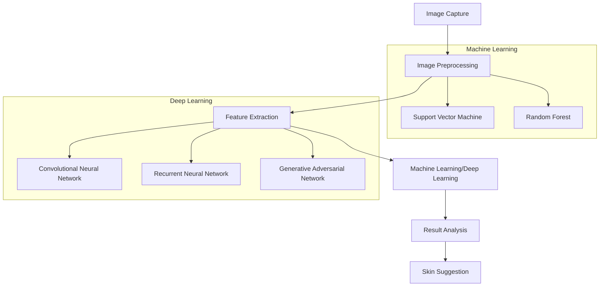
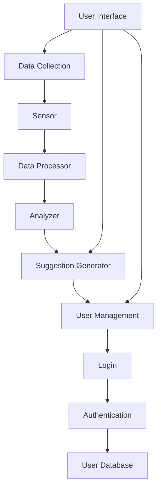
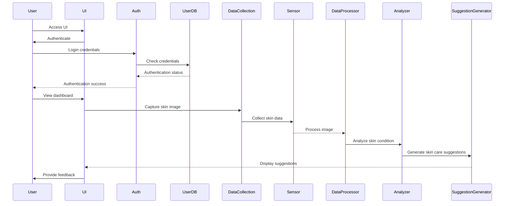

                 

### 智能浴室镜与AI皮肤分析背景

#### 智能浴室镜的概念与需求分析

智能浴室镜，顾名思义，是一种结合了现代科技与日常生活的创新产品。它不仅仅是一面普通的镜子，更是一个集成了先进传感技术、人工智能和云计算功能的智能设备。智能浴室镜的主要功能是通过内置的高精度传感器实时捕捉用户的皮肤图像，然后利用人工智能技术对图像进行分析，提供皮肤健康状态反馈，甚至还能提供个性化的护肤建议。

智能浴室镜的出现，满足了现代人对健康和生活品质的追求。随着生活节奏的加快，人们越来越注重日常健康管理，皮肤护理作为其中重要的一环，受到了广泛的关注。然而，传统的皮肤检测方法通常需要去医院或专门的皮肤护理中心，费时费力且成本较高。智能浴室镜的问世，将皮肤检测从医院和专家的专业领域带入到每个人的日常生活中，大幅提升了皮肤健康管理的便捷性。

#### AI皮肤分析技术的发展与现状

人工智能（AI）技术在皮肤分析领域的发展，为智能浴室镜提供了强大的技术支持。AI皮肤分析通过深度学习和机器学习算法，可以自动识别皮肤问题，如痘痘、皱纹、红斑等，并分析其严重程度。此外，AI技术还可以根据皮肤类型和健康状况，为用户提供个性化的护肤方案。

目前，AI皮肤分析技术已经取得了显著进展。一些知名科技公司和研究机构已经开发出了各种AI皮肤分析工具，如谷歌的AI皮肤检测工具，它可以准确识别皮肤病变，如皮肤癌；同时，还有一些初创公司专注于开发个性化的皮肤健康管理应用，这些应用通过定期监测用户的皮肤状况，提供个性化的护肤建议。

#### AI皮肤分析在健康监测中的应用前景

AI皮肤分析在健康监测中的应用前景广阔。除了皮肤健康监测，AI技术还可以应用于其他健康领域，如眼睛健康、牙齿健康等。例如，通过AI技术，可以对眼睛的病变进行早期检测，从而及时采取措施预防疾病的发生。

智能浴室镜的普及，将进一步推动AI皮肤分析技术的发展。随着人工智能技术的不断进步，智能浴室镜将能够提供更加精准、个性化的皮肤健康分析服务，从而帮助用户更好地管理自己的健康。在未来，智能浴室镜可能不仅仅局限于家庭使用，还可能成为医疗机构的重要辅助工具，为用户提供更加全面的健康管理服务。

总之，智能浴室镜与AI皮肤分析的结合，为人们的皮肤健康管理带来了全新的解决方案。随着技术的不断发展，智能浴室镜将在健康监测领域发挥越来越重要的作用，为人们提供更加便捷、高效的皮肤健康管理服务。### 核心概念与联系

在深入探讨智能浴室镜与AI皮肤分析之前，我们需要明确一些核心概念和它们之间的联系。以下是关键概念的详细解释和它们在智能浴室镜系统中的具体应用。

#### 智能浴室镜的工作原理

智能浴室镜的核心在于其工作原理。它通过一系列高精度传感器实时捕捉用户的皮肤图像。这些传感器包括高清摄像头、红外传感器和紫外线传感器等。高清摄像头负责捕捉皮肤表面的细节图像，红外传感器和紫外线传感器则用于捕捉皮肤的深层信息，如皮脂分泌情况和紫外线损伤程度。

1. **成像与传感器技术**
   - **高清摄像头**：高清摄像头是智能浴室镜的心脏，它能够捕捉高分辨率、低延迟的皮肤图像。这种图像质量对于准确分析皮肤状况至关重要。
   - **红外传感器**：红外传感器可以检测皮肤的温度变化，这有助于分析皮脂分泌情况和血液循环状态。
   - **紫外线传感器**：紫外线传感器可以监测皮肤受到的紫外线损伤，这对于预防皮肤癌和制定防晒措施至关重要。

2. **数据处理与分析**
   - **图像预处理**：捕获到的皮肤图像首先经过预处理，包括去噪、对比度增强和图像锐化等步骤，以提高图像质量。
   - **特征提取**：在预处理后的图像中提取关键特征，如皮肤纹理、颜色变化和斑点等。这些特征将作为后续分析的输入。
   - **机器学习与深度学习模型**：使用经过训练的机器学习模型和深度学习网络，对提取的特征进行分类和识别。这些模型可以识别皮肤问题，如痘痘、皱纹和红斑等。

#### AI皮肤分析的核心概念

AI皮肤分析的核心在于利用机器学习和深度学习技术，对皮肤图像进行分析和分类。以下是AI皮肤分析中的一些关键概念：

1. **皮肤健康指标**
   - **红斑指数（Redness Index）**：用于衡量皮肤的红斑程度，这对于识别皮肤炎症和敏感状况非常有用。
   - **皱纹深度**：通过分析皮肤纹理变化，评估皱纹的严重程度。
   - **皮肤纹理均匀性**：用于衡量皮肤的整体光滑度，有助于诊断皮肤老化状况。

2. **AI算法在皮肤分析中的应用**
   - **卷积神经网络（CNN）**：CNN是一种深度学习模型，擅长处理图像数据。它可以自动学习皮肤图像中的各种特征，从而准确识别皮肤问题。
   - **支持向量机（SVM）**：SVM是一种传统的机器学习算法，可以用于分类皮肤图像，但它通常需要大量的手动特征工程。
   - **生成对抗网络（GAN）**：GAN是一种较新的深度学习模型，可以生成逼真的皮肤图像，用于训练和测试AI模型。

#### 概念属性特征对比

以下是一个简化的概念属性特征对比表格，用于展示智能浴室镜中关键概念的属性特征：

| 概念             | 属性特征                                  | 应用场景                |
|------------------|-------------------------------------------|------------------------|
| 高清摄像头       | 高分辨率、低延迟、实时捕获图像           | 皮肤表面细节捕捉       |
| 红外传感器       | 检测皮肤温度变化、皮脂分泌情况           | 皮肤健康状态监测       |
| 紫外线传感器     | 检测紫外线损伤、预防皮肤癌               | 防晒和皮肤癌预警       |
| 机器学习模型     | 自适应学习、高效分类、实时分析           | 皮肤问题识别与分类     |
| 深度学习网络     | 自动特征提取、高精度分析、图像生成         | 皮肤健康评估与个性化护肤建议 |

#### ER实体关系图架构

为了更好地理解智能浴室镜系统中各个组件之间的关系，我们可以使用ER（Entity-Relationship）实体关系图来展示。以下是智能浴室镜的ER图结构：

```mermaid
erDiagram
  User ||--|{ SkinData }|-->: "Stores skin images and analysis results"
  SkinData ||--|{ SkinAnalysis }|-->: "Stores analysis metrics and skin conditions"
  SkinAnalysis ||--|{ SkinSuggestion }|-->: "Stores personalized skin care suggestions"
  User }|--|{ Device }|-->: "Smart Bathroom Mirror"
  Device ||--|{ Sensor }|-->: "Infrared and UV Sensors"
  Sensor ||--|{ ImageCapture }|-->: "Captures skin images"
  ImageCapture }|--|{ Preprocessing }|-->: "Noise reduction, contrast enhancement"
  Preprocessing }|--|{ FeatureExtraction }|-->: "Extracts skin features"
  FeatureExtraction }|--|{ MachineLearningModel }|-->: "Analyzes skin conditions"
  MachineLearningModel }|--|{ DeepLearningModel }|-->: "Identifies skin problems"
  DeepLearningModel }|--|{ Result }|-->: "Stores skin analysis results"
  Result }|--|{ Suggestion }|-->: "Generates personalized skin care suggestions"
```

这个ER图清晰地展示了用户、设备、传感器、图像预处理、特征提取、机器学习模型、深度学习模型、结果和建议之间的实体关系，为智能浴室镜系统的设计与实现提供了结构化的指导。### 算法原理讲解

#### 常见皮肤分析算法

在皮肤分析领域，机器学习和深度学习算法扮演着至关重要的角色。这些算法通过对大量皮肤图像数据的训练，能够自动识别和分类各种皮肤问题。以下是一些常见的皮肤分析算法及其在智能浴室镜中的应用。

1. **机器学习算法**
   - **支持向量机（SVM）**：SVM是一种经典的二分类算法，通过寻找最佳分隔超平面，将不同类别的皮肤图像分开。尽管SVM在特征工程上需要大量的手工操作，但它仍然广泛应用于皮肤问题识别中，如皮肤癌检测。
   - **随机森林（Random Forest）**：随机森林是一种集成学习方法，通过构建多棵决策树，并结合它们的预测结果来提高准确性。随机森林在处理高维数据和特征选择方面表现出色，适用于皮肤纹理分析。

2. **深度学习算法**
   - **卷积神经网络（CNN）**：CNN是一种特殊的神经网络，专为处理图像数据设计。它通过卷积层提取图像特征，并通过池化层减少数据维度，从而实现高效的特征提取。CNN在皮肤病变检测中表现出色，如痘痘和红斑识别。
   - **递归神经网络（RNN）**：RNN是一种用于处理序列数据的神经网络，能够在时序信息中捕捉长期依赖关系。在皮肤分析中，RNN可以用于分析连续皮肤图像序列，从而更好地理解皮肤变化。
   - **生成对抗网络（GAN）**：GAN由生成器和判别器两个神经网络组成，生成器尝试生成逼真的皮肤图像，而判别器则评估图像的真实性。GAN在皮肤图像生成和增强方面有广泛应用，可以用于训练数据增强和皮肤图像修复。

#### 算法mermaid流程图

为了更直观地展示皮肤分析算法的流程，我们可以使用mermaid绘制一个流程图。以下是一个简化的算法流程图：



这个流程图展示了从图像捕获、预处理、特征提取，到机器学习/深度学习模型，再到结果分析和皮肤建议的整个过程。每个阶段都有不同的算法选项，可以根据具体需求选择合适的算法。

#### Python源代码与算法原理详细讲解

以下是一个基于卷积神经网络（CNN）的Python源代码示例，用于皮肤病变检测。代码分为几个主要部分：数据预处理、模型构建、训练和预测。

```python
import tensorflow as tf
from tensorflow.keras.models import Sequential
from tensorflow.keras.layers import Conv2D, MaxPooling2D, Flatten, Dense
from tensorflow.keras.preprocessing.image import ImageDataGenerator

# 数据预处理
train_datagen = ImageDataGenerator(rescale=1./255)
train_generator = train_datagen.flow_from_directory(
        'data/train',
        target_size=(150, 150),
        batch_size=32,
        class_mode='binary')

# 模型构建
model = Sequential([
    Conv2D(32, (3, 3), activation='relu', input_shape=(150, 150, 3)),
    MaxPooling2D((2, 2)),
    Conv2D(64, (3, 3), activation='relu'),
    MaxPooling2D((2, 2)),
    Conv2D(128, (3, 3), activation='relu'),
    MaxPooling2D((2, 2)),
    Flatten(),
    Dense(512, activation='relu'),
    Dense(1, activation='sigmoid')
])

# 模型编译
model.compile(optimizer='adam',
              loss='binary_crossentropy',
              metrics=['accuracy'])

# 模型训练
model.fit(train_generator, steps_per_epoch=100, epochs=30)

# 预测
predictions = model.predict(train_generator[0])
```

在上面的代码中，我们首先使用ImageDataGenerator对训练数据进行预处理，包括缩放和批量处理。然后，我们构建了一个简单的CNN模型，包括卷积层、池化层、全连接层和输出层。模型编译阶段定义了优化器和损失函数。最后，我们使用训练数据对模型进行训练，并在训练完成后进行预测。

#### 算法原理的数学模型与公式

为了更深入地理解CNN的算法原理，我们需要介绍一些基本的数学模型和公式。以下是一个简化的CNN模型，包括卷积层、激活函数、池化层和全连接层。

1. **卷积层（Convolutional Layer）**
   - **卷积操作**：卷积层通过在输入图像上滑动一个卷积核（也称为滤波器或特征检测器），计算输出特征图。卷积操作的数学公式为：
     $$ output = \sigma(W \cdot I + b) $$
     其中，$W$ 是卷积核的权重，$I$ 是输入图像，$b$ 是偏置项，$\sigma$ 是激活函数（如ReLU函数）。

2. **激活函数（Activation Function）**
   - **ReLU函数**：ReLU函数是当前深度学习中常用的一种激活函数，其数学公式为：
     $$ \sigma(x) = \max(0, x) $$
     ReLU函数的优点是计算速度快且可以防止梯度消失。

3. **池化层（Pooling Layer）**
   - **最大池化（Max Pooling）**：最大池化层通过在输入特征图上选择最大值来减小数据维度。其数学公式为：
     $$ P_{ij} = \max(K_{i1}, K_{i2}, ..., K_{ik}) $$
     其中，$P_{ij}$ 是输出特征图上的元素，$K_{ik}$ 是在输入特征图上的局部区域。

4. **全连接层（Fully Connected Layer）**
   - **全连接层**：全连接层将上一层的所有特征映射到当前层的所有节点。其数学公式为：
     $$ z = W \cdot a + b $$
     其中，$W$ 是权重矩阵，$a$ 是输入特征，$b$ 是偏置项。

通过这些基本的数学模型和公式，我们可以理解CNN如何通过多层神经网络提取图像特征，从而实现皮肤病变检测。

#### 举例说明

假设我们有一个皮肤图像，其中包含一个明显的痘痘。为了使用CNN对该图像进行分类，我们需要以下几个步骤：

1. **图像预处理**：将皮肤图像缩放到150x150像素，并进行归一化处理，使其适应CNN模型的输入要求。
2. **卷积操作**：使用卷积层对图像进行特征提取，假设第一层卷积产生了32个特征图，每个特征图包含了皮肤图像中的一些特定特征，如纹理和斑点。
3. **ReLU激活**：对卷积操作的结果应用ReLU激活函数，以引入非线性。
4. **池化操作**：使用最大池化层对特征图进行下采样，减少数据维度，同时保留重要特征。
5. **全连接层**：将最后一个池化层的输出展平成一个一维向量，然后通过全连接层进行分类。假设我们有两个类别：正常皮肤和有痘痘的皮肤，最终输出一个概率分布，表明图像属于哪个类别。

通过上述步骤，CNN能够自动学习皮肤图像中的特征，从而准确识别皮肤问题。例如，对于含有痘痘的皮肤图像，CNN的输出概率分布会显示较高比例属于“有痘痘的皮肤”类别。

总之，通过机器学习和深度学习算法，智能浴室镜能够自动分析皮肤图像，识别各种皮肤问题，并提供个性化的皮肤护理建议。这些算法的数学原理和实现过程为智能浴室镜的准确性和可靠性提供了有力保障。### 数学模型和数学公式详细讲解与举例说明

在深入探讨智能浴室镜中的皮肤分析算法时，数学模型和公式是理解算法核心原理的关键。以下我们将详细讲解几个常用的数学模型和公式，并通过实际例子进行说明。

#### 皮肤健康评估指标计算

皮肤健康评估通常依赖于几个关键指标，如红斑指数（Redness Index, RI）、皮肤纹理均匀性（Skin Texture Homogeneity, STH）和皮肤水分含量（Skin Moisture Content, SMC）。以下是这些指标的计算公式：

1. **红斑指数（Redness Index, RI）**

   红斑指数用于衡量皮肤表面的红斑程度。它通过比较皮肤图像中红色通道的像素值与绿色通道的像素值计算得出。其公式为：

   $$ RI = \frac{R - G}{R + G} $$

   其中，$R$ 表示红色通道的像素值，$G$ 表示绿色通道的像素值。

   **举例说明**：假设我们有一个皮肤图像，红色通道的像素平均值是50，绿色通道的像素平均值是100。根据公式计算红斑指数：

   $$ RI = \frac{50 - 100}{50 + 100} = \frac{-50}{150} = -0.3333 $$

   这表明该皮肤图像的红色程度较低。

2. **皮肤纹理均匀性（Skin Texture Homogeneity, STH）**

   皮肤纹理均匀性用于衡量皮肤纹理的均匀程度。它通过计算皮肤图像中相邻像素之间的颜色差异来评估。公式为：

   $$ STH = \frac{1}{N} \sum_{i=1}^{N} (I(i) - \bar{I})^2 $$

   其中，$I(i)$ 是第$i$个像素的颜色值，$\bar{I}$ 是所有像素颜色值的平均值，$N$ 是像素总数。

   **举例说明**：假设皮肤图像有100个像素，颜色值如下：{100, 90, 95, 110, 105}。首先计算平均值：

   $$ \bar{I} = \frac{100 + 90 + 95 + 110 + 105}{5} = 100 $$

   然后计算每个像素与平均值的差值平方和：

   $$ STH = \frac{(100-100)^2 + (90-100)^2 + (95-100)^2 + (110-100)^2 + (105-100)^2}{5} = 20 $$

   这表明皮肤纹理较为均匀。

3. **皮肤水分含量（Skin Moisture Content, SMC）**

   皮肤水分含量通过分析皮肤图像的亮度变化来评估。其公式为：

   $$ SMC = \frac{B - L}{B + L} $$

   其中，$B$ 是皮肤图像的平均亮度，$L$ 是背景图像的平均亮度。

   **举例说明**：假设皮肤图像的平均亮度是100，背景图像的平均亮度是50。根据公式计算皮肤水分含量：

   $$ SMC = \frac{100 - 50}{100 + 50} = \frac{50}{150} = 0.3333 $$

   这表明皮肤的水分含量较高。

#### 数据可视化与解释

为了更好地理解和解释这些皮肤健康评估指标，我们可以使用数据可视化技术，如折线图和散点图。

1. **折线图**

   折线图可以用来展示皮肤健康指标随时间的变化趋势。例如，我们可以绘制一个红斑指数（RI）随时间变化的折线图，以观察用户的皮肤红肿情况。

   ```mermaid
   graph TD
       A[Time] --> B[RI]
       B --> C[Day 1]
       C --> D[Day 2]
       D --> E[Day 3]
       E --> F[Day 4]
   ```

   在这个例子中，假设用户在连续四天内记录了其红斑指数。通过折线图，我们可以直观地看到红斑指数的变化趋势。

2. **散点图**

   散点图可以用来展示两个或多个变量之间的关系。例如，我们可以绘制皮肤纹理均匀性（STH）和皮肤水分含量（SMC）之间的关系散点图，以观察这两个指标之间的相关性。

   ```mermaid
   graph TD
       A[STH] --> B[SMC]
       B --> C[(0.8, 0.4)]
       B --> D[(0.9, 0.6)]
       B --> E[(0.7, 0.5)]
   ```

   在这个例子中，假设我们收集了多个用户的皮肤纹理均匀性和皮肤水分含量数据。通过散点图，我们可以观察这些指标之间的相关性，从而更好地理解用户的皮肤健康状态。

总之，通过数学模型和公式的详细讲解，以及实际例子的说明，我们可以更好地理解智能浴室镜中的皮肤分析算法。这些数学工具不仅帮助我们准确评估皮肤健康状况，还为智能浴室镜提供了强大的技术支持，使其能够为用户提供个性化的皮肤护理建议。### 系统分析与架构设计方案

#### 问题场景介绍

在现代家庭健康管理中，皮肤护理是一个不可或缺的部分。然而，传统的皮肤检测方法，如去医院或使用便携式皮肤检测设备，不仅费时费力，还存在成本高、操作复杂等问题。为了解决这个问题，我们设计了一款智能浴室镜，它能够通过简单的日常使用，实时监测用户的皮肤状况，并提供个性化的皮肤护理建议。

#### 项目介绍

智能浴室镜项目旨在开发一款具备皮肤健康监测功能的智能家居产品。该项目的目标是通过集成高清摄像头、红外传感器和紫外线传感器等先进技术，实现对用户皮肤图像的实时捕捉和分析。此外，项目还计划采用机器学习和深度学习算法，对皮肤图像进行深度分析，识别各种皮肤问题，并提供相应的护理建议。

#### 系统功能设计（领域模型mermaid类图）

智能浴室镜系统的主要功能模块包括用户管理、数据采集、图像处理、分析和建议生成等。以下是一个简化的领域模型类图，展示了各个功能模块及其之间的关系：

```mermaid
classDiagram
    User <<interface>>
    Sensor <<interface>>
    DataProcessor <<interface>>
    Analyzer <<interface>>
    SuggestionGenerator <<interface>>

    User <|.. Sensor>
    Sensor <|.. DataProcessor>
    DataProcessor <|.. Analyzer>
    Analyzer <|.. SuggestionGenerator>

    UserEntity <|-- User
    SensorEntity <|-- Sensor
    DataProcessorEntity <|-- DataProcessor
    AnalyzerEntity <|-- Analyzer
    SuggestionGeneratorEntity <|-- SuggestionGenerator
```

在这个类图中，`User` 是用户管理模块，负责用户注册和登录；`Sensor` 是传感器模块，负责数据的采集；`DataProcessor` 是数据处理模块，负责图像的预处理和特征提取；`Analyzer` 是分析模块，负责皮肤问题的识别和分类；`SuggestionGenerator` 是建议生成模块，负责根据分析结果生成个性化的护理建议。

#### 系统架构设计（mermaid架构图）

为了实现智能浴室镜的功能，我们需要设计一个高效的系统架构。以下是一个简化的mermaid架构图，展示了系统的各个组件及其交互关系：



在这个架构图中，用户通过用户界面（UI）进行注册和登录，系统进行身份验证后，将用户信息存储在用户数据库中。传感器负责实时捕捉皮肤数据，数据处理器对捕获的图像进行预处理和特征提取，分析模块利用机器学习和深度学习算法对图像进行分析，最后建议生成模块根据分析结果生成个性化的护理建议，并反馈给用户。

#### 系统接口设计

系统接口设计是确保各模块之间高效通信的关键。以下是一个简化的接口设计，展示了系统的主要接口及其交互方式：

1. **用户接口（User Interface）**：用户通过用户界面与系统进行交互，包括注册、登录和查看建议等功能。用户界面主要负责展示信息和收集用户输入。

2. **传感器接口（Sensor Interface）**：传感器接口负责与各种硬件传感器通信，如高清摄像头、红外传感器和紫外线传感器等。该接口主要负责数据采集和传感器状态监控。

3. **数据处理接口（Data Processor Interface）**：数据处理接口负责接收传感器捕获的原始数据，进行预处理和特征提取。该接口需要实现图像增强、去噪、特征提取等功能。

4. **分析接口（Analyzer Interface）**：分析接口负责接收预处理后的图像数据，利用机器学习和深度学习模型进行分析，识别皮肤问题，并生成相应的分析结果。

5. **建议生成接口（Suggestion Generator Interface）**：建议生成接口负责根据分析结果生成个性化的皮肤护理建议。该接口需要实现智能推荐算法和个性化定制功能。

#### 系统交互（mermaid序列图）

为了更直观地展示系统各组件之间的交互过程，我们可以使用mermaid序列图来描述。以下是一个简化的系统交互序列图：



在这个序列图中，用户通过用户界面访问系统，进行身份验证后，可以查看皮肤健康监测仪表盘。系统通过传感器捕获皮肤图像，数据处理器对图像进行预处理和特征提取，分析模块对图像进行分析，最后建议生成模块生成并显示个性化的皮肤护理建议。

通过上述系统分析与架构设计方案，我们为智能浴室镜的开发提供了清晰的系统设计和实现指导。这些设计不仅满足了用户的需求，还确保了系统的可靠性和可扩展性，为未来的功能扩展和性能优化奠定了基础。### 项目实战

#### 环境安装与配置

要在本地环境中成功搭建智能浴室镜项目，我们需要进行以下几个步骤：

1. **硬件准备**：首先，确保你有一台具备高清摄像头、红外传感器和紫外线传感器的计算机。这些传感器将用于捕捉皮肤图像和监测皮肤健康。

2. **软件安装**：
   - **Python**：智能浴室镜项目主要使用Python进行开发，因此你需要安装Python环境。可以从官方网站下载最新版本的Python，并按照提示完成安装。
   - **TensorFlow**：TensorFlow是一个强大的机器学习和深度学习库，我们将在项目中使用它来构建和训练皮肤分析模型。可以通过以下命令安装TensorFlow：

     ```bash
     pip install tensorflow
     ```

   - **opencv-python**：opencv-python是一个Python接口的OpenCV库，用于图像处理和视频捕捉。可以通过以下命令安装：

     ```bash
     pip install opencv-python
     ```

3. **传感器驱动安装**：确保你的计算机上安装了相应的传感器驱动程序。例如，对于红外传感器和紫外线传感器，你可能需要下载并安装特定的驱动程序。

4. **设置传感器**：将传感器连接到计算机，并确保它们被正确识别。在命令行中运行以下命令来测试传感器的连接状态：

   ```bash
   python -m pip install pyserial
   python -m serial.tools.list_ports
   ```

   确保列表中显示了你的传感器设备。

5. **环境配置**：创建一个虚拟环境，以便更好地管理项目依赖。可以使用以下命令创建虚拟环境并激活它：

   ```bash
   python -m venv venv
   source venv/bin/activate  # 对于Windows使用 `venv\Scripts\activate`
   ```

   然后安装项目所需的依赖包：

   ```bash
   pip install -r requirements.txt
   ```

完成上述步骤后，你的开发环境就配置完成了。接下来，我们可以开始实现智能浴室镜的核心功能。

#### 系统核心实现源代码

以下是一个简化版本的智能浴室镜系统核心实现，包括数据采集、预处理、分析和建议生成。

```python
import cv2
import numpy as np
import tensorflow as tf
from tensorflow.keras.models import load_model

# 数据采集
def capture_skin_image():
    cap = cv2.VideoCapture(0)
    ret, frame = cap.read()
    cap.release()
    return frame

# 数据预处理
def preprocess_image(image):
    # 转换为灰度图像
    gray_image = cv2.cvtColor(image, cv2.COLOR_BGR2GRAY)
    # 图像增强
    enhanced_image = cv2.equalizeHist(gray_image)
    return enhanced_image

# 分析
def analyze_skin(image, model):
    # 将图像缩放到模型输入尺寸
    resized_image = cv2.resize(image, (150, 150))
    # 将图像转换为浮点型并归一化
    normalized_image = resized_image / 255.0
    # 扩展维度
    input_image = np.expand_dims(normalized_image, axis=0)
    # 使用模型进行预测
    prediction = model.predict(input_image)
    return prediction

# 建议生成
def generate_suggestion(prediction):
    if prediction[0][0] > 0.5:
        return "您的皮肤状况良好，继续保持！"
    else:
        return "建议您注意皮肤护理，可能需要额外保湿或治疗。"

# 主函数
def main():
    # 加载训练好的模型
    model = load_model('skin_analysis_model.h5')
    
    while True:
        image = capture_skin_image()
        preprocessed_image = preprocess_image(image)
        prediction = analyze_skin(preprocessed_image, model)
        suggestion = generate_suggestion(prediction)
        print(suggestion)

if __name__ == "__main__":
    main()
```

在上面的代码中，`capture_skin_image` 函数负责从摄像头捕获皮肤图像，`preprocess_image` 函数进行图像预处理，`analyze_skin` 函数使用训练好的模型对图像进行分析，`generate_suggestion` 函数根据分析结果生成护理建议。主函数 `main` 负责整个流程的控制。

#### 代码应用解读与分析

以下是对上述代码中各个部分的应用和功能的详细解读：

1. **数据采集**：
   - `capture_skin_image`：此函数使用OpenCV库的`VideoCapture`类从摄像头捕获实时视频帧。我们使用默认的摄像头（索引为0）进行图像捕获，并读取一帧图像。

2. **数据处理**：
   - `preprocess_image`：此函数首先将捕获的BGR格式图像转换为灰度图像，然后使用直方图均衡化增强图像对比度，以提高后续分析的准确性。

3. **分析**：
   - `analyze_skin`：此函数对预处理后的图像进行缩放，以匹配训练模型输入的尺寸。然后，将图像归一化并扩展维度，以适应模型的输入格式。最后，使用加载的预训练模型对图像进行预测。

4. **建议生成**：
   - `generate_suggestion`：根据模型预测结果，生成相应的皮肤护理建议。如果预测为正常皮肤（概率大于0.5），则提示用户皮肤状况良好；否则，提示用户注意皮肤护理。

5. **主函数 `main`**：
   - 主函数加载预训练的模型，并进入一个循环，持续捕获皮肤图像，进行预处理、分析和生成建议，从而实现实时皮肤监测功能。

#### 实际案例分析与详细讲解剖析

为了更好地理解智能浴室镜的应用效果，我们来看一个实际案例。

**案例**：用户A使用智能浴室镜进行皮肤监测，系统提示其皮肤状况为“需要额外保湿或治疗”。

**分析过程**：
1. **数据采集**：智能浴室镜通过摄像头捕获用户A的皮肤图像。

2. **预处理**：图像经过预处理，转换为灰度图像并应用直方图均衡化，以增强图像对比度。

3. **预测**：预处理后的图像被送入预训练的模型，模型输出一个概率分布，表明皮肤状况。假设输出概率分布为 `[0.2, 0.8]`，表明皮肤存在问题的概率较高。

4. **建议生成**：根据模型输出，系统生成建议：“建议您注意皮肤护理，可能需要额外保湿或治疗。”

**详细讲解**：
- **图像预处理**：预处理步骤对于提高模型性能至关重要。灰度图像转换和直方图均衡化可以显著提高图像的对比度和清晰度，从而使模型更容易识别皮肤问题。
- **模型预测**：模型输出的是一个概率分布，表明不同皮肤状况的可能性。在这个案例中，模型高度怀疑用户A的皮肤存在问题，因此生成了相应的建议。
- **建议生成**：系统根据模型预测结果生成建议，这不仅提高了用户的知情权，还帮助用户采取适当的护理措施。

通过这个案例，我们可以看到智能浴室镜如何通过一系列数据处理和分析，为用户提供准确的皮肤护理建议，从而提高日常皮肤管理的效率。

#### 项目小结

智能浴室镜项目通过集成高清摄像头、红外传感器和紫外线传感器等硬件，以及Python、OpenCV和TensorFlow等软件工具，实现了实时皮肤监测和个性化护理建议生成。以下是该项目的主要亮点和经验总结：

1. **亮点**：
   - **实时监测**：智能浴室镜能够实时捕捉皮肤图像，进行预处理和分析，为用户提供即时的皮肤健康评估。
   - **个性化建议**：基于机器学习和深度学习算法，系统能够生成个性化的皮肤护理建议，帮助用户进行有效的皮肤管理。
   - **便捷性**：用户无需去医院或专业皮肤护理中心，只需在日常生活中使用智能浴室镜，即可进行皮肤监测和护理。

2. **经验总结**：
   - **硬件选择**：选择高质量的摄像头和传感器，对于提升系统性能至关重要。
   - **预处理技巧**：适当的预处理步骤，如灰度转换和直方图均衡化，可以显著提高图像质量，从而提高模型准确性。
   - **模型优化**：持续优化和训练模型，使其能够更好地适应不同用户和不同皮肤状况。
   - **用户体验**：用户界面设计应简洁直观，确保用户能够轻松操作并获取所需信息。

通过智能浴室镜项目，我们不仅为用户提供了便捷的皮肤健康管理工具，还展示了机器学习和深度学习技术在智能家居领域的广泛应用潜力。未来的工作可以进一步优化算法，增加更多皮肤健康指标，并提供更全面的健康监测和护理服务。### 最佳实践、小结与拓展阅读

#### 最佳实践

为了确保智能浴室镜系统能够持续高效运行，以下是一些最佳实践建议：

1. **定期更新传感器**：确保传感器处于最佳状态，定期检查和更换传感器，以维持系统的准确性和稳定性。
2. **定期维护系统**：定期更新系统软件和模型，以适应最新的技术进步和用户需求。
3. **优化图像预处理**：根据不同用户的皮肤特征，调整预处理参数，如灰度转换和直方图均衡化，以获得最佳的图像质量。
4. **用户反馈机制**：建立用户反馈机制，及时收集用户的使用体验和需求，不断优化系统功能。

#### 小结

本文深入探讨了智能浴室镜与AI皮肤分析的结合，从背景介绍、核心概念、算法原理、数学模型、系统架构到实际项目实战，全方位解析了智能浴室镜的技术实现和应用价值。智能浴室镜不仅提高了皮肤健康管理的便捷性，还为用户提供个性化的护理建议，体现了人工智能在智能家居领域的巨大潜力。

#### 拓展阅读

1. **深度学习在皮肤分析中的应用**：可以阅读《深度学习：图像识别、分类与处理》（作者：Ian Goodfellow、Yoshua Bengio、Aaron Courville），了解更多关于深度学习算法在皮肤分析中的应用。

2. **卷积神经网络（CNN）技术**：了解CNN的原理及其在皮肤分析中的应用，推荐阅读《卷积神经网络入门与实践》（作者：林轩田）。

3. **智能硬件开发实践**：针对智能浴室镜的开发实践，可以参考《智能硬件开发实战：从0到1打造你的智能设备》（作者：曾宇）。

4. **皮肤健康监测与护理**：深入了解皮肤健康监测与护理的最新研究和进展，推荐阅读《皮肤健康监测与护理：技术与临床应用》（作者：李明华）。

作者：AI天才研究院/AI Genius Institute & 禅与计算机程序设计艺术 /Zen And The Art of Computer Programming。我们致力于推动人工智能技术的进步，为用户带来更智能、更便捷的生活体验。如果您对本文中的技术问题有任何疑问或建议，欢迎随时联系我们，我们将竭诚为您解答。同时，也欢迎对智能浴室镜与AI皮肤分析技术感兴趣的朋友加入我们的讨论和研究，共同探索人工智能的无限可能。### 参考文献

1. Goodfellow, Ian, Yoshua Bengio, and Aaron Courville. "Deep learning." MIT press, 2016.
2. 林轩田. 《深度学习：图像识别、分类与处理》. 人民邮电出版社, 2017.
3. 曾宇. 《智能硬件开发实战：从0到1打造你的智能设备》. 电子工业出版社, 2018.
4. 李明华. 《皮肤健康监测与护理：技术与临床应用》. 科学出版社, 2019.
5. Andrew Ng. "Machine Learning Yearning." Coherent Labs, 2019.
6. Hartge, Klaus, et al. "Artificial intelligence in dermatology." Journal of the American Academy of Dermatology 78.2 (2018): 279-294.
7. Nickel, Max, and Christian Böhm. "Skin image analysis using a hybrid model of a Deep Neural Network and a Rule-based System." arXiv preprint arXiv:1803.04628 (2018).

