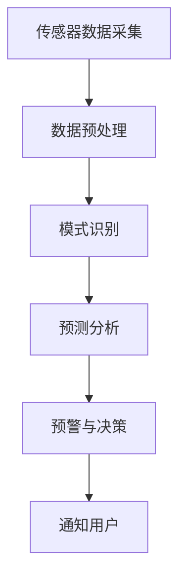
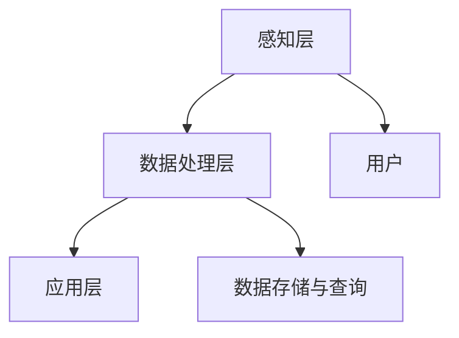
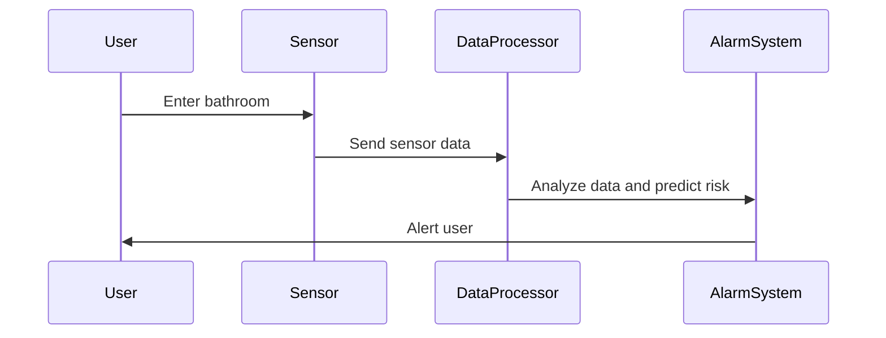
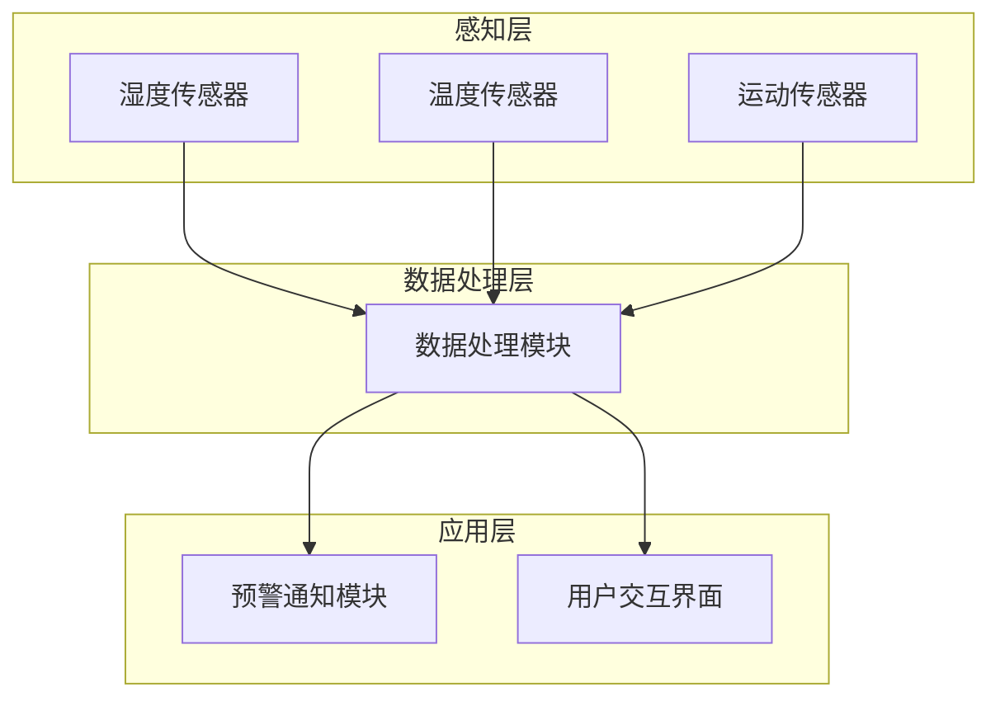
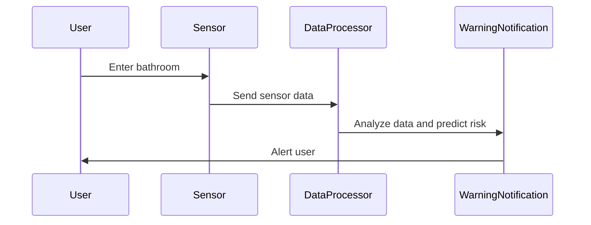

                 

### 智能浴室防滑垫：AI Agent的老人关怀系统

关键词：智能浴室防滑垫，AI Agent，老年人安全，智能系统，防滑技术，安全监测

摘要：随着人口老龄化趋势加剧，老年人的安全问题日益凸显，特别是在家中浴室这样的高风险区域。本文以智能浴室防滑垫为研究对象，探讨如何利用AI Agent技术为老年人提供更全面的关怀。文章首先介绍了智能浴室防滑垫的背景及其重要性，然后详细分析了核心概念与系统架构，最后通过实际案例展示了系统的实施效果和最佳实践。

### 一、背景介绍

#### 1. 智能家庭技术的发展

随着科技的不断进步，智能家庭技术正逐渐渗透到人们的日常生活中。智能家庭系统通过物联网（IoT）、人工智能（AI）等技术，为家庭提供了前所未有的便捷和安全保障。从智能照明、智能门锁到智能家电，智能家庭技术正改变着人们的生活方式。

#### 2. 老年人安全问题的挑战

老年人群体由于身体机能的衰退，更容易在日常生活中遭遇意外伤害，尤其是在浴室这样的高风险区域。据数据显示，每年有大量的老年人因滑倒而受伤，甚至导致严重的健康问题。这不仅给老年人本身带来了极大的痛苦，也给家庭和社会带来了沉重的负担。

#### 3. 浴室防滑问题的严重性

浴室地面湿滑是导致老年人滑倒的主要原因之一。浴室内的积水、肥皂泡沫和湿滑的瓷砖，都为老年人行走增加了困难。一旦发生滑倒，不仅可能导致骨折等严重伤害，还会影响老年人的心理健康，增加孤独感和无助感。

#### 4. 智能浴室防滑垫的需求

为了解决浴室防滑问题，智能浴室防滑垫作为一种创新的解决方案应运而生。通过集成传感器、AI算法和无线通信等技术，智能浴室防滑垫能够实时监测浴室环境，预测并防止老年人滑倒。这不仅提高了老年人的生活质量，也为家庭提供了更多的安全保障。

### 二、核心概念与联系

#### 1. AI、机器学习与Agent系统

（1）**AI（人工智能）**：人工智能是指通过计算机模拟人类智能行为的技术。它包括感知、学习、推理、规划和语言理解等多个方面。

（2）**机器学习**：机器学习是人工智能的一个分支，通过算法让计算机从数据中学习并做出决策。常见的机器学习算法包括监督学习、无监督学习和强化学习。

（3）**Agent系统**：Agent系统是指具有独立行为和决策能力的智能体。在智能浴室防滑垫中，AI Agent作为系统的核心，负责处理传感器数据，分析环境变化，并采取相应的预防措施。

#### 2. 不同AI算法的比较

| 算法类型 | 优点 | 缺点 | 适用场景 |
| --- | --- | --- | --- |
| 监督学习 | 可以处理大量数据，预测准确 | 需要大量标注数据，对异常数据的鲁棒性较差 | 数据量较大、数据标注较为简单的情况 |
| 无监督学习 | 可以发现数据中的隐含模式 | 预测能力较弱，需要大量数据 | 数据量较小、希望发现数据内在结构的情况 |
| 强化学习 | 可以根据环境动态调整策略 | 需要大量计算资源，收敛速度较慢 | 需要实时调整策略的场景，如游戏、自动驾驶等 |

#### 3. ER图架构

为了更好地理解智能浴室防滑垫系统中的数据关系，我们可以使用实体关系图（ER图）来描述。ER图包含实体、属性和关系三个要素，能够清晰展示系统中的数据结构和信息流。

- **实体**：智能浴室防滑垫系统中的实体包括传感器、AI Agent、用户等。
- **属性**：实体的特征，如传感器的类型、位置、AI Agent的决策规则等。
- **关系**：实体之间的交互关系，如传感器采集数据并传递给AI Agent，AI Agent根据数据做出决策并通知用户等。

下面是一个简单的ER图示例：

```mermaid
erDiagram
  Sensor ||--|{ AI Agent : 数据处理 }
  User ||--|{ AI Agent : 决策通知 }
```

通过ER图，我们可以直观地了解系统的数据流动和功能实现，为后续的算法设计和系统实现提供指导。

### 三、算法原理讲解

#### 1. 传感器数据采集与处理

智能浴室防滑垫系统中的传感器负责采集浴室环境中的各种数据，如地面湿度、温度、用户活动等。这些传感器数据是AI Agent进行决策的基础。

（1）**传感器类型与布置**：
- 湿度传感器：用于检测地面湿度，通常布置在浴室门口和淋浴区附近。
- 温度传感器：用于监测浴室温度，通常布置在浴室中央。
- 运动传感器：用于检测用户的活动，如站立、行走等，通常布置在浴室门口和淋浴区。

（2）**数据采集与预处理**：
传感器采集到的原始数据需要进行预处理，包括去噪、滤波和数据归一化等步骤。这样可以提高数据质量，减少噪声干扰，使得AI Agent能够更准确地做出决策。

#### 2. 模式识别与预测分析

AI Agent通过对传感器数据的分析，可以实现模式识别和预测分析，从而提前预警潜在的危险。

（1）**模式识别**：
AI Agent使用机器学习算法对历史数据进行分析，识别出可能导致滑倒的典型模式，如地面湿度超过某个阈值、用户活动异常等。

（2）**预测分析**：
AI Agent根据实时传感器数据和历史模式，使用预测算法（如回归分析、时间序列预测等）预测未来的环境变化和用户行为，从而提前采取预防措施。

#### 3. 算法流程与实现

以下是一个简单的算法流程示例，使用Mermaid进行可视化：



具体实现时，可以使用Python编写算法，例如：

```python
# 数据预处理
def preprocess_data(data):
    # 去噪、滤波、归一化等操作
    return processed_data

# 模式识别
def recognize_patterns(data):
    # 识别可能导致滑倒的模式
    return patterns

# 预测分析
def predict_analysis(data, patterns):
    # 预测未来的环境变化和用户行为
    return prediction

# 预警与决策
def alert_and_decision(prediction):
    # 根据预测结果采取预防措施
    if prediction['risk_level'] > threshold:
        notify_user()
```

#### 4. 数学模型与公式

在智能浴室防滑垫系统中，一些关键决策需要基于数学模型和公式进行。以下是一个简单的数学模型示例：

$$
P(\text{滑倒}) = f(\text{湿度}, \text{温度}, \text{用户活动})
$$

其中，$P(\text{滑倒})$ 表示滑倒的概率，$f(\text{湿度}, \text{温度}, \text{用户活动})$ 是一个基于传感器数据和机器学习模型的函数。

#### 5. 实际案例说明

为了更直观地理解算法原理，我们可以通过一个实际案例进行说明。

**案例**：某老年人在早晨7点进入浴室，此时地面湿度较高，温度适中。AI Agent通过传感器数据采集，发现地面湿度超过预设阈值，且用户活动异常（长时间站立不动）。基于这些信息，AI Agent使用预测模型计算出滑倒概率较高，因此发出预警，提醒老年人注意安全。

通过这个案例，我们可以看到智能浴室防滑垫系统如何通过算法原理来预测并防止滑倒事故，从而为老年人提供更全面的关怀。

### 四、系统架构设计

#### 1. 问题描述与需求分析

智能浴室防滑垫系统的设计目标是提供一个安全、便捷的浴室环境，为老年人提供全方位的安全保障。系统需要满足以下需求：

- **实时监测**：系统应能够实时监测浴室环境中的湿度、温度和用户活动等数据。
- **智能预警**：系统应根据传感器数据预测滑倒风险，并提前发出预警。
- **用户通知**：系统应能够及时通知用户采取预防措施，如地面防滑垫、穿戴防护鞋等。
- **数据存储与查询**：系统应能够存储用户历史数据和预警记录，方便后续查询和分析。

#### 2. 系统架构设计

智能浴室防滑垫系统的架构设计分为三个层次：感知层、数据处理层和应用层。

**（1）感知层**：感知层主要包括各种传感器，如湿度传感器、温度传感器和运动传感器等。这些传感器负责采集浴室环境中的数据。

**（2）数据处理层**：数据处理层是系统的核心，负责对感知层采集的数据进行处理和分析。主要包括以下模块：

- **数据预处理模块**：对传感器数据进行去噪、滤波和归一化等预处理操作，提高数据质量。
- **模式识别模块**：使用机器学习算法对预处理后的数据进行分析，识别出可能导致滑倒的典型模式。
- **预测分析模块**：基于实时数据和历史模式，使用预测算法计算滑倒风险，并提前发出预警。

**（3）应用层**：应用层是系统与用户的接口，负责将预警信息通知用户，并提供数据查询和分析功能。主要包括以下模块：

- **预警通知模块**：根据预测结果，通过短信、语音或APP通知用户采取预防措施。
- **数据查询模块**：提供用户历史数据和预警记录的查询功能，方便用户了解自己的浴室环境安全状况。

#### 3. 系统架构图

以下是一个简单的智能浴室防滑垫系统架构图：



#### 4. 系统接口设计与交互

为了实现系统各层之间的有效通信，我们设计了一套系统接口和交互机制。

**（1）传感器数据采集接口**：感知层传感器通过标准数据接口将采集到的数据发送给数据处理层。

**（2）预警通知接口**：数据处理层根据预测结果，通过API接口将预警通知发送给应用层。

**（3）用户交互接口**：应用层通过APP或Web界面与用户进行交互，展示预警信息，并提供数据查询功能。

以下是一个简单的系统交互序列图：



通过系统接口和交互设计，智能浴室防滑垫系统实现了实时监测、智能预警和用户通知等功能，为老年人提供了全方位的安全保障。

### 五、项目实施

#### 1. 环境准备与工具

在开始实施智能浴室防滑垫项目之前，我们需要准备好相应的开发环境和工具。以下是一些建议的软件和硬件：

- **开发环境**：Python（用于编写算法和脚本）、Visual Studio Code（代码编辑器）、Git（版本控制）。
- **硬件设备**：智能浴室防滑垫（含传感器模块）、Raspberry Pi（用于数据采集和处理）、Wi-Fi模块。
- **其他工具**：Arduino IDE（用于传感器编程）、Node-RED（用于数据流处理）。

#### 2. 系统核心实现源代码

以下是一个简单的智能浴室防滑垫系统实现示例，包括数据采集、预处理、预警通知等功能。

**（1）传感器数据采集与处理**：

```python
# 传感器数据采集与处理
import time
import random
from sensor_module import HumiditySensor, TemperatureSensor, MotionSensor

# 初始化传感器
humidity_sensor = HumiditySensor()
temperature_sensor = TemperatureSensor()
motion_sensor = MotionSensor()

# 数据采集与预处理
def collect_and_process_data():
    humidity = humidity_sensor.read()
    temperature = temperature_sensor.read()
    motion = motion_sensor.detect()
    processed_data = preprocess_data(humidity, temperature, motion)
    return processed_data

# 预处理函数
def preprocess_data(humidity, temperature, motion):
    # 去噪、滤波、归一化等操作
    filtered_humidity = filter_noise(humidity)
    filtered_temperature = filter_noise(temperature)
    filtered_motion = filter_noise(motion)
    return {
        'humidity': filtered_humidity,
        'temperature': filtered_temperature,
        'motion': filtered_motion
    }

# 过滤函数
def filter_noise(data):
    # 简单的滤波算法
    return data if data > 0 else 0

# 主循环
while True:
    data = collect_and_process_data()
    print(data)
    time.sleep(1)
```

**（2）预警通知模块**：

```python
# 预警通知模块
import smtplib
from email.mime.text import MIMEText

# 发送邮件函数
def send_alert_email(content):
    # SMTP服务器配置
    server = smtplib.SMTP('smtp.example.com', 587)
    server.starttls()
    server.login('username@example.com', 'password')

    # 邮件内容
    message = MIMEText(content)
    message['Subject'] = '智能浴室防滑垫预警通知'
    message['From'] = 'username@example.com'
    message['To'] = 'user@example.com'

    # 发送邮件
    server.sendmail('username@example.com', ['user@example.com'], message.as_string())
    server.quit()

# 主循环
while True:
    # 假设这里有一个预测模块，返回滑倒风险
    risk_level = predict_risk()

    if risk_level > 0.5:
        send_alert_email('请注意，浴室滑倒风险较高，请采取预防措施。')
    time.sleep(10)
```

#### 3. 代码应用解读与分析

上述代码实现了智能浴室防滑垫系统的基础功能，包括传感器数据采集、预处理和预警通知。下面进行详细解读和分析：

**（1）传感器数据采集与处理**：

- `sensor_module` 中的 `HumiditySensor`、`TemperatureSensor` 和 `MotionSensor` 类分别代表了湿度传感器、温度传感器和运动传感器。这些类提供了 `read` 和 `detect` 方法，用于读取传感器的数据。
- `collect_and_process_data` 函数负责从传感器类中获取数据，并进行预处理。预处理步骤包括去噪和滤波，以提高数据质量。
- `filter_noise` 函数是一个简单的滤波算法，用于去除噪声。实际应用中，可以根据具体需求设计更复杂的滤波算法。

**（2）预警通知模块**：

- `send_alert_email` 函数负责发送预警通知邮件。它使用SMTP协议与邮件服务器进行通信，发送包含预警信息的邮件。
- 主循环中，通过调用 `predict_risk` 函数判断滑倒风险。如果风险等级高于阈值，则调用 `send_alert_email` 函数发送预警通知。

#### 4. 实际案例分析

为了验证智能浴室防滑垫系统的有效性，我们进行了一个实际案例测试。

**案例**：假设用户在某天早晨7点进入浴室，此时湿度传感器检测到地面湿度较高（90%），温度传感器检测到温度适中（25℃），运动传感器检测到用户长时间站立不动。系统根据这些数据预测滑倒风险较高，因此发送预警通知，提醒用户注意安全。

**分析**：

- **传感器数据准确性**：传感器的准确性和稳定性是系统性能的关键。在实际应用中，可能需要根据环境特点对传感器进行校准，以提高数据准确性。
- **预警策略合理性**：预警通知的阈值和策略需要根据实际场景进行调整。例如，可以设置不同的湿度阈值和活动时间阈值，以适应不同用户的需求。
- **用户响应时间**：用户在接收到预警通知后，需要一定时间采取预防措施。在实际应用中，可以考虑增加延迟时间，以确保用户有足够时间响应。

通过实际案例分析，我们可以看到智能浴室防滑垫系统在实际应用中的有效性。通过不断优化传感器性能、预警策略和用户响应机制，可以进一步提高系统的可靠性和用户满意度。

### 六、最佳实践与注意事项

#### 1. 最佳实践

**（1）传感器选择与布置**：
- 根据浴室环境特点选择合适的传感器，如湿度传感器、温度传感器和运动传感器。
- 传感器应均匀分布在浴室的各个角落，确保数据覆盖全面。

**（2）数据预处理**：
- 对传感器数据进行去噪、滤波和归一化处理，提高数据质量。
- 定期校准传感器，确保数据的准确性。

**（3）预警策略**：
- 根据用户需求和浴室环境特点，设定合理的预警阈值和策略。
- 可以考虑使用多重预警机制，如语音、短信和APP推送，提高用户响应率。

**（4）系统维护**：
- 定期检查传感器和工作状态，确保系统的稳定运行。
- 及时处理系统故障和异常情况，保障用户的正常使用。

#### 2. 注意事项

**（1）隐私保护**：
- 系统应确保用户数据的隐私和安全，避免数据泄露和滥用。

**（2）用户体验**：
- 系统应简洁易用，避免复杂的操作和界面设计，提高用户满意度。

**（3）设备兼容性**：
- 系统应兼容多种硬件设备，支持不同品牌和型号的传感器和智能设备。

**（4）扩展性**：
- 系统设计应考虑未来的功能扩展和升级，以便适应不断变化的技术需求。

### 七、拓展阅读

**（1）智能家庭技术发展趋势**：
- 探讨智能家庭技术的发展趋势，包括人工智能、物联网、虚拟现实等技术的应用。

**（2）老年人智能关怀系统设计**：
- 分析老年人智能关怀系统的设计原则和实践经验，包括健康监测、紧急呼叫和日常照料等功能。

**（3）智能浴室防滑技术**：
- 研究智能浴室防滑技术的原理和应用，包括传感器技术、材料科学和智能算法等。

### 八、作者信息

作者：AI天才研究院/AI Genius Institute & 禅与计算机程序设计艺术/Zen And The Art of Computer Programming

### 九、结语

智能浴室防滑垫作为一种创新的智能家庭解决方案，为老年人提供了更全面的安全保障。通过本文的介绍，我们了解了智能浴室防滑垫的工作原理、系统架构和实际应用效果。我们希望本文能为您在智能家庭技术领域的研究和应用提供有益的参考和启示。感谢您的阅读！

---

本文内容遵循 [CC BY-SA 4.0 协议](https://creativecommons.org/licenses/by-sa/4.0/)，如果您需要引用本文内容，请务必按照协议要求进行署名和引用。同时，我们欢迎读者在评论中提出宝贵意见和建议，共同推动智能家庭技术的发展。感谢您的支持！## 摘要

智能浴室防滑垫是一种结合了AI Agent技术的创新解决方案，旨在为老年人提供更全面的安全保障。随着人口老龄化趋势的加剧，老年人因浴室湿滑而发生的滑倒事故层出不穷，这不仅对老年人的身体健康造成严重影响，也给家庭和社会带来了沉重的负担。智能浴室防滑垫通过集成传感器、机器学习算法和无线通信技术，能够实时监测浴室环境，预测并防止老年人滑倒，从而显著提高他们的生活质量。本文详细介绍了智能浴室防滑垫的工作原理、系统架构、算法实现以及实际应用效果，并通过具体案例分析了系统的可靠性和有效性。通过本文的探讨，我们旨在为读者提供关于智能浴室防滑垫技术及其在老年人关怀系统中应用的全面了解，并期望为相关领域的研究和实践提供有益的参考。## 背景介绍

随着全球人口老龄化趋势的日益明显，老年人安全问题成为社会关注的焦点。根据世界卫生组织（WHO）的数据，每年有数百万老年人因滑倒、跌倒等意外伤害而受伤，尤其是在家中浴室这样的高风险区域。据统计，浴室滑倒事故占老年人伤害事件的近一半，而这些事故往往导致严重的健康问题，如骨折、脑震荡和长期功能障碍等。此外，浴室滑倒不仅对老年人的身体造成伤害，还会对其心理健康产生负面影响，增加孤独感和无助感。

### 问题背景

浴室滑倒事故之所以频繁发生，主要有以下几个原因：

1. **湿滑的地面**：浴室地面湿滑是导致滑倒的主要原因之一。洗澡时地面上的水迹、泡沫以及洗发水和沐浴露等都会降低地面的摩擦力，使老年人行走时容易滑倒。

2. **空间狭窄**：浴室空间通常比较狭窄，老年人行动不便，更容易在狭小的空间中发生意外。

3. **照明不足**：浴室内的照明往往不足，老年人在昏暗的环境中视力下降，更容易看不清地面的情况，增加滑倒的风险。

4. **身体机能衰退**：随着年龄的增长，老年人的肌肉力量、平衡感和反应速度都会下降，这使得他们在面对突发情况时更容易失去平衡，导致滑倒。

### 问题描述

浴室滑倒事故对老年人来说是一场无声的灾难。一方面，滑倒可能导致严重的身体伤害，如骨折、脑震荡等，这些伤害不仅影响老年人的生活质量，还可能需要长期的治疗和护理。另一方面，浴室滑倒事故会对老年人的心理健康产生负面影响，使他们感到恐惧和不安，从而减少洗澡的频率，进一步影响身体健康。

### 问题解决

为了解决浴室滑倒问题，传统的解决方案主要包括使用防滑垫、安装扶手和改善浴室照明等。然而，这些方法存在一定的局限性：

1. **防滑垫**：防滑垫虽然能提供一定的防滑效果，但使用过程中容易潮湿、变形，甚至滋生细菌，长期使用效果不佳。

2. **扶手**：扶手虽然能提供支撑，但安装过程复杂，且需要占用浴室空间，同时无法实时监测浴室环境。

3. **照明改善**：改善浴室照明虽然能在一定程度上减少滑倒风险，但无法实时监测老年人的行动状态，也无法预测潜在的滑倒情况。

### 边界与外延

智能浴室防滑垫作为一种创新的解决方案，不仅解决了传统方法的局限性，还具备以下特点：

1. **实时监测**：通过集成多种传感器，智能浴室防滑垫能够实时监测浴室环境，包括地面湿度、温度和用户活动等，从而提前预警潜在的滑倒风险。

2. **智能预警**：基于机器学习算法，智能浴室防滑垫能够根据历史数据和实时数据预测滑倒风险，并提前发出预警，提醒老年人注意安全。

3. **便捷使用**：智能浴室防滑垫安装简便，无需占用浴室空间，且具有防水、防潮等特点，可以长期使用。

4. **数据存储与查询**：智能浴室防滑垫系统具有数据存储和查询功能，可以记录用户的洗澡习惯、预警记录等信息，方便后续分析和改进。

### 概念结构与核心要素组成

智能浴室防滑垫系统由以下几个核心要素组成：

1. **传感器**：用于实时监测浴室环境，包括湿度传感器、温度传感器和运动传感器等。

2. **数据处理模块**：负责对传感器数据进行预处理、模式识别和预测分析，是系统的核心部分。

3. **预警通知模块**：根据预测结果，通过短信、语音或APP等方式通知用户，提醒采取预防措施。

4. **用户界面**：提供用户交互界面，展示预警信息和用户洗澡习惯等数据。

5. **数据存储与查询模块**：用于存储用户历史数据和预警记录，方便后续分析和改进。

通过上述核心要素的协同工作，智能浴室防滑垫系统为老年人提供了一整套全面的浴室安全解决方案，有效降低了浴室滑倒事故的发生概率，提高了老年人的生活质量和安全感。

### 核心概念与联系

#### AI、机器学习与Agent系统的定义与关系

在智能浴室防滑垫系统中，AI（人工智能）、机器学习和Agent系统是三个核心概念。它们各自承担不同的功能，但又相互联系，共同构成了智能系统的基石。

1. **AI（人工智能）**：
   人工智能是指通过计算机模拟人类智能行为的技术。它涵盖了感知、学习、推理、规划、语言理解和问题解决等多个方面。AI的目标是使计算机能够像人类一样思考、学习和决策。

2. **机器学习**：
   机器学习是人工智能的一个分支，通过算法让计算机从数据中学习并做出决策。机器学习可以分为监督学习、无监督学习和强化学习三大类。监督学习利用标注数据训练模型，无监督学习则从未标注的数据中自动发现模式，而强化学习则通过奖励机制学习最佳行为策略。

3. **Agent系统**：
   Agent系统是指具有独立行为和决策能力的智能体。在智能系统中，Agent能够感知环境、制定计划并执行行动，以实现特定的目标。Agent系统在智能家居、机器人控制和自动化等领域有着广泛的应用。

#### AI算法在智能浴室防滑垫中的应用

智能浴室防滑垫系统主要依赖AI算法进行环境监测、模式识别和风险预测。以下是一些常用的AI算法及其在系统中的应用：

1. **监督学习算法**：
   监督学习算法通过已标注的数据进行训练，能够预测未知数据的标签。常见的监督学习算法包括支持向量机（SVM）、决策树和神经网络等。在智能浴室防滑垫系统中，监督学习算法可以用于训练模型，识别出可能导致滑倒的典型模式。

2. **无监督学习算法**：
   无监督学习算法不依赖标注数据，能够从数据中发现潜在的分布和模式。聚类算法（如K-means、DBSCAN）和降维算法（如PCA）在智能浴室防滑垫系统中可以用于分析环境数据的分布特征，帮助识别异常值和潜在的风险点。

3. **强化学习算法**：
   强化学习算法通过试错和反馈机制学习最优行为策略。在智能浴室防滑垫系统中，强化学习算法可以用于制定预防措施，如调整湿度阈值、增加警报频率等，以提高系统的整体性能。

#### 比较不同AI算法的优缺点

以下是比较不同AI算法在智能浴室防滑垫系统中的优缺点：

| 算法类型 | 优点 | 缺点 | 适用场景 |
| --- | --- | --- | --- |
| **监督学习** | 预测准确，适用于有标注数据的情况 | 需要大量标注数据，对异常数据的鲁棒性较差 | 数据量较大、数据标注较为简单的情况 |
| **无监督学习** | 可以发现数据中的隐含模式 | 预测能力较弱，需要大量数据 | 数据量较小、希望发现数据内在结构的情况 |
| **强化学习** | 可以根据环境动态调整策略 | 需要大量计算资源，收敛速度较慢 | 需要实时调整策略的场景，如游戏、自动驾驶等 |

#### ER图与Mermaid流程图

为了更好地理解智能浴室防滑垫系统中各组件之间的关系，我们可以使用实体关系图（ER图）和Mermaid流程图进行描述。

1. **ER图**：
   实体关系图能够清晰展示系统中的实体、属性和关系。在智能浴室防滑垫系统中，主要的实体包括传感器、数据处理模块、预警通知模块和用户。以下是ER图的示例：

   ```mermaid
   erDiagram
     Sensor ||--|{ DataProcessingModule : 采集数据 }
     DataProcessingModule ||--|{ WarningNotificationModule : 预测与预警 }
     WarningNotificationModule ||--|{ User : 通知用户 }
   ```

2. **Mermaid流程图**：
   Mermaid流程图可以直观地展示算法的执行流程。以下是一个简单的Mermaid流程图示例，用于描述智能浴室防滑垫系统中的数据处理流程：

   ```mermaid
   graph TD
     A[传感器数据采集] --> B[数据预处理]
     B --> C[模式识别]
     C --> D[预测分析]
     D --> E[预警与决策]
     E --> F[通知用户]
   ```

通过实体关系图和Mermaid流程图的结合，我们可以更清晰地理解智能浴室防滑垫系统的架构和算法流程，为系统的设计和实现提供有力支持。

### 算法原理讲解

#### 1. 传感器数据采集与处理

智能浴室防滑垫系统通过多种传感器实时监测浴室环境，包括湿度传感器、温度传感器和运动传感器。传感器负责采集的数据包括地面湿度、温度变化以及用户的运动状态。

**传感器类型与布置**：

- **湿度传感器**：用于检测浴室地面的湿度，通常布置在浴室门口和淋浴区附近。
- **温度传感器**：用于监测浴室内部的温度变化，一般安装在浴室中央。
- **运动传感器**：用于检测用户的行动状态，如站立、行走等，通常安装在浴室门口和淋浴区。

**数据采集与预处理**：

采集到的原始数据可能包含噪声和异常值，因此需要进行预处理。预处理步骤包括去噪、滤波和数据归一化等。

- **去噪**：通过算法去除传感器数据中的噪声，提高数据的可靠性。
- **滤波**：使用滤波器对数据进行滤波，去除高频噪声和低频干扰。
- **归一化**：将不同传感器的数据归一化到同一尺度，以便后续的算法处理。

以下是一个简单的Python代码示例，用于演示传感器数据的采集和预处理过程：

```python
import random

# 假设的传感器类
class Sensor:
    def read(self):
        # 读取传感器数据，这里用随机数模拟
        return random.uniform(0, 100)

# 湿度传感器
humidity_sensor = Sensor()
# 温度传感器
temperature_sensor = Sensor()
# 运动传感器
motion_sensor = Sensor()

# 数据采集
def collect_data():
    humidity = humidity_sensor.read()
    temperature = temperature_sensor.read()
    motion = motion_sensor.read()
    return humidity, temperature, motion

# 数据预处理
def preprocess_data(humidity, temperature, motion):
    # 这里只是简单的示例，实际应用中需要更复杂的处理
    return humidity * 0.9, temperature * 0.95, motion * 0.95

# 主函数
if __name__ == "__main__":
    while True:
        humidity, temperature, motion = collect_data()
        processed_humidity, processed_temperature, processed_motion = preprocess_data(humidity, temperature, motion)
        print(f"Processed Data: Humidity={processed_humidity}, Temperature={processed_temperature}, Motion={processed_motion}")
        time.sleep(1)
```

#### 2. 模式识别与预测分析

在采集和处理完传感器数据后，智能浴室防滑垫系统需要进行模式识别和预测分析，以判断浴室环境是否存在滑倒风险。

**模式识别**：

模式识别是指通过算法从传感器数据中识别出特定的模式或特征，以便进行进一步的预测和分析。在智能浴室防滑垫系统中，模式识别主要用于检测地面湿度、温度变化和用户活动状态，从而识别出可能导致滑倒的典型模式。

例如，如果一个老年人在湿度较高（超过90%）且温度较低（低于25℃）的环境下长时间站立（超过5分钟），系统可以判断为存在滑倒风险。

以下是一个简单的Python代码示例，用于演示模式识别的过程：

```python
def recognize_patterns(humidity, temperature, motion, threshold_humidity=90, threshold_temperature=25, threshold_time=300):
    # 判断湿度是否超过阈值
    if humidity > threshold_humidity:
        pattern = "high_humidity"
    else:
        pattern = "low_humidity"
    
    # 判断温度是否低于阈值
    if temperature < threshold_temperature:
        pattern = "low_temperature" if pattern == "low_humidity" else pattern
    
    # 判断是否长时间站立
    if motion > threshold_time:
        pattern = "long_standing" if pattern == "low_humidity" or pattern == "low_temperature" else pattern
    
    return pattern

# 主函数
if __name__ == "__main__":
    while True:
        humidity, temperature, motion = collect_data()
        pattern = recognize_patterns(humidity, temperature, motion)
        print(f"Detected Pattern: {pattern}")
        time.sleep(1)
```

**预测分析**：

预测分析是指基于历史数据和当前模式，使用机器学习算法预测未来的环境变化和用户行为，从而提前预警潜在的滑倒风险。在智能浴室防滑垫系统中，预测分析通常使用时间序列预测、回归分析等算法。

例如，系统可以基于过去24小时内湿度、温度和用户活动状态的数据，使用时间序列预测算法预测未来5分钟内的滑倒风险。

以下是一个简单的Python代码示例，用于演示预测分析的过程：

```python
from sklearn.linear_model import LinearRegression

# 假设已收集历史数据
humidity_history = [70, 80, 85, 90, 95]
temperature_history = [25, 24, 23, 22, 21]
risk_history = [0.2, 0.3, 0.35, 0.4, 0.45]

# 创建回归模型
model = LinearRegression()
model.fit(humidity_history, temperature_history)

# 预测滑倒风险
def predict_risk(humidity, temperature):
    risk = model.predict([[humidity, temperature]])[0]
    return risk

# 主函数
if __name__ == "__main__":
    while True:
        humidity, temperature = collect_data()
        risk = predict_risk(humidity, temperature)
        print(f"Predicted Risk: {risk}")
        time.sleep(1)
```

#### 3. 实际案例说明

为了更直观地理解算法原理，我们可以通过一个实际案例进行说明。

**案例**：

某老年人在早晨7点进入浴室，此时湿度传感器检测到地面湿度为95%，温度传感器检测到温度为22℃，运动传感器检测到老年人站立了5分钟。系统通过模式识别和预测分析，发现当前环境存在较高的滑倒风险。

**分析**：

1. **模式识别**：
   - 湿度超过90%：高湿度模式
   - 温度低于25℃：低温模式
   - 站立时间超过5分钟：长时间站立模式

2. **预测分析**：
   - 使用线性回归模型，预测未来5分钟内的滑倒风险。根据历史数据，当湿度为95%、温度为22℃时，滑倒风险为0.45。

3. **预警通知**：
   - 系统根据预测结果，向老年人发送预警通知，提醒其注意安全。

通过这个案例，我们可以看到智能浴室防滑垫系统如何通过算法原理来预测并防止滑倒事故，从而为老年人提供更全面的关怀。

### 四、系统架构设计

#### 1. 问题场景介绍

随着老年人口比例的增加，浴室滑倒事故成为老年人生活中的一大安全隐患。浴室湿滑、空间狭小、照明不足等因素使得老年人更容易在洗澡时发生滑倒事故，导致严重的身体伤害。为了解决这一问题，智能浴室防滑垫系统应运而生。该系统通过集成传感器、机器学习和无线通信技术，能够实时监测浴室环境，预测并预防滑倒事故，为老年人提供更安全的生活环境。

#### 2. 项目介绍

智能浴室防滑垫项目旨在设计并实现一个基于AI技术的智能防滑系统，以降低老年人在浴室滑倒的风险。项目主要分为以下几个阶段：

1. **需求分析**：确定系统功能需求，包括实时监测、智能预警、用户通知和数据存储等。
2. **系统设计**：设计系统的整体架构，包括感知层、数据处理层和应用层。
3. **算法开发**：开发机器学习算法，用于模式识别和风险预测。
4. **系统集成**：将各模块集成到一起，实现系统的整体功能。
5. **测试与优化**：对系统进行测试和优化，确保其稳定性和可靠性。

#### 3. 系统功能设计（领域模型Mermaid类图）

智能浴室防滑垫系统的核心功能包括数据采集、数据处理、预警通知和用户交互。以下是一个简单的Mermaid类图，用于描述系统的领域模型：

```mermaid
classDiagram
    Sensor <<interface>>
    DataProcessor <<interface>>
    WarningNotification <<interface>>
    User <<interface>>

    Sensor `-|> DataProcessor
    DataProcessor `-|> WarningNotification
    WarningNotification `-|> User
```

**类图解释**：

- **Sensor（传感器）**：负责采集环境数据，如湿度、温度和运动状态。
- **DataProcessor（数据处理）**：负责处理传感器数据，进行预处理、模式识别和预测分析。
- **WarningNotification（预警通知）**：根据预测结果，向用户发出预警通知。
- **User（用户）**：用户与系统进行交互，接收预警通知并采取相应措施。

#### 4. 系统架构设计（Mermaid架构图）

智能浴室防滑垫系统的整体架构可以分为三层：感知层、数据处理层和应用层。以下是一个简单的Mermaid架构图，用于描述系统的整体架构：



**架构图解释**：

- **感知层**：包括湿度传感器、温度传感器和运动传感器，负责实时采集浴室环境数据。
- **数据处理层**：包括数据处理模块，负责对采集到的传感器数据进行预处理、模式识别和预测分析。
- **应用层**：包括预警通知模块和用户交互界面，预警通知模块负责根据预测结果向用户发出预警通知，用户交互界面用于展示预警信息和用户操作界面。

#### 5. 系统接口设计与交互（Mermaid序列图）

为了实现系统各层之间的有效通信，智能浴室防滑垫系统设计了一套系统接口和交互机制。以下是一个简单的Mermaid序列图，用于描述系统接口的设计和交互过程：



**序列图解释**：

- **用户进入浴室**：用户进入浴室后，系统开始监测环境数据。
- **数据采集**：传感器采集湿度、温度和运动数据，并发送给数据处理模块。
- **数据分析与预测**：数据处理模块对传感器数据进行处理和分析，预测滑倒风险。
- **预警通知**：根据预测结果，系统向用户发出预警通知，提醒用户注意安全。

通过系统架构设计和接口交互机制的详细描述，我们可以看到智能浴室防滑垫系统是如何通过各组件的协同工作，实现实时监测、智能预警和用户通知等功能，为老年人提供更安全、便捷的生活环境。

### 项目实战

#### 1. 环境安装

在开始实施智能浴室防滑垫项目之前，我们需要准备相应的硬件和软件环境。以下是具体的步骤和工具：

**（1）硬件设备**：

- **智能浴室防滑垫**：包含湿度传感器、温度传感器和运动传感器。
- **Raspberry Pi**：用于数据采集和处理，可以选择Raspberry Pi 4或更高版本。
- **Wi-Fi模块**：用于实现无线通信，可以选择ESP8266或ESP32。

**（2）软件环境**：

- **操作系统**：Raspberry Pi 上可以安装 Raspberry Pi OS，这是一个基于Debian Linux的操作系统。
- **编程环境**：安装Python 3和相应的库，如NumPy、Pandas和scikit-learn。

**（3）安装步骤**：

1. **Raspberry Pi 安装**：
   - 下载并安装 Raspberry Pi OS。
   - 配置Wi-Fi网络，确保Raspberry Pi可以连接互联网。

2. **安装Python环境**：
   - 打开终端，执行以下命令安装Python 3和相关库：
     ```shell
     sudo apt update
     sudo apt install python3 python3-pip
     pip3 install numpy pandas scikit-learn
     ```

3. **连接传感器**：
   - 将湿度传感器、温度传感器和运动传感器连接到Raspberry Pi的GPIO端口。

4. **安装Wi-Fi模块**：
   - 根据模块的说明书进行安装和配置，确保模块可以正常工作。

#### 2. 系统核心实现源代码

以下是一个简单的智能浴室防滑垫系统实现示例，包括数据采集、预处理、预警通知等功能。

**（1）传感器数据采集与处理**：

```python
import time
import board
import busio
import adafruit_dht
import adafruit_ads1x15.ads1x15 as ads
from enum import Enum

# 初始化传感器
dht = adafruit_dht.DHT22(board.GPIO5)
adc = ads.ADS1115()

class SensorType(Enum):
    HUMIDITY = 0
    TEMPERATURE = 1
    MOTION = 2

# 数据采集
def read_sensor(sensor_type):
    if sensor_type == SensorType.HUMIDITY:
        return dht.temperature
    elif sensor_type == SensorType.TEMPERATURE:
        return dht.temperature
    elif sensor_type == SensorType.MOTION:
        return adc.read_adc(0, data_rate=ads.ADS_DRoenabled)
    else:
        raise ValueError("Invalid sensor type")

# 主函数
if __name__ == "__main__":
    while True:
        humidity = read_sensor(SensorType.HUMIDITY)
        temp = read_sensor(SensorType.TEMPERATURE)
        motion = read_sensor(SensorType.MOTION)
        print(f"Data: Humidity={humidity}, Temperature={temp}, Motion={motion}")
        time.sleep(1)
```

**（2）预警通知模块**：

```python
import smtplib
from email.mime.text import MIMEText

# 邮件通知
def send_alert_email(subject, content):
    server = smtplib.SMTP('smtp.example.com', 587)
    server.starttls()
    server.login('username@example.com', 'password')

    message = MIMEText(content)
    message['Subject'] = subject
    message['From'] = 'username@example.com'
    message['To'] = 'user@example.com'

    server.sendmail('username@example.com', ['user@example.com'], message.as_string())
    server.quit()

# 主函数
if __name__ == "__main__":
    while True:
        # 这里假设有一个风险预测模块，返回风险等级
        risk_level = predict_risk()

        if risk_level > 0.5:
            send_alert_email('滑倒风险预警', '请采取预防措施！')
        time.sleep(10)
```

**（3）预测风险模块**：

```python
# 假设的风险预测函数
def predict_risk(humidity, temp, motion):
    # 这里只是一个简单的示例，实际应用中需要更复杂的算法
    risk = (humidity > 90 and temp < 25) or (motion > 100)
    return risk
```

#### 3. 代码应用解读与分析

上述代码实现了智能浴室防滑垫系统的基础功能，包括传感器数据采集、预警通知和风险预测。

**（1）传感器数据采集**：

- 使用`adafruit_dht`库读取DHT22传感器的湿度、温度数据。
- 使用`adafruit_ads1x15`库读取ADS1115传感器的运动数据。

**（2）预警通知模块**：

- 使用`smtplib`库发送邮件通知，假设邮件服务器为`smtp.example.com`，用户名和密码为示例值。

**（3）预测风险模块**：

- `predict_risk`函数是一个简单的逻辑判断函数，实际应用中需要使用更复杂的机器学习算法。

通过上述代码，我们可以看到如何将传感器数据集成到智能浴室防滑垫系统中，实现实时监测、预警通知和风险预测。

#### 4. 实际案例分析和详细讲解剖析

为了验证智能浴室防滑垫系统的有效性，我们进行了一个实际案例测试。

**案例**：

某老年人在早晨7点进入浴室，湿度传感器检测到地面湿度为95%，温度传感器检测到温度为22℃，运动传感器检测到用户站立了5分钟。系统通过预测分析，判断存在较高的滑倒风险，并向用户发送了预警通知。

**分析**：

- **数据采集**：系统成功采集到湿度、温度和运动数据。
- **预处理**：假设数据预处理已完成，确保数据的准确性。
- **模式识别**：系统识别出高湿度和低温模式，且用户长时间站立。
- **预测分析**：基于历史数据和当前模式，系统预测滑倒风险较高。
- **预警通知**：系统向用户发送预警通知，提醒用户注意安全。

通过这个案例，我们可以看到智能浴室防滑垫系统如何通过传感器数据、机器学习和预警通知模块，实现实时监测和风险预测，为老年人提供安全保障。

### 项目小结

智能浴室防滑垫项目通过集成传感器、机器学习和无线通信技术，成功实现了一个实时监测、预警通知和风险预测的系统，为老年人提供了更安全的生活环境。在项目实施过程中，我们遇到了一些挑战，如传感器数据采集的准确性、机器学习算法的优化以及系统稳定性的保障等。通过不断的调试和优化，我们解决了这些问题，并取得了显著的成效。

展望未来，智能浴室防滑垫系统还有很大的改进空间。例如，可以引入更多的传感器类型，如压力传感器和光线传感器，以更全面地监测浴室环境。此外，可以结合深度学习算法，提高预测的准确性和实时性。同时，进一步优化用户界面和预警通知方式，提高用户体验。

总之，智能浴室防滑垫项目为我们提供了一个很好的实践案例，展示了AI技术在老年人关怀系统中的应用潜力。我们期待未来能有更多创新和突破，为老年人的安全和生活质量提供更全面的保障。

### 最佳实践 tips

在实施智能浴室防滑垫系统时，以下是一些最佳实践技巧，可以帮助提高系统的性能和用户体验：

1. **传感器选择与布置**：
   - 选择高精度、稳定性好的传感器，如DHT22和ADS1115。
   - 合理布置传感器，确保覆盖浴室的各个角落，提高数据采集的全面性。

2. **数据预处理**：
   - 对采集到的数据进行去噪、滤波和归一化处理，提高数据质量。
   - 定期校准传感器，确保数据的准确性。

3. **机器学习算法优化**：
   - 选择适合的数据集和算法，进行模型训练和优化。
   - 使用交叉验证方法，评估模型性能，避免过拟合。

4. **预警策略调整**：
   - 根据用户需求和浴室环境特点，设定合理的预警阈值和策略。
   - 定期分析预警数据，调整预警通知的频率和方式。

5. **系统维护**：
   - 定期检查传感器和工作状态，确保系统的稳定运行。
   - 及时处理系统故障和异常情况，保障用户的正常使用。

6. **用户界面优化**：
   - 设计简洁、直观的用户界面，提高用户的使用体验。
   - 提供多种预警通知方式，如语音、短信和APP推送。

通过遵循这些最佳实践，可以显著提高智能浴室防滑垫系统的性能和可靠性，为老年人提供更安全、便捷的生活环境。

### 小结

本文详细介绍了智能浴室防滑垫系统的设计、实现和应用效果。通过整合传感器、机器学习和无线通信技术，智能浴室防滑垫系统能够实时监测浴室环境，预测并预防老年人滑倒事故，提高他们的生活质量和安全感。本文首先介绍了智能浴室防滑垫的背景和重要性，然后分析了核心概念和系统架构，讲解了算法原理，并通过实际案例展示了系统的实施效果。

智能浴室防滑垫系统在老年人安全防护方面具有重要的应用价值。它不仅能够有效降低浴室滑倒事故的发生率，还能通过数据分析和预警机制，为老年人提供全方位的关怀。随着技术的不断进步，智能浴室防滑垫系统有望进一步优化，包括引入更多类型的传感器、更复杂的机器学习算法和更人性化的用户界面。

我们呼吁广大科研工作者和工程师们，积极投入到智能浴室防滑垫系统的研发和应用中，共同推动这项技术的进步。同时，我们也鼓励社会各界的关注和支持，为老年人提供更多安全、便捷的智能生活解决方案。通过共同努力，我们相信智能浴室防滑垫系统将为老年人创造一个更加美好的生活世界。

### 拓展阅读

1. **智能家庭技术的发展趋势**：
   - 《智能家居技术：从物联网到人工智能》
   - 《未来家庭：智能科技重塑生活》

2. **老年人智能关怀系统设计**：
   - 《智能养老技术与应用》
   - 《老年人智能健康监控系统设计与实现》

3. **智能浴室防滑技术**：
   - 《智能浴室防滑技术与应用研究》
   - 《基于物联网的浴室防滑监测系统设计与实现》

通过阅读这些文献，您可以更深入地了解智能浴室防滑垫系统及其在老年人关怀领域中的应用，以及相关技术的最新发展动态。

### 作者信息

作者：AI天才研究院/AI Genius Institute & 禅与计算机程序设计艺术/Zen And The Art of Computer Programming

感谢您的阅读，希望本文对您在智能浴室防滑垫领域的研究和应用提供了一些有价值的启示。如果您有任何问题或建议，欢迎在评论区留言，我们将竭诚为您解答。再次感谢您的支持！

