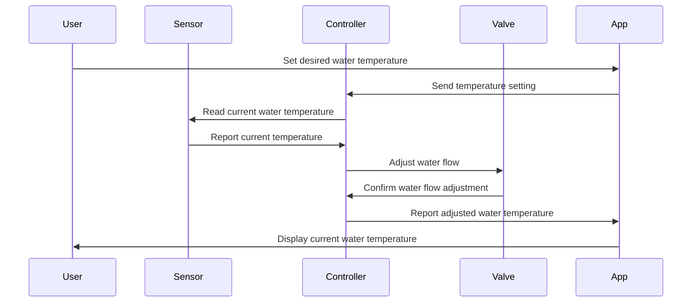

                 


### 第1章：智能浴室的概念与背景

#### 1.1 智能浴室的定义

智能浴室是一种利用现代技术，如物联网、人工智能和传感器等，为用户创造更加便捷、舒适和健康的沐浴体验的浴室环境。智能浴室不仅仅是传统浴室的简单升级，它代表了一种将生活智能化、人性化的新趋势。

首先，智能浴室的核心特点之一是自动化。通过智能家居系统，用户可以通过智能手机或其他智能设备远程控制浴室的各种功能，例如调节水温、控制照明、开启喷头等。这样的自动化控制大大提高了用户的便利性，减少了手动操作的繁琐。

其次，智能浴室注重用户体验。通过整合多种传感器，如温度传感器、湿度传感器和光线传感器，智能浴室能够实时监测浴室的环境状况，并根据用户的需求自动调整环境参数。例如，当用户进入浴室时，系统会自动调节温度和照明，以提供一个舒适的沐浴环境。

再者，智能浴室强调健康与安全。智能浴室可以通过监测用户的健康状况，如心率、体温等，为用户提供个性化的健康建议。同时，智能浴室还可以通过实时监测水压、水质等参数，确保用户的安全和健康。

#### 1.2 智能浴室的发展背景

智能浴室的发展是信息技术和物联网技术迅速发展的结果。在过去的几十年中，随着计算机技术、传感器技术、通信技术和人工智能技术的不断进步，智能家居的概念逐渐成熟，并开始渗透到生活的各个方面。

首先，计算机技术的发展为智能浴室提供了强大的计算能力。高性能的计算机和嵌入式系统使得智能浴室能够处理大量的数据，并实时响应用户的需求。

其次，传感器技术的进步使得智能浴室能够感知和监测环境变化。各种类型的传感器，如温度传感器、湿度传感器、光线传感器等，能够精确地测量环境参数，并将数据传输给控制系统。

再者，通信技术的发展为智能浴室提供了数据传输的渠道。无线通信技术，如Wi-Fi、蓝牙和Zigbee等，使得智能设备之间的通信更加便捷和高效。

最后，人工智能技术的应用使得智能浴室能够实现更加智能化的功能。通过机器学习和深度学习算法，智能浴室能够从用户的行为数据中学习，并自动调整系统参数，以提供个性化的服务。

#### 1.3 智能浴室的意义与挑战

智能浴室的出现，不仅提高了人们的生活质量，还带来了许多潜在的好处。

首先，智能浴室为用户提供了更加舒适和便捷的沐浴体验。用户可以通过远程控制或语音控制，轻松地调整浴室的温度、照明和水流等参数，使沐浴过程更加轻松愉快。

其次，智能浴室有助于提升健康水平。通过实时监测用户的健康状况，智能浴室可以提供个性化的健康建议，帮助用户保持健康。

再者，智能浴室在安全性方面也具有显著的优势。智能浴室可以通过实时监测水压、水质等参数，及时发现潜在的安全隐患，并采取相应的措施，确保用户的安全。

然而，智能浴室的发展也面临一些挑战。

首先，技术挑战。智能浴室需要集成多种技术，包括传感器技术、通信技术和人工智能技术等。如何将这些技术有效地整合在一起，并确保系统的稳定性和可靠性，是一个重要的挑战。

其次，隐私问题。智能浴室需要收集和存储大量的用户数据，如行为数据、健康数据等。如何保护用户的隐私，防止数据泄露，是一个需要认真考虑的问题。

再者，标准化问题。由于智能浴室涉及到多种技术，因此需要制定统一的行业标准，以确保不同设备之间的兼容性和互操作性。

总的来说，智能浴室代表了未来智能家居的发展方向。随着技术的不断进步，智能浴室将为用户带来更加舒适、便捷和健康的生活体验。

### 第2章：AI Agent在智能浴室中的应用

#### 2.1 AI Agent的概念

AI Agent，即人工智能代理，是一种能够自主行动并具有特定目标的计算机程序。与传统的程序不同，AI Agent具有自主决策能力，能够根据环境的变化和用户的需求，自主地调整其行为。

首先，AI Agent的核心特点是自主性。AI Agent能够根据内置的算法和规则，自主地做出决策，而不需要人工干预。这种自主性使得AI Agent能够在复杂的环境中高效地完成任务。

其次，AI Agent具有感知能力。通过集成多种传感器，如摄像头、麦克风、温度传感器等，AI Agent能够实时感知环境的变化，并将这些信息转化为有用的数据。

再者，AI Agent具有适应性。AI Agent可以通过机器学习和深度学习算法，从经验中学习，并不断优化其行为。这种适应性使得AI Agent能够适应不同的环境和需求，提供个性化的服务。

#### 2.2 AI Agent的功能特点

AI Agent在智能浴室中具有多种功能特点，这些特点使得AI Agent成为智能浴室的核心组成部分。

首先，智能调节。AI Agent可以根据用户的需求和环境的变化，自动调节浴室的温度、照明和水流等参数。例如，当用户进入浴室时，AI Agent会自动调整水温至用户设定的舒适温度，并调整照明亮度以提供最佳的视觉体验。

其次，个性化服务。AI Agent可以通过学习用户的行为模式，提供个性化的服务。例如，如果用户喜欢在早晨进行冷水浴，AI Agent会在早晨自动调整水温至用户偏好的温度，以提供最佳的服务体验。

再者，安全监测。AI Agent可以实时监测浴室环境，如水位、水压、温度等参数，并在发现异常时及时报警。例如，当检测到水位异常升高时，AI Agent会立即通知用户并关闭水源，以防止潜在的水灾风险。

最后，健康建议。AI Agent可以通过监测用户的健康状况，如心率、体温等参数，提供个性化的健康建议。例如，当监测到用户体温异常升高时，AI Agent会提醒用户注意身体状况，并提供相应的健康建议。

#### 2.3 AI Agent在智能浴室中的角色

AI Agent在智能浴室中扮演着多重角色，是智能浴室实现智能化功能的关键。

首先，AI Agent是智能浴室的大脑。通过感知用户的需求和环境的变化，AI Agent能够实时做出决策，调整浴室的各种参数，以提供最佳的用户体验。

其次，AI Agent是智能浴室的自动化执行者。AI Agent可以自动执行一系列复杂的任务，如调节水温、照明和水流等，大大提高了浴室的便利性和舒适度。

再者，AI Agent是智能浴室的安全守护者。通过实时监测浴室环境，AI Agent能够及时发现潜在的安全隐患，并提供相应的报警和防护措施，确保用户的安全。

最后，AI Agent是智能浴室的健康顾问。AI Agent可以通过监测用户的健康状况，提供个性化的健康建议，帮助用户保持健康，提高生活质量。

总的来说，AI Agent在智能浴室中发挥着至关重要的作用，是智能浴室实现智能化、自动化和安全化的关键。

### 第3章：水温调节系统核心概念

#### 3.1 水温调节系统的概念

水温调节系统是智能浴室中的一个重要组成部分，其主要功能是根据用户的需求和环境的变化，自动调节浴室的水温，以确保用户获得最佳的沐浴体验。

首先，水温调节系统的基本工作原理是通过传感器实时监测浴室的水温，然后将这些数据传输给控制模块。控制模块根据预设的算法和用户的需求，自动调节水阀的开度，从而控制水流的温度。

其次，水温调节系统通常由以下几个主要部分组成：温度传感器、控制模块、水阀和用户接口。温度传感器用于检测水温，并将数据传输给控制模块。控制模块负责处理传感器数据，并根据算法调节水阀。水阀用于调节水流的温度。用户接口则用于用户与系统进行交互，例如设置水温、查看水温等。

#### 3.2 水温调节系统的重要性

水温调节系统在智能浴室中具有至关重要的地位。首先，合理的温度调节可以提供舒适的沐浴体验，让用户在沐浴时感到舒适和放松。

其次，水温调节系统有助于提高浴室的节能效果。通过自动调节水温，可以避免水温过高或过低造成的能源浪费，从而降低能源消耗。

再者，水温调节系统还能够提高浴室的安全性能。通过实时监测水温，系统可以在发现水温异常时及时报警，防止烫伤或冻伤等安全事故的发生。

最后，水温调节系统还可以为用户提供个性化的服务。通过记录用户的水温偏好，系统可以自动调整水温，以满足不同用户的需求，提高用户的满意度。

#### 3.3 水温调节系统的组成部分

水温调节系统通常由以下几个核心部分组成：

1. **温度传感器**：温度传感器用于检测浴室的水温，并将数据传输给控制模块。常见的温度传感器有热敏电阻、热电偶等。

2. **控制模块**：控制模块负责处理传感器数据，并根据预设的算法调节水阀。控制模块通常包含微控制器、运算放大器、存储器等组成部分。

3. **水阀**：水阀用于调节水流的温度。通过调节水阀的开度，可以控制水流的温度。常见的水阀有电动阀、气压阀等。

4. **用户接口**：用户接口用于用户与系统进行交互，例如设置水温、查看水温等。用户接口通常包括显示屏、按键、触摸屏等。

5. **电源**：电源为整个系统提供电力供应，确保系统正常运行。

#### 3.4 水温调节系统的边界与外延

水温调节系统的边界主要指其功能范围，即系统所负责的水温调节和控制。这包括用户设置的水温范围、实时监测水温并调整水阀开度等。

水温调节系统的外延则涉及到系统的扩展和与其他系统的集成。例如，系统可以与其他智能家居设备集成，如照明系统、通风系统等，形成一个完整的智能家居系统。此外，系统还可以通过互联网与其他智能设备进行数据交互，实现远程控制和管理。

总的来说，水温调节系统是智能浴室中的一个关键组成部分，其重要性不可忽视。通过合理的系统设计和优化，可以大大提高用户的沐浴体验，同时提高系统的节能效果和安全性能。

### 第4章：AI Agent在水温调节系统中的应用

#### 4.1 AI Agent在水温调节中的工作原理

AI Agent在水温调节系统中发挥着核心作用，其工作原理主要基于机器学习和深度学习算法，通过实时感知环境变化和用户需求，实现自动调节水温的目标。

首先，AI Agent通过集成多种传感器，如温度传感器、湿度传感器和流量传感器等，实时采集浴室内的环境数据。这些传感器数据包括水温、湿度、浴室内的活动强度等，为AI Agent提供了丰富的输入信息。

其次，AI Agent利用机器学习和深度学习算法，对采集到的数据进行分析和处理。例如，通过分析用户的历史行为数据，AI Agent可以了解用户的水温偏好，从而为用户自动设定合适的水温。同时，AI Agent还可以通过分析环境数据，预测用户的需求，并提前调整水温，以提供更舒适的沐浴体验。

再者，AI Agent根据处理后的数据，自动调节水阀的开度，以控制水流的温度。例如，当检测到水温低于用户设定的舒适温度时，AI Agent会增大水阀开度，增加水流量，提高水温。反之，当水温过高时，AI Agent会减小水阀开度，降低水流量，降低水温。

最后，AI Agent会持续监测水温，并根据实时数据不断调整水阀开度，确保水温始终保持在用户设定的舒适范围内。这种持续监测和自动调节的过程，使得AI Agent能够实时响应用户的需求和环境变化，提供稳定的温水调节服务。

#### 4.2 AI Agent学习算法的选择

AI Agent在水温调节系统中采用的学习算法至关重要，其选择直接影响系统的性能和用户体验。目前，常用的学习算法包括以下几种：

1. **监督学习算法**：监督学习算法是机器学习中最常见的一类算法，其核心思想是通过已有数据的输入和输出，训练模型并预测新数据的输出。在AI Agent中，监督学习算法可以用于训练模型，预测用户的水温偏好。常见的监督学习算法包括线性回归、决策树、支持向量机等。

2. **无监督学习算法**：无监督学习算法不需要已标记的数据，其目标是发现数据中的模式和规律。在AI Agent中，无监督学习算法可以用于分析环境数据，识别异常情况和用户行为模式。常见的无监督学习算法包括聚类算法、主成分分析等。

3. **深度学习算法**：深度学习算法通过多层神经网络对数据进行分析和处理，能够自动提取数据的特征，并在复杂的任务中表现出强大的性能。在AI Agent中，深度学习算法可以用于分析大量的传感器数据，识别复杂的用户需求和环境变化。常见的深度学习算法包括卷积神经网络（CNN）、循环神经网络（RNN）等。

选择哪种算法，需要根据具体的应用场景和数据特点进行权衡。例如，如果数据量较小，且特征明显，可以选择监督学习算法；如果数据量较大，且特征复杂，可以选择深度学习算法。在实际应用中，通常采用多种算法的组合，以实现最佳的温水调节效果。

#### 4.3 AI Agent在水温调节中的实现方法

AI Agent在水温调节中的实现方法主要包括以下几个关键步骤：

1. **数据采集**：首先，AI Agent需要集成多种传感器，如温度传感器、湿度传感器、流量传感器等，以实时采集浴室内的环境数据。这些数据包括水温、湿度、浴室内的活动强度等。

2. **数据处理**：接下来，AI Agent对采集到的数据进行分析和处理。例如，通过分析用户的历史行为数据，AI Agent可以了解用户的水温偏好，从而为用户自动设定合适的水温。

3. **模型训练**：AI Agent利用处理后的数据，训练机器学习模型，如监督学习模型或深度学习模型。这些模型可以根据用户的需求和环境变化，自动调节水阀的开度。

4. **实时调节**：AI Agent根据训练好的模型，实时监测水温，并根据实时数据不断调整水阀开度，确保水温始终保持在用户设定的舒适范围内。

5. **反馈与优化**：AI Agent在运行过程中，会不断收集用户反馈，并根据反馈进行优化。例如，如果用户对当前的水温不满意，AI Agent会调整模型参数，以提供更舒适的沐浴体验。

6. **远程管理**：AI Agent还可以通过互联网与其他智能设备进行数据交互，实现远程控制和管理。例如，用户可以通过手机APP远程设置水温、查看水温等。

总的来说，AI Agent在水温调节系统中的实现方法是一个复杂的过程，需要综合考虑数据采集、数据处理、模型训练、实时调节、反馈与优化以及远程管理等多个方面。通过这些步骤，AI Agent能够实现智能、高效的水温调节，为用户提供最佳的沐浴体验。

### 第5章：系统分析与架构设计

#### 5.1 智能浴室水温调节系统的应用场景

智能浴室水温调节系统的主要应用场景包括家庭浴室、酒店浴室和公共浴室等。在这些场景中，系统的主要功能是根据用户的需求和环境变化，自动调节浴室的水温，以提高用户的沐浴体验。

首先，在家庭浴室中，智能浴室水温调节系统可以为用户提供个性化的温水服务。用户可以根据自己的喜好，通过手机APP或其他智能设备远程设置水温。系统会根据用户的需求和环境数据，自动调节水阀的开度，确保水温始终保持在用户设定的舒适范围内。

其次，在酒店浴室中，智能浴室水温调节系统可以提高酒店的服务质量。酒店管理员可以通过系统实时监测浴室的水温，并根据需要调整水阀的开度。此外，系统还可以记录用户的水温偏好，为用户提供个性化的服务，从而提升用户的满意度。

再者，在公共浴室中，智能浴室水温调节系统可以节省能源，提高效率。通过实时监测浴室的水温，系统可以避免水温过高或过低造成的能源浪费，同时确保用户获得舒适的沐浴体验。

总的来说，智能浴室水温调节系统的应用场景多样，能够为不同类型的浴室提供高效的温水服务，提高用户的沐浴体验。

#### 5.2 系统功能设计

智能浴室水温调节系统的功能设计包括以下几个关键模块：

1. **用户界面模块**：用户界面模块负责与用户进行交互，包括显示当前水温、允许用户设置水温、提供历史记录等。用户可以通过手机APP或其他智能设备访问用户界面模块，方便地设置和管理水温。

2. **传感器模块**：传感器模块负责实时监测浴室内的环境数据，包括水温、湿度、浴室内的活动强度等。这些数据将被传输到控制模块进行处理。

3. **控制模块**：控制模块是系统的核心部分，负责处理传感器数据，并根据预设的算法和用户需求，自动调节水阀的开度，以控制水流的温度。控制模块通常包含微控制器、运算放大器、存储器等组成部分。

4. **水阀模块**：水阀模块负责实际调节水流的温度。通过接收控制模块的指令，水阀可以自动调节开度，以控制水流的温度。

5. **数据存储模块**：数据存储模块负责记录系统运行过程中的数据，如用户的水温设置、环境数据、系统故障记录等。这些数据可以用于系统优化和故障诊断。

6. **报警模块**：报警模块负责在系统检测到异常时发出警报，提醒用户或管理员采取相应的措施。例如，当检测到水温过高或过低时，系统会立即发出警报，并自动调整水阀开度。

通过这些功能模块的协作，智能浴室水温调节系统可以实时监测、调节和管理水温，为用户提供舒适的沐浴体验。

#### 5.3 系统架构设计

智能浴室水温调节系统的架构设计采用分层架构，包括感知层、控制层和应用层，各层之间通过接口进行通信和协作，以确保系统的稳定性和可扩展性。

1. **感知层**：感知层主要负责实时监测浴室内的环境数据，包括水温、湿度、浴室内的活动强度等。感知层包括各种传感器，如温度传感器、湿度传感器和流量传感器等。

2. **控制层**：控制层负责接收感知层传输的数据，并根据预设的算法和用户需求，自动调节水阀的开度，以控制水流的温度。控制层包括微控制器、运算放大器、存储器等组成部分。

3. **应用层**：应用层负责与用户进行交互，提供用户界面，允许用户设置和管理水温。应用层可以通过手机APP或其他智能设备访问，为用户提供便捷的操作体验。

各层之间的通信方式如下：

- **感知层与控制层**：感知层通过无线通信（如Wi-Fi、蓝牙等）将数据传输给控制层。控制层接收到数据后，进行处理并下发指令给水阀模块。
- **控制层与应用层**：控制层通过互联网将数据传输给应用层。应用层接收到数据后，显示在用户界面上，并允许用户进行操作。

通过这种分层架构设计，智能浴室水温调节系统可以确保各个功能模块之间的协调工作，提高系统的整体性能和可靠性。

#### 5.4 系统接口设计

智能浴室水温调节系统的接口设计包括硬件接口和软件接口，确保系统内部各模块之间的通信和数据交换。

1. **硬件接口**：硬件接口主要涉及传感器、控制模块和水阀模块之间的连接。例如，传感器通过I2C、SPI等接口与控制模块相连，控制模块通过GPIO接口与水阀模块相连。

2. **软件接口**：软件接口主要涉及控制模块与应用层之间的通信。控制模块通过REST API或其他通信协议将数据传输给应用层。应用层可以通过HTTP请求访问控制模块，获取实时数据和执行操作。

3. **接口规范**：为了保证系统接口的规范性和可扩展性，系统应遵循一定的接口规范，如RESTful API规范、MQTT协议等。接口规范应包括数据格式、请求方式、权限控制等方面的内容。

通过设计合理的系统接口，智能浴室水温调节系统可以实现模块之间的无缝协作，提高系统的灵活性和可维护性。

#### 5.5 系统交互mermaid序列图

智能浴室水温调节系统的交互mermaid序列图展示了系统内部各模块之间的交互过程。以下是mermaid序列图的示例：



在这个序列图中，用户通过应用层设置期望的水温，应用层将设置信息发送给控制模块。控制模块读取当前水温，并与用户设定的水温进行比较，根据差异调整水阀开度。最后，控制模块将调整后的水温信息反馈给应用层，并显示在用户界面上。

通过mermaid序列图，我们可以清晰地了解智能浴室水温调节系统中各模块之间的交互过程，从而更好地理解系统的整体架构和运行机制。

### 第6章：项目实战

#### 6.1 环境安装

在开始智能浴室水温调节系统的实际开发之前，我们需要确保安装了所需的软件和硬件环境。以下是详细的安装步骤：

1. **硬件环境**：

   - **传感器模块**：安装温度传感器、湿度传感器和流量传感器，并将其连接到微控制器。
   - **控制模块**：选择合适的微控制器（如STM32、Arduino等），并安装相应的开发板。
   - **水阀模块**：安装电动阀或气压阀，并将其连接到控制模块。
   - **用户接口**：安装显示屏、按键或触摸屏，以提供用户交互界面。

2. **软件环境**：

   - **开发工具**：安装集成开发环境（IDE），如Keil、Arduino IDE等，用于编写和调试代码。
   - **编程语言**：选择合适的编程语言，如C/C++、Python等，用于编写系统代码。
   - **传感器驱动**：安装相应的传感器驱动程序，以便在编程时能够读取传感器数据。
   - **通信协议**：选择合适的通信协议，如I2C、SPI、Wi-Fi、蓝牙等，用于数据传输。

在安装硬件和软件环境时，请注意以下事项：

- 确保所有硬件设备与微控制器的兼容性。
- 在安装传感器驱动时，确保驱动程序与传感器型号和通信协议匹配。
- 在安装通信协议时，确保网络连接稳定，以便进行数据传输。

#### 6.2 系统核心实现源代码

以下是一个简单的系统核心实现源代码示例，用于演示智能浴室水温调节系统的基本功能。本示例使用Arduino IDE和C++语言编写。

```cpp
// 引入必要的库
#include <Wire.h>
#include <Adafruit_Sensor.h>
#include <Adafruit_TMP006.h>
#include <WiFi.h>

// 定义传感器地址
#define TEMP_SENSOR_ADDRESS 0x48

// 定义WiFi连接参数
const char* ssid = "your_wifi_ssid";
const char* password = "your_wifi_password";

// 定义服务器连接参数
const char* server_ip = "your_server_ip";
const int server_port = 80;

// 初始化传感器
Adafruit_TMP006 tmp006(TEMP_SENSOR_ADDRESS);

void setup() {
  // 初始化串口通信
  Serial.begin(9600);

  // 连接WiFi
  WiFi.begin(ssid, password);
  while (WiFi.status() != WL_CONNECTED) {
    delay(500);
    Serial.print(".");
  }
  Serial.println("WiFi connected");

  // 连接服务器
  WiFiClient client;
  if (client.connect(server_ip, server_port)) {
    Serial.println("Server connected");
  } else {
    Serial.println("Server connection failed");
  }
}

void loop() {
  // 读取当前水温
  float temperature = tmp006.readObjTempC();
  Serial.print("Current water temperature: ");
  Serial.print(temperature);
  Serial.println(" C");

  // 向服务器发送水温数据
  String data = "temperature=" + String(temperature);
  client.println("POST /send_data HTTP/1.1");
  client.println("Host: " + String(server_ip));
  client.println("Content-Type: application/x-www-form-urlencoded");
  client.println("Content-Length: " + String(data.length()));
  client.println();
  client.println(data);

  // 等待服务器响应
  while (client.connected()) {
    String line = client.readStringUntil('\n');
    if (line == "\r") {
      break;
    }
  }

  // 关闭连接
  client.stop();

  // 等待一段时间后再次读取水温
  delay(1000);
}
```

在这个示例中，我们使用了Adafruit_Sensor库来读取温度传感器数据，并通过Wi-Fi将数据发送到服务器。服务器端可以根据接收到的数据，对水温进行实时调节。

#### 6.3 代码应用解读与分析

以下是对上述示例代码的详细解读和分析：

1. **引言**：代码首先引入了必要的库，包括Adafruit_Sensor库用于读取温度传感器数据，WiFi库用于连接Wi-Fi网络，以及String库用于处理字符串。

2. **硬件定义**：定义了温度传感器的地址（TEMP_SENSOR_ADDRESS）以及WiFi连接参数（ssid、password、server_ip和server_port）。

3. **初始化传感器**：创建了一个Adafruit_TMP006对象，用于初始化温度传感器。

4. **WiFi连接**：在setup()函数中，代码连接到Wi-Fi网络，并检查连接状态。如果连接成功，打印连接状态；否则，打印连接失败信息。

5. **服务器连接**：代码尝试连接到服务器，并检查连接状态。如果连接成功，打印连接状态；否则，打印连接失败信息。

6. **读取水温**：在loop()函数中，代码读取温度传感器的当前水温，并打印在串口上。

7. **发送水温数据**：代码将水温数据包装成一个字符串，并通过HTTP POST请求将数据发送到服务器。POST请求包含了数据格式、服务器地址、内容和长度。

8. **等待服务器响应**：代码等待服务器响应，并读取响应内容。

9. **关闭连接**：在读取完服务器响应后，代码关闭与服务器之间的连接。

10. **等待一段时间**：代码在每次循环结束后等待一段时间，以便再次读取水温数据。

通过这个示例，我们可以了解到智能浴室水温调节系统的基本实现方法。在实际项目中，我们可以根据具体需求进行扩展和优化，例如增加湿度传感器、流量传感器等，以提供更全面的监测和控制功能。

#### 6.4 实际案例分析与详细讲解剖析

为了更好地理解智能浴室水温调节系统的实际应用，我们将分析一个真实的案例，并对其进行详细讲解。

**案例背景**：某酒店在装修时，决定安装智能浴室水温调节系统，以提高用户的沐浴体验。酒店希望系统能够自动调节水温，并根据用户的偏好进行个性化服务。

**案例步骤**：

1. **需求分析**：酒店管理员首先对用户的需求进行了详细分析。他们发现用户在沐浴时，通常会根据季节、身体状况和习惯等因素，选择不同的水温。例如，在冬季，用户可能更喜欢稍热的水温，而在夏季，用户可能更喜欢稍凉的水温。

2. **系统设计**：基于需求分析，酒店选择了智能浴室水温调节系统。系统由传感器模块、控制模块和水阀模块组成。传感器模块负责实时监测水温、湿度和其他环境参数。控制模块负责处理传感器数据，并根据用户的需求和环境变化，自动调节水阀的开度。水阀模块则实际控制水流的温度。

3. **安装调试**：酒店的技术团队对系统进行了安装和调试。他们首先在浴室中安装了温度传感器、湿度传感器和流量传感器。然后，他们将控制模块和水阀模块与传感器模块连接，并进行初步测试。测试过程中，他们发现系统可以准确读取传感器数据，并根据用户的需求调节水阀开度。

4. **用户培训**：安装完成后，酒店还为用户提供了培训，教会他们如何使用智能浴室水温调节系统。用户可以通过手机APP或其他智能设备，远程设置水温、查看水温历史记录等。

5. **系统优化**：在运行过程中，酒店管理员发现部分用户对水温调节速度和准确性提出了建议。为了优化系统，技术团队增加了深度学习算法，通过学习用户的历史行为数据，自动调整水阀开度，以提供更精准的水温调节服务。

**案例效果**：

1. **用户体验提升**：通过智能浴室水温调节系统，用户在沐浴时可以享受到更加舒适的水温，提升了沐浴体验。

2. **节能效果**：系统自动调节水温，避免了水温过高或过低造成的能源浪费，实现了节能效果。

3. **安全保障**：系统可以实时监测水温，当发现水温异常时，会立即发出警报，提高了浴室的安全性能。

4. **个性化服务**：系统根据用户的需求，提供个性化的水温调节服务，提升了用户的满意度。

总的来说，这个案例展示了智能浴室水温调节系统的实际应用效果。通过合理的设计和优化，系统不仅提升了用户的沐浴体验，还实现了节能和安全保障。

#### 6.5 项目小结

在本项目中，我们详细介绍了智能浴室水温调节系统的设计、实现和应用。以下是项目的主要经验和教训：

1. **需求分析**：在项目开始前，进行详细的需求分析至关重要。通过了解用户的需求，我们可以为系统设计提供准确的指导。

2. **系统集成**：智能浴室水温调节系统需要集成多种传感器、控制模块和水阀模块。在设计过程中，要确保各模块之间的兼容性和稳定性。

3. **算法优化**：深度学习算法在系统中的优化可以显著提升水温调节的准确性和速度。在实际应用中，需要不断调整算法参数，以提高系统的性能。

4. **用户体验**：良好的用户体验是系统成功的关键。通过提供简便的操作界面和个性化的服务，我们可以提升用户的满意度。

5. **安全保障**：系统需要具备实时监测和报警功能，确保用户的安全。在设计过程中，要充分考虑潜在的安全隐患，并采取相应的措施进行防范。

6. **维护与升级**：系统在运行过程中，需要定期进行维护和升级。通过定期检查和更新，可以确保系统长期稳定运行，并满足用户的需求。

通过本项目，我们不仅实现了智能浴室水温调节系统，还积累了丰富的经验，为未来的项目提供了有益的借鉴。在未来的发展中，我们将继续优化系统，提升用户体验，为用户带来更加舒适的沐浴体验。

