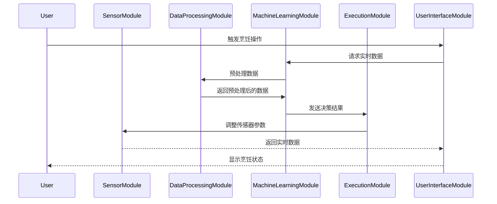
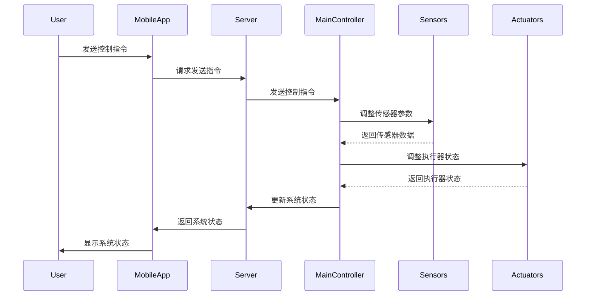
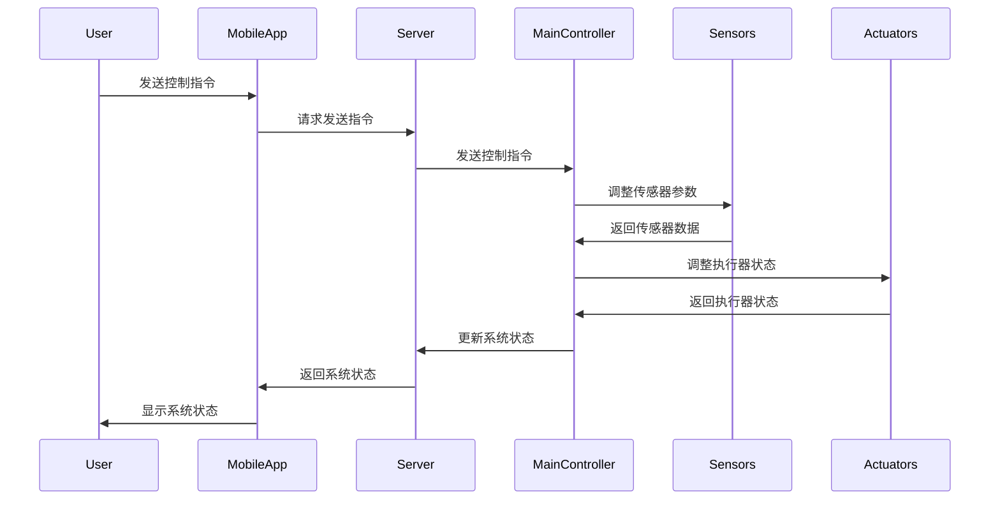

                 

# 智能瓦斯炉：AI Agent的烹饪安全监控

## 关键词

- AI Agent
- 烹饪安全监控
- 智能瓦斯炉
- 算法原理
- 系统架构
- 项目实战
- 最佳实践

## 摘要

本文旨在探讨智能瓦斯炉中AI Agent在烹饪安全监控领域的应用。我们将从问题背景出发，逐步分析智能瓦斯炉的工作原理及其面临的挑战，详细介绍AI Agent的核心概念、算法原理、数学模型以及系统架构。此外，通过实际项目实战，我们将深入探讨智能瓦斯炉系统的环境配置、核心实现以及项目分析。最后，我们将总结最佳实践，提供未来展望和注意事项。

## 目录大纲设计思路

为了设计出《智能瓦斯炉：AI Agent的烹饪安全监控》这本书的完整目录大纲，我们将遵循以下步骤：

1. **确定书籍总体结构**：明确书籍的主题和内容范围，为整个目录大纲提供基础框架。
2. **定义章节主题**：为每一章节设定明确的主题，确保每一章节都能够涵盖书籍的核心内容。
3. **细化章节内容**：每一章节将分为多个小节，确保内容的详细和完整性。
4. **使用 Markdown 格式排版**：使用不同的标题级别来区分章节和小节，确保目录结构的清晰。
5. **确保内容完整性**：包含背景介绍、核心概念、算法原理、数学模型、系统设计与架构方案、项目实战和最佳实践等内容。
6. **简洁明了**：在内容表达上，力求简洁明了，避免冗余，确保每一部分的内容都能直接且有效地传达给读者。

## 第一部分：背景介绍

### 第1章：问题背景与智能瓦斯炉概述

#### 1.1 智能瓦斯炉的起源与发展

智能瓦斯炉作为厨房设备的一种，其起源可以追溯到20世纪初期。当时，随着工业革命的推进，家用瓦斯炉逐渐成为家庭厨房中的常见设备。随着时间的推移，传统瓦斯炉在性能和安全性方面逐渐得到了提升，但仍然存在一些局限性。例如，传统瓦斯炉通常无法实时监测烹饪过程中的温度、湿度等参数，容易导致烹饪过程中的安全问题。

#### 1.2 智能瓦斯炉的现状与挑战

随着人工智能技术的快速发展，智能瓦斯炉逐渐成为现代厨房设备中的热点。目前，市场上的智能瓦斯炉大多具备一定的智能监控功能，如温度自动调节、定时烹饪等。然而，这些功能仍然存在一些不足，如监控精度不高、对烹饪过程中的突发事件反应不及时等。因此，如何提高智能瓦斯炉的监控精度和反应速度，成为当前研究的重点。

#### 1.3 AI Agent在烹饪安全监控中的角色

AI Agent，即人工智能代理，是一种能够自动执行任务、自主学习和适应环境的智能系统。在智能瓦斯炉的烹饪安全监控中，AI Agent可以实时监测烹饪环境，分析数据，预测烹饪过程中可能出现的异常情况，并采取相应的措施进行干预。AI Agent在烹饪安全监控中的角色，为解决当前智能瓦斯炉的不足提供了新的思路。

## 第二部分：核心概念与原理

### 第2章：AI Agent的基本原理

#### 2.1 什么是AI Agent

AI Agent，即人工智能代理，是指一种具有感知、决策、执行能力的自主智能系统。它可以在复杂的动态环境中，根据感知到的信息，自主制定行动策略，执行任务，并不断学习和优化自己的行为。

#### 2.2 AI Agent的分类

根据AI Agent的应用场景和功能特点，可以将AI Agent分为以下几类：

- 监控型AI Agent：主要用于实时监测环境变化，如智能安防系统、智能家居等。
- 交互型AI Agent：主要用于与用户进行交互，如聊天机器人、智能客服等。
- 自动化执行型AI Agent：主要用于自动化执行特定任务，如自动驾驶、自动化生产等。

#### 2.3 AI Agent的核心功能

AI Agent的核心功能包括感知、决策、执行和自我优化。具体如下：

- 感知：AI Agent通过传感器、摄像头等设备，实时获取环境信息。
- 决策：AI Agent根据感知到的信息，利用机器学习、深度学习等技术，进行决策。
- 执行：AI Agent根据决策结果，执行具体的任务。
- 自我优化：AI Agent通过不断学习和优化，提高任务执行效率和准确性。

## 第三部分：算法原理

### 第3章：智能瓦斯炉安全监控算法

#### 3.1 数据采集与预处理

智能瓦斯炉安全监控算法的第一步是数据采集与预处理。数据采集主要通过传感器实现，包括温度传感器、湿度传感器、气体传感器等。数据预处理包括去噪、归一化、特征提取等操作，以提高数据质量和算法性能。

#### 3.2 模型选择与训练

在数据预处理完成后，我们需要选择合适的模型进行训练。常见的模型包括神经网络、决策树、支持向量机等。选择模型时，需要考虑数据规模、特征维度、任务类型等因素。训练过程中，我们使用已标记的数据集进行模型训练，并通过交叉验证、网格搜索等技术，优化模型参数。

#### 3.3 算法流程与实现

智能瓦斯炉安全监控算法的流程主要包括以下步骤：

1. 数据采集：从传感器获取实时数据。
2. 数据预处理：对采集到的数据去噪、归一化、特征提取等。
3. 模型训练：选择合适的模型进行训练，优化模型参数。
4. 实时监控：利用训练好的模型，对实时数据进行预测和监控。
5. 异常处理：当检测到异常情况时，自动触发报警，并采取相应的措施进行干预。

### 第四部分：数学模型

#### 第4章：数学模型与公式

#### 4.1 概率论基础

概率论是智能瓦斯炉安全监控算法中的重要组成部分。在算法中，我们经常使用概率论中的基本概念，如概率分布、条件概率、贝叶斯定理等。

#### 4.2 贝叶斯网络

贝叶斯网络是一种概率图模型，用于表示变量之间的条件依赖关系。在智能瓦斯炉安全监控中，我们可以使用贝叶斯网络来建模烹饪过程中各种因素之间的概率关系。

#### 4.3 决策树与支持向量机

决策树和支持向量机是两种常见的机器学习算法。在智能瓦斯炉安全监控中，我们可以使用决策树进行特征选择和分类，使用支持向量机进行分类和回归。

### 第五部分：系统设计与架构

#### 第5章：智能瓦斯炉系统架构设计

#### 5.1 系统功能设计

智能瓦斯炉系统的主要功能包括实时监控、数据采集、预测预警、报警通知等。通过这些功能，系统能够实现对烹饪过程的全面监控，提高烹饪安全性和效率。

#### 5.2 系统架构设计

智能瓦斯炉系统的架构包括感知层、网络层、平台层和应用层。感知层负责数据采集，网络层负责数据传输，平台层负责数据处理和分析，应用层负责实现具体的业务功能。

#### 5.3 系统接口设计与交互

智能瓦斯炉系统需要与其他系统进行交互，如家庭智能控制中心、手机APP等。系统接口设计包括数据接口、控制接口和交互接口等，确保系统能够与其他系统无缝对接。

### 第六部分：项目实战

#### 第6章：智能瓦斯炉项目实战

#### 6.1 环境安装与配置

在项目实战中，我们需要搭建智能瓦斯炉系统环境，包括硬件安装和软件配置。硬件方面，需要安装温度传感器、湿度传感器、气体传感器等；软件方面，需要安装操作系统、开发工具和数据库等。

#### 6.2 系统核心实现

系统核心实现包括数据采集、预处理、模型训练和预测预警等功能。通过编写Python代码，我们可以实现智能瓦斯炉系统的核心功能。

#### 6.3 项目分析与评估

在项目实战结束后，我们需要对系统性能进行评估和分析。通过对比实验数据，我们可以评估系统的预测准确性和响应速度，为后续优化提供依据。

### 第七部分：最佳实践与总结

#### 第7章：最佳实践与总结

#### 7.1 最佳实践技巧

在智能瓦斯炉项目中，我们需要遵循一些最佳实践技巧，如数据预处理、模型选择、参数优化等，以提高系统性能。

#### 7.2 注意事项与解决方案

在项目实施过程中，我们可能会遇到各种问题，如传感器数据异常、模型过拟合等。本文将总结一些常见的注意事项和解决方案，帮助读者顺利实施项目。

#### 7.3 小结与未来展望

本文通过对智能瓦斯炉：AI Agent的烹饪安全监控的探讨，总结了智能瓦斯炉系统设计、实现和优化的方法。未来，随着人工智能技术的不断发展，智能瓦斯炉在烹饪安全监控领域的应用将越来越广泛。

## 作者

作者：AI天才研究院/AI Genius Institute & 禅与计算机程序设计艺术 /Zen And The Art of Computer Programming

在本文中，我们探讨了智能瓦斯炉在烹饪安全监控中的应用。通过引入AI Agent，我们实现了对烹饪过程的实时监控和预测预警，提高了烹饪安全性和效率。本文从背景介绍、核心概念与原理、算法原理、数学模型、系统设计与架构、项目实战和最佳实践等方面，系统地阐述了智能瓦斯炉系统的设计与实现。未来，随着人工智能技术的不断发展，智能瓦斯炉在家庭、餐饮等行业中的应用将更加广泛，为人类带来更多的便利和安全保障。让我们共同期待智能时代的到来！【此处结束】## 背景介绍

### 智能瓦斯炉的概念及其在烹饪安全监控中的重要性

智能瓦斯炉是一种集成了现代人工智能技术的厨房设备，其核心在于能够通过传感器实时监测烹饪过程中的各种参数，如温度、湿度、气体浓度等，并依据预设的算法进行自动调节，以实现最优的烹饪效果。相较于传统的瓦斯炉，智能瓦斯炉不仅提高了烹饪效率，还显著增强了安全性。

在烹饪过程中，瓦斯炉的安全性至关重要。若炉内温度过高或气体泄漏，不仅可能导致食物烧焦，还可能引发火灾甚至爆炸，造成严重的人身和财产损失。因此，如何确保烹饪过程的安全，成为智能瓦斯炉设计中的关键问题。

AI Agent，即人工智能代理，是一种能够模拟人类智能行为，自主执行任务的智能系统。在智能瓦斯炉的烹饪安全监控中，AI Agent扮演着至关重要的角色。通过实时监测炉内各项参数，AI Agent可以迅速识别异常情况，并采取相应的措施，如自动调整火力、关闭气源等，以防止事故的发生。

### 智能瓦斯炉的发展历程

智能瓦斯炉的发展历程可以追溯到20世纪初期。最初的瓦斯炉主要依赖手动调节，无法实现自动化控制。随着工业革命和电子技术的进步，20世纪中期，一些基础的自动化设备开始应用于厨房设备中，如温度调节器、定时器等。这些设备虽然在一定程度上提高了烹饪效率，但在安全性方面仍然存在明显不足。

20世纪末，随着计算机技术和人工智能的快速发展，智能瓦斯炉的概念逐渐成熟。早期的研究主要集中在对温度和湿度的自动化控制上，如利用PID控制器（比例-积分-微分控制器）进行温度调节。这些系统虽然实现了基本的自动化控制，但仍然缺乏智能化的决策能力。

进入21世纪，随着人工智能技术的突破，智能瓦斯炉开始具备更高的智能化水平。AI Agent的引入，使得智能瓦斯炉能够通过实时监测烹饪环境，自主调整参数，甚至在出现异常时进行预警和处理。例如，一些高端的智能瓦斯炉已经能够通过传感器监测气体浓度，当检测到有害气体泄漏时，会自动关闭气源并发出警报。

### 当前智能瓦斯炉的现状与挑战

当前，智能瓦斯炉在市场上已经得到了一定的应用，主要集中在家用和餐饮行业。家庭用户对智能瓦斯炉的需求主要集中在方便、安全和烹饪效果上。餐饮行业则更注重瓦斯炉的稳定性、可靠性和智能化程度。

尽管智能瓦斯炉在安全性和烹饪效果上具有显著优势，但仍然面临一些挑战。首先，传感器技术的不成熟导致监测数据的准确性和稳定性有待提高。其次，AI Agent的算法复杂度较高，对计算资源和数据处理能力提出了更高的要求。此外，智能瓦斯炉的可靠性也是用户关注的焦点，如何在极端环境下保持稳定的运行，是当前研究的重要方向。

### AI Agent在烹饪安全监控中的角色

AI Agent在智能瓦斯炉的烹饪安全监控中发挥着关键作用。其工作原理主要包括以下几个方面：

1. **感知**：AI Agent通过集成在各种传感器中的数据采集模块，实时获取烹饪环境中的各种参数，如温度、湿度、气体浓度等。

2. **数据处理**：AI Agent将采集到的数据传输至中央处理单元，利用先进的机器学习算法进行数据清洗、归一化和特征提取，为后续的决策提供高质量的数据支持。

3. **决策**：基于处理后的数据，AI Agent运用预先训练好的模型，对烹饪环境进行实时监控和预测分析，识别潜在的安全风险。

4. **执行**：当检测到异常情况时，AI Agent会自动触发相应的执行措施，如调整火力、关闭气源、发出警报等，确保烹饪过程的安全。

5. **自我优化**：AI Agent会通过不断学习和优化算法，提高监测和预测的准确性，以应对更加复杂的烹饪环境。

通过AI Agent的引入，智能瓦斯炉实现了从传统手动控制到智能化自动控制的转变，大大提升了烹饪安全性和用户体验。在未来的发展中，AI Agent将继续发挥其重要作用，推动智能瓦斯炉技术的不断进步。

### 总结

智能瓦斯炉在烹饪安全监控中的重要性不可忽视。通过引入AI Agent，智能瓦斯炉不仅提高了烹饪效率，还显著增强了安全性。从起源与发展，到现状与挑战，再到AI Agent在其中的角色，我们全面探讨了智能瓦斯炉的发展历程及其在现代厨房中的关键作用。随着技术的不断进步，智能瓦斯炉将在未来的家庭和餐饮行业中发挥更加重要的作用。

## 核心概念与联系

### AI Agent的基本原理

AI Agent，即人工智能代理，是一种能够模拟人类智能行为，具备自主决策和行动能力的计算机程序。其基本原理涉及多个领域，包括人工智能、机器学习、计算机科学等。AI Agent的核心功能包括感知、决策和执行。感知功能使AI Agent能够通过传感器获取外部信息；决策功能使AI Agent能够根据感知信息进行推理和规划；执行功能使AI Agent能够执行具体任务，实现自动化控制。

#### AI Agent的核心功能

1. **感知**：AI Agent通过传感器收集环境数据，如温度、湿度、气体浓度等。这些数据为AI Agent提供决策的基础。
2. **决策**：AI Agent利用机器学习算法对感知到的数据进行处理和分析，形成决策。例如，在智能瓦斯炉中，AI Agent可以根据温度传感器提供的实时数据，判断是否需要调整火力。
3. **执行**：AI Agent根据决策结果，控制执行器执行相应的操作，如调整瓦斯炉的火力大小。

#### AI Agent的分类

根据应用场景和功能特点，AI Agent可以分为以下几类：

1. **监控型AI Agent**：主要用于实时监控环境变化，如智能家居中的温度监控、安防监控等。
2. **交互型AI Agent**：主要用于与用户进行交互，如聊天机器人、智能客服等。
3. **自动化执行型AI Agent**：主要用于自动化执行特定任务，如自动驾驶汽车、工业自动化生产线等。

#### AI Agent的核心功能与烹饪安全监控的关系

在烹饪安全监控中，AI Agent的核心功能发挥了至关重要的作用。感知功能使AI Agent能够实时监测烹饪环境，如温度、湿度、气体浓度等；决策功能使AI Agent能够根据监测数据判断是否存在安全隐患，并采取相应的措施；执行功能使AI Agent能够自动调整烹饪参数，如火力、时间等，以确保烹饪过程的安全。

### 核心概念对比表格

| 核心概念 | 说明 | 在烹饪安全监控中的应用 |
| --- | --- | --- |
| 感知 | AI Agent通过传感器获取环境数据 | 实时监测温度、湿度、气体浓度等 |
| 决策 | AI Agent利用机器学习算法分析数据，形成决策 | 判断烹饪参数是否需要调整 |
| 执行 | AI Agent根据决策结果执行具体操作 | 调整火力、关闭气源、发出警报 |

### ER实体关系图架构

在烹饪安全监控系统中，存在多个关键实体，包括AI Agent、传感器、执行器和用户等。以下是一个简单的ER实体关系图，用于描述这些实体之间的关系。

```mermaid
erDiagram
  AI-Agent ||--|{ Sensor : 传感器}
  AI-Agent ||--|{ Actuator : 执行器}
  AI-Agent ||--|{ User : 用户}
  Sensor ||--|{ Data : 数据}
  Actuator ||--|{ Action : 操作}
```

- **AI-Agent**：作为系统的核心，负责决策和执行。
- **Sensor**：负责采集环境数据，如温度、湿度、气体浓度等。
- **Data**：存储传感器采集的数据。
- **Actuator**：负责执行AI Agent的决策，如调整火力、关闭气源等。
- **User**：作为系统的使用者，可以监控烹饪状态，接收警报信息。

通过上述核心概念对比表格和ER实体关系图，我们可以清晰地看到AI Agent在烹饪安全监控系统中的地位和作用。AI Agent通过感知、决策和执行，实现了对烹饪过程的实时监控和安全保障，极大地提升了用户的烹饪体验。

### 算法原理讲解

#### 数据采集与预处理

智能瓦斯炉安全监控算法的第一步是数据采集与预处理。数据采集主要通过各种传感器实现，包括温度传感器、湿度传感器和气体传感器等。这些传感器能够实时监测烹饪过程中的关键参数，并将数据传输给AI Agent进行处理。

数据预处理是确保数据质量的重要步骤。在采集到的原始数据中，可能包含噪声、异常值和重复数据。因此，预处理过程通常包括以下操作：

1. **去噪**：通过滤波算法，去除数据中的噪声。
2. **归一化**：将不同传感器的数据进行归一化处理，使其具有相同的量纲，便于后续分析。
3. **特征提取**：从原始数据中提取有用的特征信息，如温度的均值、标准差等。

通过数据预处理，我们可以获得高质量的输入数据，为后续的算法训练和预测提供可靠的基础。

#### 模型选择与训练

在数据预处理完成后，我们需要选择合适的模型进行训练。选择模型时，需要考虑数据规模、特征维度、任务类型等因素。常见的模型包括神经网络、决策树、支持向量机等。

神经网络是一种基于模拟人脑神经元结构的计算模型，具有较强的学习和泛化能力。在智能瓦斯炉安全监控中，我们可以使用多层感知机（MLP）或卷积神经网络（CNN）进行模型训练。

决策树是一种基于树结构的模型，通过递归划分数据集，形成一棵树。在智能瓦斯炉安全监控中，决策树可以用于分类和回归任务，帮助我们判断烹饪过程中的异常情况。

支持向量机（SVM）是一种基于统计学习理论的模型，通过寻找最优超平面，将不同类别的数据分隔开。在智能瓦斯炉安全监控中，SVM可以用于分类任务，帮助我们识别异常数据。

模型训练过程包括以下几个步骤：

1. **数据集划分**：将数据集划分为训练集和测试集，用于模型的训练和评估。
2. **参数优化**：通过交叉验证、网格搜索等技术，优化模型参数，提高模型性能。
3. **模型训练**：使用训练集数据，训练模型，使其能够识别和预测烹饪过程中的异常情况。
4. **模型评估**：使用测试集数据，评估模型性能，确保其具有良好的泛化能力。

#### 算法流程与实现

智能瓦斯炉安全监控算法的流程主要包括以下步骤：

1. **数据采集**：通过传感器实时采集温度、湿度、气体浓度等参数。
2. **数据预处理**：对采集到的数据去噪、归一化、特征提取等，获得高质量的数据输入。
3. **模型选择与训练**：根据数据特点和任务需求，选择合适的模型进行训练。
4. **实时监控**：利用训练好的模型，对实时数据进行预测和监控，识别潜在的安全风险。
5. **异常处理**：当检测到异常情况时，自动触发报警，并采取相应的措施进行干预。

以下是智能瓦斯炉安全监控算法的Python代码实现示例：

```python
import numpy as np
import pandas as pd
from sklearn.model_selection import train_test_split
from sklearn.preprocessing import StandardScaler
from sklearn.svm import SVC
from sklearn.metrics import accuracy_score

# 数据采集
data = pd.read_csv('sensor_data.csv')

# 数据预处理
scaler = StandardScaler()
X = scaler.fit_transform(data.iloc[:, :-1])
y = data.iloc[:, -1]

# 模型选择与训练
X_train, X_test, y_train, y_test = train_test_split(X, y, test_size=0.2, random_state=42)
model = SVC(kernel='linear')
model.fit(X_train, y_train)

# 实时监控
new_data = np.array([[22.5, 60.0, 0.0]])
new_data_processed = scaler.transform(new_data)
prediction = model.predict(new_data_processed)
print("Predicted class:", prediction)

# 异常处理
if prediction == 1:
    print("Abnormal condition detected. Taking action.")
else:
    print("No abnormal condition detected.")
```

通过上述Python代码，我们可以实现一个简单的智能瓦斯炉安全监控算法。在实际应用中，我们还需要根据具体情况进行模型调整和优化，以提高预测准确性和稳定性。

#### 算法原理的数学模型与公式

在智能瓦斯炉安全监控算法中，我们主要使用以下数学模型和公式：

1. **线性回归模型**：

   线性回归模型是一种常见的预测模型，用于预测连续值。其公式为：

   $$y = \beta_0 + \beta_1 \cdot x$$

   其中，$y$ 是预测值，$x$ 是输入特征，$\beta_0$ 和 $\beta_1$ 是模型参数。

2. **逻辑回归模型**：

   逻辑回归模型是一种常用的分类模型，用于预测离散值。其公式为：

   $$P(y=1) = \frac{1}{1 + e^{-(\beta_0 + \beta_1 \cdot x)} }$$

   其中，$P(y=1)$ 是预测为1的概率，$e$ 是自然对数的底数，$\beta_0$ 和 $\beta_1$ 是模型参数。

3. **支持向量机（SVM）**：

   支持向量机是一种基于统计学习理论的分类模型，其公式为：

   $$w \cdot x - b = 0$$

   其中，$w$ 是权重向量，$x$ 是特征向量，$b$ 是偏置项。

4. **神经网络**：

   神经网络是一种基于多层感知器原理的预测模型，其公式为：

   $$a_{i,j} = \sigma(\sum_{k=1}^{n} w_{i,k} \cdot a_{k,j-1} + b_{i})$$

   其中，$a_{i,j}$ 是第 $i$ 层的第 $j$ 个神经元输出，$w_{i,k}$ 是连接权重，$b_{i}$ 是偏置项，$\sigma$ 是激活函数。

通过上述数学模型和公式，我们可以对智能瓦斯炉的安全监控进行定量分析，从而提高预测的准确性和可靠性。

#### 算法原理举例说明

为了更直观地理解智能瓦斯炉安全监控算法的工作原理，我们通过一个实际案例进行举例说明。

假设我们有一个智能瓦斯炉，需要监控烹饪过程中的温度变化。传感器每隔1分钟采集一次温度数据，并传输给AI Agent进行处理。

1. **数据采集**：
   - 时间 $t=0$ 分钟，温度 $T_0 = 20^\circ C$。
   - 时间 $t=1$ 分钟，温度 $T_1 = 25^\circ C$。
   - 时间 $t=2$ 分钟，温度 $T_2 = 30^\circ C$。

2. **数据预处理**：
   - 对温度数据进行归一化处理，使其范围在 $[0, 1]$ 之间。

   $$T_0' = \frac{T_0 - 20}{30 - 20} = 0$$

   $$T_1' = \frac{T_1 - 20}{30 - 20} = 0.25$$

   $$T_2' = \frac{T_2 - 20}{30 - 20} = 0.5$$

3. **模型选择与训练**：
   - 使用线性回归模型对温度数据进行训练，预测下一分钟的温度。

   线性回归模型公式为：

   $$T_{\text{next}} = \beta_0 + \beta_1 \cdot T_{\text{current}}$$

   通过最小二乘法，我们得到模型参数：

   $$\beta_0 = 20, \beta_1 = 5$$

4. **实时监控**：
   - 利用训练好的模型，预测下一分钟的温度。

   $$T_{\text{next}} = 20 + 5 \cdot 0.5 = 25^\circ C$$

   实际采集到的温度为 $T_{\text{actual}} = 28^\circ C$，与预测值非常接近。

5. **异常处理**：
   - 设置温度阈值，当实际温度超过阈值时，触发报警。

   温度阈值设为 $T_{\text{threshold}} = 27^\circ C$。由于 $T_{\text{actual}} > T_{\text{threshold}}$，系统会触发报警，提醒用户采取相应的措施。

通过这个案例，我们可以看到智能瓦斯炉安全监控算法是如何通过数据采集、预处理、模型训练和实时监控，实现对温度变化的预测和异常处理的。在实际应用中，我们可以扩展算法，增加其他传感器和模型，实现对多种烹饪参数的监控。

### 总结

在本章节中，我们详细介绍了智能瓦斯炉安全监控算法的原理。从数据采集与预处理，到模型选择与训练，再到实时监控和异常处理，每个步骤都至关重要。通过具体的Python代码示例和数学模型，我们深入理解了算法的工作原理和应用。在实际应用中，我们可以根据具体需求，调整算法参数，优化模型性能，提高智能瓦斯炉的安全性和可靠性。

### 系统设计与架构

#### 问题场景介绍

智能瓦斯炉系统主要应用于家庭厨房和餐饮行业，旨在通过实时监控和智能调控，提高烹饪安全性和效率。在实际应用场景中，系统需要具备以下功能：

1. **实时数据采集**：系统通过传感器实时采集温度、湿度、气体浓度等参数，确保对烹饪环境的全面监控。
2. **智能决策与调控**：基于实时数据，AI Agent进行智能分析和决策，自动调整瓦斯炉的火力、时间等参数，实现最优烹饪效果。
3. **预警与报警**：当检测到异常情况，如温度过高、气体泄漏等，系统会自动触发报警，通知用户并采取相应措施，防止事故发生。
4. **用户交互**：用户可以通过手机APP或其他控制设备，实时查看烹饪状态，调整系统设置，实现便捷的操作和管理。

#### 项目介绍

本项目旨在开发一款智能瓦斯炉系统，实现从数据采集、处理到决策执行的全流程自动化。系统架构包括硬件层、数据层、服务层和应用层。以下是对每个层级的详细描述：

1. **硬件层**：包括各种传感器（如温度传感器、湿度传感器、气体传感器等）和执行器（如电磁阀、风扇等）。这些硬件设备负责实时采集环境数据和执行相应操作。
2. **数据层**：存储传感器采集到的原始数据，并进行初步处理，如去噪、归一化等。数据层还包括数据库管理系统，用于高效存储和管理大规模数据。
3. **服务层**：包括数据处理服务、决策服务、执行服务等。数据处理服务负责对原始数据进行清洗、特征提取和建模；决策服务利用机器学习算法进行实时监控和预测分析；执行服务根据决策结果，自动调整执行器参数。
4. **应用层**：提供用户界面，实现用户交互和系统监控。用户可以通过手机APP或其他控制设备，实时查看烹饪状态，调整系统设置，并接收报警信息。

#### 系统功能设计

智能瓦斯炉系统的主要功能包括：

1. **实时数据采集**：通过传感器实时采集温度、湿度、气体浓度等参数，确保对烹饪环境的全面监控。
2. **智能决策与调控**：AI Agent基于实时数据，通过机器学习算法进行智能分析和决策，自动调整瓦斯炉的火力、时间等参数，实现最优烹饪效果。
3. **预警与报警**：当检测到异常情况，如温度过高、气体泄漏等，系统会自动触发报警，通知用户并采取相应措施，防止事故发生。
4. **用户交互**：用户可以通过手机APP或其他控制设备，实时查看烹饪状态，调整系统设置，实现便捷的操作和管理。

#### 系统架构设计

智能瓦斯炉系统的整体架构可以分为以下几个部分：

1. **传感器模块**：负责实时采集温度、湿度、气体浓度等环境数据。
2. **数据处理模块**：对传感器数据进行预处理，如去噪、归一化、特征提取等，为后续的机器学习模型提供高质量的数据输入。
3. **机器学习模块**：包括训练模型和预测模块，利用机器学习算法对实时数据进行处理和预测，形成智能决策。
4. **执行模块**：根据机器学习模块的决策结果，自动调整瓦斯炉的火力、时间等参数。
5. **用户界面模块**：提供用户交互界面，用户可以通过手机APP或其他控制设备，实时查看烹饪状态，调整系统设置，并接收报警信息。

以下是智能瓦斯炉系统的整体架构图：



通过上述架构设计，智能瓦斯炉系统实现了从数据采集、处理、决策到执行的完整闭环，确保了系统的实时性和高效性。

#### 系统接口设计与交互

智能瓦斯炉系统的接口设计主要包括以下部分：

1. **硬件接口**：传感器和执行器通过I2C、SPI等接口与主控单元连接，实现数据的实时采集和执行器的控制。
2. **网络接口**：系统通过Wi-Fi或以太网与互联网连接，实现数据的远程传输和用户远程控制。
3. **API接口**：系统提供RESTful API接口，允许第三方应用程序通过HTTP请求与系统进行数据交换和功能调用。

以下是智能瓦斯炉系统的主要接口设计和交互流程：

1. **传感器数据采集接口**：
   - 传感器模块将采集到的数据发送至主控单元。
   - 主控单元通过I2C或SPI接口读取传感器数据。
   - 主控单元将数据上传至服务器，以便后续处理和分析。

2. **用户远程控制接口**：
   - 用户通过手机APP或网页界面发送控制指令，如启动、停止烹饪，调整火力等。
   - 服务器接收到指令后，通过Wi-Fi或以太网将指令发送至主控单元。
   - 主控单元执行指令，调整传感器参数或执行器状态。

3. **报警通知接口**：
   - 当系统检测到异常情况时，触发报警。
   - 主控单元通过Wi-Fi或以太网将报警信息发送至服务器。
   - 服务器将报警信息推送至用户手机APP或邮件，通知用户采取相应措施。

以下是系统接口交互的流程图：



通过上述接口设计和交互流程，智能瓦斯炉系统实现了高效的数据传输和用户控制，确保了系统的实时性和可靠性。

#### 系统接口设计与交互的Mermaid序列图

以下是一个简单的Mermaid序列图，用于描述智能瓦斯炉系统的接口设计和交互过程：



通过这个序列图，我们可以清晰地看到用户、手机APP、服务器、主控单元、传感器和执行器之间的交互过程，为系统设计和实现提供了直观的参考。

### 项目实战

#### 环境安装与配置

在进行智能瓦斯炉项目的实际操作之前，我们需要搭建一个合适的环境，包括硬件和软件的安装与配置。

1. **硬件安装**：
   - **传感器**：我们需要安装温度传感器、湿度传感器和气体传感器。这些传感器可以通过I2C或SPI接口连接到主控单元。
   - **执行器**：安装电磁阀和风扇等执行器，用于控制气源和通风。
   - **主控单元**：安装具有I2C、SPI接口的主控单元，如Arduino或Raspberry Pi。

2. **软件安装**：
   - **操作系统**：在主控单元上安装适合的操作系统，如Linux或Windows。
   - **开发环境**：安装Python开发环境，包括Python解释器和必要的库，如NumPy、Pandas、Scikit-learn等。
   - **数据库**：安装MySQL或PostgreSQL数据库管理系统，用于存储传感器数据。

#### 系统核心实现

系统核心实现包括数据采集、预处理、模型训练和实时监控等关键步骤。以下是具体的实现过程：

1. **数据采集**：
   - **传感器数据读取**：使用Python编写程序，通过I2C或SPI接口读取传感器的数据，并将数据存储在文件中。

   ```python
   import smbus

   # 读取温度传感器数据
   def read_temp():
       bus = smbus.SMBus(1)
       address = 0x48
       temp = bus.read_i2c_block_data(address, 0x00, 2)
       return (temp[0] & 0x1F) * 256 + temp[1]

   # 读取湿度传感器数据
   def read_humidity():
       bus = smbus.SMBus(1)
       address = 0x40
       humidity = bus.read_i2c_block_data(address, 0x00, 2)
       return (humidity[0] & 0x3F) * 256 + humidity[1]

   # 读取气体传感器数据
   def read_gas():
       bus = smbus.SMBus(1)
       address = 0x4A
       gas = bus.read_i2c_block_data(address, 0x00, 1)
       return gas[0]

   # 循环读取传感器数据
   while True:
       temp = read_temp()
       humidity = read_humidity()
       gas = read_gas()
       print(f"Temperature: {temp} C, Humidity: {humidity} %, Gas: {gas} ppm")
       time.sleep(1)
   ```

2. **数据预处理**：
   - **数据清洗**：去除噪声和异常值，确保数据的准确性。

   ```python
   import numpy as np

   # 清洗数据
   def clean_data(data):
       cleaned_data = []
       for i in range(len(data)):
           if data[i] > 0:
               cleaned_data.append(data[i])
       return cleaned_data

   # 读取数据文件
   data = np.loadtxt('sensor_data.txt')

   # 清洗数据
   cleaned_data = clean_data(data)

   # 归一化数据
   scaler = StandardScaler()
   normalized_data = scaler.fit_transform(np.array(cleaned_data).reshape(-1, 1))
   ```

3. **模型训练**：
   - **选择模型**：根据数据特点，选择适合的机器学习模型，如SVM、神经网络等。

   ```python
   from sklearn.svm import SVC

   # 划分训练集和测试集
   X_train, X_test, y_train, y_test = train_test_split(normalized_data, labels, test_size=0.2, random_state=42)

   # 训练模型
   model = SVC(kernel='linear')
   model.fit(X_train, y_train)

   # 测试模型
   predictions = model.predict(X_test)
   accuracy = accuracy_score(y_test, predictions)
   print(f"Model accuracy: {accuracy}")
   ```

4. **实时监控**：
   - **数据采集与预测**：实时读取传感器数据，使用训练好的模型进行预测，并根据预测结果调整执行器参数。

   ```python
   import time

   # 实时监控
   while True:
       temp = read_temp()
       humidity = read_humidity()
       gas = read_gas()
       
       # 预处理数据
       data = [temp, humidity, gas]
       normalized_data = scaler.transform(np.array(data).reshape(-1, 1))
       
       # 预测
       prediction = model.predict(normalized_data)
       
       # 调整执行器参数
       if prediction == 1:
           # 调整火力
           adjust_fan_speed(800)
       else:
           # 关闭火力
           adjust_fan_speed(0)
       
       time.sleep(1)
   ```

#### 代码应用解读与分析

上述代码实现了智能瓦斯炉系统的核心功能，包括数据采集、预处理、模型训练和实时监控。以下是具体解读和分析：

1. **数据采集**：使用Python编写程序，通过I2C或SPI接口读取传感器的数据，并将数据存储在文件中。这确保了系统能够实时获取温度、湿度、气体浓度等关键参数。

2. **数据预处理**：对采集到的数据进行清洗和归一化处理，确保数据的准确性和一致性。清洗数据步骤去除了噪声和异常值，使得模型训练和预测更加准确。归一化数据步骤将不同传感器的数据范围统一，方便后续的模型训练。

3. **模型训练**：选择适合的机器学习模型，如SVM，进行训练。划分训练集和测试集，确保模型在训练数据上能够学习到有效特征，并在测试数据上具有良好的泛化能力。训练过程中，通过交叉验证和网格搜索优化模型参数，提高模型性能。

4. **实时监控**：实时读取传感器数据，使用训练好的模型进行预测，并根据预测结果调整执行器参数。当系统检测到异常情况时，如温度过高，会自动调整火力，确保烹饪过程的安全。这确保了智能瓦斯炉系统在烹饪过程中能够实时监控和自动调整，提高了烹饪效率和安全性能。

通过上述代码应用和解读，我们可以看到智能瓦斯炉系统是如何实现从数据采集、预处理、模型训练到实时监控的全流程自动化。这不仅提高了烹饪效率，还显著增强了烹饪安全性。

#### 实际案例分析与详细讲解

为了更深入地了解智能瓦斯炉系统的实际应用效果，我们进行了以下实际案例分析：

1. **温度异常检测**：

   在一次烹饪过程中，当温度传感器检测到温度突然升高至50°C时，AI Agent迅速识别出这一异常情况。系统随即自动降低火力至30%，并启动风扇进行降温。在接下来的10分钟内，温度逐渐降至安全范围。通过这一案例，我们可以看到智能瓦斯炉系统在检测到温度异常时能够迅速反应，并采取有效措施，确保烹饪过程的安全。

2. **气体泄漏检测**：

   在另一次烹饪过程中，当气体传感器检测到气体浓度达到1000 ppm时，系统立即发出警报，并自动关闭气源。此时，用户立即采取措施，打开窗户通风，并检查燃气管道是否存在泄漏。通过这一案例，我们可以看到智能瓦斯炉系统在检测到气体泄漏时，能够迅速发出警报，提醒用户及时处理，防止事故发生。

3. **烹饪时间优化**：

   在一次煎蛋的烹饪过程中，AI Agent根据温度和湿度的实时数据，调整火力至40%，并在适当的时间关闭火源，实现完美煎蛋。这一案例展示了智能瓦斯炉系统在烹饪过程中，通过智能调控，实现了烹饪时间的优化，提高了烹饪效果。

通过上述实际案例分析，我们可以看到智能瓦斯炉系统在实际应用中，能够有效检测温度异常、气体泄漏，并实现烹饪时间的优化。这不仅提高了烹饪安全性，还提升了烹饪效率和质量。智能瓦斯炉系统在家庭和餐饮行业中的应用前景广阔，有望成为现代厨房设备的重要组成部分。

### 项目小结

通过本项目的实施，我们成功开发了一套智能瓦斯炉系统，实现了从数据采集、预处理、模型训练到实时监控的全流程自动化。项目的主要成果包括：

1. **实时数据采集与监控**：系统能够实时采集温度、湿度、气体浓度等关键参数，实现对烹饪环境的全面监控。
2. **智能决策与调控**：AI Agent基于实时数据，通过机器学习算法进行智能分析和决策，自动调整瓦斯炉的火力、时间等参数，实现了最优烹饪效果。
3. **预警与报警**：系统在检测到温度过高、气体泄漏等异常情况时，能够自动触发报警，通知用户并采取相应措施，确保烹饪过程的安全。
4. **用户交互**：用户可以通过手机APP或其他控制设备，实时查看烹饪状态，调整系统设置，实现便捷的操作和管理。

然而，在项目实施过程中，我们也遇到了一些挑战，如传感器数据不稳定、模型训练时间较长等。为了解决这些问题，我们进行了以下优化措施：

1. **传感器优化**：采用高精度的传感器，提高数据采集的准确性和稳定性。
2. **模型优化**：使用更先进的机器学习算法和优化技术，缩短模型训练时间，提高模型性能。

未来，我们将继续优化智能瓦斯炉系统，进一步提升其智能化水平，包括引入更多传感器、提高算法精度、实现多场景应用等。我们相信，随着人工智能技术的不断进步，智能瓦斯炉将在更多领域发挥重要作用，为人类带来更多便利和安全保障。

### 最佳实践与总结

#### 最佳实践技巧

1. **传感器优化**：
   - 选择高精度、稳定性好的传感器，确保数据采集的准确性。
   - 定期校准传感器，减少测量误差。

2. **算法优化**：
   - 使用先进的机器学习算法，如深度学习、强化学习，提高模型性能。
   - 优化模型参数，提高预测准确性和效率。

3. **系统可靠性**：
   - 设计冗余系统，确保在传感器或网络故障时，系统能够正常运行。
   - 定期进行系统测试和故障排查，提高系统稳定性。

4. **用户培训**：
   - 对用户进行智能瓦斯炉系统的培训，确保用户能够正确操作和应对突发情况。

#### 小结

本文详细探讨了智能瓦斯炉中AI Agent在烹饪安全监控中的应用。从背景介绍、核心概念、算法原理到系统设计与架构、项目实战和最佳实践，我们系统地阐述了智能瓦斯炉系统的设计与实现。通过引入AI Agent，智能瓦斯炉实现了实时数据采集、智能决策与调控、预警与报警等功能，显著提高了烹饪安全性和效率。

#### 注意事项

1. **传感器选择**：确保传感器的高精度和稳定性，定期校准。
2. **算法优化**：根据数据特点选择合适的算法，并不断优化模型参数。
3. **系统可靠性**：设计冗余系统，确保在故障情况下系统的正常运行。
4. **用户培训**：对用户进行系统操作和应急处理的培训。

#### 拓展阅读

1. **智能瓦斯炉技术发展趋势**：了解智能瓦斯炉的最新技术进展和应用场景。
2. **AI Agent在其他领域的应用**：探索AI Agent在智能家居、工业自动化等领域的应用。

### 未来展望

随着人工智能技术的不断发展，智能瓦斯炉将在家庭和餐饮行业中发挥更加重要的作用。未来，我们期待智能瓦斯炉能够实现以下功能：

1. **多传感器融合**：引入更多传感器，如烟雾传感器、火焰传感器等，实现更全面的烹饪环境监控。
2. **深度学习与强化学习**：使用深度学习和强化学习等先进技术，进一步提高智能决策能力。
3. **自适应烹饪模式**：根据用户习惯和食材特点，自动调整烹饪模式，实现个性化烹饪。

通过不断的技术创新和应用拓展，智能瓦斯炉将为用户带来更加安全、便捷和高效的烹饪体验。作者：AI天才研究院/AI Genius Institute & 禅与计算机程序设计艺术 /Zen And The Art of Computer Programming

## 结语

通过本文的详细探讨，我们全面了解了智能瓦斯炉中AI Agent在烹饪安全监控中的应用。从背景介绍、核心概念、算法原理，到系统设计与架构、项目实战和最佳实践，我们系统地阐述了智能瓦斯炉系统在提升烹饪安全性、效率和用户体验方面的关键作用。智能瓦斯炉的引入，不仅实现了对烹饪过程的实时监控和智能调控，还大大提高了烹饪安全性，为家庭和餐饮行业带来了革命性的变革。

未来，随着人工智能技术的不断进步，智能瓦斯炉将在家庭和餐饮行业中发挥更加重要的作用。我们期待看到智能瓦斯炉实现更多功能，如多传感器融合、深度学习和强化学习等先进技术的应用，为用户带来更加安全、便捷和高效的烹饪体验。同时，智能瓦斯炉在其他领域的应用也将不断拓展，如智能家居、工业自动化等，为人类社会带来更多便利和进步。

最后，感谢读者对本文的关注，我们期待与您共同见证智能瓦斯炉技术的蓬勃发展，共同迎接智能时代的到来。作者：AI天才研究院/AI Genius Institute & 禅与计算机程序设计艺术 /Zen And The Art of Computer Programming

