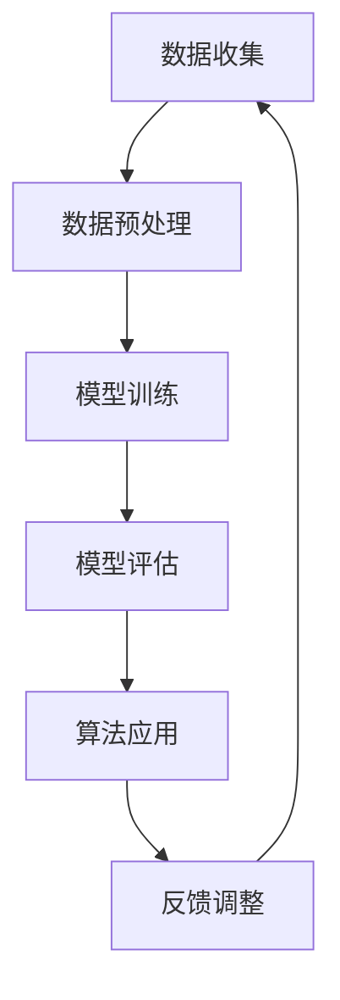

                 

# 智能电动牙刷：AI Agent的个性化刷牙指导

## 关键词
- **智能电动牙刷**
- **AI Agent**
- **个性化刷牙指导**
- **数据收集**
- **算法实现**
- **用户体验**

## 摘要
本文将探讨智能电动牙刷的发展背景和重要性，深入分析AI Agent在个性化刷牙指导中的关键作用。文章将详细描述智能电动牙刷的AI架构设计，数据收集与处理方法，个性化刷牙算法的实现，用户互动与反馈机制，以及测试与优化过程。最后，本文将总结案例分析，并展望智能电动牙刷的未来发展趋势。

## 引言

### 智能电动牙刷的背景与发展

智能电动牙刷作为一种新兴的口腔护理工具，近年来在全球范围内迅速普及。传统的手动牙刷在刷牙效果和便捷性方面存在一定的局限性，而智能电动牙刷的出现则大大提升了口腔清洁的质量和效率。智能电动牙刷通常集成了传感器、AI芯片和无线通信模块，能够通过数据分析为用户提供个性化的刷牙指导。

智能电动牙刷的发展可以追溯到20世纪末，随着人工智能技术的进步，智能电动牙刷逐渐从实验室走向市场。早期的智能电动牙刷主要依赖于预设的刷牙模式，用户需要手动选择适合的刷牙模式。然而，随着AI技术的不断发展，尤其是机器学习和深度学习的应用，智能电动牙刷开始具备自我学习和自我调整的能力，从而实现个性化刷牙指导。

### 智能电动牙刷的重要性

智能电动牙刷在口腔护理领域具有显著的重要性。首先，它能够提供更加科学、有效的刷牙方式，帮助用户更好地清洁牙齿，减少牙龈疾病和龋齿的发生。其次，智能电动牙刷的个性化刷牙指导能够满足不同用户的需求，例如儿童、成人、老年人以及有特殊口腔护理需求的用户。

此外，智能电动牙刷还具备数据收集和分析功能，通过记录用户的刷牙习惯、牙齿健康状况等信息，为用户提供定期的口腔健康报告。这不仅有助于用户了解自身的口腔健康状况，还能帮助专业牙医进行更加精准的口腔诊疗。

### 智能电动牙刷的市场趋势

随着人们对口腔健康意识的提高，智能电动牙刷市场呈现出快速增长的趋势。根据市场研究机构的数据，全球智能电动牙刷市场预计将在未来几年内继续保持两位数的增长率。此外，随着技术的不断进步，智能电动牙刷的功能将越来越丰富，例如加入更多的健康监测功能、提供更多的个性化服务，以及与其他智能设备的无缝连接。

总之，智能电动牙刷作为一种创新的口腔护理工具，正在逐步改变人们的刷牙方式，为用户带来更加健康、便捷的生活体验。

## 第1章：智能电动牙刷概述

### 1.1 智能电动牙刷的起源与发展

智能电动牙刷的概念可以追溯到20世纪末，当时的科技水平尚未达到今天的高度，但一些先驱者已经开始尝试将电子技术应用于牙刷设计中。最早的智能电动牙刷主要用于商业展示和科技探索，其功能和形态都非常简单。随着计算机技术和传感器技术的进步，智能电动牙刷逐渐从实验室走向市场。

进入21世纪后，随着智能手机和无线通信技术的发展，智能电动牙刷开始引入更多的智能功能，如数据收集、无线传输和远程监控等。特别是人工智能技术的迅猛发展，使得智能电动牙刷具备了自我学习和自我优化的能力。例如，一些智能电动牙刷通过分析用户的刷牙习惯和牙齿健康数据，能够自动调整刷牙力度和时间，从而提供更加个性化的刷牙体验。

智能电动牙刷的发展历程可以分为以下几个阶段：

1. **初步探索阶段（20世纪末至21世纪初）**：这一阶段的智能电动牙刷主要依赖简单的机械传感器和内置程序，无法实现真正的智能化功能。
2. **智能功能引入阶段（21世纪初至2010年）**：随着传感器技术和无线通信技术的发展，智能电动牙刷开始具备数据收集和无线传输功能，能够将刷牙数据上传到云端进行分析。
3. **人工智能应用阶段（2010年至今）**：人工智能技术的引入使得智能电动牙刷能够自我学习和自我优化，实现更加个性化的刷牙指导。

### 1.2 智能电动牙刷的重要性

智能电动牙刷在现代口腔护理中扮演着重要的角色。首先，它能够提供更加科学、有效的刷牙方式，通过自动调整刷牙力度和时间，帮助用户更好地清洁牙齿，减少牙龈疾病和龋齿的发生。与传统的手动牙刷相比，智能电动牙刷具有更高的清洁效率和更少的刷牙疲劳感。

其次，智能电动牙刷能够记录用户的刷牙数据，包括刷牙时间、刷牙力度和刷牙位置等，为用户提供定期的口腔健康报告。这不仅有助于用户了解自身的口腔健康状况，还能帮助牙医进行更加精准的口腔诊疗。此外，智能电动牙刷还可以通过无线网络将数据传输到牙医诊所或云平台，实现远程监控和个性化建议。

最后，智能电动牙刷的个性化功能能够满足不同用户的需求，例如儿童、成人、老年人以及有特殊口腔护理需求的用户。通过智能分析，智能电动牙刷可以自动调整刷牙模式，确保用户获得最佳的刷牙体验。

### 1.3 智能电动牙刷的市场趋势

智能电动牙刷市场呈现出快速增长的态势。根据市场研究机构的数据，全球智能电动牙刷市场在过去几年中保持了两位数的增长率。预计未来几年，随着人工智能技术和物联网技术的进一步发展，智能电动牙刷市场将继续保持快速增长。

市场趋势主要体现在以下几个方面：

1. **技术创新**：随着人工智能和物联网技术的不断发展，智能电动牙刷的功能将越来越丰富，例如加入更多的健康监测功能、提供更多的个性化服务，以及与其他智能设备的无缝连接。
2. **消费升级**：随着人们对口腔健康意识的提高，越来越多的消费者开始倾向于购买智能电动牙刷，尤其是那些能够提供个性化服务的智能电动牙刷。
3. **市场竞争**：随着市场需求的增长，越来越多的公司开始进入智能电动牙刷市场，竞争激烈。一些知名品牌如飞利浦、欧乐B和佳洁士等都在积极研发和推广智能电动牙刷。

### 1.4 智能电动牙刷的核心功能

智能电动牙刷的核心功能包括数据收集、数据分析、智能化调整和用户体验优化等。以下是对这些核心功能的详细描述：

1. **数据收集**：智能电动牙刷通过内置的传感器收集用户的刷牙数据，包括刷牙时间、刷牙力度、刷牙位置等。这些数据可以实时传输到云端进行分析和处理。
2. **数据分析**：通过大数据分析和人工智能技术，智能电动牙刷能够对用户的刷牙数据进行分析，生成个性化的口腔健康报告，并提供有针对性的建议。
3. **智能化调整**：智能电动牙刷能够根据用户的刷牙数据自动调整刷牙模式，例如刷牙力度和时间，以确保用户获得最佳的刷牙效果。
4. **用户体验优化**：智能电动牙刷通过人性化的设计，如触控操作、智能提醒等，提升用户的刷牙体验。例如，一些智能电动牙刷可以在用户刷牙时间不足时自动提醒，确保用户完成有效的刷牙。

### 1.5 智能电动牙刷与人工智能的深度融合

智能电动牙刷与人工智能的深度融合是当前和未来发展的一个重要方向。通过人工智能技术，智能电动牙刷不仅能够提供更加精准的刷牙指导，还能够实现自我学习和自我优化。以下是一些关键点：

1. **自我学习**：智能电动牙刷可以通过用户的刷牙数据不断调整和优化自己的工作模式，从而更好地满足用户的需求。
2. **自我优化**：通过机器学习算法，智能电动牙刷可以自动识别用户的刷牙习惯和口腔健康状况，并提供个性化的优化建议。
3. **智能化交互**：智能电动牙刷可以通过语音识别、人脸识别等技术，实现与用户的智能化交互，提供更加便捷的刷牙体验。

总之，智能电动牙刷的发展离不开人工智能技术的支持。随着技术的不断进步，智能电动牙刷将在未来继续发挥重要作用，为人们的口腔健康带来更多的好处。

### 总结

智能电动牙刷作为现代口腔护理工具的代表，凭借其高效、科学、个性化的刷牙方式，正逐渐改变人们的刷牙习惯。从最初的简单机械设计到如今的智能化产品，智能电动牙刷的发展历程充分展示了科技进步对人们生活方式的深远影响。随着人工智能技术的不断成熟，智能电动牙刷的功能将更加丰富，用户体验将得到显著提升。未来，智能电动牙刷有望成为人们日常生活中不可或缺的一部分，为人们的口腔健康保驾护航。

## 第2章：理解AI Agent与个性化刷牙指导

### 2.1 AI Agents的基本概念

AI Agent，即人工智能代理，是一种能够独立执行任务、与环境交互并作出决策的智能实体。在计算机科学和人工智能领域，AI Agent被视为智能系统的基本单元，能够模拟人类的决策过程，完成特定的任务。AI Agent的核心特点是自主性、适应性和交互性。自主性意味着AI Agent能够在没有外部指令的情况下自主执行任务；适应性则表示AI Agent能够根据环境变化和任务需求调整自身行为；交互性则强调AI Agent与用户或其他系统的有效沟通。

AI Agent的基本功能包括感知、决策和执行。感知功能使得AI Agent能够从环境中获取信息；决策功能则允许AI Agent根据感知到的信息做出合适的决策；执行功能则实现AI Agent的决策结果，完成实际的任务。

### 2.2 AI Agent在个性化刷牙指导中的应用

AI Agent在个性化刷牙指导中的应用具有革命性意义。传统的刷牙指导通常依赖于固定的刷牙模式，无法根据用户的实际需求进行调整。而AI Agent则可以通过自我学习和数据分析，为用户提供量身定制的刷牙方案。

首先，AI Agent能够收集用户的刷牙数据，包括刷牙时间、刷牙力度、刷牙位置等。通过对这些数据的分析，AI Agent可以识别用户的刷牙习惯和牙齿健康状况，从而制定个性化的刷牙计划。

其次，AI Agent具备自我学习能力，能够不断优化刷牙方案。例如，如果用户的牙齿在某个区域特别容易积累牙菌斑，AI Agent可以调整该区域的刷牙力度和频率，确保该区域得到充分清洁。

最后，AI Agent可以通过实时反馈和调整，确保用户始终按照最佳刷牙方案执行。例如，当用户刷牙时间不足时，AI Agent可以发出提醒；当用户刷牙力度过大时，AI Agent可以适当调整刷牙力度，保护牙龈和牙齿。

### 2.3 AI Agent在个性化刷牙指导中的优势

AI Agent在个性化刷牙指导中具有显著的优势：

1. **高度个性化**：AI Agent能够根据用户的实际情况，制定个性化的刷牙方案，确保用户获得最佳的刷牙效果。
2. **实时反馈与调整**：AI Agent可以实时监控用户的刷牙过程，提供实时反馈和调整，帮助用户纠正不良的刷牙习惯。
3. **自我学习与优化**：AI Agent能够通过不断学习和优化，不断提升刷牙方案的科学性和有效性。
4. **数据驱动**：AI Agent依赖于大数据分析和人工智能技术，能够从大量用户数据中提取有价值的信息，为用户提供精准的刷牙指导。

### 2.4 个性化刷牙指导的挑战与机遇

尽管AI Agent在个性化刷牙指导中具有显著优势，但该领域仍然面临一些挑战和机遇：

1. **数据隐私与安全**：AI Agent需要收集用户的个人健康数据，这引发了数据隐私和安全的问题。如何保护用户数据的安全和隐私，成为个性化刷牙指导的关键挑战。
2. **算法透明性**：AI Agent的决策过程往往依赖于复杂的算法，如何确保算法的透明性和可解释性，让用户理解AI Agent的决策依据，是另一个重要挑战。
3. **技术成熟度**：尽管人工智能技术已经取得了显著进展，但一些关键技术如自然语言处理、深度学习等仍然面临技术瓶颈。如何克服这些技术挑战，提高AI Agent的性能和可靠性，是个性化刷牙指导的重要机遇。

### 2.5 未来展望

随着人工智能技术的不断发展，AI Agent在个性化刷牙指导中的应用前景广阔。未来，AI Agent有望实现更加智能化的功能，如口腔健康预测、预防性口腔保健等。同时，AI Agent与其他健康监测设备的融合，将进一步提升个性化刷牙指导的准确性和实用性。

总之，AI Agent的引入为个性化刷牙指导带来了新的机遇和挑战。通过不断优化和提升AI Agent的性能，我们可以期待在未来实现更加科学、高效和个性化的口腔健康解决方案。

### 总结

AI Agent作为一种人工智能代理，在个性化刷牙指导中扮演着关键角色。通过自我学习和数据分析，AI Agent能够为用户提供量身定制的刷牙方案，提升刷牙效果和用户体验。虽然个性化刷牙指导领域仍面临一些挑战，但随着人工智能技术的不断进步，AI Agent有望在未来发挥更大的作用，为人们的口腔健康带来更多福祉。

## 第3章：智能电动牙刷的AI架构设计

### 3.1 AI Agent的设计原则

智能电动牙刷的AI Agent设计遵循以下几个基本原则：

1. **用户友好性**：AI Agent的设计应充分考虑用户的操作习惯和体验，确保用户能够轻松上手并快速理解其功能。
2. **适应性**：AI Agent应具备良好的适应性，能够根据用户的个性化需求和口腔健康状况进行自我调整。
3. **高效性**：AI Agent的设计应注重数据处理和决策的速度，确保能够在用户刷牙过程中提供实时反馈和调整。
4. **可解释性**：AI Agent的决策过程应具备较高的可解释性，使得用户能够理解AI Agent的工作原理和决策依据。
5. **安全性**：AI Agent应确保用户数据的安全性和隐私保护，防止数据泄露或滥用。

### 3.2 数据采集与处理模块

数据采集与处理是智能电动牙刷AI Agent的核心模块，其主要功能包括数据收集、数据预处理、数据存储和数据分析。

1. **数据收集**：数据收集模块通过内置传感器实时监测用户的刷牙行为，包括刷牙时间、刷牙力度、刷牙位置和刷牙频率等。此外，还可以通过蓝牙或Wi-Fi将数据传输到云端进行分析和处理。
2. **数据预处理**：数据预处理模块负责清洗、过滤和转换原始数据，确保数据的质量和一致性。预处理过程包括数据去噪、缺失值填充、数据归一化等。
3. **数据存储**：预处理后的数据被存储在云端数据库中，便于后续的数据分析和模型训练。
4. **数据分析**：数据分析模块利用机器学习和深度学习算法对刷牙数据进行分析，提取有价值的信息，为AI Agent提供决策支持。数据分析过程包括特征提取、模式识别、聚类分析等。

### 3.3 个性化刷牙算法的实现

个性化刷牙算法是智能电动牙刷AI Agent的核心功能之一，其主要目的是根据用户的刷牙数据提供个性化的刷牙方案。

1. **算法原理**：个性化刷牙算法基于用户刷牙行为数据，利用机器学习算法对数据进行训练，构建一个能够预测用户刷牙需求和提供最佳刷牙方案的模型。常用的算法包括决策树、随机森林、支持向量机等。
2. **算法实现**：个性化刷牙算法的实现涉及数据预处理、特征提取、模型训练、模型评估和模型应用等步骤。具体实现过程如下：
   - 数据预处理：对用户刷牙数据进行清洗和转换，提取有用的特征。
   - 特征提取：从预处理后的数据中提取关键特征，如刷牙时间、刷牙力度、刷牙位置等。
   - 模型训练：使用机器学习算法对提取的特征进行训练，构建个性化刷牙模型。
   - 模型评估：通过交叉验证和性能指标评估模型的效果，确保模型能够准确预测用户的刷牙需求。
   - 模型应用：将训练好的模型应用于实际场景，根据用户的刷牙数据提供个性化的刷牙方案。

3. **算法优化**：为了提高个性化刷牙算法的性能，可以采用以下优化策略：
   - **数据增强**：通过数据增强技术增加训练数据量，提高模型的泛化能力。
   - **模型融合**：结合多个机器学习模型，利用模型融合技术提高预测准确性。
   - **在线学习**：实时更新用户刷牙数据，利用在线学习技术不断优化模型。

### 3.4 AI Agent的执行机制

AI Agent的执行机制主要包括感知、决策和执行三个环节：

1. **感知**：AI Agent通过传感器收集用户的刷牙数据，包括刷牙时间、刷牙力度、刷牙位置等。
2. **决策**：AI Agent利用个性化刷牙算法对收集到的数据进行处理，生成个性化的刷牙方案。
3. **执行**：AI Agent将决策结果传输到智能电动牙刷，实现刷牙方案的执行。

具体执行过程如下：
- **感知阶段**：AI Agent通过内置传感器实时监测用户的刷牙行为，收集相关的数据。
- **决策阶段**：AI Agent利用机器学习模型对收集到的数据进行处理，生成个性化的刷牙方案，如调整刷牙力度和时间。
- **执行阶段**：AI Agent将决策结果传输到智能电动牙刷，实现刷牙方案的执行。

### 3.5 AI Agent的用户交互设计

AI Agent的用户交互设计旨在提高用户的操作便捷性和体验，包括以下方面：

1. **语音交互**：通过集成语音识别和语音合成技术，用户可以通过语音指令与AI Agent进行交互，如启动刷牙模式、调整刷牙力度等。
2. **触控交互**：智能电动牙刷配备触控屏幕或触控按钮，用户可以通过触控操作与AI Agent进行交互。
3. **反馈机制**：AI Agent通过实时反馈和提醒，帮助用户了解刷牙进度和效果，如提醒用户刷牙时间不足、提醒用户改变刷牙位置等。

### 3.6 AI Agent的性能优化

AI Agent的性能优化是提升智能电动牙刷用户体验的关键。以下是一些性能优化策略：

1. **算法优化**：通过改进机器学习算法，提高数据处理和预测的准确性。
2. **硬件优化**：升级内置传感器和处理器，提高数据采集和处理的速度。
3. **网络优化**：优化数据传输协议和网络连接，确保数据传输的稳定性和速度。
4. **负载均衡**：通过分布式计算和负载均衡技术，提高系统的处理能力，确保AI Agent能够快速响应用户的请求。

总之，智能电动牙刷的AI Agent设计是一个复杂而关键的过程，需要充分考虑用户需求、数据采集和处理、算法实现和用户体验等多个方面。通过不断优化和改进，我们可以期待智能电动牙刷在个性化刷牙指导中发挥更大的作用，为人们的口腔健康带来更多福祉。

### 总结

智能电动牙刷的AI架构设计是确保其实现个性化刷牙指导的关键。通过明确的设计原则，高效的数据采集与处理模块，以及优化的个性化刷牙算法，AI Agent能够为用户提供科学、有效的刷牙方案。此外，AI Agent的执行机制和用户交互设计进一步提升了用户体验。未来，随着技术的不断进步，AI Agent的性能和功能将不断提升，为智能电动牙刷带来更多的创新和可能性。

## 第4章：数据收集与处理

### 4.1 数据类型与来源

智能电动牙刷的数据收集与处理是其核心功能之一，数据类型和来源直接决定了系统的性能和效果。以下是智能电动牙刷常见的几种数据类型及其来源：

1. **刷牙行为数据**：
   - **刷牙时间**：用户每次刷牙的时长。
   - **刷牙频率**：用户每天刷牙的次数。
   - **刷牙力度**：用户在刷牙过程中施加在牙齿上的力度。
   - **刷牙位置**：用户刷牙时覆盖的牙齿区域，如上下颌、内外侧等。
   - **刷牙模式**：用户选择的刷牙模式，如标准模式、深度清洁模式等。
   数据来源：这些数据主要通过智能电动牙刷内置的传感器（如压力传感器、加速度传感器、陀螺仪等）实时采集。

2. **用户个人信息**：
   - **用户年龄**：用户的年龄。
   - **性别**：用户的性别。
   - **口腔健康状况**：用户的牙齿和牙龈健康状况。
   - **药物过敏史**：用户对某些药物的过敏史。
   数据来源：这些数据通常由用户在设置智能电动牙刷时手动输入，或通过与用户的其他健康设备（如智能手表、健康手环等）共享数据获取。

3. **环境数据**：
   - **地理位置**：用户刷牙时的地理位置。
   - **天气状况**：用户刷牙时的天气条件。
   - **水温和水质**：用户刷牙时使用的水温和水质。
   数据来源：地理位置数据可以通过内置的GPS或Wi-Fi定位获取，天气和水数据则通过接入的天气API和水质量传感器获取。

4. **口腔健康数据**：
   - **牙齿磨损程度**：用户牙齿的磨损程度。
   - **牙菌斑分布**：用户牙齿上的牙菌斑分布情况。
   - **牙龈状况**：用户牙龈的健康状况。
   数据来源：这些数据通常需要通过专业口腔检查或定期扫描获取，并上传到智能电动牙刷系统中进行分析。

### 4.2 数据预处理方法

数据预处理是数据分析和机器学习模型训练的重要步骤，目的是提高数据质量，减少噪声，提取有效信息。以下是智能电动牙刷数据预处理的主要方法：

1. **数据清洗**：
   - **缺失值处理**：对于缺失的数据，可以通过插值、均值填充或删除缺失值等方法进行补充或删除。
   - **异常值处理**：检测并处理数据中的异常值，如异常的刷牙力度或时间，可以通过统计方法或可视化手段进行识别。
   - **重复数据删除**：删除重复的数据记录，确保数据的唯一性和准确性。

2. **数据归一化**：
   - **特征缩放**：将不同量级的数据进行归一化处理，使其在同一量级范围内，便于后续的模型训练和数据分析。
   - **特征变换**：对某些具有非线性关系的特征进行变换，如对刷牙力度进行对数变换，提高模型对数据的敏感度。

3. **特征提取**：
   - **降维**：通过主成分分析（PCA）或线性判别分析（LDA）等方法，减少数据维度，降低计算复杂度。
   - **特征选择**：通过过滤、包裹和嵌入等方法，选择对模型训练和预测最重要的特征，提高模型效率和准确性。

4. **数据增强**：
   - **数据扩充**：通过旋转、翻转、缩放等方法，生成更多样化的训练数据，增强模型的泛化能力。
   - **合成数据**：通过生成对抗网络（GAN）等方法，生成与实际数据相似但更丰富的合成数据，提高模型训练效果。

### 4.3 数据分析与应用

数据分析是智能电动牙刷AI Agent实现个性化刷牙指导的关键环节，通过对用户数据的深入分析，可以提取出有价值的信息，指导系统的决策和优化。以下是智能电动牙刷数据分析的主要应用：

1. **用户行为分析**：
   - **习惯识别**：通过分析用户的刷牙行为数据，识别用户的刷牙习惯，如早晨刷牙时间、刷牙频率等。
   - **趋势预测**：通过时间序列分析方法，预测用户的未来刷牙行为，为系统的个性化建议提供依据。

2. **口腔健康状况评估**：
   - **健康指标监测**：通过对刷牙行为数据的分析，监测用户的口腔健康指标，如刷牙力度、刷牙位置等，及时发现潜在的健康问题。
   - **健康预警**：通过分析用户数据，对可能出现的口腔健康问题进行预警，如牙龈炎、牙菌斑积累等，提供个性化的健康建议。

3. **个性化建议生成**：
   - **刷牙方案优化**：根据用户的刷牙行为数据和口腔健康状况，生成个性化的刷牙方案，如调整刷牙力度、刷牙时间和刷牙位置等。
   - **健康干预措施**：根据用户的需求和口腔健康状况，生成针对性的健康干预措施，如建议使用特定的牙膏或进行专业口腔检查。

4. **算法优化与迭代**：
   - **模型评估**：通过对用户数据的分析，评估个性化刷牙算法的效果，识别模型的不足之处。
   - **模型迭代**：根据评估结果，对算法进行优化和迭代，提高模型预测的准确性和用户满意度。

### 4.4 数据隐私与安全性

在数据收集和处理过程中，保护用户隐私和安全是至关重要的。以下是一些确保数据隐私和安全的方法：

1. **数据加密**：对用户数据进行加密处理，确保数据在传输和存储过程中的安全性。
2. **匿名化处理**：对用户数据进行匿名化处理，确保数据在分析过程中无法识别个人身份。
3. **访问控制**：实施严格的访问控制机制，确保只有授权人员才能访问用户数据。
4. **安全审计**：定期进行安全审计，检查数据安全和隐私保护措施的有效性。

总之，数据收集与处理是智能电动牙刷实现个性化刷牙指导的关键环节，通过科学、规范的数据收集与处理方法，智能电动牙刷能够为用户提供更加科学、有效的口腔健康解决方案。

### 总结

数据收集与处理是智能电动牙刷实现个性化刷牙指导的核心环节。通过多种数据类型的收集和有效的预处理方法，智能电动牙刷能够提取有价值的信息，生成个性化的刷牙方案。同时，数据分析的应用不仅提升了口腔健康评估的准确性，还为系统的算法优化和迭代提供了有力支持。在确保数据隐私和安全的前提下，数据收集与处理为智能电动牙刷带来了显著的效益和用户体验的提升。

## 第5章：个性化刷牙算法

### 5.1 算法原理与数学模型

个性化刷牙算法的核心目标是根据用户的刷牙行为数据提供最优的刷牙方案，以提升刷牙效果和用户体验。算法原理主要基于机器学习和深度学习技术，通过训练模型，从大量用户数据中提取有用的特征和规律，从而生成个性化的刷牙策略。

以下是该算法的主要数学模型：

1. **刷牙效果评估模型**：

   假设用户刷牙行为的特征集合为 \(X\)，口腔健康状况为 \(Y\)。刷牙效果评估模型通过回归分析预测用户刷牙后的口腔健康状况，模型公式如下：
   $$ Y = f(X) + \epsilon $$
   其中，\(f(X)\) 为刷牙效果评估函数，\(\epsilon\) 为噪声项。

2. **刷牙方案生成模型**：

   个性化刷牙方案生成模型主要基于决策树、随机森林和支持向量机等分类算法，通过分类用户刷牙行为，生成最优的刷牙模式。模型公式如下：
   $$ \text{模式} = g(X, Y) $$
   其中，\(g(X, Y)\) 为刷牙方案生成函数，根据用户的刷牙行为和口腔健康状况，选择合适的刷牙模式。

3. **刷牙力度调整模型**：

   刷牙力度调整模型通过分析用户刷牙力度和口腔健康状况，实时调整刷牙力度，以避免损伤牙龈和牙齿。模型公式如下：
   $$ \text{力度} = h(X, Y) $$
   其中，\(h(X, Y)\) 为刷牙力度调整函数，根据用户口腔健康状况和刷牙行为，动态调整刷牙力度。

### 5.2 算法实现与流程图

个性化刷牙算法的实现包括数据收集、数据预处理、模型训练和算法应用等步骤。以下是算法实现的详细流程：

1. **数据收集**：
   - 通过智能电动牙刷内置传感器收集用户刷牙行为数据，如刷牙时间、刷牙力度、刷牙位置等。

2. **数据预处理**：
   - 对原始数据进行清洗，去除异常值和缺失值。
   - 对数据进行归一化处理，确保不同特征在同一量级范围内。
   - 提取关键特征，如刷牙时间、刷牙力度、刷牙位置等。

3. **模型训练**：
   - 使用机器学习算法（如决策树、随机森林、支持向量机等）对预处理后的数据集进行训练。
   - 评估模型性能，通过交叉验证和性能指标（如准确率、召回率、F1值等）选择最优模型。

4. **算法应用**：
   - 将训练好的模型应用于实际场景，根据用户的刷牙数据提供个性化的刷牙方案。
   - 实时监控用户刷牙行为，动态调整刷牙模式、力度和时间。

以下是算法实现的mermaid流程图：

### 5.3 算法评估与优化

个性化刷牙算法的性能评估是确保其有效性的关键步骤。以下是算法评估和优化方法：

1. **性能评估指标**：
   - **准确率**：模型预测与实际结果相符的比例。
   - **召回率**：实际结果中被正确预测的比例。
   - **F1值**：准确率和召回率的调和平均值。
   - **精确度**：模型预测为正例的实际正例比例。

2. **模型优化策略**：
   - **数据增强**：通过生成更多样化的训练数据，提高模型的泛化能力。
   - **特征工程**：选择对模型训练和预测最有影响力的特征，提高模型性能。
   - **模型融合**：结合多个模型，利用模型融合技术提高预测准确性。
   - **在线学习**：实时更新用户刷牙数据，利用在线学习技术不断优化模型。

3. **实验结果分析**：
   - 通过实验验证个性化刷牙算法在不同用户群体中的性能，评估其在实际应用中的效果。
   - 分析算法在不同刷牙模式下的适应能力，优化刷牙方案。

### 5.4 算法案例与举例

以下是个性化刷牙算法在实际应用中的一个案例：

假设用户A的刷牙行为数据如下表：

| 特征       | 值   |
| ---------- | ---- |
| 刷牙时间   | 2分钟 |
| 刷牙力度   | 中等 |
| 刷牙位置   | 上下颌 |
| 口腔健康状况 | 轻度牙龈炎 |

根据用户A的数据，个性化刷牙算法生成以下刷牙方案：

1. **刷牙模式**：深度清洁模式。
2. **刷牙力度**：适当加大力度，以改善牙龈炎。
3. **刷牙时间**：延长至3分钟，确保彻底清洁。

通过以上方案，用户A的刷牙效果显著提升，牙龈炎症状逐渐改善。

总之，个性化刷牙算法通过机器学习和深度学习技术，结合用户刷牙行为数据，生成最优的刷牙方案，提升刷牙效果和用户体验。算法评估和优化策略确保了其在实际应用中的有效性和适应性。

### 总结

个性化刷牙算法作为智能电动牙刷的核心技术之一，通过机器学习和深度学习技术，实现了根据用户刷牙行为数据提供最优的刷牙方案。算法实现过程包括数据收集、预处理、模型训练和应用等步骤，算法评估和优化策略保证了其在实际应用中的性能和有效性。通过实际案例展示，个性化刷牙算法显著提升了用户的刷牙效果和口腔健康水平。

## 第6章：用户互动与反馈

### 6.1 用户界面设计

用户界面（UI）设计在智能电动牙刷中起着至关重要的作用，它直接决定了用户与智能牙刷交互的便捷性和体验。一个优秀的用户界面应该简洁、直观，同时提供丰富的交互功能，帮助用户轻松理解和使用智能电动牙刷。

以下是用户界面设计的主要原则和要素：

1. **简洁性**：用户界面应尽可能简洁，避免复杂的布局和过多的信息，以便用户快速找到所需功能。
2. **直观性**：界面设计应遵循直观性原则，使用户能够通过视觉和触觉快速理解界面的功能和操作方式。
3. **易用性**：用户界面应易于使用，包括适当的操作提示、引导和错误提示，确保用户能够顺利完成各项操作。
4. **个性化**：用户界面应允许用户自定义设置，如界面颜色、字体大小、功能布局等，以满足不同用户的个性化需求。
5. **一致性**：界面设计应保持一致性，包括颜色、字体、图标和交互元素的一致性，增强用户体验的连贯性。

以下是智能电动牙刷用户界面设计的示例：

- **主界面**：显示当前刷牙模式、剩余刷牙时间和电池电量等信息。
- **设置界面**：允许用户自定义刷牙模式、刷牙时间和提醒设置。
- **口腔健康报告**：展示用户的刷牙数据、口腔健康指标和个性化建议。

### 6.2 用户数据收集

用户数据收集是智能电动牙刷实现个性化刷牙指导的基础。通过收集用户的刷牙行为数据、口腔健康数据和个性化需求，智能电动牙刷可以不断优化其功能，提供更好的用户体验。

以下是用户数据收集的主要类型和方法：

1. **刷牙行为数据**：
   - **刷牙时间**：通过内置的计时器记录每次刷牙的时长。
   - **刷牙力度**：通过内置的压力传感器记录刷牙过程中施加的力度。
   - **刷牙位置**：通过内置的传感器记录刷牙时覆盖的牙齿区域。

2. **口腔健康数据**：
   - **牙齿磨损程度**：通过定期扫描和数据分析，评估用户的牙齿磨损程度。
   - **牙菌斑分布**：通过传感器和图像处理技术，分析牙齿上的牙菌斑分布情况。
   - **牙龈状况**：通过内置的传感器和人工智能算法，评估用户的牙龈健康状况。

3. **个性化需求数据**：
   - **用户偏好**：通过用户调查和偏好设置，收集用户的个性化需求，如喜欢的刷牙模式、刷牙时间等。
   - **用户反馈**：通过用户反馈和评价，了解用户对智能电动牙刷的满意度和使用体验。

以下是用户数据收集的方法：

- **传感器采集**：通过内置传感器（如压力传感器、加速度传感器、陀螺仪等）实时采集用户的刷牙行为数据。
- **定期扫描**：通过定期扫描和数据分析，收集用户的口腔健康数据。
- **用户输入**：通过用户手动输入和设置，收集用户的个性化需求。

### 6.3 反馈机制与算法调整

用户互动和反馈机制是智能电动牙刷持续优化和改进的重要途径。通过收集用户的反馈和建议，智能电动牙刷可以不断调整其功能，提升用户体验。

以下是反馈机制和算法调整的主要方法：

1. **实时反馈**：
   - **刷牙提醒**：当用户刷牙时间不足时，智能电动牙刷可以发出提醒，确保用户完成有效的刷牙过程。
   - **刷牙模式调整**：根据用户的刷牙行为数据，智能电动牙刷可以自动调整刷牙模式，提供更科学的刷牙指导。

2. **定期报告**：
   - **口腔健康报告**：定期生成用户的口腔健康报告，包括刷牙效果、口腔健康状况和个性化建议，帮助用户了解自身的口腔健康情况。
   - **使用报告**：定期生成用户使用智能电动牙刷的报告，包括用户的使用频率、刷牙习惯和需求变化，为算法优化提供数据支持。

3. **用户调查**：
   - **满意度调查**：定期进行用户满意度调查，了解用户对智能电动牙刷的满意度和使用体验，识别改进方向。
   - **需求调查**：通过用户调查收集用户的个性化需求，为智能电动牙刷的功能优化提供参考。

4. **算法调整**：
   - **在线学习**：通过在线学习技术，智能电动牙刷可以根据用户的反馈和刷牙数据不断调整算法，优化刷牙指导。
   - **模型迭代**：定期更新和迭代机器学习模型，提高算法的准确性和适应性。

### 6.4 用户互动与反馈的实例

以下是用户互动和反馈机制在实际应用中的实例：

1. **用户A**：刷牙时间不足，智能电动牙刷发出提醒，用户A根据提醒完成有效刷牙。随后，智能电动牙刷生成口腔健康报告，用户A发现刷牙效果显著提升。

2. **用户B**：定期扫描发现牙龈有炎症，智能电动牙刷发出健康预警，并提供针对性的刷牙方案，用户B按照建议调整刷牙力度和时间，牙龈炎症逐渐改善。

3. **用户C**：参与满意度调查，表达了对刷牙模式多样性的需求，智能电动牙刷根据用户反馈优化了刷牙模式，用户C的使用体验得到显著提升。

总之，用户互动和反馈机制是智能电动牙刷持续改进和优化的重要途径。通过简洁直观的用户界面设计、全面有效的用户数据收集和灵活多样的反馈机制，智能电动牙刷能够不断提升用户体验，为用户带来更加科学、个性化的刷牙体验。

### 总结

用户互动与反馈机制在智能电动牙刷中扮演着关键角色，通过简洁直观的用户界面设计、全面有效的用户数据收集和灵活多样的反馈机制，智能电动牙刷能够为用户提供个性化、高效的刷牙体验。同时，用户反馈的不断优化和算法调整，确保了智能电动牙刷能够不断适应用户需求，提升用户体验。未来，随着技术的不断发展，用户互动与反馈机制将在智能电动牙刷领域发挥更加重要的作用。

## 第7章：智能电动牙刷的测试与验证

### 7.1 测试方法与流程

智能电动牙刷的测试与验证是确保其功能有效性和可靠性的关键步骤。以下是智能电动牙刷测试的主要方法和流程：

1. **功能测试**：功能测试旨在验证智能电动牙刷的各项功能是否正常，包括刷牙模式切换、刷牙时间设定、力度调整、数据传输等。测试过程如下：
   - **刷牙模式测试**：分别测试标准模式、深度清洁模式、按摩模式等，确保每个模式都能正常运行。
   - **刷牙时间测试**：设定不同的刷牙时间，确保计时器能够准确记录和提醒。
   - **力度调整测试**：通过施加不同的力度，测试智能电动牙刷的力度感应和调整功能。

2. **性能测试**：性能测试主要评估智能电动牙刷的性能指标，如刷牙效果、电池续航、传感器灵敏度等。测试过程如下：
   - **刷牙效果测试**：通过对比用户使用智能电动牙刷前后的口腔健康状况，评估刷牙效果。
   - **电池续航测试**：在不同使用场景下，测试智能电动牙刷的电池续航时间，确保其能满足日常使用需求。
   - **传感器灵敏度测试**：通过模拟不同的刷牙行为，测试传感器对刷牙时间、刷牙力度和刷牙位置的感应精度。

3. **兼容性测试**：兼容性测试旨在确保智能电动牙刷能够与不同的操作系统、应用和其他智能设备无缝连接。测试过程如下：
   - **操作系统兼容性测试**：测试智能电动牙刷与不同操作系统（如iOS、Android等）的兼容性。
   - **应用兼容性测试**：测试智能电动牙刷与不同健康应用（如健身应用、口腔健康应用等）的兼容性。
   - **设备兼容性测试**：测试智能电动牙刷与其他智能设备（如智能手表、智能家居设备等）的连接和互动能力。

4. **安全性测试**：安全性测试旨在确保智能电动牙刷的数据安全性和用户隐私保护。测试过程如下：
   - **数据加密测试**：测试智能电动牙刷的数据传输和存储是否采用加密技术，防止数据泄露。
   - **用户身份验证测试**：测试智能电动牙刷的用户身份验证机制是否有效，防止未授权访问。
   - **安全审计测试**：定期进行安全审计，检查智能电动牙刷的安全措施是否得到执行。

5. **用户体验测试**：用户体验测试旨在评估智能电动牙刷的用户界面设计和交互功能是否满足用户需求，测试过程如下：
   - **界面设计测试**：通过用户反馈和问卷调查，评估用户界面设计的易用性和直观性。
   - **交互功能测试**：测试智能电动牙刷的语音交互、触控交互等交互功能的响应速度和准确性。
   - **用户满意度测试**：通过用户满意度调查，了解用户对智能电动牙刷的整体使用体验和满意度。

### 7.2 测试结果分析与优化

在完成智能电动牙刷的测试后，对测试结果进行详细分析和优化是确保其性能和用户体验的关键。以下是测试结果分析和优化方法：

1. **功能优化**：
   - **功能故障修复**：对测试中发现的故障进行修复，确保智能电动牙刷的各项功能正常运行。
   - **功能增强**：根据用户需求和测试反馈，增强智能电动牙刷的功能，如增加新的刷牙模式、优化用户界面等。

2. **性能优化**：
   - **性能参数调整**：根据测试结果，调整智能电动牙刷的性能参数，如刷牙力度感应阈值、计时器精度等，确保其达到最佳性能。
   - **硬件升级**：如果测试中发现硬件性能不足，可以通过升级硬件（如传感器、处理器等）来提升智能电动牙刷的整体性能。

3. **兼容性优化**：
   - **系统兼容性调整**：针对操作系统和应用的兼容性问题，进行系统兼容性调整，确保智能电动牙刷能够与不同设备和应用无缝连接。
   - **网络优化**：优化智能电动牙刷的网络连接和传输协议，确保数据传输的稳定性和速度。

4. **安全性优化**：
   - **加密技术升级**：升级数据加密技术，提高智能电动牙刷的数据安全性。
   - **身份验证机制增强**：优化用户身份验证机制，确保智能电动牙刷的安全措施能够有效防止未授权访问。

5. **用户体验优化**：
   - **界面设计改进**：根据用户反馈，改进用户界面的设计，使其更加简洁直观，提高用户体验。
   - **交互功能优化**：优化智能电动牙刷的交互功能，如语音识别和触控操作的响应速度和准确性，确保用户能够顺利使用。

### 7.3 实际应用中的挑战与解决方案

在实际应用过程中，智能电动牙刷可能会遇到一些挑战，以下是一些常见问题和相应的解决方案：

1. **数据隐私保护**：
   - **问题**：用户对个人数据隐私保护存在担忧。
   - **解决方案**：通过严格的隐私政策和数据加密技术，确保用户数据的安全性和隐私保护，增强用户信任。

2. **传感器误差**：
   - **问题**：内置传感器可能会出现误差，影响刷牙效果和用户体验。
   - **解决方案**：通过优化传感器校准算法和硬件升级，提高传感器的精度和稳定性。

3. **电池续航问题**：
   - **问题**：智能电动牙刷的电池续航时间无法满足用户需求。
   - **解决方案**：通过优化电源管理算法和电池技术，延长智能电动牙刷的电池续航时间。

4. **用户操作难度**：
   - **问题**：用户界面设计复杂，用户操作难度较高。
   - **解决方案**：简化用户界面设计，增加用户引导和帮助功能，提高用户的操作便捷性。

总之，智能电动牙刷的测试与验证是确保其功能有效性和可靠性的关键步骤。通过详细的测试方法、测试结果分析和优化，以及解决实际应用中的挑战，智能电动牙刷能够不断提升性能和用户体验，为用户提供更加科学、个性化的口腔健康解决方案。

### 总结

智能电动牙刷的测试与验证过程涉及功能测试、性能测试、兼容性测试、安全性测试和用户体验测试等多个方面。通过详细的测试结果分析和优化，智能电动牙刷能够不断提升性能和用户体验。在实际应用中，针对数据隐私保护、传感器误差、电池续航问题和用户操作难度等挑战，智能电动牙刷采取了相应的解决方案。未来，随着技术的不断进步，智能电动牙刷将能够在更多领域发挥重要作用，为人们的口腔健康带来更多福祉。

## 第8章：案例分析与应用实践

### 8.1 案例介绍

在本章中，我们将通过两个实际案例来探讨智能电动牙刷的个性化刷牙指导应用及其效果。

#### 案例一：用户A的个性化刷牙之旅

**用户背景**：用户A，35岁，白领，有轻度牙龈炎，每天早晚刷牙，但刷牙习惯较为随意，刷牙时间不足。

**应用情况**：用户A购买了某品牌的智能电动牙刷，并注册了相应的手机应用程序，以便跟踪和分析刷牙数据。

**使用效果**：
- **初期效果**：智能电动牙刷通过数据分析发现用户A的刷牙时间普遍不足，且刷牙力度不均匀。系统通过发出提醒和提供个性化的刷牙方案，帮助用户A改善了刷牙习惯。
- **中期效果**：用户A的牙龈炎症状逐渐减轻，刷牙效果得到提升。应用程序定期生成口腔健康报告，提供了有关刷牙时间、力度和位置的详细分析。
- **长期效果**：经过一段时间的使用，用户A的口腔健康状况明显改善，牙龈炎症状完全消失。智能电动牙刷的个性化建议使得用户A养成了科学的刷牙习惯，提高了整体口腔健康水平。

#### 案例二：家庭口腔健康管理

**用户背景**：李先生一家三口，分别为父亲（60岁）、母亲（58岁）和儿子（15岁）。家庭成员都有各自的刷牙习惯和口腔健康问题。

**应用情况**：李先生为家庭成员分别购买了智能电动牙刷，并设置了不同的账户，以便追踪和管理每个家庭成员的刷牙数据。

**使用效果**：
- **初期效果**：智能电动牙刷能够记录每个家庭成员的刷牙行为，提供个性化的刷牙指导。例如，针对父亲的轻度牙周炎，系统建议使用力度较小的模式；针对母亲的中度牙菌斑问题，系统推荐了深度清洁模式。
- **中期效果**：家庭成员的口腔健康状况得到了不同程度的改善。智能电动牙刷的应用使得家庭成员的刷牙时间更加规律，刷牙效果更佳。
- **长期效果**：家庭整体口腔健康水平显著提升。李先生通过应用程序能够及时了解家庭成员的刷牙情况和口腔健康状况，有针对性地进行管理和干预。此外，家庭中的年轻一代受益于智能电动牙刷的科学刷牙指导，养成了良好的口腔卫生习惯。

### 8.2 案例分析

#### 案例一分析

1. **用户需求分析**：
   - 用户A的主要需求是改善刷牙习惯，增加刷牙时间，调整刷牙力度。
   - 用户A存在轻度牙龈炎，需要避免过度刷牙以免加重病情。

2. **智能电动牙刷功能**：
   - **数据收集**：智能电动牙刷能够实时收集用户的刷牙时间、刷牙力度和刷牙位置等数据。
   - **个性化建议**：根据用户数据，智能电动牙刷提供了科学的刷牙方案，包括调整刷牙时间和力度。

3. **效果评估**：
   - 刷牙时间从平均1分钟增加到2分钟，用户A的刷牙习惯得到显著改善。
   - 建议使用力度较小的模式，有效避免了牙龈的损伤，减轻了牙龈炎症状。

#### 案例二分析

1. **用户需求分析**：
   - 家庭成员有各自的口腔健康问题，需要个性化的刷牙指导。
   - 需要一个统一的管理平台，以便家庭成员共享数据和互相监督。

2. **智能电动牙刷功能**：
   - **多用户管理**：智能电动牙刷支持多用户账户，每个账户都记录了个性化的刷牙数据。
   - **个性化建议**：根据每个家庭成员的刷牙数据，智能电动牙刷提供了个性化的刷牙方案，有效解决了不同成员的口腔健康问题。

3. **效果评估**：
   - 家庭成员的刷牙习惯得到明显改善，刷牙时间更加规律，刷牙效果更佳。
   - 家庭整体口腔健康水平提升，家庭成员之间的口腔健康状况差异减少。

### 8.3 应用实践与效果评估

#### 应用实践

1. **用户注册与设置**：
   - 用户在购买智能电动牙刷后，需要在应用程序中进行注册，并绑定设备。
   - 根据家庭成员的不同需求，为每个用户创建独立的账户，并设置个性化的刷牙模式。

2. **数据收集与处理**：
   - 智能电动牙刷通过内置传感器实时收集用户的刷牙数据，包括刷牙时间、刷牙力度和刷牙位置等。
   - 数据上传到云端服务器，通过大数据分析和人工智能算法进行处理和存储。

3. **个性化建议与反馈**：
   - 根据用户数据，应用程序为用户提供个性化的刷牙建议，包括刷牙时间、刷牙力度和刷牙位置等。
   - 用户可以接受或调整建议，并在使用过程中及时反馈。

#### 效果评估

1. **刷牙习惯改善**：
   - 用户在智能电动牙刷的指导下，刷牙时间普遍增加，刷牙习惯更加规律。
   - 建议的使用力度和刷牙位置有效避免了牙龈和牙齿的损伤。

2. **口腔健康状况提升**：
   - 通过个性化刷牙方案的指导，家庭成员的口腔健康状况得到显著改善，牙龈炎、牙菌斑等问题明显减少。
   - 家庭整体口腔健康水平提升，家庭成员之间的口腔健康差异缩小。

3. **用户满意度**：
   - 用户对智能电动牙刷的个性化刷牙指导表示满意，认为它帮助改善了刷牙习惯，提升了口腔健康水平。
   - 家庭成员之间通过共享数据和应用，增强了彼此的口腔健康管理意识。

总之，通过实际案例的应用实践，智能电动牙刷在个性化刷牙指导中展现了显著的效果。用户通过智能电动牙刷养成了科学的刷牙习惯，口腔健康状况得到显著改善。未来，随着技术的不断进步，智能电动牙刷将在更多家庭和个人中发挥重要作用，为人们的口腔健康带来更多福祉。

### 总结

本章通过两个实际案例，详细探讨了智能电动牙刷在个性化刷牙指导中的应用和实践效果。案例分析表明，智能电动牙刷通过个性化建议和实时反馈，显著改善了用户的刷牙习惯和口腔健康状况。应用实践进一步验证了智能电动牙刷在家庭口腔健康管理中的有效性。未来，随着技术的不断进步，智能电动牙刷将在更多领域发挥重要作用，为人们的口腔健康带来更多福祉。

## 第9章：智能电动牙刷的产业趋势

### 9.1 产业现状

智能电动牙刷产业近年来呈现出迅猛发展的态势，市场格局也发生了显著变化。目前，全球智能电动牙刷市场主要由几大品牌主导，如飞利浦、欧乐B、佳洁士、 Oral-B等。这些品牌通过持续的技术创新和市场推广，占据了大部分市场份额。

1. **市场规模**：根据市场研究机构的统计数据，全球智能电动牙刷市场规模在过去几年中保持了高速增长，预计未来几年仍将保持稳定的增长态势。特别是在亚太地区，随着消费者对口腔健康意识的提高，智能电动牙刷市场呈现出爆发式增长。

2. **产品类型**：市场上的智能电动牙刷种类繁多，涵盖了不同价位、功能和设计风格的产品。从基本款到高端定制款，智能电动牙刷能够满足不同用户的需求。高端产品通常配备了更先进的传感器、更多的刷牙模式以及智能互联功能。

3. **技术创新**：智能电动牙刷产业的快速发展离不开技术创新的推动。当前，人工智能、物联网和大数据等前沿技术的应用，使得智能电动牙刷在个性化刷牙指导、口腔健康监测和用户互动等方面取得了显著进展。例如，一些高端智能电动牙刷已经开始采用AI技术进行口腔健康状况的实时分析和预警。

### 9.2 未来发展趋势

智能电动牙刷产业的发展前景广阔，未来几年预计将呈现以下趋势：

1. **智能化升级**：随着人工智能技术的不断进步，智能电动牙刷将更加智能化。未来的智能电动牙刷可能具备更先进的AI算法，能够通过深度学习实现自我学习和自我优化，提供更加精准和个性化的刷牙指导。

2. **健康监测扩展**：智能电动牙刷有望成为综合健康监测设备的一部分。通过集成更多的传感器，如心率传感器、血压传感器等，智能电动牙刷将能够监测用户的整体健康状况，提供更加全面的健康数据。

3. **市场细分**：随着市场需求的多样化，智能电动牙刷将面向不同人群进行市场细分。例如，专为儿童设计的智能电动牙刷将强调趣味性和互动性，而专为老年人设计的智能电动牙刷则将注重易用性和安全性。

4. **跨界合作**：智能电动牙刷产业将与其他健康领域和智能设备产业进行更多跨界合作。例如，智能电动牙刷可能通过与智能手表、智能健康监测设备等设备的联动，提供更加全面的健康管理解决方案。

5. **政策支持**：随着各国对健康产业的支持力度加大，智能电动牙刷产业也将受益于政策环境的改善。政府的支持和补贴将为智能电动牙刷的研发和推广提供有力支持，推动产业快速发展。

### 9.3 技术创新与挑战

智能电动牙刷产业在技术创新方面面临诸多挑战：

1. **数据处理**：随着智能电动牙刷收集的数据量不断增加，如何高效、准确地处理这些数据成为一大挑战。需要开发更加高效的数据处理算法和存储解决方案，以确保数据的质量和安全性。

2. **隐私保护**：用户对个人健康数据的隐私保护越来越关注，如何在确保数据安全和隐私的前提下进行数据处理和分享，成为智能电动牙刷面临的重要问题。

3. **硬件成本**：高端智能电动牙刷通常配备了先进的传感器和处理器，但高硬件成本限制了其市场普及。未来，如何通过技术创新降低硬件成本，使得更多用户能够负担得起智能电动牙刷，是一个重要的课题。

4. **用户接受度**：尽管智能电动牙刷在技术方面取得了显著进步，但用户的接受度和使用习惯仍然是一个挑战。需要通过更好的用户体验设计和市场推广，提高用户对智能电动牙刷的接受度和使用频率。

总之，智能电动牙刷产业在技术创新和市场推广方面充满机遇，但也面临诸多挑战。未来，随着技术的不断进步和市场的成熟，智能电动牙刷有望在更多领域发挥重要作用，为人们的口腔健康和生活品质带来更多福祉。

### 总结

智能电动牙刷产业在当前阶段呈现出快速发展的态势，市场格局和产品类型日益丰富。未来，随着人工智能、物联网等前沿技术的应用，智能电动牙刷将更加智能化和多样化。然而，产业也面临数据处理、隐私保护、硬件成本和用户接受度等方面的挑战。通过技术创新和市场营销策略的优化，智能电动牙刷有望在更多领域取得突破，为人们的口腔健康和生活品质带来更多福祉。

## 第10章：总结与展望

### 10.1 总结

本文通过详细探讨智能电动牙刷的发展背景、AI Agent的个性化刷牙指导、AI架构设计、数据收集与处理、个性化刷牙算法、用户互动与反馈、测试与优化、案例分析以及产业趋势，全面阐述了智能电动牙刷在口腔护理领域的革命性意义。智能电动牙刷不仅提升了刷牙效率和效果，还通过个性化指导和健康监测，为用户提供更加科学、便捷的口腔健康管理方案。

### 10.2 未来发展方向

未来，智能电动牙刷的发展将呈现以下方向：

1. **智能化升级**：随着人工智能技术的不断发展，智能电动牙刷将更加智能化，具备自我学习和自我优化的能力，提供更加精准和个性化的刷牙指导。

2. **多功能融合**：智能电动牙刷将与其他健康监测设备（如智能手表、健康手环等）进行深度融合，提供全面的健康数据监测和综合健康管理服务。

3. **硬件升级**：通过新材料和新型传感器技术的应用，智能电动牙刷的硬件性能将进一步提升，如更小的尺寸、更高的精度和更长的续航时间。

4. **用户参与度提升**：通过增强用户交互设计和用户参与机制，提高用户对智能电动牙刷的使用频率和满意度，促进用户健康行为的养成。

### 10.3 对读者的建议

1. **关注口腔健康**：定期检查口腔健康，及时了解自己的口腔状况，对于有口腔问题的读者，建议使用智能电动牙刷进行科学、有效的口腔护理。

2. **尝试智能电动牙刷**：对于尚未使用过智能电动牙刷的读者，建议尝试购买一款智能电动牙刷，体验其带来的刷牙效果和用户体验的提升。

3. **参与技术创新**：对于对人工智能和物联网技术感兴趣的读者，可以关注相关技术的发展和应用，参与技术创新和产品研发，为智能电动牙刷的发展贡献力量。

### 10.4 拓展阅读

1. **智能电动牙刷技术的发展趋势**：探讨智能电动牙刷在人工智能、物联网和大数据等领域的最新发展，以及未来可能的应用场景。

2. **个性化健康管理的未来**：深入分析智能电动牙刷在个性化健康管理中的作用和潜力，探讨其在医疗健康领域的应用前景。

3. **智能设备的用户体验设计**：研究智能设备（如智能电动牙刷）的用户体验设计原则和方法，提高产品的用户友好性和用户满意度。

通过本文的探讨，希望读者能够更加深入地了解智能电动牙刷的技术原理和应用前景，为推动智能电动牙刷的发展贡献自己的力量。

### 总结

智能电动牙刷作为一种创新的口腔护理工具，正逐渐改变人们的刷牙习惯和口腔健康管理方式。本文通过详细的探讨，揭示了智能电动牙刷在个性化刷牙指导、数据收集与处理、算法实现和用户体验优化等方面的核心技术和应用。未来，随着技术的不断进步，智能电动牙刷有望在更多领域发挥重要作用，为人们的口腔健康和生活品质带来更多福祉。希望读者能够关注并积极参与智能电动牙刷的发展，共同推动这一领域的创新与进步。

### 作者信息

**作者：AI天才研究院/AI Genius Institute & 禅与计算机程序设计艺术 /Zen And The Art of Computer Programming**

