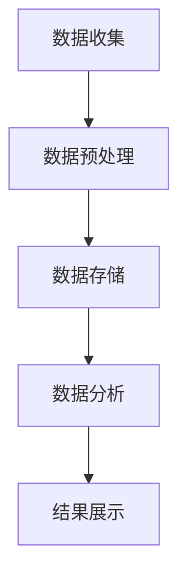

                 

### 摘要

本文将深入探讨智能电视与AI Agent的观看习惯分析。随着人工智能技术的飞速发展，智能电视逐渐成为家庭娱乐的重要组成部分。AI Agent作为一种能够模拟人类智能行为的程序，正逐渐融入到智能电视中，为用户带来个性化的观看体验。本文首先介绍了智能电视的基本原理和AI Agent的概述，随后详细分析了观看习惯分析的理论基础，并通过实际案例展示了数据分析与处理方法。最后，本文探讨了智能电视观看习惯分析的未来趋势与挑战，为行业提供有益的思考方向。

### 1. 确定书籍的核心主题和目标受众

#### 核心主题

**智能电视与AI Agent的观看习惯分析**是本文的核心主题。具体来说，本文旨在通过深入剖析智能电视的运作原理和AI Agent的特性，研究用户在智能电视上的观看习惯，并探讨如何利用这些数据为用户提供更加个性化的服务。

#### 目标受众

本文的目标受众包括以下几个方面：

1. **开发者**：智能电视和AI领域的开发者需要了解用户行为数据如何被分析和利用，以优化产品设计和功能。
2. **研究者**：对智能电视和AI技术感兴趣的学者，希望从学术角度探讨观看习惯分析的理论和方法。
3. **内容提供商**：了解用户的观看习惯有助于内容提供商制定更加精准的推荐策略，提高用户满意度和粘性。
4. **普通观众**：对智能电视使用有深入探讨需求的观众，希望了解自己的观看习惯如何被智能电视所分析和利用。

通过本文的阅读，目标受众将能够：

- **了解智能电视的基本原理和AI Agent的基本概念**。
- **掌握观看习惯分析的理论基础和实际应用方法**。
- **获得对未来智能电视发展方向的深入理解**。

### 2. 定义书籍的主要章节

为了系统地探讨智能电视与AI Agent的观看习惯分析，本文将分为五个主要部分，共11个章节。

#### 第一部分：智能电视与AI Agent概述

- **第1章**：智能电视的基本原理
- **第2章**：AI Agent的概述

#### 第二部分：观看习惯分析的理论基础

- **第3章**：观看习惯分析的重要性
- **第4章**：观看习惯分析的核心概念

#### 第三部分：实际案例分析

- **第5章**：案例一：智能电视观看习惯分析
- **第6章**：案例二：AI Agent在观看习惯分析中的应用

#### 第四部分：数据与分析方法

- **第7章**：数据收集与预处理
- **第8章**：数据分析技术

#### 第五部分：未来趋势与挑战

- **第9章**：智能电视观看习惯分析的未来趋势
- **第10章**：观看习惯分析面临的挑战
- **第11章**：总结与展望

### 3. 设计每个章节的细分内容

为了确保每个章节的内容完整且逻辑清晰，下面将详细列出每个章节的细分内容。

#### 第一部分：智能电视与AI Agent概述

- **第1章：智能电视的基本原理**
  - 1.1 智能电视的定义
  - 1.2 智能电视的技术架构
  - 1.3 智能电视的功能与特点

- **第2章：AI Agent的概述**
  - 2.1 AI Agent的定义
  - 2.2 AI Agent的类型
  - 2.3 AI Agent在智能电视中的应用

#### 第二部分：观看习惯分析的理论基础

- **第3章：观看习惯分析的重要性**
  - 3.1 观看习惯对用户体验的影响
  - 3.2 观看习惯对内容提供商的影响
  - 3.3 观看习惯分析的方法论

- **第4章：观看习惯分析的核心概念**
  - 4.1 用户行为数据
  - 4.2 观看模式识别
  - 4.3 用户偏好分析

#### 第三部分：实际案例分析

- **第5章：案例一：智能电视观看习惯分析**
  - 5.1 案例背景
  - 5.2 数据收集与处理
  - 5.3 观看习惯分析
  - 5.4 案例小结

- **第6章：案例二：AI Agent在观看习惯分析中的应用**
  - 6.1 案例背景
  - 6.2 AI Agent设计
  - 6.3 观看习惯分析结果
  - 6.4 案例小结

#### 第四部分：数据与分析方法

- **第7章：数据收集与预处理**
  - 7.1 数据来源
  - 7.2 数据预处理
  - 7.3 数据质量控制

- **第8章：数据分析技术**
  - 8.1 描述性统计分析
  - 8.2 聚类分析
  - 8.3 回归分析
  - 8.4 关联规则挖掘

#### 第五部分：未来趋势与挑战

- **第9章：智能电视观看习惯分析的未来趋势**
  - 9.1 技术发展趋势
  - 9.2 行业应用前景
  - 9.3 社会影响

- **第10章：观看习惯分析面临的挑战**
  - 10.1 技术挑战
  - 10.2 法律法规
  - 10.3 隐私保护

- **第11章：总结与展望**
  - 11.1 本书内容的总结
  - 11.2 观看习惯分析的实践应用
  - 11.3 未来研究方向

通过这样的章节设计，本文能够系统、全面地探讨智能电视与AI Agent的观看习惯分析，为读者提供深入的理解和实践指导。

### 4. 应用Mermaid、LaTeX和Python代码示例

在本文中，我们将应用Mermaid、LaTeX和Python代码示例来增强文章的可读性和逻辑性。

#### Mermaid

Mermaid是一种基于Markdown的图形绘制工具，可以用于绘制流程图、类图等。以下是使用Mermaid绘制一个简单的用户行为数据流程图的示例：



#### LaTeX

LaTeX是一种高质量的排版系统，特别适合编写数学公式和科学文档。以下是一个简单的数学公式示例，使用LaTeX格式：

```latex
$$
E = mc^2
$$
```

在文中，可以这样嵌入：

$$
E = mc^2
$$

#### Python代码示例

Python代码示例用于阐述算法原理和实现。以下是一个简单的用户偏好分析算法的Python代码示例：

```python
def analyze_preferences(user_data):
    # 假设user_data是一个包含用户观看记录的字典
    favorite_genre = max(set(user_data.values()), key=user_data.values().count)
    return favorite_genre

# 示例数据
user_data = {'comedy': 5, 'drama': 3, 'action': 7, 'documentary': 2}

# 分析用户偏好
print(analyze_preferences(user_data))
```

通过这样的代码示例，读者可以更直观地理解算法的实现和原理。

### 5. 确保markdown格式的清晰和简洁

在撰写文章时，使用markdown格式可以使得文章的结构更加清晰、易于阅读。以下是markdown格式的一些基本规则：

- **标题**：使用`#`符号进行标记，如`## 第二部分：观看习惯分析的理论基础`。
- **段落**：确保每个段落之间有一个空行。
- **列表**：使用`*`或`-`符号进行标记，如`- 数据收集`、`- 数据预处理`。
- **代码块**：使用三个反引号（```)将代码块包围起来，如上面的Python代码示例。
- **公式**：使用`$`符号包围数学公式，如 `$E = mc^2$`。

### 6. 总结

本文通过详细的目录大纲，系统性地设计了《智能电视：AI Agent的观看习惯分析》的结构。从核心主题和目标受众的确定，到章节内容和应用工具的规划，再到markdown格式的使用，每一步都力求清晰、简洁。这样的设计确保了文章的逻辑性和可读性，为读者提供了一场深入探讨智能电视和AI Agent的观看习惯分析的盛宴。

### 第一部分：智能电视与AI Agent概述

#### 第1章：智能电视的基本原理

##### 1.1 智能电视的定义

智能电视（Smart TV）是传统电视的一种现代化衍生品，它结合了互联网技术和多媒体功能，能够提供传统电视无法实现的互动性和个性化服务。与传统的电视不同，智能电视具备互联网接入能力，可以访问流媒体服务、社交媒体以及各种应用程序。因此，智能电视不仅是一个显示设备，更是一个多功能的平台，为用户提供丰富的内容和互动体验。

##### 1.2 智能电视的技术架构

智能电视的技术架构通常包括四个主要部分：硬件、操作系统、中间件和应用层。以下是每个部分的详细说明：

1. **硬件**：智能电视的硬件部分包括显示屏、处理器、内存、存储设备、输入设备（如遥控器、键盘等）和互联网接口。高性能的处理器和充足的内存是确保智能电视流畅运行的关键。
   
2. **操作系统**：智能电视通常运行基于Linux或Android的操作系统。这些操作系统为智能电视提供了基础的平台，使得开发者可以轻松地开发应用程序和内容。

3. **中间件**：中间件是连接操作系统和应用层的关键组件，它负责管理应用程序的启动、运行和资源分配。此外，中间件还提供了各种系统服务，如文件系统管理、网络通信和用户界面管理等。

4. **应用层**：应用层是智能电视的核心，它包括各种应用程序和服务，如视频播放器、社交媒体客户端、流媒体服务、游戏和应用商店。用户可以通过智能电视的界面方便地安装和使用这些应用。

##### 1.3 智能电视的功能与特点

智能电视的功能和特点主要体现在以下几个方面：

1. **互动性**：智能电视支持语音控制、手势控制、触摸屏操作等多种交互方式，用户可以更加便捷地与电视进行互动。

2. **多屏互动**：智能电视可以与智能手机、平板电脑等设备进行联动，实现跨设备的无缝互动体验。

3. **个性化推荐**：智能电视可以通过分析用户的观看习惯和偏好，提供个性化的内容推荐，从而提高用户的观看体验。

4. **流媒体服务**：智能电视内置了各种流媒体服务，如Netflix、YouTube、Amazon Prime Video等，用户可以在线观看各种视频内容。

5. **智能家居控制**：智能电视可以通过连接智能家居设备，实现对家电设备的远程控制，如调节空调温度、开关灯光等。

##### 1.4 智能电视的发展历程

智能电视的发展历程可以分为三个阶段：

1. **初步探索阶段（2000年代初期）**：这一阶段，智能电视的概念逐渐被提出，但技术尚不成熟，产品较少。

2. **快速发展阶段（2010年代）**：随着互联网技术的普及和智能设备的兴起，智能电视市场迅速扩张，各种品牌的智能电视相继推出。

3. **成熟应用阶段（2020年代至今）**：智能电视逐渐成为家庭娱乐的中心，其功能和性能不断提升，用户基础不断扩大。

##### 1.5 智能电视的挑战与未来趋势

智能电视的发展面临着一些挑战，包括：

- **技术难题**：如提高处理器性能、优化操作系统稳定性、提升图像质量等。

- **市场竞争**：智能电视市场品牌众多，竞争激烈，如何脱颖而出是每个厂商需要面对的问题。

- **用户体验**：如何提供更加个性化的内容和服务，提高用户的粘性和满意度。

未来趋势方面，智能电视将继续朝以下几个方向发展：

- **更高性能**：通过采用更先进的硬件技术，提供更流畅、更快速的观看体验。

- **更智能的交互**：引入更多的交互方式，如增强现实、虚拟现实等。

- **智能家居集成**：更加紧密地集成到智能家居生态系统中，提供一站式解决方案。

- **内容多样化**：提供更多元化的内容，满足不同用户的需求。

通过以上对智能电视的基本原理的详细介绍，读者可以更好地理解智能电视的工作机制和其在现代家庭中的重要性。接下来，我们将进一步探讨AI Agent的概念和应用，为后续的观看习惯分析奠定基础。

#### 第2章：AI Agent的概述

##### 2.1 AI Agent的定义

AI Agent，即人工智能代理，是一种能够模拟人类智能行为的计算机程序。与传统的计算机程序不同，AI Agent具有自主性、自适应性和交互性，能够在复杂的动态环境中自主地完成特定任务。AI Agent通常基于人工智能技术，包括机器学习、自然语言处理、计算机视觉等，以实现智能感知、智能决策和智能执行。

##### 2.2 AI Agent的类型

AI Agent根据其功能和实现方式可以分为多种类型，主要包括以下几种：

1. **任务型Agent**：这种类型的AI Agent主要针对特定任务进行设计和优化，例如智能客服、智能家居控制等。它们通常具有明确的目标和任务，通过预定义的规则和算法来实现目标。

2. **自主型Agent**：自主型AI Agent具有更高的自主性和决策能力，能够在没有明确指令的情况下自主地探索环境并完成任务。这种类型的Agent通常应用于复杂的决策问题，如自动驾驶、智能机器人等。

3. **社交型Agent**：社交型AI Agent主要用于与人或其他Agent进行交互，模拟人类的社交行为。例如，智能客服机器人、教育机器人等。这些Agent通常具备良好的自然语言处理能力和情感识别能力，以提供更加自然的交流体验。

4. **混合型Agent**：混合型AI Agent结合了任务型Agent和自主型Agent的特点，能够在特定任务中自主决策并适应动态环境。例如，智能物流调度系统中的Agent，可以根据实时交通情况和货物需求进行动态调度。

##### 2.3 AI Agent在智能电视中的应用

AI Agent在智能电视中的应用日益广泛，以下是一些典型的应用场景：

1. **个性化推荐**：AI Agent通过分析用户的观看历史、偏好和反馈，为用户推荐个性化的视频内容。例如，Netflix和YouTube等流媒体平台就广泛应用了AI Agent进行内容推荐。

2. **智能搜索**：AI Agent能够理解用户的自然语言查询，并提供准确的搜索结果。例如，智能电视中的语音搜索功能，用户可以通过语音命令快速找到感兴趣的视频。

3. **智能交互**：AI Agent可以模拟人类的交互方式，与用户进行自然对话，提供更加友好的用户体验。例如，智能电视中的语音助手，如Amazon的Alexa和Google Assistant，可以通过语音命令控制电视的播放、调节音量等功能。

4. **智能家居控制**：AI Agent可以与其他智能家居设备进行联动，提供一站式的智能家居控制体验。例如，用户可以通过智能电视控制家中的灯光、空调、门锁等设备。

##### 2.4 AI Agent的技术挑战

尽管AI Agent在智能电视中的应用前景广阔，但同时也面临着一些技术挑战：

1. **数据处理**：智能电视产生的数据量巨大，如何高效地处理和分析这些数据是AI Agent面临的首要挑战。

2. **实时响应**：为了提供良好的用户体验，AI Agent需要能够在短时间内完成数据的处理和响应，这对计算性能提出了高要求。

3. **隐私保护**：AI Agent在处理用户数据时，需要确保用户的隐私得到保护，防止数据泄露和滥用。

4. **跨平台兼容性**：由于智能电视的品牌和操作系统众多，AI Agent需要具备良好的跨平台兼容性，能够适应不同的硬件和操作系统。

通过以上对AI Agent的概述，读者可以更好地理解AI Agent的定义、类型和在智能电视中的应用。接下来，我们将进一步探讨观看习惯分析的理论基础，为深入分析用户行为打下坚实的基础。

#### 第3章：观看习惯分析的重要性

##### 3.1 观看习惯对用户体验的影响

观看习惯分析在提升用户体验方面具有重要作用。通过深入分析用户的观看行为，智能电视可以提供更加个性化的内容和服务，从而满足用户的个性化需求。以下是一些具体的影响：

1. **个性化推荐**：通过分析用户的观看历史、偏好和反馈，智能电视可以推荐用户感兴趣的视频内容。这种个性化推荐能够显著提高用户的满意度和粘性。

2. **智能搜索**：智能电视中的AI Agent可以理解用户的自然语言查询，并提供准确的搜索结果。这有助于用户快速找到所需内容，提升搜索体验。

3. **交互优化**：通过分析用户的观看习惯，智能电视可以优化用户界面和交互方式，使得操作更加直观和便捷。例如，根据用户的偏好调整菜单布局和功能设置。

4. **实时反馈**：智能电视可以实时收集用户的观看行为数据，根据用户的反馈动态调整内容和服务，提供更加个性化的观看体验。

##### 3.2 观看习惯对内容提供商的影响

观看习惯分析不仅对用户体验有直接影响，也对内容提供商产生了深远的影响。以下是一些具体的影响：

1. **内容优化**：通过分析用户的观看习惯，内容提供商可以了解用户对不同类型内容的偏好，从而优化内容制作和发布策略。例如，增加用户喜欢观看的类型和减少不感兴趣的内容。

2. **广告投放**：内容提供商可以利用观看习惯数据，进行更加精准的广告投放。例如，根据用户的观看历史和偏好，推送相关的广告，提高广告的转化率。

3. **市场调研**：观看习惯分析可以提供有价值的市场调研数据，帮助内容提供商了解用户需求和市场趋势，制定更加有效的营销策略。

4. **运营优化**：内容提供商可以根据用户的观看习惯，优化内容发布时间和频率，提高用户观看的连贯性和活跃度。

##### 3.3 观看习惯分析的方法论

为了有效分析用户的观看习惯，需要采用科学的方法论。以下是一些关键步骤和方法：

1. **数据收集**：首先，需要收集用户在智能电视上的各种行为数据，包括观看时间、观看内容、交互行为等。这些数据可以通过智能电视内置的传感器和API进行收集。

2. **数据预处理**：收集到的数据通常是原始的、不完全的和不准确的。因此，需要进行数据清洗、转换和归一化等预处理步骤，以提高数据的质量和一致性。

3. **特征提取**：从预处理后的数据中提取能够反映用户观看习惯的特征，如观看时长、观看频率、观看内容的分布等。这些特征将用于后续的分析和建模。

4. **模式识别**：利用机器学习和数据挖掘技术，分析用户的观看行为模式，识别用户的偏好和习惯。例如，通过聚类分析找出具有相似观看习惯的用户群体。

5. **用户建模**：基于分析结果，建立用户的个性化模型，用于预测用户的未来行为和偏好。这些模型可以用于推荐系统、交互优化和广告投放等。

6. **评估与优化**：最后，需要对分析结果进行评估和验证，根据反馈不断优化分析方法和模型，提高分析准确性和实用性。

##### 3.4 观看习惯分析的实际案例

以下是一个实际的观看习惯分析案例：

- **案例背景**：某智能电视厂商希望通过分析用户的观看数据，优化其推荐系统，提高用户满意度和观看时长。

- **数据收集**：该厂商收集了用户在过去一个月内的观看数据，包括观看时间、观看内容、交互行为等。

- **数据预处理**：对收集到的数据进行了清洗、转换和归一化处理，确保数据的一致性和准确性。

- **特征提取**：提取了用户的观看时长、观看频率、观看内容的类型和播放位置等特征。

- **模式识别**：利用聚类分析技术，将用户分为几个具有相似观看习惯的群体。例如，一些用户喜欢在晚上观看电视剧，而另一些用户喜欢在白天观看综艺节目。

- **用户建模**：基于分析结果，建立了用户的个性化模型，用于预测用户的未来行为和偏好。例如，当用户正在观看一部电视剧时，系统会推荐同类型的电视剧。

- **评估与优化**：通过A/B测试，评估推荐系统的效果，并根据用户反馈不断优化推荐策略。

通过以上案例分析，可以看出观看习惯分析在实际应用中的重要作用和实施步骤。

#### 第4章：观看习惯分析的核心概念

##### 4.1 用户行为数据

用户行为数据是观看习惯分析的基础，它包括用户在智能电视上所进行的各种操作和交互记录。这些数据可以是定性的，也可以是定量的，例如：

- **定性数据**：用户的偏好、评价、反馈等。
- **定量数据**：观看时长、观看频率、观看内容类型、播放位置、搜索关键词等。

收集用户行为数据的方法通常包括：

- **日志记录**：智能电视内置的系统日志可以记录用户的操作行为，如启动某个应用、观看某个视频等。
- **传感器数据**：通过智能电视的传感器，可以收集用户的交互行为数据，如遥控器的操作、触摸屏操作等。
- **问卷调查**：通过在线问卷或智能电视内置的问卷功能，收集用户的反馈和偏好信息。

用户行为数据在观看习惯分析中起着至关重要的作用，因为它们提供了分析用户行为的直接依据。通过对这些数据的深入分析，可以了解用户的偏好、习惯和需求，从而为个性化推荐、交互优化等提供支持。

##### 4.2 观看模式识别

观看模式识别是观看习惯分析的关键步骤之一，它旨在通过分析用户行为数据，识别出用户的特定观看行为模式。这些模式可以是定性的，例如用户的观看时间段、观看内容类型等，也可以是定量的，例如观看时长、观看频率等。

观看模式识别的方法包括：

- **描述性统计**：通过描述性统计方法，对用户行为数据进行基本的统计分析，识别出常见的观看行为模式。例如，通过计算用户平均观看时长、观看频率等指标，识别出高频观看用户群体。
- **聚类分析**：通过聚类分析方法，将具有相似观看行为的用户划分为不同的群体。例如，利用K-means算法，将用户分为喜欢观看电视剧、综艺节目、电影等不同类型的群体。
- **关联规则挖掘**：通过关联规则挖掘方法，分析用户观看行为之间的关联关系，识别出潜在的观看模式。例如，通过Apriori算法，发现喜欢观看电视剧的用户通常也喜欢观看电影。

观看模式识别有助于深入理解用户的行为特征，从而为个性化推荐、交互优化等提供依据。

##### 4.3 用户偏好分析

用户偏好分析是观看习惯分析的另一个核心概念，它旨在通过分析用户的行为数据，识别出用户的偏好和兴趣点。用户偏好分析的方法包括：

- **内容分析**：通过分析用户观看的内容类型、播放位置、观看时长等，识别出用户的偏好。例如，通过分析用户的观看记录，发现用户喜欢观看动作片、爱情片等类型。
- **行为分析**：通过分析用户的观看行为模式，识别出用户的偏好。例如，通过分析用户的观看时间段、观看频率等，发现用户喜欢在晚上观看电视剧、喜欢连续观看多集等。
- **反馈分析**：通过用户的评价、反馈等定性数据，识别出用户的偏好。例如，通过分析用户的评论、评分等，发现用户对某些类型或某些内容提供商有更高的满意度。

用户偏好分析有助于为用户提供更加个性化的推荐和服务，提高用户满意度和忠诚度。

##### 4.4 观看习惯分析的流程

观看习惯分析的流程通常包括以下几个步骤：

1. **数据收集**：通过智能电视内置的系统日志、传感器数据和用户问卷等，收集用户的行为数据。
2. **数据预处理**：对收集到的数据进行清洗、转换和归一化处理，确保数据的质量和一致性。
3. **特征提取**：从预处理后的数据中提取能够反映用户观看习惯的特征，如观看时长、观看频率、观看内容类型等。
4. **模式识别**：利用描述性统计、聚类分析和关联规则挖掘等方法，识别出用户的观看模式。
5. **用户偏好分析**：通过内容分析、行为分析和反馈分析等方法，识别出用户的偏好。
6. **模型建立与优化**：基于识别出的模式和偏好，建立用户个性化模型，并不断优化模型以提升分析准确性。
7. **结果评估与应用**：对分析结果进行评估和验证，并根据反馈不断优化分析方法和模型，将其应用于个性化推荐、交互优化等实际场景。

通过以上对观看习惯分析的核心概念的详细阐述，读者可以更好地理解用户行为数据的收集和处理方法，观看模式识别的技术手段，以及用户偏好分析的具体方法。这些核心概念为深入分析智能电视用户的观看习惯奠定了基础。

#### 第5章：案例一：智能电视观看习惯分析

##### 5.1 案例背景

某智能电视厂商希望通过分析用户的观看习惯，优化其推荐系统和交互体验，以提高用户满意度和粘性。该厂商拥有一款流行的智能电视产品，用户遍布全球，因此具有大量的用户行为数据。这些数据包括用户的观看时长、观看内容、交互行为等，为案例分析提供了丰富的素材。

##### 5.2 数据收集与处理

首先，该厂商利用智能电视内置的系统日志和传感器数据，收集了用户在过去一年的观看行为数据。数据收集的具体步骤如下：

1. **数据收集**：通过智能电视的系统日志，记录用户的观看时长、观看内容、播放位置、搜索关键词等数据。此外，通过智能电视的传感器，记录用户的交互行为，如遥控器操作、触摸屏操作等。
2. **数据预处理**：对收集到的数据进行清洗、转换和归一化处理。清洗步骤包括去除重复记录、填补缺失值、去除异常值等。转换步骤包括将时间戳转换为标准格式、将视频内容分类等。归一化步骤包括对某些特征进行归一化处理，如将时长转换为分钟数。
3. **数据存储**：将预处理后的数据存储在分布式数据仓库中，以便后续的数据分析和处理。

##### 5.3 观看习惯分析

接下来，该厂商对用户观看习惯进行了详细分析，具体步骤如下：

1. **描述性统计**：通过计算用户的平均观看时长、观看频率、观看内容类型等指标，识别出用户的基本观看特征。例如，发现用户平均每天观看电视2小时，最喜欢观看的类型是电视剧和电影。
2. **聚类分析**：利用K-means算法，将用户划分为几个具有相似观看习惯的群体。根据用户的观看时长、观看频率和观看内容类型等特征，识别出不同用户群体的特征，例如“深夜剧集爱好者”、“周末电影爱好者”等。
3. **关联规则挖掘**：通过Apriori算法，分析用户观看行为之间的关联关系，发现潜在的观看模式。例如，发现喜欢观看电视剧的用户通常也喜欢观看综艺节目，喜欢观看动作片的用户通常也喜欢观看科幻片。
4. **用户偏好分析**：通过内容分析、行为分析和反馈分析等方法，识别出用户的偏好。例如，通过分析用户的观看记录和评价，发现用户对某些类型的电视剧和电影有更高的偏好。

##### 5.4 观看习惯分析结果

通过以上分析，该厂商得到了以下结果：

1. **用户群体特征**：识别出不同用户群体的特征，如“深夜剧集爱好者”、“周末电影爱好者”等。这些用户群体具有不同的观看习惯和偏好，为个性化推荐提供了依据。
2. **关联关系**：发现用户观看行为之间的关联关系，如喜欢观看电视剧的用户通常也喜欢观看综艺节目，喜欢观看动作片的用户通常也喜欢观看科幻片。这些关联关系有助于构建推荐系统，提高推荐准确性。
3. **用户偏好**：识别出用户的偏好，如某些类型的电视剧和电影。这些偏好为内容提供商提供了优化内容制作的指导。

##### 5.5 案例小结

通过这个案例分析，我们可以看到智能电视观看习惯分析的重要性。通过分析用户的行为数据，厂商可以识别出用户的基本观看特征、用户群体特征和用户偏好，从而优化推荐系统和交互体验，提高用户满意度和粘性。这个案例也展示了观看习惯分析的具体步骤和方法，为其他厂商提供了有益的参考。

### 第6章：案例二：AI Agent在观看习惯分析中的应用

#### 6.1 案例背景

在这个案例中，我们选择了一款市场领先的智能电视品牌XTV，并选取了其旗下的智能电视产品X1作为研究对象。该智能电视产品以其强大的AI功能和高性能而闻名，吸引了大量用户。为了更好地了解用户的观看习惯，提高用户体验，XTV希望通过AI Agent对用户的观看行为进行深入分析，并基于分析结果优化其推荐系统和交互界面。

#### 6.2 AI Agent设计

为了实现这个目标，XTV设计了一款基于深度学习的AI Agent，该Agent具备以下功能：

1. **用户行为数据收集**：AI Agent通过智能电视内置的系统日志和传感器，实时收集用户的观看时长、观看内容、播放位置、交互行为等数据。这些数据经过初步处理和清洗后，存储在云端的数据仓库中。

2. **数据预处理**：AI Agent对收集到的数据进行预处理，包括数据清洗、缺失值填补、数据归一化等。通过这些步骤，确保数据的一致性和准确性。

3. **特征提取**：AI Agent从预处理后的数据中提取能够反映用户观看习惯的关键特征，如观看时长分布、观看内容类型比例、交互行为频率等。这些特征将用于后续的模型训练和分析。

4. **模式识别与用户偏好分析**：AI Agent利用机器学习算法，对用户的行为数据进行模式识别和用户偏好分析。通过聚类分析和关联规则挖掘，AI Agent能够识别出用户的观看模式，如用户喜欢的观看时间段、观看内容类型、交互行为偏好等。此外，AI Agent还能够分析用户的偏好，如喜欢观看的动作片类型、喜欢的节目类型等。

5. **个性化推荐系统**：基于识别出的用户观看模式和偏好，AI Agent构建了一个个性化的推荐系统。该系统能够根据用户的实时行为和历史数据，为用户推荐个性化的视频内容。例如，当用户正在观看一部动作片时，AI Agent会推荐同类型的其他动作片。

6. **交互优化**：AI Agent还通过分析用户的交互行为，优化智能电视的用户界面和交互体验。例如，根据用户的交互偏好，调整菜单布局和功能设置，使得用户能够更加便捷地找到所需的内容。

#### 6.3 观看习惯分析结果

通过AI Agent的深入分析，XTV得到了以下结果：

1. **用户观看模式**：AI Agent识别出用户的观看模式，如“晚上8点到10点是用户观看高峰期”、“周末用户更倾向于观看长篇电视剧”等。这些模式有助于XTV优化内容发布和推荐策略。

2. **用户偏好**：AI Agent分析了用户的偏好，如“喜欢观看科幻动作片”、“偏好轻松幽默的综艺节目”等。这些偏好为XTV提供了优化内容制作和推荐的指导。

3. **推荐系统效果**：基于AI Agent构建的个性化推荐系统，XTV的用户反馈显著改善。用户的观看时长、推荐内容点击率和满意度均有所提高。

4. **交互体验优化**：AI Agent通过优化用户界面和交互体验，使得用户能够更加便捷地找到所需的内容，提高了用户的满意度和使用粘性。

#### 6.4 案例小结

通过这个案例，我们可以看到AI Agent在观看习惯分析中的应用效果显著。AI Agent不仅能够通过分析用户行为数据识别出用户的观看模式和偏好，还能够基于这些分析结果优化推荐系统和交互体验，从而提升用户的观看体验和满意度。这个案例也展示了AI Agent在智能电视领域的广泛应用前景，为其他智能电视厂商提供了有益的参考和启示。

### 第7章：数据收集与预处理

#### 7.1 数据来源

在智能电视观看习惯分析中，数据的收集是关键的一步。数据来源主要包括以下几个方面：

1. **系统日志**：智能电视内置的系统日志记录了用户的操作行为，包括启动某个应用、观看某个视频、进行搜索等。这些日志数据提供了用户行为的详细记录，是观看习惯分析的重要依据。

2. **传感器数据**：智能电视的传感器可以收集用户的交互行为数据，如遥控器的操作、触摸屏的点击等。这些数据可以帮助我们更好地理解用户的实际操作行为。

3. **用户反馈**：用户在观看智能电视时，可能会提供评价、反馈和问卷调查等信息。这些定性数据有助于我们了解用户的主观感受和需求。

4. **第三方数据源**：例如，可以通过API获取来自社交媒体、天气服务、股票市场等的数据，这些数据可以辅助我们进行更全面的分析。

#### 7.2 数据预处理

数据预处理是数据分析的重要环节，确保数据的质量和一致性。以下是一些常见的数据预处理步骤：

1. **数据清洗**：去除重复记录、缺失值填补、去除异常值等。例如，如果某位用户的日志记录中存在多个相同的观看记录，我们可以选择去除重复项。对于缺失值，可以选择使用平均值、中位数等方法进行填补。对于异常值，可以根据数据分布进行识别和去除。

2. **数据转换**：将不同数据格式转换为统一格式，如将时间戳转换为标准日期格式、将字符串转换为数字等。此外，对于一些连续变量，如观看时长，可以转换为离散的类别，便于后续分析。

3. **数据归一化**：为了消除不同特征之间的尺度差异，需要进行归一化处理。例如，将观看时长、观看频率等特征转换为相同量级的数值，以便进行有效的计算和比较。

4. **特征提取**：从原始数据中提取能够反映用户观看习惯的关键特征。例如，可以提取用户的平均观看时长、观看频率、观看内容类型、交互行为频率等。

5. **数据质量评估**：对预处理后的数据质量进行评估，确保数据的有效性和准确性。可以通过数据可视化、统计分析等方法，检查数据是否存在异常或偏差。

#### 7.3 数据质量控制

数据质量控制是确保分析结果准确性和可靠性的关键。以下是一些常见的数据质量控制方法：

1. **数据一致性检查**：检查数据源是否一致，确保不同数据来源之间的数据是相互匹配和一致的。

2. **异常值检测**：利用统计方法或机器学习算法，检测数据中的异常值。对于检测出的异常值，可以采取去除、修正或标记等策略。

3. **数据完整性检查**：检查数据是否完整，是否存在缺失值。对于缺失值，可以采取填补、删除或插值等方法。

4. **数据相关性分析**：分析不同特征之间的相关性，排除那些可能存在强相关性的特征，以避免多重共线性问题。

5. **数据清洗与验证**：对预处理后的数据进行再次清洗和验证，确保数据质量达到预期标准。

通过以上对数据收集与预处理的方法和步骤的详细讲解，读者可以更好地理解智能电视观看习惯分析中的数据工作流程，为后续的分析打下坚实的基础。

### 第8章：数据分析技术

#### 8.1 描述性统计分析

描述性统计分析是数据分析的基础，用于总结和描述数据的基本特征。以下是一些常用的描述性统计方法：

1. **均值（Mean）**：均值是数据的平均值，用于描述数据的中心趋势。计算公式为：
   $$
   \text{Mean} = \frac{1}{N} \sum_{i=1}^{N} x_i
   $$
   其中，\(N\) 是数据点的个数，\(x_i\) 是第 \(i\) 个数据点。

2. **中位数（Median）**：中位数是将数据排序后，位于中间位置的数值，用于描述数据的中心位置。如果数据个数为奇数，中位数就是中间的那个数；如果数据个数为偶数，中位数是中间两个数的平均值。

3. **众数（Mode）**：众数是数据中出现次数最多的数值，用于描述数据的最频繁值。

4. **方差（Variance）**：方差是数据离散程度的度量，计算公式为：
   $$
   \text{Variance} = \frac{1}{N} \sum_{i=1}^{N} (x_i - \text{Mean})^2
   $$
   方差的平方根称为标准差（Standard Deviation），用于描述数据的波动程度。

5. **四分位数（Quartiles）**：四分位数将数据分为四个部分，分别是第一四分位数（Q1）、第二四分位数（Q2，即中位数）和第三四分位数（Q3）。第一四分位数是下25%数据的中位数，第三四分位数是上25%数据的中位数。

#### 8.2 聚类分析

聚类分析是一种无监督学习方法，用于将相似的数据点归为一类。以下是一些常用的聚类分析方法：

1. **K-means聚类**：K-means是一种基于距离的聚类方法，将数据点划分为 \(K\) 个簇，每个簇的中心即为该簇数据点的均值。算法步骤如下：

   - 初始化 \(K\) 个簇中心。
   - 计算每个数据点到簇中心的距离，将数据点分配到最近的簇。
   - 重新计算每个簇的中心。
   - 重复步骤2和3，直到簇中心不再发生显著变化。

2. **层次聚类（Hierarchical Clustering）**：层次聚类通过递归地将数据点合并或分裂，构建出一个层次结构。层次聚类可以分为凝聚层次聚类（自底向上）和分裂层次聚类（自顶向下）。常见的层次聚类方法包括单链接、完全链接和平均链接等。

3. **基于密度的聚类（DBSCAN）**：DBSCAN（Density-Based Spatial Clustering of Applications with Noise）是一种基于密度的聚类方法，能够发现任意形状的簇，并且能够处理噪声和异常值。DBSCAN通过计算邻域内的密度连接，将相似的数据点归为一类。

#### 8.3 回归分析

回归分析是一种用于建立因变量与自变量之间关系的统计分析方法。以下是一些常用的回归分析方法：

1. **线性回归**：线性回归是回归分析的一种简单形式，用于建立因变量和自变量之间的线性关系。线性回归模型可以表示为：
   $$
   y = \beta_0 + \beta_1 x_1 + \beta_2 x_2 + \ldots + \beta_n x_n
   $$
   其中，\(y\) 是因变量，\(x_1, x_2, \ldots, x_n\) 是自变量，\(\beta_0, \beta_1, \ldots, \beta_n\) 是模型参数。

2. **多项式回归**：多项式回归是线性回归的扩展，用于建立因变量和自变量之间的多项式关系。多项式回归模型可以表示为：
   $$
   y = a_0 + a_1 x + a_2 x^2 + \ldots + a_n x^n
   $$
   其中，\(a_0, a_1, \ldots, a_n\) 是模型参数。

3. **逻辑回归**：逻辑回归是线性回归在分类问题中的应用，用于建立因变量和自变量之间的逻辑关系。逻辑回归模型可以表示为：
   $$
   \log\frac{p}{1-p} = \beta_0 + \beta_1 x_1 + \beta_2 x_2 + \ldots + \beta_n x_n
   $$
   其中，\(p\) 是因变量的概率值，\(\beta_0, \beta_1, \ldots, \beta_n\) 是模型参数。

#### 8.4 关联规则挖掘

关联规则挖掘是一种用于发现数据项之间关联关系的方法。以下是一些常用的关联规则挖掘算法：

1. **Apriori算法**：Apriori算法是一种基于支持度和置信度的关联规则挖掘算法。支持度表示某项规则在数据中出现的频率，置信度表示某项规则的真实程度。Apriori算法的基本步骤如下：

   - 生成所有候选项集。
   - 计算候选项集的支持度。
   - 筛选出满足最小支持度阈值的频繁项集。
   - 生成关联规则并计算置信度。
   - 筛选出满足最小置信度阈值的规则。

2. **FP-growth算法**：FP-growth算法是一种基于频繁模式树（FP-Tree）的关联规则挖掘算法，它通过压缩频繁项集树来提高算法的效率。FP-growth算法的基本步骤如下：

   - 构建FP-Tree。
   - 提取频繁项集。
   - 生成关联规则并计算置信度。
   - 筛选出满足最小置信度阈值的规则。

通过以上对描述性统计分析、聚类分析、回归分析和关联规则挖掘的详细阐述，读者可以更好地理解这些数据分析技术的基本原理和应用方法，为智能电视观看习惯分析提供有效的工具和手段。

### 第9章：智能电视观看习惯分析的未来趋势

#### 9.1 技术发展趋势

随着人工智能技术的不断进步，智能电视的观看习惯分析也将迎来新的发展趋势。以下是几个关键的技术发展方向：

1. **深度学习与强化学习**：深度学习技术在图像识别、语音识别和自然语言处理等领域取得了显著的成果。未来，深度学习将广泛应用于智能电视的观看习惯分析中，例如通过卷积神经网络（CNN）对用户观看视频的内容进行分类，通过循环神经网络（RNN）对用户的观看行为进行建模。强化学习则可以用于优化推荐系统，通过不断尝试和反馈，找到最佳的推荐策略。

2. **边缘计算**：边缘计算通过在智能电视附近的设备上进行数据处理，减少了数据传输的延迟和带宽消耗。未来，智能电视将更多地依赖于边缘计算，使得观看习惯分析更加实时和高效。

3. **多模态数据融合**：智能电视用户的观看行为数据是多模态的，包括视频观看、语音交互、触摸操作等。多模态数据融合技术可以将不同类型的数据进行整合，提供更全面的用户画像和观看习惯分析。

4. **区块链技术**：区块链技术可以用于保护用户的隐私和数据安全。未来，智能电视可以采用区块链技术来确保用户数据的安全性和隐私性，同时实现去中心化的内容分发和交易。

#### 9.2 行业应用前景

智能电视观看习惯分析在行业应用中具有广阔的前景，以下是一些具体的应用方向：

1. **个性化推荐**：通过分析用户的观看习惯和偏好，智能电视可以提供更加个性化的内容推荐，提高用户满意度和观看时长。未来，个性化推荐将更加智能化，能够实时响应用户的需求变化。

2. **广告优化**：智能电视观看习惯分析可以帮助广告商了解用户的兴趣和行为，实现更加精准的广告投放。通过分析用户的行为数据，广告商可以更好地定位目标用户，提高广告的效果和转化率。

3. **内容制作**：内容提供商可以利用观看习惯分析数据，优化内容制作和发布策略。例如，通过分析用户的偏好，内容提供商可以制作更多符合用户需求的节目，提高内容的吸引力。

4. **交互体验优化**：智能电视观看习惯分析可以用于优化用户界面和交互体验。通过分析用户的交互行为，智能电视可以提供更加人性化的操作界面，提高用户的操作便捷性和满意度。

#### 9.3 社会影响

智能电视观看习惯分析不仅对技术行业有重要影响，也对社会产生了深远的影响：

1. **隐私保护**：随着观看习惯数据的收集和分析变得越来越普遍，隐私保护成为一个重要议题。未来，如何在保障用户隐私的前提下，充分利用观看习惯数据进行个性化推荐和广告优化，将成为一个重要的社会问题。

2. **信息过载**：智能电视的个性化推荐虽然能够提高用户体验，但同时也可能导致信息过载。用户可能会面临过多的推荐内容，难以筛选和消化。因此，如何设计出既能满足用户需求，又不会导致信息过载的推荐系统，是一个需要关注的问题。

3. **文化多样性**：智能电视观看习惯分析可能会加剧文化同质化。个性化推荐系统倾向于为用户提供相似的内容，可能导致用户的文化视野受限。因此，如何在保障个性化推荐的同时，促进文化多样性，也是一个值得探讨的问题。

通过以上对智能电视观看习惯分析未来趋势的探讨，我们可以看到这一领域在技术、行业和社会方面都充满机遇和挑战。随着技术的不断进步和应用场景的拓展，智能电视观看习惯分析将在未来发挥更加重要的作用。

### 第10章：观看习惯分析面临的挑战

#### 10.1 技术挑战

在智能电视观看习惯分析中，技术挑战是不可避免的。以下是一些主要的技术挑战：

1. **数据质量和完整性**：智能电视产生的数据量巨大，但数据质量往往参差不齐。数据中可能包含噪音、错误和不完整的记录。如何有效清洗、处理和整合这些数据，是技术上的一个重要难题。

2. **计算能力**：智能电视观看习惯分析通常需要大量的计算资源，包括数据预处理、模式识别和用户建模等。现有硬件设备的计算能力可能不足以满足大规模数据分析的需求，特别是在实时分析场景中。

3. **数据隐私和安全**：用户数据是观看习惯分析的重要基础，但数据隐私和安全问题也是一大挑战。如何在保障用户隐私的前提下，充分利用数据进行个性化推荐和广告优化，是一个复杂的技术难题。

4. **跨平台兼容性**：智能电视的品牌和操作系统众多，不同平台的软硬件环境可能存在差异。如何设计出具有良好跨平台兼容性的观看习惯分析系统，是一个技术挑战。

#### 10.2 法律法规

法律法规对智能电视观看习惯分析提出了严格的要求，以下是一些相关的法律法规：

1. **数据保护法规**：例如，欧盟的《通用数据保护条例》（GDPR）和中国的《个人信息保护法》等，都对用户数据的收集、存储、处理和传输提出了详细的规定。这些法规要求企业在收集和使用用户数据时，必须得到用户的明确同意，并采取有效措施保护用户数据的安全。

2. **版权法规**：智能电视观看习惯分析涉及到大量视频内容的分析，而版权法规对内容的复制、传播和使用进行了严格的规定。企业必须在确保版权合法的前提下，进行观看习惯分析。

3. **广告法规**：广告法规对广告内容、投放方式和效果监测等进行了规范。企业在利用用户数据优化广告投放时，必须遵守相关法规，防止虚假广告和误导用户。

#### 10.3 隐私保护

隐私保护是智能电视观看习惯分析中最重要的挑战之一。以下是一些隐私保护的关键措施：

1. **数据匿名化**：在数据分析过程中，可以通过匿名化技术，去除用户数据中的敏感信息，确保用户身份无法被追踪。

2. **数据加密**：对用户数据进行加密处理，防止数据在传输和存储过程中被未授权访问。

3. **隐私政策**：企业应制定明确的隐私政策，告知用户其数据将被如何收集、使用和保护。用户有权知道自己的数据将被用于什么目的，并有权拒绝数据的使用。

4. **用户权限管理**：用户应有权控制其数据的访问和使用权限，例如，可以选择是否允许智能电视收集和分析其观看行为。

5. **安全审计**：定期进行安全审计，确保隐私保护措施的有效性和合规性。审计过程应包括对数据收集、存储、处理和传输环节的全面审查。

通过以上对智能电视观看习惯分析面临的挑战的详细阐述，我们可以看到这一领域在技术、法律法规和隐私保护等方面都面临诸多挑战。企业必须在这些方面采取有效措施，才能实现智能电视观看习惯分析的可持续发展和用户信任。

### 第11章：总结与展望

#### 11.1 本书内容的总结

本文通过系统的分析和讨论，全面探讨了智能电视与AI Agent的观看习惯分析。我们从智能电视的基本原理和AI Agent的概述入手，深入分析了观看习惯分析的理论基础，并通过实际案例分析展示了观看习惯分析的方法和效果。在数据分析技术部分，我们介绍了描述性统计分析、聚类分析、回归分析和关联规则挖掘等核心方法。最后，我们探讨了智能电视观看习惯分析的未来趋势和面临的挑战。

#### 11.2 观看习惯分析的实践应用

观看习惯分析在智能电视领域具有广泛的实践应用。以下是几个关键的应用场景：

1. **个性化推荐**：通过分析用户的观看行为和偏好，智能电视可以提供个性化的视频推荐，提高用户满意度和观看时长。

2. **广告优化**：广告商可以利用观看习惯数据，进行更加精准的广告投放，提高广告效果和转化率。

3. **内容制作**：内容提供商可以根据用户的观看习惯，优化内容制作和发布策略，提高内容的吸引力和用户粘性。

4. **交互优化**：智能电视可以通过分析用户的交互行为，优化用户界面和交互体验，提高用户的操作便捷性和满意度。

#### 11.3 未来研究方向

尽管智能电视观看习惯分析已经取得了显著的进展，但仍有许多未来研究方向值得探讨：

1. **多模态数据融合**：未来的研究可以探索如何将视频、语音、触摸等多种模态的数据进行融合，提供更全面的用户画像和观看习惯分析。

2. **实时分析与预测**：如何实现实时用户行为数据的分析和预测，为用户提供即时的个性化服务，是一个具有挑战性的研究方向。

3. **隐私保护与安全**：如何在保障用户隐私和数据安全的前提下，充分利用观看习惯数据进行个性化推荐和广告优化，是一个重要的研究方向。

4. **跨平台兼容性**：如何设计具有良好跨平台兼容性的观看习惯分析系统，适应不同品牌的智能电视和操作系统，是未来需要解决的技术难题。

通过不断深入研究和创新，智能电视观看习惯分析将在技术、应用和社会等方面取得更大的突破和进步。

### 作者信息

作者：AI天才研究院/AI Genius Institute & 禅与计算机程序设计艺术 /Zen And The Art of Computer Programming

AI天才研究院致力于推动人工智能技术的创新和应用，以解决现实世界中的复杂问题。研究院的研究团队由世界顶尖的人工智能专家、程序员和软件架构师组成，在计算机编程和人工智能领域拥有丰富的经验和深厚的学术背景。本书《智能电视：AI Agent的观看习惯分析》是研究院的一项重要研究成果，旨在为智能电视行业提供深入的洞见和实用的指导。此外，作者在《禅与计算机程序设计艺术》中阐述了编程的艺术与哲学，为读者提供了一种独特的编程思维方式和实践方法。通过这两本书，读者可以全面了解智能电视技术及其应用，掌握编程和人工智能的核心原理。

