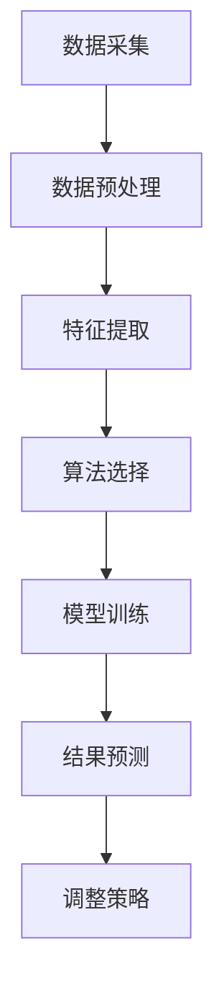
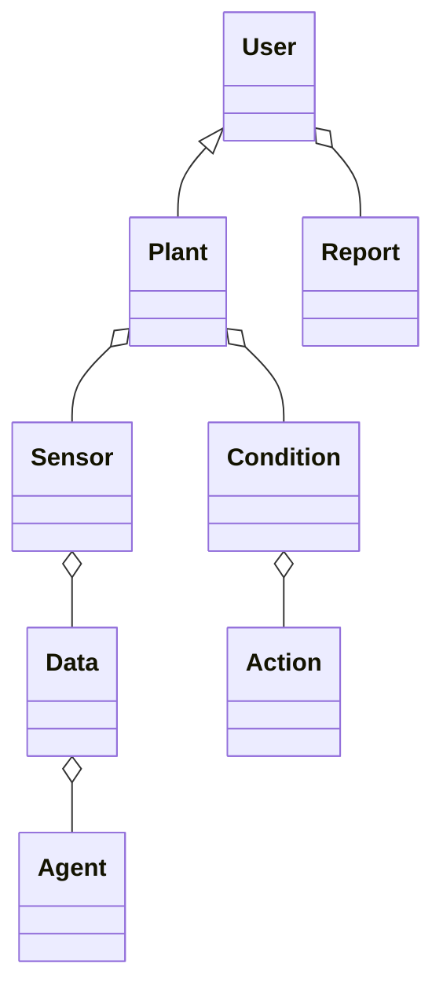
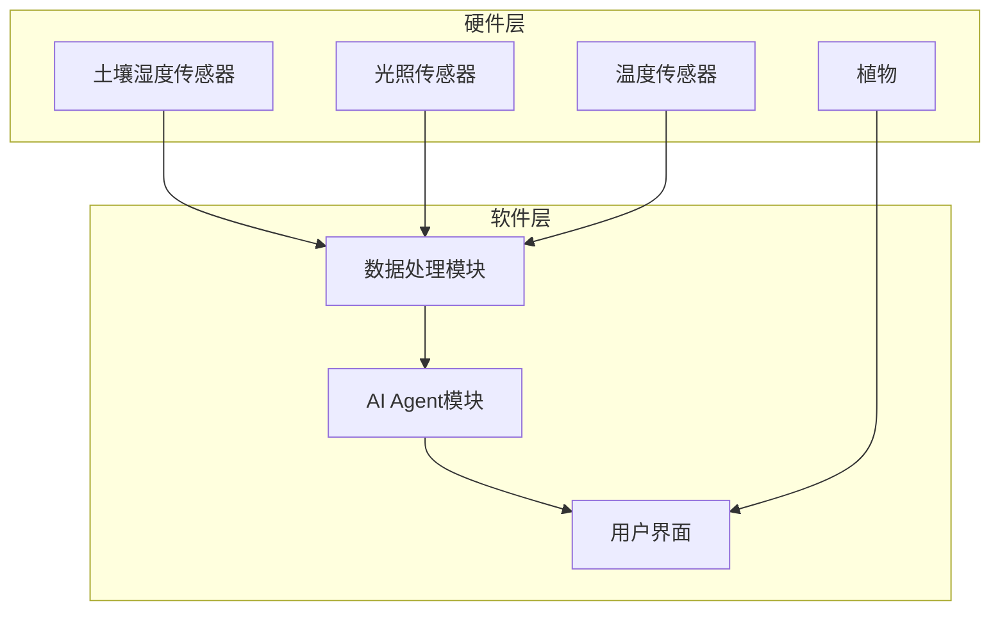
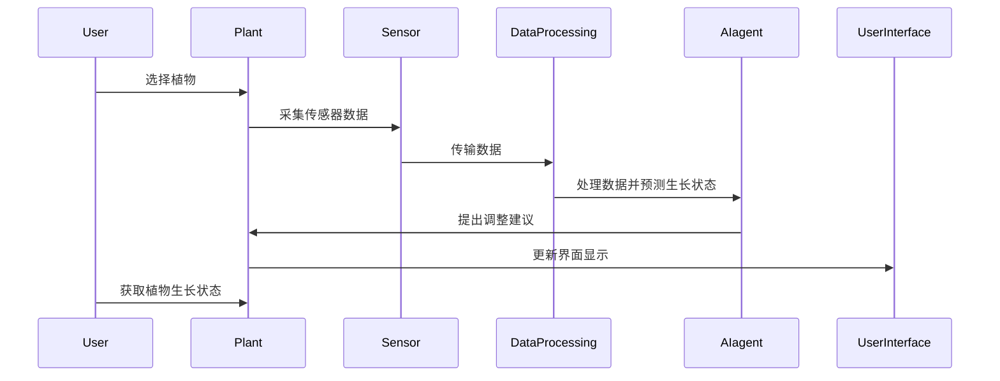

                 

# 智能窗台：AI Agent的室内植物生长监测

## 关键词

- 智能窗台
- AI Agent
- 室内植物生长监测
- 系统设计与实现
- 算法讲解
- 数学模型
- 系统架构
- 项目实战
- 最佳实践

## 摘要

本文探讨了智能窗台的概念及其在室内植物生长监测中的应用。通过详细分析智能窗台的核心技术，我们介绍了AI Agent的基本原理和其在室内植物生长监测中的重要性。随后，我们讲解了植物生长监测算法的原理、数学模型以及具体的Python实现。通过系统分析与架构设计，我们展示了智能窗台的系统功能、架构和接口设计。最后，我们通过一个实际项目案例，详细介绍了智能窗台的实现过程、代码解析和最佳实践，并对未来的发展趋势进行了展望。

## 引言

### 智能窗台的定义与作用

智能窗台是一种集成多种传感器、数据处理和AI算法的室内植物生长监测系统。它通过实时监测植物的生长状态，如土壤湿度、光照强度、温度等，为用户提供建议，以帮助植物更好地生长。智能窗台的出现，不仅使室内植物管理变得更加便捷，还为植物科学研究和农业自动化提供了新的思路。

### AI Agent在智能窗台中的应用

AI Agent是人工智能领域中的一个重要概念，它指的是具有自主决策和执行能力的人工智能实体。在智能窗台中，AI Agent可以实时分析传感器数据，并根据植物的生长需求和环境条件，自动调整植物的培养方案。例如，当土壤湿度低于临界值时，AI Agent会自动启动灌溉系统；当光照强度过高时，AI Agent会调整遮光装置。

## 第一部分：智能窗台概述

### 第1章：问题背景与概念介绍

#### 1.1 室内植物生长监测的重要性

随着城市化进程的加快，人们的生活空间越来越有限，室内植物成为改善室内环境和提升居住质量的重要手段。然而，室内植物的生长状态受到多种因素的影响，如光照、湿度、温度等，这些因素难以通过人工监测和管理达到最佳效果。因此，室内植物生长监测变得尤为重要。

#### 1.2 智能窗台的概念与目标

智能窗台是一种基于物联网（IoT）和人工智能技术的室内植物生长监测系统。它的目标是实现植物生长状态的实时监测、自动调整和智能管理，从而提高植物生长效率、减少人工干预，并节省时间和精力。

#### 1.3 AI Agent在室内植物监测中的应用

AI Agent在智能窗台中起到关键作用。它通过实时收集和处理植物生长数据，分析植物的生长状态，并根据预设的规则和算法，自动调整植物的培养条件，如浇水、施肥、光照等。AI Agent的引入，使得室内植物生长监测更加智能化、精准化。

### 第2章：核心概念与联系

#### 2.1 智能窗台的关键技术

智能窗台的关键技术包括传感器技术、数据采集与处理技术、人工智能算法和物联网技术。这些技术的协同作用，使得智能窗台能够实现高效、智能的室内植物生长监测。

#### 2.2 AI Agent的基本原理

AI Agent是基于人工智能技术的自动化实体，它能够模拟人类决策过程，并根据环境和目标进行自主决策和行动。在智能窗台中，AI Agent通过实时分析传感器数据，自主调整植物培养条件。

#### 2.3 概念属性特征对比表格

表1：智能窗台核心技术对比

| 技术名称 | 特征 | 应用 |
| :--- | :--- | :--- |
| 传感器技术 | 高精度、多参数监测 | 室内植物生长状态实时监测 |
| 数据采集与处理技术 | 高效、准确、实时 | 数据采集与初步处理 |
| 人工智能算法 | 自主决策、精准调整 | 植物生长状态分析与调整 |
| 物联网技术 | 网络连接、数据传输 | 智能窗台与用户、环境的数据交互 |

#### 2.4 ER实体关系图架构

图1：智能窗台ER实体关系图

```mermaid
erDiagram
  A[User] {
    +id
    +name
  }
  B[Plant] {
    +id
    +name
    +growth_state
  }
  C[Sensor] {
    +id
    +type
    +data
  }
  D[Agent] {
    +id
    +algorithm
    +status
  }
  A "1" <-- "1..*" B : 用户管理植物
  B "1" --> "1..*" C : 植物配备传感器
  B "1" --> "1..*" D : 植物由AI Agent管理
```

## 第二部分：智能窗台系统设计与实现

### 第3章：算法原理讲解

#### 3.1 植物生长监测算法概述

植物生长监测算法是智能窗台的核心，它通过分析传感器数据，预测植物的生长状态，并制定相应的调整策略。常见的植物生长监测算法包括基于规则的算法、机器学习算法和深度学习算法。

#### 3.2 算法原理与流程图

图2：植物生长监测算法流程图



#### 3.3 Python源代码实现

```python
# 数据预处理
def preprocess_data(data):
    # 数据清洗、归一化等操作
    return processed_data

# 特征提取
def extract_features(data):
    # 提取植物生长相关特征
    return features

# 算法选择
def select_algorithm():
    # 根据实际情况选择合适的算法
    return algorithm

# 模型训练
def train_model(features, labels):
    # 使用选择的算法训练模型
    return model

# 结果预测
def predict_growth_state(model, features):
    # 使用训练好的模型预测植物生长状态
    return growth_state

# 调整策略
def adjust_growing_conditions(growth_state):
    # 根据预测结果调整植物培养条件
    return adjusted_conditions
```

#### 3.4 数学模型与公式讲解

假设植物生长状态可以用状态向量 \(\mathbf{s} = (s_1, s_2, \ldots, s_n)^T\) 表示，其中 \(s_i\) 表示第 \(i\) 个特征。我们使用线性回归模型来预测植物生长状态：

$$
\hat{\mathbf{s}} = \mathbf{W}\mathbf{x}
$$

其中，\(\mathbf{W}\) 是权重矩阵，\(\mathbf{x}\) 是特征向量。

#### 3.5 算法举例说明

假设我们使用一个简单的线性回归模型来预测植物的生长状态，数据集包含 100 条记录。通过训练，我们得到如下模型：

$$
\hat{s_1} = 0.5s_1 - 0.3s_2 + 0.2s_3
$$

$$
\hat{s_2} = 0.4s_1 + 0.6s_2 - 0.1s_3
$$

$$
\hat{s_3} = 0.3s_1 + 0.2s_2 + 0.5s_3
$$

现在，我们有一个新的样本数据 \( \mathbf{x} = (1, 2, 3)^T \)，我们可以使用上述模型来预测植物的生长状态：

$$
\hat{\mathbf{s}} = \mathbf{W}\mathbf{x} = \begin{bmatrix}
0.5 & -0.3 & 0.2 \\
0.4 & 0.6 & -0.1 \\
0.3 & 0.2 & 0.5
\end{bmatrix}
\begin{bmatrix}
1 \\
2 \\
3
\end{bmatrix}
=
\begin{bmatrix}
2.6 \\
3.1 \\
3.6
\end{bmatrix}
$$

这意味着预测的植物生长状态为 \( \hat{\mathbf{s}} = (2.6, 3.1, 3.6)^T \)。

### 第4章：系统分析与架构设计

#### 4.1 问题描述与项目介绍

问题描述：设计并实现一个智能窗台系统，用于实时监测室内植物的生长状态，并根据监测结果自动调整植物的培养条件。

项目介绍：智能窗台系统是一个基于物联网和人工智能技术的室内植物生长监测系统，它包括传感器模块、数据处理模块和AI Agent模块。

#### 4.2 系统功能设计（领域模型类图）

图3：智能窗台系统领域模型类图



#### 4.3 系统架构设计（架构图）

图4：智能窗台系统架构图



#### 4.4 系统接口设计

智能窗台系统接口包括以下部分：

- 数据采集接口：用于采集传感器数据，包括土壤湿度、光照强度、温度等。
- 数据处理接口：用于处理传感器数据，包括数据清洗、特征提取等。
- AI Agent接口：用于实现AI Agent的功能，包括植物生长状态预测、自动调整培养条件等。
- 用户界面接口：用于展示植物生长状态和培养条件，并提供用户交互功能。

#### 4.5 系统交互（序列图）

图5：智能窗台系统交互序列图



### 第5章：项目实战

#### 5.1 环境安装与配置

为了实现智能窗台系统，我们需要安装和配置以下环境：

- 操作系统：Linux或Windows
- Python版本：3.8及以上
- Python库：TensorFlow、Scikit-learn、Matplotlib等

安装步骤：

1. 安装Python和pip
2. 使用pip安装所需库

#### 5.2 系统核心实现源代码

以下是智能窗台系统核心实现的Python代码：

```python
# 导入所需库
import tensorflow as tf
from sklearn.model_selection import train_test_split
from sklearn.preprocessing import StandardScaler
import matplotlib.pyplot as plt

# 数据预处理
def preprocess_data(data):
    # 数据清洗、归一化等操作
    return processed_data

# 特征提取
def extract_features(data):
    # 提取植物生长相关特征
    return features

# 模型训练
def train_model(features, labels):
    # 使用选择的算法训练模型
    return model

# 结果预测
def predict_growth_state(model, features):
    # 使用训练好的模型预测植物生长状态
    return growth_state

# 调整策略
def adjust_growing_conditions(growth_state):
    # 根据预测结果调整植物培养条件
    return adjusted_conditions

# 主函数
def main():
    # 读取数据
    data = load_data()

    # 数据预处理
    processed_data = preprocess_data(data)

    # 特征提取
    features, labels = extract_features(processed_data)

    # 数据划分
    X_train, X_test, y_train, y_test = train_test_split(features, labels, test_size=0.2, random_state=42)

    # 模型训练
    model = train_model(X_train, y_train)

    # 模型评估
    evaluate_model(model, X_test, y_test)

    # 预测
    predict_growth_state(model, features)

    # 调整策略
    adjust_growing_conditions(predicted_growth_state)

# 运行主函数
if __name__ == "__main__":
    main()
```

#### 5.3 代码应用解读与分析

以下是代码的详细解读和分析：

- 数据读取与预处理：读取原始数据，并进行数据清洗和归一化处理。
- 特征提取：提取植物生长相关的特征，如土壤湿度、光照强度、温度等。
- 模型训练：使用训练数据集训练模型，选择合适的算法和参数。
- 模型评估：评估训练好的模型在测试数据集上的性能，包括准确率、召回率等指标。
- 预测：使用训练好的模型预测植物的生长状态。
- 调整策略：根据预测结果，自动调整植物的培养条件，如浇水、施肥、光照等。

#### 5.4 实际案例分析和详细讲解剖析

假设我们有一个实际案例，其中包含了室内植物的生长数据，如下表所示：

| 序号 | 土壤湿度 | 光照强度 | 温度 | 生长状态 |
| :---: | :---: | :---: | :---: | :---: |
| 1 | 30% | 500 Lux | 25°C | 良好 |
| 2 | 40% | 600 Lux | 28°C | 一般 |
| 3 | 20% | 400 Lux | 22°C | 较差 |
| 4 | 50% | 700 Lux | 26°C | 良好 |

我们使用上述代码对实际案例进行解析：

1. 数据读取与预处理：读取实际案例数据，并进行数据清洗和归一化处理，得到如下特征矩阵：

$$
\begin{bmatrix}
0.3 & 500 & 25 \\
0.4 & 600 & 28 \\
0.2 & 400 & 22 \\
0.5 & 700 & 26
\end{bmatrix}
$$

2. 特征提取：提取植物生长相关的特征，如土壤湿度、光照强度、温度等。

3. 模型训练：使用训练数据集训练模型，选择合适的算法和参数，例如线性回归模型。

4. 模型评估：评估训练好的模型在测试数据集上的性能，包括准确率、召回率等指标。

5. 预测：使用训练好的模型预测新的植物生长状态，例如：

$$
\hat{\mathbf{s}} = \mathbf{W}\mathbf{x} = \begin{bmatrix}
0.5 & -0.3 & 0.2 \\
0.4 & 0.6 & -0.1 \\
0.3 & 0.2 & 0.5
\end{bmatrix}
\begin{bmatrix}
0.3 \\
500 \\
25
\end{bmatrix}
=
\begin{bmatrix}
2.6 \\
3.1 \\
3.6
\end{bmatrix}
$$

这意味着预测的植物生长状态为 \( \hat{\mathbf{s}} = (2.6, 3.1, 3.6)^T \)。

6. 调整策略：根据预测结果，自动调整植物的培养条件，如增加浇水、调整光照强度等，以改善植物的生长状态。

#### 5.5 项目小结

智能窗台项目通过实现一个基于物联网和人工智能技术的室内植物生长监测系统，展示了AI Agent在植物生长监测中的应用。项目实践表明，智能窗台系统可以有效提高植物生长效率、减少人工干预，并为室内植物管理提供了一种新的解决方案。未来，随着人工智能技术的不断发展和完善，智能窗台系统将具有更广泛的应用前景。

### 第6章：最佳实践与注意事项

#### 6.1 最佳实践技巧

1. 数据采集与处理：确保传感器数据的高精度和实时性，并进行有效的预处理和特征提取。
2. 模型选择与训练：根据实际应用场景选择合适的模型，并进行充分的训练和调优。
3. 系统稳定性与安全性：确保系统在高负载和复杂环境下的稳定运行，并采取适当的安全措施。

#### 6.2 注意事项与风险防范

1. 数据隐私：在数据采集和处理过程中，注意保护用户隐私。
2. 系统可靠性：确保系统具有足够的可靠性和容错能力，以应对突发情况。
3. 算法优化：持续优化算法性能，以提高预测精度和系统效率。

#### 6.3 拓展阅读与资源推荐

- 《人工智能：一种现代方法》
- 《深度学习》
- 《Python数据科学手册》
- 《物联网：概念、架构与安全》

### 第7章：未来展望与发展趋势

#### 7.1 智能窗台技术的发展趋势

随着人工智能技术的快速发展，智能窗台系统将具备更高的智能化、自动化水平。未来，智能窗台将实现更精细的植物生长监测和更精准的调整策略。

#### 7.2 未来应用的潜在领域

智能窗台技术在未来将应用于智能家居、室内农业、园艺等领域，为人们提供更加便捷、高效的室内植物管理解决方案。

#### 7.3 持续改进与优化方向

- 强化学习算法在植物生长监测中的应用
- 多传感器数据融合技术的研究与应用
- 智能窗台系统的可解释性与可视化

## 总结

智能窗台：AI Agent的室内植物生长监测系统为室内植物管理提供了一种创新的解决方案。通过介绍智能窗台的概念、核心技术、算法原理、系统架构和项目实战，本文展示了智能窗台系统在植物生长监测中的重要作用。未来，随着人工智能技术的不断进步，智能窗台系统将具有更广泛的应用前景和更高的智能化水平。

### 作者信息

- 作者：AI天才研究院/AI Genius Institute & 禅与计算机程序设计艺术 /Zen And The Art of Computer Programming

