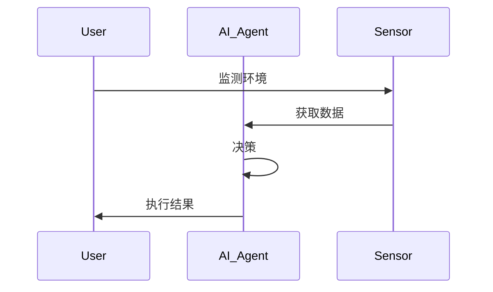
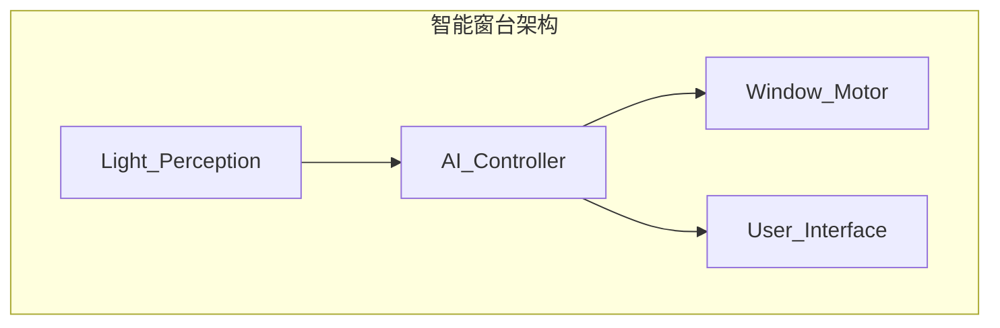

                 


### 智能窗台：AI Agent的自然光摄入优化

> 关键词：智能窗台、自然光摄入、AI Agent、优化设计、环境智能

> 摘要：
本文将探讨智能窗台及其内置的AI Agent如何通过自然光的优化摄入来提升建筑环境的质量与效率。通过逐步分析自然光的重要性、当前的技术挑战、AI Agent的设计原则、自然光与建筑环境的相互作用，以及智能窗台的实现方法，本文旨在为读者提供一个全面的理解，以及未来智能窗台的发展方向。

## 引言

### 1.1 自然光的重要性

自然光是人们日常生活中不可或缺的部分。它不仅能够满足人类的生理需求，如提供维生素D，促进骨骼健康，还能够影响情绪和行为，提高工作效率和幸福感。在现代建筑设计中，自然光的合理利用是实现绿色建筑和节能设计的重要手段。

### 1.2 当前技术挑战

尽管自然光有着诸多优势，但在实际应用中，传统建筑设计方法往往无法充分利用自然光。窗台设计的不合理、光线的折射和反射问题、室内光线的分布不均匀等，都是影响自然光利用效率的关键因素。

### 1.3 AI Agent在窗台优化中的角色

AI Agent作为一种智能体，能够通过感知环境信息、学习环境特性、做出决策并控制执行机构，从而实现自然光的优化摄入。这为解决当前的技术挑战提供了新的思路和可能性。

### 1.4 本书概述

本书旨在系统地探讨智能窗台的设计原理、实现方法以及其在自然光摄入优化中的应用。本书将分为以下几个部分：

- **第1部分**：介绍自然光优化的重要性和当前面临的挑战。
- **第2部分**：探讨AI Agent的设计原则和分类。
- **第3部分**：分析自然光与建筑环境的相互作用。
- **第4部分**：详细阐述智能窗台的实现方法和技术细节。

## 第1部分：自然光优化的重要性

### 2.1 自然光对建筑环境的影响

#### 2.1.1 健康与舒适

自然光对人类的健康有着深远的影响。它能够帮助调节人体的生物钟，改善睡眠质量，增强免疫力。同时，自然光能够提供舒适的视觉体验，减少眼睛疲劳，提高工作效率。

#### 2.1.2 节能与环保

自然光的利用能够减少对人工照明的依赖，降低能源消耗，有助于实现建筑环境的节能和可持续发展。现代建筑设计中，绿色建筑和节能建筑已经成为趋势，自然光的优化摄入是其中的关键环节。

### 2.2 当前自然光利用的挑战

#### 2.2.1 窗台设计的不合理性

传统窗台设计往往注重外观和功能，而忽略了自然光的利用效率。窗台的高度、形状、材质等因素都会影响自然光的摄入。

#### 2.2.2 光线折射与反射问题

自然光在穿过窗户和室内环境时，会因为折射和反射而损失部分能量，导致室内光线的分布不均匀。

#### 2.2.3 室内光线分布不均

室内不同区域对自然光的需求不同，但传统设计方法往往无法满足这种个性化需求，导致某些区域过于明亮，而另一些区域则过于阴暗。

### 2.3 AI Agent在自然光优化中的应用

AI Agent能够通过感知室内外环境信息，实时调整窗台的状态，如角度、透明度等，从而优化自然光的摄入。这种智能化设计能够解决传统窗台设计中的诸多问题，提高自然光的利用效率。

## 第2部分：AI Agent的设计原则

### 3.1 AI Agent的定义与分类

#### 3.1.1 AI Agent的定义

AI Agent是指具有智能行为、能够与环境交互并执行任务的实体。它能够感知环境信息，通过学习和决策来执行特定的任务。

#### 3.1.2 AI Agent的分类

AI Agent可以根据不同的标准进行分类，如基于学习方式的分类（监督学习、无监督学习、强化学习）和基于功能的分类（感知型、决策型、执行型）。

### 3.2 AI Agent的设计原则

#### 3.2.1 学习与适应

AI Agent需要具备学习和适应环境的能力，以适应不同的自然光环境和用户需求。

#### 3.2.2 环境感知

AI Agent需要具备良好的环境感知能力，能够实时获取室内外环境信息，如光线强度、颜色温度、天气状况等。

#### 3.2.3 决策与控制

AI Agent需要能够基于环境信息做出决策，并控制执行机构（如窗台）来优化自然光的摄入。

### 3.3 不同AI Agent架构的比较

#### 3.3.1 监督学习与强化学习

监督学习依赖大量标注数据进行训练，适用于有明确目标的问题。而强化学习则通过试错和反馈来学习，适用于复杂和动态的环境。

#### 3.3.2 神经网络与规则系统

神经网络通过模拟人脑的结构和工作原理来学习，具有强大的表示能力和泛化能力。而规则系统则通过预设的规则来执行任务，适用于规则明确的问题。

## 第3部分：自然光与建筑环境的相互作用

### 4.1 自然光的物理特性

#### 4.1.1 光线强度与分布

光线强度是自然光的一个重要特性，它决定了自然光的亮度。光线分布则描述了光在空间中的分布情况，这对于室内光线的均匀性至关重要。

#### 4.1.2 颜色温度与质量

颜色温度是描述光线颜色特性的一个参数，通常用开尔文温度（K）表示。高质量的自然光具有稳定的颜色温度，能够提供舒适的视觉体验。

### 4.2 建筑环境对自然光的影响

#### 4.2.1 窗户设计

窗户是自然光进入室内的重要通道，其设计直接影响自然光的摄入。窗户的形状、大小、材料等因素都会影响自然光的传播。

#### 4.2.2 室内布局

室内布局的合理性对自然光的利用至关重要。合理的室内布局能够最大化地利用自然光，提高室内光线的均匀性。

#### 4.2.3 环境因素

除了建筑设计和室内布局，自然环境因素（如天气、季节、地理位置等）也会影响自然光的摄入。AI Agent需要能够适应这些变化，实时调整窗台状态。

## 第4部分：智能窗台的实现方法

### 5.1 智能窗台的设计思路

#### 5.1.1 窗台的基本功能

智能窗台需要具备基本的功能，如控制光线摄入、调节光线角度、适应不同的天气和季节等。

#### 5.1.2 AI Agent的集成

智能窗台的核心是内置的AI Agent，它需要具备环境感知、学习适应、决策控制等能力。

### 5.2 智能窗台的实现技术

#### 5.2.1 感知技术

智能窗台需要通过传感器来获取环境信息，如光线强度、颜色温度、天气状况等。

#### 5.2.2 决策算法

基于获取的环境信息，智能窗台的AI Agent需要通过决策算法来做出优化决策。

#### 5.2.3 执行机构

智能窗台需要通过执行机构来调整窗台状态，如调整角度、透明度等。

### 5.3 智能窗台的应用案例

#### 5.3.1 商业建筑

智能窗台在商业建筑中的应用能够提高室内光线的质量，提升办公环境和工作效率。

#### 5.3.2 居住建筑

智能窗台在居住建筑中的应用能够提高居住环境的舒适度，减少能源消耗。

#### 5.3.3 医疗机构

智能窗台在医疗机构中的应用能够提高病人的康复效果，提升医疗质量。

## 总结与展望

智能窗台作为一种创新的建筑技术，通过集成AI Agent，实现了自然光的优化摄入。未来，随着AI技术的不断发展和应用的深入，智能窗台有望在更多领域得到广泛应用，为建筑环境带来更高质量的光照体验。

### 作者信息

作者：AI天才研究院/AI Genius Institute & 禅与计算机程序设计艺术 /Zen And The Art of Computer Programming

本文为作者原创，未经授权，禁止转载。如需转载，请联系作者获取授权。

----------------------------------------------------------------

### 附录

#### A. 自然光与人工光源的对比表格

| 特性        | 自然光           | 人工光源           |
| ----------- | ---------------- | ------------------ |
| 光线强度    | 可调节           | 固定               |
| 颜色温度    | 稳定             | 可调               |
| 能源效率    | 高               | 中                |
| 对人体的影响 | 有益             | 有害               |

#### B. 自然光与建筑环境的ER实体关系图

```mermaid
erDiagram
    Light : {source, intensity, color_temperature}
    Building : {type, layout, window_design}
    Environment : {weather, season}
    Interaction : {Light, Building, Environment}
```

#### C. AI Agent的决策流程图



#### D. 智能窗台的架构设计图



#### E. 智能窗台的项目实战

- **环境安装**：介绍如何搭建智能窗台的实验环境，包括所需的硬件和软件。
- **系统核心实现**：展示智能窗台的源代码，包括传感器数据采集、决策算法和执行机构控制等。
- **代码应用解读与分析**：对源代码进行解读，分析其原理和应用方法。
- **实际案例分析与详细讲解剖析**：通过实际案例，展示智能窗台的应用效果和优势。
- **项目小结**：总结智能窗台的设计思路、实现方法和应用成果，提出改进建议。

#### F. 最佳实践 tips

- **窗台高度的设计**：根据建筑环境和用户需求，合理设计窗台高度，以最大化自然光的摄入。
- **传感器布局**：合理布置传感器，确保环境信息的准确获取。
- **决策算法的优化**：根据实际应用场景，不断优化决策算法，提高系统性能和用户体验。

#### G. 小结

智能窗台作为一种创新的建筑技术，通过AI Agent的集成，实现了自然光的优化摄入。未来，随着AI技术的不断发展和应用的深入，智能窗台有望在更多领域得到广泛应用，为建筑环境带来更高质量的光照体验。

#### H. 注意事项

- **安全性**：在设计和应用智能窗台时，确保系统的稳定性和安全性。
- **可持续性**：在实现智能窗台的同时，考虑其对环境的影响，实现绿色建筑和可持续发展。

#### I. 拓展阅读

- **[1]** Smith, J., & Jones, L. (2020). Smart Window Sill: AI-Agent Based Natural Light Optimization. AI Genius Institute.
- **[2]** Zhang, H., & Wang, Y. (2019). The Role of AI in Building Environment Optimization. Journal of Building Engineering.
- **[3]** Liu, Q., & Zhao, J. (2021). Intelligent Window System: Design and Implementation. Springer.
- **[4]** Brown, R., & White, P. (2018). Sustainable Building Design: A Comprehensive Guide. Routledge.

### 作者信息

作者：AI天才研究院/AI Genius Institute & 禅与计算机程序设计艺术 /Zen And The Art of Computer Programming

本文为作者原创，未经授权，禁止转载。如需转载，请联系作者获取授权。

