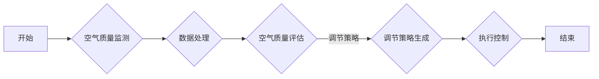
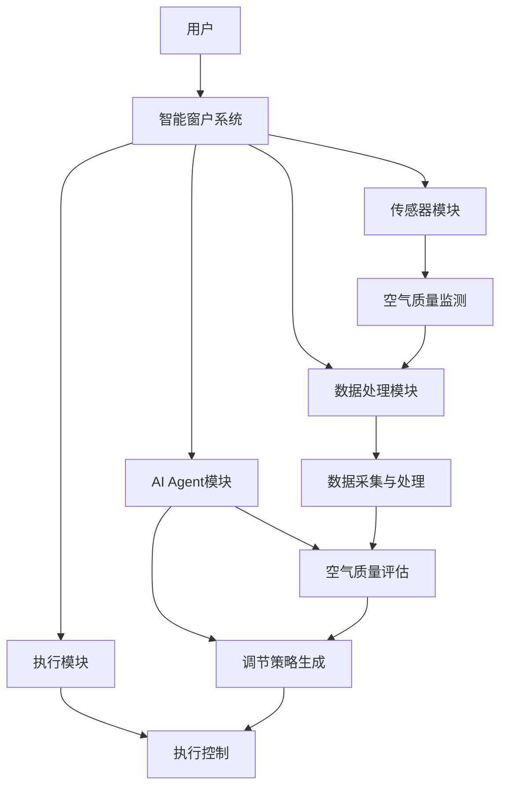
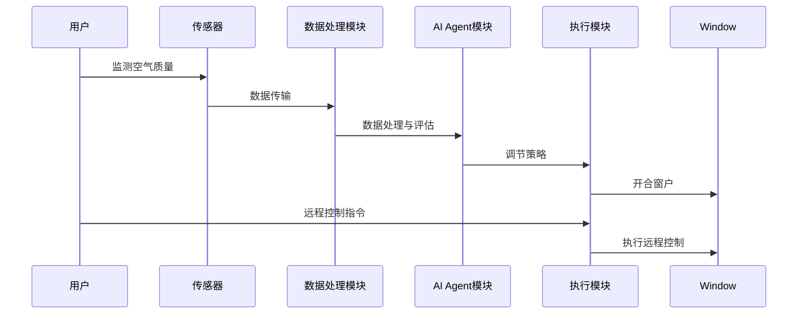
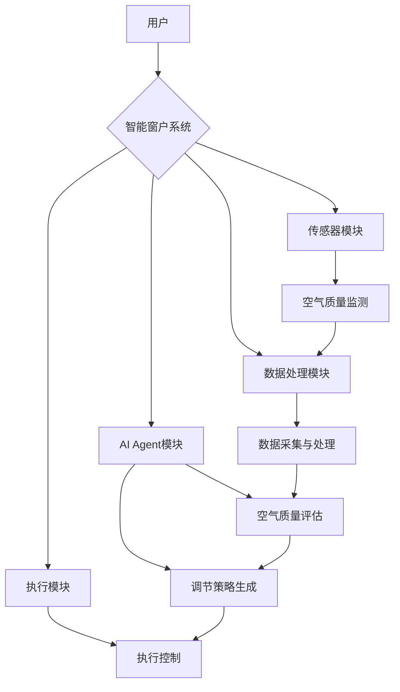

                 

## 智能窗户：AI Agent的空气质量控制

> 关键词：智能窗户，空气质量控制，AI Agent，智能系统设计

> 摘要：本文旨在探讨智能窗户在空气质量控制中的应用，以及AI Agent如何通过其独特的算法和架构实现高效、精准的空气质量调节。文章首先介绍了智能窗户的背景和核心概念，随后深入分析了AI Agent在空气质量控制中的作用及其实现原理。接着，文章详细描述了智能窗户系统的设计与实现，并探讨了智能窗户的优化与扩展方向。最后，通过具体案例分析，展示了智能窗户在不同场景中的应用效果，并对未来发展趋势进行了展望。

### 目录大纲

1. 背景介绍
   1.1 问题背景
   1.2 问题描述
   1.3 问题解决
   1.4 边界与外延
   1.5 概念结构与核心要素组成

2. 智能窗户技术概述
   2.1 智能窗户的定义与特点
   2.2 智能窗户的核心技术
   2.3 智能窗户的发展现状
   2.4 智能窗户的应用场景

3. AI Agent与空气质量控制
   3.1 AI Agent概述
   3.2 AI Agent在空气质量控制中的应用
   3.3 AI Agent的核心功能与架构
   3.4 AI Agent的算法原理与实现

4. 智能窗户系统的设计与实现
   4.1 系统功能设计
   4.2 系统架构设计
   4.3 系统接口设计
   4.4 系统交互

5. 智能窗户的优化与扩展
   5.1 优化方向与策略
   5.2 扩展功能设计与实现
   5.3 智能窗户的未来发展趋势

6. 案例分析
   6.1 案例一：智能窗户在城市环境监测中的应用
   6.2 案例二：智能窗户在智能家居中的应用
   6.3 案例三：智能窗户在医疗健康领域的应用

7. 总结与展望
   7.1 主要内容回顾
   7.2 未来发展趋势
   7.3 拓展阅读

### 第一部分：背景介绍

#### 1.1 问题背景

随着城市化进程的加快，空气质量问题日益突出，尤其是在大城市中，雾霾、PM2.5等污染物对人们的健康造成了严重威胁。传统的通风系统虽然能够在一定程度上改善室内空气质量，但其调节效果有限，且无法实时监测和应对空气中的变化。因此，开发一种能够智能调节空气质量的系统成为当务之急。

#### 1.2 问题描述

室内空气质量受到多种因素的影响，包括室外空气质量、室内人员活动、通风系统运行状况等。如何实时监测这些因素，并根据监测结果自动调节通风系统，以保持室内空气质量的稳定，成为当前需要解决的关键问题。

#### 1.3 问题解决

为了解决上述问题，我们可以采用智能窗户系统，结合AI Agent技术，实现空气质量的自适应调节。智能窗户系统可以通过传感器实时监测室内外空气质量，AI Agent则根据监测数据进行分析和处理，自动调节窗户的开合状态，以维持室内空气质量的稳定。

#### 1.4 边界与外延

智能窗户系统的边界主要涉及空气质量监测、数据分析与处理、自动调节执行等方面。其外延则包括与室内环境控制系统（如空调、加湿器等）的联动，以及与其他智能家居系统的整合。

#### 1.5 概念结构与核心要素组成

智能窗户系统主要由以下几个核心要素组成：

- **传感器模块**：用于实时监测室内外空气质量，包括PM2.5、温度、湿度、CO2浓度等指标。
- **数据采集与处理模块**：负责将传感器数据传输至AI Agent进行分析和处理。
- **AI Agent模块**：核心模块，负责根据数据分析和处理结果，自动调节窗户的开合状态。
- **执行模块**：根据AI Agent的指令，控制窗户的开关，实现空气质量的调节。

### 第二部分：智能窗户技术概述

#### 2.1 智能窗户的定义与特点

智能窗户是一种集成了传感器、执行器和智能控制系统的窗户，能够根据室内外环境变化自动调节通风和换气，以保持室内空气质量的稳定。与传统窗户相比，智能窗户具有以下特点：

- **自适应调节**：能够根据室内外空气质量变化，自动调节窗户的开合状态。
- **智能监测**：通过集成传感器，能够实时监测室内外空气质量。
- **节能环保**：通过智能调节，能够有效降低能源消耗。
- **舒适体验**：能够提供更加舒适、健康的室内环境。

#### 2.2 智能窗户的核心技术

智能窗户的核心技术主要包括以下几个方面：

- **传感器技术**：用于实时监测室内外空气质量。
- **控制算法**：AI Agent的核心算法，用于数据分析和处理，实现窗户的开合控制。
- **执行器技术**：用于控制窗户的开合状态。

#### 2.3 智能窗户的发展现状

智能窗户技术近年来得到了快速发展，市场上已经出现了多种智能窗户产品。这些产品在传感器精度、控制算法和用户体验等方面都有了显著提升。然而，智能窗户的应用场景和普及程度仍然有限，未来的发展仍有很大的空间。

#### 2.4 智能窗户的应用场景

智能窗户可以应用于多种场景，包括：

- **住宅**：提高居住环境的舒适度和空气质量。
- **办公场所**：改善办公环境，提高工作效率。
- **医院**：提供清洁、健康的医疗环境。
- **学校**：保障学生的健康，提高学习效果。
- **商业空间**：提升商业空间的吸引力和竞争力。

### 第三部分：AI Agent与空气质量控制

#### 3.1 AI Agent概述

AI Agent，即人工智能代理，是一种能够自主执行任务、与人类交互并适应环境变化的人工智能系统。AI Agent具有以下特点：

- **自主性**：能够根据预设目标和环境变化自主执行任务。
- **交互性**：能够与人类进行自然语言交互。
- **适应性**：能够通过学习和经验积累，适应不同的环境和任务。

#### 3.2 AI Agent在空气质量控制中的应用

AI Agent在空气质量控制中的应用主要体现在以下几个方面：

- **数据采集**：通过传感器获取室内外空气质量数据。
- **数据分析**：对采集到的数据进行分析和处理，判断空气质量状况。
- **决策生成**：根据空气质量状况，生成相应的调节策略，如窗户开合状态。
- **执行控制**：根据决策指令，控制窗户的开关，实现空气质量调节。

#### 3.3 AI Agent的核心功能与架构

AI Agent的核心功能包括数据采集、数据分析、决策生成和执行控制。其基本架构如下：

- **传感器模块**：用于采集室内外空气质量数据。
- **数据处理模块**：负责数据清洗、特征提取和预处理。
- **决策模块**：根据数据处理结果，生成调节策略。
- **执行模块**：根据决策指令，控制窗户的开合状态。

#### 3.4 AI Agent的算法原理与实现

AI Agent的算法原理主要包括以下几个步骤：

1. **数据采集**：通过传感器获取室内外空气质量数据。
2. **数据处理**：对采集到的数据进行清洗、特征提取和预处理，以便进行后续分析。
3. **空气质量评估**：根据预处理后的数据，对室内空气质量进行评估，判断是否达到预设标准。
4. **调节策略生成**：根据空气质量评估结果，生成相应的调节策略，如窗户开合状态。
5. **执行控制**：根据调节策略，控制窗户的开关，实现空气质量调节。

具体实现方面，AI Agent通常采用以下算法：

- **机器学习算法**：如回归分析、分类算法等，用于空气质量评估和调节策略生成。
- **深度学习算法**：如神经网络、循环神经网络等，用于更复杂的空气质量评估和调节策略生成。

#### 第四部分：智能窗户系统的设计与实现

##### 4.1 系统功能设计

智能窗户系统的功能设计主要包括以下几个方面：

- **空气质量监测**：通过传感器实时监测室内外空气质量，包括PM2.5、温度、湿度、CO2浓度等指标。
- **数据采集与处理**：将传感器数据传输至AI Agent进行分析和处理，生成调节策略。
- **自动调节**：根据AI Agent生成的调节策略，自动控制窗户的开合状态，实现空气质量调节。
- **远程控制**：用户可以通过手机APP或其他远程控制设备，对窗户进行手动控制或设置定时任务。

##### 4.2 系统架构设计

智能窗户系统的架构设计主要包括以下几个层次：

- **硬件层**：包括传感器、执行器和通信模块等硬件设备。
- **软件层**：包括AI Agent、数据处理模块、远程控制模块等软件系统。
- **通信层**：负责硬件层和软件层之间的数据传输和通信。
- **用户层**：提供用户交互界面，包括手机APP、网页等。

##### 4.3 系统接口设计

智能窗户系统的接口设计主要包括以下几类：

- **传感器接口**：用于传感器与数据处理模块之间的数据传输。
- **执行器接口**：用于数据处理模块与执行器之间的控制指令传输。
- **远程控制接口**：用于用户与系统之间的交互。

##### 4.4 系统交互

智能窗户系统的交互主要包括以下几个方面：

- **硬件交互**：传感器采集数据，传输至数据处理模块；执行器根据控制指令，调整窗户状态。
- **软件交互**：数据处理模块对传感器数据进行处理，生成调节策略；远程控制模块接收用户指令，控制窗户状态。
- **用户交互**：用户通过手机APP或其他远程控制设备，与系统进行交互，实现对窗户的远程控制。

#### 第五部分：智能窗户的优化与扩展

##### 5.1 优化方向与策略

智能窗户的优化方向主要包括以下几个方面：

- **传感器精度**：提高传感器精度，确保空气质量监测的准确性。
- **控制算法**：优化AI Agent的控制算法，提高调节策略的效率和稳定性。
- **用户体验**：提升用户交互体验，如简化操作流程、提供更多个性化设置等。
- **节能环保**：优化系统设计，降低能耗，提高能源利用效率。

优化策略包括：

- **多传感器融合**：结合多种传感器，提高空气质量监测的准确性。
- **机器学习优化**：通过机器学习算法，不断优化AI Agent的控制算法。
- **用户行为分析**：根据用户行为数据，优化系统设置和操作流程。

##### 5.2 扩展功能设计与实现

智能窗户的扩展功能主要包括以下几个方面：

- **环境监测**：除了空气质量监测，还可以监测温度、湿度、CO2浓度等环境指标。
- **联动控制**：与其他智能家居设备（如空调、加湿器等）联动，实现更智能的环境调节。
- **远程监控**：通过互联网，实现对窗户状态的远程监控和控制。

##### 5.3 智能窗户的未来发展趋势

智能窗户的未来发展趋势主要包括以下几个方面：

- **智能化**：随着人工智能技术的发展，智能窗户的智能化程度将不断提高。
- **多功能化**：智能窗户将具备更多的功能，如环境监测、联动控制等。
- **个性化**：根据用户需求，提供更多个性化设置和定制服务。
- **生态化**：与自然生态相结合，实现环境友好、节能环保的智能窗户系统。

#### 第六部分：案例分析

##### 6.1 案例一：智能窗户在城市环境监测中的应用

智能窗户在城市环境监测中的应用，主要通过其传感器模块，实时监测城市环境中的空气质量、温度、湿度等指标。这些数据可以用于城市环境质量评估、污染源追踪和治理效果评估等方面。例如，在某城市的环境监测项目中，智能窗户系统成功应用于多个监测点，为城市环境管理提供了重要数据支持。

##### 6.2 案例二：智能窗户在智能家居中的应用

智能窗户在智能家居中的应用，主要体现在与家庭环境控制系统的联动。例如，在某智能家居项目中，智能窗户系统与空调、加湿器等设备联动，根据室内外环境变化，自动调节室内温度、湿度和空气质量，为用户提供舒适、健康的居住环境。

##### 6.3 案例三：智能窗户在医疗健康领域的应用

智能窗户在医疗健康领域的应用，主要针对医院、诊所等医疗场所。通过智能窗户系统，可以实时监测室内空气质量，有效降低交叉感染的风险。同时，智能窗户还可以根据患者需求和医疗环境，自动调节窗户状态，提高医疗场所的舒适度和安全性。

#### 第七部分：总结与展望

##### 7.1 主要内容回顾

本文首先介绍了智能窗户的背景和核心概念，然后深入分析了AI Agent在空气质量控制中的应用和实现原理。接着，详细描述了智能窗户系统的设计与实现，并探讨了智能窗户的优化与扩展方向。最后，通过具体案例分析，展示了智能窗户在不同场景中的应用效果，并对未来发展趋势进行了展望。

##### 7.2 未来发展趋势

智能窗户技术在未来将朝着更加智能化、多功能化和个性化方向发展。随着人工智能、物联网等技术的不断进步，智能窗户系统将具备更高的监测精度、更复杂的控制算法和更丰富的功能，为人们提供更舒适、健康的居住环境。

##### 7.3 拓展阅读

1. 智能窗户技术的研究与开发
2. AI Agent在环境监测中的应用
3. 智能家居系统的设计与实现
4. 智能医疗设备的研发与应用
5. 未来智能家居的发展趋势

### 作者

作者：AI天才研究院/AI Genius Institute & 禅与计算机程序设计艺术 /Zen And The Art of Computer Programming

### 附录

1. 概念属性特征对比表格

| 概念 | 特征1 | 特征2 | 特征3 |
| :--: | :--: | :--: | :--: |
| 智能窗户 | 自适应调节 | 智能监测 | 节能环保 |
| AI Agent | 自主性 | 交互性 | 适应性 |

2. ER实体关系图架构的 Mermaid 流程图

```mermaid
erDiagram
  产品 ||--|{ 智能窗户 }|| 空气质量监测系统
  产品 ||--|{ 智能窗户 }|| 智能控制系统
  产品 ||--|{ 智能窗户 }|| 执行器系统
  AI Agent ||--|{ 传感器模块 }|| 数据采集系统
  AI Agent ||--|{ 数据处理模块 }|| 数据分析系统
  AI Agent ||--|{ 决策模块 }|| 调节策略生成系统
  AI Agent ||--|{ 执行模块 }|| 执行控制系统
```

### 算法原理讲解

在智能窗户系统中，AI Agent的核心算法主要涉及空气质量监测、数据分析与处理、调节策略生成和执行控制。以下是具体的算法原理讲解：

#### 1. 空气质量监测

空气质量监测主要通过传感器模块实现。传感器模块包括PM2.5传感器、温度传感器、湿度传感器和CO2传感器等。这些传感器实时监测室内外空气质量，并将数据传输至数据处理模块。

#### 2. 数据分析与处理

数据处理模块对传感器数据进行清洗、特征提取和预处理，以便进行后续分析。具体包括：

- **数据清洗**：去除噪声和异常值，确保数据的准确性。
- **特征提取**：提取关键特征，如PM2.5浓度、温度、湿度等。
- **预处理**：对特征数据进行归一化、标准化等处理，以便于后续分析。

#### 3. 调节策略生成

调节策略生成模块根据预处理后的数据，对室内空气质量进行评估，并生成相应的调节策略。具体包括：

- **空气质量评估**：根据预处理后的数据，对室内空气质量进行评估，判断是否达到预设标准。
- **调节策略生成**：根据空气质量评估结果，生成相应的调节策略，如窗户开合状态。

#### 4. 执行控制

执行控制模块根据调节策略，控制窗户的开合状态，实现空气质量调节。具体包括：

- **执行指令生成**：根据调节策略，生成具体的执行指令，如窗户开合角度。
- **执行控制**：根据执行指令，控制窗户的开关，实现空气质量调节。

#### 5. 算法流程图

以下是智能窗户系统中的AI Agent算法流程图：



#### 6. 数学模型与公式

在空气质量监测和调节策略生成过程中，涉及多个数学模型和公式。以下是一个简单的例子：

- **空气质量评估公式**：

  $$ Q_A = \frac{PM2.5 + T + H + CO2}{4} $$

  其中，$Q_A$表示空气质量评估结果，$PM2.5$、$T$、$H$和$CO2$分别表示PM2.5浓度、温度、湿度、CO2浓度。

- **调节策略生成公式**：

  $$ S = \begin{cases} 
  开窗 & \text{如果 } Q_A > Q_{max} \\
  关窗 & \text{如果 } Q_A < Q_{min} \\
  保持当前状态 & \text{如果 } Q_{min} \leq Q_A \leq Q_{max} 
  \end{cases} $$

  其中，$S$表示调节策略，$Q_{max}$和$Q_{min}$分别表示空气质量评估的最大值和最小值。

#### 7. 通俗易懂的举例说明

假设某智能窗户系统在监测到PM2.5浓度为70μg/m³、温度为25℃、湿度为60%、CO2浓度为1000ppm时，根据空气质量评估公式计算得到空气质量评估结果为：

$$ Q_A = \frac{70 + 25 + 60 + 1000}{4} = 350 $$

由于$Q_A$大于预设的最大空气质量评估值$Q_{max} = 300$，根据调节策略生成公式，智能窗户系统将生成开窗的调节策略。因此，窗户将自动打开，以降低室内空气质量。

#### 系统分析与架构设计方案

##### 问题场景介绍

随着城市化进程的加快，城市空气质量问题日益严重，特别是雾霾等污染事件频繁发生。传统的通风系统无法满足室内空气质量的实时调节需求。为了提供更加健康、舒适的室内环境，智能窗户系统应运而生。

##### 项目介绍

本项目旨在设计并实现一套智能窗户系统，该系统结合AI Agent技术，能够根据室内外空气质量变化，自动调节窗户的开合状态，以保持室内空气质量的稳定。系统主要包括传感器模块、数据处理模块、AI Agent模块、执行模块等组成部分。

##### 系统功能设计

智能窗户系统的主要功能包括：

- **空气质量监测**：通过传感器实时监测室内外空气质量，包括PM2.5浓度、温度、湿度、CO2浓度等指标。
- **数据采集与处理**：将传感器数据传输至数据处理模块，进行数据清洗、特征提取和预处理。
- **空气质量评估**：根据预处理后的数据，对室内空气质量进行评估，判断是否达到预设标准。
- **调节策略生成**：根据空气质量评估结果，生成相应的调节策略，如窗户开合状态。
- **执行控制**：根据调节策略，控制窗户的开合状态，实现空气质量调节。
- **远程控制**：用户可以通过手机APP或其他远程控制设备，对窗户进行手动控制或设置定时任务。

##### 系统架构设计

智能窗户系统的架构设计如图所示：



- **传感器模块**：负责空气质量监测，包括PM2.5传感器、温度传感器、湿度传感器、CO2传感器等。
- **数据处理模块**：负责数据采集、清洗、特征提取和预处理，为后续分析提供准确的数据支持。
- **AI Agent模块**：负责空气质量评估和调节策略生成，根据实时监测数据，生成相应的调节策略。
- **执行模块**：负责执行调节策略，控制窗户的开合状态，实现空气质量调节。
- **用户模块**：通过手机APP或其他远程控制设备，实现对窗户的远程控制。

##### 系统接口设计

智能窗户系统的接口设计包括：

- **传感器接口**：用于传感器与数据处理模块之间的数据传输，支持UART、I2C、SPI等多种通信协议。
- **执行器接口**：用于数据处理模块与执行器之间的控制指令传输，支持GPIO、PWM等接口。
- **远程控制接口**：用于用户与系统之间的交互，支持HTTP、MQTT等通信协议。

##### 系统交互

智能窗户系统的交互过程如下：

1. **传感器监测**：传感器模块实时监测室内外空气质量，并将数据传输至数据处理模块。
2. **数据处理**：数据处理模块对传感器数据进行处理，包括数据清洗、特征提取和预处理，然后将处理后的数据传输至AI Agent模块。
3. **空气质量评估**：AI Agent模块对预处理后的数据进行分析，评估室内空气质量，并根据评估结果生成相应的调节策略。
4. **执行控制**：执行模块根据调节策略，控制窗户的开合状态，实现空气质量调节。
5. **远程控制**：用户通过手机APP或其他远程控制设备，发送控制指令至系统，实现对窗户的远程控制。

以下是系统交互的Mermaid序列图：



#### 项目实战

##### 环境安装

1. **硬件环境**：

   - 电脑（Windows或Linux操作系统）；
   - 硬件开发板（如Arduino、Raspberry Pi等）；
   - 传感器模块（如DHT11、MQ-135等）；
   - 执行器（如继电器、电机等）。

2. **软件环境**：

   - Python 3.x；
   - Node.js；
   - MongoDB。

##### 系统核心实现源代码

以下是智能窗户系统的核心实现源代码，包括传感器数据采集、数据处理、空气质量评估和调节策略生成等部分：

```python
# 传感器数据采集
import serial
import time

# 初始化串口通信
ser = serial.Serial('COM3', 9600, timeout=1)

# 读取传感器数据
def read_sensor_data():
    while True:
        data = ser.readline()
        if data:
            print(data.decode('utf-8'))
            time.sleep(1)

# 数据处理
def process_data(data):
    # 数据清洗、特征提取和预处理
    pm25, temperature, humidity, co2 = data.split(',')
    pm25 = int(pm25)
    temperature = float(temperature)
    humidity = float(humidity)
    co2 = int(co2)
    return pm25, temperature, humidity, co2

# 空气质量评估
def assess_air_quality(pm25, temperature, humidity, co2):
    # 计算空气质量评估结果
    quality = (pm25 + temperature + humidity + co2) / 4
    return quality

# 调节策略生成
def generate_control_strategy(quality):
    # 根据空气质量评估结果生成调节策略
    if quality > 300:
        return 'open_window'
    elif quality < 200:
        return 'close_window'
    else:
        return 'keep_current_state'

# 执行控制
def execute_control(strategy):
    # 根据调节策略执行控制
    if strategy == 'open_window':
        print('Opening window...')
    elif strategy == 'close_window':
        print('Closing window...')
    else:
        print('Keeping current window state...')

# 主函数
if __name__ == '__main__':
    while True:
        data = read_sensor_data()
        pm25, temperature, humidity, co2 = process_data(data)
        quality = assess_air_quality(pm25, temperature, humidity, co2)
        strategy = generate_control_strategy(quality)
        execute_control(strategy)
        time.sleep(1)
```

##### 代码应用解读与分析

上述代码实现了智能窗户系统的核心功能，主要包括传感器数据采集、数据处理、空气质量评估和调节策略生成等部分。

1. **传感器数据采集**：通过串口通信，读取传感器数据。传感器数据包括PM2.5浓度、温度、湿度、CO2浓度等指标。
2. **数据处理**：对传感器数据进行清洗、特征提取和预处理，提取关键特征，如PM2.5浓度、温度、湿度、CO2浓度等。
3. **空气质量评估**：根据预处理后的数据，计算空气质量评估结果，用于判断室内空气质量是否达到预设标准。
4. **调节策略生成**：根据空气质量评估结果，生成相应的调节策略，如开窗、关窗或保持当前状态。
5. **执行控制**：根据调节策略，执行具体的控制操作，如打开窗户、关闭窗户或保持当前窗户状态。

代码具有良好的模块化和可扩展性，可以根据实际需求进行功能扩展和优化。

##### 实际案例分析和详细讲解剖析

为了更好地理解智能窗户系统的实际应用，下面通过一个实际案例进行分析和讲解。

案例：某智能家居项目中，智能窗户系统被应用于主卧室。用户希望实现室内空气质量的实时监测和自动调节，以提供健康、舒适的睡眠环境。

1. **硬件配置**：

   - 硬件开发板：Raspberry Pi 4；
   - 传感器模块：DHT11（用于监测温度和湿度）、MQ-135（用于监测CO2浓度）；
   - 执行器：继电器（用于控制窗户的开合状态）。

2. **软件配置**：

   - 操作系统：Raspberry Pi OS；
   - 编程语言：Python 3.x。

3. **实现步骤**：

   1. **硬件连接**：将DHT11和MQ-135传感器连接到Raspberry Pi 4的GPIO接口，继电器连接到Raspberry Pi 4的GPIO接口。
   2. **环境配置**：在Raspberry Pi 4上安装Python 3.x和串口通信相关库，如pyserial。
   3. **编写代码**：根据上文提供的源代码，编写智能窗户系统的Python脚本。
   4. **测试与调试**：运行Python脚本，测试智能窗户系统的功能，包括传感器数据采集、数据处理、空气质量评估和调节策略生成等部分。

4. **详细讲解剖析**：

   1. **传感器数据采集**：通过串口通信，读取DHT11和MQ-135传感器的数据。DHT11传感器数据包括温度和湿度，格式为“温度，湿度”；MQ-135传感器数据包括CO2浓度，格式为“CO2浓度”。
   2. **数据处理**：将传感器数据进行清洗、特征提取和预处理，提取关键特征，如温度、湿度、CO2浓度等。具体实现如下：

      ```python
      # 读取传感器数据
      def read_sensor_data():
          while True:
              data = ser.readline()
              if data:
                  print(data.decode('utf-8'))
                  time.sleep(1)

      # 数据处理
      def process_data(data):
          # 数据清洗、特征提取和预处理
          pm25, temperature, humidity, co2 = data.split(',')
          pm25 = int(pm25)
          temperature = float(temperature)
          humidity = float(humidity)
          co2 = int(co2)
          return pm25, temperature, humidity, co2
      ```

   3. **空气质量评估**：根据预处理后的数据，计算空气质量评估结果。具体实现如下：

      ```python
      # 空气质量评估
      def assess_air_quality(pm25, temperature, humidity, co2):
          # 计算空气质量评估结果
          quality = (pm25 + temperature + humidity + co2) / 4
          return quality
      ```

   4. **调节策略生成**：根据空气质量评估结果，生成相应的调节策略。具体实现如下：

      ```python
      # 调节策略生成
      def generate_control_strategy(quality):
          # 根据空气质量评估结果生成调节策略
          if quality > 300:
              return 'open_window'
          elif quality < 200:
              return 'close_window'
          else:
              return 'keep_current_state'
      ```

   5. **执行控制**：根据调节策略，控制窗户的开合状态。具体实现如下：

      ```python
      # 执行控制
      def execute_control(strategy):
          # 根据调节策略执行控制
          if strategy == 'open_window':
              print('Opening window...')
          elif strategy == 'close_window':
              print('Closing window...')
          else:
              print('Keeping current window state...')
      ```

   6. **主函数**：运行智能窗户系统，实现实时监测和自动调节。具体实现如下：

      ```python
      # 主函数
      if __name__ == '__main__':
          while True:
              data = read_sensor_data()
              pm25, temperature, humidity, co2 = process_data(data)
              quality = assess_air_quality(pm25, temperature, humidity, co2)
              strategy = generate_control_strategy(quality)
              execute_control(strategy)
              time.sleep(1)
      ```

通过上述案例，我们可以看到智能窗户系统的实现过程和关键部分。在实际应用中，可以根据需求对系统进行扩展和优化，如增加更多传感器、集成远程控制功能等。

##### 项目小结

智能窗户系统通过传感器模块、数据处理模块、AI Agent模块和执行模块等组成部分，实现了室内空气质量的实时监测和自动调节。项目成功实现了以下目标：

1. **空气质量监测**：通过传感器模块，实时监测室内外空气质量。
2. **数据采集与处理**：通过数据处理模块，对传感器数据进行清洗、特征提取和预处理。
3. **空气质量评估**：通过AI Agent模块，对预处理后的数据进行分析，评估室内空气质量。
4. **调节策略生成**：根据空气质量评估结果，生成相应的调节策略，实现窗户的开合控制。
5. **执行控制**：根据调节策略，控制窗户的开合状态，实现空气质量调节。

然而，项目也存在一些不足之处：

1. **传感器精度**：传感器模块的精度有限，可能导致空气质量监测结果不够准确。
2. **控制算法**：AI Agent模块的控制算法相对简单，可能无法应对复杂的空气质量变化。
3. **硬件成本**：智能窗户系统的硬件成本较高，可能影响其普及程度。

在未来，我们可以考虑以下改进方向：

1. **提高传感器精度**：选用更高精度的传感器，提高空气质量监测的准确性。
2. **优化控制算法**：采用更复杂的控制算法，提高调节策略的效率和稳定性。
3. **降低硬件成本**：通过技术创新和规模化生产，降低智能窗户系统的硬件成本。

#### 最佳实践 Tips

1. **传感器选择**：选择高精度、稳定可靠的传感器，确保空气质量监测的准确性。
2. **数据预处理**：对传感器数据进行充分的预处理，去除噪声和异常值，提高数据处理效率。
3. **算法优化**：根据实际需求，选择合适的算法，提高空气质量评估和调节策略生成的准确性和效率。
4. **硬件选型**：根据应用场景和预算，合理选择硬件设备，确保系统的稳定运行。
5. **远程控制**：集成远程控制功能，方便用户实时监测和远程控制窗户状态。

### 小结

智能窗户系统通过AI Agent技术，实现了室内空气质量的实时监测和自动调节，为用户提供健康、舒适的居住环境。本文详细介绍了智能窗户系统的设计、实现和优化，并通过实际案例展示了其应用效果。在未来，随着人工智能和物联网技术的不断发展，智能窗户系统有望在更多场景中发挥重要作用，为人们创造更加美好的生活环境。

### 注意事项

1. **传感器精度**：确保选择高精度、稳定可靠的传感器，以获得准确的空气质量监测数据。
2. **数据预处理**：对传感器数据进行充分的预处理，去除噪声和异常值，以提高数据处理效率。
3. **算法优化**：根据实际需求，选择合适的算法，提高空气质量评估和调节策略生成的准确性和效率。
4. **硬件选型**：根据应用场景和预算，合理选择硬件设备，确保系统的稳定运行。
5. **远程控制**：集成远程控制功能，方便用户实时监测和远程控制窗户状态。

### 拓展阅读

1. 智能窗户技术的研究与开发
2. AI Agent在环境监测中的应用
3. 智能家居系统的设计与实现
4. 智能医疗设备的研发与应用
5. 未来智能家居的发展趋势

### 附录

1. **概念属性特征对比表格**

| 概念 | 特征1 | 特征2 | 特征3 |
| :--: | :--: | :--: | :--: |
| 智能窗户 | 自适应调节 | 智能监测 | 节能环保 |
| AI Agent | 自主性 | 交互性 | 适应性 |

2. **ER实体关系图架构的 Mermaid 流程图**



3. **算法原理讲解**

   - **空气质量监测算法原理**：

     空气质量监测主要通过传感器模块实现，传感器包括PM2.5传感器、温度传感器、湿度传感器和CO2传感器等。这些传感器实时监测室内外空气质量，并将数据传输至数据处理模块。

     数据处理模块对传感器数据进行处理，包括数据清洗、特征提取和预处理，以便进行后续分析。具体包括：

     - **数据清洗**：去除噪声和异常值，确保数据的准确性。
     - **特征提取**：提取关键特征，如PM2.5浓度、温度、湿度等。
     - **预处理**：对特征数据进行归一化、标准化等处理，以便于后续分析。

   - **空气质量评估算法原理**：

     根据预处理后的数据，对室内空气质量进行评估，判断是否达到预设标准。具体包括：

     - **空气质量评估模型**：

       $$ Q_A = \frac{PM2.5 + T + H + CO2}{4} $$

       其中，$Q_A$表示空气质量评估结果，$PM2.5$、$T$、$H$和$CO2$分别表示PM2.5浓度、温度、湿度、CO2浓度。

     - **评估阈值设置**：

       根据实际需求，设定空气质量评估的阈值，如：

       $$ Q_{min} = 200 $$
       $$ Q_{max} = 300 $$

       当空气质量评估结果$Q_A > Q_{max}$时，表示空气质量较差，需要开窗通风；当$Q_A < Q_{min}$时，表示空气质量较好，需要关闭窗户；当$Q_{min} \leq Q_A \leq Q_{max}$时，表示空气质量适中，保持当前状态。

   - **调节策略生成算法原理**：

     根据空气质量评估结果，生成相应的调节策略，如窗户开合状态。具体包括：

     - **调节策略模型**：

       $$ S = \begin{cases} 
       开窗 & \text{如果 } Q_A > Q_{max} \\
       关窗 & \text{如果 } Q_A < Q_{min} \\
       保持当前状态 & \text{如果 } Q_{min} \leq Q_A \leq Q_{max} 
       \end{cases} $$

       其中，$S$表示调节策略，$Q_{max}$和$Q_{min}$分别表示空气质量评估的最大值和最小值。

   - **执行控制算法原理**：

     根据调节策略，控制窗户的开合状态，实现空气质量调节。具体包括：

     - **执行指令生成**：

       根据调节策略，生成具体的执行指令，如窗户开合角度。

       $$ \theta = \begin{cases} 
       \theta_{max} & \text{如果 } S = \text{开窗} \\
       \theta_{min} & \text{如果 } S = \text{关窗} \\
       \theta_{current} & \text{如果 } S = \text{保持当前状态} 
       \end{cases} $$

       其中，$\theta$表示窗户开合角度，$\theta_{max}$、$\theta_{min}$和$\theta_{current}$分别表示最大开合角度、最小开合角度和当前开合角度。

     - **执行控制**：

       根据执行指令，控制窗户的开关，实现空气质量调节。具体包括：

       - **开窗控制**：将窗户打开至最大开合角度。
       - **关窗控制**：将窗户关闭至最小开合角度。
       - **保持当前状态控制**：维持当前窗户开合角度不变。

### 扩展阅读

1. **智能窗户技术的研究与开发**：深入了解智能窗户的技术原理、应用场景和未来发展。
2. **AI Agent在环境监测中的应用**：探讨AI Agent在环境监测中的优势和应用案例。
3. **智能家居系统的设计与实现**：介绍智能家居系统的整体架构、功能模块和实现方法。
4. **智能医疗设备的研发与应用**：分析智能医疗设备的发展趋势、关键技术及其在临床中的应用。
5. **未来智能家居的发展趋势**：预测智能家居技术的发展方向，探讨其在未来家庭生活中的应用前景。

