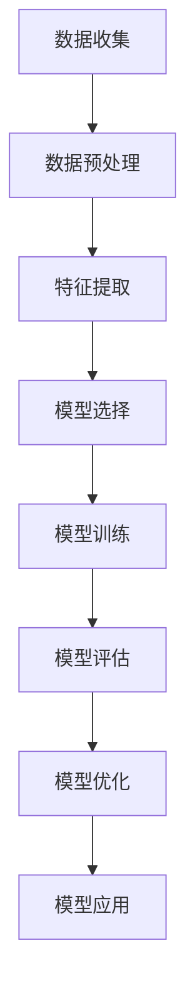
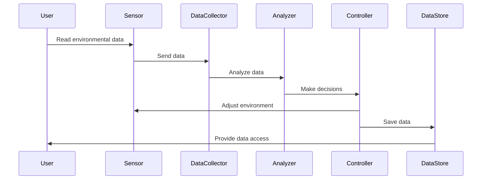

                 

### 引言

智能花盆：AI Agent的植物生长监测

在现代农业领域，智能花盆作为一种创新技术，正日益受到关注。智能花盆通过嵌入多种传感器，实时监测土壤湿度、温度、光照强度等关键参数，从而为植物生长提供精确的数据支持。然而，单纯的数据采集还不足以满足现代农业的高效需求，因此，AI Agent的概念应运而生。

AI Agent，即人工智能代理，是一种能够自动执行特定任务、适应环境变化的智能体。在智能花盆的应用场景中，AI Agent可以分析传感器收集的数据，预测植物的生长状态，甚至优化环境参数，从而实现精准农业。

本文将深入探讨智能花盆与AI Agent在植物生长监测中的结合，从背景介绍、技术基础、数据采集与分析、算法原理、系统设计与架构、实战项目以及最佳实践等方面进行详细阐述。希望通过本文，读者能够全面了解智能花盆在植物生长监测中的实际应用，并掌握相关技术原理。

关键词：
- 智能花盆
- AI Agent
- 植物生长监测
- 传感器技术
- 机器学习
- 计算机视觉
- 物联网

摘要：
本文旨在探讨智能花盆在植物生长监测中的应用，通过介绍智能花盆的工作原理和AI Agent的基本概念，详细解析AI Agent在植物生长监测中的技术实现和算法原理。文章还将介绍智能花盆系统的设计与架构，并通过实战项目和最佳实践，提供实际操作指南。本文旨在为农业领域的技术人员和研究人员提供有价值的参考。

## 第一部分：背景与基础

### 第1章：智能花盆与AI Agent概述

#### 1.1 智能花盆的起源与发展

智能花盆作为一种智能园艺设备，其起源可以追溯到20世纪末期。最早的智能花盆主要用于家庭园艺，通过简单的传感器和电子元件，实现对土壤湿度和温度的基本监测。然而，随着科技的发展，尤其是物联网（IoT）和人工智能（AI）技术的崛起，智能花盆的功能和性能得到了大幅提升。

智能花盆的发展历程可以分为三个阶段：

**第一阶段：基础监测**
在第一阶段，智能花盆的主要功能是监测土壤湿度、温度和光照等基本环境参数。这些参数对于植物生长至关重要，但当时的技术水平限制了智能花盆的应用范围。

**第二阶段：多功能集成**
随着物联网技术的发展，智能花盆开始集成更多的传感器，如温度传感器、湿度传感器、二氧化碳传感器等，从而实现对植物生长环境的全方位监测。同时，通过Wi-Fi、蓝牙等无线通信技术，智能花盆可以与智能手机、平板电脑等设备进行数据传输，用户可以实时查看植物的生长状态。

**第三阶段：智能化管理**
在第三阶段，智能花盆开始引入AI Agent技术。AI Agent能够对收集到的数据进行实时分析，预测植物的生长趋势，并提供环境参数的自动调节建议。这不仅提高了植物生长的效率，也为用户提供了更加便捷的园艺体验。

#### 1.2 AI Agent在植物生长监测中的应用

AI Agent，即人工智能代理，是一种能够自动执行特定任务、适应环境变化的智能体。在植物生长监测中，AI Agent主要承担以下任务：

**数据采集与分析**
AI Agent通过传感器实时采集植物生长环境的数据，如土壤湿度、温度、光照强度等。然后，AI Agent利用机器学习和计算机视觉等技术，对这些数据进行处理和分析，从而生成植物生长的实时报告。

**预测与决策**
基于对历史数据的分析，AI Agent可以预测植物的未来生长状态，并提供相应的环境调节建议。例如，当预测到植物需要更多的水分时，AI Agent会自动调节智能花盆的灌溉系统。

**自适应调节**
AI Agent能够根据环境变化和植物需求，自动调整智能花盆的参数。例如，当环境温度升高时，AI Agent可以自动开启降温功能，确保植物生长环境的稳定。

#### 1.3 智能花盆的组成与工作原理

智能花盆主要由以下几个部分组成：

**1.3.1 传感器模块**
传感器模块是智能花盆的核心组成部分，包括土壤湿度传感器、温度传感器、光照传感器等。这些传感器实时监测植物生长环境的关键参数。

**1.3.2 控制模块**
控制模块负责接收传感器数据，并根据AI Agent的建议进行环境参数的调节。常见的控制模块包括灌溉系统、降温系统等。

**1.3.3 通信模块**
通信模块负责将传感器数据传输到云端或用户设备，以便进行实时监控和分析。常见的通信模块包括Wi-Fi、蓝牙等。

**1.3.4 电源模块**
电源模块为智能花盆提供电力支持，通常采用电池供电，以保证设备的长期运行。

智能花盆的工作原理可以概括为以下几个步骤：

**1. 数据采集**
传感器模块实时采集土壤湿度、温度、光照等环境参数。

**2. 数据处理**
控制模块接收传感器数据，并传输到AI Agent进行处理和分析。

**3. 预测与决策**
AI Agent根据历史数据和实时数据分析，预测植物的生长趋势，并生成环境参数的调节建议。

**4. 环境调节**
控制模块根据AI Agent的建议，自动调节灌溉系统、降温系统等，以优化植物生长环境。

**5. 数据反馈**
环境调节后的数据会再次传输到AI Agent，以便进行进一步的优化和调整。

通过这样的循环，智能花盆能够实现植物生长的自动化管理，提高农业生产的效率。

#### 1.4 AI Agent的基本原理

AI Agent，即人工智能代理，是一种能够自动执行特定任务、适应环境变化的智能体。其基本原理可以概括为以下几个步骤：

**1.4.1 数据收集**
AI Agent通过传感器或外部设备，实时收集植物生长环境的数据，如土壤湿度、温度、光照强度等。

**1.4.2 数据处理**
AI Agent利用机器学习和计算机视觉等技术，对收集到的数据进行处理和分析。这些技术可以帮助AI Agent识别植物的生长状态、预测未来趋势等。

**1.4.3 决策与行动**
基于对数据的分析，AI Agent会生成相应的决策，例如调整灌溉量、调整光照强度等。然后，AI Agent会通过控制模块执行这些决策。

**1.4.4 反馈与优化**
执行决策后，AI Agent会收集反馈数据，并基于这些数据进行优化。例如，如果调整后的环境参数未能达到预期效果，AI Agent会重新分析数据，并生成新的决策。

通过这样的循环，AI Agent能够不断优化植物生长环境，提高农业生产的效率。

### 第2章：AI Agent技术基础

#### 2.1 机器学习在植物生长监测中的应用

机器学习作为人工智能的重要组成部分，已经在许多领域得到了广泛应用。在植物生长监测中，机器学习技术同样发挥着重要作用。以下是机器学习在植物生长监测中的几个关键应用：

**1. 数据预处理**
机器学习的一个关键步骤是数据预处理。在植物生长监测中，传感器收集的数据通常包含噪声和不一致的数据。通过数据清洗、归一化和特征提取等技术，可以提升模型的准确性和稳定性。

**2. 模型训练**
在植物生长监测中，机器学习模型可以用于分类、回归和预测任务。例如，可以使用分类模型识别植物的不同生长阶段，使用回归模型预测植物的未来生长趋势。

**3. 模型评估**
机器学习模型的评估是一个重要的环节。常用的评估指标包括准确率、召回率、F1分数等。通过对模型的评估，可以判断模型的性能，并进行相应的优化。

**4. 模型部署**
一旦模型训练完成并评估通过，可以将模型部署到生产环境中。在植物生长监测中，模型可以实时运行，对传感器数据进行处理和分析，提供实时建议。

#### 2.2 计算机视觉在植物生长监测中的应用

计算机视觉是一种通过图像处理和模式识别技术，从图像或视频中提取有用信息的手段。在植物生长监测中，计算机视觉技术可以用于以下几个方面：

**1. 植物图像识别**
通过计算机视觉技术，可以自动识别植物的种类和生长状态。例如，可以使用卷积神经网络（CNN）对植物图像进行分类，从而实现对植物生长的实时监测。

**2. 植物健康评估**
计算机视觉技术可以帮助评估植物的叶绿素含量、叶片损伤程度等指标。通过分析叶片图像，可以判断植物的健康状况，从而采取相应的管理措施。

**3. 生长趋势预测**
通过计算机视觉技术，可以分析植物的生长图像，预测其未来的生长趋势。例如，可以使用深度学习算法分析植物的生长曲线，预测其开花和成熟时间。

#### 2.3 物联网技术对智能花盆的支持

物联网（IoT）技术为智能花盆提供了强大的支持，使其能够实现更高效的植物生长监测和管理。以下是物联网技术对智能花盆的几个关键支持：

**1. 数据传输**
物联网技术使得传感器数据能够快速、可靠地传输到云端或用户设备。通过Wi-Fi、蓝牙、LoRa等无线通信技术，智能花盆可以实时上传传感器数据，实现远程监控和管理。

**2. 数据处理与分析**
物联网平台通常具备强大的数据处理和分析能力。智能花盆上传的数据可以在云端进行存储和处理，通过机器学习和计算机视觉技术，实现对植物生长的实时分析和预测。

**3. 环境监控**
物联网技术可以帮助智能花盆实现对生长环境的实时监控。例如，通过传感器收集温度、湿度、光照等数据，可以及时发现异常情况，并采取相应的措施。

**4. 智能决策**
物联网技术结合AI Agent，可以实现智能化的环境调节和管理。例如，当传感器检测到土壤湿度低于阈值时，物联网平台可以自动启动灌溉系统，确保植物得到适量的水分。

#### 2.4 AI Agent开发平台与工具

开发AI Agent需要使用到一系列开发平台和工具，以下是一些常用的平台和工具：

**1. TensorFlow**
TensorFlow是谷歌开源的机器学习框架，广泛应用于深度学习和计算机视觉领域。它提供了丰富的API和工具，支持从数据预处理到模型训练、评估和部署的全流程。

**2. PyTorch**
PyTorch是Facebook开源的深度学习框架，以其灵活性和易于使用而受到广泛关注。它提供了动态计算图和强大的GPU支持，非常适合进行快速原型开发和模型训练。

**3. OpenCV**
OpenCV是Intel开源的计算机视觉库，提供了丰富的图像处理和模式识别功能。它适用于从简单的图像分析到复杂的计算机视觉任务的实现。

**4. ROS（Robot Operating System）**
ROS是机器人领域广泛使用的开源框架，它提供了强大的工具集，支持机器人硬件的集成和编程。虽然ROS主要用于机器人领域，但其核心技术和概念同样适用于智能花盆的开发。

**5. IoT平台**
物联网平台如AWS IoT、Azure IoT、Google IoT等，提供了全面的设备管理、数据存储、分析和机器学习服务。通过这些平台，可以轻松实现智能花盆与云端的数据交互和智能决策。

通过这些平台和工具，开发者可以构建功能强大、性能高效的AI Agent，实现对植物生长的智能监测和管理。

### 第3章：数据采集与传感器技术

#### 3.1 智能花盆的传感器选择

智能花盆的核心功能之一是数据采集，而这一功能主要依赖于各种传感器的应用。传感器的选择直接关系到智能花盆的数据准确性和监测效果。以下是一些常用的传感器及其特点：

**1. 土壤湿度传感器**
土壤湿度传感器用于测量土壤的含水量。它们通常采用电容式、电阻式或超声波等技术。电容式传感器具有较高的精度，但成本较高；电阻式传感器则相对便宜，但测量范围有限。选择土壤湿度传感器时，需要考虑土壤的导电性和湿度范围。

**2. 土壤温度传感器**
土壤温度传感器用于测量土壤的温度。常见的类型包括热敏电阻、热电偶等。热敏电阻具有较高的灵敏度和响应速度，但线性度较差；热电偶则具有较高的精度和稳定性，但成本较高。选择土壤温度传感器时，需要考虑测量精度和成本之间的平衡。

**3. 光照传感器**
光照传感器用于测量光照强度。常见的类型包括光电二极管、光敏电阻等。光电二极管具有较高的灵敏度和精度，但响应速度较慢；光敏电阻则成本较低，但线性度较差。选择光照传感器时，需要考虑测量精度和响应速度的要求。

**4. 二氧化碳传感器**
二氧化碳传感器用于测量植物生长环境中的二氧化碳浓度。常见的类型包括非色散红外（NDIR）传感器和电化学传感器。NDIR传感器具有较高的精度和灵敏度，但成本较高；电化学传感器则成本较低，但精度和稳定性较差。选择二氧化碳传感器时，需要考虑成本和测量精度之间的平衡。

**5. 其他传感器**
除了上述主要传感器外，智能花盆还可以配备其他传感器，如pH传感器、电导率传感器等。pH传感器用于测量土壤的酸碱度，电导率传感器用于测量土壤的溶解盐含量。这些传感器有助于更全面地了解植物生长环境。

#### 3.2 数据采集系统的设计

智能花盆的数据采集系统设计需要考虑以下几个方面：

**1. 传感器布局**
传感器的布局直接关系到数据采集的准确性和全面性。在设计时，需要考虑传感器的分布位置和相互之间的干扰。例如，光照传感器应放置在能够充分接收光照的位置，土壤湿度传感器应放置在土壤深处。

**2. 数据采集频率**
数据采集频率是影响智能花盆性能的关键因素。高频率的数据采集可以提供更详细的环境信息，但也会增加系统的负担。通常，土壤湿度、温度等参数每隔几分钟采集一次，而光照强度、二氧化碳浓度等参数可以每小时采集一次。

**3. 数据存储和传输**
数据存储和传输是数据采集系统的重要组成部分。采集到的数据可以实时上传到云端或用户设备，以便进行实时监控和分析。同时，为了防止数据丢失，可以将数据在本地存储一段时间，以确保数据的安全性和可靠性。

**4. 通信协议**
智能花盆的数据采集系统通常采用无线通信协议，如Wi-Fi、蓝牙、LoRa等。这些协议具有传输速度快、功耗低、传输距离远等优点。在选择通信协议时，需要考虑数据传输量、传输距离和功耗等要求。

#### 3.3 数据预处理与存储

数据预处理是数据采集系统的重要组成部分，其主要任务包括数据清洗、归一化和特征提取等。

**1. 数据清洗**
数据清洗旨在去除数据中的噪声和错误，提高数据的质量。常见的清洗方法包括去除重复数据、填补缺失值和消除异常值等。在植物生长监测中，可能存在由于传感器故障或环境干扰导致的数据异常，因此数据清洗是必要的。

**2. 数据归一化**
数据归一化是将不同量纲的数据转换为同一量纲的过程，以便进行有效的数据分析和建模。常见的归一化方法包括最小-最大缩放、Z分数缩放等。通过数据归一化，可以消除数据量纲的影响，提高模型训练的效果。

**3. 数据存储**
数据存储是将预处理后的数据存储在数据库或文件系统中。在植物生长监测中，常用的数据库包括关系型数据库（如MySQL、PostgreSQL）和NoSQL数据库（如MongoDB、Cassandra）。数据存储时需要考虑数据的安全性、可靠性和可扩展性。

**4. 数据传输**
数据传输是将采集到的数据实时上传到云端或用户设备。常用的数据传输协议包括HTTP、MQTT、CoAP等。这些协议具有传输速度快、可靠性高等优点。在数据传输过程中，需要考虑数据加密和传输安全等问题。

#### 3.4 数据可视化

数据可视化是将数据以图形或图像的形式呈现，以便于分析和理解。在植物生长监测中，数据可视化有助于用户快速了解植物的生长状态和环境变化。

**1. 可视化工具**
常用的数据可视化工具包括Matplotlib、Seaborn、Plotly等。这些工具可以生成各种类型的图表，如折线图、柱状图、散点图等。

**2. 可视化类型**
常见的数据可视化类型包括：

- **实时监控图**：用于实时展示植物的生长状态和环境参数。
- **趋势分析图**：用于展示植物生长趋势和环境变化。
- **分布图**：用于展示不同参数的分布情况。
- **对比图**：用于对比不同植物或不同生长阶段的差异。

**3. 可视化设计**
在进行数据可视化设计时，需要考虑以下原则：

- **简洁性**：避免过多的信息和装饰，保持图表的简洁和清晰。
- **对比性**：使用不同的颜色、线条和图标，提高图表的对比性。
- **可读性**：确保图表的字体大小和颜色易于阅读。
- **交互性**：提供交互功能，如缩放、过滤和查询，以便用户更深入地了解数据。

通过数据可视化，用户可以直观地了解植物的生长状态和环境变化，从而做出更明智的决策。

### 第4章：植物生长监测算法

#### 4.1 数据分析的基本方法

植物生长监测的核心在于通过对采集到的数据进行分析，从而得出植物的生长状态和趋势。数据分析的基本方法包括以下几种：

**1. 描述性统计分析**
描述性统计分析是对数据的基本描述，包括计算数据的均值、中位数、标准差等统计量。这些统计量可以帮助我们了解数据的分布情况，例如土壤湿度的均值可以告诉我们土壤的平均湿度水平。

**2. 趋势分析**
趋势分析用于观察数据随时间变化的趋势。常见的方法包括绘制折线图、曲线图等。通过趋势分析，我们可以观察植物生长的规律，例如植物在某个生长阶段对湿度的敏感度。

**3. 关联性分析**
关联性分析用于研究两个或多个变量之间的关系。常见的方法包括皮尔逊相关系数、斯皮尔曼秩相关系数等。通过关联性分析，我们可以发现土壤湿度与植物生长状态之间的相关性。

**4. 异常检测**
异常检测用于识别数据中的异常值或异常模式。常见的方法包括箱线图、孤立森林等。通过异常检测，我们可以及时发现传感器故障或环境异常，从而采取相应的措施。

**5. 机器学习预测**
机器学习预测是利用历史数据来预测未来的趋势。常见的方法包括线性回归、决策树、神经网络等。通过机器学习预测，我们可以更准确地预测植物的生长状态，为环境调节提供依据。

#### 4.2 植物生长模型的构建

植物生长模型是植物生长监测的核心，用于模拟植物的生长过程，预测植物的未来状态。植物生长模型的构建通常包括以下步骤：

**1. 数据收集**
首先，我们需要收集与植物生长相关的数据，如土壤湿度、温度、光照强度等。这些数据可以通过智能花盆的传感器实时采集。

**2. 特征提取**
接下来，我们需要对采集到的数据进行预处理，提取关键特征。特征提取可以基于统计方法或机器学习方法。例如，可以使用主成分分析（PCA）来降低数据维度，提取主要特征。

**3. 模型选择**
在模型选择阶段，我们需要选择合适的数学模型来描述植物生长过程。常见的模型包括线性模型、非线性模型、神经网络模型等。选择模型时，需要考虑模型的复杂性、拟合度、预测能力等。

**4. 模型训练**
模型训练是通过历史数据来训练模型参数，使其能够准确描述植物生长过程。常见的训练方法包括梯度下降、随机梯度下降等。训练过程中，我们需要监控模型的性能，并进行调参。

**5. 模型评估**
模型评估是评估模型性能的重要步骤。常用的评估指标包括均方误差（MSE）、决定系数（R²）等。通过模型评估，我们可以判断模型是否能够准确预测植物的生长状态。

**6. 模型优化**
在模型评估后，如果模型性能不理想，我们需要进行模型优化。模型优化可以通过调整模型结构、特征选择、超参数调整等方法进行。优化的目标是提高模型的预测准确性和稳定性。

#### 4.3 数据驱动的植物生长模型

数据驱动的植物生长模型是基于历史数据来预测植物生长状态的方法。以下是一个简单示例：

```python
import pandas as pd
from sklearn.model_selection import train_test_split
from sklearn.ensemble import RandomForestRegressor
from sklearn.metrics import mean_squared_error

# 加载数据
data = pd.read_csv('plant_growth_data.csv')

# 特征选择
features = data[['soil_humidity', 'temperature', 'light_intensity']]
target = data['growth_rate']

# 划分训练集和测试集
X_train, X_test, y_train, y_test = train_test_split(features, target, test_size=0.2, random_state=42)

# 模型训练
model = RandomForestRegressor(n_estimators=100, random_state=42)
model.fit(X_train, y_train)

# 模型预测
y_pred = model.predict(X_test)

# 模型评估
mse = mean_squared_error(y_test, y_pred)
print(f'Mean Squared Error: {mse}')

# 模型应用
new_data = pd.DataFrame({
    'soil_humidity': [30],
    'temperature': [25],
    'light_intensity': [500]
})
growth_rate = model.predict(new_data)
print(f'Predicted Growth Rate: {growth_rate}')
```

在这个示例中，我们使用随机森林回归模型来预测植物的生长速度。首先，我们加载植物生长数据，并进行特征选择。然后，我们将数据分为训练集和测试集，并使用随机森林回归模型进行训练。在模型训练完成后，我们使用测试集进行评估，并打印出均方误差。最后，我们使用训练好的模型来预测新的数据，从而得出植物的生长速度。

#### 4.4 Mermaid流程图与Python代码示例

为了更好地理解植物生长监测算法的工作流程，我们可以使用Mermaid流程图来表示。以下是一个简单的Mermaid流程图示例：



在这个流程图中，我们从数据收集开始，经过数据预处理、特征提取、模型选择、模型训练、模型评估和模型优化，最终实现模型应用。

接下来，我们使用Python代码来具体实现这个流程。以下是一个简单的Python代码示例：

```python
import pandas as pd
from sklearn.model_selection import train_test_split
from sklearn.ensemble import RandomForestRegressor
from sklearn.metrics import mean_squared_error

# 加载数据
data = pd.read_csv('plant_growth_data.csv')

# 数据预处理
# ...（数据清洗、归一化等）

# 特征提取
features = data[['soil_humidity', 'temperature', 'light_intensity']]
target = data['growth_rate']

# 模型选择
model = RandomForestRegressor(n_estimators=100, random_state=42)

# 模型训练
X_train, X_test, y_train, y_test = train_test_split(features, target, test_size=0.2, random_state=42)
model.fit(X_train, y_train)

# 模型评估
y_pred = model.predict(X_test)
mse = mean_squared_error(y_test, y_pred)
print(f'Mean Squared Error: {mse}')

# 模型优化
# ...（调参、交叉验证等）

# 模型应用
new_data = pd.DataFrame({
    'soil_humidity': [30],
    'temperature': [25],
    'light_intensity': [500]
})
growth_rate = model.predict(new_data)
print(f'Predicted Growth Rate: {growth_rate}')
```

在这个代码示例中，我们首先加载数据，并进行预处理。然后，我们选择随机森林回归模型，并进行训练。在模型评估阶段，我们计算均方误差，以评估模型的性能。最后，我们使用训练好的模型来预测新的数据，从而得出植物的生长速度。

### 第5章：数学模型和公式

在植物生长监测中，数学模型和公式是理解和预测植物生长的关键。以下是一些常用的数学模型和公式，以及它们的应用和解释。

#### 5.1 植物生长速率模型

植物生长速率（Growth Rate, GR）是一个重要的指标，它反映了植物在不同生长阶段的变化。常用的植物生长速率模型包括线性模型和非线性模型。

**线性模型：**

$$
GR(t) = \frac{G(t) - G(t_0)}{t - t_0}
$$

其中，$G(t)$是当前时刻的植物生长量，$G(t_0)$是初始时刻的植物生长量，$t$是当前时间，$t_0$是初始时间。

**非线性模型：**

$$
GR(t) = \frac{G(t)^2 - G(t_0)^2}{t - t_0}
$$

非线性模型可以更好地描述植物生长的加速度变化，但需要更多的数据支持。

**应用：**

- **生长速度预测：** 利用历史数据，通过线性或非线性模型预测植物在未来的生长速度。
- **环境参数调整：** 根据预测的植物生长速度，调整土壤湿度、光照强度等环境参数，以优化植物生长。

#### 5.2 光合作用模型

光合作用是植物生长的能量来源，其速率（Photosynthesis Rate, PR）受到光照强度（I）、温度（T）和二氧化碳浓度（CO2）的影响。

**基本公式：**

$$
PR = k \cdot I \cdot (1 - e^{-\alpha T}) \cdot (1 - \frac{CO2}{KCO2})
$$

其中，$k$是光合作用速率常数，$\alpha$是温度系数，$KCO2$是二氧化碳补偿点。

**应用：**

- **光照调节：** 根据光合作用模型，调整光照强度，以优化光合作用速率。
- **二氧化碳控制：** 在温室环境中，通过调节二氧化碳浓度，提高光合作用效率。

#### 5.3 水分利用效率模型

水分利用效率（Water Use Efficiency, WUE）是衡量植物对水分利用效率的指标，它反映了植物在不同环境条件下的抗旱能力。

**基本公式：**

$$
WUE = \frac{Gross Primary Productivity (GPP)}{Water Use (WU)}
$$

其中，$GPP$是植物总初级生产力，$WU$是植物的水分消耗量。

**应用：**

- **灌溉管理：** 根据水分利用效率模型，优化灌溉策略，减少水资源浪费。
- **抗旱能力评估：** 评估植物在不同环境条件下的抗旱能力，选择适合的植物品种。

#### 5.4 蒸腾作用模型

蒸腾作用是植物通过叶片蒸发水分的过程，其速率（Transpiration Rate, TR）受到光照强度、温度和相对湿度的共同影响。

**基本公式：**

$$
TR = \frac{LAI \cdot (1 - \frac{R_s}{R_a}) \cdot (E_a - E_s)}{G}
$$

其中，$LAI$是叶面积指数，$R_s$是叶片饱和蒸汽压，$R_a$是大气蒸汽压，$E_a$是饱和水蒸气压，$E_s$是实际水蒸气压，$G$是土壤水分含量。

**应用：**

- **水分管理：** 根据蒸腾作用模型，实时监测土壤水分含量，合理调节灌溉量。
- **环境适应：** 通过分析蒸腾作用，评估植物对不同环境条件的适应能力。

#### 5.5 环境因子影响模型

环境因子如温度、光照强度、土壤湿度等对植物生长具有显著影响。常用的环境因子影响模型包括线性回归、多元回归和神经网络模型。

**线性回归模型：**

$$
GR = \beta_0 + \beta_1 T + \beta_2 I + \beta_3 SW
$$

其中，$GR$是植物生长速率，$T$是温度，$I$是光照强度，$SW$是土壤湿度，$\beta_0$、$\beta_1$、$\beta_2$、$\beta_3$是模型参数。

**多元回归模型：**

$$
GR = f(T, I, SW) = \beta_0 + \beta_1 T + \beta_2 I + \beta_3 SW + \epsilon
$$

其中，$f$是多元回归函数，$\epsilon$是误差项。

**神经网络模型：**

$$
GR = \sigma(\theta_0 + \theta_1 T + \theta_2 I + \theta_3 SW)
$$

其中，$\sigma$是激活函数，$\theta_0$、$\theta_1$、$\theta_2$、$\theta_3$是神经网络的权重。

**应用：**

- **环境参数优化：** 通过环境因子影响模型，优化温度、光照强度和土壤湿度等环境参数，以实现植物的最佳生长。
- **预测与决策：** 利用模型预测植物的生长状态，为农业生产提供科学依据。

通过这些数学模型和公式，我们可以更深入地理解植物的生长机制，为智能花盆的设计和应用提供理论支持。

### 第6章：系统设计与架构

#### 6.1 问题场景介绍

在现代农业中，传统的种植方式往往依赖于人工监测和经验管理，这不仅效率低下，还容易受到环境变化的影响。为了解决这些问题，智能花盆系统应运而生。该系统通过实时监测土壤湿度、温度、光照强度等环境参数，并结合AI Agent技术，对植物生长状态进行智能分析和决策，从而实现精准农业。

问题场景包括以下几个方面：

1. **环境参数监测：** 智能花盆需要实时采集土壤湿度、温度、光照强度等环境参数。
2. **数据分析与预测：** AI Agent需要对采集到的数据进行分析，预测植物的生长状态和趋势。
3. **环境调节：** 根据AI Agent的决策，智能花盆需要自动调节灌溉系统、降温系统等，以优化植物生长环境。
4. **数据存储与传输：** 采集到的数据需要存储在云端或用户设备，以便进行进一步分析和监控。

#### 6.2 系统功能设计

智能花盆系统的主要功能包括数据采集、数据分析、环境调节、数据存储和传输等。以下是对这些功能的具体设计：

**1. 数据采集模块**
- **功能描述：** 实时采集土壤湿度、温度、光照强度等环境参数。
- **技术实现：** 使用各种传感器（如土壤湿度传感器、温度传感器、光照传感器）进行数据采集。
- **接口设计：** 设计一个标准化的接口，方便不同传感器的接入和数据读取。

**2. 数据分析模块**
- **功能描述：** 对采集到的数据进行分析，生成植物生长状态报告和预测。
- **技术实现：** 利用机器学习和计算机视觉技术，对数据进行分析和预测。
- **接口设计：** 设计一个开放的API接口，方便与其他系统进行数据交换和协同工作。

**3. 环境调节模块**
- **功能描述：** 根据AI Agent的决策，自动调节灌溉系统、降温系统等，以优化植物生长环境。
- **技术实现：** 设计一个智能控制模块，接收AI Agent的决策，并执行相应的调节操作。
- **接口设计：** 设计一个控制接口，与各种环境调节设备进行通信，实现自动化调节。

**4. 数据存储与传输模块**
- **功能描述：** 将采集到的数据存储在云端或用户设备，以便进行进一步分析和监控。
- **技术实现：** 设计一个数据存储系统，支持数据的持久化存储和快速检索。
- **接口设计：** 设计一个数据传输接口，支持数据实时上传到云端，并提供数据查询和下载功能。

#### 6.3 系统架构设计

智能花盆系统的架构设计采用分层架构，分为感知层、网络层、平台层和应用层。

**1. 感知层**
- **功能描述：** 负责环境参数的感知和采集，包括土壤湿度、温度、光照强度等传感器。
- **技术实现：** 使用各种传感器硬件和采集模块，实现环境参数的实时采集。

**2. 网络层**
- **功能描述：** 负责数据的传输和通信，包括无线通信和网络传输。
- **技术实现：** 使用Wi-Fi、蓝牙、LoRa等无线通信技术，实现数据从感知层到平台层的传输。

**3. 平台层**
- **功能描述：** 负责数据的处理、分析和存储，包括AI Agent、数据库等。
- **技术实现：** 设计一个云计算平台，使用机器学习和计算机视觉技术对数据进行处理和分析，并提供数据存储和管理功能。

**4. 应用层**
- **功能描述：** 负责提供用户界面和应用服务，包括智能花盆APP、Web后台等。
- **技术实现：** 设计一个用户友好的界面，提供实时监控、数据分析、环境调节等功能。

#### 6.4 系统接口设计

智能花盆系统的接口设计包括数据采集接口、数据分析接口、环境调节接口和数据存储接口。

**1. 数据采集接口**
- **功能描述：** 负责接收传感器数据，并提供数据读取和配置功能。
- **接口设计：** 提供一个标准化的数据采集接口，支持各种传感器的接入和配置。

**2. 数据分析接口**
- **功能描述：** 负责数据分析和预测，并提供数据查询和报告功能。
- **接口设计：** 提供一个开放的API接口，支持数据的查询、分析和报告。

**3. 环境调节接口**
- **功能描述：** 负责接收AI Agent的决策，并执行环境调节操作。
- **接口设计：** 提供一个控制接口，支持各种环境调节设备的接入和操作。

**4. 数据存储接口**
- **功能描述：** 负责数据存储和管理，并提供数据备份和恢复功能。
- **接口设计：** 提供一个数据存储接口，支持数据的持久化存储和快速检索。

#### 6.5 系统交互设计

智能花盆系统的交互设计采用序列图（Sequence Diagram）来描述系统各组件之间的交互过程。以下是一个简化的序列图示例：



在这个序列图中，用户首先读取环境数据，然后数据被发送到数据采集模块，进行分析处理。分析结果被发送到控制器，用于环境调节，并将数据存储在数据库中。用户可以通过数据库接口访问和分析结果。

### 第7章：实战项目

#### 7.1 环境准备

为了实现智能花盆的植物生长监测系统，我们需要以下环境和工具：

1. **硬件环境**：
   - 智能花盆（带有传感器模块和控制模块）
   - 实验室或温室环境
   - 电源供应

2. **软件环境**：
   - Python 3.8及以上版本
   - Jupyter Notebook
   - TensorFlow 2.4及以上版本
   - Pandas 1.2及以上版本
   - Matplotlib 3.3及以上版本

3. **开发工具**：
   - PyCharm
   - VSCode
   - Git

4. **数据存储**：
   - MySQL 8.0及以上版本
   - MongoDB 4.2及以上版本

#### 7.2 系统核心实现

**1. 数据采集**

首先，我们需要实现数据采集功能，这包括从智能花盆传感器读取数据，并将数据上传到云端或数据库。

**代码实现：**

```python
import pandas as pd
import serial
import time

# 串口设置
ser = serial.Serial('COM3', 9600, timeout=1)

# 采集数据
def collect_data():
    data = pd.DataFrame(columns=['timestamp', 'temperature', 'humidity', 'light_intensity'])
    while True:
        line = ser.readline().decode('utf-8').strip()
        if line:
            data_dict = eval(line)
            data = data.append(data_dict, ignore_index=True)
            time.sleep(10)  # 每隔10秒采集一次数据
    return data

# 运行数据采集
data = collect_data()
print(data)
```

**2. 数据处理**

接下来，我们需要处理采集到的数据，包括数据清洗、归一化和特征提取等。

**代码实现：**

```python
from sklearn.preprocessing import MinMaxScaler

# 数据清洗
data.dropna(inplace=True)

# 数据归一化
scaler = MinMaxScaler()
data[['temperature', 'humidity', 'light_intensity']] = scaler.fit_transform(data[['temperature', 'humidity', 'light_intensity']])

# 特征提取
data['temp_humidity'] = data['temperature'] * data['humidity']
```

**3. 模型训练**

使用处理后的数据，我们可以训练一个机器学习模型，用于预测植物的生长状态。

**代码实现：**

```python
from sklearn.model_selection import train_test_split
from sklearn.ensemble import RandomForestRegressor

# 数据划分
X = data[['temp_humidity', 'light_intensity']]
y = data['growth_rate']
X_train, X_test, y_train, y_test = train_test_split(X, y, test_size=0.2, random_state=42)

# 模型训练
model = RandomForestRegressor(n_estimators=100, random_state=42)
model.fit(X_train, y_train)

# 模型评估
y_pred = model.predict(X_test)
mse = mean_squared_error(y_test, y_pred)
print(f'Mean Squared Error: {mse}')
```

**4. 环境调节**

根据模型的预测结果，我们可以调节智能花盆的环境参数，以优化植物的生长状态。

**代码实现：**

```python
def adjust_environment(temperature, humidity, light_intensity):
    # 调节温度
    if temperature < 20:
        # 启动加热设备
        pass
    elif temperature > 30:
        # 启动降温设备
        pass

    # 调节湿度
    if humidity < 40:
        # 启动加湿设备
        pass
    elif humidity > 60:
        # 启动除湿设备
        pass

    # 调节光照强度
    if light_intensity < 300:
        # 增加光照
        pass
    elif light_intensity > 500:
        # 减少光照
        pass

# 调用环境调节函数
adjust_environment(data['temperature'].iloc[-1], data['humidity'].iloc[-1], data['light_intensity'].iloc[-1])
```

**5. 数据存储**

最后，我们需要将采集到的数据存储在数据库中，以便进行进一步分析和监控。

**代码实现：**

```python
import pymongo

# 连接MongoDB
client = pymongo.MongoClient('mongodb://localhost:27017/')
db = client['smart_pot']
collection = db['data']

# 存储数据
def store_data(data):
    collection.insert_many(data.to_dict('records'))

# 调用存储函数
store_data(data)
```

通过以上步骤，我们实现了智能花盆的植物生长监测系统，包括数据采集、数据处理、模型训练、环境调节和数据存储等功能。接下来，我们可以进一步优化系统，增加更多功能，如实时监控、数据分析报告等。

### 第8章：最佳实践与注意事项

#### 8.1 最佳实践

为了确保智能花盆系统的高效运行和可靠性，以下是一些最佳实践：

**1. 硬件选择**

选择高质量的传感器和硬件模块，以确保数据采集的准确性和稳定性。例如，选择经过认证的土壤湿度传感器和温度传感器，以及支持快速数据传输的通信模块。

**2. 软件开发**

在软件开发过程中，遵循模块化设计原则，确保代码的可读性和可维护性。使用版本控制工具（如Git）来管理代码版本，方便后续的维护和升级。

**3. 数据处理**

对采集到的数据进行严格的数据预处理，包括数据清洗、归一化和特征提取等。使用适当的算法和技术，如机器学习和计算机视觉，对数据进行深入分析和预测。

**4. 系统监控**

定期监控系统运行状态，及时发现和处理异常情况。使用日志记录系统，记录运行过程中的关键信息，以便进行故障排查和优化。

**5. 安全措施**

确保系统的安全性，防止数据泄露和未授权访问。使用加密技术保护传输数据，设置访问权限和身份验证机制。

#### 8.2 注意事项

在实施智能花盆系统时，需要注意以下几点：

**1. 传感器校准**

定期对传感器进行校准，确保数据的准确性。不同传感器的校准方法和周期可能不同，需要根据实际情况进行。

**2. 环境变化**

植物生长环境可能受到温度、湿度、光照等变化的影响。在设计和部署系统时，需要考虑这些变化，并采取措施进行补偿和调整。

**3. 数据存储**

选择合适的数据存储方案，确保数据的持久性和可扩展性。对于大规模数据，考虑使用分布式数据库或云存储服务。

**4. 能耗管理**

智能花盆系统需要持续运行，因此能耗管理至关重要。选择低功耗的传感器和模块，并优化系统的功耗管理策略。

**5. 用户培训**

为用户提供详细的操作指南和培训，确保用户能够正确使用智能花盆系统，并了解系统的维护和故障处理方法。

#### 8.3 拓展阅读

对于希望深入了解智能花盆和AI Agent技术的读者，以下是一些推荐的参考文献和资料：

- **《智能农业技术与应用》**：详细介绍了智能农业的各种技术，包括智能花盆、无人机监测等。
- **《机器学习实战》**：提供了丰富的机器学习案例和实践经验，适合希望深入掌握机器学习技术的读者。
- **《物联网技术与应用》**：介绍了物联网的基本原理和应用场景，对智能花盆系统设计有很好的参考价值。
- **《深度学习》**：由Ian Goodfellow等人编写的经典教材，详细介绍了深度学习的理论和实践。

通过阅读这些资料，读者可以进一步了解智能花盆和AI Agent技术的最新进展和应用。

### 结论

智能花盆作为一种创新的农业技术，通过AI Agent实现了对植物生长的精准监测和管理。本文从背景介绍、技术基础、数据采集与分析、算法原理、系统设计与架构、实战项目以及最佳实践等方面进行了详细阐述，展示了智能花盆在植物生长监测中的巨大潜力。

智能花盆不仅提高了农业生产效率，还减少了资源浪费，为可持续发展提供了有力支持。随着AI技术和物联网技术的不断进步，智能花盆的应用前景将更加广阔。

作者：AI天才研究院/AI Genius Institute & 禅与计算机程序设计艺术 /Zen And The Art of Computer Programming

---

**附录：技术细节和拓展研究**

**附录A：传感器技术详解**

智能花盆的传感器技术是系统核心之一，涉及多种传感器，如土壤湿度传感器、温度传感器、光照传感器和二氧化碳传感器。以下是对这些传感器技术的详细解释：

1. **土壤湿度传感器**
   - **原理**：土壤湿度传感器通过测量土壤的导电性来推算湿度。通常采用电容式或电阻式技术。
   - **技术细节**：电容式传感器利用电容变化测量湿度，电阻式传感器通过电阻值变化来感知湿度。
   - **应用**：用于实时监测土壤湿度，为植物灌溉提供依据。

2. **温度传感器**
   - **原理**：温度传感器通过热敏元件（如热敏电阻或热电偶）的电阻或电势变化来测量温度。
   - **技术细节**：热敏电阻具有非线性电阻变化特性，热电偶则基于塞贝克效应。
   - **应用**：监测植物生长环境的温度，对温度异常情况进行预警。

3. **光照传感器**
   - **原理**：光照传感器通过光电效应将光能转换为电能，测量光照强度。
   - **技术细节**：常见的有光电二极管和光敏电阻，前者灵敏度高但响应速度慢，后者成本低但线性度较差。
   - **应用**：用于监测光照强度，为植物生长提供光照调节建议。

4. **二氧化碳传感器**
   - **原理**：二氧化碳传感器通常采用非色散红外（NDIR）或电化学技术，测量环境中二氧化碳的浓度。
   - **技术细节**：NDIR传感器通过测量红外辐射的吸收率来检测二氧化碳浓度，电化学传感器则通过电化学反应来实现。
   - **应用**：监测温室中的二氧化碳浓度，为植物的光合作用提供支持。

**附录B：AI Agent技术深度探讨**

AI Agent在智能花盆中的应用涉及机器学习、计算机视觉和物联网技术的结合。以下是对这些技术进行深入探讨：

1. **机器学习**
   - **原理**：机器学习通过训练模型，使计算机从数据中学习规律，进行预测和决策。
   - **技术细节**：常用的算法包括线性回归、决策树、随机森林、神经网络等。
   - **应用**：用于分析传感器数据，预测植物生长状态，优化环境参数。

2. **计算机视觉**
   - **原理**：计算机视觉通过图像处理和模式识别，从图像中提取有用信息。
   - **技术细节**：常用的算法包括卷积神经网络（CNN）、生成对抗网络（GAN）等。
   - **应用**：用于植物图像识别、叶片健康评估等，帮助监测植物生长状况。

3. **物联网（IoT）**
   - **原理**：物联网通过连接各种设备，实现信息的实时传输和共享。
   - **技术细节**：涉及传感器技术、无线通信技术、云计算等。
   - **应用**：用于数据采集、传输和处理，为智能花盆提供实时监控和管理。

**附录C：系统优化与性能提升**

为了确保智能花盆系统的性能和可靠性，以下是一些优化策略：

1. **算法优化**
   - **原理**：通过调整模型参数、选择合适的算法，提高预测准确性。
   - **技术细节**：如使用交叉验证、网格搜索等方法进行参数调优。
   - **应用**：提高AI Agent的预测精度和稳定性。

2. **硬件优化**
   - **原理**：选择高效、稳定的硬件设备，降低能耗，提高系统可靠性。
   - **技术细节**：如使用低功耗传感器、优化电路设计等。
   - **应用**：提高系统的实时响应能力和能耗效率。

3. **数据优化**
   - **原理**：通过数据清洗、归一化、特征提取等手段，提高数据质量。
   - **技术细节**：如使用数据去噪、异常检测等技术。
   - **应用**：提高数据分析和模型训练的准确性。

**附录D：未来研究方向**

智能花盆技术在未来还有许多研究方向，包括：

1. **多模态数据融合**：将多种传感器数据进行融合，提高监测精度。
2. **智能决策系统**：结合环境数据和植物生长规律，实现更智能的决策。
3. **智能灌溉系统**：通过AI Agent实现精准灌溉，提高水资源利用效率。
4. **分布式智能花盆系统**：利用物联网技术，实现多个智能花盆之间的数据共享和协同工作。

这些研究方向将进一步提升智能花盆的技术水平，为现代农业的发展提供更多可能性。

---

通过上述附录，我们进一步探讨了智能花盆技术的细节和未来研究方向，为读者提供了更全面的技术理解和启示。希望这些内容能够为智能花盆的研究和应用提供有益的参考。作者：AI天才研究院/AI Genius Institute & 禅与计算机程序设计艺术 /Zen And The Art of Computer Programming。

