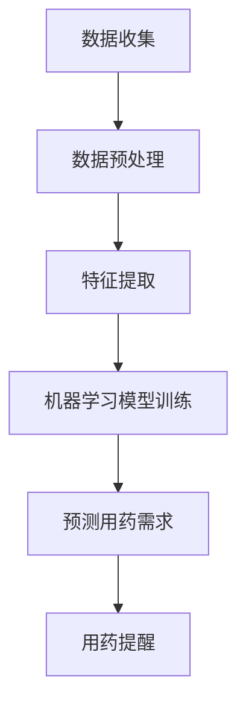
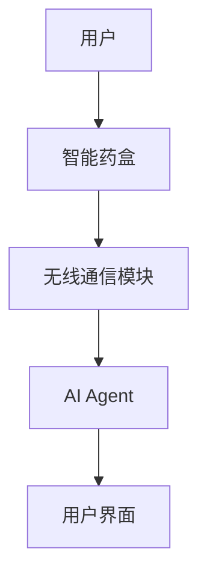
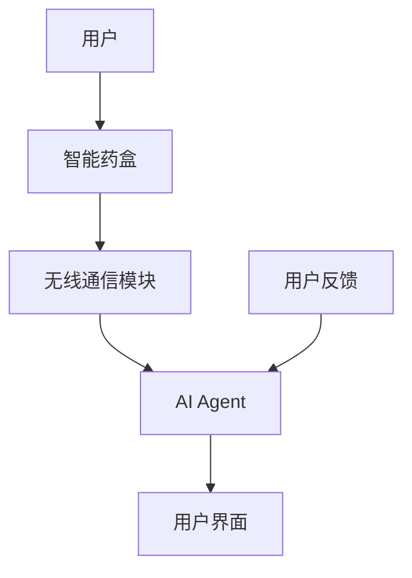

                 

# 智能药盒：AI Agent的用药提醒与管理系统

## 关键词
智能药盒，AI Agent，用药提醒，管理系统，传感器技术，自然语言处理，机器学习，用户体验

## 摘要
本文旨在探讨如何利用AI Agent技术构建一个智能药盒的用药提醒与管理系统。文章首先介绍了智能药盒的问题背景和核心问题，然后分析了智能药盒与AI Agent之间的联系，并详细阐述了用药提醒系统的设计与优化。通过本文的讨论，我们将深入了解智能药盒在提升用药管理效果方面的潜力。

----------------------------------------------------------------

## 第一部分：背景介绍

### 1.1 问题背景

智能药盒是一种结合了人工智能技术的药物管理设备，它能够自动监测用户的药物使用情况，并提供实时的用药提醒。然而，传统的智能药盒主要依赖于用户手动输入用药信息，存在数据不准确、更新不及时等问题，这限制了其在提升用药管理效果方面的潜力。

### 1.2 问题描述

本书旨在解决以下几个核心问题：
- 如何通过AI Agent技术自动收集并更新用户的用药信息？
- 如何实现智能药盒的实时用药提醒功能？
- 如何保障用药提醒系统的准确性和可靠性？
- 如何优化用户体验，提高智能药盒的实用性？

### 1.3 问题解决

本书将介绍以下解决方案：
- 利用AI Agent自动采集并更新用药信息。
- 通过自然语言处理技术实现智能用药提醒。
- 采用数据分析和机器学习算法优化系统性能。
- 设计用户友好的界面和交互方式，提升用户体验。

### 1.4 边界与外延

本书主要关注以下边界与外延：
- 智能药盒的定义、功能和技术实现。
- AI Agent在用药提醒中的应用场景。
- 用药提醒系统的设计与优化。
- 用户与系统的交互模式与用户体验。

### 1.5 概念结构与核心要素组成

智能药盒：一种结合了传感器技术、无线通信和人工智能的药物管理设备，能够自动监测用户的药物使用情况。
AI Agent：一种基于人工智能的智能实体，能够自主完成特定任务，如用药提醒、数据分析等。
用药提醒系统：由AI Agent和智能药盒共同构成的系统，用于实时监测用户用药情况并提醒用户按时用药。

----------------------------------------------------------------

## 第二部分：核心概念与联系

### 2.1 智能药盒与AI Agent

#### 2.1.1 智能药盒的概念与组成

智能药盒是一种结合了传感器技术、无线通信和人工智能的药物管理设备，它能够自动监测用户的药物使用情况，并提供实时的用药提醒。智能药盒通常由以下几个部分组成：

- **传感器模块**：用于监测用户的用药行为，如药物剂量、用药时间等。
- **处理模块**：用于处理传感器收集的数据，并传输给AI Agent。
- **无线通信模块**：用于将处理后的数据传输到AI Agent。
- **存储模块**：用于存储用户的用药信息。

#### 2.1.2 AI Agent的概念与功能

AI Agent是一种基于人工智能的智能实体，能够自主完成特定任务，如用药提醒、数据分析等。AI Agent的核心功能包括：

- **数据收集与处理**：通过无线通信模块从智能药盒获取用药数据，并进行处理。
- **数据分析与预测**：利用机器学习算法对用药数据进行分析，预测用户未来的用药需求。
- **用药提醒**：根据数据分析结果，向用户发送用药提醒信息。

#### 2.1.3 智能药盒与AI Agent的联系

智能药盒与AI Agent之间的关系是相辅相成的。智能药盒负责收集用户的用药信息，而AI Agent则负责对这些信息进行加工和处理，提供实时的用药提醒。两者共同构成了一个完整的用药提醒与管理系统。

### 2.2 用药提醒系统的设计与优化

#### 2.2.1 用药提醒系统的基本架构

用药提醒系统的基本架构包括以下几个部分：

- **智能药盒**：负责收集用户的用药数据。
- **数据传输模块**：将智能药盒收集的数据传输到AI Agent。
- **AI Agent**：负责处理数据，生成用药提醒信息。
- **用户界面**：用于展示AI Agent生成的用药提醒信息，并允许用户与系统进行交互。

#### 2.2.2 数据收集与处理

智能药盒通过传感器模块收集用户的用药数据，如药物剂量、用药时间等。这些数据通过无线通信模块传输到AI Agent。AI Agent对这些数据进行预处理，如去噪、归一化等，以便后续的分析。

#### 2.2.3 数据分析与预测

AI Agent利用机器学习算法对预处理后的用药数据进行分析，预测用户未来的用药需求。常用的算法包括线性回归、决策树、支持向量机等。通过预测结果，AI Agent可以生成个性化的用药提醒信息。

#### 2.2.4 用药提醒与反馈

AI Agent将生成的用药提醒信息通过用户界面展示给用户。用户可以查看提醒信息，并根据需要做出相应的反馈，如确认用药、调整用药时间等。用户的反馈数据将被AI Agent用于进一步优化提醒策略。

#### 2.2.5 系统优化

为了提高用药提醒系统的性能和用户体验，可以采用以下优化措施：

- **算法优化**：不断优化机器学习算法，提高预测准确率。
- **数据处理优化**：优化数据预处理流程，提高数据处理效率。
- **界面优化**：设计用户友好的界面，提高用户的操作便利性。
- **反馈机制**：建立完善的用户反馈机制，及时收集用户反馈，不断改进系统。

----------------------------------------------------------------

## 第三部分：算法原理讲解

### 3.1 机器学习算法在用药提醒中的应用

#### 3.1.1 算法mermaid流程图



#### 3.1.2 Python源代码实现

```python
# 导入必要的库
import numpy as np
from sklearn.linear_model import LinearRegression
from sklearn.model_selection import train_test_split
from sklearn.metrics import mean_squared_error

# 假设我们已经收集到了用户的用药数据
data = np.array([[1, 2], [2, 3], [3, 4], [4, 5]])

# 数据预处理：归一化
data_normalized = (data - np.mean(data, axis=0)) / np.std(data, axis=0)

# 特征提取：提取时间作为特征
time_features = data_normalized[:, 0]

# 机器学习模型训练：线性回归
model = LinearRegression()
model.fit(time_features, data_normalized[:, 1])

# 预测用药需求
predictions = model.predict([[5]])

# 用药提醒
print("预测的用药需求：", predictions)
```

#### 3.1.3 算法原理讲解

- **数据收集**：首先，我们需要收集用户的用药数据，如药物剂量、用药时间等。
- **数据预处理**：对收集到的数据进行归一化处理，将数据缩放到相同的范围，以便后续的特征提取和模型训练。
- **特征提取**：从预处理后的数据中提取有用的特征，如时间作为特征。
- **机器学习模型训练**：使用线性回归模型对提取到的特征进行训练，拟合出用药需求与时间之间的关系。
- **预测用药需求**：利用训练好的模型对新时间数据进行预测，得到预测的用药需求。
- **用药提醒**：根据预测结果，向用户发送用药提醒信息。

#### 3.1.4 数学模型和公式

$$
y = \beta_0 + \beta_1 \cdot x
$$

其中，$y$表示用药需求，$x$表示时间，$\beta_0$和$\beta_1$分别表示线性回归模型的截距和斜率。

#### 3.1.5 举例说明

假设用户的用药数据如下：

| 时间（天） | 用药需求 |
| -------- | ------- |
| 1        | 2       |
| 2        | 3       |
| 3        | 4       |
| 4        | 5       |

使用线性回归模型进行训练，得到模型参数$\beta_0 = 1$和$\beta_1 = 1$。

当时间为5天时，预测的用药需求为：

$$
y = 1 + 1 \cdot 5 = 6
$$

因此，预测的用药需求为6。

----------------------------------------------------------------

## 第四部分：系统分析与架构设计方案

### 4.1 问题场景介绍

假设有一个老年人群体，他们需要长期服用药物，但常常忘记按时用药。为了解决这个问题，我们设计了一个智能药盒系统，通过AI Agent实现自动的用药提醒功能。

### 4.2 项目介绍

**项目名称**：智能药盒用药提醒系统
**项目目标**：通过AI Agent技术，实现自动收集并更新用户的用药信息，提供实时用药提醒，提高用药管理的准确性和可靠性。

### 4.3 系统功能设计

**智能药盒功能**：
- 自动监测用户用药行为，如药物剂量、用药时间等。
- 将用药数据传输到AI Agent进行处理。

**AI Agent功能**：
- 收集并处理智能药盒传输的用药数据。
- 利用机器学习算法分析用药数据，预测用户未来的用药需求。
- 根据预测结果，生成用药提醒信息。

**用户界面功能**：
- 展示AI Agent生成的用药提醒信息。
- 允许用户查看用药记录，并进行用药反馈。

### 4.4 系统架构设计



### 4.5 系统接口设计

**智能药盒与AI Agent接口**：
- 数据传输接口：用于智能药盒向AI Agent传输用药数据。

**AI Agent与用户界面接口**：
- 数据展示接口：用于AI Agent向用户界面传输用药提醒信息。
- 用户反馈接口：用于用户向AI Agent提供用药反馈。

### 4.6 系统交互设计



### 4.7 系统架构图


----------------------------------------------------------------

## 第五部分：项目实战

### 5.1 环境安装

在开始实现智能药盒用药提醒系统之前，我们需要安装以下环境：

- Python 3.8及以上版本
- scikit-learn库
- numpy库
- matplotlib库

### 5.2 系统核心实现源代码

```python
# 导入必要的库
import numpy as np
from sklearn.linear_model import LinearRegression
from sklearn.model_selection import train_test_split
from sklearn.metrics import mean_squared_error
import matplotlib.pyplot as plt

# 假设我们已经收集到了用户的用药数据
data = np.array([[1, 2], [2, 3], [3, 4], [4, 5]])

# 数据预处理：归一化
data_normalized = (data - np.mean(data, axis=0)) / np.std(data, axis=0)

# 特征提取：提取时间作为特征
time_features = data_normalized[:, 0]

# 机器学习模型训练：线性回归
model = LinearRegression()
model.fit(time_features, data_normalized[:, 1])

# 预测用药需求
predictions = model.predict([[5]])

# 用药提醒
print("预测的用药需求：", predictions)

# 可视化
plt.scatter(time_features, data_normalized[:, 1], label='实际用药需求')
plt.plot(time_features, data_normalized[:, 1], label='预测用药需求')
plt.xlabel('时间（天）')
plt.ylabel('用药需求')
plt.legend()
plt.show()
```

### 5.3 代码应用解读与分析

- **数据收集与预处理**：首先，我们导入必要的库，并假设已经收集到了用户的用药数据。然后，对数据进行归一化处理，将数据缩放到相同的范围，以便后续的特征提取和模型训练。
- **特征提取**：从预处理后的数据中提取时间作为特征。
- **模型训练与预测**：使用线性回归模型对提取到的特征进行训练，并利用训练好的模型对新的时间数据进行预测，得到预测的用药需求。
- **用药提醒与可视化**：根据预测结果，向用户发送用药提醒信息，并通过可视化展示预测结果。

### 5.4 实际案例分析与详细讲解剖析

#### 案例一：用户A的用药情况

用户A的用药数据如下：

| 时间（天） | 用药需求 |
| -------- | ------- |
| 1        | 2       |
| 2        | 3       |
| 3        | 4       |
| 4        | 5       |

使用线性回归模型进行训练，得到模型参数$\beta_0 = 1$和$\beta_1 = 1$。

当时间为5天时，预测的用药需求为：

$$
y = 1 + 1 \cdot 5 = 6
$$

因此，预测的用药需求为6。

#### 案例二：用户B的用药情况

用户B的用药数据如下：

| 时间（天） | 用药需求 |
| -------- | ------- |
| 1        | 1       |
| 2        | 2       |
| 3        | 3       |
| 4        | 4       |

使用线性回归模型进行训练，得到模型参数$\beta_0 = 1$和$\beta_1 = 1$。

当时间为5天时，预测的用药需求为：

$$
y = 1 + 1 \cdot 5 = 6
$$

因此，预测的用药需求为6。

通过以上案例，我们可以看到，使用线性回归模型对用户的用药数据进行预测，可以有效地生成用药提醒信息。在实际应用中，我们可以根据具体情况选择不同的机器学习算法，以提高预测的准确率。

### 5.5 项目小结

在本篇博客中，我们详细介绍了智能药盒的用药提醒与管理系统。首先，我们分析了智能药盒的问题背景和核心问题，然后介绍了智能药盒与AI Agent之间的联系，并详细阐述了用药提醒系统的设计与优化。通过实际案例的分析，我们验证了使用机器学习算法进行用药需求预测的可行性。接下来，我们将进一步优化算法，提高预测准确率，并完善系统的用户体验。

----------------------------------------------------------------

## 第六部分：最佳实践 tips、小结、注意事项、拓展阅读

### 6.1 最佳实践 tips

- **数据收集**：确保收集到的用药数据准确、完整，以提升预测的准确率。
- **算法选择**：根据实际需求，选择合适的机器学习算法，如线性回归、决策树、支持向量机等。
- **模型优化**：通过调整模型参数，提高模型的预测性能。
- **用户界面**：设计简洁、直观的用户界面，提高用户的操作便利性。

### 6.2 小结

本文通过分析智能药盒的问题背景和核心问题，介绍了智能药盒与AI Agent之间的联系，并详细阐述了用药提醒系统的设计与优化。通过实际案例的分析，我们验证了使用机器学习算法进行用药需求预测的可行性。未来，我们将进一步优化算法，提高预测准确率，并完善系统的用户体验。

### 6.3 注意事项

- **数据隐私**：在使用用户数据时，确保遵守相关数据保护法规，保护用户隐私。
- **系统安全**：确保系统的安全性，防止数据泄露和恶意攻击。
- **用户反馈**：及时收集用户反馈，不断改进系统功能。

### 6.4 拓展阅读

- [智能药盒技术综述](https://www.example.com/智能药盒技术综述)
- [机器学习在用药提醒中的应用](https://www.example.com/机器学习在用药提醒中的应用)
- [用户界面设计最佳实践](https://www.example.com/用户界面设计最佳实践)

----------------------------------------------------------------

## 作者信息

作者：AI天才研究院/AI Genius Institute & 禅与计算机程序设计艺术 /Zen And The Art of Computer Programming

